cola Report for Hierarchical Partitioning - 'TCGA_COADREAD_methylation'
==================

**Date**: 2021-07-22 17:49:07 CEST, **cola version**: 1.9.4

----------------------------------------------------------------

<style type='text/css'>

body, td, th {
   font-family: Arial,Helvetica,sans-serif;
   background-color: white;
   font-size: 13px;
  max-width: 800px;
  margin: auto;
  margin-left:210px;
  padding: 0px 10px 0px 10px;
  border-left: 1px solid #EEEEEE;
  line-height: 150%;
}

tt, code, pre {
   font-family: 'DejaVu Sans Mono', 'Droid Sans Mono', 'Lucida Console', Consolas, Monaco, 

monospace;
}

h1 {
   font-size:2.2em;
}

h2 {
   font-size:1.8em;
}

h3 {
   font-size:1.4em;
}

h4 {
   font-size:1.0em;
}

h5 {
   font-size:0.9em;
}

h6 {
   font-size:0.8em;
}

a {
  text-decoration: none;
  color: #0366d6;
}

a:hover {
  text-decoration: underline;
}

a:visited {
   color: #0366d6;
}

pre, img {
  max-width: 100%;
}
pre {
  overflow-x: auto;
}
pre code {
   display: block; padding: 0.5em;
}

code {
  font-size: 92%;
  border: 1px solid #ccc;
}

code[class] {
  background-color: #F8F8F8;
}

table, td, th {
  border: 1px solid #ccc;
}

blockquote {
   color:#666666;
   margin:0;
   padding-left: 1em;
   border-left: 0.5em #EEE solid;
}

hr {
   height: 0px;
   border-bottom: none;
   border-top-width: thin;
   border-top-style: dotted;
   border-top-color: #999999;
}

@media print {
   * {
      background: transparent !important;
      color: black !important;
      filter:none !important;
      -ms-filter: none !important;
   }

   body {
      font-size:12pt;
      max-width:100%;
   }

   a, a:visited {
      text-decoration: underline;
   }

   hr {
      visibility: hidden;
      page-break-before: always;
   }

   pre, blockquote {
      padding-right: 1em;
      page-break-inside: avoid;
   }

   tr, img {
      page-break-inside: avoid;
   }

   img {
      max-width: 100% !important;
   }

   @page :left {
      margin: 15mm 20mm 15mm 10mm;
   }

   @page :right {
      margin: 15mm 10mm 15mm 20mm;
   }

   p, h2, h3 {
      orphans: 3; widows: 3;
   }

   h2, h3 {
      page-break-after: avoid;
   }
}
</style>


## Summary


First the variable is renamed to `res_rh`.


```r
res_rh = rh
```


The partition hierarchy and all available functions which can be applied to `res_rh` object.


```r
res_rh
```

```
#> A 'HierarchicalPartition' object with 4 combinations of top-value methods and partitioning methods.
#>   On a matrix with 375871 rows and 443 columns.
#>   Performed in total 72800 partitions.
#>   There are 35 groups under the following parameters:
#>     - min_samples: 6
#>     - mean_silhouette_cutoff: 0.9
#>     - min_n_signatures: 1000 (signatures are selected based on:)
#>       - fdr_cutoff: 0.05
#>       - group_diff: 0.25
#> 
#> Hierarchy of the partition:
#>   0, 443 cols
#>   |-- 01, 145 cols, 9343 signatures
#>   |   |-- 011, 104 cols, 1530 signatures
#>   |   |   |-- 0111, 58 cols, 5908 signatures
#>   |   |   |   |-- 01111, 19 cols, 3038 signatures
#>   |   |   |   |   |-- 011111, 9 cols (b)
#>   |   |   |   |   `-- 011112, 10 cols (b)
#>   |   |   |   |-- 01112, 16 cols, 197 signatures (c)
#>   |   |   |   |-- 01113, 12 cols, 96 signatures (c)
#>   |   |   |   `-- 01114, 11 cols (b)
#>   |   |   `-- 0112, 46 cols, 7485 signatures
#>   |   |       |-- 01121, 16 cols, 74 signatures (c)
#>   |   |       |-- 01122, 8 cols (b)
#>   |   |       |-- 01123, 12 cols, 34 signatures (c)
#>   |   |       `-- 01124, 10 cols (b)
#>   |   `-- 012, 41 cols, 3913 signatures
#>   |       |-- 0121, 16 cols, 1543 signatures
#>   |       |   |-- 01211, 10 cols (b)
#>   |       |   |-- 01212, 4 cols (b)
#>   |       |   `-- 01213, 2 cols (b)
#>   |       `-- 0122, 25 cols, 5229 signatures
#>   |           |-- 01221, 12 cols, 271 signatures (c)
#>   |           |-- 01222, 8 cols (b)
#>   |           |-- 01223, 3 cols (b)
#>   |           `-- 01224, 2 cols (b)
#>   |-- 02, 54 cols, 8434 signatures
#>   |   |-- 021, 36 cols, 3867 signatures
#>   |   |   |-- 0211, 19 cols, 499 signatures (c)
#>   |   |   `-- 0212, 17 cols, 1359 signatures
#>   |   |       |-- 02121, 6 cols (b)
#>   |   |       |-- 02122, 7 cols (b)
#>   |   |       `-- 02123, 4 cols (b)
#>   |   |-- 022, 8 cols (b)
#>   |   `-- 023, 10 cols (b)
#>   |-- 03, 162 cols, 504 signatures (c)
#>   `-- 04, 82 cols, 17456 signatures
#>       |-- 041, 31 cols, 7743 signatures
#>       |   |-- 0411, 7 cols (b)
#>       |   |-- 0412, 10 cols (b)
#>       |   |-- 0413, 9 cols (b)
#>       |   `-- 0414, 5 cols (b)
#>       |-- 042, 34 cols, 4047 signatures
#>       |   |-- 0421, 11 cols (b)
#>       |   |-- 0422, 16 cols, 5533 signatures
#>       |   |   |-- 04221, 6 cols (b)
#>       |   |   |-- 04222, 7 cols (b)
#>       |   |   `-- 04223, 3 cols (b)
#>       |   `-- 0423, 7 cols (b)
#>       `-- 043, 17 cols, 10997 signatures
#>           |-- 0431, 5 cols (b)
#>           |-- 0432, 8 cols (b)
#>           `-- 0433, 4 cols (b)
#> Stop reason:
#>   b) Subgroup had too few columns.
#>   c) There were too few signatures.
#> 
#> Following methods can be applied to this 'HierarchicalPartition' object:
#>  [1] "all_leaves"            "all_nodes"             "cola_report"           "collect_classes"      
#>  [5] "colnames"              "compare_signatures"    "dimension_reduction"   "functional_enrichment"
#>  [9] "get_anno_col"          "get_anno"              "get_children_nodes"    "get_classes"          
#> [13] "get_matrix"            "get_signatures"        "is_leaf_node"          "max_depth"            
#> [17] "merge_node"            "ncol"                  "node_info"             "node_level"           
#> [21] "nrow"                  "rownames"              "show"                  "split_node"           
#> [25] "suggest_best_k"        "test_to_known_factors" "top_rows_heatmap"      "top_rows_overlap"     
#> 
#> You can get result for a single node by e.g. object["01"]
```

The call of `hierarchical_partition()` was:


```
#> hierarchical_partition(data = mat, top_n = 1000, top_value_method = c("SD", "ATC"), 
#>     partition_method = c("kmeans", "skmeans"), subset = 500, group_diff = 0.25, min_n_signatures = 1000, 
#>     filter_fun = function(mat) {
#>         s = rowSds(mat)
#>         order(-s)[1:30000]
#>     }, max_k = 8, scale_rows = FALSE, cores = 4)
```

Dimension of the input matrix:


```r
mat = get_matrix(res_rh)
dim(mat)
```

```
#> [1] 375871    443
```

All the methods that were tried:


```r
res_rh@param$combination_method
```

```
#> [[1]]
#> [1] "SD"     "kmeans"
#> 
#> [[2]]
#> [1] "ATC"    "kmeans"
#> 
#> [[3]]
#> [1] "SD"      "skmeans"
#> 
#> [[4]]
#> [1] "ATC"     "skmeans"
```

### Density distribution

The density distribution for each sample is visualized as one column in the following heatmap.
The clustering is based on the distance which is the Kolmogorov-Smirnov statistic between two distributions.


```r
library(ComplexHeatmap)
densityHeatmap(mat, ylab = "value", cluster_columns = TRUE, show_column_names = FALSE,
    mc.cores = 1)
```


Some values about the hierarchy:


```r
all_nodes(res_rh)
```

```
#>  [1] "0"      "01"     "011"    "0111"   "01111"  "011111" "011112" "01112"  "01113"  "01114" 
#> [11] "0112"   "01121"  "01122"  "01123"  "01124"  "012"    "0121"   "01211"  "01212"  "01213" 
#> [21] "0122"   "01221"  "01222"  "01223"  "01224"  "02"     "021"    "0211"   "0212"   "02121" 
#> [31] "02122"  "02123"  "022"    "023"    "03"     "04"     "041"    "0411"   "0412"   "0413"  
#> [41] "0414"   "042"    "0421"   "0422"   "04221"  "04222"  "04223"  "0423"   "043"    "0431"  
#> [51] "0432"   "0433"
```

```r
all_leaves(res_rh)
```

```
#>  [1] "011111" "011112" "01112"  "01113"  "01114"  "01121"  "01122"  "01123"  "01124"  "01211" 
#> [11] "01212"  "01213"  "01221"  "01222"  "01223"  "01224"  "0211"   "02121"  "02122"  "02123" 
#> [21] "022"    "023"    "03"     "0411"   "0412"   "0413"   "0414"   "0421"   "04221"  "04222" 
#> [31] "04223"  "0423"   "0431"   "0432"   "0433"
```

```r
node_info(res_rh)
```

```
#>        id best_method depth best_k n_columns n_signatures p_signatures is_leaf
#> 1       0  ATC:kmeans     1      4       443        34264     9.12e-02   FALSE
#> 2      01  ATC:kmeans     2      2       145         9343     2.49e-02   FALSE
#> 3     011  ATC:kmeans     3      2       104         1530     4.07e-03   FALSE
#> 4    0111  ATC:kmeans     4      4        58         5908     1.57e-02   FALSE
#> 5   01111  ATC:kmeans     5      2        19         3038     8.08e-03   FALSE
#> 6  011111 not applied     6     NA         9           NA           NA    TRUE
#> 7  011112 not applied     6     NA        10           NA           NA    TRUE
#> 8   01112 ATC:skmeans     5      2        16          197     5.24e-04    TRUE
#> 9   01113  ATC:kmeans     5      2        12           96     2.55e-04    TRUE
#> 10  01114 not applied     5     NA        11           NA           NA    TRUE
#> 11   0112  ATC:kmeans     4      4        46         7485     1.99e-02   FALSE
#> 12  01121 ATC:skmeans     5      2        16           74     1.97e-04    TRUE
#> 13  01122 not applied     5     NA         8           NA           NA    TRUE
#> 14  01123 ATC:skmeans     5      2        12           34     9.05e-05    TRUE
#> 15  01124 not applied     5     NA        10           NA           NA    TRUE
#> 16    012  ATC:kmeans     3      2        41         3913     1.04e-02   FALSE
#> 17   0121 ATC:skmeans     4      3        16         1543     4.11e-03   FALSE
#> 18  01211 not applied     5     NA        10           NA           NA    TRUE
#> 19  01212 not applied     5     NA         4           NA           NA    TRUE
#> 20  01213 not applied     5     NA         2           NA           NA    TRUE
#> 21   0122 ATC:skmeans     4      4        25         5229     1.39e-02   FALSE
#> 22  01221   SD:kmeans     5      2        12          271     7.21e-04    TRUE
#> 23  01222 not applied     5     NA         8           NA           NA    TRUE
#> 24  01223 not applied     5     NA         3           NA           NA    TRUE
#> 25  01224 not applied     5     NA         2           NA           NA    TRUE
#> 26     02  ATC:kmeans     2      3        54         8434     2.24e-02   FALSE
#> 27    021   SD:kmeans     3      2        36         3867     1.03e-02   FALSE
#> 28   0211 ATC:skmeans     4      4        19          499     1.33e-03    TRUE
#> 29   0212  ATC:kmeans     4      3        17         1359     3.62e-03   FALSE
#> 30  02121 not applied     5     NA         6           NA           NA    TRUE
#> 31  02122 not applied     5     NA         7           NA           NA    TRUE
#> 32  02123 not applied     5     NA         4           NA           NA    TRUE
#> 33    022 not applied     3     NA         8           NA           NA    TRUE
#> 34    023 not applied     3     NA        10           NA           NA    TRUE
#> 35     03  ATC:kmeans     2      2       162          504     1.34e-03    TRUE
#> 36     04  ATC:kmeans     2      3        82        17456     4.64e-02   FALSE
#> 37    041 ATC:skmeans     3      4        31         7743     2.06e-02   FALSE
#> 38   0411 not applied     4     NA         7           NA           NA    TRUE
#> 39   0412 not applied     4     NA        10           NA           NA    TRUE
#> 40   0413 not applied     4     NA         9           NA           NA    TRUE
#> 41   0414 not applied     4     NA         5           NA           NA    TRUE
#> 42    042 ATC:skmeans     3      3        34         4047     1.08e-02   FALSE
#> 43   0421 not applied     4     NA        11           NA           NA    TRUE
#> 44   0422  ATC:kmeans     4      3        16         5533     1.47e-02   FALSE
#> 45  04221 not applied     5     NA         6           NA           NA    TRUE
#> 46  04222 not applied     5     NA         7           NA           NA    TRUE
#> 47  04223 not applied     5     NA         3           NA           NA    TRUE
#> 48   0423 not applied     4     NA         7           NA           NA    TRUE
#> 49    043  ATC:kmeans     3      3        17        10997     2.93e-02   FALSE
#> 50   0431 not applied     4     NA         5           NA           NA    TRUE
#> 51   0432 not applied     4     NA         8           NA           NA    TRUE
#> 52   0433 not applied     4     NA         4           NA           NA    TRUE
```

In the output from `node_info()`, there are the following columns:

- `id`: The node id.
- `best_method`: The best method selected.
- `depth`: Depth of the node in the hierarchy.
- `best_k`: Best number of groups of the partition on that node.
- `n_columns`: Number of columns in the submatrix.
- `n_signatures`: Number of signatures with the `best_k`.
- `p_signatures`: Proportion of hte signatures in total number of rows in the matrix.
- `is_leaf`: Whether the node is a leaf.

Labels of nodes are encoded in a special way. The number of digits
correspond to the depth of the node in the hierarchy and the value of the
digits correspond to the index of the subgroup in the current node, E.g. a label
of “012” means the node is the second subgroup of the partition which is the
first subgroup of the root node.

### Suggest the best k


Following table shows the best `k` (number of partitions) for each node in the
partition hierarchy. Clicking on the node name in the table goes to the
corresponding section for the partitioning on that node.

[The cola vignette](https://jokergoo.github.io/cola_vignettes/cola.html#toc_13)
explains the definition of the metrics used for determining the best
number of partitions.


```r
suggest_best_k(res_rh)
```


|Node                    |Best method                                         |Is leaf   |Best k |1-PAC |Mean silhouette |Concordance | #samples|   |
|:-----------------------|:---------------------------------------------------|:---------|:------|:-----|:---------------|:-----------|--------:|:--|
|[Node0](#Node0)         |ATC:kmeans                                          |          |4      |1.00  |0.98            |0.99        |      443|** |
|[Node01](#Node01)       |ATC:kmeans                                          |          |6      |0.93  |0.86            |0.93        |      145|*  |
|[Node011](#Node011)     |ATC:kmeans                                          |          |2      |1.00  |0.98            |0.99        |      104|** |
|[Node0111](#Node0111)   |ATC:kmeans                                          |          |4      |0.90  |0.95            |0.96        |       58|*  |
|[Node01111](#Node01111) |ATC:kmeans                                          |          |2      |1.00  |1.00            |1.00        |       19|** |
|Node011111-leaf         |<span style='color:grey;'><i>not applied</i></span> |✓ (b)     |       |      |                |            |        9|   |
|Node011112-leaf         |<span style='color:grey;'><i>not applied</i></span> |✓ (b)     |       |      |                |            |       10|   |
|Node01112-leaf          |ATC:skmeans                                         |✓ (&#99;) |2      |1.00  |1.00            |1.00        |       16|** |
|Node01113-leaf          |ATC:kmeans                                          |✓ (&#99;) |2      |1.00  |0.99            |1.00        |       12|** |
|Node01114-leaf          |<span style='color:grey;'><i>not applied</i></span> |✓ (b)     |       |      |                |            |       11|   |
|[Node0112](#Node0112)   |ATC:kmeans                                          |          |4      |0.93  |0.95            |0.96        |       46|*  |
|Node01121-leaf          |ATC:skmeans                                         |✓ (&#99;) |2      |1.00  |1.00            |1.00        |       16|** |
|Node01122-leaf          |<span style='color:grey;'><i>not applied</i></span> |✓ (b)     |       |      |                |            |        8|   |
|Node01123-leaf          |ATC:skmeans                                         |✓ (&#99;) |2      |1.00  |1.00            |1.00        |       12|** |
|Node01124-leaf          |<span style='color:grey;'><i>not applied</i></span> |✓ (b)     |       |      |                |            |       10|   |
|[Node012](#Node012)     |ATC:kmeans                                          |          |4      |0.98  |0.90            |0.95        |       41|** |
|[Node0121](#Node0121)   |ATC:skmeans                                         |          |5      |0.92  |0.91            |0.98        |       16|*  |
|Node01211-leaf          |<span style='color:grey;'><i>not applied</i></span> |✓ (b)     |       |      |                |            |       10|   |
|Node01212-leaf          |<span style='color:grey;'><i>not applied</i></span> |✓ (b)     |       |      |                |            |        4|   |
|Node01213-leaf          |<span style='color:grey;'><i>not applied</i></span> |✓ (b)     |       |      |                |            |        2|   |
|[Node0122](#Node0122)   |ATC:skmeans                                         |          |3      |1.00  |0.98            |0.99        |       25|** |
|Node01221-leaf          |SD:kmeans                                           |✓ (&#99;) |2      |1.00  |0.98            |0.99        |       12|** |
|Node01222-leaf          |<span style='color:grey;'><i>not applied</i></span> |✓ (b)     |       |      |                |            |        8|   |
|Node01223-leaf          |<span style='color:grey;'><i>not applied</i></span> |✓ (b)     |       |      |                |            |        3|   |
|Node01224-leaf          |<span style='color:grey;'><i>not applied</i></span> |✓ (b)     |       |      |                |            |        2|   |
|[Node02](#Node02)       |ATC:kmeans                                          |          |2      |1.00  |1.00            |1.00        |       54|** |
|[Node021](#Node021)     |SD:kmeans                                           |          |2      |1.00  |1.00            |1.00        |       36|** |
|Node0211-leaf           |ATC:skmeans                                         |✓ (&#99;) |4      |1.00  |1.00            |1.00        |       19|** |
|[Node0212](#Node0212)   |ATC:kmeans                                          |          |2      |1.00  |1.00            |1.00        |       17|** |
|Node02121-leaf          |<span style='color:grey;'><i>not applied</i></span> |✓ (b)     |       |      |                |            |        6|   |
|Node02122-leaf          |<span style='color:grey;'><i>not applied</i></span> |✓ (b)     |       |      |                |            |        7|   |
|Node02123-leaf          |<span style='color:grey;'><i>not applied</i></span> |✓ (b)     |       |      |                |            |        4|   |
|Node022-leaf            |<span style='color:grey;'><i>not applied</i></span> |✓ (b)     |       |      |                |            |        8|   |
|Node023-leaf            |<span style='color:grey;'><i>not applied</i></span> |✓ (b)     |       |      |                |            |       10|   |
|Node03-leaf             |ATC:kmeans                                          |✓ (&#99;) |3      |0.98  |0.94            |0.98        |      162|** |
|[Node04](#Node04)       |ATC:kmeans                                          |          |3      |1.00  |0.96            |0.98        |       82|** |
|[Node041](#Node041)     |ATC:skmeans                                         |          |4      |1.00  |1.00            |1.00        |       31|** |
|Node0411-leaf           |<span style='color:grey;'><i>not applied</i></span> |✓ (b)     |       |      |                |            |        7|   |
|Node0412-leaf           |<span style='color:grey;'><i>not applied</i></span> |✓ (b)     |       |      |                |            |       10|   |
|Node0413-leaf           |<span style='color:grey;'><i>not applied</i></span> |✓ (b)     |       |      |                |            |        9|   |
|Node0414-leaf           |<span style='color:grey;'><i>not applied</i></span> |✓ (b)     |       |      |                |            |        5|   |
|[Node042](#Node042)     |ATC:skmeans                                         |          |4      |1.00  |1.00            |1.00        |       34|** |
|Node0421-leaf           |<span style='color:grey;'><i>not applied</i></span> |✓ (b)     |       |      |                |            |       11|   |
|[Node0422](#Node0422)   |ATC:kmeans                                          |          |3      |1.00  |1.00            |1.00        |       16|** |
|Node04221-leaf          |<span style='color:grey;'><i>not applied</i></span> |✓ (b)     |       |      |                |            |        6|   |
|Node04222-leaf          |<span style='color:grey;'><i>not applied</i></span> |✓ (b)     |       |      |                |            |        7|   |
|Node04223-leaf          |<span style='color:grey;'><i>not applied</i></span> |✓ (b)     |       |      |                |            |        3|   |
|Node0423-leaf           |<span style='color:grey;'><i>not applied</i></span> |✓ (b)     |       |      |                |            |        7|   |
|[Node043](#Node043)     |ATC:kmeans                                          |          |3      |1.00  |1.00            |1.00        |       17|** |
|Node0431-leaf           |<span style='color:grey;'><i>not applied</i></span> |✓ (b)     |       |      |                |            |        5|   |
|Node0432-leaf           |<span style='color:grey;'><i>not applied</i></span> |✓ (b)     |       |      |                |            |        8|   |
|Node0433-leaf           |<span style='color:grey;'><i>not applied</i></span> |✓ (b)     |       |      |                |            |        4|   |


Stop reason: b) Subgroup had too few columns. c) There were too few signatures. 

\*\*: 1-PAC > 0.95, \*: 1-PAC > 0.9


### Partition hierarchy

The nodes of the hierarchy can be merged by setting the `merge_node` parameters. Here we 
control the hierarchy with the `min_n_signatures` parameter. The value of `min_n_signatures` is
from `node_info()`.


<style type='text/css'>


.ui-helper-hidden {
	display: none;
}
.ui-helper-hidden-accessible {
	border: 0;
	clip: rect(0 0 0 0);
	height: 1px;
	margin: -1px;
	overflow: hidden;
	padding: 0;
	position: absolute;
	width: 1px;
}
.ui-helper-reset {
	margin: 0;
	padding: 0;
	border: 0;
	outline: 0;
	line-height: 1.3;
	text-decoration: none;
	font-size: 100%;
	list-style: none;
}
.ui-helper-clearfix:before,
.ui-helper-clearfix:after {
	content: "";
	display: table;
	border-collapse: collapse;
}
.ui-helper-clearfix:after {
	clear: both;
}
.ui-helper-zfix {
	width: 100%;
	height: 100%;
	top: 0;
	left: 0;
	position: absolute;
	opacity: 0;
	filter:Alpha(Opacity=0); 
}

.ui-front {
	z-index: 100;
}


.ui-state-disabled {
	cursor: default !important;
	pointer-events: none;
}


.ui-icon {
	display: inline-block;
	vertical-align: middle;
	margin-top: -.25em;
	position: relative;
	text-indent: -99999px;
	overflow: hidden;
	background-repeat: no-repeat;
}

.ui-widget-icon-block {
	left: 50%;
	margin-left: -8px;
	display: block;
}


.ui-widget-overlay {
	position: fixed;
	top: 0;
	left: 0;
	width: 100%;
	height: 100%;
}
.ui-accordion .ui-accordion-header {
	display: block;
	cursor: pointer;
	position: relative;
	margin: 2px 0 0 0;
	padding: .5em .5em .5em .7em;
	font-size: 100%;
}
.ui-accordion .ui-accordion-content {
	padding: 1em 2.2em;
	border-top: 0;
	overflow: auto;
}
.ui-autocomplete {
	position: absolute;
	top: 0;
	left: 0;
	cursor: default;
}
.ui-menu {
	list-style: none;
	padding: 0;
	margin: 0;
	display: block;
	outline: 0;
}
.ui-menu .ui-menu {
	position: absolute;
}
.ui-menu .ui-menu-item {
	margin: 0;
	cursor: pointer;
	
	list-style-image: url("data:image/gif;base64,R0lGODlhAQABAIAAAAAAAP///yH5BAEAAAAALAAAAAABAAEAAAIBRAA7");
}
.ui-menu .ui-menu-item-wrapper {
	position: relative;
	padding: 3px 1em 3px .4em;
}
.ui-menu .ui-menu-divider {
	margin: 5px 0;
	height: 0;
	font-size: 0;
	line-height: 0;
	border-width: 1px 0 0 0;
}
.ui-menu .ui-state-focus,
.ui-menu .ui-state-active {
	margin: -1px;
}


.ui-menu-icons {
	position: relative;
}
.ui-menu-icons .ui-menu-item-wrapper {
	padding-left: 2em;
}


.ui-menu .ui-icon {
	position: absolute;
	top: 0;
	bottom: 0;
	left: .2em;
	margin: auto 0;
}


.ui-menu .ui-menu-icon {
	left: auto;
	right: 0;
}
.ui-button {
	padding: .4em 1em;
	display: inline-block;
	position: relative;
	line-height: normal;
	margin-right: .1em;
	cursor: pointer;
	vertical-align: middle;
	text-align: center;
	-webkit-user-select: none;
	-moz-user-select: none;
	-ms-user-select: none;
	user-select: none;

	
	overflow: visible;
}

.ui-button,
.ui-button:link,
.ui-button:visited,
.ui-button:hover,
.ui-button:active {
	text-decoration: none;
}


.ui-button-icon-only {
	width: 2em;
	box-sizing: border-box;
	text-indent: -9999px;
	white-space: nowrap;
}


input.ui-button.ui-button-icon-only {
	text-indent: 0;
}


.ui-button-icon-only .ui-icon {
	position: absolute;
	top: 50%;
	left: 50%;
	margin-top: -8px;
	margin-left: -8px;
}

.ui-button.ui-icon-notext .ui-icon {
	padding: 0;
	width: 2.1em;
	height: 2.1em;
	text-indent: -9999px;
	white-space: nowrap;

}

input.ui-button.ui-icon-notext .ui-icon {
	width: auto;
	height: auto;
	text-indent: 0;
	white-space: normal;
	padding: .4em 1em;
}


input.ui-button::-moz-focus-inner,
button.ui-button::-moz-focus-inner {
	border: 0;
	padding: 0;
}
.ui-controlgroup {
	vertical-align: middle;
	display: inline-block;
}
.ui-controlgroup > .ui-controlgroup-item {
	float: left;
	margin-left: 0;
	margin-right: 0;
}
.ui-controlgroup > .ui-controlgroup-item:focus,
.ui-controlgroup > .ui-controlgroup-item.ui-visual-focus {
	z-index: 9999;
}
.ui-controlgroup-vertical > .ui-controlgroup-item {
	display: block;
	float: none;
	width: 100%;
	margin-top: 0;
	margin-bottom: 0;
	text-align: left;
}
.ui-controlgroup-vertical .ui-controlgroup-item {
	box-sizing: border-box;
}
.ui-controlgroup .ui-controlgroup-label {
	padding: .4em 1em;
}
.ui-controlgroup .ui-controlgroup-label span {
	font-size: 80%;
}
.ui-controlgroup-horizontal .ui-controlgroup-label + .ui-controlgroup-item {
	border-left: none;
}
.ui-controlgroup-vertical .ui-controlgroup-label + .ui-controlgroup-item {
	border-top: none;
}
.ui-controlgroup-horizontal .ui-controlgroup-label.ui-widget-content {
	border-right: none;
}
.ui-controlgroup-vertical .ui-controlgroup-label.ui-widget-content {
	border-bottom: none;
}


.ui-controlgroup-vertical .ui-spinner-input {

	
	width: 75%;
	width: calc( 100% - 2.4em );
}
.ui-controlgroup-vertical .ui-spinner .ui-spinner-up {
	border-top-style: solid;
}

.ui-checkboxradio-label .ui-icon-background {
	box-shadow: inset 1px 1px 1px #ccc;
	border-radius: .12em;
	border: none;
}
.ui-checkboxradio-radio-label .ui-icon-background {
	width: 16px;
	height: 16px;
	border-radius: 1em;
	overflow: visible;
	border: none;
}
.ui-checkboxradio-radio-label.ui-checkboxradio-checked .ui-icon,
.ui-checkboxradio-radio-label.ui-checkboxradio-checked:hover .ui-icon {
	background-image: none;
	width: 8px;
	height: 8px;
	border-width: 4px;
	border-style: solid;
}
.ui-checkboxradio-disabled {
	pointer-events: none;
}
.ui-datepicker {
	width: 17em;
	padding: .2em .2em 0;
	display: none;
}
.ui-datepicker .ui-datepicker-header {
	position: relative;
	padding: .2em 0;
}
.ui-datepicker .ui-datepicker-prev,
.ui-datepicker .ui-datepicker-next {
	position: absolute;
	top: 2px;
	width: 1.8em;
	height: 1.8em;
}
.ui-datepicker .ui-datepicker-prev-hover,
.ui-datepicker .ui-datepicker-next-hover {
	top: 1px;
}
.ui-datepicker .ui-datepicker-prev {
	left: 2px;
}
.ui-datepicker .ui-datepicker-next {
	right: 2px;
}
.ui-datepicker .ui-datepicker-prev-hover {
	left: 1px;
}
.ui-datepicker .ui-datepicker-next-hover {
	right: 1px;
}
.ui-datepicker .ui-datepicker-prev span,
.ui-datepicker .ui-datepicker-next span {
	display: block;
	position: absolute;
	left: 50%;
	margin-left: -8px;
	top: 50%;
	margin-top: -8px;
}
.ui-datepicker .ui-datepicker-title {
	margin: 0 2.3em;
	line-height: 1.8em;
	text-align: center;
}
.ui-datepicker .ui-datepicker-title select {
	font-size: 1em;
	margin: 1px 0;
}
.ui-datepicker select.ui-datepicker-month,
.ui-datepicker select.ui-datepicker-year {
	width: 45%;
}
.ui-datepicker table {
	width: 100%;
	font-size: .9em;
	border-collapse: collapse;
	margin: 0 0 .4em;
}
.ui-datepicker th {
	padding: .7em .3em;
	text-align: center;
	font-weight: bold;
	border: 0;
}
.ui-datepicker td {
	border: 0;
	padding: 1px;
}
.ui-datepicker td span,
.ui-datepicker td a {
	display: block;
	padding: .2em;
	text-align: right;
	text-decoration: none;
}
.ui-datepicker .ui-datepicker-buttonpane {
	background-image: none;
	margin: .7em 0 0 0;
	padding: 0 .2em;
	border-left: 0;
	border-right: 0;
	border-bottom: 0;
}
.ui-datepicker .ui-datepicker-buttonpane button {
	float: right;
	margin: .5em .2em .4em;
	cursor: pointer;
	padding: .2em .6em .3em .6em;
	width: auto;
	overflow: visible;
}
.ui-datepicker .ui-datepicker-buttonpane button.ui-datepicker-current {
	float: left;
}


.ui-datepicker.ui-datepicker-multi {
	width: auto;
}
.ui-datepicker-multi .ui-datepicker-group {
	float: left;
}
.ui-datepicker-multi .ui-datepicker-group table {
	width: 95%;
	margin: 0 auto .4em;
}
.ui-datepicker-multi-2 .ui-datepicker-group {
	width: 50%;
}
.ui-datepicker-multi-3 .ui-datepicker-group {
	width: 33.3%;
}
.ui-datepicker-multi-4 .ui-datepicker-group {
	width: 25%;
}
.ui-datepicker-multi .ui-datepicker-group-last .ui-datepicker-header,
.ui-datepicker-multi .ui-datepicker-group-middle .ui-datepicker-header {
	border-left-width: 0;
}
.ui-datepicker-multi .ui-datepicker-buttonpane {
	clear: left;
}
.ui-datepicker-row-break {
	clear: both;
	width: 100%;
	font-size: 0;
}


.ui-datepicker-rtl {
	direction: rtl;
}
.ui-datepicker-rtl .ui-datepicker-prev {
	right: 2px;
	left: auto;
}
.ui-datepicker-rtl .ui-datepicker-next {
	left: 2px;
	right: auto;
}
.ui-datepicker-rtl .ui-datepicker-prev:hover {
	right: 1px;
	left: auto;
}
.ui-datepicker-rtl .ui-datepicker-next:hover {
	left: 1px;
	right: auto;
}
.ui-datepicker-rtl .ui-datepicker-buttonpane {
	clear: right;
}
.ui-datepicker-rtl .ui-datepicker-buttonpane button {
	float: left;
}
.ui-datepicker-rtl .ui-datepicker-buttonpane button.ui-datepicker-current,
.ui-datepicker-rtl .ui-datepicker-group {
	float: right;
}
.ui-datepicker-rtl .ui-datepicker-group-last .ui-datepicker-header,
.ui-datepicker-rtl .ui-datepicker-group-middle .ui-datepicker-header {
	border-right-width: 0;
	border-left-width: 1px;
}


.ui-datepicker .ui-icon {
	display: block;
	text-indent: -99999px;
	overflow: hidden;
	background-repeat: no-repeat;
	left: .5em;
	top: .3em;
}
.ui-dialog {
	position: absolute;
	top: 0;
	left: 0;
	padding: .2em;
	outline: 0;
}
.ui-dialog .ui-dialog-titlebar {
	padding: .4em 1em;
	position: relative;
}
.ui-dialog .ui-dialog-title {
	float: left;
	margin: .1em 0;
	white-space: nowrap;
	width: 90%;
	overflow: hidden;
	text-overflow: ellipsis;
}
.ui-dialog .ui-dialog-titlebar-close {
	position: absolute;
	right: .3em;
	top: 50%;
	width: 20px;
	margin: -10px 0 0 0;
	padding: 1px;
	height: 20px;
}
.ui-dialog .ui-dialog-content {
	position: relative;
	border: 0;
	padding: .5em 1em;
	background: none;
	overflow: auto;
}
.ui-dialog .ui-dialog-buttonpane {
	text-align: left;
	border-width: 1px 0 0 0;
	background-image: none;
	margin-top: .5em;
	padding: .3em 1em .5em .4em;
}
.ui-dialog .ui-dialog-buttonpane .ui-dialog-buttonset {
	float: right;
}
.ui-dialog .ui-dialog-buttonpane button {
	margin: .5em .4em .5em 0;
	cursor: pointer;
}
.ui-dialog .ui-resizable-n {
	height: 2px;
	top: 0;
}
.ui-dialog .ui-resizable-e {
	width: 2px;
	right: 0;
}
.ui-dialog .ui-resizable-s {
	height: 2px;
	bottom: 0;
}
.ui-dialog .ui-resizable-w {
	width: 2px;
	left: 0;
}
.ui-dialog .ui-resizable-se,
.ui-dialog .ui-resizable-sw,
.ui-dialog .ui-resizable-ne,
.ui-dialog .ui-resizable-nw {
	width: 7px;
	height: 7px;
}
.ui-dialog .ui-resizable-se {
	right: 0;
	bottom: 0;
}
.ui-dialog .ui-resizable-sw {
	left: 0;
	bottom: 0;
}
.ui-dialog .ui-resizable-ne {
	right: 0;
	top: 0;
}
.ui-dialog .ui-resizable-nw {
	left: 0;
	top: 0;
}
.ui-draggable .ui-dialog-titlebar {
	cursor: move;
}
.ui-draggable-handle {
	-ms-touch-action: none;
	touch-action: none;
}
.ui-resizable {
	position: relative;
}
.ui-resizable-handle {
	position: absolute;
	font-size: 0.1px;
	display: block;
	-ms-touch-action: none;
	touch-action: none;
}
.ui-resizable-disabled .ui-resizable-handle,
.ui-resizable-autohide .ui-resizable-handle {
	display: none;
}
.ui-resizable-n {
	cursor: n-resize;
	height: 7px;
	width: 100%;
	top: -5px;
	left: 0;
}
.ui-resizable-s {
	cursor: s-resize;
	height: 7px;
	width: 100%;
	bottom: -5px;
	left: 0;
}
.ui-resizable-e {
	cursor: e-resize;
	width: 7px;
	right: -5px;
	top: 0;
	height: 100%;
}
.ui-resizable-w {
	cursor: w-resize;
	width: 7px;
	left: -5px;
	top: 0;
	height: 100%;
}
.ui-resizable-se {
	cursor: se-resize;
	width: 12px;
	height: 12px;
	right: 1px;
	bottom: 1px;
}
.ui-resizable-sw {
	cursor: sw-resize;
	width: 9px;
	height: 9px;
	left: -5px;
	bottom: -5px;
}
.ui-resizable-nw {
	cursor: nw-resize;
	width: 9px;
	height: 9px;
	left: -5px;
	top: -5px;
}
.ui-resizable-ne {
	cursor: ne-resize;
	width: 9px;
	height: 9px;
	right: -5px;
	top: -5px;
}
.ui-progressbar {
	height: 2em;
	text-align: left;
	overflow: hidden;
}
.ui-progressbar .ui-progressbar-value {
	margin: -1px;
	height: 100%;
}
.ui-progressbar .ui-progressbar-overlay {
	background: url("data:image/gif;base64,R0lGODlhKAAoAIABAAAAAP///yH/C05FVFNDQVBFMi4wAwEAAAAh+QQJAQABACwAAAAAKAAoAAACkYwNqXrdC52DS06a7MFZI+4FHBCKoDeWKXqymPqGqxvJrXZbMx7Ttc+w9XgU2FB3lOyQRWET2IFGiU9m1frDVpxZZc6bfHwv4c1YXP6k1Vdy292Fb6UkuvFtXpvWSzA+HycXJHUXiGYIiMg2R6W459gnWGfHNdjIqDWVqemH2ekpObkpOlppWUqZiqr6edqqWQAAIfkECQEAAQAsAAAAACgAKAAAApSMgZnGfaqcg1E2uuzDmmHUBR8Qil95hiPKqWn3aqtLsS18y7G1SzNeowWBENtQd+T1JktP05nzPTdJZlR6vUxNWWjV+vUWhWNkWFwxl9VpZRedYcflIOLafaa28XdsH/ynlcc1uPVDZxQIR0K25+cICCmoqCe5mGhZOfeYSUh5yJcJyrkZWWpaR8doJ2o4NYq62lAAACH5BAkBAAEALAAAAAAoACgAAAKVDI4Yy22ZnINRNqosw0Bv7i1gyHUkFj7oSaWlu3ovC8GxNso5fluz3qLVhBVeT/Lz7ZTHyxL5dDalQWPVOsQWtRnuwXaFTj9jVVh8pma9JjZ4zYSj5ZOyma7uuolffh+IR5aW97cHuBUXKGKXlKjn+DiHWMcYJah4N0lYCMlJOXipGRr5qdgoSTrqWSq6WFl2ypoaUAAAIfkECQEAAQAsAAAAACgAKAAAApaEb6HLgd/iO7FNWtcFWe+ufODGjRfoiJ2akShbueb0wtI50zm02pbvwfWEMWBQ1zKGlLIhskiEPm9R6vRXxV4ZzWT2yHOGpWMyorblKlNp8HmHEb/lCXjcW7bmtXP8Xt229OVWR1fod2eWqNfHuMjXCPkIGNileOiImVmCOEmoSfn3yXlJWmoHGhqp6ilYuWYpmTqKUgAAIfkECQEAAQAsAAAAACgAKAAAApiEH6kb58biQ3FNWtMFWW3eNVcojuFGfqnZqSebuS06w5V80/X02pKe8zFwP6EFWOT1lDFk8rGERh1TTNOocQ61Hm4Xm2VexUHpzjymViHrFbiELsefVrn6XKfnt2Q9G/+Xdie499XHd2g4h7ioOGhXGJboGAnXSBnoBwKYyfioubZJ2Hn0RuRZaflZOil56Zp6iioKSXpUAAAh+QQJAQABACwAAAAAKAAoAAACkoQRqRvnxuI7kU1a1UU5bd5tnSeOZXhmn5lWK3qNTWvRdQxP8qvaC+/yaYQzXO7BMvaUEmJRd3TsiMAgswmNYrSgZdYrTX6tSHGZO73ezuAw2uxuQ+BbeZfMxsexY35+/Qe4J1inV0g4x3WHuMhIl2jXOKT2Q+VU5fgoSUI52VfZyfkJGkha6jmY+aaYdirq+lQAACH5BAkBAAEALAAAAAAoACgAAAKWBIKpYe0L3YNKToqswUlvznigd4wiR4KhZrKt9Upqip61i9E3vMvxRdHlbEFiEXfk9YARYxOZZD6VQ2pUunBmtRXo1Lf8hMVVcNl8JafV38aM2/Fu5V16Bn63r6xt97j09+MXSFi4BniGFae3hzbH9+hYBzkpuUh5aZmHuanZOZgIuvbGiNeomCnaxxap2upaCZsq+1kAACH5BAkBAAEALAAAAAAoACgAAAKXjI8By5zf4kOxTVrXNVlv1X0d8IGZGKLnNpYtm8Lr9cqVeuOSvfOW79D9aDHizNhDJidFZhNydEahOaDH6nomtJjp1tutKoNWkvA6JqfRVLHU/QUfau9l2x7G54d1fl995xcIGAdXqMfBNadoYrhH+Mg2KBlpVpbluCiXmMnZ2Sh4GBqJ+ckIOqqJ6LmKSllZmsoq6wpQAAAh+QQJAQABACwAAAAAKAAoAAAClYx/oLvoxuJDkU1a1YUZbJ59nSd2ZXhWqbRa2/gF8Gu2DY3iqs7yrq+xBYEkYvFSM8aSSObE+ZgRl1BHFZNr7pRCavZ5BW2142hY3AN/zWtsmf12p9XxxFl2lpLn1rseztfXZjdIWIf2s5dItwjYKBgo9yg5pHgzJXTEeGlZuenpyPmpGQoKOWkYmSpaSnqKileI2FAAACH5BAkBAAEALAAAAAAoACgAAAKVjB+gu+jG4kORTVrVhRlsnn2dJ3ZleFaptFrb+CXmO9OozeL5VfP99HvAWhpiUdcwkpBH3825AwYdU8xTqlLGhtCosArKMpvfa1mMRae9VvWZfeB2XfPkeLmm18lUcBj+p5dnN8jXZ3YIGEhYuOUn45aoCDkp16hl5IjYJvjWKcnoGQpqyPlpOhr3aElaqrq56Bq7VAAAOw==");
	height: 100%;
	filter: alpha(opacity=25); 
	opacity: 0.25;
}
.ui-progressbar-indeterminate .ui-progressbar-value {
	background-image: none;
}
.ui-selectable {
	-ms-touch-action: none;
	touch-action: none;
}
.ui-selectable-helper {
	position: absolute;
	z-index: 100;
	border: 1px dotted black;
}
.ui-selectmenu-menu {
	padding: 0;
	margin: 0;
	position: absolute;
	top: 0;
	left: 0;
	display: none;
}
.ui-selectmenu-menu .ui-menu {
	overflow: auto;
	overflow-x: hidden;
	padding-bottom: 1px;
}
.ui-selectmenu-menu .ui-menu .ui-selectmenu-optgroup {
	font-size: 1em;
	font-weight: bold;
	line-height: 1.5;
	padding: 2px 0.4em;
	margin: 0.5em 0 0 0;
	height: auto;
	border: 0;
}
.ui-selectmenu-open {
	display: block;
}
.ui-selectmenu-text {
	display: block;
	margin-right: 20px;
	overflow: hidden;
	text-overflow: ellipsis;
}
.ui-selectmenu-button.ui-button {
	text-align: left;
	white-space: nowrap;
	width: 14em;
}
.ui-selectmenu-icon.ui-icon {
	float: right;
	margin-top: 0;
}
.ui-slider {
	position: relative;
	text-align: left;
}
.ui-slider .ui-slider-handle {
	position: absolute;
	z-index: 2;
	width: 1.2em;
	height: 1.2em;
	cursor: default;
	-ms-touch-action: none;
	touch-action: none;
}
.ui-slider .ui-slider-range {
	position: absolute;
	z-index: 1;
	font-size: .7em;
	display: block;
	border: 0;
	background-position: 0 0;
}


.ui-slider.ui-state-disabled .ui-slider-handle,
.ui-slider.ui-state-disabled .ui-slider-range {
	filter: inherit;
}

.ui-slider-horizontal {
	height: .8em;
}
.ui-slider-horizontal .ui-slider-handle {
	top: -.3em;
	margin-left: -.6em;
}
.ui-slider-horizontal .ui-slider-range {
	top: 0;
	height: 100%;
}
.ui-slider-horizontal .ui-slider-range-min {
	left: 0;
}
.ui-slider-horizontal .ui-slider-range-max {
	right: 0;
}

.ui-slider-vertical {
	width: .8em;
	height: 100px;
}
.ui-slider-vertical .ui-slider-handle {
	left: -.3em;
	margin-left: 0;
	margin-bottom: -.6em;
}
.ui-slider-vertical .ui-slider-range {
	left: 0;
	width: 100%;
}
.ui-slider-vertical .ui-slider-range-min {
	bottom: 0;
}
.ui-slider-vertical .ui-slider-range-max {
	top: 0;
}
.ui-sortable-handle {
	-ms-touch-action: none;
	touch-action: none;
}
.ui-spinner {
	position: relative;
	display: inline-block;
	overflow: hidden;
	padding: 0;
	vertical-align: middle;
}
.ui-spinner-input {
	border: none;
	background: none;
	color: inherit;
	padding: .222em 0;
	margin: .2em 0;
	vertical-align: middle;
	margin-left: .4em;
	margin-right: 2em;
}
.ui-spinner-button {
	width: 1.6em;
	height: 50%;
	font-size: .5em;
	padding: 0;
	margin: 0;
	text-align: center;
	position: absolute;
	cursor: default;
	display: block;
	overflow: hidden;
	right: 0;
}

.ui-spinner a.ui-spinner-button {
	border-top-style: none;
	border-bottom-style: none;
	border-right-style: none;
}
.ui-spinner-up {
	top: 0;
}
.ui-spinner-down {
	bottom: 0;
}
.ui-tabs {
	position: relative;
	padding: .2em;
}
.ui-tabs .ui-tabs-nav {
	margin: 0;
	padding: .2em .2em 0;
}
.ui-tabs .ui-tabs-nav li {
	list-style: none;
	float: left;
	position: relative;
	top: 0;
	margin: 1px .2em 0 0;
	border-bottom-width: 0;
	padding: 0;
	white-space: nowrap;
}
.ui-tabs .ui-tabs-nav .ui-tabs-anchor {
	float: left;
	padding: .5em 1em;
	text-decoration: none;
}
.ui-tabs .ui-tabs-nav li.ui-tabs-active {
	margin-bottom: -1px;
	padding-bottom: 1px;
}
.ui-tabs .ui-tabs-nav li.ui-tabs-active .ui-tabs-anchor,
.ui-tabs .ui-tabs-nav li.ui-state-disabled .ui-tabs-anchor,
.ui-tabs .ui-tabs-nav li.ui-tabs-loading .ui-tabs-anchor {
	cursor: text;
}
.ui-tabs-collapsible .ui-tabs-nav li.ui-tabs-active .ui-tabs-anchor {
	cursor: pointer;
}
.ui-tabs .ui-tabs-panel {
	display: block;
	border-width: 0;
	padding: 1em 1.4em;
	background: none;
}
.ui-tooltip {
	padding: 8px;
	position: absolute;
	z-index: 9999;
	max-width: 300px;
}
body .ui-tooltip {
	border-width: 2px;
}

.ui-widget {
	font-family: Arial,Helvetica,sans-serif;
	font-size: 1em;
}
.ui-widget .ui-widget {
	font-size: 1em;
}
.ui-widget input,
.ui-widget select,
.ui-widget textarea,
.ui-widget button {
	font-family: Arial,Helvetica,sans-serif;
	font-size: 1em;
}
.ui-widget.ui-widget-content {
	border: 1px solid #c5c5c5;
}
.ui-widget-content {
	border: 1px solid #dddddd;
	background: #ffffff;
	color: #333333;
}
.ui-widget-content a {
	color: #333333;
}
.ui-widget-header {
	border: 1px solid #dddddd;
	background: #e9e9e9;
	color: #333333;
	font-weight: bold;
}
.ui-widget-header a {
	color: #333333;
}


.ui-state-default,
.ui-widget-content .ui-state-default,
.ui-widget-header .ui-state-default,
.ui-button,


html .ui-button.ui-state-disabled:hover,
html .ui-button.ui-state-disabled:active {
	border: 1px solid #c5c5c5;
	background: #f6f6f6;
	font-weight: normal;
	color: #454545;
}
.ui-state-default a,
.ui-state-default a:link,
.ui-state-default a:visited,
a.ui-button,
a:link.ui-button,
a:visited.ui-button,
.ui-button {
	color: #454545;
	text-decoration: none;
}
.ui-state-hover,
.ui-widget-content .ui-state-hover,
.ui-widget-header .ui-state-hover,
.ui-state-focus,
.ui-widget-content .ui-state-focus,
.ui-widget-header .ui-state-focus,
.ui-button:hover,
.ui-button:focus {
	border: 1px solid #cccccc;
	background: #ededed;
	font-weight: normal;
	color: #2b2b2b;
}
.ui-state-hover a,
.ui-state-hover a:hover,
.ui-state-hover a:link,
.ui-state-hover a:visited,
.ui-state-focus a,
.ui-state-focus a:hover,
.ui-state-focus a:link,
.ui-state-focus a:visited,
a.ui-button:hover,
a.ui-button:focus {
	color: #2b2b2b;
	text-decoration: none;
}

.ui-visual-focus {
	box-shadow: 0 0 3px 1px rgb(94, 158, 214);
}
.ui-state-active,
.ui-widget-content .ui-state-active,
.ui-widget-header .ui-state-active,
a.ui-button:active,
.ui-button:active,
.ui-button.ui-state-active:hover {
	border: 1px solid #003eff;
	background: #007fff;
	font-weight: normal;
	color: #ffffff;
}
.ui-icon-background,
.ui-state-active .ui-icon-background {
	border: #003eff;
	background-color: #ffffff;
}
.ui-state-active a,
.ui-state-active a:link,
.ui-state-active a:visited {
	color: #ffffff;
	text-decoration: none;
}


.ui-state-highlight,
.ui-widget-content .ui-state-highlight,
.ui-widget-header .ui-state-highlight {
	border: 1px solid #dad55e;
	background: #fffa90;
	color: #777620;
}
.ui-state-checked {
	border: 1px solid #dad55e;
	background: #fffa90;
}
.ui-state-highlight a,
.ui-widget-content .ui-state-highlight a,
.ui-widget-header .ui-state-highlight a {
	color: #777620;
}
.ui-state-error,
.ui-widget-content .ui-state-error,
.ui-widget-header .ui-state-error {
	border: 1px solid #f1a899;
	background: #fddfdf;
	color: #5f3f3f;
}
.ui-state-error a,
.ui-widget-content .ui-state-error a,
.ui-widget-header .ui-state-error a {
	color: #5f3f3f;
}
.ui-state-error-text,
.ui-widget-content .ui-state-error-text,
.ui-widget-header .ui-state-error-text {
	color: #5f3f3f;
}
.ui-priority-primary,
.ui-widget-content .ui-priority-primary,
.ui-widget-header .ui-priority-primary {
	font-weight: bold;
}
.ui-priority-secondary,
.ui-widget-content .ui-priority-secondary,
.ui-widget-header .ui-priority-secondary {
	opacity: .7;
	filter:Alpha(Opacity=70); 
	font-weight: normal;
}
.ui-state-disabled,
.ui-widget-content .ui-state-disabled,
.ui-widget-header .ui-state-disabled {
	opacity: .35;
	filter:Alpha(Opacity=35); 
	background-image: none;
}
.ui-state-disabled .ui-icon {
	filter:Alpha(Opacity=35); 
}


.ui-icon {
	width: 16px;
	height: 16px;
}
.ui-icon,
.ui-widget-content .ui-icon {
	background-image: url("images/ui-icons_444444_256x240.png");
}
.ui-widget-header .ui-icon {
	background-image: url("images/ui-icons_444444_256x240.png");
}
.ui-state-hover .ui-icon,
.ui-state-focus .ui-icon,
.ui-button:hover .ui-icon,
.ui-button:focus .ui-icon {
	background-image: url("images/ui-icons_555555_256x240.png");
}
.ui-state-active .ui-icon,
.ui-button:active .ui-icon {
	background-image: url("images/ui-icons_ffffff_256x240.png");
}
.ui-state-highlight .ui-icon,
.ui-button .ui-state-highlight.ui-icon {
	background-image: url("images/ui-icons_777620_256x240.png");
}
.ui-state-error .ui-icon,
.ui-state-error-text .ui-icon {
	background-image: url("images/ui-icons_cc0000_256x240.png");
}
.ui-button .ui-icon {
	background-image: url("images/ui-icons_777777_256x240.png");
}


.ui-icon-blank { background-position: 16px 16px; }
.ui-icon-caret-1-n { background-position: 0 0; }
.ui-icon-caret-1-ne { background-position: -16px 0; }
.ui-icon-caret-1-e { background-position: -32px 0; }
.ui-icon-caret-1-se { background-position: -48px 0; }
.ui-icon-caret-1-s { background-position: -65px 0; }
.ui-icon-caret-1-sw { background-position: -80px 0; }
.ui-icon-caret-1-w { background-position: -96px 0; }
.ui-icon-caret-1-nw { background-position: -112px 0; }
.ui-icon-caret-2-n-s { background-position: -128px 0; }
.ui-icon-caret-2-e-w { background-position: -144px 0; }
.ui-icon-triangle-1-n { background-position: 0 -16px; }
.ui-icon-triangle-1-ne { background-position: -16px -16px; }
.ui-icon-triangle-1-e { background-position: -32px -16px; }
.ui-icon-triangle-1-se { background-position: -48px -16px; }
.ui-icon-triangle-1-s { background-position: -65px -16px; }
.ui-icon-triangle-1-sw { background-position: -80px -16px; }
.ui-icon-triangle-1-w { background-position: -96px -16px; }
.ui-icon-triangle-1-nw { background-position: -112px -16px; }
.ui-icon-triangle-2-n-s { background-position: -128px -16px; }
.ui-icon-triangle-2-e-w { background-position: -144px -16px; }
.ui-icon-arrow-1-n { background-position: 0 -32px; }
.ui-icon-arrow-1-ne { background-position: -16px -32px; }
.ui-icon-arrow-1-e { background-position: -32px -32px; }
.ui-icon-arrow-1-se { background-position: -48px -32px; }
.ui-icon-arrow-1-s { background-position: -65px -32px; }
.ui-icon-arrow-1-sw { background-position: -80px -32px; }
.ui-icon-arrow-1-w { background-position: -96px -32px; }
.ui-icon-arrow-1-nw { background-position: -112px -32px; }
.ui-icon-arrow-2-n-s { background-position: -128px -32px; }
.ui-icon-arrow-2-ne-sw { background-position: -144px -32px; }
.ui-icon-arrow-2-e-w { background-position: -160px -32px; }
.ui-icon-arrow-2-se-nw { background-position: -176px -32px; }
.ui-icon-arrowstop-1-n { background-position: -192px -32px; }
.ui-icon-arrowstop-1-e { background-position: -208px -32px; }
.ui-icon-arrowstop-1-s { background-position: -224px -32px; }
.ui-icon-arrowstop-1-w { background-position: -240px -32px; }
.ui-icon-arrowthick-1-n { background-position: 1px -48px; }
.ui-icon-arrowthick-1-ne { background-position: -16px -48px; }
.ui-icon-arrowthick-1-e { background-position: -32px -48px; }
.ui-icon-arrowthick-1-se { background-position: -48px -48px; }
.ui-icon-arrowthick-1-s { background-position: -64px -48px; }
.ui-icon-arrowthick-1-sw { background-position: -80px -48px; }
.ui-icon-arrowthick-1-w { background-position: -96px -48px; }
.ui-icon-arrowthick-1-nw { background-position: -112px -48px; }
.ui-icon-arrowthick-2-n-s { background-position: -128px -48px; }
.ui-icon-arrowthick-2-ne-sw { background-position: -144px -48px; }
.ui-icon-arrowthick-2-e-w { background-position: -160px -48px; }
.ui-icon-arrowthick-2-se-nw { background-position: -176px -48px; }
.ui-icon-arrowthickstop-1-n { background-position: -192px -48px; }
.ui-icon-arrowthickstop-1-e { background-position: -208px -48px; }
.ui-icon-arrowthickstop-1-s { background-position: -224px -48px; }
.ui-icon-arrowthickstop-1-w { background-position: -240px -48px; }
.ui-icon-arrowreturnthick-1-w { background-position: 0 -64px; }
.ui-icon-arrowreturnthick-1-n { background-position: -16px -64px; }
.ui-icon-arrowreturnthick-1-e { background-position: -32px -64px; }
.ui-icon-arrowreturnthick-1-s { background-position: -48px -64px; }
.ui-icon-arrowreturn-1-w { background-position: -64px -64px; }
.ui-icon-arrowreturn-1-n { background-position: -80px -64px; }
.ui-icon-arrowreturn-1-e { background-position: -96px -64px; }
.ui-icon-arrowreturn-1-s { background-position: -112px -64px; }
.ui-icon-arrowrefresh-1-w { background-position: -128px -64px; }
.ui-icon-arrowrefresh-1-n { background-position: -144px -64px; }
.ui-icon-arrowrefresh-1-e { background-position: -160px -64px; }
.ui-icon-arrowrefresh-1-s { background-position: -176px -64px; }
.ui-icon-arrow-4 { background-position: 0 -80px; }
.ui-icon-arrow-4-diag { background-position: -16px -80px; }
.ui-icon-extlink { background-position: -32px -80px; }
.ui-icon-newwin { background-position: -48px -80px; }
.ui-icon-refresh { background-position: -64px -80px; }
.ui-icon-shuffle { background-position: -80px -80px; }
.ui-icon-transfer-e-w { background-position: -96px -80px; }
.ui-icon-transferthick-e-w { background-position: -112px -80px; }
.ui-icon-folder-collapsed { background-position: 0 -96px; }
.ui-icon-folder-open { background-position: -16px -96px; }
.ui-icon-document { background-position: -32px -96px; }
.ui-icon-document-b { background-position: -48px -96px; }
.ui-icon-note { background-position: -64px -96px; }
.ui-icon-mail-closed { background-position: -80px -96px; }
.ui-icon-mail-open { background-position: -96px -96px; }
.ui-icon-suitcase { background-position: -112px -96px; }
.ui-icon-comment { background-position: -128px -96px; }
.ui-icon-person { background-position: -144px -96px; }
.ui-icon-print { background-position: -160px -96px; }
.ui-icon-trash { background-position: -176px -96px; }
.ui-icon-locked { background-position: -192px -96px; }
.ui-icon-unlocked { background-position: -208px -96px; }
.ui-icon-bookmark { background-position: -224px -96px; }
.ui-icon-tag { background-position: -240px -96px; }
.ui-icon-home { background-position: 0 -112px; }
.ui-icon-flag { background-position: -16px -112px; }
.ui-icon-calendar { background-position: -32px -112px; }
.ui-icon-cart { background-position: -48px -112px; }
.ui-icon-pencil { background-position: -64px -112px; }
.ui-icon-clock { background-position: -80px -112px; }
.ui-icon-disk { background-position: -96px -112px; }
.ui-icon-calculator { background-position: -112px -112px; }
.ui-icon-zoomin { background-position: -128px -112px; }
.ui-icon-zoomout { background-position: -144px -112px; }
.ui-icon-search { background-position: -160px -112px; }
.ui-icon-wrench { background-position: -176px -112px; }
.ui-icon-gear { background-position: -192px -112px; }
.ui-icon-heart { background-position: -208px -112px; }
.ui-icon-star { background-position: -224px -112px; }
.ui-icon-link { background-position: -240px -112px; }
.ui-icon-cancel { background-position: 0 -128px; }
.ui-icon-plus { background-position: -16px -128px; }
.ui-icon-plusthick { background-position: -32px -128px; }
.ui-icon-minus { background-position: -48px -128px; }
.ui-icon-minusthick { background-position: -64px -128px; }
.ui-icon-close { background-position: -80px -128px; }
.ui-icon-closethick { background-position: -96px -128px; }
.ui-icon-key { background-position: -112px -128px; }
.ui-icon-lightbulb { background-position: -128px -128px; }
.ui-icon-scissors { background-position: -144px -128px; }
.ui-icon-clipboard { background-position: -160px -128px; }
.ui-icon-copy { background-position: -176px -128px; }
.ui-icon-contact { background-position: -192px -128px; }
.ui-icon-image { background-position: -208px -128px; }
.ui-icon-video { background-position: -224px -128px; }
.ui-icon-script { background-position: -240px -128px; }
.ui-icon-alert { background-position: 0 -144px; }
.ui-icon-info { background-position: -16px -144px; }
.ui-icon-notice { background-position: -32px -144px; }
.ui-icon-help { background-position: -48px -144px; }
.ui-icon-check { background-position: -64px -144px; }
.ui-icon-bullet { background-position: -80px -144px; }
.ui-icon-radio-on { background-position: -96px -144px; }
.ui-icon-radio-off { background-position: -112px -144px; }
.ui-icon-pin-w { background-position: -128px -144px; }
.ui-icon-pin-s { background-position: -144px -144px; }
.ui-icon-play { background-position: 0 -160px; }
.ui-icon-pause { background-position: -16px -160px; }
.ui-icon-seek-next { background-position: -32px -160px; }
.ui-icon-seek-prev { background-position: -48px -160px; }
.ui-icon-seek-end { background-position: -64px -160px; }
.ui-icon-seek-start { background-position: -80px -160px; }

.ui-icon-seek-first { background-position: -80px -160px; }
.ui-icon-stop { background-position: -96px -160px; }
.ui-icon-eject { background-position: -112px -160px; }
.ui-icon-volume-off { background-position: -128px -160px; }
.ui-icon-volume-on { background-position: -144px -160px; }
.ui-icon-power { background-position: 0 -176px; }
.ui-icon-signal-diag { background-position: -16px -176px; }
.ui-icon-signal { background-position: -32px -176px; }
.ui-icon-battery-0 { background-position: -48px -176px; }
.ui-icon-battery-1 { background-position: -64px -176px; }
.ui-icon-battery-2 { background-position: -80px -176px; }
.ui-icon-battery-3 { background-position: -96px -176px; }
.ui-icon-circle-plus { background-position: 0 -192px; }
.ui-icon-circle-minus { background-position: -16px -192px; }
.ui-icon-circle-close { background-position: -32px -192px; }
.ui-icon-circle-triangle-e { background-position: -48px -192px; }
.ui-icon-circle-triangle-s { background-position: -64px -192px; }
.ui-icon-circle-triangle-w { background-position: -80px -192px; }
.ui-icon-circle-triangle-n { background-position: -96px -192px; }
.ui-icon-circle-arrow-e { background-position: -112px -192px; }
.ui-icon-circle-arrow-s { background-position: -128px -192px; }
.ui-icon-circle-arrow-w { background-position: -144px -192px; }
.ui-icon-circle-arrow-n { background-position: -160px -192px; }
.ui-icon-circle-zoomin { background-position: -176px -192px; }
.ui-icon-circle-zoomout { background-position: -192px -192px; }
.ui-icon-circle-check { background-position: -208px -192px; }
.ui-icon-circlesmall-plus { background-position: 0 -208px; }
.ui-icon-circlesmall-minus { background-position: -16px -208px; }
.ui-icon-circlesmall-close { background-position: -32px -208px; }
.ui-icon-squaresmall-plus { background-position: -48px -208px; }
.ui-icon-squaresmall-minus { background-position: -64px -208px; }
.ui-icon-squaresmall-close { background-position: -80px -208px; }
.ui-icon-grip-dotted-vertical { background-position: 0 -224px; }
.ui-icon-grip-dotted-horizontal { background-position: -16px -224px; }
.ui-icon-grip-solid-vertical { background-position: -32px -224px; }
.ui-icon-grip-solid-horizontal { background-position: -48px -224px; }
.ui-icon-gripsmall-diagonal-se { background-position: -64px -224px; }
.ui-icon-grip-diagonal-se { background-position: -80px -224px; }


.ui-corner-all,
.ui-corner-top,
.ui-corner-left,
.ui-corner-tl {
	border-top-left-radius: 3px;
}
.ui-corner-all,
.ui-corner-top,
.ui-corner-right,
.ui-corner-tr {
	border-top-right-radius: 3px;
}
.ui-corner-all,
.ui-corner-bottom,
.ui-corner-left,
.ui-corner-bl {
	border-bottom-left-radius: 3px;
}
.ui-corner-all,
.ui-corner-bottom,
.ui-corner-right,
.ui-corner-br {
	border-bottom-right-radius: 3px;
}


.ui-widget-overlay {
	background: #aaaaaa;
	opacity: .3;
	filter: Alpha(Opacity=30); 
}
.ui-widget-shadow {
	-webkit-box-shadow: 0px 0px 5px #666666;
	box-shadow: 0px 0px 5px #666666;
} 
</style>
<script src='js/jquery-1.12.4.js'></script>
<script src='js/jquery-ui.js'></script>

<script>
$( function() {
	$( '#tabs-collect-classes-from-hierarchical-partition' ).tabs();
} );
</script>
<div id='tabs-collect-classes-from-hierarchical-partition'>
<ul>
<li><a href='#tab-collect-classes-from-hierarchical-partition-1'>n_signatures ≥ 1359</a></li>
<li><a href='#tab-collect-classes-from-hierarchical-partition-2'>n_signatures ≥ 1530</a></li>
<li><a href='#tab-collect-classes-from-hierarchical-partition-3'>n_signatures ≥ 1543</a></li>
<li><a href='#tab-collect-classes-from-hierarchical-partition-4'>n_signatures ≥ 3038</a></li>
<li><a href='#tab-collect-classes-from-hierarchical-partition-5'>n_signatures ≥ 3867</a></li>
<li><a href='#tab-collect-classes-from-hierarchical-partition-6'>n_signatures ≥ 3913</a></li>
<li><a href='#tab-collect-classes-from-hierarchical-partition-7'>n_signatures ≥ 4047</a></li>
<li><a href='#tab-collect-classes-from-hierarchical-partition-8'>n_signatures ≥ 5229</a></li>
<li><a href='#tab-collect-classes-from-hierarchical-partition-9'>n_signatures ≥ 5533</a></li>
<li><a href='#tab-collect-classes-from-hierarchical-partition-10'>n_signatures ≥ 5908</a></li>
<li><a href='#tab-collect-classes-from-hierarchical-partition-11'>n_signatures ≥ 7485</a></li>
<li><a href='#tab-collect-classes-from-hierarchical-partition-12'>n_signatures ≥ 7743</a></li>
<li><a href='#tab-collect-classes-from-hierarchical-partition-13'>n_signatures ≥ 8434</a></li>
<li><a href='#tab-collect-classes-from-hierarchical-partition-14'>n_signatures ≥ 9343</a></li>
<li><a href='#tab-collect-classes-from-hierarchical-partition-15'>n_signatures ≥ 10997</a></li>
<li><a href='#tab-collect-classes-from-hierarchical-partition-16'>n_signatures ≥ 17456</a></li>
<li><a href='#tab-collect-classes-from-hierarchical-partition-17'>n_signatures ≥ 34264</a></li>
</ul>
<div id='tab-collect-classes-from-hierarchical-partition-1'>
<pre><code class="r">collect_classes(res_rh, merge_node = merge_node_param(min_n_signatures = 1359))
</code></pre>

<p></p>

</div>
<div id='tab-collect-classes-from-hierarchical-partition-2'>
<pre><code class="r">collect_classes(res_rh, merge_node = merge_node_param(min_n_signatures = 1530))
</code></pre>

<p></p>

</div>
<div id='tab-collect-classes-from-hierarchical-partition-3'>
<pre><code class="r">collect_classes(res_rh, merge_node = merge_node_param(min_n_signatures = 1543))
</code></pre>

<pre><code>#&gt; Error in lt[[hierarchy[i, 1]]]$AddChildNode({: attempt to apply non-function
</code></pre>

</div>
<div id='tab-collect-classes-from-hierarchical-partition-4'>
<pre><code class="r">collect_classes(res_rh, merge_node = merge_node_param(min_n_signatures = 3038))
</code></pre>

<pre><code>#&gt; Error in lt[[hierarchy[i, 1]]]$AddChildNode({: attempt to apply non-function
</code></pre>

</div>
<div id='tab-collect-classes-from-hierarchical-partition-5'>
<pre><code class="r">collect_classes(res_rh, merge_node = merge_node_param(min_n_signatures = 3867))
</code></pre>

<p></p>

</div>
<div id='tab-collect-classes-from-hierarchical-partition-6'>
<pre><code class="r">collect_classes(res_rh, merge_node = merge_node_param(min_n_signatures = 3913))
</code></pre>

<p></p>

</div>
<div id='tab-collect-classes-from-hierarchical-partition-7'>
<pre><code class="r">collect_classes(res_rh, merge_node = merge_node_param(min_n_signatures = 4047))
</code></pre>

<p></p>

</div>
<div id='tab-collect-classes-from-hierarchical-partition-8'>
<pre><code class="r">collect_classes(res_rh, merge_node = merge_node_param(min_n_signatures = 5229))
</code></pre>

<p></p>

</div>
<div id='tab-collect-classes-from-hierarchical-partition-9'>
<pre><code class="r">collect_classes(res_rh, merge_node = merge_node_param(min_n_signatures = 5533))
</code></pre>

<p></p>

</div>
<div id='tab-collect-classes-from-hierarchical-partition-10'>
<pre><code class="r">collect_classes(res_rh, merge_node = merge_node_param(min_n_signatures = 5908))
</code></pre>

<p></p>

</div>
<div id='tab-collect-classes-from-hierarchical-partition-11'>
<pre><code class="r">collect_classes(res_rh, merge_node = merge_node_param(min_n_signatures = 7485))
</code></pre>

<p></p>

</div>
<div id='tab-collect-classes-from-hierarchical-partition-12'>
<pre><code class="r">collect_classes(res_rh, merge_node = merge_node_param(min_n_signatures = 7743))
</code></pre>

<p></p>

</div>
<div id='tab-collect-classes-from-hierarchical-partition-13'>
<pre><code class="r">collect_classes(res_rh, merge_node = merge_node_param(min_n_signatures = 8434))
</code></pre>

<p></p>

</div>
<div id='tab-collect-classes-from-hierarchical-partition-14'>
<pre><code class="r">collect_classes(res_rh, merge_node = merge_node_param(min_n_signatures = 9343))
</code></pre>

<p></p>

</div>
<div id='tab-collect-classes-from-hierarchical-partition-15'>
<pre><code class="r">collect_classes(res_rh, merge_node = merge_node_param(min_n_signatures = 10997))
</code></pre>

<p></p>

</div>
<div id='tab-collect-classes-from-hierarchical-partition-16'>
<pre><code class="r">collect_classes(res_rh, merge_node = merge_node_param(min_n_signatures = 17456))
</code></pre>

<p></p>

</div>
<div id='tab-collect-classes-from-hierarchical-partition-17'>
<pre><code class="r">collect_classes(res_rh, merge_node = merge_node_param(min_n_signatures = 34264))
</code></pre>

<p></p>

</div>
</div>

Following shows the table of the partitions (You need to click the **show/hide
code output** link to see it).


<script>
$( function() {
	$( '#tabs-get-classes-from-hierarchical-partition' ).tabs();
} );
</script>
<div id='tabs-get-classes-from-hierarchical-partition'>
<ul>
<li><a href='#tab-get-classes-from-hierarchical-partition-1'>n_signatures ≥ 1359</a></li>
<li><a href='#tab-get-classes-from-hierarchical-partition-2'>n_signatures ≥ 1530</a></li>
<li><a href='#tab-get-classes-from-hierarchical-partition-3'>n_signatures ≥ 1543</a></li>
<li><a href='#tab-get-classes-from-hierarchical-partition-4'>n_signatures ≥ 3038</a></li>
<li><a href='#tab-get-classes-from-hierarchical-partition-5'>n_signatures ≥ 3867</a></li>
<li><a href='#tab-get-classes-from-hierarchical-partition-6'>n_signatures ≥ 3913</a></li>
<li><a href='#tab-get-classes-from-hierarchical-partition-7'>n_signatures ≥ 4047</a></li>
<li><a href='#tab-get-classes-from-hierarchical-partition-8'>n_signatures ≥ 5229</a></li>
<li><a href='#tab-get-classes-from-hierarchical-partition-9'>n_signatures ≥ 5533</a></li>
<li><a href='#tab-get-classes-from-hierarchical-partition-10'>n_signatures ≥ 5908</a></li>
<li><a href='#tab-get-classes-from-hierarchical-partition-11'>n_signatures ≥ 7485</a></li>
<li><a href='#tab-get-classes-from-hierarchical-partition-12'>n_signatures ≥ 7743</a></li>
<li><a href='#tab-get-classes-from-hierarchical-partition-13'>n_signatures ≥ 8434</a></li>
<li><a href='#tab-get-classes-from-hierarchical-partition-14'>n_signatures ≥ 9343</a></li>
<li><a href='#tab-get-classes-from-hierarchical-partition-15'>n_signatures ≥ 10997</a></li>
<li><a href='#tab-get-classes-from-hierarchical-partition-16'>n_signatures ≥ 17456</a></li>
<li><a href='#tab-get-classes-from-hierarchical-partition-17'>n_signatures ≥ 34264</a></li>
</ul>

<div id='tab-get-classes-from-hierarchical-partition-1'>
<p><a id='tab-get-classes-from-hierarchical-partition-1-a' style='color:#0366d6' href='#'>show/hide code output</a></p>
<pre><code class="r">get_classes(res_rh, merge_node = merge_node_param(min_n_signatures = 1359))
</code></pre>

<pre><code>#&gt; TCGA.AF.3911.01 TCGA.F4.6459.01 TCGA.AA.3494.11 TCGA.3L.AA1B.01 TCGA.D5.5538.01 TCGA.F4.6854.01 
#&gt;            &quot;03&quot;            &quot;03&quot;           &quot;023&quot;            &quot;03&quot;            &quot;03&quot;            &quot;03&quot; 
#&gt; TCGA.AG.A026.01 TCGA.G4.6303.01 TCGA.F5.6464.01 TCGA.T9.A92H.01 TCGA.AA.3712.11 TCGA.CM.5863.01 
#&gt;         &quot;01121&quot;        &quot;011112&quot;          &quot;0412&quot;        &quot;011111&quot;          &quot;0211&quot;            &quot;03&quot; 
#&gt; TCGA.AZ.4308.01 TCGA.AD.6965.01 TCGA.A6.2681.11 TCGA.AD.6548.01 TCGA.A6.5660.01 TCGA.AZ.6600.01 
#&gt;          &quot;0421&quot;         &quot;01124&quot;         &quot;02121&quot;            &quot;03&quot;         &quot;01121&quot;            &quot;03&quot; 
#&gt; TCGA.F4.6808.01 TCGA.D5.6540.01 TCGA.F5.6571.01 TCGA.D5.6926.01 TCGA.CM.4748.01 TCGA.A6.2675.11 
#&gt;            &quot;03&quot;         &quot;01222&quot;        &quot;011112&quot;            &quot;03&quot;            &quot;03&quot;          &quot;0211&quot; 
#&gt; TCGA.5M.AATE.01 TCGA.D5.5541.01 TCGA.CM.5862.01 TCGA.AA.3511.01 TCGA.AA.3663.11 TCGA.CI.6622.01 
#&gt;            &quot;03&quot;          &quot;0421&quot;         &quot;01121&quot;            &quot;03&quot;          &quot;0211&quot;        &quot;011111&quot; 
#&gt; TCGA.EI.6506.01 TCGA.AM.5821.01 TCGA.F5.6812.01 TCGA.G4.6588.01 TCGA.EI.6512.01 TCGA.A6.6648.01 
#&gt;            &quot;03&quot;            &quot;03&quot;          &quot;0414&quot;         &quot;01221&quot;         &quot;01112&quot;          &quot;0421&quot; 
#&gt; TCGA.A6.2671.11 TCGA.NH.A6GC.01 TCGA.F4.6805.01 TCGA.AA.3697.01 TCGA.QG.A5YX.01 TCGA.DM.A28C.01 
#&gt;          &quot;0211&quot;            &quot;03&quot;          &quot;0412&quot;            &quot;03&quot;         &quot;01123&quot;            &quot;03&quot; 
#&gt; TCGA.AG.A036.01 TCGA.AZ.6606.01 TCGA.F4.6570.01 TCGA.DC.4745.01 TCGA.AF.A56K.01 TCGA.G4.6627.01 
#&gt;         &quot;01121&quot;         &quot;01223&quot;         &quot;01221&quot;            &quot;03&quot;          &quot;0423&quot;          &quot;0412&quot; 
#&gt; TCGA.A6.5657.01 TCGA.A6.5662.01 TCGA.AA.3509.01 TCGA.D5.6929.01 TCGA.CM.6679.01 TCGA.A6.2680.11 
#&gt;            &quot;03&quot;            &quot;03&quot;        &quot;011112&quot;         &quot;04222&quot;            &quot;03&quot;         &quot;02121&quot; 
#&gt; TCGA.DC.6157.01 TCGA.AF.6655.01 TCGA.CM.6161.01 TCGA.EI.6883.01 TCGA.F5.6811.01 TCGA.D5.6930.01 
#&gt;          &quot;0432&quot;          &quot;0421&quot;            &quot;03&quot;         &quot;01113&quot;            &quot;03&quot;            &quot;03&quot; 
#&gt; TCGA.CM.6164.01 TCGA.AF.2687.01 TCGA.DY.A1H8.01 TCGA.G5.6641.01 TCGA.DC.6155.01 TCGA.RU.A8FL.01 
#&gt;         &quot;04222&quot;          &quot;0423&quot;            &quot;03&quot;            &quot;03&quot;            &quot;03&quot;         &quot;01121&quot; 
#&gt; TCGA.CK.4951.01 TCGA.F4.6704.01 TCGA.AZ.6599.01 TCGA.F5.6861.01 TCGA.CM.5860.01 TCGA.A6.6780.01 
#&gt;            &quot;03&quot;          &quot;0423&quot;         &quot;01122&quot;            &quot;03&quot;         &quot;01114&quot;         &quot;01114&quot; 
#&gt; TCGA.A6.2686.01 TCGA.CM.4750.01 TCGA.CM.6677.01 TCGA.A6.A567.01 TCGA.F5.6814.01 TCGA.D5.6898.01 
#&gt;         &quot;01212&quot;         &quot;01121&quot;         &quot;01123&quot;          &quot;0433&quot;         &quot;01123&quot;            &quot;03&quot; 
#&gt; TCGA.AG.A01W.01 TCGA.AZ.6598.11 TCGA.F5.6813.01 TCGA.AG.3732.01 TCGA.EI.6885.01 TCGA.G4.6299.01 
#&gt;            &quot;03&quot;         &quot;02122&quot;            &quot;03&quot;         &quot;04223&quot;          &quot;0433&quot;         &quot;01222&quot; 
#&gt; TCGA.A6.4105.01 TCGA.DM.A1D8.01 TCGA.DM.A285.01 TCGA.G4.6295.11 TCGA.DC.4749.01 TCGA.DT.5265.01 
#&gt;         &quot;01223&quot;         &quot;01114&quot;            &quot;03&quot;           &quot;023&quot;          &quot;0421&quot;         &quot;01223&quot; 
#&gt; TCGA.5M.AAT5.01 TCGA.DM.A0XD.01 TCGA.A6.6138.01 TCGA.D5.7000.01 TCGA.DM.A28F.01 TCGA.DY.A1DE.01 
#&gt;          &quot;0432&quot;         &quot;01211&quot;         &quot;01114&quot;         &quot;01211&quot;         &quot;01123&quot;            &quot;03&quot; 
#&gt; TCGA.A6.6142.01 TCGA.QL.A97D.01 TCGA.CK.6748.01 TCGA.DC.6160.01 TCGA.D5.6534.01 TCGA.AZ.4616.01 
#&gt;           &quot;022&quot;            &quot;03&quot;            &quot;03&quot;          &quot;0421&quot;          &quot;0413&quot;            &quot;03&quot; 
#&gt; TCGA.CK.6751.01 TCGA.CM.6171.01 TCGA.DM.A1DA.01 TCGA.AG.A020.11 TCGA.G4.6311.11 TCGA.G4.6625.11 
#&gt;         &quot;01211&quot;         &quot;01221&quot;         &quot;01211&quot;         &quot;02123&quot;          &quot;0211&quot;         &quot;02122&quot; 
#&gt; TCGA.F5.6863.01 TCGA.G4.6317.02 TCGA.G4.6317.01 TCGA.DM.A1D4.01 TCGA.AG.A01Y.11 TCGA.D5.6530.01 
#&gt;         &quot;04221&quot;          &quot;0432&quot;            &quot;03&quot;         &quot;01114&quot;         &quot;02123&quot;            &quot;03&quot; 
#&gt; TCGA.CK.4948.01 TCGA.AD.A5EJ.01 TCGA.A6.6651.01 TCGA.CA.5256.01 TCGA.DM.A0X9.01 TCGA.AY.A69D.01 
#&gt;          &quot;0431&quot;         &quot;01221&quot;          &quot;0412&quot;            &quot;03&quot;         &quot;01124&quot;         &quot;01113&quot; 
#&gt; TCGA.G4.6626.01 TCGA.CA.6716.01 TCGA.A6.2682.01 TCGA.A6.4107.11 TCGA.CA.6717.01 TCGA.G4.6293.01 
#&gt;            &quot;03&quot;         &quot;01113&quot;            &quot;03&quot;           &quot;023&quot;            &quot;03&quot;            &quot;03&quot; 
#&gt; TCGA.CK.5916.01 TCGA.G4.6309.01 TCGA.AA.3662.01 TCGA.AF.A56L.01 TCGA.NH.A6GB.01 TCGA.AD.5900.01 
#&gt;         &quot;01221&quot;         &quot;04223&quot;            &quot;03&quot;            &quot;03&quot;         &quot;01124&quot;            &quot;03&quot; 
#&gt; TCGA.NH.A50U.01 TCGA.AA.3712.01 TCGA.AZ.4614.01 TCGA.AH.6644.01 TCGA.AZ.6607.01 TCGA.AF.2693.01 
#&gt;         &quot;01124&quot;            &quot;03&quot;         &quot;01211&quot;        &quot;011111&quot;            &quot;03&quot;          &quot;0411&quot; 
#&gt; TCGA.D5.6924.01 TCGA.CM.5868.01 TCGA.AF.4110.01 TCGA.A6.3809.01 TCGA.AZ.4313.01 TCGA.A6.2675.01 
#&gt;            &quot;03&quot;         &quot;04222&quot;          &quot;0411&quot;         &quot;01212&quot;         &quot;04223&quot;          &quot;0421&quot; 
#&gt; TCGA.AZ.6608.01 TCGA.CM.5864.01 TCGA.AA.3494.01 TCGA.AD.6895.01 TCGA.CI.6620.01 TCGA.DC.6156.01 
#&gt;            &quot;03&quot;         &quot;01123&quot;          &quot;0432&quot;            &quot;03&quot;            &quot;03&quot;            &quot;03&quot; 
#&gt; TCGA.D5.6931.01 TCGA.CM.6165.01 TCGA.CM.5861.01 TCGA.A6.2671.01 TCGA.DC.6158.01 TCGA.AG.3742.01 
#&gt;            &quot;03&quot;            &quot;03&quot;         &quot;01221&quot;            &quot;03&quot;            &quot;03&quot;         &quot;01123&quot; 
#&gt; TCGA.AG.A02N.11 TCGA.G4.6307.01 TCGA.A6.5666.01 TCGA.EI.6511.01 TCGA.CI.6624.01 TCGA.AG.3591.01 
#&gt;          &quot;0211&quot;          &quot;0432&quot;         &quot;01121&quot;            &quot;03&quot;         &quot;04222&quot;         &quot;01122&quot; 
#&gt; TCGA.AY.A8YK.01 TCGA.F4.6856.01 TCGA.DM.A1D7.01 TCGA.A6.2685.01 TCGA.5M.AAT6.01 TCGA.AH.6643.01 
#&gt;           &quot;022&quot;            &quot;03&quot;            &quot;03&quot;           &quot;022&quot;           &quot;022&quot;        &quot;011111&quot; 
#&gt; TCGA.F4.6569.01 TCGA.G4.6298.01 TCGA.AY.6196.01 TCGA.EI.6510.01 TCGA.A6.5656.01 TCGA.A6.2684.11 
#&gt;            &quot;03&quot;            &quot;03&quot;            &quot;03&quot;         &quot;01124&quot;        &quot;011111&quot;         &quot;02121&quot; 
#&gt; TCGA.DY.A1DG.01 TCGA.AZ.4682.01 TCGA.EI.6884.01 TCGA.F4.6806.01 TCGA.G4.6320.11 TCGA.G4.6322.01 
#&gt;         &quot;01121&quot;            &quot;03&quot;            &quot;03&quot;         &quot;01112&quot;          &quot;0211&quot;         &quot;01213&quot; 
#&gt; TCGA.F5.6810.01 TCGA.5M.AAT4.01 TCGA.CL.4957.01 TCGA.DC.6681.01 TCGA.CM.6167.01 TCGA.AG.4022.01 
#&gt;          &quot;0431&quot;         &quot;01112&quot;            &quot;03&quot;            &quot;03&quot;          &quot;0412&quot;            &quot;03&quot; 
#&gt; TCGA.G4.6586.01 TCGA.EI.6514.01 TCGA.CK.4950.01 TCGA.DM.A282.01 TCGA.DY.A1DC.01 TCGA.D5.6535.01 
#&gt;         &quot;01221&quot;        &quot;011112&quot;            &quot;03&quot;        &quot;011112&quot;            &quot;03&quot;            &quot;03&quot; 
#&gt; TCGA.DM.A1HA.01 TCGA.DC.5869.01 TCGA.AZ.6599.11 TCGA.CM.4752.01 TCGA.AZ.4684.01 TCGA.EI.7004.01 
#&gt;         &quot;01114&quot;            &quot;03&quot;          &quot;0211&quot;          &quot;0423&quot;            &quot;03&quot;            &quot;03&quot; 
#&gt; TCGA.A6.A565.01 TCGA.D5.6531.01 TCGA.AZ.6598.01 TCGA.AD.6890.01 TCGA.AG.4021.01 TCGA.A6.6781.01 
#&gt;           &quot;023&quot;         &quot;01211&quot;         &quot;01222&quot;            &quot;03&quot;         &quot;01124&quot;          &quot;0412&quot; 
#&gt; TCGA.DM.A1D9.01 TCGA.CM.4744.01 TCGA.A6.2679.11 TCGA.A6.6652.01 TCGA.AD.6964.01 TCGA.SS.A7HO.01 
#&gt;         &quot;01124&quot;         &quot;01124&quot;           &quot;023&quot;        &quot;011111&quot;           &quot;022&quot;         &quot;01121&quot; 
#&gt; TCGA.A6.6650.01 TCGA.DM.A0XF.01 TCGA.G4.6295.01 TCGA.F4.6461.01 TCGA.AM.5820.01 TCGA.G4.6314.11 
#&gt;        &quot;011112&quot;         &quot;04222&quot;          &quot;0431&quot;         &quot;01221&quot;            &quot;03&quot;         &quot;02121&quot; 
#&gt; TCGA.AD.6889.01 TCGA.AZ.6605.01 TCGA.EI.6881.01 TCGA.NH.A50T.01 TCGA.AG.3725.11 TCGA.G4.6323.01 
#&gt;         &quot;01222&quot;          &quot;0414&quot;            &quot;03&quot;         &quot;01121&quot;         &quot;02122&quot;            &quot;03&quot; 
#&gt; TCGA.AA.3663.01 TCGA.AD.6899.01 TCGA.A6.5667.11 TCGA.A6.A56B.01 TCGA.G5.6572.01 TCGA.DM.A280.01 
#&gt;         &quot;01222&quot;         &quot;01112&quot;         &quot;02122&quot;         &quot;01113&quot;          &quot;0411&quot;          &quot;0413&quot; 
#&gt; TCGA.AG.A020.01 TCGA.AA.3713.01 TCGA.D5.5539.01 TCGA.AA.3655.11 TCGA.AA.3489.01 TCGA.AA.3495.01 
#&gt;            &quot;03&quot;            &quot;03&quot;         &quot;01122&quot;          &quot;0211&quot;          &quot;0412&quot;            &quot;03&quot; 
#&gt; TCGA.AG.A01Y.01 TCGA.AZ.6601.01 TCGA.AH.6903.01 TCGA.AZ.6603.01 TCGA.CA.5254.01 TCGA.A6.A5ZU.01 
#&gt;          &quot;0433&quot;            &quot;03&quot;            &quot;03&quot;          &quot;0432&quot;         &quot;01224&quot;            &quot;03&quot; 
#&gt; TCGA.G4.6302.01 TCGA.AZ.5403.01 TCGA.AY.A54L.01 TCGA.A6.4107.01 TCGA.NH.A5IV.01 TCGA.G4.6306.01 
#&gt;          &quot;0413&quot;           &quot;022&quot;         &quot;01124&quot;         &quot;01224&quot;         &quot;01112&quot;         &quot;01112&quot; 
#&gt; TCGA.AD.A5EK.01 TCGA.G5.6235.01 TCGA.DC.5337.01 TCGA.CM.6675.01 TCGA.AH.6544.01 TCGA.CK.6746.01 
#&gt;         &quot;01113&quot;          &quot;0411&quot;         &quot;01123&quot;         &quot;01211&quot;            &quot;03&quot;         &quot;01212&quot; 
#&gt; TCGA.CA.6718.01 TCGA.CI.6621.01 TCGA.CM.6676.01 TCGA.DM.A1DB.01 TCGA.A6.6654.01 TCGA.AA.3510.11 
#&gt;            &quot;03&quot;          &quot;0411&quot;            &quot;03&quot;            &quot;03&quot;            &quot;03&quot;           &quot;023&quot; 
#&gt; TCGA.CA.6715.01 TCGA.CM.5341.01 TCGA.CK.5912.01 TCGA.F4.6857.01 TCGA.QG.A5YW.01 TCGA.A6.5665.01 
#&gt;            &quot;03&quot;            &quot;03&quot;            &quot;03&quot;          &quot;0413&quot;         &quot;01123&quot;         &quot;01221&quot; 
#&gt; TCGA.CM.6168.01 TCGA.CL.5917.01 TCGA.AU.6004.01 TCGA.AY.5543.01 TCGA.AG.3731.01 TCGA.G4.6314.01 
#&gt;            &quot;03&quot;            &quot;03&quot;            &quot;03&quot;            &quot;03&quot;            &quot;03&quot;            &quot;03&quot; 
#&gt; TCGA.DC.6683.01 TCGA.CA.5796.01 TCGA.AG.A036.11 TCGA.AZ.4323.01 TCGA.EI.6882.01 TCGA.AZ.4315.01 
#&gt;            &quot;03&quot;            &quot;03&quot;          &quot;0211&quot;          &quot;0413&quot;         &quot;01122&quot;            &quot;03&quot; 
#&gt; TCGA.A6.2677.01 TCGA.DY.A1DF.01 TCGA.CM.6162.01 TCGA.F4.6703.01 TCGA.CM.5349.01 TCGA.AG.A02N.01 
#&gt;         &quot;01121&quot;            &quot;03&quot;           &quot;022&quot;           &quot;022&quot;            &quot;03&quot;            &quot;03&quot; 
#&gt; TCGA.AA.3506.01 TCGA.D5.6932.01 TCGA.D5.6538.01 TCGA.AA.3488.11 TCGA.AA.3502.01 TCGA.NH.A8F8.01 
#&gt;            &quot;03&quot;            &quot;03&quot;         &quot;01211&quot;          &quot;0211&quot;         &quot;01122&quot;            &quot;03&quot; 
#&gt; TCGA.AF.A56N.01 TCGA.AF.6672.01 TCGA.A6.2685.11 TCGA.A6.6141.01 TCGA.AD.6963.01 TCGA.G4.6298.11 
#&gt;            &quot;03&quot;          &quot;0433&quot;         &quot;02122&quot;            &quot;03&quot;          &quot;0423&quot;          &quot;0211&quot; 
#&gt; TCGA.EI.6917.01 TCGA.QG.A5Z2.01 TCGA.A6.2684.01 TCGA.CK.5915.01 TCGA.CM.6163.01 TCGA.G4.6322.11 
#&gt;            &quot;03&quot;         &quot;01222&quot;            &quot;03&quot;         &quot;01113&quot;            &quot;03&quot;          &quot;0211&quot; 
#&gt; TCGA.AY.6197.01 TCGA.D5.6928.01 TCGA.A6.3810.01 TCGA.G4.6294.01 TCGA.AA.3660.11 TCGA.A6.6137.01 
#&gt;         &quot;01114&quot;          &quot;0413&quot;          &quot;0421&quot;        &quot;011111&quot;         &quot;02122&quot;            &quot;03&quot; 
#&gt; TCGA.G4.6297.11 TCGA.AZ.4615.01 TCGA.CK.4952.01 TCGA.CM.6172.01 TCGA.AD.6901.01 TCGA.AA.3496.01 
#&gt;         &quot;02122&quot;            &quot;03&quot;         &quot;01213&quot;         &quot;01113&quot;            &quot;03&quot;         &quot;01121&quot; 
#&gt; TCGA.CK.5913.01 TCGA.DM.A28A.01 TCGA.EI.7002.01 TCGA.D5.6533.01 TCGA.QG.A5Z1.01 TCGA.D5.6923.01 
#&gt;         &quot;01212&quot;         &quot;01113&quot;        &quot;011111&quot;            &quot;03&quot;         &quot;01113&quot;          &quot;0411&quot; 
#&gt; TCGA.AF.2690.01 TCGA.DM.A28H.01 TCGA.G4.6320.01 TCGA.G4.6310.01 TCGA.DM.A28M.01 TCGA.DM.A288.01 
#&gt;          &quot;0414&quot;         &quot;01114&quot;         &quot;01211&quot;            &quot;03&quot;         &quot;01112&quot;         &quot;01112&quot; 
#&gt; TCGA.A6.2681.01 TCGA.A6.2679.01 TCGA.4N.A93T.01 TCGA.NH.A8F7.06 TCGA.NH.A8F7.01 TCGA.AZ.6600.11 
#&gt;            &quot;03&quot;            &quot;03&quot;            &quot;03&quot;            &quot;03&quot;          &quot;0432&quot;          &quot;0211&quot; 
#&gt; TCGA.G5.6572.02 TCGA.AY.6386.01 TCGA.G4.6628.01 TCGA.A6.6653.01 TCGA.CM.4746.01 TCGA.F4.6855.01 
#&gt;          &quot;0414&quot;            &quot;03&quot;            &quot;03&quot;         &quot;01222&quot;            &quot;03&quot;        &quot;011112&quot; 
#&gt; TCGA.EF.5830.01 TCGA.NH.A6GA.01 TCGA.NH.A50V.01 TCGA.DY.A0XA.01 TCGA.DM.A28E.01 TCGA.AG.3725.01 
#&gt;            &quot;03&quot;         &quot;01112&quot;         &quot;01114&quot;         &quot;04221&quot;         &quot;04221&quot;            &quot;03&quot; 
#&gt; TCGA.CK.6747.01 TCGA.CL.5918.01 TCGA.CI.6623.01 TCGA.A6.5667.01 TCGA.DM.A28K.01 TCGA.AA.3713.11 
#&gt;         &quot;01112&quot;         &quot;01123&quot;          &quot;0421&quot;            &quot;03&quot;         &quot;01112&quot;           &quot;023&quot; 
#&gt; TCGA.AA.3655.01 TCGA.AU.3779.01 TCGA.A6.5664.01 TCGA.AA.3697.11 TCGA.AZ.5407.01 TCGA.CM.6169.01 
#&gt;        &quot;011111&quot;         &quot;04221&quot;            &quot;03&quot;           &quot;023&quot;         &quot;01114&quot;            &quot;03&quot; 
#&gt; TCGA.AH.6547.01 TCGA.AZ.6601.11 TCGA.A6.5661.01 TCGA.F4.6807.01 TCGA.QG.A5YV.01 TCGA.AA.3509.11 
#&gt;          &quot;0412&quot;          &quot;0211&quot;         &quot;01221&quot;            &quot;03&quot;        &quot;011112&quot;         &quot;02123&quot; 
#&gt; TCGA.AY.A71X.01 TCGA.CA.5797.01 TCGA.F4.6460.01 TCGA.G4.6302.11 TCGA.F5.6702.01 TCGA.AH.6549.01 
#&gt;         &quot;01122&quot;          &quot;0431&quot;         &quot;04221&quot;           &quot;023&quot;          &quot;0423&quot;         &quot;01121&quot; 
#&gt; TCGA.D5.6927.01 TCGA.CM.6166.01 TCGA.AH.6897.01 TCGA.G4.6304.01 TCGA.CA.5255.01 TCGA.EI.6507.01 
#&gt;          &quot;0412&quot;        &quot;011112&quot;         &quot;01121&quot;          &quot;0413&quot;            &quot;03&quot;            &quot;03&quot; 
#&gt; TCGA.CK.4947.01 TCGA.D5.5540.01 TCGA.DC.6682.01 TCGA.G4.6321.01 TCGA.A6.6649.01 TCGA.CM.5348.01 
#&gt;            &quot;03&quot;         &quot;01113&quot;            &quot;03&quot;            &quot;03&quot;            &quot;03&quot;            &quot;03&quot; 
#&gt; TCGA.EI.6513.01 TCGA.A6.2672.01 TCGA.D5.6539.01 TCGA.AA.3510.01 TCGA.G5.6233.01 TCGA.BM.6198.01 
#&gt;          &quot;0431&quot;         &quot;01221&quot;          &quot;0411&quot;            &quot;03&quot;         &quot;01114&quot;          &quot;0414&quot; 
#&gt; TCGA.CA.6719.01 TCGA.DC.6154.01 TCGA.DM.A1D6.01 TCGA.AG.3731.11 TCGA.CM.6674.01 TCGA.CM.4743.01 
#&gt;         &quot;01112&quot;            &quot;03&quot;            &quot;03&quot;          &quot;0211&quot;          &quot;0412&quot;          &quot;0413&quot; 
#&gt; TCGA.F5.6465.01 TCGA.D5.5537.01 TCGA.F4.6463.01 TCGA.A6.2686.11 TCGA.4T.AA8H.01 TCGA.A6.6782.01 
#&gt;         &quot;04222&quot;         &quot;01112&quot;            &quot;03&quot;         &quot;02121&quot;         &quot;01122&quot;            &quot;03&quot; 
#&gt; TCGA.AG.3592.01 TCGA.AD.6888.01 TCGA.CM.6678.01 TCGA.CM.5344.01 TCGA.AA.3495.11 TCGA.AG.A01W.11 
#&gt;         &quot;01112&quot;            &quot;03&quot;        &quot;011112&quot;         &quot;04222&quot;          &quot;0211&quot;         &quot;02123&quot; 
#&gt; TCGA.F4.6809.01 TCGA.CK.5914.01 TCGA.AZ.4681.01 TCGA.AA.3492.01 TCGA.D5.6536.01 TCGA.AA.3506.11 
#&gt;            &quot;03&quot;         &quot;01113&quot;          &quot;0432&quot;         &quot;01221&quot;            &quot;03&quot;          &quot;0211&quot; 
#&gt; TCGA.AA.3488.01 TCGA.AA.3502.11 TCGA.A6.6140.01 TCGA.D5.6529.01 TCGA.DM.A1D0.01 TCGA.DM.A1HB.01 
#&gt;            &quot;03&quot;           &quot;023&quot;          &quot;0421&quot;            &quot;03&quot;         &quot;04221&quot;         &quot;01222&quot; 
#&gt; TCGA.D5.6920.01 TCGA.D5.6922.01 TCGA.EI.6508.01 TCGA.D5.6532.01 TCGA.5M.AATA.01 TCGA.EI.6509.01 
#&gt;            &quot;03&quot;            &quot;03&quot;         &quot;01123&quot;         &quot;01123&quot;            &quot;03&quot;          &quot;0421&quot; 
#&gt; TCGA.G4.6311.01 TCGA.A6.A566.01 TCGA.G4.6625.01 TCGA.CI.6619.01 TCGA.F5.6864.01 TCGA.AA.3492.11 
#&gt;            &quot;03&quot;            &quot;03&quot;            &quot;03&quot;          &quot;0423&quot;            &quot;03&quot;         &quot;02121&quot; 
#&gt; TCGA.A6.5659.01 TCGA.WS.AB45.01 TCGA.G4.6315.01 TCGA.D5.6541.01 TCGA.A6.2680.01 TCGA.CM.4751.01 
#&gt;         &quot;01211&quot;          &quot;0413&quot;            &quot;03&quot;            &quot;03&quot;         &quot;01123&quot;            &quot;03&quot; 
#&gt; TCGA.CM.6680.01 TCGA.AF.6136.01 TCGA.AA.3660.01 TCGA.CM.4747.01 TCGA.EF.5831.01 TCGA.DM.A28G.01 
#&gt;         &quot;01122&quot;            &quot;03&quot;         &quot;01112&quot;         &quot;01112&quot;         &quot;01113&quot;         &quot;01124&quot; 
#&gt; TCGA.G4.6297.01 TCGA.A6.2682.11 TCGA.D5.6537.01 TCGA.CM.6170.01 TCGA.DY.A1DD.01 
#&gt;            &quot;03&quot;          &quot;0211&quot;         &quot;01121&quot;            &quot;03&quot;         &quot;01121&quot;
</code></pre>

<script>
$('#tab-get-classes-from-hierarchical-partition-1-a').parent().next().next().hide();
$('#tab-get-classes-from-hierarchical-partition-1-a').click(function(){
  $('#tab-get-classes-from-hierarchical-partition-1-a').parent().next().next().toggle();
  return(false);
});
</script>
</div>

<div id='tab-get-classes-from-hierarchical-partition-2'>
<p><a id='tab-get-classes-from-hierarchical-partition-2-a' style='color:#0366d6' href='#'>show/hide code output</a></p>
<pre><code class="r">get_classes(res_rh, merge_node = merge_node_param(min_n_signatures = 1530))
</code></pre>

<pre><code>#&gt; TCGA.AF.3911.01 TCGA.F4.6459.01 TCGA.AA.3494.11 TCGA.3L.AA1B.01 TCGA.D5.5538.01 TCGA.F4.6854.01 
#&gt;            &quot;03&quot;            &quot;03&quot;           &quot;023&quot;            &quot;03&quot;            &quot;03&quot;            &quot;03&quot; 
#&gt; TCGA.AG.A026.01 TCGA.G4.6303.01 TCGA.F5.6464.01 TCGA.T9.A92H.01 TCGA.AA.3712.11 TCGA.CM.5863.01 
#&gt;         &quot;01121&quot;        &quot;011112&quot;          &quot;0412&quot;        &quot;011111&quot;          &quot;0211&quot;            &quot;03&quot; 
#&gt; TCGA.AZ.4308.01 TCGA.AD.6965.01 TCGA.A6.2681.11 TCGA.AD.6548.01 TCGA.A6.5660.01 TCGA.AZ.6600.01 
#&gt;          &quot;0421&quot;         &quot;01124&quot;          &quot;0212&quot;            &quot;03&quot;         &quot;01121&quot;            &quot;03&quot; 
#&gt; TCGA.F4.6808.01 TCGA.D5.6540.01 TCGA.F5.6571.01 TCGA.D5.6926.01 TCGA.CM.4748.01 TCGA.A6.2675.11 
#&gt;            &quot;03&quot;         &quot;01222&quot;        &quot;011112&quot;            &quot;03&quot;            &quot;03&quot;          &quot;0211&quot; 
#&gt; TCGA.5M.AATE.01 TCGA.D5.5541.01 TCGA.CM.5862.01 TCGA.AA.3511.01 TCGA.AA.3663.11 TCGA.CI.6622.01 
#&gt;            &quot;03&quot;          &quot;0421&quot;         &quot;01121&quot;            &quot;03&quot;          &quot;0211&quot;        &quot;011111&quot; 
#&gt; TCGA.EI.6506.01 TCGA.AM.5821.01 TCGA.F5.6812.01 TCGA.G4.6588.01 TCGA.EI.6512.01 TCGA.A6.6648.01 
#&gt;            &quot;03&quot;            &quot;03&quot;          &quot;0414&quot;         &quot;01221&quot;         &quot;01112&quot;          &quot;0421&quot; 
#&gt; TCGA.A6.2671.11 TCGA.NH.A6GC.01 TCGA.F4.6805.01 TCGA.AA.3697.01 TCGA.QG.A5YX.01 TCGA.DM.A28C.01 
#&gt;          &quot;0211&quot;            &quot;03&quot;          &quot;0412&quot;            &quot;03&quot;         &quot;01123&quot;            &quot;03&quot; 
#&gt; TCGA.AG.A036.01 TCGA.AZ.6606.01 TCGA.F4.6570.01 TCGA.DC.4745.01 TCGA.AF.A56K.01 TCGA.G4.6627.01 
#&gt;         &quot;01121&quot;         &quot;01223&quot;         &quot;01221&quot;            &quot;03&quot;          &quot;0423&quot;          &quot;0412&quot; 
#&gt; TCGA.A6.5657.01 TCGA.A6.5662.01 TCGA.AA.3509.01 TCGA.D5.6929.01 TCGA.CM.6679.01 TCGA.A6.2680.11 
#&gt;            &quot;03&quot;            &quot;03&quot;        &quot;011112&quot;         &quot;04222&quot;            &quot;03&quot;          &quot;0212&quot; 
#&gt; TCGA.DC.6157.01 TCGA.AF.6655.01 TCGA.CM.6161.01 TCGA.EI.6883.01 TCGA.F5.6811.01 TCGA.D5.6930.01 
#&gt;          &quot;0432&quot;          &quot;0421&quot;            &quot;03&quot;         &quot;01113&quot;            &quot;03&quot;            &quot;03&quot; 
#&gt; TCGA.CM.6164.01 TCGA.AF.2687.01 TCGA.DY.A1H8.01 TCGA.G5.6641.01 TCGA.DC.6155.01 TCGA.RU.A8FL.01 
#&gt;         &quot;04222&quot;          &quot;0423&quot;            &quot;03&quot;            &quot;03&quot;            &quot;03&quot;         &quot;01121&quot; 
#&gt; TCGA.CK.4951.01 TCGA.F4.6704.01 TCGA.AZ.6599.01 TCGA.F5.6861.01 TCGA.CM.5860.01 TCGA.A6.6780.01 
#&gt;            &quot;03&quot;          &quot;0423&quot;         &quot;01122&quot;            &quot;03&quot;         &quot;01114&quot;         &quot;01114&quot; 
#&gt; TCGA.A6.2686.01 TCGA.CM.4750.01 TCGA.CM.6677.01 TCGA.A6.A567.01 TCGA.F5.6814.01 TCGA.D5.6898.01 
#&gt;         &quot;01212&quot;         &quot;01121&quot;         &quot;01123&quot;          &quot;0433&quot;         &quot;01123&quot;            &quot;03&quot; 
#&gt; TCGA.AG.A01W.01 TCGA.AZ.6598.11 TCGA.F5.6813.01 TCGA.AG.3732.01 TCGA.EI.6885.01 TCGA.G4.6299.01 
#&gt;            &quot;03&quot;          &quot;0212&quot;            &quot;03&quot;         &quot;04223&quot;          &quot;0433&quot;         &quot;01222&quot; 
#&gt; TCGA.A6.4105.01 TCGA.DM.A1D8.01 TCGA.DM.A285.01 TCGA.G4.6295.11 TCGA.DC.4749.01 TCGA.DT.5265.01 
#&gt;         &quot;01223&quot;         &quot;01114&quot;            &quot;03&quot;           &quot;023&quot;          &quot;0421&quot;         &quot;01223&quot; 
#&gt; TCGA.5M.AAT5.01 TCGA.DM.A0XD.01 TCGA.A6.6138.01 TCGA.D5.7000.01 TCGA.DM.A28F.01 TCGA.DY.A1DE.01 
#&gt;          &quot;0432&quot;         &quot;01211&quot;         &quot;01114&quot;         &quot;01211&quot;         &quot;01123&quot;            &quot;03&quot; 
#&gt; TCGA.A6.6142.01 TCGA.QL.A97D.01 TCGA.CK.6748.01 TCGA.DC.6160.01 TCGA.D5.6534.01 TCGA.AZ.4616.01 
#&gt;           &quot;022&quot;            &quot;03&quot;            &quot;03&quot;          &quot;0421&quot;          &quot;0413&quot;            &quot;03&quot; 
#&gt; TCGA.CK.6751.01 TCGA.CM.6171.01 TCGA.DM.A1DA.01 TCGA.AG.A020.11 TCGA.G4.6311.11 TCGA.G4.6625.11 
#&gt;         &quot;01211&quot;         &quot;01221&quot;         &quot;01211&quot;          &quot;0212&quot;          &quot;0211&quot;          &quot;0212&quot; 
#&gt; TCGA.F5.6863.01 TCGA.G4.6317.02 TCGA.G4.6317.01 TCGA.DM.A1D4.01 TCGA.AG.A01Y.11 TCGA.D5.6530.01 
#&gt;         &quot;04221&quot;          &quot;0432&quot;            &quot;03&quot;         &quot;01114&quot;          &quot;0212&quot;            &quot;03&quot; 
#&gt; TCGA.CK.4948.01 TCGA.AD.A5EJ.01 TCGA.A6.6651.01 TCGA.CA.5256.01 TCGA.DM.A0X9.01 TCGA.AY.A69D.01 
#&gt;          &quot;0431&quot;         &quot;01221&quot;          &quot;0412&quot;            &quot;03&quot;         &quot;01124&quot;         &quot;01113&quot; 
#&gt; TCGA.G4.6626.01 TCGA.CA.6716.01 TCGA.A6.2682.01 TCGA.A6.4107.11 TCGA.CA.6717.01 TCGA.G4.6293.01 
#&gt;            &quot;03&quot;         &quot;01113&quot;            &quot;03&quot;           &quot;023&quot;            &quot;03&quot;            &quot;03&quot; 
#&gt; TCGA.CK.5916.01 TCGA.G4.6309.01 TCGA.AA.3662.01 TCGA.AF.A56L.01 TCGA.NH.A6GB.01 TCGA.AD.5900.01 
#&gt;         &quot;01221&quot;         &quot;04223&quot;            &quot;03&quot;            &quot;03&quot;         &quot;01124&quot;            &quot;03&quot; 
#&gt; TCGA.NH.A50U.01 TCGA.AA.3712.01 TCGA.AZ.4614.01 TCGA.AH.6644.01 TCGA.AZ.6607.01 TCGA.AF.2693.01 
#&gt;         &quot;01124&quot;            &quot;03&quot;         &quot;01211&quot;        &quot;011111&quot;            &quot;03&quot;          &quot;0411&quot; 
#&gt; TCGA.D5.6924.01 TCGA.CM.5868.01 TCGA.AF.4110.01 TCGA.A6.3809.01 TCGA.AZ.4313.01 TCGA.A6.2675.01 
#&gt;            &quot;03&quot;         &quot;04222&quot;          &quot;0411&quot;         &quot;01212&quot;         &quot;04223&quot;          &quot;0421&quot; 
#&gt; TCGA.AZ.6608.01 TCGA.CM.5864.01 TCGA.AA.3494.01 TCGA.AD.6895.01 TCGA.CI.6620.01 TCGA.DC.6156.01 
#&gt;            &quot;03&quot;         &quot;01123&quot;          &quot;0432&quot;            &quot;03&quot;            &quot;03&quot;            &quot;03&quot; 
#&gt; TCGA.D5.6931.01 TCGA.CM.6165.01 TCGA.CM.5861.01 TCGA.A6.2671.01 TCGA.DC.6158.01 TCGA.AG.3742.01 
#&gt;            &quot;03&quot;            &quot;03&quot;         &quot;01221&quot;            &quot;03&quot;            &quot;03&quot;         &quot;01123&quot; 
#&gt; TCGA.AG.A02N.11 TCGA.G4.6307.01 TCGA.A6.5666.01 TCGA.EI.6511.01 TCGA.CI.6624.01 TCGA.AG.3591.01 
#&gt;          &quot;0211&quot;          &quot;0432&quot;         &quot;01121&quot;            &quot;03&quot;         &quot;04222&quot;         &quot;01122&quot; 
#&gt; TCGA.AY.A8YK.01 TCGA.F4.6856.01 TCGA.DM.A1D7.01 TCGA.A6.2685.01 TCGA.5M.AAT6.01 TCGA.AH.6643.01 
#&gt;           &quot;022&quot;            &quot;03&quot;            &quot;03&quot;           &quot;022&quot;           &quot;022&quot;        &quot;011111&quot; 
#&gt; TCGA.F4.6569.01 TCGA.G4.6298.01 TCGA.AY.6196.01 TCGA.EI.6510.01 TCGA.A6.5656.01 TCGA.A6.2684.11 
#&gt;            &quot;03&quot;            &quot;03&quot;            &quot;03&quot;         &quot;01124&quot;        &quot;011111&quot;          &quot;0212&quot; 
#&gt; TCGA.DY.A1DG.01 TCGA.AZ.4682.01 TCGA.EI.6884.01 TCGA.F4.6806.01 TCGA.G4.6320.11 TCGA.G4.6322.01 
#&gt;         &quot;01121&quot;            &quot;03&quot;            &quot;03&quot;         &quot;01112&quot;          &quot;0211&quot;         &quot;01213&quot; 
#&gt; TCGA.F5.6810.01 TCGA.5M.AAT4.01 TCGA.CL.4957.01 TCGA.DC.6681.01 TCGA.CM.6167.01 TCGA.AG.4022.01 
#&gt;          &quot;0431&quot;         &quot;01112&quot;            &quot;03&quot;            &quot;03&quot;          &quot;0412&quot;            &quot;03&quot; 
#&gt; TCGA.G4.6586.01 TCGA.EI.6514.01 TCGA.CK.4950.01 TCGA.DM.A282.01 TCGA.DY.A1DC.01 TCGA.D5.6535.01 
#&gt;         &quot;01221&quot;        &quot;011112&quot;            &quot;03&quot;        &quot;011112&quot;            &quot;03&quot;            &quot;03&quot; 
#&gt; TCGA.DM.A1HA.01 TCGA.DC.5869.01 TCGA.AZ.6599.11 TCGA.CM.4752.01 TCGA.AZ.4684.01 TCGA.EI.7004.01 
#&gt;         &quot;01114&quot;            &quot;03&quot;          &quot;0211&quot;          &quot;0423&quot;            &quot;03&quot;            &quot;03&quot; 
#&gt; TCGA.A6.A565.01 TCGA.D5.6531.01 TCGA.AZ.6598.01 TCGA.AD.6890.01 TCGA.AG.4021.01 TCGA.A6.6781.01 
#&gt;           &quot;023&quot;         &quot;01211&quot;         &quot;01222&quot;            &quot;03&quot;         &quot;01124&quot;          &quot;0412&quot; 
#&gt; TCGA.DM.A1D9.01 TCGA.CM.4744.01 TCGA.A6.2679.11 TCGA.A6.6652.01 TCGA.AD.6964.01 TCGA.SS.A7HO.01 
#&gt;         &quot;01124&quot;         &quot;01124&quot;           &quot;023&quot;        &quot;011111&quot;           &quot;022&quot;         &quot;01121&quot; 
#&gt; TCGA.A6.6650.01 TCGA.DM.A0XF.01 TCGA.G4.6295.01 TCGA.F4.6461.01 TCGA.AM.5820.01 TCGA.G4.6314.11 
#&gt;        &quot;011112&quot;         &quot;04222&quot;          &quot;0431&quot;         &quot;01221&quot;            &quot;03&quot;          &quot;0212&quot; 
#&gt; TCGA.AD.6889.01 TCGA.AZ.6605.01 TCGA.EI.6881.01 TCGA.NH.A50T.01 TCGA.AG.3725.11 TCGA.G4.6323.01 
#&gt;         &quot;01222&quot;          &quot;0414&quot;            &quot;03&quot;         &quot;01121&quot;          &quot;0212&quot;            &quot;03&quot; 
#&gt; TCGA.AA.3663.01 TCGA.AD.6899.01 TCGA.A6.5667.11 TCGA.A6.A56B.01 TCGA.G5.6572.01 TCGA.DM.A280.01 
#&gt;         &quot;01222&quot;         &quot;01112&quot;          &quot;0212&quot;         &quot;01113&quot;          &quot;0411&quot;          &quot;0413&quot; 
#&gt; TCGA.AG.A020.01 TCGA.AA.3713.01 TCGA.D5.5539.01 TCGA.AA.3655.11 TCGA.AA.3489.01 TCGA.AA.3495.01 
#&gt;            &quot;03&quot;            &quot;03&quot;         &quot;01122&quot;          &quot;0211&quot;          &quot;0412&quot;            &quot;03&quot; 
#&gt; TCGA.AG.A01Y.01 TCGA.AZ.6601.01 TCGA.AH.6903.01 TCGA.AZ.6603.01 TCGA.CA.5254.01 TCGA.A6.A5ZU.01 
#&gt;          &quot;0433&quot;            &quot;03&quot;            &quot;03&quot;          &quot;0432&quot;         &quot;01224&quot;            &quot;03&quot; 
#&gt; TCGA.G4.6302.01 TCGA.AZ.5403.01 TCGA.AY.A54L.01 TCGA.A6.4107.01 TCGA.NH.A5IV.01 TCGA.G4.6306.01 
#&gt;          &quot;0413&quot;           &quot;022&quot;         &quot;01124&quot;         &quot;01224&quot;         &quot;01112&quot;         &quot;01112&quot; 
#&gt; TCGA.AD.A5EK.01 TCGA.G5.6235.01 TCGA.DC.5337.01 TCGA.CM.6675.01 TCGA.AH.6544.01 TCGA.CK.6746.01 
#&gt;         &quot;01113&quot;          &quot;0411&quot;         &quot;01123&quot;         &quot;01211&quot;            &quot;03&quot;         &quot;01212&quot; 
#&gt; TCGA.CA.6718.01 TCGA.CI.6621.01 TCGA.CM.6676.01 TCGA.DM.A1DB.01 TCGA.A6.6654.01 TCGA.AA.3510.11 
#&gt;            &quot;03&quot;          &quot;0411&quot;            &quot;03&quot;            &quot;03&quot;            &quot;03&quot;           &quot;023&quot; 
#&gt; TCGA.CA.6715.01 TCGA.CM.5341.01 TCGA.CK.5912.01 TCGA.F4.6857.01 TCGA.QG.A5YW.01 TCGA.A6.5665.01 
#&gt;            &quot;03&quot;            &quot;03&quot;            &quot;03&quot;          &quot;0413&quot;         &quot;01123&quot;         &quot;01221&quot; 
#&gt; TCGA.CM.6168.01 TCGA.CL.5917.01 TCGA.AU.6004.01 TCGA.AY.5543.01 TCGA.AG.3731.01 TCGA.G4.6314.01 
#&gt;            &quot;03&quot;            &quot;03&quot;            &quot;03&quot;            &quot;03&quot;            &quot;03&quot;            &quot;03&quot; 
#&gt; TCGA.DC.6683.01 TCGA.CA.5796.01 TCGA.AG.A036.11 TCGA.AZ.4323.01 TCGA.EI.6882.01 TCGA.AZ.4315.01 
#&gt;            &quot;03&quot;            &quot;03&quot;          &quot;0211&quot;          &quot;0413&quot;         &quot;01122&quot;            &quot;03&quot; 
#&gt; TCGA.A6.2677.01 TCGA.DY.A1DF.01 TCGA.CM.6162.01 TCGA.F4.6703.01 TCGA.CM.5349.01 TCGA.AG.A02N.01 
#&gt;         &quot;01121&quot;            &quot;03&quot;           &quot;022&quot;           &quot;022&quot;            &quot;03&quot;            &quot;03&quot; 
#&gt; TCGA.AA.3506.01 TCGA.D5.6932.01 TCGA.D5.6538.01 TCGA.AA.3488.11 TCGA.AA.3502.01 TCGA.NH.A8F8.01 
#&gt;            &quot;03&quot;            &quot;03&quot;         &quot;01211&quot;          &quot;0211&quot;         &quot;01122&quot;            &quot;03&quot; 
#&gt; TCGA.AF.A56N.01 TCGA.AF.6672.01 TCGA.A6.2685.11 TCGA.A6.6141.01 TCGA.AD.6963.01 TCGA.G4.6298.11 
#&gt;            &quot;03&quot;          &quot;0433&quot;          &quot;0212&quot;            &quot;03&quot;          &quot;0423&quot;          &quot;0211&quot; 
#&gt; TCGA.EI.6917.01 TCGA.QG.A5Z2.01 TCGA.A6.2684.01 TCGA.CK.5915.01 TCGA.CM.6163.01 TCGA.G4.6322.11 
#&gt;            &quot;03&quot;         &quot;01222&quot;            &quot;03&quot;         &quot;01113&quot;            &quot;03&quot;          &quot;0211&quot; 
#&gt; TCGA.AY.6197.01 TCGA.D5.6928.01 TCGA.A6.3810.01 TCGA.G4.6294.01 TCGA.AA.3660.11 TCGA.A6.6137.01 
#&gt;         &quot;01114&quot;          &quot;0413&quot;          &quot;0421&quot;        &quot;011111&quot;          &quot;0212&quot;            &quot;03&quot; 
#&gt; TCGA.G4.6297.11 TCGA.AZ.4615.01 TCGA.CK.4952.01 TCGA.CM.6172.01 TCGA.AD.6901.01 TCGA.AA.3496.01 
#&gt;          &quot;0212&quot;            &quot;03&quot;         &quot;01213&quot;         &quot;01113&quot;            &quot;03&quot;         &quot;01121&quot; 
#&gt; TCGA.CK.5913.01 TCGA.DM.A28A.01 TCGA.EI.7002.01 TCGA.D5.6533.01 TCGA.QG.A5Z1.01 TCGA.D5.6923.01 
#&gt;         &quot;01212&quot;         &quot;01113&quot;        &quot;011111&quot;            &quot;03&quot;         &quot;01113&quot;          &quot;0411&quot; 
#&gt; TCGA.AF.2690.01 TCGA.DM.A28H.01 TCGA.G4.6320.01 TCGA.G4.6310.01 TCGA.DM.A28M.01 TCGA.DM.A288.01 
#&gt;          &quot;0414&quot;         &quot;01114&quot;         &quot;01211&quot;            &quot;03&quot;         &quot;01112&quot;         &quot;01112&quot; 
#&gt; TCGA.A6.2681.01 TCGA.A6.2679.01 TCGA.4N.A93T.01 TCGA.NH.A8F7.06 TCGA.NH.A8F7.01 TCGA.AZ.6600.11 
#&gt;            &quot;03&quot;            &quot;03&quot;            &quot;03&quot;            &quot;03&quot;          &quot;0432&quot;          &quot;0211&quot; 
#&gt; TCGA.G5.6572.02 TCGA.AY.6386.01 TCGA.G4.6628.01 TCGA.A6.6653.01 TCGA.CM.4746.01 TCGA.F4.6855.01 
#&gt;          &quot;0414&quot;            &quot;03&quot;            &quot;03&quot;         &quot;01222&quot;            &quot;03&quot;        &quot;011112&quot; 
#&gt; TCGA.EF.5830.01 TCGA.NH.A6GA.01 TCGA.NH.A50V.01 TCGA.DY.A0XA.01 TCGA.DM.A28E.01 TCGA.AG.3725.01 
#&gt;            &quot;03&quot;         &quot;01112&quot;         &quot;01114&quot;         &quot;04221&quot;         &quot;04221&quot;            &quot;03&quot; 
#&gt; TCGA.CK.6747.01 TCGA.CL.5918.01 TCGA.CI.6623.01 TCGA.A6.5667.01 TCGA.DM.A28K.01 TCGA.AA.3713.11 
#&gt;         &quot;01112&quot;         &quot;01123&quot;          &quot;0421&quot;            &quot;03&quot;         &quot;01112&quot;           &quot;023&quot; 
#&gt; TCGA.AA.3655.01 TCGA.AU.3779.01 TCGA.A6.5664.01 TCGA.AA.3697.11 TCGA.AZ.5407.01 TCGA.CM.6169.01 
#&gt;        &quot;011111&quot;         &quot;04221&quot;            &quot;03&quot;           &quot;023&quot;         &quot;01114&quot;            &quot;03&quot; 
#&gt; TCGA.AH.6547.01 TCGA.AZ.6601.11 TCGA.A6.5661.01 TCGA.F4.6807.01 TCGA.QG.A5YV.01 TCGA.AA.3509.11 
#&gt;          &quot;0412&quot;          &quot;0211&quot;         &quot;01221&quot;            &quot;03&quot;        &quot;011112&quot;          &quot;0212&quot; 
#&gt; TCGA.AY.A71X.01 TCGA.CA.5797.01 TCGA.F4.6460.01 TCGA.G4.6302.11 TCGA.F5.6702.01 TCGA.AH.6549.01 
#&gt;         &quot;01122&quot;          &quot;0431&quot;         &quot;04221&quot;           &quot;023&quot;          &quot;0423&quot;         &quot;01121&quot; 
#&gt; TCGA.D5.6927.01 TCGA.CM.6166.01 TCGA.AH.6897.01 TCGA.G4.6304.01 TCGA.CA.5255.01 TCGA.EI.6507.01 
#&gt;          &quot;0412&quot;        &quot;011112&quot;         &quot;01121&quot;          &quot;0413&quot;            &quot;03&quot;            &quot;03&quot; 
#&gt; TCGA.CK.4947.01 TCGA.D5.5540.01 TCGA.DC.6682.01 TCGA.G4.6321.01 TCGA.A6.6649.01 TCGA.CM.5348.01 
#&gt;            &quot;03&quot;         &quot;01113&quot;            &quot;03&quot;            &quot;03&quot;            &quot;03&quot;            &quot;03&quot; 
#&gt; TCGA.EI.6513.01 TCGA.A6.2672.01 TCGA.D5.6539.01 TCGA.AA.3510.01 TCGA.G5.6233.01 TCGA.BM.6198.01 
#&gt;          &quot;0431&quot;         &quot;01221&quot;          &quot;0411&quot;            &quot;03&quot;         &quot;01114&quot;          &quot;0414&quot; 
#&gt; TCGA.CA.6719.01 TCGA.DC.6154.01 TCGA.DM.A1D6.01 TCGA.AG.3731.11 TCGA.CM.6674.01 TCGA.CM.4743.01 
#&gt;         &quot;01112&quot;            &quot;03&quot;            &quot;03&quot;          &quot;0211&quot;          &quot;0412&quot;          &quot;0413&quot; 
#&gt; TCGA.F5.6465.01 TCGA.D5.5537.01 TCGA.F4.6463.01 TCGA.A6.2686.11 TCGA.4T.AA8H.01 TCGA.A6.6782.01 
#&gt;         &quot;04222&quot;         &quot;01112&quot;            &quot;03&quot;          &quot;0212&quot;         &quot;01122&quot;            &quot;03&quot; 
#&gt; TCGA.AG.3592.01 TCGA.AD.6888.01 TCGA.CM.6678.01 TCGA.CM.5344.01 TCGA.AA.3495.11 TCGA.AG.A01W.11 
#&gt;         &quot;01112&quot;            &quot;03&quot;        &quot;011112&quot;         &quot;04222&quot;          &quot;0211&quot;          &quot;0212&quot; 
#&gt; TCGA.F4.6809.01 TCGA.CK.5914.01 TCGA.AZ.4681.01 TCGA.AA.3492.01 TCGA.D5.6536.01 TCGA.AA.3506.11 
#&gt;            &quot;03&quot;         &quot;01113&quot;          &quot;0432&quot;         &quot;01221&quot;            &quot;03&quot;          &quot;0211&quot; 
#&gt; TCGA.AA.3488.01 TCGA.AA.3502.11 TCGA.A6.6140.01 TCGA.D5.6529.01 TCGA.DM.A1D0.01 TCGA.DM.A1HB.01 
#&gt;            &quot;03&quot;           &quot;023&quot;          &quot;0421&quot;            &quot;03&quot;         &quot;04221&quot;         &quot;01222&quot; 
#&gt; TCGA.D5.6920.01 TCGA.D5.6922.01 TCGA.EI.6508.01 TCGA.D5.6532.01 TCGA.5M.AATA.01 TCGA.EI.6509.01 
#&gt;            &quot;03&quot;            &quot;03&quot;         &quot;01123&quot;         &quot;01123&quot;            &quot;03&quot;          &quot;0421&quot; 
#&gt; TCGA.G4.6311.01 TCGA.A6.A566.01 TCGA.G4.6625.01 TCGA.CI.6619.01 TCGA.F5.6864.01 TCGA.AA.3492.11 
#&gt;            &quot;03&quot;            &quot;03&quot;            &quot;03&quot;          &quot;0423&quot;            &quot;03&quot;          &quot;0212&quot; 
#&gt; TCGA.A6.5659.01 TCGA.WS.AB45.01 TCGA.G4.6315.01 TCGA.D5.6541.01 TCGA.A6.2680.01 TCGA.CM.4751.01 
#&gt;         &quot;01211&quot;          &quot;0413&quot;            &quot;03&quot;            &quot;03&quot;         &quot;01123&quot;            &quot;03&quot; 
#&gt; TCGA.CM.6680.01 TCGA.AF.6136.01 TCGA.AA.3660.01 TCGA.CM.4747.01 TCGA.EF.5831.01 TCGA.DM.A28G.01 
#&gt;         &quot;01122&quot;            &quot;03&quot;         &quot;01112&quot;         &quot;01112&quot;         &quot;01113&quot;         &quot;01124&quot; 
#&gt; TCGA.G4.6297.01 TCGA.A6.2682.11 TCGA.D5.6537.01 TCGA.CM.6170.01 TCGA.DY.A1DD.01 
#&gt;            &quot;03&quot;          &quot;0211&quot;         &quot;01121&quot;            &quot;03&quot;         &quot;01121&quot;
</code></pre>

<script>
$('#tab-get-classes-from-hierarchical-partition-2-a').parent().next().next().hide();
$('#tab-get-classes-from-hierarchical-partition-2-a').click(function(){
  $('#tab-get-classes-from-hierarchical-partition-2-a').parent().next().next().toggle();
  return(false);
});
</script>
</div>

<div id='tab-get-classes-from-hierarchical-partition-3'>
<p><a id='tab-get-classes-from-hierarchical-partition-3-a' style='color:#0366d6' href='#'>show/hide code output</a></p>
<pre><code class="r">get_classes(res_rh, merge_node = merge_node_param(min_n_signatures = 1543))
</code></pre>

<pre><code>#&gt; TCGA.AF.3911.01 TCGA.F4.6459.01 TCGA.AA.3494.11 TCGA.3L.AA1B.01 TCGA.D5.5538.01 TCGA.F4.6854.01 
#&gt;            &quot;03&quot;            &quot;03&quot;           &quot;023&quot;            &quot;03&quot;            &quot;03&quot;            &quot;03&quot; 
#&gt; TCGA.AG.A026.01 TCGA.G4.6303.01 TCGA.F5.6464.01 TCGA.T9.A92H.01 TCGA.AA.3712.11 TCGA.CM.5863.01 
#&gt;           &quot;011&quot;        &quot;011112&quot;          &quot;0412&quot;        &quot;011111&quot;          &quot;0211&quot;            &quot;03&quot; 
#&gt; TCGA.AZ.4308.01 TCGA.AD.6965.01 TCGA.A6.2681.11 TCGA.AD.6548.01 TCGA.A6.5660.01 TCGA.AZ.6600.01 
#&gt;          &quot;0421&quot;           &quot;011&quot;          &quot;0212&quot;            &quot;03&quot;           &quot;011&quot;            &quot;03&quot; 
#&gt; TCGA.F4.6808.01 TCGA.D5.6540.01 TCGA.F5.6571.01 TCGA.D5.6926.01 TCGA.CM.4748.01 TCGA.A6.2675.11 
#&gt;            &quot;03&quot;         &quot;01222&quot;        &quot;011112&quot;            &quot;03&quot;            &quot;03&quot;          &quot;0211&quot; 
#&gt; TCGA.5M.AATE.01 TCGA.D5.5541.01 TCGA.CM.5862.01 TCGA.AA.3511.01 TCGA.AA.3663.11 TCGA.CI.6622.01 
#&gt;            &quot;03&quot;          &quot;0421&quot;           &quot;011&quot;            &quot;03&quot;          &quot;0211&quot;        &quot;011111&quot; 
#&gt; TCGA.EI.6506.01 TCGA.AM.5821.01 TCGA.F5.6812.01 TCGA.G4.6588.01 TCGA.EI.6512.01 TCGA.A6.6648.01 
#&gt;            &quot;03&quot;            &quot;03&quot;          &quot;0414&quot;         &quot;01221&quot;           &quot;011&quot;          &quot;0421&quot; 
#&gt; TCGA.A6.2671.11 TCGA.NH.A6GC.01 TCGA.F4.6805.01 TCGA.AA.3697.01 TCGA.QG.A5YX.01 TCGA.DM.A28C.01 
#&gt;          &quot;0211&quot;            &quot;03&quot;          &quot;0412&quot;            &quot;03&quot;           &quot;011&quot;            &quot;03&quot; 
#&gt; TCGA.AG.A036.01 TCGA.AZ.6606.01 TCGA.F4.6570.01 TCGA.DC.4745.01 TCGA.AF.A56K.01 TCGA.G4.6627.01 
#&gt;           &quot;011&quot;         &quot;01223&quot;         &quot;01221&quot;            &quot;03&quot;          &quot;0423&quot;          &quot;0412&quot; 
#&gt; TCGA.A6.5657.01 TCGA.A6.5662.01 TCGA.AA.3509.01 TCGA.D5.6929.01 TCGA.CM.6679.01 TCGA.A6.2680.11 
#&gt;            &quot;03&quot;            &quot;03&quot;        &quot;011112&quot;         &quot;04222&quot;            &quot;03&quot;          &quot;0212&quot; 
#&gt; TCGA.DC.6157.01 TCGA.AF.6655.01 TCGA.CM.6161.01 TCGA.EI.6883.01 TCGA.F5.6811.01 TCGA.D5.6930.01 
#&gt;          &quot;0432&quot;          &quot;0421&quot;            &quot;03&quot;           &quot;011&quot;            &quot;03&quot;            &quot;03&quot; 
#&gt; TCGA.CM.6164.01 TCGA.AF.2687.01 TCGA.DY.A1H8.01 TCGA.G5.6641.01 TCGA.DC.6155.01 TCGA.RU.A8FL.01 
#&gt;         &quot;04222&quot;          &quot;0423&quot;            &quot;03&quot;            &quot;03&quot;            &quot;03&quot;           &quot;011&quot; 
#&gt; TCGA.CK.4951.01 TCGA.F4.6704.01 TCGA.AZ.6599.01 TCGA.F5.6861.01 TCGA.CM.5860.01 TCGA.A6.6780.01 
#&gt;            &quot;03&quot;          &quot;0423&quot;           &quot;011&quot;            &quot;03&quot;           &quot;011&quot;           &quot;011&quot; 
#&gt; TCGA.A6.2686.01 TCGA.CM.4750.01 TCGA.CM.6677.01 TCGA.A6.A567.01 TCGA.F5.6814.01 TCGA.D5.6898.01 
#&gt;         &quot;01212&quot;           &quot;011&quot;           &quot;011&quot;          &quot;0433&quot;           &quot;011&quot;            &quot;03&quot; 
#&gt; TCGA.AG.A01W.01 TCGA.AZ.6598.11 TCGA.F5.6813.01 TCGA.AG.3732.01 TCGA.EI.6885.01 TCGA.G4.6299.01 
#&gt;            &quot;03&quot;          &quot;0212&quot;            &quot;03&quot;         &quot;04223&quot;          &quot;0433&quot;         &quot;01222&quot; 
#&gt; TCGA.A6.4105.01 TCGA.DM.A1D8.01 TCGA.DM.A285.01 TCGA.G4.6295.11 TCGA.DC.4749.01 TCGA.DT.5265.01 
#&gt;         &quot;01223&quot;           &quot;011&quot;            &quot;03&quot;           &quot;023&quot;          &quot;0421&quot;         &quot;01223&quot; 
#&gt; TCGA.5M.AAT5.01 TCGA.DM.A0XD.01 TCGA.A6.6138.01 TCGA.D5.7000.01 TCGA.DM.A28F.01 TCGA.DY.A1DE.01 
#&gt;          &quot;0432&quot;         &quot;01211&quot;           &quot;011&quot;         &quot;01211&quot;           &quot;011&quot;            &quot;03&quot; 
#&gt; TCGA.A6.6142.01 TCGA.QL.A97D.01 TCGA.CK.6748.01 TCGA.DC.6160.01 TCGA.D5.6534.01 TCGA.AZ.4616.01 
#&gt;           &quot;022&quot;            &quot;03&quot;            &quot;03&quot;          &quot;0421&quot;          &quot;0413&quot;            &quot;03&quot; 
#&gt; TCGA.CK.6751.01 TCGA.CM.6171.01 TCGA.DM.A1DA.01 TCGA.AG.A020.11 TCGA.G4.6311.11 TCGA.G4.6625.11 
#&gt;         &quot;01211&quot;         &quot;01221&quot;         &quot;01211&quot;          &quot;0212&quot;          &quot;0211&quot;          &quot;0212&quot; 
#&gt; TCGA.F5.6863.01 TCGA.G4.6317.02 TCGA.G4.6317.01 TCGA.DM.A1D4.01 TCGA.AG.A01Y.11 TCGA.D5.6530.01 
#&gt;         &quot;04221&quot;          &quot;0432&quot;            &quot;03&quot;           &quot;011&quot;          &quot;0212&quot;            &quot;03&quot; 
#&gt; TCGA.CK.4948.01 TCGA.AD.A5EJ.01 TCGA.A6.6651.01 TCGA.CA.5256.01 TCGA.DM.A0X9.01 TCGA.AY.A69D.01 
#&gt;          &quot;0431&quot;         &quot;01221&quot;          &quot;0412&quot;            &quot;03&quot;           &quot;011&quot;           &quot;011&quot; 
#&gt; TCGA.G4.6626.01 TCGA.CA.6716.01 TCGA.A6.2682.01 TCGA.A6.4107.11 TCGA.CA.6717.01 TCGA.G4.6293.01 
#&gt;            &quot;03&quot;           &quot;011&quot;            &quot;03&quot;           &quot;023&quot;            &quot;03&quot;            &quot;03&quot; 
#&gt; TCGA.CK.5916.01 TCGA.G4.6309.01 TCGA.AA.3662.01 TCGA.AF.A56L.01 TCGA.NH.A6GB.01 TCGA.AD.5900.01 
#&gt;         &quot;01221&quot;         &quot;04223&quot;            &quot;03&quot;            &quot;03&quot;           &quot;011&quot;            &quot;03&quot; 
#&gt; TCGA.NH.A50U.01 TCGA.AA.3712.01 TCGA.AZ.4614.01 TCGA.AH.6644.01 TCGA.AZ.6607.01 TCGA.AF.2693.01 
#&gt;           &quot;011&quot;            &quot;03&quot;         &quot;01211&quot;        &quot;011111&quot;            &quot;03&quot;          &quot;0411&quot; 
#&gt; TCGA.D5.6924.01 TCGA.CM.5868.01 TCGA.AF.4110.01 TCGA.A6.3809.01 TCGA.AZ.4313.01 TCGA.A6.2675.01 
#&gt;            &quot;03&quot;         &quot;04222&quot;          &quot;0411&quot;         &quot;01212&quot;         &quot;04223&quot;          &quot;0421&quot; 
#&gt; TCGA.AZ.6608.01 TCGA.CM.5864.01 TCGA.AA.3494.01 TCGA.AD.6895.01 TCGA.CI.6620.01 TCGA.DC.6156.01 
#&gt;            &quot;03&quot;           &quot;011&quot;          &quot;0432&quot;            &quot;03&quot;            &quot;03&quot;            &quot;03&quot; 
#&gt; TCGA.D5.6931.01 TCGA.CM.6165.01 TCGA.CM.5861.01 TCGA.A6.2671.01 TCGA.DC.6158.01 TCGA.AG.3742.01 
#&gt;            &quot;03&quot;            &quot;03&quot;         &quot;01221&quot;            &quot;03&quot;            &quot;03&quot;           &quot;011&quot; 
#&gt; TCGA.AG.A02N.11 TCGA.G4.6307.01 TCGA.A6.5666.01 TCGA.EI.6511.01 TCGA.CI.6624.01 TCGA.AG.3591.01 
#&gt;          &quot;0211&quot;          &quot;0432&quot;           &quot;011&quot;            &quot;03&quot;         &quot;04222&quot;           &quot;011&quot; 
#&gt; TCGA.AY.A8YK.01 TCGA.F4.6856.01 TCGA.DM.A1D7.01 TCGA.A6.2685.01 TCGA.5M.AAT6.01 TCGA.AH.6643.01 
#&gt;           &quot;022&quot;            &quot;03&quot;            &quot;03&quot;           &quot;022&quot;           &quot;022&quot;        &quot;011111&quot; 
#&gt; TCGA.F4.6569.01 TCGA.G4.6298.01 TCGA.AY.6196.01 TCGA.EI.6510.01 TCGA.A6.5656.01 TCGA.A6.2684.11 
#&gt;            &quot;03&quot;            &quot;03&quot;            &quot;03&quot;           &quot;011&quot;        &quot;011111&quot;          &quot;0212&quot; 
#&gt; TCGA.DY.A1DG.01 TCGA.AZ.4682.01 TCGA.EI.6884.01 TCGA.F4.6806.01 TCGA.G4.6320.11 TCGA.G4.6322.01 
#&gt;           &quot;011&quot;            &quot;03&quot;            &quot;03&quot;           &quot;011&quot;          &quot;0211&quot;         &quot;01213&quot; 
#&gt; TCGA.F5.6810.01 TCGA.5M.AAT4.01 TCGA.CL.4957.01 TCGA.DC.6681.01 TCGA.CM.6167.01 TCGA.AG.4022.01 
#&gt;          &quot;0431&quot;           &quot;011&quot;            &quot;03&quot;            &quot;03&quot;          &quot;0412&quot;            &quot;03&quot; 
#&gt; TCGA.G4.6586.01 TCGA.EI.6514.01 TCGA.CK.4950.01 TCGA.DM.A282.01 TCGA.DY.A1DC.01 TCGA.D5.6535.01 
#&gt;         &quot;01221&quot;        &quot;011112&quot;            &quot;03&quot;        &quot;011112&quot;            &quot;03&quot;            &quot;03&quot; 
#&gt; TCGA.DM.A1HA.01 TCGA.DC.5869.01 TCGA.AZ.6599.11 TCGA.CM.4752.01 TCGA.AZ.4684.01 TCGA.EI.7004.01 
#&gt;           &quot;011&quot;            &quot;03&quot;          &quot;0211&quot;          &quot;0423&quot;            &quot;03&quot;            &quot;03&quot; 
#&gt; TCGA.A6.A565.01 TCGA.D5.6531.01 TCGA.AZ.6598.01 TCGA.AD.6890.01 TCGA.AG.4021.01 TCGA.A6.6781.01 
#&gt;           &quot;023&quot;         &quot;01211&quot;         &quot;01222&quot;            &quot;03&quot;           &quot;011&quot;          &quot;0412&quot; 
#&gt; TCGA.DM.A1D9.01 TCGA.CM.4744.01 TCGA.A6.2679.11 TCGA.A6.6652.01 TCGA.AD.6964.01 TCGA.SS.A7HO.01 
#&gt;           &quot;011&quot;           &quot;011&quot;           &quot;023&quot;        &quot;011111&quot;           &quot;022&quot;           &quot;011&quot; 
#&gt; TCGA.A6.6650.01 TCGA.DM.A0XF.01 TCGA.G4.6295.01 TCGA.F4.6461.01 TCGA.AM.5820.01 TCGA.G4.6314.11 
#&gt;        &quot;011112&quot;         &quot;04222&quot;          &quot;0431&quot;         &quot;01221&quot;            &quot;03&quot;          &quot;0212&quot; 
#&gt; TCGA.AD.6889.01 TCGA.AZ.6605.01 TCGA.EI.6881.01 TCGA.NH.A50T.01 TCGA.AG.3725.11 TCGA.G4.6323.01 
#&gt;         &quot;01222&quot;          &quot;0414&quot;            &quot;03&quot;           &quot;011&quot;          &quot;0212&quot;            &quot;03&quot; 
#&gt; TCGA.AA.3663.01 TCGA.AD.6899.01 TCGA.A6.5667.11 TCGA.A6.A56B.01 TCGA.G5.6572.01 TCGA.DM.A280.01 
#&gt;         &quot;01222&quot;           &quot;011&quot;          &quot;0212&quot;           &quot;011&quot;          &quot;0411&quot;          &quot;0413&quot; 
#&gt; TCGA.AG.A020.01 TCGA.AA.3713.01 TCGA.D5.5539.01 TCGA.AA.3655.11 TCGA.AA.3489.01 TCGA.AA.3495.01 
#&gt;            &quot;03&quot;            &quot;03&quot;           &quot;011&quot;          &quot;0211&quot;          &quot;0412&quot;            &quot;03&quot; 
#&gt; TCGA.AG.A01Y.01 TCGA.AZ.6601.01 TCGA.AH.6903.01 TCGA.AZ.6603.01 TCGA.CA.5254.01 TCGA.A6.A5ZU.01 
#&gt;          &quot;0433&quot;            &quot;03&quot;            &quot;03&quot;          &quot;0432&quot;         &quot;01224&quot;            &quot;03&quot; 
#&gt; TCGA.G4.6302.01 TCGA.AZ.5403.01 TCGA.AY.A54L.01 TCGA.A6.4107.01 TCGA.NH.A5IV.01 TCGA.G4.6306.01 
#&gt;          &quot;0413&quot;           &quot;022&quot;           &quot;011&quot;         &quot;01224&quot;           &quot;011&quot;           &quot;011&quot; 
#&gt; TCGA.AD.A5EK.01 TCGA.G5.6235.01 TCGA.DC.5337.01 TCGA.CM.6675.01 TCGA.AH.6544.01 TCGA.CK.6746.01 
#&gt;           &quot;011&quot;          &quot;0411&quot;           &quot;011&quot;         &quot;01211&quot;            &quot;03&quot;         &quot;01212&quot; 
#&gt; TCGA.CA.6718.01 TCGA.CI.6621.01 TCGA.CM.6676.01 TCGA.DM.A1DB.01 TCGA.A6.6654.01 TCGA.AA.3510.11 
#&gt;            &quot;03&quot;          &quot;0411&quot;            &quot;03&quot;            &quot;03&quot;            &quot;03&quot;           &quot;023&quot; 
#&gt; TCGA.CA.6715.01 TCGA.CM.5341.01 TCGA.CK.5912.01 TCGA.F4.6857.01 TCGA.QG.A5YW.01 TCGA.A6.5665.01 
#&gt;            &quot;03&quot;            &quot;03&quot;            &quot;03&quot;          &quot;0413&quot;           &quot;011&quot;         &quot;01221&quot; 
#&gt; TCGA.CM.6168.01 TCGA.CL.5917.01 TCGA.AU.6004.01 TCGA.AY.5543.01 TCGA.AG.3731.01 TCGA.G4.6314.01 
#&gt;            &quot;03&quot;            &quot;03&quot;            &quot;03&quot;            &quot;03&quot;            &quot;03&quot;            &quot;03&quot; 
#&gt; TCGA.DC.6683.01 TCGA.CA.5796.01 TCGA.AG.A036.11 TCGA.AZ.4323.01 TCGA.EI.6882.01 TCGA.AZ.4315.01 
#&gt;            &quot;03&quot;            &quot;03&quot;          &quot;0211&quot;          &quot;0413&quot;           &quot;011&quot;            &quot;03&quot; 
#&gt; TCGA.A6.2677.01 TCGA.DY.A1DF.01 TCGA.CM.6162.01 TCGA.F4.6703.01 TCGA.CM.5349.01 TCGA.AG.A02N.01 
#&gt;           &quot;011&quot;            &quot;03&quot;           &quot;022&quot;           &quot;022&quot;            &quot;03&quot;            &quot;03&quot; 
#&gt; TCGA.AA.3506.01 TCGA.D5.6932.01 TCGA.D5.6538.01 TCGA.AA.3488.11 TCGA.AA.3502.01 TCGA.NH.A8F8.01 
#&gt;            &quot;03&quot;            &quot;03&quot;         &quot;01211&quot;          &quot;0211&quot;           &quot;011&quot;            &quot;03&quot; 
#&gt; TCGA.AF.A56N.01 TCGA.AF.6672.01 TCGA.A6.2685.11 TCGA.A6.6141.01 TCGA.AD.6963.01 TCGA.G4.6298.11 
#&gt;            &quot;03&quot;          &quot;0433&quot;          &quot;0212&quot;            &quot;03&quot;          &quot;0423&quot;          &quot;0211&quot; 
#&gt; TCGA.EI.6917.01 TCGA.QG.A5Z2.01 TCGA.A6.2684.01 TCGA.CK.5915.01 TCGA.CM.6163.01 TCGA.G4.6322.11 
#&gt;            &quot;03&quot;         &quot;01222&quot;            &quot;03&quot;           &quot;011&quot;            &quot;03&quot;          &quot;0211&quot; 
#&gt; TCGA.AY.6197.01 TCGA.D5.6928.01 TCGA.A6.3810.01 TCGA.G4.6294.01 TCGA.AA.3660.11 TCGA.A6.6137.01 
#&gt;           &quot;011&quot;          &quot;0413&quot;          &quot;0421&quot;        &quot;011111&quot;          &quot;0212&quot;            &quot;03&quot; 
#&gt; TCGA.G4.6297.11 TCGA.AZ.4615.01 TCGA.CK.4952.01 TCGA.CM.6172.01 TCGA.AD.6901.01 TCGA.AA.3496.01 
#&gt;          &quot;0212&quot;            &quot;03&quot;         &quot;01213&quot;           &quot;011&quot;            &quot;03&quot;           &quot;011&quot; 
#&gt; TCGA.CK.5913.01 TCGA.DM.A28A.01 TCGA.EI.7002.01 TCGA.D5.6533.01 TCGA.QG.A5Z1.01 TCGA.D5.6923.01 
#&gt;         &quot;01212&quot;           &quot;011&quot;        &quot;011111&quot;            &quot;03&quot;           &quot;011&quot;          &quot;0411&quot; 
#&gt; TCGA.AF.2690.01 TCGA.DM.A28H.01 TCGA.G4.6320.01 TCGA.G4.6310.01 TCGA.DM.A28M.01 TCGA.DM.A288.01 
#&gt;          &quot;0414&quot;           &quot;011&quot;         &quot;01211&quot;            &quot;03&quot;           &quot;011&quot;           &quot;011&quot; 
#&gt; TCGA.A6.2681.01 TCGA.A6.2679.01 TCGA.4N.A93T.01 TCGA.NH.A8F7.06 TCGA.NH.A8F7.01 TCGA.AZ.6600.11 
#&gt;            &quot;03&quot;            &quot;03&quot;            &quot;03&quot;            &quot;03&quot;          &quot;0432&quot;          &quot;0211&quot; 
#&gt; TCGA.G5.6572.02 TCGA.AY.6386.01 TCGA.G4.6628.01 TCGA.A6.6653.01 TCGA.CM.4746.01 TCGA.F4.6855.01 
#&gt;          &quot;0414&quot;            &quot;03&quot;            &quot;03&quot;         &quot;01222&quot;            &quot;03&quot;        &quot;011112&quot; 
#&gt; TCGA.EF.5830.01 TCGA.NH.A6GA.01 TCGA.NH.A50V.01 TCGA.DY.A0XA.01 TCGA.DM.A28E.01 TCGA.AG.3725.01 
#&gt;            &quot;03&quot;           &quot;011&quot;           &quot;011&quot;         &quot;04221&quot;         &quot;04221&quot;            &quot;03&quot; 
#&gt; TCGA.CK.6747.01 TCGA.CL.5918.01 TCGA.CI.6623.01 TCGA.A6.5667.01 TCGA.DM.A28K.01 TCGA.AA.3713.11 
#&gt;           &quot;011&quot;           &quot;011&quot;          &quot;0421&quot;            &quot;03&quot;           &quot;011&quot;           &quot;023&quot; 
#&gt; TCGA.AA.3655.01 TCGA.AU.3779.01 TCGA.A6.5664.01 TCGA.AA.3697.11 TCGA.AZ.5407.01 TCGA.CM.6169.01 
#&gt;        &quot;011111&quot;         &quot;04221&quot;            &quot;03&quot;           &quot;023&quot;           &quot;011&quot;            &quot;03&quot; 
#&gt; TCGA.AH.6547.01 TCGA.AZ.6601.11 TCGA.A6.5661.01 TCGA.F4.6807.01 TCGA.QG.A5YV.01 TCGA.AA.3509.11 
#&gt;          &quot;0412&quot;          &quot;0211&quot;         &quot;01221&quot;            &quot;03&quot;        &quot;011112&quot;          &quot;0212&quot; 
#&gt; TCGA.AY.A71X.01 TCGA.CA.5797.01 TCGA.F4.6460.01 TCGA.G4.6302.11 TCGA.F5.6702.01 TCGA.AH.6549.01 
#&gt;           &quot;011&quot;          &quot;0431&quot;         &quot;04221&quot;           &quot;023&quot;          &quot;0423&quot;           &quot;011&quot; 
#&gt; TCGA.D5.6927.01 TCGA.CM.6166.01 TCGA.AH.6897.01 TCGA.G4.6304.01 TCGA.CA.5255.01 TCGA.EI.6507.01 
#&gt;          &quot;0412&quot;        &quot;011112&quot;           &quot;011&quot;          &quot;0413&quot;            &quot;03&quot;            &quot;03&quot; 
#&gt; TCGA.CK.4947.01 TCGA.D5.5540.01 TCGA.DC.6682.01 TCGA.G4.6321.01 TCGA.A6.6649.01 TCGA.CM.5348.01 
#&gt;            &quot;03&quot;           &quot;011&quot;            &quot;03&quot;            &quot;03&quot;            &quot;03&quot;            &quot;03&quot; 
#&gt; TCGA.EI.6513.01 TCGA.A6.2672.01 TCGA.D5.6539.01 TCGA.AA.3510.01 TCGA.G5.6233.01 TCGA.BM.6198.01 
#&gt;          &quot;0431&quot;         &quot;01221&quot;          &quot;0411&quot;            &quot;03&quot;           &quot;011&quot;          &quot;0414&quot; 
#&gt; TCGA.CA.6719.01 TCGA.DC.6154.01 TCGA.DM.A1D6.01 TCGA.AG.3731.11 TCGA.CM.6674.01 TCGA.CM.4743.01 
#&gt;           &quot;011&quot;            &quot;03&quot;            &quot;03&quot;          &quot;0211&quot;          &quot;0412&quot;          &quot;0413&quot; 
#&gt; TCGA.F5.6465.01 TCGA.D5.5537.01 TCGA.F4.6463.01 TCGA.A6.2686.11 TCGA.4T.AA8H.01 TCGA.A6.6782.01 
#&gt;         &quot;04222&quot;           &quot;011&quot;            &quot;03&quot;          &quot;0212&quot;           &quot;011&quot;            &quot;03&quot; 
#&gt; TCGA.AG.3592.01 TCGA.AD.6888.01 TCGA.CM.6678.01 TCGA.CM.5344.01 TCGA.AA.3495.11 TCGA.AG.A01W.11 
#&gt;           &quot;011&quot;            &quot;03&quot;        &quot;011112&quot;         &quot;04222&quot;          &quot;0211&quot;          &quot;0212&quot; 
#&gt; TCGA.F4.6809.01 TCGA.CK.5914.01 TCGA.AZ.4681.01 TCGA.AA.3492.01 TCGA.D5.6536.01 TCGA.AA.3506.11 
#&gt;            &quot;03&quot;           &quot;011&quot;          &quot;0432&quot;         &quot;01221&quot;            &quot;03&quot;          &quot;0211&quot; 
#&gt; TCGA.AA.3488.01 TCGA.AA.3502.11 TCGA.A6.6140.01 TCGA.D5.6529.01 TCGA.DM.A1D0.01 TCGA.DM.A1HB.01 
#&gt;            &quot;03&quot;           &quot;023&quot;          &quot;0421&quot;            &quot;03&quot;         &quot;04221&quot;         &quot;01222&quot; 
#&gt; TCGA.D5.6920.01 TCGA.D5.6922.01 TCGA.EI.6508.01 TCGA.D5.6532.01 TCGA.5M.AATA.01 TCGA.EI.6509.01 
#&gt;            &quot;03&quot;            &quot;03&quot;           &quot;011&quot;           &quot;011&quot;            &quot;03&quot;          &quot;0421&quot; 
#&gt; TCGA.G4.6311.01 TCGA.A6.A566.01 TCGA.G4.6625.01 TCGA.CI.6619.01 TCGA.F5.6864.01 TCGA.AA.3492.11 
#&gt;            &quot;03&quot;            &quot;03&quot;            &quot;03&quot;          &quot;0423&quot;            &quot;03&quot;          &quot;0212&quot; 
#&gt; TCGA.A6.5659.01 TCGA.WS.AB45.01 TCGA.G4.6315.01 TCGA.D5.6541.01 TCGA.A6.2680.01 TCGA.CM.4751.01 
#&gt;         &quot;01211&quot;          &quot;0413&quot;            &quot;03&quot;            &quot;03&quot;           &quot;011&quot;            &quot;03&quot; 
#&gt; TCGA.CM.6680.01 TCGA.AF.6136.01 TCGA.AA.3660.01 TCGA.CM.4747.01 TCGA.EF.5831.01 TCGA.DM.A28G.01 
#&gt;           &quot;011&quot;            &quot;03&quot;           &quot;011&quot;           &quot;011&quot;           &quot;011&quot;           &quot;011&quot; 
#&gt; TCGA.G4.6297.01 TCGA.A6.2682.11 TCGA.D5.6537.01 TCGA.CM.6170.01 TCGA.DY.A1DD.01 
#&gt;            &quot;03&quot;          &quot;0211&quot;           &quot;011&quot;            &quot;03&quot;           &quot;011&quot;
</code></pre>

<script>
$('#tab-get-classes-from-hierarchical-partition-3-a').parent().next().next().hide();
$('#tab-get-classes-from-hierarchical-partition-3-a').click(function(){
  $('#tab-get-classes-from-hierarchical-partition-3-a').parent().next().next().toggle();
  return(false);
});
</script>
</div>

<div id='tab-get-classes-from-hierarchical-partition-4'>
<p><a id='tab-get-classes-from-hierarchical-partition-4-a' style='color:#0366d6' href='#'>show/hide code output</a></p>
<pre><code class="r">get_classes(res_rh, merge_node = merge_node_param(min_n_signatures = 3038))
</code></pre>

<pre><code>#&gt; TCGA.AF.3911.01 TCGA.F4.6459.01 TCGA.AA.3494.11 TCGA.3L.AA1B.01 TCGA.D5.5538.01 TCGA.F4.6854.01 
#&gt;            &quot;03&quot;            &quot;03&quot;           &quot;023&quot;            &quot;03&quot;            &quot;03&quot;            &quot;03&quot; 
#&gt; TCGA.AG.A026.01 TCGA.G4.6303.01 TCGA.F5.6464.01 TCGA.T9.A92H.01 TCGA.AA.3712.11 TCGA.CM.5863.01 
#&gt;           &quot;011&quot;        &quot;011112&quot;          &quot;0412&quot;        &quot;011111&quot;          &quot;0211&quot;            &quot;03&quot; 
#&gt; TCGA.AZ.4308.01 TCGA.AD.6965.01 TCGA.A6.2681.11 TCGA.AD.6548.01 TCGA.A6.5660.01 TCGA.AZ.6600.01 
#&gt;          &quot;0421&quot;           &quot;011&quot;          &quot;0212&quot;            &quot;03&quot;           &quot;011&quot;            &quot;03&quot; 
#&gt; TCGA.F4.6808.01 TCGA.D5.6540.01 TCGA.F5.6571.01 TCGA.D5.6926.01 TCGA.CM.4748.01 TCGA.A6.2675.11 
#&gt;            &quot;03&quot;         &quot;01222&quot;        &quot;011112&quot;            &quot;03&quot;            &quot;03&quot;          &quot;0211&quot; 
#&gt; TCGA.5M.AATE.01 TCGA.D5.5541.01 TCGA.CM.5862.01 TCGA.AA.3511.01 TCGA.AA.3663.11 TCGA.CI.6622.01 
#&gt;            &quot;03&quot;          &quot;0421&quot;           &quot;011&quot;            &quot;03&quot;          &quot;0211&quot;        &quot;011111&quot; 
#&gt; TCGA.EI.6506.01 TCGA.AM.5821.01 TCGA.F5.6812.01 TCGA.G4.6588.01 TCGA.EI.6512.01 TCGA.A6.6648.01 
#&gt;            &quot;03&quot;            &quot;03&quot;          &quot;0414&quot;         &quot;01221&quot;           &quot;011&quot;          &quot;0421&quot; 
#&gt; TCGA.A6.2671.11 TCGA.NH.A6GC.01 TCGA.F4.6805.01 TCGA.AA.3697.01 TCGA.QG.A5YX.01 TCGA.DM.A28C.01 
#&gt;          &quot;0211&quot;            &quot;03&quot;          &quot;0412&quot;            &quot;03&quot;           &quot;011&quot;            &quot;03&quot; 
#&gt; TCGA.AG.A036.01 TCGA.AZ.6606.01 TCGA.F4.6570.01 TCGA.DC.4745.01 TCGA.AF.A56K.01 TCGA.G4.6627.01 
#&gt;           &quot;011&quot;         &quot;01223&quot;         &quot;01221&quot;            &quot;03&quot;          &quot;0423&quot;          &quot;0412&quot; 
#&gt; TCGA.A6.5657.01 TCGA.A6.5662.01 TCGA.AA.3509.01 TCGA.D5.6929.01 TCGA.CM.6679.01 TCGA.A6.2680.11 
#&gt;            &quot;03&quot;            &quot;03&quot;        &quot;011112&quot;         &quot;04222&quot;            &quot;03&quot;          &quot;0212&quot; 
#&gt; TCGA.DC.6157.01 TCGA.AF.6655.01 TCGA.CM.6161.01 TCGA.EI.6883.01 TCGA.F5.6811.01 TCGA.D5.6930.01 
#&gt;          &quot;0432&quot;          &quot;0421&quot;            &quot;03&quot;           &quot;011&quot;            &quot;03&quot;            &quot;03&quot; 
#&gt; TCGA.CM.6164.01 TCGA.AF.2687.01 TCGA.DY.A1H8.01 TCGA.G5.6641.01 TCGA.DC.6155.01 TCGA.RU.A8FL.01 
#&gt;         &quot;04222&quot;          &quot;0423&quot;            &quot;03&quot;            &quot;03&quot;            &quot;03&quot;           &quot;011&quot; 
#&gt; TCGA.CK.4951.01 TCGA.F4.6704.01 TCGA.AZ.6599.01 TCGA.F5.6861.01 TCGA.CM.5860.01 TCGA.A6.6780.01 
#&gt;            &quot;03&quot;          &quot;0423&quot;           &quot;011&quot;            &quot;03&quot;           &quot;011&quot;           &quot;011&quot; 
#&gt; TCGA.A6.2686.01 TCGA.CM.4750.01 TCGA.CM.6677.01 TCGA.A6.A567.01 TCGA.F5.6814.01 TCGA.D5.6898.01 
#&gt;          &quot;0121&quot;           &quot;011&quot;           &quot;011&quot;          &quot;0433&quot;           &quot;011&quot;            &quot;03&quot; 
#&gt; TCGA.AG.A01W.01 TCGA.AZ.6598.11 TCGA.F5.6813.01 TCGA.AG.3732.01 TCGA.EI.6885.01 TCGA.G4.6299.01 
#&gt;            &quot;03&quot;          &quot;0212&quot;            &quot;03&quot;         &quot;04223&quot;          &quot;0433&quot;         &quot;01222&quot; 
#&gt; TCGA.A6.4105.01 TCGA.DM.A1D8.01 TCGA.DM.A285.01 TCGA.G4.6295.11 TCGA.DC.4749.01 TCGA.DT.5265.01 
#&gt;         &quot;01223&quot;           &quot;011&quot;            &quot;03&quot;           &quot;023&quot;          &quot;0421&quot;         &quot;01223&quot; 
#&gt; TCGA.5M.AAT5.01 TCGA.DM.A0XD.01 TCGA.A6.6138.01 TCGA.D5.7000.01 TCGA.DM.A28F.01 TCGA.DY.A1DE.01 
#&gt;          &quot;0432&quot;          &quot;0121&quot;           &quot;011&quot;          &quot;0121&quot;           &quot;011&quot;            &quot;03&quot; 
#&gt; TCGA.A6.6142.01 TCGA.QL.A97D.01 TCGA.CK.6748.01 TCGA.DC.6160.01 TCGA.D5.6534.01 TCGA.AZ.4616.01 
#&gt;           &quot;022&quot;            &quot;03&quot;            &quot;03&quot;          &quot;0421&quot;          &quot;0413&quot;            &quot;03&quot; 
#&gt; TCGA.CK.6751.01 TCGA.CM.6171.01 TCGA.DM.A1DA.01 TCGA.AG.A020.11 TCGA.G4.6311.11 TCGA.G4.6625.11 
#&gt;          &quot;0121&quot;         &quot;01221&quot;          &quot;0121&quot;          &quot;0212&quot;          &quot;0211&quot;          &quot;0212&quot; 
#&gt; TCGA.F5.6863.01 TCGA.G4.6317.02 TCGA.G4.6317.01 TCGA.DM.A1D4.01 TCGA.AG.A01Y.11 TCGA.D5.6530.01 
#&gt;         &quot;04221&quot;          &quot;0432&quot;            &quot;03&quot;           &quot;011&quot;          &quot;0212&quot;            &quot;03&quot; 
#&gt; TCGA.CK.4948.01 TCGA.AD.A5EJ.01 TCGA.A6.6651.01 TCGA.CA.5256.01 TCGA.DM.A0X9.01 TCGA.AY.A69D.01 
#&gt;          &quot;0431&quot;         &quot;01221&quot;          &quot;0412&quot;            &quot;03&quot;           &quot;011&quot;           &quot;011&quot; 
#&gt; TCGA.G4.6626.01 TCGA.CA.6716.01 TCGA.A6.2682.01 TCGA.A6.4107.11 TCGA.CA.6717.01 TCGA.G4.6293.01 
#&gt;            &quot;03&quot;           &quot;011&quot;            &quot;03&quot;           &quot;023&quot;            &quot;03&quot;            &quot;03&quot; 
#&gt; TCGA.CK.5916.01 TCGA.G4.6309.01 TCGA.AA.3662.01 TCGA.AF.A56L.01 TCGA.NH.A6GB.01 TCGA.AD.5900.01 
#&gt;         &quot;01221&quot;         &quot;04223&quot;            &quot;03&quot;            &quot;03&quot;           &quot;011&quot;            &quot;03&quot; 
#&gt; TCGA.NH.A50U.01 TCGA.AA.3712.01 TCGA.AZ.4614.01 TCGA.AH.6644.01 TCGA.AZ.6607.01 TCGA.AF.2693.01 
#&gt;           &quot;011&quot;            &quot;03&quot;          &quot;0121&quot;        &quot;011111&quot;            &quot;03&quot;          &quot;0411&quot; 
#&gt; TCGA.D5.6924.01 TCGA.CM.5868.01 TCGA.AF.4110.01 TCGA.A6.3809.01 TCGA.AZ.4313.01 TCGA.A6.2675.01 
#&gt;            &quot;03&quot;         &quot;04222&quot;          &quot;0411&quot;          &quot;0121&quot;         &quot;04223&quot;          &quot;0421&quot; 
#&gt; TCGA.AZ.6608.01 TCGA.CM.5864.01 TCGA.AA.3494.01 TCGA.AD.6895.01 TCGA.CI.6620.01 TCGA.DC.6156.01 
#&gt;            &quot;03&quot;           &quot;011&quot;          &quot;0432&quot;            &quot;03&quot;            &quot;03&quot;            &quot;03&quot; 
#&gt; TCGA.D5.6931.01 TCGA.CM.6165.01 TCGA.CM.5861.01 TCGA.A6.2671.01 TCGA.DC.6158.01 TCGA.AG.3742.01 
#&gt;            &quot;03&quot;            &quot;03&quot;         &quot;01221&quot;            &quot;03&quot;            &quot;03&quot;           &quot;011&quot; 
#&gt; TCGA.AG.A02N.11 TCGA.G4.6307.01 TCGA.A6.5666.01 TCGA.EI.6511.01 TCGA.CI.6624.01 TCGA.AG.3591.01 
#&gt;          &quot;0211&quot;          &quot;0432&quot;           &quot;011&quot;            &quot;03&quot;         &quot;04222&quot;           &quot;011&quot; 
#&gt; TCGA.AY.A8YK.01 TCGA.F4.6856.01 TCGA.DM.A1D7.01 TCGA.A6.2685.01 TCGA.5M.AAT6.01 TCGA.AH.6643.01 
#&gt;           &quot;022&quot;            &quot;03&quot;            &quot;03&quot;           &quot;022&quot;           &quot;022&quot;        &quot;011111&quot; 
#&gt; TCGA.F4.6569.01 TCGA.G4.6298.01 TCGA.AY.6196.01 TCGA.EI.6510.01 TCGA.A6.5656.01 TCGA.A6.2684.11 
#&gt;            &quot;03&quot;            &quot;03&quot;            &quot;03&quot;           &quot;011&quot;        &quot;011111&quot;          &quot;0212&quot; 
#&gt; TCGA.DY.A1DG.01 TCGA.AZ.4682.01 TCGA.EI.6884.01 TCGA.F4.6806.01 TCGA.G4.6320.11 TCGA.G4.6322.01 
#&gt;           &quot;011&quot;            &quot;03&quot;            &quot;03&quot;           &quot;011&quot;          &quot;0211&quot;          &quot;0121&quot; 
#&gt; TCGA.F5.6810.01 TCGA.5M.AAT4.01 TCGA.CL.4957.01 TCGA.DC.6681.01 TCGA.CM.6167.01 TCGA.AG.4022.01 
#&gt;          &quot;0431&quot;           &quot;011&quot;            &quot;03&quot;            &quot;03&quot;          &quot;0412&quot;            &quot;03&quot; 
#&gt; TCGA.G4.6586.01 TCGA.EI.6514.01 TCGA.CK.4950.01 TCGA.DM.A282.01 TCGA.DY.A1DC.01 TCGA.D5.6535.01 
#&gt;         &quot;01221&quot;        &quot;011112&quot;            &quot;03&quot;        &quot;011112&quot;            &quot;03&quot;            &quot;03&quot; 
#&gt; TCGA.DM.A1HA.01 TCGA.DC.5869.01 TCGA.AZ.6599.11 TCGA.CM.4752.01 TCGA.AZ.4684.01 TCGA.EI.7004.01 
#&gt;           &quot;011&quot;            &quot;03&quot;          &quot;0211&quot;          &quot;0423&quot;            &quot;03&quot;            &quot;03&quot; 
#&gt; TCGA.A6.A565.01 TCGA.D5.6531.01 TCGA.AZ.6598.01 TCGA.AD.6890.01 TCGA.AG.4021.01 TCGA.A6.6781.01 
#&gt;           &quot;023&quot;          &quot;0121&quot;         &quot;01222&quot;            &quot;03&quot;           &quot;011&quot;          &quot;0412&quot; 
#&gt; TCGA.DM.A1D9.01 TCGA.CM.4744.01 TCGA.A6.2679.11 TCGA.A6.6652.01 TCGA.AD.6964.01 TCGA.SS.A7HO.01 
#&gt;           &quot;011&quot;           &quot;011&quot;           &quot;023&quot;        &quot;011111&quot;           &quot;022&quot;           &quot;011&quot; 
#&gt; TCGA.A6.6650.01 TCGA.DM.A0XF.01 TCGA.G4.6295.01 TCGA.F4.6461.01 TCGA.AM.5820.01 TCGA.G4.6314.11 
#&gt;        &quot;011112&quot;         &quot;04222&quot;          &quot;0431&quot;         &quot;01221&quot;            &quot;03&quot;          &quot;0212&quot; 
#&gt; TCGA.AD.6889.01 TCGA.AZ.6605.01 TCGA.EI.6881.01 TCGA.NH.A50T.01 TCGA.AG.3725.11 TCGA.G4.6323.01 
#&gt;         &quot;01222&quot;          &quot;0414&quot;            &quot;03&quot;           &quot;011&quot;          &quot;0212&quot;            &quot;03&quot; 
#&gt; TCGA.AA.3663.01 TCGA.AD.6899.01 TCGA.A6.5667.11 TCGA.A6.A56B.01 TCGA.G5.6572.01 TCGA.DM.A280.01 
#&gt;         &quot;01222&quot;           &quot;011&quot;          &quot;0212&quot;           &quot;011&quot;          &quot;0411&quot;          &quot;0413&quot; 
#&gt; TCGA.AG.A020.01 TCGA.AA.3713.01 TCGA.D5.5539.01 TCGA.AA.3655.11 TCGA.AA.3489.01 TCGA.AA.3495.01 
#&gt;            &quot;03&quot;            &quot;03&quot;           &quot;011&quot;          &quot;0211&quot;          &quot;0412&quot;            &quot;03&quot; 
#&gt; TCGA.AG.A01Y.01 TCGA.AZ.6601.01 TCGA.AH.6903.01 TCGA.AZ.6603.01 TCGA.CA.5254.01 TCGA.A6.A5ZU.01 
#&gt;          &quot;0433&quot;            &quot;03&quot;            &quot;03&quot;          &quot;0432&quot;         &quot;01224&quot;            &quot;03&quot; 
#&gt; TCGA.G4.6302.01 TCGA.AZ.5403.01 TCGA.AY.A54L.01 TCGA.A6.4107.01 TCGA.NH.A5IV.01 TCGA.G4.6306.01 
#&gt;          &quot;0413&quot;           &quot;022&quot;           &quot;011&quot;         &quot;01224&quot;           &quot;011&quot;           &quot;011&quot; 
#&gt; TCGA.AD.A5EK.01 TCGA.G5.6235.01 TCGA.DC.5337.01 TCGA.CM.6675.01 TCGA.AH.6544.01 TCGA.CK.6746.01 
#&gt;           &quot;011&quot;          &quot;0411&quot;           &quot;011&quot;          &quot;0121&quot;            &quot;03&quot;          &quot;0121&quot; 
#&gt; TCGA.CA.6718.01 TCGA.CI.6621.01 TCGA.CM.6676.01 TCGA.DM.A1DB.01 TCGA.A6.6654.01 TCGA.AA.3510.11 
#&gt;            &quot;03&quot;          &quot;0411&quot;            &quot;03&quot;            &quot;03&quot;            &quot;03&quot;           &quot;023&quot; 
#&gt; TCGA.CA.6715.01 TCGA.CM.5341.01 TCGA.CK.5912.01 TCGA.F4.6857.01 TCGA.QG.A5YW.01 TCGA.A6.5665.01 
#&gt;            &quot;03&quot;            &quot;03&quot;            &quot;03&quot;          &quot;0413&quot;           &quot;011&quot;         &quot;01221&quot; 
#&gt; TCGA.CM.6168.01 TCGA.CL.5917.01 TCGA.AU.6004.01 TCGA.AY.5543.01 TCGA.AG.3731.01 TCGA.G4.6314.01 
#&gt;            &quot;03&quot;            &quot;03&quot;            &quot;03&quot;            &quot;03&quot;            &quot;03&quot;            &quot;03&quot; 
#&gt; TCGA.DC.6683.01 TCGA.CA.5796.01 TCGA.AG.A036.11 TCGA.AZ.4323.01 TCGA.EI.6882.01 TCGA.AZ.4315.01 
#&gt;            &quot;03&quot;            &quot;03&quot;          &quot;0211&quot;          &quot;0413&quot;           &quot;011&quot;            &quot;03&quot; 
#&gt; TCGA.A6.2677.01 TCGA.DY.A1DF.01 TCGA.CM.6162.01 TCGA.F4.6703.01 TCGA.CM.5349.01 TCGA.AG.A02N.01 
#&gt;           &quot;011&quot;            &quot;03&quot;           &quot;022&quot;           &quot;022&quot;            &quot;03&quot;            &quot;03&quot; 
#&gt; TCGA.AA.3506.01 TCGA.D5.6932.01 TCGA.D5.6538.01 TCGA.AA.3488.11 TCGA.AA.3502.01 TCGA.NH.A8F8.01 
#&gt;            &quot;03&quot;            &quot;03&quot;          &quot;0121&quot;          &quot;0211&quot;           &quot;011&quot;            &quot;03&quot; 
#&gt; TCGA.AF.A56N.01 TCGA.AF.6672.01 TCGA.A6.2685.11 TCGA.A6.6141.01 TCGA.AD.6963.01 TCGA.G4.6298.11 
#&gt;            &quot;03&quot;          &quot;0433&quot;          &quot;0212&quot;            &quot;03&quot;          &quot;0423&quot;          &quot;0211&quot; 
#&gt; TCGA.EI.6917.01 TCGA.QG.A5Z2.01 TCGA.A6.2684.01 TCGA.CK.5915.01 TCGA.CM.6163.01 TCGA.G4.6322.11 
#&gt;            &quot;03&quot;         &quot;01222&quot;            &quot;03&quot;           &quot;011&quot;            &quot;03&quot;          &quot;0211&quot; 
#&gt; TCGA.AY.6197.01 TCGA.D5.6928.01 TCGA.A6.3810.01 TCGA.G4.6294.01 TCGA.AA.3660.11 TCGA.A6.6137.01 
#&gt;           &quot;011&quot;          &quot;0413&quot;          &quot;0421&quot;        &quot;011111&quot;          &quot;0212&quot;            &quot;03&quot; 
#&gt; TCGA.G4.6297.11 TCGA.AZ.4615.01 TCGA.CK.4952.01 TCGA.CM.6172.01 TCGA.AD.6901.01 TCGA.AA.3496.01 
#&gt;          &quot;0212&quot;            &quot;03&quot;          &quot;0121&quot;           &quot;011&quot;            &quot;03&quot;           &quot;011&quot; 
#&gt; TCGA.CK.5913.01 TCGA.DM.A28A.01 TCGA.EI.7002.01 TCGA.D5.6533.01 TCGA.QG.A5Z1.01 TCGA.D5.6923.01 
#&gt;          &quot;0121&quot;           &quot;011&quot;        &quot;011111&quot;            &quot;03&quot;           &quot;011&quot;          &quot;0411&quot; 
#&gt; TCGA.AF.2690.01 TCGA.DM.A28H.01 TCGA.G4.6320.01 TCGA.G4.6310.01 TCGA.DM.A28M.01 TCGA.DM.A288.01 
#&gt;          &quot;0414&quot;           &quot;011&quot;          &quot;0121&quot;            &quot;03&quot;           &quot;011&quot;           &quot;011&quot; 
#&gt; TCGA.A6.2681.01 TCGA.A6.2679.01 TCGA.4N.A93T.01 TCGA.NH.A8F7.06 TCGA.NH.A8F7.01 TCGA.AZ.6600.11 
#&gt;            &quot;03&quot;            &quot;03&quot;            &quot;03&quot;            &quot;03&quot;          &quot;0432&quot;          &quot;0211&quot; 
#&gt; TCGA.G5.6572.02 TCGA.AY.6386.01 TCGA.G4.6628.01 TCGA.A6.6653.01 TCGA.CM.4746.01 TCGA.F4.6855.01 
#&gt;          &quot;0414&quot;            &quot;03&quot;            &quot;03&quot;         &quot;01222&quot;            &quot;03&quot;        &quot;011112&quot; 
#&gt; TCGA.EF.5830.01 TCGA.NH.A6GA.01 TCGA.NH.A50V.01 TCGA.DY.A0XA.01 TCGA.DM.A28E.01 TCGA.AG.3725.01 
#&gt;            &quot;03&quot;           &quot;011&quot;           &quot;011&quot;         &quot;04221&quot;         &quot;04221&quot;            &quot;03&quot; 
#&gt; TCGA.CK.6747.01 TCGA.CL.5918.01 TCGA.CI.6623.01 TCGA.A6.5667.01 TCGA.DM.A28K.01 TCGA.AA.3713.11 
#&gt;           &quot;011&quot;           &quot;011&quot;          &quot;0421&quot;            &quot;03&quot;           &quot;011&quot;           &quot;023&quot; 
#&gt; TCGA.AA.3655.01 TCGA.AU.3779.01 TCGA.A6.5664.01 TCGA.AA.3697.11 TCGA.AZ.5407.01 TCGA.CM.6169.01 
#&gt;        &quot;011111&quot;         &quot;04221&quot;            &quot;03&quot;           &quot;023&quot;           &quot;011&quot;            &quot;03&quot; 
#&gt; TCGA.AH.6547.01 TCGA.AZ.6601.11 TCGA.A6.5661.01 TCGA.F4.6807.01 TCGA.QG.A5YV.01 TCGA.AA.3509.11 
#&gt;          &quot;0412&quot;          &quot;0211&quot;         &quot;01221&quot;            &quot;03&quot;        &quot;011112&quot;          &quot;0212&quot; 
#&gt; TCGA.AY.A71X.01 TCGA.CA.5797.01 TCGA.F4.6460.01 TCGA.G4.6302.11 TCGA.F5.6702.01 TCGA.AH.6549.01 
#&gt;           &quot;011&quot;          &quot;0431&quot;         &quot;04221&quot;           &quot;023&quot;          &quot;0423&quot;           &quot;011&quot; 
#&gt; TCGA.D5.6927.01 TCGA.CM.6166.01 TCGA.AH.6897.01 TCGA.G4.6304.01 TCGA.CA.5255.01 TCGA.EI.6507.01 
#&gt;          &quot;0412&quot;        &quot;011112&quot;           &quot;011&quot;          &quot;0413&quot;            &quot;03&quot;            &quot;03&quot; 
#&gt; TCGA.CK.4947.01 TCGA.D5.5540.01 TCGA.DC.6682.01 TCGA.G4.6321.01 TCGA.A6.6649.01 TCGA.CM.5348.01 
#&gt;            &quot;03&quot;           &quot;011&quot;            &quot;03&quot;            &quot;03&quot;            &quot;03&quot;            &quot;03&quot; 
#&gt; TCGA.EI.6513.01 TCGA.A6.2672.01 TCGA.D5.6539.01 TCGA.AA.3510.01 TCGA.G5.6233.01 TCGA.BM.6198.01 
#&gt;          &quot;0431&quot;         &quot;01221&quot;          &quot;0411&quot;            &quot;03&quot;           &quot;011&quot;          &quot;0414&quot; 
#&gt; TCGA.CA.6719.01 TCGA.DC.6154.01 TCGA.DM.A1D6.01 TCGA.AG.3731.11 TCGA.CM.6674.01 TCGA.CM.4743.01 
#&gt;           &quot;011&quot;            &quot;03&quot;            &quot;03&quot;          &quot;0211&quot;          &quot;0412&quot;          &quot;0413&quot; 
#&gt; TCGA.F5.6465.01 TCGA.D5.5537.01 TCGA.F4.6463.01 TCGA.A6.2686.11 TCGA.4T.AA8H.01 TCGA.A6.6782.01 
#&gt;         &quot;04222&quot;           &quot;011&quot;            &quot;03&quot;          &quot;0212&quot;           &quot;011&quot;            &quot;03&quot; 
#&gt; TCGA.AG.3592.01 TCGA.AD.6888.01 TCGA.CM.6678.01 TCGA.CM.5344.01 TCGA.AA.3495.11 TCGA.AG.A01W.11 
#&gt;           &quot;011&quot;            &quot;03&quot;        &quot;011112&quot;         &quot;04222&quot;          &quot;0211&quot;          &quot;0212&quot; 
#&gt; TCGA.F4.6809.01 TCGA.CK.5914.01 TCGA.AZ.4681.01 TCGA.AA.3492.01 TCGA.D5.6536.01 TCGA.AA.3506.11 
#&gt;            &quot;03&quot;           &quot;011&quot;          &quot;0432&quot;         &quot;01221&quot;            &quot;03&quot;          &quot;0211&quot; 
#&gt; TCGA.AA.3488.01 TCGA.AA.3502.11 TCGA.A6.6140.01 TCGA.D5.6529.01 TCGA.DM.A1D0.01 TCGA.DM.A1HB.01 
#&gt;            &quot;03&quot;           &quot;023&quot;          &quot;0421&quot;            &quot;03&quot;         &quot;04221&quot;         &quot;01222&quot; 
#&gt; TCGA.D5.6920.01 TCGA.D5.6922.01 TCGA.EI.6508.01 TCGA.D5.6532.01 TCGA.5M.AATA.01 TCGA.EI.6509.01 
#&gt;            &quot;03&quot;            &quot;03&quot;           &quot;011&quot;           &quot;011&quot;            &quot;03&quot;          &quot;0421&quot; 
#&gt; TCGA.G4.6311.01 TCGA.A6.A566.01 TCGA.G4.6625.01 TCGA.CI.6619.01 TCGA.F5.6864.01 TCGA.AA.3492.11 
#&gt;            &quot;03&quot;            &quot;03&quot;            &quot;03&quot;          &quot;0423&quot;            &quot;03&quot;          &quot;0212&quot; 
#&gt; TCGA.A6.5659.01 TCGA.WS.AB45.01 TCGA.G4.6315.01 TCGA.D5.6541.01 TCGA.A6.2680.01 TCGA.CM.4751.01 
#&gt;          &quot;0121&quot;          &quot;0413&quot;            &quot;03&quot;            &quot;03&quot;           &quot;011&quot;            &quot;03&quot; 
#&gt; TCGA.CM.6680.01 TCGA.AF.6136.01 TCGA.AA.3660.01 TCGA.CM.4747.01 TCGA.EF.5831.01 TCGA.DM.A28G.01 
#&gt;           &quot;011&quot;            &quot;03&quot;           &quot;011&quot;           &quot;011&quot;           &quot;011&quot;           &quot;011&quot; 
#&gt; TCGA.G4.6297.01 TCGA.A6.2682.11 TCGA.D5.6537.01 TCGA.CM.6170.01 TCGA.DY.A1DD.01 
#&gt;            &quot;03&quot;          &quot;0211&quot;           &quot;011&quot;            &quot;03&quot;           &quot;011&quot;
</code></pre>

<script>
$('#tab-get-classes-from-hierarchical-partition-4-a').parent().next().next().hide();
$('#tab-get-classes-from-hierarchical-partition-4-a').click(function(){
  $('#tab-get-classes-from-hierarchical-partition-4-a').parent().next().next().toggle();
  return(false);
});
</script>
</div>

<div id='tab-get-classes-from-hierarchical-partition-5'>
<p><a id='tab-get-classes-from-hierarchical-partition-5-a' style='color:#0366d6' href='#'>show/hide code output</a></p>
<pre><code class="r">get_classes(res_rh, merge_node = merge_node_param(min_n_signatures = 3867))
</code></pre>

<pre><code>#&gt; TCGA.AF.3911.01 TCGA.F4.6459.01 TCGA.AA.3494.11 TCGA.3L.AA1B.01 TCGA.D5.5538.01 TCGA.F4.6854.01 
#&gt;            &quot;03&quot;            &quot;03&quot;           &quot;023&quot;            &quot;03&quot;            &quot;03&quot;            &quot;03&quot; 
#&gt; TCGA.AG.A026.01 TCGA.G4.6303.01 TCGA.F5.6464.01 TCGA.T9.A92H.01 TCGA.AA.3712.11 TCGA.CM.5863.01 
#&gt;           &quot;011&quot;           &quot;011&quot;          &quot;0412&quot;           &quot;011&quot;          &quot;0211&quot;            &quot;03&quot; 
#&gt; TCGA.AZ.4308.01 TCGA.AD.6965.01 TCGA.A6.2681.11 TCGA.AD.6548.01 TCGA.A6.5660.01 TCGA.AZ.6600.01 
#&gt;          &quot;0421&quot;           &quot;011&quot;          &quot;0212&quot;            &quot;03&quot;           &quot;011&quot;            &quot;03&quot; 
#&gt; TCGA.F4.6808.01 TCGA.D5.6540.01 TCGA.F5.6571.01 TCGA.D5.6926.01 TCGA.CM.4748.01 TCGA.A6.2675.11 
#&gt;            &quot;03&quot;         &quot;01222&quot;           &quot;011&quot;            &quot;03&quot;            &quot;03&quot;          &quot;0211&quot; 
#&gt; TCGA.5M.AATE.01 TCGA.D5.5541.01 TCGA.CM.5862.01 TCGA.AA.3511.01 TCGA.AA.3663.11 TCGA.CI.6622.01 
#&gt;            &quot;03&quot;          &quot;0421&quot;           &quot;011&quot;            &quot;03&quot;          &quot;0211&quot;           &quot;011&quot; 
#&gt; TCGA.EI.6506.01 TCGA.AM.5821.01 TCGA.F5.6812.01 TCGA.G4.6588.01 TCGA.EI.6512.01 TCGA.A6.6648.01 
#&gt;            &quot;03&quot;            &quot;03&quot;          &quot;0414&quot;         &quot;01221&quot;           &quot;011&quot;          &quot;0421&quot; 
#&gt; TCGA.A6.2671.11 TCGA.NH.A6GC.01 TCGA.F4.6805.01 TCGA.AA.3697.01 TCGA.QG.A5YX.01 TCGA.DM.A28C.01 
#&gt;          &quot;0211&quot;            &quot;03&quot;          &quot;0412&quot;            &quot;03&quot;           &quot;011&quot;            &quot;03&quot; 
#&gt; TCGA.AG.A036.01 TCGA.AZ.6606.01 TCGA.F4.6570.01 TCGA.DC.4745.01 TCGA.AF.A56K.01 TCGA.G4.6627.01 
#&gt;           &quot;011&quot;         &quot;01223&quot;         &quot;01221&quot;            &quot;03&quot;          &quot;0423&quot;          &quot;0412&quot; 
#&gt; TCGA.A6.5657.01 TCGA.A6.5662.01 TCGA.AA.3509.01 TCGA.D5.6929.01 TCGA.CM.6679.01 TCGA.A6.2680.11 
#&gt;            &quot;03&quot;            &quot;03&quot;           &quot;011&quot;         &quot;04222&quot;            &quot;03&quot;          &quot;0212&quot; 
#&gt; TCGA.DC.6157.01 TCGA.AF.6655.01 TCGA.CM.6161.01 TCGA.EI.6883.01 TCGA.F5.6811.01 TCGA.D5.6930.01 
#&gt;          &quot;0432&quot;          &quot;0421&quot;            &quot;03&quot;           &quot;011&quot;            &quot;03&quot;            &quot;03&quot; 
#&gt; TCGA.CM.6164.01 TCGA.AF.2687.01 TCGA.DY.A1H8.01 TCGA.G5.6641.01 TCGA.DC.6155.01 TCGA.RU.A8FL.01 
#&gt;         &quot;04222&quot;          &quot;0423&quot;            &quot;03&quot;            &quot;03&quot;            &quot;03&quot;           &quot;011&quot; 
#&gt; TCGA.CK.4951.01 TCGA.F4.6704.01 TCGA.AZ.6599.01 TCGA.F5.6861.01 TCGA.CM.5860.01 TCGA.A6.6780.01 
#&gt;            &quot;03&quot;          &quot;0423&quot;           &quot;011&quot;            &quot;03&quot;           &quot;011&quot;           &quot;011&quot; 
#&gt; TCGA.A6.2686.01 TCGA.CM.4750.01 TCGA.CM.6677.01 TCGA.A6.A567.01 TCGA.F5.6814.01 TCGA.D5.6898.01 
#&gt;          &quot;0121&quot;           &quot;011&quot;           &quot;011&quot;          &quot;0433&quot;           &quot;011&quot;            &quot;03&quot; 
#&gt; TCGA.AG.A01W.01 TCGA.AZ.6598.11 TCGA.F5.6813.01 TCGA.AG.3732.01 TCGA.EI.6885.01 TCGA.G4.6299.01 
#&gt;            &quot;03&quot;          &quot;0212&quot;            &quot;03&quot;         &quot;04223&quot;          &quot;0433&quot;         &quot;01222&quot; 
#&gt; TCGA.A6.4105.01 TCGA.DM.A1D8.01 TCGA.DM.A285.01 TCGA.G4.6295.11 TCGA.DC.4749.01 TCGA.DT.5265.01 
#&gt;         &quot;01223&quot;           &quot;011&quot;            &quot;03&quot;           &quot;023&quot;          &quot;0421&quot;         &quot;01223&quot; 
#&gt; TCGA.5M.AAT5.01 TCGA.DM.A0XD.01 TCGA.A6.6138.01 TCGA.D5.7000.01 TCGA.DM.A28F.01 TCGA.DY.A1DE.01 
#&gt;          &quot;0432&quot;          &quot;0121&quot;           &quot;011&quot;          &quot;0121&quot;           &quot;011&quot;            &quot;03&quot; 
#&gt; TCGA.A6.6142.01 TCGA.QL.A97D.01 TCGA.CK.6748.01 TCGA.DC.6160.01 TCGA.D5.6534.01 TCGA.AZ.4616.01 
#&gt;           &quot;022&quot;            &quot;03&quot;            &quot;03&quot;          &quot;0421&quot;          &quot;0413&quot;            &quot;03&quot; 
#&gt; TCGA.CK.6751.01 TCGA.CM.6171.01 TCGA.DM.A1DA.01 TCGA.AG.A020.11 TCGA.G4.6311.11 TCGA.G4.6625.11 
#&gt;          &quot;0121&quot;         &quot;01221&quot;          &quot;0121&quot;          &quot;0212&quot;          &quot;0211&quot;          &quot;0212&quot; 
#&gt; TCGA.F5.6863.01 TCGA.G4.6317.02 TCGA.G4.6317.01 TCGA.DM.A1D4.01 TCGA.AG.A01Y.11 TCGA.D5.6530.01 
#&gt;         &quot;04221&quot;          &quot;0432&quot;            &quot;03&quot;           &quot;011&quot;          &quot;0212&quot;            &quot;03&quot; 
#&gt; TCGA.CK.4948.01 TCGA.AD.A5EJ.01 TCGA.A6.6651.01 TCGA.CA.5256.01 TCGA.DM.A0X9.01 TCGA.AY.A69D.01 
#&gt;          &quot;0431&quot;         &quot;01221&quot;          &quot;0412&quot;            &quot;03&quot;           &quot;011&quot;           &quot;011&quot; 
#&gt; TCGA.G4.6626.01 TCGA.CA.6716.01 TCGA.A6.2682.01 TCGA.A6.4107.11 TCGA.CA.6717.01 TCGA.G4.6293.01 
#&gt;            &quot;03&quot;           &quot;011&quot;            &quot;03&quot;           &quot;023&quot;            &quot;03&quot;            &quot;03&quot; 
#&gt; TCGA.CK.5916.01 TCGA.G4.6309.01 TCGA.AA.3662.01 TCGA.AF.A56L.01 TCGA.NH.A6GB.01 TCGA.AD.5900.01 
#&gt;         &quot;01221&quot;         &quot;04223&quot;            &quot;03&quot;            &quot;03&quot;           &quot;011&quot;            &quot;03&quot; 
#&gt; TCGA.NH.A50U.01 TCGA.AA.3712.01 TCGA.AZ.4614.01 TCGA.AH.6644.01 TCGA.AZ.6607.01 TCGA.AF.2693.01 
#&gt;           &quot;011&quot;            &quot;03&quot;          &quot;0121&quot;           &quot;011&quot;            &quot;03&quot;          &quot;0411&quot; 
#&gt; TCGA.D5.6924.01 TCGA.CM.5868.01 TCGA.AF.4110.01 TCGA.A6.3809.01 TCGA.AZ.4313.01 TCGA.A6.2675.01 
#&gt;            &quot;03&quot;         &quot;04222&quot;          &quot;0411&quot;          &quot;0121&quot;         &quot;04223&quot;          &quot;0421&quot; 
#&gt; TCGA.AZ.6608.01 TCGA.CM.5864.01 TCGA.AA.3494.01 TCGA.AD.6895.01 TCGA.CI.6620.01 TCGA.DC.6156.01 
#&gt;            &quot;03&quot;           &quot;011&quot;          &quot;0432&quot;            &quot;03&quot;            &quot;03&quot;            &quot;03&quot; 
#&gt; TCGA.D5.6931.01 TCGA.CM.6165.01 TCGA.CM.5861.01 TCGA.A6.2671.01 TCGA.DC.6158.01 TCGA.AG.3742.01 
#&gt;            &quot;03&quot;            &quot;03&quot;         &quot;01221&quot;            &quot;03&quot;            &quot;03&quot;           &quot;011&quot; 
#&gt; TCGA.AG.A02N.11 TCGA.G4.6307.01 TCGA.A6.5666.01 TCGA.EI.6511.01 TCGA.CI.6624.01 TCGA.AG.3591.01 
#&gt;          &quot;0211&quot;          &quot;0432&quot;           &quot;011&quot;            &quot;03&quot;         &quot;04222&quot;           &quot;011&quot; 
#&gt; TCGA.AY.A8YK.01 TCGA.F4.6856.01 TCGA.DM.A1D7.01 TCGA.A6.2685.01 TCGA.5M.AAT6.01 TCGA.AH.6643.01 
#&gt;           &quot;022&quot;            &quot;03&quot;            &quot;03&quot;           &quot;022&quot;           &quot;022&quot;           &quot;011&quot; 
#&gt; TCGA.F4.6569.01 TCGA.G4.6298.01 TCGA.AY.6196.01 TCGA.EI.6510.01 TCGA.A6.5656.01 TCGA.A6.2684.11 
#&gt;            &quot;03&quot;            &quot;03&quot;            &quot;03&quot;           &quot;011&quot;           &quot;011&quot;          &quot;0212&quot; 
#&gt; TCGA.DY.A1DG.01 TCGA.AZ.4682.01 TCGA.EI.6884.01 TCGA.F4.6806.01 TCGA.G4.6320.11 TCGA.G4.6322.01 
#&gt;           &quot;011&quot;            &quot;03&quot;            &quot;03&quot;           &quot;011&quot;          &quot;0211&quot;          &quot;0121&quot; 
#&gt; TCGA.F5.6810.01 TCGA.5M.AAT4.01 TCGA.CL.4957.01 TCGA.DC.6681.01 TCGA.CM.6167.01 TCGA.AG.4022.01 
#&gt;          &quot;0431&quot;           &quot;011&quot;            &quot;03&quot;            &quot;03&quot;          &quot;0412&quot;            &quot;03&quot; 
#&gt; TCGA.G4.6586.01 TCGA.EI.6514.01 TCGA.CK.4950.01 TCGA.DM.A282.01 TCGA.DY.A1DC.01 TCGA.D5.6535.01 
#&gt;         &quot;01221&quot;           &quot;011&quot;            &quot;03&quot;           &quot;011&quot;            &quot;03&quot;            &quot;03&quot; 
#&gt; TCGA.DM.A1HA.01 TCGA.DC.5869.01 TCGA.AZ.6599.11 TCGA.CM.4752.01 TCGA.AZ.4684.01 TCGA.EI.7004.01 
#&gt;           &quot;011&quot;            &quot;03&quot;          &quot;0211&quot;          &quot;0423&quot;            &quot;03&quot;            &quot;03&quot; 
#&gt; TCGA.A6.A565.01 TCGA.D5.6531.01 TCGA.AZ.6598.01 TCGA.AD.6890.01 TCGA.AG.4021.01 TCGA.A6.6781.01 
#&gt;           &quot;023&quot;          &quot;0121&quot;         &quot;01222&quot;            &quot;03&quot;           &quot;011&quot;          &quot;0412&quot; 
#&gt; TCGA.DM.A1D9.01 TCGA.CM.4744.01 TCGA.A6.2679.11 TCGA.A6.6652.01 TCGA.AD.6964.01 TCGA.SS.A7HO.01 
#&gt;           &quot;011&quot;           &quot;011&quot;           &quot;023&quot;           &quot;011&quot;           &quot;022&quot;           &quot;011&quot; 
#&gt; TCGA.A6.6650.01 TCGA.DM.A0XF.01 TCGA.G4.6295.01 TCGA.F4.6461.01 TCGA.AM.5820.01 TCGA.G4.6314.11 
#&gt;           &quot;011&quot;         &quot;04222&quot;          &quot;0431&quot;         &quot;01221&quot;            &quot;03&quot;          &quot;0212&quot; 
#&gt; TCGA.AD.6889.01 TCGA.AZ.6605.01 TCGA.EI.6881.01 TCGA.NH.A50T.01 TCGA.AG.3725.11 TCGA.G4.6323.01 
#&gt;         &quot;01222&quot;          &quot;0414&quot;            &quot;03&quot;           &quot;011&quot;          &quot;0212&quot;            &quot;03&quot; 
#&gt; TCGA.AA.3663.01 TCGA.AD.6899.01 TCGA.A6.5667.11 TCGA.A6.A56B.01 TCGA.G5.6572.01 TCGA.DM.A280.01 
#&gt;         &quot;01222&quot;           &quot;011&quot;          &quot;0212&quot;           &quot;011&quot;          &quot;0411&quot;          &quot;0413&quot; 
#&gt; TCGA.AG.A020.01 TCGA.AA.3713.01 TCGA.D5.5539.01 TCGA.AA.3655.11 TCGA.AA.3489.01 TCGA.AA.3495.01 
#&gt;            &quot;03&quot;            &quot;03&quot;           &quot;011&quot;          &quot;0211&quot;          &quot;0412&quot;            &quot;03&quot; 
#&gt; TCGA.AG.A01Y.01 TCGA.AZ.6601.01 TCGA.AH.6903.01 TCGA.AZ.6603.01 TCGA.CA.5254.01 TCGA.A6.A5ZU.01 
#&gt;          &quot;0433&quot;            &quot;03&quot;            &quot;03&quot;          &quot;0432&quot;         &quot;01224&quot;            &quot;03&quot; 
#&gt; TCGA.G4.6302.01 TCGA.AZ.5403.01 TCGA.AY.A54L.01 TCGA.A6.4107.01 TCGA.NH.A5IV.01 TCGA.G4.6306.01 
#&gt;          &quot;0413&quot;           &quot;022&quot;           &quot;011&quot;         &quot;01224&quot;           &quot;011&quot;           &quot;011&quot; 
#&gt; TCGA.AD.A5EK.01 TCGA.G5.6235.01 TCGA.DC.5337.01 TCGA.CM.6675.01 TCGA.AH.6544.01 TCGA.CK.6746.01 
#&gt;           &quot;011&quot;          &quot;0411&quot;           &quot;011&quot;          &quot;0121&quot;            &quot;03&quot;          &quot;0121&quot; 
#&gt; TCGA.CA.6718.01 TCGA.CI.6621.01 TCGA.CM.6676.01 TCGA.DM.A1DB.01 TCGA.A6.6654.01 TCGA.AA.3510.11 
#&gt;            &quot;03&quot;          &quot;0411&quot;            &quot;03&quot;            &quot;03&quot;            &quot;03&quot;           &quot;023&quot; 
#&gt; TCGA.CA.6715.01 TCGA.CM.5341.01 TCGA.CK.5912.01 TCGA.F4.6857.01 TCGA.QG.A5YW.01 TCGA.A6.5665.01 
#&gt;            &quot;03&quot;            &quot;03&quot;            &quot;03&quot;          &quot;0413&quot;           &quot;011&quot;         &quot;01221&quot; 
#&gt; TCGA.CM.6168.01 TCGA.CL.5917.01 TCGA.AU.6004.01 TCGA.AY.5543.01 TCGA.AG.3731.01 TCGA.G4.6314.01 
#&gt;            &quot;03&quot;            &quot;03&quot;            &quot;03&quot;            &quot;03&quot;            &quot;03&quot;            &quot;03&quot; 
#&gt; TCGA.DC.6683.01 TCGA.CA.5796.01 TCGA.AG.A036.11 TCGA.AZ.4323.01 TCGA.EI.6882.01 TCGA.AZ.4315.01 
#&gt;            &quot;03&quot;            &quot;03&quot;          &quot;0211&quot;          &quot;0413&quot;           &quot;011&quot;            &quot;03&quot; 
#&gt; TCGA.A6.2677.01 TCGA.DY.A1DF.01 TCGA.CM.6162.01 TCGA.F4.6703.01 TCGA.CM.5349.01 TCGA.AG.A02N.01 
#&gt;           &quot;011&quot;            &quot;03&quot;           &quot;022&quot;           &quot;022&quot;            &quot;03&quot;            &quot;03&quot; 
#&gt; TCGA.AA.3506.01 TCGA.D5.6932.01 TCGA.D5.6538.01 TCGA.AA.3488.11 TCGA.AA.3502.01 TCGA.NH.A8F8.01 
#&gt;            &quot;03&quot;            &quot;03&quot;          &quot;0121&quot;          &quot;0211&quot;           &quot;011&quot;            &quot;03&quot; 
#&gt; TCGA.AF.A56N.01 TCGA.AF.6672.01 TCGA.A6.2685.11 TCGA.A6.6141.01 TCGA.AD.6963.01 TCGA.G4.6298.11 
#&gt;            &quot;03&quot;          &quot;0433&quot;          &quot;0212&quot;            &quot;03&quot;          &quot;0423&quot;          &quot;0211&quot; 
#&gt; TCGA.EI.6917.01 TCGA.QG.A5Z2.01 TCGA.A6.2684.01 TCGA.CK.5915.01 TCGA.CM.6163.01 TCGA.G4.6322.11 
#&gt;            &quot;03&quot;         &quot;01222&quot;            &quot;03&quot;           &quot;011&quot;            &quot;03&quot;          &quot;0211&quot; 
#&gt; TCGA.AY.6197.01 TCGA.D5.6928.01 TCGA.A6.3810.01 TCGA.G4.6294.01 TCGA.AA.3660.11 TCGA.A6.6137.01 
#&gt;           &quot;011&quot;          &quot;0413&quot;          &quot;0421&quot;           &quot;011&quot;          &quot;0212&quot;            &quot;03&quot; 
#&gt; TCGA.G4.6297.11 TCGA.AZ.4615.01 TCGA.CK.4952.01 TCGA.CM.6172.01 TCGA.AD.6901.01 TCGA.AA.3496.01 
#&gt;          &quot;0212&quot;            &quot;03&quot;          &quot;0121&quot;           &quot;011&quot;            &quot;03&quot;           &quot;011&quot; 
#&gt; TCGA.CK.5913.01 TCGA.DM.A28A.01 TCGA.EI.7002.01 TCGA.D5.6533.01 TCGA.QG.A5Z1.01 TCGA.D5.6923.01 
#&gt;          &quot;0121&quot;           &quot;011&quot;           &quot;011&quot;            &quot;03&quot;           &quot;011&quot;          &quot;0411&quot; 
#&gt; TCGA.AF.2690.01 TCGA.DM.A28H.01 TCGA.G4.6320.01 TCGA.G4.6310.01 TCGA.DM.A28M.01 TCGA.DM.A288.01 
#&gt;          &quot;0414&quot;           &quot;011&quot;          &quot;0121&quot;            &quot;03&quot;           &quot;011&quot;           &quot;011&quot; 
#&gt; TCGA.A6.2681.01 TCGA.A6.2679.01 TCGA.4N.A93T.01 TCGA.NH.A8F7.06 TCGA.NH.A8F7.01 TCGA.AZ.6600.11 
#&gt;            &quot;03&quot;            &quot;03&quot;            &quot;03&quot;            &quot;03&quot;          &quot;0432&quot;          &quot;0211&quot; 
#&gt; TCGA.G5.6572.02 TCGA.AY.6386.01 TCGA.G4.6628.01 TCGA.A6.6653.01 TCGA.CM.4746.01 TCGA.F4.6855.01 
#&gt;          &quot;0414&quot;            &quot;03&quot;            &quot;03&quot;         &quot;01222&quot;            &quot;03&quot;           &quot;011&quot; 
#&gt; TCGA.EF.5830.01 TCGA.NH.A6GA.01 TCGA.NH.A50V.01 TCGA.DY.A0XA.01 TCGA.DM.A28E.01 TCGA.AG.3725.01 
#&gt;            &quot;03&quot;           &quot;011&quot;           &quot;011&quot;         &quot;04221&quot;         &quot;04221&quot;            &quot;03&quot; 
#&gt; TCGA.CK.6747.01 TCGA.CL.5918.01 TCGA.CI.6623.01 TCGA.A6.5667.01 TCGA.DM.A28K.01 TCGA.AA.3713.11 
#&gt;           &quot;011&quot;           &quot;011&quot;          &quot;0421&quot;            &quot;03&quot;           &quot;011&quot;           &quot;023&quot; 
#&gt; TCGA.AA.3655.01 TCGA.AU.3779.01 TCGA.A6.5664.01 TCGA.AA.3697.11 TCGA.AZ.5407.01 TCGA.CM.6169.01 
#&gt;           &quot;011&quot;         &quot;04221&quot;            &quot;03&quot;           &quot;023&quot;           &quot;011&quot;            &quot;03&quot; 
#&gt; TCGA.AH.6547.01 TCGA.AZ.6601.11 TCGA.A6.5661.01 TCGA.F4.6807.01 TCGA.QG.A5YV.01 TCGA.AA.3509.11 
#&gt;          &quot;0412&quot;          &quot;0211&quot;         &quot;01221&quot;            &quot;03&quot;           &quot;011&quot;          &quot;0212&quot; 
#&gt; TCGA.AY.A71X.01 TCGA.CA.5797.01 TCGA.F4.6460.01 TCGA.G4.6302.11 TCGA.F5.6702.01 TCGA.AH.6549.01 
#&gt;           &quot;011&quot;          &quot;0431&quot;         &quot;04221&quot;           &quot;023&quot;          &quot;0423&quot;           &quot;011&quot; 
#&gt; TCGA.D5.6927.01 TCGA.CM.6166.01 TCGA.AH.6897.01 TCGA.G4.6304.01 TCGA.CA.5255.01 TCGA.EI.6507.01 
#&gt;          &quot;0412&quot;           &quot;011&quot;           &quot;011&quot;          &quot;0413&quot;            &quot;03&quot;            &quot;03&quot; 
#&gt; TCGA.CK.4947.01 TCGA.D5.5540.01 TCGA.DC.6682.01 TCGA.G4.6321.01 TCGA.A6.6649.01 TCGA.CM.5348.01 
#&gt;            &quot;03&quot;           &quot;011&quot;            &quot;03&quot;            &quot;03&quot;            &quot;03&quot;            &quot;03&quot; 
#&gt; TCGA.EI.6513.01 TCGA.A6.2672.01 TCGA.D5.6539.01 TCGA.AA.3510.01 TCGA.G5.6233.01 TCGA.BM.6198.01 
#&gt;          &quot;0431&quot;         &quot;01221&quot;          &quot;0411&quot;            &quot;03&quot;           &quot;011&quot;          &quot;0414&quot; 
#&gt; TCGA.CA.6719.01 TCGA.DC.6154.01 TCGA.DM.A1D6.01 TCGA.AG.3731.11 TCGA.CM.6674.01 TCGA.CM.4743.01 
#&gt;           &quot;011&quot;            &quot;03&quot;            &quot;03&quot;          &quot;0211&quot;          &quot;0412&quot;          &quot;0413&quot; 
#&gt; TCGA.F5.6465.01 TCGA.D5.5537.01 TCGA.F4.6463.01 TCGA.A6.2686.11 TCGA.4T.AA8H.01 TCGA.A6.6782.01 
#&gt;         &quot;04222&quot;           &quot;011&quot;            &quot;03&quot;          &quot;0212&quot;           &quot;011&quot;            &quot;03&quot; 
#&gt; TCGA.AG.3592.01 TCGA.AD.6888.01 TCGA.CM.6678.01 TCGA.CM.5344.01 TCGA.AA.3495.11 TCGA.AG.A01W.11 
#&gt;           &quot;011&quot;            &quot;03&quot;           &quot;011&quot;         &quot;04222&quot;          &quot;0211&quot;          &quot;0212&quot; 
#&gt; TCGA.F4.6809.01 TCGA.CK.5914.01 TCGA.AZ.4681.01 TCGA.AA.3492.01 TCGA.D5.6536.01 TCGA.AA.3506.11 
#&gt;            &quot;03&quot;           &quot;011&quot;          &quot;0432&quot;         &quot;01221&quot;            &quot;03&quot;          &quot;0211&quot; 
#&gt; TCGA.AA.3488.01 TCGA.AA.3502.11 TCGA.A6.6140.01 TCGA.D5.6529.01 TCGA.DM.A1D0.01 TCGA.DM.A1HB.01 
#&gt;            &quot;03&quot;           &quot;023&quot;          &quot;0421&quot;            &quot;03&quot;         &quot;04221&quot;         &quot;01222&quot; 
#&gt; TCGA.D5.6920.01 TCGA.D5.6922.01 TCGA.EI.6508.01 TCGA.D5.6532.01 TCGA.5M.AATA.01 TCGA.EI.6509.01 
#&gt;            &quot;03&quot;            &quot;03&quot;           &quot;011&quot;           &quot;011&quot;            &quot;03&quot;          &quot;0421&quot; 
#&gt; TCGA.G4.6311.01 TCGA.A6.A566.01 TCGA.G4.6625.01 TCGA.CI.6619.01 TCGA.F5.6864.01 TCGA.AA.3492.11 
#&gt;            &quot;03&quot;            &quot;03&quot;            &quot;03&quot;          &quot;0423&quot;            &quot;03&quot;          &quot;0212&quot; 
#&gt; TCGA.A6.5659.01 TCGA.WS.AB45.01 TCGA.G4.6315.01 TCGA.D5.6541.01 TCGA.A6.2680.01 TCGA.CM.4751.01 
#&gt;          &quot;0121&quot;          &quot;0413&quot;            &quot;03&quot;            &quot;03&quot;           &quot;011&quot;            &quot;03&quot; 
#&gt; TCGA.CM.6680.01 TCGA.AF.6136.01 TCGA.AA.3660.01 TCGA.CM.4747.01 TCGA.EF.5831.01 TCGA.DM.A28G.01 
#&gt;           &quot;011&quot;            &quot;03&quot;           &quot;011&quot;           &quot;011&quot;           &quot;011&quot;           &quot;011&quot; 
#&gt; TCGA.G4.6297.01 TCGA.A6.2682.11 TCGA.D5.6537.01 TCGA.CM.6170.01 TCGA.DY.A1DD.01 
#&gt;            &quot;03&quot;          &quot;0211&quot;           &quot;011&quot;            &quot;03&quot;           &quot;011&quot;
</code></pre>

<script>
$('#tab-get-classes-from-hierarchical-partition-5-a').parent().next().next().hide();
$('#tab-get-classes-from-hierarchical-partition-5-a').click(function(){
  $('#tab-get-classes-from-hierarchical-partition-5-a').parent().next().next().toggle();
  return(false);
});
</script>
</div>

<div id='tab-get-classes-from-hierarchical-partition-6'>
<p><a id='tab-get-classes-from-hierarchical-partition-6-a' style='color:#0366d6' href='#'>show/hide code output</a></p>
<pre><code class="r">get_classes(res_rh, merge_node = merge_node_param(min_n_signatures = 3913))
</code></pre>

<pre><code>#&gt; TCGA.AF.3911.01 TCGA.F4.6459.01 TCGA.AA.3494.11 TCGA.3L.AA1B.01 TCGA.D5.5538.01 TCGA.F4.6854.01 
#&gt;            &quot;03&quot;            &quot;03&quot;           &quot;023&quot;            &quot;03&quot;            &quot;03&quot;            &quot;03&quot; 
#&gt; TCGA.AG.A026.01 TCGA.G4.6303.01 TCGA.F5.6464.01 TCGA.T9.A92H.01 TCGA.AA.3712.11 TCGA.CM.5863.01 
#&gt;           &quot;011&quot;           &quot;011&quot;          &quot;0412&quot;           &quot;011&quot;           &quot;021&quot;            &quot;03&quot; 
#&gt; TCGA.AZ.4308.01 TCGA.AD.6965.01 TCGA.A6.2681.11 TCGA.AD.6548.01 TCGA.A6.5660.01 TCGA.AZ.6600.01 
#&gt;          &quot;0421&quot;           &quot;011&quot;           &quot;021&quot;            &quot;03&quot;           &quot;011&quot;            &quot;03&quot; 
#&gt; TCGA.F4.6808.01 TCGA.D5.6540.01 TCGA.F5.6571.01 TCGA.D5.6926.01 TCGA.CM.4748.01 TCGA.A6.2675.11 
#&gt;            &quot;03&quot;         &quot;01222&quot;           &quot;011&quot;            &quot;03&quot;            &quot;03&quot;           &quot;021&quot; 
#&gt; TCGA.5M.AATE.01 TCGA.D5.5541.01 TCGA.CM.5862.01 TCGA.AA.3511.01 TCGA.AA.3663.11 TCGA.CI.6622.01 
#&gt;            &quot;03&quot;          &quot;0421&quot;           &quot;011&quot;            &quot;03&quot;           &quot;021&quot;           &quot;011&quot; 
#&gt; TCGA.EI.6506.01 TCGA.AM.5821.01 TCGA.F5.6812.01 TCGA.G4.6588.01 TCGA.EI.6512.01 TCGA.A6.6648.01 
#&gt;            &quot;03&quot;            &quot;03&quot;          &quot;0414&quot;         &quot;01221&quot;           &quot;011&quot;          &quot;0421&quot; 
#&gt; TCGA.A6.2671.11 TCGA.NH.A6GC.01 TCGA.F4.6805.01 TCGA.AA.3697.01 TCGA.QG.A5YX.01 TCGA.DM.A28C.01 
#&gt;           &quot;021&quot;            &quot;03&quot;          &quot;0412&quot;            &quot;03&quot;           &quot;011&quot;            &quot;03&quot; 
#&gt; TCGA.AG.A036.01 TCGA.AZ.6606.01 TCGA.F4.6570.01 TCGA.DC.4745.01 TCGA.AF.A56K.01 TCGA.G4.6627.01 
#&gt;           &quot;011&quot;         &quot;01223&quot;         &quot;01221&quot;            &quot;03&quot;          &quot;0423&quot;          &quot;0412&quot; 
#&gt; TCGA.A6.5657.01 TCGA.A6.5662.01 TCGA.AA.3509.01 TCGA.D5.6929.01 TCGA.CM.6679.01 TCGA.A6.2680.11 
#&gt;            &quot;03&quot;            &quot;03&quot;           &quot;011&quot;         &quot;04222&quot;            &quot;03&quot;           &quot;021&quot; 
#&gt; TCGA.DC.6157.01 TCGA.AF.6655.01 TCGA.CM.6161.01 TCGA.EI.6883.01 TCGA.F5.6811.01 TCGA.D5.6930.01 
#&gt;          &quot;0432&quot;          &quot;0421&quot;            &quot;03&quot;           &quot;011&quot;            &quot;03&quot;            &quot;03&quot; 
#&gt; TCGA.CM.6164.01 TCGA.AF.2687.01 TCGA.DY.A1H8.01 TCGA.G5.6641.01 TCGA.DC.6155.01 TCGA.RU.A8FL.01 
#&gt;         &quot;04222&quot;          &quot;0423&quot;            &quot;03&quot;            &quot;03&quot;            &quot;03&quot;           &quot;011&quot; 
#&gt; TCGA.CK.4951.01 TCGA.F4.6704.01 TCGA.AZ.6599.01 TCGA.F5.6861.01 TCGA.CM.5860.01 TCGA.A6.6780.01 
#&gt;            &quot;03&quot;          &quot;0423&quot;           &quot;011&quot;            &quot;03&quot;           &quot;011&quot;           &quot;011&quot; 
#&gt; TCGA.A6.2686.01 TCGA.CM.4750.01 TCGA.CM.6677.01 TCGA.A6.A567.01 TCGA.F5.6814.01 TCGA.D5.6898.01 
#&gt;          &quot;0121&quot;           &quot;011&quot;           &quot;011&quot;          &quot;0433&quot;           &quot;011&quot;            &quot;03&quot; 
#&gt; TCGA.AG.A01W.01 TCGA.AZ.6598.11 TCGA.F5.6813.01 TCGA.AG.3732.01 TCGA.EI.6885.01 TCGA.G4.6299.01 
#&gt;            &quot;03&quot;           &quot;021&quot;            &quot;03&quot;         &quot;04223&quot;          &quot;0433&quot;         &quot;01222&quot; 
#&gt; TCGA.A6.4105.01 TCGA.DM.A1D8.01 TCGA.DM.A285.01 TCGA.G4.6295.11 TCGA.DC.4749.01 TCGA.DT.5265.01 
#&gt;         &quot;01223&quot;           &quot;011&quot;            &quot;03&quot;           &quot;023&quot;          &quot;0421&quot;         &quot;01223&quot; 
#&gt; TCGA.5M.AAT5.01 TCGA.DM.A0XD.01 TCGA.A6.6138.01 TCGA.D5.7000.01 TCGA.DM.A28F.01 TCGA.DY.A1DE.01 
#&gt;          &quot;0432&quot;          &quot;0121&quot;           &quot;011&quot;          &quot;0121&quot;           &quot;011&quot;            &quot;03&quot; 
#&gt; TCGA.A6.6142.01 TCGA.QL.A97D.01 TCGA.CK.6748.01 TCGA.DC.6160.01 TCGA.D5.6534.01 TCGA.AZ.4616.01 
#&gt;           &quot;022&quot;            &quot;03&quot;            &quot;03&quot;          &quot;0421&quot;          &quot;0413&quot;            &quot;03&quot; 
#&gt; TCGA.CK.6751.01 TCGA.CM.6171.01 TCGA.DM.A1DA.01 TCGA.AG.A020.11 TCGA.G4.6311.11 TCGA.G4.6625.11 
#&gt;          &quot;0121&quot;         &quot;01221&quot;          &quot;0121&quot;           &quot;021&quot;           &quot;021&quot;           &quot;021&quot; 
#&gt; TCGA.F5.6863.01 TCGA.G4.6317.02 TCGA.G4.6317.01 TCGA.DM.A1D4.01 TCGA.AG.A01Y.11 TCGA.D5.6530.01 
#&gt;         &quot;04221&quot;          &quot;0432&quot;            &quot;03&quot;           &quot;011&quot;           &quot;021&quot;            &quot;03&quot; 
#&gt; TCGA.CK.4948.01 TCGA.AD.A5EJ.01 TCGA.A6.6651.01 TCGA.CA.5256.01 TCGA.DM.A0X9.01 TCGA.AY.A69D.01 
#&gt;          &quot;0431&quot;         &quot;01221&quot;          &quot;0412&quot;            &quot;03&quot;           &quot;011&quot;           &quot;011&quot; 
#&gt; TCGA.G4.6626.01 TCGA.CA.6716.01 TCGA.A6.2682.01 TCGA.A6.4107.11 TCGA.CA.6717.01 TCGA.G4.6293.01 
#&gt;            &quot;03&quot;           &quot;011&quot;            &quot;03&quot;           &quot;023&quot;            &quot;03&quot;            &quot;03&quot; 
#&gt; TCGA.CK.5916.01 TCGA.G4.6309.01 TCGA.AA.3662.01 TCGA.AF.A56L.01 TCGA.NH.A6GB.01 TCGA.AD.5900.01 
#&gt;         &quot;01221&quot;         &quot;04223&quot;            &quot;03&quot;            &quot;03&quot;           &quot;011&quot;            &quot;03&quot; 
#&gt; TCGA.NH.A50U.01 TCGA.AA.3712.01 TCGA.AZ.4614.01 TCGA.AH.6644.01 TCGA.AZ.6607.01 TCGA.AF.2693.01 
#&gt;           &quot;011&quot;            &quot;03&quot;          &quot;0121&quot;           &quot;011&quot;            &quot;03&quot;          &quot;0411&quot; 
#&gt; TCGA.D5.6924.01 TCGA.CM.5868.01 TCGA.AF.4110.01 TCGA.A6.3809.01 TCGA.AZ.4313.01 TCGA.A6.2675.01 
#&gt;            &quot;03&quot;         &quot;04222&quot;          &quot;0411&quot;          &quot;0121&quot;         &quot;04223&quot;          &quot;0421&quot; 
#&gt; TCGA.AZ.6608.01 TCGA.CM.5864.01 TCGA.AA.3494.01 TCGA.AD.6895.01 TCGA.CI.6620.01 TCGA.DC.6156.01 
#&gt;            &quot;03&quot;           &quot;011&quot;          &quot;0432&quot;            &quot;03&quot;            &quot;03&quot;            &quot;03&quot; 
#&gt; TCGA.D5.6931.01 TCGA.CM.6165.01 TCGA.CM.5861.01 TCGA.A6.2671.01 TCGA.DC.6158.01 TCGA.AG.3742.01 
#&gt;            &quot;03&quot;            &quot;03&quot;         &quot;01221&quot;            &quot;03&quot;            &quot;03&quot;           &quot;011&quot; 
#&gt; TCGA.AG.A02N.11 TCGA.G4.6307.01 TCGA.A6.5666.01 TCGA.EI.6511.01 TCGA.CI.6624.01 TCGA.AG.3591.01 
#&gt;           &quot;021&quot;          &quot;0432&quot;           &quot;011&quot;            &quot;03&quot;         &quot;04222&quot;           &quot;011&quot; 
#&gt; TCGA.AY.A8YK.01 TCGA.F4.6856.01 TCGA.DM.A1D7.01 TCGA.A6.2685.01 TCGA.5M.AAT6.01 TCGA.AH.6643.01 
#&gt;           &quot;022&quot;            &quot;03&quot;            &quot;03&quot;           &quot;022&quot;           &quot;022&quot;           &quot;011&quot; 
#&gt; TCGA.F4.6569.01 TCGA.G4.6298.01 TCGA.AY.6196.01 TCGA.EI.6510.01 TCGA.A6.5656.01 TCGA.A6.2684.11 
#&gt;            &quot;03&quot;            &quot;03&quot;            &quot;03&quot;           &quot;011&quot;           &quot;011&quot;           &quot;021&quot; 
#&gt; TCGA.DY.A1DG.01 TCGA.AZ.4682.01 TCGA.EI.6884.01 TCGA.F4.6806.01 TCGA.G4.6320.11 TCGA.G4.6322.01 
#&gt;           &quot;011&quot;            &quot;03&quot;            &quot;03&quot;           &quot;011&quot;           &quot;021&quot;          &quot;0121&quot; 
#&gt; TCGA.F5.6810.01 TCGA.5M.AAT4.01 TCGA.CL.4957.01 TCGA.DC.6681.01 TCGA.CM.6167.01 TCGA.AG.4022.01 
#&gt;          &quot;0431&quot;           &quot;011&quot;            &quot;03&quot;            &quot;03&quot;          &quot;0412&quot;            &quot;03&quot; 
#&gt; TCGA.G4.6586.01 TCGA.EI.6514.01 TCGA.CK.4950.01 TCGA.DM.A282.01 TCGA.DY.A1DC.01 TCGA.D5.6535.01 
#&gt;         &quot;01221&quot;           &quot;011&quot;            &quot;03&quot;           &quot;011&quot;            &quot;03&quot;            &quot;03&quot; 
#&gt; TCGA.DM.A1HA.01 TCGA.DC.5869.01 TCGA.AZ.6599.11 TCGA.CM.4752.01 TCGA.AZ.4684.01 TCGA.EI.7004.01 
#&gt;           &quot;011&quot;            &quot;03&quot;           &quot;021&quot;          &quot;0423&quot;            &quot;03&quot;            &quot;03&quot; 
#&gt; TCGA.A6.A565.01 TCGA.D5.6531.01 TCGA.AZ.6598.01 TCGA.AD.6890.01 TCGA.AG.4021.01 TCGA.A6.6781.01 
#&gt;           &quot;023&quot;          &quot;0121&quot;         &quot;01222&quot;            &quot;03&quot;           &quot;011&quot;          &quot;0412&quot; 
#&gt; TCGA.DM.A1D9.01 TCGA.CM.4744.01 TCGA.A6.2679.11 TCGA.A6.6652.01 TCGA.AD.6964.01 TCGA.SS.A7HO.01 
#&gt;           &quot;011&quot;           &quot;011&quot;           &quot;023&quot;           &quot;011&quot;           &quot;022&quot;           &quot;011&quot; 
#&gt; TCGA.A6.6650.01 TCGA.DM.A0XF.01 TCGA.G4.6295.01 TCGA.F4.6461.01 TCGA.AM.5820.01 TCGA.G4.6314.11 
#&gt;           &quot;011&quot;         &quot;04222&quot;          &quot;0431&quot;         &quot;01221&quot;            &quot;03&quot;           &quot;021&quot; 
#&gt; TCGA.AD.6889.01 TCGA.AZ.6605.01 TCGA.EI.6881.01 TCGA.NH.A50T.01 TCGA.AG.3725.11 TCGA.G4.6323.01 
#&gt;         &quot;01222&quot;          &quot;0414&quot;            &quot;03&quot;           &quot;011&quot;           &quot;021&quot;            &quot;03&quot; 
#&gt; TCGA.AA.3663.01 TCGA.AD.6899.01 TCGA.A6.5667.11 TCGA.A6.A56B.01 TCGA.G5.6572.01 TCGA.DM.A280.01 
#&gt;         &quot;01222&quot;           &quot;011&quot;           &quot;021&quot;           &quot;011&quot;          &quot;0411&quot;          &quot;0413&quot; 
#&gt; TCGA.AG.A020.01 TCGA.AA.3713.01 TCGA.D5.5539.01 TCGA.AA.3655.11 TCGA.AA.3489.01 TCGA.AA.3495.01 
#&gt;            &quot;03&quot;            &quot;03&quot;           &quot;011&quot;           &quot;021&quot;          &quot;0412&quot;            &quot;03&quot; 
#&gt; TCGA.AG.A01Y.01 TCGA.AZ.6601.01 TCGA.AH.6903.01 TCGA.AZ.6603.01 TCGA.CA.5254.01 TCGA.A6.A5ZU.01 
#&gt;          &quot;0433&quot;            &quot;03&quot;            &quot;03&quot;          &quot;0432&quot;         &quot;01224&quot;            &quot;03&quot; 
#&gt; TCGA.G4.6302.01 TCGA.AZ.5403.01 TCGA.AY.A54L.01 TCGA.A6.4107.01 TCGA.NH.A5IV.01 TCGA.G4.6306.01 
#&gt;          &quot;0413&quot;           &quot;022&quot;           &quot;011&quot;         &quot;01224&quot;           &quot;011&quot;           &quot;011&quot; 
#&gt; TCGA.AD.A5EK.01 TCGA.G5.6235.01 TCGA.DC.5337.01 TCGA.CM.6675.01 TCGA.AH.6544.01 TCGA.CK.6746.01 
#&gt;           &quot;011&quot;          &quot;0411&quot;           &quot;011&quot;          &quot;0121&quot;            &quot;03&quot;          &quot;0121&quot; 
#&gt; TCGA.CA.6718.01 TCGA.CI.6621.01 TCGA.CM.6676.01 TCGA.DM.A1DB.01 TCGA.A6.6654.01 TCGA.AA.3510.11 
#&gt;            &quot;03&quot;          &quot;0411&quot;            &quot;03&quot;            &quot;03&quot;            &quot;03&quot;           &quot;023&quot; 
#&gt; TCGA.CA.6715.01 TCGA.CM.5341.01 TCGA.CK.5912.01 TCGA.F4.6857.01 TCGA.QG.A5YW.01 TCGA.A6.5665.01 
#&gt;            &quot;03&quot;            &quot;03&quot;            &quot;03&quot;          &quot;0413&quot;           &quot;011&quot;         &quot;01221&quot; 
#&gt; TCGA.CM.6168.01 TCGA.CL.5917.01 TCGA.AU.6004.01 TCGA.AY.5543.01 TCGA.AG.3731.01 TCGA.G4.6314.01 
#&gt;            &quot;03&quot;            &quot;03&quot;            &quot;03&quot;            &quot;03&quot;            &quot;03&quot;            &quot;03&quot; 
#&gt; TCGA.DC.6683.01 TCGA.CA.5796.01 TCGA.AG.A036.11 TCGA.AZ.4323.01 TCGA.EI.6882.01 TCGA.AZ.4315.01 
#&gt;            &quot;03&quot;            &quot;03&quot;           &quot;021&quot;          &quot;0413&quot;           &quot;011&quot;            &quot;03&quot; 
#&gt; TCGA.A6.2677.01 TCGA.DY.A1DF.01 TCGA.CM.6162.01 TCGA.F4.6703.01 TCGA.CM.5349.01 TCGA.AG.A02N.01 
#&gt;           &quot;011&quot;            &quot;03&quot;           &quot;022&quot;           &quot;022&quot;            &quot;03&quot;            &quot;03&quot; 
#&gt; TCGA.AA.3506.01 TCGA.D5.6932.01 TCGA.D5.6538.01 TCGA.AA.3488.11 TCGA.AA.3502.01 TCGA.NH.A8F8.01 
#&gt;            &quot;03&quot;            &quot;03&quot;          &quot;0121&quot;           &quot;021&quot;           &quot;011&quot;            &quot;03&quot; 
#&gt; TCGA.AF.A56N.01 TCGA.AF.6672.01 TCGA.A6.2685.11 TCGA.A6.6141.01 TCGA.AD.6963.01 TCGA.G4.6298.11 
#&gt;            &quot;03&quot;          &quot;0433&quot;           &quot;021&quot;            &quot;03&quot;          &quot;0423&quot;           &quot;021&quot; 
#&gt; TCGA.EI.6917.01 TCGA.QG.A5Z2.01 TCGA.A6.2684.01 TCGA.CK.5915.01 TCGA.CM.6163.01 TCGA.G4.6322.11 
#&gt;            &quot;03&quot;         &quot;01222&quot;            &quot;03&quot;           &quot;011&quot;            &quot;03&quot;           &quot;021&quot; 
#&gt; TCGA.AY.6197.01 TCGA.D5.6928.01 TCGA.A6.3810.01 TCGA.G4.6294.01 TCGA.AA.3660.11 TCGA.A6.6137.01 
#&gt;           &quot;011&quot;          &quot;0413&quot;          &quot;0421&quot;           &quot;011&quot;           &quot;021&quot;            &quot;03&quot; 
#&gt; TCGA.G4.6297.11 TCGA.AZ.4615.01 TCGA.CK.4952.01 TCGA.CM.6172.01 TCGA.AD.6901.01 TCGA.AA.3496.01 
#&gt;           &quot;021&quot;            &quot;03&quot;          &quot;0121&quot;           &quot;011&quot;            &quot;03&quot;           &quot;011&quot; 
#&gt; TCGA.CK.5913.01 TCGA.DM.A28A.01 TCGA.EI.7002.01 TCGA.D5.6533.01 TCGA.QG.A5Z1.01 TCGA.D5.6923.01 
#&gt;          &quot;0121&quot;           &quot;011&quot;           &quot;011&quot;            &quot;03&quot;           &quot;011&quot;          &quot;0411&quot; 
#&gt; TCGA.AF.2690.01 TCGA.DM.A28H.01 TCGA.G4.6320.01 TCGA.G4.6310.01 TCGA.DM.A28M.01 TCGA.DM.A288.01 
#&gt;          &quot;0414&quot;           &quot;011&quot;          &quot;0121&quot;            &quot;03&quot;           &quot;011&quot;           &quot;011&quot; 
#&gt; TCGA.A6.2681.01 TCGA.A6.2679.01 TCGA.4N.A93T.01 TCGA.NH.A8F7.06 TCGA.NH.A8F7.01 TCGA.AZ.6600.11 
#&gt;            &quot;03&quot;            &quot;03&quot;            &quot;03&quot;            &quot;03&quot;          &quot;0432&quot;           &quot;021&quot; 
#&gt; TCGA.G5.6572.02 TCGA.AY.6386.01 TCGA.G4.6628.01 TCGA.A6.6653.01 TCGA.CM.4746.01 TCGA.F4.6855.01 
#&gt;          &quot;0414&quot;            &quot;03&quot;            &quot;03&quot;         &quot;01222&quot;            &quot;03&quot;           &quot;011&quot; 
#&gt; TCGA.EF.5830.01 TCGA.NH.A6GA.01 TCGA.NH.A50V.01 TCGA.DY.A0XA.01 TCGA.DM.A28E.01 TCGA.AG.3725.01 
#&gt;            &quot;03&quot;           &quot;011&quot;           &quot;011&quot;         &quot;04221&quot;         &quot;04221&quot;            &quot;03&quot; 
#&gt; TCGA.CK.6747.01 TCGA.CL.5918.01 TCGA.CI.6623.01 TCGA.A6.5667.01 TCGA.DM.A28K.01 TCGA.AA.3713.11 
#&gt;           &quot;011&quot;           &quot;011&quot;          &quot;0421&quot;            &quot;03&quot;           &quot;011&quot;           &quot;023&quot; 
#&gt; TCGA.AA.3655.01 TCGA.AU.3779.01 TCGA.A6.5664.01 TCGA.AA.3697.11 TCGA.AZ.5407.01 TCGA.CM.6169.01 
#&gt;           &quot;011&quot;         &quot;04221&quot;            &quot;03&quot;           &quot;023&quot;           &quot;011&quot;            &quot;03&quot; 
#&gt; TCGA.AH.6547.01 TCGA.AZ.6601.11 TCGA.A6.5661.01 TCGA.F4.6807.01 TCGA.QG.A5YV.01 TCGA.AA.3509.11 
#&gt;          &quot;0412&quot;           &quot;021&quot;         &quot;01221&quot;            &quot;03&quot;           &quot;011&quot;           &quot;021&quot; 
#&gt; TCGA.AY.A71X.01 TCGA.CA.5797.01 TCGA.F4.6460.01 TCGA.G4.6302.11 TCGA.F5.6702.01 TCGA.AH.6549.01 
#&gt;           &quot;011&quot;          &quot;0431&quot;         &quot;04221&quot;           &quot;023&quot;          &quot;0423&quot;           &quot;011&quot; 
#&gt; TCGA.D5.6927.01 TCGA.CM.6166.01 TCGA.AH.6897.01 TCGA.G4.6304.01 TCGA.CA.5255.01 TCGA.EI.6507.01 
#&gt;          &quot;0412&quot;           &quot;011&quot;           &quot;011&quot;          &quot;0413&quot;            &quot;03&quot;            &quot;03&quot; 
#&gt; TCGA.CK.4947.01 TCGA.D5.5540.01 TCGA.DC.6682.01 TCGA.G4.6321.01 TCGA.A6.6649.01 TCGA.CM.5348.01 
#&gt;            &quot;03&quot;           &quot;011&quot;            &quot;03&quot;            &quot;03&quot;            &quot;03&quot;            &quot;03&quot; 
#&gt; TCGA.EI.6513.01 TCGA.A6.2672.01 TCGA.D5.6539.01 TCGA.AA.3510.01 TCGA.G5.6233.01 TCGA.BM.6198.01 
#&gt;          &quot;0431&quot;         &quot;01221&quot;          &quot;0411&quot;            &quot;03&quot;           &quot;011&quot;          &quot;0414&quot; 
#&gt; TCGA.CA.6719.01 TCGA.DC.6154.01 TCGA.DM.A1D6.01 TCGA.AG.3731.11 TCGA.CM.6674.01 TCGA.CM.4743.01 
#&gt;           &quot;011&quot;            &quot;03&quot;            &quot;03&quot;           &quot;021&quot;          &quot;0412&quot;          &quot;0413&quot; 
#&gt; TCGA.F5.6465.01 TCGA.D5.5537.01 TCGA.F4.6463.01 TCGA.A6.2686.11 TCGA.4T.AA8H.01 TCGA.A6.6782.01 
#&gt;         &quot;04222&quot;           &quot;011&quot;            &quot;03&quot;           &quot;021&quot;           &quot;011&quot;            &quot;03&quot; 
#&gt; TCGA.AG.3592.01 TCGA.AD.6888.01 TCGA.CM.6678.01 TCGA.CM.5344.01 TCGA.AA.3495.11 TCGA.AG.A01W.11 
#&gt;           &quot;011&quot;            &quot;03&quot;           &quot;011&quot;         &quot;04222&quot;           &quot;021&quot;           &quot;021&quot; 
#&gt; TCGA.F4.6809.01 TCGA.CK.5914.01 TCGA.AZ.4681.01 TCGA.AA.3492.01 TCGA.D5.6536.01 TCGA.AA.3506.11 
#&gt;            &quot;03&quot;           &quot;011&quot;          &quot;0432&quot;         &quot;01221&quot;            &quot;03&quot;           &quot;021&quot; 
#&gt; TCGA.AA.3488.01 TCGA.AA.3502.11 TCGA.A6.6140.01 TCGA.D5.6529.01 TCGA.DM.A1D0.01 TCGA.DM.A1HB.01 
#&gt;            &quot;03&quot;           &quot;023&quot;          &quot;0421&quot;            &quot;03&quot;         &quot;04221&quot;         &quot;01222&quot; 
#&gt; TCGA.D5.6920.01 TCGA.D5.6922.01 TCGA.EI.6508.01 TCGA.D5.6532.01 TCGA.5M.AATA.01 TCGA.EI.6509.01 
#&gt;            &quot;03&quot;            &quot;03&quot;           &quot;011&quot;           &quot;011&quot;            &quot;03&quot;          &quot;0421&quot; 
#&gt; TCGA.G4.6311.01 TCGA.A6.A566.01 TCGA.G4.6625.01 TCGA.CI.6619.01 TCGA.F5.6864.01 TCGA.AA.3492.11 
#&gt;            &quot;03&quot;            &quot;03&quot;            &quot;03&quot;          &quot;0423&quot;            &quot;03&quot;           &quot;021&quot; 
#&gt; TCGA.A6.5659.01 TCGA.WS.AB45.01 TCGA.G4.6315.01 TCGA.D5.6541.01 TCGA.A6.2680.01 TCGA.CM.4751.01 
#&gt;          &quot;0121&quot;          &quot;0413&quot;            &quot;03&quot;            &quot;03&quot;           &quot;011&quot;            &quot;03&quot; 
#&gt; TCGA.CM.6680.01 TCGA.AF.6136.01 TCGA.AA.3660.01 TCGA.CM.4747.01 TCGA.EF.5831.01 TCGA.DM.A28G.01 
#&gt;           &quot;011&quot;            &quot;03&quot;           &quot;011&quot;           &quot;011&quot;           &quot;011&quot;           &quot;011&quot; 
#&gt; TCGA.G4.6297.01 TCGA.A6.2682.11 TCGA.D5.6537.01 TCGA.CM.6170.01 TCGA.DY.A1DD.01 
#&gt;            &quot;03&quot;           &quot;021&quot;           &quot;011&quot;            &quot;03&quot;           &quot;011&quot;
</code></pre>

<script>
$('#tab-get-classes-from-hierarchical-partition-6-a').parent().next().next().hide();
$('#tab-get-classes-from-hierarchical-partition-6-a').click(function(){
  $('#tab-get-classes-from-hierarchical-partition-6-a').parent().next().next().toggle();
  return(false);
});
</script>
</div>

<div id='tab-get-classes-from-hierarchical-partition-7'>
<p><a id='tab-get-classes-from-hierarchical-partition-7-a' style='color:#0366d6' href='#'>show/hide code output</a></p>
<pre><code class="r">get_classes(res_rh, merge_node = merge_node_param(min_n_signatures = 4047))
</code></pre>

<pre><code>#&gt; TCGA.AF.3911.01 TCGA.F4.6459.01 TCGA.AA.3494.11 TCGA.3L.AA1B.01 TCGA.D5.5538.01 TCGA.F4.6854.01 
#&gt;            &quot;03&quot;            &quot;03&quot;           &quot;023&quot;            &quot;03&quot;            &quot;03&quot;            &quot;03&quot; 
#&gt; TCGA.AG.A026.01 TCGA.G4.6303.01 TCGA.F5.6464.01 TCGA.T9.A92H.01 TCGA.AA.3712.11 TCGA.CM.5863.01 
#&gt;           &quot;011&quot;           &quot;011&quot;          &quot;0412&quot;           &quot;011&quot;           &quot;021&quot;            &quot;03&quot; 
#&gt; TCGA.AZ.4308.01 TCGA.AD.6965.01 TCGA.A6.2681.11 TCGA.AD.6548.01 TCGA.A6.5660.01 TCGA.AZ.6600.01 
#&gt;          &quot;0421&quot;           &quot;011&quot;           &quot;021&quot;            &quot;03&quot;           &quot;011&quot;            &quot;03&quot; 
#&gt; TCGA.F4.6808.01 TCGA.D5.6540.01 TCGA.F5.6571.01 TCGA.D5.6926.01 TCGA.CM.4748.01 TCGA.A6.2675.11 
#&gt;            &quot;03&quot;           &quot;012&quot;           &quot;011&quot;            &quot;03&quot;            &quot;03&quot;           &quot;021&quot; 
#&gt; TCGA.5M.AATE.01 TCGA.D5.5541.01 TCGA.CM.5862.01 TCGA.AA.3511.01 TCGA.AA.3663.11 TCGA.CI.6622.01 
#&gt;            &quot;03&quot;          &quot;0421&quot;           &quot;011&quot;            &quot;03&quot;           &quot;021&quot;           &quot;011&quot; 
#&gt; TCGA.EI.6506.01 TCGA.AM.5821.01 TCGA.F5.6812.01 TCGA.G4.6588.01 TCGA.EI.6512.01 TCGA.A6.6648.01 
#&gt;            &quot;03&quot;            &quot;03&quot;          &quot;0414&quot;           &quot;012&quot;           &quot;011&quot;          &quot;0421&quot; 
#&gt; TCGA.A6.2671.11 TCGA.NH.A6GC.01 TCGA.F4.6805.01 TCGA.AA.3697.01 TCGA.QG.A5YX.01 TCGA.DM.A28C.01 
#&gt;           &quot;021&quot;            &quot;03&quot;          &quot;0412&quot;            &quot;03&quot;           &quot;011&quot;            &quot;03&quot; 
#&gt; TCGA.AG.A036.01 TCGA.AZ.6606.01 TCGA.F4.6570.01 TCGA.DC.4745.01 TCGA.AF.A56K.01 TCGA.G4.6627.01 
#&gt;           &quot;011&quot;           &quot;012&quot;           &quot;012&quot;            &quot;03&quot;          &quot;0423&quot;          &quot;0412&quot; 
#&gt; TCGA.A6.5657.01 TCGA.A6.5662.01 TCGA.AA.3509.01 TCGA.D5.6929.01 TCGA.CM.6679.01 TCGA.A6.2680.11 
#&gt;            &quot;03&quot;            &quot;03&quot;           &quot;011&quot;         &quot;04222&quot;            &quot;03&quot;           &quot;021&quot; 
#&gt; TCGA.DC.6157.01 TCGA.AF.6655.01 TCGA.CM.6161.01 TCGA.EI.6883.01 TCGA.F5.6811.01 TCGA.D5.6930.01 
#&gt;          &quot;0432&quot;          &quot;0421&quot;            &quot;03&quot;           &quot;011&quot;            &quot;03&quot;            &quot;03&quot; 
#&gt; TCGA.CM.6164.01 TCGA.AF.2687.01 TCGA.DY.A1H8.01 TCGA.G5.6641.01 TCGA.DC.6155.01 TCGA.RU.A8FL.01 
#&gt;         &quot;04222&quot;          &quot;0423&quot;            &quot;03&quot;            &quot;03&quot;            &quot;03&quot;           &quot;011&quot; 
#&gt; TCGA.CK.4951.01 TCGA.F4.6704.01 TCGA.AZ.6599.01 TCGA.F5.6861.01 TCGA.CM.5860.01 TCGA.A6.6780.01 
#&gt;            &quot;03&quot;          &quot;0423&quot;           &quot;011&quot;            &quot;03&quot;           &quot;011&quot;           &quot;011&quot; 
#&gt; TCGA.A6.2686.01 TCGA.CM.4750.01 TCGA.CM.6677.01 TCGA.A6.A567.01 TCGA.F5.6814.01 TCGA.D5.6898.01 
#&gt;           &quot;012&quot;           &quot;011&quot;           &quot;011&quot;          &quot;0433&quot;           &quot;011&quot;            &quot;03&quot; 
#&gt; TCGA.AG.A01W.01 TCGA.AZ.6598.11 TCGA.F5.6813.01 TCGA.AG.3732.01 TCGA.EI.6885.01 TCGA.G4.6299.01 
#&gt;            &quot;03&quot;           &quot;021&quot;            &quot;03&quot;         &quot;04223&quot;          &quot;0433&quot;           &quot;012&quot; 
#&gt; TCGA.A6.4105.01 TCGA.DM.A1D8.01 TCGA.DM.A285.01 TCGA.G4.6295.11 TCGA.DC.4749.01 TCGA.DT.5265.01 
#&gt;           &quot;012&quot;           &quot;011&quot;            &quot;03&quot;           &quot;023&quot;          &quot;0421&quot;           &quot;012&quot; 
#&gt; TCGA.5M.AAT5.01 TCGA.DM.A0XD.01 TCGA.A6.6138.01 TCGA.D5.7000.01 TCGA.DM.A28F.01 TCGA.DY.A1DE.01 
#&gt;          &quot;0432&quot;           &quot;012&quot;           &quot;011&quot;           &quot;012&quot;           &quot;011&quot;            &quot;03&quot; 
#&gt; TCGA.A6.6142.01 TCGA.QL.A97D.01 TCGA.CK.6748.01 TCGA.DC.6160.01 TCGA.D5.6534.01 TCGA.AZ.4616.01 
#&gt;           &quot;022&quot;            &quot;03&quot;            &quot;03&quot;          &quot;0421&quot;          &quot;0413&quot;            &quot;03&quot; 
#&gt; TCGA.CK.6751.01 TCGA.CM.6171.01 TCGA.DM.A1DA.01 TCGA.AG.A020.11 TCGA.G4.6311.11 TCGA.G4.6625.11 
#&gt;           &quot;012&quot;           &quot;012&quot;           &quot;012&quot;           &quot;021&quot;           &quot;021&quot;           &quot;021&quot; 
#&gt; TCGA.F5.6863.01 TCGA.G4.6317.02 TCGA.G4.6317.01 TCGA.DM.A1D4.01 TCGA.AG.A01Y.11 TCGA.D5.6530.01 
#&gt;         &quot;04221&quot;          &quot;0432&quot;            &quot;03&quot;           &quot;011&quot;           &quot;021&quot;            &quot;03&quot; 
#&gt; TCGA.CK.4948.01 TCGA.AD.A5EJ.01 TCGA.A6.6651.01 TCGA.CA.5256.01 TCGA.DM.A0X9.01 TCGA.AY.A69D.01 
#&gt;          &quot;0431&quot;           &quot;012&quot;          &quot;0412&quot;            &quot;03&quot;           &quot;011&quot;           &quot;011&quot; 
#&gt; TCGA.G4.6626.01 TCGA.CA.6716.01 TCGA.A6.2682.01 TCGA.A6.4107.11 TCGA.CA.6717.01 TCGA.G4.6293.01 
#&gt;            &quot;03&quot;           &quot;011&quot;            &quot;03&quot;           &quot;023&quot;            &quot;03&quot;            &quot;03&quot; 
#&gt; TCGA.CK.5916.01 TCGA.G4.6309.01 TCGA.AA.3662.01 TCGA.AF.A56L.01 TCGA.NH.A6GB.01 TCGA.AD.5900.01 
#&gt;           &quot;012&quot;         &quot;04223&quot;            &quot;03&quot;            &quot;03&quot;           &quot;011&quot;            &quot;03&quot; 
#&gt; TCGA.NH.A50U.01 TCGA.AA.3712.01 TCGA.AZ.4614.01 TCGA.AH.6644.01 TCGA.AZ.6607.01 TCGA.AF.2693.01 
#&gt;           &quot;011&quot;            &quot;03&quot;           &quot;012&quot;           &quot;011&quot;            &quot;03&quot;          &quot;0411&quot; 
#&gt; TCGA.D5.6924.01 TCGA.CM.5868.01 TCGA.AF.4110.01 TCGA.A6.3809.01 TCGA.AZ.4313.01 TCGA.A6.2675.01 
#&gt;            &quot;03&quot;         &quot;04222&quot;          &quot;0411&quot;           &quot;012&quot;         &quot;04223&quot;          &quot;0421&quot; 
#&gt; TCGA.AZ.6608.01 TCGA.CM.5864.01 TCGA.AA.3494.01 TCGA.AD.6895.01 TCGA.CI.6620.01 TCGA.DC.6156.01 
#&gt;            &quot;03&quot;           &quot;011&quot;          &quot;0432&quot;            &quot;03&quot;            &quot;03&quot;            &quot;03&quot; 
#&gt; TCGA.D5.6931.01 TCGA.CM.6165.01 TCGA.CM.5861.01 TCGA.A6.2671.01 TCGA.DC.6158.01 TCGA.AG.3742.01 
#&gt;            &quot;03&quot;            &quot;03&quot;           &quot;012&quot;            &quot;03&quot;            &quot;03&quot;           &quot;011&quot; 
#&gt; TCGA.AG.A02N.11 TCGA.G4.6307.01 TCGA.A6.5666.01 TCGA.EI.6511.01 TCGA.CI.6624.01 TCGA.AG.3591.01 
#&gt;           &quot;021&quot;          &quot;0432&quot;           &quot;011&quot;            &quot;03&quot;         &quot;04222&quot;           &quot;011&quot; 
#&gt; TCGA.AY.A8YK.01 TCGA.F4.6856.01 TCGA.DM.A1D7.01 TCGA.A6.2685.01 TCGA.5M.AAT6.01 TCGA.AH.6643.01 
#&gt;           &quot;022&quot;            &quot;03&quot;            &quot;03&quot;           &quot;022&quot;           &quot;022&quot;           &quot;011&quot; 
#&gt; TCGA.F4.6569.01 TCGA.G4.6298.01 TCGA.AY.6196.01 TCGA.EI.6510.01 TCGA.A6.5656.01 TCGA.A6.2684.11 
#&gt;            &quot;03&quot;            &quot;03&quot;            &quot;03&quot;           &quot;011&quot;           &quot;011&quot;           &quot;021&quot; 
#&gt; TCGA.DY.A1DG.01 TCGA.AZ.4682.01 TCGA.EI.6884.01 TCGA.F4.6806.01 TCGA.G4.6320.11 TCGA.G4.6322.01 
#&gt;           &quot;011&quot;            &quot;03&quot;            &quot;03&quot;           &quot;011&quot;           &quot;021&quot;           &quot;012&quot; 
#&gt; TCGA.F5.6810.01 TCGA.5M.AAT4.01 TCGA.CL.4957.01 TCGA.DC.6681.01 TCGA.CM.6167.01 TCGA.AG.4022.01 
#&gt;          &quot;0431&quot;           &quot;011&quot;            &quot;03&quot;            &quot;03&quot;          &quot;0412&quot;            &quot;03&quot; 
#&gt; TCGA.G4.6586.01 TCGA.EI.6514.01 TCGA.CK.4950.01 TCGA.DM.A282.01 TCGA.DY.A1DC.01 TCGA.D5.6535.01 
#&gt;           &quot;012&quot;           &quot;011&quot;            &quot;03&quot;           &quot;011&quot;            &quot;03&quot;            &quot;03&quot; 
#&gt; TCGA.DM.A1HA.01 TCGA.DC.5869.01 TCGA.AZ.6599.11 TCGA.CM.4752.01 TCGA.AZ.4684.01 TCGA.EI.7004.01 
#&gt;           &quot;011&quot;            &quot;03&quot;           &quot;021&quot;          &quot;0423&quot;            &quot;03&quot;            &quot;03&quot; 
#&gt; TCGA.A6.A565.01 TCGA.D5.6531.01 TCGA.AZ.6598.01 TCGA.AD.6890.01 TCGA.AG.4021.01 TCGA.A6.6781.01 
#&gt;           &quot;023&quot;           &quot;012&quot;           &quot;012&quot;            &quot;03&quot;           &quot;011&quot;          &quot;0412&quot; 
#&gt; TCGA.DM.A1D9.01 TCGA.CM.4744.01 TCGA.A6.2679.11 TCGA.A6.6652.01 TCGA.AD.6964.01 TCGA.SS.A7HO.01 
#&gt;           &quot;011&quot;           &quot;011&quot;           &quot;023&quot;           &quot;011&quot;           &quot;022&quot;           &quot;011&quot; 
#&gt; TCGA.A6.6650.01 TCGA.DM.A0XF.01 TCGA.G4.6295.01 TCGA.F4.6461.01 TCGA.AM.5820.01 TCGA.G4.6314.11 
#&gt;           &quot;011&quot;         &quot;04222&quot;          &quot;0431&quot;           &quot;012&quot;            &quot;03&quot;           &quot;021&quot; 
#&gt; TCGA.AD.6889.01 TCGA.AZ.6605.01 TCGA.EI.6881.01 TCGA.NH.A50T.01 TCGA.AG.3725.11 TCGA.G4.6323.01 
#&gt;           &quot;012&quot;          &quot;0414&quot;            &quot;03&quot;           &quot;011&quot;           &quot;021&quot;            &quot;03&quot; 
#&gt; TCGA.AA.3663.01 TCGA.AD.6899.01 TCGA.A6.5667.11 TCGA.A6.A56B.01 TCGA.G5.6572.01 TCGA.DM.A280.01 
#&gt;           &quot;012&quot;           &quot;011&quot;           &quot;021&quot;           &quot;011&quot;          &quot;0411&quot;          &quot;0413&quot; 
#&gt; TCGA.AG.A020.01 TCGA.AA.3713.01 TCGA.D5.5539.01 TCGA.AA.3655.11 TCGA.AA.3489.01 TCGA.AA.3495.01 
#&gt;            &quot;03&quot;            &quot;03&quot;           &quot;011&quot;           &quot;021&quot;          &quot;0412&quot;            &quot;03&quot; 
#&gt; TCGA.AG.A01Y.01 TCGA.AZ.6601.01 TCGA.AH.6903.01 TCGA.AZ.6603.01 TCGA.CA.5254.01 TCGA.A6.A5ZU.01 
#&gt;          &quot;0433&quot;            &quot;03&quot;            &quot;03&quot;          &quot;0432&quot;           &quot;012&quot;            &quot;03&quot; 
#&gt; TCGA.G4.6302.01 TCGA.AZ.5403.01 TCGA.AY.A54L.01 TCGA.A6.4107.01 TCGA.NH.A5IV.01 TCGA.G4.6306.01 
#&gt;          &quot;0413&quot;           &quot;022&quot;           &quot;011&quot;           &quot;012&quot;           &quot;011&quot;           &quot;011&quot; 
#&gt; TCGA.AD.A5EK.01 TCGA.G5.6235.01 TCGA.DC.5337.01 TCGA.CM.6675.01 TCGA.AH.6544.01 TCGA.CK.6746.01 
#&gt;           &quot;011&quot;          &quot;0411&quot;           &quot;011&quot;           &quot;012&quot;            &quot;03&quot;           &quot;012&quot; 
#&gt; TCGA.CA.6718.01 TCGA.CI.6621.01 TCGA.CM.6676.01 TCGA.DM.A1DB.01 TCGA.A6.6654.01 TCGA.AA.3510.11 
#&gt;            &quot;03&quot;          &quot;0411&quot;            &quot;03&quot;            &quot;03&quot;            &quot;03&quot;           &quot;023&quot; 
#&gt; TCGA.CA.6715.01 TCGA.CM.5341.01 TCGA.CK.5912.01 TCGA.F4.6857.01 TCGA.QG.A5YW.01 TCGA.A6.5665.01 
#&gt;            &quot;03&quot;            &quot;03&quot;            &quot;03&quot;          &quot;0413&quot;           &quot;011&quot;           &quot;012&quot; 
#&gt; TCGA.CM.6168.01 TCGA.CL.5917.01 TCGA.AU.6004.01 TCGA.AY.5543.01 TCGA.AG.3731.01 TCGA.G4.6314.01 
#&gt;            &quot;03&quot;            &quot;03&quot;            &quot;03&quot;            &quot;03&quot;            &quot;03&quot;            &quot;03&quot; 
#&gt; TCGA.DC.6683.01 TCGA.CA.5796.01 TCGA.AG.A036.11 TCGA.AZ.4323.01 TCGA.EI.6882.01 TCGA.AZ.4315.01 
#&gt;            &quot;03&quot;            &quot;03&quot;           &quot;021&quot;          &quot;0413&quot;           &quot;011&quot;            &quot;03&quot; 
#&gt; TCGA.A6.2677.01 TCGA.DY.A1DF.01 TCGA.CM.6162.01 TCGA.F4.6703.01 TCGA.CM.5349.01 TCGA.AG.A02N.01 
#&gt;           &quot;011&quot;            &quot;03&quot;           &quot;022&quot;           &quot;022&quot;            &quot;03&quot;            &quot;03&quot; 
#&gt; TCGA.AA.3506.01 TCGA.D5.6932.01 TCGA.D5.6538.01 TCGA.AA.3488.11 TCGA.AA.3502.01 TCGA.NH.A8F8.01 
#&gt;            &quot;03&quot;            &quot;03&quot;           &quot;012&quot;           &quot;021&quot;           &quot;011&quot;            &quot;03&quot; 
#&gt; TCGA.AF.A56N.01 TCGA.AF.6672.01 TCGA.A6.2685.11 TCGA.A6.6141.01 TCGA.AD.6963.01 TCGA.G4.6298.11 
#&gt;            &quot;03&quot;          &quot;0433&quot;           &quot;021&quot;            &quot;03&quot;          &quot;0423&quot;           &quot;021&quot; 
#&gt; TCGA.EI.6917.01 TCGA.QG.A5Z2.01 TCGA.A6.2684.01 TCGA.CK.5915.01 TCGA.CM.6163.01 TCGA.G4.6322.11 
#&gt;            &quot;03&quot;           &quot;012&quot;            &quot;03&quot;           &quot;011&quot;            &quot;03&quot;           &quot;021&quot; 
#&gt; TCGA.AY.6197.01 TCGA.D5.6928.01 TCGA.A6.3810.01 TCGA.G4.6294.01 TCGA.AA.3660.11 TCGA.A6.6137.01 
#&gt;           &quot;011&quot;          &quot;0413&quot;          &quot;0421&quot;           &quot;011&quot;           &quot;021&quot;            &quot;03&quot; 
#&gt; TCGA.G4.6297.11 TCGA.AZ.4615.01 TCGA.CK.4952.01 TCGA.CM.6172.01 TCGA.AD.6901.01 TCGA.AA.3496.01 
#&gt;           &quot;021&quot;            &quot;03&quot;           &quot;012&quot;           &quot;011&quot;            &quot;03&quot;           &quot;011&quot; 
#&gt; TCGA.CK.5913.01 TCGA.DM.A28A.01 TCGA.EI.7002.01 TCGA.D5.6533.01 TCGA.QG.A5Z1.01 TCGA.D5.6923.01 
#&gt;           &quot;012&quot;           &quot;011&quot;           &quot;011&quot;            &quot;03&quot;           &quot;011&quot;          &quot;0411&quot; 
#&gt; TCGA.AF.2690.01 TCGA.DM.A28H.01 TCGA.G4.6320.01 TCGA.G4.6310.01 TCGA.DM.A28M.01 TCGA.DM.A288.01 
#&gt;          &quot;0414&quot;           &quot;011&quot;           &quot;012&quot;            &quot;03&quot;           &quot;011&quot;           &quot;011&quot; 
#&gt; TCGA.A6.2681.01 TCGA.A6.2679.01 TCGA.4N.A93T.01 TCGA.NH.A8F7.06 TCGA.NH.A8F7.01 TCGA.AZ.6600.11 
#&gt;            &quot;03&quot;            &quot;03&quot;            &quot;03&quot;            &quot;03&quot;          &quot;0432&quot;           &quot;021&quot; 
#&gt; TCGA.G5.6572.02 TCGA.AY.6386.01 TCGA.G4.6628.01 TCGA.A6.6653.01 TCGA.CM.4746.01 TCGA.F4.6855.01 
#&gt;          &quot;0414&quot;            &quot;03&quot;            &quot;03&quot;           &quot;012&quot;            &quot;03&quot;           &quot;011&quot; 
#&gt; TCGA.EF.5830.01 TCGA.NH.A6GA.01 TCGA.NH.A50V.01 TCGA.DY.A0XA.01 TCGA.DM.A28E.01 TCGA.AG.3725.01 
#&gt;            &quot;03&quot;           &quot;011&quot;           &quot;011&quot;         &quot;04221&quot;         &quot;04221&quot;            &quot;03&quot; 
#&gt; TCGA.CK.6747.01 TCGA.CL.5918.01 TCGA.CI.6623.01 TCGA.A6.5667.01 TCGA.DM.A28K.01 TCGA.AA.3713.11 
#&gt;           &quot;011&quot;           &quot;011&quot;          &quot;0421&quot;            &quot;03&quot;           &quot;011&quot;           &quot;023&quot; 
#&gt; TCGA.AA.3655.01 TCGA.AU.3779.01 TCGA.A6.5664.01 TCGA.AA.3697.11 TCGA.AZ.5407.01 TCGA.CM.6169.01 
#&gt;           &quot;011&quot;         &quot;04221&quot;            &quot;03&quot;           &quot;023&quot;           &quot;011&quot;            &quot;03&quot; 
#&gt; TCGA.AH.6547.01 TCGA.AZ.6601.11 TCGA.A6.5661.01 TCGA.F4.6807.01 TCGA.QG.A5YV.01 TCGA.AA.3509.11 
#&gt;          &quot;0412&quot;           &quot;021&quot;           &quot;012&quot;            &quot;03&quot;           &quot;011&quot;           &quot;021&quot; 
#&gt; TCGA.AY.A71X.01 TCGA.CA.5797.01 TCGA.F4.6460.01 TCGA.G4.6302.11 TCGA.F5.6702.01 TCGA.AH.6549.01 
#&gt;           &quot;011&quot;          &quot;0431&quot;         &quot;04221&quot;           &quot;023&quot;          &quot;0423&quot;           &quot;011&quot; 
#&gt; TCGA.D5.6927.01 TCGA.CM.6166.01 TCGA.AH.6897.01 TCGA.G4.6304.01 TCGA.CA.5255.01 TCGA.EI.6507.01 
#&gt;          &quot;0412&quot;           &quot;011&quot;           &quot;011&quot;          &quot;0413&quot;            &quot;03&quot;            &quot;03&quot; 
#&gt; TCGA.CK.4947.01 TCGA.D5.5540.01 TCGA.DC.6682.01 TCGA.G4.6321.01 TCGA.A6.6649.01 TCGA.CM.5348.01 
#&gt;            &quot;03&quot;           &quot;011&quot;            &quot;03&quot;            &quot;03&quot;            &quot;03&quot;            &quot;03&quot; 
#&gt; TCGA.EI.6513.01 TCGA.A6.2672.01 TCGA.D5.6539.01 TCGA.AA.3510.01 TCGA.G5.6233.01 TCGA.BM.6198.01 
#&gt;          &quot;0431&quot;           &quot;012&quot;          &quot;0411&quot;            &quot;03&quot;           &quot;011&quot;          &quot;0414&quot; 
#&gt; TCGA.CA.6719.01 TCGA.DC.6154.01 TCGA.DM.A1D6.01 TCGA.AG.3731.11 TCGA.CM.6674.01 TCGA.CM.4743.01 
#&gt;           &quot;011&quot;            &quot;03&quot;            &quot;03&quot;           &quot;021&quot;          &quot;0412&quot;          &quot;0413&quot; 
#&gt; TCGA.F5.6465.01 TCGA.D5.5537.01 TCGA.F4.6463.01 TCGA.A6.2686.11 TCGA.4T.AA8H.01 TCGA.A6.6782.01 
#&gt;         &quot;04222&quot;           &quot;011&quot;            &quot;03&quot;           &quot;021&quot;           &quot;011&quot;            &quot;03&quot; 
#&gt; TCGA.AG.3592.01 TCGA.AD.6888.01 TCGA.CM.6678.01 TCGA.CM.5344.01 TCGA.AA.3495.11 TCGA.AG.A01W.11 
#&gt;           &quot;011&quot;            &quot;03&quot;           &quot;011&quot;         &quot;04222&quot;           &quot;021&quot;           &quot;021&quot; 
#&gt; TCGA.F4.6809.01 TCGA.CK.5914.01 TCGA.AZ.4681.01 TCGA.AA.3492.01 TCGA.D5.6536.01 TCGA.AA.3506.11 
#&gt;            &quot;03&quot;           &quot;011&quot;          &quot;0432&quot;           &quot;012&quot;            &quot;03&quot;           &quot;021&quot; 
#&gt; TCGA.AA.3488.01 TCGA.AA.3502.11 TCGA.A6.6140.01 TCGA.D5.6529.01 TCGA.DM.A1D0.01 TCGA.DM.A1HB.01 
#&gt;            &quot;03&quot;           &quot;023&quot;          &quot;0421&quot;            &quot;03&quot;         &quot;04221&quot;           &quot;012&quot; 
#&gt; TCGA.D5.6920.01 TCGA.D5.6922.01 TCGA.EI.6508.01 TCGA.D5.6532.01 TCGA.5M.AATA.01 TCGA.EI.6509.01 
#&gt;            &quot;03&quot;            &quot;03&quot;           &quot;011&quot;           &quot;011&quot;            &quot;03&quot;          &quot;0421&quot; 
#&gt; TCGA.G4.6311.01 TCGA.A6.A566.01 TCGA.G4.6625.01 TCGA.CI.6619.01 TCGA.F5.6864.01 TCGA.AA.3492.11 
#&gt;            &quot;03&quot;            &quot;03&quot;            &quot;03&quot;          &quot;0423&quot;            &quot;03&quot;           &quot;021&quot; 
#&gt; TCGA.A6.5659.01 TCGA.WS.AB45.01 TCGA.G4.6315.01 TCGA.D5.6541.01 TCGA.A6.2680.01 TCGA.CM.4751.01 
#&gt;           &quot;012&quot;          &quot;0413&quot;            &quot;03&quot;            &quot;03&quot;           &quot;011&quot;            &quot;03&quot; 
#&gt; TCGA.CM.6680.01 TCGA.AF.6136.01 TCGA.AA.3660.01 TCGA.CM.4747.01 TCGA.EF.5831.01 TCGA.DM.A28G.01 
#&gt;           &quot;011&quot;            &quot;03&quot;           &quot;011&quot;           &quot;011&quot;           &quot;011&quot;           &quot;011&quot; 
#&gt; TCGA.G4.6297.01 TCGA.A6.2682.11 TCGA.D5.6537.01 TCGA.CM.6170.01 TCGA.DY.A1DD.01 
#&gt;            &quot;03&quot;           &quot;021&quot;           &quot;011&quot;            &quot;03&quot;           &quot;011&quot;
</code></pre>

<script>
$('#tab-get-classes-from-hierarchical-partition-7-a').parent().next().next().hide();
$('#tab-get-classes-from-hierarchical-partition-7-a').click(function(){
  $('#tab-get-classes-from-hierarchical-partition-7-a').parent().next().next().toggle();
  return(false);
});
</script>
</div>

<div id='tab-get-classes-from-hierarchical-partition-8'>
<p><a id='tab-get-classes-from-hierarchical-partition-8-a' style='color:#0366d6' href='#'>show/hide code output</a></p>
<pre><code class="r">get_classes(res_rh, merge_node = merge_node_param(min_n_signatures = 5229))
</code></pre>

<pre><code>#&gt; TCGA.AF.3911.01 TCGA.F4.6459.01 TCGA.AA.3494.11 TCGA.3L.AA1B.01 TCGA.D5.5538.01 TCGA.F4.6854.01 
#&gt;            &quot;03&quot;            &quot;03&quot;           &quot;023&quot;            &quot;03&quot;            &quot;03&quot;            &quot;03&quot; 
#&gt; TCGA.AG.A026.01 TCGA.G4.6303.01 TCGA.F5.6464.01 TCGA.T9.A92H.01 TCGA.AA.3712.11 TCGA.CM.5863.01 
#&gt;           &quot;011&quot;           &quot;011&quot;          &quot;0412&quot;           &quot;011&quot;           &quot;021&quot;            &quot;03&quot; 
#&gt; TCGA.AZ.4308.01 TCGA.AD.6965.01 TCGA.A6.2681.11 TCGA.AD.6548.01 TCGA.A6.5660.01 TCGA.AZ.6600.01 
#&gt;           &quot;042&quot;           &quot;011&quot;           &quot;021&quot;            &quot;03&quot;           &quot;011&quot;            &quot;03&quot; 
#&gt; TCGA.F4.6808.01 TCGA.D5.6540.01 TCGA.F5.6571.01 TCGA.D5.6926.01 TCGA.CM.4748.01 TCGA.A6.2675.11 
#&gt;            &quot;03&quot;           &quot;012&quot;           &quot;011&quot;            &quot;03&quot;            &quot;03&quot;           &quot;021&quot; 
#&gt; TCGA.5M.AATE.01 TCGA.D5.5541.01 TCGA.CM.5862.01 TCGA.AA.3511.01 TCGA.AA.3663.11 TCGA.CI.6622.01 
#&gt;            &quot;03&quot;           &quot;042&quot;           &quot;011&quot;            &quot;03&quot;           &quot;021&quot;           &quot;011&quot; 
#&gt; TCGA.EI.6506.01 TCGA.AM.5821.01 TCGA.F5.6812.01 TCGA.G4.6588.01 TCGA.EI.6512.01 TCGA.A6.6648.01 
#&gt;            &quot;03&quot;            &quot;03&quot;          &quot;0414&quot;           &quot;012&quot;           &quot;011&quot;           &quot;042&quot; 
#&gt; TCGA.A6.2671.11 TCGA.NH.A6GC.01 TCGA.F4.6805.01 TCGA.AA.3697.01 TCGA.QG.A5YX.01 TCGA.DM.A28C.01 
#&gt;           &quot;021&quot;            &quot;03&quot;          &quot;0412&quot;            &quot;03&quot;           &quot;011&quot;            &quot;03&quot; 
#&gt; TCGA.AG.A036.01 TCGA.AZ.6606.01 TCGA.F4.6570.01 TCGA.DC.4745.01 TCGA.AF.A56K.01 TCGA.G4.6627.01 
#&gt;           &quot;011&quot;           &quot;012&quot;           &quot;012&quot;            &quot;03&quot;           &quot;042&quot;          &quot;0412&quot; 
#&gt; TCGA.A6.5657.01 TCGA.A6.5662.01 TCGA.AA.3509.01 TCGA.D5.6929.01 TCGA.CM.6679.01 TCGA.A6.2680.11 
#&gt;            &quot;03&quot;            &quot;03&quot;           &quot;011&quot;           &quot;042&quot;            &quot;03&quot;           &quot;021&quot; 
#&gt; TCGA.DC.6157.01 TCGA.AF.6655.01 TCGA.CM.6161.01 TCGA.EI.6883.01 TCGA.F5.6811.01 TCGA.D5.6930.01 
#&gt;          &quot;0432&quot;           &quot;042&quot;            &quot;03&quot;           &quot;011&quot;            &quot;03&quot;            &quot;03&quot; 
#&gt; TCGA.CM.6164.01 TCGA.AF.2687.01 TCGA.DY.A1H8.01 TCGA.G5.6641.01 TCGA.DC.6155.01 TCGA.RU.A8FL.01 
#&gt;           &quot;042&quot;           &quot;042&quot;            &quot;03&quot;            &quot;03&quot;            &quot;03&quot;           &quot;011&quot; 
#&gt; TCGA.CK.4951.01 TCGA.F4.6704.01 TCGA.AZ.6599.01 TCGA.F5.6861.01 TCGA.CM.5860.01 TCGA.A6.6780.01 
#&gt;            &quot;03&quot;           &quot;042&quot;           &quot;011&quot;            &quot;03&quot;           &quot;011&quot;           &quot;011&quot; 
#&gt; TCGA.A6.2686.01 TCGA.CM.4750.01 TCGA.CM.6677.01 TCGA.A6.A567.01 TCGA.F5.6814.01 TCGA.D5.6898.01 
#&gt;           &quot;012&quot;           &quot;011&quot;           &quot;011&quot;          &quot;0433&quot;           &quot;011&quot;            &quot;03&quot; 
#&gt; TCGA.AG.A01W.01 TCGA.AZ.6598.11 TCGA.F5.6813.01 TCGA.AG.3732.01 TCGA.EI.6885.01 TCGA.G4.6299.01 
#&gt;            &quot;03&quot;           &quot;021&quot;            &quot;03&quot;           &quot;042&quot;          &quot;0433&quot;           &quot;012&quot; 
#&gt; TCGA.A6.4105.01 TCGA.DM.A1D8.01 TCGA.DM.A285.01 TCGA.G4.6295.11 TCGA.DC.4749.01 TCGA.DT.5265.01 
#&gt;           &quot;012&quot;           &quot;011&quot;            &quot;03&quot;           &quot;023&quot;           &quot;042&quot;           &quot;012&quot; 
#&gt; TCGA.5M.AAT5.01 TCGA.DM.A0XD.01 TCGA.A6.6138.01 TCGA.D5.7000.01 TCGA.DM.A28F.01 TCGA.DY.A1DE.01 
#&gt;          &quot;0432&quot;           &quot;012&quot;           &quot;011&quot;           &quot;012&quot;           &quot;011&quot;            &quot;03&quot; 
#&gt; TCGA.A6.6142.01 TCGA.QL.A97D.01 TCGA.CK.6748.01 TCGA.DC.6160.01 TCGA.D5.6534.01 TCGA.AZ.4616.01 
#&gt;           &quot;022&quot;            &quot;03&quot;            &quot;03&quot;           &quot;042&quot;          &quot;0413&quot;            &quot;03&quot; 
#&gt; TCGA.CK.6751.01 TCGA.CM.6171.01 TCGA.DM.A1DA.01 TCGA.AG.A020.11 TCGA.G4.6311.11 TCGA.G4.6625.11 
#&gt;           &quot;012&quot;           &quot;012&quot;           &quot;012&quot;           &quot;021&quot;           &quot;021&quot;           &quot;021&quot; 
#&gt; TCGA.F5.6863.01 TCGA.G4.6317.02 TCGA.G4.6317.01 TCGA.DM.A1D4.01 TCGA.AG.A01Y.11 TCGA.D5.6530.01 
#&gt;           &quot;042&quot;          &quot;0432&quot;            &quot;03&quot;           &quot;011&quot;           &quot;021&quot;            &quot;03&quot; 
#&gt; TCGA.CK.4948.01 TCGA.AD.A5EJ.01 TCGA.A6.6651.01 TCGA.CA.5256.01 TCGA.DM.A0X9.01 TCGA.AY.A69D.01 
#&gt;          &quot;0431&quot;           &quot;012&quot;          &quot;0412&quot;            &quot;03&quot;           &quot;011&quot;           &quot;011&quot; 
#&gt; TCGA.G4.6626.01 TCGA.CA.6716.01 TCGA.A6.2682.01 TCGA.A6.4107.11 TCGA.CA.6717.01 TCGA.G4.6293.01 
#&gt;            &quot;03&quot;           &quot;011&quot;            &quot;03&quot;           &quot;023&quot;            &quot;03&quot;            &quot;03&quot; 
#&gt; TCGA.CK.5916.01 TCGA.G4.6309.01 TCGA.AA.3662.01 TCGA.AF.A56L.01 TCGA.NH.A6GB.01 TCGA.AD.5900.01 
#&gt;           &quot;012&quot;           &quot;042&quot;            &quot;03&quot;            &quot;03&quot;           &quot;011&quot;            &quot;03&quot; 
#&gt; TCGA.NH.A50U.01 TCGA.AA.3712.01 TCGA.AZ.4614.01 TCGA.AH.6644.01 TCGA.AZ.6607.01 TCGA.AF.2693.01 
#&gt;           &quot;011&quot;            &quot;03&quot;           &quot;012&quot;           &quot;011&quot;            &quot;03&quot;          &quot;0411&quot; 
#&gt; TCGA.D5.6924.01 TCGA.CM.5868.01 TCGA.AF.4110.01 TCGA.A6.3809.01 TCGA.AZ.4313.01 TCGA.A6.2675.01 
#&gt;            &quot;03&quot;           &quot;042&quot;          &quot;0411&quot;           &quot;012&quot;           &quot;042&quot;           &quot;042&quot; 
#&gt; TCGA.AZ.6608.01 TCGA.CM.5864.01 TCGA.AA.3494.01 TCGA.AD.6895.01 TCGA.CI.6620.01 TCGA.DC.6156.01 
#&gt;            &quot;03&quot;           &quot;011&quot;          &quot;0432&quot;            &quot;03&quot;            &quot;03&quot;            &quot;03&quot; 
#&gt; TCGA.D5.6931.01 TCGA.CM.6165.01 TCGA.CM.5861.01 TCGA.A6.2671.01 TCGA.DC.6158.01 TCGA.AG.3742.01 
#&gt;            &quot;03&quot;            &quot;03&quot;           &quot;012&quot;            &quot;03&quot;            &quot;03&quot;           &quot;011&quot; 
#&gt; TCGA.AG.A02N.11 TCGA.G4.6307.01 TCGA.A6.5666.01 TCGA.EI.6511.01 TCGA.CI.6624.01 TCGA.AG.3591.01 
#&gt;           &quot;021&quot;          &quot;0432&quot;           &quot;011&quot;            &quot;03&quot;           &quot;042&quot;           &quot;011&quot; 
#&gt; TCGA.AY.A8YK.01 TCGA.F4.6856.01 TCGA.DM.A1D7.01 TCGA.A6.2685.01 TCGA.5M.AAT6.01 TCGA.AH.6643.01 
#&gt;           &quot;022&quot;            &quot;03&quot;            &quot;03&quot;           &quot;022&quot;           &quot;022&quot;           &quot;011&quot; 
#&gt; TCGA.F4.6569.01 TCGA.G4.6298.01 TCGA.AY.6196.01 TCGA.EI.6510.01 TCGA.A6.5656.01 TCGA.A6.2684.11 
#&gt;            &quot;03&quot;            &quot;03&quot;            &quot;03&quot;           &quot;011&quot;           &quot;011&quot;           &quot;021&quot; 
#&gt; TCGA.DY.A1DG.01 TCGA.AZ.4682.01 TCGA.EI.6884.01 TCGA.F4.6806.01 TCGA.G4.6320.11 TCGA.G4.6322.01 
#&gt;           &quot;011&quot;            &quot;03&quot;            &quot;03&quot;           &quot;011&quot;           &quot;021&quot;           &quot;012&quot; 
#&gt; TCGA.F5.6810.01 TCGA.5M.AAT4.01 TCGA.CL.4957.01 TCGA.DC.6681.01 TCGA.CM.6167.01 TCGA.AG.4022.01 
#&gt;          &quot;0431&quot;           &quot;011&quot;            &quot;03&quot;            &quot;03&quot;          &quot;0412&quot;            &quot;03&quot; 
#&gt; TCGA.G4.6586.01 TCGA.EI.6514.01 TCGA.CK.4950.01 TCGA.DM.A282.01 TCGA.DY.A1DC.01 TCGA.D5.6535.01 
#&gt;           &quot;012&quot;           &quot;011&quot;            &quot;03&quot;           &quot;011&quot;            &quot;03&quot;            &quot;03&quot; 
#&gt; TCGA.DM.A1HA.01 TCGA.DC.5869.01 TCGA.AZ.6599.11 TCGA.CM.4752.01 TCGA.AZ.4684.01 TCGA.EI.7004.01 
#&gt;           &quot;011&quot;            &quot;03&quot;           &quot;021&quot;           &quot;042&quot;            &quot;03&quot;            &quot;03&quot; 
#&gt; TCGA.A6.A565.01 TCGA.D5.6531.01 TCGA.AZ.6598.01 TCGA.AD.6890.01 TCGA.AG.4021.01 TCGA.A6.6781.01 
#&gt;           &quot;023&quot;           &quot;012&quot;           &quot;012&quot;            &quot;03&quot;           &quot;011&quot;          &quot;0412&quot; 
#&gt; TCGA.DM.A1D9.01 TCGA.CM.4744.01 TCGA.A6.2679.11 TCGA.A6.6652.01 TCGA.AD.6964.01 TCGA.SS.A7HO.01 
#&gt;           &quot;011&quot;           &quot;011&quot;           &quot;023&quot;           &quot;011&quot;           &quot;022&quot;           &quot;011&quot; 
#&gt; TCGA.A6.6650.01 TCGA.DM.A0XF.01 TCGA.G4.6295.01 TCGA.F4.6461.01 TCGA.AM.5820.01 TCGA.G4.6314.11 
#&gt;           &quot;011&quot;           &quot;042&quot;          &quot;0431&quot;           &quot;012&quot;            &quot;03&quot;           &quot;021&quot; 
#&gt; TCGA.AD.6889.01 TCGA.AZ.6605.01 TCGA.EI.6881.01 TCGA.NH.A50T.01 TCGA.AG.3725.11 TCGA.G4.6323.01 
#&gt;           &quot;012&quot;          &quot;0414&quot;            &quot;03&quot;           &quot;011&quot;           &quot;021&quot;            &quot;03&quot; 
#&gt; TCGA.AA.3663.01 TCGA.AD.6899.01 TCGA.A6.5667.11 TCGA.A6.A56B.01 TCGA.G5.6572.01 TCGA.DM.A280.01 
#&gt;           &quot;012&quot;           &quot;011&quot;           &quot;021&quot;           &quot;011&quot;          &quot;0411&quot;          &quot;0413&quot; 
#&gt; TCGA.AG.A020.01 TCGA.AA.3713.01 TCGA.D5.5539.01 TCGA.AA.3655.11 TCGA.AA.3489.01 TCGA.AA.3495.01 
#&gt;            &quot;03&quot;            &quot;03&quot;           &quot;011&quot;           &quot;021&quot;          &quot;0412&quot;            &quot;03&quot; 
#&gt; TCGA.AG.A01Y.01 TCGA.AZ.6601.01 TCGA.AH.6903.01 TCGA.AZ.6603.01 TCGA.CA.5254.01 TCGA.A6.A5ZU.01 
#&gt;          &quot;0433&quot;            &quot;03&quot;            &quot;03&quot;          &quot;0432&quot;           &quot;012&quot;            &quot;03&quot; 
#&gt; TCGA.G4.6302.01 TCGA.AZ.5403.01 TCGA.AY.A54L.01 TCGA.A6.4107.01 TCGA.NH.A5IV.01 TCGA.G4.6306.01 
#&gt;          &quot;0413&quot;           &quot;022&quot;           &quot;011&quot;           &quot;012&quot;           &quot;011&quot;           &quot;011&quot; 
#&gt; TCGA.AD.A5EK.01 TCGA.G5.6235.01 TCGA.DC.5337.01 TCGA.CM.6675.01 TCGA.AH.6544.01 TCGA.CK.6746.01 
#&gt;           &quot;011&quot;          &quot;0411&quot;           &quot;011&quot;           &quot;012&quot;            &quot;03&quot;           &quot;012&quot; 
#&gt; TCGA.CA.6718.01 TCGA.CI.6621.01 TCGA.CM.6676.01 TCGA.DM.A1DB.01 TCGA.A6.6654.01 TCGA.AA.3510.11 
#&gt;            &quot;03&quot;          &quot;0411&quot;            &quot;03&quot;            &quot;03&quot;            &quot;03&quot;           &quot;023&quot; 
#&gt; TCGA.CA.6715.01 TCGA.CM.5341.01 TCGA.CK.5912.01 TCGA.F4.6857.01 TCGA.QG.A5YW.01 TCGA.A6.5665.01 
#&gt;            &quot;03&quot;            &quot;03&quot;            &quot;03&quot;          &quot;0413&quot;           &quot;011&quot;           &quot;012&quot; 
#&gt; TCGA.CM.6168.01 TCGA.CL.5917.01 TCGA.AU.6004.01 TCGA.AY.5543.01 TCGA.AG.3731.01 TCGA.G4.6314.01 
#&gt;            &quot;03&quot;            &quot;03&quot;            &quot;03&quot;            &quot;03&quot;            &quot;03&quot;            &quot;03&quot; 
#&gt; TCGA.DC.6683.01 TCGA.CA.5796.01 TCGA.AG.A036.11 TCGA.AZ.4323.01 TCGA.EI.6882.01 TCGA.AZ.4315.01 
#&gt;            &quot;03&quot;            &quot;03&quot;           &quot;021&quot;          &quot;0413&quot;           &quot;011&quot;            &quot;03&quot; 
#&gt; TCGA.A6.2677.01 TCGA.DY.A1DF.01 TCGA.CM.6162.01 TCGA.F4.6703.01 TCGA.CM.5349.01 TCGA.AG.A02N.01 
#&gt;           &quot;011&quot;            &quot;03&quot;           &quot;022&quot;           &quot;022&quot;            &quot;03&quot;            &quot;03&quot; 
#&gt; TCGA.AA.3506.01 TCGA.D5.6932.01 TCGA.D5.6538.01 TCGA.AA.3488.11 TCGA.AA.3502.01 TCGA.NH.A8F8.01 
#&gt;            &quot;03&quot;            &quot;03&quot;           &quot;012&quot;           &quot;021&quot;           &quot;011&quot;            &quot;03&quot; 
#&gt; TCGA.AF.A56N.01 TCGA.AF.6672.01 TCGA.A6.2685.11 TCGA.A6.6141.01 TCGA.AD.6963.01 TCGA.G4.6298.11 
#&gt;            &quot;03&quot;          &quot;0433&quot;           &quot;021&quot;            &quot;03&quot;           &quot;042&quot;           &quot;021&quot; 
#&gt; TCGA.EI.6917.01 TCGA.QG.A5Z2.01 TCGA.A6.2684.01 TCGA.CK.5915.01 TCGA.CM.6163.01 TCGA.G4.6322.11 
#&gt;            &quot;03&quot;           &quot;012&quot;            &quot;03&quot;           &quot;011&quot;            &quot;03&quot;           &quot;021&quot; 
#&gt; TCGA.AY.6197.01 TCGA.D5.6928.01 TCGA.A6.3810.01 TCGA.G4.6294.01 TCGA.AA.3660.11 TCGA.A6.6137.01 
#&gt;           &quot;011&quot;          &quot;0413&quot;           &quot;042&quot;           &quot;011&quot;           &quot;021&quot;            &quot;03&quot; 
#&gt; TCGA.G4.6297.11 TCGA.AZ.4615.01 TCGA.CK.4952.01 TCGA.CM.6172.01 TCGA.AD.6901.01 TCGA.AA.3496.01 
#&gt;           &quot;021&quot;            &quot;03&quot;           &quot;012&quot;           &quot;011&quot;            &quot;03&quot;           &quot;011&quot; 
#&gt; TCGA.CK.5913.01 TCGA.DM.A28A.01 TCGA.EI.7002.01 TCGA.D5.6533.01 TCGA.QG.A5Z1.01 TCGA.D5.6923.01 
#&gt;           &quot;012&quot;           &quot;011&quot;           &quot;011&quot;            &quot;03&quot;           &quot;011&quot;          &quot;0411&quot; 
#&gt; TCGA.AF.2690.01 TCGA.DM.A28H.01 TCGA.G4.6320.01 TCGA.G4.6310.01 TCGA.DM.A28M.01 TCGA.DM.A288.01 
#&gt;          &quot;0414&quot;           &quot;011&quot;           &quot;012&quot;            &quot;03&quot;           &quot;011&quot;           &quot;011&quot; 
#&gt; TCGA.A6.2681.01 TCGA.A6.2679.01 TCGA.4N.A93T.01 TCGA.NH.A8F7.06 TCGA.NH.A8F7.01 TCGA.AZ.6600.11 
#&gt;            &quot;03&quot;            &quot;03&quot;            &quot;03&quot;            &quot;03&quot;          &quot;0432&quot;           &quot;021&quot; 
#&gt; TCGA.G5.6572.02 TCGA.AY.6386.01 TCGA.G4.6628.01 TCGA.A6.6653.01 TCGA.CM.4746.01 TCGA.F4.6855.01 
#&gt;          &quot;0414&quot;            &quot;03&quot;            &quot;03&quot;           &quot;012&quot;            &quot;03&quot;           &quot;011&quot; 
#&gt; TCGA.EF.5830.01 TCGA.NH.A6GA.01 TCGA.NH.A50V.01 TCGA.DY.A0XA.01 TCGA.DM.A28E.01 TCGA.AG.3725.01 
#&gt;            &quot;03&quot;           &quot;011&quot;           &quot;011&quot;           &quot;042&quot;           &quot;042&quot;            &quot;03&quot; 
#&gt; TCGA.CK.6747.01 TCGA.CL.5918.01 TCGA.CI.6623.01 TCGA.A6.5667.01 TCGA.DM.A28K.01 TCGA.AA.3713.11 
#&gt;           &quot;011&quot;           &quot;011&quot;           &quot;042&quot;            &quot;03&quot;           &quot;011&quot;           &quot;023&quot; 
#&gt; TCGA.AA.3655.01 TCGA.AU.3779.01 TCGA.A6.5664.01 TCGA.AA.3697.11 TCGA.AZ.5407.01 TCGA.CM.6169.01 
#&gt;           &quot;011&quot;           &quot;042&quot;            &quot;03&quot;           &quot;023&quot;           &quot;011&quot;            &quot;03&quot; 
#&gt; TCGA.AH.6547.01 TCGA.AZ.6601.11 TCGA.A6.5661.01 TCGA.F4.6807.01 TCGA.QG.A5YV.01 TCGA.AA.3509.11 
#&gt;          &quot;0412&quot;           &quot;021&quot;           &quot;012&quot;            &quot;03&quot;           &quot;011&quot;           &quot;021&quot; 
#&gt; TCGA.AY.A71X.01 TCGA.CA.5797.01 TCGA.F4.6460.01 TCGA.G4.6302.11 TCGA.F5.6702.01 TCGA.AH.6549.01 
#&gt;           &quot;011&quot;          &quot;0431&quot;           &quot;042&quot;           &quot;023&quot;           &quot;042&quot;           &quot;011&quot; 
#&gt; TCGA.D5.6927.01 TCGA.CM.6166.01 TCGA.AH.6897.01 TCGA.G4.6304.01 TCGA.CA.5255.01 TCGA.EI.6507.01 
#&gt;          &quot;0412&quot;           &quot;011&quot;           &quot;011&quot;          &quot;0413&quot;            &quot;03&quot;            &quot;03&quot; 
#&gt; TCGA.CK.4947.01 TCGA.D5.5540.01 TCGA.DC.6682.01 TCGA.G4.6321.01 TCGA.A6.6649.01 TCGA.CM.5348.01 
#&gt;            &quot;03&quot;           &quot;011&quot;            &quot;03&quot;            &quot;03&quot;            &quot;03&quot;            &quot;03&quot; 
#&gt; TCGA.EI.6513.01 TCGA.A6.2672.01 TCGA.D5.6539.01 TCGA.AA.3510.01 TCGA.G5.6233.01 TCGA.BM.6198.01 
#&gt;          &quot;0431&quot;           &quot;012&quot;          &quot;0411&quot;            &quot;03&quot;           &quot;011&quot;          &quot;0414&quot; 
#&gt; TCGA.CA.6719.01 TCGA.DC.6154.01 TCGA.DM.A1D6.01 TCGA.AG.3731.11 TCGA.CM.6674.01 TCGA.CM.4743.01 
#&gt;           &quot;011&quot;            &quot;03&quot;            &quot;03&quot;           &quot;021&quot;          &quot;0412&quot;          &quot;0413&quot; 
#&gt; TCGA.F5.6465.01 TCGA.D5.5537.01 TCGA.F4.6463.01 TCGA.A6.2686.11 TCGA.4T.AA8H.01 TCGA.A6.6782.01 
#&gt;           &quot;042&quot;           &quot;011&quot;            &quot;03&quot;           &quot;021&quot;           &quot;011&quot;            &quot;03&quot; 
#&gt; TCGA.AG.3592.01 TCGA.AD.6888.01 TCGA.CM.6678.01 TCGA.CM.5344.01 TCGA.AA.3495.11 TCGA.AG.A01W.11 
#&gt;           &quot;011&quot;            &quot;03&quot;           &quot;011&quot;           &quot;042&quot;           &quot;021&quot;           &quot;021&quot; 
#&gt; TCGA.F4.6809.01 TCGA.CK.5914.01 TCGA.AZ.4681.01 TCGA.AA.3492.01 TCGA.D5.6536.01 TCGA.AA.3506.11 
#&gt;            &quot;03&quot;           &quot;011&quot;          &quot;0432&quot;           &quot;012&quot;            &quot;03&quot;           &quot;021&quot; 
#&gt; TCGA.AA.3488.01 TCGA.AA.3502.11 TCGA.A6.6140.01 TCGA.D5.6529.01 TCGA.DM.A1D0.01 TCGA.DM.A1HB.01 
#&gt;            &quot;03&quot;           &quot;023&quot;           &quot;042&quot;            &quot;03&quot;           &quot;042&quot;           &quot;012&quot; 
#&gt; TCGA.D5.6920.01 TCGA.D5.6922.01 TCGA.EI.6508.01 TCGA.D5.6532.01 TCGA.5M.AATA.01 TCGA.EI.6509.01 
#&gt;            &quot;03&quot;            &quot;03&quot;           &quot;011&quot;           &quot;011&quot;            &quot;03&quot;           &quot;042&quot; 
#&gt; TCGA.G4.6311.01 TCGA.A6.A566.01 TCGA.G4.6625.01 TCGA.CI.6619.01 TCGA.F5.6864.01 TCGA.AA.3492.11 
#&gt;            &quot;03&quot;            &quot;03&quot;            &quot;03&quot;           &quot;042&quot;            &quot;03&quot;           &quot;021&quot; 
#&gt; TCGA.A6.5659.01 TCGA.WS.AB45.01 TCGA.G4.6315.01 TCGA.D5.6541.01 TCGA.A6.2680.01 TCGA.CM.4751.01 
#&gt;           &quot;012&quot;          &quot;0413&quot;            &quot;03&quot;            &quot;03&quot;           &quot;011&quot;            &quot;03&quot; 
#&gt; TCGA.CM.6680.01 TCGA.AF.6136.01 TCGA.AA.3660.01 TCGA.CM.4747.01 TCGA.EF.5831.01 TCGA.DM.A28G.01 
#&gt;           &quot;011&quot;            &quot;03&quot;           &quot;011&quot;           &quot;011&quot;           &quot;011&quot;           &quot;011&quot; 
#&gt; TCGA.G4.6297.01 TCGA.A6.2682.11 TCGA.D5.6537.01 TCGA.CM.6170.01 TCGA.DY.A1DD.01 
#&gt;            &quot;03&quot;           &quot;021&quot;           &quot;011&quot;            &quot;03&quot;           &quot;011&quot;
</code></pre>

<script>
$('#tab-get-classes-from-hierarchical-partition-8-a').parent().next().next().hide();
$('#tab-get-classes-from-hierarchical-partition-8-a').click(function(){
  $('#tab-get-classes-from-hierarchical-partition-8-a').parent().next().next().toggle();
  return(false);
});
</script>
</div>

<div id='tab-get-classes-from-hierarchical-partition-9'>
<p><a id='tab-get-classes-from-hierarchical-partition-9-a' style='color:#0366d6' href='#'>show/hide code output</a></p>
<pre><code class="r">get_classes(res_rh, merge_node = merge_node_param(min_n_signatures = 5533))
</code></pre>

<pre><code>#&gt; TCGA.AF.3911.01 TCGA.F4.6459.01 TCGA.AA.3494.11 TCGA.3L.AA1B.01 TCGA.D5.5538.01 TCGA.F4.6854.01 
#&gt;            &quot;03&quot;            &quot;03&quot;           &quot;023&quot;            &quot;03&quot;            &quot;03&quot;            &quot;03&quot; 
#&gt; TCGA.AG.A026.01 TCGA.G4.6303.01 TCGA.F5.6464.01 TCGA.T9.A92H.01 TCGA.AA.3712.11 TCGA.CM.5863.01 
#&gt;           &quot;011&quot;           &quot;011&quot;          &quot;0412&quot;           &quot;011&quot;           &quot;021&quot;            &quot;03&quot; 
#&gt; TCGA.AZ.4308.01 TCGA.AD.6965.01 TCGA.A6.2681.11 TCGA.AD.6548.01 TCGA.A6.5660.01 TCGA.AZ.6600.01 
#&gt;           &quot;042&quot;           &quot;011&quot;           &quot;021&quot;            &quot;03&quot;           &quot;011&quot;            &quot;03&quot; 
#&gt; TCGA.F4.6808.01 TCGA.D5.6540.01 TCGA.F5.6571.01 TCGA.D5.6926.01 TCGA.CM.4748.01 TCGA.A6.2675.11 
#&gt;            &quot;03&quot;           &quot;012&quot;           &quot;011&quot;            &quot;03&quot;            &quot;03&quot;           &quot;021&quot; 
#&gt; TCGA.5M.AATE.01 TCGA.D5.5541.01 TCGA.CM.5862.01 TCGA.AA.3511.01 TCGA.AA.3663.11 TCGA.CI.6622.01 
#&gt;            &quot;03&quot;           &quot;042&quot;           &quot;011&quot;            &quot;03&quot;           &quot;021&quot;           &quot;011&quot; 
#&gt; TCGA.EI.6506.01 TCGA.AM.5821.01 TCGA.F5.6812.01 TCGA.G4.6588.01 TCGA.EI.6512.01 TCGA.A6.6648.01 
#&gt;            &quot;03&quot;            &quot;03&quot;          &quot;0414&quot;           &quot;012&quot;           &quot;011&quot;           &quot;042&quot; 
#&gt; TCGA.A6.2671.11 TCGA.NH.A6GC.01 TCGA.F4.6805.01 TCGA.AA.3697.01 TCGA.QG.A5YX.01 TCGA.DM.A28C.01 
#&gt;           &quot;021&quot;            &quot;03&quot;          &quot;0412&quot;            &quot;03&quot;           &quot;011&quot;            &quot;03&quot; 
#&gt; TCGA.AG.A036.01 TCGA.AZ.6606.01 TCGA.F4.6570.01 TCGA.DC.4745.01 TCGA.AF.A56K.01 TCGA.G4.6627.01 
#&gt;           &quot;011&quot;           &quot;012&quot;           &quot;012&quot;            &quot;03&quot;           &quot;042&quot;          &quot;0412&quot; 
#&gt; TCGA.A6.5657.01 TCGA.A6.5662.01 TCGA.AA.3509.01 TCGA.D5.6929.01 TCGA.CM.6679.01 TCGA.A6.2680.11 
#&gt;            &quot;03&quot;            &quot;03&quot;           &quot;011&quot;           &quot;042&quot;            &quot;03&quot;           &quot;021&quot; 
#&gt; TCGA.DC.6157.01 TCGA.AF.6655.01 TCGA.CM.6161.01 TCGA.EI.6883.01 TCGA.F5.6811.01 TCGA.D5.6930.01 
#&gt;          &quot;0432&quot;           &quot;042&quot;            &quot;03&quot;           &quot;011&quot;            &quot;03&quot;            &quot;03&quot; 
#&gt; TCGA.CM.6164.01 TCGA.AF.2687.01 TCGA.DY.A1H8.01 TCGA.G5.6641.01 TCGA.DC.6155.01 TCGA.RU.A8FL.01 
#&gt;           &quot;042&quot;           &quot;042&quot;            &quot;03&quot;            &quot;03&quot;            &quot;03&quot;           &quot;011&quot; 
#&gt; TCGA.CK.4951.01 TCGA.F4.6704.01 TCGA.AZ.6599.01 TCGA.F5.6861.01 TCGA.CM.5860.01 TCGA.A6.6780.01 
#&gt;            &quot;03&quot;           &quot;042&quot;           &quot;011&quot;            &quot;03&quot;           &quot;011&quot;           &quot;011&quot; 
#&gt; TCGA.A6.2686.01 TCGA.CM.4750.01 TCGA.CM.6677.01 TCGA.A6.A567.01 TCGA.F5.6814.01 TCGA.D5.6898.01 
#&gt;           &quot;012&quot;           &quot;011&quot;           &quot;011&quot;          &quot;0433&quot;           &quot;011&quot;            &quot;03&quot; 
#&gt; TCGA.AG.A01W.01 TCGA.AZ.6598.11 TCGA.F5.6813.01 TCGA.AG.3732.01 TCGA.EI.6885.01 TCGA.G4.6299.01 
#&gt;            &quot;03&quot;           &quot;021&quot;            &quot;03&quot;           &quot;042&quot;          &quot;0433&quot;           &quot;012&quot; 
#&gt; TCGA.A6.4105.01 TCGA.DM.A1D8.01 TCGA.DM.A285.01 TCGA.G4.6295.11 TCGA.DC.4749.01 TCGA.DT.5265.01 
#&gt;           &quot;012&quot;           &quot;011&quot;            &quot;03&quot;           &quot;023&quot;           &quot;042&quot;           &quot;012&quot; 
#&gt; TCGA.5M.AAT5.01 TCGA.DM.A0XD.01 TCGA.A6.6138.01 TCGA.D5.7000.01 TCGA.DM.A28F.01 TCGA.DY.A1DE.01 
#&gt;          &quot;0432&quot;           &quot;012&quot;           &quot;011&quot;           &quot;012&quot;           &quot;011&quot;            &quot;03&quot; 
#&gt; TCGA.A6.6142.01 TCGA.QL.A97D.01 TCGA.CK.6748.01 TCGA.DC.6160.01 TCGA.D5.6534.01 TCGA.AZ.4616.01 
#&gt;           &quot;022&quot;            &quot;03&quot;            &quot;03&quot;           &quot;042&quot;          &quot;0413&quot;            &quot;03&quot; 
#&gt; TCGA.CK.6751.01 TCGA.CM.6171.01 TCGA.DM.A1DA.01 TCGA.AG.A020.11 TCGA.G4.6311.11 TCGA.G4.6625.11 
#&gt;           &quot;012&quot;           &quot;012&quot;           &quot;012&quot;           &quot;021&quot;           &quot;021&quot;           &quot;021&quot; 
#&gt; TCGA.F5.6863.01 TCGA.G4.6317.02 TCGA.G4.6317.01 TCGA.DM.A1D4.01 TCGA.AG.A01Y.11 TCGA.D5.6530.01 
#&gt;           &quot;042&quot;          &quot;0432&quot;            &quot;03&quot;           &quot;011&quot;           &quot;021&quot;            &quot;03&quot; 
#&gt; TCGA.CK.4948.01 TCGA.AD.A5EJ.01 TCGA.A6.6651.01 TCGA.CA.5256.01 TCGA.DM.A0X9.01 TCGA.AY.A69D.01 
#&gt;          &quot;0431&quot;           &quot;012&quot;          &quot;0412&quot;            &quot;03&quot;           &quot;011&quot;           &quot;011&quot; 
#&gt; TCGA.G4.6626.01 TCGA.CA.6716.01 TCGA.A6.2682.01 TCGA.A6.4107.11 TCGA.CA.6717.01 TCGA.G4.6293.01 
#&gt;            &quot;03&quot;           &quot;011&quot;            &quot;03&quot;           &quot;023&quot;            &quot;03&quot;            &quot;03&quot; 
#&gt; TCGA.CK.5916.01 TCGA.G4.6309.01 TCGA.AA.3662.01 TCGA.AF.A56L.01 TCGA.NH.A6GB.01 TCGA.AD.5900.01 
#&gt;           &quot;012&quot;           &quot;042&quot;            &quot;03&quot;            &quot;03&quot;           &quot;011&quot;            &quot;03&quot; 
#&gt; TCGA.NH.A50U.01 TCGA.AA.3712.01 TCGA.AZ.4614.01 TCGA.AH.6644.01 TCGA.AZ.6607.01 TCGA.AF.2693.01 
#&gt;           &quot;011&quot;            &quot;03&quot;           &quot;012&quot;           &quot;011&quot;            &quot;03&quot;          &quot;0411&quot; 
#&gt; TCGA.D5.6924.01 TCGA.CM.5868.01 TCGA.AF.4110.01 TCGA.A6.3809.01 TCGA.AZ.4313.01 TCGA.A6.2675.01 
#&gt;            &quot;03&quot;           &quot;042&quot;          &quot;0411&quot;           &quot;012&quot;           &quot;042&quot;           &quot;042&quot; 
#&gt; TCGA.AZ.6608.01 TCGA.CM.5864.01 TCGA.AA.3494.01 TCGA.AD.6895.01 TCGA.CI.6620.01 TCGA.DC.6156.01 
#&gt;            &quot;03&quot;           &quot;011&quot;          &quot;0432&quot;            &quot;03&quot;            &quot;03&quot;            &quot;03&quot; 
#&gt; TCGA.D5.6931.01 TCGA.CM.6165.01 TCGA.CM.5861.01 TCGA.A6.2671.01 TCGA.DC.6158.01 TCGA.AG.3742.01 
#&gt;            &quot;03&quot;            &quot;03&quot;           &quot;012&quot;            &quot;03&quot;            &quot;03&quot;           &quot;011&quot; 
#&gt; TCGA.AG.A02N.11 TCGA.G4.6307.01 TCGA.A6.5666.01 TCGA.EI.6511.01 TCGA.CI.6624.01 TCGA.AG.3591.01 
#&gt;           &quot;021&quot;          &quot;0432&quot;           &quot;011&quot;            &quot;03&quot;           &quot;042&quot;           &quot;011&quot; 
#&gt; TCGA.AY.A8YK.01 TCGA.F4.6856.01 TCGA.DM.A1D7.01 TCGA.A6.2685.01 TCGA.5M.AAT6.01 TCGA.AH.6643.01 
#&gt;           &quot;022&quot;            &quot;03&quot;            &quot;03&quot;           &quot;022&quot;           &quot;022&quot;           &quot;011&quot; 
#&gt; TCGA.F4.6569.01 TCGA.G4.6298.01 TCGA.AY.6196.01 TCGA.EI.6510.01 TCGA.A6.5656.01 TCGA.A6.2684.11 
#&gt;            &quot;03&quot;            &quot;03&quot;            &quot;03&quot;           &quot;011&quot;           &quot;011&quot;           &quot;021&quot; 
#&gt; TCGA.DY.A1DG.01 TCGA.AZ.4682.01 TCGA.EI.6884.01 TCGA.F4.6806.01 TCGA.G4.6320.11 TCGA.G4.6322.01 
#&gt;           &quot;011&quot;            &quot;03&quot;            &quot;03&quot;           &quot;011&quot;           &quot;021&quot;           &quot;012&quot; 
#&gt; TCGA.F5.6810.01 TCGA.5M.AAT4.01 TCGA.CL.4957.01 TCGA.DC.6681.01 TCGA.CM.6167.01 TCGA.AG.4022.01 
#&gt;          &quot;0431&quot;           &quot;011&quot;            &quot;03&quot;            &quot;03&quot;          &quot;0412&quot;            &quot;03&quot; 
#&gt; TCGA.G4.6586.01 TCGA.EI.6514.01 TCGA.CK.4950.01 TCGA.DM.A282.01 TCGA.DY.A1DC.01 TCGA.D5.6535.01 
#&gt;           &quot;012&quot;           &quot;011&quot;            &quot;03&quot;           &quot;011&quot;            &quot;03&quot;            &quot;03&quot; 
#&gt; TCGA.DM.A1HA.01 TCGA.DC.5869.01 TCGA.AZ.6599.11 TCGA.CM.4752.01 TCGA.AZ.4684.01 TCGA.EI.7004.01 
#&gt;           &quot;011&quot;            &quot;03&quot;           &quot;021&quot;           &quot;042&quot;            &quot;03&quot;            &quot;03&quot; 
#&gt; TCGA.A6.A565.01 TCGA.D5.6531.01 TCGA.AZ.6598.01 TCGA.AD.6890.01 TCGA.AG.4021.01 TCGA.A6.6781.01 
#&gt;           &quot;023&quot;           &quot;012&quot;           &quot;012&quot;            &quot;03&quot;           &quot;011&quot;          &quot;0412&quot; 
#&gt; TCGA.DM.A1D9.01 TCGA.CM.4744.01 TCGA.A6.2679.11 TCGA.A6.6652.01 TCGA.AD.6964.01 TCGA.SS.A7HO.01 
#&gt;           &quot;011&quot;           &quot;011&quot;           &quot;023&quot;           &quot;011&quot;           &quot;022&quot;           &quot;011&quot; 
#&gt; TCGA.A6.6650.01 TCGA.DM.A0XF.01 TCGA.G4.6295.01 TCGA.F4.6461.01 TCGA.AM.5820.01 TCGA.G4.6314.11 
#&gt;           &quot;011&quot;           &quot;042&quot;          &quot;0431&quot;           &quot;012&quot;            &quot;03&quot;           &quot;021&quot; 
#&gt; TCGA.AD.6889.01 TCGA.AZ.6605.01 TCGA.EI.6881.01 TCGA.NH.A50T.01 TCGA.AG.3725.11 TCGA.G4.6323.01 
#&gt;           &quot;012&quot;          &quot;0414&quot;            &quot;03&quot;           &quot;011&quot;           &quot;021&quot;            &quot;03&quot; 
#&gt; TCGA.AA.3663.01 TCGA.AD.6899.01 TCGA.A6.5667.11 TCGA.A6.A56B.01 TCGA.G5.6572.01 TCGA.DM.A280.01 
#&gt;           &quot;012&quot;           &quot;011&quot;           &quot;021&quot;           &quot;011&quot;          &quot;0411&quot;          &quot;0413&quot; 
#&gt; TCGA.AG.A020.01 TCGA.AA.3713.01 TCGA.D5.5539.01 TCGA.AA.3655.11 TCGA.AA.3489.01 TCGA.AA.3495.01 
#&gt;            &quot;03&quot;            &quot;03&quot;           &quot;011&quot;           &quot;021&quot;          &quot;0412&quot;            &quot;03&quot; 
#&gt; TCGA.AG.A01Y.01 TCGA.AZ.6601.01 TCGA.AH.6903.01 TCGA.AZ.6603.01 TCGA.CA.5254.01 TCGA.A6.A5ZU.01 
#&gt;          &quot;0433&quot;            &quot;03&quot;            &quot;03&quot;          &quot;0432&quot;           &quot;012&quot;            &quot;03&quot; 
#&gt; TCGA.G4.6302.01 TCGA.AZ.5403.01 TCGA.AY.A54L.01 TCGA.A6.4107.01 TCGA.NH.A5IV.01 TCGA.G4.6306.01 
#&gt;          &quot;0413&quot;           &quot;022&quot;           &quot;011&quot;           &quot;012&quot;           &quot;011&quot;           &quot;011&quot; 
#&gt; TCGA.AD.A5EK.01 TCGA.G5.6235.01 TCGA.DC.5337.01 TCGA.CM.6675.01 TCGA.AH.6544.01 TCGA.CK.6746.01 
#&gt;           &quot;011&quot;          &quot;0411&quot;           &quot;011&quot;           &quot;012&quot;            &quot;03&quot;           &quot;012&quot; 
#&gt; TCGA.CA.6718.01 TCGA.CI.6621.01 TCGA.CM.6676.01 TCGA.DM.A1DB.01 TCGA.A6.6654.01 TCGA.AA.3510.11 
#&gt;            &quot;03&quot;          &quot;0411&quot;            &quot;03&quot;            &quot;03&quot;            &quot;03&quot;           &quot;023&quot; 
#&gt; TCGA.CA.6715.01 TCGA.CM.5341.01 TCGA.CK.5912.01 TCGA.F4.6857.01 TCGA.QG.A5YW.01 TCGA.A6.5665.01 
#&gt;            &quot;03&quot;            &quot;03&quot;            &quot;03&quot;          &quot;0413&quot;           &quot;011&quot;           &quot;012&quot; 
#&gt; TCGA.CM.6168.01 TCGA.CL.5917.01 TCGA.AU.6004.01 TCGA.AY.5543.01 TCGA.AG.3731.01 TCGA.G4.6314.01 
#&gt;            &quot;03&quot;            &quot;03&quot;            &quot;03&quot;            &quot;03&quot;            &quot;03&quot;            &quot;03&quot; 
#&gt; TCGA.DC.6683.01 TCGA.CA.5796.01 TCGA.AG.A036.11 TCGA.AZ.4323.01 TCGA.EI.6882.01 TCGA.AZ.4315.01 
#&gt;            &quot;03&quot;            &quot;03&quot;           &quot;021&quot;          &quot;0413&quot;           &quot;011&quot;            &quot;03&quot; 
#&gt; TCGA.A6.2677.01 TCGA.DY.A1DF.01 TCGA.CM.6162.01 TCGA.F4.6703.01 TCGA.CM.5349.01 TCGA.AG.A02N.01 
#&gt;           &quot;011&quot;            &quot;03&quot;           &quot;022&quot;           &quot;022&quot;            &quot;03&quot;            &quot;03&quot; 
#&gt; TCGA.AA.3506.01 TCGA.D5.6932.01 TCGA.D5.6538.01 TCGA.AA.3488.11 TCGA.AA.3502.01 TCGA.NH.A8F8.01 
#&gt;            &quot;03&quot;            &quot;03&quot;           &quot;012&quot;           &quot;021&quot;           &quot;011&quot;            &quot;03&quot; 
#&gt; TCGA.AF.A56N.01 TCGA.AF.6672.01 TCGA.A6.2685.11 TCGA.A6.6141.01 TCGA.AD.6963.01 TCGA.G4.6298.11 
#&gt;            &quot;03&quot;          &quot;0433&quot;           &quot;021&quot;            &quot;03&quot;           &quot;042&quot;           &quot;021&quot; 
#&gt; TCGA.EI.6917.01 TCGA.QG.A5Z2.01 TCGA.A6.2684.01 TCGA.CK.5915.01 TCGA.CM.6163.01 TCGA.G4.6322.11 
#&gt;            &quot;03&quot;           &quot;012&quot;            &quot;03&quot;           &quot;011&quot;            &quot;03&quot;           &quot;021&quot; 
#&gt; TCGA.AY.6197.01 TCGA.D5.6928.01 TCGA.A6.3810.01 TCGA.G4.6294.01 TCGA.AA.3660.11 TCGA.A6.6137.01 
#&gt;           &quot;011&quot;          &quot;0413&quot;           &quot;042&quot;           &quot;011&quot;           &quot;021&quot;            &quot;03&quot; 
#&gt; TCGA.G4.6297.11 TCGA.AZ.4615.01 TCGA.CK.4952.01 TCGA.CM.6172.01 TCGA.AD.6901.01 TCGA.AA.3496.01 
#&gt;           &quot;021&quot;            &quot;03&quot;           &quot;012&quot;           &quot;011&quot;            &quot;03&quot;           &quot;011&quot; 
#&gt; TCGA.CK.5913.01 TCGA.DM.A28A.01 TCGA.EI.7002.01 TCGA.D5.6533.01 TCGA.QG.A5Z1.01 TCGA.D5.6923.01 
#&gt;           &quot;012&quot;           &quot;011&quot;           &quot;011&quot;            &quot;03&quot;           &quot;011&quot;          &quot;0411&quot; 
#&gt; TCGA.AF.2690.01 TCGA.DM.A28H.01 TCGA.G4.6320.01 TCGA.G4.6310.01 TCGA.DM.A28M.01 TCGA.DM.A288.01 
#&gt;          &quot;0414&quot;           &quot;011&quot;           &quot;012&quot;            &quot;03&quot;           &quot;011&quot;           &quot;011&quot; 
#&gt; TCGA.A6.2681.01 TCGA.A6.2679.01 TCGA.4N.A93T.01 TCGA.NH.A8F7.06 TCGA.NH.A8F7.01 TCGA.AZ.6600.11 
#&gt;            &quot;03&quot;            &quot;03&quot;            &quot;03&quot;            &quot;03&quot;          &quot;0432&quot;           &quot;021&quot; 
#&gt; TCGA.G5.6572.02 TCGA.AY.6386.01 TCGA.G4.6628.01 TCGA.A6.6653.01 TCGA.CM.4746.01 TCGA.F4.6855.01 
#&gt;          &quot;0414&quot;            &quot;03&quot;            &quot;03&quot;           &quot;012&quot;            &quot;03&quot;           &quot;011&quot; 
#&gt; TCGA.EF.5830.01 TCGA.NH.A6GA.01 TCGA.NH.A50V.01 TCGA.DY.A0XA.01 TCGA.DM.A28E.01 TCGA.AG.3725.01 
#&gt;            &quot;03&quot;           &quot;011&quot;           &quot;011&quot;           &quot;042&quot;           &quot;042&quot;            &quot;03&quot; 
#&gt; TCGA.CK.6747.01 TCGA.CL.5918.01 TCGA.CI.6623.01 TCGA.A6.5667.01 TCGA.DM.A28K.01 TCGA.AA.3713.11 
#&gt;           &quot;011&quot;           &quot;011&quot;           &quot;042&quot;            &quot;03&quot;           &quot;011&quot;           &quot;023&quot; 
#&gt; TCGA.AA.3655.01 TCGA.AU.3779.01 TCGA.A6.5664.01 TCGA.AA.3697.11 TCGA.AZ.5407.01 TCGA.CM.6169.01 
#&gt;           &quot;011&quot;           &quot;042&quot;            &quot;03&quot;           &quot;023&quot;           &quot;011&quot;            &quot;03&quot; 
#&gt; TCGA.AH.6547.01 TCGA.AZ.6601.11 TCGA.A6.5661.01 TCGA.F4.6807.01 TCGA.QG.A5YV.01 TCGA.AA.3509.11 
#&gt;          &quot;0412&quot;           &quot;021&quot;           &quot;012&quot;            &quot;03&quot;           &quot;011&quot;           &quot;021&quot; 
#&gt; TCGA.AY.A71X.01 TCGA.CA.5797.01 TCGA.F4.6460.01 TCGA.G4.6302.11 TCGA.F5.6702.01 TCGA.AH.6549.01 
#&gt;           &quot;011&quot;          &quot;0431&quot;           &quot;042&quot;           &quot;023&quot;           &quot;042&quot;           &quot;011&quot; 
#&gt; TCGA.D5.6927.01 TCGA.CM.6166.01 TCGA.AH.6897.01 TCGA.G4.6304.01 TCGA.CA.5255.01 TCGA.EI.6507.01 
#&gt;          &quot;0412&quot;           &quot;011&quot;           &quot;011&quot;          &quot;0413&quot;            &quot;03&quot;            &quot;03&quot; 
#&gt; TCGA.CK.4947.01 TCGA.D5.5540.01 TCGA.DC.6682.01 TCGA.G4.6321.01 TCGA.A6.6649.01 TCGA.CM.5348.01 
#&gt;            &quot;03&quot;           &quot;011&quot;            &quot;03&quot;            &quot;03&quot;            &quot;03&quot;            &quot;03&quot; 
#&gt; TCGA.EI.6513.01 TCGA.A6.2672.01 TCGA.D5.6539.01 TCGA.AA.3510.01 TCGA.G5.6233.01 TCGA.BM.6198.01 
#&gt;          &quot;0431&quot;           &quot;012&quot;          &quot;0411&quot;            &quot;03&quot;           &quot;011&quot;          &quot;0414&quot; 
#&gt; TCGA.CA.6719.01 TCGA.DC.6154.01 TCGA.DM.A1D6.01 TCGA.AG.3731.11 TCGA.CM.6674.01 TCGA.CM.4743.01 
#&gt;           &quot;011&quot;            &quot;03&quot;            &quot;03&quot;           &quot;021&quot;          &quot;0412&quot;          &quot;0413&quot; 
#&gt; TCGA.F5.6465.01 TCGA.D5.5537.01 TCGA.F4.6463.01 TCGA.A6.2686.11 TCGA.4T.AA8H.01 TCGA.A6.6782.01 
#&gt;           &quot;042&quot;           &quot;011&quot;            &quot;03&quot;           &quot;021&quot;           &quot;011&quot;            &quot;03&quot; 
#&gt; TCGA.AG.3592.01 TCGA.AD.6888.01 TCGA.CM.6678.01 TCGA.CM.5344.01 TCGA.AA.3495.11 TCGA.AG.A01W.11 
#&gt;           &quot;011&quot;            &quot;03&quot;           &quot;011&quot;           &quot;042&quot;           &quot;021&quot;           &quot;021&quot; 
#&gt; TCGA.F4.6809.01 TCGA.CK.5914.01 TCGA.AZ.4681.01 TCGA.AA.3492.01 TCGA.D5.6536.01 TCGA.AA.3506.11 
#&gt;            &quot;03&quot;           &quot;011&quot;          &quot;0432&quot;           &quot;012&quot;            &quot;03&quot;           &quot;021&quot; 
#&gt; TCGA.AA.3488.01 TCGA.AA.3502.11 TCGA.A6.6140.01 TCGA.D5.6529.01 TCGA.DM.A1D0.01 TCGA.DM.A1HB.01 
#&gt;            &quot;03&quot;           &quot;023&quot;           &quot;042&quot;            &quot;03&quot;           &quot;042&quot;           &quot;012&quot; 
#&gt; TCGA.D5.6920.01 TCGA.D5.6922.01 TCGA.EI.6508.01 TCGA.D5.6532.01 TCGA.5M.AATA.01 TCGA.EI.6509.01 
#&gt;            &quot;03&quot;            &quot;03&quot;           &quot;011&quot;           &quot;011&quot;            &quot;03&quot;           &quot;042&quot; 
#&gt; TCGA.G4.6311.01 TCGA.A6.A566.01 TCGA.G4.6625.01 TCGA.CI.6619.01 TCGA.F5.6864.01 TCGA.AA.3492.11 
#&gt;            &quot;03&quot;            &quot;03&quot;            &quot;03&quot;           &quot;042&quot;            &quot;03&quot;           &quot;021&quot; 
#&gt; TCGA.A6.5659.01 TCGA.WS.AB45.01 TCGA.G4.6315.01 TCGA.D5.6541.01 TCGA.A6.2680.01 TCGA.CM.4751.01 
#&gt;           &quot;012&quot;          &quot;0413&quot;            &quot;03&quot;            &quot;03&quot;           &quot;011&quot;            &quot;03&quot; 
#&gt; TCGA.CM.6680.01 TCGA.AF.6136.01 TCGA.AA.3660.01 TCGA.CM.4747.01 TCGA.EF.5831.01 TCGA.DM.A28G.01 
#&gt;           &quot;011&quot;            &quot;03&quot;           &quot;011&quot;           &quot;011&quot;           &quot;011&quot;           &quot;011&quot; 
#&gt; TCGA.G4.6297.01 TCGA.A6.2682.11 TCGA.D5.6537.01 TCGA.CM.6170.01 TCGA.DY.A1DD.01 
#&gt;            &quot;03&quot;           &quot;021&quot;           &quot;011&quot;            &quot;03&quot;           &quot;011&quot;
</code></pre>

<script>
$('#tab-get-classes-from-hierarchical-partition-9-a').parent().next().next().hide();
$('#tab-get-classes-from-hierarchical-partition-9-a').click(function(){
  $('#tab-get-classes-from-hierarchical-partition-9-a').parent().next().next().toggle();
  return(false);
});
</script>
</div>

<div id='tab-get-classes-from-hierarchical-partition-10'>
<p><a id='tab-get-classes-from-hierarchical-partition-10-a' style='color:#0366d6' href='#'>show/hide code output</a></p>
<pre><code class="r">get_classes(res_rh, merge_node = merge_node_param(min_n_signatures = 5908))
</code></pre>

<pre><code>#&gt; TCGA.AF.3911.01 TCGA.F4.6459.01 TCGA.AA.3494.11 TCGA.3L.AA1B.01 TCGA.D5.5538.01 TCGA.F4.6854.01 
#&gt;            &quot;03&quot;            &quot;03&quot;           &quot;023&quot;            &quot;03&quot;            &quot;03&quot;            &quot;03&quot; 
#&gt; TCGA.AG.A026.01 TCGA.G4.6303.01 TCGA.F5.6464.01 TCGA.T9.A92H.01 TCGA.AA.3712.11 TCGA.CM.5863.01 
#&gt;           &quot;011&quot;           &quot;011&quot;          &quot;0412&quot;           &quot;011&quot;           &quot;021&quot;            &quot;03&quot; 
#&gt; TCGA.AZ.4308.01 TCGA.AD.6965.01 TCGA.A6.2681.11 TCGA.AD.6548.01 TCGA.A6.5660.01 TCGA.AZ.6600.01 
#&gt;           &quot;042&quot;           &quot;011&quot;           &quot;021&quot;            &quot;03&quot;           &quot;011&quot;            &quot;03&quot; 
#&gt; TCGA.F4.6808.01 TCGA.D5.6540.01 TCGA.F5.6571.01 TCGA.D5.6926.01 TCGA.CM.4748.01 TCGA.A6.2675.11 
#&gt;            &quot;03&quot;           &quot;012&quot;           &quot;011&quot;            &quot;03&quot;            &quot;03&quot;           &quot;021&quot; 
#&gt; TCGA.5M.AATE.01 TCGA.D5.5541.01 TCGA.CM.5862.01 TCGA.AA.3511.01 TCGA.AA.3663.11 TCGA.CI.6622.01 
#&gt;            &quot;03&quot;           &quot;042&quot;           &quot;011&quot;            &quot;03&quot;           &quot;021&quot;           &quot;011&quot; 
#&gt; TCGA.EI.6506.01 TCGA.AM.5821.01 TCGA.F5.6812.01 TCGA.G4.6588.01 TCGA.EI.6512.01 TCGA.A6.6648.01 
#&gt;            &quot;03&quot;            &quot;03&quot;          &quot;0414&quot;           &quot;012&quot;           &quot;011&quot;           &quot;042&quot; 
#&gt; TCGA.A6.2671.11 TCGA.NH.A6GC.01 TCGA.F4.6805.01 TCGA.AA.3697.01 TCGA.QG.A5YX.01 TCGA.DM.A28C.01 
#&gt;           &quot;021&quot;            &quot;03&quot;          &quot;0412&quot;            &quot;03&quot;           &quot;011&quot;            &quot;03&quot; 
#&gt; TCGA.AG.A036.01 TCGA.AZ.6606.01 TCGA.F4.6570.01 TCGA.DC.4745.01 TCGA.AF.A56K.01 TCGA.G4.6627.01 
#&gt;           &quot;011&quot;           &quot;012&quot;           &quot;012&quot;            &quot;03&quot;           &quot;042&quot;          &quot;0412&quot; 
#&gt; TCGA.A6.5657.01 TCGA.A6.5662.01 TCGA.AA.3509.01 TCGA.D5.6929.01 TCGA.CM.6679.01 TCGA.A6.2680.11 
#&gt;            &quot;03&quot;            &quot;03&quot;           &quot;011&quot;           &quot;042&quot;            &quot;03&quot;           &quot;021&quot; 
#&gt; TCGA.DC.6157.01 TCGA.AF.6655.01 TCGA.CM.6161.01 TCGA.EI.6883.01 TCGA.F5.6811.01 TCGA.D5.6930.01 
#&gt;          &quot;0432&quot;           &quot;042&quot;            &quot;03&quot;           &quot;011&quot;            &quot;03&quot;            &quot;03&quot; 
#&gt; TCGA.CM.6164.01 TCGA.AF.2687.01 TCGA.DY.A1H8.01 TCGA.G5.6641.01 TCGA.DC.6155.01 TCGA.RU.A8FL.01 
#&gt;           &quot;042&quot;           &quot;042&quot;            &quot;03&quot;            &quot;03&quot;            &quot;03&quot;           &quot;011&quot; 
#&gt; TCGA.CK.4951.01 TCGA.F4.6704.01 TCGA.AZ.6599.01 TCGA.F5.6861.01 TCGA.CM.5860.01 TCGA.A6.6780.01 
#&gt;            &quot;03&quot;           &quot;042&quot;           &quot;011&quot;            &quot;03&quot;           &quot;011&quot;           &quot;011&quot; 
#&gt; TCGA.A6.2686.01 TCGA.CM.4750.01 TCGA.CM.6677.01 TCGA.A6.A567.01 TCGA.F5.6814.01 TCGA.D5.6898.01 
#&gt;           &quot;012&quot;           &quot;011&quot;           &quot;011&quot;          &quot;0433&quot;           &quot;011&quot;            &quot;03&quot; 
#&gt; TCGA.AG.A01W.01 TCGA.AZ.6598.11 TCGA.F5.6813.01 TCGA.AG.3732.01 TCGA.EI.6885.01 TCGA.G4.6299.01 
#&gt;            &quot;03&quot;           &quot;021&quot;            &quot;03&quot;           &quot;042&quot;          &quot;0433&quot;           &quot;012&quot; 
#&gt; TCGA.A6.4105.01 TCGA.DM.A1D8.01 TCGA.DM.A285.01 TCGA.G4.6295.11 TCGA.DC.4749.01 TCGA.DT.5265.01 
#&gt;           &quot;012&quot;           &quot;011&quot;            &quot;03&quot;           &quot;023&quot;           &quot;042&quot;           &quot;012&quot; 
#&gt; TCGA.5M.AAT5.01 TCGA.DM.A0XD.01 TCGA.A6.6138.01 TCGA.D5.7000.01 TCGA.DM.A28F.01 TCGA.DY.A1DE.01 
#&gt;          &quot;0432&quot;           &quot;012&quot;           &quot;011&quot;           &quot;012&quot;           &quot;011&quot;            &quot;03&quot; 
#&gt; TCGA.A6.6142.01 TCGA.QL.A97D.01 TCGA.CK.6748.01 TCGA.DC.6160.01 TCGA.D5.6534.01 TCGA.AZ.4616.01 
#&gt;           &quot;022&quot;            &quot;03&quot;            &quot;03&quot;           &quot;042&quot;          &quot;0413&quot;            &quot;03&quot; 
#&gt; TCGA.CK.6751.01 TCGA.CM.6171.01 TCGA.DM.A1DA.01 TCGA.AG.A020.11 TCGA.G4.6311.11 TCGA.G4.6625.11 
#&gt;           &quot;012&quot;           &quot;012&quot;           &quot;012&quot;           &quot;021&quot;           &quot;021&quot;           &quot;021&quot; 
#&gt; TCGA.F5.6863.01 TCGA.G4.6317.02 TCGA.G4.6317.01 TCGA.DM.A1D4.01 TCGA.AG.A01Y.11 TCGA.D5.6530.01 
#&gt;           &quot;042&quot;          &quot;0432&quot;            &quot;03&quot;           &quot;011&quot;           &quot;021&quot;            &quot;03&quot; 
#&gt; TCGA.CK.4948.01 TCGA.AD.A5EJ.01 TCGA.A6.6651.01 TCGA.CA.5256.01 TCGA.DM.A0X9.01 TCGA.AY.A69D.01 
#&gt;          &quot;0431&quot;           &quot;012&quot;          &quot;0412&quot;            &quot;03&quot;           &quot;011&quot;           &quot;011&quot; 
#&gt; TCGA.G4.6626.01 TCGA.CA.6716.01 TCGA.A6.2682.01 TCGA.A6.4107.11 TCGA.CA.6717.01 TCGA.G4.6293.01 
#&gt;            &quot;03&quot;           &quot;011&quot;            &quot;03&quot;           &quot;023&quot;            &quot;03&quot;            &quot;03&quot; 
#&gt; TCGA.CK.5916.01 TCGA.G4.6309.01 TCGA.AA.3662.01 TCGA.AF.A56L.01 TCGA.NH.A6GB.01 TCGA.AD.5900.01 
#&gt;           &quot;012&quot;           &quot;042&quot;            &quot;03&quot;            &quot;03&quot;           &quot;011&quot;            &quot;03&quot; 
#&gt; TCGA.NH.A50U.01 TCGA.AA.3712.01 TCGA.AZ.4614.01 TCGA.AH.6644.01 TCGA.AZ.6607.01 TCGA.AF.2693.01 
#&gt;           &quot;011&quot;            &quot;03&quot;           &quot;012&quot;           &quot;011&quot;            &quot;03&quot;          &quot;0411&quot; 
#&gt; TCGA.D5.6924.01 TCGA.CM.5868.01 TCGA.AF.4110.01 TCGA.A6.3809.01 TCGA.AZ.4313.01 TCGA.A6.2675.01 
#&gt;            &quot;03&quot;           &quot;042&quot;          &quot;0411&quot;           &quot;012&quot;           &quot;042&quot;           &quot;042&quot; 
#&gt; TCGA.AZ.6608.01 TCGA.CM.5864.01 TCGA.AA.3494.01 TCGA.AD.6895.01 TCGA.CI.6620.01 TCGA.DC.6156.01 
#&gt;            &quot;03&quot;           &quot;011&quot;          &quot;0432&quot;            &quot;03&quot;            &quot;03&quot;            &quot;03&quot; 
#&gt; TCGA.D5.6931.01 TCGA.CM.6165.01 TCGA.CM.5861.01 TCGA.A6.2671.01 TCGA.DC.6158.01 TCGA.AG.3742.01 
#&gt;            &quot;03&quot;            &quot;03&quot;           &quot;012&quot;            &quot;03&quot;            &quot;03&quot;           &quot;011&quot; 
#&gt; TCGA.AG.A02N.11 TCGA.G4.6307.01 TCGA.A6.5666.01 TCGA.EI.6511.01 TCGA.CI.6624.01 TCGA.AG.3591.01 
#&gt;           &quot;021&quot;          &quot;0432&quot;           &quot;011&quot;            &quot;03&quot;           &quot;042&quot;           &quot;011&quot; 
#&gt; TCGA.AY.A8YK.01 TCGA.F4.6856.01 TCGA.DM.A1D7.01 TCGA.A6.2685.01 TCGA.5M.AAT6.01 TCGA.AH.6643.01 
#&gt;           &quot;022&quot;            &quot;03&quot;            &quot;03&quot;           &quot;022&quot;           &quot;022&quot;           &quot;011&quot; 
#&gt; TCGA.F4.6569.01 TCGA.G4.6298.01 TCGA.AY.6196.01 TCGA.EI.6510.01 TCGA.A6.5656.01 TCGA.A6.2684.11 
#&gt;            &quot;03&quot;            &quot;03&quot;            &quot;03&quot;           &quot;011&quot;           &quot;011&quot;           &quot;021&quot; 
#&gt; TCGA.DY.A1DG.01 TCGA.AZ.4682.01 TCGA.EI.6884.01 TCGA.F4.6806.01 TCGA.G4.6320.11 TCGA.G4.6322.01 
#&gt;           &quot;011&quot;            &quot;03&quot;            &quot;03&quot;           &quot;011&quot;           &quot;021&quot;           &quot;012&quot; 
#&gt; TCGA.F5.6810.01 TCGA.5M.AAT4.01 TCGA.CL.4957.01 TCGA.DC.6681.01 TCGA.CM.6167.01 TCGA.AG.4022.01 
#&gt;          &quot;0431&quot;           &quot;011&quot;            &quot;03&quot;            &quot;03&quot;          &quot;0412&quot;            &quot;03&quot; 
#&gt; TCGA.G4.6586.01 TCGA.EI.6514.01 TCGA.CK.4950.01 TCGA.DM.A282.01 TCGA.DY.A1DC.01 TCGA.D5.6535.01 
#&gt;           &quot;012&quot;           &quot;011&quot;            &quot;03&quot;           &quot;011&quot;            &quot;03&quot;            &quot;03&quot; 
#&gt; TCGA.DM.A1HA.01 TCGA.DC.5869.01 TCGA.AZ.6599.11 TCGA.CM.4752.01 TCGA.AZ.4684.01 TCGA.EI.7004.01 
#&gt;           &quot;011&quot;            &quot;03&quot;           &quot;021&quot;           &quot;042&quot;            &quot;03&quot;            &quot;03&quot; 
#&gt; TCGA.A6.A565.01 TCGA.D5.6531.01 TCGA.AZ.6598.01 TCGA.AD.6890.01 TCGA.AG.4021.01 TCGA.A6.6781.01 
#&gt;           &quot;023&quot;           &quot;012&quot;           &quot;012&quot;            &quot;03&quot;           &quot;011&quot;          &quot;0412&quot; 
#&gt; TCGA.DM.A1D9.01 TCGA.CM.4744.01 TCGA.A6.2679.11 TCGA.A6.6652.01 TCGA.AD.6964.01 TCGA.SS.A7HO.01 
#&gt;           &quot;011&quot;           &quot;011&quot;           &quot;023&quot;           &quot;011&quot;           &quot;022&quot;           &quot;011&quot; 
#&gt; TCGA.A6.6650.01 TCGA.DM.A0XF.01 TCGA.G4.6295.01 TCGA.F4.6461.01 TCGA.AM.5820.01 TCGA.G4.6314.11 
#&gt;           &quot;011&quot;           &quot;042&quot;          &quot;0431&quot;           &quot;012&quot;            &quot;03&quot;           &quot;021&quot; 
#&gt; TCGA.AD.6889.01 TCGA.AZ.6605.01 TCGA.EI.6881.01 TCGA.NH.A50T.01 TCGA.AG.3725.11 TCGA.G4.6323.01 
#&gt;           &quot;012&quot;          &quot;0414&quot;            &quot;03&quot;           &quot;011&quot;           &quot;021&quot;            &quot;03&quot; 
#&gt; TCGA.AA.3663.01 TCGA.AD.6899.01 TCGA.A6.5667.11 TCGA.A6.A56B.01 TCGA.G5.6572.01 TCGA.DM.A280.01 
#&gt;           &quot;012&quot;           &quot;011&quot;           &quot;021&quot;           &quot;011&quot;          &quot;0411&quot;          &quot;0413&quot; 
#&gt; TCGA.AG.A020.01 TCGA.AA.3713.01 TCGA.D5.5539.01 TCGA.AA.3655.11 TCGA.AA.3489.01 TCGA.AA.3495.01 
#&gt;            &quot;03&quot;            &quot;03&quot;           &quot;011&quot;           &quot;021&quot;          &quot;0412&quot;            &quot;03&quot; 
#&gt; TCGA.AG.A01Y.01 TCGA.AZ.6601.01 TCGA.AH.6903.01 TCGA.AZ.6603.01 TCGA.CA.5254.01 TCGA.A6.A5ZU.01 
#&gt;          &quot;0433&quot;            &quot;03&quot;            &quot;03&quot;          &quot;0432&quot;           &quot;012&quot;            &quot;03&quot; 
#&gt; TCGA.G4.6302.01 TCGA.AZ.5403.01 TCGA.AY.A54L.01 TCGA.A6.4107.01 TCGA.NH.A5IV.01 TCGA.G4.6306.01 
#&gt;          &quot;0413&quot;           &quot;022&quot;           &quot;011&quot;           &quot;012&quot;           &quot;011&quot;           &quot;011&quot; 
#&gt; TCGA.AD.A5EK.01 TCGA.G5.6235.01 TCGA.DC.5337.01 TCGA.CM.6675.01 TCGA.AH.6544.01 TCGA.CK.6746.01 
#&gt;           &quot;011&quot;          &quot;0411&quot;           &quot;011&quot;           &quot;012&quot;            &quot;03&quot;           &quot;012&quot; 
#&gt; TCGA.CA.6718.01 TCGA.CI.6621.01 TCGA.CM.6676.01 TCGA.DM.A1DB.01 TCGA.A6.6654.01 TCGA.AA.3510.11 
#&gt;            &quot;03&quot;          &quot;0411&quot;            &quot;03&quot;            &quot;03&quot;            &quot;03&quot;           &quot;023&quot; 
#&gt; TCGA.CA.6715.01 TCGA.CM.5341.01 TCGA.CK.5912.01 TCGA.F4.6857.01 TCGA.QG.A5YW.01 TCGA.A6.5665.01 
#&gt;            &quot;03&quot;            &quot;03&quot;            &quot;03&quot;          &quot;0413&quot;           &quot;011&quot;           &quot;012&quot; 
#&gt; TCGA.CM.6168.01 TCGA.CL.5917.01 TCGA.AU.6004.01 TCGA.AY.5543.01 TCGA.AG.3731.01 TCGA.G4.6314.01 
#&gt;            &quot;03&quot;            &quot;03&quot;            &quot;03&quot;            &quot;03&quot;            &quot;03&quot;            &quot;03&quot; 
#&gt; TCGA.DC.6683.01 TCGA.CA.5796.01 TCGA.AG.A036.11 TCGA.AZ.4323.01 TCGA.EI.6882.01 TCGA.AZ.4315.01 
#&gt;            &quot;03&quot;            &quot;03&quot;           &quot;021&quot;          &quot;0413&quot;           &quot;011&quot;            &quot;03&quot; 
#&gt; TCGA.A6.2677.01 TCGA.DY.A1DF.01 TCGA.CM.6162.01 TCGA.F4.6703.01 TCGA.CM.5349.01 TCGA.AG.A02N.01 
#&gt;           &quot;011&quot;            &quot;03&quot;           &quot;022&quot;           &quot;022&quot;            &quot;03&quot;            &quot;03&quot; 
#&gt; TCGA.AA.3506.01 TCGA.D5.6932.01 TCGA.D5.6538.01 TCGA.AA.3488.11 TCGA.AA.3502.01 TCGA.NH.A8F8.01 
#&gt;            &quot;03&quot;            &quot;03&quot;           &quot;012&quot;           &quot;021&quot;           &quot;011&quot;            &quot;03&quot; 
#&gt; TCGA.AF.A56N.01 TCGA.AF.6672.01 TCGA.A6.2685.11 TCGA.A6.6141.01 TCGA.AD.6963.01 TCGA.G4.6298.11 
#&gt;            &quot;03&quot;          &quot;0433&quot;           &quot;021&quot;            &quot;03&quot;           &quot;042&quot;           &quot;021&quot; 
#&gt; TCGA.EI.6917.01 TCGA.QG.A5Z2.01 TCGA.A6.2684.01 TCGA.CK.5915.01 TCGA.CM.6163.01 TCGA.G4.6322.11 
#&gt;            &quot;03&quot;           &quot;012&quot;            &quot;03&quot;           &quot;011&quot;            &quot;03&quot;           &quot;021&quot; 
#&gt; TCGA.AY.6197.01 TCGA.D5.6928.01 TCGA.A6.3810.01 TCGA.G4.6294.01 TCGA.AA.3660.11 TCGA.A6.6137.01 
#&gt;           &quot;011&quot;          &quot;0413&quot;           &quot;042&quot;           &quot;011&quot;           &quot;021&quot;            &quot;03&quot; 
#&gt; TCGA.G4.6297.11 TCGA.AZ.4615.01 TCGA.CK.4952.01 TCGA.CM.6172.01 TCGA.AD.6901.01 TCGA.AA.3496.01 
#&gt;           &quot;021&quot;            &quot;03&quot;           &quot;012&quot;           &quot;011&quot;            &quot;03&quot;           &quot;011&quot; 
#&gt; TCGA.CK.5913.01 TCGA.DM.A28A.01 TCGA.EI.7002.01 TCGA.D5.6533.01 TCGA.QG.A5Z1.01 TCGA.D5.6923.01 
#&gt;           &quot;012&quot;           &quot;011&quot;           &quot;011&quot;            &quot;03&quot;           &quot;011&quot;          &quot;0411&quot; 
#&gt; TCGA.AF.2690.01 TCGA.DM.A28H.01 TCGA.G4.6320.01 TCGA.G4.6310.01 TCGA.DM.A28M.01 TCGA.DM.A288.01 
#&gt;          &quot;0414&quot;           &quot;011&quot;           &quot;012&quot;            &quot;03&quot;           &quot;011&quot;           &quot;011&quot; 
#&gt; TCGA.A6.2681.01 TCGA.A6.2679.01 TCGA.4N.A93T.01 TCGA.NH.A8F7.06 TCGA.NH.A8F7.01 TCGA.AZ.6600.11 
#&gt;            &quot;03&quot;            &quot;03&quot;            &quot;03&quot;            &quot;03&quot;          &quot;0432&quot;           &quot;021&quot; 
#&gt; TCGA.G5.6572.02 TCGA.AY.6386.01 TCGA.G4.6628.01 TCGA.A6.6653.01 TCGA.CM.4746.01 TCGA.F4.6855.01 
#&gt;          &quot;0414&quot;            &quot;03&quot;            &quot;03&quot;           &quot;012&quot;            &quot;03&quot;           &quot;011&quot; 
#&gt; TCGA.EF.5830.01 TCGA.NH.A6GA.01 TCGA.NH.A50V.01 TCGA.DY.A0XA.01 TCGA.DM.A28E.01 TCGA.AG.3725.01 
#&gt;            &quot;03&quot;           &quot;011&quot;           &quot;011&quot;           &quot;042&quot;           &quot;042&quot;            &quot;03&quot; 
#&gt; TCGA.CK.6747.01 TCGA.CL.5918.01 TCGA.CI.6623.01 TCGA.A6.5667.01 TCGA.DM.A28K.01 TCGA.AA.3713.11 
#&gt;           &quot;011&quot;           &quot;011&quot;           &quot;042&quot;            &quot;03&quot;           &quot;011&quot;           &quot;023&quot; 
#&gt; TCGA.AA.3655.01 TCGA.AU.3779.01 TCGA.A6.5664.01 TCGA.AA.3697.11 TCGA.AZ.5407.01 TCGA.CM.6169.01 
#&gt;           &quot;011&quot;           &quot;042&quot;            &quot;03&quot;           &quot;023&quot;           &quot;011&quot;            &quot;03&quot; 
#&gt; TCGA.AH.6547.01 TCGA.AZ.6601.11 TCGA.A6.5661.01 TCGA.F4.6807.01 TCGA.QG.A5YV.01 TCGA.AA.3509.11 
#&gt;          &quot;0412&quot;           &quot;021&quot;           &quot;012&quot;            &quot;03&quot;           &quot;011&quot;           &quot;021&quot; 
#&gt; TCGA.AY.A71X.01 TCGA.CA.5797.01 TCGA.F4.6460.01 TCGA.G4.6302.11 TCGA.F5.6702.01 TCGA.AH.6549.01 
#&gt;           &quot;011&quot;          &quot;0431&quot;           &quot;042&quot;           &quot;023&quot;           &quot;042&quot;           &quot;011&quot; 
#&gt; TCGA.D5.6927.01 TCGA.CM.6166.01 TCGA.AH.6897.01 TCGA.G4.6304.01 TCGA.CA.5255.01 TCGA.EI.6507.01 
#&gt;          &quot;0412&quot;           &quot;011&quot;           &quot;011&quot;          &quot;0413&quot;            &quot;03&quot;            &quot;03&quot; 
#&gt; TCGA.CK.4947.01 TCGA.D5.5540.01 TCGA.DC.6682.01 TCGA.G4.6321.01 TCGA.A6.6649.01 TCGA.CM.5348.01 
#&gt;            &quot;03&quot;           &quot;011&quot;            &quot;03&quot;            &quot;03&quot;            &quot;03&quot;            &quot;03&quot; 
#&gt; TCGA.EI.6513.01 TCGA.A6.2672.01 TCGA.D5.6539.01 TCGA.AA.3510.01 TCGA.G5.6233.01 TCGA.BM.6198.01 
#&gt;          &quot;0431&quot;           &quot;012&quot;          &quot;0411&quot;            &quot;03&quot;           &quot;011&quot;          &quot;0414&quot; 
#&gt; TCGA.CA.6719.01 TCGA.DC.6154.01 TCGA.DM.A1D6.01 TCGA.AG.3731.11 TCGA.CM.6674.01 TCGA.CM.4743.01 
#&gt;           &quot;011&quot;            &quot;03&quot;            &quot;03&quot;           &quot;021&quot;          &quot;0412&quot;          &quot;0413&quot; 
#&gt; TCGA.F5.6465.01 TCGA.D5.5537.01 TCGA.F4.6463.01 TCGA.A6.2686.11 TCGA.4T.AA8H.01 TCGA.A6.6782.01 
#&gt;           &quot;042&quot;           &quot;011&quot;            &quot;03&quot;           &quot;021&quot;           &quot;011&quot;            &quot;03&quot; 
#&gt; TCGA.AG.3592.01 TCGA.AD.6888.01 TCGA.CM.6678.01 TCGA.CM.5344.01 TCGA.AA.3495.11 TCGA.AG.A01W.11 
#&gt;           &quot;011&quot;            &quot;03&quot;           &quot;011&quot;           &quot;042&quot;           &quot;021&quot;           &quot;021&quot; 
#&gt; TCGA.F4.6809.01 TCGA.CK.5914.01 TCGA.AZ.4681.01 TCGA.AA.3492.01 TCGA.D5.6536.01 TCGA.AA.3506.11 
#&gt;            &quot;03&quot;           &quot;011&quot;          &quot;0432&quot;           &quot;012&quot;            &quot;03&quot;           &quot;021&quot; 
#&gt; TCGA.AA.3488.01 TCGA.AA.3502.11 TCGA.A6.6140.01 TCGA.D5.6529.01 TCGA.DM.A1D0.01 TCGA.DM.A1HB.01 
#&gt;            &quot;03&quot;           &quot;023&quot;           &quot;042&quot;            &quot;03&quot;           &quot;042&quot;           &quot;012&quot; 
#&gt; TCGA.D5.6920.01 TCGA.D5.6922.01 TCGA.EI.6508.01 TCGA.D5.6532.01 TCGA.5M.AATA.01 TCGA.EI.6509.01 
#&gt;            &quot;03&quot;            &quot;03&quot;           &quot;011&quot;           &quot;011&quot;            &quot;03&quot;           &quot;042&quot; 
#&gt; TCGA.G4.6311.01 TCGA.A6.A566.01 TCGA.G4.6625.01 TCGA.CI.6619.01 TCGA.F5.6864.01 TCGA.AA.3492.11 
#&gt;            &quot;03&quot;            &quot;03&quot;            &quot;03&quot;           &quot;042&quot;            &quot;03&quot;           &quot;021&quot; 
#&gt; TCGA.A6.5659.01 TCGA.WS.AB45.01 TCGA.G4.6315.01 TCGA.D5.6541.01 TCGA.A6.2680.01 TCGA.CM.4751.01 
#&gt;           &quot;012&quot;          &quot;0413&quot;            &quot;03&quot;            &quot;03&quot;           &quot;011&quot;            &quot;03&quot; 
#&gt; TCGA.CM.6680.01 TCGA.AF.6136.01 TCGA.AA.3660.01 TCGA.CM.4747.01 TCGA.EF.5831.01 TCGA.DM.A28G.01 
#&gt;           &quot;011&quot;            &quot;03&quot;           &quot;011&quot;           &quot;011&quot;           &quot;011&quot;           &quot;011&quot; 
#&gt; TCGA.G4.6297.01 TCGA.A6.2682.11 TCGA.D5.6537.01 TCGA.CM.6170.01 TCGA.DY.A1DD.01 
#&gt;            &quot;03&quot;           &quot;021&quot;           &quot;011&quot;            &quot;03&quot;           &quot;011&quot;
</code></pre>

<script>
$('#tab-get-classes-from-hierarchical-partition-10-a').parent().next().next().hide();
$('#tab-get-classes-from-hierarchical-partition-10-a').click(function(){
  $('#tab-get-classes-from-hierarchical-partition-10-a').parent().next().next().toggle();
  return(false);
});
</script>
</div>

<div id='tab-get-classes-from-hierarchical-partition-11'>
<p><a id='tab-get-classes-from-hierarchical-partition-11-a' style='color:#0366d6' href='#'>show/hide code output</a></p>
<pre><code class="r">get_classes(res_rh, merge_node = merge_node_param(min_n_signatures = 7485))
</code></pre>

<pre><code>#&gt; TCGA.AF.3911.01 TCGA.F4.6459.01 TCGA.AA.3494.11 TCGA.3L.AA1B.01 TCGA.D5.5538.01 TCGA.F4.6854.01 
#&gt;            &quot;03&quot;            &quot;03&quot;           &quot;023&quot;            &quot;03&quot;            &quot;03&quot;            &quot;03&quot; 
#&gt; TCGA.AG.A026.01 TCGA.G4.6303.01 TCGA.F5.6464.01 TCGA.T9.A92H.01 TCGA.AA.3712.11 TCGA.CM.5863.01 
#&gt;           &quot;011&quot;           &quot;011&quot;          &quot;0412&quot;           &quot;011&quot;           &quot;021&quot;            &quot;03&quot; 
#&gt; TCGA.AZ.4308.01 TCGA.AD.6965.01 TCGA.A6.2681.11 TCGA.AD.6548.01 TCGA.A6.5660.01 TCGA.AZ.6600.01 
#&gt;           &quot;042&quot;           &quot;011&quot;           &quot;021&quot;            &quot;03&quot;           &quot;011&quot;            &quot;03&quot; 
#&gt; TCGA.F4.6808.01 TCGA.D5.6540.01 TCGA.F5.6571.01 TCGA.D5.6926.01 TCGA.CM.4748.01 TCGA.A6.2675.11 
#&gt;            &quot;03&quot;           &quot;012&quot;           &quot;011&quot;            &quot;03&quot;            &quot;03&quot;           &quot;021&quot; 
#&gt; TCGA.5M.AATE.01 TCGA.D5.5541.01 TCGA.CM.5862.01 TCGA.AA.3511.01 TCGA.AA.3663.11 TCGA.CI.6622.01 
#&gt;            &quot;03&quot;           &quot;042&quot;           &quot;011&quot;            &quot;03&quot;           &quot;021&quot;           &quot;011&quot; 
#&gt; TCGA.EI.6506.01 TCGA.AM.5821.01 TCGA.F5.6812.01 TCGA.G4.6588.01 TCGA.EI.6512.01 TCGA.A6.6648.01 
#&gt;            &quot;03&quot;            &quot;03&quot;          &quot;0414&quot;           &quot;012&quot;           &quot;011&quot;           &quot;042&quot; 
#&gt; TCGA.A6.2671.11 TCGA.NH.A6GC.01 TCGA.F4.6805.01 TCGA.AA.3697.01 TCGA.QG.A5YX.01 TCGA.DM.A28C.01 
#&gt;           &quot;021&quot;            &quot;03&quot;          &quot;0412&quot;            &quot;03&quot;           &quot;011&quot;            &quot;03&quot; 
#&gt; TCGA.AG.A036.01 TCGA.AZ.6606.01 TCGA.F4.6570.01 TCGA.DC.4745.01 TCGA.AF.A56K.01 TCGA.G4.6627.01 
#&gt;           &quot;011&quot;           &quot;012&quot;           &quot;012&quot;            &quot;03&quot;           &quot;042&quot;          &quot;0412&quot; 
#&gt; TCGA.A6.5657.01 TCGA.A6.5662.01 TCGA.AA.3509.01 TCGA.D5.6929.01 TCGA.CM.6679.01 TCGA.A6.2680.11 
#&gt;            &quot;03&quot;            &quot;03&quot;           &quot;011&quot;           &quot;042&quot;            &quot;03&quot;           &quot;021&quot; 
#&gt; TCGA.DC.6157.01 TCGA.AF.6655.01 TCGA.CM.6161.01 TCGA.EI.6883.01 TCGA.F5.6811.01 TCGA.D5.6930.01 
#&gt;          &quot;0432&quot;           &quot;042&quot;            &quot;03&quot;           &quot;011&quot;            &quot;03&quot;            &quot;03&quot; 
#&gt; TCGA.CM.6164.01 TCGA.AF.2687.01 TCGA.DY.A1H8.01 TCGA.G5.6641.01 TCGA.DC.6155.01 TCGA.RU.A8FL.01 
#&gt;           &quot;042&quot;           &quot;042&quot;            &quot;03&quot;            &quot;03&quot;            &quot;03&quot;           &quot;011&quot; 
#&gt; TCGA.CK.4951.01 TCGA.F4.6704.01 TCGA.AZ.6599.01 TCGA.F5.6861.01 TCGA.CM.5860.01 TCGA.A6.6780.01 
#&gt;            &quot;03&quot;           &quot;042&quot;           &quot;011&quot;            &quot;03&quot;           &quot;011&quot;           &quot;011&quot; 
#&gt; TCGA.A6.2686.01 TCGA.CM.4750.01 TCGA.CM.6677.01 TCGA.A6.A567.01 TCGA.F5.6814.01 TCGA.D5.6898.01 
#&gt;           &quot;012&quot;           &quot;011&quot;           &quot;011&quot;          &quot;0433&quot;           &quot;011&quot;            &quot;03&quot; 
#&gt; TCGA.AG.A01W.01 TCGA.AZ.6598.11 TCGA.F5.6813.01 TCGA.AG.3732.01 TCGA.EI.6885.01 TCGA.G4.6299.01 
#&gt;            &quot;03&quot;           &quot;021&quot;            &quot;03&quot;           &quot;042&quot;          &quot;0433&quot;           &quot;012&quot; 
#&gt; TCGA.A6.4105.01 TCGA.DM.A1D8.01 TCGA.DM.A285.01 TCGA.G4.6295.11 TCGA.DC.4749.01 TCGA.DT.5265.01 
#&gt;           &quot;012&quot;           &quot;011&quot;            &quot;03&quot;           &quot;023&quot;           &quot;042&quot;           &quot;012&quot; 
#&gt; TCGA.5M.AAT5.01 TCGA.DM.A0XD.01 TCGA.A6.6138.01 TCGA.D5.7000.01 TCGA.DM.A28F.01 TCGA.DY.A1DE.01 
#&gt;          &quot;0432&quot;           &quot;012&quot;           &quot;011&quot;           &quot;012&quot;           &quot;011&quot;            &quot;03&quot; 
#&gt; TCGA.A6.6142.01 TCGA.QL.A97D.01 TCGA.CK.6748.01 TCGA.DC.6160.01 TCGA.D5.6534.01 TCGA.AZ.4616.01 
#&gt;           &quot;022&quot;            &quot;03&quot;            &quot;03&quot;           &quot;042&quot;          &quot;0413&quot;            &quot;03&quot; 
#&gt; TCGA.CK.6751.01 TCGA.CM.6171.01 TCGA.DM.A1DA.01 TCGA.AG.A020.11 TCGA.G4.6311.11 TCGA.G4.6625.11 
#&gt;           &quot;012&quot;           &quot;012&quot;           &quot;012&quot;           &quot;021&quot;           &quot;021&quot;           &quot;021&quot; 
#&gt; TCGA.F5.6863.01 TCGA.G4.6317.02 TCGA.G4.6317.01 TCGA.DM.A1D4.01 TCGA.AG.A01Y.11 TCGA.D5.6530.01 
#&gt;           &quot;042&quot;          &quot;0432&quot;            &quot;03&quot;           &quot;011&quot;           &quot;021&quot;            &quot;03&quot; 
#&gt; TCGA.CK.4948.01 TCGA.AD.A5EJ.01 TCGA.A6.6651.01 TCGA.CA.5256.01 TCGA.DM.A0X9.01 TCGA.AY.A69D.01 
#&gt;          &quot;0431&quot;           &quot;012&quot;          &quot;0412&quot;            &quot;03&quot;           &quot;011&quot;           &quot;011&quot; 
#&gt; TCGA.G4.6626.01 TCGA.CA.6716.01 TCGA.A6.2682.01 TCGA.A6.4107.11 TCGA.CA.6717.01 TCGA.G4.6293.01 
#&gt;            &quot;03&quot;           &quot;011&quot;            &quot;03&quot;           &quot;023&quot;            &quot;03&quot;            &quot;03&quot; 
#&gt; TCGA.CK.5916.01 TCGA.G4.6309.01 TCGA.AA.3662.01 TCGA.AF.A56L.01 TCGA.NH.A6GB.01 TCGA.AD.5900.01 
#&gt;           &quot;012&quot;           &quot;042&quot;            &quot;03&quot;            &quot;03&quot;           &quot;011&quot;            &quot;03&quot; 
#&gt; TCGA.NH.A50U.01 TCGA.AA.3712.01 TCGA.AZ.4614.01 TCGA.AH.6644.01 TCGA.AZ.6607.01 TCGA.AF.2693.01 
#&gt;           &quot;011&quot;            &quot;03&quot;           &quot;012&quot;           &quot;011&quot;            &quot;03&quot;          &quot;0411&quot; 
#&gt; TCGA.D5.6924.01 TCGA.CM.5868.01 TCGA.AF.4110.01 TCGA.A6.3809.01 TCGA.AZ.4313.01 TCGA.A6.2675.01 
#&gt;            &quot;03&quot;           &quot;042&quot;          &quot;0411&quot;           &quot;012&quot;           &quot;042&quot;           &quot;042&quot; 
#&gt; TCGA.AZ.6608.01 TCGA.CM.5864.01 TCGA.AA.3494.01 TCGA.AD.6895.01 TCGA.CI.6620.01 TCGA.DC.6156.01 
#&gt;            &quot;03&quot;           &quot;011&quot;          &quot;0432&quot;            &quot;03&quot;            &quot;03&quot;            &quot;03&quot; 
#&gt; TCGA.D5.6931.01 TCGA.CM.6165.01 TCGA.CM.5861.01 TCGA.A6.2671.01 TCGA.DC.6158.01 TCGA.AG.3742.01 
#&gt;            &quot;03&quot;            &quot;03&quot;           &quot;012&quot;            &quot;03&quot;            &quot;03&quot;           &quot;011&quot; 
#&gt; TCGA.AG.A02N.11 TCGA.G4.6307.01 TCGA.A6.5666.01 TCGA.EI.6511.01 TCGA.CI.6624.01 TCGA.AG.3591.01 
#&gt;           &quot;021&quot;          &quot;0432&quot;           &quot;011&quot;            &quot;03&quot;           &quot;042&quot;           &quot;011&quot; 
#&gt; TCGA.AY.A8YK.01 TCGA.F4.6856.01 TCGA.DM.A1D7.01 TCGA.A6.2685.01 TCGA.5M.AAT6.01 TCGA.AH.6643.01 
#&gt;           &quot;022&quot;            &quot;03&quot;            &quot;03&quot;           &quot;022&quot;           &quot;022&quot;           &quot;011&quot; 
#&gt; TCGA.F4.6569.01 TCGA.G4.6298.01 TCGA.AY.6196.01 TCGA.EI.6510.01 TCGA.A6.5656.01 TCGA.A6.2684.11 
#&gt;            &quot;03&quot;            &quot;03&quot;            &quot;03&quot;           &quot;011&quot;           &quot;011&quot;           &quot;021&quot; 
#&gt; TCGA.DY.A1DG.01 TCGA.AZ.4682.01 TCGA.EI.6884.01 TCGA.F4.6806.01 TCGA.G4.6320.11 TCGA.G4.6322.01 
#&gt;           &quot;011&quot;            &quot;03&quot;            &quot;03&quot;           &quot;011&quot;           &quot;021&quot;           &quot;012&quot; 
#&gt; TCGA.F5.6810.01 TCGA.5M.AAT4.01 TCGA.CL.4957.01 TCGA.DC.6681.01 TCGA.CM.6167.01 TCGA.AG.4022.01 
#&gt;          &quot;0431&quot;           &quot;011&quot;            &quot;03&quot;            &quot;03&quot;          &quot;0412&quot;            &quot;03&quot; 
#&gt; TCGA.G4.6586.01 TCGA.EI.6514.01 TCGA.CK.4950.01 TCGA.DM.A282.01 TCGA.DY.A1DC.01 TCGA.D5.6535.01 
#&gt;           &quot;012&quot;           &quot;011&quot;            &quot;03&quot;           &quot;011&quot;            &quot;03&quot;            &quot;03&quot; 
#&gt; TCGA.DM.A1HA.01 TCGA.DC.5869.01 TCGA.AZ.6599.11 TCGA.CM.4752.01 TCGA.AZ.4684.01 TCGA.EI.7004.01 
#&gt;           &quot;011&quot;            &quot;03&quot;           &quot;021&quot;           &quot;042&quot;            &quot;03&quot;            &quot;03&quot; 
#&gt; TCGA.A6.A565.01 TCGA.D5.6531.01 TCGA.AZ.6598.01 TCGA.AD.6890.01 TCGA.AG.4021.01 TCGA.A6.6781.01 
#&gt;           &quot;023&quot;           &quot;012&quot;           &quot;012&quot;            &quot;03&quot;           &quot;011&quot;          &quot;0412&quot; 
#&gt; TCGA.DM.A1D9.01 TCGA.CM.4744.01 TCGA.A6.2679.11 TCGA.A6.6652.01 TCGA.AD.6964.01 TCGA.SS.A7HO.01 
#&gt;           &quot;011&quot;           &quot;011&quot;           &quot;023&quot;           &quot;011&quot;           &quot;022&quot;           &quot;011&quot; 
#&gt; TCGA.A6.6650.01 TCGA.DM.A0XF.01 TCGA.G4.6295.01 TCGA.F4.6461.01 TCGA.AM.5820.01 TCGA.G4.6314.11 
#&gt;           &quot;011&quot;           &quot;042&quot;          &quot;0431&quot;           &quot;012&quot;            &quot;03&quot;           &quot;021&quot; 
#&gt; TCGA.AD.6889.01 TCGA.AZ.6605.01 TCGA.EI.6881.01 TCGA.NH.A50T.01 TCGA.AG.3725.11 TCGA.G4.6323.01 
#&gt;           &quot;012&quot;          &quot;0414&quot;            &quot;03&quot;           &quot;011&quot;           &quot;021&quot;            &quot;03&quot; 
#&gt; TCGA.AA.3663.01 TCGA.AD.6899.01 TCGA.A6.5667.11 TCGA.A6.A56B.01 TCGA.G5.6572.01 TCGA.DM.A280.01 
#&gt;           &quot;012&quot;           &quot;011&quot;           &quot;021&quot;           &quot;011&quot;          &quot;0411&quot;          &quot;0413&quot; 
#&gt; TCGA.AG.A020.01 TCGA.AA.3713.01 TCGA.D5.5539.01 TCGA.AA.3655.11 TCGA.AA.3489.01 TCGA.AA.3495.01 
#&gt;            &quot;03&quot;            &quot;03&quot;           &quot;011&quot;           &quot;021&quot;          &quot;0412&quot;            &quot;03&quot; 
#&gt; TCGA.AG.A01Y.01 TCGA.AZ.6601.01 TCGA.AH.6903.01 TCGA.AZ.6603.01 TCGA.CA.5254.01 TCGA.A6.A5ZU.01 
#&gt;          &quot;0433&quot;            &quot;03&quot;            &quot;03&quot;          &quot;0432&quot;           &quot;012&quot;            &quot;03&quot; 
#&gt; TCGA.G4.6302.01 TCGA.AZ.5403.01 TCGA.AY.A54L.01 TCGA.A6.4107.01 TCGA.NH.A5IV.01 TCGA.G4.6306.01 
#&gt;          &quot;0413&quot;           &quot;022&quot;           &quot;011&quot;           &quot;012&quot;           &quot;011&quot;           &quot;011&quot; 
#&gt; TCGA.AD.A5EK.01 TCGA.G5.6235.01 TCGA.DC.5337.01 TCGA.CM.6675.01 TCGA.AH.6544.01 TCGA.CK.6746.01 
#&gt;           &quot;011&quot;          &quot;0411&quot;           &quot;011&quot;           &quot;012&quot;            &quot;03&quot;           &quot;012&quot; 
#&gt; TCGA.CA.6718.01 TCGA.CI.6621.01 TCGA.CM.6676.01 TCGA.DM.A1DB.01 TCGA.A6.6654.01 TCGA.AA.3510.11 
#&gt;            &quot;03&quot;          &quot;0411&quot;            &quot;03&quot;            &quot;03&quot;            &quot;03&quot;           &quot;023&quot; 
#&gt; TCGA.CA.6715.01 TCGA.CM.5341.01 TCGA.CK.5912.01 TCGA.F4.6857.01 TCGA.QG.A5YW.01 TCGA.A6.5665.01 
#&gt;            &quot;03&quot;            &quot;03&quot;            &quot;03&quot;          &quot;0413&quot;           &quot;011&quot;           &quot;012&quot; 
#&gt; TCGA.CM.6168.01 TCGA.CL.5917.01 TCGA.AU.6004.01 TCGA.AY.5543.01 TCGA.AG.3731.01 TCGA.G4.6314.01 
#&gt;            &quot;03&quot;            &quot;03&quot;            &quot;03&quot;            &quot;03&quot;            &quot;03&quot;            &quot;03&quot; 
#&gt; TCGA.DC.6683.01 TCGA.CA.5796.01 TCGA.AG.A036.11 TCGA.AZ.4323.01 TCGA.EI.6882.01 TCGA.AZ.4315.01 
#&gt;            &quot;03&quot;            &quot;03&quot;           &quot;021&quot;          &quot;0413&quot;           &quot;011&quot;            &quot;03&quot; 
#&gt; TCGA.A6.2677.01 TCGA.DY.A1DF.01 TCGA.CM.6162.01 TCGA.F4.6703.01 TCGA.CM.5349.01 TCGA.AG.A02N.01 
#&gt;           &quot;011&quot;            &quot;03&quot;           &quot;022&quot;           &quot;022&quot;            &quot;03&quot;            &quot;03&quot; 
#&gt; TCGA.AA.3506.01 TCGA.D5.6932.01 TCGA.D5.6538.01 TCGA.AA.3488.11 TCGA.AA.3502.01 TCGA.NH.A8F8.01 
#&gt;            &quot;03&quot;            &quot;03&quot;           &quot;012&quot;           &quot;021&quot;           &quot;011&quot;            &quot;03&quot; 
#&gt; TCGA.AF.A56N.01 TCGA.AF.6672.01 TCGA.A6.2685.11 TCGA.A6.6141.01 TCGA.AD.6963.01 TCGA.G4.6298.11 
#&gt;            &quot;03&quot;          &quot;0433&quot;           &quot;021&quot;            &quot;03&quot;           &quot;042&quot;           &quot;021&quot; 
#&gt; TCGA.EI.6917.01 TCGA.QG.A5Z2.01 TCGA.A6.2684.01 TCGA.CK.5915.01 TCGA.CM.6163.01 TCGA.G4.6322.11 
#&gt;            &quot;03&quot;           &quot;012&quot;            &quot;03&quot;           &quot;011&quot;            &quot;03&quot;           &quot;021&quot; 
#&gt; TCGA.AY.6197.01 TCGA.D5.6928.01 TCGA.A6.3810.01 TCGA.G4.6294.01 TCGA.AA.3660.11 TCGA.A6.6137.01 
#&gt;           &quot;011&quot;          &quot;0413&quot;           &quot;042&quot;           &quot;011&quot;           &quot;021&quot;            &quot;03&quot; 
#&gt; TCGA.G4.6297.11 TCGA.AZ.4615.01 TCGA.CK.4952.01 TCGA.CM.6172.01 TCGA.AD.6901.01 TCGA.AA.3496.01 
#&gt;           &quot;021&quot;            &quot;03&quot;           &quot;012&quot;           &quot;011&quot;            &quot;03&quot;           &quot;011&quot; 
#&gt; TCGA.CK.5913.01 TCGA.DM.A28A.01 TCGA.EI.7002.01 TCGA.D5.6533.01 TCGA.QG.A5Z1.01 TCGA.D5.6923.01 
#&gt;           &quot;012&quot;           &quot;011&quot;           &quot;011&quot;            &quot;03&quot;           &quot;011&quot;          &quot;0411&quot; 
#&gt; TCGA.AF.2690.01 TCGA.DM.A28H.01 TCGA.G4.6320.01 TCGA.G4.6310.01 TCGA.DM.A28M.01 TCGA.DM.A288.01 
#&gt;          &quot;0414&quot;           &quot;011&quot;           &quot;012&quot;            &quot;03&quot;           &quot;011&quot;           &quot;011&quot; 
#&gt; TCGA.A6.2681.01 TCGA.A6.2679.01 TCGA.4N.A93T.01 TCGA.NH.A8F7.06 TCGA.NH.A8F7.01 TCGA.AZ.6600.11 
#&gt;            &quot;03&quot;            &quot;03&quot;            &quot;03&quot;            &quot;03&quot;          &quot;0432&quot;           &quot;021&quot; 
#&gt; TCGA.G5.6572.02 TCGA.AY.6386.01 TCGA.G4.6628.01 TCGA.A6.6653.01 TCGA.CM.4746.01 TCGA.F4.6855.01 
#&gt;          &quot;0414&quot;            &quot;03&quot;            &quot;03&quot;           &quot;012&quot;            &quot;03&quot;           &quot;011&quot; 
#&gt; TCGA.EF.5830.01 TCGA.NH.A6GA.01 TCGA.NH.A50V.01 TCGA.DY.A0XA.01 TCGA.DM.A28E.01 TCGA.AG.3725.01 
#&gt;            &quot;03&quot;           &quot;011&quot;           &quot;011&quot;           &quot;042&quot;           &quot;042&quot;            &quot;03&quot; 
#&gt; TCGA.CK.6747.01 TCGA.CL.5918.01 TCGA.CI.6623.01 TCGA.A6.5667.01 TCGA.DM.A28K.01 TCGA.AA.3713.11 
#&gt;           &quot;011&quot;           &quot;011&quot;           &quot;042&quot;            &quot;03&quot;           &quot;011&quot;           &quot;023&quot; 
#&gt; TCGA.AA.3655.01 TCGA.AU.3779.01 TCGA.A6.5664.01 TCGA.AA.3697.11 TCGA.AZ.5407.01 TCGA.CM.6169.01 
#&gt;           &quot;011&quot;           &quot;042&quot;            &quot;03&quot;           &quot;023&quot;           &quot;011&quot;            &quot;03&quot; 
#&gt; TCGA.AH.6547.01 TCGA.AZ.6601.11 TCGA.A6.5661.01 TCGA.F4.6807.01 TCGA.QG.A5YV.01 TCGA.AA.3509.11 
#&gt;          &quot;0412&quot;           &quot;021&quot;           &quot;012&quot;            &quot;03&quot;           &quot;011&quot;           &quot;021&quot; 
#&gt; TCGA.AY.A71X.01 TCGA.CA.5797.01 TCGA.F4.6460.01 TCGA.G4.6302.11 TCGA.F5.6702.01 TCGA.AH.6549.01 
#&gt;           &quot;011&quot;          &quot;0431&quot;           &quot;042&quot;           &quot;023&quot;           &quot;042&quot;           &quot;011&quot; 
#&gt; TCGA.D5.6927.01 TCGA.CM.6166.01 TCGA.AH.6897.01 TCGA.G4.6304.01 TCGA.CA.5255.01 TCGA.EI.6507.01 
#&gt;          &quot;0412&quot;           &quot;011&quot;           &quot;011&quot;          &quot;0413&quot;            &quot;03&quot;            &quot;03&quot; 
#&gt; TCGA.CK.4947.01 TCGA.D5.5540.01 TCGA.DC.6682.01 TCGA.G4.6321.01 TCGA.A6.6649.01 TCGA.CM.5348.01 
#&gt;            &quot;03&quot;           &quot;011&quot;            &quot;03&quot;            &quot;03&quot;            &quot;03&quot;            &quot;03&quot; 
#&gt; TCGA.EI.6513.01 TCGA.A6.2672.01 TCGA.D5.6539.01 TCGA.AA.3510.01 TCGA.G5.6233.01 TCGA.BM.6198.01 
#&gt;          &quot;0431&quot;           &quot;012&quot;          &quot;0411&quot;            &quot;03&quot;           &quot;011&quot;          &quot;0414&quot; 
#&gt; TCGA.CA.6719.01 TCGA.DC.6154.01 TCGA.DM.A1D6.01 TCGA.AG.3731.11 TCGA.CM.6674.01 TCGA.CM.4743.01 
#&gt;           &quot;011&quot;            &quot;03&quot;            &quot;03&quot;           &quot;021&quot;          &quot;0412&quot;          &quot;0413&quot; 
#&gt; TCGA.F5.6465.01 TCGA.D5.5537.01 TCGA.F4.6463.01 TCGA.A6.2686.11 TCGA.4T.AA8H.01 TCGA.A6.6782.01 
#&gt;           &quot;042&quot;           &quot;011&quot;            &quot;03&quot;           &quot;021&quot;           &quot;011&quot;            &quot;03&quot; 
#&gt; TCGA.AG.3592.01 TCGA.AD.6888.01 TCGA.CM.6678.01 TCGA.CM.5344.01 TCGA.AA.3495.11 TCGA.AG.A01W.11 
#&gt;           &quot;011&quot;            &quot;03&quot;           &quot;011&quot;           &quot;042&quot;           &quot;021&quot;           &quot;021&quot; 
#&gt; TCGA.F4.6809.01 TCGA.CK.5914.01 TCGA.AZ.4681.01 TCGA.AA.3492.01 TCGA.D5.6536.01 TCGA.AA.3506.11 
#&gt;            &quot;03&quot;           &quot;011&quot;          &quot;0432&quot;           &quot;012&quot;            &quot;03&quot;           &quot;021&quot; 
#&gt; TCGA.AA.3488.01 TCGA.AA.3502.11 TCGA.A6.6140.01 TCGA.D5.6529.01 TCGA.DM.A1D0.01 TCGA.DM.A1HB.01 
#&gt;            &quot;03&quot;           &quot;023&quot;           &quot;042&quot;            &quot;03&quot;           &quot;042&quot;           &quot;012&quot; 
#&gt; TCGA.D5.6920.01 TCGA.D5.6922.01 TCGA.EI.6508.01 TCGA.D5.6532.01 TCGA.5M.AATA.01 TCGA.EI.6509.01 
#&gt;            &quot;03&quot;            &quot;03&quot;           &quot;011&quot;           &quot;011&quot;            &quot;03&quot;           &quot;042&quot; 
#&gt; TCGA.G4.6311.01 TCGA.A6.A566.01 TCGA.G4.6625.01 TCGA.CI.6619.01 TCGA.F5.6864.01 TCGA.AA.3492.11 
#&gt;            &quot;03&quot;            &quot;03&quot;            &quot;03&quot;           &quot;042&quot;            &quot;03&quot;           &quot;021&quot; 
#&gt; TCGA.A6.5659.01 TCGA.WS.AB45.01 TCGA.G4.6315.01 TCGA.D5.6541.01 TCGA.A6.2680.01 TCGA.CM.4751.01 
#&gt;           &quot;012&quot;          &quot;0413&quot;            &quot;03&quot;            &quot;03&quot;           &quot;011&quot;            &quot;03&quot; 
#&gt; TCGA.CM.6680.01 TCGA.AF.6136.01 TCGA.AA.3660.01 TCGA.CM.4747.01 TCGA.EF.5831.01 TCGA.DM.A28G.01 
#&gt;           &quot;011&quot;            &quot;03&quot;           &quot;011&quot;           &quot;011&quot;           &quot;011&quot;           &quot;011&quot; 
#&gt; TCGA.G4.6297.01 TCGA.A6.2682.11 TCGA.D5.6537.01 TCGA.CM.6170.01 TCGA.DY.A1DD.01 
#&gt;            &quot;03&quot;           &quot;021&quot;           &quot;011&quot;            &quot;03&quot;           &quot;011&quot;
</code></pre>

<script>
$('#tab-get-classes-from-hierarchical-partition-11-a').parent().next().next().hide();
$('#tab-get-classes-from-hierarchical-partition-11-a').click(function(){
  $('#tab-get-classes-from-hierarchical-partition-11-a').parent().next().next().toggle();
  return(false);
});
</script>
</div>

<div id='tab-get-classes-from-hierarchical-partition-12'>
<p><a id='tab-get-classes-from-hierarchical-partition-12-a' style='color:#0366d6' href='#'>show/hide code output</a></p>
<pre><code class="r">get_classes(res_rh, merge_node = merge_node_param(min_n_signatures = 7743))
</code></pre>

<pre><code>#&gt; TCGA.AF.3911.01 TCGA.F4.6459.01 TCGA.AA.3494.11 TCGA.3L.AA1B.01 TCGA.D5.5538.01 TCGA.F4.6854.01 
#&gt;            &quot;03&quot;            &quot;03&quot;           &quot;023&quot;            &quot;03&quot;            &quot;03&quot;            &quot;03&quot; 
#&gt; TCGA.AG.A026.01 TCGA.G4.6303.01 TCGA.F5.6464.01 TCGA.T9.A92H.01 TCGA.AA.3712.11 TCGA.CM.5863.01 
#&gt;           &quot;011&quot;           &quot;011&quot;          &quot;0412&quot;           &quot;011&quot;           &quot;021&quot;            &quot;03&quot; 
#&gt; TCGA.AZ.4308.01 TCGA.AD.6965.01 TCGA.A6.2681.11 TCGA.AD.6548.01 TCGA.A6.5660.01 TCGA.AZ.6600.01 
#&gt;           &quot;042&quot;           &quot;011&quot;           &quot;021&quot;            &quot;03&quot;           &quot;011&quot;            &quot;03&quot; 
#&gt; TCGA.F4.6808.01 TCGA.D5.6540.01 TCGA.F5.6571.01 TCGA.D5.6926.01 TCGA.CM.4748.01 TCGA.A6.2675.11 
#&gt;            &quot;03&quot;           &quot;012&quot;           &quot;011&quot;            &quot;03&quot;            &quot;03&quot;           &quot;021&quot; 
#&gt; TCGA.5M.AATE.01 TCGA.D5.5541.01 TCGA.CM.5862.01 TCGA.AA.3511.01 TCGA.AA.3663.11 TCGA.CI.6622.01 
#&gt;            &quot;03&quot;           &quot;042&quot;           &quot;011&quot;            &quot;03&quot;           &quot;021&quot;           &quot;011&quot; 
#&gt; TCGA.EI.6506.01 TCGA.AM.5821.01 TCGA.F5.6812.01 TCGA.G4.6588.01 TCGA.EI.6512.01 TCGA.A6.6648.01 
#&gt;            &quot;03&quot;            &quot;03&quot;          &quot;0414&quot;           &quot;012&quot;           &quot;011&quot;           &quot;042&quot; 
#&gt; TCGA.A6.2671.11 TCGA.NH.A6GC.01 TCGA.F4.6805.01 TCGA.AA.3697.01 TCGA.QG.A5YX.01 TCGA.DM.A28C.01 
#&gt;           &quot;021&quot;            &quot;03&quot;          &quot;0412&quot;            &quot;03&quot;           &quot;011&quot;            &quot;03&quot; 
#&gt; TCGA.AG.A036.01 TCGA.AZ.6606.01 TCGA.F4.6570.01 TCGA.DC.4745.01 TCGA.AF.A56K.01 TCGA.G4.6627.01 
#&gt;           &quot;011&quot;           &quot;012&quot;           &quot;012&quot;            &quot;03&quot;           &quot;042&quot;          &quot;0412&quot; 
#&gt; TCGA.A6.5657.01 TCGA.A6.5662.01 TCGA.AA.3509.01 TCGA.D5.6929.01 TCGA.CM.6679.01 TCGA.A6.2680.11 
#&gt;            &quot;03&quot;            &quot;03&quot;           &quot;011&quot;           &quot;042&quot;            &quot;03&quot;           &quot;021&quot; 
#&gt; TCGA.DC.6157.01 TCGA.AF.6655.01 TCGA.CM.6161.01 TCGA.EI.6883.01 TCGA.F5.6811.01 TCGA.D5.6930.01 
#&gt;          &quot;0432&quot;           &quot;042&quot;            &quot;03&quot;           &quot;011&quot;            &quot;03&quot;            &quot;03&quot; 
#&gt; TCGA.CM.6164.01 TCGA.AF.2687.01 TCGA.DY.A1H8.01 TCGA.G5.6641.01 TCGA.DC.6155.01 TCGA.RU.A8FL.01 
#&gt;           &quot;042&quot;           &quot;042&quot;            &quot;03&quot;            &quot;03&quot;            &quot;03&quot;           &quot;011&quot; 
#&gt; TCGA.CK.4951.01 TCGA.F4.6704.01 TCGA.AZ.6599.01 TCGA.F5.6861.01 TCGA.CM.5860.01 TCGA.A6.6780.01 
#&gt;            &quot;03&quot;           &quot;042&quot;           &quot;011&quot;            &quot;03&quot;           &quot;011&quot;           &quot;011&quot; 
#&gt; TCGA.A6.2686.01 TCGA.CM.4750.01 TCGA.CM.6677.01 TCGA.A6.A567.01 TCGA.F5.6814.01 TCGA.D5.6898.01 
#&gt;           &quot;012&quot;           &quot;011&quot;           &quot;011&quot;          &quot;0433&quot;           &quot;011&quot;            &quot;03&quot; 
#&gt; TCGA.AG.A01W.01 TCGA.AZ.6598.11 TCGA.F5.6813.01 TCGA.AG.3732.01 TCGA.EI.6885.01 TCGA.G4.6299.01 
#&gt;            &quot;03&quot;           &quot;021&quot;            &quot;03&quot;           &quot;042&quot;          &quot;0433&quot;           &quot;012&quot; 
#&gt; TCGA.A6.4105.01 TCGA.DM.A1D8.01 TCGA.DM.A285.01 TCGA.G4.6295.11 TCGA.DC.4749.01 TCGA.DT.5265.01 
#&gt;           &quot;012&quot;           &quot;011&quot;            &quot;03&quot;           &quot;023&quot;           &quot;042&quot;           &quot;012&quot; 
#&gt; TCGA.5M.AAT5.01 TCGA.DM.A0XD.01 TCGA.A6.6138.01 TCGA.D5.7000.01 TCGA.DM.A28F.01 TCGA.DY.A1DE.01 
#&gt;          &quot;0432&quot;           &quot;012&quot;           &quot;011&quot;           &quot;012&quot;           &quot;011&quot;            &quot;03&quot; 
#&gt; TCGA.A6.6142.01 TCGA.QL.A97D.01 TCGA.CK.6748.01 TCGA.DC.6160.01 TCGA.D5.6534.01 TCGA.AZ.4616.01 
#&gt;           &quot;022&quot;            &quot;03&quot;            &quot;03&quot;           &quot;042&quot;          &quot;0413&quot;            &quot;03&quot; 
#&gt; TCGA.CK.6751.01 TCGA.CM.6171.01 TCGA.DM.A1DA.01 TCGA.AG.A020.11 TCGA.G4.6311.11 TCGA.G4.6625.11 
#&gt;           &quot;012&quot;           &quot;012&quot;           &quot;012&quot;           &quot;021&quot;           &quot;021&quot;           &quot;021&quot; 
#&gt; TCGA.F5.6863.01 TCGA.G4.6317.02 TCGA.G4.6317.01 TCGA.DM.A1D4.01 TCGA.AG.A01Y.11 TCGA.D5.6530.01 
#&gt;           &quot;042&quot;          &quot;0432&quot;            &quot;03&quot;           &quot;011&quot;           &quot;021&quot;            &quot;03&quot; 
#&gt; TCGA.CK.4948.01 TCGA.AD.A5EJ.01 TCGA.A6.6651.01 TCGA.CA.5256.01 TCGA.DM.A0X9.01 TCGA.AY.A69D.01 
#&gt;          &quot;0431&quot;           &quot;012&quot;          &quot;0412&quot;            &quot;03&quot;           &quot;011&quot;           &quot;011&quot; 
#&gt; TCGA.G4.6626.01 TCGA.CA.6716.01 TCGA.A6.2682.01 TCGA.A6.4107.11 TCGA.CA.6717.01 TCGA.G4.6293.01 
#&gt;            &quot;03&quot;           &quot;011&quot;            &quot;03&quot;           &quot;023&quot;            &quot;03&quot;            &quot;03&quot; 
#&gt; TCGA.CK.5916.01 TCGA.G4.6309.01 TCGA.AA.3662.01 TCGA.AF.A56L.01 TCGA.NH.A6GB.01 TCGA.AD.5900.01 
#&gt;           &quot;012&quot;           &quot;042&quot;            &quot;03&quot;            &quot;03&quot;           &quot;011&quot;            &quot;03&quot; 
#&gt; TCGA.NH.A50U.01 TCGA.AA.3712.01 TCGA.AZ.4614.01 TCGA.AH.6644.01 TCGA.AZ.6607.01 TCGA.AF.2693.01 
#&gt;           &quot;011&quot;            &quot;03&quot;           &quot;012&quot;           &quot;011&quot;            &quot;03&quot;          &quot;0411&quot; 
#&gt; TCGA.D5.6924.01 TCGA.CM.5868.01 TCGA.AF.4110.01 TCGA.A6.3809.01 TCGA.AZ.4313.01 TCGA.A6.2675.01 
#&gt;            &quot;03&quot;           &quot;042&quot;          &quot;0411&quot;           &quot;012&quot;           &quot;042&quot;           &quot;042&quot; 
#&gt; TCGA.AZ.6608.01 TCGA.CM.5864.01 TCGA.AA.3494.01 TCGA.AD.6895.01 TCGA.CI.6620.01 TCGA.DC.6156.01 
#&gt;            &quot;03&quot;           &quot;011&quot;          &quot;0432&quot;            &quot;03&quot;            &quot;03&quot;            &quot;03&quot; 
#&gt; TCGA.D5.6931.01 TCGA.CM.6165.01 TCGA.CM.5861.01 TCGA.A6.2671.01 TCGA.DC.6158.01 TCGA.AG.3742.01 
#&gt;            &quot;03&quot;            &quot;03&quot;           &quot;012&quot;            &quot;03&quot;            &quot;03&quot;           &quot;011&quot; 
#&gt; TCGA.AG.A02N.11 TCGA.G4.6307.01 TCGA.A6.5666.01 TCGA.EI.6511.01 TCGA.CI.6624.01 TCGA.AG.3591.01 
#&gt;           &quot;021&quot;          &quot;0432&quot;           &quot;011&quot;            &quot;03&quot;           &quot;042&quot;           &quot;011&quot; 
#&gt; TCGA.AY.A8YK.01 TCGA.F4.6856.01 TCGA.DM.A1D7.01 TCGA.A6.2685.01 TCGA.5M.AAT6.01 TCGA.AH.6643.01 
#&gt;           &quot;022&quot;            &quot;03&quot;            &quot;03&quot;           &quot;022&quot;           &quot;022&quot;           &quot;011&quot; 
#&gt; TCGA.F4.6569.01 TCGA.G4.6298.01 TCGA.AY.6196.01 TCGA.EI.6510.01 TCGA.A6.5656.01 TCGA.A6.2684.11 
#&gt;            &quot;03&quot;            &quot;03&quot;            &quot;03&quot;           &quot;011&quot;           &quot;011&quot;           &quot;021&quot; 
#&gt; TCGA.DY.A1DG.01 TCGA.AZ.4682.01 TCGA.EI.6884.01 TCGA.F4.6806.01 TCGA.G4.6320.11 TCGA.G4.6322.01 
#&gt;           &quot;011&quot;            &quot;03&quot;            &quot;03&quot;           &quot;011&quot;           &quot;021&quot;           &quot;012&quot; 
#&gt; TCGA.F5.6810.01 TCGA.5M.AAT4.01 TCGA.CL.4957.01 TCGA.DC.6681.01 TCGA.CM.6167.01 TCGA.AG.4022.01 
#&gt;          &quot;0431&quot;           &quot;011&quot;            &quot;03&quot;            &quot;03&quot;          &quot;0412&quot;            &quot;03&quot; 
#&gt; TCGA.G4.6586.01 TCGA.EI.6514.01 TCGA.CK.4950.01 TCGA.DM.A282.01 TCGA.DY.A1DC.01 TCGA.D5.6535.01 
#&gt;           &quot;012&quot;           &quot;011&quot;            &quot;03&quot;           &quot;011&quot;            &quot;03&quot;            &quot;03&quot; 
#&gt; TCGA.DM.A1HA.01 TCGA.DC.5869.01 TCGA.AZ.6599.11 TCGA.CM.4752.01 TCGA.AZ.4684.01 TCGA.EI.7004.01 
#&gt;           &quot;011&quot;            &quot;03&quot;           &quot;021&quot;           &quot;042&quot;            &quot;03&quot;            &quot;03&quot; 
#&gt; TCGA.A6.A565.01 TCGA.D5.6531.01 TCGA.AZ.6598.01 TCGA.AD.6890.01 TCGA.AG.4021.01 TCGA.A6.6781.01 
#&gt;           &quot;023&quot;           &quot;012&quot;           &quot;012&quot;            &quot;03&quot;           &quot;011&quot;          &quot;0412&quot; 
#&gt; TCGA.DM.A1D9.01 TCGA.CM.4744.01 TCGA.A6.2679.11 TCGA.A6.6652.01 TCGA.AD.6964.01 TCGA.SS.A7HO.01 
#&gt;           &quot;011&quot;           &quot;011&quot;           &quot;023&quot;           &quot;011&quot;           &quot;022&quot;           &quot;011&quot; 
#&gt; TCGA.A6.6650.01 TCGA.DM.A0XF.01 TCGA.G4.6295.01 TCGA.F4.6461.01 TCGA.AM.5820.01 TCGA.G4.6314.11 
#&gt;           &quot;011&quot;           &quot;042&quot;          &quot;0431&quot;           &quot;012&quot;            &quot;03&quot;           &quot;021&quot; 
#&gt; TCGA.AD.6889.01 TCGA.AZ.6605.01 TCGA.EI.6881.01 TCGA.NH.A50T.01 TCGA.AG.3725.11 TCGA.G4.6323.01 
#&gt;           &quot;012&quot;          &quot;0414&quot;            &quot;03&quot;           &quot;011&quot;           &quot;021&quot;            &quot;03&quot; 
#&gt; TCGA.AA.3663.01 TCGA.AD.6899.01 TCGA.A6.5667.11 TCGA.A6.A56B.01 TCGA.G5.6572.01 TCGA.DM.A280.01 
#&gt;           &quot;012&quot;           &quot;011&quot;           &quot;021&quot;           &quot;011&quot;          &quot;0411&quot;          &quot;0413&quot; 
#&gt; TCGA.AG.A020.01 TCGA.AA.3713.01 TCGA.D5.5539.01 TCGA.AA.3655.11 TCGA.AA.3489.01 TCGA.AA.3495.01 
#&gt;            &quot;03&quot;            &quot;03&quot;           &quot;011&quot;           &quot;021&quot;          &quot;0412&quot;            &quot;03&quot; 
#&gt; TCGA.AG.A01Y.01 TCGA.AZ.6601.01 TCGA.AH.6903.01 TCGA.AZ.6603.01 TCGA.CA.5254.01 TCGA.A6.A5ZU.01 
#&gt;          &quot;0433&quot;            &quot;03&quot;            &quot;03&quot;          &quot;0432&quot;           &quot;012&quot;            &quot;03&quot; 
#&gt; TCGA.G4.6302.01 TCGA.AZ.5403.01 TCGA.AY.A54L.01 TCGA.A6.4107.01 TCGA.NH.A5IV.01 TCGA.G4.6306.01 
#&gt;          &quot;0413&quot;           &quot;022&quot;           &quot;011&quot;           &quot;012&quot;           &quot;011&quot;           &quot;011&quot; 
#&gt; TCGA.AD.A5EK.01 TCGA.G5.6235.01 TCGA.DC.5337.01 TCGA.CM.6675.01 TCGA.AH.6544.01 TCGA.CK.6746.01 
#&gt;           &quot;011&quot;          &quot;0411&quot;           &quot;011&quot;           &quot;012&quot;            &quot;03&quot;           &quot;012&quot; 
#&gt; TCGA.CA.6718.01 TCGA.CI.6621.01 TCGA.CM.6676.01 TCGA.DM.A1DB.01 TCGA.A6.6654.01 TCGA.AA.3510.11 
#&gt;            &quot;03&quot;          &quot;0411&quot;            &quot;03&quot;            &quot;03&quot;            &quot;03&quot;           &quot;023&quot; 
#&gt; TCGA.CA.6715.01 TCGA.CM.5341.01 TCGA.CK.5912.01 TCGA.F4.6857.01 TCGA.QG.A5YW.01 TCGA.A6.5665.01 
#&gt;            &quot;03&quot;            &quot;03&quot;            &quot;03&quot;          &quot;0413&quot;           &quot;011&quot;           &quot;012&quot; 
#&gt; TCGA.CM.6168.01 TCGA.CL.5917.01 TCGA.AU.6004.01 TCGA.AY.5543.01 TCGA.AG.3731.01 TCGA.G4.6314.01 
#&gt;            &quot;03&quot;            &quot;03&quot;            &quot;03&quot;            &quot;03&quot;            &quot;03&quot;            &quot;03&quot; 
#&gt; TCGA.DC.6683.01 TCGA.CA.5796.01 TCGA.AG.A036.11 TCGA.AZ.4323.01 TCGA.EI.6882.01 TCGA.AZ.4315.01 
#&gt;            &quot;03&quot;            &quot;03&quot;           &quot;021&quot;          &quot;0413&quot;           &quot;011&quot;            &quot;03&quot; 
#&gt; TCGA.A6.2677.01 TCGA.DY.A1DF.01 TCGA.CM.6162.01 TCGA.F4.6703.01 TCGA.CM.5349.01 TCGA.AG.A02N.01 
#&gt;           &quot;011&quot;            &quot;03&quot;           &quot;022&quot;           &quot;022&quot;            &quot;03&quot;            &quot;03&quot; 
#&gt; TCGA.AA.3506.01 TCGA.D5.6932.01 TCGA.D5.6538.01 TCGA.AA.3488.11 TCGA.AA.3502.01 TCGA.NH.A8F8.01 
#&gt;            &quot;03&quot;            &quot;03&quot;           &quot;012&quot;           &quot;021&quot;           &quot;011&quot;            &quot;03&quot; 
#&gt; TCGA.AF.A56N.01 TCGA.AF.6672.01 TCGA.A6.2685.11 TCGA.A6.6141.01 TCGA.AD.6963.01 TCGA.G4.6298.11 
#&gt;            &quot;03&quot;          &quot;0433&quot;           &quot;021&quot;            &quot;03&quot;           &quot;042&quot;           &quot;021&quot; 
#&gt; TCGA.EI.6917.01 TCGA.QG.A5Z2.01 TCGA.A6.2684.01 TCGA.CK.5915.01 TCGA.CM.6163.01 TCGA.G4.6322.11 
#&gt;            &quot;03&quot;           &quot;012&quot;            &quot;03&quot;           &quot;011&quot;            &quot;03&quot;           &quot;021&quot; 
#&gt; TCGA.AY.6197.01 TCGA.D5.6928.01 TCGA.A6.3810.01 TCGA.G4.6294.01 TCGA.AA.3660.11 TCGA.A6.6137.01 
#&gt;           &quot;011&quot;          &quot;0413&quot;           &quot;042&quot;           &quot;011&quot;           &quot;021&quot;            &quot;03&quot; 
#&gt; TCGA.G4.6297.11 TCGA.AZ.4615.01 TCGA.CK.4952.01 TCGA.CM.6172.01 TCGA.AD.6901.01 TCGA.AA.3496.01 
#&gt;           &quot;021&quot;            &quot;03&quot;           &quot;012&quot;           &quot;011&quot;            &quot;03&quot;           &quot;011&quot; 
#&gt; TCGA.CK.5913.01 TCGA.DM.A28A.01 TCGA.EI.7002.01 TCGA.D5.6533.01 TCGA.QG.A5Z1.01 TCGA.D5.6923.01 
#&gt;           &quot;012&quot;           &quot;011&quot;           &quot;011&quot;            &quot;03&quot;           &quot;011&quot;          &quot;0411&quot; 
#&gt; TCGA.AF.2690.01 TCGA.DM.A28H.01 TCGA.G4.6320.01 TCGA.G4.6310.01 TCGA.DM.A28M.01 TCGA.DM.A288.01 
#&gt;          &quot;0414&quot;           &quot;011&quot;           &quot;012&quot;            &quot;03&quot;           &quot;011&quot;           &quot;011&quot; 
#&gt; TCGA.A6.2681.01 TCGA.A6.2679.01 TCGA.4N.A93T.01 TCGA.NH.A8F7.06 TCGA.NH.A8F7.01 TCGA.AZ.6600.11 
#&gt;            &quot;03&quot;            &quot;03&quot;            &quot;03&quot;            &quot;03&quot;          &quot;0432&quot;           &quot;021&quot; 
#&gt; TCGA.G5.6572.02 TCGA.AY.6386.01 TCGA.G4.6628.01 TCGA.A6.6653.01 TCGA.CM.4746.01 TCGA.F4.6855.01 
#&gt;          &quot;0414&quot;            &quot;03&quot;            &quot;03&quot;           &quot;012&quot;            &quot;03&quot;           &quot;011&quot; 
#&gt; TCGA.EF.5830.01 TCGA.NH.A6GA.01 TCGA.NH.A50V.01 TCGA.DY.A0XA.01 TCGA.DM.A28E.01 TCGA.AG.3725.01 
#&gt;            &quot;03&quot;           &quot;011&quot;           &quot;011&quot;           &quot;042&quot;           &quot;042&quot;            &quot;03&quot; 
#&gt; TCGA.CK.6747.01 TCGA.CL.5918.01 TCGA.CI.6623.01 TCGA.A6.5667.01 TCGA.DM.A28K.01 TCGA.AA.3713.11 
#&gt;           &quot;011&quot;           &quot;011&quot;           &quot;042&quot;            &quot;03&quot;           &quot;011&quot;           &quot;023&quot; 
#&gt; TCGA.AA.3655.01 TCGA.AU.3779.01 TCGA.A6.5664.01 TCGA.AA.3697.11 TCGA.AZ.5407.01 TCGA.CM.6169.01 
#&gt;           &quot;011&quot;           &quot;042&quot;            &quot;03&quot;           &quot;023&quot;           &quot;011&quot;            &quot;03&quot; 
#&gt; TCGA.AH.6547.01 TCGA.AZ.6601.11 TCGA.A6.5661.01 TCGA.F4.6807.01 TCGA.QG.A5YV.01 TCGA.AA.3509.11 
#&gt;          &quot;0412&quot;           &quot;021&quot;           &quot;012&quot;            &quot;03&quot;           &quot;011&quot;           &quot;021&quot; 
#&gt; TCGA.AY.A71X.01 TCGA.CA.5797.01 TCGA.F4.6460.01 TCGA.G4.6302.11 TCGA.F5.6702.01 TCGA.AH.6549.01 
#&gt;           &quot;011&quot;          &quot;0431&quot;           &quot;042&quot;           &quot;023&quot;           &quot;042&quot;           &quot;011&quot; 
#&gt; TCGA.D5.6927.01 TCGA.CM.6166.01 TCGA.AH.6897.01 TCGA.G4.6304.01 TCGA.CA.5255.01 TCGA.EI.6507.01 
#&gt;          &quot;0412&quot;           &quot;011&quot;           &quot;011&quot;          &quot;0413&quot;            &quot;03&quot;            &quot;03&quot; 
#&gt; TCGA.CK.4947.01 TCGA.D5.5540.01 TCGA.DC.6682.01 TCGA.G4.6321.01 TCGA.A6.6649.01 TCGA.CM.5348.01 
#&gt;            &quot;03&quot;           &quot;011&quot;            &quot;03&quot;            &quot;03&quot;            &quot;03&quot;            &quot;03&quot; 
#&gt; TCGA.EI.6513.01 TCGA.A6.2672.01 TCGA.D5.6539.01 TCGA.AA.3510.01 TCGA.G5.6233.01 TCGA.BM.6198.01 
#&gt;          &quot;0431&quot;           &quot;012&quot;          &quot;0411&quot;            &quot;03&quot;           &quot;011&quot;          &quot;0414&quot; 
#&gt; TCGA.CA.6719.01 TCGA.DC.6154.01 TCGA.DM.A1D6.01 TCGA.AG.3731.11 TCGA.CM.6674.01 TCGA.CM.4743.01 
#&gt;           &quot;011&quot;            &quot;03&quot;            &quot;03&quot;           &quot;021&quot;          &quot;0412&quot;          &quot;0413&quot; 
#&gt; TCGA.F5.6465.01 TCGA.D5.5537.01 TCGA.F4.6463.01 TCGA.A6.2686.11 TCGA.4T.AA8H.01 TCGA.A6.6782.01 
#&gt;           &quot;042&quot;           &quot;011&quot;            &quot;03&quot;           &quot;021&quot;           &quot;011&quot;            &quot;03&quot; 
#&gt; TCGA.AG.3592.01 TCGA.AD.6888.01 TCGA.CM.6678.01 TCGA.CM.5344.01 TCGA.AA.3495.11 TCGA.AG.A01W.11 
#&gt;           &quot;011&quot;            &quot;03&quot;           &quot;011&quot;           &quot;042&quot;           &quot;021&quot;           &quot;021&quot; 
#&gt; TCGA.F4.6809.01 TCGA.CK.5914.01 TCGA.AZ.4681.01 TCGA.AA.3492.01 TCGA.D5.6536.01 TCGA.AA.3506.11 
#&gt;            &quot;03&quot;           &quot;011&quot;          &quot;0432&quot;           &quot;012&quot;            &quot;03&quot;           &quot;021&quot; 
#&gt; TCGA.AA.3488.01 TCGA.AA.3502.11 TCGA.A6.6140.01 TCGA.D5.6529.01 TCGA.DM.A1D0.01 TCGA.DM.A1HB.01 
#&gt;            &quot;03&quot;           &quot;023&quot;           &quot;042&quot;            &quot;03&quot;           &quot;042&quot;           &quot;012&quot; 
#&gt; TCGA.D5.6920.01 TCGA.D5.6922.01 TCGA.EI.6508.01 TCGA.D5.6532.01 TCGA.5M.AATA.01 TCGA.EI.6509.01 
#&gt;            &quot;03&quot;            &quot;03&quot;           &quot;011&quot;           &quot;011&quot;            &quot;03&quot;           &quot;042&quot; 
#&gt; TCGA.G4.6311.01 TCGA.A6.A566.01 TCGA.G4.6625.01 TCGA.CI.6619.01 TCGA.F5.6864.01 TCGA.AA.3492.11 
#&gt;            &quot;03&quot;            &quot;03&quot;            &quot;03&quot;           &quot;042&quot;            &quot;03&quot;           &quot;021&quot; 
#&gt; TCGA.A6.5659.01 TCGA.WS.AB45.01 TCGA.G4.6315.01 TCGA.D5.6541.01 TCGA.A6.2680.01 TCGA.CM.4751.01 
#&gt;           &quot;012&quot;          &quot;0413&quot;            &quot;03&quot;            &quot;03&quot;           &quot;011&quot;            &quot;03&quot; 
#&gt; TCGA.CM.6680.01 TCGA.AF.6136.01 TCGA.AA.3660.01 TCGA.CM.4747.01 TCGA.EF.5831.01 TCGA.DM.A28G.01 
#&gt;           &quot;011&quot;            &quot;03&quot;           &quot;011&quot;           &quot;011&quot;           &quot;011&quot;           &quot;011&quot; 
#&gt; TCGA.G4.6297.01 TCGA.A6.2682.11 TCGA.D5.6537.01 TCGA.CM.6170.01 TCGA.DY.A1DD.01 
#&gt;            &quot;03&quot;           &quot;021&quot;           &quot;011&quot;            &quot;03&quot;           &quot;011&quot;
</code></pre>

<script>
$('#tab-get-classes-from-hierarchical-partition-12-a').parent().next().next().hide();
$('#tab-get-classes-from-hierarchical-partition-12-a').click(function(){
  $('#tab-get-classes-from-hierarchical-partition-12-a').parent().next().next().toggle();
  return(false);
});
</script>
</div>

<div id='tab-get-classes-from-hierarchical-partition-13'>
<p><a id='tab-get-classes-from-hierarchical-partition-13-a' style='color:#0366d6' href='#'>show/hide code output</a></p>
<pre><code class="r">get_classes(res_rh, merge_node = merge_node_param(min_n_signatures = 8434))
</code></pre>

<pre><code>#&gt; TCGA.AF.3911.01 TCGA.F4.6459.01 TCGA.AA.3494.11 TCGA.3L.AA1B.01 TCGA.D5.5538.01 TCGA.F4.6854.01 
#&gt;            &quot;03&quot;            &quot;03&quot;           &quot;023&quot;            &quot;03&quot;            &quot;03&quot;            &quot;03&quot; 
#&gt; TCGA.AG.A026.01 TCGA.G4.6303.01 TCGA.F5.6464.01 TCGA.T9.A92H.01 TCGA.AA.3712.11 TCGA.CM.5863.01 
#&gt;           &quot;011&quot;           &quot;011&quot;           &quot;041&quot;           &quot;011&quot;           &quot;021&quot;            &quot;03&quot; 
#&gt; TCGA.AZ.4308.01 TCGA.AD.6965.01 TCGA.A6.2681.11 TCGA.AD.6548.01 TCGA.A6.5660.01 TCGA.AZ.6600.01 
#&gt;           &quot;042&quot;           &quot;011&quot;           &quot;021&quot;            &quot;03&quot;           &quot;011&quot;            &quot;03&quot; 
#&gt; TCGA.F4.6808.01 TCGA.D5.6540.01 TCGA.F5.6571.01 TCGA.D5.6926.01 TCGA.CM.4748.01 TCGA.A6.2675.11 
#&gt;            &quot;03&quot;           &quot;012&quot;           &quot;011&quot;            &quot;03&quot;            &quot;03&quot;           &quot;021&quot; 
#&gt; TCGA.5M.AATE.01 TCGA.D5.5541.01 TCGA.CM.5862.01 TCGA.AA.3511.01 TCGA.AA.3663.11 TCGA.CI.6622.01 
#&gt;            &quot;03&quot;           &quot;042&quot;           &quot;011&quot;            &quot;03&quot;           &quot;021&quot;           &quot;011&quot; 
#&gt; TCGA.EI.6506.01 TCGA.AM.5821.01 TCGA.F5.6812.01 TCGA.G4.6588.01 TCGA.EI.6512.01 TCGA.A6.6648.01 
#&gt;            &quot;03&quot;            &quot;03&quot;           &quot;041&quot;           &quot;012&quot;           &quot;011&quot;           &quot;042&quot; 
#&gt; TCGA.A6.2671.11 TCGA.NH.A6GC.01 TCGA.F4.6805.01 TCGA.AA.3697.01 TCGA.QG.A5YX.01 TCGA.DM.A28C.01 
#&gt;           &quot;021&quot;            &quot;03&quot;           &quot;041&quot;            &quot;03&quot;           &quot;011&quot;            &quot;03&quot; 
#&gt; TCGA.AG.A036.01 TCGA.AZ.6606.01 TCGA.F4.6570.01 TCGA.DC.4745.01 TCGA.AF.A56K.01 TCGA.G4.6627.01 
#&gt;           &quot;011&quot;           &quot;012&quot;           &quot;012&quot;            &quot;03&quot;           &quot;042&quot;           &quot;041&quot; 
#&gt; TCGA.A6.5657.01 TCGA.A6.5662.01 TCGA.AA.3509.01 TCGA.D5.6929.01 TCGA.CM.6679.01 TCGA.A6.2680.11 
#&gt;            &quot;03&quot;            &quot;03&quot;           &quot;011&quot;           &quot;042&quot;            &quot;03&quot;           &quot;021&quot; 
#&gt; TCGA.DC.6157.01 TCGA.AF.6655.01 TCGA.CM.6161.01 TCGA.EI.6883.01 TCGA.F5.6811.01 TCGA.D5.6930.01 
#&gt;          &quot;0432&quot;           &quot;042&quot;            &quot;03&quot;           &quot;011&quot;            &quot;03&quot;            &quot;03&quot; 
#&gt; TCGA.CM.6164.01 TCGA.AF.2687.01 TCGA.DY.A1H8.01 TCGA.G5.6641.01 TCGA.DC.6155.01 TCGA.RU.A8FL.01 
#&gt;           &quot;042&quot;           &quot;042&quot;            &quot;03&quot;            &quot;03&quot;            &quot;03&quot;           &quot;011&quot; 
#&gt; TCGA.CK.4951.01 TCGA.F4.6704.01 TCGA.AZ.6599.01 TCGA.F5.6861.01 TCGA.CM.5860.01 TCGA.A6.6780.01 
#&gt;            &quot;03&quot;           &quot;042&quot;           &quot;011&quot;            &quot;03&quot;           &quot;011&quot;           &quot;011&quot; 
#&gt; TCGA.A6.2686.01 TCGA.CM.4750.01 TCGA.CM.6677.01 TCGA.A6.A567.01 TCGA.F5.6814.01 TCGA.D5.6898.01 
#&gt;           &quot;012&quot;           &quot;011&quot;           &quot;011&quot;          &quot;0433&quot;           &quot;011&quot;            &quot;03&quot; 
#&gt; TCGA.AG.A01W.01 TCGA.AZ.6598.11 TCGA.F5.6813.01 TCGA.AG.3732.01 TCGA.EI.6885.01 TCGA.G4.6299.01 
#&gt;            &quot;03&quot;           &quot;021&quot;            &quot;03&quot;           &quot;042&quot;          &quot;0433&quot;           &quot;012&quot; 
#&gt; TCGA.A6.4105.01 TCGA.DM.A1D8.01 TCGA.DM.A285.01 TCGA.G4.6295.11 TCGA.DC.4749.01 TCGA.DT.5265.01 
#&gt;           &quot;012&quot;           &quot;011&quot;            &quot;03&quot;           &quot;023&quot;           &quot;042&quot;           &quot;012&quot; 
#&gt; TCGA.5M.AAT5.01 TCGA.DM.A0XD.01 TCGA.A6.6138.01 TCGA.D5.7000.01 TCGA.DM.A28F.01 TCGA.DY.A1DE.01 
#&gt;          &quot;0432&quot;           &quot;012&quot;           &quot;011&quot;           &quot;012&quot;           &quot;011&quot;            &quot;03&quot; 
#&gt; TCGA.A6.6142.01 TCGA.QL.A97D.01 TCGA.CK.6748.01 TCGA.DC.6160.01 TCGA.D5.6534.01 TCGA.AZ.4616.01 
#&gt;           &quot;022&quot;            &quot;03&quot;            &quot;03&quot;           &quot;042&quot;           &quot;041&quot;            &quot;03&quot; 
#&gt; TCGA.CK.6751.01 TCGA.CM.6171.01 TCGA.DM.A1DA.01 TCGA.AG.A020.11 TCGA.G4.6311.11 TCGA.G4.6625.11 
#&gt;           &quot;012&quot;           &quot;012&quot;           &quot;012&quot;           &quot;021&quot;           &quot;021&quot;           &quot;021&quot; 
#&gt; TCGA.F5.6863.01 TCGA.G4.6317.02 TCGA.G4.6317.01 TCGA.DM.A1D4.01 TCGA.AG.A01Y.11 TCGA.D5.6530.01 
#&gt;           &quot;042&quot;          &quot;0432&quot;            &quot;03&quot;           &quot;011&quot;           &quot;021&quot;            &quot;03&quot; 
#&gt; TCGA.CK.4948.01 TCGA.AD.A5EJ.01 TCGA.A6.6651.01 TCGA.CA.5256.01 TCGA.DM.A0X9.01 TCGA.AY.A69D.01 
#&gt;          &quot;0431&quot;           &quot;012&quot;           &quot;041&quot;            &quot;03&quot;           &quot;011&quot;           &quot;011&quot; 
#&gt; TCGA.G4.6626.01 TCGA.CA.6716.01 TCGA.A6.2682.01 TCGA.A6.4107.11 TCGA.CA.6717.01 TCGA.G4.6293.01 
#&gt;            &quot;03&quot;           &quot;011&quot;            &quot;03&quot;           &quot;023&quot;            &quot;03&quot;            &quot;03&quot; 
#&gt; TCGA.CK.5916.01 TCGA.G4.6309.01 TCGA.AA.3662.01 TCGA.AF.A56L.01 TCGA.NH.A6GB.01 TCGA.AD.5900.01 
#&gt;           &quot;012&quot;           &quot;042&quot;            &quot;03&quot;            &quot;03&quot;           &quot;011&quot;            &quot;03&quot; 
#&gt; TCGA.NH.A50U.01 TCGA.AA.3712.01 TCGA.AZ.4614.01 TCGA.AH.6644.01 TCGA.AZ.6607.01 TCGA.AF.2693.01 
#&gt;           &quot;011&quot;            &quot;03&quot;           &quot;012&quot;           &quot;011&quot;            &quot;03&quot;           &quot;041&quot; 
#&gt; TCGA.D5.6924.01 TCGA.CM.5868.01 TCGA.AF.4110.01 TCGA.A6.3809.01 TCGA.AZ.4313.01 TCGA.A6.2675.01 
#&gt;            &quot;03&quot;           &quot;042&quot;           &quot;041&quot;           &quot;012&quot;           &quot;042&quot;           &quot;042&quot; 
#&gt; TCGA.AZ.6608.01 TCGA.CM.5864.01 TCGA.AA.3494.01 TCGA.AD.6895.01 TCGA.CI.6620.01 TCGA.DC.6156.01 
#&gt;            &quot;03&quot;           &quot;011&quot;          &quot;0432&quot;            &quot;03&quot;            &quot;03&quot;            &quot;03&quot; 
#&gt; TCGA.D5.6931.01 TCGA.CM.6165.01 TCGA.CM.5861.01 TCGA.A6.2671.01 TCGA.DC.6158.01 TCGA.AG.3742.01 
#&gt;            &quot;03&quot;            &quot;03&quot;           &quot;012&quot;            &quot;03&quot;            &quot;03&quot;           &quot;011&quot; 
#&gt; TCGA.AG.A02N.11 TCGA.G4.6307.01 TCGA.A6.5666.01 TCGA.EI.6511.01 TCGA.CI.6624.01 TCGA.AG.3591.01 
#&gt;           &quot;021&quot;          &quot;0432&quot;           &quot;011&quot;            &quot;03&quot;           &quot;042&quot;           &quot;011&quot; 
#&gt; TCGA.AY.A8YK.01 TCGA.F4.6856.01 TCGA.DM.A1D7.01 TCGA.A6.2685.01 TCGA.5M.AAT6.01 TCGA.AH.6643.01 
#&gt;           &quot;022&quot;            &quot;03&quot;            &quot;03&quot;           &quot;022&quot;           &quot;022&quot;           &quot;011&quot; 
#&gt; TCGA.F4.6569.01 TCGA.G4.6298.01 TCGA.AY.6196.01 TCGA.EI.6510.01 TCGA.A6.5656.01 TCGA.A6.2684.11 
#&gt;            &quot;03&quot;            &quot;03&quot;            &quot;03&quot;           &quot;011&quot;           &quot;011&quot;           &quot;021&quot; 
#&gt; TCGA.DY.A1DG.01 TCGA.AZ.4682.01 TCGA.EI.6884.01 TCGA.F4.6806.01 TCGA.G4.6320.11 TCGA.G4.6322.01 
#&gt;           &quot;011&quot;            &quot;03&quot;            &quot;03&quot;           &quot;011&quot;           &quot;021&quot;           &quot;012&quot; 
#&gt; TCGA.F5.6810.01 TCGA.5M.AAT4.01 TCGA.CL.4957.01 TCGA.DC.6681.01 TCGA.CM.6167.01 TCGA.AG.4022.01 
#&gt;          &quot;0431&quot;           &quot;011&quot;            &quot;03&quot;            &quot;03&quot;           &quot;041&quot;            &quot;03&quot; 
#&gt; TCGA.G4.6586.01 TCGA.EI.6514.01 TCGA.CK.4950.01 TCGA.DM.A282.01 TCGA.DY.A1DC.01 TCGA.D5.6535.01 
#&gt;           &quot;012&quot;           &quot;011&quot;            &quot;03&quot;           &quot;011&quot;            &quot;03&quot;            &quot;03&quot; 
#&gt; TCGA.DM.A1HA.01 TCGA.DC.5869.01 TCGA.AZ.6599.11 TCGA.CM.4752.01 TCGA.AZ.4684.01 TCGA.EI.7004.01 
#&gt;           &quot;011&quot;            &quot;03&quot;           &quot;021&quot;           &quot;042&quot;            &quot;03&quot;            &quot;03&quot; 
#&gt; TCGA.A6.A565.01 TCGA.D5.6531.01 TCGA.AZ.6598.01 TCGA.AD.6890.01 TCGA.AG.4021.01 TCGA.A6.6781.01 
#&gt;           &quot;023&quot;           &quot;012&quot;           &quot;012&quot;            &quot;03&quot;           &quot;011&quot;           &quot;041&quot; 
#&gt; TCGA.DM.A1D9.01 TCGA.CM.4744.01 TCGA.A6.2679.11 TCGA.A6.6652.01 TCGA.AD.6964.01 TCGA.SS.A7HO.01 
#&gt;           &quot;011&quot;           &quot;011&quot;           &quot;023&quot;           &quot;011&quot;           &quot;022&quot;           &quot;011&quot; 
#&gt; TCGA.A6.6650.01 TCGA.DM.A0XF.01 TCGA.G4.6295.01 TCGA.F4.6461.01 TCGA.AM.5820.01 TCGA.G4.6314.11 
#&gt;           &quot;011&quot;           &quot;042&quot;          &quot;0431&quot;           &quot;012&quot;            &quot;03&quot;           &quot;021&quot; 
#&gt; TCGA.AD.6889.01 TCGA.AZ.6605.01 TCGA.EI.6881.01 TCGA.NH.A50T.01 TCGA.AG.3725.11 TCGA.G4.6323.01 
#&gt;           &quot;012&quot;           &quot;041&quot;            &quot;03&quot;           &quot;011&quot;           &quot;021&quot;            &quot;03&quot; 
#&gt; TCGA.AA.3663.01 TCGA.AD.6899.01 TCGA.A6.5667.11 TCGA.A6.A56B.01 TCGA.G5.6572.01 TCGA.DM.A280.01 
#&gt;           &quot;012&quot;           &quot;011&quot;           &quot;021&quot;           &quot;011&quot;           &quot;041&quot;           &quot;041&quot; 
#&gt; TCGA.AG.A020.01 TCGA.AA.3713.01 TCGA.D5.5539.01 TCGA.AA.3655.11 TCGA.AA.3489.01 TCGA.AA.3495.01 
#&gt;            &quot;03&quot;            &quot;03&quot;           &quot;011&quot;           &quot;021&quot;           &quot;041&quot;            &quot;03&quot; 
#&gt; TCGA.AG.A01Y.01 TCGA.AZ.6601.01 TCGA.AH.6903.01 TCGA.AZ.6603.01 TCGA.CA.5254.01 TCGA.A6.A5ZU.01 
#&gt;          &quot;0433&quot;            &quot;03&quot;            &quot;03&quot;          &quot;0432&quot;           &quot;012&quot;            &quot;03&quot; 
#&gt; TCGA.G4.6302.01 TCGA.AZ.5403.01 TCGA.AY.A54L.01 TCGA.A6.4107.01 TCGA.NH.A5IV.01 TCGA.G4.6306.01 
#&gt;           &quot;041&quot;           &quot;022&quot;           &quot;011&quot;           &quot;012&quot;           &quot;011&quot;           &quot;011&quot; 
#&gt; TCGA.AD.A5EK.01 TCGA.G5.6235.01 TCGA.DC.5337.01 TCGA.CM.6675.01 TCGA.AH.6544.01 TCGA.CK.6746.01 
#&gt;           &quot;011&quot;           &quot;041&quot;           &quot;011&quot;           &quot;012&quot;            &quot;03&quot;           &quot;012&quot; 
#&gt; TCGA.CA.6718.01 TCGA.CI.6621.01 TCGA.CM.6676.01 TCGA.DM.A1DB.01 TCGA.A6.6654.01 TCGA.AA.3510.11 
#&gt;            &quot;03&quot;           &quot;041&quot;            &quot;03&quot;            &quot;03&quot;            &quot;03&quot;           &quot;023&quot; 
#&gt; TCGA.CA.6715.01 TCGA.CM.5341.01 TCGA.CK.5912.01 TCGA.F4.6857.01 TCGA.QG.A5YW.01 TCGA.A6.5665.01 
#&gt;            &quot;03&quot;            &quot;03&quot;            &quot;03&quot;           &quot;041&quot;           &quot;011&quot;           &quot;012&quot; 
#&gt; TCGA.CM.6168.01 TCGA.CL.5917.01 TCGA.AU.6004.01 TCGA.AY.5543.01 TCGA.AG.3731.01 TCGA.G4.6314.01 
#&gt;            &quot;03&quot;            &quot;03&quot;            &quot;03&quot;            &quot;03&quot;            &quot;03&quot;            &quot;03&quot; 
#&gt; TCGA.DC.6683.01 TCGA.CA.5796.01 TCGA.AG.A036.11 TCGA.AZ.4323.01 TCGA.EI.6882.01 TCGA.AZ.4315.01 
#&gt;            &quot;03&quot;            &quot;03&quot;           &quot;021&quot;           &quot;041&quot;           &quot;011&quot;            &quot;03&quot; 
#&gt; TCGA.A6.2677.01 TCGA.DY.A1DF.01 TCGA.CM.6162.01 TCGA.F4.6703.01 TCGA.CM.5349.01 TCGA.AG.A02N.01 
#&gt;           &quot;011&quot;            &quot;03&quot;           &quot;022&quot;           &quot;022&quot;            &quot;03&quot;            &quot;03&quot; 
#&gt; TCGA.AA.3506.01 TCGA.D5.6932.01 TCGA.D5.6538.01 TCGA.AA.3488.11 TCGA.AA.3502.01 TCGA.NH.A8F8.01 
#&gt;            &quot;03&quot;            &quot;03&quot;           &quot;012&quot;           &quot;021&quot;           &quot;011&quot;            &quot;03&quot; 
#&gt; TCGA.AF.A56N.01 TCGA.AF.6672.01 TCGA.A6.2685.11 TCGA.A6.6141.01 TCGA.AD.6963.01 TCGA.G4.6298.11 
#&gt;            &quot;03&quot;          &quot;0433&quot;           &quot;021&quot;            &quot;03&quot;           &quot;042&quot;           &quot;021&quot; 
#&gt; TCGA.EI.6917.01 TCGA.QG.A5Z2.01 TCGA.A6.2684.01 TCGA.CK.5915.01 TCGA.CM.6163.01 TCGA.G4.6322.11 
#&gt;            &quot;03&quot;           &quot;012&quot;            &quot;03&quot;           &quot;011&quot;            &quot;03&quot;           &quot;021&quot; 
#&gt; TCGA.AY.6197.01 TCGA.D5.6928.01 TCGA.A6.3810.01 TCGA.G4.6294.01 TCGA.AA.3660.11 TCGA.A6.6137.01 
#&gt;           &quot;011&quot;           &quot;041&quot;           &quot;042&quot;           &quot;011&quot;           &quot;021&quot;            &quot;03&quot; 
#&gt; TCGA.G4.6297.11 TCGA.AZ.4615.01 TCGA.CK.4952.01 TCGA.CM.6172.01 TCGA.AD.6901.01 TCGA.AA.3496.01 
#&gt;           &quot;021&quot;            &quot;03&quot;           &quot;012&quot;           &quot;011&quot;            &quot;03&quot;           &quot;011&quot; 
#&gt; TCGA.CK.5913.01 TCGA.DM.A28A.01 TCGA.EI.7002.01 TCGA.D5.6533.01 TCGA.QG.A5Z1.01 TCGA.D5.6923.01 
#&gt;           &quot;012&quot;           &quot;011&quot;           &quot;011&quot;            &quot;03&quot;           &quot;011&quot;           &quot;041&quot; 
#&gt; TCGA.AF.2690.01 TCGA.DM.A28H.01 TCGA.G4.6320.01 TCGA.G4.6310.01 TCGA.DM.A28M.01 TCGA.DM.A288.01 
#&gt;           &quot;041&quot;           &quot;011&quot;           &quot;012&quot;            &quot;03&quot;           &quot;011&quot;           &quot;011&quot; 
#&gt; TCGA.A6.2681.01 TCGA.A6.2679.01 TCGA.4N.A93T.01 TCGA.NH.A8F7.06 TCGA.NH.A8F7.01 TCGA.AZ.6600.11 
#&gt;            &quot;03&quot;            &quot;03&quot;            &quot;03&quot;            &quot;03&quot;          &quot;0432&quot;           &quot;021&quot; 
#&gt; TCGA.G5.6572.02 TCGA.AY.6386.01 TCGA.G4.6628.01 TCGA.A6.6653.01 TCGA.CM.4746.01 TCGA.F4.6855.01 
#&gt;           &quot;041&quot;            &quot;03&quot;            &quot;03&quot;           &quot;012&quot;            &quot;03&quot;           &quot;011&quot; 
#&gt; TCGA.EF.5830.01 TCGA.NH.A6GA.01 TCGA.NH.A50V.01 TCGA.DY.A0XA.01 TCGA.DM.A28E.01 TCGA.AG.3725.01 
#&gt;            &quot;03&quot;           &quot;011&quot;           &quot;011&quot;           &quot;042&quot;           &quot;042&quot;            &quot;03&quot; 
#&gt; TCGA.CK.6747.01 TCGA.CL.5918.01 TCGA.CI.6623.01 TCGA.A6.5667.01 TCGA.DM.A28K.01 TCGA.AA.3713.11 
#&gt;           &quot;011&quot;           &quot;011&quot;           &quot;042&quot;            &quot;03&quot;           &quot;011&quot;           &quot;023&quot; 
#&gt; TCGA.AA.3655.01 TCGA.AU.3779.01 TCGA.A6.5664.01 TCGA.AA.3697.11 TCGA.AZ.5407.01 TCGA.CM.6169.01 
#&gt;           &quot;011&quot;           &quot;042&quot;            &quot;03&quot;           &quot;023&quot;           &quot;011&quot;            &quot;03&quot; 
#&gt; TCGA.AH.6547.01 TCGA.AZ.6601.11 TCGA.A6.5661.01 TCGA.F4.6807.01 TCGA.QG.A5YV.01 TCGA.AA.3509.11 
#&gt;           &quot;041&quot;           &quot;021&quot;           &quot;012&quot;            &quot;03&quot;           &quot;011&quot;           &quot;021&quot; 
#&gt; TCGA.AY.A71X.01 TCGA.CA.5797.01 TCGA.F4.6460.01 TCGA.G4.6302.11 TCGA.F5.6702.01 TCGA.AH.6549.01 
#&gt;           &quot;011&quot;          &quot;0431&quot;           &quot;042&quot;           &quot;023&quot;           &quot;042&quot;           &quot;011&quot; 
#&gt; TCGA.D5.6927.01 TCGA.CM.6166.01 TCGA.AH.6897.01 TCGA.G4.6304.01 TCGA.CA.5255.01 TCGA.EI.6507.01 
#&gt;           &quot;041&quot;           &quot;011&quot;           &quot;011&quot;           &quot;041&quot;            &quot;03&quot;            &quot;03&quot; 
#&gt; TCGA.CK.4947.01 TCGA.D5.5540.01 TCGA.DC.6682.01 TCGA.G4.6321.01 TCGA.A6.6649.01 TCGA.CM.5348.01 
#&gt;            &quot;03&quot;           &quot;011&quot;            &quot;03&quot;            &quot;03&quot;            &quot;03&quot;            &quot;03&quot; 
#&gt; TCGA.EI.6513.01 TCGA.A6.2672.01 TCGA.D5.6539.01 TCGA.AA.3510.01 TCGA.G5.6233.01 TCGA.BM.6198.01 
#&gt;          &quot;0431&quot;           &quot;012&quot;           &quot;041&quot;            &quot;03&quot;           &quot;011&quot;           &quot;041&quot; 
#&gt; TCGA.CA.6719.01 TCGA.DC.6154.01 TCGA.DM.A1D6.01 TCGA.AG.3731.11 TCGA.CM.6674.01 TCGA.CM.4743.01 
#&gt;           &quot;011&quot;            &quot;03&quot;            &quot;03&quot;           &quot;021&quot;           &quot;041&quot;           &quot;041&quot; 
#&gt; TCGA.F5.6465.01 TCGA.D5.5537.01 TCGA.F4.6463.01 TCGA.A6.2686.11 TCGA.4T.AA8H.01 TCGA.A6.6782.01 
#&gt;           &quot;042&quot;           &quot;011&quot;            &quot;03&quot;           &quot;021&quot;           &quot;011&quot;            &quot;03&quot; 
#&gt; TCGA.AG.3592.01 TCGA.AD.6888.01 TCGA.CM.6678.01 TCGA.CM.5344.01 TCGA.AA.3495.11 TCGA.AG.A01W.11 
#&gt;           &quot;011&quot;            &quot;03&quot;           &quot;011&quot;           &quot;042&quot;           &quot;021&quot;           &quot;021&quot; 
#&gt; TCGA.F4.6809.01 TCGA.CK.5914.01 TCGA.AZ.4681.01 TCGA.AA.3492.01 TCGA.D5.6536.01 TCGA.AA.3506.11 
#&gt;            &quot;03&quot;           &quot;011&quot;          &quot;0432&quot;           &quot;012&quot;            &quot;03&quot;           &quot;021&quot; 
#&gt; TCGA.AA.3488.01 TCGA.AA.3502.11 TCGA.A6.6140.01 TCGA.D5.6529.01 TCGA.DM.A1D0.01 TCGA.DM.A1HB.01 
#&gt;            &quot;03&quot;           &quot;023&quot;           &quot;042&quot;            &quot;03&quot;           &quot;042&quot;           &quot;012&quot; 
#&gt; TCGA.D5.6920.01 TCGA.D5.6922.01 TCGA.EI.6508.01 TCGA.D5.6532.01 TCGA.5M.AATA.01 TCGA.EI.6509.01 
#&gt;            &quot;03&quot;            &quot;03&quot;           &quot;011&quot;           &quot;011&quot;            &quot;03&quot;           &quot;042&quot; 
#&gt; TCGA.G4.6311.01 TCGA.A6.A566.01 TCGA.G4.6625.01 TCGA.CI.6619.01 TCGA.F5.6864.01 TCGA.AA.3492.11 
#&gt;            &quot;03&quot;            &quot;03&quot;            &quot;03&quot;           &quot;042&quot;            &quot;03&quot;           &quot;021&quot; 
#&gt; TCGA.A6.5659.01 TCGA.WS.AB45.01 TCGA.G4.6315.01 TCGA.D5.6541.01 TCGA.A6.2680.01 TCGA.CM.4751.01 
#&gt;           &quot;012&quot;           &quot;041&quot;            &quot;03&quot;            &quot;03&quot;           &quot;011&quot;            &quot;03&quot; 
#&gt; TCGA.CM.6680.01 TCGA.AF.6136.01 TCGA.AA.3660.01 TCGA.CM.4747.01 TCGA.EF.5831.01 TCGA.DM.A28G.01 
#&gt;           &quot;011&quot;            &quot;03&quot;           &quot;011&quot;           &quot;011&quot;           &quot;011&quot;           &quot;011&quot; 
#&gt; TCGA.G4.6297.01 TCGA.A6.2682.11 TCGA.D5.6537.01 TCGA.CM.6170.01 TCGA.DY.A1DD.01 
#&gt;            &quot;03&quot;           &quot;021&quot;           &quot;011&quot;            &quot;03&quot;           &quot;011&quot;
</code></pre>

<script>
$('#tab-get-classes-from-hierarchical-partition-13-a').parent().next().next().hide();
$('#tab-get-classes-from-hierarchical-partition-13-a').click(function(){
  $('#tab-get-classes-from-hierarchical-partition-13-a').parent().next().next().toggle();
  return(false);
});
</script>
</div>

<div id='tab-get-classes-from-hierarchical-partition-14'>
<p><a id='tab-get-classes-from-hierarchical-partition-14-a' style='color:#0366d6' href='#'>show/hide code output</a></p>
<pre><code class="r">get_classes(res_rh, merge_node = merge_node_param(min_n_signatures = 9343))
</code></pre>

<pre><code>#&gt; TCGA.AF.3911.01 TCGA.F4.6459.01 TCGA.AA.3494.11 TCGA.3L.AA1B.01 TCGA.D5.5538.01 TCGA.F4.6854.01 
#&gt;            &quot;03&quot;            &quot;03&quot;            &quot;02&quot;            &quot;03&quot;            &quot;03&quot;            &quot;03&quot; 
#&gt; TCGA.AG.A026.01 TCGA.G4.6303.01 TCGA.F5.6464.01 TCGA.T9.A92H.01 TCGA.AA.3712.11 TCGA.CM.5863.01 
#&gt;           &quot;011&quot;           &quot;011&quot;           &quot;041&quot;           &quot;011&quot;            &quot;02&quot;            &quot;03&quot; 
#&gt; TCGA.AZ.4308.01 TCGA.AD.6965.01 TCGA.A6.2681.11 TCGA.AD.6548.01 TCGA.A6.5660.01 TCGA.AZ.6600.01 
#&gt;           &quot;042&quot;           &quot;011&quot;            &quot;02&quot;            &quot;03&quot;           &quot;011&quot;            &quot;03&quot; 
#&gt; TCGA.F4.6808.01 TCGA.D5.6540.01 TCGA.F5.6571.01 TCGA.D5.6926.01 TCGA.CM.4748.01 TCGA.A6.2675.11 
#&gt;            &quot;03&quot;           &quot;012&quot;           &quot;011&quot;            &quot;03&quot;            &quot;03&quot;            &quot;02&quot; 
#&gt; TCGA.5M.AATE.01 TCGA.D5.5541.01 TCGA.CM.5862.01 TCGA.AA.3511.01 TCGA.AA.3663.11 TCGA.CI.6622.01 
#&gt;            &quot;03&quot;           &quot;042&quot;           &quot;011&quot;            &quot;03&quot;            &quot;02&quot;           &quot;011&quot; 
#&gt; TCGA.EI.6506.01 TCGA.AM.5821.01 TCGA.F5.6812.01 TCGA.G4.6588.01 TCGA.EI.6512.01 TCGA.A6.6648.01 
#&gt;            &quot;03&quot;            &quot;03&quot;           &quot;041&quot;           &quot;012&quot;           &quot;011&quot;           &quot;042&quot; 
#&gt; TCGA.A6.2671.11 TCGA.NH.A6GC.01 TCGA.F4.6805.01 TCGA.AA.3697.01 TCGA.QG.A5YX.01 TCGA.DM.A28C.01 
#&gt;            &quot;02&quot;            &quot;03&quot;           &quot;041&quot;            &quot;03&quot;           &quot;011&quot;            &quot;03&quot; 
#&gt; TCGA.AG.A036.01 TCGA.AZ.6606.01 TCGA.F4.6570.01 TCGA.DC.4745.01 TCGA.AF.A56K.01 TCGA.G4.6627.01 
#&gt;           &quot;011&quot;           &quot;012&quot;           &quot;012&quot;            &quot;03&quot;           &quot;042&quot;           &quot;041&quot; 
#&gt; TCGA.A6.5657.01 TCGA.A6.5662.01 TCGA.AA.3509.01 TCGA.D5.6929.01 TCGA.CM.6679.01 TCGA.A6.2680.11 
#&gt;            &quot;03&quot;            &quot;03&quot;           &quot;011&quot;           &quot;042&quot;            &quot;03&quot;            &quot;02&quot; 
#&gt; TCGA.DC.6157.01 TCGA.AF.6655.01 TCGA.CM.6161.01 TCGA.EI.6883.01 TCGA.F5.6811.01 TCGA.D5.6930.01 
#&gt;          &quot;0432&quot;           &quot;042&quot;            &quot;03&quot;           &quot;011&quot;            &quot;03&quot;            &quot;03&quot; 
#&gt; TCGA.CM.6164.01 TCGA.AF.2687.01 TCGA.DY.A1H8.01 TCGA.G5.6641.01 TCGA.DC.6155.01 TCGA.RU.A8FL.01 
#&gt;           &quot;042&quot;           &quot;042&quot;            &quot;03&quot;            &quot;03&quot;            &quot;03&quot;           &quot;011&quot; 
#&gt; TCGA.CK.4951.01 TCGA.F4.6704.01 TCGA.AZ.6599.01 TCGA.F5.6861.01 TCGA.CM.5860.01 TCGA.A6.6780.01 
#&gt;            &quot;03&quot;           &quot;042&quot;           &quot;011&quot;            &quot;03&quot;           &quot;011&quot;           &quot;011&quot; 
#&gt; TCGA.A6.2686.01 TCGA.CM.4750.01 TCGA.CM.6677.01 TCGA.A6.A567.01 TCGA.F5.6814.01 TCGA.D5.6898.01 
#&gt;           &quot;012&quot;           &quot;011&quot;           &quot;011&quot;          &quot;0433&quot;           &quot;011&quot;            &quot;03&quot; 
#&gt; TCGA.AG.A01W.01 TCGA.AZ.6598.11 TCGA.F5.6813.01 TCGA.AG.3732.01 TCGA.EI.6885.01 TCGA.G4.6299.01 
#&gt;            &quot;03&quot;            &quot;02&quot;            &quot;03&quot;           &quot;042&quot;          &quot;0433&quot;           &quot;012&quot; 
#&gt; TCGA.A6.4105.01 TCGA.DM.A1D8.01 TCGA.DM.A285.01 TCGA.G4.6295.11 TCGA.DC.4749.01 TCGA.DT.5265.01 
#&gt;           &quot;012&quot;           &quot;011&quot;            &quot;03&quot;            &quot;02&quot;           &quot;042&quot;           &quot;012&quot; 
#&gt; TCGA.5M.AAT5.01 TCGA.DM.A0XD.01 TCGA.A6.6138.01 TCGA.D5.7000.01 TCGA.DM.A28F.01 TCGA.DY.A1DE.01 
#&gt;          &quot;0432&quot;           &quot;012&quot;           &quot;011&quot;           &quot;012&quot;           &quot;011&quot;            &quot;03&quot; 
#&gt; TCGA.A6.6142.01 TCGA.QL.A97D.01 TCGA.CK.6748.01 TCGA.DC.6160.01 TCGA.D5.6534.01 TCGA.AZ.4616.01 
#&gt;            &quot;02&quot;            &quot;03&quot;            &quot;03&quot;           &quot;042&quot;           &quot;041&quot;            &quot;03&quot; 
#&gt; TCGA.CK.6751.01 TCGA.CM.6171.01 TCGA.DM.A1DA.01 TCGA.AG.A020.11 TCGA.G4.6311.11 TCGA.G4.6625.11 
#&gt;           &quot;012&quot;           &quot;012&quot;           &quot;012&quot;            &quot;02&quot;            &quot;02&quot;            &quot;02&quot; 
#&gt; TCGA.F5.6863.01 TCGA.G4.6317.02 TCGA.G4.6317.01 TCGA.DM.A1D4.01 TCGA.AG.A01Y.11 TCGA.D5.6530.01 
#&gt;           &quot;042&quot;          &quot;0432&quot;            &quot;03&quot;           &quot;011&quot;            &quot;02&quot;            &quot;03&quot; 
#&gt; TCGA.CK.4948.01 TCGA.AD.A5EJ.01 TCGA.A6.6651.01 TCGA.CA.5256.01 TCGA.DM.A0X9.01 TCGA.AY.A69D.01 
#&gt;          &quot;0431&quot;           &quot;012&quot;           &quot;041&quot;            &quot;03&quot;           &quot;011&quot;           &quot;011&quot; 
#&gt; TCGA.G4.6626.01 TCGA.CA.6716.01 TCGA.A6.2682.01 TCGA.A6.4107.11 TCGA.CA.6717.01 TCGA.G4.6293.01 
#&gt;            &quot;03&quot;           &quot;011&quot;            &quot;03&quot;            &quot;02&quot;            &quot;03&quot;            &quot;03&quot; 
#&gt; TCGA.CK.5916.01 TCGA.G4.6309.01 TCGA.AA.3662.01 TCGA.AF.A56L.01 TCGA.NH.A6GB.01 TCGA.AD.5900.01 
#&gt;           &quot;012&quot;           &quot;042&quot;            &quot;03&quot;            &quot;03&quot;           &quot;011&quot;            &quot;03&quot; 
#&gt; TCGA.NH.A50U.01 TCGA.AA.3712.01 TCGA.AZ.4614.01 TCGA.AH.6644.01 TCGA.AZ.6607.01 TCGA.AF.2693.01 
#&gt;           &quot;011&quot;            &quot;03&quot;           &quot;012&quot;           &quot;011&quot;            &quot;03&quot;           &quot;041&quot; 
#&gt; TCGA.D5.6924.01 TCGA.CM.5868.01 TCGA.AF.4110.01 TCGA.A6.3809.01 TCGA.AZ.4313.01 TCGA.A6.2675.01 
#&gt;            &quot;03&quot;           &quot;042&quot;           &quot;041&quot;           &quot;012&quot;           &quot;042&quot;           &quot;042&quot; 
#&gt; TCGA.AZ.6608.01 TCGA.CM.5864.01 TCGA.AA.3494.01 TCGA.AD.6895.01 TCGA.CI.6620.01 TCGA.DC.6156.01 
#&gt;            &quot;03&quot;           &quot;011&quot;          &quot;0432&quot;            &quot;03&quot;            &quot;03&quot;            &quot;03&quot; 
#&gt; TCGA.D5.6931.01 TCGA.CM.6165.01 TCGA.CM.5861.01 TCGA.A6.2671.01 TCGA.DC.6158.01 TCGA.AG.3742.01 
#&gt;            &quot;03&quot;            &quot;03&quot;           &quot;012&quot;            &quot;03&quot;            &quot;03&quot;           &quot;011&quot; 
#&gt; TCGA.AG.A02N.11 TCGA.G4.6307.01 TCGA.A6.5666.01 TCGA.EI.6511.01 TCGA.CI.6624.01 TCGA.AG.3591.01 
#&gt;            &quot;02&quot;          &quot;0432&quot;           &quot;011&quot;            &quot;03&quot;           &quot;042&quot;           &quot;011&quot; 
#&gt; TCGA.AY.A8YK.01 TCGA.F4.6856.01 TCGA.DM.A1D7.01 TCGA.A6.2685.01 TCGA.5M.AAT6.01 TCGA.AH.6643.01 
#&gt;            &quot;02&quot;            &quot;03&quot;            &quot;03&quot;            &quot;02&quot;            &quot;02&quot;           &quot;011&quot; 
#&gt; TCGA.F4.6569.01 TCGA.G4.6298.01 TCGA.AY.6196.01 TCGA.EI.6510.01 TCGA.A6.5656.01 TCGA.A6.2684.11 
#&gt;            &quot;03&quot;            &quot;03&quot;            &quot;03&quot;           &quot;011&quot;           &quot;011&quot;            &quot;02&quot; 
#&gt; TCGA.DY.A1DG.01 TCGA.AZ.4682.01 TCGA.EI.6884.01 TCGA.F4.6806.01 TCGA.G4.6320.11 TCGA.G4.6322.01 
#&gt;           &quot;011&quot;            &quot;03&quot;            &quot;03&quot;           &quot;011&quot;            &quot;02&quot;           &quot;012&quot; 
#&gt; TCGA.F5.6810.01 TCGA.5M.AAT4.01 TCGA.CL.4957.01 TCGA.DC.6681.01 TCGA.CM.6167.01 TCGA.AG.4022.01 
#&gt;          &quot;0431&quot;           &quot;011&quot;            &quot;03&quot;            &quot;03&quot;           &quot;041&quot;            &quot;03&quot; 
#&gt; TCGA.G4.6586.01 TCGA.EI.6514.01 TCGA.CK.4950.01 TCGA.DM.A282.01 TCGA.DY.A1DC.01 TCGA.D5.6535.01 
#&gt;           &quot;012&quot;           &quot;011&quot;            &quot;03&quot;           &quot;011&quot;            &quot;03&quot;            &quot;03&quot; 
#&gt; TCGA.DM.A1HA.01 TCGA.DC.5869.01 TCGA.AZ.6599.11 TCGA.CM.4752.01 TCGA.AZ.4684.01 TCGA.EI.7004.01 
#&gt;           &quot;011&quot;            &quot;03&quot;            &quot;02&quot;           &quot;042&quot;            &quot;03&quot;            &quot;03&quot; 
#&gt; TCGA.A6.A565.01 TCGA.D5.6531.01 TCGA.AZ.6598.01 TCGA.AD.6890.01 TCGA.AG.4021.01 TCGA.A6.6781.01 
#&gt;            &quot;02&quot;           &quot;012&quot;           &quot;012&quot;            &quot;03&quot;           &quot;011&quot;           &quot;041&quot; 
#&gt; TCGA.DM.A1D9.01 TCGA.CM.4744.01 TCGA.A6.2679.11 TCGA.A6.6652.01 TCGA.AD.6964.01 TCGA.SS.A7HO.01 
#&gt;           &quot;011&quot;           &quot;011&quot;            &quot;02&quot;           &quot;011&quot;            &quot;02&quot;           &quot;011&quot; 
#&gt; TCGA.A6.6650.01 TCGA.DM.A0XF.01 TCGA.G4.6295.01 TCGA.F4.6461.01 TCGA.AM.5820.01 TCGA.G4.6314.11 
#&gt;           &quot;011&quot;           &quot;042&quot;          &quot;0431&quot;           &quot;012&quot;            &quot;03&quot;            &quot;02&quot; 
#&gt; TCGA.AD.6889.01 TCGA.AZ.6605.01 TCGA.EI.6881.01 TCGA.NH.A50T.01 TCGA.AG.3725.11 TCGA.G4.6323.01 
#&gt;           &quot;012&quot;           &quot;041&quot;            &quot;03&quot;           &quot;011&quot;            &quot;02&quot;            &quot;03&quot; 
#&gt; TCGA.AA.3663.01 TCGA.AD.6899.01 TCGA.A6.5667.11 TCGA.A6.A56B.01 TCGA.G5.6572.01 TCGA.DM.A280.01 
#&gt;           &quot;012&quot;           &quot;011&quot;            &quot;02&quot;           &quot;011&quot;           &quot;041&quot;           &quot;041&quot; 
#&gt; TCGA.AG.A020.01 TCGA.AA.3713.01 TCGA.D5.5539.01 TCGA.AA.3655.11 TCGA.AA.3489.01 TCGA.AA.3495.01 
#&gt;            &quot;03&quot;            &quot;03&quot;           &quot;011&quot;            &quot;02&quot;           &quot;041&quot;            &quot;03&quot; 
#&gt; TCGA.AG.A01Y.01 TCGA.AZ.6601.01 TCGA.AH.6903.01 TCGA.AZ.6603.01 TCGA.CA.5254.01 TCGA.A6.A5ZU.01 
#&gt;          &quot;0433&quot;            &quot;03&quot;            &quot;03&quot;          &quot;0432&quot;           &quot;012&quot;            &quot;03&quot; 
#&gt; TCGA.G4.6302.01 TCGA.AZ.5403.01 TCGA.AY.A54L.01 TCGA.A6.4107.01 TCGA.NH.A5IV.01 TCGA.G4.6306.01 
#&gt;           &quot;041&quot;            &quot;02&quot;           &quot;011&quot;           &quot;012&quot;           &quot;011&quot;           &quot;011&quot; 
#&gt; TCGA.AD.A5EK.01 TCGA.G5.6235.01 TCGA.DC.5337.01 TCGA.CM.6675.01 TCGA.AH.6544.01 TCGA.CK.6746.01 
#&gt;           &quot;011&quot;           &quot;041&quot;           &quot;011&quot;           &quot;012&quot;            &quot;03&quot;           &quot;012&quot; 
#&gt; TCGA.CA.6718.01 TCGA.CI.6621.01 TCGA.CM.6676.01 TCGA.DM.A1DB.01 TCGA.A6.6654.01 TCGA.AA.3510.11 
#&gt;            &quot;03&quot;           &quot;041&quot;            &quot;03&quot;            &quot;03&quot;            &quot;03&quot;            &quot;02&quot; 
#&gt; TCGA.CA.6715.01 TCGA.CM.5341.01 TCGA.CK.5912.01 TCGA.F4.6857.01 TCGA.QG.A5YW.01 TCGA.A6.5665.01 
#&gt;            &quot;03&quot;            &quot;03&quot;            &quot;03&quot;           &quot;041&quot;           &quot;011&quot;           &quot;012&quot; 
#&gt; TCGA.CM.6168.01 TCGA.CL.5917.01 TCGA.AU.6004.01 TCGA.AY.5543.01 TCGA.AG.3731.01 TCGA.G4.6314.01 
#&gt;            &quot;03&quot;            &quot;03&quot;            &quot;03&quot;            &quot;03&quot;            &quot;03&quot;            &quot;03&quot; 
#&gt; TCGA.DC.6683.01 TCGA.CA.5796.01 TCGA.AG.A036.11 TCGA.AZ.4323.01 TCGA.EI.6882.01 TCGA.AZ.4315.01 
#&gt;            &quot;03&quot;            &quot;03&quot;            &quot;02&quot;           &quot;041&quot;           &quot;011&quot;            &quot;03&quot; 
#&gt; TCGA.A6.2677.01 TCGA.DY.A1DF.01 TCGA.CM.6162.01 TCGA.F4.6703.01 TCGA.CM.5349.01 TCGA.AG.A02N.01 
#&gt;           &quot;011&quot;            &quot;03&quot;            &quot;02&quot;            &quot;02&quot;            &quot;03&quot;            &quot;03&quot; 
#&gt; TCGA.AA.3506.01 TCGA.D5.6932.01 TCGA.D5.6538.01 TCGA.AA.3488.11 TCGA.AA.3502.01 TCGA.NH.A8F8.01 
#&gt;            &quot;03&quot;            &quot;03&quot;           &quot;012&quot;            &quot;02&quot;           &quot;011&quot;            &quot;03&quot; 
#&gt; TCGA.AF.A56N.01 TCGA.AF.6672.01 TCGA.A6.2685.11 TCGA.A6.6141.01 TCGA.AD.6963.01 TCGA.G4.6298.11 
#&gt;            &quot;03&quot;          &quot;0433&quot;            &quot;02&quot;            &quot;03&quot;           &quot;042&quot;            &quot;02&quot; 
#&gt; TCGA.EI.6917.01 TCGA.QG.A5Z2.01 TCGA.A6.2684.01 TCGA.CK.5915.01 TCGA.CM.6163.01 TCGA.G4.6322.11 
#&gt;            &quot;03&quot;           &quot;012&quot;            &quot;03&quot;           &quot;011&quot;            &quot;03&quot;            &quot;02&quot; 
#&gt; TCGA.AY.6197.01 TCGA.D5.6928.01 TCGA.A6.3810.01 TCGA.G4.6294.01 TCGA.AA.3660.11 TCGA.A6.6137.01 
#&gt;           &quot;011&quot;           &quot;041&quot;           &quot;042&quot;           &quot;011&quot;            &quot;02&quot;            &quot;03&quot; 
#&gt; TCGA.G4.6297.11 TCGA.AZ.4615.01 TCGA.CK.4952.01 TCGA.CM.6172.01 TCGA.AD.6901.01 TCGA.AA.3496.01 
#&gt;            &quot;02&quot;            &quot;03&quot;           &quot;012&quot;           &quot;011&quot;            &quot;03&quot;           &quot;011&quot; 
#&gt; TCGA.CK.5913.01 TCGA.DM.A28A.01 TCGA.EI.7002.01 TCGA.D5.6533.01 TCGA.QG.A5Z1.01 TCGA.D5.6923.01 
#&gt;           &quot;012&quot;           &quot;011&quot;           &quot;011&quot;            &quot;03&quot;           &quot;011&quot;           &quot;041&quot; 
#&gt; TCGA.AF.2690.01 TCGA.DM.A28H.01 TCGA.G4.6320.01 TCGA.G4.6310.01 TCGA.DM.A28M.01 TCGA.DM.A288.01 
#&gt;           &quot;041&quot;           &quot;011&quot;           &quot;012&quot;            &quot;03&quot;           &quot;011&quot;           &quot;011&quot; 
#&gt; TCGA.A6.2681.01 TCGA.A6.2679.01 TCGA.4N.A93T.01 TCGA.NH.A8F7.06 TCGA.NH.A8F7.01 TCGA.AZ.6600.11 
#&gt;            &quot;03&quot;            &quot;03&quot;            &quot;03&quot;            &quot;03&quot;          &quot;0432&quot;            &quot;02&quot; 
#&gt; TCGA.G5.6572.02 TCGA.AY.6386.01 TCGA.G4.6628.01 TCGA.A6.6653.01 TCGA.CM.4746.01 TCGA.F4.6855.01 
#&gt;           &quot;041&quot;            &quot;03&quot;            &quot;03&quot;           &quot;012&quot;            &quot;03&quot;           &quot;011&quot; 
#&gt; TCGA.EF.5830.01 TCGA.NH.A6GA.01 TCGA.NH.A50V.01 TCGA.DY.A0XA.01 TCGA.DM.A28E.01 TCGA.AG.3725.01 
#&gt;            &quot;03&quot;           &quot;011&quot;           &quot;011&quot;           &quot;042&quot;           &quot;042&quot;            &quot;03&quot; 
#&gt; TCGA.CK.6747.01 TCGA.CL.5918.01 TCGA.CI.6623.01 TCGA.A6.5667.01 TCGA.DM.A28K.01 TCGA.AA.3713.11 
#&gt;           &quot;011&quot;           &quot;011&quot;           &quot;042&quot;            &quot;03&quot;           &quot;011&quot;            &quot;02&quot; 
#&gt; TCGA.AA.3655.01 TCGA.AU.3779.01 TCGA.A6.5664.01 TCGA.AA.3697.11 TCGA.AZ.5407.01 TCGA.CM.6169.01 
#&gt;           &quot;011&quot;           &quot;042&quot;            &quot;03&quot;            &quot;02&quot;           &quot;011&quot;            &quot;03&quot; 
#&gt; TCGA.AH.6547.01 TCGA.AZ.6601.11 TCGA.A6.5661.01 TCGA.F4.6807.01 TCGA.QG.A5YV.01 TCGA.AA.3509.11 
#&gt;           &quot;041&quot;            &quot;02&quot;           &quot;012&quot;            &quot;03&quot;           &quot;011&quot;            &quot;02&quot; 
#&gt; TCGA.AY.A71X.01 TCGA.CA.5797.01 TCGA.F4.6460.01 TCGA.G4.6302.11 TCGA.F5.6702.01 TCGA.AH.6549.01 
#&gt;           &quot;011&quot;          &quot;0431&quot;           &quot;042&quot;            &quot;02&quot;           &quot;042&quot;           &quot;011&quot; 
#&gt; TCGA.D5.6927.01 TCGA.CM.6166.01 TCGA.AH.6897.01 TCGA.G4.6304.01 TCGA.CA.5255.01 TCGA.EI.6507.01 
#&gt;           &quot;041&quot;           &quot;011&quot;           &quot;011&quot;           &quot;041&quot;            &quot;03&quot;            &quot;03&quot; 
#&gt; TCGA.CK.4947.01 TCGA.D5.5540.01 TCGA.DC.6682.01 TCGA.G4.6321.01 TCGA.A6.6649.01 TCGA.CM.5348.01 
#&gt;            &quot;03&quot;           &quot;011&quot;            &quot;03&quot;            &quot;03&quot;            &quot;03&quot;            &quot;03&quot; 
#&gt; TCGA.EI.6513.01 TCGA.A6.2672.01 TCGA.D5.6539.01 TCGA.AA.3510.01 TCGA.G5.6233.01 TCGA.BM.6198.01 
#&gt;          &quot;0431&quot;           &quot;012&quot;           &quot;041&quot;            &quot;03&quot;           &quot;011&quot;           &quot;041&quot; 
#&gt; TCGA.CA.6719.01 TCGA.DC.6154.01 TCGA.DM.A1D6.01 TCGA.AG.3731.11 TCGA.CM.6674.01 TCGA.CM.4743.01 
#&gt;           &quot;011&quot;            &quot;03&quot;            &quot;03&quot;            &quot;02&quot;           &quot;041&quot;           &quot;041&quot; 
#&gt; TCGA.F5.6465.01 TCGA.D5.5537.01 TCGA.F4.6463.01 TCGA.A6.2686.11 TCGA.4T.AA8H.01 TCGA.A6.6782.01 
#&gt;           &quot;042&quot;           &quot;011&quot;            &quot;03&quot;            &quot;02&quot;           &quot;011&quot;            &quot;03&quot; 
#&gt; TCGA.AG.3592.01 TCGA.AD.6888.01 TCGA.CM.6678.01 TCGA.CM.5344.01 TCGA.AA.3495.11 TCGA.AG.A01W.11 
#&gt;           &quot;011&quot;            &quot;03&quot;           &quot;011&quot;           &quot;042&quot;            &quot;02&quot;            &quot;02&quot; 
#&gt; TCGA.F4.6809.01 TCGA.CK.5914.01 TCGA.AZ.4681.01 TCGA.AA.3492.01 TCGA.D5.6536.01 TCGA.AA.3506.11 
#&gt;            &quot;03&quot;           &quot;011&quot;          &quot;0432&quot;           &quot;012&quot;            &quot;03&quot;            &quot;02&quot; 
#&gt; TCGA.AA.3488.01 TCGA.AA.3502.11 TCGA.A6.6140.01 TCGA.D5.6529.01 TCGA.DM.A1D0.01 TCGA.DM.A1HB.01 
#&gt;            &quot;03&quot;            &quot;02&quot;           &quot;042&quot;            &quot;03&quot;           &quot;042&quot;           &quot;012&quot; 
#&gt; TCGA.D5.6920.01 TCGA.D5.6922.01 TCGA.EI.6508.01 TCGA.D5.6532.01 TCGA.5M.AATA.01 TCGA.EI.6509.01 
#&gt;            &quot;03&quot;            &quot;03&quot;           &quot;011&quot;           &quot;011&quot;            &quot;03&quot;           &quot;042&quot; 
#&gt; TCGA.G4.6311.01 TCGA.A6.A566.01 TCGA.G4.6625.01 TCGA.CI.6619.01 TCGA.F5.6864.01 TCGA.AA.3492.11 
#&gt;            &quot;03&quot;            &quot;03&quot;            &quot;03&quot;           &quot;042&quot;            &quot;03&quot;            &quot;02&quot; 
#&gt; TCGA.A6.5659.01 TCGA.WS.AB45.01 TCGA.G4.6315.01 TCGA.D5.6541.01 TCGA.A6.2680.01 TCGA.CM.4751.01 
#&gt;           &quot;012&quot;           &quot;041&quot;            &quot;03&quot;            &quot;03&quot;           &quot;011&quot;            &quot;03&quot; 
#&gt; TCGA.CM.6680.01 TCGA.AF.6136.01 TCGA.AA.3660.01 TCGA.CM.4747.01 TCGA.EF.5831.01 TCGA.DM.A28G.01 
#&gt;           &quot;011&quot;            &quot;03&quot;           &quot;011&quot;           &quot;011&quot;           &quot;011&quot;           &quot;011&quot; 
#&gt; TCGA.G4.6297.01 TCGA.A6.2682.11 TCGA.D5.6537.01 TCGA.CM.6170.01 TCGA.DY.A1DD.01 
#&gt;            &quot;03&quot;            &quot;02&quot;           &quot;011&quot;            &quot;03&quot;           &quot;011&quot;
</code></pre>

<script>
$('#tab-get-classes-from-hierarchical-partition-14-a').parent().next().next().hide();
$('#tab-get-classes-from-hierarchical-partition-14-a').click(function(){
  $('#tab-get-classes-from-hierarchical-partition-14-a').parent().next().next().toggle();
  return(false);
});
</script>
</div>

<div id='tab-get-classes-from-hierarchical-partition-15'>
<p><a id='tab-get-classes-from-hierarchical-partition-15-a' style='color:#0366d6' href='#'>show/hide code output</a></p>
<pre><code class="r">get_classes(res_rh, merge_node = merge_node_param(min_n_signatures = 10997))
</code></pre>

<pre><code>#&gt; TCGA.AF.3911.01 TCGA.F4.6459.01 TCGA.AA.3494.11 TCGA.3L.AA1B.01 TCGA.D5.5538.01 TCGA.F4.6854.01 
#&gt;            &quot;03&quot;            &quot;03&quot;            &quot;02&quot;            &quot;03&quot;            &quot;03&quot;            &quot;03&quot; 
#&gt; TCGA.AG.A026.01 TCGA.G4.6303.01 TCGA.F5.6464.01 TCGA.T9.A92H.01 TCGA.AA.3712.11 TCGA.CM.5863.01 
#&gt;            &quot;01&quot;            &quot;01&quot;           &quot;041&quot;            &quot;01&quot;            &quot;02&quot;            &quot;03&quot; 
#&gt; TCGA.AZ.4308.01 TCGA.AD.6965.01 TCGA.A6.2681.11 TCGA.AD.6548.01 TCGA.A6.5660.01 TCGA.AZ.6600.01 
#&gt;           &quot;042&quot;            &quot;01&quot;            &quot;02&quot;            &quot;03&quot;            &quot;01&quot;            &quot;03&quot; 
#&gt; TCGA.F4.6808.01 TCGA.D5.6540.01 TCGA.F5.6571.01 TCGA.D5.6926.01 TCGA.CM.4748.01 TCGA.A6.2675.11 
#&gt;            &quot;03&quot;            &quot;01&quot;            &quot;01&quot;            &quot;03&quot;            &quot;03&quot;            &quot;02&quot; 
#&gt; TCGA.5M.AATE.01 TCGA.D5.5541.01 TCGA.CM.5862.01 TCGA.AA.3511.01 TCGA.AA.3663.11 TCGA.CI.6622.01 
#&gt;            &quot;03&quot;           &quot;042&quot;            &quot;01&quot;            &quot;03&quot;            &quot;02&quot;            &quot;01&quot; 
#&gt; TCGA.EI.6506.01 TCGA.AM.5821.01 TCGA.F5.6812.01 TCGA.G4.6588.01 TCGA.EI.6512.01 TCGA.A6.6648.01 
#&gt;            &quot;03&quot;            &quot;03&quot;           &quot;041&quot;            &quot;01&quot;            &quot;01&quot;           &quot;042&quot; 
#&gt; TCGA.A6.2671.11 TCGA.NH.A6GC.01 TCGA.F4.6805.01 TCGA.AA.3697.01 TCGA.QG.A5YX.01 TCGA.DM.A28C.01 
#&gt;            &quot;02&quot;            &quot;03&quot;           &quot;041&quot;            &quot;03&quot;            &quot;01&quot;            &quot;03&quot; 
#&gt; TCGA.AG.A036.01 TCGA.AZ.6606.01 TCGA.F4.6570.01 TCGA.DC.4745.01 TCGA.AF.A56K.01 TCGA.G4.6627.01 
#&gt;            &quot;01&quot;            &quot;01&quot;            &quot;01&quot;            &quot;03&quot;           &quot;042&quot;           &quot;041&quot; 
#&gt; TCGA.A6.5657.01 TCGA.A6.5662.01 TCGA.AA.3509.01 TCGA.D5.6929.01 TCGA.CM.6679.01 TCGA.A6.2680.11 
#&gt;            &quot;03&quot;            &quot;03&quot;            &quot;01&quot;           &quot;042&quot;            &quot;03&quot;            &quot;02&quot; 
#&gt; TCGA.DC.6157.01 TCGA.AF.6655.01 TCGA.CM.6161.01 TCGA.EI.6883.01 TCGA.F5.6811.01 TCGA.D5.6930.01 
#&gt;          &quot;0432&quot;           &quot;042&quot;            &quot;03&quot;            &quot;01&quot;            &quot;03&quot;            &quot;03&quot; 
#&gt; TCGA.CM.6164.01 TCGA.AF.2687.01 TCGA.DY.A1H8.01 TCGA.G5.6641.01 TCGA.DC.6155.01 TCGA.RU.A8FL.01 
#&gt;           &quot;042&quot;           &quot;042&quot;            &quot;03&quot;            &quot;03&quot;            &quot;03&quot;            &quot;01&quot; 
#&gt; TCGA.CK.4951.01 TCGA.F4.6704.01 TCGA.AZ.6599.01 TCGA.F5.6861.01 TCGA.CM.5860.01 TCGA.A6.6780.01 
#&gt;            &quot;03&quot;           &quot;042&quot;            &quot;01&quot;            &quot;03&quot;            &quot;01&quot;            &quot;01&quot; 
#&gt; TCGA.A6.2686.01 TCGA.CM.4750.01 TCGA.CM.6677.01 TCGA.A6.A567.01 TCGA.F5.6814.01 TCGA.D5.6898.01 
#&gt;            &quot;01&quot;            &quot;01&quot;            &quot;01&quot;          &quot;0433&quot;            &quot;01&quot;            &quot;03&quot; 
#&gt; TCGA.AG.A01W.01 TCGA.AZ.6598.11 TCGA.F5.6813.01 TCGA.AG.3732.01 TCGA.EI.6885.01 TCGA.G4.6299.01 
#&gt;            &quot;03&quot;            &quot;02&quot;            &quot;03&quot;           &quot;042&quot;          &quot;0433&quot;            &quot;01&quot; 
#&gt; TCGA.A6.4105.01 TCGA.DM.A1D8.01 TCGA.DM.A285.01 TCGA.G4.6295.11 TCGA.DC.4749.01 TCGA.DT.5265.01 
#&gt;            &quot;01&quot;            &quot;01&quot;            &quot;03&quot;            &quot;02&quot;           &quot;042&quot;            &quot;01&quot; 
#&gt; TCGA.5M.AAT5.01 TCGA.DM.A0XD.01 TCGA.A6.6138.01 TCGA.D5.7000.01 TCGA.DM.A28F.01 TCGA.DY.A1DE.01 
#&gt;          &quot;0432&quot;            &quot;01&quot;            &quot;01&quot;            &quot;01&quot;            &quot;01&quot;            &quot;03&quot; 
#&gt; TCGA.A6.6142.01 TCGA.QL.A97D.01 TCGA.CK.6748.01 TCGA.DC.6160.01 TCGA.D5.6534.01 TCGA.AZ.4616.01 
#&gt;            &quot;02&quot;            &quot;03&quot;            &quot;03&quot;           &quot;042&quot;           &quot;041&quot;            &quot;03&quot; 
#&gt; TCGA.CK.6751.01 TCGA.CM.6171.01 TCGA.DM.A1DA.01 TCGA.AG.A020.11 TCGA.G4.6311.11 TCGA.G4.6625.11 
#&gt;            &quot;01&quot;            &quot;01&quot;            &quot;01&quot;            &quot;02&quot;            &quot;02&quot;            &quot;02&quot; 
#&gt; TCGA.F5.6863.01 TCGA.G4.6317.02 TCGA.G4.6317.01 TCGA.DM.A1D4.01 TCGA.AG.A01Y.11 TCGA.D5.6530.01 
#&gt;           &quot;042&quot;          &quot;0432&quot;            &quot;03&quot;            &quot;01&quot;            &quot;02&quot;            &quot;03&quot; 
#&gt; TCGA.CK.4948.01 TCGA.AD.A5EJ.01 TCGA.A6.6651.01 TCGA.CA.5256.01 TCGA.DM.A0X9.01 TCGA.AY.A69D.01 
#&gt;          &quot;0431&quot;            &quot;01&quot;           &quot;041&quot;            &quot;03&quot;            &quot;01&quot;            &quot;01&quot; 
#&gt; TCGA.G4.6626.01 TCGA.CA.6716.01 TCGA.A6.2682.01 TCGA.A6.4107.11 TCGA.CA.6717.01 TCGA.G4.6293.01 
#&gt;            &quot;03&quot;            &quot;01&quot;            &quot;03&quot;            &quot;02&quot;            &quot;03&quot;            &quot;03&quot; 
#&gt; TCGA.CK.5916.01 TCGA.G4.6309.01 TCGA.AA.3662.01 TCGA.AF.A56L.01 TCGA.NH.A6GB.01 TCGA.AD.5900.01 
#&gt;            &quot;01&quot;           &quot;042&quot;            &quot;03&quot;            &quot;03&quot;            &quot;01&quot;            &quot;03&quot; 
#&gt; TCGA.NH.A50U.01 TCGA.AA.3712.01 TCGA.AZ.4614.01 TCGA.AH.6644.01 TCGA.AZ.6607.01 TCGA.AF.2693.01 
#&gt;            &quot;01&quot;            &quot;03&quot;            &quot;01&quot;            &quot;01&quot;            &quot;03&quot;           &quot;041&quot; 
#&gt; TCGA.D5.6924.01 TCGA.CM.5868.01 TCGA.AF.4110.01 TCGA.A6.3809.01 TCGA.AZ.4313.01 TCGA.A6.2675.01 
#&gt;            &quot;03&quot;           &quot;042&quot;           &quot;041&quot;            &quot;01&quot;           &quot;042&quot;           &quot;042&quot; 
#&gt; TCGA.AZ.6608.01 TCGA.CM.5864.01 TCGA.AA.3494.01 TCGA.AD.6895.01 TCGA.CI.6620.01 TCGA.DC.6156.01 
#&gt;            &quot;03&quot;            &quot;01&quot;          &quot;0432&quot;            &quot;03&quot;            &quot;03&quot;            &quot;03&quot; 
#&gt; TCGA.D5.6931.01 TCGA.CM.6165.01 TCGA.CM.5861.01 TCGA.A6.2671.01 TCGA.DC.6158.01 TCGA.AG.3742.01 
#&gt;            &quot;03&quot;            &quot;03&quot;            &quot;01&quot;            &quot;03&quot;            &quot;03&quot;            &quot;01&quot; 
#&gt; TCGA.AG.A02N.11 TCGA.G4.6307.01 TCGA.A6.5666.01 TCGA.EI.6511.01 TCGA.CI.6624.01 TCGA.AG.3591.01 
#&gt;            &quot;02&quot;          &quot;0432&quot;            &quot;01&quot;            &quot;03&quot;           &quot;042&quot;            &quot;01&quot; 
#&gt; TCGA.AY.A8YK.01 TCGA.F4.6856.01 TCGA.DM.A1D7.01 TCGA.A6.2685.01 TCGA.5M.AAT6.01 TCGA.AH.6643.01 
#&gt;            &quot;02&quot;            &quot;03&quot;            &quot;03&quot;            &quot;02&quot;            &quot;02&quot;            &quot;01&quot; 
#&gt; TCGA.F4.6569.01 TCGA.G4.6298.01 TCGA.AY.6196.01 TCGA.EI.6510.01 TCGA.A6.5656.01 TCGA.A6.2684.11 
#&gt;            &quot;03&quot;            &quot;03&quot;            &quot;03&quot;            &quot;01&quot;            &quot;01&quot;            &quot;02&quot; 
#&gt; TCGA.DY.A1DG.01 TCGA.AZ.4682.01 TCGA.EI.6884.01 TCGA.F4.6806.01 TCGA.G4.6320.11 TCGA.G4.6322.01 
#&gt;            &quot;01&quot;            &quot;03&quot;            &quot;03&quot;            &quot;01&quot;            &quot;02&quot;            &quot;01&quot; 
#&gt; TCGA.F5.6810.01 TCGA.5M.AAT4.01 TCGA.CL.4957.01 TCGA.DC.6681.01 TCGA.CM.6167.01 TCGA.AG.4022.01 
#&gt;          &quot;0431&quot;            &quot;01&quot;            &quot;03&quot;            &quot;03&quot;           &quot;041&quot;            &quot;03&quot; 
#&gt; TCGA.G4.6586.01 TCGA.EI.6514.01 TCGA.CK.4950.01 TCGA.DM.A282.01 TCGA.DY.A1DC.01 TCGA.D5.6535.01 
#&gt;            &quot;01&quot;            &quot;01&quot;            &quot;03&quot;            &quot;01&quot;            &quot;03&quot;            &quot;03&quot; 
#&gt; TCGA.DM.A1HA.01 TCGA.DC.5869.01 TCGA.AZ.6599.11 TCGA.CM.4752.01 TCGA.AZ.4684.01 TCGA.EI.7004.01 
#&gt;            &quot;01&quot;            &quot;03&quot;            &quot;02&quot;           &quot;042&quot;            &quot;03&quot;            &quot;03&quot; 
#&gt; TCGA.A6.A565.01 TCGA.D5.6531.01 TCGA.AZ.6598.01 TCGA.AD.6890.01 TCGA.AG.4021.01 TCGA.A6.6781.01 
#&gt;            &quot;02&quot;            &quot;01&quot;            &quot;01&quot;            &quot;03&quot;            &quot;01&quot;           &quot;041&quot; 
#&gt; TCGA.DM.A1D9.01 TCGA.CM.4744.01 TCGA.A6.2679.11 TCGA.A6.6652.01 TCGA.AD.6964.01 TCGA.SS.A7HO.01 
#&gt;            &quot;01&quot;            &quot;01&quot;            &quot;02&quot;            &quot;01&quot;            &quot;02&quot;            &quot;01&quot; 
#&gt; TCGA.A6.6650.01 TCGA.DM.A0XF.01 TCGA.G4.6295.01 TCGA.F4.6461.01 TCGA.AM.5820.01 TCGA.G4.6314.11 
#&gt;            &quot;01&quot;           &quot;042&quot;          &quot;0431&quot;            &quot;01&quot;            &quot;03&quot;            &quot;02&quot; 
#&gt; TCGA.AD.6889.01 TCGA.AZ.6605.01 TCGA.EI.6881.01 TCGA.NH.A50T.01 TCGA.AG.3725.11 TCGA.G4.6323.01 
#&gt;            &quot;01&quot;           &quot;041&quot;            &quot;03&quot;            &quot;01&quot;            &quot;02&quot;            &quot;03&quot; 
#&gt; TCGA.AA.3663.01 TCGA.AD.6899.01 TCGA.A6.5667.11 TCGA.A6.A56B.01 TCGA.G5.6572.01 TCGA.DM.A280.01 
#&gt;            &quot;01&quot;            &quot;01&quot;            &quot;02&quot;            &quot;01&quot;           &quot;041&quot;           &quot;041&quot; 
#&gt; TCGA.AG.A020.01 TCGA.AA.3713.01 TCGA.D5.5539.01 TCGA.AA.3655.11 TCGA.AA.3489.01 TCGA.AA.3495.01 
#&gt;            &quot;03&quot;            &quot;03&quot;            &quot;01&quot;            &quot;02&quot;           &quot;041&quot;            &quot;03&quot; 
#&gt; TCGA.AG.A01Y.01 TCGA.AZ.6601.01 TCGA.AH.6903.01 TCGA.AZ.6603.01 TCGA.CA.5254.01 TCGA.A6.A5ZU.01 
#&gt;          &quot;0433&quot;            &quot;03&quot;            &quot;03&quot;          &quot;0432&quot;            &quot;01&quot;            &quot;03&quot; 
#&gt; TCGA.G4.6302.01 TCGA.AZ.5403.01 TCGA.AY.A54L.01 TCGA.A6.4107.01 TCGA.NH.A5IV.01 TCGA.G4.6306.01 
#&gt;           &quot;041&quot;            &quot;02&quot;            &quot;01&quot;            &quot;01&quot;            &quot;01&quot;            &quot;01&quot; 
#&gt; TCGA.AD.A5EK.01 TCGA.G5.6235.01 TCGA.DC.5337.01 TCGA.CM.6675.01 TCGA.AH.6544.01 TCGA.CK.6746.01 
#&gt;            &quot;01&quot;           &quot;041&quot;            &quot;01&quot;            &quot;01&quot;            &quot;03&quot;            &quot;01&quot; 
#&gt; TCGA.CA.6718.01 TCGA.CI.6621.01 TCGA.CM.6676.01 TCGA.DM.A1DB.01 TCGA.A6.6654.01 TCGA.AA.3510.11 
#&gt;            &quot;03&quot;           &quot;041&quot;            &quot;03&quot;            &quot;03&quot;            &quot;03&quot;            &quot;02&quot; 
#&gt; TCGA.CA.6715.01 TCGA.CM.5341.01 TCGA.CK.5912.01 TCGA.F4.6857.01 TCGA.QG.A5YW.01 TCGA.A6.5665.01 
#&gt;            &quot;03&quot;            &quot;03&quot;            &quot;03&quot;           &quot;041&quot;            &quot;01&quot;            &quot;01&quot; 
#&gt; TCGA.CM.6168.01 TCGA.CL.5917.01 TCGA.AU.6004.01 TCGA.AY.5543.01 TCGA.AG.3731.01 TCGA.G4.6314.01 
#&gt;            &quot;03&quot;            &quot;03&quot;            &quot;03&quot;            &quot;03&quot;            &quot;03&quot;            &quot;03&quot; 
#&gt; TCGA.DC.6683.01 TCGA.CA.5796.01 TCGA.AG.A036.11 TCGA.AZ.4323.01 TCGA.EI.6882.01 TCGA.AZ.4315.01 
#&gt;            &quot;03&quot;            &quot;03&quot;            &quot;02&quot;           &quot;041&quot;            &quot;01&quot;            &quot;03&quot; 
#&gt; TCGA.A6.2677.01 TCGA.DY.A1DF.01 TCGA.CM.6162.01 TCGA.F4.6703.01 TCGA.CM.5349.01 TCGA.AG.A02N.01 
#&gt;            &quot;01&quot;            &quot;03&quot;            &quot;02&quot;            &quot;02&quot;            &quot;03&quot;            &quot;03&quot; 
#&gt; TCGA.AA.3506.01 TCGA.D5.6932.01 TCGA.D5.6538.01 TCGA.AA.3488.11 TCGA.AA.3502.01 TCGA.NH.A8F8.01 
#&gt;            &quot;03&quot;            &quot;03&quot;            &quot;01&quot;            &quot;02&quot;            &quot;01&quot;            &quot;03&quot; 
#&gt; TCGA.AF.A56N.01 TCGA.AF.6672.01 TCGA.A6.2685.11 TCGA.A6.6141.01 TCGA.AD.6963.01 TCGA.G4.6298.11 
#&gt;            &quot;03&quot;          &quot;0433&quot;            &quot;02&quot;            &quot;03&quot;           &quot;042&quot;            &quot;02&quot; 
#&gt; TCGA.EI.6917.01 TCGA.QG.A5Z2.01 TCGA.A6.2684.01 TCGA.CK.5915.01 TCGA.CM.6163.01 TCGA.G4.6322.11 
#&gt;            &quot;03&quot;            &quot;01&quot;            &quot;03&quot;            &quot;01&quot;            &quot;03&quot;            &quot;02&quot; 
#&gt; TCGA.AY.6197.01 TCGA.D5.6928.01 TCGA.A6.3810.01 TCGA.G4.6294.01 TCGA.AA.3660.11 TCGA.A6.6137.01 
#&gt;            &quot;01&quot;           &quot;041&quot;           &quot;042&quot;            &quot;01&quot;            &quot;02&quot;            &quot;03&quot; 
#&gt; TCGA.G4.6297.11 TCGA.AZ.4615.01 TCGA.CK.4952.01 TCGA.CM.6172.01 TCGA.AD.6901.01 TCGA.AA.3496.01 
#&gt;            &quot;02&quot;            &quot;03&quot;            &quot;01&quot;            &quot;01&quot;            &quot;03&quot;            &quot;01&quot; 
#&gt; TCGA.CK.5913.01 TCGA.DM.A28A.01 TCGA.EI.7002.01 TCGA.D5.6533.01 TCGA.QG.A5Z1.01 TCGA.D5.6923.01 
#&gt;            &quot;01&quot;            &quot;01&quot;            &quot;01&quot;            &quot;03&quot;            &quot;01&quot;           &quot;041&quot; 
#&gt; TCGA.AF.2690.01 TCGA.DM.A28H.01 TCGA.G4.6320.01 TCGA.G4.6310.01 TCGA.DM.A28M.01 TCGA.DM.A288.01 
#&gt;           &quot;041&quot;            &quot;01&quot;            &quot;01&quot;            &quot;03&quot;            &quot;01&quot;            &quot;01&quot; 
#&gt; TCGA.A6.2681.01 TCGA.A6.2679.01 TCGA.4N.A93T.01 TCGA.NH.A8F7.06 TCGA.NH.A8F7.01 TCGA.AZ.6600.11 
#&gt;            &quot;03&quot;            &quot;03&quot;            &quot;03&quot;            &quot;03&quot;          &quot;0432&quot;            &quot;02&quot; 
#&gt; TCGA.G5.6572.02 TCGA.AY.6386.01 TCGA.G4.6628.01 TCGA.A6.6653.01 TCGA.CM.4746.01 TCGA.F4.6855.01 
#&gt;           &quot;041&quot;            &quot;03&quot;            &quot;03&quot;            &quot;01&quot;            &quot;03&quot;            &quot;01&quot; 
#&gt; TCGA.EF.5830.01 TCGA.NH.A6GA.01 TCGA.NH.A50V.01 TCGA.DY.A0XA.01 TCGA.DM.A28E.01 TCGA.AG.3725.01 
#&gt;            &quot;03&quot;            &quot;01&quot;            &quot;01&quot;           &quot;042&quot;           &quot;042&quot;            &quot;03&quot; 
#&gt; TCGA.CK.6747.01 TCGA.CL.5918.01 TCGA.CI.6623.01 TCGA.A6.5667.01 TCGA.DM.A28K.01 TCGA.AA.3713.11 
#&gt;            &quot;01&quot;            &quot;01&quot;           &quot;042&quot;            &quot;03&quot;            &quot;01&quot;            &quot;02&quot; 
#&gt; TCGA.AA.3655.01 TCGA.AU.3779.01 TCGA.A6.5664.01 TCGA.AA.3697.11 TCGA.AZ.5407.01 TCGA.CM.6169.01 
#&gt;            &quot;01&quot;           &quot;042&quot;            &quot;03&quot;            &quot;02&quot;            &quot;01&quot;            &quot;03&quot; 
#&gt; TCGA.AH.6547.01 TCGA.AZ.6601.11 TCGA.A6.5661.01 TCGA.F4.6807.01 TCGA.QG.A5YV.01 TCGA.AA.3509.11 
#&gt;           &quot;041&quot;            &quot;02&quot;            &quot;01&quot;            &quot;03&quot;            &quot;01&quot;            &quot;02&quot; 
#&gt; TCGA.AY.A71X.01 TCGA.CA.5797.01 TCGA.F4.6460.01 TCGA.G4.6302.11 TCGA.F5.6702.01 TCGA.AH.6549.01 
#&gt;            &quot;01&quot;          &quot;0431&quot;           &quot;042&quot;            &quot;02&quot;           &quot;042&quot;            &quot;01&quot; 
#&gt; TCGA.D5.6927.01 TCGA.CM.6166.01 TCGA.AH.6897.01 TCGA.G4.6304.01 TCGA.CA.5255.01 TCGA.EI.6507.01 
#&gt;           &quot;041&quot;            &quot;01&quot;            &quot;01&quot;           &quot;041&quot;            &quot;03&quot;            &quot;03&quot; 
#&gt; TCGA.CK.4947.01 TCGA.D5.5540.01 TCGA.DC.6682.01 TCGA.G4.6321.01 TCGA.A6.6649.01 TCGA.CM.5348.01 
#&gt;            &quot;03&quot;            &quot;01&quot;            &quot;03&quot;            &quot;03&quot;            &quot;03&quot;            &quot;03&quot; 
#&gt; TCGA.EI.6513.01 TCGA.A6.2672.01 TCGA.D5.6539.01 TCGA.AA.3510.01 TCGA.G5.6233.01 TCGA.BM.6198.01 
#&gt;          &quot;0431&quot;            &quot;01&quot;           &quot;041&quot;            &quot;03&quot;            &quot;01&quot;           &quot;041&quot; 
#&gt; TCGA.CA.6719.01 TCGA.DC.6154.01 TCGA.DM.A1D6.01 TCGA.AG.3731.11 TCGA.CM.6674.01 TCGA.CM.4743.01 
#&gt;            &quot;01&quot;            &quot;03&quot;            &quot;03&quot;            &quot;02&quot;           &quot;041&quot;           &quot;041&quot; 
#&gt; TCGA.F5.6465.01 TCGA.D5.5537.01 TCGA.F4.6463.01 TCGA.A6.2686.11 TCGA.4T.AA8H.01 TCGA.A6.6782.01 
#&gt;           &quot;042&quot;            &quot;01&quot;            &quot;03&quot;            &quot;02&quot;            &quot;01&quot;            &quot;03&quot; 
#&gt; TCGA.AG.3592.01 TCGA.AD.6888.01 TCGA.CM.6678.01 TCGA.CM.5344.01 TCGA.AA.3495.11 TCGA.AG.A01W.11 
#&gt;            &quot;01&quot;            &quot;03&quot;            &quot;01&quot;           &quot;042&quot;            &quot;02&quot;            &quot;02&quot; 
#&gt; TCGA.F4.6809.01 TCGA.CK.5914.01 TCGA.AZ.4681.01 TCGA.AA.3492.01 TCGA.D5.6536.01 TCGA.AA.3506.11 
#&gt;            &quot;03&quot;            &quot;01&quot;          &quot;0432&quot;            &quot;01&quot;            &quot;03&quot;            &quot;02&quot; 
#&gt; TCGA.AA.3488.01 TCGA.AA.3502.11 TCGA.A6.6140.01 TCGA.D5.6529.01 TCGA.DM.A1D0.01 TCGA.DM.A1HB.01 
#&gt;            &quot;03&quot;            &quot;02&quot;           &quot;042&quot;            &quot;03&quot;           &quot;042&quot;            &quot;01&quot; 
#&gt; TCGA.D5.6920.01 TCGA.D5.6922.01 TCGA.EI.6508.01 TCGA.D5.6532.01 TCGA.5M.AATA.01 TCGA.EI.6509.01 
#&gt;            &quot;03&quot;            &quot;03&quot;            &quot;01&quot;            &quot;01&quot;            &quot;03&quot;           &quot;042&quot; 
#&gt; TCGA.G4.6311.01 TCGA.A6.A566.01 TCGA.G4.6625.01 TCGA.CI.6619.01 TCGA.F5.6864.01 TCGA.AA.3492.11 
#&gt;            &quot;03&quot;            &quot;03&quot;            &quot;03&quot;           &quot;042&quot;            &quot;03&quot;            &quot;02&quot; 
#&gt; TCGA.A6.5659.01 TCGA.WS.AB45.01 TCGA.G4.6315.01 TCGA.D5.6541.01 TCGA.A6.2680.01 TCGA.CM.4751.01 
#&gt;            &quot;01&quot;           &quot;041&quot;            &quot;03&quot;            &quot;03&quot;            &quot;01&quot;            &quot;03&quot; 
#&gt; TCGA.CM.6680.01 TCGA.AF.6136.01 TCGA.AA.3660.01 TCGA.CM.4747.01 TCGA.EF.5831.01 TCGA.DM.A28G.01 
#&gt;            &quot;01&quot;            &quot;03&quot;            &quot;01&quot;            &quot;01&quot;            &quot;01&quot;            &quot;01&quot; 
#&gt; TCGA.G4.6297.01 TCGA.A6.2682.11 TCGA.D5.6537.01 TCGA.CM.6170.01 TCGA.DY.A1DD.01 
#&gt;            &quot;03&quot;            &quot;02&quot;            &quot;01&quot;            &quot;03&quot;            &quot;01&quot;
</code></pre>

<script>
$('#tab-get-classes-from-hierarchical-partition-15-a').parent().next().next().hide();
$('#tab-get-classes-from-hierarchical-partition-15-a').click(function(){
  $('#tab-get-classes-from-hierarchical-partition-15-a').parent().next().next().toggle();
  return(false);
});
</script>
</div>

<div id='tab-get-classes-from-hierarchical-partition-16'>
<p><a id='tab-get-classes-from-hierarchical-partition-16-a' style='color:#0366d6' href='#'>show/hide code output</a></p>
<pre><code class="r">get_classes(res_rh, merge_node = merge_node_param(min_n_signatures = 17456))
</code></pre>

<pre><code>#&gt; TCGA.AF.3911.01 TCGA.F4.6459.01 TCGA.AA.3494.11 TCGA.3L.AA1B.01 TCGA.D5.5538.01 TCGA.F4.6854.01 
#&gt;            &quot;03&quot;            &quot;03&quot;            &quot;02&quot;            &quot;03&quot;            &quot;03&quot;            &quot;03&quot; 
#&gt; TCGA.AG.A026.01 TCGA.G4.6303.01 TCGA.F5.6464.01 TCGA.T9.A92H.01 TCGA.AA.3712.11 TCGA.CM.5863.01 
#&gt;            &quot;01&quot;            &quot;01&quot;           &quot;041&quot;            &quot;01&quot;            &quot;02&quot;            &quot;03&quot; 
#&gt; TCGA.AZ.4308.01 TCGA.AD.6965.01 TCGA.A6.2681.11 TCGA.AD.6548.01 TCGA.A6.5660.01 TCGA.AZ.6600.01 
#&gt;           &quot;042&quot;            &quot;01&quot;            &quot;02&quot;            &quot;03&quot;            &quot;01&quot;            &quot;03&quot; 
#&gt; TCGA.F4.6808.01 TCGA.D5.6540.01 TCGA.F5.6571.01 TCGA.D5.6926.01 TCGA.CM.4748.01 TCGA.A6.2675.11 
#&gt;            &quot;03&quot;            &quot;01&quot;            &quot;01&quot;            &quot;03&quot;            &quot;03&quot;            &quot;02&quot; 
#&gt; TCGA.5M.AATE.01 TCGA.D5.5541.01 TCGA.CM.5862.01 TCGA.AA.3511.01 TCGA.AA.3663.11 TCGA.CI.6622.01 
#&gt;            &quot;03&quot;           &quot;042&quot;            &quot;01&quot;            &quot;03&quot;            &quot;02&quot;            &quot;01&quot; 
#&gt; TCGA.EI.6506.01 TCGA.AM.5821.01 TCGA.F5.6812.01 TCGA.G4.6588.01 TCGA.EI.6512.01 TCGA.A6.6648.01 
#&gt;            &quot;03&quot;            &quot;03&quot;           &quot;041&quot;            &quot;01&quot;            &quot;01&quot;           &quot;042&quot; 
#&gt; TCGA.A6.2671.11 TCGA.NH.A6GC.01 TCGA.F4.6805.01 TCGA.AA.3697.01 TCGA.QG.A5YX.01 TCGA.DM.A28C.01 
#&gt;            &quot;02&quot;            &quot;03&quot;           &quot;041&quot;            &quot;03&quot;            &quot;01&quot;            &quot;03&quot; 
#&gt; TCGA.AG.A036.01 TCGA.AZ.6606.01 TCGA.F4.6570.01 TCGA.DC.4745.01 TCGA.AF.A56K.01 TCGA.G4.6627.01 
#&gt;            &quot;01&quot;            &quot;01&quot;            &quot;01&quot;            &quot;03&quot;           &quot;042&quot;           &quot;041&quot; 
#&gt; TCGA.A6.5657.01 TCGA.A6.5662.01 TCGA.AA.3509.01 TCGA.D5.6929.01 TCGA.CM.6679.01 TCGA.A6.2680.11 
#&gt;            &quot;03&quot;            &quot;03&quot;            &quot;01&quot;           &quot;042&quot;            &quot;03&quot;            &quot;02&quot; 
#&gt; TCGA.DC.6157.01 TCGA.AF.6655.01 TCGA.CM.6161.01 TCGA.EI.6883.01 TCGA.F5.6811.01 TCGA.D5.6930.01 
#&gt;           &quot;043&quot;           &quot;042&quot;            &quot;03&quot;            &quot;01&quot;            &quot;03&quot;            &quot;03&quot; 
#&gt; TCGA.CM.6164.01 TCGA.AF.2687.01 TCGA.DY.A1H8.01 TCGA.G5.6641.01 TCGA.DC.6155.01 TCGA.RU.A8FL.01 
#&gt;           &quot;042&quot;           &quot;042&quot;            &quot;03&quot;            &quot;03&quot;            &quot;03&quot;            &quot;01&quot; 
#&gt; TCGA.CK.4951.01 TCGA.F4.6704.01 TCGA.AZ.6599.01 TCGA.F5.6861.01 TCGA.CM.5860.01 TCGA.A6.6780.01 
#&gt;            &quot;03&quot;           &quot;042&quot;            &quot;01&quot;            &quot;03&quot;            &quot;01&quot;            &quot;01&quot; 
#&gt; TCGA.A6.2686.01 TCGA.CM.4750.01 TCGA.CM.6677.01 TCGA.A6.A567.01 TCGA.F5.6814.01 TCGA.D5.6898.01 
#&gt;            &quot;01&quot;            &quot;01&quot;            &quot;01&quot;           &quot;043&quot;            &quot;01&quot;            &quot;03&quot; 
#&gt; TCGA.AG.A01W.01 TCGA.AZ.6598.11 TCGA.F5.6813.01 TCGA.AG.3732.01 TCGA.EI.6885.01 TCGA.G4.6299.01 
#&gt;            &quot;03&quot;            &quot;02&quot;            &quot;03&quot;           &quot;042&quot;           &quot;043&quot;            &quot;01&quot; 
#&gt; TCGA.A6.4105.01 TCGA.DM.A1D8.01 TCGA.DM.A285.01 TCGA.G4.6295.11 TCGA.DC.4749.01 TCGA.DT.5265.01 
#&gt;            &quot;01&quot;            &quot;01&quot;            &quot;03&quot;            &quot;02&quot;           &quot;042&quot;            &quot;01&quot; 
#&gt; TCGA.5M.AAT5.01 TCGA.DM.A0XD.01 TCGA.A6.6138.01 TCGA.D5.7000.01 TCGA.DM.A28F.01 TCGA.DY.A1DE.01 
#&gt;           &quot;043&quot;            &quot;01&quot;            &quot;01&quot;            &quot;01&quot;            &quot;01&quot;            &quot;03&quot; 
#&gt; TCGA.A6.6142.01 TCGA.QL.A97D.01 TCGA.CK.6748.01 TCGA.DC.6160.01 TCGA.D5.6534.01 TCGA.AZ.4616.01 
#&gt;            &quot;02&quot;            &quot;03&quot;            &quot;03&quot;           &quot;042&quot;           &quot;041&quot;            &quot;03&quot; 
#&gt; TCGA.CK.6751.01 TCGA.CM.6171.01 TCGA.DM.A1DA.01 TCGA.AG.A020.11 TCGA.G4.6311.11 TCGA.G4.6625.11 
#&gt;            &quot;01&quot;            &quot;01&quot;            &quot;01&quot;            &quot;02&quot;            &quot;02&quot;            &quot;02&quot; 
#&gt; TCGA.F5.6863.01 TCGA.G4.6317.02 TCGA.G4.6317.01 TCGA.DM.A1D4.01 TCGA.AG.A01Y.11 TCGA.D5.6530.01 
#&gt;           &quot;042&quot;           &quot;043&quot;            &quot;03&quot;            &quot;01&quot;            &quot;02&quot;            &quot;03&quot; 
#&gt; TCGA.CK.4948.01 TCGA.AD.A5EJ.01 TCGA.A6.6651.01 TCGA.CA.5256.01 TCGA.DM.A0X9.01 TCGA.AY.A69D.01 
#&gt;           &quot;043&quot;            &quot;01&quot;           &quot;041&quot;            &quot;03&quot;            &quot;01&quot;            &quot;01&quot; 
#&gt; TCGA.G4.6626.01 TCGA.CA.6716.01 TCGA.A6.2682.01 TCGA.A6.4107.11 TCGA.CA.6717.01 TCGA.G4.6293.01 
#&gt;            &quot;03&quot;            &quot;01&quot;            &quot;03&quot;            &quot;02&quot;            &quot;03&quot;            &quot;03&quot; 
#&gt; TCGA.CK.5916.01 TCGA.G4.6309.01 TCGA.AA.3662.01 TCGA.AF.A56L.01 TCGA.NH.A6GB.01 TCGA.AD.5900.01 
#&gt;            &quot;01&quot;           &quot;042&quot;            &quot;03&quot;            &quot;03&quot;            &quot;01&quot;            &quot;03&quot; 
#&gt; TCGA.NH.A50U.01 TCGA.AA.3712.01 TCGA.AZ.4614.01 TCGA.AH.6644.01 TCGA.AZ.6607.01 TCGA.AF.2693.01 
#&gt;            &quot;01&quot;            &quot;03&quot;            &quot;01&quot;            &quot;01&quot;            &quot;03&quot;           &quot;041&quot; 
#&gt; TCGA.D5.6924.01 TCGA.CM.5868.01 TCGA.AF.4110.01 TCGA.A6.3809.01 TCGA.AZ.4313.01 TCGA.A6.2675.01 
#&gt;            &quot;03&quot;           &quot;042&quot;           &quot;041&quot;            &quot;01&quot;           &quot;042&quot;           &quot;042&quot; 
#&gt; TCGA.AZ.6608.01 TCGA.CM.5864.01 TCGA.AA.3494.01 TCGA.AD.6895.01 TCGA.CI.6620.01 TCGA.DC.6156.01 
#&gt;            &quot;03&quot;            &quot;01&quot;           &quot;043&quot;            &quot;03&quot;            &quot;03&quot;            &quot;03&quot; 
#&gt; TCGA.D5.6931.01 TCGA.CM.6165.01 TCGA.CM.5861.01 TCGA.A6.2671.01 TCGA.DC.6158.01 TCGA.AG.3742.01 
#&gt;            &quot;03&quot;            &quot;03&quot;            &quot;01&quot;            &quot;03&quot;            &quot;03&quot;            &quot;01&quot; 
#&gt; TCGA.AG.A02N.11 TCGA.G4.6307.01 TCGA.A6.5666.01 TCGA.EI.6511.01 TCGA.CI.6624.01 TCGA.AG.3591.01 
#&gt;            &quot;02&quot;           &quot;043&quot;            &quot;01&quot;            &quot;03&quot;           &quot;042&quot;            &quot;01&quot; 
#&gt; TCGA.AY.A8YK.01 TCGA.F4.6856.01 TCGA.DM.A1D7.01 TCGA.A6.2685.01 TCGA.5M.AAT6.01 TCGA.AH.6643.01 
#&gt;            &quot;02&quot;            &quot;03&quot;            &quot;03&quot;            &quot;02&quot;            &quot;02&quot;            &quot;01&quot; 
#&gt; TCGA.F4.6569.01 TCGA.G4.6298.01 TCGA.AY.6196.01 TCGA.EI.6510.01 TCGA.A6.5656.01 TCGA.A6.2684.11 
#&gt;            &quot;03&quot;            &quot;03&quot;            &quot;03&quot;            &quot;01&quot;            &quot;01&quot;            &quot;02&quot; 
#&gt; TCGA.DY.A1DG.01 TCGA.AZ.4682.01 TCGA.EI.6884.01 TCGA.F4.6806.01 TCGA.G4.6320.11 TCGA.G4.6322.01 
#&gt;            &quot;01&quot;            &quot;03&quot;            &quot;03&quot;            &quot;01&quot;            &quot;02&quot;            &quot;01&quot; 
#&gt; TCGA.F5.6810.01 TCGA.5M.AAT4.01 TCGA.CL.4957.01 TCGA.DC.6681.01 TCGA.CM.6167.01 TCGA.AG.4022.01 
#&gt;           &quot;043&quot;            &quot;01&quot;            &quot;03&quot;            &quot;03&quot;           &quot;041&quot;            &quot;03&quot; 
#&gt; TCGA.G4.6586.01 TCGA.EI.6514.01 TCGA.CK.4950.01 TCGA.DM.A282.01 TCGA.DY.A1DC.01 TCGA.D5.6535.01 
#&gt;            &quot;01&quot;            &quot;01&quot;            &quot;03&quot;            &quot;01&quot;            &quot;03&quot;            &quot;03&quot; 
#&gt; TCGA.DM.A1HA.01 TCGA.DC.5869.01 TCGA.AZ.6599.11 TCGA.CM.4752.01 TCGA.AZ.4684.01 TCGA.EI.7004.01 
#&gt;            &quot;01&quot;            &quot;03&quot;            &quot;02&quot;           &quot;042&quot;            &quot;03&quot;            &quot;03&quot; 
#&gt; TCGA.A6.A565.01 TCGA.D5.6531.01 TCGA.AZ.6598.01 TCGA.AD.6890.01 TCGA.AG.4021.01 TCGA.A6.6781.01 
#&gt;            &quot;02&quot;            &quot;01&quot;            &quot;01&quot;            &quot;03&quot;            &quot;01&quot;           &quot;041&quot; 
#&gt; TCGA.DM.A1D9.01 TCGA.CM.4744.01 TCGA.A6.2679.11 TCGA.A6.6652.01 TCGA.AD.6964.01 TCGA.SS.A7HO.01 
#&gt;            &quot;01&quot;            &quot;01&quot;            &quot;02&quot;            &quot;01&quot;            &quot;02&quot;            &quot;01&quot; 
#&gt; TCGA.A6.6650.01 TCGA.DM.A0XF.01 TCGA.G4.6295.01 TCGA.F4.6461.01 TCGA.AM.5820.01 TCGA.G4.6314.11 
#&gt;            &quot;01&quot;           &quot;042&quot;           &quot;043&quot;            &quot;01&quot;            &quot;03&quot;            &quot;02&quot; 
#&gt; TCGA.AD.6889.01 TCGA.AZ.6605.01 TCGA.EI.6881.01 TCGA.NH.A50T.01 TCGA.AG.3725.11 TCGA.G4.6323.01 
#&gt;            &quot;01&quot;           &quot;041&quot;            &quot;03&quot;            &quot;01&quot;            &quot;02&quot;            &quot;03&quot; 
#&gt; TCGA.AA.3663.01 TCGA.AD.6899.01 TCGA.A6.5667.11 TCGA.A6.A56B.01 TCGA.G5.6572.01 TCGA.DM.A280.01 
#&gt;            &quot;01&quot;            &quot;01&quot;            &quot;02&quot;            &quot;01&quot;           &quot;041&quot;           &quot;041&quot; 
#&gt; TCGA.AG.A020.01 TCGA.AA.3713.01 TCGA.D5.5539.01 TCGA.AA.3655.11 TCGA.AA.3489.01 TCGA.AA.3495.01 
#&gt;            &quot;03&quot;            &quot;03&quot;            &quot;01&quot;            &quot;02&quot;           &quot;041&quot;            &quot;03&quot; 
#&gt; TCGA.AG.A01Y.01 TCGA.AZ.6601.01 TCGA.AH.6903.01 TCGA.AZ.6603.01 TCGA.CA.5254.01 TCGA.A6.A5ZU.01 
#&gt;           &quot;043&quot;            &quot;03&quot;            &quot;03&quot;           &quot;043&quot;            &quot;01&quot;            &quot;03&quot; 
#&gt; TCGA.G4.6302.01 TCGA.AZ.5403.01 TCGA.AY.A54L.01 TCGA.A6.4107.01 TCGA.NH.A5IV.01 TCGA.G4.6306.01 
#&gt;           &quot;041&quot;            &quot;02&quot;            &quot;01&quot;            &quot;01&quot;            &quot;01&quot;            &quot;01&quot; 
#&gt; TCGA.AD.A5EK.01 TCGA.G5.6235.01 TCGA.DC.5337.01 TCGA.CM.6675.01 TCGA.AH.6544.01 TCGA.CK.6746.01 
#&gt;            &quot;01&quot;           &quot;041&quot;            &quot;01&quot;            &quot;01&quot;            &quot;03&quot;            &quot;01&quot; 
#&gt; TCGA.CA.6718.01 TCGA.CI.6621.01 TCGA.CM.6676.01 TCGA.DM.A1DB.01 TCGA.A6.6654.01 TCGA.AA.3510.11 
#&gt;            &quot;03&quot;           &quot;041&quot;            &quot;03&quot;            &quot;03&quot;            &quot;03&quot;            &quot;02&quot; 
#&gt; TCGA.CA.6715.01 TCGA.CM.5341.01 TCGA.CK.5912.01 TCGA.F4.6857.01 TCGA.QG.A5YW.01 TCGA.A6.5665.01 
#&gt;            &quot;03&quot;            &quot;03&quot;            &quot;03&quot;           &quot;041&quot;            &quot;01&quot;            &quot;01&quot; 
#&gt; TCGA.CM.6168.01 TCGA.CL.5917.01 TCGA.AU.6004.01 TCGA.AY.5543.01 TCGA.AG.3731.01 TCGA.G4.6314.01 
#&gt;            &quot;03&quot;            &quot;03&quot;            &quot;03&quot;            &quot;03&quot;            &quot;03&quot;            &quot;03&quot; 
#&gt; TCGA.DC.6683.01 TCGA.CA.5796.01 TCGA.AG.A036.11 TCGA.AZ.4323.01 TCGA.EI.6882.01 TCGA.AZ.4315.01 
#&gt;            &quot;03&quot;            &quot;03&quot;            &quot;02&quot;           &quot;041&quot;            &quot;01&quot;            &quot;03&quot; 
#&gt; TCGA.A6.2677.01 TCGA.DY.A1DF.01 TCGA.CM.6162.01 TCGA.F4.6703.01 TCGA.CM.5349.01 TCGA.AG.A02N.01 
#&gt;            &quot;01&quot;            &quot;03&quot;            &quot;02&quot;            &quot;02&quot;            &quot;03&quot;            &quot;03&quot; 
#&gt; TCGA.AA.3506.01 TCGA.D5.6932.01 TCGA.D5.6538.01 TCGA.AA.3488.11 TCGA.AA.3502.01 TCGA.NH.A8F8.01 
#&gt;            &quot;03&quot;            &quot;03&quot;            &quot;01&quot;            &quot;02&quot;            &quot;01&quot;            &quot;03&quot; 
#&gt; TCGA.AF.A56N.01 TCGA.AF.6672.01 TCGA.A6.2685.11 TCGA.A6.6141.01 TCGA.AD.6963.01 TCGA.G4.6298.11 
#&gt;            &quot;03&quot;           &quot;043&quot;            &quot;02&quot;            &quot;03&quot;           &quot;042&quot;            &quot;02&quot; 
#&gt; TCGA.EI.6917.01 TCGA.QG.A5Z2.01 TCGA.A6.2684.01 TCGA.CK.5915.01 TCGA.CM.6163.01 TCGA.G4.6322.11 
#&gt;            &quot;03&quot;            &quot;01&quot;            &quot;03&quot;            &quot;01&quot;            &quot;03&quot;            &quot;02&quot; 
#&gt; TCGA.AY.6197.01 TCGA.D5.6928.01 TCGA.A6.3810.01 TCGA.G4.6294.01 TCGA.AA.3660.11 TCGA.A6.6137.01 
#&gt;            &quot;01&quot;           &quot;041&quot;           &quot;042&quot;            &quot;01&quot;            &quot;02&quot;            &quot;03&quot; 
#&gt; TCGA.G4.6297.11 TCGA.AZ.4615.01 TCGA.CK.4952.01 TCGA.CM.6172.01 TCGA.AD.6901.01 TCGA.AA.3496.01 
#&gt;            &quot;02&quot;            &quot;03&quot;            &quot;01&quot;            &quot;01&quot;            &quot;03&quot;            &quot;01&quot; 
#&gt; TCGA.CK.5913.01 TCGA.DM.A28A.01 TCGA.EI.7002.01 TCGA.D5.6533.01 TCGA.QG.A5Z1.01 TCGA.D5.6923.01 
#&gt;            &quot;01&quot;            &quot;01&quot;            &quot;01&quot;            &quot;03&quot;            &quot;01&quot;           &quot;041&quot; 
#&gt; TCGA.AF.2690.01 TCGA.DM.A28H.01 TCGA.G4.6320.01 TCGA.G4.6310.01 TCGA.DM.A28M.01 TCGA.DM.A288.01 
#&gt;           &quot;041&quot;            &quot;01&quot;            &quot;01&quot;            &quot;03&quot;            &quot;01&quot;            &quot;01&quot; 
#&gt; TCGA.A6.2681.01 TCGA.A6.2679.01 TCGA.4N.A93T.01 TCGA.NH.A8F7.06 TCGA.NH.A8F7.01 TCGA.AZ.6600.11 
#&gt;            &quot;03&quot;            &quot;03&quot;            &quot;03&quot;            &quot;03&quot;           &quot;043&quot;            &quot;02&quot; 
#&gt; TCGA.G5.6572.02 TCGA.AY.6386.01 TCGA.G4.6628.01 TCGA.A6.6653.01 TCGA.CM.4746.01 TCGA.F4.6855.01 
#&gt;           &quot;041&quot;            &quot;03&quot;            &quot;03&quot;            &quot;01&quot;            &quot;03&quot;            &quot;01&quot; 
#&gt; TCGA.EF.5830.01 TCGA.NH.A6GA.01 TCGA.NH.A50V.01 TCGA.DY.A0XA.01 TCGA.DM.A28E.01 TCGA.AG.3725.01 
#&gt;            &quot;03&quot;            &quot;01&quot;            &quot;01&quot;           &quot;042&quot;           &quot;042&quot;            &quot;03&quot; 
#&gt; TCGA.CK.6747.01 TCGA.CL.5918.01 TCGA.CI.6623.01 TCGA.A6.5667.01 TCGA.DM.A28K.01 TCGA.AA.3713.11 
#&gt;            &quot;01&quot;            &quot;01&quot;           &quot;042&quot;            &quot;03&quot;            &quot;01&quot;            &quot;02&quot; 
#&gt; TCGA.AA.3655.01 TCGA.AU.3779.01 TCGA.A6.5664.01 TCGA.AA.3697.11 TCGA.AZ.5407.01 TCGA.CM.6169.01 
#&gt;            &quot;01&quot;           &quot;042&quot;            &quot;03&quot;            &quot;02&quot;            &quot;01&quot;            &quot;03&quot; 
#&gt; TCGA.AH.6547.01 TCGA.AZ.6601.11 TCGA.A6.5661.01 TCGA.F4.6807.01 TCGA.QG.A5YV.01 TCGA.AA.3509.11 
#&gt;           &quot;041&quot;            &quot;02&quot;            &quot;01&quot;            &quot;03&quot;            &quot;01&quot;            &quot;02&quot; 
#&gt; TCGA.AY.A71X.01 TCGA.CA.5797.01 TCGA.F4.6460.01 TCGA.G4.6302.11 TCGA.F5.6702.01 TCGA.AH.6549.01 
#&gt;            &quot;01&quot;           &quot;043&quot;           &quot;042&quot;            &quot;02&quot;           &quot;042&quot;            &quot;01&quot; 
#&gt; TCGA.D5.6927.01 TCGA.CM.6166.01 TCGA.AH.6897.01 TCGA.G4.6304.01 TCGA.CA.5255.01 TCGA.EI.6507.01 
#&gt;           &quot;041&quot;            &quot;01&quot;            &quot;01&quot;           &quot;041&quot;            &quot;03&quot;            &quot;03&quot; 
#&gt; TCGA.CK.4947.01 TCGA.D5.5540.01 TCGA.DC.6682.01 TCGA.G4.6321.01 TCGA.A6.6649.01 TCGA.CM.5348.01 
#&gt;            &quot;03&quot;            &quot;01&quot;            &quot;03&quot;            &quot;03&quot;            &quot;03&quot;            &quot;03&quot; 
#&gt; TCGA.EI.6513.01 TCGA.A6.2672.01 TCGA.D5.6539.01 TCGA.AA.3510.01 TCGA.G5.6233.01 TCGA.BM.6198.01 
#&gt;           &quot;043&quot;            &quot;01&quot;           &quot;041&quot;            &quot;03&quot;            &quot;01&quot;           &quot;041&quot; 
#&gt; TCGA.CA.6719.01 TCGA.DC.6154.01 TCGA.DM.A1D6.01 TCGA.AG.3731.11 TCGA.CM.6674.01 TCGA.CM.4743.01 
#&gt;            &quot;01&quot;            &quot;03&quot;            &quot;03&quot;            &quot;02&quot;           &quot;041&quot;           &quot;041&quot; 
#&gt; TCGA.F5.6465.01 TCGA.D5.5537.01 TCGA.F4.6463.01 TCGA.A6.2686.11 TCGA.4T.AA8H.01 TCGA.A6.6782.01 
#&gt;           &quot;042&quot;            &quot;01&quot;            &quot;03&quot;            &quot;02&quot;            &quot;01&quot;            &quot;03&quot; 
#&gt; TCGA.AG.3592.01 TCGA.AD.6888.01 TCGA.CM.6678.01 TCGA.CM.5344.01 TCGA.AA.3495.11 TCGA.AG.A01W.11 
#&gt;            &quot;01&quot;            &quot;03&quot;            &quot;01&quot;           &quot;042&quot;            &quot;02&quot;            &quot;02&quot; 
#&gt; TCGA.F4.6809.01 TCGA.CK.5914.01 TCGA.AZ.4681.01 TCGA.AA.3492.01 TCGA.D5.6536.01 TCGA.AA.3506.11 
#&gt;            &quot;03&quot;            &quot;01&quot;           &quot;043&quot;            &quot;01&quot;            &quot;03&quot;            &quot;02&quot; 
#&gt; TCGA.AA.3488.01 TCGA.AA.3502.11 TCGA.A6.6140.01 TCGA.D5.6529.01 TCGA.DM.A1D0.01 TCGA.DM.A1HB.01 
#&gt;            &quot;03&quot;            &quot;02&quot;           &quot;042&quot;            &quot;03&quot;           &quot;042&quot;            &quot;01&quot; 
#&gt; TCGA.D5.6920.01 TCGA.D5.6922.01 TCGA.EI.6508.01 TCGA.D5.6532.01 TCGA.5M.AATA.01 TCGA.EI.6509.01 
#&gt;            &quot;03&quot;            &quot;03&quot;            &quot;01&quot;            &quot;01&quot;            &quot;03&quot;           &quot;042&quot; 
#&gt; TCGA.G4.6311.01 TCGA.A6.A566.01 TCGA.G4.6625.01 TCGA.CI.6619.01 TCGA.F5.6864.01 TCGA.AA.3492.11 
#&gt;            &quot;03&quot;            &quot;03&quot;            &quot;03&quot;           &quot;042&quot;            &quot;03&quot;            &quot;02&quot; 
#&gt; TCGA.A6.5659.01 TCGA.WS.AB45.01 TCGA.G4.6315.01 TCGA.D5.6541.01 TCGA.A6.2680.01 TCGA.CM.4751.01 
#&gt;            &quot;01&quot;           &quot;041&quot;            &quot;03&quot;            &quot;03&quot;            &quot;01&quot;            &quot;03&quot; 
#&gt; TCGA.CM.6680.01 TCGA.AF.6136.01 TCGA.AA.3660.01 TCGA.CM.4747.01 TCGA.EF.5831.01 TCGA.DM.A28G.01 
#&gt;            &quot;01&quot;            &quot;03&quot;            &quot;01&quot;            &quot;01&quot;            &quot;01&quot;            &quot;01&quot; 
#&gt; TCGA.G4.6297.01 TCGA.A6.2682.11 TCGA.D5.6537.01 TCGA.CM.6170.01 TCGA.DY.A1DD.01 
#&gt;            &quot;03&quot;            &quot;02&quot;            &quot;01&quot;            &quot;03&quot;            &quot;01&quot;
</code></pre>

<script>
$('#tab-get-classes-from-hierarchical-partition-16-a').parent().next().next().hide();
$('#tab-get-classes-from-hierarchical-partition-16-a').click(function(){
  $('#tab-get-classes-from-hierarchical-partition-16-a').parent().next().next().toggle();
  return(false);
});
</script>
</div>

<div id='tab-get-classes-from-hierarchical-partition-17'>
<p><a id='tab-get-classes-from-hierarchical-partition-17-a' style='color:#0366d6' href='#'>show/hide code output</a></p>
<pre><code class="r">get_classes(res_rh, merge_node = merge_node_param(min_n_signatures = 34264))
</code></pre>

<pre><code>#&gt; TCGA.AF.3911.01 TCGA.F4.6459.01 TCGA.AA.3494.11 TCGA.3L.AA1B.01 TCGA.D5.5538.01 TCGA.F4.6854.01 
#&gt;            &quot;03&quot;            &quot;03&quot;            &quot;02&quot;            &quot;03&quot;            &quot;03&quot;            &quot;03&quot; 
#&gt; TCGA.AG.A026.01 TCGA.G4.6303.01 TCGA.F5.6464.01 TCGA.T9.A92H.01 TCGA.AA.3712.11 TCGA.CM.5863.01 
#&gt;            &quot;01&quot;            &quot;01&quot;            &quot;04&quot;            &quot;01&quot;            &quot;02&quot;            &quot;03&quot; 
#&gt; TCGA.AZ.4308.01 TCGA.AD.6965.01 TCGA.A6.2681.11 TCGA.AD.6548.01 TCGA.A6.5660.01 TCGA.AZ.6600.01 
#&gt;            &quot;04&quot;            &quot;01&quot;            &quot;02&quot;            &quot;03&quot;            &quot;01&quot;            &quot;03&quot; 
#&gt; TCGA.F4.6808.01 TCGA.D5.6540.01 TCGA.F5.6571.01 TCGA.D5.6926.01 TCGA.CM.4748.01 TCGA.A6.2675.11 
#&gt;            &quot;03&quot;            &quot;01&quot;            &quot;01&quot;            &quot;03&quot;            &quot;03&quot;            &quot;02&quot; 
#&gt; TCGA.5M.AATE.01 TCGA.D5.5541.01 TCGA.CM.5862.01 TCGA.AA.3511.01 TCGA.AA.3663.11 TCGA.CI.6622.01 
#&gt;            &quot;03&quot;            &quot;04&quot;            &quot;01&quot;            &quot;03&quot;            &quot;02&quot;            &quot;01&quot; 
#&gt; TCGA.EI.6506.01 TCGA.AM.5821.01 TCGA.F5.6812.01 TCGA.G4.6588.01 TCGA.EI.6512.01 TCGA.A6.6648.01 
#&gt;            &quot;03&quot;            &quot;03&quot;            &quot;04&quot;            &quot;01&quot;            &quot;01&quot;            &quot;04&quot; 
#&gt; TCGA.A6.2671.11 TCGA.NH.A6GC.01 TCGA.F4.6805.01 TCGA.AA.3697.01 TCGA.QG.A5YX.01 TCGA.DM.A28C.01 
#&gt;            &quot;02&quot;            &quot;03&quot;            &quot;04&quot;            &quot;03&quot;            &quot;01&quot;            &quot;03&quot; 
#&gt; TCGA.AG.A036.01 TCGA.AZ.6606.01 TCGA.F4.6570.01 TCGA.DC.4745.01 TCGA.AF.A56K.01 TCGA.G4.6627.01 
#&gt;            &quot;01&quot;            &quot;01&quot;            &quot;01&quot;            &quot;03&quot;            &quot;04&quot;            &quot;04&quot; 
#&gt; TCGA.A6.5657.01 TCGA.A6.5662.01 TCGA.AA.3509.01 TCGA.D5.6929.01 TCGA.CM.6679.01 TCGA.A6.2680.11 
#&gt;            &quot;03&quot;            &quot;03&quot;            &quot;01&quot;            &quot;04&quot;            &quot;03&quot;            &quot;02&quot; 
#&gt; TCGA.DC.6157.01 TCGA.AF.6655.01 TCGA.CM.6161.01 TCGA.EI.6883.01 TCGA.F5.6811.01 TCGA.D5.6930.01 
#&gt;            &quot;04&quot;            &quot;04&quot;            &quot;03&quot;            &quot;01&quot;            &quot;03&quot;            &quot;03&quot; 
#&gt; TCGA.CM.6164.01 TCGA.AF.2687.01 TCGA.DY.A1H8.01 TCGA.G5.6641.01 TCGA.DC.6155.01 TCGA.RU.A8FL.01 
#&gt;            &quot;04&quot;            &quot;04&quot;            &quot;03&quot;            &quot;03&quot;            &quot;03&quot;            &quot;01&quot; 
#&gt; TCGA.CK.4951.01 TCGA.F4.6704.01 TCGA.AZ.6599.01 TCGA.F5.6861.01 TCGA.CM.5860.01 TCGA.A6.6780.01 
#&gt;            &quot;03&quot;            &quot;04&quot;            &quot;01&quot;            &quot;03&quot;            &quot;01&quot;            &quot;01&quot; 
#&gt; TCGA.A6.2686.01 TCGA.CM.4750.01 TCGA.CM.6677.01 TCGA.A6.A567.01 TCGA.F5.6814.01 TCGA.D5.6898.01 
#&gt;            &quot;01&quot;            &quot;01&quot;            &quot;01&quot;            &quot;04&quot;            &quot;01&quot;            &quot;03&quot; 
#&gt; TCGA.AG.A01W.01 TCGA.AZ.6598.11 TCGA.F5.6813.01 TCGA.AG.3732.01 TCGA.EI.6885.01 TCGA.G4.6299.01 
#&gt;            &quot;03&quot;            &quot;02&quot;            &quot;03&quot;            &quot;04&quot;            &quot;04&quot;            &quot;01&quot; 
#&gt; TCGA.A6.4105.01 TCGA.DM.A1D8.01 TCGA.DM.A285.01 TCGA.G4.6295.11 TCGA.DC.4749.01 TCGA.DT.5265.01 
#&gt;            &quot;01&quot;            &quot;01&quot;            &quot;03&quot;            &quot;02&quot;            &quot;04&quot;            &quot;01&quot; 
#&gt; TCGA.5M.AAT5.01 TCGA.DM.A0XD.01 TCGA.A6.6138.01 TCGA.D5.7000.01 TCGA.DM.A28F.01 TCGA.DY.A1DE.01 
#&gt;            &quot;04&quot;            &quot;01&quot;            &quot;01&quot;            &quot;01&quot;            &quot;01&quot;            &quot;03&quot; 
#&gt; TCGA.A6.6142.01 TCGA.QL.A97D.01 TCGA.CK.6748.01 TCGA.DC.6160.01 TCGA.D5.6534.01 TCGA.AZ.4616.01 
#&gt;            &quot;02&quot;            &quot;03&quot;            &quot;03&quot;            &quot;04&quot;            &quot;04&quot;            &quot;03&quot; 
#&gt; TCGA.CK.6751.01 TCGA.CM.6171.01 TCGA.DM.A1DA.01 TCGA.AG.A020.11 TCGA.G4.6311.11 TCGA.G4.6625.11 
#&gt;            &quot;01&quot;            &quot;01&quot;            &quot;01&quot;            &quot;02&quot;            &quot;02&quot;            &quot;02&quot; 
#&gt; TCGA.F5.6863.01 TCGA.G4.6317.02 TCGA.G4.6317.01 TCGA.DM.A1D4.01 TCGA.AG.A01Y.11 TCGA.D5.6530.01 
#&gt;            &quot;04&quot;            &quot;04&quot;            &quot;03&quot;            &quot;01&quot;            &quot;02&quot;            &quot;03&quot; 
#&gt; TCGA.CK.4948.01 TCGA.AD.A5EJ.01 TCGA.A6.6651.01 TCGA.CA.5256.01 TCGA.DM.A0X9.01 TCGA.AY.A69D.01 
#&gt;            &quot;04&quot;            &quot;01&quot;            &quot;04&quot;            &quot;03&quot;            &quot;01&quot;            &quot;01&quot; 
#&gt; TCGA.G4.6626.01 TCGA.CA.6716.01 TCGA.A6.2682.01 TCGA.A6.4107.11 TCGA.CA.6717.01 TCGA.G4.6293.01 
#&gt;            &quot;03&quot;            &quot;01&quot;            &quot;03&quot;            &quot;02&quot;            &quot;03&quot;            &quot;03&quot; 
#&gt; TCGA.CK.5916.01 TCGA.G4.6309.01 TCGA.AA.3662.01 TCGA.AF.A56L.01 TCGA.NH.A6GB.01 TCGA.AD.5900.01 
#&gt;            &quot;01&quot;            &quot;04&quot;            &quot;03&quot;            &quot;03&quot;            &quot;01&quot;            &quot;03&quot; 
#&gt; TCGA.NH.A50U.01 TCGA.AA.3712.01 TCGA.AZ.4614.01 TCGA.AH.6644.01 TCGA.AZ.6607.01 TCGA.AF.2693.01 
#&gt;            &quot;01&quot;            &quot;03&quot;            &quot;01&quot;            &quot;01&quot;            &quot;03&quot;            &quot;04&quot; 
#&gt; TCGA.D5.6924.01 TCGA.CM.5868.01 TCGA.AF.4110.01 TCGA.A6.3809.01 TCGA.AZ.4313.01 TCGA.A6.2675.01 
#&gt;            &quot;03&quot;            &quot;04&quot;            &quot;04&quot;            &quot;01&quot;            &quot;04&quot;            &quot;04&quot; 
#&gt; TCGA.AZ.6608.01 TCGA.CM.5864.01 TCGA.AA.3494.01 TCGA.AD.6895.01 TCGA.CI.6620.01 TCGA.DC.6156.01 
#&gt;            &quot;03&quot;            &quot;01&quot;            &quot;04&quot;            &quot;03&quot;            &quot;03&quot;            &quot;03&quot; 
#&gt; TCGA.D5.6931.01 TCGA.CM.6165.01 TCGA.CM.5861.01 TCGA.A6.2671.01 TCGA.DC.6158.01 TCGA.AG.3742.01 
#&gt;            &quot;03&quot;            &quot;03&quot;            &quot;01&quot;            &quot;03&quot;            &quot;03&quot;            &quot;01&quot; 
#&gt; TCGA.AG.A02N.11 TCGA.G4.6307.01 TCGA.A6.5666.01 TCGA.EI.6511.01 TCGA.CI.6624.01 TCGA.AG.3591.01 
#&gt;            &quot;02&quot;            &quot;04&quot;            &quot;01&quot;            &quot;03&quot;            &quot;04&quot;            &quot;01&quot; 
#&gt; TCGA.AY.A8YK.01 TCGA.F4.6856.01 TCGA.DM.A1D7.01 TCGA.A6.2685.01 TCGA.5M.AAT6.01 TCGA.AH.6643.01 
#&gt;            &quot;02&quot;            &quot;03&quot;            &quot;03&quot;            &quot;02&quot;            &quot;02&quot;            &quot;01&quot; 
#&gt; TCGA.F4.6569.01 TCGA.G4.6298.01 TCGA.AY.6196.01 TCGA.EI.6510.01 TCGA.A6.5656.01 TCGA.A6.2684.11 
#&gt;            &quot;03&quot;            &quot;03&quot;            &quot;03&quot;            &quot;01&quot;            &quot;01&quot;            &quot;02&quot; 
#&gt; TCGA.DY.A1DG.01 TCGA.AZ.4682.01 TCGA.EI.6884.01 TCGA.F4.6806.01 TCGA.G4.6320.11 TCGA.G4.6322.01 
#&gt;            &quot;01&quot;            &quot;03&quot;            &quot;03&quot;            &quot;01&quot;            &quot;02&quot;            &quot;01&quot; 
#&gt; TCGA.F5.6810.01 TCGA.5M.AAT4.01 TCGA.CL.4957.01 TCGA.DC.6681.01 TCGA.CM.6167.01 TCGA.AG.4022.01 
#&gt;            &quot;04&quot;            &quot;01&quot;            &quot;03&quot;            &quot;03&quot;            &quot;04&quot;            &quot;03&quot; 
#&gt; TCGA.G4.6586.01 TCGA.EI.6514.01 TCGA.CK.4950.01 TCGA.DM.A282.01 TCGA.DY.A1DC.01 TCGA.D5.6535.01 
#&gt;            &quot;01&quot;            &quot;01&quot;            &quot;03&quot;            &quot;01&quot;            &quot;03&quot;            &quot;03&quot; 
#&gt; TCGA.DM.A1HA.01 TCGA.DC.5869.01 TCGA.AZ.6599.11 TCGA.CM.4752.01 TCGA.AZ.4684.01 TCGA.EI.7004.01 
#&gt;            &quot;01&quot;            &quot;03&quot;            &quot;02&quot;            &quot;04&quot;            &quot;03&quot;            &quot;03&quot; 
#&gt; TCGA.A6.A565.01 TCGA.D5.6531.01 TCGA.AZ.6598.01 TCGA.AD.6890.01 TCGA.AG.4021.01 TCGA.A6.6781.01 
#&gt;            &quot;02&quot;            &quot;01&quot;            &quot;01&quot;            &quot;03&quot;            &quot;01&quot;            &quot;04&quot; 
#&gt; TCGA.DM.A1D9.01 TCGA.CM.4744.01 TCGA.A6.2679.11 TCGA.A6.6652.01 TCGA.AD.6964.01 TCGA.SS.A7HO.01 
#&gt;            &quot;01&quot;            &quot;01&quot;            &quot;02&quot;            &quot;01&quot;            &quot;02&quot;            &quot;01&quot; 
#&gt; TCGA.A6.6650.01 TCGA.DM.A0XF.01 TCGA.G4.6295.01 TCGA.F4.6461.01 TCGA.AM.5820.01 TCGA.G4.6314.11 
#&gt;            &quot;01&quot;            &quot;04&quot;            &quot;04&quot;            &quot;01&quot;            &quot;03&quot;            &quot;02&quot; 
#&gt; TCGA.AD.6889.01 TCGA.AZ.6605.01 TCGA.EI.6881.01 TCGA.NH.A50T.01 TCGA.AG.3725.11 TCGA.G4.6323.01 
#&gt;            &quot;01&quot;            &quot;04&quot;            &quot;03&quot;            &quot;01&quot;            &quot;02&quot;            &quot;03&quot; 
#&gt; TCGA.AA.3663.01 TCGA.AD.6899.01 TCGA.A6.5667.11 TCGA.A6.A56B.01 TCGA.G5.6572.01 TCGA.DM.A280.01 
#&gt;            &quot;01&quot;            &quot;01&quot;            &quot;02&quot;            &quot;01&quot;            &quot;04&quot;            &quot;04&quot; 
#&gt; TCGA.AG.A020.01 TCGA.AA.3713.01 TCGA.D5.5539.01 TCGA.AA.3655.11 TCGA.AA.3489.01 TCGA.AA.3495.01 
#&gt;            &quot;03&quot;            &quot;03&quot;            &quot;01&quot;            &quot;02&quot;            &quot;04&quot;            &quot;03&quot; 
#&gt; TCGA.AG.A01Y.01 TCGA.AZ.6601.01 TCGA.AH.6903.01 TCGA.AZ.6603.01 TCGA.CA.5254.01 TCGA.A6.A5ZU.01 
#&gt;            &quot;04&quot;            &quot;03&quot;            &quot;03&quot;            &quot;04&quot;            &quot;01&quot;            &quot;03&quot; 
#&gt; TCGA.G4.6302.01 TCGA.AZ.5403.01 TCGA.AY.A54L.01 TCGA.A6.4107.01 TCGA.NH.A5IV.01 TCGA.G4.6306.01 
#&gt;            &quot;04&quot;            &quot;02&quot;            &quot;01&quot;            &quot;01&quot;            &quot;01&quot;            &quot;01&quot; 
#&gt; TCGA.AD.A5EK.01 TCGA.G5.6235.01 TCGA.DC.5337.01 TCGA.CM.6675.01 TCGA.AH.6544.01 TCGA.CK.6746.01 
#&gt;            &quot;01&quot;            &quot;04&quot;            &quot;01&quot;            &quot;01&quot;            &quot;03&quot;            &quot;01&quot; 
#&gt; TCGA.CA.6718.01 TCGA.CI.6621.01 TCGA.CM.6676.01 TCGA.DM.A1DB.01 TCGA.A6.6654.01 TCGA.AA.3510.11 
#&gt;            &quot;03&quot;            &quot;04&quot;            &quot;03&quot;            &quot;03&quot;            &quot;03&quot;            &quot;02&quot; 
#&gt; TCGA.CA.6715.01 TCGA.CM.5341.01 TCGA.CK.5912.01 TCGA.F4.6857.01 TCGA.QG.A5YW.01 TCGA.A6.5665.01 
#&gt;            &quot;03&quot;            &quot;03&quot;            &quot;03&quot;            &quot;04&quot;            &quot;01&quot;            &quot;01&quot; 
#&gt; TCGA.CM.6168.01 TCGA.CL.5917.01 TCGA.AU.6004.01 TCGA.AY.5543.01 TCGA.AG.3731.01 TCGA.G4.6314.01 
#&gt;            &quot;03&quot;            &quot;03&quot;            &quot;03&quot;            &quot;03&quot;            &quot;03&quot;            &quot;03&quot; 
#&gt; TCGA.DC.6683.01 TCGA.CA.5796.01 TCGA.AG.A036.11 TCGA.AZ.4323.01 TCGA.EI.6882.01 TCGA.AZ.4315.01 
#&gt;            &quot;03&quot;            &quot;03&quot;            &quot;02&quot;            &quot;04&quot;            &quot;01&quot;            &quot;03&quot; 
#&gt; TCGA.A6.2677.01 TCGA.DY.A1DF.01 TCGA.CM.6162.01 TCGA.F4.6703.01 TCGA.CM.5349.01 TCGA.AG.A02N.01 
#&gt;            &quot;01&quot;            &quot;03&quot;            &quot;02&quot;            &quot;02&quot;            &quot;03&quot;            &quot;03&quot; 
#&gt; TCGA.AA.3506.01 TCGA.D5.6932.01 TCGA.D5.6538.01 TCGA.AA.3488.11 TCGA.AA.3502.01 TCGA.NH.A8F8.01 
#&gt;            &quot;03&quot;            &quot;03&quot;            &quot;01&quot;            &quot;02&quot;            &quot;01&quot;            &quot;03&quot; 
#&gt; TCGA.AF.A56N.01 TCGA.AF.6672.01 TCGA.A6.2685.11 TCGA.A6.6141.01 TCGA.AD.6963.01 TCGA.G4.6298.11 
#&gt;            &quot;03&quot;            &quot;04&quot;            &quot;02&quot;            &quot;03&quot;            &quot;04&quot;            &quot;02&quot; 
#&gt; TCGA.EI.6917.01 TCGA.QG.A5Z2.01 TCGA.A6.2684.01 TCGA.CK.5915.01 TCGA.CM.6163.01 TCGA.G4.6322.11 
#&gt;            &quot;03&quot;            &quot;01&quot;            &quot;03&quot;            &quot;01&quot;            &quot;03&quot;            &quot;02&quot; 
#&gt; TCGA.AY.6197.01 TCGA.D5.6928.01 TCGA.A6.3810.01 TCGA.G4.6294.01 TCGA.AA.3660.11 TCGA.A6.6137.01 
#&gt;            &quot;01&quot;            &quot;04&quot;            &quot;04&quot;            &quot;01&quot;            &quot;02&quot;            &quot;03&quot; 
#&gt; TCGA.G4.6297.11 TCGA.AZ.4615.01 TCGA.CK.4952.01 TCGA.CM.6172.01 TCGA.AD.6901.01 TCGA.AA.3496.01 
#&gt;            &quot;02&quot;            &quot;03&quot;            &quot;01&quot;            &quot;01&quot;            &quot;03&quot;            &quot;01&quot; 
#&gt; TCGA.CK.5913.01 TCGA.DM.A28A.01 TCGA.EI.7002.01 TCGA.D5.6533.01 TCGA.QG.A5Z1.01 TCGA.D5.6923.01 
#&gt;            &quot;01&quot;            &quot;01&quot;            &quot;01&quot;            &quot;03&quot;            &quot;01&quot;            &quot;04&quot; 
#&gt; TCGA.AF.2690.01 TCGA.DM.A28H.01 TCGA.G4.6320.01 TCGA.G4.6310.01 TCGA.DM.A28M.01 TCGA.DM.A288.01 
#&gt;            &quot;04&quot;            &quot;01&quot;            &quot;01&quot;            &quot;03&quot;            &quot;01&quot;            &quot;01&quot; 
#&gt; TCGA.A6.2681.01 TCGA.A6.2679.01 TCGA.4N.A93T.01 TCGA.NH.A8F7.06 TCGA.NH.A8F7.01 TCGA.AZ.6600.11 
#&gt;            &quot;03&quot;            &quot;03&quot;            &quot;03&quot;            &quot;03&quot;            &quot;04&quot;            &quot;02&quot; 
#&gt; TCGA.G5.6572.02 TCGA.AY.6386.01 TCGA.G4.6628.01 TCGA.A6.6653.01 TCGA.CM.4746.01 TCGA.F4.6855.01 
#&gt;            &quot;04&quot;            &quot;03&quot;            &quot;03&quot;            &quot;01&quot;            &quot;03&quot;            &quot;01&quot; 
#&gt; TCGA.EF.5830.01 TCGA.NH.A6GA.01 TCGA.NH.A50V.01 TCGA.DY.A0XA.01 TCGA.DM.A28E.01 TCGA.AG.3725.01 
#&gt;            &quot;03&quot;            &quot;01&quot;            &quot;01&quot;            &quot;04&quot;            &quot;04&quot;            &quot;03&quot; 
#&gt; TCGA.CK.6747.01 TCGA.CL.5918.01 TCGA.CI.6623.01 TCGA.A6.5667.01 TCGA.DM.A28K.01 TCGA.AA.3713.11 
#&gt;            &quot;01&quot;            &quot;01&quot;            &quot;04&quot;            &quot;03&quot;            &quot;01&quot;            &quot;02&quot; 
#&gt; TCGA.AA.3655.01 TCGA.AU.3779.01 TCGA.A6.5664.01 TCGA.AA.3697.11 TCGA.AZ.5407.01 TCGA.CM.6169.01 
#&gt;            &quot;01&quot;            &quot;04&quot;            &quot;03&quot;            &quot;02&quot;            &quot;01&quot;            &quot;03&quot; 
#&gt; TCGA.AH.6547.01 TCGA.AZ.6601.11 TCGA.A6.5661.01 TCGA.F4.6807.01 TCGA.QG.A5YV.01 TCGA.AA.3509.11 
#&gt;            &quot;04&quot;            &quot;02&quot;            &quot;01&quot;            &quot;03&quot;            &quot;01&quot;            &quot;02&quot; 
#&gt; TCGA.AY.A71X.01 TCGA.CA.5797.01 TCGA.F4.6460.01 TCGA.G4.6302.11 TCGA.F5.6702.01 TCGA.AH.6549.01 
#&gt;            &quot;01&quot;            &quot;04&quot;            &quot;04&quot;            &quot;02&quot;            &quot;04&quot;            &quot;01&quot; 
#&gt; TCGA.D5.6927.01 TCGA.CM.6166.01 TCGA.AH.6897.01 TCGA.G4.6304.01 TCGA.CA.5255.01 TCGA.EI.6507.01 
#&gt;            &quot;04&quot;            &quot;01&quot;            &quot;01&quot;            &quot;04&quot;            &quot;03&quot;            &quot;03&quot; 
#&gt; TCGA.CK.4947.01 TCGA.D5.5540.01 TCGA.DC.6682.01 TCGA.G4.6321.01 TCGA.A6.6649.01 TCGA.CM.5348.01 
#&gt;            &quot;03&quot;            &quot;01&quot;            &quot;03&quot;            &quot;03&quot;            &quot;03&quot;            &quot;03&quot; 
#&gt; TCGA.EI.6513.01 TCGA.A6.2672.01 TCGA.D5.6539.01 TCGA.AA.3510.01 TCGA.G5.6233.01 TCGA.BM.6198.01 
#&gt;            &quot;04&quot;            &quot;01&quot;            &quot;04&quot;            &quot;03&quot;            &quot;01&quot;            &quot;04&quot; 
#&gt; TCGA.CA.6719.01 TCGA.DC.6154.01 TCGA.DM.A1D6.01 TCGA.AG.3731.11 TCGA.CM.6674.01 TCGA.CM.4743.01 
#&gt;            &quot;01&quot;            &quot;03&quot;            &quot;03&quot;            &quot;02&quot;            &quot;04&quot;            &quot;04&quot; 
#&gt; TCGA.F5.6465.01 TCGA.D5.5537.01 TCGA.F4.6463.01 TCGA.A6.2686.11 TCGA.4T.AA8H.01 TCGA.A6.6782.01 
#&gt;            &quot;04&quot;            &quot;01&quot;            &quot;03&quot;            &quot;02&quot;            &quot;01&quot;            &quot;03&quot; 
#&gt; TCGA.AG.3592.01 TCGA.AD.6888.01 TCGA.CM.6678.01 TCGA.CM.5344.01 TCGA.AA.3495.11 TCGA.AG.A01W.11 
#&gt;            &quot;01&quot;            &quot;03&quot;            &quot;01&quot;            &quot;04&quot;            &quot;02&quot;            &quot;02&quot; 
#&gt; TCGA.F4.6809.01 TCGA.CK.5914.01 TCGA.AZ.4681.01 TCGA.AA.3492.01 TCGA.D5.6536.01 TCGA.AA.3506.11 
#&gt;            &quot;03&quot;            &quot;01&quot;            &quot;04&quot;            &quot;01&quot;            &quot;03&quot;            &quot;02&quot; 
#&gt; TCGA.AA.3488.01 TCGA.AA.3502.11 TCGA.A6.6140.01 TCGA.D5.6529.01 TCGA.DM.A1D0.01 TCGA.DM.A1HB.01 
#&gt;            &quot;03&quot;            &quot;02&quot;            &quot;04&quot;            &quot;03&quot;            &quot;04&quot;            &quot;01&quot; 
#&gt; TCGA.D5.6920.01 TCGA.D5.6922.01 TCGA.EI.6508.01 TCGA.D5.6532.01 TCGA.5M.AATA.01 TCGA.EI.6509.01 
#&gt;            &quot;03&quot;            &quot;03&quot;            &quot;01&quot;            &quot;01&quot;            &quot;03&quot;            &quot;04&quot; 
#&gt; TCGA.G4.6311.01 TCGA.A6.A566.01 TCGA.G4.6625.01 TCGA.CI.6619.01 TCGA.F5.6864.01 TCGA.AA.3492.11 
#&gt;            &quot;03&quot;            &quot;03&quot;            &quot;03&quot;            &quot;04&quot;            &quot;03&quot;            &quot;02&quot; 
#&gt; TCGA.A6.5659.01 TCGA.WS.AB45.01 TCGA.G4.6315.01 TCGA.D5.6541.01 TCGA.A6.2680.01 TCGA.CM.4751.01 
#&gt;            &quot;01&quot;            &quot;04&quot;            &quot;03&quot;            &quot;03&quot;            &quot;01&quot;            &quot;03&quot; 
#&gt; TCGA.CM.6680.01 TCGA.AF.6136.01 TCGA.AA.3660.01 TCGA.CM.4747.01 TCGA.EF.5831.01 TCGA.DM.A28G.01 
#&gt;            &quot;01&quot;            &quot;03&quot;            &quot;01&quot;            &quot;01&quot;            &quot;01&quot;            &quot;01&quot; 
#&gt; TCGA.G4.6297.01 TCGA.A6.2682.11 TCGA.D5.6537.01 TCGA.CM.6170.01 TCGA.DY.A1DD.01 
#&gt;            &quot;03&quot;            &quot;02&quot;            &quot;01&quot;            &quot;03&quot;            &quot;01&quot;
</code></pre>

<script>
$('#tab-get-classes-from-hierarchical-partition-17-a').parent().next().next().hide();
$('#tab-get-classes-from-hierarchical-partition-17-a').click(function(){
  $('#tab-get-classes-from-hierarchical-partition-17-a').parent().next().next().toggle();
  return(false);
});
</script>
</div>
</div>


### Top rows heatmap

Heatmaps of the top rows:


```r
top_rows_heatmap(res_rh)
```


```
#> Error in h(simpleError(msg, call)) : 
#>   error in evaluating the argument 'object' in selecting a method for function 'draw': no applicable method for 'height' applied to an object of class "list"
```

Top rows on each node:


```r
top_rows_overlap(res_rh, method = "upset")
```


### UMAP plot

UMAP plot which shows how samples are separated.


<script>
$( function() {
	$( '#tabs-dimension-reduction-by-depth' ).tabs();
} );
</script>
<div id='tabs-dimension-reduction-by-depth'>
<ul>
<li><a href='#tab-dimension-reduction-by-depth-1'>n_signatures ≥ 1359</a></li>
<li><a href='#tab-dimension-reduction-by-depth-2'>n_signatures ≥ 1530</a></li>
<li><a href='#tab-dimension-reduction-by-depth-3'>n_signatures ≥ 1543</a></li>
<li><a href='#tab-dimension-reduction-by-depth-4'>n_signatures ≥ 3038</a></li>
<li><a href='#tab-dimension-reduction-by-depth-5'>n_signatures ≥ 3867</a></li>
<li><a href='#tab-dimension-reduction-by-depth-6'>n_signatures ≥ 3913</a></li>
<li><a href='#tab-dimension-reduction-by-depth-7'>n_signatures ≥ 4047</a></li>
<li><a href='#tab-dimension-reduction-by-depth-8'>n_signatures ≥ 5229</a></li>
<li><a href='#tab-dimension-reduction-by-depth-9'>n_signatures ≥ 5533</a></li>
<li><a href='#tab-dimension-reduction-by-depth-10'>n_signatures ≥ 5908</a></li>
<li><a href='#tab-dimension-reduction-by-depth-11'>n_signatures ≥ 7485</a></li>
<li><a href='#tab-dimension-reduction-by-depth-12'>n_signatures ≥ 7743</a></li>
<li><a href='#tab-dimension-reduction-by-depth-13'>n_signatures ≥ 8434</a></li>
<li><a href='#tab-dimension-reduction-by-depth-14'>n_signatures ≥ 9343</a></li>
<li><a href='#tab-dimension-reduction-by-depth-15'>n_signatures ≥ 10997</a></li>
<li><a href='#tab-dimension-reduction-by-depth-16'>n_signatures ≥ 17456</a></li>
<li><a href='#tab-dimension-reduction-by-depth-17'>n_signatures ≥ 34264</a></li>
</ul>
<div id='tab-dimension-reduction-by-depth-1'>
<pre><code class="r">par(mfrow = c(1, 2))
dimension_reduction(res_rh, merge_node = merge_node_param(min_n_signatures = 1359),
    method = &quot;UMAP&quot;, top_value_method = &quot;SD&quot;, top_n = 40000, scale_rows = FALSE)
dimension_reduction(res_rh, merge_node = merge_node_param(min_n_signatures = 1359),
    method = &quot;UMAP&quot;, top_value_method = &quot;ATC&quot;, top_n = 40000, scale_rows = TRUE)
</code></pre>

<p></p>

</div>
<div id='tab-dimension-reduction-by-depth-2'>
<pre><code class="r">par(mfrow = c(1, 2))
dimension_reduction(res_rh, merge_node = merge_node_param(min_n_signatures = 1530),
    method = &quot;UMAP&quot;, top_value_method = &quot;SD&quot;, top_n = 40000, scale_rows = FALSE)
dimension_reduction(res_rh, merge_node = merge_node_param(min_n_signatures = 1530),
    method = &quot;UMAP&quot;, top_value_method = &quot;ATC&quot;, top_n = 40000, scale_rows = TRUE)
</code></pre>

<p></p>

</div>
<div id='tab-dimension-reduction-by-depth-3'>
<pre><code class="r">par(mfrow = c(1, 2))
dimension_reduction(res_rh, merge_node = merge_node_param(min_n_signatures = 1543),
    method = &quot;UMAP&quot;, top_value_method = &quot;SD&quot;, top_n = 40000, scale_rows = FALSE)
dimension_reduction(res_rh, merge_node = merge_node_param(min_n_signatures = 1543),
    method = &quot;UMAP&quot;, top_value_method = &quot;ATC&quot;, top_n = 40000, scale_rows = TRUE)
</code></pre>

<p>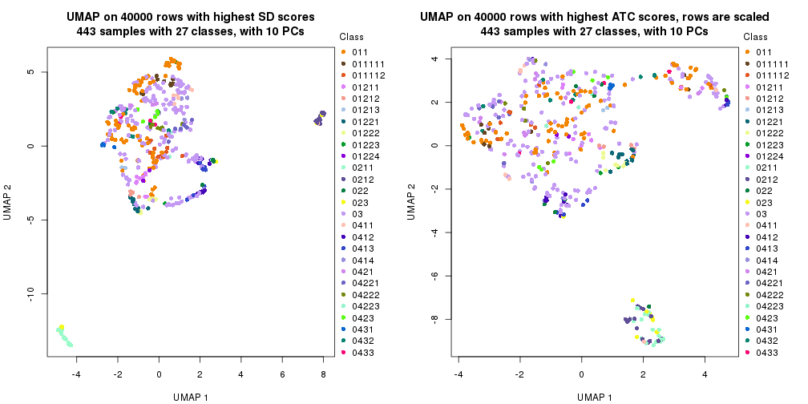</p>

</div>
<div id='tab-dimension-reduction-by-depth-4'>
<pre><code class="r">par(mfrow = c(1, 2))
dimension_reduction(res_rh, merge_node = merge_node_param(min_n_signatures = 3038),
    method = &quot;UMAP&quot;, top_value_method = &quot;SD&quot;, top_n = 40000, scale_rows = FALSE)
dimension_reduction(res_rh, merge_node = merge_node_param(min_n_signatures = 3038),
    method = &quot;UMAP&quot;, top_value_method = &quot;ATC&quot;, top_n = 40000, scale_rows = TRUE)
</code></pre>

<p></p>

</div>
<div id='tab-dimension-reduction-by-depth-5'>
<pre><code class="r">par(mfrow = c(1, 2))
dimension_reduction(res_rh, merge_node = merge_node_param(min_n_signatures = 3867),
    method = &quot;UMAP&quot;, top_value_method = &quot;SD&quot;, top_n = 40000, scale_rows = FALSE)
dimension_reduction(res_rh, merge_node = merge_node_param(min_n_signatures = 3867),
    method = &quot;UMAP&quot;, top_value_method = &quot;ATC&quot;, top_n = 40000, scale_rows = TRUE)
</code></pre>

<p></p>

</div>
<div id='tab-dimension-reduction-by-depth-6'>
<pre><code class="r">par(mfrow = c(1, 2))
dimension_reduction(res_rh, merge_node = merge_node_param(min_n_signatures = 3913),
    method = &quot;UMAP&quot;, top_value_method = &quot;SD&quot;, top_n = 40000, scale_rows = FALSE)
dimension_reduction(res_rh, merge_node = merge_node_param(min_n_signatures = 3913),
    method = &quot;UMAP&quot;, top_value_method = &quot;ATC&quot;, top_n = 40000, scale_rows = TRUE)
</code></pre>

<p></p>

</div>
<div id='tab-dimension-reduction-by-depth-7'>
<pre><code class="r">par(mfrow = c(1, 2))
dimension_reduction(res_rh, merge_node = merge_node_param(min_n_signatures = 4047),
    method = &quot;UMAP&quot;, top_value_method = &quot;SD&quot;, top_n = 40000, scale_rows = FALSE)
dimension_reduction(res_rh, merge_node = merge_node_param(min_n_signatures = 4047),
    method = &quot;UMAP&quot;, top_value_method = &quot;ATC&quot;, top_n = 40000, scale_rows = TRUE)
</code></pre>

<p></p>

</div>
<div id='tab-dimension-reduction-by-depth-8'>
<pre><code class="r">par(mfrow = c(1, 2))
dimension_reduction(res_rh, merge_node = merge_node_param(min_n_signatures = 5229),
    method = &quot;UMAP&quot;, top_value_method = &quot;SD&quot;, top_n = 40000, scale_rows = FALSE)
dimension_reduction(res_rh, merge_node = merge_node_param(min_n_signatures = 5229),
    method = &quot;UMAP&quot;, top_value_method = &quot;ATC&quot;, top_n = 40000, scale_rows = TRUE)
</code></pre>

<p></p>

</div>
<div id='tab-dimension-reduction-by-depth-9'>
<pre><code class="r">par(mfrow = c(1, 2))
dimension_reduction(res_rh, merge_node = merge_node_param(min_n_signatures = 5533),
    method = &quot;UMAP&quot;, top_value_method = &quot;SD&quot;, top_n = 40000, scale_rows = FALSE)
dimension_reduction(res_rh, merge_node = merge_node_param(min_n_signatures = 5533),
    method = &quot;UMAP&quot;, top_value_method = &quot;ATC&quot;, top_n = 40000, scale_rows = TRUE)
</code></pre>

<p></p>

</div>
<div id='tab-dimension-reduction-by-depth-10'>
<pre><code class="r">par(mfrow = c(1, 2))
dimension_reduction(res_rh, merge_node = merge_node_param(min_n_signatures = 5908),
    method = &quot;UMAP&quot;, top_value_method = &quot;SD&quot;, top_n = 40000, scale_rows = FALSE)
dimension_reduction(res_rh, merge_node = merge_node_param(min_n_signatures = 5908),
    method = &quot;UMAP&quot;, top_value_method = &quot;ATC&quot;, top_n = 40000, scale_rows = TRUE)
</code></pre>

<p></p>

</div>
<div id='tab-dimension-reduction-by-depth-11'>
<pre><code class="r">par(mfrow = c(1, 2))
dimension_reduction(res_rh, merge_node = merge_node_param(min_n_signatures = 7485),
    method = &quot;UMAP&quot;, top_value_method = &quot;SD&quot;, top_n = 40000, scale_rows = FALSE)
dimension_reduction(res_rh, merge_node = merge_node_param(min_n_signatures = 7485),
    method = &quot;UMAP&quot;, top_value_method = &quot;ATC&quot;, top_n = 40000, scale_rows = TRUE)
</code></pre>

<p></p>

</div>
<div id='tab-dimension-reduction-by-depth-12'>
<pre><code class="r">par(mfrow = c(1, 2))
dimension_reduction(res_rh, merge_node = merge_node_param(min_n_signatures = 7743),
    method = &quot;UMAP&quot;, top_value_method = &quot;SD&quot;, top_n = 40000, scale_rows = FALSE)
dimension_reduction(res_rh, merge_node = merge_node_param(min_n_signatures = 7743),
    method = &quot;UMAP&quot;, top_value_method = &quot;ATC&quot;, top_n = 40000, scale_rows = TRUE)
</code></pre>

<p></p>

</div>
<div id='tab-dimension-reduction-by-depth-13'>
<pre><code class="r">par(mfrow = c(1, 2))
dimension_reduction(res_rh, merge_node = merge_node_param(min_n_signatures = 8434),
    method = &quot;UMAP&quot;, top_value_method = &quot;SD&quot;, top_n = 40000, scale_rows = FALSE)
dimension_reduction(res_rh, merge_node = merge_node_param(min_n_signatures = 8434),
    method = &quot;UMAP&quot;, top_value_method = &quot;ATC&quot;, top_n = 40000, scale_rows = TRUE)
</code></pre>

<p></p>

</div>
<div id='tab-dimension-reduction-by-depth-14'>
<pre><code class="r">par(mfrow = c(1, 2))
dimension_reduction(res_rh, merge_node = merge_node_param(min_n_signatures = 9343),
    method = &quot;UMAP&quot;, top_value_method = &quot;SD&quot;, top_n = 40000, scale_rows = FALSE)
dimension_reduction(res_rh, merge_node = merge_node_param(min_n_signatures = 9343),
    method = &quot;UMAP&quot;, top_value_method = &quot;ATC&quot;, top_n = 40000, scale_rows = TRUE)
</code></pre>

<p></p>

</div>
<div id='tab-dimension-reduction-by-depth-15'>
<pre><code class="r">par(mfrow = c(1, 2))
dimension_reduction(res_rh, merge_node = merge_node_param(min_n_signatures = 10997),
    method = &quot;UMAP&quot;, top_value_method = &quot;SD&quot;, top_n = 40000, scale_rows = FALSE)
dimension_reduction(res_rh, merge_node = merge_node_param(min_n_signatures = 10997),
    method = &quot;UMAP&quot;, top_value_method = &quot;ATC&quot;, top_n = 40000, scale_rows = TRUE)
</code></pre>

<p></p>

</div>
<div id='tab-dimension-reduction-by-depth-16'>
<pre><code class="r">par(mfrow = c(1, 2))
dimension_reduction(res_rh, merge_node = merge_node_param(min_n_signatures = 17456),
    method = &quot;UMAP&quot;, top_value_method = &quot;SD&quot;, top_n = 40000, scale_rows = FALSE)
dimension_reduction(res_rh, merge_node = merge_node_param(min_n_signatures = 17456),
    method = &quot;UMAP&quot;, top_value_method = &quot;ATC&quot;, top_n = 40000, scale_rows = TRUE)
</code></pre>

<p></p>

</div>
<div id='tab-dimension-reduction-by-depth-17'>
<pre><code class="r">par(mfrow = c(1, 2))
dimension_reduction(res_rh, merge_node = merge_node_param(min_n_signatures = 34264),
    method = &quot;UMAP&quot;, top_value_method = &quot;SD&quot;, top_n = 40000, scale_rows = FALSE)
dimension_reduction(res_rh, merge_node = merge_node_param(min_n_signatures = 34264),
    method = &quot;UMAP&quot;, top_value_method = &quot;ATC&quot;, top_n = 40000, scale_rows = TRUE)
</code></pre>

<p></p>

</div>
</div>


### Signature heatmap

Signatures on the heatmap are the union of all signatures found on every node
on the hierarchy. The number of k-means on rows are automatically selected by the function.


<script>
$( function() {
	$( '#tabs-get-signatures-from-hierarchical-partition' ).tabs();
} );
</script>
<div id='tabs-get-signatures-from-hierarchical-partition'>
<ul>
<li><a href='#tab-get-signatures-from-hierarchical-partition-1'>n_signatures ≥ 1359</a></li>
<li><a href='#tab-get-signatures-from-hierarchical-partition-2'>n_signatures ≥ 1530</a></li>
<li><a href='#tab-get-signatures-from-hierarchical-partition-3'>n_signatures ≥ 1543</a></li>
<li><a href='#tab-get-signatures-from-hierarchical-partition-4'>n_signatures ≥ 3038</a></li>
<li><a href='#tab-get-signatures-from-hierarchical-partition-5'>n_signatures ≥ 3867</a></li>
<li><a href='#tab-get-signatures-from-hierarchical-partition-6'>n_signatures ≥ 3913</a></li>
<li><a href='#tab-get-signatures-from-hierarchical-partition-7'>n_signatures ≥ 4047</a></li>
<li><a href='#tab-get-signatures-from-hierarchical-partition-8'>n_signatures ≥ 5229</a></li>
<li><a href='#tab-get-signatures-from-hierarchical-partition-9'>n_signatures ≥ 5533</a></li>
<li><a href='#tab-get-signatures-from-hierarchical-partition-10'>n_signatures ≥ 5908</a></li>
<li><a href='#tab-get-signatures-from-hierarchical-partition-11'>n_signatures ≥ 7485</a></li>
<li><a href='#tab-get-signatures-from-hierarchical-partition-12'>n_signatures ≥ 7743</a></li>
<li><a href='#tab-get-signatures-from-hierarchical-partition-13'>n_signatures ≥ 8434</a></li>
<li><a href='#tab-get-signatures-from-hierarchical-partition-14'>n_signatures ≥ 9343</a></li>
<li><a href='#tab-get-signatures-from-hierarchical-partition-15'>n_signatures ≥ 10997</a></li>
<li><a href='#tab-get-signatures-from-hierarchical-partition-16'>n_signatures ≥ 17456</a></li>
<li><a href='#tab-get-signatures-from-hierarchical-partition-17'>n_signatures ≥ 34264</a></li>
</ul>
<div id='tab-get-signatures-from-hierarchical-partition-1'>
<pre><code class="r">get_signatures(res_rh, merge_node = merge_node_param(min_n_signatures = 1359))
</code></pre>

<p>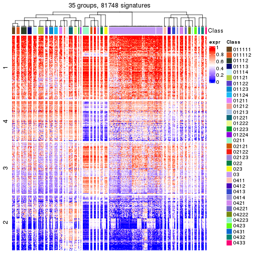</p>

</div>
<div id='tab-get-signatures-from-hierarchical-partition-2'>
<pre><code class="r">get_signatures(res_rh, merge_node = merge_node_param(min_n_signatures = 1530))
</code></pre>

<p></p>

</div>
<div id='tab-get-signatures-from-hierarchical-partition-3'>
<pre><code class="r">get_signatures(res_rh, merge_node = merge_node_param(min_n_signatures = 1543))
</code></pre>

<pre><code>#&gt; Error in lt[[hierarchy[i, 1]]]$AddChildNode({: attempt to apply non-function
</code></pre>

</div>
<div id='tab-get-signatures-from-hierarchical-partition-4'>
<pre><code class="r">get_signatures(res_rh, merge_node = merge_node_param(min_n_signatures = 3038))
</code></pre>

<pre><code>#&gt; Error in lt[[hierarchy[i, 1]]]$AddChildNode({: attempt to apply non-function
</code></pre>

</div>
<div id='tab-get-signatures-from-hierarchical-partition-5'>
<pre><code class="r">get_signatures(res_rh, merge_node = merge_node_param(min_n_signatures = 3867))
</code></pre>

<p></p>

</div>
<div id='tab-get-signatures-from-hierarchical-partition-6'>
<pre><code class="r">get_signatures(res_rh, merge_node = merge_node_param(min_n_signatures = 3913))
</code></pre>

<p></p>

</div>
<div id='tab-get-signatures-from-hierarchical-partition-7'>
<pre><code class="r">get_signatures(res_rh, merge_node = merge_node_param(min_n_signatures = 4047))
</code></pre>

<p></p>

</div>
<div id='tab-get-signatures-from-hierarchical-partition-8'>
<pre><code class="r">get_signatures(res_rh, merge_node = merge_node_param(min_n_signatures = 5229))
</code></pre>

<p></p>

</div>
<div id='tab-get-signatures-from-hierarchical-partition-9'>
<pre><code class="r">get_signatures(res_rh, merge_node = merge_node_param(min_n_signatures = 5533))
</code></pre>

<p></p>

</div>
<div id='tab-get-signatures-from-hierarchical-partition-10'>
<pre><code class="r">get_signatures(res_rh, merge_node = merge_node_param(min_n_signatures = 5908))
</code></pre>

<p></p>

</div>
<div id='tab-get-signatures-from-hierarchical-partition-11'>
<pre><code class="r">get_signatures(res_rh, merge_node = merge_node_param(min_n_signatures = 7485))
</code></pre>

<p></p>

</div>
<div id='tab-get-signatures-from-hierarchical-partition-12'>
<pre><code class="r">get_signatures(res_rh, merge_node = merge_node_param(min_n_signatures = 7743))
</code></pre>

<p></p>

</div>
<div id='tab-get-signatures-from-hierarchical-partition-13'>
<pre><code class="r">get_signatures(res_rh, merge_node = merge_node_param(min_n_signatures = 8434))
</code></pre>

<p></p>

</div>
<div id='tab-get-signatures-from-hierarchical-partition-14'>
<pre><code class="r">get_signatures(res_rh, merge_node = merge_node_param(min_n_signatures = 9343))
</code></pre>

<p></p>

</div>
<div id='tab-get-signatures-from-hierarchical-partition-15'>
<pre><code class="r">get_signatures(res_rh, merge_node = merge_node_param(min_n_signatures = 10997))
</code></pre>

<p></p>

</div>
<div id='tab-get-signatures-from-hierarchical-partition-16'>
<pre><code class="r">get_signatures(res_rh, merge_node = merge_node_param(min_n_signatures = 17456))
</code></pre>

<p></p>

</div>
<div id='tab-get-signatures-from-hierarchical-partition-17'>
<pre><code class="r">get_signatures(res_rh, merge_node = merge_node_param(min_n_signatures = 34264))
</code></pre>

<p></p>

</div>
</div>


Compare signatures from different nodes:


```r
compare_signatures(res_rh, verbose = FALSE)
```


If there are too many signatures, `top_signatures = ...` can be set to only show the 
signatures with the highest FDRs. Note it only works on every node and the final signatures
are the union of all signatures of all nodes.


```r
# code only for demonstration
# e.g. to show the top 500 most significant rows on each node.
tb = get_signature(res_rh, top_signatures = 500)
```


## Results for each node


---------------------------------------------------


### Node0


Child nodes: 
                [Node01](#Node01)
        ,
                [Node02](#Node02)
        ,
                Node03-leaf
        ,
                [Node04](#Node04)
        .


The object with results only for a single top-value method and a single partitioning method 
can be extracted as:

```r
res = res_rh["0"]
```

A summary of `res` and all the functions that can be applied to it:

```r
res
```

```
#> A 'ConsensusPartition' object with k = 2, 3, 4, 5, 6, 7, 8.
#>   On a matrix with 30000 rows and 443 columns.
#>   Top rows (1000) are extracted by 'ATC' method.
#>   Subgroups are detected by 'kmeans' method.
#>   Performed in total 350 partitions by row resampling.
#>   Best k for subgroups seems to be 4.
#> 
#> Following methods can be applied to this 'ConsensusPartition' object:
#>  [1] "cola_report"             "collect_classes"         "collect_plots"          
#>  [4] "collect_stats"           "colnames"                "compare_partitions"     
#>  [7] "compare_signatures"      "consensus_heatmap"       "dimension_reduction"    
#> [10] "functional_enrichment"   "get_anno_col"            "get_anno"               
#> [13] "get_classes"             "get_consensus"           "get_matrix"             
#> [16] "get_membership"          "get_param"               "get_signatures"         
#> [19] "get_stats"               "is_best_k"               "is_stable_k"            
#> [22] "membership_heatmap"      "ncol"                    "nrow"                   
#> [25] "plot_ecdf"               "predict_classes"         "rownames"               
#> [28] "select_partition_number" "show"                    "suggest_best_k"         
#> [31] "test_to_known_factors"   "top_rows_heatmap"
```

`collect_plots()` function collects all the plots made from `res` for all `k` (number of subgroups)
into one single page to provide an easy and fast comparison between different `k`.

```r
collect_plots(res)
```


The plots are:

- The first row: a plot of the eCDF (empirical cumulative distribution
  function) curves of the consensus matrix for each `k` and the heatmap of
  predicted classes for each `k`.
- The second row: heatmaps of the consensus matrix for each `k`.
- The third row: heatmaps of the membership matrix for each `k`.
- The fouth row: heatmaps of the signatures for each `k`.

All the plots in panels can be made by individual functions and they are
plotted later in this section.

`select_partition_number()` produces several plots showing different
statistics for choosing "optimized" `k`. There are following statistics:

- eCDF curves of the consensus matrix for each `k`;
- 1-PAC. [The PAC score](https://en.wikipedia.org/wiki/Consensus_clustering#Over-interpretation_potential_of_consensus_clustering)
  measures the proportion of the ambiguous subgrouping.
- Mean silhouette score.
- Concordance. The mean probability of fiting the consensus subgroup labels in all
  partitions.
- Area increased. Denote $A_k$ as the area under the eCDF curve for current
  `k`, the area increased is defined as $A_k - A_{k-1}$.
- Rand index. The percent of pairs of samples that are both in a same cluster
  or both are not in a same cluster in the partition of k and k-1.
- Jaccard index. The ratio of pairs of samples are both in a same cluster in
  the partition of k and k-1 and the pairs of samples are both in a same
  cluster in the partition k or k-1.

The detailed explanations of these statistics can be found in [the _cola_
vignette](https://jokergoo.github.io/cola_vignettes/cola.html#toc_13).

Generally speaking, higher 1-PAC score, higher mean silhouette score or higher
concordance corresponds to better partition. Rand index and Jaccard index
measure how similar the current partition is compared to partition with `k-1`.
If they are too similar, we won't accept `k` is better than `k-1`.

```r
select_partition_number(res)
```


The numeric values for all these statistics can be obtained by `get_stats()`.

```r
get_stats(res)
```

```
#>   k 1-PAC mean_silhouette concordance area_increased  Rand Jaccard
#> 2 2 1.000           0.990       0.996         0.4118 0.586   0.586
#> 3 3 1.000           0.981       0.993         0.5182 0.660   0.478
#> 4 4 1.000           0.983       0.993         0.1385 0.768   0.483
#> 5 5 0.783           0.798       0.898         0.0988 0.835   0.504
#> 6 6 0.728           0.613       0.801         0.0457 0.887   0.551
#> 7 7 0.771           0.653       0.806         0.0323 0.897   0.534
#> 8 8 0.818           0.795       0.859         0.0218 0.919   0.571
```

`suggest_best_k()` suggests the best $k$ based on these statistics. The rules are as follows:

- All $k$ with Jaccard index larger than 0.95 are removed because increasing
  $k$ does not provide enough extra information. If all $k$ are removed, it is
  marked as no subgroup is detected.
- For all $k$ with 1-PAC score larger than 0.9, the maximal $k$ is taken as
  the best $k$, and other $k$ are marked as optional $k$.
- If it does not fit the second rule. The $k$ with the maximal vote of the
  highest 1-PAC score, highest mean silhouette, and highest concordance is
  taken as the best $k$.

```r
suggest_best_k(res)
```

```
#> [1] 4
#> attr(,"optional")
#> [1] 2 3
```

There is also optional best $k$ = 2 3 that is worth to check.

Following is the table of the partitions (You need to click the **show/hide
code output** link to see it). The membership matrix (columns with name `p*`)
is inferred by
[`clue::cl_consensus()`](https://www.rdocumentation.org/link/cl_consensus?package=clue)
function with the `SE` method. Basically the value in the membership matrix
represents the probability to belong to a certain group. The finall subgroup
label for an item is determined with the group with highest probability it
belongs to.

In `get_classes()` function, the entropy is calculated from the membership
matrix and the silhouette score is calculated from the consensus matrix.


<script>
$( function() {
	$( '#tabs-node-0-get-classes' ).tabs();
} );
</script>
<div id='tabs-node-0-get-classes'>
<ul>
<li><a href='#tab-node-0-get-classes-1'>k = 2</a></li>
<li><a href='#tab-node-0-get-classes-2'>k = 3</a></li>
<li><a href='#tab-node-0-get-classes-3'>k = 4</a></li>
<li><a href='#tab-node-0-get-classes-4'>k = 5</a></li>
<li><a href='#tab-node-0-get-classes-5'>k = 6</a></li>
<li><a href='#tab-node-0-get-classes-6'>k = 7</a></li>
<li><a href='#tab-node-0-get-classes-7'>k = 8</a></li>
</ul>

<div id='tab-node-0-get-classes-1'>
<p><a id='tab-node-0-get-classes-1-a' style='color:#0366d6' href='#'>show/hide code output</a></p>
<pre><code class="r">cbind(get_classes(res, k = 2), get_membership(res, k = 2))
</code></pre>

<pre><code>#&gt;                 class entropy silhouette   p1   p2
#&gt; TCGA.AF.3911.01     1   0.000      0.999 1.00 0.00
#&gt; TCGA.F4.6459.01     1   0.000      0.999 1.00 0.00
#&gt; TCGA.AA.3494.11     2   0.000      0.988 0.00 1.00
#&gt; TCGA.3L.AA1B.01     1   0.000      0.999 1.00 0.00
#&gt; TCGA.D5.5538.01     1   0.000      0.999 1.00 0.00
#&gt; TCGA.F4.6854.01     1   0.000      0.999 1.00 0.00
#&gt; TCGA.AG.A026.01     1   0.000      0.999 1.00 0.00
#&gt; TCGA.G4.6303.01     1   0.000      0.999 1.00 0.00
#&gt; TCGA.F5.6464.01     1   0.000      0.999 1.00 0.00
#&gt; TCGA.T9.A92H.01     1   0.000      0.999 1.00 0.00
#&gt; TCGA.AA.3712.11     2   0.000      0.988 0.00 1.00
#&gt; TCGA.CM.5863.01     1   0.000      0.999 1.00 0.00
#&gt; TCGA.AZ.4308.01     2   0.000      0.988 0.00 1.00
#&gt; TCGA.AD.6965.01     1   0.000      0.999 1.00 0.00
#&gt; TCGA.A6.2681.11     2   0.000      0.988 0.00 1.00
#&gt; TCGA.AD.6548.01     1   0.000      0.999 1.00 0.00
#&gt; TCGA.A6.5660.01     1   0.000      0.999 1.00 0.00
#&gt; TCGA.AZ.6600.01     1   0.000      0.999 1.00 0.00
#&gt; TCGA.F4.6808.01     1   0.000      0.999 1.00 0.00
#&gt; TCGA.D5.6540.01     1   0.000      0.999 1.00 0.00
#&gt; TCGA.F5.6571.01     1   0.000      0.999 1.00 0.00
#&gt; TCGA.D5.6926.01     1   0.000      0.999 1.00 0.00
#&gt; TCGA.CM.4748.01     1   0.000      0.999 1.00 0.00
#&gt; TCGA.A6.2675.11     2   0.000      0.988 0.00 1.00
#&gt; TCGA.5M.AATE.01     1   0.000      0.999 1.00 0.00
#&gt; TCGA.D5.5541.01     2   0.000      0.988 0.00 1.00
#&gt; TCGA.CM.5862.01     1   0.000      0.999 1.00 0.00
#&gt; TCGA.AA.3511.01     1   0.000      0.999 1.00 0.00
#&gt; TCGA.AA.3663.11     2   0.000      0.988 0.00 1.00
#&gt; TCGA.CI.6622.01     1   0.000      0.999 1.00 0.00
#&gt; TCGA.EI.6506.01     1   0.000      0.999 1.00 0.00
#&gt; TCGA.AM.5821.01     1   0.000      0.999 1.00 0.00
#&gt; TCGA.F5.6812.01     2   0.000      0.988 0.00 1.00
#&gt; TCGA.G4.6588.01     1   0.000      0.999 1.00 0.00
#&gt; TCGA.EI.6512.01     1   0.000      0.999 1.00 0.00
#&gt; TCGA.A6.6648.01     2   0.000      0.988 0.00 1.00
#&gt; TCGA.A6.2671.11     2   0.000      0.988 0.00 1.00
#&gt; TCGA.NH.A6GC.01     1   0.000      0.999 1.00 0.00
#&gt; TCGA.F4.6805.01     2   0.000      0.988 0.00 1.00
#&gt; TCGA.AA.3697.01     1   0.000      0.999 1.00 0.00
#&gt; TCGA.QG.A5YX.01     1   0.000      0.999 1.00 0.00
#&gt; TCGA.DM.A28C.01     1   0.000      0.999 1.00 0.00
#&gt; TCGA.AG.A036.01     1   0.000      0.999 1.00 0.00
#&gt; TCGA.AZ.6606.01     1   0.000      0.999 1.00 0.00
#&gt; TCGA.F4.6570.01     1   0.000      0.999 1.00 0.00
#&gt; TCGA.DC.4745.01     1   0.000      0.999 1.00 0.00
#&gt; TCGA.AF.A56K.01     2   0.000      0.988 0.00 1.00
#&gt; TCGA.G4.6627.01     2   0.000      0.988 0.00 1.00
#&gt; TCGA.A6.5657.01     1   0.000      0.999 1.00 0.00
#&gt; TCGA.A6.5662.01     1   0.000      0.999 1.00 0.00
#&gt; TCGA.AA.3509.01     1   0.000      0.999 1.00 0.00
#&gt; TCGA.D5.6929.01     2   0.000      0.988 0.00 1.00
#&gt; TCGA.CM.6679.01     1   0.000      0.999 1.00 0.00
#&gt; TCGA.A6.2680.11     2   0.000      0.988 0.00 1.00
#&gt; TCGA.DC.6157.01     2   0.000      0.988 0.00 1.00
#&gt; TCGA.AF.6655.01     2   0.000      0.988 0.00 1.00
#&gt; TCGA.CM.6161.01     1   0.000      0.999 1.00 0.00
#&gt; TCGA.EI.6883.01     1   0.000      0.999 1.00 0.00
#&gt; TCGA.F5.6811.01     1   0.000      0.999 1.00 0.00
#&gt; TCGA.D5.6930.01     1   0.000      0.999 1.00 0.00
#&gt; TCGA.CM.6164.01     2   0.000      0.988 0.00 1.00
#&gt; TCGA.AF.2687.01     2   0.000      0.988 0.00 1.00
#&gt; TCGA.DY.A1H8.01     1   0.000      0.999 1.00 0.00
#&gt; TCGA.G5.6641.01     1   0.000      0.999 1.00 0.00
#&gt; TCGA.DC.6155.01     1   0.000      0.999 1.00 0.00
#&gt; TCGA.RU.A8FL.01     1   0.000      0.999 1.00 0.00
#&gt; TCGA.CK.4951.01     1   0.000      0.999 1.00 0.00
#&gt; TCGA.F4.6704.01     2   0.000      0.988 0.00 1.00
#&gt; TCGA.AZ.6599.01     1   0.000      0.999 1.00 0.00
#&gt; TCGA.F5.6861.01     1   0.000      0.999 1.00 0.00
#&gt; TCGA.CM.5860.01     1   0.000      0.999 1.00 0.00
#&gt; TCGA.A6.6780.01     1   0.000      0.999 1.00 0.00
#&gt; TCGA.A6.2686.01     1   0.000      0.999 1.00 0.00
#&gt; TCGA.CM.4750.01     1   0.000      0.999 1.00 0.00
#&gt; TCGA.CM.6677.01     1   0.000      0.999 1.00 0.00
#&gt; TCGA.A6.A567.01     2   0.000      0.988 0.00 1.00
#&gt; TCGA.F5.6814.01     1   0.000      0.999 1.00 0.00
#&gt; TCGA.D5.6898.01     1   0.000      0.999 1.00 0.00
#&gt; TCGA.AG.A01W.01     1   0.000      0.999 1.00 0.00
#&gt; TCGA.AZ.6598.11     2   0.000      0.988 0.00 1.00
#&gt; TCGA.F5.6813.01     1   0.000      0.999 1.00 0.00
#&gt; TCGA.AG.3732.01     2   0.000      0.988 0.00 1.00
#&gt; TCGA.EI.6885.01     2   0.000      0.988 0.00 1.00
#&gt; TCGA.G4.6299.01     1   0.000      0.999 1.00 0.00
#&gt; TCGA.A6.4105.01     1   0.000      0.999 1.00 0.00
#&gt; TCGA.DM.A1D8.01     1   0.000      0.999 1.00 0.00
#&gt; TCGA.DM.A285.01     1   0.000      0.999 1.00 0.00
#&gt; TCGA.G4.6295.11     2   0.000      0.988 0.00 1.00
#&gt; TCGA.DC.4749.01     1   0.000      0.999 1.00 0.00
#&gt; TCGA.DT.5265.01     1   0.000      0.999 1.00 0.00
#&gt; TCGA.5M.AAT5.01     2   0.000      0.988 0.00 1.00
#&gt; TCGA.DM.A0XD.01     1   0.000      0.999 1.00 0.00
#&gt; TCGA.A6.6138.01     1   0.000      0.999 1.00 0.00
#&gt; TCGA.D5.7000.01     1   0.000      0.999 1.00 0.00
#&gt; TCGA.DM.A28F.01     1   0.000      0.999 1.00 0.00
#&gt; TCGA.DY.A1DE.01     1   0.000      0.999 1.00 0.00
#&gt; TCGA.A6.6142.01     2   0.000      0.988 0.00 1.00
#&gt; TCGA.QL.A97D.01     1   0.000      0.999 1.00 0.00
#&gt; TCGA.CK.6748.01     1   0.000      0.999 1.00 0.00
#&gt; TCGA.DC.6160.01     2   0.000      0.988 0.00 1.00
#&gt; TCGA.D5.6534.01     2   0.000      0.988 0.00 1.00
#&gt; TCGA.AZ.4616.01     1   0.000      0.999 1.00 0.00
#&gt; TCGA.CK.6751.01     1   0.000      0.999 1.00 0.00
#&gt; TCGA.CM.6171.01     1   0.000      0.999 1.00 0.00
#&gt; TCGA.DM.A1DA.01     1   0.000      0.999 1.00 0.00
#&gt; TCGA.AG.A020.11     2   0.000      0.988 0.00 1.00
#&gt; TCGA.G4.6311.11     2   0.000      0.988 0.00 1.00
#&gt; TCGA.G4.6625.11     2   0.000      0.988 0.00 1.00
#&gt; TCGA.F5.6863.01     2   0.000      0.988 0.00 1.00
#&gt; TCGA.G4.6317.02     1   0.000      0.999 1.00 0.00
#&gt; TCGA.G4.6317.01     1   0.000      0.999 1.00 0.00
#&gt; TCGA.DM.A1D4.01     1   0.000      0.999 1.00 0.00
#&gt; TCGA.AG.A01Y.11     2   0.000      0.988 0.00 1.00
#&gt; TCGA.D5.6530.01     1   0.000      0.999 1.00 0.00
#&gt; TCGA.CK.4948.01     2   0.000      0.988 0.00 1.00
#&gt; TCGA.AD.A5EJ.01     1   0.000      0.999 1.00 0.00
#&gt; TCGA.A6.6651.01     2   0.000      0.988 0.00 1.00
#&gt; TCGA.CA.5256.01     1   0.000      0.999 1.00 0.00
#&gt; TCGA.DM.A0X9.01     1   0.000      0.999 1.00 0.00
#&gt; TCGA.AY.A69D.01     1   0.000      0.999 1.00 0.00
#&gt; TCGA.G4.6626.01     1   0.000      0.999 1.00 0.00
#&gt; TCGA.CA.6716.01     1   0.000      0.999 1.00 0.00
#&gt; TCGA.A6.2682.01     1   0.000      0.999 1.00 0.00
#&gt; TCGA.A6.4107.11     2   0.000      0.988 0.00 1.00
#&gt; TCGA.CA.6717.01     1   0.000      0.999 1.00 0.00
#&gt; TCGA.G4.6293.01     1   0.000      0.999 1.00 0.00
#&gt; TCGA.CK.5916.01     1   0.000      0.999 1.00 0.00
#&gt; TCGA.G4.6309.01     2   0.000      0.988 0.00 1.00
#&gt; TCGA.AA.3662.01     1   0.000      0.999 1.00 0.00
#&gt; TCGA.AF.A56L.01     1   0.000      0.999 1.00 0.00
#&gt; TCGA.NH.A6GB.01     1   0.000      0.999 1.00 0.00
#&gt; TCGA.AD.5900.01     1   0.000      0.999 1.00 0.00
#&gt; TCGA.NH.A50U.01     1   0.000      0.999 1.00 0.00
#&gt; TCGA.AA.3712.01     1   0.000      0.999 1.00 0.00
#&gt; TCGA.AZ.4614.01     1   0.000      0.999 1.00 0.00
#&gt; TCGA.AH.6644.01     1   0.000      0.999 1.00 0.00
#&gt; TCGA.AZ.6607.01     1   0.000      0.999 1.00 0.00
#&gt; TCGA.AF.2693.01     2   0.904      0.542 0.32 0.68
#&gt; TCGA.D5.6924.01     1   0.000      0.999 1.00 0.00
#&gt; TCGA.CM.5868.01     2   0.000      0.988 0.00 1.00
#&gt; TCGA.AF.4110.01     2   0.000      0.988 0.00 1.00
#&gt; TCGA.A6.3809.01     1   0.000      0.999 1.00 0.00
#&gt; TCGA.AZ.4313.01     2   0.000      0.988 0.00 1.00
#&gt; TCGA.A6.2675.01     2   0.000      0.988 0.00 1.00
#&gt; TCGA.AZ.6608.01     1   0.000      0.999 1.00 0.00
#&gt; TCGA.CM.5864.01     1   0.000      0.999 1.00 0.00
#&gt; TCGA.AA.3494.01     2   0.000      0.988 0.00 1.00
#&gt; TCGA.AD.6895.01     1   0.000      0.999 1.00 0.00
#&gt; TCGA.CI.6620.01     1   0.000      0.999 1.00 0.00
#&gt; TCGA.DC.6156.01     1   0.000      0.999 1.00 0.00
#&gt; TCGA.D5.6931.01     1   0.000      0.999 1.00 0.00
#&gt; TCGA.CM.6165.01     1   0.000      0.999 1.00 0.00
#&gt; TCGA.CM.5861.01     1   0.000      0.999 1.00 0.00
#&gt; TCGA.A6.2671.01     1   0.000      0.999 1.00 0.00
#&gt; TCGA.DC.6158.01     1   0.000      0.999 1.00 0.00
#&gt; TCGA.AG.3742.01     1   0.000      0.999 1.00 0.00
#&gt; TCGA.AG.A02N.11     2   0.000      0.988 0.00 1.00
#&gt; TCGA.G4.6307.01     2   0.000      0.988 0.00 1.00
#&gt; TCGA.A6.5666.01     1   0.000      0.999 1.00 0.00
#&gt; TCGA.EI.6511.01     1   0.000      0.999 1.00 0.00
#&gt; TCGA.CI.6624.01     2   0.000      0.988 0.00 1.00
#&gt; TCGA.AG.3591.01     1   0.000      0.999 1.00 0.00
#&gt; TCGA.AY.A8YK.01     2   0.000      0.988 0.00 1.00
#&gt; TCGA.F4.6856.01     1   0.000      0.999 1.00 0.00
#&gt; TCGA.DM.A1D7.01     1   0.000      0.999 1.00 0.00
#&gt; TCGA.A6.2685.01     2   0.000      0.988 0.00 1.00
#&gt; TCGA.5M.AAT6.01     2   0.000      0.988 0.00 1.00
#&gt; TCGA.AH.6643.01     1   0.000      0.999 1.00 0.00
#&gt; TCGA.F4.6569.01     1   0.000      0.999 1.00 0.00
#&gt; TCGA.G4.6298.01     1   0.000      0.999 1.00 0.00
#&gt; TCGA.AY.6196.01     1   0.000      0.999 1.00 0.00
#&gt; TCGA.EI.6510.01     1   0.000      0.999 1.00 0.00
#&gt; TCGA.A6.5656.01     1   0.000      0.999 1.00 0.00
#&gt; TCGA.A6.2684.11     2   0.000      0.988 0.00 1.00
#&gt; TCGA.DY.A1DG.01     1   0.000      0.999 1.00 0.00
#&gt; TCGA.AZ.4682.01     1   0.000      0.999 1.00 0.00
#&gt; TCGA.EI.6884.01     1   0.000      0.999 1.00 0.00
#&gt; TCGA.F4.6806.01     1   0.000      0.999 1.00 0.00
#&gt; TCGA.G4.6320.11     2   0.000      0.988 0.00 1.00
#&gt; TCGA.G4.6322.01     1   0.000      0.999 1.00 0.00
#&gt; TCGA.F5.6810.01     2   0.000      0.988 0.00 1.00
#&gt; TCGA.5M.AAT4.01     1   0.000      0.999 1.00 0.00
#&gt; TCGA.CL.4957.01     1   0.000      0.999 1.00 0.00
#&gt; TCGA.DC.6681.01     1   0.000      0.999 1.00 0.00
#&gt; TCGA.CM.6167.01     2   0.000      0.988 0.00 1.00
#&gt; TCGA.AG.4022.01     1   0.000      0.999 1.00 0.00
#&gt; TCGA.G4.6586.01     1   0.000      0.999 1.00 0.00
#&gt; TCGA.EI.6514.01     1   0.000      0.999 1.00 0.00
#&gt; TCGA.CK.4950.01     1   0.000      0.999 1.00 0.00
#&gt; TCGA.DM.A282.01     1   0.000      0.999 1.00 0.00
#&gt; TCGA.DY.A1DC.01     1   0.000      0.999 1.00 0.00
#&gt; TCGA.D5.6535.01     1   0.000      0.999 1.00 0.00
#&gt; TCGA.DM.A1HA.01     1   0.000      0.999 1.00 0.00
#&gt; TCGA.DC.5869.01     1   0.000      0.999 1.00 0.00
#&gt; TCGA.AZ.6599.11     2   0.000      0.988 0.00 1.00
#&gt; TCGA.CM.4752.01     2   0.000      0.988 0.00 1.00
#&gt; TCGA.AZ.4684.01     1   0.000      0.999 1.00 0.00
#&gt; TCGA.EI.7004.01     1   0.000      0.999 1.00 0.00
#&gt; TCGA.A6.A565.01     2   0.000      0.988 0.00 1.00
#&gt; TCGA.D5.6531.01     1   0.000      0.999 1.00 0.00
#&gt; TCGA.AZ.6598.01     1   0.000      0.999 1.00 0.00
#&gt; TCGA.AD.6890.01     1   0.000      0.999 1.00 0.00
#&gt; TCGA.AG.4021.01     1   0.000      0.999 1.00 0.00
#&gt; TCGA.A6.6781.01     2   0.000      0.988 0.00 1.00
#&gt; TCGA.DM.A1D9.01     1   0.000      0.999 1.00 0.00
#&gt; TCGA.CM.4744.01     1   0.000      0.999 1.00 0.00
#&gt; TCGA.A6.2679.11     2   0.000      0.988 0.00 1.00
#&gt; TCGA.A6.6652.01     1   0.000      0.999 1.00 0.00
#&gt; TCGA.AD.6964.01     2   0.000      0.988 0.00 1.00
#&gt; TCGA.SS.A7HO.01     1   0.000      0.999 1.00 0.00
#&gt; TCGA.A6.6650.01     1   0.000      0.999 1.00 0.00
#&gt; TCGA.DM.A0XF.01     2   0.881      0.582 0.30 0.70
#&gt; TCGA.G4.6295.01     2   0.000      0.988 0.00 1.00
#&gt; TCGA.F4.6461.01     1   0.000      0.999 1.00 0.00
#&gt; TCGA.AM.5820.01     1   0.000      0.999 1.00 0.00
#&gt; TCGA.G4.6314.11     2   0.000      0.988 0.00 1.00
#&gt; TCGA.AD.6889.01     1   0.000      0.999 1.00 0.00
#&gt; TCGA.AZ.6605.01     1   0.000      0.999 1.00 0.00
#&gt; TCGA.EI.6881.01     1   0.000      0.999 1.00 0.00
#&gt; TCGA.NH.A50T.01     1   0.000      0.999 1.00 0.00
#&gt; TCGA.AG.3725.11     2   0.000      0.988 0.00 1.00
#&gt; TCGA.G4.6323.01     1   0.000      0.999 1.00 0.00
#&gt; TCGA.AA.3663.01     1   0.000      0.999 1.00 0.00
#&gt; TCGA.AD.6899.01     1   0.000      0.999 1.00 0.00
#&gt; TCGA.A6.5667.11     2   0.000      0.988 0.00 1.00
#&gt; TCGA.A6.A56B.01     1   0.000      0.999 1.00 0.00
#&gt; TCGA.G5.6572.01     2   0.958      0.402 0.38 0.62
#&gt; TCGA.DM.A280.01     2   0.760      0.722 0.22 0.78
#&gt; TCGA.AG.A020.01     1   0.000      0.999 1.00 0.00
#&gt; TCGA.AA.3713.01     1   0.000      0.999 1.00 0.00
#&gt; TCGA.D5.5539.01     1   0.000      0.999 1.00 0.00
#&gt; TCGA.AA.3655.11     2   0.000      0.988 0.00 1.00
#&gt; TCGA.AA.3489.01     2   0.000      0.988 0.00 1.00
#&gt; TCGA.AA.3495.01     1   0.000      0.999 1.00 0.00
#&gt; TCGA.AG.A01Y.01     2   0.000      0.988 0.00 1.00
#&gt; TCGA.AZ.6601.01     1   0.000      0.999 1.00 0.00
#&gt; TCGA.AH.6903.01     1   0.000      0.999 1.00 0.00
#&gt; TCGA.AZ.6603.01     2   0.000      0.988 0.00 1.00
#&gt; TCGA.CA.5254.01     1   0.000      0.999 1.00 0.00
#&gt; TCGA.A6.A5ZU.01     1   0.000      0.999 1.00 0.00
#&gt; TCGA.G4.6302.01     2   0.000      0.988 0.00 1.00
#&gt; TCGA.AZ.5403.01     2   0.000      0.988 0.00 1.00
#&gt; TCGA.AY.A54L.01     1   0.000      0.999 1.00 0.00
#&gt; TCGA.A6.4107.01     1   0.000      0.999 1.00 0.00
#&gt; TCGA.NH.A5IV.01     1   0.000      0.999 1.00 0.00
#&gt; TCGA.G4.6306.01     1   0.000      0.999 1.00 0.00
#&gt; TCGA.AD.A5EK.01     1   0.000      0.999 1.00 0.00
#&gt; TCGA.G5.6235.01     2   0.000      0.988 0.00 1.00
#&gt; TCGA.DC.5337.01     1   0.000      0.999 1.00 0.00
#&gt; TCGA.CM.6675.01     1   0.000      0.999 1.00 0.00
#&gt; TCGA.AH.6544.01     1   0.000      0.999 1.00 0.00
#&gt; TCGA.CK.6746.01     1   0.000      0.999 1.00 0.00
#&gt; TCGA.CA.6718.01     1   0.000      0.999 1.00 0.00
#&gt; TCGA.CI.6621.01     2   0.000      0.988 0.00 1.00
#&gt; TCGA.CM.6676.01     1   0.000      0.999 1.00 0.00
#&gt; TCGA.DM.A1DB.01     1   0.000      0.999 1.00 0.00
#&gt; TCGA.A6.6654.01     1   0.000      0.999 1.00 0.00
#&gt; TCGA.AA.3510.11     2   0.000      0.988 0.00 1.00
#&gt; TCGA.CA.6715.01     1   0.000      0.999 1.00 0.00
#&gt; TCGA.CM.5341.01     1   0.000      0.999 1.00 0.00
#&gt; TCGA.CK.5912.01     1   0.000      0.999 1.00 0.00
#&gt; TCGA.F4.6857.01     2   0.000      0.988 0.00 1.00
#&gt; TCGA.QG.A5YW.01     1   0.000      0.999 1.00 0.00
#&gt; TCGA.A6.5665.01     1   0.000      0.999 1.00 0.00
#&gt; TCGA.CM.6168.01     1   0.000      0.999 1.00 0.00
#&gt; TCGA.CL.5917.01     1   0.000      0.999 1.00 0.00
#&gt; TCGA.AU.6004.01     1   0.000      0.999 1.00 0.00
#&gt; TCGA.AY.5543.01     1   0.000      0.999 1.00 0.00
#&gt; TCGA.AG.3731.01     1   0.000      0.999 1.00 0.00
#&gt; TCGA.G4.6314.01     1   0.000      0.999 1.00 0.00
#&gt; TCGA.DC.6683.01     1   0.000      0.999 1.00 0.00
#&gt; TCGA.CA.5796.01     1   0.000      0.999 1.00 0.00
#&gt; TCGA.AG.A036.11     2   0.000      0.988 0.00 1.00
#&gt; TCGA.AZ.4323.01     2   0.000      0.988 0.00 1.00
#&gt; TCGA.EI.6882.01     1   0.000      0.999 1.00 0.00
#&gt; TCGA.AZ.4315.01     1   0.000      0.999 1.00 0.00
#&gt; TCGA.A6.2677.01     1   0.000      0.999 1.00 0.00
#&gt; TCGA.DY.A1DF.01     1   0.000      0.999 1.00 0.00
#&gt; TCGA.CM.6162.01     2   0.000      0.988 0.00 1.00
#&gt; TCGA.F4.6703.01     2   0.000      0.988 0.00 1.00
#&gt; TCGA.CM.5349.01     1   0.000      0.999 1.00 0.00
#&gt; TCGA.AG.A02N.01     1   0.000      0.999 1.00 0.00
#&gt; TCGA.AA.3506.01     1   0.000      0.999 1.00 0.00
#&gt; TCGA.D5.6932.01     1   0.000      0.999 1.00 0.00
#&gt; TCGA.D5.6538.01     1   0.000      0.999 1.00 0.00
#&gt; TCGA.AA.3488.11     2   0.000      0.988 0.00 1.00
#&gt; TCGA.AA.3502.01     1   0.000      0.999 1.00 0.00
#&gt; TCGA.NH.A8F8.01     1   0.000      0.999 1.00 0.00
#&gt; TCGA.AF.A56N.01     1   0.000      0.999 1.00 0.00
#&gt; TCGA.AF.6672.01     2   0.000      0.988 0.00 1.00
#&gt; TCGA.A6.2685.11     2   0.000      0.988 0.00 1.00
#&gt; TCGA.A6.6141.01     1   0.000      0.999 1.00 0.00
#&gt; TCGA.AD.6963.01     2   0.000      0.988 0.00 1.00
#&gt; TCGA.G4.6298.11     2   0.000      0.988 0.00 1.00
#&gt; TCGA.EI.6917.01     1   0.000      0.999 1.00 0.00
#&gt; TCGA.QG.A5Z2.01     1   0.000      0.999 1.00 0.00
#&gt; TCGA.A6.2684.01     1   0.000      0.999 1.00 0.00
#&gt; TCGA.CK.5915.01     1   0.000      0.999 1.00 0.00
#&gt; TCGA.CM.6163.01     1   0.000      0.999 1.00 0.00
#&gt; TCGA.G4.6322.11     2   0.000      0.988 0.00 1.00
#&gt; TCGA.AY.6197.01     1   0.000      0.999 1.00 0.00
#&gt; TCGA.D5.6928.01     2   0.000      0.988 0.00 1.00
#&gt; TCGA.A6.3810.01     2   0.000      0.988 0.00 1.00
#&gt; TCGA.G4.6294.01     1   0.000      0.999 1.00 0.00
#&gt; TCGA.AA.3660.11     2   0.000      0.988 0.00 1.00
#&gt; TCGA.A6.6137.01     1   0.000      0.999 1.00 0.00
#&gt; TCGA.G4.6297.11     2   0.000      0.988 0.00 1.00
#&gt; TCGA.AZ.4615.01     1   0.000      0.999 1.00 0.00
#&gt; TCGA.CK.4952.01     1   0.000      0.999 1.00 0.00
#&gt; TCGA.CM.6172.01     1   0.000      0.999 1.00 0.00
#&gt; TCGA.AD.6901.01     1   0.000      0.999 1.00 0.00
#&gt; TCGA.AA.3496.01     1   0.000      0.999 1.00 0.00
#&gt; TCGA.CK.5913.01     1   0.000      0.999 1.00 0.00
#&gt; TCGA.DM.A28A.01     1   0.000      0.999 1.00 0.00
#&gt; TCGA.EI.7002.01     1   0.000      0.999 1.00 0.00
#&gt; TCGA.D5.6533.01     1   0.000      0.999 1.00 0.00
#&gt; TCGA.QG.A5Z1.01     1   0.000      0.999 1.00 0.00
#&gt; TCGA.D5.6923.01     2   0.000      0.988 0.00 1.00
#&gt; TCGA.AF.2690.01     2   0.000      0.988 0.00 1.00
#&gt; TCGA.DM.A28H.01     1   0.000      0.999 1.00 0.00
#&gt; TCGA.G4.6320.01     1   0.000      0.999 1.00 0.00
#&gt; TCGA.G4.6310.01     1   0.000      0.999 1.00 0.00
#&gt; TCGA.DM.A28M.01     1   0.000      0.999 1.00 0.00
#&gt; TCGA.DM.A288.01     1   0.000      0.999 1.00 0.00
#&gt; TCGA.A6.2681.01     1   0.000      0.999 1.00 0.00
#&gt; TCGA.A6.2679.01     1   0.000      0.999 1.00 0.00
#&gt; TCGA.4N.A93T.01     1   0.000      0.999 1.00 0.00
#&gt; TCGA.NH.A8F7.06     1   0.000      0.999 1.00 0.00
#&gt; TCGA.NH.A8F7.01     1   0.000      0.999 1.00 0.00
#&gt; TCGA.AZ.6600.11     2   0.000      0.988 0.00 1.00
#&gt; TCGA.G5.6572.02     2   0.000      0.988 0.00 1.00
#&gt; TCGA.AY.6386.01     1   0.000      0.999 1.00 0.00
#&gt; TCGA.G4.6628.01     1   0.000      0.999 1.00 0.00
#&gt; TCGA.A6.6653.01     1   0.000      0.999 1.00 0.00
#&gt; TCGA.CM.4746.01     1   0.000      0.999 1.00 0.00
#&gt; TCGA.F4.6855.01     1   0.000      0.999 1.00 0.00
#&gt; TCGA.EF.5830.01     1   0.000      0.999 1.00 0.00
#&gt; TCGA.NH.A6GA.01     1   0.000      0.999 1.00 0.00
#&gt; TCGA.NH.A50V.01     1   0.000      0.999 1.00 0.00
#&gt; TCGA.DY.A0XA.01     2   0.000      0.988 0.00 1.00
#&gt; TCGA.DM.A28E.01     1   0.000      0.999 1.00 0.00
#&gt; TCGA.AG.3725.01     1   0.000      0.999 1.00 0.00
#&gt; TCGA.CK.6747.01     1   0.000      0.999 1.00 0.00
#&gt; TCGA.CL.5918.01     1   0.000      0.999 1.00 0.00
#&gt; TCGA.CI.6623.01     2   0.000      0.988 0.00 1.00
#&gt; TCGA.A6.5667.01     1   0.000      0.999 1.00 0.00
#&gt; TCGA.DM.A28K.01     1   0.000      0.999 1.00 0.00
#&gt; TCGA.AA.3713.11     2   0.000      0.988 0.00 1.00
#&gt; TCGA.AA.3655.01     1   0.000      0.999 1.00 0.00
#&gt; TCGA.AU.3779.01     2   0.904      0.542 0.32 0.68
#&gt; TCGA.A6.5664.01     1   0.000      0.999 1.00 0.00
#&gt; TCGA.AA.3697.11     2   0.000      0.988 0.00 1.00
#&gt; TCGA.AZ.5407.01     1   0.000      0.999 1.00 0.00
#&gt; TCGA.CM.6169.01     1   0.000      0.999 1.00 0.00
#&gt; TCGA.AH.6547.01     2   0.000      0.988 0.00 1.00
#&gt; TCGA.AZ.6601.11     2   0.000      0.988 0.00 1.00
#&gt; TCGA.A6.5661.01     1   0.000      0.999 1.00 0.00
#&gt; TCGA.F4.6807.01     1   0.000      0.999 1.00 0.00
#&gt; TCGA.QG.A5YV.01     1   0.000      0.999 1.00 0.00
#&gt; TCGA.AA.3509.11     2   0.000      0.988 0.00 1.00
#&gt; TCGA.AY.A71X.01     1   0.000      0.999 1.00 0.00
#&gt; TCGA.CA.5797.01     2   0.000      0.988 0.00 1.00
#&gt; TCGA.F4.6460.01     2   0.000      0.988 0.00 1.00
#&gt; TCGA.G4.6302.11     2   0.000      0.988 0.00 1.00
#&gt; TCGA.F5.6702.01     2   0.000      0.988 0.00 1.00
#&gt; TCGA.AH.6549.01     1   0.000      0.999 1.00 0.00
#&gt; TCGA.D5.6927.01     2   0.000      0.988 0.00 1.00
#&gt; TCGA.CM.6166.01     1   0.000      0.999 1.00 0.00
#&gt; TCGA.AH.6897.01     1   0.000      0.999 1.00 0.00
#&gt; TCGA.G4.6304.01     2   0.000      0.988 0.00 1.00
#&gt; TCGA.CA.5255.01     1   0.000      0.999 1.00 0.00
#&gt; TCGA.EI.6507.01     1   0.000      0.999 1.00 0.00
#&gt; TCGA.CK.4947.01     1   0.000      0.999 1.00 0.00
#&gt; TCGA.D5.5540.01     1   0.000      0.999 1.00 0.00
#&gt; TCGA.DC.6682.01     1   0.000      0.999 1.00 0.00
#&gt; TCGA.G4.6321.01     1   0.000      0.999 1.00 0.00
#&gt; TCGA.A6.6649.01     1   0.000      0.999 1.00 0.00
#&gt; TCGA.CM.5348.01     1   0.000      0.999 1.00 0.00
#&gt; TCGA.EI.6513.01     2   0.000      0.988 0.00 1.00
#&gt; TCGA.A6.2672.01     1   0.000      0.999 1.00 0.00
#&gt; TCGA.D5.6539.01     2   0.000      0.988 0.00 1.00
#&gt; TCGA.AA.3510.01     1   0.000      0.999 1.00 0.00
#&gt; TCGA.G5.6233.01     1   0.000      0.999 1.00 0.00
#&gt; TCGA.BM.6198.01     2   0.000      0.988 0.00 1.00
#&gt; TCGA.CA.6719.01     1   0.000      0.999 1.00 0.00
#&gt; TCGA.DC.6154.01     1   0.000      0.999 1.00 0.00
#&gt; TCGA.DM.A1D6.01     1   0.000      0.999 1.00 0.00
#&gt; TCGA.AG.3731.11     2   0.000      0.988 0.00 1.00
#&gt; TCGA.CM.6674.01     2   0.000      0.988 0.00 1.00
#&gt; TCGA.CM.4743.01     1   0.760      0.713 0.78 0.22
#&gt; TCGA.F5.6465.01     2   0.000      0.988 0.00 1.00
#&gt; TCGA.D5.5537.01     1   0.000      0.999 1.00 0.00
#&gt; TCGA.F4.6463.01     1   0.000      0.999 1.00 0.00
#&gt; TCGA.A6.2686.11     2   0.000      0.988 0.00 1.00
#&gt; TCGA.4T.AA8H.01     1   0.000      0.999 1.00 0.00
#&gt; TCGA.A6.6782.01     1   0.000      0.999 1.00 0.00
#&gt; TCGA.AG.3592.01     1   0.000      0.999 1.00 0.00
#&gt; TCGA.AD.6888.01     1   0.000      0.999 1.00 0.00
#&gt; TCGA.CM.6678.01     1   0.000      0.999 1.00 0.00
#&gt; TCGA.CM.5344.01     2   0.000      0.988 0.00 1.00
#&gt; TCGA.AA.3495.11     2   0.000      0.988 0.00 1.00
#&gt; TCGA.AG.A01W.11     2   0.000      0.988 0.00 1.00
#&gt; TCGA.F4.6809.01     1   0.000      0.999 1.00 0.00
#&gt; TCGA.CK.5914.01     1   0.000      0.999 1.00 0.00
#&gt; TCGA.AZ.4681.01     2   0.000      0.988 0.00 1.00
#&gt; TCGA.AA.3492.01     1   0.000      0.999 1.00 0.00
#&gt; TCGA.D5.6536.01     1   0.000      0.999 1.00 0.00
#&gt; TCGA.AA.3506.11     2   0.000      0.988 0.00 1.00
#&gt; TCGA.AA.3488.01     1   0.000      0.999 1.00 0.00
#&gt; TCGA.AA.3502.11     2   0.000      0.988 0.00 1.00
#&gt; TCGA.A6.6140.01     2   0.000      0.988 0.00 1.00
#&gt; TCGA.D5.6529.01     1   0.000      0.999 1.00 0.00
#&gt; TCGA.DM.A1D0.01     2   0.000      0.988 0.00 1.00
#&gt; TCGA.DM.A1HB.01     1   0.000      0.999 1.00 0.00
#&gt; TCGA.D5.6920.01     1   0.000      0.999 1.00 0.00
#&gt; TCGA.D5.6922.01     1   0.000      0.999 1.00 0.00
#&gt; TCGA.EI.6508.01     1   0.000      0.999 1.00 0.00
#&gt; TCGA.D5.6532.01     1   0.000      0.999 1.00 0.00
#&gt; TCGA.5M.AATA.01     1   0.000      0.999 1.00 0.00
#&gt; TCGA.EI.6509.01     2   0.000      0.988 0.00 1.00
#&gt; TCGA.G4.6311.01     1   0.000      0.999 1.00 0.00
#&gt; TCGA.A6.A566.01     1   0.000      0.999 1.00 0.00
#&gt; TCGA.G4.6625.01     1   0.000      0.999 1.00 0.00
#&gt; TCGA.CI.6619.01     2   0.000      0.988 0.00 1.00
#&gt; TCGA.F5.6864.01     1   0.000      0.999 1.00 0.00
#&gt; TCGA.AA.3492.11     2   0.000      0.988 0.00 1.00
#&gt; TCGA.A6.5659.01     1   0.000      0.999 1.00 0.00
#&gt; TCGA.WS.AB45.01     2   0.000      0.988 0.00 1.00
#&gt; TCGA.G4.6315.01     1   0.000      0.999 1.00 0.00
#&gt; TCGA.D5.6541.01     1   0.000      0.999 1.00 0.00
#&gt; TCGA.A6.2680.01     1   0.000      0.999 1.00 0.00
#&gt; TCGA.CM.4751.01     1   0.000      0.999 1.00 0.00
#&gt; TCGA.CM.6680.01     1   0.000      0.999 1.00 0.00
#&gt; TCGA.AF.6136.01     1   0.000      0.999 1.00 0.00
#&gt; TCGA.AA.3660.01     1   0.000      0.999 1.00 0.00
#&gt; TCGA.CM.4747.01     1   0.000      0.999 1.00 0.00
#&gt; TCGA.EF.5831.01     1   0.000      0.999 1.00 0.00
#&gt; TCGA.DM.A28G.01     1   0.000      0.999 1.00 0.00
#&gt; TCGA.G4.6297.01     1   0.000      0.999 1.00 0.00
#&gt; TCGA.A6.2682.11     2   0.000      0.988 0.00 1.00
#&gt; TCGA.D5.6537.01     1   0.000      0.999 1.00 0.00
#&gt; TCGA.CM.6170.01     1   0.000      0.999 1.00 0.00
#&gt; TCGA.DY.A1DD.01     1   0.000      0.999 1.00 0.00
</code></pre>

<script>
$('#tab-node-0-get-classes-1-a').parent().next().next().hide();
$('#tab-node-0-get-classes-1-a').click(function(){
  $('#tab-node-0-get-classes-1-a').parent().next().next().toggle();
  return(false);
});
</script>
</div>

<div id='tab-node-0-get-classes-2'>
<p><a id='tab-node-0-get-classes-2-a' style='color:#0366d6' href='#'>show/hide code output</a></p>
<pre><code class="r">cbind(get_classes(res, k = 3), get_membership(res, k = 3))
</code></pre>

<pre><code>#&gt;                 class entropy silhouette   p1   p2   p3
#&gt; TCGA.AF.3911.01     3  0.0000      0.997 0.00 0.00 1.00
#&gt; TCGA.F4.6459.01     3  0.0000      0.997 0.00 0.00 1.00
#&gt; TCGA.AA.3494.11     2  0.0000      0.993 0.00 1.00 0.00
#&gt; TCGA.3L.AA1B.01     3  0.0000      0.997 0.00 0.00 1.00
#&gt; TCGA.D5.5538.01     1  0.0000      0.987 1.00 0.00 0.00
#&gt; TCGA.F4.6854.01     1  0.0000      0.987 1.00 0.00 0.00
#&gt; TCGA.AG.A026.01     1  0.0000      0.987 1.00 0.00 0.00
#&gt; TCGA.G4.6303.01     1  0.0000      0.987 1.00 0.00 0.00
#&gt; TCGA.F5.6464.01     3  0.0000      0.997 0.00 0.00 1.00
#&gt; TCGA.T9.A92H.01     1  0.0000      0.987 1.00 0.00 0.00
#&gt; TCGA.AA.3712.11     2  0.0000      0.993 0.00 1.00 0.00
#&gt; TCGA.CM.5863.01     3  0.0000      0.997 0.00 0.00 1.00
#&gt; TCGA.AZ.4308.01     3  0.0000      0.997 0.00 0.00 1.00
#&gt; TCGA.AD.6965.01     1  0.0000      0.987 1.00 0.00 0.00
#&gt; TCGA.A6.2681.11     2  0.0000      0.993 0.00 1.00 0.00
#&gt; TCGA.AD.6548.01     3  0.0000      0.997 0.00 0.00 1.00
#&gt; TCGA.A6.5660.01     1  0.0000      0.987 1.00 0.00 0.00
#&gt; TCGA.AZ.6600.01     1  0.0000      0.987 1.00 0.00 0.00
#&gt; TCGA.F4.6808.01     3  0.0000      0.997 0.00 0.00 1.00
#&gt; TCGA.D5.6540.01     1  0.0000      0.987 1.00 0.00 0.00
#&gt; TCGA.F5.6571.01     1  0.0000      0.987 1.00 0.00 0.00
#&gt; TCGA.D5.6926.01     3  0.0000      0.997 0.00 0.00 1.00
#&gt; TCGA.CM.4748.01     3  0.0000      0.997 0.00 0.00 1.00
#&gt; TCGA.A6.2675.11     2  0.0000      0.993 0.00 1.00 0.00
#&gt; TCGA.5M.AATE.01     3  0.0000      0.997 0.00 0.00 1.00
#&gt; TCGA.D5.5541.01     3  0.0000      0.997 0.00 0.00 1.00
#&gt; TCGA.CM.5862.01     1  0.0000      0.987 1.00 0.00 0.00
#&gt; TCGA.AA.3511.01     3  0.0000      0.997 0.00 0.00 1.00
#&gt; TCGA.AA.3663.11     2  0.0000      0.993 0.00 1.00 0.00
#&gt; TCGA.CI.6622.01     1  0.0000      0.987 1.00 0.00 0.00
#&gt; TCGA.EI.6506.01     3  0.0000      0.997 0.00 0.00 1.00
#&gt; TCGA.AM.5821.01     1  0.0000      0.987 1.00 0.00 0.00
#&gt; TCGA.F5.6812.01     3  0.0000      0.997 0.00 0.00 1.00
#&gt; TCGA.G4.6588.01     1  0.0000      0.987 1.00 0.00 0.00
#&gt; TCGA.EI.6512.01     1  0.0000      0.987 1.00 0.00 0.00
#&gt; TCGA.A6.6648.01     2  0.0000      0.993 0.00 1.00 0.00
#&gt; TCGA.A6.2671.11     2  0.0000      0.993 0.00 1.00 0.00
#&gt; TCGA.NH.A6GC.01     1  0.0000      0.987 1.00 0.00 0.00
#&gt; TCGA.F4.6805.01     3  0.0000      0.997 0.00 0.00 1.00
#&gt; TCGA.AA.3697.01     3  0.0000      0.997 0.00 0.00 1.00
#&gt; TCGA.QG.A5YX.01     1  0.0000      0.987 1.00 0.00 0.00
#&gt; TCGA.DM.A28C.01     1  0.2537      0.899 0.92 0.00 0.08
#&gt; TCGA.AG.A036.01     1  0.0000      0.987 1.00 0.00 0.00
#&gt; TCGA.AZ.6606.01     1  0.0000      0.987 1.00 0.00 0.00
#&gt; TCGA.F4.6570.01     1  0.0000      0.987 1.00 0.00 0.00
#&gt; TCGA.DC.4745.01     3  0.0000      0.997 0.00 0.00 1.00
#&gt; TCGA.AF.A56K.01     2  0.0000      0.993 0.00 1.00 0.00
#&gt; TCGA.G4.6627.01     3  0.0000      0.997 0.00 0.00 1.00
#&gt; TCGA.A6.5657.01     3  0.0000      0.997 0.00 0.00 1.00
#&gt; TCGA.A6.5662.01     3  0.0000      0.997 0.00 0.00 1.00
#&gt; TCGA.AA.3509.01     1  0.0000      0.987 1.00 0.00 0.00
#&gt; TCGA.D5.6929.01     3  0.0000      0.997 0.00 0.00 1.00
#&gt; TCGA.CM.6679.01     3  0.0000      0.997 0.00 0.00 1.00
#&gt; TCGA.A6.2680.11     2  0.0000      0.993 0.00 1.00 0.00
#&gt; TCGA.DC.6157.01     3  0.0000      0.997 0.00 0.00 1.00
#&gt; TCGA.AF.6655.01     3  0.0000      0.997 0.00 0.00 1.00
#&gt; TCGA.CM.6161.01     1  0.5016      0.687 0.76 0.00 0.24
#&gt; TCGA.EI.6883.01     1  0.0000      0.987 1.00 0.00 0.00
#&gt; TCGA.F5.6811.01     1  0.0000      0.987 1.00 0.00 0.00
#&gt; TCGA.D5.6930.01     3  0.0000      0.997 0.00 0.00 1.00
#&gt; TCGA.CM.6164.01     3  0.0000      0.997 0.00 0.00 1.00
#&gt; TCGA.AF.2687.01     3  0.0000      0.997 0.00 0.00 1.00
#&gt; TCGA.DY.A1H8.01     1  0.0000      0.987 1.00 0.00 0.00
#&gt; TCGA.G5.6641.01     3  0.0000      0.997 0.00 0.00 1.00
#&gt; TCGA.DC.6155.01     3  0.0000      0.997 0.00 0.00 1.00
#&gt; TCGA.RU.A8FL.01     1  0.0000      0.987 1.00 0.00 0.00
#&gt; TCGA.CK.4951.01     1  0.0000      0.987 1.00 0.00 0.00
#&gt; TCGA.F4.6704.01     3  0.0000      0.997 0.00 0.00 1.00
#&gt; TCGA.AZ.6599.01     1  0.0000      0.987 1.00 0.00 0.00
#&gt; TCGA.F5.6861.01     3  0.0000      0.997 0.00 0.00 1.00
#&gt; TCGA.CM.5860.01     1  0.0000      0.987 1.00 0.00 0.00
#&gt; TCGA.A6.6780.01     1  0.0000      0.987 1.00 0.00 0.00
#&gt; TCGA.A6.2686.01     1  0.0000      0.987 1.00 0.00 0.00
#&gt; TCGA.CM.4750.01     1  0.0000      0.987 1.00 0.00 0.00
#&gt; TCGA.CM.6677.01     1  0.0000      0.987 1.00 0.00 0.00
#&gt; TCGA.A6.A567.01     3  0.0000      0.997 0.00 0.00 1.00
#&gt; TCGA.F5.6814.01     1  0.0000      0.987 1.00 0.00 0.00
#&gt; TCGA.D5.6898.01     3  0.0000      0.997 0.00 0.00 1.00
#&gt; TCGA.AG.A01W.01     1  0.0000      0.987 1.00 0.00 0.00
#&gt; TCGA.AZ.6598.11     2  0.0000      0.993 0.00 1.00 0.00
#&gt; TCGA.F5.6813.01     3  0.0000      0.997 0.00 0.00 1.00
#&gt; TCGA.AG.3732.01     3  0.0000      0.997 0.00 0.00 1.00
#&gt; TCGA.EI.6885.01     3  0.0000      0.997 0.00 0.00 1.00
#&gt; TCGA.G4.6299.01     1  0.0000      0.987 1.00 0.00 0.00
#&gt; TCGA.A6.4105.01     1  0.0000      0.987 1.00 0.00 0.00
#&gt; TCGA.DM.A1D8.01     1  0.0000      0.987 1.00 0.00 0.00
#&gt; TCGA.DM.A285.01     3  0.0000      0.997 0.00 0.00 1.00
#&gt; TCGA.G4.6295.11     2  0.0000      0.993 0.00 1.00 0.00
#&gt; TCGA.DC.4749.01     3  0.0000      0.997 0.00 0.00 1.00
#&gt; TCGA.DT.5265.01     1  0.0000      0.987 1.00 0.00 0.00
#&gt; TCGA.5M.AAT5.01     3  0.0000      0.997 0.00 0.00 1.00
#&gt; TCGA.DM.A0XD.01     1  0.0000      0.987 1.00 0.00 0.00
#&gt; TCGA.A6.6138.01     1  0.0000      0.987 1.00 0.00 0.00
#&gt; TCGA.D5.7000.01     1  0.0000      0.987 1.00 0.00 0.00
#&gt; TCGA.DM.A28F.01     1  0.0000      0.987 1.00 0.00 0.00
#&gt; TCGA.DY.A1DE.01     3  0.0000      0.997 0.00 0.00 1.00
#&gt; TCGA.A6.6142.01     2  0.0000      0.993 0.00 1.00 0.00
#&gt; TCGA.QL.A97D.01     1  0.0000      0.987 1.00 0.00 0.00
#&gt; TCGA.CK.6748.01     3  0.0000      0.997 0.00 0.00 1.00
#&gt; TCGA.DC.6160.01     3  0.0000      0.997 0.00 0.00 1.00
#&gt; TCGA.D5.6534.01     3  0.0000      0.997 0.00 0.00 1.00
#&gt; TCGA.AZ.4616.01     1  0.0000      0.987 1.00 0.00 0.00
#&gt; TCGA.CK.6751.01     1  0.0000      0.987 1.00 0.00 0.00
#&gt; TCGA.CM.6171.01     1  0.0000      0.987 1.00 0.00 0.00
#&gt; TCGA.DM.A1DA.01     1  0.0000      0.987 1.00 0.00 0.00
#&gt; TCGA.AG.A020.11     2  0.0000      0.993 0.00 1.00 0.00
#&gt; TCGA.G4.6311.11     2  0.0000      0.993 0.00 1.00 0.00
#&gt; TCGA.G4.6625.11     2  0.0000      0.993 0.00 1.00 0.00
#&gt; TCGA.F5.6863.01     3  0.0000      0.997 0.00 0.00 1.00
#&gt; TCGA.G4.6317.02     3  0.0000      0.997 0.00 0.00 1.00
#&gt; TCGA.G4.6317.01     3  0.0000      0.997 0.00 0.00 1.00
#&gt; TCGA.DM.A1D4.01     1  0.0000      0.987 1.00 0.00 0.00
#&gt; TCGA.AG.A01Y.11     2  0.0000      0.993 0.00 1.00 0.00
#&gt; TCGA.D5.6530.01     3  0.0000      0.997 0.00 0.00 1.00
#&gt; TCGA.CK.4948.01     3  0.0000      0.997 0.00 0.00 1.00
#&gt; TCGA.AD.A5EJ.01     1  0.0000      0.987 1.00 0.00 0.00
#&gt; TCGA.A6.6651.01     2  0.0000      0.993 0.00 1.00 0.00
#&gt; TCGA.CA.5256.01     1  0.0000      0.987 1.00 0.00 0.00
#&gt; TCGA.DM.A0X9.01     1  0.0000      0.987 1.00 0.00 0.00
#&gt; TCGA.AY.A69D.01     1  0.0000      0.987 1.00 0.00 0.00
#&gt; TCGA.G4.6626.01     3  0.0000      0.997 0.00 0.00 1.00
#&gt; TCGA.CA.6716.01     1  0.0000      0.987 1.00 0.00 0.00
#&gt; TCGA.A6.2682.01     3  0.0000      0.997 0.00 0.00 1.00
#&gt; TCGA.A6.4107.11     2  0.0000      0.993 0.00 1.00 0.00
#&gt; TCGA.CA.6717.01     3  0.0000      0.997 0.00 0.00 1.00
#&gt; TCGA.G4.6293.01     1  0.0000      0.987 1.00 0.00 0.00
#&gt; TCGA.CK.5916.01     1  0.0000      0.987 1.00 0.00 0.00
#&gt; TCGA.G4.6309.01     2  0.0000      0.993 0.00 1.00 0.00
#&gt; TCGA.AA.3662.01     1  0.5706      0.546 0.68 0.00 0.32
#&gt; TCGA.AF.A56L.01     3  0.0000      0.997 0.00 0.00 1.00
#&gt; TCGA.NH.A6GB.01     1  0.0000      0.987 1.00 0.00 0.00
#&gt; TCGA.AD.5900.01     1  0.1529      0.945 0.96 0.00 0.04
#&gt; TCGA.NH.A50U.01     1  0.0000      0.987 1.00 0.00 0.00
#&gt; TCGA.AA.3712.01     3  0.0000      0.997 0.00 0.00 1.00
#&gt; TCGA.AZ.4614.01     1  0.0000      0.987 1.00 0.00 0.00
#&gt; TCGA.AH.6644.01     1  0.0000      0.987 1.00 0.00 0.00
#&gt; TCGA.AZ.6607.01     1  0.5397      0.625 0.72 0.00 0.28
#&gt; TCGA.AF.2693.01     3  0.0000      0.997 0.00 0.00 1.00
#&gt; TCGA.D5.6924.01     3  0.0000      0.997 0.00 0.00 1.00
#&gt; TCGA.CM.5868.01     3  0.0000      0.997 0.00 0.00 1.00
#&gt; TCGA.AF.4110.01     3  0.0000      0.997 0.00 0.00 1.00
#&gt; TCGA.A6.3809.01     1  0.0000      0.987 1.00 0.00 0.00
#&gt; TCGA.AZ.4313.01     2  0.0000      0.993 0.00 1.00 0.00
#&gt; TCGA.A6.2675.01     3  0.0000      0.997 0.00 0.00 1.00
#&gt; TCGA.AZ.6608.01     3  0.0000      0.997 0.00 0.00 1.00
#&gt; TCGA.CM.5864.01     1  0.0000      0.987 1.00 0.00 0.00
#&gt; TCGA.AA.3494.01     3  0.6126      0.323 0.00 0.40 0.60
#&gt; TCGA.AD.6895.01     1  0.0892      0.967 0.98 0.00 0.02
#&gt; TCGA.CI.6620.01     1  0.5948      0.456 0.64 0.00 0.36
#&gt; TCGA.DC.6156.01     3  0.0000      0.997 0.00 0.00 1.00
#&gt; TCGA.D5.6931.01     3  0.0000      0.997 0.00 0.00 1.00
#&gt; TCGA.CM.6165.01     1  0.0000      0.987 1.00 0.00 0.00
#&gt; TCGA.CM.5861.01     1  0.0000      0.987 1.00 0.00 0.00
#&gt; TCGA.A6.2671.01     1  0.0000      0.987 1.00 0.00 0.00
#&gt; TCGA.DC.6158.01     3  0.0000      0.997 0.00 0.00 1.00
#&gt; TCGA.AG.3742.01     1  0.0000      0.987 1.00 0.00 0.00
#&gt; TCGA.AG.A02N.11     2  0.0000      0.993 0.00 1.00 0.00
#&gt; TCGA.G4.6307.01     2  0.0000      0.993 0.00 1.00 0.00
#&gt; TCGA.A6.5666.01     1  0.0000      0.987 1.00 0.00 0.00
#&gt; TCGA.EI.6511.01     3  0.0000      0.997 0.00 0.00 1.00
#&gt; TCGA.CI.6624.01     2  0.0000      0.993 0.00 1.00 0.00
#&gt; TCGA.AG.3591.01     1  0.0000      0.987 1.00 0.00 0.00
#&gt; TCGA.AY.A8YK.01     2  0.0000      0.993 0.00 1.00 0.00
#&gt; TCGA.F4.6856.01     3  0.0000      0.997 0.00 0.00 1.00
#&gt; TCGA.DM.A1D7.01     3  0.0000      0.997 0.00 0.00 1.00
#&gt; TCGA.A6.2685.01     2  0.0000      0.993 0.00 1.00 0.00
#&gt; TCGA.5M.AAT6.01     2  0.0000      0.993 0.00 1.00 0.00
#&gt; TCGA.AH.6643.01     1  0.0000      0.987 1.00 0.00 0.00
#&gt; TCGA.F4.6569.01     3  0.0000      0.997 0.00 0.00 1.00
#&gt; TCGA.G4.6298.01     3  0.0000      0.997 0.00 0.00 1.00
#&gt; TCGA.AY.6196.01     3  0.0000      0.997 0.00 0.00 1.00
#&gt; TCGA.EI.6510.01     1  0.0000      0.987 1.00 0.00 0.00
#&gt; TCGA.A6.5656.01     1  0.0000      0.987 1.00 0.00 0.00
#&gt; TCGA.A6.2684.11     2  0.0000      0.993 0.00 1.00 0.00
#&gt; TCGA.DY.A1DG.01     1  0.0000      0.987 1.00 0.00 0.00
#&gt; TCGA.AZ.4682.01     3  0.0000      0.997 0.00 0.00 1.00
#&gt; TCGA.EI.6884.01     3  0.0000      0.997 0.00 0.00 1.00
#&gt; TCGA.F4.6806.01     1  0.0000      0.987 1.00 0.00 0.00
#&gt; TCGA.G4.6320.11     2  0.0000      0.993 0.00 1.00 0.00
#&gt; TCGA.G4.6322.01     1  0.0000      0.987 1.00 0.00 0.00
#&gt; TCGA.F5.6810.01     2  0.0000      0.993 0.00 1.00 0.00
#&gt; TCGA.5M.AAT4.01     1  0.0000      0.987 1.00 0.00 0.00
#&gt; TCGA.CL.4957.01     3  0.0000      0.997 0.00 0.00 1.00
#&gt; TCGA.DC.6681.01     3  0.0000      0.997 0.00 0.00 1.00
#&gt; TCGA.CM.6167.01     3  0.0000      0.997 0.00 0.00 1.00
#&gt; TCGA.AG.4022.01     3  0.0000      0.997 0.00 0.00 1.00
#&gt; TCGA.G4.6586.01     1  0.0000      0.987 1.00 0.00 0.00
#&gt; TCGA.EI.6514.01     1  0.0000      0.987 1.00 0.00 0.00
#&gt; TCGA.CK.4950.01     3  0.0000      0.997 0.00 0.00 1.00
#&gt; TCGA.DM.A282.01     1  0.0000      0.987 1.00 0.00 0.00
#&gt; TCGA.DY.A1DC.01     3  0.0000      0.997 0.00 0.00 1.00
#&gt; TCGA.D5.6535.01     1  0.0000      0.987 1.00 0.00 0.00
#&gt; TCGA.DM.A1HA.01     1  0.0000      0.987 1.00 0.00 0.00
#&gt; TCGA.DC.5869.01     1  0.0000      0.987 1.00 0.00 0.00
#&gt; TCGA.AZ.6599.11     2  0.0000      0.993 0.00 1.00 0.00
#&gt; TCGA.CM.4752.01     3  0.0000      0.997 0.00 0.00 1.00
#&gt; TCGA.AZ.4684.01     3  0.0000      0.997 0.00 0.00 1.00
#&gt; TCGA.EI.7004.01     3  0.0000      0.997 0.00 0.00 1.00
#&gt; TCGA.A6.A565.01     2  0.0000      0.993 0.00 1.00 0.00
#&gt; TCGA.D5.6531.01     1  0.0000      0.987 1.00 0.00 0.00
#&gt; TCGA.AZ.6598.01     1  0.0000      0.987 1.00 0.00 0.00
#&gt; TCGA.AD.6890.01     1  0.3686      0.825 0.86 0.00 0.14
#&gt; TCGA.AG.4021.01     1  0.0000      0.987 1.00 0.00 0.00
#&gt; TCGA.A6.6781.01     3  0.0000      0.997 0.00 0.00 1.00
#&gt; TCGA.DM.A1D9.01     1  0.0000      0.987 1.00 0.00 0.00
#&gt; TCGA.CM.4744.01     1  0.0000      0.987 1.00 0.00 0.00
#&gt; TCGA.A6.2679.11     2  0.0000      0.993 0.00 1.00 0.00
#&gt; TCGA.A6.6652.01     1  0.0000      0.987 1.00 0.00 0.00
#&gt; TCGA.AD.6964.01     2  0.0000      0.993 0.00 1.00 0.00
#&gt; TCGA.SS.A7HO.01     1  0.0000      0.987 1.00 0.00 0.00
#&gt; TCGA.A6.6650.01     1  0.0000      0.987 1.00 0.00 0.00
#&gt; TCGA.DM.A0XF.01     3  0.0000      0.997 0.00 0.00 1.00
#&gt; TCGA.G4.6295.01     3  0.0000      0.997 0.00 0.00 1.00
#&gt; TCGA.F4.6461.01     1  0.0000      0.987 1.00 0.00 0.00
#&gt; TCGA.AM.5820.01     1  0.2537      0.900 0.92 0.00 0.08
#&gt; TCGA.G4.6314.11     2  0.0000      0.993 0.00 1.00 0.00
#&gt; TCGA.AD.6889.01     1  0.0000      0.987 1.00 0.00 0.00
#&gt; TCGA.AZ.6605.01     3  0.0000      0.997 0.00 0.00 1.00
#&gt; TCGA.EI.6881.01     1  0.0000      0.987 1.00 0.00 0.00
#&gt; TCGA.NH.A50T.01     1  0.0000      0.987 1.00 0.00 0.00
#&gt; TCGA.AG.3725.11     2  0.0000      0.993 0.00 1.00 0.00
#&gt; TCGA.G4.6323.01     1  0.4555      0.744 0.80 0.00 0.20
#&gt; TCGA.AA.3663.01     1  0.0000      0.987 1.00 0.00 0.00
#&gt; TCGA.AD.6899.01     1  0.0000      0.987 1.00 0.00 0.00
#&gt; TCGA.A6.5667.11     2  0.0000      0.993 0.00 1.00 0.00
#&gt; TCGA.A6.A56B.01     1  0.0000      0.987 1.00 0.00 0.00
#&gt; TCGA.G5.6572.01     3  0.0000      0.997 0.00 0.00 1.00
#&gt; TCGA.DM.A280.01     3  0.0000      0.997 0.00 0.00 1.00
#&gt; TCGA.AG.A020.01     3  0.0000      0.997 0.00 0.00 1.00
#&gt; TCGA.AA.3713.01     3  0.0000      0.997 0.00 0.00 1.00
#&gt; TCGA.D5.5539.01     1  0.0000      0.987 1.00 0.00 0.00
#&gt; TCGA.AA.3655.11     2  0.0000      0.993 0.00 1.00 0.00
#&gt; TCGA.AA.3489.01     3  0.0000      0.997 0.00 0.00 1.00
#&gt; TCGA.AA.3495.01     1  0.0000      0.987 1.00 0.00 0.00
#&gt; TCGA.AG.A01Y.01     3  0.0000      0.997 0.00 0.00 1.00
#&gt; TCGA.AZ.6601.01     3  0.0000      0.997 0.00 0.00 1.00
#&gt; TCGA.AH.6903.01     3  0.0000      0.997 0.00 0.00 1.00
#&gt; TCGA.AZ.6603.01     3  0.0000      0.997 0.00 0.00 1.00
#&gt; TCGA.CA.5254.01     1  0.0000      0.987 1.00 0.00 0.00
#&gt; TCGA.A6.A5ZU.01     3  0.0000      0.997 0.00 0.00 1.00
#&gt; TCGA.G4.6302.01     2  0.0000      0.993 0.00 1.00 0.00
#&gt; TCGA.AZ.5403.01     2  0.0000      0.993 0.00 1.00 0.00
#&gt; TCGA.AY.A54L.01     1  0.0000      0.987 1.00 0.00 0.00
#&gt; TCGA.A6.4107.01     1  0.0000      0.987 1.00 0.00 0.00
#&gt; TCGA.NH.A5IV.01     1  0.0000      0.987 1.00 0.00 0.00
#&gt; TCGA.G4.6306.01     1  0.0000      0.987 1.00 0.00 0.00
#&gt; TCGA.AD.A5EK.01     1  0.0000      0.987 1.00 0.00 0.00
#&gt; TCGA.G5.6235.01     3  0.0000      0.997 0.00 0.00 1.00
#&gt; TCGA.DC.5337.01     1  0.0000      0.987 1.00 0.00 0.00
#&gt; TCGA.CM.6675.01     1  0.0000      0.987 1.00 0.00 0.00
#&gt; TCGA.AH.6544.01     3  0.0000      0.997 0.00 0.00 1.00
#&gt; TCGA.CK.6746.01     1  0.0000      0.987 1.00 0.00 0.00
#&gt; TCGA.CA.6718.01     1  0.0000      0.987 1.00 0.00 0.00
#&gt; TCGA.CI.6621.01     3  0.0000      0.997 0.00 0.00 1.00
#&gt; TCGA.CM.6676.01     3  0.0000      0.997 0.00 0.00 1.00
#&gt; TCGA.DM.A1DB.01     3  0.0000      0.997 0.00 0.00 1.00
#&gt; TCGA.A6.6654.01     3  0.0000      0.997 0.00 0.00 1.00
#&gt; TCGA.AA.3510.11     2  0.0000      0.993 0.00 1.00 0.00
#&gt; TCGA.CA.6715.01     3  0.0000      0.997 0.00 0.00 1.00
#&gt; TCGA.CM.5341.01     1  0.0000      0.987 1.00 0.00 0.00
#&gt; TCGA.CK.5912.01     3  0.0000      0.997 0.00 0.00 1.00
#&gt; TCGA.F4.6857.01     3  0.0000      0.997 0.00 0.00 1.00
#&gt; TCGA.QG.A5YW.01     1  0.0000      0.987 1.00 0.00 0.00
#&gt; TCGA.A6.5665.01     1  0.0000      0.987 1.00 0.00 0.00
#&gt; TCGA.CM.6168.01     3  0.0000      0.997 0.00 0.00 1.00
#&gt; TCGA.CL.5917.01     3  0.0000      0.997 0.00 0.00 1.00
#&gt; TCGA.AU.6004.01     3  0.0000      0.997 0.00 0.00 1.00
#&gt; TCGA.AY.5543.01     3  0.0000      0.997 0.00 0.00 1.00
#&gt; TCGA.AG.3731.01     3  0.0000      0.997 0.00 0.00 1.00
#&gt; TCGA.G4.6314.01     3  0.0000      0.997 0.00 0.00 1.00
#&gt; TCGA.DC.6683.01     3  0.2066      0.921 0.06 0.00 0.94
#&gt; TCGA.CA.5796.01     1  0.0000      0.987 1.00 0.00 0.00
#&gt; TCGA.AG.A036.11     2  0.0000      0.993 0.00 1.00 0.00
#&gt; TCGA.AZ.4323.01     2  0.0000      0.993 0.00 1.00 0.00
#&gt; TCGA.EI.6882.01     1  0.0000      0.987 1.00 0.00 0.00
#&gt; TCGA.AZ.4315.01     1  0.0892      0.967 0.98 0.00 0.02
#&gt; TCGA.A6.2677.01     1  0.0000      0.987 1.00 0.00 0.00
#&gt; TCGA.DY.A1DF.01     3  0.2066      0.921 0.06 0.00 0.94
#&gt; TCGA.CM.6162.01     2  0.0000      0.993 0.00 1.00 0.00
#&gt; TCGA.F4.6703.01     2  0.0000      0.993 0.00 1.00 0.00
#&gt; TCGA.CM.5349.01     3  0.0000      0.997 0.00 0.00 1.00
#&gt; TCGA.AG.A02N.01     1  0.0000      0.987 1.00 0.00 0.00
#&gt; TCGA.AA.3506.01     1  0.0000      0.987 1.00 0.00 0.00
#&gt; TCGA.D5.6932.01     3  0.0000      0.997 0.00 0.00 1.00
#&gt; TCGA.D5.6538.01     1  0.0000      0.987 1.00 0.00 0.00
#&gt; TCGA.AA.3488.11     2  0.0000      0.993 0.00 1.00 0.00
#&gt; TCGA.AA.3502.01     1  0.0000      0.987 1.00 0.00 0.00
#&gt; TCGA.NH.A8F8.01     1  0.0000      0.987 1.00 0.00 0.00
#&gt; TCGA.AF.A56N.01     3  0.0000      0.997 0.00 0.00 1.00
#&gt; TCGA.AF.6672.01     2  0.0000      0.993 0.00 1.00 0.00
#&gt; TCGA.A6.2685.11     2  0.0000      0.993 0.00 1.00 0.00
#&gt; TCGA.A6.6141.01     3  0.0000      0.997 0.00 0.00 1.00
#&gt; TCGA.AD.6963.01     2  0.0000      0.993 0.00 1.00 0.00
#&gt; TCGA.G4.6298.11     2  0.0000      0.993 0.00 1.00 0.00
#&gt; TCGA.EI.6917.01     3  0.0000      0.997 0.00 0.00 1.00
#&gt; TCGA.QG.A5Z2.01     1  0.0000      0.987 1.00 0.00 0.00
#&gt; TCGA.A6.2684.01     3  0.0000      0.997 0.00 0.00 1.00
#&gt; TCGA.CK.5915.01     1  0.0000      0.987 1.00 0.00 0.00
#&gt; TCGA.CM.6163.01     3  0.0000      0.997 0.00 0.00 1.00
#&gt; TCGA.G4.6322.11     2  0.0000      0.993 0.00 1.00 0.00
#&gt; TCGA.AY.6197.01     1  0.0000      0.987 1.00 0.00 0.00
#&gt; TCGA.D5.6928.01     3  0.0000      0.997 0.00 0.00 1.00
#&gt; TCGA.A6.3810.01     3  0.0000      0.997 0.00 0.00 1.00
#&gt; TCGA.G4.6294.01     1  0.0000      0.987 1.00 0.00 0.00
#&gt; TCGA.AA.3660.11     2  0.0000      0.993 0.00 1.00 0.00
#&gt; TCGA.A6.6137.01     3  0.0000      0.997 0.00 0.00 1.00
#&gt; TCGA.G4.6297.11     2  0.0000      0.993 0.00 1.00 0.00
#&gt; TCGA.AZ.4615.01     1  0.0000      0.987 1.00 0.00 0.00
#&gt; TCGA.CK.4952.01     1  0.0000      0.987 1.00 0.00 0.00
#&gt; TCGA.CM.6172.01     1  0.0000      0.987 1.00 0.00 0.00
#&gt; TCGA.AD.6901.01     1  0.0000      0.987 1.00 0.00 0.00
#&gt; TCGA.AA.3496.01     1  0.0000      0.987 1.00 0.00 0.00
#&gt; TCGA.CK.5913.01     1  0.0000      0.987 1.00 0.00 0.00
#&gt; TCGA.DM.A28A.01     1  0.0000      0.987 1.00 0.00 0.00
#&gt; TCGA.EI.7002.01     1  0.0000      0.987 1.00 0.00 0.00
#&gt; TCGA.D5.6533.01     3  0.0000      0.997 0.00 0.00 1.00
#&gt; TCGA.QG.A5Z1.01     1  0.0000      0.987 1.00 0.00 0.00
#&gt; TCGA.D5.6923.01     3  0.0000      0.997 0.00 0.00 1.00
#&gt; TCGA.AF.2690.01     3  0.0000      0.997 0.00 0.00 1.00
#&gt; TCGA.DM.A28H.01     1  0.0000      0.987 1.00 0.00 0.00
#&gt; TCGA.G4.6320.01     1  0.0000      0.987 1.00 0.00 0.00
#&gt; TCGA.G4.6310.01     1  0.5397      0.625 0.72 0.00 0.28
#&gt; TCGA.DM.A28M.01     1  0.0000      0.987 1.00 0.00 0.00
#&gt; TCGA.DM.A288.01     1  0.0000      0.987 1.00 0.00 0.00
#&gt; TCGA.A6.2681.01     1  0.0000      0.987 1.00 0.00 0.00
#&gt; TCGA.A6.2679.01     1  0.0000      0.987 1.00 0.00 0.00
#&gt; TCGA.4N.A93T.01     1  0.0000      0.987 1.00 0.00 0.00
#&gt; TCGA.NH.A8F7.06     3  0.0000      0.997 0.00 0.00 1.00
#&gt; TCGA.NH.A8F7.01     3  0.0000      0.997 0.00 0.00 1.00
#&gt; TCGA.AZ.6600.11     2  0.0000      0.993 0.00 1.00 0.00
#&gt; TCGA.G5.6572.02     2  0.0000      0.993 0.00 1.00 0.00
#&gt; TCGA.AY.6386.01     1  0.0000      0.987 1.00 0.00 0.00
#&gt; TCGA.G4.6628.01     1  0.0892      0.967 0.98 0.00 0.02
#&gt; TCGA.A6.6653.01     1  0.0000      0.987 1.00 0.00 0.00
#&gt; TCGA.CM.4746.01     1  0.0000      0.987 1.00 0.00 0.00
#&gt; TCGA.F4.6855.01     1  0.0000      0.987 1.00 0.00 0.00
#&gt; TCGA.EF.5830.01     1  0.0000      0.987 1.00 0.00 0.00
#&gt; TCGA.NH.A6GA.01     1  0.0000      0.987 1.00 0.00 0.00
#&gt; TCGA.NH.A50V.01     1  0.0000      0.987 1.00 0.00 0.00
#&gt; TCGA.DY.A0XA.01     3  0.0000      0.997 0.00 0.00 1.00
#&gt; TCGA.DM.A28E.01     3  0.0000      0.997 0.00 0.00 1.00
#&gt; TCGA.AG.3725.01     1  0.0000      0.987 1.00 0.00 0.00
#&gt; TCGA.CK.6747.01     1  0.0000      0.987 1.00 0.00 0.00
#&gt; TCGA.CL.5918.01     1  0.0000      0.987 1.00 0.00 0.00
#&gt; TCGA.CI.6623.01     3  0.0000      0.997 0.00 0.00 1.00
#&gt; TCGA.A6.5667.01     3  0.0000      0.997 0.00 0.00 1.00
#&gt; TCGA.DM.A28K.01     1  0.0000      0.987 1.00 0.00 0.00
#&gt; TCGA.AA.3713.11     2  0.0000      0.993 0.00 1.00 0.00
#&gt; TCGA.AA.3655.01     1  0.0000      0.987 1.00 0.00 0.00
#&gt; TCGA.AU.3779.01     3  0.0000      0.997 0.00 0.00 1.00
#&gt; TCGA.A6.5664.01     3  0.0000      0.997 0.00 0.00 1.00
#&gt; TCGA.AA.3697.11     2  0.0000      0.993 0.00 1.00 0.00
#&gt; TCGA.AZ.5407.01     1  0.0000      0.987 1.00 0.00 0.00
#&gt; TCGA.CM.6169.01     1  0.0892      0.967 0.98 0.00 0.02
#&gt; TCGA.AH.6547.01     3  0.0000      0.997 0.00 0.00 1.00
#&gt; TCGA.AZ.6601.11     2  0.0000      0.993 0.00 1.00 0.00
#&gt; TCGA.A6.5661.01     1  0.0000      0.987 1.00 0.00 0.00
#&gt; TCGA.F4.6807.01     3  0.0000      0.997 0.00 0.00 1.00
#&gt; TCGA.QG.A5YV.01     1  0.0000      0.987 1.00 0.00 0.00
#&gt; TCGA.AA.3509.11     2  0.0000      0.993 0.00 1.00 0.00
#&gt; TCGA.AY.A71X.01     1  0.0000      0.987 1.00 0.00 0.00
#&gt; TCGA.CA.5797.01     2  0.0000      0.993 0.00 1.00 0.00
#&gt; TCGA.F4.6460.01     2  0.0000      0.993 0.00 1.00 0.00
#&gt; TCGA.G4.6302.11     2  0.0000      0.993 0.00 1.00 0.00
#&gt; TCGA.F5.6702.01     2  0.0000      0.993 0.00 1.00 0.00
#&gt; TCGA.AH.6549.01     1  0.0000      0.987 1.00 0.00 0.00
#&gt; TCGA.D5.6927.01     3  0.0000      0.997 0.00 0.00 1.00
#&gt; TCGA.CM.6166.01     1  0.0000      0.987 1.00 0.00 0.00
#&gt; TCGA.AH.6897.01     1  0.0000      0.987 1.00 0.00 0.00
#&gt; TCGA.G4.6304.01     3  0.0000      0.997 0.00 0.00 1.00
#&gt; TCGA.CA.5255.01     3  0.0000      0.997 0.00 0.00 1.00
#&gt; TCGA.EI.6507.01     3  0.0000      0.997 0.00 0.00 1.00
#&gt; TCGA.CK.4947.01     1  0.0000      0.987 1.00 0.00 0.00
#&gt; TCGA.D5.5540.01     1  0.0000      0.987 1.00 0.00 0.00
#&gt; TCGA.DC.6682.01     1  0.0000      0.987 1.00 0.00 0.00
#&gt; TCGA.G4.6321.01     3  0.0000      0.997 0.00 0.00 1.00
#&gt; TCGA.A6.6649.01     1  0.0000      0.987 1.00 0.00 0.00
#&gt; TCGA.CM.5348.01     3  0.0000      0.997 0.00 0.00 1.00
#&gt; TCGA.EI.6513.01     3  0.0000      0.997 0.00 0.00 1.00
#&gt; TCGA.A6.2672.01     1  0.0000      0.987 1.00 0.00 0.00
#&gt; TCGA.D5.6539.01     2  0.0000      0.993 0.00 1.00 0.00
#&gt; TCGA.AA.3510.01     3  0.0000      0.997 0.00 0.00 1.00
#&gt; TCGA.G5.6233.01     1  0.0000      0.987 1.00 0.00 0.00
#&gt; TCGA.BM.6198.01     3  0.0000      0.997 0.00 0.00 1.00
#&gt; TCGA.CA.6719.01     1  0.0000      0.987 1.00 0.00 0.00
#&gt; TCGA.DC.6154.01     1  0.0000      0.987 1.00 0.00 0.00
#&gt; TCGA.DM.A1D6.01     1  0.2959      0.876 0.90 0.00 0.10
#&gt; TCGA.AG.3731.11     2  0.0000      0.993 0.00 1.00 0.00
#&gt; TCGA.CM.6674.01     3  0.0000      0.997 0.00 0.00 1.00
#&gt; TCGA.CM.4743.01     3  0.0000      0.997 0.00 0.00 1.00
#&gt; TCGA.F5.6465.01     3  0.0000      0.997 0.00 0.00 1.00
#&gt; TCGA.D5.5537.01     1  0.0000      0.987 1.00 0.00 0.00
#&gt; TCGA.F4.6463.01     3  0.0000      0.997 0.00 0.00 1.00
#&gt; TCGA.A6.2686.11     2  0.0000      0.993 0.00 1.00 0.00
#&gt; TCGA.4T.AA8H.01     1  0.0000      0.987 1.00 0.00 0.00
#&gt; TCGA.A6.6782.01     3  0.0000      0.997 0.00 0.00 1.00
#&gt; TCGA.AG.3592.01     1  0.0000      0.987 1.00 0.00 0.00
#&gt; TCGA.AD.6888.01     3  0.0000      0.997 0.00 0.00 1.00
#&gt; TCGA.CM.6678.01     1  0.0000      0.987 1.00 0.00 0.00
#&gt; TCGA.CM.5344.01     3  0.0000      0.997 0.00 0.00 1.00
#&gt; TCGA.AA.3495.11     2  0.0000      0.993 0.00 1.00 0.00
#&gt; TCGA.AG.A01W.11     2  0.0000      0.993 0.00 1.00 0.00
#&gt; TCGA.F4.6809.01     3  0.0000      0.997 0.00 0.00 1.00
#&gt; TCGA.CK.5914.01     1  0.0000      0.987 1.00 0.00 0.00
#&gt; TCGA.AZ.4681.01     3  0.0000      0.997 0.00 0.00 1.00
#&gt; TCGA.AA.3492.01     1  0.0000      0.987 1.00 0.00 0.00
#&gt; TCGA.D5.6536.01     3  0.0000      0.997 0.00 0.00 1.00
#&gt; TCGA.AA.3506.11     2  0.0000      0.993 0.00 1.00 0.00
#&gt; TCGA.AA.3488.01     3  0.0000      0.997 0.00 0.00 1.00
#&gt; TCGA.AA.3502.11     2  0.0000      0.993 0.00 1.00 0.00
#&gt; TCGA.A6.6140.01     3  0.0000      0.997 0.00 0.00 1.00
#&gt; TCGA.D5.6529.01     3  0.0000      0.997 0.00 0.00 1.00
#&gt; TCGA.DM.A1D0.01     2  0.0892      0.973 0.00 0.98 0.02
#&gt; TCGA.DM.A1HB.01     1  0.0000      0.987 1.00 0.00 0.00
#&gt; TCGA.D5.6920.01     3  0.0000      0.997 0.00 0.00 1.00
#&gt; TCGA.D5.6922.01     3  0.0000      0.997 0.00 0.00 1.00
#&gt; TCGA.EI.6508.01     1  0.0000      0.987 1.00 0.00 0.00
#&gt; TCGA.D5.6532.01     1  0.0000      0.987 1.00 0.00 0.00
#&gt; TCGA.5M.AATA.01     3  0.0000      0.997 0.00 0.00 1.00
#&gt; TCGA.EI.6509.01     2  0.6280      0.148 0.00 0.54 0.46
#&gt; TCGA.G4.6311.01     3  0.0000      0.997 0.00 0.00 1.00
#&gt; TCGA.A6.A566.01     3  0.0000      0.997 0.00 0.00 1.00
#&gt; TCGA.G4.6625.01     3  0.0000      0.997 0.00 0.00 1.00
#&gt; TCGA.CI.6619.01     2  0.2066      0.931 0.00 0.94 0.06
#&gt; TCGA.F5.6864.01     3  0.0000      0.997 0.00 0.00 1.00
#&gt; TCGA.AA.3492.11     2  0.0000      0.993 0.00 1.00 0.00
#&gt; TCGA.A6.5659.01     1  0.0000      0.987 1.00 0.00 0.00
#&gt; TCGA.WS.AB45.01     3  0.0000      0.997 0.00 0.00 1.00
#&gt; TCGA.G4.6315.01     3  0.0000      0.997 0.00 0.00 1.00
#&gt; TCGA.D5.6541.01     3  0.0000      0.997 0.00 0.00 1.00
#&gt; TCGA.A6.2680.01     1  0.0000      0.987 1.00 0.00 0.00
#&gt; TCGA.CM.4751.01     3  0.0000      0.997 0.00 0.00 1.00
#&gt; TCGA.CM.6680.01     1  0.0000      0.987 1.00 0.00 0.00
#&gt; TCGA.AF.6136.01     1  0.0000      0.987 1.00 0.00 0.00
#&gt; TCGA.AA.3660.01     1  0.0000      0.987 1.00 0.00 0.00
#&gt; TCGA.CM.4747.01     1  0.0000      0.987 1.00 0.00 0.00
#&gt; TCGA.EF.5831.01     1  0.0000      0.987 1.00 0.00 0.00
#&gt; TCGA.DM.A28G.01     1  0.0000      0.987 1.00 0.00 0.00
#&gt; TCGA.G4.6297.01     3  0.0000      0.997 0.00 0.00 1.00
#&gt; TCGA.A6.2682.11     2  0.0000      0.993 0.00 1.00 0.00
#&gt; TCGA.D5.6537.01     1  0.0000      0.987 1.00 0.00 0.00
#&gt; TCGA.CM.6170.01     3  0.0000      0.997 0.00 0.00 1.00
#&gt; TCGA.DY.A1DD.01     1  0.0000      0.987 1.00 0.00 0.00
</code></pre>

<script>
$('#tab-node-0-get-classes-2-a').parent().next().next().hide();
$('#tab-node-0-get-classes-2-a').click(function(){
  $('#tab-node-0-get-classes-2-a').parent().next().next().toggle();
  return(false);
});
</script>
</div>

<div id='tab-node-0-get-classes-3'>
<p><a id='tab-node-0-get-classes-3-a' style='color:#0366d6' href='#'>show/hide code output</a></p>
<pre><code class="r">cbind(get_classes(res, k = 4), get_membership(res, k = 4))
</code></pre>

<pre><code>#&gt;                 class entropy silhouette   p1 p2   p3   p4
#&gt; TCGA.AF.3911.01     3  0.0000      0.993 0.00  0 1.00 0.00
#&gt; TCGA.F4.6459.01     3  0.0000      0.993 0.00  0 1.00 0.00
#&gt; TCGA.AA.3494.11     2  0.0000      1.000 0.00  1 0.00 0.00
#&gt; TCGA.3L.AA1B.01     3  0.0000      0.993 0.00  0 1.00 0.00
#&gt; TCGA.D5.5538.01     3  0.0000      0.993 0.00  0 1.00 0.00
#&gt; TCGA.F4.6854.01     3  0.0000      0.993 0.00  0 1.00 0.00
#&gt; TCGA.AG.A026.01     1  0.0000      0.987 1.00  0 0.00 0.00
#&gt; TCGA.G4.6303.01     1  0.0000      0.987 1.00  0 0.00 0.00
#&gt; TCGA.F5.6464.01     4  0.0000      0.992 0.00  0 0.00 1.00
#&gt; TCGA.T9.A92H.01     1  0.1211      0.944 0.96  0 0.04 0.00
#&gt; TCGA.AA.3712.11     2  0.0000      1.000 0.00  1 0.00 0.00
#&gt; TCGA.CM.5863.01     3  0.0000      0.993 0.00  0 1.00 0.00
#&gt; TCGA.AZ.4308.01     4  0.0000      0.992 0.00  0 0.00 1.00
#&gt; TCGA.AD.6965.01     1  0.0000      0.987 1.00  0 0.00 0.00
#&gt; TCGA.A6.2681.11     2  0.0000      1.000 0.00  1 0.00 0.00
#&gt; TCGA.AD.6548.01     3  0.0000      0.993 0.00  0 1.00 0.00
#&gt; TCGA.A6.5660.01     1  0.0000      0.987 1.00  0 0.00 0.00
#&gt; TCGA.AZ.6600.01     3  0.0000      0.993 0.00  0 1.00 0.00
#&gt; TCGA.F4.6808.01     3  0.0000      0.993 0.00  0 1.00 0.00
#&gt; TCGA.D5.6540.01     1  0.0000      0.987 1.00  0 0.00 0.00
#&gt; TCGA.F5.6571.01     1  0.0707      0.966 0.98  0 0.02 0.00
#&gt; TCGA.D5.6926.01     3  0.0000      0.993 0.00  0 1.00 0.00
#&gt; TCGA.CM.4748.01     3  0.0000      0.993 0.00  0 1.00 0.00
#&gt; TCGA.A6.2675.11     2  0.0000      1.000 0.00  1 0.00 0.00
#&gt; TCGA.5M.AATE.01     3  0.0000      0.993 0.00  0 1.00 0.00
#&gt; TCGA.D5.5541.01     4  0.0000      0.992 0.00  0 0.00 1.00
#&gt; TCGA.CM.5862.01     1  0.0000      0.987 1.00  0 0.00 0.00
#&gt; TCGA.AA.3511.01     3  0.0000      0.993 0.00  0 1.00 0.00
#&gt; TCGA.AA.3663.11     2  0.0000      1.000 0.00  1 0.00 0.00
#&gt; TCGA.CI.6622.01     1  0.4624      0.500 0.66  0 0.34 0.00
#&gt; TCGA.EI.6506.01     3  0.1211      0.952 0.00  0 0.96 0.04
#&gt; TCGA.AM.5821.01     3  0.0000      0.993 0.00  0 1.00 0.00
#&gt; TCGA.F5.6812.01     4  0.0000      0.992 0.00  0 0.00 1.00
#&gt; TCGA.G4.6588.01     1  0.0000      0.987 1.00  0 0.00 0.00
#&gt; TCGA.EI.6512.01     1  0.0000      0.987 1.00  0 0.00 0.00
#&gt; TCGA.A6.6648.01     4  0.0000      0.992 0.00  0 0.00 1.00
#&gt; TCGA.A6.2671.11     2  0.0000      1.000 0.00  1 0.00 0.00
#&gt; TCGA.NH.A6GC.01     3  0.1211      0.948 0.04  0 0.96 0.00
#&gt; TCGA.F4.6805.01     4  0.0000      0.992 0.00  0 0.00 1.00
#&gt; TCGA.AA.3697.01     3  0.0000      0.993 0.00  0 1.00 0.00
#&gt; TCGA.QG.A5YX.01     1  0.0000      0.987 1.00  0 0.00 0.00
#&gt; TCGA.DM.A28C.01     3  0.0000      0.993 0.00  0 1.00 0.00
#&gt; TCGA.AG.A036.01     1  0.4713      0.454 0.64  0 0.36 0.00
#&gt; TCGA.AZ.6606.01     1  0.0000      0.987 1.00  0 0.00 0.00
#&gt; TCGA.F4.6570.01     1  0.0000      0.987 1.00  0 0.00 0.00
#&gt; TCGA.DC.4745.01     3  0.0000      0.993 0.00  0 1.00 0.00
#&gt; TCGA.AF.A56K.01     4  0.0000      0.992 0.00  0 0.00 1.00
#&gt; TCGA.G4.6627.01     4  0.0000      0.992 0.00  0 0.00 1.00
#&gt; TCGA.A6.5657.01     3  0.3400      0.781 0.00  0 0.82 0.18
#&gt; TCGA.A6.5662.01     3  0.0000      0.993 0.00  0 1.00 0.00
#&gt; TCGA.AA.3509.01     1  0.2011      0.896 0.92  0 0.08 0.00
#&gt; TCGA.D5.6929.01     4  0.0000      0.992 0.00  0 0.00 1.00
#&gt; TCGA.CM.6679.01     3  0.0000      0.993 0.00  0 1.00 0.00
#&gt; TCGA.A6.2680.11     2  0.0000      1.000 0.00  1 0.00 0.00
#&gt; TCGA.DC.6157.01     4  0.0000      0.992 0.00  0 0.00 1.00
#&gt; TCGA.AF.6655.01     4  0.0000      0.992 0.00  0 0.00 1.00
#&gt; TCGA.CM.6161.01     3  0.0000      0.993 0.00  0 1.00 0.00
#&gt; TCGA.EI.6883.01     1  0.0000      0.987 1.00  0 0.00 0.00
#&gt; TCGA.F5.6811.01     3  0.0000      0.993 0.00  0 1.00 0.00
#&gt; TCGA.D5.6930.01     3  0.0000      0.993 0.00  0 1.00 0.00
#&gt; TCGA.CM.6164.01     4  0.0000      0.992 0.00  0 0.00 1.00
#&gt; TCGA.AF.2687.01     4  0.0000      0.992 0.00  0 0.00 1.00
#&gt; TCGA.DY.A1H8.01     3  0.0000      0.993 0.00  0 1.00 0.00
#&gt; TCGA.G5.6641.01     3  0.0000      0.993 0.00  0 1.00 0.00
#&gt; TCGA.DC.6155.01     3  0.0000      0.993 0.00  0 1.00 0.00
#&gt; TCGA.RU.A8FL.01     1  0.0000      0.987 1.00  0 0.00 0.00
#&gt; TCGA.CK.4951.01     3  0.0000      0.993 0.00  0 1.00 0.00
#&gt; TCGA.F4.6704.01     4  0.0000      0.992 0.00  0 0.00 1.00
#&gt; TCGA.AZ.6599.01     1  0.0000      0.987 1.00  0 0.00 0.00
#&gt; TCGA.F5.6861.01     3  0.0000      0.993 0.00  0 1.00 0.00
#&gt; TCGA.CM.5860.01     1  0.0000      0.987 1.00  0 0.00 0.00
#&gt; TCGA.A6.6780.01     1  0.0000      0.987 1.00  0 0.00 0.00
#&gt; TCGA.A6.2686.01     1  0.0000      0.987 1.00  0 0.00 0.00
#&gt; TCGA.CM.4750.01     1  0.0000      0.987 1.00  0 0.00 0.00
#&gt; TCGA.CM.6677.01     1  0.0000      0.987 1.00  0 0.00 0.00
#&gt; TCGA.A6.A567.01     4  0.0000      0.992 0.00  0 0.00 1.00
#&gt; TCGA.F5.6814.01     1  0.0000      0.987 1.00  0 0.00 0.00
#&gt; TCGA.D5.6898.01     3  0.0000      0.993 0.00  0 1.00 0.00
#&gt; TCGA.AG.A01W.01     3  0.0000      0.993 0.00  0 1.00 0.00
#&gt; TCGA.AZ.6598.11     2  0.0000      1.000 0.00  1 0.00 0.00
#&gt; TCGA.F5.6813.01     3  0.0000      0.993 0.00  0 1.00 0.00
#&gt; TCGA.AG.3732.01     4  0.0000      0.992 0.00  0 0.00 1.00
#&gt; TCGA.EI.6885.01     4  0.0000      0.992 0.00  0 0.00 1.00
#&gt; TCGA.G4.6299.01     1  0.0000      0.987 1.00  0 0.00 0.00
#&gt; TCGA.A6.4105.01     1  0.0000      0.987 1.00  0 0.00 0.00
#&gt; TCGA.DM.A1D8.01     1  0.0000      0.987 1.00  0 0.00 0.00
#&gt; TCGA.DM.A285.01     3  0.0000      0.993 0.00  0 1.00 0.00
#&gt; TCGA.G4.6295.11     2  0.0000      1.000 0.00  1 0.00 0.00
#&gt; TCGA.DC.4749.01     4  0.0000      0.992 0.00  0 0.00 1.00
#&gt; TCGA.DT.5265.01     1  0.0000      0.987 1.00  0 0.00 0.00
#&gt; TCGA.5M.AAT5.01     4  0.0000      0.992 0.00  0 0.00 1.00
#&gt; TCGA.DM.A0XD.01     1  0.0000      0.987 1.00  0 0.00 0.00
#&gt; TCGA.A6.6138.01     1  0.2921      0.816 0.86  0 0.14 0.00
#&gt; TCGA.D5.7000.01     1  0.0000      0.987 1.00  0 0.00 0.00
#&gt; TCGA.DM.A28F.01     1  0.0000      0.987 1.00  0 0.00 0.00
#&gt; TCGA.DY.A1DE.01     3  0.0000      0.993 0.00  0 1.00 0.00
#&gt; TCGA.A6.6142.01     2  0.0000      1.000 0.00  1 0.00 0.00
#&gt; TCGA.QL.A97D.01     3  0.0000      0.993 0.00  0 1.00 0.00
#&gt; TCGA.CK.6748.01     3  0.0000      0.993 0.00  0 1.00 0.00
#&gt; TCGA.DC.6160.01     4  0.0000      0.992 0.00  0 0.00 1.00
#&gt; TCGA.D5.6534.01     4  0.0000      0.992 0.00  0 0.00 1.00
#&gt; TCGA.AZ.4616.01     3  0.0000      0.993 0.00  0 1.00 0.00
#&gt; TCGA.CK.6751.01     1  0.0000      0.987 1.00  0 0.00 0.00
#&gt; TCGA.CM.6171.01     1  0.0000      0.987 1.00  0 0.00 0.00
#&gt; TCGA.DM.A1DA.01     1  0.0000      0.987 1.00  0 0.00 0.00
#&gt; TCGA.AG.A020.11     2  0.0000      1.000 0.00  1 0.00 0.00
#&gt; TCGA.G4.6311.11     2  0.0000      1.000 0.00  1 0.00 0.00
#&gt; TCGA.G4.6625.11     2  0.0000      1.000 0.00  1 0.00 0.00
#&gt; TCGA.F5.6863.01     4  0.0000      0.992 0.00  0 0.00 1.00
#&gt; TCGA.G4.6317.02     4  0.2921      0.802 0.00  0 0.14 0.86
#&gt; TCGA.G4.6317.01     3  0.0000      0.993 0.00  0 1.00 0.00
#&gt; TCGA.DM.A1D4.01     1  0.0000      0.987 1.00  0 0.00 0.00
#&gt; TCGA.AG.A01Y.11     2  0.0000      1.000 0.00  1 0.00 0.00
#&gt; TCGA.D5.6530.01     3  0.0000      0.993 0.00  0 1.00 0.00
#&gt; TCGA.CK.4948.01     4  0.0000      0.992 0.00  0 0.00 1.00
#&gt; TCGA.AD.A5EJ.01     1  0.0000      0.987 1.00  0 0.00 0.00
#&gt; TCGA.A6.6651.01     4  0.0000      0.992 0.00  0 0.00 1.00
#&gt; TCGA.CA.5256.01     3  0.0000      0.993 0.00  0 1.00 0.00
#&gt; TCGA.DM.A0X9.01     1  0.0000      0.987 1.00  0 0.00 0.00
#&gt; TCGA.AY.A69D.01     1  0.0000      0.987 1.00  0 0.00 0.00
#&gt; TCGA.G4.6626.01     3  0.0000      0.993 0.00  0 1.00 0.00
#&gt; TCGA.CA.6716.01     1  0.0000      0.987 1.00  0 0.00 0.00
#&gt; TCGA.A6.2682.01     3  0.0000      0.993 0.00  0 1.00 0.00
#&gt; TCGA.A6.4107.11     2  0.0000      1.000 0.00  1 0.00 0.00
#&gt; TCGA.CA.6717.01     3  0.0000      0.993 0.00  0 1.00 0.00
#&gt; TCGA.G4.6293.01     3  0.0000      0.993 0.00  0 1.00 0.00
#&gt; TCGA.CK.5916.01     1  0.0000      0.987 1.00  0 0.00 0.00
#&gt; TCGA.G4.6309.01     4  0.0000      0.992 0.00  0 0.00 1.00
#&gt; TCGA.AA.3662.01     3  0.0000      0.993 0.00  0 1.00 0.00
#&gt; TCGA.AF.A56L.01     3  0.0000      0.993 0.00  0 1.00 0.00
#&gt; TCGA.NH.A6GB.01     1  0.0000      0.987 1.00  0 0.00 0.00
#&gt; TCGA.AD.5900.01     3  0.0000      0.993 0.00  0 1.00 0.00
#&gt; TCGA.NH.A50U.01     1  0.0000      0.987 1.00  0 0.00 0.00
#&gt; TCGA.AA.3712.01     3  0.0000      0.993 0.00  0 1.00 0.00
#&gt; TCGA.AZ.4614.01     1  0.0000      0.987 1.00  0 0.00 0.00
#&gt; TCGA.AH.6644.01     1  0.0000      0.987 1.00  0 0.00 0.00
#&gt; TCGA.AZ.6607.01     3  0.0000      0.993 0.00  0 1.00 0.00
#&gt; TCGA.AF.2693.01     4  0.0000      0.992 0.00  0 0.00 1.00
#&gt; TCGA.D5.6924.01     3  0.0000      0.993 0.00  0 1.00 0.00
#&gt; TCGA.CM.5868.01     4  0.0000      0.992 0.00  0 0.00 1.00
#&gt; TCGA.AF.4110.01     4  0.0000      0.992 0.00  0 0.00 1.00
#&gt; TCGA.A6.3809.01     1  0.0000      0.987 1.00  0 0.00 0.00
#&gt; TCGA.AZ.4313.01     4  0.0000      0.992 0.00  0 0.00 1.00
#&gt; TCGA.A6.2675.01     4  0.0000      0.992 0.00  0 0.00 1.00
#&gt; TCGA.AZ.6608.01     3  0.0000      0.993 0.00  0 1.00 0.00
#&gt; TCGA.CM.5864.01     1  0.0000      0.987 1.00  0 0.00 0.00
#&gt; TCGA.AA.3494.01     4  0.0000      0.992 0.00  0 0.00 1.00
#&gt; TCGA.AD.6895.01     3  0.0000      0.993 0.00  0 1.00 0.00
#&gt; TCGA.CI.6620.01     3  0.0000      0.993 0.00  0 1.00 0.00
#&gt; TCGA.DC.6156.01     3  0.0000      0.993 0.00  0 1.00 0.00
#&gt; TCGA.D5.6931.01     3  0.0000      0.993 0.00  0 1.00 0.00
#&gt; TCGA.CM.6165.01     3  0.0000      0.993 0.00  0 1.00 0.00
#&gt; TCGA.CM.5861.01     1  0.0000      0.987 1.00  0 0.00 0.00
#&gt; TCGA.A6.2671.01     3  0.0000      0.993 0.00  0 1.00 0.00
#&gt; TCGA.DC.6158.01     3  0.0000      0.993 0.00  0 1.00 0.00
#&gt; TCGA.AG.3742.01     1  0.0000      0.987 1.00  0 0.00 0.00
#&gt; TCGA.AG.A02N.11     2  0.0000      1.000 0.00  1 0.00 0.00
#&gt; TCGA.G4.6307.01     4  0.0000      0.992 0.00  0 0.00 1.00
#&gt; TCGA.A6.5666.01     1  0.0707      0.966 0.98  0 0.02 0.00
#&gt; TCGA.EI.6511.01     3  0.0000      0.993 0.00  0 1.00 0.00
#&gt; TCGA.CI.6624.01     4  0.0000      0.992 0.00  0 0.00 1.00
#&gt; TCGA.AG.3591.01     1  0.0000      0.987 1.00  0 0.00 0.00
#&gt; TCGA.AY.A8YK.01     2  0.0000      1.000 0.00  1 0.00 0.00
#&gt; TCGA.F4.6856.01     3  0.0000      0.993 0.00  0 1.00 0.00
#&gt; TCGA.DM.A1D7.01     3  0.0000      0.993 0.00  0 1.00 0.00
#&gt; TCGA.A6.2685.01     2  0.0000      1.000 0.00  1 0.00 0.00
#&gt; TCGA.5M.AAT6.01     2  0.0000      1.000 0.00  1 0.00 0.00
#&gt; TCGA.AH.6643.01     1  0.0000      0.987 1.00  0 0.00 0.00
#&gt; TCGA.F4.6569.01     3  0.0000      0.993 0.00  0 1.00 0.00
#&gt; TCGA.G4.6298.01     3  0.0000      0.993 0.00  0 1.00 0.00
#&gt; TCGA.AY.6196.01     3  0.4134      0.650 0.00  0 0.74 0.26
#&gt; TCGA.EI.6510.01     1  0.0000      0.987 1.00  0 0.00 0.00
#&gt; TCGA.A6.5656.01     1  0.0000      0.987 1.00  0 0.00 0.00
#&gt; TCGA.A6.2684.11     2  0.0000      1.000 0.00  1 0.00 0.00
#&gt; TCGA.DY.A1DG.01     1  0.0707      0.966 0.98  0 0.02 0.00
#&gt; TCGA.AZ.4682.01     3  0.0000      0.993 0.00  0 1.00 0.00
#&gt; TCGA.EI.6884.01     3  0.0000      0.993 0.00  0 1.00 0.00
#&gt; TCGA.F4.6806.01     1  0.0000      0.987 1.00  0 0.00 0.00
#&gt; TCGA.G4.6320.11     2  0.0000      1.000 0.00  1 0.00 0.00
#&gt; TCGA.G4.6322.01     1  0.0000      0.987 1.00  0 0.00 0.00
#&gt; TCGA.F5.6810.01     4  0.0000      0.992 0.00  0 0.00 1.00
#&gt; TCGA.5M.AAT4.01     1  0.0000      0.987 1.00  0 0.00 0.00
#&gt; TCGA.CL.4957.01     3  0.0000      0.993 0.00  0 1.00 0.00
#&gt; TCGA.DC.6681.01     3  0.0000      0.993 0.00  0 1.00 0.00
#&gt; TCGA.CM.6167.01     4  0.0000      0.992 0.00  0 0.00 1.00
#&gt; TCGA.AG.4022.01     3  0.0000      0.993 0.00  0 1.00 0.00
#&gt; TCGA.G4.6586.01     1  0.0000      0.987 1.00  0 0.00 0.00
#&gt; TCGA.EI.6514.01     1  0.0000      0.987 1.00  0 0.00 0.00
#&gt; TCGA.CK.4950.01     3  0.0000      0.993 0.00  0 1.00 0.00
#&gt; TCGA.DM.A282.01     1  0.0000      0.987 1.00  0 0.00 0.00
#&gt; TCGA.DY.A1DC.01     3  0.0000      0.993 0.00  0 1.00 0.00
#&gt; TCGA.D5.6535.01     3  0.0000      0.993 0.00  0 1.00 0.00
#&gt; TCGA.DM.A1HA.01     1  0.0000      0.987 1.00  0 0.00 0.00
#&gt; TCGA.DC.5869.01     3  0.3172      0.788 0.16  0 0.84 0.00
#&gt; TCGA.AZ.6599.11     2  0.0000      1.000 0.00  1 0.00 0.00
#&gt; TCGA.CM.4752.01     4  0.0000      0.992 0.00  0 0.00 1.00
#&gt; TCGA.AZ.4684.01     3  0.0707      0.973 0.00  0 0.98 0.02
#&gt; TCGA.EI.7004.01     3  0.0000      0.993 0.00  0 1.00 0.00
#&gt; TCGA.A6.A565.01     2  0.0000      1.000 0.00  1 0.00 0.00
#&gt; TCGA.D5.6531.01     1  0.0000      0.987 1.00  0 0.00 0.00
#&gt; TCGA.AZ.6598.01     1  0.0000      0.987 1.00  0 0.00 0.00
#&gt; TCGA.AD.6890.01     3  0.0000      0.993 0.00  0 1.00 0.00
#&gt; TCGA.AG.4021.01     1  0.0000      0.987 1.00  0 0.00 0.00
#&gt; TCGA.A6.6781.01     4  0.0000      0.992 0.00  0 0.00 1.00
#&gt; TCGA.DM.A1D9.01     1  0.0000      0.987 1.00  0 0.00 0.00
#&gt; TCGA.CM.4744.01     1  0.0000      0.987 1.00  0 0.00 0.00
#&gt; TCGA.A6.2679.11     2  0.0000      1.000 0.00  1 0.00 0.00
#&gt; TCGA.A6.6652.01     1  0.0707      0.966 0.98  0 0.02 0.00
#&gt; TCGA.AD.6964.01     2  0.0000      1.000 0.00  1 0.00 0.00
#&gt; TCGA.SS.A7HO.01     1  0.0000      0.987 1.00  0 0.00 0.00
#&gt; TCGA.A6.6650.01     1  0.0000      0.987 1.00  0 0.00 0.00
#&gt; TCGA.DM.A0XF.01     4  0.0000      0.992 0.00  0 0.00 1.00
#&gt; TCGA.G4.6295.01     4  0.0000      0.992 0.00  0 0.00 1.00
#&gt; TCGA.F4.6461.01     1  0.0000      0.987 1.00  0 0.00 0.00
#&gt; TCGA.AM.5820.01     3  0.0000      0.993 0.00  0 1.00 0.00
#&gt; TCGA.G4.6314.11     2  0.0000      1.000 0.00  1 0.00 0.00
#&gt; TCGA.AD.6889.01     1  0.0000      0.987 1.00  0 0.00 0.00
#&gt; TCGA.AZ.6605.01     4  0.2345      0.859 0.00  0 0.10 0.90
#&gt; TCGA.EI.6881.01     3  0.0000      0.993 0.00  0 1.00 0.00
#&gt; TCGA.NH.A50T.01     1  0.0000      0.987 1.00  0 0.00 0.00
#&gt; TCGA.AG.3725.11     2  0.0000      1.000 0.00  1 0.00 0.00
#&gt; TCGA.G4.6323.01     3  0.0000      0.993 0.00  0 1.00 0.00
#&gt; TCGA.AA.3663.01     1  0.0000      0.987 1.00  0 0.00 0.00
#&gt; TCGA.AD.6899.01     1  0.0000      0.987 1.00  0 0.00 0.00
#&gt; TCGA.A6.5667.11     2  0.0000      1.000 0.00  1 0.00 0.00
#&gt; TCGA.A6.A56B.01     1  0.0000      0.987 1.00  0 0.00 0.00
#&gt; TCGA.G5.6572.01     4  0.0000      0.992 0.00  0 0.00 1.00
#&gt; TCGA.DM.A280.01     4  0.0000      0.992 0.00  0 0.00 1.00
#&gt; TCGA.AG.A020.01     3  0.0000      0.993 0.00  0 1.00 0.00
#&gt; TCGA.AA.3713.01     3  0.0000      0.993 0.00  0 1.00 0.00
#&gt; TCGA.D5.5539.01     1  0.3975      0.669 0.76  0 0.24 0.00
#&gt; TCGA.AA.3655.11     2  0.0000      1.000 0.00  1 0.00 0.00
#&gt; TCGA.AA.3489.01     4  0.0000      0.992 0.00  0 0.00 1.00
#&gt; TCGA.AA.3495.01     3  0.0000      0.993 0.00  0 1.00 0.00
#&gt; TCGA.AG.A01Y.01     4  0.0000      0.992 0.00  0 0.00 1.00
#&gt; TCGA.AZ.6601.01     3  0.0000      0.993 0.00  0 1.00 0.00
#&gt; TCGA.AH.6903.01     3  0.0000      0.993 0.00  0 1.00 0.00
#&gt; TCGA.AZ.6603.01     4  0.0000      0.992 0.00  0 0.00 1.00
#&gt; TCGA.CA.5254.01     1  0.0000      0.987 1.00  0 0.00 0.00
#&gt; TCGA.A6.A5ZU.01     3  0.0000      0.993 0.00  0 1.00 0.00
#&gt; TCGA.G4.6302.01     4  0.0000      0.992 0.00  0 0.00 1.00
#&gt; TCGA.AZ.5403.01     2  0.0000      1.000 0.00  1 0.00 0.00
#&gt; TCGA.AY.A54L.01     1  0.0000      0.987 1.00  0 0.00 0.00
#&gt; TCGA.A6.4107.01     1  0.0000      0.987 1.00  0 0.00 0.00
#&gt; TCGA.NH.A5IV.01     1  0.0000      0.987 1.00  0 0.00 0.00
#&gt; TCGA.G4.6306.01     1  0.0000      0.987 1.00  0 0.00 0.00
#&gt; TCGA.AD.A5EK.01     1  0.0000      0.987 1.00  0 0.00 0.00
#&gt; TCGA.G5.6235.01     4  0.0000      0.992 0.00  0 0.00 1.00
#&gt; TCGA.DC.5337.01     1  0.0000      0.987 1.00  0 0.00 0.00
#&gt; TCGA.CM.6675.01     1  0.0000      0.987 1.00  0 0.00 0.00
#&gt; TCGA.AH.6544.01     3  0.0000      0.993 0.00  0 1.00 0.00
#&gt; TCGA.CK.6746.01     1  0.0000      0.987 1.00  0 0.00 0.00
#&gt; TCGA.CA.6718.01     3  0.0000      0.993 0.00  0 1.00 0.00
#&gt; TCGA.CI.6621.01     4  0.0000      0.992 0.00  0 0.00 1.00
#&gt; TCGA.CM.6676.01     3  0.0000      0.993 0.00  0 1.00 0.00
#&gt; TCGA.DM.A1DB.01     3  0.0000      0.993 0.00  0 1.00 0.00
#&gt; TCGA.A6.6654.01     3  0.0000      0.993 0.00  0 1.00 0.00
#&gt; TCGA.AA.3510.11     2  0.0000      1.000 0.00  1 0.00 0.00
#&gt; TCGA.CA.6715.01     3  0.0000      0.993 0.00  0 1.00 0.00
#&gt; TCGA.CM.5341.01     3  0.0000      0.993 0.00  0 1.00 0.00
#&gt; TCGA.CK.5912.01     3  0.0000      0.993 0.00  0 1.00 0.00
#&gt; TCGA.F4.6857.01     4  0.0000      0.992 0.00  0 0.00 1.00
#&gt; TCGA.QG.A5YW.01     1  0.0000      0.987 1.00  0 0.00 0.00
#&gt; TCGA.A6.5665.01     1  0.0000      0.987 1.00  0 0.00 0.00
#&gt; TCGA.CM.6168.01     3  0.0000      0.993 0.00  0 1.00 0.00
#&gt; TCGA.CL.5917.01     3  0.0000      0.993 0.00  0 1.00 0.00
#&gt; TCGA.AU.6004.01     3  0.0000      0.993 0.00  0 1.00 0.00
#&gt; TCGA.AY.5543.01     3  0.0000      0.993 0.00  0 1.00 0.00
#&gt; TCGA.AG.3731.01     3  0.0000      0.993 0.00  0 1.00 0.00
#&gt; TCGA.G4.6314.01     3  0.0000      0.993 0.00  0 1.00 0.00
#&gt; TCGA.DC.6683.01     3  0.0000      0.993 0.00  0 1.00 0.00
#&gt; TCGA.CA.5796.01     3  0.1637      0.924 0.06  0 0.94 0.00
#&gt; TCGA.AG.A036.11     2  0.0000      1.000 0.00  1 0.00 0.00
#&gt; TCGA.AZ.4323.01     4  0.0000      0.992 0.00  0 0.00 1.00
#&gt; TCGA.EI.6882.01     1  0.0000      0.987 1.00  0 0.00 0.00
#&gt; TCGA.AZ.4315.01     3  0.0000      0.993 0.00  0 1.00 0.00
#&gt; TCGA.A6.2677.01     1  0.0000      0.987 1.00  0 0.00 0.00
#&gt; TCGA.DY.A1DF.01     3  0.0000      0.993 0.00  0 1.00 0.00
#&gt; TCGA.CM.6162.01     2  0.0000      1.000 0.00  1 0.00 0.00
#&gt; TCGA.F4.6703.01     2  0.0000      1.000 0.00  1 0.00 0.00
#&gt; TCGA.CM.5349.01     3  0.0000      0.993 0.00  0 1.00 0.00
#&gt; TCGA.AG.A02N.01     3  0.0707      0.971 0.02  0 0.98 0.00
#&gt; TCGA.AA.3506.01     3  0.0707      0.971 0.02  0 0.98 0.00
#&gt; TCGA.D5.6932.01     3  0.0000      0.993 0.00  0 1.00 0.00
#&gt; TCGA.D5.6538.01     1  0.0000      0.987 1.00  0 0.00 0.00
#&gt; TCGA.AA.3488.11     2  0.0000      1.000 0.00  1 0.00 0.00
#&gt; TCGA.AA.3502.01     1  0.0000      0.987 1.00  0 0.00 0.00
#&gt; TCGA.NH.A8F8.01     3  0.0000      0.993 0.00  0 1.00 0.00
#&gt; TCGA.AF.A56N.01     3  0.0000      0.993 0.00  0 1.00 0.00
#&gt; TCGA.AF.6672.01     4  0.0000      0.992 0.00  0 0.00 1.00
#&gt; TCGA.A6.2685.11     2  0.0000      1.000 0.00  1 0.00 0.00
#&gt; TCGA.A6.6141.01     3  0.0000      0.993 0.00  0 1.00 0.00
#&gt; TCGA.AD.6963.01     4  0.0000      0.992 0.00  0 0.00 1.00
#&gt; TCGA.G4.6298.11     2  0.0000      1.000 0.00  1 0.00 0.00
#&gt; TCGA.EI.6917.01     3  0.0000      0.993 0.00  0 1.00 0.00
#&gt; TCGA.QG.A5Z2.01     1  0.0000      0.987 1.00  0 0.00 0.00
#&gt; TCGA.A6.2684.01     3  0.0000      0.993 0.00  0 1.00 0.00
#&gt; TCGA.CK.5915.01     1  0.0000      0.987 1.00  0 0.00 0.00
#&gt; TCGA.CM.6163.01     3  0.0000      0.993 0.00  0 1.00 0.00
#&gt; TCGA.G4.6322.11     2  0.0000      1.000 0.00  1 0.00 0.00
#&gt; TCGA.AY.6197.01     1  0.0000      0.987 1.00  0 0.00 0.00
#&gt; TCGA.D5.6928.01     4  0.0000      0.992 0.00  0 0.00 1.00
#&gt; TCGA.A6.3810.01     4  0.0000      0.992 0.00  0 0.00 1.00
#&gt; TCGA.G4.6294.01     1  0.0000      0.987 1.00  0 0.00 0.00
#&gt; TCGA.AA.3660.11     2  0.0000      1.000 0.00  1 0.00 0.00
#&gt; TCGA.A6.6137.01     3  0.0000      0.993 0.00  0 1.00 0.00
#&gt; TCGA.G4.6297.11     2  0.0000      1.000 0.00  1 0.00 0.00
#&gt; TCGA.AZ.4615.01     3  0.0000      0.993 0.00  0 1.00 0.00
#&gt; TCGA.CK.4952.01     1  0.0000      0.987 1.00  0 0.00 0.00
#&gt; TCGA.CM.6172.01     1  0.1211      0.944 0.96  0 0.04 0.00
#&gt; TCGA.AD.6901.01     3  0.0000      0.993 0.00  0 1.00 0.00
#&gt; TCGA.AA.3496.01     1  0.0000      0.987 1.00  0 0.00 0.00
#&gt; TCGA.CK.5913.01     1  0.0000      0.987 1.00  0 0.00 0.00
#&gt; TCGA.DM.A28A.01     1  0.0000      0.987 1.00  0 0.00 0.00
#&gt; TCGA.EI.7002.01     1  0.0707      0.966 0.98  0 0.02 0.00
#&gt; TCGA.D5.6533.01     3  0.0000      0.993 0.00  0 1.00 0.00
#&gt; TCGA.QG.A5Z1.01     1  0.0000      0.987 1.00  0 0.00 0.00
#&gt; TCGA.D5.6923.01     4  0.0000      0.992 0.00  0 0.00 1.00
#&gt; TCGA.AF.2690.01     4  0.0000      0.992 0.00  0 0.00 1.00
#&gt; TCGA.DM.A28H.01     1  0.0000      0.987 1.00  0 0.00 0.00
#&gt; TCGA.G4.6320.01     1  0.0000      0.987 1.00  0 0.00 0.00
#&gt; TCGA.G4.6310.01     3  0.0000      0.993 0.00  0 1.00 0.00
#&gt; TCGA.DM.A28M.01     1  0.0000      0.987 1.00  0 0.00 0.00
#&gt; TCGA.DM.A288.01     1  0.0000      0.987 1.00  0 0.00 0.00
#&gt; TCGA.A6.2681.01     3  0.0000      0.993 0.00  0 1.00 0.00
#&gt; TCGA.A6.2679.01     3  0.0000      0.993 0.00  0 1.00 0.00
#&gt; TCGA.4N.A93T.01     3  0.0000      0.993 0.00  0 1.00 0.00
#&gt; TCGA.NH.A8F7.06     3  0.0000      0.993 0.00  0 1.00 0.00
#&gt; TCGA.NH.A8F7.01     4  0.0000      0.992 0.00  0 0.00 1.00
#&gt; TCGA.AZ.6600.11     2  0.0000      1.000 0.00  1 0.00 0.00
#&gt; TCGA.G5.6572.02     4  0.0000      0.992 0.00  0 0.00 1.00
#&gt; TCGA.AY.6386.01     3  0.0000      0.993 0.00  0 1.00 0.00
#&gt; TCGA.G4.6628.01     3  0.0000      0.993 0.00  0 1.00 0.00
#&gt; TCGA.A6.6653.01     1  0.0000      0.987 1.00  0 0.00 0.00
#&gt; TCGA.CM.4746.01     3  0.0000      0.993 0.00  0 1.00 0.00
#&gt; TCGA.F4.6855.01     1  0.0707      0.966 0.98  0 0.02 0.00
#&gt; TCGA.EF.5830.01     3  0.0000      0.993 0.00  0 1.00 0.00
#&gt; TCGA.NH.A6GA.01     1  0.0000      0.987 1.00  0 0.00 0.00
#&gt; TCGA.NH.A50V.01     1  0.0000      0.987 1.00  0 0.00 0.00
#&gt; TCGA.DY.A0XA.01     4  0.0000      0.992 0.00  0 0.00 1.00
#&gt; TCGA.DM.A28E.01     4  0.3975      0.651 0.00  0 0.24 0.76
#&gt; TCGA.AG.3725.01     3  0.0000      0.993 0.00  0 1.00 0.00
#&gt; TCGA.CK.6747.01     1  0.0000      0.987 1.00  0 0.00 0.00
#&gt; TCGA.CL.5918.01     1  0.0000      0.987 1.00  0 0.00 0.00
#&gt; TCGA.CI.6623.01     4  0.0000      0.992 0.00  0 0.00 1.00
#&gt; TCGA.A6.5667.01     3  0.0000      0.993 0.00  0 1.00 0.00
#&gt; TCGA.DM.A28K.01     1  0.0000      0.987 1.00  0 0.00 0.00
#&gt; TCGA.AA.3713.11     2  0.0000      1.000 0.00  1 0.00 0.00
#&gt; TCGA.AA.3655.01     1  0.2647      0.843 0.88  0 0.12 0.00
#&gt; TCGA.AU.3779.01     4  0.0000      0.992 0.00  0 0.00 1.00
#&gt; TCGA.A6.5664.01     3  0.3172      0.809 0.00  0 0.84 0.16
#&gt; TCGA.AA.3697.11     2  0.0000      1.000 0.00  1 0.00 0.00
#&gt; TCGA.AZ.5407.01     1  0.0000      0.987 1.00  0 0.00 0.00
#&gt; TCGA.CM.6169.01     3  0.0000      0.993 0.00  0 1.00 0.00
#&gt; TCGA.AH.6547.01     4  0.0000      0.992 0.00  0 0.00 1.00
#&gt; TCGA.AZ.6601.11     2  0.0000      1.000 0.00  1 0.00 0.00
#&gt; TCGA.A6.5661.01     1  0.0000      0.987 1.00  0 0.00 0.00
#&gt; TCGA.F4.6807.01     3  0.0000      0.993 0.00  0 1.00 0.00
#&gt; TCGA.QG.A5YV.01     1  0.0000      0.987 1.00  0 0.00 0.00
#&gt; TCGA.AA.3509.11     2  0.0000      1.000 0.00  1 0.00 0.00
#&gt; TCGA.AY.A71X.01     1  0.0000      0.987 1.00  0 0.00 0.00
#&gt; TCGA.CA.5797.01     4  0.0000      0.992 0.00  0 0.00 1.00
#&gt; TCGA.F4.6460.01     4  0.0000      0.992 0.00  0 0.00 1.00
#&gt; TCGA.G4.6302.11     2  0.0000      1.000 0.00  1 0.00 0.00
#&gt; TCGA.F5.6702.01     4  0.0000      0.992 0.00  0 0.00 1.00
#&gt; TCGA.AH.6549.01     1  0.0000      0.987 1.00  0 0.00 0.00
#&gt; TCGA.D5.6927.01     4  0.0000      0.992 0.00  0 0.00 1.00
#&gt; TCGA.CM.6166.01     1  0.0000      0.987 1.00  0 0.00 0.00
#&gt; TCGA.AH.6897.01     1  0.0000      0.987 1.00  0 0.00 0.00
#&gt; TCGA.G4.6304.01     4  0.0000      0.992 0.00  0 0.00 1.00
#&gt; TCGA.CA.5255.01     3  0.0000      0.993 0.00  0 1.00 0.00
#&gt; TCGA.EI.6507.01     3  0.0000      0.993 0.00  0 1.00 0.00
#&gt; TCGA.CK.4947.01     3  0.0000      0.993 0.00  0 1.00 0.00
#&gt; TCGA.D5.5540.01     1  0.0000      0.987 1.00  0 0.00 0.00
#&gt; TCGA.DC.6682.01     3  0.0000      0.993 0.00  0 1.00 0.00
#&gt; TCGA.G4.6321.01     3  0.0000      0.993 0.00  0 1.00 0.00
#&gt; TCGA.A6.6649.01     3  0.0000      0.993 0.00  0 1.00 0.00
#&gt; TCGA.CM.5348.01     3  0.0000      0.993 0.00  0 1.00 0.00
#&gt; TCGA.EI.6513.01     4  0.0000      0.992 0.00  0 0.00 1.00
#&gt; TCGA.A6.2672.01     1  0.0000      0.987 1.00  0 0.00 0.00
#&gt; TCGA.D5.6539.01     4  0.0000      0.992 0.00  0 0.00 1.00
#&gt; TCGA.AA.3510.01     3  0.0000      0.993 0.00  0 1.00 0.00
#&gt; TCGA.G5.6233.01     1  0.0000      0.987 1.00  0 0.00 0.00
#&gt; TCGA.BM.6198.01     4  0.0000      0.992 0.00  0 0.00 1.00
#&gt; TCGA.CA.6719.01     1  0.0000      0.987 1.00  0 0.00 0.00
#&gt; TCGA.DC.6154.01     3  0.0000      0.993 0.00  0 1.00 0.00
#&gt; TCGA.DM.A1D6.01     3  0.0000      0.993 0.00  0 1.00 0.00
#&gt; TCGA.AG.3731.11     2  0.0000      1.000 0.00  1 0.00 0.00
#&gt; TCGA.CM.6674.01     4  0.0000      0.992 0.00  0 0.00 1.00
#&gt; TCGA.CM.4743.01     4  0.0000      0.992 0.00  0 0.00 1.00
#&gt; TCGA.F5.6465.01     4  0.0000      0.992 0.00  0 0.00 1.00
#&gt; TCGA.D5.5537.01     1  0.0000      0.987 1.00  0 0.00 0.00
#&gt; TCGA.F4.6463.01     3  0.0000      0.993 0.00  0 1.00 0.00
#&gt; TCGA.A6.2686.11     2  0.0000      1.000 0.00  1 0.00 0.00
#&gt; TCGA.4T.AA8H.01     1  0.0000      0.987 1.00  0 0.00 0.00
#&gt; TCGA.A6.6782.01     3  0.0000      0.993 0.00  0 1.00 0.00
#&gt; TCGA.AG.3592.01     1  0.0000      0.987 1.00  0 0.00 0.00
#&gt; TCGA.AD.6888.01     3  0.0000      0.993 0.00  0 1.00 0.00
#&gt; TCGA.CM.6678.01     1  0.2011      0.896 0.92  0 0.08 0.00
#&gt; TCGA.CM.5344.01     4  0.0000      0.992 0.00  0 0.00 1.00
#&gt; TCGA.AA.3495.11     2  0.0000      1.000 0.00  1 0.00 0.00
#&gt; TCGA.AG.A01W.11     2  0.0000      1.000 0.00  1 0.00 0.00
#&gt; TCGA.F4.6809.01     3  0.0000      0.993 0.00  0 1.00 0.00
#&gt; TCGA.CK.5914.01     1  0.0000      0.987 1.00  0 0.00 0.00
#&gt; TCGA.AZ.4681.01     4  0.0000      0.992 0.00  0 0.00 1.00
#&gt; TCGA.AA.3492.01     1  0.0000      0.987 1.00  0 0.00 0.00
#&gt; TCGA.D5.6536.01     3  0.0000      0.993 0.00  0 1.00 0.00
#&gt; TCGA.AA.3506.11     2  0.0000      1.000 0.00  1 0.00 0.00
#&gt; TCGA.AA.3488.01     3  0.0000      0.993 0.00  0 1.00 0.00
#&gt; TCGA.AA.3502.11     2  0.0000      1.000 0.00  1 0.00 0.00
#&gt; TCGA.A6.6140.01     4  0.0000      0.992 0.00  0 0.00 1.00
#&gt; TCGA.D5.6529.01     3  0.0000      0.993 0.00  0 1.00 0.00
#&gt; TCGA.DM.A1D0.01     4  0.0000      0.992 0.00  0 0.00 1.00
#&gt; TCGA.DM.A1HB.01     1  0.0000      0.987 1.00  0 0.00 0.00
#&gt; TCGA.D5.6920.01     3  0.0000      0.993 0.00  0 1.00 0.00
#&gt; TCGA.D5.6922.01     3  0.0000      0.993 0.00  0 1.00 0.00
#&gt; TCGA.EI.6508.01     1  0.0000      0.987 1.00  0 0.00 0.00
#&gt; TCGA.D5.6532.01     1  0.0000      0.987 1.00  0 0.00 0.00
#&gt; TCGA.5M.AATA.01     3  0.0000      0.993 0.00  0 1.00 0.00
#&gt; TCGA.EI.6509.01     4  0.0000      0.992 0.00  0 0.00 1.00
#&gt; TCGA.G4.6311.01     3  0.0000      0.993 0.00  0 1.00 0.00
#&gt; TCGA.A6.A566.01     3  0.0000      0.993 0.00  0 1.00 0.00
#&gt; TCGA.G4.6625.01     3  0.0000      0.993 0.00  0 1.00 0.00
#&gt; TCGA.CI.6619.01     4  0.0000      0.992 0.00  0 0.00 1.00
#&gt; TCGA.F5.6864.01     3  0.0000      0.993 0.00  0 1.00 0.00
#&gt; TCGA.AA.3492.11     2  0.0000      1.000 0.00  1 0.00 0.00
#&gt; TCGA.A6.5659.01     1  0.0000      0.987 1.00  0 0.00 0.00
#&gt; TCGA.WS.AB45.01     4  0.0000      0.992 0.00  0 0.00 1.00
#&gt; TCGA.G4.6315.01     3  0.0000      0.993 0.00  0 1.00 0.00
#&gt; TCGA.D5.6541.01     3  0.0000      0.993 0.00  0 1.00 0.00
#&gt; TCGA.A6.2680.01     1  0.0000      0.987 1.00  0 0.00 0.00
#&gt; TCGA.CM.4751.01     3  0.0000      0.993 0.00  0 1.00 0.00
#&gt; TCGA.CM.6680.01     1  0.0000      0.987 1.00  0 0.00 0.00
#&gt; TCGA.AF.6136.01     3  0.0000      0.993 0.00  0 1.00 0.00
#&gt; TCGA.AA.3660.01     1  0.0000      0.987 1.00  0 0.00 0.00
#&gt; TCGA.CM.4747.01     1  0.0000      0.987 1.00  0 0.00 0.00
#&gt; TCGA.EF.5831.01     1  0.0000      0.987 1.00  0 0.00 0.00
#&gt; TCGA.DM.A28G.01     1  0.0000      0.987 1.00  0 0.00 0.00
#&gt; TCGA.G4.6297.01     3  0.0000      0.993 0.00  0 1.00 0.00
#&gt; TCGA.A6.2682.11     2  0.0000      1.000 0.00  1 0.00 0.00
#&gt; TCGA.D5.6537.01     1  0.0000      0.987 1.00  0 0.00 0.00
#&gt; TCGA.CM.6170.01     3  0.0000      0.993 0.00  0 1.00 0.00
#&gt; TCGA.DY.A1DD.01     1  0.0000      0.987 1.00  0 0.00 0.00
</code></pre>

<script>
$('#tab-node-0-get-classes-3-a').parent().next().next().hide();
$('#tab-node-0-get-classes-3-a').click(function(){
  $('#tab-node-0-get-classes-3-a').parent().next().next().toggle();
  return(false);
});
</script>
</div>

<div id='tab-node-0-get-classes-4'>
<p><a id='tab-node-0-get-classes-4-a' style='color:#0366d6' href='#'>show/hide code output</a></p>
<pre><code class="r">cbind(get_classes(res, k = 5), get_membership(res, k = 5))
</code></pre>

<pre><code>#&gt;                 class entropy silhouette   p1   p2   p3   p4   p5
#&gt; TCGA.AF.3911.01     3  0.2280     0.7807 0.00 0.00 0.88 0.00 0.12
#&gt; TCGA.F4.6459.01     3  0.2280     0.7807 0.00 0.00 0.88 0.00 0.12
#&gt; TCGA.AA.3494.11     2  0.0000     0.9764 0.00 1.00 0.00 0.00 0.00
#&gt; TCGA.3L.AA1B.01     5  0.4287     0.1864 0.00 0.00 0.46 0.00 0.54
#&gt; TCGA.D5.5538.01     5  0.2280     0.8300 0.00 0.00 0.12 0.00 0.88
#&gt; TCGA.F4.6854.01     5  0.0609     0.8403 0.00 0.00 0.02 0.00 0.98
#&gt; TCGA.AG.A026.01     1  0.0000     0.9474 1.00 0.00 0.00 0.00 0.00
#&gt; TCGA.G4.6303.01     5  0.2516     0.8041 0.14 0.00 0.00 0.00 0.86
#&gt; TCGA.F5.6464.01     3  0.1410     0.7685 0.00 0.00 0.94 0.06 0.00
#&gt; TCGA.T9.A92H.01     5  0.0609     0.8365 0.02 0.00 0.00 0.00 0.98
#&gt; TCGA.AA.3712.11     2  0.0000     0.9764 0.00 1.00 0.00 0.00 0.00
#&gt; TCGA.CM.5863.01     3  0.0609     0.7939 0.00 0.00 0.98 0.00 0.02
#&gt; TCGA.AZ.4308.01     4  0.3424     0.7462 0.00 0.00 0.24 0.76 0.00
#&gt; TCGA.AD.6965.01     1  0.0000     0.9474 1.00 0.00 0.00 0.00 0.00
#&gt; TCGA.A6.2681.11     2  0.0000     0.9764 0.00 1.00 0.00 0.00 0.00
#&gt; TCGA.AD.6548.01     5  0.3684     0.6528 0.00 0.00 0.28 0.00 0.72
#&gt; TCGA.A6.5660.01     1  0.0000     0.9474 1.00 0.00 0.00 0.00 0.00
#&gt; TCGA.AZ.6600.01     5  0.2280     0.8300 0.00 0.00 0.12 0.00 0.88
#&gt; TCGA.F4.6808.01     3  0.2732     0.7753 0.00 0.00 0.84 0.00 0.16
#&gt; TCGA.D5.6540.01     1  0.0609     0.9398 0.98 0.00 0.00 0.00 0.02
#&gt; TCGA.F5.6571.01     5  0.1732     0.8367 0.08 0.00 0.00 0.00 0.92
#&gt; TCGA.D5.6926.01     5  0.3684     0.4738 0.00 0.00 0.28 0.00 0.72
#&gt; TCGA.CM.4748.01     3  0.0000     0.7942 0.00 0.00 1.00 0.00 0.00
#&gt; TCGA.A6.2675.11     2  0.0000     0.9764 0.00 1.00 0.00 0.00 0.00
#&gt; TCGA.5M.AATE.01     3  0.4227     0.4656 0.00 0.00 0.58 0.00 0.42
#&gt; TCGA.D5.5541.01     4  0.3796     0.6948 0.00 0.00 0.30 0.70 0.00
#&gt; TCGA.CM.5862.01     1  0.2280     0.8638 0.88 0.00 0.00 0.00 0.12
#&gt; TCGA.AA.3511.01     3  0.1732     0.7931 0.00 0.00 0.92 0.00 0.08
#&gt; TCGA.AA.3663.11     2  0.0000     0.9764 0.00 1.00 0.00 0.00 0.00
#&gt; TCGA.CI.6622.01     5  0.1043     0.8431 0.04 0.00 0.00 0.00 0.96
#&gt; TCGA.EI.6506.01     3  0.0000     0.7942 0.00 0.00 1.00 0.00 0.00
#&gt; TCGA.AM.5821.01     5  0.2280     0.8300 0.00 0.00 0.12 0.00 0.88
#&gt; TCGA.F5.6812.01     4  0.0000     0.8733 0.00 0.00 0.00 1.00 0.00
#&gt; TCGA.G4.6588.01     1  0.1732     0.9047 0.92 0.00 0.00 0.00 0.08
#&gt; TCGA.EI.6512.01     1  0.0609     0.9398 0.98 0.00 0.00 0.00 0.02
#&gt; TCGA.A6.6648.01     4  0.0000     0.8733 0.00 0.00 0.00 1.00 0.00
#&gt; TCGA.A6.2671.11     2  0.0000     0.9764 0.00 1.00 0.00 0.00 0.00
#&gt; TCGA.NH.A6GC.01     5  0.0000     0.8368 0.00 0.00 0.00 0.00 1.00
#&gt; TCGA.F4.6805.01     4  0.3895     0.6725 0.00 0.00 0.32 0.68 0.00
#&gt; TCGA.AA.3697.01     3  0.3983     0.6058 0.00 0.00 0.66 0.00 0.34
#&gt; TCGA.QG.A5YX.01     1  0.3274     0.7499 0.78 0.00 0.00 0.00 0.22
#&gt; TCGA.DM.A28C.01     5  0.1732     0.7957 0.00 0.00 0.08 0.00 0.92
#&gt; TCGA.AG.A036.01     5  0.0609     0.8418 0.02 0.00 0.00 0.00 0.98
#&gt; TCGA.AZ.6606.01     1  0.0000     0.9474 1.00 0.00 0.00 0.00 0.00
#&gt; TCGA.F4.6570.01     1  0.3274     0.7287 0.78 0.00 0.00 0.00 0.22
#&gt; TCGA.DC.4745.01     3  0.2280     0.7807 0.00 0.00 0.88 0.00 0.12
#&gt; TCGA.AF.A56K.01     4  0.0000     0.8733 0.00 0.00 0.00 1.00 0.00
#&gt; TCGA.G4.6627.01     4  0.0000     0.8733 0.00 0.00 0.00 1.00 0.00
#&gt; TCGA.A6.5657.01     3  0.1410     0.7685 0.00 0.00 0.94 0.06 0.00
#&gt; TCGA.A6.5662.01     3  0.2280     0.7807 0.00 0.00 0.88 0.00 0.12
#&gt; TCGA.AA.3509.01     5  0.0609     0.8365 0.02 0.00 0.00 0.00 0.98
#&gt; TCGA.D5.6929.01     4  0.3895     0.6725 0.00 0.00 0.32 0.68 0.00
#&gt; TCGA.CM.6679.01     3  0.0609     0.7964 0.00 0.00 0.98 0.00 0.02
#&gt; TCGA.A6.2680.11     2  0.0000     0.9764 0.00 1.00 0.00 0.00 0.00
#&gt; TCGA.DC.6157.01     4  0.0000     0.8733 0.00 0.00 0.00 1.00 0.00
#&gt; TCGA.AF.6655.01     4  0.0000     0.8733 0.00 0.00 0.00 1.00 0.00
#&gt; TCGA.CM.6161.01     5  0.0609     0.8296 0.00 0.00 0.02 0.00 0.98
#&gt; TCGA.EI.6883.01     1  0.0000     0.9474 1.00 0.00 0.00 0.00 0.00
#&gt; TCGA.F5.6811.01     5  0.0609     0.8418 0.02 0.00 0.00 0.00 0.98
#&gt; TCGA.D5.6930.01     3  0.4182     0.3299 0.00 0.00 0.60 0.00 0.40
#&gt; TCGA.CM.6164.01     4  0.3895     0.6725 0.00 0.00 0.32 0.68 0.00
#&gt; TCGA.AF.2687.01     4  0.0000     0.8733 0.00 0.00 0.00 1.00 0.00
#&gt; TCGA.DY.A1H8.01     5  0.1410     0.8071 0.00 0.00 0.06 0.00 0.94
#&gt; TCGA.G5.6641.01     5  0.3109     0.6537 0.00 0.00 0.20 0.00 0.80
#&gt; TCGA.DC.6155.01     3  0.1732     0.7931 0.00 0.00 0.92 0.00 0.08
#&gt; TCGA.RU.A8FL.01     5  0.2516     0.8041 0.14 0.00 0.00 0.00 0.86
#&gt; TCGA.CK.4951.01     5  0.2280     0.8300 0.00 0.00 0.12 0.00 0.88
#&gt; TCGA.F4.6704.01     4  0.0000     0.8733 0.00 0.00 0.00 1.00 0.00
#&gt; TCGA.AZ.6599.01     1  0.0000     0.9474 1.00 0.00 0.00 0.00 0.00
#&gt; TCGA.F5.6861.01     3  0.1410     0.7857 0.00 0.00 0.94 0.00 0.06
#&gt; TCGA.CM.5860.01     1  0.1732     0.9047 0.92 0.00 0.00 0.00 0.08
#&gt; TCGA.A6.6780.01     1  0.1732     0.9047 0.92 0.00 0.00 0.00 0.08
#&gt; TCGA.A6.2686.01     5  0.4060     0.4640 0.36 0.00 0.00 0.00 0.64
#&gt; TCGA.CM.4750.01     1  0.1732     0.9047 0.92 0.00 0.00 0.00 0.08
#&gt; TCGA.CM.6677.01     1  0.1732     0.9047 0.92 0.00 0.00 0.00 0.08
#&gt; TCGA.A6.A567.01     4  0.0000     0.8733 0.00 0.00 0.00 1.00 0.00
#&gt; TCGA.F5.6814.01     1  0.0000     0.9474 1.00 0.00 0.00 0.00 0.00
#&gt; TCGA.D5.6898.01     3  0.2280     0.7807 0.00 0.00 0.88 0.00 0.12
#&gt; TCGA.AG.A01W.01     5  0.1410     0.8407 0.00 0.00 0.06 0.00 0.94
#&gt; TCGA.AZ.6598.11     2  0.0000     0.9764 0.00 1.00 0.00 0.00 0.00
#&gt; TCGA.F5.6813.01     3  0.1732     0.7931 0.00 0.00 0.92 0.00 0.08
#&gt; TCGA.AG.3732.01     4  0.4262     0.4154 0.00 0.00 0.44 0.56 0.00
#&gt; TCGA.EI.6885.01     4  0.0000     0.8733 0.00 0.00 0.00 1.00 0.00
#&gt; TCGA.G4.6299.01     5  0.2280     0.8228 0.12 0.00 0.00 0.00 0.88
#&gt; TCGA.A6.4105.01     1  0.1732     0.9047 0.92 0.00 0.00 0.00 0.08
#&gt; TCGA.DM.A1D8.01     1  0.0000     0.9474 1.00 0.00 0.00 0.00 0.00
#&gt; TCGA.DM.A285.01     3  0.3983     0.4731 0.00 0.00 0.66 0.00 0.34
#&gt; TCGA.G4.6295.11     2  0.0000     0.9764 0.00 1.00 0.00 0.00 0.00
#&gt; TCGA.DC.4749.01     3  0.3291     0.7083 0.00 0.00 0.84 0.12 0.04
#&gt; TCGA.DT.5265.01     5  0.2280     0.8228 0.12 0.00 0.00 0.00 0.88
#&gt; TCGA.5M.AAT5.01     4  0.0000     0.8733 0.00 0.00 0.00 1.00 0.00
#&gt; TCGA.DM.A0XD.01     5  0.2280     0.8228 0.12 0.00 0.00 0.00 0.88
#&gt; TCGA.A6.6138.01     5  0.2280     0.8228 0.12 0.00 0.00 0.00 0.88
#&gt; TCGA.D5.7000.01     1  0.1732     0.9047 0.92 0.00 0.00 0.00 0.08
#&gt; TCGA.DM.A28F.01     1  0.4287     0.1425 0.54 0.00 0.00 0.00 0.46
#&gt; TCGA.DY.A1DE.01     3  0.1732     0.7931 0.00 0.00 0.92 0.00 0.08
#&gt; TCGA.A6.6142.01     2  0.4060     0.5342 0.00 0.64 0.00 0.36 0.00
#&gt; TCGA.QL.A97D.01     5  0.0000     0.8368 0.00 0.00 0.00 0.00 1.00
#&gt; TCGA.CK.6748.01     3  0.2516     0.7801 0.00 0.00 0.86 0.00 0.14
#&gt; TCGA.DC.6160.01     4  0.3895     0.6725 0.00 0.00 0.32 0.68 0.00
#&gt; TCGA.D5.6534.01     3  0.2516     0.6829 0.00 0.00 0.86 0.14 0.00
#&gt; TCGA.AZ.4616.01     5  0.2280     0.8300 0.00 0.00 0.12 0.00 0.88
#&gt; TCGA.CK.6751.01     1  0.0609     0.9398 0.98 0.00 0.00 0.00 0.02
#&gt; TCGA.CM.6171.01     1  0.0000     0.9474 1.00 0.00 0.00 0.00 0.00
#&gt; TCGA.DM.A1DA.01     1  0.0000     0.9474 1.00 0.00 0.00 0.00 0.00
#&gt; TCGA.AG.A020.11     2  0.0000     0.9764 0.00 1.00 0.00 0.00 0.00
#&gt; TCGA.G4.6311.11     2  0.0000     0.9764 0.00 1.00 0.00 0.00 0.00
#&gt; TCGA.G4.6625.11     2  0.0000     0.9764 0.00 1.00 0.00 0.00 0.00
#&gt; TCGA.F5.6863.01     3  0.4287    -0.1053 0.00 0.00 0.54 0.46 0.00
#&gt; TCGA.G4.6317.02     3  0.2754     0.7708 0.00 0.00 0.88 0.04 0.08
#&gt; TCGA.G4.6317.01     3  0.4302     0.3195 0.00 0.00 0.52 0.00 0.48
#&gt; TCGA.DM.A1D4.01     1  0.0000     0.9474 1.00 0.00 0.00 0.00 0.00
#&gt; TCGA.AG.A01Y.11     2  0.0000     0.9764 0.00 1.00 0.00 0.00 0.00
#&gt; TCGA.D5.6530.01     5  0.2020     0.7612 0.00 0.00 0.10 0.00 0.90
#&gt; TCGA.CK.4948.01     4  0.0609     0.8662 0.00 0.00 0.02 0.98 0.00
#&gt; TCGA.AD.A5EJ.01     1  0.0000     0.9474 1.00 0.00 0.00 0.00 0.00
#&gt; TCGA.A6.6651.01     4  0.0000     0.8733 0.00 0.00 0.00 1.00 0.00
#&gt; TCGA.CA.5256.01     5  0.0000     0.8368 0.00 0.00 0.00 0.00 1.00
#&gt; TCGA.DM.A0X9.01     1  0.0000     0.9474 1.00 0.00 0.00 0.00 0.00
#&gt; TCGA.AY.A69D.01     5  0.2732     0.7964 0.16 0.00 0.00 0.00 0.84
#&gt; TCGA.G4.6626.01     3  0.2516     0.7800 0.00 0.00 0.86 0.00 0.14
#&gt; TCGA.CA.6716.01     1  0.0000     0.9474 1.00 0.00 0.00 0.00 0.00
#&gt; TCGA.A6.2682.01     3  0.0000     0.7942 0.00 0.00 1.00 0.00 0.00
#&gt; TCGA.A6.4107.11     2  0.0000     0.9764 0.00 1.00 0.00 0.00 0.00
#&gt; TCGA.CA.6717.01     3  0.1410     0.7857 0.00 0.00 0.94 0.00 0.06
#&gt; TCGA.G4.6293.01     5  0.2280     0.8300 0.00 0.00 0.12 0.00 0.88
#&gt; TCGA.CK.5916.01     5  0.2280     0.8228 0.12 0.00 0.00 0.00 0.88
#&gt; TCGA.G4.6309.01     4  0.0000     0.8733 0.00 0.00 0.00 1.00 0.00
#&gt; TCGA.AA.3662.01     5  0.0609     0.8296 0.00 0.00 0.02 0.00 0.98
#&gt; TCGA.AF.A56L.01     3  0.0000     0.7942 0.00 0.00 1.00 0.00 0.00
#&gt; TCGA.NH.A6GB.01     1  0.4307    -0.0127 0.50 0.00 0.00 0.00 0.50
#&gt; TCGA.AD.5900.01     5  0.2280     0.8300 0.00 0.00 0.12 0.00 0.88
#&gt; TCGA.NH.A50U.01     1  0.1410     0.9177 0.94 0.00 0.00 0.00 0.06
#&gt; TCGA.AA.3712.01     3  0.2020     0.7881 0.00 0.00 0.90 0.00 0.10
#&gt; TCGA.AZ.4614.01     1  0.0000     0.9474 1.00 0.00 0.00 0.00 0.00
#&gt; TCGA.AH.6644.01     5  0.2516     0.8109 0.14 0.00 0.00 0.00 0.86
#&gt; TCGA.AZ.6607.01     5  0.2280     0.8300 0.00 0.00 0.12 0.00 0.88
#&gt; TCGA.AF.2693.01     3  0.3983     0.3277 0.00 0.00 0.66 0.34 0.00
#&gt; TCGA.D5.6924.01     3  0.4227     0.4649 0.00 0.00 0.58 0.00 0.42
#&gt; TCGA.CM.5868.01     4  0.3796     0.6948 0.00 0.00 0.30 0.70 0.00
#&gt; TCGA.AF.4110.01     4  0.3895     0.6725 0.00 0.00 0.32 0.68 0.00
#&gt; TCGA.A6.3809.01     1  0.1732     0.9047 0.92 0.00 0.00 0.00 0.08
#&gt; TCGA.AZ.4313.01     4  0.0000     0.8733 0.00 0.00 0.00 1.00 0.00
#&gt; TCGA.A6.2675.01     4  0.0000     0.8733 0.00 0.00 0.00 1.00 0.00
#&gt; TCGA.AZ.6608.01     3  0.2280     0.7807 0.00 0.00 0.88 0.00 0.12
#&gt; TCGA.CM.5864.01     1  0.0000     0.9474 1.00 0.00 0.00 0.00 0.00
#&gt; TCGA.AA.3494.01     4  0.0000     0.8733 0.00 0.00 0.00 1.00 0.00
#&gt; TCGA.AD.6895.01     5  0.2280     0.8300 0.00 0.00 0.12 0.00 0.88
#&gt; TCGA.CI.6620.01     5  0.2516     0.8177 0.00 0.00 0.14 0.00 0.86
#&gt; TCGA.DC.6156.01     5  0.3684     0.6528 0.00 0.00 0.28 0.00 0.72
#&gt; TCGA.D5.6931.01     3  0.4060     0.4320 0.00 0.00 0.64 0.00 0.36
#&gt; TCGA.CM.6165.01     5  0.0000     0.8368 0.00 0.00 0.00 0.00 1.00
#&gt; TCGA.CM.5861.01     1  0.0000     0.9474 1.00 0.00 0.00 0.00 0.00
#&gt; TCGA.A6.2671.01     5  0.0609     0.8303 0.00 0.00 0.02 0.00 0.98
#&gt; TCGA.DC.6158.01     3  0.1732     0.7931 0.00 0.00 0.92 0.00 0.08
#&gt; TCGA.AG.3742.01     1  0.0000     0.9474 1.00 0.00 0.00 0.00 0.00
#&gt; TCGA.AG.A02N.11     2  0.0000     0.9764 0.00 1.00 0.00 0.00 0.00
#&gt; TCGA.G4.6307.01     4  0.0000     0.8733 0.00 0.00 0.00 1.00 0.00
#&gt; TCGA.A6.5666.01     5  0.1410     0.8226 0.06 0.00 0.00 0.00 0.94
#&gt; TCGA.EI.6511.01     3  0.4182     0.3299 0.00 0.00 0.60 0.00 0.40
#&gt; TCGA.CI.6624.01     4  0.0000     0.8733 0.00 0.00 0.00 1.00 0.00
#&gt; TCGA.AG.3591.01     5  0.4126     0.3797 0.38 0.00 0.00 0.00 0.62
#&gt; TCGA.AY.A8YK.01     2  0.3684     0.6681 0.00 0.72 0.00 0.28 0.00
#&gt; TCGA.F4.6856.01     5  0.3109     0.7632 0.00 0.00 0.20 0.00 0.80
#&gt; TCGA.DM.A1D7.01     5  0.3796     0.3775 0.00 0.00 0.30 0.00 0.70
#&gt; TCGA.A6.2685.01     2  0.0000     0.9764 0.00 1.00 0.00 0.00 0.00
#&gt; TCGA.5M.AAT6.01     2  0.0000     0.9764 0.00 1.00 0.00 0.00 0.00
#&gt; TCGA.AH.6643.01     5  0.4060     0.4493 0.36 0.00 0.00 0.00 0.64
#&gt; TCGA.F4.6569.01     3  0.1410     0.7857 0.00 0.00 0.94 0.00 0.06
#&gt; TCGA.G4.6298.01     3  0.1410     0.7857 0.00 0.00 0.94 0.00 0.06
#&gt; TCGA.AY.6196.01     3  0.1410     0.7685 0.00 0.00 0.94 0.06 0.00
#&gt; TCGA.EI.6510.01     5  0.3561     0.6656 0.26 0.00 0.00 0.00 0.74
#&gt; TCGA.A6.5656.01     5  0.2732     0.7936 0.16 0.00 0.00 0.00 0.84
#&gt; TCGA.A6.2684.11     2  0.0000     0.9764 0.00 1.00 0.00 0.00 0.00
#&gt; TCGA.DY.A1DG.01     5  0.1410     0.8226 0.06 0.00 0.00 0.00 0.94
#&gt; TCGA.AZ.4682.01     3  0.2280     0.7807 0.00 0.00 0.88 0.00 0.12
#&gt; TCGA.EI.6884.01     3  0.1410     0.7857 0.00 0.00 0.94 0.00 0.06
#&gt; TCGA.F4.6806.01     1  0.0609     0.9398 0.98 0.00 0.00 0.00 0.02
#&gt; TCGA.G4.6320.11     2  0.0000     0.9764 0.00 1.00 0.00 0.00 0.00
#&gt; TCGA.G4.6322.01     1  0.0000     0.9474 1.00 0.00 0.00 0.00 0.00
#&gt; TCGA.F5.6810.01     4  0.0000     0.8733 0.00 0.00 0.00 1.00 0.00
#&gt; TCGA.5M.AAT4.01     1  0.1732     0.9047 0.92 0.00 0.00 0.00 0.08
#&gt; TCGA.CL.4957.01     3  0.2280     0.7807 0.00 0.00 0.88 0.00 0.12
#&gt; TCGA.DC.6681.01     3  0.1410     0.7857 0.00 0.00 0.94 0.00 0.06
#&gt; TCGA.CM.6167.01     4  0.0000     0.8733 0.00 0.00 0.00 1.00 0.00
#&gt; TCGA.AG.4022.01     3  0.4302     0.3695 0.00 0.00 0.52 0.00 0.48
#&gt; TCGA.G4.6586.01     1  0.0000     0.9474 1.00 0.00 0.00 0.00 0.00
#&gt; TCGA.EI.6514.01     1  0.0000     0.9474 1.00 0.00 0.00 0.00 0.00
#&gt; TCGA.CK.4950.01     3  0.1410     0.7857 0.00 0.00 0.94 0.00 0.06
#&gt; TCGA.DM.A282.01     1  0.0000     0.9474 1.00 0.00 0.00 0.00 0.00
#&gt; TCGA.DY.A1DC.01     3  0.2516     0.7801 0.00 0.00 0.86 0.00 0.14
#&gt; TCGA.D5.6535.01     5  0.2280     0.8300 0.00 0.00 0.12 0.00 0.88
#&gt; TCGA.DM.A1HA.01     1  0.0000     0.9474 1.00 0.00 0.00 0.00 0.00
#&gt; TCGA.DC.5869.01     5  0.0000     0.8368 0.00 0.00 0.00 0.00 1.00
#&gt; TCGA.AZ.6599.11     2  0.0000     0.9764 0.00 1.00 0.00 0.00 0.00
#&gt; TCGA.CM.4752.01     4  0.3895     0.6725 0.00 0.00 0.32 0.68 0.00
#&gt; TCGA.AZ.4684.01     3  0.0609     0.7964 0.00 0.00 0.98 0.00 0.02
#&gt; TCGA.EI.7004.01     3  0.3796     0.5468 0.00 0.00 0.70 0.00 0.30
#&gt; TCGA.A6.A565.01     2  0.0000     0.9764 0.00 1.00 0.00 0.00 0.00
#&gt; TCGA.D5.6531.01     1  0.0000     0.9474 1.00 0.00 0.00 0.00 0.00
#&gt; TCGA.AZ.6598.01     1  0.0000     0.9474 1.00 0.00 0.00 0.00 0.00
#&gt; TCGA.AD.6890.01     5  0.0609     0.8296 0.00 0.00 0.02 0.00 0.98
#&gt; TCGA.AG.4021.01     1  0.4307    -0.0127 0.50 0.00 0.00 0.00 0.50
#&gt; TCGA.A6.6781.01     4  0.0000     0.8733 0.00 0.00 0.00 1.00 0.00
#&gt; TCGA.DM.A1D9.01     5  0.4060     0.4641 0.36 0.00 0.00 0.00 0.64
#&gt; TCGA.CM.4744.01     1  0.1732     0.9047 0.92 0.00 0.00 0.00 0.08
#&gt; TCGA.A6.2679.11     2  0.0000     0.9764 0.00 1.00 0.00 0.00 0.00
#&gt; TCGA.A6.6652.01     5  0.1732     0.8223 0.08 0.00 0.00 0.00 0.92
#&gt; TCGA.AD.6964.01     2  0.3796     0.6391 0.00 0.70 0.00 0.30 0.00
#&gt; TCGA.SS.A7HO.01     5  0.3983     0.5109 0.34 0.00 0.00 0.00 0.66
#&gt; TCGA.A6.6650.01     1  0.0000     0.9474 1.00 0.00 0.00 0.00 0.00
#&gt; TCGA.DM.A0XF.01     3  0.3424     0.5491 0.00 0.00 0.76 0.24 0.00
#&gt; TCGA.G4.6295.01     4  0.3274     0.7611 0.00 0.00 0.22 0.78 0.00
#&gt; TCGA.F4.6461.01     5  0.2280     0.8228 0.12 0.00 0.00 0.00 0.88
#&gt; TCGA.AM.5820.01     5  0.1043     0.8214 0.00 0.00 0.04 0.00 0.96
#&gt; TCGA.G4.6314.11     2  0.0000     0.9764 0.00 1.00 0.00 0.00 0.00
#&gt; TCGA.AD.6889.01     1  0.0000     0.9474 1.00 0.00 0.00 0.00 0.00
#&gt; TCGA.AZ.6605.01     3  0.1410     0.7685 0.00 0.00 0.94 0.06 0.00
#&gt; TCGA.EI.6881.01     5  0.0000     0.8368 0.00 0.00 0.00 0.00 1.00
#&gt; TCGA.NH.A50T.01     1  0.0000     0.9474 1.00 0.00 0.00 0.00 0.00
#&gt; TCGA.AG.3725.11     2  0.0000     0.9764 0.00 1.00 0.00 0.00 0.00
#&gt; TCGA.G4.6323.01     5  0.2280     0.8300 0.00 0.00 0.12 0.00 0.88
#&gt; TCGA.AA.3663.01     1  0.1732     0.9047 0.92 0.00 0.00 0.00 0.08
#&gt; TCGA.AD.6899.01     5  0.2280     0.8228 0.12 0.00 0.00 0.00 0.88
#&gt; TCGA.A6.5667.11     2  0.0000     0.9764 0.00 1.00 0.00 0.00 0.00
#&gt; TCGA.A6.A56B.01     1  0.1732     0.9047 0.92 0.00 0.00 0.00 0.08
#&gt; TCGA.G5.6572.01     3  0.4126     0.2051 0.00 0.00 0.62 0.38 0.00
#&gt; TCGA.DM.A280.01     3  0.1410     0.7685 0.00 0.00 0.94 0.06 0.00
#&gt; TCGA.AG.A020.01     3  0.2280     0.7807 0.00 0.00 0.88 0.00 0.12
#&gt; TCGA.AA.3713.01     3  0.4060     0.4320 0.00 0.00 0.64 0.00 0.36
#&gt; TCGA.D5.5539.01     5  0.1732     0.8367 0.08 0.00 0.00 0.00 0.92
#&gt; TCGA.AA.3655.11     2  0.0000     0.9764 0.00 1.00 0.00 0.00 0.00
#&gt; TCGA.AA.3489.01     4  0.3796     0.6948 0.00 0.00 0.30 0.70 0.00
#&gt; TCGA.AA.3495.01     5  0.2280     0.8300 0.00 0.00 0.12 0.00 0.88
#&gt; TCGA.AG.A01Y.01     4  0.0609     0.8663 0.00 0.00 0.02 0.98 0.00
#&gt; TCGA.AZ.6601.01     5  0.4182     0.3842 0.00 0.00 0.40 0.00 0.60
#&gt; TCGA.AH.6903.01     3  0.4126     0.4574 0.00 0.00 0.62 0.00 0.38
#&gt; TCGA.AZ.6603.01     4  0.3895     0.6725 0.00 0.00 0.32 0.68 0.00
#&gt; TCGA.CA.5254.01     1  0.0000     0.9474 1.00 0.00 0.00 0.00 0.00
#&gt; TCGA.A6.A5ZU.01     5  0.3796     0.4455 0.00 0.00 0.30 0.00 0.70
#&gt; TCGA.G4.6302.01     4  0.0000     0.8733 0.00 0.00 0.00 1.00 0.00
#&gt; TCGA.AZ.5403.01     2  0.4060     0.5342 0.00 0.64 0.00 0.36 0.00
#&gt; TCGA.AY.A54L.01     1  0.0000     0.9474 1.00 0.00 0.00 0.00 0.00
#&gt; TCGA.A6.4107.01     1  0.0000     0.9474 1.00 0.00 0.00 0.00 0.00
#&gt; TCGA.NH.A5IV.01     1  0.0609     0.9398 0.98 0.00 0.00 0.00 0.02
#&gt; TCGA.G4.6306.01     1  0.0000     0.9474 1.00 0.00 0.00 0.00 0.00
#&gt; TCGA.AD.A5EK.01     1  0.0000     0.9474 1.00 0.00 0.00 0.00 0.00
#&gt; TCGA.G5.6235.01     4  0.3895     0.6725 0.00 0.00 0.32 0.68 0.00
#&gt; TCGA.DC.5337.01     5  0.2929     0.7775 0.18 0.00 0.00 0.00 0.82
#&gt; TCGA.CM.6675.01     1  0.0000     0.9474 1.00 0.00 0.00 0.00 0.00
#&gt; TCGA.AH.6544.01     3  0.0000     0.7942 0.00 0.00 1.00 0.00 0.00
#&gt; TCGA.CK.6746.01     1  0.0000     0.9474 1.00 0.00 0.00 0.00 0.00
#&gt; TCGA.CA.6718.01     5  0.2280     0.8300 0.00 0.00 0.12 0.00 0.88
#&gt; TCGA.CI.6621.01     4  0.0000     0.8733 0.00 0.00 0.00 1.00 0.00
#&gt; TCGA.CM.6676.01     3  0.1732     0.7931 0.00 0.00 0.92 0.00 0.08
#&gt; TCGA.DM.A1DB.01     3  0.2280     0.7807 0.00 0.00 0.88 0.00 0.12
#&gt; TCGA.A6.6654.01     3  0.1648     0.7781 0.00 0.00 0.94 0.04 0.02
#&gt; TCGA.AA.3510.11     2  0.0000     0.9764 0.00 1.00 0.00 0.00 0.00
#&gt; TCGA.CA.6715.01     3  0.2280     0.7807 0.00 0.00 0.88 0.00 0.12
#&gt; TCGA.CM.5341.01     5  0.2280     0.8300 0.00 0.00 0.12 0.00 0.88
#&gt; TCGA.CK.5912.01     3  0.2280     0.7807 0.00 0.00 0.88 0.00 0.12
#&gt; TCGA.F4.6857.01     3  0.2516     0.6829 0.00 0.00 0.86 0.14 0.00
#&gt; TCGA.QG.A5YW.01     1  0.1043     0.9294 0.96 0.00 0.00 0.00 0.04
#&gt; TCGA.A6.5665.01     1  0.0000     0.9474 1.00 0.00 0.00 0.00 0.00
#&gt; TCGA.CM.6168.01     3  0.1410     0.7857 0.00 0.00 0.94 0.00 0.06
#&gt; TCGA.CL.5917.01     3  0.3109     0.7584 0.00 0.00 0.80 0.00 0.20
#&gt; TCGA.AU.6004.01     3  0.1410     0.7857 0.00 0.00 0.94 0.00 0.06
#&gt; TCGA.AY.5543.01     5  0.3983     0.2765 0.00 0.00 0.34 0.00 0.66
#&gt; TCGA.AG.3731.01     3  0.1410     0.7857 0.00 0.00 0.94 0.00 0.06
#&gt; TCGA.G4.6314.01     3  0.1043     0.7912 0.00 0.00 0.96 0.00 0.04
#&gt; TCGA.DC.6683.01     5  0.1410     0.8018 0.00 0.00 0.06 0.00 0.94
#&gt; TCGA.CA.5796.01     5  0.0000     0.8368 0.00 0.00 0.00 0.00 1.00
#&gt; TCGA.AG.A036.11     2  0.0000     0.9764 0.00 1.00 0.00 0.00 0.00
#&gt; TCGA.AZ.4323.01     4  0.0000     0.8733 0.00 0.00 0.00 1.00 0.00
#&gt; TCGA.EI.6882.01     1  0.0000     0.9474 1.00 0.00 0.00 0.00 0.00
#&gt; TCGA.AZ.4315.01     5  0.2280     0.8300 0.00 0.00 0.12 0.00 0.88
#&gt; TCGA.A6.2677.01     1  0.0000     0.9474 1.00 0.00 0.00 0.00 0.00
#&gt; TCGA.DY.A1DF.01     5  0.2020     0.7801 0.00 0.00 0.10 0.00 0.90
#&gt; TCGA.CM.6162.01     2  0.0000     0.9764 0.00 1.00 0.00 0.00 0.00
#&gt; TCGA.F4.6703.01     2  0.0000     0.9764 0.00 1.00 0.00 0.00 0.00
#&gt; TCGA.CM.5349.01     3  0.1410     0.7857 0.00 0.00 0.94 0.00 0.06
#&gt; TCGA.AG.A02N.01     5  0.0000     0.8368 0.00 0.00 0.00 0.00 1.00
#&gt; TCGA.AA.3506.01     5  0.2020     0.8349 0.00 0.00 0.10 0.00 0.90
#&gt; TCGA.D5.6932.01     3  0.2280     0.7807 0.00 0.00 0.88 0.00 0.12
#&gt; TCGA.D5.6538.01     1  0.0000     0.9474 1.00 0.00 0.00 0.00 0.00
#&gt; TCGA.AA.3488.11     2  0.0000     0.9764 0.00 1.00 0.00 0.00 0.00
#&gt; TCGA.AA.3502.01     1  0.0000     0.9474 1.00 0.00 0.00 0.00 0.00
#&gt; TCGA.NH.A8F8.01     5  0.2280     0.8300 0.00 0.00 0.12 0.00 0.88
#&gt; TCGA.AF.A56N.01     3  0.4307     0.2577 0.00 0.00 0.50 0.00 0.50
#&gt; TCGA.AF.6672.01     4  0.0000     0.8733 0.00 0.00 0.00 1.00 0.00
#&gt; TCGA.A6.2685.11     2  0.0000     0.9764 0.00 1.00 0.00 0.00 0.00
#&gt; TCGA.A6.6141.01     3  0.0000     0.7942 0.00 0.00 1.00 0.00 0.00
#&gt; TCGA.AD.6963.01     4  0.0000     0.8733 0.00 0.00 0.00 1.00 0.00
#&gt; TCGA.G4.6298.11     2  0.0000     0.9764 0.00 1.00 0.00 0.00 0.00
#&gt; TCGA.EI.6917.01     5  0.3684     0.6528 0.00 0.00 0.28 0.00 0.72
#&gt; TCGA.QG.A5Z2.01     1  0.1732     0.9047 0.92 0.00 0.00 0.00 0.08
#&gt; TCGA.A6.2684.01     3  0.3274     0.6572 0.00 0.00 0.78 0.00 0.22
#&gt; TCGA.CK.5915.01     1  0.0000     0.9474 1.00 0.00 0.00 0.00 0.00
#&gt; TCGA.CM.6163.01     3  0.0000     0.7942 0.00 0.00 1.00 0.00 0.00
#&gt; TCGA.G4.6322.11     2  0.0000     0.9764 0.00 1.00 0.00 0.00 0.00
#&gt; TCGA.AY.6197.01     1  0.0000     0.9474 1.00 0.00 0.00 0.00 0.00
#&gt; TCGA.D5.6928.01     4  0.3895     0.6725 0.00 0.00 0.32 0.68 0.00
#&gt; TCGA.A6.3810.01     4  0.0000     0.8733 0.00 0.00 0.00 1.00 0.00
#&gt; TCGA.G4.6294.01     5  0.1410     0.8413 0.06 0.00 0.00 0.00 0.94
#&gt; TCGA.AA.3660.11     2  0.0000     0.9764 0.00 1.00 0.00 0.00 0.00
#&gt; TCGA.A6.6137.01     3  0.4262     0.4207 0.00 0.00 0.56 0.00 0.44
#&gt; TCGA.G4.6297.11     2  0.0000     0.9764 0.00 1.00 0.00 0.00 0.00
#&gt; TCGA.AZ.4615.01     5  0.2280     0.8300 0.00 0.00 0.12 0.00 0.88
#&gt; TCGA.CK.4952.01     1  0.0000     0.9474 1.00 0.00 0.00 0.00 0.00
#&gt; TCGA.CM.6172.01     5  0.0609     0.8418 0.02 0.00 0.00 0.00 0.98
#&gt; TCGA.AD.6901.01     5  0.2280     0.8300 0.00 0.00 0.12 0.00 0.88
#&gt; TCGA.AA.3496.01     5  0.4227     0.2951 0.42 0.00 0.00 0.00 0.58
#&gt; TCGA.CK.5913.01     1  0.0000     0.9474 1.00 0.00 0.00 0.00 0.00
#&gt; TCGA.DM.A28A.01     1  0.0000     0.9474 1.00 0.00 0.00 0.00 0.00
#&gt; TCGA.EI.7002.01     5  0.1410     0.8226 0.06 0.00 0.00 0.00 0.94
#&gt; TCGA.D5.6533.01     3  0.4262     0.4207 0.00 0.00 0.56 0.00 0.44
#&gt; TCGA.QG.A5Z1.01     1  0.0000     0.9474 1.00 0.00 0.00 0.00 0.00
#&gt; TCGA.D5.6923.01     4  0.3895     0.6725 0.00 0.00 0.32 0.68 0.00
#&gt; TCGA.AF.2690.01     4  0.3895     0.6725 0.00 0.00 0.32 0.68 0.00
#&gt; TCGA.DM.A28H.01     1  0.0000     0.9474 1.00 0.00 0.00 0.00 0.00
#&gt; TCGA.G4.6320.01     1  0.0000     0.9474 1.00 0.00 0.00 0.00 0.00
#&gt; TCGA.G4.6310.01     5  0.2280     0.8300 0.00 0.00 0.12 0.00 0.88
#&gt; TCGA.DM.A28M.01     1  0.0000     0.9474 1.00 0.00 0.00 0.00 0.00
#&gt; TCGA.DM.A288.01     1  0.0000     0.9474 1.00 0.00 0.00 0.00 0.00
#&gt; TCGA.A6.2681.01     5  0.2280     0.8300 0.00 0.00 0.12 0.00 0.88
#&gt; TCGA.A6.2679.01     5  0.2280     0.8300 0.00 0.00 0.12 0.00 0.88
#&gt; TCGA.4N.A93T.01     5  0.0000     0.8368 0.00 0.00 0.00 0.00 1.00
#&gt; TCGA.NH.A8F7.06     3  0.2280     0.7807 0.00 0.00 0.88 0.00 0.12
#&gt; TCGA.NH.A8F7.01     3  0.2797     0.7614 0.00 0.00 0.88 0.06 0.06
#&gt; TCGA.AZ.6600.11     2  0.0000     0.9764 0.00 1.00 0.00 0.00 0.00
#&gt; TCGA.G5.6572.02     4  0.0000     0.8733 0.00 0.00 0.00 1.00 0.00
#&gt; TCGA.AY.6386.01     5  0.2280     0.8300 0.00 0.00 0.12 0.00 0.88
#&gt; TCGA.G4.6628.01     5  0.2280     0.8300 0.00 0.00 0.12 0.00 0.88
#&gt; TCGA.A6.6653.01     1  0.0000     0.9474 1.00 0.00 0.00 0.00 0.00
#&gt; TCGA.CM.4746.01     5  0.0609     0.8303 0.00 0.00 0.02 0.00 0.98
#&gt; TCGA.F4.6855.01     5  0.2280     0.8228 0.12 0.00 0.00 0.00 0.88
#&gt; TCGA.EF.5830.01     5  0.0000     0.8368 0.00 0.00 0.00 0.00 1.00
#&gt; TCGA.NH.A6GA.01     1  0.4302     0.0689 0.52 0.00 0.00 0.00 0.48
#&gt; TCGA.NH.A50V.01     5  0.2280     0.8228 0.12 0.00 0.00 0.00 0.88
#&gt; TCGA.DY.A0XA.01     4  0.3424     0.7465 0.00 0.00 0.24 0.76 0.00
#&gt; TCGA.DM.A28E.01     3  0.2754     0.7708 0.00 0.00 0.88 0.04 0.08
#&gt; TCGA.AG.3725.01     5  0.0000     0.8368 0.00 0.00 0.00 0.00 1.00
#&gt; TCGA.CK.6747.01     1  0.0000     0.9474 1.00 0.00 0.00 0.00 0.00
#&gt; TCGA.CL.5918.01     1  0.0000     0.9474 1.00 0.00 0.00 0.00 0.00
#&gt; TCGA.CI.6623.01     4  0.0000     0.8733 0.00 0.00 0.00 1.00 0.00
#&gt; TCGA.A6.5667.01     3  0.2020     0.7881 0.00 0.00 0.90 0.00 0.10
#&gt; TCGA.DM.A28K.01     1  0.0000     0.9474 1.00 0.00 0.00 0.00 0.00
#&gt; TCGA.AA.3713.11     2  0.0000     0.9764 0.00 1.00 0.00 0.00 0.00
#&gt; TCGA.AA.3655.01     5  0.0000     0.8368 0.00 0.00 0.00 0.00 1.00
#&gt; TCGA.AU.3779.01     3  0.4126     0.2068 0.00 0.00 0.62 0.38 0.00
#&gt; TCGA.A6.5664.01     3  0.1410     0.7685 0.00 0.00 0.94 0.06 0.00
#&gt; TCGA.AA.3697.11     2  0.0000     0.9764 0.00 1.00 0.00 0.00 0.00
#&gt; TCGA.AZ.5407.01     1  0.0609     0.9398 0.98 0.00 0.00 0.00 0.02
#&gt; TCGA.CM.6169.01     5  0.2280     0.8300 0.00 0.00 0.12 0.00 0.88
#&gt; TCGA.AH.6547.01     4  0.0000     0.8733 0.00 0.00 0.00 1.00 0.00
#&gt; TCGA.AZ.6601.11     2  0.0000     0.9764 0.00 1.00 0.00 0.00 0.00
#&gt; TCGA.A6.5661.01     1  0.2732     0.8159 0.84 0.00 0.00 0.00 0.16
#&gt; TCGA.F4.6807.01     3  0.4182     0.3299 0.00 0.00 0.60 0.00 0.40
#&gt; TCGA.QG.A5YV.01     1  0.0000     0.9474 1.00 0.00 0.00 0.00 0.00
#&gt; TCGA.AA.3509.11     2  0.0000     0.9764 0.00 1.00 0.00 0.00 0.00
#&gt; TCGA.AY.A71X.01     1  0.0000     0.9474 1.00 0.00 0.00 0.00 0.00
#&gt; TCGA.CA.5797.01     4  0.0000     0.8733 0.00 0.00 0.00 1.00 0.00
#&gt; TCGA.F4.6460.01     4  0.0000     0.8733 0.00 0.00 0.00 1.00 0.00
#&gt; TCGA.G4.6302.11     2  0.0000     0.9764 0.00 1.00 0.00 0.00 0.00
#&gt; TCGA.F5.6702.01     4  0.0000     0.8733 0.00 0.00 0.00 1.00 0.00
#&gt; TCGA.AH.6549.01     1  0.1732     0.9047 0.92 0.00 0.00 0.00 0.08
#&gt; TCGA.D5.6927.01     4  0.0000     0.8733 0.00 0.00 0.00 1.00 0.00
#&gt; TCGA.CM.6166.01     1  0.0000     0.9474 1.00 0.00 0.00 0.00 0.00
#&gt; TCGA.AH.6897.01     1  0.0000     0.9474 1.00 0.00 0.00 0.00 0.00
#&gt; TCGA.G4.6304.01     4  0.3895     0.6725 0.00 0.00 0.32 0.68 0.00
#&gt; TCGA.CA.5255.01     3  0.1410     0.7857 0.00 0.00 0.94 0.00 0.06
#&gt; TCGA.EI.6507.01     3  0.0000     0.7942 0.00 0.00 1.00 0.00 0.00
#&gt; TCGA.CK.4947.01     5  0.2280     0.8300 0.00 0.00 0.12 0.00 0.88
#&gt; TCGA.D5.5540.01     1  0.0000     0.9474 1.00 0.00 0.00 0.00 0.00
#&gt; TCGA.DC.6682.01     5  0.2280     0.8300 0.00 0.00 0.12 0.00 0.88
#&gt; TCGA.G4.6321.01     5  0.3684     0.6528 0.00 0.00 0.28 0.00 0.72
#&gt; TCGA.A6.6649.01     5  0.2280     0.8300 0.00 0.00 0.12 0.00 0.88
#&gt; TCGA.CM.5348.01     3  0.4060     0.4320 0.00 0.00 0.64 0.00 0.36
#&gt; TCGA.EI.6513.01     4  0.0000     0.8733 0.00 0.00 0.00 1.00 0.00
#&gt; TCGA.A6.2672.01     5  0.4302     0.0780 0.48 0.00 0.00 0.00 0.52
#&gt; TCGA.D5.6539.01     4  0.0000     0.8733 0.00 0.00 0.00 1.00 0.00
#&gt; TCGA.AA.3510.01     3  0.0609     0.7964 0.00 0.00 0.98 0.00 0.02
#&gt; TCGA.G5.6233.01     5  0.2280     0.8228 0.12 0.00 0.00 0.00 0.88
#&gt; TCGA.BM.6198.01     4  0.3109     0.7741 0.00 0.00 0.20 0.80 0.00
#&gt; TCGA.CA.6719.01     1  0.0609     0.9398 0.98 0.00 0.00 0.00 0.02
#&gt; TCGA.DC.6154.01     5  0.1410     0.8071 0.00 0.00 0.06 0.00 0.94
#&gt; TCGA.DM.A1D6.01     5  0.1410     0.8071 0.00 0.00 0.06 0.00 0.94
#&gt; TCGA.AG.3731.11     2  0.0000     0.9764 0.00 1.00 0.00 0.00 0.00
#&gt; TCGA.CM.6674.01     4  0.0000     0.8733 0.00 0.00 0.00 1.00 0.00
#&gt; TCGA.CM.4743.01     3  0.1410     0.7685 0.00 0.00 0.94 0.06 0.00
#&gt; TCGA.F5.6465.01     4  0.3895     0.6725 0.00 0.00 0.32 0.68 0.00
#&gt; TCGA.D5.5537.01     1  0.0000     0.9474 1.00 0.00 0.00 0.00 0.00
#&gt; TCGA.F4.6463.01     3  0.4060     0.4320 0.00 0.00 0.64 0.00 0.36
#&gt; TCGA.A6.2686.11     2  0.0000     0.9764 0.00 1.00 0.00 0.00 0.00
#&gt; TCGA.4T.AA8H.01     1  0.0000     0.9474 1.00 0.00 0.00 0.00 0.00
#&gt; TCGA.A6.6782.01     5  0.2280     0.7371 0.00 0.00 0.12 0.00 0.88
#&gt; TCGA.AG.3592.01     1  0.1732     0.9047 0.92 0.00 0.00 0.00 0.08
#&gt; TCGA.AD.6888.01     3  0.1732     0.7931 0.00 0.00 0.92 0.00 0.08
#&gt; TCGA.CM.6678.01     5  0.1732     0.8367 0.08 0.00 0.00 0.00 0.92
#&gt; TCGA.CM.5344.01     4  0.3684     0.7131 0.00 0.00 0.28 0.72 0.00
#&gt; TCGA.AA.3495.11     2  0.0000     0.9764 0.00 1.00 0.00 0.00 0.00
#&gt; TCGA.AG.A01W.11     2  0.0000     0.9764 0.00 1.00 0.00 0.00 0.00
#&gt; TCGA.F4.6809.01     3  0.4060     0.4320 0.00 0.00 0.64 0.00 0.36
#&gt; TCGA.CK.5914.01     1  0.0000     0.9474 1.00 0.00 0.00 0.00 0.00
#&gt; TCGA.AZ.4681.01     4  0.3796     0.6948 0.00 0.00 0.30 0.70 0.00
#&gt; TCGA.AA.3492.01     1  0.0000     0.9474 1.00 0.00 0.00 0.00 0.00
#&gt; TCGA.D5.6536.01     3  0.1043     0.7967 0.00 0.00 0.96 0.00 0.04
#&gt; TCGA.AA.3506.11     2  0.0000     0.9764 0.00 1.00 0.00 0.00 0.00
#&gt; TCGA.AA.3488.01     5  0.4126     0.1966 0.00 0.00 0.38 0.00 0.62
#&gt; TCGA.AA.3502.11     2  0.0000     0.9764 0.00 1.00 0.00 0.00 0.00
#&gt; TCGA.A6.6140.01     4  0.0000     0.8733 0.00 0.00 0.00 1.00 0.00
#&gt; TCGA.D5.6529.01     3  0.4060     0.4320 0.00 0.00 0.64 0.00 0.36
#&gt; TCGA.DM.A1D0.01     4  0.0000     0.8733 0.00 0.00 0.00 1.00 0.00
#&gt; TCGA.DM.A1HB.01     1  0.1732     0.9047 0.92 0.00 0.00 0.00 0.08
#&gt; TCGA.D5.6920.01     3  0.1043     0.7912 0.00 0.00 0.96 0.00 0.04
#&gt; TCGA.D5.6922.01     3  0.4227     0.4649 0.00 0.00 0.58 0.00 0.42
#&gt; TCGA.EI.6508.01     5  0.2929     0.7775 0.18 0.00 0.00 0.00 0.82
#&gt; TCGA.D5.6532.01     1  0.2929     0.7886 0.82 0.00 0.00 0.00 0.18
#&gt; TCGA.5M.AATA.01     3  0.0000     0.7942 0.00 0.00 1.00 0.00 0.00
#&gt; TCGA.EI.6509.01     4  0.0000     0.8733 0.00 0.00 0.00 1.00 0.00
#&gt; TCGA.G4.6311.01     3  0.0000     0.7942 0.00 0.00 1.00 0.00 0.00
#&gt; TCGA.A6.A566.01     3  0.4126     0.3832 0.00 0.00 0.62 0.00 0.38
#&gt; TCGA.G4.6625.01     3  0.0000     0.7942 0.00 0.00 1.00 0.00 0.00
#&gt; TCGA.CI.6619.01     4  0.0000     0.8733 0.00 0.00 0.00 1.00 0.00
#&gt; TCGA.F5.6864.01     3  0.2280     0.7807 0.00 0.00 0.88 0.00 0.12
#&gt; TCGA.AA.3492.11     2  0.0000     0.9764 0.00 1.00 0.00 0.00 0.00
#&gt; TCGA.A6.5659.01     1  0.0000     0.9474 1.00 0.00 0.00 0.00 0.00
#&gt; TCGA.WS.AB45.01     4  0.0000     0.8733 0.00 0.00 0.00 1.00 0.00
#&gt; TCGA.G4.6315.01     3  0.0000     0.7942 0.00 0.00 1.00 0.00 0.00
#&gt; TCGA.D5.6541.01     3  0.4060     0.4320 0.00 0.00 0.64 0.00 0.36
#&gt; TCGA.A6.2680.01     5  0.2516     0.8109 0.14 0.00 0.00 0.00 0.86
#&gt; TCGA.CM.4751.01     5  0.3684     0.6528 0.00 0.00 0.28 0.00 0.72
#&gt; TCGA.CM.6680.01     1  0.3895     0.5392 0.68 0.00 0.00 0.00 0.32
#&gt; TCGA.AF.6136.01     5  0.0000     0.8368 0.00 0.00 0.00 0.00 1.00
#&gt; TCGA.AA.3660.01     1  0.1732     0.9047 0.92 0.00 0.00 0.00 0.08
#&gt; TCGA.CM.4747.01     5  0.2280     0.8228 0.12 0.00 0.00 0.00 0.88
#&gt; TCGA.EF.5831.01     1  0.0609     0.9398 0.98 0.00 0.00 0.00 0.02
#&gt; TCGA.DM.A28G.01     1  0.0000     0.9474 1.00 0.00 0.00 0.00 0.00
#&gt; TCGA.G4.6297.01     3  0.4126     0.3832 0.00 0.00 0.62 0.00 0.38
#&gt; TCGA.A6.2682.11     2  0.0000     0.9764 0.00 1.00 0.00 0.00 0.00
#&gt; TCGA.D5.6537.01     1  0.0000     0.9474 1.00 0.00 0.00 0.00 0.00
#&gt; TCGA.CM.6170.01     3  0.2280     0.7807 0.00 0.00 0.88 0.00 0.12
#&gt; TCGA.DY.A1DD.01     5  0.3424     0.6809 0.24 0.00 0.00 0.00 0.76
</code></pre>

<script>
$('#tab-node-0-get-classes-4-a').parent().next().next().hide();
$('#tab-node-0-get-classes-4-a').click(function(){
  $('#tab-node-0-get-classes-4-a').parent().next().next().toggle();
  return(false);
});
</script>
</div>

<div id='tab-node-0-get-classes-5'>
<p><a id='tab-node-0-get-classes-5-a' style='color:#0366d6' href='#'>show/hide code output</a></p>
<pre><code class="r">cbind(get_classes(res, k = 6), get_membership(res, k = 6))
</code></pre>

<pre><code>#&gt;                 class entropy silhouette   p1   p2   p3   p4   p5   p6
#&gt; TCGA.AF.3911.01     6  0.3156     0.6507 0.00 0.00 0.18 0.00 0.02 0.80
#&gt; TCGA.F4.6459.01     6  0.3592     0.6329 0.00 0.00 0.24 0.00 0.02 0.74
#&gt; TCGA.AA.3494.11     2  0.0000     0.9813 0.00 1.00 0.00 0.00 0.00 0.00
#&gt; TCGA.3L.AA1B.01     3  0.2260     0.6149 0.00 0.00 0.86 0.00 0.14 0.00
#&gt; TCGA.D5.5538.01     5  0.3309     0.6134 0.00 0.00 0.28 0.00 0.72 0.00
#&gt; TCGA.F4.6854.01     5  0.2941     0.6577 0.00 0.00 0.22 0.00 0.78 0.00
#&gt; TCGA.AG.A026.01     1  0.0000     0.8765 1.00 0.00 0.00 0.00 0.00 0.00
#&gt; TCGA.G4.6303.01     5  0.2350     0.6890 0.02 0.00 0.00 0.00 0.88 0.10
#&gt; TCGA.F5.6464.01     3  0.4078     0.3893 0.00 0.00 0.64 0.02 0.00 0.34
#&gt; TCGA.T9.A92H.01     5  0.1814     0.6842 0.00 0.00 0.00 0.00 0.90 0.10
#&gt; TCGA.AA.3712.11     2  0.0000     0.9813 0.00 1.00 0.00 0.00 0.00 0.00
#&gt; TCGA.CM.5863.01     3  0.2631     0.5574 0.00 0.00 0.82 0.00 0.00 0.18
#&gt; TCGA.AZ.4308.01     4  0.4873     0.4956 0.00 0.00 0.06 0.52 0.00 0.42
#&gt; TCGA.AD.6965.01     1  0.0000     0.8765 1.00 0.00 0.00 0.00 0.00 0.00
#&gt; TCGA.A6.2681.11     2  0.0000     0.9813 0.00 1.00 0.00 0.00 0.00 0.00
#&gt; TCGA.AD.6548.01     3  0.2260     0.6149 0.00 0.00 0.86 0.00 0.14 0.00
#&gt; TCGA.A6.5660.01     1  0.0000     0.8765 1.00 0.00 0.00 0.00 0.00 0.00
#&gt; TCGA.AZ.6600.01     5  0.3499     0.5705 0.00 0.00 0.32 0.00 0.68 0.00
#&gt; TCGA.F4.6808.01     6  0.4552     0.5697 0.00 0.00 0.30 0.00 0.06 0.64
#&gt; TCGA.D5.6540.01     1  0.3797     0.3216 0.58 0.00 0.00 0.00 0.42 0.00
#&gt; TCGA.F5.6571.01     5  0.2350     0.6873 0.00 0.00 0.02 0.00 0.88 0.10
#&gt; TCGA.D5.6926.01     3  0.5292     0.2782 0.00 0.00 0.60 0.00 0.22 0.18
#&gt; TCGA.CM.4748.01     3  0.2793     0.5617 0.00 0.00 0.80 0.00 0.00 0.20
#&gt; TCGA.A6.2675.11     2  0.0000     0.9813 0.00 1.00 0.00 0.00 0.00 0.00
#&gt; TCGA.5M.AATE.01     6  0.5364     0.5171 0.00 0.00 0.30 0.00 0.14 0.56
#&gt; TCGA.D5.5541.01     4  0.4892     0.4632 0.00 0.00 0.06 0.50 0.00 0.44
#&gt; TCGA.CM.5862.01     5  0.5195     0.2180 0.36 0.00 0.00 0.00 0.54 0.10
#&gt; TCGA.AA.3511.01     6  0.2941     0.6298 0.00 0.00 0.22 0.00 0.00 0.78
#&gt; TCGA.AA.3663.11     2  0.0000     0.9813 0.00 1.00 0.00 0.00 0.00 0.00
#&gt; TCGA.CI.6622.01     5  0.1556     0.7023 0.00 0.00 0.08 0.00 0.92 0.00
#&gt; TCGA.EI.6506.01     3  0.3647     0.3858 0.00 0.00 0.64 0.00 0.00 0.36
#&gt; TCGA.AM.5821.01     5  0.3076     0.6475 0.00 0.00 0.24 0.00 0.76 0.00
#&gt; TCGA.F5.6812.01     4  0.0000     0.8046 0.00 0.00 0.00 1.00 0.00 0.00
#&gt; TCGA.G4.6588.01     5  0.3864    -0.0363 0.48 0.00 0.00 0.00 0.52 0.00
#&gt; TCGA.EI.6512.01     1  0.3756     0.3727 0.60 0.00 0.00 0.00 0.40 0.00
#&gt; TCGA.A6.6648.01     4  0.0000     0.8046 0.00 0.00 0.00 1.00 0.00 0.00
#&gt; TCGA.A6.2671.11     2  0.0000     0.9813 0.00 1.00 0.00 0.00 0.00 0.00
#&gt; TCGA.NH.A6GC.01     5  0.1814     0.6842 0.00 0.00 0.00 0.00 0.90 0.10
#&gt; TCGA.F4.6805.01     4  0.5095     0.4723 0.00 0.00 0.08 0.50 0.00 0.42
#&gt; TCGA.AA.3697.01     6  0.5364     0.5119 0.00 0.00 0.30 0.00 0.14 0.56
#&gt; TCGA.QG.A5YX.01     5  0.3985     0.6064 0.14 0.00 0.00 0.00 0.76 0.10
#&gt; TCGA.DM.A28C.01     5  0.5295    -0.0556 0.00 0.00 0.10 0.00 0.46 0.44
#&gt; TCGA.AG.A036.01     5  0.2350     0.6873 0.00 0.00 0.02 0.00 0.88 0.10
#&gt; TCGA.AZ.6606.01     1  0.0000     0.8765 1.00 0.00 0.00 0.00 0.00 0.00
#&gt; TCGA.F4.6570.01     5  0.3851     0.0358 0.46 0.00 0.00 0.00 0.54 0.00
#&gt; TCGA.DC.4745.01     6  0.3315     0.6471 0.00 0.00 0.20 0.00 0.02 0.78
#&gt; TCGA.AF.A56K.01     4  0.0000     0.8046 0.00 0.00 0.00 1.00 0.00 0.00
#&gt; TCGA.G4.6627.01     4  0.3544     0.7504 0.00 0.00 0.08 0.80 0.00 0.12
#&gt; TCGA.A6.5657.01     3  0.3499     0.4497 0.00 0.00 0.68 0.00 0.00 0.32
#&gt; TCGA.A6.5662.01     6  0.3156     0.6507 0.00 0.00 0.18 0.00 0.02 0.80
#&gt; TCGA.AA.3509.01     5  0.1814     0.6842 0.00 0.00 0.00 0.00 0.90 0.10
#&gt; TCGA.D5.6929.01     4  0.5095     0.4723 0.00 0.00 0.08 0.50 0.00 0.42
#&gt; TCGA.CM.6679.01     6  0.4199     0.4588 0.00 0.00 0.38 0.00 0.02 0.60
#&gt; TCGA.A6.2680.11     2  0.0000     0.9813 0.00 1.00 0.00 0.00 0.00 0.00
#&gt; TCGA.DC.6157.01     4  0.0000     0.8046 0.00 0.00 0.00 1.00 0.00 0.00
#&gt; TCGA.AF.6655.01     4  0.0000     0.8046 0.00 0.00 0.00 1.00 0.00 0.00
#&gt; TCGA.CM.6161.01     5  0.4873     0.4443 0.00 0.00 0.32 0.00 0.60 0.08
#&gt; TCGA.EI.6883.01     1  0.0000     0.8765 1.00 0.00 0.00 0.00 0.00 0.00
#&gt; TCGA.F5.6811.01     5  0.1814     0.7004 0.00 0.00 0.10 0.00 0.90 0.00
#&gt; TCGA.D5.6930.01     3  0.2260     0.6149 0.00 0.00 0.86 0.00 0.14 0.00
#&gt; TCGA.CM.6164.01     4  0.4902     0.4233 0.00 0.00 0.06 0.48 0.00 0.46
#&gt; TCGA.AF.2687.01     4  0.0000     0.8046 0.00 0.00 0.00 1.00 0.00 0.00
#&gt; TCGA.DY.A1H8.01     5  0.3797     0.2202 0.00 0.00 0.00 0.00 0.58 0.42
#&gt; TCGA.G5.6641.01     6  0.5769     0.2561 0.00 0.00 0.18 0.00 0.36 0.46
#&gt; TCGA.DC.6155.01     6  0.3819     0.6063 0.00 0.00 0.28 0.00 0.02 0.70
#&gt; TCGA.RU.A8FL.01     5  0.2350     0.6890 0.02 0.00 0.00 0.00 0.88 0.10
#&gt; TCGA.CK.4951.01     5  0.3499     0.5705 0.00 0.00 0.32 0.00 0.68 0.00
#&gt; TCGA.F4.6704.01     4  0.0000     0.8046 0.00 0.00 0.00 1.00 0.00 0.00
#&gt; TCGA.AZ.6599.01     1  0.0000     0.8765 1.00 0.00 0.00 0.00 0.00 0.00
#&gt; TCGA.F5.6861.01     3  0.2581     0.6146 0.00 0.00 0.86 0.00 0.02 0.12
#&gt; TCGA.CM.5860.01     5  0.3864    -0.0363 0.48 0.00 0.00 0.00 0.52 0.00
#&gt; TCGA.A6.6780.01     5  0.3864    -0.0363 0.48 0.00 0.00 0.00 0.52 0.00
#&gt; TCGA.A6.2686.01     5  0.3544     0.6732 0.12 0.00 0.08 0.00 0.80 0.00
#&gt; TCGA.CM.4750.01     1  0.3864     0.1452 0.52 0.00 0.00 0.00 0.48 0.00
#&gt; TCGA.CM.6677.01     5  0.3864    -0.0363 0.48 0.00 0.00 0.00 0.52 0.00
#&gt; TCGA.A6.A567.01     4  0.0000     0.8046 0.00 0.00 0.00 1.00 0.00 0.00
#&gt; TCGA.F5.6814.01     1  0.0000     0.8765 1.00 0.00 0.00 0.00 0.00 0.00
#&gt; TCGA.D5.6898.01     6  0.3592     0.6329 0.00 0.00 0.24 0.00 0.02 0.74
#&gt; TCGA.AG.A01W.01     5  0.2941     0.6577 0.00 0.00 0.22 0.00 0.78 0.00
#&gt; TCGA.AZ.6598.11     2  0.0000     0.9813 0.00 1.00 0.00 0.00 0.00 0.00
#&gt; TCGA.F5.6813.01     6  0.3076     0.6203 0.00 0.00 0.24 0.00 0.00 0.76
#&gt; TCGA.AG.3732.01     6  0.5295    -0.3779 0.00 0.00 0.10 0.44 0.00 0.46
#&gt; TCGA.EI.6885.01     4  0.0000     0.8046 0.00 0.00 0.00 1.00 0.00 0.00
#&gt; TCGA.G4.6299.01     5  0.2631     0.6805 0.00 0.00 0.18 0.00 0.82 0.00
#&gt; TCGA.A6.4105.01     5  0.3864    -0.0363 0.48 0.00 0.00 0.00 0.52 0.00
#&gt; TCGA.DM.A1D8.01     1  0.0000     0.8765 1.00 0.00 0.00 0.00 0.00 0.00
#&gt; TCGA.DM.A285.01     3  0.1556     0.6394 0.00 0.00 0.92 0.00 0.08 0.00
#&gt; TCGA.G4.6295.11     2  0.0000     0.9813 0.00 1.00 0.00 0.00 0.00 0.00
#&gt; TCGA.DC.4749.01     6  0.2094     0.5875 0.00 0.00 0.08 0.02 0.00 0.90
#&gt; TCGA.DT.5265.01     5  0.2631     0.6805 0.00 0.00 0.18 0.00 0.82 0.00
#&gt; TCGA.5M.AAT5.01     4  0.3409     0.6727 0.00 0.00 0.00 0.70 0.00 0.30
#&gt; TCGA.DM.A0XD.01     5  0.2631     0.6805 0.00 0.00 0.18 0.00 0.82 0.00
#&gt; TCGA.A6.6138.01     5  0.2454     0.6885 0.00 0.00 0.16 0.00 0.84 0.00
#&gt; TCGA.D5.7000.01     5  0.3864    -0.0363 0.48 0.00 0.00 0.00 0.52 0.00
#&gt; TCGA.DM.A28F.01     5  0.3592     0.5382 0.24 0.00 0.00 0.00 0.74 0.02
#&gt; TCGA.DY.A1DE.01     6  0.3198     0.6086 0.00 0.00 0.26 0.00 0.00 0.74
#&gt; TCGA.A6.6142.01     4  0.3851    -0.0788 0.00 0.46 0.00 0.54 0.00 0.00
#&gt; TCGA.QL.A97D.01     5  0.1814     0.7004 0.00 0.00 0.10 0.00 0.90 0.00
#&gt; TCGA.CK.6748.01     6  0.4462     0.5935 0.00 0.00 0.28 0.00 0.06 0.66
#&gt; TCGA.DC.6160.01     6  0.4902    -0.3964 0.00 0.00 0.06 0.46 0.00 0.48
#&gt; TCGA.D5.6534.01     3  0.4938     0.3021 0.00 0.00 0.58 0.08 0.00 0.34
#&gt; TCGA.AZ.4616.01     5  0.3499     0.5705 0.00 0.00 0.32 0.00 0.68 0.00
#&gt; TCGA.CK.6751.01     1  0.3647     0.4592 0.64 0.00 0.00 0.00 0.36 0.00
#&gt; TCGA.CM.6171.01     1  0.0000     0.8765 1.00 0.00 0.00 0.00 0.00 0.00
#&gt; TCGA.DM.A1DA.01     1  0.0000     0.8765 1.00 0.00 0.00 0.00 0.00 0.00
#&gt; TCGA.AG.A020.11     2  0.0000     0.9813 0.00 1.00 0.00 0.00 0.00 0.00
#&gt; TCGA.G4.6311.11     2  0.0000     0.9813 0.00 1.00 0.00 0.00 0.00 0.00
#&gt; TCGA.G4.6625.11     2  0.0000     0.9813 0.00 1.00 0.00 0.00 0.00 0.00
#&gt; TCGA.F5.6863.01     6  0.5364     0.0394 0.00 0.00 0.14 0.30 0.00 0.56
#&gt; TCGA.G4.6317.02     6  0.1814     0.5985 0.00 0.00 0.10 0.00 0.00 0.90
#&gt; TCGA.G4.6317.01     6  0.5102     0.4082 0.00 0.00 0.14 0.00 0.24 0.62
#&gt; TCGA.DM.A1D4.01     1  0.0000     0.8765 1.00 0.00 0.00 0.00 0.00 0.00
#&gt; TCGA.AG.A01Y.11     2  0.0000     0.9813 0.00 1.00 0.00 0.00 0.00 0.00
#&gt; TCGA.D5.6530.01     3  0.6095    -0.1191 0.00 0.00 0.36 0.00 0.28 0.36
#&gt; TCGA.CK.4948.01     4  0.4094     0.7116 0.00 0.00 0.08 0.74 0.00 0.18
#&gt; TCGA.AD.A5EJ.01     1  0.0000     0.8765 1.00 0.00 0.00 0.00 0.00 0.00
#&gt; TCGA.A6.6651.01     4  0.0000     0.8046 0.00 0.00 0.00 1.00 0.00 0.00
#&gt; TCGA.CA.5256.01     5  0.2048     0.6737 0.00 0.00 0.00 0.00 0.88 0.12
#&gt; TCGA.DM.A0X9.01     1  0.0000     0.8765 1.00 0.00 0.00 0.00 0.00 0.00
#&gt; TCGA.AY.A69D.01     5  0.3321     0.6921 0.08 0.00 0.10 0.00 0.82 0.00
#&gt; TCGA.G4.6626.01     6  0.4360     0.6122 0.00 0.00 0.26 0.00 0.06 0.68
#&gt; TCGA.CA.6716.01     1  0.0000     0.8765 1.00 0.00 0.00 0.00 0.00 0.00
#&gt; TCGA.A6.2682.01     3  0.3647     0.3283 0.00 0.00 0.64 0.00 0.00 0.36
#&gt; TCGA.A6.4107.11     2  0.0000     0.9813 0.00 1.00 0.00 0.00 0.00 0.00
#&gt; TCGA.CA.6717.01     3  0.2260     0.5935 0.00 0.00 0.86 0.00 0.00 0.14
#&gt; TCGA.G4.6293.01     5  0.3499     0.5705 0.00 0.00 0.32 0.00 0.68 0.00
#&gt; TCGA.CK.5916.01     5  0.2631     0.6805 0.00 0.00 0.18 0.00 0.82 0.00
#&gt; TCGA.G4.6309.01     4  0.0000     0.8046 0.00 0.00 0.00 1.00 0.00 0.00
#&gt; TCGA.AA.3662.01     5  0.3706     0.4679 0.00 0.00 0.38 0.00 0.62 0.00
#&gt; TCGA.AF.A56L.01     3  0.2793     0.5615 0.00 0.00 0.80 0.00 0.00 0.20
#&gt; TCGA.NH.A6GB.01     5  0.3198     0.5205 0.26 0.00 0.00 0.00 0.74 0.00
#&gt; TCGA.AD.5900.01     3  0.3499     0.3666 0.00 0.00 0.68 0.00 0.32 0.00
#&gt; TCGA.NH.A50U.01     1  0.4892     0.1285 0.50 0.00 0.00 0.00 0.44 0.06
#&gt; TCGA.AA.3712.01     6  0.3460     0.6392 0.00 0.00 0.22 0.00 0.02 0.76
#&gt; TCGA.AZ.4614.01     1  0.0000     0.8765 1.00 0.00 0.00 0.00 0.00 0.00
#&gt; TCGA.AH.6644.01     5  0.2956     0.6967 0.04 0.00 0.12 0.00 0.84 0.00
#&gt; TCGA.AZ.6607.01     3  0.3828     0.0206 0.00 0.00 0.56 0.00 0.44 0.00
#&gt; TCGA.AF.2693.01     6  0.5364     0.0394 0.00 0.00 0.14 0.30 0.00 0.56
#&gt; TCGA.D5.6924.01     6  0.5447     0.2827 0.00 0.00 0.42 0.00 0.12 0.46
#&gt; TCGA.CM.5868.01     4  0.4873     0.4956 0.00 0.00 0.06 0.52 0.00 0.42
#&gt; TCGA.AF.4110.01     6  0.4892    -0.3493 0.00 0.00 0.06 0.44 0.00 0.50
#&gt; TCGA.A6.3809.01     5  0.3864    -0.0363 0.48 0.00 0.00 0.00 0.52 0.00
#&gt; TCGA.AZ.4313.01     4  0.0000     0.8046 0.00 0.00 0.00 1.00 0.00 0.00
#&gt; TCGA.A6.2675.01     4  0.3351     0.7523 0.00 0.00 0.04 0.80 0.00 0.16
#&gt; TCGA.AZ.6608.01     6  0.3156     0.6507 0.00 0.00 0.18 0.00 0.02 0.80
#&gt; TCGA.CM.5864.01     1  0.0000     0.8765 1.00 0.00 0.00 0.00 0.00 0.00
#&gt; TCGA.AA.3494.01     4  0.0000     0.8046 0.00 0.00 0.00 1.00 0.00 0.00
#&gt; TCGA.AD.6895.01     3  0.3499     0.3666 0.00 0.00 0.68 0.00 0.32 0.00
#&gt; TCGA.CI.6620.01     5  0.3851     0.3046 0.00 0.00 0.46 0.00 0.54 0.00
#&gt; TCGA.DC.6156.01     3  0.3198     0.5007 0.00 0.00 0.74 0.00 0.26 0.00
#&gt; TCGA.D5.6931.01     3  0.1556     0.6394 0.00 0.00 0.92 0.00 0.08 0.00
#&gt; TCGA.CM.6165.01     5  0.3787     0.6092 0.00 0.00 0.10 0.00 0.78 0.12
#&gt; TCGA.CM.5861.01     1  0.3409     0.5705 0.70 0.00 0.00 0.00 0.30 0.00
#&gt; TCGA.A6.2671.01     5  0.2793     0.6096 0.00 0.00 0.00 0.00 0.80 0.20
#&gt; TCGA.DC.6158.01     6  0.2454     0.6117 0.00 0.00 0.16 0.00 0.00 0.84
#&gt; TCGA.AG.3742.01     1  0.0000     0.8765 1.00 0.00 0.00 0.00 0.00 0.00
#&gt; TCGA.AG.A02N.11     2  0.0000     0.9813 0.00 1.00 0.00 0.00 0.00 0.00
#&gt; TCGA.G4.6307.01     4  0.0000     0.8046 0.00 0.00 0.00 1.00 0.00 0.00
#&gt; TCGA.A6.5666.01     5  0.2581     0.6724 0.02 0.00 0.00 0.00 0.86 0.12
#&gt; TCGA.EI.6511.01     3  0.3270     0.5652 0.00 0.00 0.82 0.00 0.12 0.06
#&gt; TCGA.CI.6624.01     4  0.0000     0.8046 0.00 0.00 0.00 1.00 0.00 0.00
#&gt; TCGA.AG.3591.01     5  0.3567     0.6447 0.10 0.00 0.00 0.00 0.80 0.10
#&gt; TCGA.AY.A8YK.01     2  0.3864     0.2371 0.00 0.52 0.00 0.48 0.00 0.00
#&gt; TCGA.F4.6856.01     3  0.2454     0.6002 0.00 0.00 0.84 0.00 0.16 0.00
#&gt; TCGA.DM.A1D7.01     3  0.5938    -0.0105 0.00 0.00 0.46 0.00 0.26 0.28
#&gt; TCGA.A6.2685.01     2  0.0000     0.9813 0.00 1.00 0.00 0.00 0.00 0.00
#&gt; TCGA.5M.AAT6.01     2  0.0000     0.9813 0.00 1.00 0.00 0.00 0.00 0.00
#&gt; TCGA.AH.6643.01     5  0.3567     0.6447 0.10 0.00 0.00 0.00 0.80 0.10
#&gt; TCGA.F4.6569.01     3  0.1556     0.6246 0.00 0.00 0.92 0.00 0.00 0.08
#&gt; TCGA.G4.6298.01     3  0.2728     0.6259 0.00 0.00 0.86 0.00 0.04 0.10
#&gt; TCGA.AY.6196.01     3  0.3499     0.4497 0.00 0.00 0.68 0.00 0.00 0.32
#&gt; TCGA.EI.6510.01     5  0.3045     0.6788 0.06 0.00 0.00 0.00 0.84 0.10
#&gt; TCGA.A6.5656.01     5  0.2350     0.6890 0.02 0.00 0.00 0.00 0.88 0.10
#&gt; TCGA.A6.2684.11     2  0.0000     0.9813 0.00 1.00 0.00 0.00 0.00 0.00
#&gt; TCGA.DY.A1DG.01     5  0.2454     0.6511 0.00 0.00 0.00 0.00 0.84 0.16
#&gt; TCGA.AZ.4682.01     6  0.2981     0.6439 0.00 0.00 0.16 0.00 0.02 0.82
#&gt; TCGA.EI.6884.01     3  0.2048     0.6046 0.00 0.00 0.88 0.00 0.00 0.12
#&gt; TCGA.F4.6806.01     1  0.3756     0.3727 0.60 0.00 0.00 0.00 0.40 0.00
#&gt; TCGA.G4.6320.11     2  0.0000     0.9813 0.00 1.00 0.00 0.00 0.00 0.00
#&gt; TCGA.G4.6322.01     1  0.3309     0.5966 0.72 0.00 0.00 0.00 0.28 0.00
#&gt; TCGA.F5.6810.01     4  0.0000     0.8046 0.00 0.00 0.00 1.00 0.00 0.00
#&gt; TCGA.5M.AAT4.01     5  0.3864    -0.0375 0.48 0.00 0.00 0.00 0.52 0.00
#&gt; TCGA.CL.4957.01     6  0.3819     0.6041 0.00 0.00 0.28 0.00 0.02 0.70
#&gt; TCGA.DC.6681.01     3  0.2581     0.6146 0.00 0.00 0.86 0.00 0.02 0.12
#&gt; TCGA.CM.6167.01     4  0.1480     0.7930 0.00 0.00 0.02 0.94 0.00 0.04
#&gt; TCGA.AG.4022.01     3  0.5791    -0.1698 0.00 0.00 0.44 0.00 0.18 0.38
#&gt; TCGA.G4.6586.01     1  0.2793     0.7129 0.80 0.00 0.00 0.00 0.20 0.00
#&gt; TCGA.EI.6514.01     1  0.4845     0.2387 0.54 0.00 0.00 0.00 0.40 0.06
#&gt; TCGA.CK.4950.01     3  0.2048     0.6086 0.00 0.00 0.88 0.00 0.00 0.12
#&gt; TCGA.DM.A282.01     1  0.2454     0.7499 0.84 0.00 0.00 0.00 0.16 0.00
#&gt; TCGA.DY.A1DC.01     6  0.4711     0.5829 0.00 0.00 0.28 0.00 0.08 0.64
#&gt; TCGA.D5.6535.01     5  0.3409     0.5938 0.00 0.00 0.30 0.00 0.70 0.00
#&gt; TCGA.DM.A1HA.01     1  0.0000     0.8765 1.00 0.00 0.00 0.00 0.00 0.00
#&gt; TCGA.DC.5869.01     5  0.1480     0.7001 0.00 0.00 0.02 0.00 0.94 0.04
#&gt; TCGA.AZ.6599.11     2  0.0000     0.9813 0.00 1.00 0.00 0.00 0.00 0.00
#&gt; TCGA.CM.4752.01     4  0.5523     0.4777 0.00 0.00 0.14 0.50 0.00 0.36
#&gt; TCGA.AZ.4684.01     6  0.2941     0.5631 0.00 0.00 0.22 0.00 0.00 0.78
#&gt; TCGA.EI.7004.01     3  0.1267     0.6411 0.00 0.00 0.94 0.00 0.06 0.00
#&gt; TCGA.A6.A565.01     2  0.0000     0.9813 0.00 1.00 0.00 0.00 0.00 0.00
#&gt; TCGA.D5.6531.01     1  0.0000     0.8765 1.00 0.00 0.00 0.00 0.00 0.00
#&gt; TCGA.AZ.6598.01     1  0.0000     0.8765 1.00 0.00 0.00 0.00 0.00 0.00
#&gt; TCGA.AD.6890.01     5  0.4938     0.3808 0.00 0.00 0.34 0.00 0.58 0.08
#&gt; TCGA.AG.4021.01     5  0.2793     0.6063 0.20 0.00 0.00 0.00 0.80 0.00
#&gt; TCGA.A6.6781.01     4  0.3544     0.7504 0.00 0.00 0.08 0.80 0.00 0.12
#&gt; TCGA.DM.A1D9.01     5  0.2094     0.6922 0.08 0.00 0.00 0.00 0.90 0.02
#&gt; TCGA.CM.4744.01     5  0.3864    -0.0363 0.48 0.00 0.00 0.00 0.52 0.00
#&gt; TCGA.A6.2679.11     2  0.0000     0.9813 0.00 1.00 0.00 0.00 0.00 0.00
#&gt; TCGA.A6.6652.01     5  0.1814     0.6842 0.00 0.00 0.00 0.00 0.90 0.10
#&gt; TCGA.AD.6964.01     2  0.3864     0.2371 0.00 0.52 0.00 0.48 0.00 0.00
#&gt; TCGA.SS.A7HO.01     5  0.3567     0.6447 0.10 0.00 0.00 0.00 0.80 0.10
#&gt; TCGA.A6.6650.01     1  0.0000     0.8765 1.00 0.00 0.00 0.00 0.00 0.00
#&gt; TCGA.DM.A0XF.01     6  0.5289     0.0976 0.00 0.00 0.14 0.28 0.00 0.58
#&gt; TCGA.G4.6295.01     4  0.4806     0.5463 0.00 0.00 0.06 0.56 0.00 0.38
#&gt; TCGA.F4.6461.01     5  0.2631     0.6805 0.00 0.00 0.18 0.00 0.82 0.00
#&gt; TCGA.AM.5820.01     5  0.5285     0.0312 0.00 0.00 0.10 0.00 0.48 0.42
#&gt; TCGA.G4.6314.11     2  0.0000     0.9813 0.00 1.00 0.00 0.00 0.00 0.00
#&gt; TCGA.AD.6889.01     1  0.0000     0.8765 1.00 0.00 0.00 0.00 0.00 0.00
#&gt; TCGA.AZ.6605.01     3  0.3578     0.4181 0.00 0.00 0.66 0.00 0.00 0.34
#&gt; TCGA.EI.6881.01     5  0.1814     0.6842 0.00 0.00 0.00 0.00 0.90 0.10
#&gt; TCGA.NH.A50T.01     1  0.0000     0.8765 1.00 0.00 0.00 0.00 0.00 0.00
#&gt; TCGA.AG.3725.11     2  0.0000     0.9813 0.00 1.00 0.00 0.00 0.00 0.00
#&gt; TCGA.G4.6323.01     3  0.3409     0.4124 0.00 0.00 0.70 0.00 0.30 0.00
#&gt; TCGA.AA.3663.01     5  0.3864    -0.0363 0.48 0.00 0.00 0.00 0.52 0.00
#&gt; TCGA.AD.6899.01     5  0.2454     0.6885 0.00 0.00 0.16 0.00 0.84 0.00
#&gt; TCGA.A6.5667.11     2  0.0000     0.9813 0.00 1.00 0.00 0.00 0.00 0.00
#&gt; TCGA.A6.A56B.01     5  0.4873     0.1294 0.42 0.00 0.00 0.00 0.52 0.06
#&gt; TCGA.G5.6572.01     6  0.5289     0.0976 0.00 0.00 0.14 0.28 0.00 0.58
#&gt; TCGA.DM.A280.01     3  0.4078     0.3903 0.00 0.00 0.64 0.02 0.00 0.34
#&gt; TCGA.AG.A020.01     6  0.3315     0.6472 0.00 0.00 0.20 0.00 0.02 0.78
#&gt; TCGA.AA.3713.01     3  0.1556     0.6394 0.00 0.00 0.92 0.00 0.08 0.00
#&gt; TCGA.D5.5539.01     5  0.2260     0.6935 0.00 0.00 0.14 0.00 0.86 0.00
#&gt; TCGA.AA.3655.11     2  0.0000     0.9813 0.00 1.00 0.00 0.00 0.00 0.00
#&gt; TCGA.AA.3489.01     4  0.5481     0.5020 0.00 0.00 0.14 0.52 0.00 0.34
#&gt; TCGA.AA.3495.01     5  0.3499     0.5705 0.00 0.00 0.32 0.00 0.68 0.00
#&gt; TCGA.AG.A01Y.01     4  0.3198     0.7068 0.00 0.00 0.00 0.74 0.00 0.26
#&gt; TCGA.AZ.6601.01     3  0.2260     0.6149 0.00 0.00 0.86 0.00 0.14 0.00
#&gt; TCGA.AH.6903.01     3  0.3829     0.4660 0.00 0.00 0.76 0.00 0.06 0.18
#&gt; TCGA.AZ.6603.01     6  0.4902    -0.4029 0.00 0.00 0.06 0.46 0.00 0.48
#&gt; TCGA.CA.5254.01     1  0.0000     0.8765 1.00 0.00 0.00 0.00 0.00 0.00
#&gt; TCGA.A6.A5ZU.01     6  0.5945     0.2758 0.00 0.00 0.22 0.00 0.36 0.42
#&gt; TCGA.G4.6302.01     4  0.0000     0.8046 0.00 0.00 0.00 1.00 0.00 0.00
#&gt; TCGA.AZ.5403.01     4  0.3864    -0.1434 0.00 0.48 0.00 0.52 0.00 0.00
#&gt; TCGA.AY.A54L.01     1  0.2260     0.7709 0.86 0.00 0.00 0.00 0.14 0.00
#&gt; TCGA.A6.4107.01     1  0.0000     0.8765 1.00 0.00 0.00 0.00 0.00 0.00
#&gt; TCGA.NH.A5IV.01     1  0.3756     0.3727 0.60 0.00 0.00 0.00 0.40 0.00
#&gt; TCGA.G4.6306.01     1  0.0000     0.8765 1.00 0.00 0.00 0.00 0.00 0.00
#&gt; TCGA.AD.A5EK.01     1  0.0000     0.8765 1.00 0.00 0.00 0.00 0.00 0.00
#&gt; TCGA.G5.6235.01     4  0.5888     0.3964 0.00 0.00 0.22 0.46 0.00 0.32
#&gt; TCGA.DC.5337.01     5  0.0547     0.7046 0.02 0.00 0.00 0.00 0.98 0.00
#&gt; TCGA.CM.6675.01     1  0.0000     0.8765 1.00 0.00 0.00 0.00 0.00 0.00
#&gt; TCGA.AH.6544.01     3  0.3499     0.3972 0.00 0.00 0.68 0.00 0.00 0.32
#&gt; TCGA.CK.6746.01     1  0.0000     0.8765 1.00 0.00 0.00 0.00 0.00 0.00
#&gt; TCGA.CA.6718.01     5  0.3499     0.5705 0.00 0.00 0.32 0.00 0.68 0.00
#&gt; TCGA.CI.6621.01     4  0.0000     0.8046 0.00 0.00 0.00 1.00 0.00 0.00
#&gt; TCGA.CM.6676.01     6  0.3592     0.6282 0.00 0.00 0.24 0.00 0.02 0.74
#&gt; TCGA.DM.A1DB.01     6  0.4462     0.5935 0.00 0.00 0.28 0.00 0.06 0.66
#&gt; TCGA.A6.6654.01     3  0.3499     0.4497 0.00 0.00 0.68 0.00 0.00 0.32
#&gt; TCGA.AA.3510.11     2  0.0000     0.9813 0.00 1.00 0.00 0.00 0.00 0.00
#&gt; TCGA.CA.6715.01     6  0.3156     0.6507 0.00 0.00 0.18 0.00 0.02 0.80
#&gt; TCGA.CM.5341.01     5  0.2941     0.6603 0.00 0.00 0.22 0.00 0.78 0.00
#&gt; TCGA.CK.5912.01     6  0.3156     0.6507 0.00 0.00 0.18 0.00 0.02 0.80
#&gt; TCGA.F4.6857.01     3  0.4700     0.3236 0.00 0.00 0.60 0.06 0.00 0.34
#&gt; TCGA.QG.A5YW.01     1  0.3756     0.3727 0.60 0.00 0.00 0.00 0.40 0.00
#&gt; TCGA.A6.5665.01     1  0.0000     0.8765 1.00 0.00 0.00 0.00 0.00 0.00
#&gt; TCGA.CM.6168.01     3  0.2793     0.5414 0.00 0.00 0.80 0.00 0.00 0.20
#&gt; TCGA.CL.5917.01     6  0.4926     0.5439 0.00 0.00 0.24 0.00 0.12 0.64
#&gt; TCGA.AU.6004.01     3  0.1814     0.6192 0.00 0.00 0.90 0.00 0.00 0.10
#&gt; TCGA.AY.5543.01     3  0.5992    -0.1656 0.00 0.00 0.42 0.00 0.24 0.34
#&gt; TCGA.AG.3731.01     3  0.1556     0.6246 0.00 0.00 0.92 0.00 0.00 0.08
#&gt; TCGA.G4.6314.01     3  0.2790     0.6021 0.00 0.00 0.84 0.00 0.02 0.14
#&gt; TCGA.DC.6683.01     5  0.6059    -0.0354 0.00 0.00 0.36 0.00 0.38 0.26
#&gt; TCGA.CA.5796.01     5  0.1807     0.6970 0.00 0.00 0.02 0.00 0.92 0.06
#&gt; TCGA.AG.A036.11     2  0.0000     0.9813 0.00 1.00 0.00 0.00 0.00 0.00
#&gt; TCGA.AZ.4323.01     4  0.0000     0.8046 0.00 0.00 0.00 1.00 0.00 0.00
#&gt; TCGA.EI.6882.01     1  0.0000     0.8765 1.00 0.00 0.00 0.00 0.00 0.00
#&gt; TCGA.AZ.4315.01     5  0.3647     0.5060 0.00 0.00 0.36 0.00 0.64 0.00
#&gt; TCGA.A6.2677.01     1  0.0000     0.8765 1.00 0.00 0.00 0.00 0.00 0.00
#&gt; TCGA.DY.A1DF.01     6  0.5655     0.2493 0.00 0.00 0.16 0.00 0.36 0.48
#&gt; TCGA.CM.6162.01     2  0.0000     0.9813 0.00 1.00 0.00 0.00 0.00 0.00
#&gt; TCGA.F4.6703.01     2  0.0000     0.9813 0.00 1.00 0.00 0.00 0.00 0.00
#&gt; TCGA.CM.5349.01     3  0.2048     0.6086 0.00 0.00 0.88 0.00 0.00 0.12
#&gt; TCGA.AG.A02N.01     5  0.1814     0.6842 0.00 0.00 0.00 0.00 0.90 0.10
#&gt; TCGA.AA.3506.01     5  0.2454     0.6885 0.00 0.00 0.16 0.00 0.84 0.00
#&gt; TCGA.D5.6932.01     6  0.3711     0.6186 0.00 0.00 0.26 0.00 0.02 0.72
#&gt; TCGA.D5.6538.01     1  0.0000     0.8765 1.00 0.00 0.00 0.00 0.00 0.00
#&gt; TCGA.AA.3488.11     2  0.0000     0.9813 0.00 1.00 0.00 0.00 0.00 0.00
#&gt; TCGA.AA.3502.01     1  0.0000     0.8765 1.00 0.00 0.00 0.00 0.00 0.00
#&gt; TCGA.NH.A8F8.01     5  0.3499     0.5705 0.00 0.00 0.32 0.00 0.68 0.00
#&gt; TCGA.AF.A56N.01     6  0.5769     0.3372 0.00 0.00 0.36 0.00 0.18 0.46
#&gt; TCGA.AF.6672.01     4  0.0000     0.8046 0.00 0.00 0.00 1.00 0.00 0.00
#&gt; TCGA.A6.2685.11     2  0.0000     0.9813 0.00 1.00 0.00 0.00 0.00 0.00
#&gt; TCGA.A6.6141.01     3  0.3315     0.5624 0.00 0.00 0.78 0.00 0.02 0.20
#&gt; TCGA.AD.6963.01     4  0.0000     0.8046 0.00 0.00 0.00 1.00 0.00 0.00
#&gt; TCGA.G4.6298.11     2  0.0000     0.9813 0.00 1.00 0.00 0.00 0.00 0.00
#&gt; TCGA.EI.6917.01     3  0.2260     0.6149 0.00 0.00 0.86 0.00 0.14 0.00
#&gt; TCGA.QG.A5Z2.01     5  0.3864    -0.0363 0.48 0.00 0.00 0.00 0.52 0.00
#&gt; TCGA.A6.2684.01     3  0.3315     0.5386 0.00 0.00 0.78 0.00 0.02 0.20
#&gt; TCGA.CK.5915.01     1  0.0000     0.8765 1.00 0.00 0.00 0.00 0.00 0.00
#&gt; TCGA.CM.6163.01     3  0.3460     0.5190 0.00 0.00 0.76 0.00 0.02 0.22
#&gt; TCGA.G4.6322.11     2  0.0000     0.9813 0.00 1.00 0.00 0.00 0.00 0.00
#&gt; TCGA.AY.6197.01     1  0.1267     0.8402 0.94 0.00 0.00 0.00 0.06 0.00
#&gt; TCGA.D5.6928.01     3  0.5938     0.1175 0.00 0.00 0.46 0.26 0.00 0.28
#&gt; TCGA.A6.3810.01     4  0.2454     0.7663 0.00 0.00 0.00 0.84 0.00 0.16
#&gt; TCGA.G4.6294.01     5  0.1814     0.6842 0.00 0.00 0.00 0.00 0.90 0.10
#&gt; TCGA.AA.3660.11     2  0.0000     0.9813 0.00 1.00 0.00 0.00 0.00 0.00
#&gt; TCGA.A6.6137.01     6  0.5769     0.3372 0.00 0.00 0.36 0.00 0.18 0.46
#&gt; TCGA.G4.6297.11     2  0.0000     0.9813 0.00 1.00 0.00 0.00 0.00 0.00
#&gt; TCGA.AZ.4615.01     5  0.3409     0.5938 0.00 0.00 0.30 0.00 0.70 0.00
#&gt; TCGA.CK.4952.01     1  0.0000     0.8765 1.00 0.00 0.00 0.00 0.00 0.00
#&gt; TCGA.CM.6172.01     5  0.1814     0.6842 0.00 0.00 0.00 0.00 0.90 0.10
#&gt; TCGA.AD.6901.01     5  0.3499     0.5705 0.00 0.00 0.32 0.00 0.68 0.00
#&gt; TCGA.AA.3496.01     5  0.3156     0.6256 0.18 0.00 0.02 0.00 0.80 0.00
#&gt; TCGA.CK.5913.01     1  0.0000     0.8765 1.00 0.00 0.00 0.00 0.00 0.00
#&gt; TCGA.DM.A28A.01     1  0.0000     0.8765 1.00 0.00 0.00 0.00 0.00 0.00
#&gt; TCGA.EI.7002.01     5  0.1814     0.6842 0.00 0.00 0.00 0.00 0.90 0.10
#&gt; TCGA.D5.6533.01     6  0.5888     0.3712 0.00 0.00 0.32 0.00 0.22 0.46
#&gt; TCGA.QG.A5Z1.01     1  0.1267     0.8374 0.94 0.00 0.00 0.00 0.06 0.00
#&gt; TCGA.D5.6923.01     4  0.4873     0.4956 0.00 0.00 0.06 0.52 0.00 0.42
#&gt; TCGA.AF.2690.01     6  0.5452    -0.3774 0.00 0.00 0.12 0.44 0.00 0.44
#&gt; TCGA.DM.A28H.01     1  0.1814     0.8066 0.90 0.00 0.00 0.00 0.10 0.00
#&gt; TCGA.G4.6320.01     1  0.0000     0.8765 1.00 0.00 0.00 0.00 0.00 0.00
#&gt; TCGA.G4.6310.01     5  0.3828     0.3579 0.00 0.00 0.44 0.00 0.56 0.00
#&gt; TCGA.DM.A28M.01     1  0.0000     0.8765 1.00 0.00 0.00 0.00 0.00 0.00
#&gt; TCGA.DM.A288.01     1  0.0000     0.8765 1.00 0.00 0.00 0.00 0.00 0.00
#&gt; TCGA.A6.2681.01     5  0.3499     0.5705 0.00 0.00 0.32 0.00 0.68 0.00
#&gt; TCGA.A6.2679.01     5  0.3499     0.5705 0.00 0.00 0.32 0.00 0.68 0.00
#&gt; TCGA.4N.A93T.01     5  0.1814     0.6842 0.00 0.00 0.00 0.00 0.90 0.10
#&gt; TCGA.NH.A8F7.06     6  0.3156     0.6507 0.00 0.00 0.18 0.00 0.02 0.80
#&gt; TCGA.NH.A8F7.01     6  0.1814     0.5985 0.00 0.00 0.10 0.00 0.00 0.90
#&gt; TCGA.AZ.6600.11     2  0.0000     0.9813 0.00 1.00 0.00 0.00 0.00 0.00
#&gt; TCGA.G5.6572.02     4  0.0000     0.8046 0.00 0.00 0.00 1.00 0.00 0.00
#&gt; TCGA.AY.6386.01     5  0.3076     0.6475 0.00 0.00 0.24 0.00 0.76 0.00
#&gt; TCGA.G4.6628.01     3  0.3499     0.3666 0.00 0.00 0.68 0.00 0.32 0.00
#&gt; TCGA.A6.6653.01     1  0.0000     0.8765 1.00 0.00 0.00 0.00 0.00 0.00
#&gt; TCGA.CM.4746.01     5  0.3819     0.4884 0.00 0.00 0.02 0.00 0.70 0.28
#&gt; TCGA.F4.6855.01     5  0.2454     0.6885 0.00 0.00 0.16 0.00 0.84 0.00
#&gt; TCGA.EF.5830.01     5  0.1814     0.6842 0.00 0.00 0.00 0.00 0.90 0.10
#&gt; TCGA.NH.A6GA.01     5  0.2941     0.5810 0.22 0.00 0.00 0.00 0.78 0.00
#&gt; TCGA.NH.A50V.01     5  0.2454     0.6885 0.00 0.00 0.16 0.00 0.84 0.00
#&gt; TCGA.DY.A0XA.01     4  0.4576     0.5426 0.00 0.00 0.04 0.56 0.00 0.40
#&gt; TCGA.DM.A28E.01     6  0.1814     0.5985 0.00 0.00 0.10 0.00 0.00 0.90
#&gt; TCGA.AG.3725.01     5  0.1814     0.6842 0.00 0.00 0.00 0.00 0.90 0.10
#&gt; TCGA.CK.6747.01     1  0.0000     0.8765 1.00 0.00 0.00 0.00 0.00 0.00
#&gt; TCGA.CL.5918.01     1  0.0000     0.8765 1.00 0.00 0.00 0.00 0.00 0.00
#&gt; TCGA.CI.6623.01     4  0.0000     0.8046 0.00 0.00 0.00 1.00 0.00 0.00
#&gt; TCGA.A6.5667.01     6  0.2631     0.6425 0.00 0.00 0.18 0.00 0.00 0.82
#&gt; TCGA.DM.A28K.01     1  0.0000     0.8765 1.00 0.00 0.00 0.00 0.00 0.00
#&gt; TCGA.AA.3713.11     2  0.0000     0.9813 0.00 1.00 0.00 0.00 0.00 0.00
#&gt; TCGA.AA.3655.01     5  0.1814     0.6842 0.00 0.00 0.00 0.00 0.90 0.10
#&gt; TCGA.AU.3779.01     6  0.5289     0.0976 0.00 0.00 0.14 0.28 0.00 0.58
#&gt; TCGA.A6.5664.01     3  0.3499     0.4497 0.00 0.00 0.68 0.00 0.00 0.32
#&gt; TCGA.AA.3697.11     2  0.0000     0.9813 0.00 1.00 0.00 0.00 0.00 0.00
#&gt; TCGA.AZ.5407.01     1  0.3797     0.3216 0.58 0.00 0.00 0.00 0.42 0.00
#&gt; TCGA.CM.6169.01     5  0.3647     0.5060 0.00 0.00 0.36 0.00 0.64 0.00
#&gt; TCGA.AH.6547.01     4  0.3544     0.7504 0.00 0.00 0.08 0.80 0.00 0.12
#&gt; TCGA.AZ.6601.11     2  0.0000     0.9813 0.00 1.00 0.00 0.00 0.00 0.00
#&gt; TCGA.A6.5661.01     5  0.3851     0.0358 0.46 0.00 0.00 0.00 0.54 0.00
#&gt; TCGA.F4.6807.01     3  0.1556     0.6394 0.00 0.00 0.92 0.00 0.08 0.00
#&gt; TCGA.QG.A5YV.01     1  0.0000     0.8765 1.00 0.00 0.00 0.00 0.00 0.00
#&gt; TCGA.AA.3509.11     2  0.0000     0.9813 0.00 1.00 0.00 0.00 0.00 0.00
#&gt; TCGA.AY.A71X.01     1  0.0000     0.8765 1.00 0.00 0.00 0.00 0.00 0.00
#&gt; TCGA.CA.5797.01     4  0.0000     0.8046 0.00 0.00 0.00 1.00 0.00 0.00
#&gt; TCGA.F4.6460.01     4  0.0000     0.8046 0.00 0.00 0.00 1.00 0.00 0.00
#&gt; TCGA.G4.6302.11     2  0.0000     0.9813 0.00 1.00 0.00 0.00 0.00 0.00
#&gt; TCGA.F5.6702.01     4  0.0000     0.8046 0.00 0.00 0.00 1.00 0.00 0.00
#&gt; TCGA.AH.6549.01     1  0.3851     0.2019 0.54 0.00 0.00 0.00 0.46 0.00
#&gt; TCGA.D5.6927.01     4  0.2350     0.7781 0.00 0.00 0.02 0.88 0.00 0.10
#&gt; TCGA.CM.6166.01     1  0.0000     0.8765 1.00 0.00 0.00 0.00 0.00 0.00
#&gt; TCGA.AH.6897.01     1  0.0000     0.8765 1.00 0.00 0.00 0.00 0.00 0.00
#&gt; TCGA.G4.6304.01     3  0.5747     0.2119 0.00 0.00 0.50 0.20 0.00 0.30
#&gt; TCGA.CA.5255.01     3  0.2260     0.5935 0.00 0.00 0.86 0.00 0.00 0.14
#&gt; TCGA.EI.6507.01     3  0.2793     0.5349 0.00 0.00 0.80 0.00 0.00 0.20
#&gt; TCGA.CK.4947.01     5  0.3499     0.5705 0.00 0.00 0.32 0.00 0.68 0.00
#&gt; TCGA.D5.5540.01     1  0.0000     0.8765 1.00 0.00 0.00 0.00 0.00 0.00
#&gt; TCGA.DC.6682.01     5  0.3499     0.5705 0.00 0.00 0.32 0.00 0.68 0.00
#&gt; TCGA.G4.6321.01     3  0.2260     0.6149 0.00 0.00 0.86 0.00 0.14 0.00
#&gt; TCGA.A6.6649.01     5  0.3409     0.5925 0.00 0.00 0.30 0.00 0.70 0.00
#&gt; TCGA.CM.5348.01     3  0.1556     0.6394 0.00 0.00 0.92 0.00 0.08 0.00
#&gt; TCGA.EI.6513.01     4  0.0000     0.8046 0.00 0.00 0.00 1.00 0.00 0.00
#&gt; TCGA.A6.2672.01     5  0.3460     0.5761 0.22 0.00 0.02 0.00 0.76 0.00
#&gt; TCGA.D5.6539.01     4  0.0000     0.8046 0.00 0.00 0.00 1.00 0.00 0.00
#&gt; TCGA.AA.3510.01     6  0.3309     0.5876 0.00 0.00 0.28 0.00 0.00 0.72
#&gt; TCGA.G5.6233.01     5  0.2454     0.6885 0.00 0.00 0.16 0.00 0.84 0.00
#&gt; TCGA.BM.6198.01     4  0.4938     0.5743 0.00 0.00 0.08 0.58 0.00 0.34
#&gt; TCGA.CA.6719.01     1  0.3499     0.5358 0.68 0.00 0.00 0.00 0.32 0.00
#&gt; TCGA.DC.6154.01     5  0.3828     0.1718 0.00 0.00 0.00 0.00 0.56 0.44
#&gt; TCGA.DM.A1D6.01     5  0.5295    -0.0556 0.00 0.00 0.10 0.00 0.46 0.44
#&gt; TCGA.AG.3731.11     2  0.0000     0.9813 0.00 1.00 0.00 0.00 0.00 0.00
#&gt; TCGA.CM.6674.01     4  0.3544     0.7504 0.00 0.00 0.08 0.80 0.00 0.12
#&gt; TCGA.CM.4743.01     3  0.3499     0.4497 0.00 0.00 0.68 0.00 0.00 0.32
#&gt; TCGA.F5.6465.01     4  0.5095     0.4723 0.00 0.00 0.08 0.50 0.00 0.42
#&gt; TCGA.D5.5537.01     1  0.0000     0.8765 1.00 0.00 0.00 0.00 0.00 0.00
#&gt; TCGA.F4.6463.01     3  0.1556     0.6394 0.00 0.00 0.92 0.00 0.08 0.00
#&gt; TCGA.A6.2686.11     2  0.0000     0.9813 0.00 1.00 0.00 0.00 0.00 0.00
#&gt; TCGA.4T.AA8H.01     1  0.2260     0.7709 0.86 0.00 0.00 0.00 0.14 0.00
#&gt; TCGA.A6.6782.01     6  0.6116     0.1582 0.00 0.00 0.34 0.00 0.30 0.36
#&gt; TCGA.AG.3592.01     1  0.3851     0.2019 0.54 0.00 0.00 0.00 0.46 0.00
#&gt; TCGA.AD.6888.01     6  0.3592     0.6329 0.00 0.00 0.24 0.00 0.02 0.74
#&gt; TCGA.CM.6678.01     5  0.2454     0.6885 0.00 0.00 0.16 0.00 0.84 0.00
#&gt; TCGA.CM.5344.01     4  0.4873     0.4956 0.00 0.00 0.06 0.52 0.00 0.42
#&gt; TCGA.AA.3495.11     2  0.0000     0.9813 0.00 1.00 0.00 0.00 0.00 0.00
#&gt; TCGA.AG.A01W.11     2  0.0000     0.9813 0.00 1.00 0.00 0.00 0.00 0.00
#&gt; TCGA.F4.6809.01     3  0.1556     0.6394 0.00 0.00 0.92 0.00 0.08 0.00
#&gt; TCGA.CK.5914.01     1  0.0000     0.8765 1.00 0.00 0.00 0.00 0.00 0.00
#&gt; TCGA.AZ.4681.01     4  0.4609     0.5135 0.00 0.00 0.04 0.54 0.00 0.42
#&gt; TCGA.AA.3492.01     1  0.0000     0.8765 1.00 0.00 0.00 0.00 0.00 0.00
#&gt; TCGA.D5.6536.01     6  0.4246     0.4266 0.00 0.00 0.40 0.00 0.02 0.58
#&gt; TCGA.AA.3506.11     2  0.0000     0.9813 0.00 1.00 0.00 0.00 0.00 0.00
#&gt; TCGA.AA.3488.01     6  0.5569     0.2952 0.00 0.00 0.16 0.00 0.32 0.52
#&gt; TCGA.AA.3502.11     2  0.0000     0.9813 0.00 1.00 0.00 0.00 0.00 0.00
#&gt; TCGA.A6.6140.01     4  0.2454     0.7663 0.00 0.00 0.00 0.84 0.00 0.16
#&gt; TCGA.D5.6529.01     3  0.1556     0.6394 0.00 0.00 0.92 0.00 0.08 0.00
#&gt; TCGA.DM.A1D0.01     4  0.0000     0.8046 0.00 0.00 0.00 1.00 0.00 0.00
#&gt; TCGA.DM.A1HB.01     5  0.3864    -0.0363 0.48 0.00 0.00 0.00 0.52 0.00
#&gt; TCGA.D5.6920.01     3  0.2631     0.5574 0.00 0.00 0.82 0.00 0.00 0.18
#&gt; TCGA.D5.6922.01     6  0.5636     0.4630 0.00 0.00 0.30 0.00 0.18 0.52
#&gt; TCGA.EI.6508.01     5  0.2350     0.6890 0.02 0.00 0.00 0.00 0.88 0.10
#&gt; TCGA.D5.6532.01     5  0.3797     0.1701 0.42 0.00 0.00 0.00 0.58 0.00
#&gt; TCGA.5M.AATA.01     6  0.3756     0.3759 0.00 0.00 0.40 0.00 0.00 0.60
#&gt; TCGA.EI.6509.01     4  0.0000     0.8046 0.00 0.00 0.00 1.00 0.00 0.00
#&gt; TCGA.G4.6311.01     3  0.3578     0.4181 0.00 0.00 0.66 0.00 0.00 0.34
#&gt; TCGA.A6.A566.01     3  0.2048     0.6246 0.00 0.00 0.88 0.00 0.12 0.00
#&gt; TCGA.G4.6625.01     3  0.2941     0.5163 0.00 0.00 0.78 0.00 0.00 0.22
#&gt; TCGA.CI.6619.01     4  0.0000     0.8046 0.00 0.00 0.00 1.00 0.00 0.00
#&gt; TCGA.F5.6864.01     6  0.3592     0.6329 0.00 0.00 0.24 0.00 0.02 0.74
#&gt; TCGA.AA.3492.11     2  0.0000     0.9813 0.00 1.00 0.00 0.00 0.00 0.00
#&gt; TCGA.A6.5659.01     1  0.0000     0.8765 1.00 0.00 0.00 0.00 0.00 0.00
#&gt; TCGA.WS.AB45.01     4  0.3321     0.7582 0.00 0.00 0.08 0.82 0.00 0.10
#&gt; TCGA.G4.6315.01     3  0.2793     0.5615 0.00 0.00 0.80 0.00 0.00 0.20
#&gt; TCGA.D5.6541.01     3  0.1556     0.6394 0.00 0.00 0.92 0.00 0.08 0.00
#&gt; TCGA.A6.2680.01     5  0.2094     0.7043 0.02 0.00 0.08 0.00 0.90 0.00
#&gt; TCGA.CM.4751.01     3  0.2260     0.6149 0.00 0.00 0.86 0.00 0.14 0.00
#&gt; TCGA.CM.6680.01     5  0.3578     0.3683 0.34 0.00 0.00 0.00 0.66 0.00
#&gt; TCGA.AF.6136.01     5  0.2350     0.6791 0.00 0.00 0.02 0.00 0.88 0.10
#&gt; TCGA.AA.3660.01     1  0.3869     0.0812 0.50 0.00 0.00 0.00 0.50 0.00
#&gt; TCGA.CM.4747.01     5  0.2454     0.6885 0.00 0.00 0.16 0.00 0.84 0.00
#&gt; TCGA.EF.5831.01     1  0.3756     0.3727 0.60 0.00 0.00 0.00 0.40 0.00
#&gt; TCGA.DM.A28G.01     1  0.0000     0.8765 1.00 0.00 0.00 0.00 0.00 0.00
#&gt; TCGA.G4.6297.01     3  0.1556     0.6394 0.00 0.00 0.92 0.00 0.08 0.00
#&gt; TCGA.A6.2682.11     2  0.0000     0.9813 0.00 1.00 0.00 0.00 0.00 0.00
#&gt; TCGA.D5.6537.01     1  0.1814     0.8070 0.90 0.00 0.00 0.00 0.10 0.00
#&gt; TCGA.CM.6170.01     6  0.3156     0.6507 0.00 0.00 0.18 0.00 0.02 0.80
#&gt; TCGA.DY.A1DD.01     5  0.3045     0.6694 0.06 0.00 0.00 0.00 0.84 0.10
</code></pre>

<script>
$('#tab-node-0-get-classes-5-a').parent().next().next().hide();
$('#tab-node-0-get-classes-5-a').click(function(){
  $('#tab-node-0-get-classes-5-a').parent().next().next().toggle();
  return(false);
});
</script>
</div>

<div id='tab-node-0-get-classes-6'>
<p><a id='tab-node-0-get-classes-6-a' style='color:#0366d6' href='#'>show/hide code output</a></p>
<pre><code class="r">cbind(get_classes(res, k = 7), get_membership(res, k = 7))
</code></pre>

<pre><code>#&gt;                 class entropy silhouette   p1   p2   p3   p4   p5   p6   p7
#&gt; TCGA.AF.3911.01     6  0.3745    0.62408 0.00 0.00 0.04 0.00 0.00 0.70 0.26
#&gt; TCGA.F4.6459.01     6  0.3911    0.63615 0.00 0.00 0.06 0.00 0.00 0.70 0.24
#&gt; TCGA.AA.3494.11     2  0.0000    0.99420 0.00 1.00 0.00 0.00 0.00 0.00 0.00
#&gt; TCGA.3L.AA1B.01     3  0.0504    0.71623 0.00 0.00 0.98 0.00 0.02 0.00 0.00
#&gt; TCGA.D5.5538.01     5  0.3496    0.26192 0.00 0.00 0.42 0.00 0.58 0.00 0.00
#&gt; TCGA.F4.6854.01     5  0.6450    0.23310 0.00 0.00 0.32 0.08 0.40 0.20 0.00
#&gt; TCGA.AG.A026.01     1  0.0000    0.96854 1.00 0.00 0.00 0.00 0.00 0.00 0.00
#&gt; TCGA.G4.6303.01     5  0.4908    0.46830 0.00 0.00 0.00 0.10 0.62 0.26 0.02
#&gt; TCGA.F5.6464.01     7  0.3558   -0.00916 0.00 0.00 0.48 0.00 0.00 0.00 0.52
#&gt; TCGA.T9.A92H.01     5  0.4992    0.44524 0.00 0.00 0.00 0.10 0.60 0.28 0.02
#&gt; TCGA.AA.3712.11     2  0.0000    0.99420 0.00 1.00 0.00 0.00 0.00 0.00 0.00
#&gt; TCGA.CM.5863.01     3  0.2422    0.63583 0.00 0.00 0.82 0.00 0.00 0.00 0.18
#&gt; TCGA.AZ.4308.01     7  0.2803    0.70562 0.00 0.00 0.00 0.06 0.00 0.10 0.84
#&gt; TCGA.AD.6965.01     1  0.0000    0.96854 1.00 0.00 0.00 0.00 0.00 0.00 0.00
#&gt; TCGA.A6.2681.11     2  0.0000    0.99420 0.00 1.00 0.00 0.00 0.00 0.00 0.00
#&gt; TCGA.AD.6548.01     3  0.0504    0.71623 0.00 0.00 0.98 0.00 0.02 0.00 0.00
#&gt; TCGA.A6.5660.01     1  0.0000    0.96854 1.00 0.00 0.00 0.00 0.00 0.00 0.00
#&gt; TCGA.AZ.6600.01     3  0.3985    0.00544 0.00 0.00 0.52 0.00 0.46 0.02 0.00
#&gt; TCGA.F4.6808.01     6  0.1166    0.65176 0.00 0.00 0.06 0.00 0.00 0.94 0.00
#&gt; TCGA.D5.6540.01     5  0.2832    0.61959 0.24 0.00 0.00 0.00 0.76 0.00 0.00
#&gt; TCGA.F5.6571.01     5  0.4440    0.58753 0.00 0.00 0.02 0.10 0.74 0.12 0.02
#&gt; TCGA.D5.6926.01     3  0.3867    0.28453 0.00 0.00 0.60 0.00 0.02 0.38 0.00
#&gt; TCGA.CM.4748.01     3  0.1664    0.70585 0.00 0.00 0.92 0.00 0.00 0.02 0.06
#&gt; TCGA.A6.2675.11     2  0.0000    0.99420 0.00 1.00 0.00 0.00 0.00 0.00 0.00
#&gt; TCGA.5M.AATE.01     6  0.1664    0.64712 0.00 0.00 0.06 0.00 0.02 0.92 0.00
#&gt; TCGA.D5.5541.01     7  0.3199    0.67269 0.00 0.00 0.00 0.06 0.00 0.14 0.80
#&gt; TCGA.CM.5862.01     5  0.4110    0.62606 0.04 0.00 0.00 0.10 0.78 0.06 0.02
#&gt; TCGA.AA.3511.01     6  0.3927    0.58439 0.00 0.00 0.04 0.00 0.00 0.66 0.30
#&gt; TCGA.AA.3663.11     2  0.0000    0.99420 0.00 1.00 0.00 0.00 0.00 0.00 0.00
#&gt; TCGA.CI.6622.01     5  0.2509    0.66524 0.00 0.00 0.06 0.04 0.88 0.02 0.00
#&gt; TCGA.EI.6506.01     7  0.4328    0.30536 0.00 0.00 0.34 0.00 0.00 0.06 0.60
#&gt; TCGA.AM.5821.01     5  0.3496    0.26192 0.00 0.00 0.42 0.00 0.58 0.00 0.00
#&gt; TCGA.F5.6812.01     4  0.2259    0.88431 0.00 0.00 0.00 0.84 0.00 0.00 0.16
#&gt; TCGA.G4.6588.01     5  0.2422    0.66903 0.18 0.00 0.00 0.00 0.82 0.00 0.00
#&gt; TCGA.EI.6512.01     5  0.2832    0.61959 0.24 0.00 0.00 0.00 0.76 0.00 0.00
#&gt; TCGA.A6.6648.01     4  0.1671    0.92805 0.00 0.00 0.00 0.90 0.00 0.00 0.10
#&gt; TCGA.A6.2671.11     2  0.0504    0.98592 0.00 0.98 0.00 0.00 0.00 0.02 0.00
#&gt; TCGA.NH.A6GC.01     5  0.5747    0.42801 0.00 0.00 0.04 0.10 0.56 0.28 0.02
#&gt; TCGA.F4.6805.01     7  0.1363    0.70249 0.00 0.00 0.02 0.04 0.00 0.00 0.94
#&gt; TCGA.AA.3697.01     6  0.1166    0.65176 0.00 0.00 0.06 0.00 0.00 0.94 0.00
#&gt; TCGA.QG.A5YX.01     5  0.4992    0.44524 0.00 0.00 0.00 0.10 0.60 0.28 0.02
#&gt; TCGA.DM.A28C.01     6  0.4945    0.49831 0.00 0.00 0.04 0.10 0.14 0.70 0.02
#&gt; TCGA.AG.A036.01     5  0.5243    0.53298 0.00 0.00 0.04 0.10 0.66 0.18 0.02
#&gt; TCGA.AZ.6606.01     1  0.0000    0.96854 1.00 0.00 0.00 0.00 0.00 0.00 0.00
#&gt; TCGA.F4.6570.01     5  0.2259    0.67934 0.16 0.00 0.00 0.00 0.84 0.00 0.00
#&gt; TCGA.DC.4745.01     6  0.3911    0.63615 0.00 0.00 0.06 0.00 0.00 0.70 0.24
#&gt; TCGA.AF.A56K.01     4  0.1671    0.92805 0.00 0.00 0.00 0.90 0.00 0.00 0.10
#&gt; TCGA.G4.6627.01     7  0.3517    0.44593 0.00 0.00 0.02 0.28 0.00 0.00 0.70
#&gt; TCGA.A6.5657.01     3  0.3558    0.09035 0.00 0.00 0.52 0.00 0.00 0.00 0.48
#&gt; TCGA.A6.5662.01     6  0.3745    0.62408 0.00 0.00 0.04 0.00 0.00 0.70 0.26
#&gt; TCGA.AA.3509.01     5  0.5443    0.43764 0.00 0.00 0.02 0.10 0.58 0.28 0.02
#&gt; TCGA.D5.6929.01     7  0.1166    0.70109 0.00 0.00 0.00 0.06 0.00 0.00 0.94
#&gt; TCGA.CM.6679.01     6  0.4547    0.39863 0.00 0.00 0.34 0.00 0.00 0.58 0.08
#&gt; TCGA.A6.2680.11     2  0.0000    0.99420 0.00 1.00 0.00 0.00 0.00 0.00 0.00
#&gt; TCGA.DC.6157.01     4  0.2422    0.86751 0.00 0.00 0.00 0.82 0.00 0.00 0.18
#&gt; TCGA.AF.6655.01     4  0.2422    0.86751 0.00 0.00 0.00 0.82 0.00 0.00 0.18
#&gt; TCGA.CM.6161.01     3  0.5919    0.24482 0.00 0.00 0.50 0.06 0.14 0.30 0.00
#&gt; TCGA.EI.6883.01     1  0.0000    0.96854 1.00 0.00 0.00 0.00 0.00 0.00 0.00
#&gt; TCGA.F5.6811.01     5  0.4187    0.62513 0.00 0.00 0.08 0.08 0.76 0.08 0.00
#&gt; TCGA.D5.6930.01     3  0.0863    0.71985 0.00 0.00 0.96 0.00 0.00 0.00 0.04
#&gt; TCGA.CM.6164.01     7  0.2803    0.70562 0.00 0.00 0.00 0.06 0.00 0.10 0.84
#&gt; TCGA.AF.2687.01     4  0.1671    0.92805 0.00 0.00 0.00 0.90 0.00 0.00 0.10
#&gt; TCGA.DY.A1H8.01     6  0.4813    0.37333 0.00 0.00 0.00 0.10 0.24 0.64 0.02
#&gt; TCGA.G5.6641.01     6  0.4405    0.57622 0.00 0.00 0.10 0.08 0.08 0.74 0.00
#&gt; TCGA.DC.6155.01     6  0.4348    0.58773 0.00 0.00 0.18 0.00 0.00 0.68 0.14
#&gt; TCGA.RU.A8FL.01     5  0.3965    0.59092 0.00 0.00 0.00 0.10 0.76 0.12 0.02
#&gt; TCGA.CK.4951.01     5  0.3525    0.21988 0.00 0.00 0.44 0.00 0.56 0.00 0.00
#&gt; TCGA.F4.6704.01     4  0.2832    0.78870 0.00 0.00 0.00 0.76 0.00 0.00 0.24
#&gt; TCGA.AZ.6599.01     1  0.0000    0.96854 1.00 0.00 0.00 0.00 0.00 0.00 0.00
#&gt; TCGA.F5.6861.01     3  0.0863    0.71985 0.00 0.00 0.96 0.00 0.00 0.00 0.04
#&gt; TCGA.CM.5860.01     5  0.2422    0.66903 0.18 0.00 0.00 0.00 0.82 0.00 0.00
#&gt; TCGA.A6.6780.01     5  0.2422    0.66903 0.18 0.00 0.00 0.00 0.82 0.00 0.00
#&gt; TCGA.A6.2686.01     5  0.2259    0.67934 0.16 0.00 0.00 0.00 0.84 0.00 0.00
#&gt; TCGA.CM.4750.01     5  0.2422    0.67019 0.18 0.00 0.00 0.00 0.82 0.00 0.00
#&gt; TCGA.CM.6677.01     5  0.2422    0.66903 0.18 0.00 0.00 0.00 0.82 0.00 0.00
#&gt; TCGA.A6.A567.01     4  0.2945    0.75677 0.00 0.00 0.00 0.74 0.00 0.00 0.26
#&gt; TCGA.F5.6814.01     1  0.0863    0.93161 0.96 0.00 0.00 0.00 0.04 0.00 0.00
#&gt; TCGA.D5.6898.01     6  0.3911    0.63615 0.00 0.00 0.06 0.00 0.00 0.70 0.24
#&gt; TCGA.AG.A01W.01     3  0.6301   -0.09807 0.00 0.00 0.38 0.06 0.36 0.20 0.00
#&gt; TCGA.AZ.6598.11     2  0.0000    0.99420 0.00 1.00 0.00 0.00 0.00 0.00 0.00
#&gt; TCGA.F5.6813.01     6  0.4146    0.62635 0.00 0.00 0.08 0.00 0.00 0.68 0.24
#&gt; TCGA.AG.3732.01     7  0.0504    0.69645 0.00 0.00 0.02 0.00 0.00 0.00 0.98
#&gt; TCGA.EI.6885.01     4  0.1671    0.92805 0.00 0.00 0.00 0.90 0.00 0.00 0.10
#&gt; TCGA.G4.6299.01     5  0.2572    0.61614 0.00 0.00 0.20 0.00 0.80 0.00 0.00
#&gt; TCGA.A6.4105.01     5  0.2422    0.66903 0.18 0.00 0.00 0.00 0.82 0.00 0.00
#&gt; TCGA.DM.A1D8.01     1  0.0000    0.96854 1.00 0.00 0.00 0.00 0.00 0.00 0.00
#&gt; TCGA.DM.A285.01     3  0.0863    0.71985 0.00 0.00 0.96 0.00 0.00 0.00 0.04
#&gt; TCGA.G4.6295.11     2  0.0504    0.98592 0.00 0.98 0.00 0.00 0.00 0.02 0.00
#&gt; TCGA.DC.4749.01     6  0.3496    0.38585 0.00 0.00 0.00 0.00 0.00 0.58 0.42
#&gt; TCGA.DT.5265.01     5  0.2572    0.61614 0.00 0.00 0.20 0.00 0.80 0.00 0.00
#&gt; TCGA.5M.AAT5.01     7  0.3526    0.62004 0.00 0.00 0.00 0.18 0.00 0.06 0.76
#&gt; TCGA.DM.A0XD.01     5  0.2572    0.61614 0.00 0.00 0.20 0.00 0.80 0.00 0.00
#&gt; TCGA.A6.6138.01     5  0.2572    0.61614 0.00 0.00 0.20 0.00 0.80 0.00 0.00
#&gt; TCGA.D5.7000.01     5  0.2422    0.66903 0.18 0.00 0.00 0.00 0.82 0.00 0.00
#&gt; TCGA.DM.A28F.01     5  0.1006    0.68953 0.02 0.00 0.00 0.00 0.96 0.00 0.02
#&gt; TCGA.DY.A1DE.01     6  0.3927    0.58464 0.00 0.00 0.04 0.00 0.00 0.66 0.30
#&gt; TCGA.A6.6142.01     4  0.2569    0.75127 0.00 0.14 0.00 0.84 0.00 0.02 0.00
#&gt; TCGA.QL.A97D.01     5  0.3691    0.63665 0.00 0.00 0.06 0.08 0.80 0.06 0.00
#&gt; TCGA.CK.6748.01     6  0.2313    0.66085 0.00 0.00 0.06 0.00 0.00 0.88 0.06
#&gt; TCGA.DC.6160.01     7  0.2803    0.70562 0.00 0.00 0.00 0.06 0.00 0.10 0.84
#&gt; TCGA.D5.6534.01     3  0.3558    0.09035 0.00 0.00 0.52 0.00 0.00 0.00 0.48
#&gt; TCGA.AZ.4616.01     5  0.3525    0.21988 0.00 0.00 0.44 0.00 0.56 0.00 0.00
#&gt; TCGA.CK.6751.01     5  0.2832    0.61959 0.24 0.00 0.00 0.00 0.76 0.00 0.00
#&gt; TCGA.CM.6171.01     1  0.0000    0.96854 1.00 0.00 0.00 0.00 0.00 0.00 0.00
#&gt; TCGA.DM.A1DA.01     1  0.0000    0.96854 1.00 0.00 0.00 0.00 0.00 0.00 0.00
#&gt; TCGA.AG.A020.11     2  0.0000    0.99420 0.00 1.00 0.00 0.00 0.00 0.00 0.00
#&gt; TCGA.G4.6311.11     2  0.0504    0.98592 0.00 0.98 0.00 0.00 0.00 0.02 0.00
#&gt; TCGA.G4.6625.11     2  0.0000    0.99420 0.00 1.00 0.00 0.00 0.00 0.00 0.00
#&gt; TCGA.F5.6863.01     7  0.3244    0.62899 0.00 0.00 0.00 0.04 0.00 0.18 0.78
#&gt; TCGA.G4.6317.02     6  0.3413    0.46187 0.00 0.00 0.00 0.00 0.00 0.62 0.38
#&gt; TCGA.G4.6317.01     6  0.1363    0.62587 0.00 0.00 0.02 0.00 0.04 0.94 0.00
#&gt; TCGA.DM.A1D4.01     1  0.0000    0.96854 1.00 0.00 0.00 0.00 0.00 0.00 0.00
#&gt; TCGA.AG.A01Y.11     2  0.0000    0.99420 0.00 1.00 0.00 0.00 0.00 0.00 0.00
#&gt; TCGA.D5.6530.01     6  0.4941   -0.01701 0.00 0.00 0.46 0.06 0.02 0.46 0.00
#&gt; TCGA.CK.4948.01     7  0.3139    0.42915 0.00 0.00 0.00 0.30 0.00 0.00 0.70
#&gt; TCGA.AD.A5EJ.01     1  0.3221    0.48065 0.68 0.00 0.00 0.00 0.32 0.00 0.00
#&gt; TCGA.A6.6651.01     4  0.1671    0.92805 0.00 0.00 0.00 0.90 0.00 0.00 0.10
#&gt; TCGA.CA.5256.01     5  0.5868    0.36190 0.00 0.00 0.04 0.10 0.52 0.32 0.02
#&gt; TCGA.DM.A0X9.01     1  0.0000    0.96854 1.00 0.00 0.00 0.00 0.00 0.00 0.00
#&gt; TCGA.AY.A69D.01     5  0.2016    0.69287 0.06 0.00 0.04 0.00 0.90 0.00 0.00
#&gt; TCGA.G4.6626.01     6  0.2803    0.66022 0.00 0.00 0.06 0.00 0.00 0.84 0.10
#&gt; TCGA.CA.6716.01     1  0.0000    0.96854 1.00 0.00 0.00 0.00 0.00 0.00 0.00
#&gt; TCGA.A6.2682.01     7  0.4381    0.26464 0.00 0.00 0.36 0.00 0.00 0.06 0.58
#&gt; TCGA.A6.4107.11     2  0.0000    0.99420 0.00 1.00 0.00 0.00 0.00 0.00 0.00
#&gt; TCGA.CA.6717.01     3  0.2422    0.63583 0.00 0.00 0.82 0.00 0.00 0.00 0.18
#&gt; TCGA.G4.6293.01     3  0.3546    0.03972 0.00 0.00 0.54 0.00 0.46 0.00 0.00
#&gt; TCGA.CK.5916.01     5  0.2572    0.61614 0.00 0.00 0.20 0.00 0.80 0.00 0.00
#&gt; TCGA.G4.6309.01     4  0.1671    0.92805 0.00 0.00 0.00 0.90 0.00 0.00 0.10
#&gt; TCGA.AA.3662.01     3  0.5919    0.24482 0.00 0.00 0.50 0.06 0.14 0.30 0.00
#&gt; TCGA.AF.A56L.01     3  0.2016    0.69752 0.00 0.00 0.90 0.00 0.00 0.04 0.06
#&gt; TCGA.NH.A6GB.01     5  0.2259    0.67934 0.16 0.00 0.00 0.00 0.84 0.00 0.00
#&gt; TCGA.AD.5900.01     3  0.1671    0.68141 0.00 0.00 0.90 0.00 0.10 0.00 0.00
#&gt; TCGA.NH.A50U.01     5  0.3538    0.67730 0.14 0.00 0.00 0.02 0.80 0.02 0.02
#&gt; TCGA.AA.3712.01     6  0.3911    0.63615 0.00 0.00 0.06 0.00 0.00 0.70 0.24
#&gt; TCGA.AZ.4614.01     1  0.0000    0.96854 1.00 0.00 0.00 0.00 0.00 0.00 0.00
#&gt; TCGA.AH.6644.01     5  0.0863    0.68249 0.00 0.00 0.04 0.00 0.96 0.00 0.00
#&gt; TCGA.AZ.6607.01     3  0.2081    0.64908 0.00 0.00 0.86 0.00 0.14 0.00 0.00
#&gt; TCGA.AF.2693.01     7  0.2906    0.61999 0.00 0.00 0.00 0.02 0.00 0.18 0.80
#&gt; TCGA.D5.6924.01     6  0.2708    0.56265 0.00 0.00 0.22 0.00 0.00 0.78 0.00
#&gt; TCGA.CM.5868.01     7  0.2803    0.70562 0.00 0.00 0.00 0.06 0.00 0.10 0.84
#&gt; TCGA.AF.4110.01     7  0.3086    0.65395 0.00 0.00 0.00 0.04 0.00 0.16 0.80
#&gt; TCGA.A6.3809.01     5  0.2422    0.66903 0.18 0.00 0.00 0.00 0.82 0.00 0.00
#&gt; TCGA.AZ.4313.01     4  0.1671    0.92805 0.00 0.00 0.00 0.90 0.00 0.00 0.10
#&gt; TCGA.A6.2675.01     7  0.3413    0.30621 0.00 0.00 0.00 0.38 0.00 0.00 0.62
#&gt; TCGA.AZ.6608.01     6  0.3745    0.62408 0.00 0.00 0.04 0.00 0.00 0.70 0.26
#&gt; TCGA.CM.5864.01     1  0.0000    0.96854 1.00 0.00 0.00 0.00 0.00 0.00 0.00
#&gt; TCGA.AA.3494.01     4  0.1671    0.92805 0.00 0.00 0.00 0.90 0.00 0.00 0.10
#&gt; TCGA.AD.6895.01     3  0.1671    0.68141 0.00 0.00 0.90 0.00 0.10 0.00 0.00
#&gt; TCGA.CI.6620.01     3  0.4883    0.37916 0.00 0.00 0.60 0.00 0.20 0.20 0.00
#&gt; TCGA.DC.6156.01     3  0.0504    0.71623 0.00 0.00 0.98 0.00 0.02 0.00 0.00
#&gt; TCGA.D5.6931.01     3  0.0863    0.71985 0.00 0.00 0.96 0.00 0.00 0.00 0.04
#&gt; TCGA.CM.6165.01     6  0.7043   -0.02513 0.00 0.00 0.22 0.10 0.30 0.36 0.02
#&gt; TCGA.CM.5861.01     5  0.2832    0.61959 0.24 0.00 0.00 0.00 0.76 0.00 0.00
#&gt; TCGA.A6.2671.01     6  0.5948    0.01686 0.00 0.00 0.04 0.10 0.36 0.48 0.02
#&gt; TCGA.DC.6158.01     6  0.3755    0.52746 0.00 0.00 0.02 0.00 0.00 0.64 0.34
#&gt; TCGA.AG.3742.01     1  0.0000    0.96854 1.00 0.00 0.00 0.00 0.00 0.00 0.00
#&gt; TCGA.AG.A02N.11     2  0.0000    0.99420 0.00 1.00 0.00 0.00 0.00 0.00 0.00
#&gt; TCGA.G4.6307.01     4  0.1671    0.92805 0.00 0.00 0.00 0.90 0.00 0.00 0.10
#&gt; TCGA.A6.5666.01     5  0.5065    0.41644 0.00 0.00 0.00 0.10 0.58 0.30 0.02
#&gt; TCGA.EI.6511.01     3  0.2708    0.54182 0.00 0.00 0.78 0.00 0.00 0.22 0.00
#&gt; TCGA.CI.6624.01     4  0.1671    0.92805 0.00 0.00 0.00 0.90 0.00 0.00 0.10
#&gt; TCGA.AG.3591.01     5  0.4992    0.44524 0.00 0.00 0.00 0.10 0.60 0.28 0.02
#&gt; TCGA.AY.A8YK.01     4  0.2745    0.72596 0.00 0.16 0.00 0.82 0.00 0.02 0.00
#&gt; TCGA.F4.6856.01     3  0.0504    0.71623 0.00 0.00 0.98 0.00 0.02 0.00 0.00
#&gt; TCGA.DM.A1D7.01     3  0.4408    0.12160 0.00 0.00 0.52 0.02 0.02 0.44 0.00
#&gt; TCGA.A6.2685.01     2  0.1928    0.90746 0.00 0.90 0.00 0.08 0.00 0.02 0.00
#&gt; TCGA.5M.AAT6.01     2  0.0504    0.98592 0.00 0.98 0.00 0.00 0.00 0.02 0.00
#&gt; TCGA.AH.6643.01     5  0.4992    0.44524 0.00 0.00 0.00 0.10 0.60 0.28 0.02
#&gt; TCGA.F4.6569.01     3  0.1886    0.68227 0.00 0.00 0.88 0.00 0.00 0.00 0.12
#&gt; TCGA.G4.6298.01     3  0.0863    0.71985 0.00 0.00 0.96 0.00 0.00 0.00 0.04
#&gt; TCGA.AY.6196.01     3  0.3558    0.09035 0.00 0.00 0.52 0.00 0.00 0.00 0.48
#&gt; TCGA.EI.6510.01     5  0.3965    0.59085 0.00 0.00 0.00 0.10 0.76 0.12 0.02
#&gt; TCGA.A6.5656.01     5  0.3541    0.61573 0.00 0.00 0.00 0.10 0.80 0.08 0.02
#&gt; TCGA.A6.2684.11     2  0.0000    0.99420 0.00 1.00 0.00 0.00 0.00 0.00 0.00
#&gt; TCGA.DY.A1DG.01     5  0.5180    0.34267 0.00 0.00 0.00 0.10 0.54 0.34 0.02
#&gt; TCGA.AZ.4682.01     6  0.3517    0.60053 0.00 0.00 0.02 0.00 0.00 0.70 0.28
#&gt; TCGA.EI.6884.01     3  0.1671    0.69361 0.00 0.00 0.90 0.00 0.00 0.00 0.10
#&gt; TCGA.F4.6806.01     5  0.2832    0.61959 0.24 0.00 0.00 0.00 0.76 0.00 0.00
#&gt; TCGA.G4.6320.11     2  0.0504    0.98592 0.00 0.98 0.00 0.00 0.00 0.02 0.00
#&gt; TCGA.G4.6322.01     5  0.3047    0.57917 0.28 0.00 0.00 0.00 0.72 0.00 0.00
#&gt; TCGA.F5.6810.01     4  0.1671    0.92805 0.00 0.00 0.00 0.90 0.00 0.00 0.10
#&gt; TCGA.5M.AAT4.01     5  0.2422    0.66903 0.18 0.00 0.00 0.00 0.82 0.00 0.00
#&gt; TCGA.CL.4957.01     6  0.3370    0.65533 0.00 0.00 0.06 0.00 0.00 0.78 0.16
#&gt; TCGA.DC.6681.01     3  0.0863    0.71985 0.00 0.00 0.96 0.00 0.00 0.00 0.04
#&gt; TCGA.CM.6167.01     4  0.3546    0.20783 0.00 0.00 0.00 0.54 0.00 0.00 0.46
#&gt; TCGA.AG.4022.01     6  0.3985    0.04933 0.00 0.00 0.46 0.02 0.00 0.52 0.00
#&gt; TCGA.G4.6586.01     5  0.3294    0.48245 0.34 0.00 0.00 0.00 0.66 0.00 0.00
#&gt; TCGA.EI.6514.01     5  0.3780    0.60525 0.24 0.00 0.00 0.02 0.72 0.02 0.00
#&gt; TCGA.CK.4950.01     3  0.2422    0.63583 0.00 0.00 0.82 0.00 0.00 0.00 0.18
#&gt; TCGA.DM.A282.01     5  0.3459    0.37630 0.40 0.00 0.00 0.00 0.60 0.00 0.00
#&gt; TCGA.DY.A1DC.01     6  0.2016    0.65911 0.00 0.00 0.06 0.00 0.00 0.90 0.04
#&gt; TCGA.D5.6535.01     3  0.4421   -0.03156 0.00 0.00 0.50 0.02 0.46 0.02 0.00
#&gt; TCGA.DM.A1HA.01     1  0.0000    0.96854 1.00 0.00 0.00 0.00 0.00 0.00 0.00
#&gt; TCGA.DC.5869.01     5  0.4732    0.57159 0.00 0.00 0.04 0.08 0.72 0.14 0.02
#&gt; TCGA.AZ.6599.11     2  0.0000    0.99420 0.00 1.00 0.00 0.00 0.00 0.00 0.00
#&gt; TCGA.CM.4752.01     7  0.1363    0.69472 0.00 0.00 0.04 0.02 0.00 0.00 0.94
#&gt; TCGA.AZ.4684.01     7  0.3685    0.30597 0.00 0.00 0.02 0.00 0.00 0.32 0.66
#&gt; TCGA.EI.7004.01     3  0.0863    0.71985 0.00 0.00 0.96 0.00 0.00 0.00 0.04
#&gt; TCGA.A6.A565.01     2  0.0504    0.98592 0.00 0.98 0.00 0.00 0.00 0.02 0.00
#&gt; TCGA.D5.6531.01     1  0.0000    0.96854 1.00 0.00 0.00 0.00 0.00 0.00 0.00
#&gt; TCGA.AZ.6598.01     1  0.0000    0.96854 1.00 0.00 0.00 0.00 0.00 0.00 0.00
#&gt; TCGA.AD.6890.01     3  0.5983    0.23273 0.00 0.00 0.50 0.08 0.12 0.30 0.00
#&gt; TCGA.AG.4021.01     5  0.1886    0.69250 0.12 0.00 0.00 0.00 0.88 0.00 0.00
#&gt; TCGA.A6.6781.01     7  0.3139    0.42915 0.00 0.00 0.00 0.30 0.00 0.00 0.70
#&gt; TCGA.DM.A1D9.01     5  0.1006    0.67991 0.00 0.00 0.00 0.02 0.96 0.00 0.02
#&gt; TCGA.CM.4744.01     5  0.2422    0.66903 0.18 0.00 0.00 0.00 0.82 0.00 0.00
#&gt; TCGA.A6.2679.11     2  0.0000    0.99420 0.00 1.00 0.00 0.00 0.00 0.00 0.00
#&gt; TCGA.A6.6652.01     5  0.4992    0.44524 0.00 0.00 0.00 0.10 0.60 0.28 0.02
#&gt; TCGA.AD.6964.01     4  0.2745    0.72596 0.00 0.16 0.00 0.82 0.00 0.02 0.00
#&gt; TCGA.SS.A7HO.01     5  0.4308    0.56169 0.00 0.00 0.00 0.10 0.72 0.16 0.02
#&gt; TCGA.A6.6650.01     1  0.0863    0.93161 0.96 0.00 0.00 0.00 0.04 0.00 0.00
#&gt; TCGA.DM.A0XF.01     7  0.2163    0.65364 0.00 0.00 0.02 0.00 0.00 0.10 0.88
#&gt; TCGA.G4.6295.01     7  0.2829    0.70089 0.00 0.00 0.00 0.08 0.00 0.08 0.84
#&gt; TCGA.F4.6461.01     5  0.2572    0.61614 0.00 0.00 0.20 0.00 0.80 0.00 0.00
#&gt; TCGA.AM.5820.01     6  0.5630    0.38758 0.00 0.00 0.06 0.10 0.20 0.62 0.02
#&gt; TCGA.G4.6314.11     2  0.0000    0.99420 0.00 1.00 0.00 0.00 0.00 0.00 0.00
#&gt; TCGA.AD.6889.01     1  0.0000    0.96854 1.00 0.00 0.00 0.00 0.00 0.00 0.00
#&gt; TCGA.AZ.6605.01     7  0.3562   -0.06464 0.00 0.00 0.50 0.00 0.00 0.00 0.50
#&gt; TCGA.EI.6881.01     5  0.5747    0.42801 0.00 0.00 0.04 0.10 0.56 0.28 0.02
#&gt; TCGA.NH.A50T.01     1  0.0504    0.95077 0.98 0.00 0.00 0.00 0.02 0.00 0.00
#&gt; TCGA.AG.3725.11     2  0.0000    0.99420 0.00 1.00 0.00 0.00 0.00 0.00 0.00
#&gt; TCGA.G4.6323.01     3  0.1671    0.68141 0.00 0.00 0.90 0.00 0.10 0.00 0.00
#&gt; TCGA.AA.3663.01     5  0.2422    0.66903 0.18 0.00 0.00 0.00 0.82 0.00 0.00
#&gt; TCGA.AD.6899.01     5  0.2259    0.64082 0.00 0.00 0.16 0.00 0.84 0.00 0.00
#&gt; TCGA.A6.5667.11     2  0.0000    0.99420 0.00 1.00 0.00 0.00 0.00 0.00 0.00
#&gt; TCGA.A6.A56B.01     5  0.3142    0.68558 0.10 0.00 0.00 0.02 0.84 0.02 0.02
#&gt; TCGA.G5.6572.01     7  0.3388    0.60457 0.00 0.00 0.00 0.04 0.00 0.20 0.76
#&gt; TCGA.DM.A280.01     3  0.3562    0.03096 0.00 0.00 0.50 0.00 0.00 0.00 0.50
#&gt; TCGA.AG.A020.01     6  0.3795    0.64379 0.00 0.00 0.06 0.00 0.00 0.72 0.22
#&gt; TCGA.AA.3713.01     3  0.0863    0.71985 0.00 0.00 0.96 0.00 0.00 0.00 0.04
#&gt; TCGA.D5.5539.01     5  0.1166    0.67546 0.00 0.00 0.06 0.00 0.94 0.00 0.00
#&gt; TCGA.AA.3655.11     2  0.0000    0.99420 0.00 1.00 0.00 0.00 0.00 0.00 0.00
#&gt; TCGA.AA.3489.01     7  0.3058    0.64277 0.00 0.00 0.10 0.08 0.00 0.00 0.82
#&gt; TCGA.AA.3495.01     5  0.3562    0.06128 0.00 0.00 0.50 0.00 0.50 0.00 0.00
#&gt; TCGA.AG.A01Y.01     7  0.3186    0.58374 0.00 0.00 0.00 0.22 0.00 0.02 0.76
#&gt; TCGA.AZ.6601.01     3  0.0504    0.71623 0.00 0.00 0.98 0.00 0.02 0.00 0.00
#&gt; TCGA.AH.6903.01     3  0.1886    0.64119 0.00 0.00 0.88 0.00 0.00 0.12 0.00
#&gt; TCGA.AZ.6603.01     7  0.3011    0.69131 0.00 0.00 0.00 0.06 0.00 0.12 0.82
#&gt; TCGA.CA.5254.01     1  0.0000    0.96854 1.00 0.00 0.00 0.00 0.00 0.00 0.00
#&gt; TCGA.A6.A5ZU.01     6  0.3734    0.59497 0.00 0.00 0.14 0.04 0.04 0.78 0.00
#&gt; TCGA.G4.6302.01     4  0.1671    0.92805 0.00 0.00 0.00 0.90 0.00 0.00 0.10
#&gt; TCGA.AZ.5403.01     4  0.2569    0.75127 0.00 0.14 0.00 0.84 0.00 0.02 0.00
#&gt; TCGA.AY.A54L.01     5  0.3496    0.32577 0.42 0.00 0.00 0.00 0.58 0.00 0.00
#&gt; TCGA.A6.4107.01     1  0.0000    0.96854 1.00 0.00 0.00 0.00 0.00 0.00 0.00
#&gt; TCGA.NH.A5IV.01     5  0.3139    0.55618 0.30 0.00 0.00 0.00 0.70 0.00 0.00
#&gt; TCGA.G4.6306.01     1  0.0000    0.96854 1.00 0.00 0.00 0.00 0.00 0.00 0.00
#&gt; TCGA.AD.A5EK.01     1  0.0000    0.96854 1.00 0.00 0.00 0.00 0.00 0.00 0.00
#&gt; TCGA.G5.6235.01     7  0.2708    0.54201 0.00 0.00 0.22 0.00 0.00 0.00 0.78
#&gt; TCGA.DC.5337.01     5  0.0000    0.68465 0.00 0.00 0.00 0.00 1.00 0.00 0.00
#&gt; TCGA.CM.6675.01     1  0.0000    0.96854 1.00 0.00 0.00 0.00 0.00 0.00 0.00
#&gt; TCGA.AH.6544.01     3  0.4630    0.36843 0.00 0.00 0.62 0.00 0.00 0.26 0.12
#&gt; TCGA.CK.6746.01     1  0.0000    0.96854 1.00 0.00 0.00 0.00 0.00 0.00 0.00
#&gt; TCGA.CA.6718.01     5  0.3558    0.11961 0.00 0.00 0.48 0.00 0.52 0.00 0.00
#&gt; TCGA.CI.6621.01     4  0.2422    0.86751 0.00 0.00 0.00 0.82 0.00 0.00 0.18
#&gt; TCGA.CM.6676.01     6  0.4146    0.62635 0.00 0.00 0.08 0.00 0.00 0.68 0.24
#&gt; TCGA.DM.A1DB.01     6  0.2313    0.66075 0.00 0.00 0.06 0.00 0.00 0.88 0.06
#&gt; TCGA.A6.6654.01     3  0.3546    0.14292 0.00 0.00 0.54 0.00 0.00 0.00 0.46
#&gt; TCGA.AA.3510.11     2  0.0000    0.99420 0.00 1.00 0.00 0.00 0.00 0.00 0.00
#&gt; TCGA.CA.6715.01     6  0.3745    0.62408 0.00 0.00 0.04 0.00 0.00 0.70 0.26
#&gt; TCGA.CM.5341.01     5  0.3047    0.52223 0.00 0.00 0.28 0.00 0.72 0.00 0.00
#&gt; TCGA.CK.5912.01     6  0.3745    0.62408 0.00 0.00 0.04 0.00 0.00 0.70 0.26
#&gt; TCGA.F4.6857.01     3  0.3562    0.03096 0.00 0.00 0.50 0.00 0.00 0.00 0.50
#&gt; TCGA.QG.A5YW.01     5  0.3047    0.57917 0.28 0.00 0.00 0.00 0.72 0.00 0.00
#&gt; TCGA.A6.5665.01     1  0.3221    0.48065 0.68 0.00 0.00 0.00 0.32 0.00 0.00
#&gt; TCGA.CM.6168.01     3  0.2832    0.56685 0.00 0.00 0.76 0.00 0.00 0.00 0.24
#&gt; TCGA.CL.5917.01     6  0.1664    0.65592 0.00 0.00 0.06 0.00 0.00 0.92 0.02
#&gt; TCGA.AU.6004.01     3  0.2422    0.63583 0.00 0.00 0.82 0.00 0.00 0.00 0.18
#&gt; TCGA.AY.5543.01     6  0.3517    0.45748 0.00 0.00 0.28 0.02 0.00 0.70 0.00
#&gt; TCGA.AG.3731.01     3  0.1886    0.68227 0.00 0.00 0.88 0.00 0.00 0.00 0.12
#&gt; TCGA.G4.6314.01     3  0.0863    0.71985 0.00 0.00 0.96 0.00 0.00 0.00 0.04
#&gt; TCGA.DC.6683.01     3  0.5336    0.11763 0.00 0.00 0.50 0.06 0.02 0.40 0.02
#&gt; TCGA.CA.5796.01     5  0.5036    0.53952 0.00 0.00 0.04 0.08 0.68 0.18 0.02
#&gt; TCGA.AG.A036.11     2  0.0504    0.98592 0.00 0.98 0.00 0.00 0.00 0.02 0.00
#&gt; TCGA.AZ.4323.01     4  0.1671    0.92805 0.00 0.00 0.00 0.90 0.00 0.00 0.10
#&gt; TCGA.EI.6882.01     1  0.0000    0.96854 1.00 0.00 0.00 0.00 0.00 0.00 0.00
#&gt; TCGA.AZ.4315.01     3  0.5007    0.28048 0.00 0.00 0.56 0.00 0.28 0.16 0.00
#&gt; TCGA.A6.2677.01     1  0.0000    0.96854 1.00 0.00 0.00 0.00 0.00 0.00 0.00
#&gt; TCGA.DY.A1DF.01     6  0.4079    0.53730 0.00 0.00 0.04 0.08 0.12 0.76 0.00
#&gt; TCGA.CM.6162.01     2  0.0504    0.98592 0.00 0.98 0.00 0.00 0.00 0.02 0.00
#&gt; TCGA.F4.6703.01     2  0.0504    0.98592 0.00 0.98 0.00 0.00 0.00 0.02 0.00
#&gt; TCGA.CM.5349.01     3  0.2422    0.63583 0.00 0.00 0.82 0.00 0.00 0.00 0.18
#&gt; TCGA.AG.A02N.01     5  0.5813    0.39839 0.00 0.00 0.04 0.10 0.54 0.30 0.02
#&gt; TCGA.AA.3506.01     5  0.2572    0.61614 0.00 0.00 0.20 0.00 0.80 0.00 0.00
#&gt; TCGA.D5.6932.01     6  0.3795    0.64394 0.00 0.00 0.06 0.00 0.00 0.72 0.22
#&gt; TCGA.D5.6538.01     1  0.0000    0.96854 1.00 0.00 0.00 0.00 0.00 0.00 0.00
#&gt; TCGA.AA.3488.11     2  0.0000    0.99420 0.00 1.00 0.00 0.00 0.00 0.00 0.00
#&gt; TCGA.AA.3502.01     1  0.0000    0.96854 1.00 0.00 0.00 0.00 0.00 0.00 0.00
#&gt; TCGA.NH.A8F8.01     3  0.3546    0.03972 0.00 0.00 0.54 0.00 0.46 0.00 0.00
#&gt; TCGA.AF.A56N.01     6  0.2745    0.60671 0.00 0.00 0.16 0.02 0.00 0.82 0.00
#&gt; TCGA.AF.6672.01     4  0.1671    0.92805 0.00 0.00 0.00 0.90 0.00 0.00 0.10
#&gt; TCGA.A6.2685.11     2  0.0000    0.99420 0.00 1.00 0.00 0.00 0.00 0.00 0.00
#&gt; TCGA.A6.6141.01     3  0.2016    0.70023 0.00 0.00 0.90 0.00 0.00 0.06 0.04
#&gt; TCGA.AD.6963.01     4  0.1671    0.92805 0.00 0.00 0.00 0.90 0.00 0.00 0.10
#&gt; TCGA.G4.6298.11     2  0.0504    0.98592 0.00 0.98 0.00 0.00 0.00 0.02 0.00
#&gt; TCGA.EI.6917.01     3  0.0504    0.71623 0.00 0.00 0.98 0.00 0.02 0.00 0.00
#&gt; TCGA.QG.A5Z2.01     5  0.2422    0.66903 0.18 0.00 0.00 0.00 0.82 0.00 0.00
#&gt; TCGA.A6.2684.01     3  0.2163    0.66546 0.00 0.00 0.88 0.00 0.00 0.10 0.02
#&gt; TCGA.CK.5915.01     1  0.0000    0.96854 1.00 0.00 0.00 0.00 0.00 0.00 0.00
#&gt; TCGA.CM.6163.01     3  0.2278    0.68770 0.00 0.00 0.88 0.00 0.00 0.08 0.04
#&gt; TCGA.G4.6322.11     2  0.0000    0.99420 0.00 1.00 0.00 0.00 0.00 0.00 0.00
#&gt; TCGA.AY.6197.01     5  0.3558    0.14500 0.48 0.00 0.00 0.00 0.52 0.00 0.00
#&gt; TCGA.D5.6928.01     7  0.3413    0.26918 0.00 0.00 0.38 0.00 0.00 0.00 0.62
#&gt; TCGA.A6.3810.01     7  0.3413    0.30872 0.00 0.00 0.00 0.38 0.00 0.00 0.62
#&gt; TCGA.G4.6294.01     5  0.4707    0.50708 0.00 0.00 0.00 0.10 0.66 0.22 0.02
#&gt; TCGA.AA.3660.11     2  0.0000    0.99420 0.00 1.00 0.00 0.00 0.00 0.00 0.00
#&gt; TCGA.A6.6137.01     6  0.2259    0.61658 0.00 0.00 0.16 0.00 0.00 0.84 0.00
#&gt; TCGA.G4.6297.11     2  0.0000    0.99420 0.00 1.00 0.00 0.00 0.00 0.00 0.00
#&gt; TCGA.AZ.4615.01     5  0.3525    0.21988 0.00 0.00 0.44 0.00 0.56 0.00 0.00
#&gt; TCGA.CK.4952.01     1  0.0000    0.96854 1.00 0.00 0.00 0.00 0.00 0.00 0.00
#&gt; TCGA.CM.6172.01     5  0.4992    0.44524 0.00 0.00 0.00 0.10 0.60 0.28 0.02
#&gt; TCGA.AD.6901.01     5  0.3525    0.21988 0.00 0.00 0.44 0.00 0.56 0.00 0.00
#&gt; TCGA.AA.3496.01     5  0.1671    0.69727 0.10 0.00 0.00 0.00 0.90 0.00 0.00
#&gt; TCGA.CK.5913.01     1  0.3047    0.57175 0.72 0.00 0.00 0.00 0.28 0.00 0.00
#&gt; TCGA.DM.A28A.01     1  0.0000    0.96854 1.00 0.00 0.00 0.00 0.00 0.00 0.00
#&gt; TCGA.EI.7002.01     5  0.4992    0.44524 0.00 0.00 0.00 0.10 0.60 0.28 0.02
#&gt; TCGA.D5.6533.01     6  0.2259    0.61658 0.00 0.00 0.16 0.00 0.00 0.84 0.00
#&gt; TCGA.QG.A5Z1.01     1  0.2832    0.62437 0.76 0.00 0.00 0.00 0.24 0.00 0.00
#&gt; TCGA.D5.6923.01     7  0.3011    0.69131 0.00 0.00 0.00 0.06 0.00 0.12 0.82
#&gt; TCGA.AF.2690.01     7  0.1006    0.70126 0.00 0.00 0.02 0.02 0.00 0.00 0.96
#&gt; TCGA.DM.A28H.01     5  0.3558    0.15487 0.48 0.00 0.00 0.00 0.52 0.00 0.00
#&gt; TCGA.G4.6320.01     1  0.0000    0.96854 1.00 0.00 0.00 0.00 0.00 0.00 0.00
#&gt; TCGA.G4.6310.01     3  0.4873    0.36340 0.00 0.00 0.60 0.00 0.22 0.18 0.00
#&gt; TCGA.DM.A28M.01     1  0.0000    0.96854 1.00 0.00 0.00 0.00 0.00 0.00 0.00
#&gt; TCGA.DM.A288.01     1  0.0000    0.96854 1.00 0.00 0.00 0.00 0.00 0.00 0.00
#&gt; TCGA.A6.2681.01     3  0.4244    0.08853 0.00 0.00 0.54 0.00 0.42 0.04 0.00
#&gt; TCGA.A6.2679.01     5  0.3558    0.11961 0.00 0.00 0.48 0.00 0.52 0.00 0.00
#&gt; TCGA.4N.A93T.01     5  0.5813    0.39839 0.00 0.00 0.04 0.10 0.54 0.30 0.02
#&gt; TCGA.NH.A8F7.06     6  0.3745    0.62408 0.00 0.00 0.04 0.00 0.00 0.70 0.26
#&gt; TCGA.NH.A8F7.01     6  0.3459    0.42593 0.00 0.00 0.00 0.00 0.00 0.60 0.40
#&gt; TCGA.AZ.6600.11     2  0.0000    0.99420 0.00 1.00 0.00 0.00 0.00 0.00 0.00
#&gt; TCGA.G5.6572.02     4  0.1671    0.92805 0.00 0.00 0.00 0.90 0.00 0.00 0.10
#&gt; TCGA.AY.6386.01     5  0.3496    0.26192 0.00 0.00 0.42 0.00 0.58 0.00 0.00
#&gt; TCGA.G4.6628.01     3  0.1671    0.68141 0.00 0.00 0.90 0.00 0.10 0.00 0.00
#&gt; TCGA.A6.6653.01     1  0.0000    0.96854 1.00 0.00 0.00 0.00 0.00 0.00 0.00
#&gt; TCGA.CM.4746.01     6  0.6056    0.17007 0.00 0.00 0.06 0.10 0.30 0.52 0.02
#&gt; TCGA.F4.6855.01     5  0.1671    0.66665 0.00 0.00 0.10 0.00 0.90 0.00 0.00
#&gt; TCGA.EF.5830.01     5  0.5747    0.42801 0.00 0.00 0.04 0.10 0.56 0.28 0.02
#&gt; TCGA.NH.A6GA.01     5  0.1671    0.69727 0.10 0.00 0.00 0.00 0.90 0.00 0.00
#&gt; TCGA.NH.A50V.01     5  0.2422    0.62957 0.00 0.00 0.18 0.00 0.82 0.00 0.00
#&gt; TCGA.DY.A0XA.01     7  0.2803    0.70562 0.00 0.00 0.00 0.06 0.00 0.10 0.84
#&gt; TCGA.DM.A28E.01     6  0.3413    0.46240 0.00 0.00 0.00 0.00 0.00 0.62 0.38
#&gt; TCGA.AG.3725.01     5  0.5747    0.42801 0.00 0.00 0.04 0.10 0.56 0.28 0.02
#&gt; TCGA.CK.6747.01     1  0.0000    0.96854 1.00 0.00 0.00 0.00 0.00 0.00 0.00
#&gt; TCGA.CL.5918.01     1  0.0000    0.96854 1.00 0.00 0.00 0.00 0.00 0.00 0.00
#&gt; TCGA.CI.6623.01     4  0.2259    0.88431 0.00 0.00 0.00 0.84 0.00 0.00 0.16
#&gt; TCGA.A6.5667.01     6  0.3841    0.60608 0.00 0.00 0.04 0.00 0.00 0.68 0.28
#&gt; TCGA.DM.A28K.01     1  0.0000    0.96854 1.00 0.00 0.00 0.00 0.00 0.00 0.00
#&gt; TCGA.AA.3713.11     2  0.0000    0.99420 0.00 1.00 0.00 0.00 0.00 0.00 0.00
#&gt; TCGA.AA.3655.01     5  0.5443    0.43764 0.00 0.00 0.02 0.10 0.58 0.28 0.02
#&gt; TCGA.AU.3779.01     7  0.3388    0.60457 0.00 0.00 0.00 0.04 0.00 0.20 0.76
#&gt; TCGA.A6.5664.01     3  0.3558    0.09035 0.00 0.00 0.52 0.00 0.00 0.00 0.48
#&gt; TCGA.AA.3697.11     2  0.0000    0.99420 0.00 1.00 0.00 0.00 0.00 0.00 0.00
#&gt; TCGA.AZ.5407.01     5  0.2832    0.61959 0.24 0.00 0.00 0.00 0.76 0.00 0.00
#&gt; TCGA.CM.6169.01     3  0.5377    0.28814 0.00 0.00 0.56 0.02 0.26 0.16 0.00
#&gt; TCGA.AH.6547.01     7  0.3517    0.44593 0.00 0.00 0.02 0.28 0.00 0.00 0.70
#&gt; TCGA.AZ.6601.11     2  0.0000    0.99420 0.00 1.00 0.00 0.00 0.00 0.00 0.00
#&gt; TCGA.A6.5661.01     5  0.2422    0.66903 0.18 0.00 0.00 0.00 0.82 0.00 0.00
#&gt; TCGA.F4.6807.01     3  0.0000    0.71860 0.00 0.00 1.00 0.00 0.00 0.00 0.00
#&gt; TCGA.QG.A5YV.01     1  0.0000    0.96854 1.00 0.00 0.00 0.00 0.00 0.00 0.00
#&gt; TCGA.AA.3509.11     2  0.0000    0.99420 0.00 1.00 0.00 0.00 0.00 0.00 0.00
#&gt; TCGA.AY.A71X.01     1  0.0000    0.96854 1.00 0.00 0.00 0.00 0.00 0.00 0.00
#&gt; TCGA.CA.5797.01     4  0.1671    0.92805 0.00 0.00 0.00 0.90 0.00 0.00 0.10
#&gt; TCGA.F4.6460.01     4  0.1671    0.92805 0.00 0.00 0.00 0.90 0.00 0.00 0.10
#&gt; TCGA.G4.6302.11     2  0.0504    0.98592 0.00 0.98 0.00 0.00 0.00 0.02 0.00
#&gt; TCGA.F5.6702.01     4  0.1671    0.92805 0.00 0.00 0.00 0.90 0.00 0.00 0.10
#&gt; TCGA.AH.6549.01     5  0.2572    0.65680 0.20 0.00 0.00 0.00 0.80 0.00 0.00
#&gt; TCGA.D5.6927.01     7  0.3546    0.04080 0.00 0.00 0.00 0.46 0.00 0.00 0.54
#&gt; TCGA.CM.6166.01     1  0.1886    0.83815 0.88 0.00 0.00 0.00 0.12 0.00 0.00
#&gt; TCGA.AH.6897.01     1  0.0000    0.96854 1.00 0.00 0.00 0.00 0.00 0.00 0.00
#&gt; TCGA.G4.6304.01     7  0.3459    0.22273 0.00 0.00 0.40 0.00 0.00 0.00 0.60
#&gt; TCGA.CA.5255.01     3  0.2422    0.63583 0.00 0.00 0.82 0.00 0.00 0.00 0.18
#&gt; TCGA.EI.6507.01     3  0.2906    0.62317 0.00 0.00 0.80 0.00 0.00 0.02 0.18
#&gt; TCGA.CK.4947.01     5  0.3525    0.21988 0.00 0.00 0.44 0.00 0.56 0.00 0.00
#&gt; TCGA.D5.5540.01     1  0.0000    0.96854 1.00 0.00 0.00 0.00 0.00 0.00 0.00
#&gt; TCGA.DC.6682.01     3  0.3546    0.03972 0.00 0.00 0.54 0.00 0.46 0.00 0.00
#&gt; TCGA.G4.6321.01     3  0.0504    0.71623 0.00 0.00 0.98 0.00 0.02 0.00 0.00
#&gt; TCGA.A6.6649.01     5  0.3525    0.21988 0.00 0.00 0.44 0.00 0.56 0.00 0.00
#&gt; TCGA.CM.5348.01     3  0.0863    0.71985 0.00 0.00 0.96 0.00 0.00 0.00 0.04
#&gt; TCGA.EI.6513.01     4  0.2422    0.86668 0.00 0.00 0.00 0.82 0.00 0.00 0.18
#&gt; TCGA.A6.2672.01     5  0.2259    0.67934 0.16 0.00 0.00 0.00 0.84 0.00 0.00
#&gt; TCGA.D5.6539.01     4  0.1671    0.92805 0.00 0.00 0.00 0.90 0.00 0.00 0.10
#&gt; TCGA.AA.3510.01     6  0.4146    0.62635 0.00 0.00 0.08 0.00 0.00 0.68 0.24
#&gt; TCGA.G5.6233.01     5  0.2422    0.62957 0.00 0.00 0.18 0.00 0.82 0.00 0.00
#&gt; TCGA.BM.6198.01     7  0.1671    0.68013 0.00 0.00 0.00 0.10 0.00 0.00 0.90
#&gt; TCGA.CA.6719.01     5  0.3047    0.57917 0.28 0.00 0.00 0.00 0.72 0.00 0.00
#&gt; TCGA.DC.6154.01     6  0.4707    0.40900 0.00 0.00 0.00 0.10 0.22 0.66 0.02
#&gt; TCGA.DM.A1D6.01     6  0.5051    0.44344 0.00 0.00 0.02 0.10 0.20 0.66 0.02
#&gt; TCGA.AG.3731.11     2  0.0000    0.99420 0.00 1.00 0.00 0.00 0.00 0.00 0.00
#&gt; TCGA.CM.6674.01     7  0.3139    0.42915 0.00 0.00 0.00 0.30 0.00 0.00 0.70
#&gt; TCGA.CM.4743.01     3  0.3558    0.09035 0.00 0.00 0.52 0.00 0.00 0.00 0.48
#&gt; TCGA.F5.6465.01     7  0.1166    0.70109 0.00 0.00 0.00 0.06 0.00 0.00 0.94
#&gt; TCGA.D5.5537.01     1  0.0000    0.96854 1.00 0.00 0.00 0.00 0.00 0.00 0.00
#&gt; TCGA.F4.6463.01     3  0.0863    0.71985 0.00 0.00 0.96 0.00 0.00 0.00 0.04
#&gt; TCGA.A6.2686.11     2  0.0504    0.98592 0.00 0.98 0.00 0.00 0.00 0.02 0.00
#&gt; TCGA.4T.AA8H.01     5  0.3459    0.37081 0.40 0.00 0.00 0.00 0.60 0.00 0.00
#&gt; TCGA.A6.6782.01     6  0.4778    0.29258 0.00 0.00 0.34 0.06 0.02 0.58 0.00
#&gt; TCGA.AG.3592.01     5  0.2572    0.65680 0.20 0.00 0.00 0.00 0.80 0.00 0.00
#&gt; TCGA.AD.6888.01     6  0.3911    0.63615 0.00 0.00 0.06 0.00 0.00 0.70 0.24
#&gt; TCGA.CM.6678.01     5  0.1671    0.66665 0.00 0.00 0.10 0.00 0.90 0.00 0.00
#&gt; TCGA.CM.5344.01     7  0.2803    0.70562 0.00 0.00 0.00 0.06 0.00 0.10 0.84
#&gt; TCGA.AA.3495.11     2  0.0000    0.99420 0.00 1.00 0.00 0.00 0.00 0.00 0.00
#&gt; TCGA.AG.A01W.11     2  0.0000    0.99420 0.00 1.00 0.00 0.00 0.00 0.00 0.00
#&gt; TCGA.F4.6809.01     3  0.0000    0.71860 0.00 0.00 1.00 0.00 0.00 0.00 0.00
#&gt; TCGA.CK.5914.01     1  0.0000    0.96854 1.00 0.00 0.00 0.00 0.00 0.00 0.00
#&gt; TCGA.AZ.4681.01     7  0.3199    0.67269 0.00 0.00 0.00 0.06 0.00 0.14 0.80
#&gt; TCGA.AA.3492.01     1  0.0000    0.96854 1.00 0.00 0.00 0.00 0.00 0.00 0.00
#&gt; TCGA.D5.6536.01     6  0.4127    0.39406 0.00 0.00 0.36 0.00 0.00 0.60 0.04
#&gt; TCGA.AA.3506.11     2  0.0000    0.99420 0.00 1.00 0.00 0.00 0.00 0.00 0.00
#&gt; TCGA.AA.3488.01     6  0.3061    0.60633 0.00 0.00 0.06 0.02 0.08 0.84 0.00
#&gt; TCGA.AA.3502.11     2  0.0000    0.99420 0.00 1.00 0.00 0.00 0.00 0.00 0.00
#&gt; TCGA.A6.6140.01     7  0.3221    0.44163 0.00 0.00 0.00 0.32 0.00 0.00 0.68
#&gt; TCGA.D5.6529.01     3  0.0863    0.71985 0.00 0.00 0.96 0.00 0.00 0.00 0.04
#&gt; TCGA.DM.A1D0.01     4  0.1671    0.92805 0.00 0.00 0.00 0.90 0.00 0.00 0.10
#&gt; TCGA.DM.A1HB.01     5  0.2422    0.66903 0.18 0.00 0.00 0.00 0.82 0.00 0.00
#&gt; TCGA.D5.6920.01     3  0.2708    0.59268 0.00 0.00 0.78 0.00 0.00 0.00 0.22
#&gt; TCGA.D5.6922.01     6  0.2081    0.62951 0.00 0.00 0.14 0.00 0.00 0.86 0.00
#&gt; TCGA.EI.6508.01     5  0.2159    0.66237 0.00 0.00 0.00 0.06 0.90 0.02 0.02
#&gt; TCGA.D5.6532.01     5  0.2081    0.68581 0.14 0.00 0.00 0.00 0.86 0.00 0.00
#&gt; TCGA.5M.AATA.01     6  0.5375    0.30179 0.00 0.00 0.20 0.00 0.00 0.46 0.34
#&gt; TCGA.EI.6509.01     4  0.1671    0.92805 0.00 0.00 0.00 0.90 0.00 0.00 0.10
#&gt; TCGA.G4.6311.01     3  0.3562    0.03096 0.00 0.00 0.50 0.00 0.00 0.00 0.50
#&gt; TCGA.A6.A566.01     3  0.0863    0.71985 0.00 0.00 0.96 0.00 0.00 0.00 0.04
#&gt; TCGA.G4.6625.01     3  0.2945    0.53974 0.00 0.00 0.74 0.00 0.00 0.00 0.26
#&gt; TCGA.CI.6619.01     4  0.1671    0.92805 0.00 0.00 0.00 0.90 0.00 0.00 0.10
#&gt; TCGA.F5.6864.01     6  0.3911    0.63615 0.00 0.00 0.06 0.00 0.00 0.70 0.24
#&gt; TCGA.AA.3492.11     2  0.0000    0.99420 0.00 1.00 0.00 0.00 0.00 0.00 0.00
#&gt; TCGA.A6.5659.01     1  0.0000    0.96854 1.00 0.00 0.00 0.00 0.00 0.00 0.00
#&gt; TCGA.WS.AB45.01     7  0.3909    0.18287 0.00 0.00 0.02 0.40 0.00 0.00 0.58
#&gt; TCGA.G4.6315.01     3  0.2016    0.69752 0.00 0.00 0.90 0.00 0.00 0.04 0.06
#&gt; TCGA.D5.6541.01     3  0.0863    0.71985 0.00 0.00 0.96 0.00 0.00 0.00 0.04
#&gt; TCGA.A6.2680.01     5  0.0504    0.68425 0.00 0.00 0.02 0.00 0.98 0.00 0.00
#&gt; TCGA.CM.4751.01     3  0.0504    0.71623 0.00 0.00 0.98 0.00 0.02 0.00 0.00
#&gt; TCGA.CM.6680.01     5  0.1671    0.69727 0.10 0.00 0.00 0.00 0.90 0.00 0.00
#&gt; TCGA.AF.6136.01     5  0.5747    0.42801 0.00 0.00 0.04 0.10 0.56 0.28 0.02
#&gt; TCGA.AA.3660.01     5  0.2422    0.66903 0.18 0.00 0.00 0.00 0.82 0.00 0.00
#&gt; TCGA.CM.4747.01     5  0.1886    0.65985 0.00 0.00 0.12 0.00 0.88 0.00 0.00
#&gt; TCGA.EF.5831.01     5  0.3047    0.57917 0.28 0.00 0.00 0.00 0.72 0.00 0.00
#&gt; TCGA.DM.A28G.01     1  0.1166    0.91158 0.94 0.00 0.00 0.00 0.06 0.00 0.00
#&gt; TCGA.G4.6297.01     3  0.0000    0.71860 0.00 0.00 1.00 0.00 0.00 0.00 0.00
#&gt; TCGA.A6.2682.11     2  0.0000    0.99420 0.00 1.00 0.00 0.00 0.00 0.00 0.00
#&gt; TCGA.D5.6537.01     5  0.3558    0.15254 0.48 0.00 0.00 0.00 0.52 0.00 0.00
#&gt; TCGA.CM.6170.01     6  0.3745    0.62408 0.00 0.00 0.04 0.00 0.00 0.70 0.26
#&gt; TCGA.DY.A1DD.01     5  0.4992    0.44524 0.00 0.00 0.00 0.10 0.60 0.28 0.02
</code></pre>

<script>
$('#tab-node-0-get-classes-6-a').parent().next().next().hide();
$('#tab-node-0-get-classes-6-a').click(function(){
  $('#tab-node-0-get-classes-6-a').parent().next().next().toggle();
  return(false);
});
</script>
</div>

<div id='tab-node-0-get-classes-7'>
<p><a id='tab-node-0-get-classes-7-a' style='color:#0366d6' href='#'>show/hide code output</a></p>
<pre><code class="r">cbind(get_classes(res, k = 8), get_membership(res, k = 8))
</code></pre>

<pre><code>#&gt;                 class entropy silhouette   p1   p2   p3   p4   p5   p6   p7   p8
#&gt; TCGA.AF.3911.01     6  0.0000     0.8737 0.00 0.00 0.00 0.00 0.00 1.00 0.00 0.00
#&gt; TCGA.F4.6459.01     6  0.0000     0.8737 0.00 0.00 0.00 0.00 0.00 1.00 0.00 0.00
#&gt; TCGA.AA.3494.11     2  0.0000     0.9924 0.00 1.00 0.00 0.00 0.00 0.00 0.00 0.00
#&gt; TCGA.3L.AA1B.01     3  0.0000     0.7829 0.00 0.00 1.00 0.00 0.00 0.00 0.00 0.00
#&gt; TCGA.D5.5538.01     3  0.2406     0.7530 0.00 0.00 0.80 0.00 0.20 0.00 0.00 0.00
#&gt; TCGA.F4.6854.01     3  0.3293     0.7061 0.00 0.00 0.74 0.00 0.22 0.00 0.00 0.04
#&gt; TCGA.AG.A026.01     1  0.2267     0.9951 0.82 0.00 0.00 0.00 0.18 0.00 0.00 0.00
#&gt; TCGA.G4.6303.01     8  0.1765     0.9167 0.00 0.00 0.00 0.00 0.12 0.00 0.00 0.88
#&gt; TCGA.F5.6464.01     7  0.5157     0.6407 0.14 0.00 0.20 0.00 0.00 0.00 0.60 0.06
#&gt; TCGA.T9.A92H.01     8  0.1765     0.9167 0.00 0.00 0.00 0.00 0.12 0.00 0.00 0.88
#&gt; TCGA.AA.3712.11     2  0.0000     0.9924 0.00 1.00 0.00 0.00 0.00 0.00 0.00 0.00
#&gt; TCGA.CM.5863.01     3  0.5257     0.2988 0.14 0.00 0.58 0.00 0.00 0.00 0.22 0.06
#&gt; TCGA.AZ.4308.01     7  0.3615     0.6364 0.00 0.00 0.00 0.04 0.00 0.20 0.74 0.02
#&gt; TCGA.AD.6965.01     1  0.2267     0.9951 0.82 0.00 0.00 0.00 0.18 0.00 0.00 0.00
#&gt; TCGA.A6.2681.11     2  0.0000     0.9924 0.00 1.00 0.00 0.00 0.00 0.00 0.00 0.00
#&gt; TCGA.AD.6548.01     3  0.0000     0.7829 0.00 0.00 1.00 0.00 0.00 0.00 0.00 0.00
#&gt; TCGA.A6.5660.01     1  0.2267     0.9951 0.82 0.00 0.00 0.00 0.18 0.00 0.00 0.00
#&gt; TCGA.AZ.6600.01     3  0.2406     0.7530 0.00 0.00 0.80 0.00 0.20 0.00 0.00 0.00
#&gt; TCGA.F4.6808.01     6  0.1607     0.8421 0.00 0.00 0.04 0.00 0.00 0.92 0.00 0.04
#&gt; TCGA.D5.6540.01     5  0.0000     0.8457 0.00 0.00 0.00 0.00 1.00 0.00 0.00 0.00
#&gt; TCGA.F5.6571.01     8  0.2406     0.8481 0.00 0.00 0.00 0.00 0.20 0.00 0.00 0.80
#&gt; TCGA.D5.6926.01     3  0.2756     0.6242 0.00 0.00 0.74 0.00 0.00 0.26 0.00 0.00
#&gt; TCGA.CM.4748.01     3  0.2547     0.7025 0.04 0.00 0.84 0.00 0.00 0.12 0.00 0.00
#&gt; TCGA.A6.2675.11     2  0.0000     0.9924 0.00 1.00 0.00 0.00 0.00 0.00 0.00 0.00
#&gt; TCGA.5M.AATE.01     6  0.1563     0.8212 0.00 0.00 0.00 0.00 0.00 0.90 0.00 0.10
#&gt; TCGA.D5.5541.01     7  0.3843     0.5978 0.00 0.00 0.00 0.04 0.00 0.24 0.70 0.02
#&gt; TCGA.CM.5862.01     8  0.2534     0.8142 0.00 0.00 0.00 0.00 0.22 0.00 0.00 0.78
#&gt; TCGA.AA.3511.01     6  0.0471     0.8680 0.00 0.00 0.00 0.00 0.00 0.98 0.00 0.02
#&gt; TCGA.AA.3663.11     2  0.0000     0.9924 0.00 1.00 0.00 0.00 0.00 0.00 0.00 0.00
#&gt; TCGA.CI.6622.01     5  0.3514     0.3396 0.00 0.00 0.02 0.00 0.64 0.00 0.00 0.34
#&gt; TCGA.EI.6506.01     7  0.5157     0.6407 0.14 0.00 0.20 0.00 0.00 0.00 0.60 0.06
#&gt; TCGA.AM.5821.01     3  0.2756     0.6825 0.00 0.00 0.74 0.00 0.26 0.00 0.00 0.00
#&gt; TCGA.F5.6812.01     4  0.1563     0.8571 0.00 0.00 0.00 0.90 0.00 0.00 0.10 0.00
#&gt; TCGA.G4.6588.01     5  0.0000     0.8457 0.00 0.00 0.00 0.00 1.00 0.00 0.00 0.00
#&gt; TCGA.EI.6512.01     5  0.0000     0.8457 0.00 0.00 0.00 0.00 1.00 0.00 0.00 0.00
#&gt; TCGA.A6.6648.01     4  0.0000     0.9282 0.00 0.00 0.00 1.00 0.00 0.00 0.00 0.00
#&gt; TCGA.A6.2671.11     2  0.0471     0.9882 0.00 0.98 0.00 0.00 0.00 0.00 0.00 0.02
#&gt; TCGA.NH.A6GC.01     8  0.2484     0.9037 0.00 0.00 0.00 0.00 0.10 0.02 0.02 0.86
#&gt; TCGA.F4.6805.01     7  0.3397     0.7010 0.10 0.00 0.00 0.04 0.00 0.00 0.80 0.06
#&gt; TCGA.AA.3697.01     6  0.1091     0.8496 0.00 0.00 0.00 0.00 0.00 0.94 0.00 0.06
#&gt; TCGA.QG.A5YX.01     8  0.1765     0.9167 0.00 0.00 0.00 0.00 0.12 0.00 0.00 0.88
#&gt; TCGA.DM.A28C.01     8  0.2547     0.7911 0.00 0.00 0.00 0.00 0.00 0.12 0.04 0.84
#&gt; TCGA.AG.A036.01     8  0.1947     0.9054 0.00 0.00 0.00 0.00 0.14 0.00 0.00 0.86
#&gt; TCGA.AZ.6606.01     1  0.2267     0.9951 0.82 0.00 0.00 0.00 0.18 0.00 0.00 0.00
#&gt; TCGA.F4.6570.01     5  0.0000     0.8457 0.00 0.00 0.00 0.00 1.00 0.00 0.00 0.00
#&gt; TCGA.DC.4745.01     6  0.0000     0.8737 0.00 0.00 0.00 0.00 0.00 1.00 0.00 0.00
#&gt; TCGA.AF.A56K.01     4  0.0000     0.9282 0.00 0.00 0.00 1.00 0.00 0.00 0.00 0.00
#&gt; TCGA.G4.6627.01     7  0.3758     0.6986 0.14 0.00 0.00 0.04 0.00 0.00 0.76 0.06
#&gt; TCGA.A6.5657.01     7  0.5157     0.6407 0.14 0.00 0.20 0.00 0.00 0.00 0.60 0.06
#&gt; TCGA.A6.5662.01     6  0.0471     0.8680 0.00 0.00 0.00 0.00 0.00 0.98 0.00 0.02
#&gt; TCGA.AA.3509.01     8  0.1765     0.9167 0.00 0.00 0.00 0.00 0.12 0.00 0.00 0.88
#&gt; TCGA.D5.6929.01     7  0.1275     0.6873 0.02 0.00 0.00 0.04 0.00 0.00 0.94 0.00
#&gt; TCGA.CM.6679.01     6  0.0808     0.8585 0.00 0.00 0.04 0.00 0.00 0.96 0.00 0.00
#&gt; TCGA.A6.2680.11     2  0.0000     0.9924 0.00 1.00 0.00 0.00 0.00 0.00 0.00 0.00
#&gt; TCGA.DC.6157.01     4  0.2852     0.6692 0.00 0.00 0.00 0.72 0.00 0.00 0.28 0.00
#&gt; TCGA.AF.6655.01     4  0.2650     0.7177 0.00 0.00 0.00 0.76 0.00 0.00 0.24 0.00
#&gt; TCGA.CM.6161.01     3  0.3586     0.7546 0.00 0.00 0.78 0.00 0.12 0.06 0.00 0.04
#&gt; TCGA.EI.6883.01     1  0.2267     0.9951 0.82 0.00 0.00 0.00 0.18 0.00 0.00 0.00
#&gt; TCGA.F5.6811.01     8  0.3922     0.6273 0.00 0.00 0.06 0.00 0.30 0.00 0.00 0.64
#&gt; TCGA.D5.6930.01     3  0.0000     0.7829 0.00 0.00 1.00 0.00 0.00 0.00 0.00 0.00
#&gt; TCGA.CM.6164.01     7  0.3615     0.6364 0.00 0.00 0.00 0.04 0.00 0.20 0.74 0.02
#&gt; TCGA.AF.2687.01     4  0.0808     0.9144 0.04 0.00 0.00 0.96 0.00 0.00 0.00 0.00
#&gt; TCGA.DY.A1H8.01     8  0.2547     0.7911 0.00 0.00 0.00 0.00 0.00 0.12 0.04 0.84
#&gt; TCGA.G5.6641.01     6  0.3658     0.3161 0.00 0.00 0.02 0.00 0.00 0.58 0.00 0.40
#&gt; TCGA.DC.6155.01     6  0.0471     0.8688 0.00 0.00 0.02 0.00 0.00 0.98 0.00 0.00
#&gt; TCGA.RU.A8FL.01     8  0.1947     0.9036 0.00 0.00 0.00 0.00 0.14 0.00 0.00 0.86
#&gt; TCGA.CK.4951.01     3  0.2406     0.7530 0.00 0.00 0.80 0.00 0.20 0.00 0.00 0.00
#&gt; TCGA.F4.6704.01     4  0.3142     0.5516 0.00 0.00 0.00 0.64 0.00 0.00 0.36 0.00
#&gt; TCGA.AZ.6599.01     1  0.2267     0.9951 0.82 0.00 0.00 0.00 0.18 0.00 0.00 0.00
#&gt; TCGA.F5.6861.01     3  0.1275     0.7599 0.04 0.00 0.94 0.00 0.00 0.02 0.00 0.00
#&gt; TCGA.CM.5860.01     5  0.0000     0.8457 0.00 0.00 0.00 0.00 1.00 0.00 0.00 0.00
#&gt; TCGA.A6.6780.01     5  0.0000     0.8457 0.00 0.00 0.00 0.00 1.00 0.00 0.00 0.00
#&gt; TCGA.A6.2686.01     5  0.1765     0.7715 0.00 0.00 0.12 0.00 0.88 0.00 0.00 0.00
#&gt; TCGA.CM.4750.01     5  0.0000     0.8457 0.00 0.00 0.00 0.00 1.00 0.00 0.00 0.00
#&gt; TCGA.CM.6677.01     5  0.0000     0.8457 0.00 0.00 0.00 0.00 1.00 0.00 0.00 0.00
#&gt; TCGA.A6.A567.01     4  0.3570     0.5368 0.02 0.00 0.00 0.62 0.00 0.00 0.36 0.00
#&gt; TCGA.F5.6814.01     1  0.3083     0.7405 0.66 0.00 0.00 0.00 0.34 0.00 0.00 0.00
#&gt; TCGA.D5.6898.01     6  0.0000     0.8737 0.00 0.00 0.00 0.00 0.00 1.00 0.00 0.00
#&gt; TCGA.AG.A01W.01     3  0.2406     0.7530 0.00 0.00 0.80 0.00 0.20 0.00 0.00 0.00
#&gt; TCGA.AZ.6598.11     2  0.0471     0.9882 0.00 0.98 0.00 0.00 0.00 0.00 0.00 0.02
#&gt; TCGA.F5.6813.01     6  0.0000     0.8737 0.00 0.00 0.00 0.00 0.00 1.00 0.00 0.00
#&gt; TCGA.AG.3732.01     7  0.3397     0.7010 0.10 0.00 0.00 0.04 0.00 0.00 0.80 0.06
#&gt; TCGA.EI.6885.01     4  0.0808     0.9144 0.04 0.00 0.00 0.96 0.00 0.00 0.00 0.00
#&gt; TCGA.G4.6299.01     5  0.2267     0.7198 0.00 0.00 0.18 0.00 0.82 0.00 0.00 0.00
#&gt; TCGA.A6.4105.01     5  0.0000     0.8457 0.00 0.00 0.00 0.00 1.00 0.00 0.00 0.00
#&gt; TCGA.DM.A1D8.01     1  0.2267     0.9951 0.82 0.00 0.00 0.00 0.18 0.00 0.00 0.00
#&gt; TCGA.DM.A285.01     3  0.0000     0.7829 0.00 0.00 1.00 0.00 0.00 0.00 0.00 0.00
#&gt; TCGA.G4.6295.11     2  0.0471     0.9882 0.00 0.98 0.00 0.00 0.00 0.00 0.00 0.02
#&gt; TCGA.DC.4749.01     6  0.3449     0.4515 0.00 0.00 0.00 0.00 0.00 0.66 0.32 0.02
#&gt; TCGA.DT.5265.01     5  0.2267     0.7198 0.00 0.00 0.18 0.00 0.82 0.00 0.00 0.00
#&gt; TCGA.5M.AAT5.01     7  0.4779     0.5614 0.02 0.00 0.00 0.12 0.00 0.18 0.66 0.02
#&gt; TCGA.DM.A0XD.01     5  0.2267     0.7198 0.00 0.00 0.18 0.00 0.82 0.00 0.00 0.00
#&gt; TCGA.A6.6138.01     5  0.2267     0.7198 0.00 0.00 0.18 0.00 0.82 0.00 0.00 0.00
#&gt; TCGA.D5.7000.01     5  0.0000     0.8457 0.00 0.00 0.00 0.00 1.00 0.00 0.00 0.00
#&gt; TCGA.DM.A28F.01     5  0.2534     0.6375 0.00 0.00 0.00 0.00 0.78 0.00 0.00 0.22
#&gt; TCGA.DY.A1DE.01     6  0.0000     0.8737 0.00 0.00 0.00 0.00 0.00 1.00 0.00 0.00
#&gt; TCGA.A6.6142.01     4  0.0808     0.8942 0.00 0.04 0.00 0.96 0.00 0.00 0.00 0.00
#&gt; TCGA.QL.A97D.01     8  0.3746     0.6221 0.00 0.00 0.04 0.00 0.32 0.00 0.00 0.64
#&gt; TCGA.CK.6748.01     6  0.0808     0.8603 0.00 0.00 0.00 0.00 0.00 0.96 0.00 0.04
#&gt; TCGA.DC.6160.01     7  0.3615     0.6364 0.00 0.00 0.00 0.04 0.00 0.20 0.74 0.02
#&gt; TCGA.D5.6534.01     7  0.5157     0.6407 0.14 0.00 0.20 0.00 0.00 0.00 0.60 0.06
#&gt; TCGA.AZ.4616.01     3  0.2406     0.7530 0.00 0.00 0.80 0.00 0.20 0.00 0.00 0.00
#&gt; TCGA.CK.6751.01     5  0.0000     0.8457 0.00 0.00 0.00 0.00 1.00 0.00 0.00 0.00
#&gt; TCGA.CM.6171.01     1  0.2267     0.9951 0.82 0.00 0.00 0.00 0.18 0.00 0.00 0.00
#&gt; TCGA.DM.A1DA.01     1  0.2267     0.9951 0.82 0.00 0.00 0.00 0.18 0.00 0.00 0.00
#&gt; TCGA.AG.A020.11     2  0.0000     0.9924 0.00 1.00 0.00 0.00 0.00 0.00 0.00 0.00
#&gt; TCGA.G4.6311.11     2  0.0471     0.9882 0.00 0.98 0.00 0.00 0.00 0.00 0.00 0.02
#&gt; TCGA.G4.6625.11     2  0.0000     0.9924 0.00 1.00 0.00 0.00 0.00 0.00 0.00 0.00
#&gt; TCGA.F5.6863.01     7  0.3426     0.6225 0.00 0.00 0.00 0.02 0.00 0.22 0.74 0.02
#&gt; TCGA.G4.6317.02     6  0.3036     0.6767 0.00 0.00 0.00 0.00 0.00 0.78 0.18 0.04
#&gt; TCGA.G4.6317.01     6  0.3293     0.6513 0.00 0.00 0.00 0.00 0.00 0.74 0.04 0.22
#&gt; TCGA.DM.A1D4.01     1  0.2267     0.9951 0.82 0.00 0.00 0.00 0.18 0.00 0.00 0.00
#&gt; TCGA.AG.A01Y.11     2  0.0000     0.9924 0.00 1.00 0.00 0.00 0.00 0.00 0.00 0.00
#&gt; TCGA.D5.6530.01     3  0.3746     0.4953 0.00 0.00 0.64 0.00 0.00 0.32 0.00 0.04
#&gt; TCGA.CK.4948.01     7  0.3758     0.6933 0.14 0.00 0.00 0.04 0.00 0.00 0.76 0.06
#&gt; TCGA.AD.A5EJ.01     5  0.2756     0.5060 0.26 0.00 0.00 0.00 0.74 0.00 0.00 0.00
#&gt; TCGA.A6.6651.01     4  0.0000     0.9282 0.00 0.00 0.00 1.00 0.00 0.00 0.00 0.00
#&gt; TCGA.CA.5256.01     8  0.2132     0.8930 0.00 0.00 0.00 0.00 0.08 0.04 0.00 0.88
#&gt; TCGA.DM.A0X9.01     1  0.2267     0.9951 0.82 0.00 0.00 0.00 0.18 0.00 0.00 0.00
#&gt; TCGA.AY.A69D.01     5  0.2404     0.7431 0.00 0.00 0.14 0.00 0.84 0.00 0.00 0.02
#&gt; TCGA.G4.6626.01     6  0.0471     0.8689 0.00 0.00 0.00 0.00 0.00 0.98 0.00 0.02
#&gt; TCGA.CA.6716.01     1  0.2267     0.9951 0.82 0.00 0.00 0.00 0.18 0.00 0.00 0.00
#&gt; TCGA.A6.2682.01     7  0.5157     0.6407 0.14 0.00 0.20 0.00 0.00 0.00 0.60 0.06
#&gt; TCGA.A6.4107.11     2  0.0000     0.9924 0.00 1.00 0.00 0.00 0.00 0.00 0.00 0.00
#&gt; TCGA.CA.6717.01     3  0.5257     0.2988 0.14 0.00 0.58 0.00 0.00 0.00 0.22 0.06
#&gt; TCGA.G4.6293.01     3  0.2406     0.7530 0.00 0.00 0.80 0.00 0.20 0.00 0.00 0.00
#&gt; TCGA.CK.5916.01     5  0.2267     0.7198 0.00 0.00 0.18 0.00 0.82 0.00 0.00 0.00
#&gt; TCGA.G4.6309.01     4  0.0000     0.9282 0.00 0.00 0.00 1.00 0.00 0.00 0.00 0.00
#&gt; TCGA.AA.3662.01     3  0.3337     0.7567 0.00 0.00 0.78 0.00 0.16 0.04 0.00 0.02
#&gt; TCGA.AF.A56L.01     3  0.2404     0.6958 0.02 0.00 0.84 0.00 0.00 0.14 0.00 0.00
#&gt; TCGA.NH.A6GB.01     5  0.0000     0.8457 0.00 0.00 0.00 0.00 1.00 0.00 0.00 0.00
#&gt; TCGA.AD.5900.01     3  0.1947     0.7798 0.00 0.00 0.86 0.00 0.14 0.00 0.00 0.00
#&gt; TCGA.NH.A50U.01     5  0.3083     0.4209 0.00 0.00 0.00 0.00 0.66 0.00 0.00 0.34
#&gt; TCGA.AA.3712.01     6  0.0000     0.8737 0.00 0.00 0.00 0.00 0.00 1.00 0.00 0.00
#&gt; TCGA.AZ.4614.01     1  0.2267     0.9951 0.82 0.00 0.00 0.00 0.18 0.00 0.00 0.00
#&gt; TCGA.AH.6644.01     5  0.2725     0.7253 0.00 0.00 0.14 0.00 0.82 0.00 0.00 0.04
#&gt; TCGA.AZ.6607.01     3  0.1765     0.7828 0.00 0.00 0.88 0.00 0.12 0.00 0.00 0.00
#&gt; TCGA.AF.2693.01     7  0.3426     0.6225 0.00 0.00 0.00 0.02 0.00 0.22 0.74 0.02
#&gt; TCGA.D5.6924.01     6  0.3193     0.3220 0.00 0.00 0.38 0.00 0.00 0.62 0.00 0.00
#&gt; TCGA.CM.5868.01     7  0.3735     0.6207 0.00 0.00 0.00 0.04 0.00 0.22 0.72 0.02
#&gt; TCGA.AF.4110.01     7  0.3615     0.6364 0.00 0.00 0.00 0.04 0.00 0.20 0.74 0.02
#&gt; TCGA.A6.3809.01     5  0.0000     0.8457 0.00 0.00 0.00 0.00 1.00 0.00 0.00 0.00
#&gt; TCGA.AZ.4313.01     4  0.0000     0.9282 0.00 0.00 0.00 1.00 0.00 0.00 0.00 0.00
#&gt; TCGA.A6.2675.01     7  0.2650     0.5064 0.00 0.00 0.00 0.24 0.00 0.00 0.76 0.00
#&gt; TCGA.AZ.6608.01     6  0.0471     0.8680 0.00 0.00 0.00 0.00 0.00 0.98 0.00 0.02
#&gt; TCGA.CM.5864.01     1  0.2267     0.9951 0.82 0.00 0.00 0.00 0.18 0.00 0.00 0.00
#&gt; TCGA.AA.3494.01     4  0.0000     0.9282 0.00 0.00 0.00 1.00 0.00 0.00 0.00 0.00
#&gt; TCGA.AD.6895.01     3  0.1947     0.7798 0.00 0.00 0.86 0.00 0.14 0.00 0.00 0.00
#&gt; TCGA.CI.6620.01     3  0.2114     0.7738 0.00 0.00 0.84 0.00 0.16 0.00 0.00 0.00
#&gt; TCGA.DC.6156.01     3  0.0471     0.7849 0.00 0.00 0.98 0.00 0.02 0.00 0.00 0.00
#&gt; TCGA.D5.6931.01     3  0.0000     0.7829 0.00 0.00 1.00 0.00 0.00 0.00 0.00 0.00
#&gt; TCGA.CM.6165.01     8  0.2591     0.8394 0.00 0.00 0.08 0.00 0.04 0.02 0.00 0.86
#&gt; TCGA.CM.5861.01     5  0.0000     0.8457 0.00 0.00 0.00 0.00 1.00 0.00 0.00 0.00
#&gt; TCGA.A6.2671.01     8  0.2025     0.8320 0.00 0.00 0.00 0.00 0.02 0.10 0.00 0.88
#&gt; TCGA.DC.6158.01     6  0.0471     0.8680 0.00 0.00 0.00 0.00 0.00 0.98 0.00 0.02
#&gt; TCGA.AG.3742.01     1  0.2267     0.9951 0.82 0.00 0.00 0.00 0.18 0.00 0.00 0.00
#&gt; TCGA.AG.A02N.11     2  0.0000     0.9924 0.00 1.00 0.00 0.00 0.00 0.00 0.00 0.00
#&gt; TCGA.G4.6307.01     4  0.0000     0.9282 0.00 0.00 0.00 1.00 0.00 0.00 0.00 0.00
#&gt; TCGA.A6.5666.01     8  0.1765     0.9167 0.00 0.00 0.00 0.00 0.12 0.00 0.00 0.88
#&gt; TCGA.EI.6511.01     3  0.1947     0.7385 0.00 0.00 0.86 0.00 0.00 0.14 0.00 0.00
#&gt; TCGA.CI.6624.01     4  0.0000     0.9282 0.00 0.00 0.00 1.00 0.00 0.00 0.00 0.00
#&gt; TCGA.AG.3591.01     8  0.1765     0.9167 0.00 0.00 0.00 0.00 0.12 0.00 0.00 0.88
#&gt; TCGA.AY.A8YK.01     4  0.0808     0.8942 0.00 0.04 0.00 0.96 0.00 0.00 0.00 0.00
#&gt; TCGA.F4.6856.01     3  0.0000     0.7829 0.00 0.00 1.00 0.00 0.00 0.00 0.00 0.00
#&gt; TCGA.DM.A1D7.01     3  0.3015     0.5403 0.00 0.00 0.68 0.00 0.00 0.32 0.00 0.00
#&gt; TCGA.A6.2685.01     2  0.1804     0.9100 0.00 0.90 0.00 0.08 0.00 0.00 0.00 0.02
#&gt; TCGA.5M.AAT6.01     2  0.0471     0.9882 0.00 0.98 0.00 0.00 0.00 0.00 0.00 0.02
#&gt; TCGA.AH.6643.01     8  0.1765     0.9167 0.00 0.00 0.00 0.00 0.12 0.00 0.00 0.88
#&gt; TCGA.F4.6569.01     3  0.2859     0.6599 0.14 0.00 0.82 0.00 0.00 0.00 0.02 0.02
#&gt; TCGA.G4.6298.01     3  0.0471     0.7747 0.02 0.00 0.98 0.00 0.00 0.00 0.00 0.00
#&gt; TCGA.AY.6196.01     7  0.5157     0.6407 0.14 0.00 0.20 0.00 0.00 0.00 0.60 0.06
#&gt; TCGA.EI.6510.01     8  0.1947     0.9036 0.00 0.00 0.00 0.00 0.14 0.00 0.00 0.86
#&gt; TCGA.A6.5656.01     8  0.2114     0.8843 0.00 0.00 0.00 0.00 0.16 0.00 0.00 0.84
#&gt; TCGA.A6.2684.11     2  0.0000     0.9924 0.00 1.00 0.00 0.00 0.00 0.00 0.00 0.00
#&gt; TCGA.DY.A1DG.01     8  0.2547     0.9057 0.00 0.00 0.00 0.00 0.12 0.00 0.04 0.84
#&gt; TCGA.AZ.4682.01     6  0.0471     0.8680 0.00 0.00 0.00 0.00 0.00 0.98 0.00 0.02
#&gt; TCGA.EI.6884.01     3  0.2859     0.6599 0.14 0.00 0.82 0.00 0.00 0.00 0.02 0.02
#&gt; TCGA.F4.6806.01     5  0.0000     0.8457 0.00 0.00 0.00 0.00 1.00 0.00 0.00 0.00
#&gt; TCGA.G4.6320.11     2  0.0471     0.9882 0.00 0.98 0.00 0.00 0.00 0.00 0.00 0.02
#&gt; TCGA.G4.6322.01     5  0.0808     0.8208 0.04 0.00 0.00 0.00 0.96 0.00 0.00 0.00
#&gt; TCGA.F5.6810.01     4  0.0808     0.9144 0.04 0.00 0.00 0.96 0.00 0.00 0.00 0.00
#&gt; TCGA.5M.AAT4.01     5  0.0000     0.8457 0.00 0.00 0.00 0.00 1.00 0.00 0.00 0.00
#&gt; TCGA.CL.4957.01     6  0.0000     0.8737 0.00 0.00 0.00 0.00 0.00 1.00 0.00 0.00
#&gt; TCGA.DC.6681.01     3  0.1607     0.7521 0.04 0.00 0.92 0.00 0.00 0.04 0.00 0.00
#&gt; TCGA.CM.6167.01     7  0.3618     0.3540 0.02 0.00 0.00 0.38 0.00 0.00 0.60 0.00
#&gt; TCGA.AG.4022.01     3  0.3658     0.3544 0.00 0.00 0.58 0.00 0.00 0.40 0.00 0.02
#&gt; TCGA.G4.6586.01     5  0.1341     0.7842 0.08 0.00 0.00 0.00 0.92 0.00 0.00 0.00
#&gt; TCGA.EI.6514.01     5  0.2406     0.6609 0.00 0.00 0.00 0.00 0.80 0.00 0.00 0.20
#&gt; TCGA.CK.4950.01     3  0.5157     0.3433 0.14 0.00 0.60 0.00 0.00 0.00 0.20 0.06
#&gt; TCGA.DM.A282.01     5  0.2406     0.6234 0.20 0.00 0.00 0.00 0.80 0.00 0.00 0.00
#&gt; TCGA.DY.A1DC.01     6  0.0471     0.8689 0.00 0.00 0.00 0.00 0.00 0.98 0.00 0.02
#&gt; TCGA.D5.6535.01     3  0.2406     0.7530 0.00 0.00 0.80 0.00 0.20 0.00 0.00 0.00
#&gt; TCGA.DM.A1HA.01     1  0.2267     0.9951 0.82 0.00 0.00 0.00 0.18 0.00 0.00 0.00
#&gt; TCGA.DC.5869.01     8  0.2267     0.8671 0.00 0.00 0.00 0.00 0.18 0.00 0.00 0.82
#&gt; TCGA.AZ.6599.11     2  0.0000     0.9924 0.00 1.00 0.00 0.00 0.00 0.00 0.00 0.00
#&gt; TCGA.CM.4752.01     7  0.3758     0.6986 0.14 0.00 0.00 0.04 0.00 0.00 0.76 0.06
#&gt; TCGA.AZ.4684.01     6  0.2719     0.6666 0.00 0.00 0.00 0.00 0.00 0.80 0.18 0.02
#&gt; TCGA.EI.7004.01     3  0.0808     0.7647 0.04 0.00 0.96 0.00 0.00 0.00 0.00 0.00
#&gt; TCGA.A6.A565.01     2  0.0471     0.9882 0.00 0.98 0.00 0.00 0.00 0.00 0.00 0.02
#&gt; TCGA.D5.6531.01     1  0.2267     0.9951 0.82 0.00 0.00 0.00 0.18 0.00 0.00 0.00
#&gt; TCGA.AZ.6598.01     1  0.2267     0.9951 0.82 0.00 0.00 0.00 0.18 0.00 0.00 0.00
#&gt; TCGA.AD.6890.01     3  0.4122     0.7147 0.00 0.00 0.74 0.00 0.08 0.10 0.00 0.08
#&gt; TCGA.AG.4021.01     5  0.0000     0.8457 0.00 0.00 0.00 0.00 1.00 0.00 0.00 0.00
#&gt; TCGA.A6.6781.01     7  0.3397     0.7010 0.10 0.00 0.00 0.04 0.00 0.00 0.80 0.06
#&gt; TCGA.DM.A1D9.01     5  0.2650     0.6039 0.00 0.00 0.00 0.00 0.76 0.00 0.00 0.24
#&gt; TCGA.CM.4744.01     5  0.0000     0.8457 0.00 0.00 0.00 0.00 1.00 0.00 0.00 0.00
#&gt; TCGA.A6.2679.11     2  0.0471     0.9882 0.00 0.98 0.00 0.00 0.00 0.00 0.00 0.02
#&gt; TCGA.A6.6652.01     8  0.1765     0.9167 0.00 0.00 0.00 0.00 0.12 0.00 0.00 0.88
#&gt; TCGA.AD.6964.01     4  0.0808     0.8942 0.00 0.04 0.00 0.96 0.00 0.00 0.00 0.00
#&gt; TCGA.SS.A7HO.01     8  0.1947     0.9036 0.00 0.00 0.00 0.00 0.14 0.00 0.00 0.86
#&gt; TCGA.A6.6650.01     1  0.2406     0.9665 0.80 0.00 0.00 0.00 0.20 0.00 0.00 0.00
#&gt; TCGA.DM.A0XF.01     7  0.3494     0.6726 0.04 0.00 0.00 0.04 0.00 0.14 0.78 0.00
#&gt; TCGA.G4.6295.01     7  0.4667     0.6114 0.04 0.00 0.00 0.04 0.00 0.20 0.68 0.04
#&gt; TCGA.F4.6461.01     5  0.2267     0.7198 0.00 0.00 0.18 0.00 0.82 0.00 0.00 0.00
#&gt; TCGA.AM.5820.01     8  0.1765     0.8064 0.00 0.00 0.00 0.00 0.00 0.12 0.00 0.88
#&gt; TCGA.G4.6314.11     2  0.0471     0.9882 0.00 0.98 0.00 0.00 0.00 0.00 0.00 0.02
#&gt; TCGA.AD.6889.01     1  0.2267     0.9951 0.82 0.00 0.00 0.00 0.18 0.00 0.00 0.00
#&gt; TCGA.AZ.6605.01     7  0.5157     0.6407 0.14 0.00 0.20 0.00 0.00 0.00 0.60 0.06
#&gt; TCGA.EI.6881.01     8  0.1765     0.9167 0.00 0.00 0.00 0.00 0.12 0.00 0.00 0.88
#&gt; TCGA.NH.A50T.01     1  0.2267     0.9951 0.82 0.00 0.00 0.00 0.18 0.00 0.00 0.00
#&gt; TCGA.AG.3725.11     2  0.0471     0.9882 0.00 0.98 0.00 0.00 0.00 0.00 0.00 0.02
#&gt; TCGA.G4.6323.01     3  0.1765     0.7828 0.00 0.00 0.88 0.00 0.12 0.00 0.00 0.00
#&gt; TCGA.AA.3663.01     5  0.0000     0.8457 0.00 0.00 0.00 0.00 1.00 0.00 0.00 0.00
#&gt; TCGA.AD.6899.01     5  0.2569     0.7242 0.00 0.00 0.16 0.00 0.82 0.00 0.00 0.02
#&gt; TCGA.A6.5667.11     2  0.0000     0.9924 0.00 1.00 0.00 0.00 0.00 0.00 0.00 0.00
#&gt; TCGA.A6.A56B.01     5  0.3015     0.4673 0.00 0.00 0.00 0.00 0.68 0.00 0.00 0.32
#&gt; TCGA.G5.6572.01     7  0.3537     0.6012 0.00 0.00 0.00 0.02 0.00 0.24 0.72 0.02
#&gt; TCGA.DM.A280.01     7  0.5157     0.6407 0.14 0.00 0.20 0.00 0.00 0.00 0.60 0.06
#&gt; TCGA.AG.A020.01     6  0.0000     0.8737 0.00 0.00 0.00 0.00 0.00 1.00 0.00 0.00
#&gt; TCGA.AA.3713.01     3  0.0000     0.7829 0.00 0.00 1.00 0.00 0.00 0.00 0.00 0.00
#&gt; TCGA.D5.5539.01     5  0.3227     0.6923 0.00 0.00 0.14 0.00 0.78 0.00 0.00 0.08
#&gt; TCGA.AA.3655.11     2  0.0000     0.9924 0.00 1.00 0.00 0.00 0.00 0.00 0.00 0.00
#&gt; TCGA.AA.3489.01     7  0.3758     0.6986 0.14 0.00 0.00 0.04 0.00 0.00 0.76 0.06
#&gt; TCGA.AA.3495.01     3  0.2406     0.7530 0.00 0.00 0.80 0.00 0.20 0.00 0.00 0.00
#&gt; TCGA.AG.A01Y.01     7  0.5397     0.5098 0.04 0.00 0.00 0.16 0.00 0.14 0.62 0.04
#&gt; TCGA.AZ.6601.01     3  0.0000     0.7829 0.00 0.00 1.00 0.00 0.00 0.00 0.00 0.00
#&gt; TCGA.AH.6903.01     3  0.2650     0.6452 0.00 0.00 0.76 0.00 0.00 0.24 0.00 0.00
#&gt; TCGA.AZ.6603.01     7  0.3735     0.6207 0.00 0.00 0.00 0.04 0.00 0.22 0.72 0.02
#&gt; TCGA.CA.5254.01     1  0.2267     0.9951 0.82 0.00 0.00 0.00 0.18 0.00 0.00 0.00
#&gt; TCGA.A6.A5ZU.01     6  0.3589     0.6955 0.00 0.00 0.16 0.00 0.00 0.74 0.00 0.10
#&gt; TCGA.G4.6302.01     4  0.0000     0.9282 0.00 0.00 0.00 1.00 0.00 0.00 0.00 0.00
#&gt; TCGA.AZ.5403.01     4  0.0808     0.8942 0.00 0.04 0.00 0.96 0.00 0.00 0.00 0.00
#&gt; TCGA.AY.A54L.01     5  0.2267     0.6558 0.18 0.00 0.00 0.00 0.82 0.00 0.00 0.00
#&gt; TCGA.A6.4107.01     1  0.2267     0.9951 0.82 0.00 0.00 0.00 0.18 0.00 0.00 0.00
#&gt; TCGA.NH.A5IV.01     5  0.2132     0.7617 0.08 0.00 0.00 0.00 0.88 0.00 0.00 0.04
#&gt; TCGA.G4.6306.01     1  0.2267     0.9951 0.82 0.00 0.00 0.00 0.18 0.00 0.00 0.00
#&gt; TCGA.AD.A5EK.01     1  0.2267     0.9951 0.82 0.00 0.00 0.00 0.18 0.00 0.00 0.00
#&gt; TCGA.G5.6235.01     7  0.3758     0.6940 0.14 0.00 0.04 0.00 0.00 0.00 0.76 0.06
#&gt; TCGA.DC.5337.01     5  0.2650     0.5959 0.00 0.00 0.00 0.00 0.76 0.00 0.00 0.24
#&gt; TCGA.CM.6675.01     1  0.2267     0.9951 0.82 0.00 0.00 0.00 0.18 0.00 0.00 0.00
#&gt; TCGA.AH.6544.01     6  0.5208     0.4022 0.04 0.00 0.26 0.00 0.00 0.60 0.06 0.04
#&gt; TCGA.CK.6746.01     1  0.2267     0.9951 0.82 0.00 0.00 0.00 0.18 0.00 0.00 0.00
#&gt; TCGA.CA.6718.01     3  0.2406     0.7530 0.00 0.00 0.80 0.00 0.20 0.00 0.00 0.00
#&gt; TCGA.CI.6621.01     4  0.2756     0.6954 0.00 0.00 0.00 0.74 0.00 0.00 0.26 0.00
#&gt; TCGA.CM.6676.01     6  0.0000     0.8737 0.00 0.00 0.00 0.00 0.00 1.00 0.00 0.00
#&gt; TCGA.DM.A1DB.01     6  0.0808     0.8603 0.00 0.00 0.00 0.00 0.00 0.96 0.00 0.04
#&gt; TCGA.A6.6654.01     7  0.5157     0.6407 0.14 0.00 0.20 0.00 0.00 0.00 0.60 0.06
#&gt; TCGA.AA.3510.11     2  0.0000     0.9924 0.00 1.00 0.00 0.00 0.00 0.00 0.00 0.00
#&gt; TCGA.CA.6715.01     6  0.0471     0.8680 0.00 0.00 0.00 0.00 0.00 0.98 0.00 0.02
#&gt; TCGA.CM.5341.01     3  0.2406     0.7530 0.00 0.00 0.80 0.00 0.20 0.00 0.00 0.00
#&gt; TCGA.CK.5912.01     6  0.0471     0.8680 0.00 0.00 0.00 0.00 0.00 0.98 0.00 0.02
#&gt; TCGA.F4.6857.01     7  0.5157     0.6407 0.14 0.00 0.20 0.00 0.00 0.00 0.60 0.06
#&gt; TCGA.QG.A5YW.01     5  0.1887     0.7831 0.06 0.00 0.00 0.00 0.90 0.00 0.00 0.04
#&gt; TCGA.A6.5665.01     5  0.2756     0.5060 0.26 0.00 0.00 0.00 0.74 0.00 0.00 0.00
#&gt; TCGA.CM.6168.01     3  0.5617    -0.0536 0.14 0.00 0.46 0.00 0.00 0.00 0.34 0.06
#&gt; TCGA.CL.5917.01     6  0.1275     0.8560 0.00 0.00 0.00 0.00 0.00 0.94 0.02 0.04
#&gt; TCGA.AU.6004.01     3  0.5157     0.3433 0.14 0.00 0.60 0.00 0.00 0.00 0.20 0.06
#&gt; TCGA.AY.5543.01     6  0.3971     0.1439 0.00 0.00 0.42 0.00 0.00 0.54 0.00 0.04
#&gt; TCGA.AG.3731.01     3  0.2404     0.6786 0.14 0.00 0.84 0.00 0.00 0.00 0.00 0.02
#&gt; TCGA.G4.6314.01     3  0.1765     0.7245 0.00 0.00 0.88 0.00 0.00 0.12 0.00 0.00
#&gt; TCGA.DC.6683.01     3  0.3551     0.6271 0.00 0.00 0.72 0.00 0.00 0.22 0.00 0.06
#&gt; TCGA.CA.5796.01     8  0.2114     0.8886 0.00 0.00 0.00 0.00 0.16 0.00 0.00 0.84
#&gt; TCGA.AG.A036.11     2  0.0471     0.9882 0.00 0.98 0.00 0.00 0.00 0.00 0.00 0.02
#&gt; TCGA.AZ.4323.01     4  0.0000     0.9282 0.00 0.00 0.00 1.00 0.00 0.00 0.00 0.00
#&gt; TCGA.EI.6882.01     1  0.2267     0.9951 0.82 0.00 0.00 0.00 0.18 0.00 0.00 0.00
#&gt; TCGA.AZ.4315.01     3  0.2406     0.7530 0.00 0.00 0.80 0.00 0.20 0.00 0.00 0.00
#&gt; TCGA.A6.2677.01     1  0.2267     0.9951 0.82 0.00 0.00 0.00 0.18 0.00 0.00 0.00
#&gt; TCGA.DY.A1DF.01     8  0.3971     0.1779 0.00 0.00 0.00 0.00 0.00 0.42 0.04 0.54
#&gt; TCGA.CM.6162.01     2  0.0471     0.9882 0.00 0.98 0.00 0.00 0.00 0.00 0.00 0.02
#&gt; TCGA.F4.6703.01     2  0.0471     0.9882 0.00 0.98 0.00 0.00 0.00 0.00 0.00 0.02
#&gt; TCGA.CM.5349.01     3  0.5157     0.3433 0.14 0.00 0.60 0.00 0.00 0.00 0.20 0.06
#&gt; TCGA.AG.A02N.01     8  0.1765     0.9167 0.00 0.00 0.00 0.00 0.12 0.00 0.00 0.88
#&gt; TCGA.AA.3506.01     5  0.2267     0.7198 0.00 0.00 0.18 0.00 0.82 0.00 0.00 0.00
#&gt; TCGA.D5.6932.01     6  0.0000     0.8737 0.00 0.00 0.00 0.00 0.00 1.00 0.00 0.00
#&gt; TCGA.D5.6538.01     1  0.2267     0.9951 0.82 0.00 0.00 0.00 0.18 0.00 0.00 0.00
#&gt; TCGA.AA.3488.11     2  0.0000     0.9924 0.00 1.00 0.00 0.00 0.00 0.00 0.00 0.00
#&gt; TCGA.AA.3502.01     1  0.2267     0.9951 0.82 0.00 0.00 0.00 0.18 0.00 0.00 0.00
#&gt; TCGA.NH.A8F8.01     3  0.2406     0.7530 0.00 0.00 0.80 0.00 0.20 0.00 0.00 0.00
#&gt; TCGA.AF.A56N.01     6  0.3404     0.6105 0.00 0.00 0.24 0.00 0.00 0.72 0.00 0.04
#&gt; TCGA.AF.6672.01     4  0.0000     0.9282 0.00 0.00 0.00 1.00 0.00 0.00 0.00 0.00
#&gt; TCGA.A6.2685.11     2  0.0000     0.9924 0.00 1.00 0.00 0.00 0.00 0.00 0.00 0.00
#&gt; TCGA.A6.6141.01     3  0.2267     0.6756 0.00 0.00 0.82 0.00 0.00 0.18 0.00 0.00
#&gt; TCGA.AD.6963.01     4  0.0000     0.9282 0.00 0.00 0.00 1.00 0.00 0.00 0.00 0.00
#&gt; TCGA.G4.6298.11     2  0.0471     0.9882 0.00 0.98 0.00 0.00 0.00 0.00 0.00 0.02
#&gt; TCGA.EI.6917.01     3  0.0000     0.7829 0.00 0.00 1.00 0.00 0.00 0.00 0.00 0.00
#&gt; TCGA.QG.A5Z2.01     5  0.0000     0.8457 0.00 0.00 0.00 0.00 1.00 0.00 0.00 0.00
#&gt; TCGA.A6.2684.01     3  0.2756     0.6067 0.00 0.00 0.74 0.00 0.00 0.26 0.00 0.00
#&gt; TCGA.CK.5915.01     1  0.2267     0.9951 0.82 0.00 0.00 0.00 0.18 0.00 0.00 0.00
#&gt; TCGA.CM.6163.01     3  0.2534     0.6304 0.00 0.00 0.78 0.00 0.00 0.22 0.00 0.00
#&gt; TCGA.G4.6322.11     2  0.0000     0.9924 0.00 1.00 0.00 0.00 0.00 0.00 0.00 0.00
#&gt; TCGA.AY.6197.01     5  0.2114     0.6850 0.16 0.00 0.00 0.00 0.84 0.00 0.00 0.00
#&gt; TCGA.D5.6928.01     7  0.4778     0.6636 0.14 0.00 0.14 0.00 0.00 0.00 0.66 0.06
#&gt; TCGA.A6.3810.01     7  0.3291     0.4333 0.00 0.00 0.00 0.28 0.00 0.00 0.70 0.02
#&gt; TCGA.G4.6294.01     8  0.1765     0.9167 0.00 0.00 0.00 0.00 0.12 0.00 0.00 0.88
#&gt; TCGA.AA.3660.11     2  0.0000     0.9924 0.00 1.00 0.00 0.00 0.00 0.00 0.00 0.00
#&gt; TCGA.A6.6137.01     6  0.3036     0.7051 0.00 0.00 0.18 0.00 0.00 0.78 0.00 0.04
#&gt; TCGA.G4.6297.11     2  0.0000     0.9924 0.00 1.00 0.00 0.00 0.00 0.00 0.00 0.00
#&gt; TCGA.AZ.4615.01     3  0.2406     0.7530 0.00 0.00 0.80 0.00 0.20 0.00 0.00 0.00
#&gt; TCGA.CK.4952.01     1  0.2267     0.9951 0.82 0.00 0.00 0.00 0.18 0.00 0.00 0.00
#&gt; TCGA.CM.6172.01     8  0.1765     0.9167 0.00 0.00 0.00 0.00 0.12 0.00 0.00 0.88
#&gt; TCGA.AD.6901.01     3  0.2406     0.7530 0.00 0.00 0.80 0.00 0.20 0.00 0.00 0.00
#&gt; TCGA.AA.3496.01     5  0.0000     0.8457 0.00 0.00 0.00 0.00 1.00 0.00 0.00 0.00
#&gt; TCGA.CK.5913.01     5  0.2756     0.5060 0.26 0.00 0.00 0.00 0.74 0.00 0.00 0.00
#&gt; TCGA.DM.A28A.01     1  0.2267     0.9951 0.82 0.00 0.00 0.00 0.18 0.00 0.00 0.00
#&gt; TCGA.EI.7002.01     8  0.1765     0.9167 0.00 0.00 0.00 0.00 0.12 0.00 0.00 0.88
#&gt; TCGA.D5.6533.01     6  0.3036     0.7051 0.00 0.00 0.18 0.00 0.00 0.78 0.00 0.04
#&gt; TCGA.QG.A5Z1.01     5  0.2534     0.5886 0.22 0.00 0.00 0.00 0.78 0.00 0.00 0.00
#&gt; TCGA.D5.6923.01     7  0.3735     0.6207 0.00 0.00 0.00 0.04 0.00 0.22 0.72 0.02
#&gt; TCGA.AF.2690.01     7  0.3758     0.6986 0.14 0.00 0.00 0.04 0.00 0.00 0.76 0.06
#&gt; TCGA.DM.A28H.01     5  0.2406     0.6234 0.20 0.00 0.00 0.00 0.80 0.00 0.00 0.00
#&gt; TCGA.G4.6320.01     1  0.2267     0.9951 0.82 0.00 0.00 0.00 0.18 0.00 0.00 0.00
#&gt; TCGA.G4.6310.01     3  0.2267     0.7640 0.00 0.00 0.82 0.00 0.18 0.00 0.00 0.00
#&gt; TCGA.DM.A28M.01     1  0.2267     0.9951 0.82 0.00 0.00 0.00 0.18 0.00 0.00 0.00
#&gt; TCGA.DM.A288.01     1  0.2267     0.9951 0.82 0.00 0.00 0.00 0.18 0.00 0.00 0.00
#&gt; TCGA.A6.2681.01     3  0.2406     0.7530 0.00 0.00 0.80 0.00 0.20 0.00 0.00 0.00
#&gt; TCGA.A6.2679.01     3  0.2406     0.7530 0.00 0.00 0.80 0.00 0.20 0.00 0.00 0.00
#&gt; TCGA.4N.A93T.01     8  0.2025     0.9072 0.00 0.00 0.00 0.00 0.10 0.02 0.00 0.88
#&gt; TCGA.NH.A8F7.06     6  0.0471     0.8680 0.00 0.00 0.00 0.00 0.00 0.98 0.00 0.02
#&gt; TCGA.NH.A8F7.01     6  0.2981     0.6369 0.00 0.00 0.00 0.00 0.00 0.76 0.22 0.02
#&gt; TCGA.AZ.6600.11     2  0.0000     0.9924 0.00 1.00 0.00 0.00 0.00 0.00 0.00 0.00
#&gt; TCGA.G5.6572.02     4  0.0000     0.9282 0.00 0.00 0.00 1.00 0.00 0.00 0.00 0.00
#&gt; TCGA.AY.6386.01     3  0.2756     0.6825 0.00 0.00 0.74 0.00 0.26 0.00 0.00 0.00
#&gt; TCGA.G4.6628.01     3  0.1947     0.7798 0.00 0.00 0.86 0.00 0.14 0.00 0.00 0.00
#&gt; TCGA.A6.6653.01     1  0.2267     0.9951 0.82 0.00 0.00 0.00 0.18 0.00 0.00 0.00
#&gt; TCGA.CM.4746.01     8  0.1765     0.8064 0.00 0.00 0.00 0.00 0.00 0.12 0.00 0.88
#&gt; TCGA.F4.6855.01     5  0.2725     0.7253 0.00 0.00 0.14 0.00 0.82 0.00 0.00 0.04
#&gt; TCGA.EF.5830.01     8  0.1765     0.9167 0.00 0.00 0.00 0.00 0.12 0.00 0.00 0.88
#&gt; TCGA.NH.A6GA.01     5  0.0000     0.8457 0.00 0.00 0.00 0.00 1.00 0.00 0.00 0.00
#&gt; TCGA.NH.A50V.01     5  0.2267     0.7198 0.00 0.00 0.18 0.00 0.82 0.00 0.00 0.00
#&gt; TCGA.DY.A0XA.01     7  0.3735     0.6207 0.00 0.00 0.00 0.04 0.00 0.22 0.72 0.02
#&gt; TCGA.DM.A28E.01     6  0.2856     0.6669 0.00 0.00 0.00 0.00 0.00 0.78 0.20 0.02
#&gt; TCGA.AG.3725.01     8  0.2025     0.9072 0.00 0.00 0.00 0.00 0.10 0.02 0.00 0.88
#&gt; TCGA.CK.6747.01     1  0.2267     0.9951 0.82 0.00 0.00 0.00 0.18 0.00 0.00 0.00
#&gt; TCGA.CL.5918.01     1  0.2267     0.9951 0.82 0.00 0.00 0.00 0.18 0.00 0.00 0.00
#&gt; TCGA.CI.6623.01     4  0.2267     0.7784 0.00 0.00 0.00 0.82 0.00 0.00 0.18 0.00
#&gt; TCGA.A6.5667.01     6  0.0471     0.8680 0.00 0.00 0.00 0.00 0.00 0.98 0.00 0.02
#&gt; TCGA.DM.A28K.01     1  0.2267     0.9951 0.82 0.00 0.00 0.00 0.18 0.00 0.00 0.00
#&gt; TCGA.AA.3713.11     2  0.0000     0.9924 0.00 1.00 0.00 0.00 0.00 0.00 0.00 0.00
#&gt; TCGA.AA.3655.01     8  0.1765     0.9167 0.00 0.00 0.00 0.00 0.12 0.00 0.00 0.88
#&gt; TCGA.AU.3779.01     7  0.3615     0.6364 0.00 0.00 0.00 0.04 0.00 0.20 0.74 0.02
#&gt; TCGA.A6.5664.01     7  0.5157     0.6407 0.14 0.00 0.20 0.00 0.00 0.00 0.60 0.06
#&gt; TCGA.AA.3697.11     2  0.0000     0.9924 0.00 1.00 0.00 0.00 0.00 0.00 0.00 0.00
#&gt; TCGA.AZ.5407.01     5  0.0000     0.8457 0.00 0.00 0.00 0.00 1.00 0.00 0.00 0.00
#&gt; TCGA.CM.6169.01     3  0.2406     0.7530 0.00 0.00 0.80 0.00 0.20 0.00 0.00 0.00
#&gt; TCGA.AH.6547.01     7  0.3758     0.6986 0.14 0.00 0.00 0.04 0.00 0.00 0.76 0.06
#&gt; TCGA.AZ.6601.11     2  0.0000     0.9924 0.00 1.00 0.00 0.00 0.00 0.00 0.00 0.00
#&gt; TCGA.A6.5661.01     5  0.0000     0.8457 0.00 0.00 0.00 0.00 1.00 0.00 0.00 0.00
#&gt; TCGA.F4.6807.01     3  0.0000     0.7829 0.00 0.00 1.00 0.00 0.00 0.00 0.00 0.00
#&gt; TCGA.QG.A5YV.01     1  0.2267     0.9951 0.82 0.00 0.00 0.00 0.18 0.00 0.00 0.00
#&gt; TCGA.AA.3509.11     2  0.0000     0.9924 0.00 1.00 0.00 0.00 0.00 0.00 0.00 0.00
#&gt; TCGA.AY.A71X.01     1  0.2267     0.9951 0.82 0.00 0.00 0.00 0.18 0.00 0.00 0.00
#&gt; TCGA.CA.5797.01     4  0.0000     0.9282 0.00 0.00 0.00 1.00 0.00 0.00 0.00 0.00
#&gt; TCGA.F4.6460.01     4  0.0000     0.9282 0.00 0.00 0.00 1.00 0.00 0.00 0.00 0.00
#&gt; TCGA.G4.6302.11     2  0.0471     0.9882 0.00 0.98 0.00 0.00 0.00 0.00 0.00 0.02
#&gt; TCGA.F5.6702.01     4  0.0000     0.9282 0.00 0.00 0.00 1.00 0.00 0.00 0.00 0.00
#&gt; TCGA.AH.6549.01     5  0.0000     0.8457 0.00 0.00 0.00 0.00 1.00 0.00 0.00 0.00
#&gt; TCGA.D5.6927.01     7  0.3758     0.6573 0.06 0.00 0.00 0.14 0.00 0.00 0.76 0.04
#&gt; TCGA.CM.6166.01     5  0.2650     0.5499 0.24 0.00 0.00 0.00 0.76 0.00 0.00 0.00
#&gt; TCGA.AH.6897.01     1  0.2267     0.9951 0.82 0.00 0.00 0.00 0.18 0.00 0.00 0.00
#&gt; TCGA.G4.6304.01     7  0.5045     0.6487 0.14 0.00 0.18 0.00 0.00 0.00 0.62 0.06
#&gt; TCGA.CA.5255.01     3  0.5344     0.2586 0.14 0.00 0.56 0.00 0.00 0.00 0.24 0.06
#&gt; TCGA.EI.6507.01     3  0.5490     0.4089 0.12 0.00 0.62 0.00 0.00 0.04 0.16 0.06
#&gt; TCGA.CK.4947.01     3  0.2406     0.7530 0.00 0.00 0.80 0.00 0.20 0.00 0.00 0.00
#&gt; TCGA.D5.5540.01     1  0.2267     0.9951 0.82 0.00 0.00 0.00 0.18 0.00 0.00 0.00
#&gt; TCGA.DC.6682.01     3  0.2406     0.7530 0.00 0.00 0.80 0.00 0.20 0.00 0.00 0.00
#&gt; TCGA.G4.6321.01     3  0.0000     0.7829 0.00 0.00 1.00 0.00 0.00 0.00 0.00 0.00
#&gt; TCGA.A6.6649.01     3  0.2406     0.7530 0.00 0.00 0.80 0.00 0.20 0.00 0.00 0.00
#&gt; TCGA.CM.5348.01     3  0.0000     0.7829 0.00 0.00 1.00 0.00 0.00 0.00 0.00 0.00
#&gt; TCGA.EI.6513.01     4  0.2807     0.8375 0.04 0.00 0.00 0.84 0.00 0.00 0.10 0.02
#&gt; TCGA.A6.2672.01     5  0.0000     0.8457 0.00 0.00 0.00 0.00 1.00 0.00 0.00 0.00
#&gt; TCGA.D5.6539.01     4  0.0000     0.9282 0.00 0.00 0.00 1.00 0.00 0.00 0.00 0.00
#&gt; TCGA.AA.3510.01     6  0.0000     0.8737 0.00 0.00 0.00 0.00 0.00 1.00 0.00 0.00
#&gt; TCGA.G5.6233.01     5  0.2267     0.7198 0.00 0.00 0.18 0.00 0.82 0.00 0.00 0.00
#&gt; TCGA.BM.6198.01     7  0.0808     0.6830 0.00 0.00 0.00 0.04 0.00 0.00 0.96 0.00
#&gt; TCGA.CA.6719.01     5  0.1091     0.8042 0.06 0.00 0.00 0.00 0.94 0.00 0.00 0.00
#&gt; TCGA.DC.6154.01     8  0.2547     0.7911 0.00 0.00 0.00 0.00 0.00 0.12 0.04 0.84
#&gt; TCGA.DM.A1D6.01     8  0.2547     0.7911 0.00 0.00 0.00 0.00 0.00 0.12 0.04 0.84
#&gt; TCGA.AG.3731.11     2  0.0000     0.9924 0.00 1.00 0.00 0.00 0.00 0.00 0.00 0.00
#&gt; TCGA.CM.6674.01     7  0.3397     0.7010 0.10 0.00 0.00 0.04 0.00 0.00 0.80 0.06
#&gt; TCGA.CM.4743.01     7  0.5157     0.6407 0.14 0.00 0.20 0.00 0.00 0.00 0.60 0.06
#&gt; TCGA.F5.6465.01     7  0.0808     0.6830 0.00 0.00 0.00 0.04 0.00 0.00 0.96 0.00
#&gt; TCGA.D5.5537.01     1  0.2267     0.9951 0.82 0.00 0.00 0.00 0.18 0.00 0.00 0.00
#&gt; TCGA.F4.6463.01     3  0.0000     0.7829 0.00 0.00 1.00 0.00 0.00 0.00 0.00 0.00
#&gt; TCGA.A6.2686.11     2  0.0471     0.9882 0.00 0.98 0.00 0.00 0.00 0.00 0.00 0.02
#&gt; TCGA.4T.AA8H.01     5  0.2267     0.6558 0.18 0.00 0.00 0.00 0.82 0.00 0.00 0.00
#&gt; TCGA.A6.6782.01     3  0.3907     0.3697 0.00 0.00 0.58 0.00 0.00 0.38 0.00 0.04
#&gt; TCGA.AG.3592.01     5  0.0000     0.8457 0.00 0.00 0.00 0.00 1.00 0.00 0.00 0.00
#&gt; TCGA.AD.6888.01     6  0.0000     0.8737 0.00 0.00 0.00 0.00 0.00 1.00 0.00 0.00
#&gt; TCGA.CM.6678.01     5  0.2569     0.7242 0.00 0.00 0.16 0.00 0.82 0.00 0.00 0.02
#&gt; TCGA.CM.5344.01     7  0.3615     0.6364 0.00 0.00 0.00 0.04 0.00 0.20 0.74 0.02
#&gt; TCGA.AA.3495.11     2  0.0471     0.9882 0.00 0.98 0.00 0.00 0.00 0.00 0.00 0.02
#&gt; TCGA.AG.A01W.11     2  0.0000     0.9924 0.00 1.00 0.00 0.00 0.00 0.00 0.00 0.00
#&gt; TCGA.F4.6809.01     3  0.0000     0.7829 0.00 0.00 1.00 0.00 0.00 0.00 0.00 0.00
#&gt; TCGA.CK.5914.01     1  0.2267     0.9951 0.82 0.00 0.00 0.00 0.18 0.00 0.00 0.00
#&gt; TCGA.AZ.4681.01     7  0.3941     0.5711 0.00 0.00 0.00 0.04 0.00 0.26 0.68 0.02
#&gt; TCGA.AA.3492.01     1  0.2267     0.9951 0.82 0.00 0.00 0.00 0.18 0.00 0.00 0.00
#&gt; TCGA.D5.6536.01     6  0.0808     0.8588 0.00 0.00 0.04 0.00 0.00 0.96 0.00 0.00
#&gt; TCGA.AA.3506.11     2  0.0000     0.9924 0.00 1.00 0.00 0.00 0.00 0.00 0.00 0.00
#&gt; TCGA.AA.3488.01     6  0.2534     0.6817 0.00 0.00 0.00 0.00 0.00 0.78 0.00 0.22
#&gt; TCGA.AA.3502.11     2  0.0000     0.9924 0.00 1.00 0.00 0.00 0.00 0.00 0.00 0.00
#&gt; TCGA.A6.6140.01     7  0.4096     0.4754 0.00 0.00 0.00 0.24 0.00 0.06 0.68 0.02
#&gt; TCGA.D5.6529.01     3  0.0000     0.7829 0.00 0.00 1.00 0.00 0.00 0.00 0.00 0.00
#&gt; TCGA.DM.A1D0.01     4  0.0000     0.9282 0.00 0.00 0.00 1.00 0.00 0.00 0.00 0.00
#&gt; TCGA.DM.A1HB.01     5  0.0000     0.8457 0.00 0.00 0.00 0.00 1.00 0.00 0.00 0.00
#&gt; TCGA.D5.6920.01     3  0.5485     0.1486 0.14 0.00 0.52 0.00 0.00 0.00 0.28 0.06
#&gt; TCGA.D5.6922.01     6  0.2994     0.7451 0.00 0.00 0.14 0.00 0.00 0.80 0.00 0.06
#&gt; TCGA.EI.6508.01     8  0.3015     0.6416 0.00 0.00 0.00 0.00 0.32 0.00 0.00 0.68
#&gt; TCGA.D5.6532.01     5  0.0000     0.8457 0.00 0.00 0.00 0.00 1.00 0.00 0.00 0.00
#&gt; TCGA.5M.AATA.01     6  0.0808     0.8529 0.00 0.00 0.04 0.00 0.00 0.96 0.00 0.00
#&gt; TCGA.EI.6509.01     4  0.0000     0.9282 0.00 0.00 0.00 1.00 0.00 0.00 0.00 0.00
#&gt; TCGA.G4.6311.01     7  0.5157     0.6407 0.14 0.00 0.20 0.00 0.00 0.00 0.60 0.06
#&gt; TCGA.A6.A566.01     3  0.0000     0.7829 0.00 0.00 1.00 0.00 0.00 0.00 0.00 0.00
#&gt; TCGA.G4.6625.01     3  0.5583     0.0195 0.14 0.00 0.48 0.00 0.00 0.00 0.32 0.06
#&gt; TCGA.CI.6619.01     4  0.0808     0.9144 0.04 0.00 0.00 0.96 0.00 0.00 0.00 0.00
#&gt; TCGA.F5.6864.01     6  0.0000     0.8737 0.00 0.00 0.00 0.00 0.00 1.00 0.00 0.00
#&gt; TCGA.AA.3492.11     2  0.0471     0.9882 0.00 0.98 0.00 0.00 0.00 0.00 0.00 0.02
#&gt; TCGA.A6.5659.01     1  0.2267     0.9951 0.82 0.00 0.00 0.00 0.18 0.00 0.00 0.00
#&gt; TCGA.WS.AB45.01     7  0.3758     0.6986 0.14 0.00 0.00 0.04 0.00 0.00 0.76 0.06
#&gt; TCGA.G4.6315.01     3  0.2404     0.6958 0.02 0.00 0.84 0.00 0.00 0.14 0.00 0.00
#&gt; TCGA.D5.6541.01     3  0.0000     0.7829 0.00 0.00 1.00 0.00 0.00 0.00 0.00 0.00
#&gt; TCGA.A6.2680.01     5  0.2818     0.7059 0.00 0.00 0.06 0.00 0.82 0.00 0.00 0.12
#&gt; TCGA.CM.4751.01     3  0.0000     0.7829 0.00 0.00 1.00 0.00 0.00 0.00 0.00 0.00
#&gt; TCGA.CM.6680.01     5  0.0000     0.8457 0.00 0.00 0.00 0.00 1.00 0.00 0.00 0.00
#&gt; TCGA.AF.6136.01     8  0.1765     0.9167 0.00 0.00 0.00 0.00 0.12 0.00 0.00 0.88
#&gt; TCGA.AA.3660.01     5  0.0000     0.8457 0.00 0.00 0.00 0.00 1.00 0.00 0.00 0.00
#&gt; TCGA.CM.4747.01     5  0.2569     0.7242 0.00 0.00 0.16 0.00 0.82 0.00 0.00 0.02
#&gt; TCGA.EF.5831.01     5  0.0808     0.8208 0.04 0.00 0.00 0.00 0.96 0.00 0.00 0.00
#&gt; TCGA.DM.A28G.01     5  0.2852     0.4557 0.28 0.00 0.00 0.00 0.72 0.00 0.00 0.00
#&gt; TCGA.G4.6297.01     3  0.0000     0.7829 0.00 0.00 1.00 0.00 0.00 0.00 0.00 0.00
#&gt; TCGA.A6.2682.11     2  0.0000     0.9924 0.00 1.00 0.00 0.00 0.00 0.00 0.00 0.00
#&gt; TCGA.D5.6537.01     5  0.2406     0.6234 0.20 0.00 0.00 0.00 0.80 0.00 0.00 0.00
#&gt; TCGA.CM.6170.01     6  0.0471     0.8680 0.00 0.00 0.00 0.00 0.00 0.98 0.00 0.02
#&gt; TCGA.DY.A1DD.01     8  0.1765     0.9167 0.00 0.00 0.00 0.00 0.12 0.00 0.00 0.88
</code></pre>

<script>
$('#tab-node-0-get-classes-7-a').parent().next().next().hide();
$('#tab-node-0-get-classes-7-a').click(function(){
  $('#tab-node-0-get-classes-7-a').parent().next().next().toggle();
  return(false);
});
</script>
</div>
</div>

Heatmaps for the consensus matrix. It visualizes the probability of two
samples to be in a same group.


<script>
$( function() {
	$( '#tabs-node-0-consensus-heatmap' ).tabs();
} );
</script>
<div id='tabs-node-0-consensus-heatmap'>
<ul>
<li><a href='#tab-node-0-consensus-heatmap-1'>k = 2</a></li>
<li><a href='#tab-node-0-consensus-heatmap-2'>k = 3</a></li>
<li><a href='#tab-node-0-consensus-heatmap-3'>k = 4</a></li>
<li><a href='#tab-node-0-consensus-heatmap-4'>k = 5</a></li>
<li><a href='#tab-node-0-consensus-heatmap-5'>k = 6</a></li>
<li><a href='#tab-node-0-consensus-heatmap-6'>k = 7</a></li>
<li><a href='#tab-node-0-consensus-heatmap-7'>k = 8</a></li>
</ul>
<div id='tab-node-0-consensus-heatmap-1'>
<pre><code class="r">consensus_heatmap(res, k = 2)
</code></pre>

<p></p>

</div>
<div id='tab-node-0-consensus-heatmap-2'>
<pre><code class="r">consensus_heatmap(res, k = 3)
</code></pre>

<p>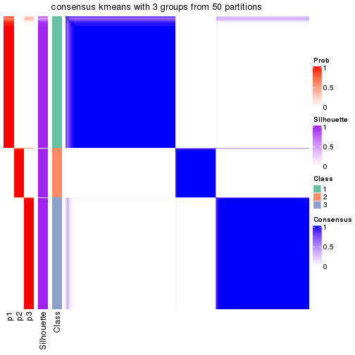</p>

</div>
<div id='tab-node-0-consensus-heatmap-3'>
<pre><code class="r">consensus_heatmap(res, k = 4)
</code></pre>

<p></p>

</div>
<div id='tab-node-0-consensus-heatmap-4'>
<pre><code class="r">consensus_heatmap(res, k = 5)
</code></pre>

<p></p>

</div>
<div id='tab-node-0-consensus-heatmap-5'>
<pre><code class="r">consensus_heatmap(res, k = 6)
</code></pre>

<p></p>

</div>
<div id='tab-node-0-consensus-heatmap-6'>
<pre><code class="r">consensus_heatmap(res, k = 7)
</code></pre>

<p></p>

</div>
<div id='tab-node-0-consensus-heatmap-7'>
<pre><code class="r">consensus_heatmap(res, k = 8)
</code></pre>

<p></p>

</div>
</div>

Heatmaps for the membership of samples in all partitions to see how consistent they are:


<script>
$( function() {
	$( '#tabs-node-0-membership-heatmap' ).tabs();
} );
</script>
<div id='tabs-node-0-membership-heatmap'>
<ul>
<li><a href='#tab-node-0-membership-heatmap-1'>k = 2</a></li>
<li><a href='#tab-node-0-membership-heatmap-2'>k = 3</a></li>
<li><a href='#tab-node-0-membership-heatmap-3'>k = 4</a></li>
<li><a href='#tab-node-0-membership-heatmap-4'>k = 5</a></li>
<li><a href='#tab-node-0-membership-heatmap-5'>k = 6</a></li>
<li><a href='#tab-node-0-membership-heatmap-6'>k = 7</a></li>
<li><a href='#tab-node-0-membership-heatmap-7'>k = 8</a></li>
</ul>
<div id='tab-node-0-membership-heatmap-1'>
<pre><code class="r">membership_heatmap(res, k = 2)
</code></pre>

<p></p>

</div>
<div id='tab-node-0-membership-heatmap-2'>
<pre><code class="r">membership_heatmap(res, k = 3)
</code></pre>

<p></p>

</div>
<div id='tab-node-0-membership-heatmap-3'>
<pre><code class="r">membership_heatmap(res, k = 4)
</code></pre>

<p>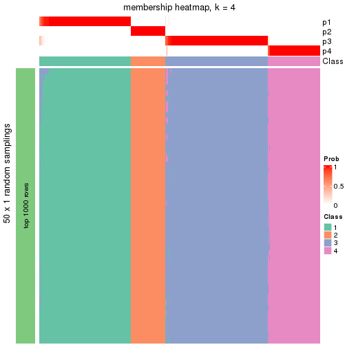</p>

</div>
<div id='tab-node-0-membership-heatmap-4'>
<pre><code class="r">membership_heatmap(res, k = 5)
</code></pre>

<p>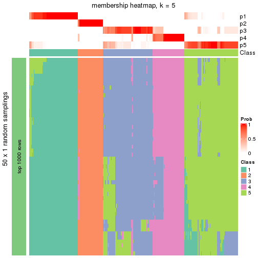</p>

</div>
<div id='tab-node-0-membership-heatmap-5'>
<pre><code class="r">membership_heatmap(res, k = 6)
</code></pre>

<p></p>

</div>
<div id='tab-node-0-membership-heatmap-6'>
<pre><code class="r">membership_heatmap(res, k = 7)
</code></pre>

<p></p>

</div>
<div id='tab-node-0-membership-heatmap-7'>
<pre><code class="r">membership_heatmap(res, k = 8)
</code></pre>

<p></p>

</div>
</div>

As soon as the classes for columns are determined, the signatures
that are significantly different between subgroups can be looked for. 
Following are the heatmaps for signatures.


<script>
$( function() {
	$( '#tabs-node-0-get-signatures' ).tabs();
} );
</script>
<div id='tabs-node-0-get-signatures'>
<ul>
<li><a href='#tab-node-0-get-signatures-1'>k = 2</a></li>
<li><a href='#tab-node-0-get-signatures-2'>k = 3</a></li>
<li><a href='#tab-node-0-get-signatures-3'>k = 4</a></li>
<li><a href='#tab-node-0-get-signatures-4'>k = 5</a></li>
<li><a href='#tab-node-0-get-signatures-5'>k = 6</a></li>
<li><a href='#tab-node-0-get-signatures-6'>k = 7</a></li>
<li><a href='#tab-node-0-get-signatures-7'>k = 8</a></li>
</ul>
<div id='tab-node-0-get-signatures-1'>
<pre><code class="r">get_signatures(res, k = 2)
</code></pre>

<p></p>

</div>
<div id='tab-node-0-get-signatures-2'>
<pre><code class="r">get_signatures(res, k = 3)
</code></pre>

<p></p>

</div>
<div id='tab-node-0-get-signatures-3'>
<pre><code class="r">get_signatures(res, k = 4)
</code></pre>

<p></p>

</div>
<div id='tab-node-0-get-signatures-4'>
<pre><code class="r">get_signatures(res, k = 5)
</code></pre>

<p></p>

</div>
<div id='tab-node-0-get-signatures-5'>
<pre><code class="r">get_signatures(res, k = 6)
</code></pre>

<p></p>

</div>
<div id='tab-node-0-get-signatures-6'>
<pre><code class="r">get_signatures(res, k = 7)
</code></pre>

<p></p>

</div>
<div id='tab-node-0-get-signatures-7'>
<pre><code class="r">get_signatures(res, k = 8)
</code></pre>

<p></p>

</div>
</div>


Compare the overlap of signatures from different k:

```r
compare_signatures(res)
```


`get_signature()` returns a data frame invisibly. To get the list of signatures, the function
call should be assigned to a variable explicitly. In following code, if `plot` argument is set
to `FALSE`, no heatmap is plotted while only the differential analysis is performed.

```r
# code only for demonstration
tb = get_signature(res, k = ..., plot = FALSE)
```

An example of the output of `tb` is:

```
#>   which_row         fdr    mean_1    mean_2 scaled_mean_1 scaled_mean_2 km
#> 1        38 0.042760348  8.373488  9.131774    -0.5533452     0.5164555  1
#> 2        40 0.018707592  7.106213  8.469186    -0.6173731     0.5762149  1
#> 3        55 0.019134737 10.221463 11.207825    -0.6159697     0.5749050  1
#> 4        59 0.006059896  5.921854  7.869574    -0.6899429     0.6439467  1
#> 5        60 0.018055526  8.928898 10.211722    -0.6204761     0.5791110  1
#> 6        98 0.009384629 15.714769 14.887706     0.6635654    -0.6193277  2
...
```

The columns in `tb` are:

1. `which_row`: row indices corresponding to the input matrix.
2. `fdr`: FDR for the differential test. 
3. `mean_x`: The mean value in group x.
4. `scaled_mean_x`: The mean value in group x after rows are scaled.
5. `km`: Row groups if k-means clustering is applied to rows (which is done by automatically selecting number of clusters).

If there are too many signatures, `top_signatures = ...` can be set to only show the 
signatures with the highest FDRs:

```r
# code only for demonstration
# e.g. to show the top 500 most significant rows
tb = get_signature(res, k = ..., top_signatures = 500)
```

If the signatures are defined as these which are uniquely high in current group, `diff_method` argument
can be set to `"uniquely_high_in_one_group"`:

```r
# code only for demonstration
tb = get_signature(res, k = ..., diff_method = "uniquely_high_in_one_group")
```


UMAP plot which shows how samples are separated.


<script>
$( function() {
	$( '#tabs-node-0-dimension-reduction' ).tabs();
} );
</script>
<div id='tabs-node-0-dimension-reduction'>
<ul>
<li><a href='#tab-node-0-dimension-reduction-1'>k = 2</a></li>
<li><a href='#tab-node-0-dimension-reduction-2'>k = 3</a></li>
<li><a href='#tab-node-0-dimension-reduction-3'>k = 4</a></li>
<li><a href='#tab-node-0-dimension-reduction-4'>k = 5</a></li>
<li><a href='#tab-node-0-dimension-reduction-5'>k = 6</a></li>
<li><a href='#tab-node-0-dimension-reduction-6'>k = 7</a></li>
<li><a href='#tab-node-0-dimension-reduction-7'>k = 8</a></li>
</ul>
<div id='tab-node-0-dimension-reduction-1'>
<pre><code class="r">dimension_reduction(res, k = 2, method = &quot;UMAP&quot;)
</code></pre>

<p></p>

</div>
<div id='tab-node-0-dimension-reduction-2'>
<pre><code class="r">dimension_reduction(res, k = 3, method = &quot;UMAP&quot;)
</code></pre>

<p></p>

</div>
<div id='tab-node-0-dimension-reduction-3'>
<pre><code class="r">dimension_reduction(res, k = 4, method = &quot;UMAP&quot;)
</code></pre>

<p></p>

</div>
<div id='tab-node-0-dimension-reduction-4'>
<pre><code class="r">dimension_reduction(res, k = 5, method = &quot;UMAP&quot;)
</code></pre>

<p></p>

</div>
<div id='tab-node-0-dimension-reduction-5'>
<pre><code class="r">dimension_reduction(res, k = 6, method = &quot;UMAP&quot;)
</code></pre>

<p></p>

</div>
<div id='tab-node-0-dimension-reduction-6'>
<pre><code class="r">dimension_reduction(res, k = 7, method = &quot;UMAP&quot;)
</code></pre>

<p></p>

</div>
<div id='tab-node-0-dimension-reduction-7'>
<pre><code class="r">dimension_reduction(res, k = 8, method = &quot;UMAP&quot;)
</code></pre>

<p></p>

</div>
</div>


Following heatmap shows how subgroups are split when increasing `k`:

```r
collect_classes(res)
```


If matrix rows can be associated to genes, consider to use `functional_enrichment(res,
...)` to perform function enrichment for the signature genes. See [this vignette](https://jokergoo.github.io/cola_vignettes/functional_enrichment.html) for more detailed explanations.


 

---------------------------------------------------


### Node01


Parent node: [Node0](#Node0).
Child nodes: 
                [Node011](#Node011)
        ,
                [Node012](#Node012)
        ,
                [Node021](#Node021)
        ,
                Node022-leaf
        ,
                Node023-leaf
        ,
                [Node041](#Node041)
        ,
                [Node042](#Node042)
        ,
                [Node043](#Node043)
        .


The object with results only for a single top-value method and a single partitioning method 
can be extracted as:

```r
res = res_rh["01"]
```

A summary of `res` and all the functions that can be applied to it:

```r
res
```

```
#> A 'ConsensusPartition' object with k = 2, 3, 4, 5, 6, 7, 8.
#>   On a matrix with 30000 rows and 145 columns.
#>   Top rows (1000) are extracted by 'ATC' method.
#>   Subgroups are detected by 'kmeans' method.
#>   Performed in total 350 partitions by row resampling.
#>   Best k for subgroups seems to be 6.
#> 
#> Following methods can be applied to this 'ConsensusPartition' object:
#>  [1] "cola_report"             "collect_classes"         "collect_plots"          
#>  [4] "collect_stats"           "colnames"                "compare_partitions"     
#>  [7] "compare_signatures"      "consensus_heatmap"       "dimension_reduction"    
#> [10] "functional_enrichment"   "get_anno_col"            "get_anno"               
#> [13] "get_classes"             "get_consensus"           "get_matrix"             
#> [16] "get_membership"          "get_param"               "get_signatures"         
#> [19] "get_stats"               "is_best_k"               "is_stable_k"            
#> [22] "membership_heatmap"      "ncol"                    "nrow"                   
#> [25] "plot_ecdf"               "predict_classes"         "rownames"               
#> [28] "select_partition_number" "show"                    "suggest_best_k"         
#> [31] "test_to_known_factors"   "top_rows_heatmap"
```

`collect_plots()` function collects all the plots made from `res` for all `k` (number of subgroups)
into one single page to provide an easy and fast comparison between different `k`.

```r
collect_plots(res)
```


The plots are:

- The first row: a plot of the eCDF (empirical cumulative distribution
  function) curves of the consensus matrix for each `k` and the heatmap of
  predicted classes for each `k`.
- The second row: heatmaps of the consensus matrix for each `k`.
- The third row: heatmaps of the membership matrix for each `k`.
- The fouth row: heatmaps of the signatures for each `k`.

All the plots in panels can be made by individual functions and they are
plotted later in this section.

`select_partition_number()` produces several plots showing different
statistics for choosing "optimized" `k`. There are following statistics:

- eCDF curves of the consensus matrix for each `k`;
- 1-PAC. [The PAC score](https://en.wikipedia.org/wiki/Consensus_clustering#Over-interpretation_potential_of_consensus_clustering)
  measures the proportion of the ambiguous subgrouping.
- Mean silhouette score.
- Concordance. The mean probability of fiting the consensus subgroup labels in all
  partitions.
- Area increased. Denote $A_k$ as the area under the eCDF curve for current
  `k`, the area increased is defined as $A_k - A_{k-1}$.
- Rand index. The percent of pairs of samples that are both in a same cluster
  or both are not in a same cluster in the partition of k and k-1.
- Jaccard index. The ratio of pairs of samples are both in a same cluster in
  the partition of k and k-1 and the pairs of samples are both in a same
  cluster in the partition k or k-1.

The detailed explanations of these statistics can be found in [the _cola_
vignette](https://jokergoo.github.io/cola_vignettes/cola.html#toc_13).

Generally speaking, higher 1-PAC score, higher mean silhouette score or higher
concordance corresponds to better partition. Rand index and Jaccard index
measure how similar the current partition is compared to partition with `k-1`.
If they are too similar, we won't accept `k` is better than `k-1`.

```r
select_partition_number(res)
```


The numeric values for all these statistics can be obtained by `get_stats()`.

```r
get_stats(res)
```

```
#>   k 1-PAC mean_silhouette concordance area_increased  Rand Jaccard
#> 2 2 1.000           0.999       1.000         0.4092 0.592   0.592
#> 3 3 1.000           0.946       0.980         0.3386 0.828   0.714
#> 4 4 0.917           0.902       0.955         0.1883 0.863   0.702
#> 5 5 0.928           0.937       0.967         0.0799 0.924   0.786
#> 6 6 0.925           0.855       0.929         0.0386 0.938   0.798
#> 7 7 0.878           0.828       0.903         0.0252 0.995   0.981
#> 8 8 0.863           0.705       0.877         0.0165 0.972   0.893
```

`suggest_best_k()` suggests the best $k$ based on these statistics. The rules are as follows:

- All $k$ with Jaccard index larger than 0.95 are removed because increasing
  $k$ does not provide enough extra information. If all $k$ are removed, it is
  marked as no subgroup is detected.
- For all $k$ with 1-PAC score larger than 0.9, the maximal $k$ is taken as
  the best $k$, and other $k$ are marked as optional $k$.
- If it does not fit the second rule. The $k$ with the maximal vote of the
  highest 1-PAC score, highest mean silhouette, and highest concordance is
  taken as the best $k$.

```r
suggest_best_k(res)
```

```
#> [1] 6
#> attr(,"optional")
#> [1] 2 3 4 5
```

There is also optional best $k$ = 2 3 4 5 that is worth to check.

Following is the table of the partitions (You need to click the **show/hide
code output** link to see it). The membership matrix (columns with name `p*`)
is inferred by
[`clue::cl_consensus()`](https://www.rdocumentation.org/link/cl_consensus?package=clue)
function with the `SE` method. Basically the value in the membership matrix
represents the probability to belong to a certain group. The finall subgroup
label for an item is determined with the group with highest probability it
belongs to.

In `get_classes()` function, the entropy is calculated from the membership
matrix and the silhouette score is calculated from the consensus matrix.


<script>
$( function() {
	$( '#tabs-node-01-get-classes' ).tabs();
} );
</script>
<div id='tabs-node-01-get-classes'>
<ul>
<li><a href='#tab-node-01-get-classes-1'>k = 2</a></li>
<li><a href='#tab-node-01-get-classes-2'>k = 3</a></li>
<li><a href='#tab-node-01-get-classes-3'>k = 4</a></li>
<li><a href='#tab-node-01-get-classes-4'>k = 5</a></li>
<li><a href='#tab-node-01-get-classes-5'>k = 6</a></li>
<li><a href='#tab-node-01-get-classes-6'>k = 7</a></li>
<li><a href='#tab-node-01-get-classes-7'>k = 8</a></li>
</ul>

<div id='tab-node-01-get-classes-1'>
<p><a id='tab-node-01-get-classes-1-a' style='color:#0366d6' href='#'>show/hide code output</a></p>
<pre><code class="r">cbind(get_classes(res, k = 2), get_membership(res, k = 2))
</code></pre>

<pre><code>#&gt;                 class entropy silhouette   p1   p2
#&gt; TCGA.AG.A026.01     1   0.000       1.00 1.00 0.00
#&gt; TCGA.G4.6303.01     1   0.000       1.00 1.00 0.00
#&gt; TCGA.T9.A92H.01     1   0.000       1.00 1.00 0.00
#&gt; TCGA.AD.6965.01     1   0.000       1.00 1.00 0.00
#&gt; TCGA.A6.5660.01     1   0.000       1.00 1.00 0.00
#&gt; TCGA.D5.6540.01     2   0.000       1.00 0.00 1.00
#&gt; TCGA.F5.6571.01     1   0.000       1.00 1.00 0.00
#&gt; TCGA.CM.5862.01     1   0.000       1.00 1.00 0.00
#&gt; TCGA.CI.6622.01     1   0.000       1.00 1.00 0.00
#&gt; TCGA.G4.6588.01     2   0.000       1.00 0.00 1.00
#&gt; TCGA.EI.6512.01     1   0.000       1.00 1.00 0.00
#&gt; TCGA.QG.A5YX.01     1   0.000       1.00 1.00 0.00
#&gt; TCGA.AG.A036.01     1   0.000       1.00 1.00 0.00
#&gt; TCGA.AZ.6606.01     2   0.000       1.00 0.00 1.00
#&gt; TCGA.F4.6570.01     2   0.000       1.00 0.00 1.00
#&gt; TCGA.AA.3509.01     1   0.000       1.00 1.00 0.00
#&gt; TCGA.EI.6883.01     1   0.000       1.00 1.00 0.00
#&gt; TCGA.RU.A8FL.01     1   0.000       1.00 1.00 0.00
#&gt; TCGA.AZ.6599.01     1   0.000       1.00 1.00 0.00
#&gt; TCGA.CM.5860.01     1   0.000       1.00 1.00 0.00
#&gt; TCGA.A6.6780.01     1   0.000       1.00 1.00 0.00
#&gt; TCGA.A6.2686.01     2   0.000       1.00 0.00 1.00
#&gt; TCGA.CM.4750.01     1   0.000       1.00 1.00 0.00
#&gt; TCGA.CM.6677.01     1   0.000       1.00 1.00 0.00
#&gt; TCGA.F5.6814.01     1   0.000       1.00 1.00 0.00
#&gt; TCGA.G4.6299.01     2   0.000       1.00 0.00 1.00
#&gt; TCGA.A6.4105.01     2   0.000       1.00 0.00 1.00
#&gt; TCGA.DM.A1D8.01     1   0.000       1.00 1.00 0.00
#&gt; TCGA.DT.5265.01     2   0.000       1.00 0.00 1.00
#&gt; TCGA.DM.A0XD.01     2   0.000       1.00 0.00 1.00
#&gt; TCGA.A6.6138.01     1   0.000       1.00 1.00 0.00
#&gt; TCGA.D5.7000.01     2   0.000       1.00 0.00 1.00
#&gt; TCGA.DM.A28F.01     1   0.000       1.00 1.00 0.00
#&gt; TCGA.CK.6751.01     2   0.000       1.00 0.00 1.00
#&gt; TCGA.CM.6171.01     2   0.000       1.00 0.00 1.00
#&gt; TCGA.DM.A1DA.01     2   0.000       1.00 0.00 1.00
#&gt; TCGA.DM.A1D4.01     1   0.141       0.98 0.98 0.02
#&gt; TCGA.AD.A5EJ.01     2   0.000       1.00 0.00 1.00
#&gt; TCGA.DM.A0X9.01     1   0.000       1.00 1.00 0.00
#&gt; TCGA.AY.A69D.01     1   0.000       1.00 1.00 0.00
#&gt; TCGA.CA.6716.01     1   0.000       1.00 1.00 0.00
#&gt; TCGA.CK.5916.01     2   0.000       1.00 0.00 1.00
#&gt; TCGA.NH.A6GB.01     1   0.000       1.00 1.00 0.00
#&gt; TCGA.NH.A50U.01     1   0.000       1.00 1.00 0.00
#&gt; TCGA.AZ.4614.01     2   0.000       1.00 0.00 1.00
#&gt; TCGA.AH.6644.01     1   0.000       1.00 1.00 0.00
#&gt; TCGA.A6.3809.01     2   0.000       1.00 0.00 1.00
#&gt; TCGA.CM.5864.01     1   0.000       1.00 1.00 0.00
#&gt; TCGA.CM.5861.01     2   0.000       1.00 0.00 1.00
#&gt; TCGA.AG.3742.01     1   0.000       1.00 1.00 0.00
#&gt; TCGA.A6.5666.01     1   0.000       1.00 1.00 0.00
#&gt; TCGA.AG.3591.01     1   0.000       1.00 1.00 0.00
#&gt; TCGA.AH.6643.01     1   0.000       1.00 1.00 0.00
#&gt; TCGA.EI.6510.01     1   0.000       1.00 1.00 0.00
#&gt; TCGA.A6.5656.01     1   0.000       1.00 1.00 0.00
#&gt; TCGA.DY.A1DG.01     1   0.000       1.00 1.00 0.00
#&gt; TCGA.F4.6806.01     1   0.000       1.00 1.00 0.00
#&gt; TCGA.G4.6322.01     2   0.000       1.00 0.00 1.00
#&gt; TCGA.5M.AAT4.01     1   0.000       1.00 1.00 0.00
#&gt; TCGA.G4.6586.01     2   0.000       1.00 0.00 1.00
#&gt; TCGA.EI.6514.01     1   0.000       1.00 1.00 0.00
#&gt; TCGA.DM.A282.01     1   0.000       1.00 1.00 0.00
#&gt; TCGA.DM.A1HA.01     1   0.000       1.00 1.00 0.00
#&gt; TCGA.D5.6531.01     2   0.000       1.00 0.00 1.00
#&gt; TCGA.AZ.6598.01     2   0.000       1.00 0.00 1.00
#&gt; TCGA.AG.4021.01     1   0.000       1.00 1.00 0.00
#&gt; TCGA.DM.A1D9.01     1   0.000       1.00 1.00 0.00
#&gt; TCGA.CM.4744.01     1   0.000       1.00 1.00 0.00
#&gt; TCGA.A6.6652.01     1   0.000       1.00 1.00 0.00
#&gt; TCGA.SS.A7HO.01     1   0.000       1.00 1.00 0.00
#&gt; TCGA.A6.6650.01     1   0.000       1.00 1.00 0.00
#&gt; TCGA.F4.6461.01     2   0.000       1.00 0.00 1.00
#&gt; TCGA.AD.6889.01     2   0.000       1.00 0.00 1.00
#&gt; TCGA.NH.A50T.01     1   0.000       1.00 1.00 0.00
#&gt; TCGA.AA.3663.01     2   0.000       1.00 0.00 1.00
#&gt; TCGA.AD.6899.01     1   0.000       1.00 1.00 0.00
#&gt; TCGA.A6.A56B.01     1   0.000       1.00 1.00 0.00
#&gt; TCGA.D5.5539.01     1   0.000       1.00 1.00 0.00
#&gt; TCGA.CA.5254.01     2   0.000       1.00 0.00 1.00
#&gt; TCGA.AY.A54L.01     1   0.000       1.00 1.00 0.00
#&gt; TCGA.A6.4107.01     2   0.000       1.00 0.00 1.00
#&gt; TCGA.NH.A5IV.01     1   0.000       1.00 1.00 0.00
#&gt; TCGA.G4.6306.01     1   0.000       1.00 1.00 0.00
#&gt; TCGA.AD.A5EK.01     1   0.000       1.00 1.00 0.00
#&gt; TCGA.DC.5337.01     1   0.000       1.00 1.00 0.00
#&gt; TCGA.CM.6675.01     2   0.000       1.00 0.00 1.00
#&gt; TCGA.CK.6746.01     2   0.000       1.00 0.00 1.00
#&gt; TCGA.QG.A5YW.01     1   0.000       1.00 1.00 0.00
#&gt; TCGA.A6.5665.01     2   0.000       1.00 0.00 1.00
#&gt; TCGA.EI.6882.01     1   0.000       1.00 1.00 0.00
#&gt; TCGA.A6.2677.01     1   0.000       1.00 1.00 0.00
#&gt; TCGA.D5.6538.01     2   0.000       1.00 0.00 1.00
#&gt; TCGA.AA.3502.01     1   0.000       1.00 1.00 0.00
#&gt; TCGA.QG.A5Z2.01     2   0.000       1.00 0.00 1.00
#&gt; TCGA.CK.5915.01     1   0.000       1.00 1.00 0.00
#&gt; TCGA.AY.6197.01     1   0.000       1.00 1.00 0.00
#&gt; TCGA.G4.6294.01     1   0.000       1.00 1.00 0.00
#&gt; TCGA.CK.4952.01     2   0.000       1.00 0.00 1.00
#&gt; TCGA.CM.6172.01     1   0.000       1.00 1.00 0.00
#&gt; TCGA.AA.3496.01     1   0.000       1.00 1.00 0.00
#&gt; TCGA.CK.5913.01     2   0.000       1.00 0.00 1.00
#&gt; TCGA.DM.A28A.01     1   0.000       1.00 1.00 0.00
#&gt; TCGA.EI.7002.01     1   0.000       1.00 1.00 0.00
#&gt; TCGA.QG.A5Z1.01     1   0.000       1.00 1.00 0.00
#&gt; TCGA.DM.A28H.01     1   0.000       1.00 1.00 0.00
#&gt; TCGA.G4.6320.01     2   0.000       1.00 0.00 1.00
#&gt; TCGA.DM.A28M.01     1   0.000       1.00 1.00 0.00
#&gt; TCGA.DM.A288.01     1   0.000       1.00 1.00 0.00
#&gt; TCGA.A6.6653.01     2   0.000       1.00 0.00 1.00
#&gt; TCGA.F4.6855.01     1   0.000       1.00 1.00 0.00
#&gt; TCGA.NH.A6GA.01     1   0.000       1.00 1.00 0.00
#&gt; TCGA.NH.A50V.01     1   0.000       1.00 1.00 0.00
#&gt; TCGA.CK.6747.01     1   0.000       1.00 1.00 0.00
#&gt; TCGA.CL.5918.01     1   0.000       1.00 1.00 0.00
#&gt; TCGA.DM.A28K.01     1   0.000       1.00 1.00 0.00
#&gt; TCGA.AA.3655.01     1   0.000       1.00 1.00 0.00
#&gt; TCGA.AZ.5407.01     1   0.141       0.98 0.98 0.02
#&gt; TCGA.A6.5661.01     2   0.000       1.00 0.00 1.00
#&gt; TCGA.QG.A5YV.01     1   0.000       1.00 1.00 0.00
#&gt; TCGA.AY.A71X.01     1   0.000       1.00 1.00 0.00
#&gt; TCGA.AH.6549.01     1   0.000       1.00 1.00 0.00
#&gt; TCGA.CM.6166.01     1   0.000       1.00 1.00 0.00
#&gt; TCGA.AH.6897.01     1   0.000       1.00 1.00 0.00
#&gt; TCGA.D5.5540.01     1   0.000       1.00 1.00 0.00
#&gt; TCGA.A6.2672.01     2   0.000       1.00 0.00 1.00
#&gt; TCGA.G5.6233.01     1   0.000       1.00 1.00 0.00
#&gt; TCGA.CA.6719.01     1   0.000       1.00 1.00 0.00
#&gt; TCGA.D5.5537.01     1   0.000       1.00 1.00 0.00
#&gt; TCGA.4T.AA8H.01     1   0.000       1.00 1.00 0.00
#&gt; TCGA.AG.3592.01     1   0.000       1.00 1.00 0.00
#&gt; TCGA.CM.6678.01     1   0.000       1.00 1.00 0.00
#&gt; TCGA.CK.5914.01     1   0.000       1.00 1.00 0.00
#&gt; TCGA.AA.3492.01     2   0.000       1.00 0.00 1.00
#&gt; TCGA.DM.A1HB.01     2   0.000       1.00 0.00 1.00
#&gt; TCGA.EI.6508.01     1   0.000       1.00 1.00 0.00
#&gt; TCGA.D5.6532.01     1   0.000       1.00 1.00 0.00
#&gt; TCGA.A6.5659.01     2   0.000       1.00 0.00 1.00
#&gt; TCGA.A6.2680.01     1   0.000       1.00 1.00 0.00
#&gt; TCGA.CM.6680.01     1   0.000       1.00 1.00 0.00
#&gt; TCGA.AA.3660.01     1   0.000       1.00 1.00 0.00
#&gt; TCGA.CM.4747.01     1   0.000       1.00 1.00 0.00
#&gt; TCGA.EF.5831.01     1   0.000       1.00 1.00 0.00
#&gt; TCGA.DM.A28G.01     1   0.000       1.00 1.00 0.00
#&gt; TCGA.D5.6537.01     1   0.000       1.00 1.00 0.00
#&gt; TCGA.DY.A1DD.01     1   0.000       1.00 1.00 0.00
</code></pre>

<script>
$('#tab-node-01-get-classes-1-a').parent().next().next().hide();
$('#tab-node-01-get-classes-1-a').click(function(){
  $('#tab-node-01-get-classes-1-a').parent().next().next().toggle();
  return(false);
});
</script>
</div>

<div id='tab-node-01-get-classes-2'>
<p><a id='tab-node-01-get-classes-2-a' style='color:#0366d6' href='#'>show/hide code output</a></p>
<pre><code class="r">cbind(get_classes(res, k = 3), get_membership(res, k = 3))
</code></pre>

<pre><code>#&gt;                 class entropy silhouette   p1   p2   p3
#&gt; TCGA.AG.A026.01     1   0.000      0.996 1.00 0.00 0.00
#&gt; TCGA.G4.6303.01     1   0.000      0.996 1.00 0.00 0.00
#&gt; TCGA.T9.A92H.01     1   0.000      0.996 1.00 0.00 0.00
#&gt; TCGA.AD.6965.01     1   0.000      0.996 1.00 0.00 0.00
#&gt; TCGA.A6.5660.01     1   0.000      0.996 1.00 0.00 0.00
#&gt; TCGA.D5.6540.01     2   0.000      0.978 0.00 1.00 0.00
#&gt; TCGA.F5.6571.01     1   0.000      0.996 1.00 0.00 0.00
#&gt; TCGA.CM.5862.01     1   0.000      0.996 1.00 0.00 0.00
#&gt; TCGA.CI.6622.01     1   0.000      0.996 1.00 0.00 0.00
#&gt; TCGA.G4.6588.01     2   0.000      0.978 0.00 1.00 0.00
#&gt; TCGA.EI.6512.01     1   0.000      0.996 1.00 0.00 0.00
#&gt; TCGA.QG.A5YX.01     1   0.000      0.996 1.00 0.00 0.00
#&gt; TCGA.AG.A036.01     1   0.000      0.996 1.00 0.00 0.00
#&gt; TCGA.AZ.6606.01     2   0.000      0.978 0.00 1.00 0.00
#&gt; TCGA.F4.6570.01     2   0.000      0.978 0.00 1.00 0.00
#&gt; TCGA.AA.3509.01     1   0.000      0.996 1.00 0.00 0.00
#&gt; TCGA.EI.6883.01     1   0.000      0.996 1.00 0.00 0.00
#&gt; TCGA.RU.A8FL.01     1   0.000      0.996 1.00 0.00 0.00
#&gt; TCGA.AZ.6599.01     3   0.630      0.177 0.48 0.00 0.52
#&gt; TCGA.CM.5860.01     3   0.000      0.883 0.00 0.00 1.00
#&gt; TCGA.A6.6780.01     3   0.000      0.883 0.00 0.00 1.00
#&gt; TCGA.A6.2686.01     2   0.000      0.978 0.00 1.00 0.00
#&gt; TCGA.CM.4750.01     1   0.000      0.996 1.00 0.00 0.00
#&gt; TCGA.CM.6677.01     3   0.628      0.239 0.46 0.00 0.54
#&gt; TCGA.F5.6814.01     1   0.000      0.996 1.00 0.00 0.00
#&gt; TCGA.G4.6299.01     2   0.000      0.978 0.00 1.00 0.00
#&gt; TCGA.A6.4105.01     3   0.000      0.883 0.00 0.00 1.00
#&gt; TCGA.DM.A1D8.01     3   0.000      0.883 0.00 0.00 1.00
#&gt; TCGA.DT.5265.01     2   0.000      0.978 0.00 1.00 0.00
#&gt; TCGA.DM.A0XD.01     3   0.000      0.883 0.00 0.00 1.00
#&gt; TCGA.A6.6138.01     3   0.604      0.434 0.38 0.00 0.62
#&gt; TCGA.D5.7000.01     3   0.000      0.883 0.00 0.00 1.00
#&gt; TCGA.DM.A28F.01     1   0.000      0.996 1.00 0.00 0.00
#&gt; TCGA.CK.6751.01     3   0.000      0.883 0.00 0.00 1.00
#&gt; TCGA.CM.6171.01     2   0.000      0.978 0.00 1.00 0.00
#&gt; TCGA.DM.A1DA.01     2   0.595      0.494 0.00 0.64 0.36
#&gt; TCGA.DM.A1D4.01     3   0.000      0.883 0.00 0.00 1.00
#&gt; TCGA.AD.A5EJ.01     2   0.000      0.978 0.00 1.00 0.00
#&gt; TCGA.DM.A0X9.01     3   0.000      0.883 0.00 0.00 1.00
#&gt; TCGA.AY.A69D.01     1   0.000      0.996 1.00 0.00 0.00
#&gt; TCGA.CA.6716.01     3   0.000      0.883 0.00 0.00 1.00
#&gt; TCGA.CK.5916.01     2   0.000      0.978 0.00 1.00 0.00
#&gt; TCGA.NH.A6GB.01     1   0.000      0.996 1.00 0.00 0.00
#&gt; TCGA.NH.A50U.01     1   0.000      0.996 1.00 0.00 0.00
#&gt; TCGA.AZ.4614.01     2   0.000      0.978 0.00 1.00 0.00
#&gt; TCGA.AH.6644.01     1   0.000      0.996 1.00 0.00 0.00
#&gt; TCGA.A6.3809.01     2   0.000      0.978 0.00 1.00 0.00
#&gt; TCGA.CM.5864.01     1   0.000      0.996 1.00 0.00 0.00
#&gt; TCGA.CM.5861.01     2   0.000      0.978 0.00 1.00 0.00
#&gt; TCGA.AG.3742.01     1   0.000      0.996 1.00 0.00 0.00
#&gt; TCGA.A6.5666.01     1   0.000      0.996 1.00 0.00 0.00
#&gt; TCGA.AG.3591.01     1   0.000      0.996 1.00 0.00 0.00
#&gt; TCGA.AH.6643.01     1   0.000      0.996 1.00 0.00 0.00
#&gt; TCGA.EI.6510.01     1   0.000      0.996 1.00 0.00 0.00
#&gt; TCGA.A6.5656.01     1   0.000      0.996 1.00 0.00 0.00
#&gt; TCGA.DY.A1DG.01     1   0.000      0.996 1.00 0.00 0.00
#&gt; TCGA.F4.6806.01     3   0.000      0.883 0.00 0.00 1.00
#&gt; TCGA.G4.6322.01     3   0.000      0.883 0.00 0.00 1.00
#&gt; TCGA.5M.AAT4.01     1   0.000      0.996 1.00 0.00 0.00
#&gt; TCGA.G4.6586.01     2   0.000      0.978 0.00 1.00 0.00
#&gt; TCGA.EI.6514.01     1   0.000      0.996 1.00 0.00 0.00
#&gt; TCGA.DM.A282.01     1   0.000      0.996 1.00 0.00 0.00
#&gt; TCGA.DM.A1HA.01     3   0.630      0.177 0.48 0.00 0.52
#&gt; TCGA.D5.6531.01     2   0.000      0.978 0.00 1.00 0.00
#&gt; TCGA.AZ.6598.01     2   0.000      0.978 0.00 1.00 0.00
#&gt; TCGA.AG.4021.01     1   0.000      0.996 1.00 0.00 0.00
#&gt; TCGA.DM.A1D9.01     1   0.000      0.996 1.00 0.00 0.00
#&gt; TCGA.CM.4744.01     3   0.000      0.883 0.00 0.00 1.00
#&gt; TCGA.A6.6652.01     1   0.000      0.996 1.00 0.00 0.00
#&gt; TCGA.SS.A7HO.01     1   0.000      0.996 1.00 0.00 0.00
#&gt; TCGA.A6.6650.01     1   0.000      0.996 1.00 0.00 0.00
#&gt; TCGA.F4.6461.01     2   0.000      0.978 0.00 1.00 0.00
#&gt; TCGA.AD.6889.01     2   0.000      0.978 0.00 1.00 0.00
#&gt; TCGA.NH.A50T.01     1   0.000      0.996 1.00 0.00 0.00
#&gt; TCGA.AA.3663.01     3   0.000      0.883 0.00 0.00 1.00
#&gt; TCGA.AD.6899.01     1   0.000      0.996 1.00 0.00 0.00
#&gt; TCGA.A6.A56B.01     1   0.000      0.996 1.00 0.00 0.00
#&gt; TCGA.D5.5539.01     1   0.000      0.996 1.00 0.00 0.00
#&gt; TCGA.CA.5254.01     2   0.000      0.978 0.00 1.00 0.00
#&gt; TCGA.AY.A54L.01     1   0.000      0.996 1.00 0.00 0.00
#&gt; TCGA.A6.4107.01     2   0.595      0.494 0.00 0.64 0.36
#&gt; TCGA.NH.A5IV.01     1   0.000      0.996 1.00 0.00 0.00
#&gt; TCGA.G4.6306.01     1   0.000      0.996 1.00 0.00 0.00
#&gt; TCGA.AD.A5EK.01     1   0.571      0.466 0.68 0.00 0.32
#&gt; TCGA.DC.5337.01     1   0.000      0.996 1.00 0.00 0.00
#&gt; TCGA.CM.6675.01     2   0.000      0.978 0.00 1.00 0.00
#&gt; TCGA.CK.6746.01     2   0.000      0.978 0.00 1.00 0.00
#&gt; TCGA.QG.A5YW.01     1   0.000      0.996 1.00 0.00 0.00
#&gt; TCGA.A6.5665.01     2   0.000      0.978 0.00 1.00 0.00
#&gt; TCGA.EI.6882.01     1   0.000      0.996 1.00 0.00 0.00
#&gt; TCGA.A6.2677.01     1   0.000      0.996 1.00 0.00 0.00
#&gt; TCGA.D5.6538.01     3   0.000      0.883 0.00 0.00 1.00
#&gt; TCGA.AA.3502.01     1   0.000      0.996 1.00 0.00 0.00
#&gt; TCGA.QG.A5Z2.01     2   0.000      0.978 0.00 1.00 0.00
#&gt; TCGA.CK.5915.01     1   0.000      0.996 1.00 0.00 0.00
#&gt; TCGA.AY.6197.01     3   0.000      0.883 0.00 0.00 1.00
#&gt; TCGA.G4.6294.01     1   0.000      0.996 1.00 0.00 0.00
#&gt; TCGA.CK.4952.01     2   0.000      0.978 0.00 1.00 0.00
#&gt; TCGA.CM.6172.01     1   0.000      0.996 1.00 0.00 0.00
#&gt; TCGA.AA.3496.01     1   0.000      0.996 1.00 0.00 0.00
#&gt; TCGA.CK.5913.01     2   0.000      0.978 0.00 1.00 0.00
#&gt; TCGA.DM.A28A.01     1   0.000      0.996 1.00 0.00 0.00
#&gt; TCGA.EI.7002.01     1   0.000      0.996 1.00 0.00 0.00
#&gt; TCGA.QG.A5Z1.01     1   0.000      0.996 1.00 0.00 0.00
#&gt; TCGA.DM.A28H.01     1   0.000      0.996 1.00 0.00 0.00
#&gt; TCGA.G4.6320.01     2   0.000      0.978 0.00 1.00 0.00
#&gt; TCGA.DM.A28M.01     1   0.000      0.996 1.00 0.00 0.00
#&gt; TCGA.DM.A288.01     1   0.000      0.996 1.00 0.00 0.00
#&gt; TCGA.A6.6653.01     2   0.000      0.978 0.00 1.00 0.00
#&gt; TCGA.F4.6855.01     1   0.000      0.996 1.00 0.00 0.00
#&gt; TCGA.NH.A6GA.01     1   0.000      0.996 1.00 0.00 0.00
#&gt; TCGA.NH.A50V.01     3   0.000      0.883 0.00 0.00 1.00
#&gt; TCGA.CK.6747.01     1   0.000      0.996 1.00 0.00 0.00
#&gt; TCGA.CL.5918.01     1   0.000      0.996 1.00 0.00 0.00
#&gt; TCGA.DM.A28K.01     1   0.000      0.996 1.00 0.00 0.00
#&gt; TCGA.AA.3655.01     1   0.000      0.996 1.00 0.00 0.00
#&gt; TCGA.AZ.5407.01     3   0.000      0.883 0.00 0.00 1.00
#&gt; TCGA.A6.5661.01     2   0.000      0.978 0.00 1.00 0.00
#&gt; TCGA.QG.A5YV.01     1   0.000      0.996 1.00 0.00 0.00
#&gt; TCGA.AY.A71X.01     1   0.000      0.996 1.00 0.00 0.00
#&gt; TCGA.AH.6549.01     1   0.000      0.996 1.00 0.00 0.00
#&gt; TCGA.CM.6166.01     1   0.000      0.996 1.00 0.00 0.00
#&gt; TCGA.AH.6897.01     1   0.000      0.996 1.00 0.00 0.00
#&gt; TCGA.D5.5540.01     1   0.000      0.996 1.00 0.00 0.00
#&gt; TCGA.A6.2672.01     2   0.000      0.978 0.00 1.00 0.00
#&gt; TCGA.G5.6233.01     3   0.000      0.883 0.00 0.00 1.00
#&gt; TCGA.CA.6719.01     1   0.000      0.996 1.00 0.00 0.00
#&gt; TCGA.D5.5537.01     1   0.000      0.996 1.00 0.00 0.00
#&gt; TCGA.4T.AA8H.01     1   0.000      0.996 1.00 0.00 0.00
#&gt; TCGA.AG.3592.01     1   0.000      0.996 1.00 0.00 0.00
#&gt; TCGA.CM.6678.01     1   0.000      0.996 1.00 0.00 0.00
#&gt; TCGA.CK.5914.01     1   0.000      0.996 1.00 0.00 0.00
#&gt; TCGA.AA.3492.01     2   0.000      0.978 0.00 1.00 0.00
#&gt; TCGA.DM.A1HB.01     2   0.000      0.978 0.00 1.00 0.00
#&gt; TCGA.EI.6508.01     1   0.000      0.996 1.00 0.00 0.00
#&gt; TCGA.D5.6532.01     1   0.000      0.996 1.00 0.00 0.00
#&gt; TCGA.A6.5659.01     3   0.000      0.883 0.00 0.00 1.00
#&gt; TCGA.A6.2680.01     1   0.000      0.996 1.00 0.00 0.00
#&gt; TCGA.CM.6680.01     1   0.000      0.996 1.00 0.00 0.00
#&gt; TCGA.AA.3660.01     1   0.000      0.996 1.00 0.00 0.00
#&gt; TCGA.CM.4747.01     1   0.000      0.996 1.00 0.00 0.00
#&gt; TCGA.EF.5831.01     1   0.000      0.996 1.00 0.00 0.00
#&gt; TCGA.DM.A28G.01     1   0.000      0.996 1.00 0.00 0.00
#&gt; TCGA.D5.6537.01     1   0.000      0.996 1.00 0.00 0.00
#&gt; TCGA.DY.A1DD.01     1   0.000      0.996 1.00 0.00 0.00
</code></pre>

<script>
$('#tab-node-01-get-classes-2-a').parent().next().next().hide();
$('#tab-node-01-get-classes-2-a').click(function(){
  $('#tab-node-01-get-classes-2-a').parent().next().next().toggle();
  return(false);
});
</script>
</div>

<div id='tab-node-01-get-classes-3'>
<p><a id='tab-node-01-get-classes-3-a' style='color:#0366d6' href='#'>show/hide code output</a></p>
<pre><code class="r">cbind(get_classes(res, k = 4), get_membership(res, k = 4))
</code></pre>

<pre><code>#&gt;                 class entropy silhouette   p1   p2   p3   p4
#&gt; TCGA.AG.A026.01     1  0.0000     0.9853 1.00 0.00 0.00 0.00
#&gt; TCGA.G4.6303.01     1  0.0000     0.9853 1.00 0.00 0.00 0.00
#&gt; TCGA.T9.A92H.01     1  0.0000     0.9853 1.00 0.00 0.00 0.00
#&gt; TCGA.AD.6965.01     1  0.0000     0.9853 1.00 0.00 0.00 0.00
#&gt; TCGA.A6.5660.01     1  0.0000     0.9853 1.00 0.00 0.00 0.00
#&gt; TCGA.D5.6540.01     2  0.0000     0.9777 0.00 1.00 0.00 0.00
#&gt; TCGA.F5.6571.01     1  0.0000     0.9853 1.00 0.00 0.00 0.00
#&gt; TCGA.CM.5862.01     1  0.0000     0.9853 1.00 0.00 0.00 0.00
#&gt; TCGA.CI.6622.01     1  0.0000     0.9853 1.00 0.00 0.00 0.00
#&gt; TCGA.G4.6588.01     2  0.0000     0.9777 0.00 1.00 0.00 0.00
#&gt; TCGA.EI.6512.01     1  0.4977    -0.0789 0.54 0.00 0.00 0.46
#&gt; TCGA.QG.A5YX.01     1  0.0000     0.9853 1.00 0.00 0.00 0.00
#&gt; TCGA.AG.A036.01     1  0.0000     0.9853 1.00 0.00 0.00 0.00
#&gt; TCGA.AZ.6606.01     2  0.0707     0.9639 0.00 0.98 0.02 0.00
#&gt; TCGA.F4.6570.01     2  0.0000     0.9777 0.00 1.00 0.00 0.00
#&gt; TCGA.AA.3509.01     1  0.0000     0.9853 1.00 0.00 0.00 0.00
#&gt; TCGA.EI.6883.01     4  0.1211     0.7605 0.04 0.00 0.00 0.96
#&gt; TCGA.RU.A8FL.01     1  0.0000     0.9853 1.00 0.00 0.00 0.00
#&gt; TCGA.AZ.6599.01     4  0.0000     0.7603 0.00 0.00 0.00 1.00
#&gt; TCGA.CM.5860.01     3  0.4134     0.7944 0.00 0.00 0.74 0.26
#&gt; TCGA.A6.6780.01     4  0.0000     0.7603 0.00 0.00 0.00 1.00
#&gt; TCGA.A6.2686.01     2  0.0000     0.9777 0.00 1.00 0.00 0.00
#&gt; TCGA.CM.4750.01     1  0.0000     0.9853 1.00 0.00 0.00 0.00
#&gt; TCGA.CM.6677.01     4  0.0000     0.7603 0.00 0.00 0.00 1.00
#&gt; TCGA.F5.6814.01     1  0.0000     0.9853 1.00 0.00 0.00 0.00
#&gt; TCGA.G4.6299.01     2  0.0000     0.9777 0.00 1.00 0.00 0.00
#&gt; TCGA.A6.4105.01     3  0.0707     0.8741 0.00 0.00 0.98 0.02
#&gt; TCGA.DM.A1D8.01     4  0.0000     0.7603 0.00 0.00 0.00 1.00
#&gt; TCGA.DT.5265.01     2  0.0000     0.9777 0.00 1.00 0.00 0.00
#&gt; TCGA.DM.A0XD.01     3  0.0707     0.8741 0.00 0.00 0.98 0.02
#&gt; TCGA.A6.6138.01     4  0.0000     0.7603 0.00 0.00 0.00 1.00
#&gt; TCGA.D5.7000.01     3  0.0000     0.8719 0.00 0.00 1.00 0.00
#&gt; TCGA.DM.A28F.01     1  0.0000     0.9853 1.00 0.00 0.00 0.00
#&gt; TCGA.CK.6751.01     3  0.0000     0.8719 0.00 0.00 1.00 0.00
#&gt; TCGA.CM.6171.01     2  0.0000     0.9777 0.00 1.00 0.00 0.00
#&gt; TCGA.DM.A1DA.01     3  0.0000     0.8719 0.00 0.00 1.00 0.00
#&gt; TCGA.DM.A1D4.01     3  0.3801     0.8131 0.00 0.00 0.78 0.22
#&gt; TCGA.AD.A5EJ.01     2  0.0000     0.9777 0.00 1.00 0.00 0.00
#&gt; TCGA.DM.A0X9.01     3  0.4713     0.6687 0.00 0.00 0.64 0.36
#&gt; TCGA.AY.A69D.01     4  0.0707     0.7638 0.02 0.00 0.00 0.98
#&gt; TCGA.CA.6716.01     4  0.3400     0.5127 0.00 0.00 0.18 0.82
#&gt; TCGA.CK.5916.01     2  0.0000     0.9777 0.00 1.00 0.00 0.00
#&gt; TCGA.NH.A6GB.01     4  0.4134     0.6969 0.26 0.00 0.00 0.74
#&gt; TCGA.NH.A50U.01     1  0.0000     0.9853 1.00 0.00 0.00 0.00
#&gt; TCGA.AZ.4614.01     3  0.3610     0.6693 0.00 0.20 0.80 0.00
#&gt; TCGA.AH.6644.01     1  0.0000     0.9853 1.00 0.00 0.00 0.00
#&gt; TCGA.A6.3809.01     2  0.0000     0.9777 0.00 1.00 0.00 0.00
#&gt; TCGA.CM.5864.01     1  0.0000     0.9853 1.00 0.00 0.00 0.00
#&gt; TCGA.CM.5861.01     2  0.0000     0.9777 0.00 1.00 0.00 0.00
#&gt; TCGA.AG.3742.01     1  0.0000     0.9853 1.00 0.00 0.00 0.00
#&gt; TCGA.A6.5666.01     1  0.0000     0.9853 1.00 0.00 0.00 0.00
#&gt; TCGA.AG.3591.01     1  0.0000     0.9853 1.00 0.00 0.00 0.00
#&gt; TCGA.AH.6643.01     1  0.0000     0.9853 1.00 0.00 0.00 0.00
#&gt; TCGA.EI.6510.01     1  0.0000     0.9853 1.00 0.00 0.00 0.00
#&gt; TCGA.A6.5656.01     1  0.0000     0.9853 1.00 0.00 0.00 0.00
#&gt; TCGA.DY.A1DG.01     1  0.0000     0.9853 1.00 0.00 0.00 0.00
#&gt; TCGA.F4.6806.01     4  0.0000     0.7603 0.00 0.00 0.00 1.00
#&gt; TCGA.G4.6322.01     3  0.0000     0.8719 0.00 0.00 1.00 0.00
#&gt; TCGA.5M.AAT4.01     1  0.0000     0.9853 1.00 0.00 0.00 0.00
#&gt; TCGA.G4.6586.01     2  0.0000     0.9777 0.00 1.00 0.00 0.00
#&gt; TCGA.EI.6514.01     1  0.0000     0.9853 1.00 0.00 0.00 0.00
#&gt; TCGA.DM.A282.01     1  0.0000     0.9853 1.00 0.00 0.00 0.00
#&gt; TCGA.DM.A1HA.01     4  0.0000     0.7603 0.00 0.00 0.00 1.00
#&gt; TCGA.D5.6531.01     2  0.0707     0.9639 0.00 0.98 0.02 0.00
#&gt; TCGA.AZ.6598.01     2  0.0000     0.9777 0.00 1.00 0.00 0.00
#&gt; TCGA.AG.4021.01     1  0.0000     0.9853 1.00 0.00 0.00 0.00
#&gt; TCGA.DM.A1D9.01     1  0.0000     0.9853 1.00 0.00 0.00 0.00
#&gt; TCGA.CM.4744.01     3  0.4134     0.7944 0.00 0.00 0.74 0.26
#&gt; TCGA.A6.6652.01     1  0.0000     0.9853 1.00 0.00 0.00 0.00
#&gt; TCGA.SS.A7HO.01     1  0.0000     0.9853 1.00 0.00 0.00 0.00
#&gt; TCGA.A6.6650.01     1  0.0000     0.9853 1.00 0.00 0.00 0.00
#&gt; TCGA.F4.6461.01     2  0.4790     0.4511 0.00 0.62 0.38 0.00
#&gt; TCGA.AD.6889.01     2  0.0000     0.9777 0.00 1.00 0.00 0.00
#&gt; TCGA.NH.A50T.01     1  0.0000     0.9853 1.00 0.00 0.00 0.00
#&gt; TCGA.AA.3663.01     3  0.0707     0.8741 0.00 0.00 0.98 0.02
#&gt; TCGA.AD.6899.01     4  0.4134     0.6969 0.26 0.00 0.00 0.74
#&gt; TCGA.A6.A56B.01     1  0.0000     0.9853 1.00 0.00 0.00 0.00
#&gt; TCGA.D5.5539.01     1  0.0000     0.9853 1.00 0.00 0.00 0.00
#&gt; TCGA.CA.5254.01     2  0.0707     0.9639 0.00 0.98 0.02 0.00
#&gt; TCGA.AY.A54L.01     1  0.0707     0.9634 0.98 0.00 0.00 0.02
#&gt; TCGA.A6.4107.01     3  0.0000     0.8719 0.00 0.00 1.00 0.00
#&gt; TCGA.NH.A5IV.01     1  0.0000     0.9853 1.00 0.00 0.00 0.00
#&gt; TCGA.G4.6306.01     1  0.0000     0.9853 1.00 0.00 0.00 0.00
#&gt; TCGA.AD.A5EK.01     4  0.0000     0.7603 0.00 0.00 0.00 1.00
#&gt; TCGA.DC.5337.01     1  0.0000     0.9853 1.00 0.00 0.00 0.00
#&gt; TCGA.CM.6675.01     2  0.0000     0.9777 0.00 1.00 0.00 0.00
#&gt; TCGA.CK.6746.01     2  0.0000     0.9777 0.00 1.00 0.00 0.00
#&gt; TCGA.QG.A5YW.01     1  0.0000     0.9853 1.00 0.00 0.00 0.00
#&gt; TCGA.A6.5665.01     2  0.0000     0.9777 0.00 1.00 0.00 0.00
#&gt; TCGA.EI.6882.01     1  0.0000     0.9853 1.00 0.00 0.00 0.00
#&gt; TCGA.A6.2677.01     1  0.0000     0.9853 1.00 0.00 0.00 0.00
#&gt; TCGA.D5.6538.01     3  0.0707     0.8741 0.00 0.00 0.98 0.02
#&gt; TCGA.AA.3502.01     4  0.4134     0.6969 0.26 0.00 0.00 0.74
#&gt; TCGA.QG.A5Z2.01     2  0.0000     0.9777 0.00 1.00 0.00 0.00
#&gt; TCGA.CK.5915.01     4  0.4907     0.4396 0.42 0.00 0.00 0.58
#&gt; TCGA.AY.6197.01     3  0.4277     0.7760 0.00 0.00 0.72 0.28
#&gt; TCGA.G4.6294.01     1  0.0000     0.9853 1.00 0.00 0.00 0.00
#&gt; TCGA.CK.4952.01     2  0.3801     0.7414 0.00 0.78 0.22 0.00
#&gt; TCGA.CM.6172.01     1  0.0000     0.9853 1.00 0.00 0.00 0.00
#&gt; TCGA.AA.3496.01     1  0.0000     0.9853 1.00 0.00 0.00 0.00
#&gt; TCGA.CK.5913.01     2  0.0000     0.9777 0.00 1.00 0.00 0.00
#&gt; TCGA.DM.A28A.01     1  0.0000     0.9853 1.00 0.00 0.00 0.00
#&gt; TCGA.EI.7002.01     1  0.0000     0.9853 1.00 0.00 0.00 0.00
#&gt; TCGA.QG.A5Z1.01     1  0.0000     0.9853 1.00 0.00 0.00 0.00
#&gt; TCGA.DM.A28H.01     1  0.4855     0.1684 0.60 0.00 0.00 0.40
#&gt; TCGA.G4.6320.01     2  0.0000     0.9777 0.00 1.00 0.00 0.00
#&gt; TCGA.DM.A28M.01     1  0.0000     0.9853 1.00 0.00 0.00 0.00
#&gt; TCGA.DM.A288.01     4  0.4134     0.6969 0.26 0.00 0.00 0.74
#&gt; TCGA.A6.6653.01     2  0.0000     0.9777 0.00 1.00 0.00 0.00
#&gt; TCGA.F4.6855.01     1  0.0000     0.9853 1.00 0.00 0.00 0.00
#&gt; TCGA.NH.A6GA.01     4  0.4134     0.6969 0.26 0.00 0.00 0.74
#&gt; TCGA.NH.A50V.01     4  0.0000     0.7603 0.00 0.00 0.00 1.00
#&gt; TCGA.CK.6747.01     1  0.0000     0.9853 1.00 0.00 0.00 0.00
#&gt; TCGA.CL.5918.01     1  0.0000     0.9853 1.00 0.00 0.00 0.00
#&gt; TCGA.DM.A28K.01     1  0.0000     0.9853 1.00 0.00 0.00 0.00
#&gt; TCGA.AA.3655.01     1  0.0000     0.9853 1.00 0.00 0.00 0.00
#&gt; TCGA.AZ.5407.01     3  0.4134     0.7944 0.00 0.00 0.74 0.26
#&gt; TCGA.A6.5661.01     2  0.0000     0.9777 0.00 1.00 0.00 0.00
#&gt; TCGA.QG.A5YV.01     1  0.0000     0.9853 1.00 0.00 0.00 0.00
#&gt; TCGA.AY.A71X.01     4  0.0000     0.7603 0.00 0.00 0.00 1.00
#&gt; TCGA.AH.6549.01     1  0.0000     0.9853 1.00 0.00 0.00 0.00
#&gt; TCGA.CM.6166.01     1  0.0000     0.9853 1.00 0.00 0.00 0.00
#&gt; TCGA.AH.6897.01     1  0.0000     0.9853 1.00 0.00 0.00 0.00
#&gt; TCGA.D5.5540.01     1  0.1211     0.9400 0.96 0.00 0.00 0.04
#&gt; TCGA.A6.2672.01     2  0.0000     0.9777 0.00 1.00 0.00 0.00
#&gt; TCGA.G5.6233.01     3  0.4134     0.7944 0.00 0.00 0.74 0.26
#&gt; TCGA.CA.6719.01     4  0.4134     0.6969 0.26 0.00 0.00 0.74
#&gt; TCGA.D5.5537.01     4  0.4277     0.6725 0.28 0.00 0.00 0.72
#&gt; TCGA.4T.AA8H.01     4  0.0707     0.7638 0.02 0.00 0.00 0.98
#&gt; TCGA.AG.3592.01     1  0.0000     0.9853 1.00 0.00 0.00 0.00
#&gt; TCGA.CM.6678.01     1  0.0000     0.9853 1.00 0.00 0.00 0.00
#&gt; TCGA.CK.5914.01     1  0.0000     0.9853 1.00 0.00 0.00 0.00
#&gt; TCGA.AA.3492.01     2  0.0000     0.9777 0.00 1.00 0.00 0.00
#&gt; TCGA.DM.A1HB.01     2  0.0000     0.9777 0.00 1.00 0.00 0.00
#&gt; TCGA.EI.6508.01     1  0.0000     0.9853 1.00 0.00 0.00 0.00
#&gt; TCGA.D5.6532.01     1  0.0000     0.9853 1.00 0.00 0.00 0.00
#&gt; TCGA.A6.5659.01     3  0.0000     0.8719 0.00 0.00 1.00 0.00
#&gt; TCGA.A6.2680.01     1  0.0000     0.9853 1.00 0.00 0.00 0.00
#&gt; TCGA.CM.6680.01     1  0.0000     0.9853 1.00 0.00 0.00 0.00
#&gt; TCGA.AA.3660.01     1  0.0000     0.9853 1.00 0.00 0.00 0.00
#&gt; TCGA.CM.4747.01     4  0.3975     0.7038 0.24 0.00 0.00 0.76
#&gt; TCGA.EF.5831.01     1  0.0000     0.9853 1.00 0.00 0.00 0.00
#&gt; TCGA.DM.A28G.01     1  0.0000     0.9853 1.00 0.00 0.00 0.00
#&gt; TCGA.D5.6537.01     1  0.0000     0.9853 1.00 0.00 0.00 0.00
#&gt; TCGA.DY.A1DD.01     1  0.0000     0.9853 1.00 0.00 0.00 0.00
</code></pre>

<script>
$('#tab-node-01-get-classes-3-a').parent().next().next().hide();
$('#tab-node-01-get-classes-3-a').click(function(){
  $('#tab-node-01-get-classes-3-a').parent().next().next().toggle();
  return(false);
});
</script>
</div>

<div id='tab-node-01-get-classes-4'>
<p><a id='tab-node-01-get-classes-4-a' style='color:#0366d6' href='#'>show/hide code output</a></p>
<pre><code class="r">cbind(get_classes(res, k = 5), get_membership(res, k = 5))
</code></pre>

<pre><code>#&gt;                 class entropy silhouette   p1   p2   p3   p4   p5
#&gt; TCGA.AG.A026.01     1  0.0000      0.986 1.00 0.00 0.00 0.00 0.00
#&gt; TCGA.G4.6303.01     1  0.0000      0.986 1.00 0.00 0.00 0.00 0.00
#&gt; TCGA.T9.A92H.01     1  0.0000      0.986 1.00 0.00 0.00 0.00 0.00
#&gt; TCGA.AD.6965.01     1  0.0000      0.986 1.00 0.00 0.00 0.00 0.00
#&gt; TCGA.A6.5660.01     1  0.0000      0.986 1.00 0.00 0.00 0.00 0.00
#&gt; TCGA.D5.6540.01     2  0.0000      1.000 0.00 1.00 0.00 0.00 0.00
#&gt; TCGA.F5.6571.01     1  0.0000      0.986 1.00 0.00 0.00 0.00 0.00
#&gt; TCGA.CM.5862.01     1  0.0000      0.986 1.00 0.00 0.00 0.00 0.00
#&gt; TCGA.CI.6622.01     1  0.0000      0.986 1.00 0.00 0.00 0.00 0.00
#&gt; TCGA.G4.6588.01     2  0.0000      1.000 0.00 1.00 0.00 0.00 0.00
#&gt; TCGA.EI.6512.01     4  0.1216      0.928 0.02 0.00 0.00 0.96 0.02
#&gt; TCGA.QG.A5YX.01     1  0.0000      0.986 1.00 0.00 0.00 0.00 0.00
#&gt; TCGA.AG.A036.01     1  0.0000      0.986 1.00 0.00 0.00 0.00 0.00
#&gt; TCGA.AZ.6606.01     5  0.3274      0.738 0.00 0.22 0.00 0.00 0.78
#&gt; TCGA.F4.6570.01     2  0.0000      1.000 0.00 1.00 0.00 0.00 0.00
#&gt; TCGA.AA.3509.01     1  0.0000      0.986 1.00 0.00 0.00 0.00 0.00
#&gt; TCGA.EI.6883.01     4  0.1216      0.928 0.02 0.00 0.00 0.96 0.02
#&gt; TCGA.RU.A8FL.01     1  0.0000      0.986 1.00 0.00 0.00 0.00 0.00
#&gt; TCGA.AZ.6599.01     4  0.2020      0.874 0.00 0.00 0.10 0.90 0.00
#&gt; TCGA.CM.5860.01     3  0.0000      0.919 0.00 0.00 1.00 0.00 0.00
#&gt; TCGA.A6.6780.01     3  0.0609      0.910 0.00 0.00 0.98 0.00 0.02
#&gt; TCGA.A6.2686.01     2  0.0000      1.000 0.00 1.00 0.00 0.00 0.00
#&gt; TCGA.CM.4750.01     1  0.0000      0.986 1.00 0.00 0.00 0.00 0.00
#&gt; TCGA.CM.6677.01     4  0.2020      0.874 0.00 0.00 0.10 0.90 0.00
#&gt; TCGA.F5.6814.01     1  0.2280      0.867 0.88 0.00 0.00 0.12 0.00
#&gt; TCGA.G4.6299.01     2  0.0000      1.000 0.00 1.00 0.00 0.00 0.00
#&gt; TCGA.A6.4105.01     3  0.3109      0.797 0.00 0.00 0.80 0.00 0.20
#&gt; TCGA.DM.A1D8.01     4  0.3999      0.702 0.00 0.00 0.24 0.74 0.02
#&gt; TCGA.DT.5265.01     2  0.0000      1.000 0.00 1.00 0.00 0.00 0.00
#&gt; TCGA.DM.A0XD.01     3  0.3109      0.797 0.00 0.00 0.80 0.00 0.20
#&gt; TCGA.A6.6138.01     4  0.2020      0.874 0.00 0.00 0.10 0.90 0.00
#&gt; TCGA.D5.7000.01     5  0.0609      0.859 0.00 0.00 0.02 0.00 0.98
#&gt; TCGA.DM.A28F.01     1  0.0000      0.986 1.00 0.00 0.00 0.00 0.00
#&gt; TCGA.CK.6751.01     5  0.0609      0.859 0.00 0.00 0.02 0.00 0.98
#&gt; TCGA.CM.6171.01     2  0.0000      1.000 0.00 1.00 0.00 0.00 0.00
#&gt; TCGA.DM.A1DA.01     5  0.0609      0.859 0.00 0.00 0.02 0.00 0.98
#&gt; TCGA.DM.A1D4.01     3  0.0000      0.919 0.00 0.00 1.00 0.00 0.00
#&gt; TCGA.AD.A5EJ.01     2  0.0000      1.000 0.00 1.00 0.00 0.00 0.00
#&gt; TCGA.DM.A0X9.01     3  0.0000      0.919 0.00 0.00 1.00 0.00 0.00
#&gt; TCGA.AY.A69D.01     4  0.1216      0.919 0.00 0.00 0.02 0.96 0.02
#&gt; TCGA.CA.6716.01     3  0.0609      0.910 0.00 0.00 0.98 0.00 0.02
#&gt; TCGA.CK.5916.01     2  0.0000      1.000 0.00 1.00 0.00 0.00 0.00
#&gt; TCGA.NH.A6GB.01     4  0.0609      0.930 0.02 0.00 0.00 0.98 0.00
#&gt; TCGA.NH.A50U.01     1  0.0000      0.986 1.00 0.00 0.00 0.00 0.00
#&gt; TCGA.AZ.4614.01     5  0.0609      0.859 0.00 0.02 0.00 0.00 0.98
#&gt; TCGA.AH.6644.01     1  0.0000      0.986 1.00 0.00 0.00 0.00 0.00
#&gt; TCGA.A6.3809.01     2  0.0000      1.000 0.00 1.00 0.00 0.00 0.00
#&gt; TCGA.CM.5864.01     1  0.0000      0.986 1.00 0.00 0.00 0.00 0.00
#&gt; TCGA.CM.5861.01     2  0.0000      1.000 0.00 1.00 0.00 0.00 0.00
#&gt; TCGA.AG.3742.01     1  0.0000      0.986 1.00 0.00 0.00 0.00 0.00
#&gt; TCGA.A6.5666.01     1  0.0000      0.986 1.00 0.00 0.00 0.00 0.00
#&gt; TCGA.AG.3591.01     1  0.0000      0.986 1.00 0.00 0.00 0.00 0.00
#&gt; TCGA.AH.6643.01     1  0.0000      0.986 1.00 0.00 0.00 0.00 0.00
#&gt; TCGA.EI.6510.01     1  0.0000      0.986 1.00 0.00 0.00 0.00 0.00
#&gt; TCGA.A6.5656.01     1  0.0000      0.986 1.00 0.00 0.00 0.00 0.00
#&gt; TCGA.DY.A1DG.01     1  0.0000      0.986 1.00 0.00 0.00 0.00 0.00
#&gt; TCGA.F4.6806.01     3  0.2929      0.739 0.00 0.00 0.82 0.18 0.00
#&gt; TCGA.G4.6322.01     5  0.1216      0.855 0.00 0.00 0.02 0.02 0.96
#&gt; TCGA.5M.AAT4.01     1  0.2280      0.868 0.88 0.00 0.00 0.12 0.00
#&gt; TCGA.G4.6586.01     2  0.0000      1.000 0.00 1.00 0.00 0.00 0.00
#&gt; TCGA.EI.6514.01     1  0.0000      0.986 1.00 0.00 0.00 0.00 0.00
#&gt; TCGA.DM.A282.01     1  0.0000      0.986 1.00 0.00 0.00 0.00 0.00
#&gt; TCGA.DM.A1HA.01     4  0.1732      0.889 0.00 0.00 0.08 0.92 0.00
#&gt; TCGA.D5.6531.01     5  0.3895      0.611 0.00 0.32 0.00 0.00 0.68
#&gt; TCGA.AZ.6598.01     2  0.0000      1.000 0.00 1.00 0.00 0.00 0.00
#&gt; TCGA.AG.4021.01     1  0.0000      0.986 1.00 0.00 0.00 0.00 0.00
#&gt; TCGA.DM.A1D9.01     1  0.0000      0.986 1.00 0.00 0.00 0.00 0.00
#&gt; TCGA.CM.4744.01     3  0.0000      0.919 0.00 0.00 1.00 0.00 0.00
#&gt; TCGA.A6.6652.01     1  0.0000      0.986 1.00 0.00 0.00 0.00 0.00
#&gt; TCGA.SS.A7HO.01     1  0.0000      0.986 1.00 0.00 0.00 0.00 0.00
#&gt; TCGA.A6.6650.01     1  0.0000      0.986 1.00 0.00 0.00 0.00 0.00
#&gt; TCGA.F4.6461.01     5  0.1216      0.857 0.00 0.02 0.00 0.02 0.96
#&gt; TCGA.AD.6889.01     2  0.0000      1.000 0.00 1.00 0.00 0.00 0.00
#&gt; TCGA.NH.A50T.01     1  0.0000      0.986 1.00 0.00 0.00 0.00 0.00
#&gt; TCGA.AA.3663.01     3  0.3513      0.800 0.00 0.00 0.80 0.02 0.18
#&gt; TCGA.AD.6899.01     4  0.0609      0.930 0.02 0.00 0.00 0.98 0.00
#&gt; TCGA.A6.A56B.01     1  0.2020      0.889 0.90 0.00 0.00 0.10 0.00
#&gt; TCGA.D5.5539.01     1  0.0000      0.986 1.00 0.00 0.00 0.00 0.00
#&gt; TCGA.CA.5254.01     5  0.4227      0.401 0.00 0.42 0.00 0.00 0.58
#&gt; TCGA.AY.A54L.01     4  0.2516      0.788 0.14 0.00 0.00 0.86 0.00
#&gt; TCGA.A6.4107.01     5  0.0609      0.859 0.00 0.00 0.02 0.00 0.98
#&gt; TCGA.NH.A5IV.01     1  0.2732      0.817 0.84 0.00 0.00 0.16 0.00
#&gt; TCGA.G4.6306.01     1  0.0000      0.986 1.00 0.00 0.00 0.00 0.00
#&gt; TCGA.AD.A5EK.01     4  0.1216      0.919 0.00 0.00 0.02 0.96 0.02
#&gt; TCGA.DC.5337.01     1  0.0000      0.986 1.00 0.00 0.00 0.00 0.00
#&gt; TCGA.CM.6675.01     2  0.0000      1.000 0.00 1.00 0.00 0.00 0.00
#&gt; TCGA.CK.6746.01     2  0.0000      1.000 0.00 1.00 0.00 0.00 0.00
#&gt; TCGA.QG.A5YW.01     1  0.0000      0.986 1.00 0.00 0.00 0.00 0.00
#&gt; TCGA.A6.5665.01     2  0.0000      1.000 0.00 1.00 0.00 0.00 0.00
#&gt; TCGA.EI.6882.01     4  0.3109      0.687 0.20 0.00 0.00 0.80 0.00
#&gt; TCGA.A6.2677.01     1  0.0000      0.986 1.00 0.00 0.00 0.00 0.00
#&gt; TCGA.D5.6538.01     3  0.3109      0.797 0.00 0.00 0.80 0.00 0.20
#&gt; TCGA.AA.3502.01     4  0.0609      0.930 0.02 0.00 0.00 0.98 0.00
#&gt; TCGA.QG.A5Z2.01     2  0.0000      1.000 0.00 1.00 0.00 0.00 0.00
#&gt; TCGA.CK.5915.01     4  0.1043      0.915 0.04 0.00 0.00 0.96 0.00
#&gt; TCGA.AY.6197.01     3  0.0000      0.919 0.00 0.00 1.00 0.00 0.00
#&gt; TCGA.G4.6294.01     1  0.0000      0.986 1.00 0.00 0.00 0.00 0.00
#&gt; TCGA.CK.4952.01     5  0.2280      0.811 0.00 0.12 0.00 0.00 0.88
#&gt; TCGA.CM.6172.01     1  0.0000      0.986 1.00 0.00 0.00 0.00 0.00
#&gt; TCGA.AA.3496.01     1  0.3684      0.619 0.72 0.00 0.00 0.28 0.00
#&gt; TCGA.CK.5913.01     2  0.0000      1.000 0.00 1.00 0.00 0.00 0.00
#&gt; TCGA.DM.A28A.01     1  0.0000      0.986 1.00 0.00 0.00 0.00 0.00
#&gt; TCGA.EI.7002.01     1  0.0000      0.986 1.00 0.00 0.00 0.00 0.00
#&gt; TCGA.QG.A5Z1.01     1  0.0609      0.968 0.98 0.00 0.00 0.02 0.00
#&gt; TCGA.DM.A28H.01     4  0.1216      0.928 0.02 0.00 0.00 0.96 0.02
#&gt; TCGA.G4.6320.01     2  0.0000      1.000 0.00 1.00 0.00 0.00 0.00
#&gt; TCGA.DM.A28M.01     1  0.0000      0.986 1.00 0.00 0.00 0.00 0.00
#&gt; TCGA.DM.A288.01     4  0.1216      0.928 0.02 0.00 0.00 0.96 0.02
#&gt; TCGA.A6.6653.01     2  0.0000      1.000 0.00 1.00 0.00 0.00 0.00
#&gt; TCGA.F4.6855.01     1  0.0000      0.986 1.00 0.00 0.00 0.00 0.00
#&gt; TCGA.NH.A6GA.01     4  0.0609      0.930 0.02 0.00 0.00 0.98 0.00
#&gt; TCGA.NH.A50V.01     3  0.0609      0.908 0.00 0.00 0.98 0.02 0.00
#&gt; TCGA.CK.6747.01     1  0.0000      0.986 1.00 0.00 0.00 0.00 0.00
#&gt; TCGA.CL.5918.01     1  0.0000      0.986 1.00 0.00 0.00 0.00 0.00
#&gt; TCGA.DM.A28K.01     1  0.0000      0.986 1.00 0.00 0.00 0.00 0.00
#&gt; TCGA.AA.3655.01     1  0.0000      0.986 1.00 0.00 0.00 0.00 0.00
#&gt; TCGA.AZ.5407.01     3  0.0000      0.919 0.00 0.00 1.00 0.00 0.00
#&gt; TCGA.A6.5661.01     2  0.0000      1.000 0.00 1.00 0.00 0.00 0.00
#&gt; TCGA.QG.A5YV.01     1  0.0000      0.986 1.00 0.00 0.00 0.00 0.00
#&gt; TCGA.AY.A71X.01     4  0.0609      0.920 0.00 0.00 0.02 0.98 0.00
#&gt; TCGA.AH.6549.01     1  0.0000      0.986 1.00 0.00 0.00 0.00 0.00
#&gt; TCGA.CM.6166.01     1  0.0000      0.986 1.00 0.00 0.00 0.00 0.00
#&gt; TCGA.AH.6897.01     1  0.0000      0.986 1.00 0.00 0.00 0.00 0.00
#&gt; TCGA.D5.5540.01     4  0.2280      0.816 0.12 0.00 0.00 0.88 0.00
#&gt; TCGA.A6.2672.01     2  0.0000      1.000 0.00 1.00 0.00 0.00 0.00
#&gt; TCGA.G5.6233.01     3  0.0000      0.919 0.00 0.00 1.00 0.00 0.00
#&gt; TCGA.CA.6719.01     4  0.0609      0.930 0.02 0.00 0.00 0.98 0.00
#&gt; TCGA.D5.5537.01     4  0.0609      0.930 0.02 0.00 0.00 0.98 0.00
#&gt; TCGA.4T.AA8H.01     4  0.0609      0.920 0.00 0.00 0.02 0.98 0.00
#&gt; TCGA.AG.3592.01     1  0.0000      0.986 1.00 0.00 0.00 0.00 0.00
#&gt; TCGA.CM.6678.01     1  0.0000      0.986 1.00 0.00 0.00 0.00 0.00
#&gt; TCGA.CK.5914.01     1  0.0000      0.986 1.00 0.00 0.00 0.00 0.00
#&gt; TCGA.AA.3492.01     2  0.0000      1.000 0.00 1.00 0.00 0.00 0.00
#&gt; TCGA.DM.A1HB.01     2  0.0000      1.000 0.00 1.00 0.00 0.00 0.00
#&gt; TCGA.EI.6508.01     1  0.0000      0.986 1.00 0.00 0.00 0.00 0.00
#&gt; TCGA.D5.6532.01     1  0.0000      0.986 1.00 0.00 0.00 0.00 0.00
#&gt; TCGA.A6.5659.01     5  0.0609      0.859 0.00 0.00 0.02 0.00 0.98
#&gt; TCGA.A6.2680.01     1  0.0000      0.986 1.00 0.00 0.00 0.00 0.00
#&gt; TCGA.CM.6680.01     1  0.0000      0.986 1.00 0.00 0.00 0.00 0.00
#&gt; TCGA.AA.3660.01     1  0.2280      0.867 0.88 0.00 0.00 0.12 0.00
#&gt; TCGA.CM.4747.01     4  0.0609      0.930 0.02 0.00 0.00 0.98 0.00
#&gt; TCGA.EF.5831.01     1  0.0000      0.986 1.00 0.00 0.00 0.00 0.00
#&gt; TCGA.DM.A28G.01     1  0.0000      0.986 1.00 0.00 0.00 0.00 0.00
#&gt; TCGA.D5.6537.01     1  0.0000      0.986 1.00 0.00 0.00 0.00 0.00
#&gt; TCGA.DY.A1DD.01     1  0.0000      0.986 1.00 0.00 0.00 0.00 0.00
</code></pre>

<script>
$('#tab-node-01-get-classes-4-a').parent().next().next().hide();
$('#tab-node-01-get-classes-4-a').click(function(){
  $('#tab-node-01-get-classes-4-a').parent().next().next().toggle();
  return(false);
});
</script>
</div>

<div id='tab-node-01-get-classes-5'>
<p><a id='tab-node-01-get-classes-5-a' style='color:#0366d6' href='#'>show/hide code output</a></p>
<pre><code class="r">cbind(get_classes(res, k = 6), get_membership(res, k = 6))
</code></pre>

<pre><code>#&gt;                 class entropy silhouette   p1   p2   p3   p4   p5   p6
#&gt; TCGA.AG.A026.01     1  0.0000      0.992 1.00 0.00 0.00 0.00 0.00 0.00
#&gt; TCGA.G4.6303.01     1  0.0000      0.992 1.00 0.00 0.00 0.00 0.00 0.00
#&gt; TCGA.T9.A92H.01     1  0.0000      0.992 1.00 0.00 0.00 0.00 0.00 0.00
#&gt; TCGA.AD.6965.01     1  0.0000      0.992 1.00 0.00 0.00 0.00 0.00 0.00
#&gt; TCGA.A6.5660.01     1  0.0000      0.992 1.00 0.00 0.00 0.00 0.00 0.00
#&gt; TCGA.D5.6540.01     2  0.0000      0.988 0.00 1.00 0.00 0.00 0.00 0.00
#&gt; TCGA.F5.6571.01     1  0.0000      0.992 1.00 0.00 0.00 0.00 0.00 0.00
#&gt; TCGA.CM.5862.01     1  0.0000      0.992 1.00 0.00 0.00 0.00 0.00 0.00
#&gt; TCGA.CI.6622.01     1  0.0000      0.992 1.00 0.00 0.00 0.00 0.00 0.00
#&gt; TCGA.G4.6588.01     2  0.0000      0.988 0.00 1.00 0.00 0.00 0.00 0.00
#&gt; TCGA.EI.6512.01     4  0.0547      0.682 0.00 0.00 0.00 0.98 0.00 0.02
#&gt; TCGA.QG.A5YX.01     1  0.0000      0.992 1.00 0.00 0.00 0.00 0.00 0.00
#&gt; TCGA.AG.A036.01     1  0.0000      0.992 1.00 0.00 0.00 0.00 0.00 0.00
#&gt; TCGA.AZ.6606.01     5  0.0547      0.871 0.00 0.02 0.00 0.00 0.98 0.00
#&gt; TCGA.F4.6570.01     2  0.0000      0.988 0.00 1.00 0.00 0.00 0.00 0.00
#&gt; TCGA.AA.3509.01     1  0.0000      0.992 1.00 0.00 0.00 0.00 0.00 0.00
#&gt; TCGA.EI.6883.01     4  0.0547      0.682 0.00 0.00 0.00 0.98 0.00 0.02
#&gt; TCGA.RU.A8FL.01     1  0.0000      0.992 1.00 0.00 0.00 0.00 0.00 0.00
#&gt; TCGA.AZ.6599.01     6  0.3647      0.685 0.00 0.00 0.00 0.36 0.00 0.64
#&gt; TCGA.CM.5860.01     3  0.0937      0.880 0.00 0.00 0.96 0.00 0.00 0.04
#&gt; TCGA.A6.6780.01     6  0.3756      0.279 0.00 0.00 0.40 0.00 0.00 0.60
#&gt; TCGA.A6.2686.01     2  0.0000      0.988 0.00 1.00 0.00 0.00 0.00 0.00
#&gt; TCGA.CM.4750.01     1  0.0000      0.992 1.00 0.00 0.00 0.00 0.00 0.00
#&gt; TCGA.CM.6677.01     6  0.3706      0.658 0.00 0.00 0.00 0.38 0.00 0.62
#&gt; TCGA.F5.6814.01     4  0.3797      0.392 0.42 0.00 0.00 0.58 0.00 0.00
#&gt; TCGA.G4.6299.01     2  0.0000      0.988 0.00 1.00 0.00 0.00 0.00 0.00
#&gt; TCGA.A6.4105.01     3  0.3315      0.746 0.00 0.00 0.78 0.00 0.02 0.20
#&gt; TCGA.DM.A1D8.01     6  0.3916      0.700 0.00 0.00 0.02 0.30 0.00 0.68
#&gt; TCGA.DT.5265.01     2  0.1267      0.937 0.00 0.94 0.00 0.00 0.06 0.00
#&gt; TCGA.DM.A0XD.01     3  0.0547      0.882 0.00 0.00 0.98 0.00 0.00 0.02
#&gt; TCGA.A6.6138.01     6  0.3647      0.685 0.00 0.00 0.00 0.36 0.00 0.64
#&gt; TCGA.D5.7000.01     5  0.2981      0.839 0.00 0.00 0.02 0.00 0.82 0.16
#&gt; TCGA.DM.A28F.01     1  0.0000      0.992 1.00 0.00 0.00 0.00 0.00 0.00
#&gt; TCGA.CK.6751.01     5  0.2981      0.839 0.00 0.00 0.02 0.00 0.82 0.16
#&gt; TCGA.CM.6171.01     2  0.0000      0.988 0.00 1.00 0.00 0.00 0.00 0.00
#&gt; TCGA.DM.A1DA.01     5  0.0937      0.875 0.00 0.00 0.00 0.00 0.96 0.04
#&gt; TCGA.DM.A1D4.01     3  0.0937      0.880 0.00 0.00 0.96 0.00 0.00 0.04
#&gt; TCGA.AD.A5EJ.01     2  0.0000      0.988 0.00 1.00 0.00 0.00 0.00 0.00
#&gt; TCGA.DM.A0X9.01     3  0.3578      0.504 0.00 0.00 0.66 0.00 0.00 0.34
#&gt; TCGA.AY.A69D.01     4  0.1267      0.666 0.00 0.00 0.00 0.94 0.00 0.06
#&gt; TCGA.CA.6716.01     6  0.3499      0.388 0.00 0.00 0.32 0.00 0.00 0.68
#&gt; TCGA.CK.5916.01     2  0.0000      0.988 0.00 1.00 0.00 0.00 0.00 0.00
#&gt; TCGA.NH.A6GB.01     4  0.1267      0.665 0.00 0.00 0.00 0.94 0.00 0.06
#&gt; TCGA.NH.A50U.01     1  0.0000      0.992 1.00 0.00 0.00 0.00 0.00 0.00
#&gt; TCGA.AZ.4614.01     5  0.0547      0.874 0.00 0.00 0.00 0.00 0.98 0.02
#&gt; TCGA.AH.6644.01     1  0.0000      0.992 1.00 0.00 0.00 0.00 0.00 0.00
#&gt; TCGA.A6.3809.01     2  0.0000      0.988 0.00 1.00 0.00 0.00 0.00 0.00
#&gt; TCGA.CM.5864.01     1  0.0000      0.992 1.00 0.00 0.00 0.00 0.00 0.00
#&gt; TCGA.CM.5861.01     2  0.0000      0.988 0.00 1.00 0.00 0.00 0.00 0.00
#&gt; TCGA.AG.3742.01     1  0.0000      0.992 1.00 0.00 0.00 0.00 0.00 0.00
#&gt; TCGA.A6.5666.01     1  0.0000      0.992 1.00 0.00 0.00 0.00 0.00 0.00
#&gt; TCGA.AG.3591.01     1  0.0000      0.992 1.00 0.00 0.00 0.00 0.00 0.00
#&gt; TCGA.AH.6643.01     1  0.0000      0.992 1.00 0.00 0.00 0.00 0.00 0.00
#&gt; TCGA.EI.6510.01     1  0.0000      0.992 1.00 0.00 0.00 0.00 0.00 0.00
#&gt; TCGA.A6.5656.01     1  0.0000      0.992 1.00 0.00 0.00 0.00 0.00 0.00
#&gt; TCGA.DY.A1DG.01     1  0.0000      0.992 1.00 0.00 0.00 0.00 0.00 0.00
#&gt; TCGA.F4.6806.01     6  0.4360      0.546 0.00 0.00 0.26 0.06 0.00 0.68
#&gt; TCGA.G4.6322.01     5  0.5520      0.565 0.00 0.00 0.24 0.00 0.56 0.20
#&gt; TCGA.5M.AAT4.01     4  0.3828      0.346 0.44 0.00 0.00 0.56 0.00 0.00
#&gt; TCGA.G4.6586.01     2  0.0000      0.988 0.00 1.00 0.00 0.00 0.00 0.00
#&gt; TCGA.EI.6514.01     1  0.0000      0.992 1.00 0.00 0.00 0.00 0.00 0.00
#&gt; TCGA.DM.A282.01     1  0.0000      0.992 1.00 0.00 0.00 0.00 0.00 0.00
#&gt; TCGA.DM.A1HA.01     6  0.3647      0.685 0.00 0.00 0.00 0.36 0.00 0.64
#&gt; TCGA.D5.6531.01     5  0.2048      0.795 0.00 0.12 0.00 0.00 0.88 0.00
#&gt; TCGA.AZ.6598.01     2  0.0000      0.988 0.00 1.00 0.00 0.00 0.00 0.00
#&gt; TCGA.AG.4021.01     1  0.0000      0.992 1.00 0.00 0.00 0.00 0.00 0.00
#&gt; TCGA.DM.A1D9.01     1  0.0000      0.992 1.00 0.00 0.00 0.00 0.00 0.00
#&gt; TCGA.CM.4744.01     3  0.0937      0.884 0.00 0.00 0.96 0.00 0.00 0.04
#&gt; TCGA.A6.6652.01     1  0.0000      0.992 1.00 0.00 0.00 0.00 0.00 0.00
#&gt; TCGA.SS.A7HO.01     1  0.0000      0.992 1.00 0.00 0.00 0.00 0.00 0.00
#&gt; TCGA.A6.6650.01     1  0.0000      0.992 1.00 0.00 0.00 0.00 0.00 0.00
#&gt; TCGA.F4.6461.01     5  0.0937      0.871 0.00 0.00 0.00 0.00 0.96 0.04
#&gt; TCGA.AD.6889.01     2  0.0000      0.988 0.00 1.00 0.00 0.00 0.00 0.00
#&gt; TCGA.NH.A50T.01     1  0.0000      0.992 1.00 0.00 0.00 0.00 0.00 0.00
#&gt; TCGA.AA.3663.01     3  0.2048      0.857 0.00 0.00 0.88 0.00 0.00 0.12
#&gt; TCGA.AD.6899.01     4  0.0937      0.677 0.00 0.00 0.00 0.96 0.00 0.04
#&gt; TCGA.A6.A56B.01     4  0.3797      0.392 0.42 0.00 0.00 0.58 0.00 0.00
#&gt; TCGA.D5.5539.01     1  0.0000      0.992 1.00 0.00 0.00 0.00 0.00 0.00
#&gt; TCGA.CA.5254.01     5  0.2454      0.748 0.00 0.16 0.00 0.00 0.84 0.00
#&gt; TCGA.AY.A54L.01     4  0.1556      0.653 0.08 0.00 0.00 0.92 0.00 0.00
#&gt; TCGA.A6.4107.01     5  0.1267      0.874 0.00 0.00 0.00 0.00 0.94 0.06
#&gt; TCGA.NH.A5IV.01     4  0.3756      0.405 0.40 0.00 0.00 0.60 0.00 0.00
#&gt; TCGA.G4.6306.01     1  0.0000      0.992 1.00 0.00 0.00 0.00 0.00 0.00
#&gt; TCGA.AD.A5EK.01     4  0.3869     -0.465 0.00 0.00 0.00 0.50 0.00 0.50
#&gt; TCGA.DC.5337.01     1  0.0000      0.992 1.00 0.00 0.00 0.00 0.00 0.00
#&gt; TCGA.CM.6675.01     2  0.2260      0.851 0.00 0.86 0.00 0.00 0.14 0.00
#&gt; TCGA.CK.6746.01     2  0.0000      0.988 0.00 1.00 0.00 0.00 0.00 0.00
#&gt; TCGA.QG.A5YW.01     1  0.0000      0.992 1.00 0.00 0.00 0.00 0.00 0.00
#&gt; TCGA.A6.5665.01     2  0.0000      0.988 0.00 1.00 0.00 0.00 0.00 0.00
#&gt; TCGA.EI.6882.01     4  0.1556      0.652 0.08 0.00 0.00 0.92 0.00 0.00
#&gt; TCGA.A6.2677.01     1  0.0000      0.992 1.00 0.00 0.00 0.00 0.00 0.00
#&gt; TCGA.D5.6538.01     3  0.2260      0.819 0.00 0.00 0.86 0.00 0.00 0.14
#&gt; TCGA.AA.3502.01     4  0.1267      0.665 0.00 0.00 0.00 0.94 0.00 0.06
#&gt; TCGA.QG.A5Z2.01     2  0.0000      0.988 0.00 1.00 0.00 0.00 0.00 0.00
#&gt; TCGA.CK.5915.01     4  0.0000      0.684 0.00 0.00 0.00 1.00 0.00 0.00
#&gt; TCGA.AY.6197.01     3  0.1556      0.871 0.00 0.00 0.92 0.00 0.00 0.08
#&gt; TCGA.G4.6294.01     1  0.0000      0.992 1.00 0.00 0.00 0.00 0.00 0.00
#&gt; TCGA.CK.4952.01     5  0.0547      0.874 0.00 0.00 0.00 0.00 0.98 0.02
#&gt; TCGA.CM.6172.01     1  0.1267      0.929 0.94 0.00 0.00 0.06 0.00 0.00
#&gt; TCGA.AA.3496.01     4  0.3409      0.465 0.30 0.00 0.00 0.70 0.00 0.00
#&gt; TCGA.CK.5913.01     2  0.0000      0.988 0.00 1.00 0.00 0.00 0.00 0.00
#&gt; TCGA.DM.A28A.01     1  0.0547      0.972 0.98 0.00 0.00 0.02 0.00 0.00
#&gt; TCGA.EI.7002.01     1  0.0000      0.992 1.00 0.00 0.00 0.00 0.00 0.00
#&gt; TCGA.QG.A5Z1.01     1  0.2454      0.788 0.84 0.00 0.00 0.16 0.00 0.00
#&gt; TCGA.DM.A28H.01     4  0.0547      0.682 0.00 0.00 0.00 0.98 0.00 0.02
#&gt; TCGA.G4.6320.01     2  0.1814      0.897 0.00 0.90 0.00 0.00 0.10 0.00
#&gt; TCGA.DM.A28M.01     1  0.0000      0.992 1.00 0.00 0.00 0.00 0.00 0.00
#&gt; TCGA.DM.A288.01     4  0.0547      0.682 0.00 0.00 0.00 0.98 0.00 0.02
#&gt; TCGA.A6.6653.01     2  0.0000      0.988 0.00 1.00 0.00 0.00 0.00 0.00
#&gt; TCGA.F4.6855.01     1  0.0000      0.992 1.00 0.00 0.00 0.00 0.00 0.00
#&gt; TCGA.NH.A6GA.01     4  0.0547      0.682 0.00 0.00 0.00 0.98 0.00 0.02
#&gt; TCGA.NH.A50V.01     6  0.3647      0.385 0.00 0.00 0.36 0.00 0.00 0.64
#&gt; TCGA.CK.6747.01     1  0.0547      0.972 0.98 0.00 0.00 0.02 0.00 0.00
#&gt; TCGA.CL.5918.01     1  0.0000      0.992 1.00 0.00 0.00 0.00 0.00 0.00
#&gt; TCGA.DM.A28K.01     1  0.0000      0.992 1.00 0.00 0.00 0.00 0.00 0.00
#&gt; TCGA.AA.3655.01     1  0.0000      0.992 1.00 0.00 0.00 0.00 0.00 0.00
#&gt; TCGA.AZ.5407.01     3  0.0937      0.884 0.00 0.00 0.96 0.00 0.00 0.04
#&gt; TCGA.A6.5661.01     2  0.0000      0.988 0.00 1.00 0.00 0.00 0.00 0.00
#&gt; TCGA.QG.A5YV.01     1  0.0000      0.992 1.00 0.00 0.00 0.00 0.00 0.00
#&gt; TCGA.AY.A71X.01     4  0.2941      0.406 0.00 0.00 0.00 0.78 0.00 0.22
#&gt; TCGA.AH.6549.01     1  0.0000      0.992 1.00 0.00 0.00 0.00 0.00 0.00
#&gt; TCGA.CM.6166.01     1  0.0000      0.992 1.00 0.00 0.00 0.00 0.00 0.00
#&gt; TCGA.AH.6897.01     1  0.0000      0.992 1.00 0.00 0.00 0.00 0.00 0.00
#&gt; TCGA.D5.5540.01     4  0.1267      0.667 0.06 0.00 0.00 0.94 0.00 0.00
#&gt; TCGA.A6.2672.01     2  0.0000      0.988 0.00 1.00 0.00 0.00 0.00 0.00
#&gt; TCGA.G5.6233.01     3  0.0937      0.884 0.00 0.00 0.96 0.00 0.00 0.04
#&gt; TCGA.CA.6719.01     4  0.0000      0.684 0.00 0.00 0.00 1.00 0.00 0.00
#&gt; TCGA.D5.5537.01     4  0.0937      0.677 0.00 0.00 0.00 0.96 0.00 0.04
#&gt; TCGA.4T.AA8H.01     4  0.1267      0.665 0.00 0.00 0.00 0.94 0.00 0.06
#&gt; TCGA.AG.3592.01     1  0.0547      0.972 0.98 0.00 0.00 0.02 0.00 0.00
#&gt; TCGA.CM.6678.01     1  0.0000      0.992 1.00 0.00 0.00 0.00 0.00 0.00
#&gt; TCGA.CK.5914.01     1  0.0000      0.992 1.00 0.00 0.00 0.00 0.00 0.00
#&gt; TCGA.AA.3492.01     2  0.0000      0.988 0.00 1.00 0.00 0.00 0.00 0.00
#&gt; TCGA.DM.A1HB.01     2  0.0000      0.988 0.00 1.00 0.00 0.00 0.00 0.00
#&gt; TCGA.EI.6508.01     1  0.0000      0.992 1.00 0.00 0.00 0.00 0.00 0.00
#&gt; TCGA.D5.6532.01     1  0.0000      0.992 1.00 0.00 0.00 0.00 0.00 0.00
#&gt; TCGA.A6.5659.01     5  0.3351      0.829 0.00 0.00 0.04 0.00 0.80 0.16
#&gt; TCGA.A6.2680.01     1  0.0000      0.992 1.00 0.00 0.00 0.00 0.00 0.00
#&gt; TCGA.CM.6680.01     1  0.0000      0.992 1.00 0.00 0.00 0.00 0.00 0.00
#&gt; TCGA.AA.3660.01     4  0.3797      0.392 0.42 0.00 0.00 0.58 0.00 0.00
#&gt; TCGA.CM.4747.01     4  0.0937      0.670 0.00 0.00 0.00 0.96 0.00 0.04
#&gt; TCGA.EF.5831.01     1  0.2631      0.754 0.82 0.00 0.00 0.18 0.00 0.00
#&gt; TCGA.DM.A28G.01     1  0.0000      0.992 1.00 0.00 0.00 0.00 0.00 0.00
#&gt; TCGA.D5.6537.01     1  0.0000      0.992 1.00 0.00 0.00 0.00 0.00 0.00
#&gt; TCGA.DY.A1DD.01     1  0.0000      0.992 1.00 0.00 0.00 0.00 0.00 0.00
</code></pre>

<script>
$('#tab-node-01-get-classes-5-a').parent().next().next().hide();
$('#tab-node-01-get-classes-5-a').click(function(){
  $('#tab-node-01-get-classes-5-a').parent().next().next().toggle();
  return(false);
});
</script>
</div>

<div id='tab-node-01-get-classes-6'>
<p><a id='tab-node-01-get-classes-6-a' style='color:#0366d6' href='#'>show/hide code output</a></p>
<pre><code class="r">cbind(get_classes(res, k = 7), get_membership(res, k = 7))
</code></pre>

<pre><code>#&gt;                 class entropy silhouette   p1   p2   p3   p4   p5   p6   p7
#&gt; TCGA.AG.A026.01     7  0.0000      0.970 0.00 0.00 0.00 0.00 0.00 0.00 1.00
#&gt; TCGA.G4.6303.01     7  0.0000      0.970 0.00 0.00 0.00 0.00 0.00 0.00 1.00
#&gt; TCGA.T9.A92H.01     7  0.0000      0.970 0.00 0.00 0.00 0.00 0.00 0.00 1.00
#&gt; TCGA.AD.6965.01     7  0.0863      0.936 0.00 0.00 0.00 0.04 0.00 0.00 0.96
#&gt; TCGA.A6.5660.01     7  0.0000      0.970 0.00 0.00 0.00 0.00 0.00 0.00 1.00
#&gt; TCGA.D5.6540.01     2  0.0000      0.993 0.00 1.00 0.00 0.00 0.00 0.00 0.00
#&gt; TCGA.F5.6571.01     7  0.0000      0.970 0.00 0.00 0.00 0.00 0.00 0.00 1.00
#&gt; TCGA.CM.5862.01     7  0.0000      0.970 0.00 0.00 0.00 0.00 0.00 0.00 1.00
#&gt; TCGA.CI.6622.01     7  0.0000      0.970 0.00 0.00 0.00 0.00 0.00 0.00 1.00
#&gt; TCGA.G4.6588.01     2  0.0000      0.993 0.00 1.00 0.00 0.00 0.00 0.00 0.00
#&gt; TCGA.EI.6512.01     4  0.2745      0.686 0.16 0.00 0.00 0.82 0.00 0.02 0.00
#&gt; TCGA.QG.A5YX.01     7  0.0000      0.970 0.00 0.00 0.00 0.00 0.00 0.00 1.00
#&gt; TCGA.AG.A036.01     7  0.0000      0.970 0.00 0.00 0.00 0.00 0.00 0.00 1.00
#&gt; TCGA.AZ.6606.01     5  0.0863      0.814 0.00 0.04 0.00 0.00 0.96 0.00 0.00
#&gt; TCGA.F4.6570.01     2  0.0000      0.993 0.00 1.00 0.00 0.00 0.00 0.00 0.00
#&gt; TCGA.AA.3509.01     7  0.0000      0.970 0.00 0.00 0.00 0.00 0.00 0.00 1.00
#&gt; TCGA.EI.6883.01     4  0.3745      0.632 0.26 0.00 0.00 0.70 0.00 0.04 0.00
#&gt; TCGA.RU.A8FL.01     7  0.0000      0.970 0.00 0.00 0.00 0.00 0.00 0.00 1.00
#&gt; TCGA.AZ.6599.01     6  0.2081      0.671 0.00 0.00 0.00 0.14 0.00 0.86 0.00
#&gt; TCGA.CM.5860.01     3  0.2422      0.756 0.18 0.00 0.82 0.00 0.00 0.00 0.00
#&gt; TCGA.A6.6780.01     6  0.4875      0.111 0.10 0.00 0.44 0.00 0.00 0.46 0.00
#&gt; TCGA.A6.2686.01     2  0.0000      0.993 0.00 1.00 0.00 0.00 0.00 0.00 0.00
#&gt; TCGA.CM.4750.01     7  0.0863      0.936 0.00 0.00 0.00 0.04 0.00 0.00 0.96
#&gt; TCGA.CM.6677.01     6  0.2569      0.663 0.02 0.00 0.00 0.14 0.00 0.84 0.00
#&gt; TCGA.F5.6814.01     4  0.2945      0.538 0.00 0.00 0.00 0.74 0.00 0.00 0.26
#&gt; TCGA.G4.6299.01     2  0.0000      0.993 0.00 1.00 0.00 0.00 0.00 0.00 0.00
#&gt; TCGA.A6.4105.01     3  0.3459      0.630 0.40 0.00 0.60 0.00 0.00 0.00 0.00
#&gt; TCGA.DM.A1D8.01     6  0.2159      0.647 0.02 0.00 0.06 0.02 0.00 0.90 0.00
#&gt; TCGA.DT.5265.01     2  0.0000      0.993 0.00 1.00 0.00 0.00 0.00 0.00 0.00
#&gt; TCGA.DM.A0XD.01     3  0.2422      0.750 0.18 0.00 0.82 0.00 0.00 0.00 0.00
#&gt; TCGA.A6.6138.01     6  0.1886      0.671 0.00 0.00 0.00 0.12 0.00 0.88 0.00
#&gt; TCGA.D5.7000.01     5  0.3795      0.760 0.22 0.00 0.06 0.00 0.72 0.00 0.00
#&gt; TCGA.DM.A28F.01     7  0.0000      0.970 0.00 0.00 0.00 0.00 0.00 0.00 1.00
#&gt; TCGA.CK.6751.01     5  0.3795      0.760 0.22 0.00 0.06 0.00 0.72 0.00 0.00
#&gt; TCGA.CM.6171.01     2  0.0000      0.993 0.00 1.00 0.00 0.00 0.00 0.00 0.00
#&gt; TCGA.DM.A1DA.01     5  0.0863      0.822 0.04 0.00 0.00 0.00 0.96 0.00 0.00
#&gt; TCGA.DM.A1D4.01     3  0.2906      0.761 0.18 0.00 0.80 0.00 0.00 0.02 0.00
#&gt; TCGA.AD.A5EJ.01     2  0.0000      0.993 0.00 1.00 0.00 0.00 0.00 0.00 0.00
#&gt; TCGA.DM.A0X9.01     6  0.5517      0.150 0.24 0.00 0.34 0.00 0.00 0.42 0.00
#&gt; TCGA.AY.A69D.01     4  0.4451      0.579 0.26 0.00 0.00 0.64 0.00 0.10 0.00
#&gt; TCGA.CA.6716.01     6  0.4842      0.503 0.24 0.00 0.16 0.00 0.00 0.60 0.00
#&gt; TCGA.CK.5916.01     2  0.0000      0.993 0.00 1.00 0.00 0.00 0.00 0.00 0.00
#&gt; TCGA.NH.A6GB.01     4  0.1671      0.702 0.00 0.00 0.00 0.90 0.00 0.10 0.00
#&gt; TCGA.NH.A50U.01     7  0.0000      0.970 0.00 0.00 0.00 0.00 0.00 0.00 1.00
#&gt; TCGA.AZ.4614.01     5  0.0000      0.819 0.00 0.00 0.00 0.00 1.00 0.00 0.00
#&gt; TCGA.AH.6644.01     7  0.0000      0.970 0.00 0.00 0.00 0.00 0.00 0.00 1.00
#&gt; TCGA.A6.3809.01     2  0.0000      0.993 0.00 1.00 0.00 0.00 0.00 0.00 0.00
#&gt; TCGA.CM.5864.01     7  0.0000      0.970 0.00 0.00 0.00 0.00 0.00 0.00 1.00
#&gt; TCGA.CM.5861.01     2  0.0000      0.993 0.00 1.00 0.00 0.00 0.00 0.00 0.00
#&gt; TCGA.AG.3742.01     7  0.0000      0.970 0.00 0.00 0.00 0.00 0.00 0.00 1.00
#&gt; TCGA.A6.5666.01     7  0.0000      0.970 0.00 0.00 0.00 0.00 0.00 0.00 1.00
#&gt; TCGA.AG.3591.01     7  0.0000      0.970 0.00 0.00 0.00 0.00 0.00 0.00 1.00
#&gt; TCGA.AH.6643.01     7  0.0000      0.970 0.00 0.00 0.00 0.00 0.00 0.00 1.00
#&gt; TCGA.EI.6510.01     7  0.0000      0.970 0.00 0.00 0.00 0.00 0.00 0.00 1.00
#&gt; TCGA.A6.5656.01     7  0.0000      0.970 0.00 0.00 0.00 0.00 0.00 0.00 1.00
#&gt; TCGA.DY.A1DG.01     7  0.0000      0.970 0.00 0.00 0.00 0.00 0.00 0.00 1.00
#&gt; TCGA.F4.6806.01     6  0.2569      0.620 0.02 0.00 0.14 0.00 0.00 0.84 0.00
#&gt; TCGA.G4.6322.01     5  0.5875      0.325 0.30 0.00 0.24 0.00 0.44 0.02 0.00
#&gt; TCGA.5M.AAT4.01     4  0.2832      0.566 0.00 0.00 0.00 0.76 0.00 0.00 0.24
#&gt; TCGA.G4.6586.01     2  0.0000      0.993 0.00 1.00 0.00 0.00 0.00 0.00 0.00
#&gt; TCGA.EI.6514.01     7  0.0000      0.970 0.00 0.00 0.00 0.00 0.00 0.00 1.00
#&gt; TCGA.DM.A282.01     7  0.0000      0.970 0.00 0.00 0.00 0.00 0.00 0.00 1.00
#&gt; TCGA.DM.A1HA.01     6  0.2081      0.671 0.00 0.00 0.00 0.14 0.00 0.86 0.00
#&gt; TCGA.D5.6531.01     5  0.1433      0.790 0.00 0.08 0.00 0.00 0.92 0.00 0.00
#&gt; TCGA.AZ.6598.01     2  0.0000      0.993 0.00 1.00 0.00 0.00 0.00 0.00 0.00
#&gt; TCGA.AG.4021.01     7  0.0000      0.970 0.00 0.00 0.00 0.00 0.00 0.00 1.00
#&gt; TCGA.DM.A1D9.01     7  0.0000      0.970 0.00 0.00 0.00 0.00 0.00 0.00 1.00
#&gt; TCGA.CM.4744.01     3  0.1671      0.739 0.00 0.00 0.90 0.00 0.00 0.10 0.00
#&gt; TCGA.A6.6652.01     7  0.0000      0.970 0.00 0.00 0.00 0.00 0.00 0.00 1.00
#&gt; TCGA.SS.A7HO.01     7  0.0000      0.970 0.00 0.00 0.00 0.00 0.00 0.00 1.00
#&gt; TCGA.A6.6650.01     7  0.0000      0.970 0.00 0.00 0.00 0.00 0.00 0.00 1.00
#&gt; TCGA.F4.6461.01     5  0.2376      0.783 0.12 0.00 0.00 0.00 0.86 0.02 0.00
#&gt; TCGA.AD.6889.01     2  0.0000      0.993 0.00 1.00 0.00 0.00 0.00 0.00 0.00
#&gt; TCGA.NH.A50T.01     7  0.0000      0.970 0.00 0.00 0.00 0.00 0.00 0.00 1.00
#&gt; TCGA.AA.3663.01     3  0.4055      0.690 0.18 0.00 0.74 0.00 0.04 0.04 0.00
#&gt; TCGA.AD.6899.01     4  0.3487      0.680 0.10 0.00 0.00 0.78 0.00 0.12 0.00
#&gt; TCGA.A6.A56B.01     4  0.3186      0.587 0.02 0.00 0.00 0.76 0.00 0.00 0.22
#&gt; TCGA.D5.5539.01     7  0.0000      0.970 0.00 0.00 0.00 0.00 0.00 0.00 1.00
#&gt; TCGA.CA.5254.01     5  0.2081      0.724 0.00 0.14 0.00 0.00 0.86 0.00 0.00
#&gt; TCGA.AY.A54L.01     4  0.1166      0.715 0.00 0.00 0.00 0.94 0.00 0.00 0.06
#&gt; TCGA.A6.4107.01     5  0.2259      0.806 0.16 0.00 0.00 0.00 0.84 0.00 0.00
#&gt; TCGA.NH.A5IV.01     4  0.2832      0.566 0.00 0.00 0.00 0.76 0.00 0.00 0.24
#&gt; TCGA.G4.6306.01     7  0.0000      0.970 0.00 0.00 0.00 0.00 0.00 0.00 1.00
#&gt; TCGA.AD.A5EK.01     6  0.5402      0.250 0.24 0.00 0.00 0.28 0.00 0.48 0.00
#&gt; TCGA.DC.5337.01     7  0.0000      0.970 0.00 0.00 0.00 0.00 0.00 0.00 1.00
#&gt; TCGA.CM.6675.01     2  0.2081      0.840 0.00 0.86 0.00 0.00 0.14 0.00 0.00
#&gt; TCGA.CK.6746.01     2  0.0000      0.993 0.00 1.00 0.00 0.00 0.00 0.00 0.00
#&gt; TCGA.QG.A5YW.01     7  0.0000      0.970 0.00 0.00 0.00 0.00 0.00 0.00 1.00
#&gt; TCGA.A6.5665.01     2  0.0000      0.993 0.00 1.00 0.00 0.00 0.00 0.00 0.00
#&gt; TCGA.EI.6882.01     4  0.1166      0.716 0.00 0.00 0.00 0.94 0.00 0.00 0.06
#&gt; TCGA.A6.2677.01     7  0.0000      0.970 0.00 0.00 0.00 0.00 0.00 0.00 1.00
#&gt; TCGA.D5.6538.01     3  0.3047      0.721 0.28 0.00 0.72 0.00 0.00 0.00 0.00
#&gt; TCGA.AA.3502.01     4  0.4502      0.597 0.16 0.00 0.00 0.66 0.00 0.18 0.00
#&gt; TCGA.QG.A5Z2.01     2  0.0000      0.993 0.00 1.00 0.00 0.00 0.00 0.00 0.00
#&gt; TCGA.CK.5915.01     4  0.0863      0.715 0.04 0.00 0.00 0.96 0.00 0.00 0.00
#&gt; TCGA.AY.6197.01     3  0.3487      0.655 0.10 0.00 0.78 0.00 0.00 0.12 0.00
#&gt; TCGA.G4.6294.01     7  0.0000      0.970 0.00 0.00 0.00 0.00 0.00 0.00 1.00
#&gt; TCGA.CK.4952.01     5  0.0000      0.819 0.00 0.00 0.00 0.00 1.00 0.00 0.00
#&gt; TCGA.CM.6172.01     7  0.3139      0.569 0.00 0.00 0.00 0.30 0.00 0.00 0.70
#&gt; TCGA.AA.3496.01     4  0.2081      0.666 0.00 0.00 0.00 0.86 0.00 0.00 0.14
#&gt; TCGA.CK.5913.01     2  0.0000      0.993 0.00 1.00 0.00 0.00 0.00 0.00 0.00
#&gt; TCGA.DM.A28A.01     7  0.1671      0.872 0.00 0.00 0.00 0.10 0.00 0.00 0.90
#&gt; TCGA.EI.7002.01     7  0.0000      0.970 0.00 0.00 0.00 0.00 0.00 0.00 1.00
#&gt; TCGA.QG.A5Z1.01     7  0.3459      0.331 0.00 0.00 0.00 0.40 0.00 0.00 0.60
#&gt; TCGA.DM.A28H.01     4  0.2569      0.692 0.14 0.00 0.00 0.84 0.00 0.02 0.00
#&gt; TCGA.G4.6320.01     2  0.0504      0.975 0.00 0.98 0.00 0.00 0.02 0.00 0.00
#&gt; TCGA.DM.A28M.01     7  0.0000      0.970 0.00 0.00 0.00 0.00 0.00 0.00 1.00
#&gt; TCGA.DM.A288.01     4  0.4015      0.618 0.26 0.00 0.00 0.68 0.00 0.06 0.00
#&gt; TCGA.A6.6653.01     2  0.0000      0.993 0.00 1.00 0.00 0.00 0.00 0.00 0.00
#&gt; TCGA.F4.6855.01     7  0.0000      0.970 0.00 0.00 0.00 0.00 0.00 0.00 1.00
#&gt; TCGA.NH.A6GA.01     4  0.3487      0.681 0.12 0.00 0.00 0.78 0.00 0.10 0.00
#&gt; TCGA.NH.A50V.01     6  0.3770      0.566 0.08 0.00 0.18 0.00 0.00 0.74 0.00
#&gt; TCGA.CK.6747.01     7  0.2572      0.744 0.00 0.00 0.00 0.20 0.00 0.00 0.80
#&gt; TCGA.CL.5918.01     7  0.0000      0.970 0.00 0.00 0.00 0.00 0.00 0.00 1.00
#&gt; TCGA.DM.A28K.01     7  0.0863      0.936 0.00 0.00 0.00 0.04 0.00 0.00 0.96
#&gt; TCGA.AA.3655.01     7  0.0000      0.970 0.00 0.00 0.00 0.00 0.00 0.00 1.00
#&gt; TCGA.AZ.5407.01     3  0.1671      0.739 0.00 0.00 0.90 0.00 0.00 0.10 0.00
#&gt; TCGA.A6.5661.01     2  0.0000      0.993 0.00 1.00 0.00 0.00 0.00 0.00 0.00
#&gt; TCGA.QG.A5YV.01     7  0.0000      0.970 0.00 0.00 0.00 0.00 0.00 0.00 1.00
#&gt; TCGA.AY.A71X.01     4  0.5190      0.373 0.18 0.00 0.00 0.52 0.00 0.30 0.00
#&gt; TCGA.AH.6549.01     7  0.0000      0.970 0.00 0.00 0.00 0.00 0.00 0.00 1.00
#&gt; TCGA.CM.6166.01     7  0.0000      0.970 0.00 0.00 0.00 0.00 0.00 0.00 1.00
#&gt; TCGA.AH.6897.01     7  0.0000      0.970 0.00 0.00 0.00 0.00 0.00 0.00 1.00
#&gt; TCGA.D5.5540.01     4  0.0863      0.719 0.00 0.00 0.00 0.96 0.00 0.00 0.04
#&gt; TCGA.A6.2672.01     2  0.0000      0.993 0.00 1.00 0.00 0.00 0.00 0.00 0.00
#&gt; TCGA.G5.6233.01     3  0.3058      0.687 0.08 0.00 0.82 0.00 0.00 0.10 0.00
#&gt; TCGA.CA.6719.01     4  0.1166      0.716 0.06 0.00 0.00 0.94 0.00 0.00 0.00
#&gt; TCGA.D5.5537.01     4  0.1671      0.699 0.00 0.00 0.00 0.90 0.00 0.10 0.00
#&gt; TCGA.4T.AA8H.01     4  0.4478      0.583 0.14 0.00 0.00 0.66 0.00 0.20 0.00
#&gt; TCGA.AG.3592.01     7  0.2572      0.746 0.00 0.00 0.00 0.20 0.00 0.00 0.80
#&gt; TCGA.CM.6678.01     7  0.0000      0.970 0.00 0.00 0.00 0.00 0.00 0.00 1.00
#&gt; TCGA.CK.5914.01     7  0.0000      0.970 0.00 0.00 0.00 0.00 0.00 0.00 1.00
#&gt; TCGA.AA.3492.01     2  0.0000      0.993 0.00 1.00 0.00 0.00 0.00 0.00 0.00
#&gt; TCGA.DM.A1HB.01     2  0.0000      0.993 0.00 1.00 0.00 0.00 0.00 0.00 0.00
#&gt; TCGA.EI.6508.01     7  0.0000      0.970 0.00 0.00 0.00 0.00 0.00 0.00 1.00
#&gt; TCGA.D5.6532.01     7  0.0000      0.970 0.00 0.00 0.00 0.00 0.00 0.00 1.00
#&gt; TCGA.A6.5659.01     5  0.4681      0.635 0.32 0.00 0.10 0.00 0.58 0.00 0.00
#&gt; TCGA.A6.2680.01     7  0.0000      0.970 0.00 0.00 0.00 0.00 0.00 0.00 1.00
#&gt; TCGA.CM.6680.01     7  0.0000      0.970 0.00 0.00 0.00 0.00 0.00 0.00 1.00
#&gt; TCGA.AA.3660.01     4  0.3052      0.608 0.02 0.00 0.00 0.78 0.00 0.00 0.20
#&gt; TCGA.CM.4747.01     4  0.4309      0.614 0.20 0.00 0.00 0.68 0.00 0.12 0.00
#&gt; TCGA.EF.5831.01     7  0.3496      0.264 0.00 0.00 0.00 0.42 0.00 0.00 0.58
#&gt; TCGA.DM.A28G.01     7  0.0000      0.970 0.00 0.00 0.00 0.00 0.00 0.00 1.00
#&gt; TCGA.D5.6537.01     7  0.0000      0.970 0.00 0.00 0.00 0.00 0.00 0.00 1.00
#&gt; TCGA.DY.A1DD.01     7  0.0000      0.970 0.00 0.00 0.00 0.00 0.00 0.00 1.00
</code></pre>

<script>
$('#tab-node-01-get-classes-6-a').parent().next().next().hide();
$('#tab-node-01-get-classes-6-a').click(function(){
  $('#tab-node-01-get-classes-6-a').parent().next().next().toggle();
  return(false);
});
</script>
</div>

<div id='tab-node-01-get-classes-7'>
<p><a id='tab-node-01-get-classes-7-a' style='color:#0366d6' href='#'>show/hide code output</a></p>
<pre><code class="r">cbind(get_classes(res, k = 8), get_membership(res, k = 8))
</code></pre>

<pre><code>#&gt;                 class entropy silhouette   p1   p2   p3   p4   p5   p6   p7   p8
#&gt; TCGA.AG.A026.01     7  0.0000    0.96436 0.00 0.00 0.00 0.00 0.00 0.00 1.00 0.00
#&gt; TCGA.G4.6303.01     7  0.0000    0.96436 0.00 0.00 0.00 0.00 0.00 0.00 1.00 0.00
#&gt; TCGA.T9.A92H.01     7  0.0000    0.96436 0.00 0.00 0.00 0.00 0.00 0.00 1.00 0.00
#&gt; TCGA.AD.6965.01     7  0.1341    0.89512 0.00 0.00 0.00 0.08 0.00 0.00 0.92 0.00
#&gt; TCGA.A6.5660.01     7  0.0000    0.96436 0.00 0.00 0.00 0.00 0.00 0.00 1.00 0.00
#&gt; TCGA.D5.6540.01     2  0.0000    0.98827 0.00 1.00 0.00 0.00 0.00 0.00 0.00 0.00
#&gt; TCGA.F5.6571.01     7  0.0000    0.96436 0.00 0.00 0.00 0.00 0.00 0.00 1.00 0.00
#&gt; TCGA.CM.5862.01     7  0.0000    0.96436 0.00 0.00 0.00 0.00 0.00 0.00 1.00 0.00
#&gt; TCGA.CI.6622.01     7  0.0000    0.96436 0.00 0.00 0.00 0.00 0.00 0.00 1.00 0.00
#&gt; TCGA.G4.6588.01     2  0.0000    0.98827 0.00 1.00 0.00 0.00 0.00 0.00 0.00 0.00
#&gt; TCGA.EI.6512.01     4  0.2852    0.18705 0.28 0.00 0.00 0.72 0.00 0.00 0.00 0.00
#&gt; TCGA.QG.A5YX.01     7  0.0000    0.96436 0.00 0.00 0.00 0.00 0.00 0.00 1.00 0.00
#&gt; TCGA.AG.A036.01     7  0.0000    0.96436 0.00 0.00 0.00 0.00 0.00 0.00 1.00 0.00
#&gt; TCGA.AZ.6606.01     5  0.0471    0.81819 0.00 0.02 0.00 0.00 0.98 0.00 0.00 0.00
#&gt; TCGA.F4.6570.01     2  0.0000    0.98827 0.00 1.00 0.00 0.00 0.00 0.00 0.00 0.00
#&gt; TCGA.AA.3509.01     7  0.0000    0.96436 0.00 0.00 0.00 0.00 0.00 0.00 1.00 0.00
#&gt; TCGA.EI.6883.01     4  0.3737   -0.44042 0.48 0.00 0.00 0.50 0.00 0.02 0.00 0.00
#&gt; TCGA.RU.A8FL.01     7  0.0471    0.94984 0.00 0.00 0.00 0.02 0.00 0.00 0.98 0.00
#&gt; TCGA.AZ.6599.01     6  0.2350    0.54047 0.04 0.00 0.00 0.10 0.00 0.86 0.00 0.00
#&gt; TCGA.CM.5860.01     8  0.3015    0.42950 0.00 0.00 0.32 0.00 0.00 0.00 0.00 0.68
#&gt; TCGA.A6.6780.01     3  0.2981    0.48627 0.02 0.00 0.76 0.00 0.00 0.22 0.00 0.00
#&gt; TCGA.A6.2686.01     2  0.0000    0.98827 0.00 1.00 0.00 0.00 0.00 0.00 0.00 0.00
#&gt; TCGA.CM.4750.01     7  0.1563    0.87390 0.00 0.00 0.00 0.10 0.00 0.00 0.90 0.00
#&gt; TCGA.CM.6677.01     6  0.2350    0.54047 0.04 0.00 0.00 0.10 0.00 0.86 0.00 0.00
#&gt; TCGA.F5.6814.01     4  0.2267    0.47225 0.00 0.00 0.00 0.82 0.00 0.00 0.18 0.00
#&gt; TCGA.G4.6299.01     2  0.0000    0.98827 0.00 1.00 0.00 0.00 0.00 0.00 0.00 0.00
#&gt; TCGA.A6.4105.01     8  0.3471    0.44888 0.02 0.00 0.16 0.00 0.02 0.02 0.00 0.78
#&gt; TCGA.DM.A1D8.01     6  0.4028    0.51464 0.04 0.00 0.28 0.02 0.00 0.66 0.00 0.00
#&gt; TCGA.DT.5265.01     2  0.0808    0.95481 0.00 0.96 0.00 0.00 0.04 0.00 0.00 0.00
#&gt; TCGA.DM.A0XD.01     3  0.3729   -0.06890 0.00 0.00 0.52 0.00 0.02 0.00 0.00 0.46
#&gt; TCGA.A6.6138.01     6  0.2350    0.54077 0.04 0.00 0.00 0.10 0.00 0.86 0.00 0.00
#&gt; TCGA.D5.7000.01     5  0.4053    0.71584 0.06 0.00 0.00 0.00 0.72 0.04 0.00 0.18
#&gt; TCGA.DM.A28F.01     7  0.0000    0.96436 0.00 0.00 0.00 0.00 0.00 0.00 1.00 0.00
#&gt; TCGA.CK.6751.01     5  0.4053    0.71584 0.06 0.00 0.00 0.00 0.72 0.04 0.00 0.18
#&gt; TCGA.CM.6171.01     2  0.0000    0.98827 0.00 1.00 0.00 0.00 0.00 0.00 0.00 0.00
#&gt; TCGA.DM.A1DA.01     5  0.1741    0.81468 0.02 0.00 0.00 0.00 0.92 0.02 0.00 0.04
#&gt; TCGA.DM.A1D4.01     8  0.3015    0.42082 0.00 0.00 0.32 0.00 0.00 0.00 0.00 0.68
#&gt; TCGA.AD.A5EJ.01     2  0.0000    0.98827 0.00 1.00 0.00 0.00 0.00 0.00 0.00 0.00
#&gt; TCGA.DM.A0X9.01     8  0.6461   -0.07835 0.14 0.00 0.30 0.00 0.00 0.24 0.00 0.32
#&gt; TCGA.AY.A69D.01     1  0.4216    0.19258 0.50 0.00 0.00 0.44 0.00 0.06 0.00 0.00
#&gt; TCGA.CA.6716.01     6  0.6590    0.06871 0.26 0.00 0.26 0.00 0.00 0.30 0.00 0.18
#&gt; TCGA.CK.5916.01     2  0.0000    0.98827 0.00 1.00 0.00 0.00 0.00 0.00 0.00 0.00
#&gt; TCGA.NH.A6GB.01     4  0.3021    0.31191 0.02 0.00 0.00 0.80 0.00 0.16 0.00 0.02
#&gt; TCGA.NH.A50U.01     7  0.0000    0.96436 0.00 0.00 0.00 0.00 0.00 0.00 1.00 0.00
#&gt; TCGA.AZ.4614.01     5  0.0000    0.81728 0.00 0.00 0.00 0.00 1.00 0.00 0.00 0.00
#&gt; TCGA.AH.6644.01     7  0.0000    0.96436 0.00 0.00 0.00 0.00 0.00 0.00 1.00 0.00
#&gt; TCGA.A6.3809.01     2  0.0000    0.98827 0.00 1.00 0.00 0.00 0.00 0.00 0.00 0.00
#&gt; TCGA.CM.5864.01     7  0.0000    0.96436 0.00 0.00 0.00 0.00 0.00 0.00 1.00 0.00
#&gt; TCGA.CM.5861.01     2  0.0000    0.98827 0.00 1.00 0.00 0.00 0.00 0.00 0.00 0.00
#&gt; TCGA.AG.3742.01     7  0.0471    0.94984 0.00 0.00 0.00 0.02 0.00 0.00 0.98 0.00
#&gt; TCGA.A6.5666.01     7  0.0000    0.96436 0.00 0.00 0.00 0.00 0.00 0.00 1.00 0.00
#&gt; TCGA.AG.3591.01     7  0.0000    0.96436 0.00 0.00 0.00 0.00 0.00 0.00 1.00 0.00
#&gt; TCGA.AH.6643.01     7  0.0000    0.96436 0.00 0.00 0.00 0.00 0.00 0.00 1.00 0.00
#&gt; TCGA.EI.6510.01     7  0.0808    0.93321 0.00 0.00 0.00 0.04 0.00 0.00 0.96 0.00
#&gt; TCGA.A6.5656.01     7  0.0000    0.96436 0.00 0.00 0.00 0.00 0.00 0.00 1.00 0.00
#&gt; TCGA.DY.A1DG.01     7  0.0000    0.96436 0.00 0.00 0.00 0.00 0.00 0.00 1.00 0.00
#&gt; TCGA.F4.6806.01     6  0.3291    0.52256 0.00 0.00 0.28 0.02 0.00 0.70 0.00 0.00
#&gt; TCGA.G4.6322.01     5  0.6462    0.29955 0.16 0.00 0.16 0.00 0.46 0.02 0.00 0.20
#&gt; TCGA.5M.AAT4.01     4  0.2267    0.47126 0.00 0.00 0.00 0.82 0.00 0.00 0.18 0.00
#&gt; TCGA.G4.6586.01     2  0.0000    0.98827 0.00 1.00 0.00 0.00 0.00 0.00 0.00 0.00
#&gt; TCGA.EI.6514.01     7  0.0000    0.96436 0.00 0.00 0.00 0.00 0.00 0.00 1.00 0.00
#&gt; TCGA.DM.A282.01     7  0.0000    0.96436 0.00 0.00 0.00 0.00 0.00 0.00 1.00 0.00
#&gt; TCGA.DM.A1HA.01     6  0.2864    0.54040 0.06 0.00 0.00 0.08 0.00 0.84 0.00 0.02
#&gt; TCGA.D5.6531.01     5  0.1341    0.77122 0.00 0.08 0.00 0.00 0.92 0.00 0.00 0.00
#&gt; TCGA.AZ.6598.01     2  0.0000    0.98827 0.00 1.00 0.00 0.00 0.00 0.00 0.00 0.00
#&gt; TCGA.AG.4021.01     7  0.0000    0.96436 0.00 0.00 0.00 0.00 0.00 0.00 1.00 0.00
#&gt; TCGA.DM.A1D9.01     7  0.0000    0.96436 0.00 0.00 0.00 0.00 0.00 0.00 1.00 0.00
#&gt; TCGA.CM.4744.01     3  0.2267    0.62864 0.00 0.00 0.82 0.00 0.00 0.00 0.00 0.18
#&gt; TCGA.A6.6652.01     7  0.0000    0.96436 0.00 0.00 0.00 0.00 0.00 0.00 1.00 0.00
#&gt; TCGA.SS.A7HO.01     7  0.0000    0.96436 0.00 0.00 0.00 0.00 0.00 0.00 1.00 0.00
#&gt; TCGA.A6.6650.01     7  0.0000    0.96436 0.00 0.00 0.00 0.00 0.00 0.00 1.00 0.00
#&gt; TCGA.F4.6461.01     5  0.1563    0.80401 0.10 0.00 0.00 0.00 0.90 0.00 0.00 0.00
#&gt; TCGA.AD.6889.01     2  0.0000    0.98827 0.00 1.00 0.00 0.00 0.00 0.00 0.00 0.00
#&gt; TCGA.NH.A50T.01     7  0.0000    0.96436 0.00 0.00 0.00 0.00 0.00 0.00 1.00 0.00
#&gt; TCGA.AA.3663.01     3  0.3270    0.62731 0.12 0.00 0.80 0.00 0.00 0.02 0.00 0.06
#&gt; TCGA.AD.6899.01     4  0.4165    0.03734 0.10 0.00 0.00 0.64 0.00 0.26 0.00 0.00
#&gt; TCGA.A6.A56B.01     4  0.2856    0.45594 0.02 0.00 0.00 0.78 0.00 0.00 0.20 0.00
#&gt; TCGA.D5.5539.01     7  0.0000    0.96436 0.00 0.00 0.00 0.00 0.00 0.00 1.00 0.00
#&gt; TCGA.CA.5254.01     5  0.1341    0.77122 0.00 0.08 0.00 0.00 0.92 0.00 0.00 0.00
#&gt; TCGA.AY.A54L.01     4  0.0808    0.48534 0.00 0.00 0.00 0.96 0.00 0.00 0.04 0.00
#&gt; TCGA.A6.4107.01     5  0.3078    0.78082 0.06 0.00 0.00 0.00 0.82 0.02 0.00 0.10
#&gt; TCGA.NH.A5IV.01     4  0.1765    0.49961 0.00 0.00 0.00 0.88 0.00 0.00 0.12 0.00
#&gt; TCGA.G4.6306.01     7  0.0000    0.96436 0.00 0.00 0.00 0.00 0.00 0.00 1.00 0.00
#&gt; TCGA.AD.A5EK.01     1  0.4693    0.11006 0.46 0.00 0.00 0.12 0.00 0.42 0.00 0.00
#&gt; TCGA.DC.5337.01     7  0.0000    0.96436 0.00 0.00 0.00 0.00 0.00 0.00 1.00 0.00
#&gt; TCGA.CM.6675.01     2  0.2267    0.79698 0.00 0.82 0.00 0.00 0.18 0.00 0.00 0.00
#&gt; TCGA.CK.6746.01     2  0.0000    0.98827 0.00 1.00 0.00 0.00 0.00 0.00 0.00 0.00
#&gt; TCGA.QG.A5YW.01     7  0.0000    0.96436 0.00 0.00 0.00 0.00 0.00 0.00 1.00 0.00
#&gt; TCGA.A6.5665.01     2  0.0000    0.98827 0.00 1.00 0.00 0.00 0.00 0.00 0.00 0.00
#&gt; TCGA.EI.6882.01     4  0.1091    0.49596 0.00 0.00 0.00 0.94 0.00 0.00 0.06 0.00
#&gt; TCGA.A6.2677.01     7  0.0000    0.96436 0.00 0.00 0.00 0.00 0.00 0.00 1.00 0.00
#&gt; TCGA.D5.6538.01     8  0.3291    0.45991 0.00 0.00 0.28 0.00 0.02 0.00 0.00 0.70
#&gt; TCGA.AA.3502.01     4  0.4998   -0.27444 0.24 0.00 0.00 0.50 0.00 0.26 0.00 0.00
#&gt; TCGA.QG.A5Z2.01     2  0.0000    0.98827 0.00 1.00 0.00 0.00 0.00 0.00 0.00 0.00
#&gt; TCGA.CK.5915.01     4  0.2569    0.33415 0.16 0.00 0.00 0.82 0.00 0.00 0.00 0.02
#&gt; TCGA.AY.6197.01     3  0.0000    0.70503 0.00 0.00 1.00 0.00 0.00 0.00 0.00 0.00
#&gt; TCGA.G4.6294.01     7  0.0000    0.96436 0.00 0.00 0.00 0.00 0.00 0.00 1.00 0.00
#&gt; TCGA.CK.4952.01     5  0.0471    0.81819 0.00 0.02 0.00 0.00 0.98 0.00 0.00 0.00
#&gt; TCGA.CM.6172.01     7  0.3333   -0.03633 0.00 0.00 0.00 0.50 0.00 0.00 0.50 0.00
#&gt; TCGA.AA.3496.01     4  0.1563    0.50213 0.00 0.00 0.00 0.90 0.00 0.00 0.10 0.00
#&gt; TCGA.CK.5913.01     2  0.0000    0.98827 0.00 1.00 0.00 0.00 0.00 0.00 0.00 0.00
#&gt; TCGA.DM.A28A.01     7  0.2114    0.79879 0.00 0.00 0.00 0.16 0.00 0.00 0.84 0.00
#&gt; TCGA.EI.7002.01     7  0.0000    0.96436 0.00 0.00 0.00 0.00 0.00 0.00 1.00 0.00
#&gt; TCGA.QG.A5Z1.01     4  0.3237    0.27010 0.00 0.00 0.00 0.60 0.00 0.00 0.40 0.00
#&gt; TCGA.DM.A28H.01     4  0.2756    0.22406 0.26 0.00 0.00 0.74 0.00 0.00 0.00 0.00
#&gt; TCGA.G4.6320.01     2  0.1091    0.93524 0.00 0.94 0.00 0.00 0.06 0.00 0.00 0.00
#&gt; TCGA.DM.A28M.01     7  0.0808    0.93401 0.00 0.00 0.00 0.04 0.00 0.00 0.96 0.00
#&gt; TCGA.DM.A288.01     4  0.3329   -0.40063 0.48 0.00 0.00 0.52 0.00 0.00 0.00 0.00
#&gt; TCGA.A6.6653.01     2  0.0000    0.98827 0.00 1.00 0.00 0.00 0.00 0.00 0.00 0.00
#&gt; TCGA.F4.6855.01     7  0.0000    0.96436 0.00 0.00 0.00 0.00 0.00 0.00 1.00 0.00
#&gt; TCGA.NH.A6GA.01     4  0.4299   -0.00525 0.14 0.00 0.00 0.64 0.00 0.22 0.00 0.00
#&gt; TCGA.NH.A50V.01     6  0.3880    0.46734 0.02 0.00 0.32 0.02 0.00 0.64 0.00 0.00
#&gt; TCGA.CK.6747.01     7  0.3237    0.32143 0.00 0.00 0.00 0.40 0.00 0.00 0.60 0.00
#&gt; TCGA.CL.5918.01     7  0.0000    0.96436 0.00 0.00 0.00 0.00 0.00 0.00 1.00 0.00
#&gt; TCGA.DM.A28K.01     7  0.2267    0.77456 0.00 0.00 0.00 0.18 0.00 0.00 0.82 0.00
#&gt; TCGA.AA.3655.01     7  0.0000    0.96436 0.00 0.00 0.00 0.00 0.00 0.00 1.00 0.00
#&gt; TCGA.AZ.5407.01     3  0.1563    0.70061 0.00 0.00 0.90 0.00 0.00 0.00 0.00 0.10
#&gt; TCGA.A6.5661.01     2  0.0000    0.98827 0.00 1.00 0.00 0.00 0.00 0.00 0.00 0.00
#&gt; TCGA.QG.A5YV.01     7  0.0000    0.96436 0.00 0.00 0.00 0.00 0.00 0.00 1.00 0.00
#&gt; TCGA.AY.A71X.01     6  0.5190   -0.38523 0.26 0.00 0.00 0.32 0.00 0.42 0.00 0.00
#&gt; TCGA.AH.6549.01     7  0.0000    0.96436 0.00 0.00 0.00 0.00 0.00 0.00 1.00 0.00
#&gt; TCGA.CM.6166.01     7  0.0000    0.96436 0.00 0.00 0.00 0.00 0.00 0.00 1.00 0.00
#&gt; TCGA.AH.6897.01     7  0.0000    0.96436 0.00 0.00 0.00 0.00 0.00 0.00 1.00 0.00
#&gt; TCGA.D5.5540.01     4  0.1275    0.48230 0.02 0.00 0.00 0.94 0.00 0.00 0.04 0.00
#&gt; TCGA.A6.2672.01     2  0.0000    0.98827 0.00 1.00 0.00 0.00 0.00 0.00 0.00 0.00
#&gt; TCGA.G5.6233.01     3  0.0808    0.70977 0.00 0.00 0.96 0.00 0.00 0.00 0.00 0.04
#&gt; TCGA.CA.6719.01     4  0.2025    0.36503 0.10 0.00 0.00 0.88 0.00 0.00 0.00 0.02
#&gt; TCGA.D5.5537.01     4  0.3303    0.26362 0.02 0.00 0.00 0.76 0.00 0.20 0.00 0.02
#&gt; TCGA.4T.AA8H.01     4  0.4832   -0.19628 0.20 0.00 0.00 0.54 0.00 0.26 0.00 0.00
#&gt; TCGA.AG.3592.01     7  0.3193    0.37605 0.00 0.00 0.00 0.38 0.00 0.00 0.62 0.00
#&gt; TCGA.CM.6678.01     7  0.0000    0.96436 0.00 0.00 0.00 0.00 0.00 0.00 1.00 0.00
#&gt; TCGA.CK.5914.01     7  0.0000    0.96436 0.00 0.00 0.00 0.00 0.00 0.00 1.00 0.00
#&gt; TCGA.AA.3492.01     2  0.0000    0.98827 0.00 1.00 0.00 0.00 0.00 0.00 0.00 0.00
#&gt; TCGA.DM.A1HB.01     2  0.0000    0.98827 0.00 1.00 0.00 0.00 0.00 0.00 0.00 0.00
#&gt; TCGA.EI.6508.01     7  0.0000    0.96436 0.00 0.00 0.00 0.00 0.00 0.00 1.00 0.00
#&gt; TCGA.D5.6532.01     7  0.0471    0.94984 0.00 0.00 0.00 0.02 0.00 0.00 0.98 0.00
#&gt; TCGA.A6.5659.01     8  0.4877   -0.29922 0.06 0.00 0.00 0.00 0.42 0.04 0.00 0.48
#&gt; TCGA.A6.2680.01     7  0.0000    0.96436 0.00 0.00 0.00 0.00 0.00 0.00 1.00 0.00
#&gt; TCGA.CM.6680.01     7  0.0471    0.94974 0.00 0.00 0.00 0.02 0.00 0.00 0.98 0.00
#&gt; TCGA.AA.3660.01     4  0.2569    0.48604 0.02 0.00 0.00 0.82 0.00 0.00 0.16 0.00
#&gt; TCGA.CM.4747.01     4  0.5035   -0.40087 0.36 0.00 0.00 0.50 0.00 0.12 0.00 0.02
#&gt; TCGA.EF.5831.01     4  0.3237    0.26991 0.00 0.00 0.00 0.60 0.00 0.00 0.40 0.00
#&gt; TCGA.DM.A28G.01     7  0.0000    0.96436 0.00 0.00 0.00 0.00 0.00 0.00 1.00 0.00
#&gt; TCGA.D5.6537.01     7  0.0000    0.96436 0.00 0.00 0.00 0.00 0.00 0.00 1.00 0.00
#&gt; TCGA.DY.A1DD.01     7  0.0000    0.96436 0.00 0.00 0.00 0.00 0.00 0.00 1.00 0.00
</code></pre>

<script>
$('#tab-node-01-get-classes-7-a').parent().next().next().hide();
$('#tab-node-01-get-classes-7-a').click(function(){
  $('#tab-node-01-get-classes-7-a').parent().next().next().toggle();
  return(false);
});
</script>
</div>
</div>

Heatmaps for the consensus matrix. It visualizes the probability of two
samples to be in a same group.


<script>
$( function() {
	$( '#tabs-node-01-consensus-heatmap' ).tabs();
} );
</script>
<div id='tabs-node-01-consensus-heatmap'>
<ul>
<li><a href='#tab-node-01-consensus-heatmap-1'>k = 2</a></li>
<li><a href='#tab-node-01-consensus-heatmap-2'>k = 3</a></li>
<li><a href='#tab-node-01-consensus-heatmap-3'>k = 4</a></li>
<li><a href='#tab-node-01-consensus-heatmap-4'>k = 5</a></li>
<li><a href='#tab-node-01-consensus-heatmap-5'>k = 6</a></li>
<li><a href='#tab-node-01-consensus-heatmap-6'>k = 7</a></li>
<li><a href='#tab-node-01-consensus-heatmap-7'>k = 8</a></li>
</ul>
<div id='tab-node-01-consensus-heatmap-1'>
<pre><code class="r">consensus_heatmap(res, k = 2)
</code></pre>

<p></p>

</div>
<div id='tab-node-01-consensus-heatmap-2'>
<pre><code class="r">consensus_heatmap(res, k = 3)
</code></pre>

<p></p>

</div>
<div id='tab-node-01-consensus-heatmap-3'>
<pre><code class="r">consensus_heatmap(res, k = 4)
</code></pre>

<p></p>

</div>
<div id='tab-node-01-consensus-heatmap-4'>
<pre><code class="r">consensus_heatmap(res, k = 5)
</code></pre>

<p></p>

</div>
<div id='tab-node-01-consensus-heatmap-5'>
<pre><code class="r">consensus_heatmap(res, k = 6)
</code></pre>

<p></p>

</div>
<div id='tab-node-01-consensus-heatmap-6'>
<pre><code class="r">consensus_heatmap(res, k = 7)
</code></pre>

<p></p>

</div>
<div id='tab-node-01-consensus-heatmap-7'>
<pre><code class="r">consensus_heatmap(res, k = 8)
</code></pre>

<p></p>

</div>
</div>

Heatmaps for the membership of samples in all partitions to see how consistent they are:


<script>
$( function() {
	$( '#tabs-node-01-membership-heatmap' ).tabs();
} );
</script>
<div id='tabs-node-01-membership-heatmap'>
<ul>
<li><a href='#tab-node-01-membership-heatmap-1'>k = 2</a></li>
<li><a href='#tab-node-01-membership-heatmap-2'>k = 3</a></li>
<li><a href='#tab-node-01-membership-heatmap-3'>k = 4</a></li>
<li><a href='#tab-node-01-membership-heatmap-4'>k = 5</a></li>
<li><a href='#tab-node-01-membership-heatmap-5'>k = 6</a></li>
<li><a href='#tab-node-01-membership-heatmap-6'>k = 7</a></li>
<li><a href='#tab-node-01-membership-heatmap-7'>k = 8</a></li>
</ul>
<div id='tab-node-01-membership-heatmap-1'>
<pre><code class="r">membership_heatmap(res, k = 2)
</code></pre>

<p></p>

</div>
<div id='tab-node-01-membership-heatmap-2'>
<pre><code class="r">membership_heatmap(res, k = 3)
</code></pre>

<p></p>

</div>
<div id='tab-node-01-membership-heatmap-3'>
<pre><code class="r">membership_heatmap(res, k = 4)
</code></pre>

<p></p>

</div>
<div id='tab-node-01-membership-heatmap-4'>
<pre><code class="r">membership_heatmap(res, k = 5)
</code></pre>

<p></p>

</div>
<div id='tab-node-01-membership-heatmap-5'>
<pre><code class="r">membership_heatmap(res, k = 6)
</code></pre>

<p></p>

</div>
<div id='tab-node-01-membership-heatmap-6'>
<pre><code class="r">membership_heatmap(res, k = 7)
</code></pre>

<p>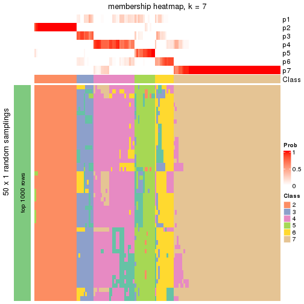</p>

</div>
<div id='tab-node-01-membership-heatmap-7'>
<pre><code class="r">membership_heatmap(res, k = 8)
</code></pre>

<p></p>

</div>
</div>

As soon as the classes for columns are determined, the signatures
that are significantly different between subgroups can be looked for. 
Following are the heatmaps for signatures.


<script>
$( function() {
	$( '#tabs-node-01-get-signatures' ).tabs();
} );
</script>
<div id='tabs-node-01-get-signatures'>
<ul>
<li><a href='#tab-node-01-get-signatures-1'>k = 2</a></li>
<li><a href='#tab-node-01-get-signatures-2'>k = 3</a></li>
<li><a href='#tab-node-01-get-signatures-3'>k = 4</a></li>
<li><a href='#tab-node-01-get-signatures-4'>k = 5</a></li>
<li><a href='#tab-node-01-get-signatures-5'>k = 6</a></li>
<li><a href='#tab-node-01-get-signatures-6'>k = 7</a></li>
<li><a href='#tab-node-01-get-signatures-7'>k = 8</a></li>
</ul>
<div id='tab-node-01-get-signatures-1'>
<pre><code class="r">get_signatures(res, k = 2)
</code></pre>

<p></p>

</div>
<div id='tab-node-01-get-signatures-2'>
<pre><code class="r">get_signatures(res, k = 3)
</code></pre>

<p></p>

</div>
<div id='tab-node-01-get-signatures-3'>
<pre><code class="r">get_signatures(res, k = 4)
</code></pre>

<p></p>

</div>
<div id='tab-node-01-get-signatures-4'>
<pre><code class="r">get_signatures(res, k = 5)
</code></pre>

<p></p>

</div>
<div id='tab-node-01-get-signatures-5'>
<pre><code class="r">get_signatures(res, k = 6)
</code></pre>

<p></p>

</div>
<div id='tab-node-01-get-signatures-6'>
<pre><code class="r">get_signatures(res, k = 7)
</code></pre>

<p></p>

</div>
<div id='tab-node-01-get-signatures-7'>
<pre><code class="r">get_signatures(res, k = 8)
</code></pre>

<p></p>

</div>
</div>


Compare the overlap of signatures from different k:

```r
compare_signatures(res)
```


`get_signature()` returns a data frame invisibly. To get the list of signatures, the function
call should be assigned to a variable explicitly. In following code, if `plot` argument is set
to `FALSE`, no heatmap is plotted while only the differential analysis is performed.

```r
# code only for demonstration
tb = get_signature(res, k = ..., plot = FALSE)
```

An example of the output of `tb` is:

```
#>   which_row         fdr    mean_1    mean_2 scaled_mean_1 scaled_mean_2 km
#> 1        38 0.042760348  8.373488  9.131774    -0.5533452     0.5164555  1
#> 2        40 0.018707592  7.106213  8.469186    -0.6173731     0.5762149  1
#> 3        55 0.019134737 10.221463 11.207825    -0.6159697     0.5749050  1
#> 4        59 0.006059896  5.921854  7.869574    -0.6899429     0.6439467  1
#> 5        60 0.018055526  8.928898 10.211722    -0.6204761     0.5791110  1
#> 6        98 0.009384629 15.714769 14.887706     0.6635654    -0.6193277  2
...
```

The columns in `tb` are:

1. `which_row`: row indices corresponding to the input matrix.
2. `fdr`: FDR for the differential test. 
3. `mean_x`: The mean value in group x.
4. `scaled_mean_x`: The mean value in group x after rows are scaled.
5. `km`: Row groups if k-means clustering is applied to rows (which is done by automatically selecting number of clusters).

If there are too many signatures, `top_signatures = ...` can be set to only show the 
signatures with the highest FDRs:

```r
# code only for demonstration
# e.g. to show the top 500 most significant rows
tb = get_signature(res, k = ..., top_signatures = 500)
```

If the signatures are defined as these which are uniquely high in current group, `diff_method` argument
can be set to `"uniquely_high_in_one_group"`:

```r
# code only for demonstration
tb = get_signature(res, k = ..., diff_method = "uniquely_high_in_one_group")
```


UMAP plot which shows how samples are separated.


<script>
$( function() {
	$( '#tabs-node-01-dimension-reduction' ).tabs();
} );
</script>
<div id='tabs-node-01-dimension-reduction'>
<ul>
<li><a href='#tab-node-01-dimension-reduction-1'>k = 2</a></li>
<li><a href='#tab-node-01-dimension-reduction-2'>k = 3</a></li>
<li><a href='#tab-node-01-dimension-reduction-3'>k = 4</a></li>
<li><a href='#tab-node-01-dimension-reduction-4'>k = 5</a></li>
<li><a href='#tab-node-01-dimension-reduction-5'>k = 6</a></li>
<li><a href='#tab-node-01-dimension-reduction-6'>k = 7</a></li>
<li><a href='#tab-node-01-dimension-reduction-7'>k = 8</a></li>
</ul>
<div id='tab-node-01-dimension-reduction-1'>
<pre><code class="r">dimension_reduction(res, k = 2, method = &quot;UMAP&quot;)
</code></pre>

<p></p>

</div>
<div id='tab-node-01-dimension-reduction-2'>
<pre><code class="r">dimension_reduction(res, k = 3, method = &quot;UMAP&quot;)
</code></pre>

<p></p>

</div>
<div id='tab-node-01-dimension-reduction-3'>
<pre><code class="r">dimension_reduction(res, k = 4, method = &quot;UMAP&quot;)
</code></pre>

<p></p>

</div>
<div id='tab-node-01-dimension-reduction-4'>
<pre><code class="r">dimension_reduction(res, k = 5, method = &quot;UMAP&quot;)
</code></pre>

<p></p>

</div>
<div id='tab-node-01-dimension-reduction-5'>
<pre><code class="r">dimension_reduction(res, k = 6, method = &quot;UMAP&quot;)
</code></pre>

<p></p>

</div>
<div id='tab-node-01-dimension-reduction-6'>
<pre><code class="r">dimension_reduction(res, k = 7, method = &quot;UMAP&quot;)
</code></pre>

<p></p>

</div>
<div id='tab-node-01-dimension-reduction-7'>
<pre><code class="r">dimension_reduction(res, k = 8, method = &quot;UMAP&quot;)
</code></pre>

<p></p>

</div>
</div>


Following heatmap shows how subgroups are split when increasing `k`:

```r
collect_classes(res)
```


If matrix rows can be associated to genes, consider to use `functional_enrichment(res,
...)` to perform function enrichment for the signature genes. See [this vignette](https://jokergoo.github.io/cola_vignettes/functional_enrichment.html) for more detailed explanations.


 

---------------------------------------------------


### Node011


Parent node: [Node01](#Node01).
Child nodes: 
                [Node0111](#Node0111)
        ,
                [Node0112](#Node0112)
        ,
                [Node0121](#Node0121)
        ,
                [Node0122](#Node0122)
        ,
                Node0211-leaf
        ,
                [Node0212](#Node0212)
        ,
                Node0411-leaf
        ,
                Node0412-leaf
        ,
                Node0413-leaf
        ,
                Node0414-leaf
        ,
                Node0421-leaf
        ,
                [Node0422](#Node0422)
        ,
                Node0423-leaf
        ,
                Node0431-leaf
        ,
                Node0432-leaf
        ,
                Node0433-leaf
        .


The object with results only for a single top-value method and a single partitioning method 
can be extracted as:

```r
res = res_rh["011"]
```

A summary of `res` and all the functions that can be applied to it:

```r
res
```

```
#> A 'ConsensusPartition' object with k = 2, 3, 4, 5, 6, 7, 8.
#>   On a matrix with 30000 rows and 104 columns.
#>   Top rows (1000) are extracted by 'ATC' method.
#>   Subgroups are detected by 'kmeans' method.
#>   Performed in total 350 partitions by row resampling.
#>   Best k for subgroups seems to be 2.
#> 
#> Following methods can be applied to this 'ConsensusPartition' object:
#>  [1] "cola_report"             "collect_classes"         "collect_plots"          
#>  [4] "collect_stats"           "colnames"                "compare_partitions"     
#>  [7] "compare_signatures"      "consensus_heatmap"       "dimension_reduction"    
#> [10] "functional_enrichment"   "get_anno_col"            "get_anno"               
#> [13] "get_classes"             "get_consensus"           "get_matrix"             
#> [16] "get_membership"          "get_param"               "get_signatures"         
#> [19] "get_stats"               "is_best_k"               "is_stable_k"            
#> [22] "membership_heatmap"      "ncol"                    "nrow"                   
#> [25] "plot_ecdf"               "predict_classes"         "rownames"               
#> [28] "select_partition_number" "show"                    "suggest_best_k"         
#> [31] "test_to_known_factors"   "top_rows_heatmap"
```

`collect_plots()` function collects all the plots made from `res` for all `k` (number of subgroups)
into one single page to provide an easy and fast comparison between different `k`.

```r
collect_plots(res)
```


The plots are:

- The first row: a plot of the eCDF (empirical cumulative distribution
  function) curves of the consensus matrix for each `k` and the heatmap of
  predicted classes for each `k`.
- The second row: heatmaps of the consensus matrix for each `k`.
- The third row: heatmaps of the membership matrix for each `k`.
- The fouth row: heatmaps of the signatures for each `k`.

All the plots in panels can be made by individual functions and they are
plotted later in this section.

`select_partition_number()` produces several plots showing different
statistics for choosing "optimized" `k`. There are following statistics:

- eCDF curves of the consensus matrix for each `k`;
- 1-PAC. [The PAC score](https://en.wikipedia.org/wiki/Consensus_clustering#Over-interpretation_potential_of_consensus_clustering)
  measures the proportion of the ambiguous subgrouping.
- Mean silhouette score.
- Concordance. The mean probability of fiting the consensus subgroup labels in all
  partitions.
- Area increased. Denote $A_k$ as the area under the eCDF curve for current
  `k`, the area increased is defined as $A_k - A_{k-1}$.
- Rand index. The percent of pairs of samples that are both in a same cluster
  or both are not in a same cluster in the partition of k and k-1.
- Jaccard index. The ratio of pairs of samples are both in a same cluster in
  the partition of k and k-1 and the pairs of samples are both in a same
  cluster in the partition k or k-1.

The detailed explanations of these statistics can be found in [the _cola_
vignette](https://jokergoo.github.io/cola_vignettes/cola.html#toc_13).

Generally speaking, higher 1-PAC score, higher mean silhouette score or higher
concordance corresponds to better partition. Rand index and Jaccard index
measure how similar the current partition is compared to partition with `k-1`.
If they are too similar, we won't accept `k` is better than `k-1`.

```r
select_partition_number(res)
```


The numeric values for all these statistics can be obtained by `get_stats()`.

```r
get_stats(res)
```

```
#>   k 1-PAC mean_silhouette concordance area_increased  Rand Jaccard
#> 2 2 1.000           0.976       0.989         0.4960 0.502   0.502
#> 3 3 0.640           0.790       0.896         0.3273 0.757   0.550
#> 4 4 0.783           0.897       0.930         0.1307 0.754   0.410
#> 5 5 0.829           0.728       0.852         0.0606 0.941   0.772
#> 6 6 0.799           0.476       0.660         0.0316 0.881   0.520
#> 7 7 0.785           0.558       0.792         0.0306 0.902   0.555
#> 8 8 0.797           0.568       0.729         0.0235 0.955   0.759
```

`suggest_best_k()` suggests the best $k$ based on these statistics. The rules are as follows:

- All $k$ with Jaccard index larger than 0.95 are removed because increasing
  $k$ does not provide enough extra information. If all $k$ are removed, it is
  marked as no subgroup is detected.
- For all $k$ with 1-PAC score larger than 0.9, the maximal $k$ is taken as
  the best $k$, and other $k$ are marked as optional $k$.
- If it does not fit the second rule. The $k$ with the maximal vote of the
  highest 1-PAC score, highest mean silhouette, and highest concordance is
  taken as the best $k$.

```r
suggest_best_k(res)
```

```
#> [1] 2
```


Following is the table of the partitions (You need to click the **show/hide
code output** link to see it). The membership matrix (columns with name `p*`)
is inferred by
[`clue::cl_consensus()`](https://www.rdocumentation.org/link/cl_consensus?package=clue)
function with the `SE` method. Basically the value in the membership matrix
represents the probability to belong to a certain group. The finall subgroup
label for an item is determined with the group with highest probability it
belongs to.

In `get_classes()` function, the entropy is calculated from the membership
matrix and the silhouette score is calculated from the consensus matrix.


<script>
$( function() {
	$( '#tabs-node-011-get-classes' ).tabs();
} );
</script>
<div id='tabs-node-011-get-classes'>
<ul>
<li><a href='#tab-node-011-get-classes-1'>k = 2</a></li>
<li><a href='#tab-node-011-get-classes-2'>k = 3</a></li>
<li><a href='#tab-node-011-get-classes-3'>k = 4</a></li>
<li><a href='#tab-node-011-get-classes-4'>k = 5</a></li>
<li><a href='#tab-node-011-get-classes-5'>k = 6</a></li>
<li><a href='#tab-node-011-get-classes-6'>k = 7</a></li>
<li><a href='#tab-node-011-get-classes-7'>k = 8</a></li>
</ul>

<div id='tab-node-011-get-classes-1'>
<p><a id='tab-node-011-get-classes-1-a' style='color:#0366d6' href='#'>show/hide code output</a></p>
<pre><code class="r">cbind(get_classes(res, k = 2), get_membership(res, k = 2))
</code></pre>

<pre><code>#&gt;                 class entropy silhouette   p1   p2
#&gt; TCGA.AG.A026.01     2   0.000      0.978 0.00 1.00
#&gt; TCGA.G4.6303.01     1   0.000      0.998 1.00 0.00
#&gt; TCGA.T9.A92H.01     1   0.000      0.998 1.00 0.00
#&gt; TCGA.AD.6965.01     2   0.000      0.978 0.00 1.00
#&gt; TCGA.A6.5660.01     2   0.722      0.760 0.20 0.80
#&gt; TCGA.F5.6571.01     1   0.000      0.998 1.00 0.00
#&gt; TCGA.CM.5862.01     2   0.000      0.978 0.00 1.00
#&gt; TCGA.CI.6622.01     1   0.000      0.998 1.00 0.00
#&gt; TCGA.EI.6512.01     1   0.000      0.998 1.00 0.00
#&gt; TCGA.QG.A5YX.01     2   0.000      0.978 0.00 1.00
#&gt; TCGA.AG.A036.01     2   0.904      0.554 0.32 0.68
#&gt; TCGA.AA.3509.01     1   0.000      0.998 1.00 0.00
#&gt; TCGA.EI.6883.01     1   0.000      0.998 1.00 0.00
#&gt; TCGA.RU.A8FL.01     2   0.000      0.978 0.00 1.00
#&gt; TCGA.AZ.6599.01     2   0.000      0.978 0.00 1.00
#&gt; TCGA.CM.5860.01     1   0.000      0.998 1.00 0.00
#&gt; TCGA.A6.6780.01     1   0.000      0.998 1.00 0.00
#&gt; TCGA.CM.4750.01     2   0.000      0.978 0.00 1.00
#&gt; TCGA.CM.6677.01     2   0.000      0.978 0.00 1.00
#&gt; TCGA.F5.6814.01     2   0.000      0.978 0.00 1.00
#&gt; TCGA.DM.A1D8.01     1   0.000      0.998 1.00 0.00
#&gt; TCGA.A6.6138.01     1   0.000      0.998 1.00 0.00
#&gt; TCGA.DM.A28F.01     2   0.000      0.978 0.00 1.00
#&gt; TCGA.DM.A1D4.01     1   0.000      0.998 1.00 0.00
#&gt; TCGA.DM.A0X9.01     2   0.000      0.978 0.00 1.00
#&gt; TCGA.AY.A69D.01     1   0.000      0.998 1.00 0.00
#&gt; TCGA.CA.6716.01     1   0.000      0.998 1.00 0.00
#&gt; TCGA.NH.A6GB.01     2   0.000      0.978 0.00 1.00
#&gt; TCGA.NH.A50U.01     2   0.000      0.978 0.00 1.00
#&gt; TCGA.AH.6644.01     1   0.000      0.998 1.00 0.00
#&gt; TCGA.CM.5864.01     2   0.000      0.978 0.00 1.00
#&gt; TCGA.AG.3742.01     2   0.000      0.978 0.00 1.00
#&gt; TCGA.A6.5666.01     2   0.000      0.978 0.00 1.00
#&gt; TCGA.AG.3591.01     2   0.000      0.978 0.00 1.00
#&gt; TCGA.AH.6643.01     1   0.000      0.998 1.00 0.00
#&gt; TCGA.EI.6510.01     2   0.000      0.978 0.00 1.00
#&gt; TCGA.A6.5656.01     1   0.000      0.998 1.00 0.00
#&gt; TCGA.DY.A1DG.01     2   0.000      0.978 0.00 1.00
#&gt; TCGA.F4.6806.01     1   0.000      0.998 1.00 0.00
#&gt; TCGA.5M.AAT4.01     1   0.000      0.998 1.00 0.00
#&gt; TCGA.EI.6514.01     1   0.000      0.998 1.00 0.00
#&gt; TCGA.DM.A282.01     1   0.000      0.998 1.00 0.00
#&gt; TCGA.DM.A1HA.01     1   0.000      0.998 1.00 0.00
#&gt; TCGA.AG.4021.01     2   0.000      0.978 0.00 1.00
#&gt; TCGA.DM.A1D9.01     2   0.000      0.978 0.00 1.00
#&gt; TCGA.CM.4744.01     2   0.000      0.978 0.00 1.00
#&gt; TCGA.A6.6652.01     1   0.000      0.998 1.00 0.00
#&gt; TCGA.SS.A7HO.01     2   0.000      0.978 0.00 1.00
#&gt; TCGA.A6.6650.01     1   0.141      0.978 0.98 0.02
#&gt; TCGA.NH.A50T.01     2   0.000      0.978 0.00 1.00
#&gt; TCGA.AD.6899.01     1   0.000      0.998 1.00 0.00
#&gt; TCGA.A6.A56B.01     1   0.000      0.998 1.00 0.00
#&gt; TCGA.D5.5539.01     2   0.722      0.760 0.20 0.80
#&gt; TCGA.AY.A54L.01     2   0.000      0.978 0.00 1.00
#&gt; TCGA.NH.A5IV.01     1   0.469      0.885 0.90 0.10
#&gt; TCGA.G4.6306.01     1   0.000      0.998 1.00 0.00
#&gt; TCGA.AD.A5EK.01     1   0.000      0.998 1.00 0.00
#&gt; TCGA.DC.5337.01     2   0.000      0.978 0.00 1.00
#&gt; TCGA.QG.A5YW.01     2   0.000      0.978 0.00 1.00
#&gt; TCGA.EI.6882.01     2   0.000      0.978 0.00 1.00
#&gt; TCGA.A6.2677.01     2   0.000      0.978 0.00 1.00
#&gt; TCGA.AA.3502.01     2   0.000      0.978 0.00 1.00
#&gt; TCGA.CK.5915.01     1   0.000      0.998 1.00 0.00
#&gt; TCGA.AY.6197.01     1   0.000      0.998 1.00 0.00
#&gt; TCGA.G4.6294.01     1   0.000      0.998 1.00 0.00
#&gt; TCGA.CM.6172.01     1   0.000      0.998 1.00 0.00
#&gt; TCGA.AA.3496.01     2   0.000      0.978 0.00 1.00
#&gt; TCGA.DM.A28A.01     1   0.000      0.998 1.00 0.00
#&gt; TCGA.EI.7002.01     1   0.000      0.998 1.00 0.00
#&gt; TCGA.QG.A5Z1.01     1   0.000      0.998 1.00 0.00
#&gt; TCGA.DM.A28H.01     1   0.000      0.998 1.00 0.00
#&gt; TCGA.DM.A28M.01     1   0.000      0.998 1.00 0.00
#&gt; TCGA.DM.A288.01     1   0.000      0.998 1.00 0.00
#&gt; TCGA.F4.6855.01     1   0.000      0.998 1.00 0.00
#&gt; TCGA.NH.A6GA.01     1   0.000      0.998 1.00 0.00
#&gt; TCGA.NH.A50V.01     1   0.000      0.998 1.00 0.00
#&gt; TCGA.CK.6747.01     1   0.000      0.998 1.00 0.00
#&gt; TCGA.CL.5918.01     2   0.000      0.978 0.00 1.00
#&gt; TCGA.DM.A28K.01     1   0.000      0.998 1.00 0.00
#&gt; TCGA.AA.3655.01     1   0.000      0.998 1.00 0.00
#&gt; TCGA.AZ.5407.01     1   0.000      0.998 1.00 0.00
#&gt; TCGA.QG.A5YV.01     1   0.000      0.998 1.00 0.00
#&gt; TCGA.AY.A71X.01     2   0.000      0.978 0.00 1.00
#&gt; TCGA.AH.6549.01     2   0.000      0.978 0.00 1.00
#&gt; TCGA.CM.6166.01     1   0.000      0.998 1.00 0.00
#&gt; TCGA.AH.6897.01     2   0.000      0.978 0.00 1.00
#&gt; TCGA.D5.5540.01     1   0.000      0.998 1.00 0.00
#&gt; TCGA.G5.6233.01     1   0.000      0.998 1.00 0.00
#&gt; TCGA.CA.6719.01     1   0.000      0.998 1.00 0.00
#&gt; TCGA.D5.5537.01     1   0.000      0.998 1.00 0.00
#&gt; TCGA.4T.AA8H.01     2   0.000      0.978 0.00 1.00
#&gt; TCGA.AG.3592.01     1   0.000      0.998 1.00 0.00
#&gt; TCGA.CM.6678.01     1   0.000      0.998 1.00 0.00
#&gt; TCGA.CK.5914.01     1   0.000      0.998 1.00 0.00
#&gt; TCGA.EI.6508.01     2   0.000      0.978 0.00 1.00
#&gt; TCGA.D5.6532.01     2   0.000      0.978 0.00 1.00
#&gt; TCGA.A6.2680.01     2   0.827      0.667 0.26 0.74
#&gt; TCGA.CM.6680.01     2   0.000      0.978 0.00 1.00
#&gt; TCGA.AA.3660.01     1   0.000      0.998 1.00 0.00
#&gt; TCGA.CM.4747.01     1   0.000      0.998 1.00 0.00
#&gt; TCGA.EF.5831.01     1   0.000      0.998 1.00 0.00
#&gt; TCGA.DM.A28G.01     2   0.000      0.978 0.00 1.00
#&gt; TCGA.D5.6537.01     2   0.000      0.978 0.00 1.00
#&gt; TCGA.DY.A1DD.01     2   0.000      0.978 0.00 1.00
</code></pre>

<script>
$('#tab-node-011-get-classes-1-a').parent().next().next().hide();
$('#tab-node-011-get-classes-1-a').click(function(){
  $('#tab-node-011-get-classes-1-a').parent().next().next().toggle();
  return(false);
});
</script>
</div>

<div id='tab-node-011-get-classes-2'>
<p><a id='tab-node-011-get-classes-2-a' style='color:#0366d6' href='#'>show/hide code output</a></p>
<pre><code class="r">cbind(get_classes(res, k = 3), get_membership(res, k = 3))
</code></pre>

<pre><code>#&gt;                 class entropy silhouette   p1   p2   p3
#&gt; TCGA.AG.A026.01     2   0.369      0.809 0.00 0.86 0.14
#&gt; TCGA.G4.6303.01     1   0.540      0.745 0.72 0.00 0.28
#&gt; TCGA.T9.A92H.01     1   0.631      0.269 0.50 0.00 0.50
#&gt; TCGA.AD.6965.01     2   0.000      0.899 0.00 1.00 0.00
#&gt; TCGA.A6.5660.01     3   0.000      0.849 0.00 0.00 1.00
#&gt; TCGA.F5.6571.01     1   0.000      0.871 1.00 0.00 0.00
#&gt; TCGA.CM.5862.01     2   0.000      0.899 0.00 1.00 0.00
#&gt; TCGA.CI.6622.01     1   0.000      0.871 1.00 0.00 0.00
#&gt; TCGA.EI.6512.01     1   0.000      0.871 1.00 0.00 0.00
#&gt; TCGA.QG.A5YX.01     2   0.000      0.899 0.00 1.00 0.00
#&gt; TCGA.AG.A036.01     3   0.000      0.849 0.00 0.00 1.00
#&gt; TCGA.AA.3509.01     1   0.000      0.871 1.00 0.00 0.00
#&gt; TCGA.EI.6883.01     1   0.000      0.871 1.00 0.00 0.00
#&gt; TCGA.RU.A8FL.01     3   0.571      0.420 0.00 0.32 0.68
#&gt; TCGA.AZ.6599.01     2   0.000      0.899 0.00 1.00 0.00
#&gt; TCGA.CM.5860.01     1   0.540      0.745 0.72 0.00 0.28
#&gt; TCGA.A6.6780.01     3   0.334      0.791 0.12 0.00 0.88
#&gt; TCGA.CM.4750.01     2   0.624      0.328 0.00 0.56 0.44
#&gt; TCGA.CM.6677.01     2   0.429      0.770 0.00 0.82 0.18
#&gt; TCGA.F5.6814.01     3   0.400      0.720 0.00 0.16 0.84
#&gt; TCGA.DM.A1D8.01     1   0.000      0.871 1.00 0.00 0.00
#&gt; TCGA.A6.6138.01     1   0.000      0.871 1.00 0.00 0.00
#&gt; TCGA.DM.A28F.01     2   0.000      0.899 0.00 1.00 0.00
#&gt; TCGA.DM.A1D4.01     3   0.000      0.849 0.00 0.00 1.00
#&gt; TCGA.DM.A0X9.01     3   0.369      0.742 0.00 0.14 0.86
#&gt; TCGA.AY.A69D.01     1   0.000      0.871 1.00 0.00 0.00
#&gt; TCGA.CA.6716.01     1   0.000      0.871 1.00 0.00 0.00
#&gt; TCGA.NH.A6GB.01     2   0.000      0.899 0.00 1.00 0.00
#&gt; TCGA.NH.A50U.01     2   0.153      0.880 0.00 0.96 0.04
#&gt; TCGA.AH.6644.01     1   0.540      0.745 0.72 0.00 0.28
#&gt; TCGA.CM.5864.01     2   0.153      0.880 0.00 0.96 0.04
#&gt; TCGA.AG.3742.01     2   0.624      0.328 0.00 0.56 0.44
#&gt; TCGA.A6.5666.01     2   0.000      0.899 0.00 1.00 0.00
#&gt; TCGA.AG.3591.01     2   0.000      0.899 0.00 1.00 0.00
#&gt; TCGA.AH.6643.01     1   0.540      0.745 0.72 0.00 0.28
#&gt; TCGA.EI.6510.01     2   0.624      0.328 0.00 0.56 0.44
#&gt; TCGA.A6.5656.01     3   0.334      0.791 0.12 0.00 0.88
#&gt; TCGA.DY.A1DG.01     2   0.400      0.791 0.00 0.84 0.16
#&gt; TCGA.F4.6806.01     1   0.540      0.745 0.72 0.00 0.28
#&gt; TCGA.5M.AAT4.01     3   0.334      0.791 0.12 0.00 0.88
#&gt; TCGA.EI.6514.01     3   0.455      0.670 0.20 0.00 0.80
#&gt; TCGA.DM.A282.01     1   0.000      0.871 1.00 0.00 0.00
#&gt; TCGA.DM.A1HA.01     3   0.207      0.831 0.06 0.00 0.94
#&gt; TCGA.AG.4021.01     2   0.000      0.899 0.00 1.00 0.00
#&gt; TCGA.DM.A1D9.01     3   0.455      0.668 0.00 0.20 0.80
#&gt; TCGA.CM.4744.01     2   0.000      0.899 0.00 1.00 0.00
#&gt; TCGA.A6.6652.01     3   0.455      0.670 0.20 0.00 0.80
#&gt; TCGA.SS.A7HO.01     2   0.000      0.899 0.00 1.00 0.00
#&gt; TCGA.A6.6650.01     3   0.000      0.849 0.00 0.00 1.00
#&gt; TCGA.NH.A50T.01     2   0.000      0.899 0.00 1.00 0.00
#&gt; TCGA.AD.6899.01     1   0.000      0.871 1.00 0.00 0.00
#&gt; TCGA.A6.A56B.01     1   0.000      0.871 1.00 0.00 0.00
#&gt; TCGA.D5.5539.01     3   0.000      0.849 0.00 0.00 1.00
#&gt; TCGA.AY.A54L.01     2   0.000      0.899 0.00 1.00 0.00
#&gt; TCGA.NH.A5IV.01     3   0.000      0.849 0.00 0.00 1.00
#&gt; TCGA.G4.6306.01     3   0.334      0.791 0.12 0.00 0.88
#&gt; TCGA.AD.A5EK.01     1   0.000      0.871 1.00 0.00 0.00
#&gt; TCGA.DC.5337.01     2   0.000      0.899 0.00 1.00 0.00
#&gt; TCGA.QG.A5YW.01     2   0.000      0.899 0.00 1.00 0.00
#&gt; TCGA.EI.6882.01     3   0.455      0.668 0.00 0.20 0.80
#&gt; TCGA.A6.2677.01     3   0.624      0.049 0.00 0.44 0.56
#&gt; TCGA.AA.3502.01     2   0.000      0.899 0.00 1.00 0.00
#&gt; TCGA.CK.5915.01     1   0.000      0.871 1.00 0.00 0.00
#&gt; TCGA.AY.6197.01     1   0.000      0.871 1.00 0.00 0.00
#&gt; TCGA.G4.6294.01     1   0.000      0.871 1.00 0.00 0.00
#&gt; TCGA.CM.6172.01     1   0.000      0.871 1.00 0.00 0.00
#&gt; TCGA.AA.3496.01     2   0.254      0.855 0.00 0.92 0.08
#&gt; TCGA.DM.A28A.01     1   0.000      0.871 1.00 0.00 0.00
#&gt; TCGA.EI.7002.01     1   0.540      0.745 0.72 0.00 0.28
#&gt; TCGA.QG.A5Z1.01     1   0.000      0.871 1.00 0.00 0.00
#&gt; TCGA.DM.A28H.01     1   0.540      0.745 0.72 0.00 0.28
#&gt; TCGA.DM.A28M.01     3   0.334      0.791 0.12 0.00 0.88
#&gt; TCGA.DM.A288.01     1   0.522      0.758 0.74 0.00 0.26
#&gt; TCGA.F4.6855.01     1   0.502      0.770 0.76 0.00 0.24
#&gt; TCGA.NH.A6GA.01     3   0.296      0.807 0.10 0.00 0.90
#&gt; TCGA.NH.A50V.01     1   0.000      0.871 1.00 0.00 0.00
#&gt; TCGA.CK.6747.01     1   0.540      0.745 0.72 0.00 0.28
#&gt; TCGA.CL.5918.01     2   0.624      0.328 0.00 0.56 0.44
#&gt; TCGA.DM.A28K.01     3   0.000      0.849 0.00 0.00 1.00
#&gt; TCGA.AA.3655.01     1   0.000      0.871 1.00 0.00 0.00
#&gt; TCGA.AZ.5407.01     1   0.540      0.745 0.72 0.00 0.28
#&gt; TCGA.QG.A5YV.01     1   0.540      0.745 0.72 0.00 0.28
#&gt; TCGA.AY.A71X.01     3   0.455      0.668 0.00 0.20 0.80
#&gt; TCGA.AH.6549.01     2   0.000      0.899 0.00 1.00 0.00
#&gt; TCGA.CM.6166.01     3   0.334      0.791 0.12 0.00 0.88
#&gt; TCGA.AH.6897.01     2   0.000      0.899 0.00 1.00 0.00
#&gt; TCGA.D5.5540.01     1   0.000      0.871 1.00 0.00 0.00
#&gt; TCGA.G5.6233.01     1   0.000      0.871 1.00 0.00 0.00
#&gt; TCGA.CA.6719.01     3   0.000      0.849 0.00 0.00 1.00
#&gt; TCGA.D5.5537.01     1   0.540      0.745 0.72 0.00 0.28
#&gt; TCGA.4T.AA8H.01     2   0.000      0.899 0.00 1.00 0.00
#&gt; TCGA.AG.3592.01     1   0.400      0.809 0.84 0.00 0.16
#&gt; TCGA.CM.6678.01     1   0.000      0.871 1.00 0.00 0.00
#&gt; TCGA.CK.5914.01     1   0.000      0.871 1.00 0.00 0.00
#&gt; TCGA.EI.6508.01     2   0.000      0.899 0.00 1.00 0.00
#&gt; TCGA.D5.6532.01     2   0.624      0.328 0.00 0.56 0.44
#&gt; TCGA.A6.2680.01     3   0.000      0.849 0.00 0.00 1.00
#&gt; TCGA.CM.6680.01     3   0.455      0.668 0.00 0.20 0.80
#&gt; TCGA.AA.3660.01     1   0.540      0.745 0.72 0.00 0.28
#&gt; TCGA.CM.4747.01     1   0.000      0.871 1.00 0.00 0.00
#&gt; TCGA.EF.5831.01     1   0.540      0.745 0.72 0.00 0.28
#&gt; TCGA.DM.A28G.01     3   0.000      0.849 0.00 0.00 1.00
#&gt; TCGA.D5.6537.01     2   0.000      0.899 0.00 1.00 0.00
#&gt; TCGA.DY.A1DD.01     3   0.000      0.849 0.00 0.00 1.00
</code></pre>

<script>
$('#tab-node-011-get-classes-2-a').parent().next().next().hide();
$('#tab-node-011-get-classes-2-a').click(function(){
  $('#tab-node-011-get-classes-2-a').parent().next().next().toggle();
  return(false);
});
</script>
</div>

<div id='tab-node-011-get-classes-3'>
<p><a id='tab-node-011-get-classes-3-a' style='color:#0366d6' href='#'>show/hide code output</a></p>
<pre><code class="r">cbind(get_classes(res, k = 4), get_membership(res, k = 4))
</code></pre>

<pre><code>#&gt;                 class entropy silhouette   p1   p2   p3   p4
#&gt; TCGA.AG.A026.01     4  0.0707     0.8906 0.00 0.02 0.00 0.98
#&gt; TCGA.G4.6303.01     3  0.3400     0.8563 0.18 0.00 0.82 0.00
#&gt; TCGA.T9.A92H.01     3  0.1211     0.8590 0.04 0.00 0.96 0.00
#&gt; TCGA.AD.6965.01     2  0.0000     0.9681 0.00 1.00 0.00 0.00
#&gt; TCGA.A6.5660.01     4  0.3400     0.8835 0.00 0.00 0.18 0.82
#&gt; TCGA.F5.6571.01     1  0.0000     0.9871 1.00 0.00 0.00 0.00
#&gt; TCGA.CM.5862.01     4  0.2647     0.8083 0.00 0.12 0.00 0.88
#&gt; TCGA.CI.6622.01     1  0.0000     0.9871 1.00 0.00 0.00 0.00
#&gt; TCGA.EI.6512.01     1  0.0000     0.9871 1.00 0.00 0.00 0.00
#&gt; TCGA.QG.A5YX.01     2  0.3172     0.8585 0.00 0.84 0.00 0.16
#&gt; TCGA.AG.A036.01     4  0.3400     0.8835 0.00 0.00 0.18 0.82
#&gt; TCGA.AA.3509.01     1  0.0000     0.9871 1.00 0.00 0.00 0.00
#&gt; TCGA.EI.6883.01     1  0.0000     0.9871 1.00 0.00 0.00 0.00
#&gt; TCGA.RU.A8FL.01     4  0.0707     0.8906 0.00 0.02 0.00 0.98
#&gt; TCGA.AZ.6599.01     2  0.0000     0.9681 0.00 1.00 0.00 0.00
#&gt; TCGA.CM.5860.01     3  0.3400     0.8563 0.18 0.00 0.82 0.00
#&gt; TCGA.A6.6780.01     3  0.0000     0.8512 0.00 0.00 1.00 0.00
#&gt; TCGA.CM.4750.01     4  0.0707     0.8906 0.00 0.02 0.00 0.98
#&gt; TCGA.CM.6677.01     4  0.0707     0.8906 0.00 0.02 0.00 0.98
#&gt; TCGA.F5.6814.01     4  0.3400     0.8835 0.00 0.00 0.18 0.82
#&gt; TCGA.DM.A1D8.01     1  0.3801     0.6700 0.78 0.00 0.22 0.00
#&gt; TCGA.A6.6138.01     1  0.0000     0.9871 1.00 0.00 0.00 0.00
#&gt; TCGA.DM.A28F.01     2  0.0000     0.9681 0.00 1.00 0.00 0.00
#&gt; TCGA.DM.A1D4.01     3  0.0707     0.8362 0.00 0.00 0.98 0.02
#&gt; TCGA.DM.A0X9.01     4  0.3400     0.8835 0.00 0.00 0.18 0.82
#&gt; TCGA.AY.A69D.01     1  0.0000     0.9871 1.00 0.00 0.00 0.00
#&gt; TCGA.CA.6716.01     1  0.0000     0.9871 1.00 0.00 0.00 0.00
#&gt; TCGA.NH.A6GB.01     2  0.0000     0.9681 0.00 1.00 0.00 0.00
#&gt; TCGA.NH.A50U.01     4  0.2647     0.8083 0.00 0.12 0.00 0.88
#&gt; TCGA.AH.6644.01     3  0.3400     0.8563 0.18 0.00 0.82 0.00
#&gt; TCGA.CM.5864.01     4  0.2647     0.8083 0.00 0.12 0.00 0.88
#&gt; TCGA.AG.3742.01     4  0.0707     0.8906 0.00 0.02 0.00 0.98
#&gt; TCGA.A6.5666.01     2  0.3172     0.8585 0.00 0.84 0.00 0.16
#&gt; TCGA.AG.3591.01     2  0.3172     0.8585 0.00 0.84 0.00 0.16
#&gt; TCGA.AH.6643.01     3  0.3400     0.8563 0.18 0.00 0.82 0.00
#&gt; TCGA.EI.6510.01     4  0.0707     0.8906 0.00 0.02 0.00 0.98
#&gt; TCGA.A6.5656.01     3  0.0000     0.8512 0.00 0.00 1.00 0.00
#&gt; TCGA.DY.A1DG.01     4  0.0707     0.8906 0.00 0.02 0.00 0.98
#&gt; TCGA.F4.6806.01     3  0.3400     0.8563 0.18 0.00 0.82 0.00
#&gt; TCGA.5M.AAT4.01     3  0.0000     0.8512 0.00 0.00 1.00 0.00
#&gt; TCGA.EI.6514.01     3  0.0000     0.8512 0.00 0.00 1.00 0.00
#&gt; TCGA.DM.A282.01     1  0.0000     0.9871 1.00 0.00 0.00 0.00
#&gt; TCGA.DM.A1HA.01     3  0.0707     0.8504 0.00 0.00 0.98 0.02
#&gt; TCGA.AG.4021.01     2  0.0000     0.9681 0.00 1.00 0.00 0.00
#&gt; TCGA.DM.A1D9.01     4  0.3400     0.8835 0.00 0.00 0.18 0.82
#&gt; TCGA.CM.4744.01     2  0.0000     0.9681 0.00 1.00 0.00 0.00
#&gt; TCGA.A6.6652.01     3  0.0000     0.8512 0.00 0.00 1.00 0.00
#&gt; TCGA.SS.A7HO.01     2  0.0000     0.9681 0.00 1.00 0.00 0.00
#&gt; TCGA.A6.6650.01     3  0.3975     0.5259 0.00 0.00 0.76 0.24
#&gt; TCGA.NH.A50T.01     2  0.0000     0.9681 0.00 1.00 0.00 0.00
#&gt; TCGA.AD.6899.01     1  0.0000     0.9871 1.00 0.00 0.00 0.00
#&gt; TCGA.A6.A56B.01     1  0.0000     0.9871 1.00 0.00 0.00 0.00
#&gt; TCGA.D5.5539.01     4  0.3400     0.8835 0.00 0.00 0.18 0.82
#&gt; TCGA.AY.A54L.01     2  0.0000     0.9681 0.00 1.00 0.00 0.00
#&gt; TCGA.NH.A5IV.01     3  0.4855     0.0651 0.00 0.00 0.60 0.40
#&gt; TCGA.G4.6306.01     3  0.0000     0.8512 0.00 0.00 1.00 0.00
#&gt; TCGA.AD.A5EK.01     1  0.0000     0.9871 1.00 0.00 0.00 0.00
#&gt; TCGA.DC.5337.01     2  0.0000     0.9681 0.00 1.00 0.00 0.00
#&gt; TCGA.QG.A5YW.01     2  0.0000     0.9681 0.00 1.00 0.00 0.00
#&gt; TCGA.EI.6882.01     4  0.3400     0.8835 0.00 0.00 0.18 0.82
#&gt; TCGA.A6.2677.01     4  0.0707     0.8906 0.00 0.02 0.00 0.98
#&gt; TCGA.AA.3502.01     2  0.0000     0.9681 0.00 1.00 0.00 0.00
#&gt; TCGA.CK.5915.01     1  0.0000     0.9871 1.00 0.00 0.00 0.00
#&gt; TCGA.AY.6197.01     1  0.0000     0.9871 1.00 0.00 0.00 0.00
#&gt; TCGA.G4.6294.01     1  0.0000     0.9871 1.00 0.00 0.00 0.00
#&gt; TCGA.CM.6172.01     1  0.0000     0.9871 1.00 0.00 0.00 0.00
#&gt; TCGA.AA.3496.01     4  0.0707     0.8906 0.00 0.02 0.00 0.98
#&gt; TCGA.DM.A28A.01     1  0.0000     0.9871 1.00 0.00 0.00 0.00
#&gt; TCGA.EI.7002.01     3  0.3400     0.8563 0.18 0.00 0.82 0.00
#&gt; TCGA.QG.A5Z1.01     1  0.0000     0.9871 1.00 0.00 0.00 0.00
#&gt; TCGA.DM.A28H.01     3  0.3400     0.8563 0.18 0.00 0.82 0.00
#&gt; TCGA.DM.A28M.01     3  0.0000     0.8512 0.00 0.00 1.00 0.00
#&gt; TCGA.DM.A288.01     3  0.3400     0.8563 0.18 0.00 0.82 0.00
#&gt; TCGA.F4.6855.01     3  0.3400     0.8563 0.18 0.00 0.82 0.00
#&gt; TCGA.NH.A6GA.01     3  0.0000     0.8512 0.00 0.00 1.00 0.00
#&gt; TCGA.NH.A50V.01     1  0.0707     0.9678 0.98 0.00 0.02 0.00
#&gt; TCGA.CK.6747.01     3  0.3400     0.8563 0.18 0.00 0.82 0.00
#&gt; TCGA.CL.5918.01     4  0.0707     0.8906 0.00 0.02 0.00 0.98
#&gt; TCGA.DM.A28K.01     3  0.0000     0.8512 0.00 0.00 1.00 0.00
#&gt; TCGA.AA.3655.01     1  0.0000     0.9871 1.00 0.00 0.00 0.00
#&gt; TCGA.AZ.5407.01     3  0.3400     0.8563 0.18 0.00 0.82 0.00
#&gt; TCGA.QG.A5YV.01     3  0.3400     0.8563 0.18 0.00 0.82 0.00
#&gt; TCGA.AY.A71X.01     4  0.3400     0.8835 0.00 0.00 0.18 0.82
#&gt; TCGA.AH.6549.01     2  0.0000     0.9681 0.00 1.00 0.00 0.00
#&gt; TCGA.CM.6166.01     3  0.0000     0.8512 0.00 0.00 1.00 0.00
#&gt; TCGA.AH.6897.01     2  0.0000     0.9681 0.00 1.00 0.00 0.00
#&gt; TCGA.D5.5540.01     1  0.0000     0.9871 1.00 0.00 0.00 0.00
#&gt; TCGA.G5.6233.01     1  0.0000     0.9871 1.00 0.00 0.00 0.00
#&gt; TCGA.CA.6719.01     3  0.0000     0.8512 0.00 0.00 1.00 0.00
#&gt; TCGA.D5.5537.01     3  0.3400     0.8563 0.18 0.00 0.82 0.00
#&gt; TCGA.4T.AA8H.01     2  0.0000     0.9681 0.00 1.00 0.00 0.00
#&gt; TCGA.AG.3592.01     3  0.3400     0.8563 0.18 0.00 0.82 0.00
#&gt; TCGA.CM.6678.01     1  0.0000     0.9871 1.00 0.00 0.00 0.00
#&gt; TCGA.CK.5914.01     1  0.0000     0.9871 1.00 0.00 0.00 0.00
#&gt; TCGA.EI.6508.01     2  0.0000     0.9681 0.00 1.00 0.00 0.00
#&gt; TCGA.D5.6532.01     4  0.0707     0.8906 0.00 0.02 0.00 0.98
#&gt; TCGA.A6.2680.01     4  0.3400     0.8835 0.00 0.00 0.18 0.82
#&gt; TCGA.CM.6680.01     4  0.3172     0.8858 0.00 0.00 0.16 0.84
#&gt; TCGA.AA.3660.01     3  0.3400     0.8563 0.18 0.00 0.82 0.00
#&gt; TCGA.CM.4747.01     1  0.1211     0.9455 0.96 0.00 0.04 0.00
#&gt; TCGA.EF.5831.01     3  0.3400     0.8563 0.18 0.00 0.82 0.00
#&gt; TCGA.DM.A28G.01     4  0.3400     0.8835 0.00 0.00 0.18 0.82
#&gt; TCGA.D5.6537.01     2  0.3172     0.8585 0.00 0.84 0.00 0.16
#&gt; TCGA.DY.A1DD.01     4  0.3400     0.8835 0.00 0.00 0.18 0.82
</code></pre>

<script>
$('#tab-node-011-get-classes-3-a').parent().next().next().hide();
$('#tab-node-011-get-classes-3-a').click(function(){
  $('#tab-node-011-get-classes-3-a').parent().next().next().toggle();
  return(false);
});
</script>
</div>

<div id='tab-node-011-get-classes-4'>
<p><a id='tab-node-011-get-classes-4-a' style='color:#0366d6' href='#'>show/hide code output</a></p>
<pre><code class="r">cbind(get_classes(res, k = 5), get_membership(res, k = 5))
</code></pre>

<pre><code>#&gt;                 class entropy silhouette   p1   p2   p3   p4   p5
#&gt; TCGA.AG.A026.01     4  0.0000      0.730 0.00 0.00 0.00 1.00 0.00
#&gt; TCGA.G4.6303.01     3  0.1410      0.827 0.00 0.00 0.94 0.00 0.06
#&gt; TCGA.T9.A92H.01     3  0.2516      0.809 0.00 0.00 0.86 0.00 0.14
#&gt; TCGA.AD.6965.01     2  0.0000      0.896 0.00 1.00 0.00 0.00 0.00
#&gt; TCGA.A6.5660.01     5  0.3983      0.413 0.00 0.00 0.00 0.34 0.66
#&gt; TCGA.F5.6571.01     1  0.0000      0.944 1.00 0.00 0.00 0.00 0.00
#&gt; TCGA.CM.5862.01     4  0.0609      0.714 0.00 0.02 0.00 0.98 0.00
#&gt; TCGA.CI.6622.01     1  0.0000      0.944 1.00 0.00 0.00 0.00 0.00
#&gt; TCGA.EI.6512.01     1  0.0000      0.944 1.00 0.00 0.00 0.00 0.00
#&gt; TCGA.QG.A5YX.01     2  0.4302      0.404 0.00 0.52 0.00 0.48 0.00
#&gt; TCGA.AG.A036.01     5  0.3895      0.444 0.00 0.00 0.00 0.32 0.68
#&gt; TCGA.AA.3509.01     1  0.0609      0.932 0.98 0.00 0.02 0.00 0.00
#&gt; TCGA.EI.6883.01     1  0.0609      0.944 0.98 0.00 0.00 0.00 0.02
#&gt; TCGA.RU.A8FL.01     4  0.1043      0.739 0.00 0.00 0.00 0.96 0.04
#&gt; TCGA.AZ.6599.01     2  0.0000      0.896 0.00 1.00 0.00 0.00 0.00
#&gt; TCGA.CM.5860.01     3  0.0000      0.847 0.00 0.00 1.00 0.00 0.00
#&gt; TCGA.A6.6780.01     3  0.3561      0.697 0.00 0.00 0.74 0.00 0.26
#&gt; TCGA.CM.4750.01     4  0.1043      0.739 0.00 0.00 0.00 0.96 0.04
#&gt; TCGA.CM.6677.01     4  0.1043      0.739 0.00 0.00 0.00 0.96 0.04
#&gt; TCGA.F5.6814.01     4  0.4262      0.365 0.00 0.00 0.00 0.56 0.44
#&gt; TCGA.DM.A1D8.01     3  0.4227      0.122 0.42 0.00 0.58 0.00 0.00
#&gt; TCGA.A6.6138.01     1  0.0000      0.944 1.00 0.00 0.00 0.00 0.00
#&gt; TCGA.DM.A28F.01     2  0.0000      0.896 0.00 1.00 0.00 0.00 0.00
#&gt; TCGA.DM.A1D4.01     5  0.2732      0.501 0.00 0.00 0.16 0.00 0.84
#&gt; TCGA.DM.A0X9.01     4  0.4262      0.365 0.00 0.00 0.00 0.56 0.44
#&gt; TCGA.AY.A69D.01     1  0.0609      0.944 0.98 0.00 0.00 0.00 0.02
#&gt; TCGA.CA.6716.01     1  0.0609      0.944 0.98 0.00 0.00 0.00 0.02
#&gt; TCGA.NH.A6GB.01     2  0.0000      0.896 0.00 1.00 0.00 0.00 0.00
#&gt; TCGA.NH.A50U.01     4  0.1216      0.726 0.00 0.02 0.00 0.96 0.02
#&gt; TCGA.AH.6644.01     3  0.0000      0.847 0.00 0.00 1.00 0.00 0.00
#&gt; TCGA.CM.5864.01     4  0.0609      0.714 0.00 0.02 0.00 0.98 0.00
#&gt; TCGA.AG.3742.01     4  0.3109      0.651 0.00 0.00 0.00 0.80 0.20
#&gt; TCGA.A6.5666.01     2  0.4262      0.478 0.00 0.56 0.00 0.44 0.00
#&gt; TCGA.AG.3591.01     2  0.4302      0.404 0.00 0.52 0.00 0.48 0.00
#&gt; TCGA.AH.6643.01     3  0.1410      0.827 0.00 0.00 0.94 0.00 0.06
#&gt; TCGA.EI.6510.01     4  0.3109      0.651 0.00 0.00 0.00 0.80 0.20
#&gt; TCGA.A6.5656.01     3  0.3684      0.716 0.00 0.00 0.72 0.00 0.28
#&gt; TCGA.DY.A1DG.01     4  0.0000      0.730 0.00 0.00 0.00 1.00 0.00
#&gt; TCGA.F4.6806.01     3  0.0000      0.847 0.00 0.00 1.00 0.00 0.00
#&gt; TCGA.5M.AAT4.01     3  0.3424      0.715 0.00 0.00 0.76 0.00 0.24
#&gt; TCGA.EI.6514.01     3  0.3274      0.767 0.00 0.00 0.78 0.00 0.22
#&gt; TCGA.DM.A282.01     1  0.0000      0.944 1.00 0.00 0.00 0.00 0.00
#&gt; TCGA.DM.A1HA.01     5  0.4287     -0.410 0.00 0.00 0.46 0.00 0.54
#&gt; TCGA.AG.4021.01     2  0.0000      0.896 0.00 1.00 0.00 0.00 0.00
#&gt; TCGA.DM.A1D9.01     4  0.4262      0.365 0.00 0.00 0.00 0.56 0.44
#&gt; TCGA.CM.4744.01     2  0.0000      0.896 0.00 1.00 0.00 0.00 0.00
#&gt; TCGA.A6.6652.01     3  0.3424      0.757 0.00 0.00 0.76 0.00 0.24
#&gt; TCGA.SS.A7HO.01     2  0.0000      0.896 0.00 1.00 0.00 0.00 0.00
#&gt; TCGA.A6.6650.01     5  0.5083      0.558 0.00 0.00 0.16 0.14 0.70
#&gt; TCGA.NH.A50T.01     2  0.0000      0.896 0.00 1.00 0.00 0.00 0.00
#&gt; TCGA.AD.6899.01     1  0.1410      0.900 0.94 0.00 0.06 0.00 0.00
#&gt; TCGA.A6.A56B.01     1  0.4252      0.634 0.70 0.00 0.28 0.00 0.02
#&gt; TCGA.D5.5539.01     5  0.3895      0.445 0.00 0.00 0.00 0.32 0.68
#&gt; TCGA.AY.A54L.01     2  0.0000      0.896 0.00 1.00 0.00 0.00 0.00
#&gt; TCGA.NH.A5IV.01     5  0.5083      0.557 0.00 0.00 0.14 0.16 0.70
#&gt; TCGA.G4.6306.01     3  0.3424      0.715 0.00 0.00 0.76 0.00 0.24
#&gt; TCGA.AD.A5EK.01     1  0.0609      0.944 0.98 0.00 0.00 0.00 0.02
#&gt; TCGA.DC.5337.01     2  0.1043      0.876 0.00 0.96 0.00 0.04 0.00
#&gt; TCGA.QG.A5YW.01     2  0.0000      0.896 0.00 1.00 0.00 0.00 0.00
#&gt; TCGA.EI.6882.01     4  0.4262      0.365 0.00 0.00 0.00 0.56 0.44
#&gt; TCGA.A6.2677.01     4  0.0000      0.730 0.00 0.00 0.00 1.00 0.00
#&gt; TCGA.AA.3502.01     2  0.0000      0.896 0.00 1.00 0.00 0.00 0.00
#&gt; TCGA.CK.5915.01     1  0.0609      0.944 0.98 0.00 0.00 0.00 0.02
#&gt; TCGA.AY.6197.01     1  0.0000      0.944 1.00 0.00 0.00 0.00 0.00
#&gt; TCGA.G4.6294.01     1  0.0609      0.944 0.98 0.00 0.00 0.00 0.02
#&gt; TCGA.CM.6172.01     1  0.0609      0.944 0.98 0.00 0.00 0.00 0.02
#&gt; TCGA.AA.3496.01     4  0.0000      0.730 0.00 0.00 0.00 1.00 0.00
#&gt; TCGA.DM.A28A.01     1  0.0609      0.944 0.98 0.00 0.00 0.00 0.02
#&gt; TCGA.EI.7002.01     3  0.1732      0.817 0.00 0.00 0.92 0.00 0.08
#&gt; TCGA.QG.A5Z1.01     1  0.0000      0.944 1.00 0.00 0.00 0.00 0.00
#&gt; TCGA.DM.A28H.01     3  0.0000      0.847 0.00 0.00 1.00 0.00 0.00
#&gt; TCGA.DM.A28M.01     3  0.3561      0.697 0.00 0.00 0.74 0.00 0.26
#&gt; TCGA.DM.A288.01     3  0.0000      0.847 0.00 0.00 1.00 0.00 0.00
#&gt; TCGA.F4.6855.01     3  0.0609      0.836 0.02 0.00 0.98 0.00 0.00
#&gt; TCGA.NH.A6GA.01     3  0.3561      0.697 0.00 0.00 0.74 0.00 0.26
#&gt; TCGA.NH.A50V.01     1  0.3796      0.628 0.70 0.00 0.30 0.00 0.00
#&gt; TCGA.CK.6747.01     3  0.0000      0.847 0.00 0.00 1.00 0.00 0.00
#&gt; TCGA.CL.5918.01     4  0.1043      0.739 0.00 0.00 0.00 0.96 0.04
#&gt; TCGA.DM.A28K.01     5  0.4307     -0.173 0.00 0.00 0.50 0.00 0.50
#&gt; TCGA.AA.3655.01     1  0.0000      0.944 1.00 0.00 0.00 0.00 0.00
#&gt; TCGA.AZ.5407.01     3  0.0000      0.847 0.00 0.00 1.00 0.00 0.00
#&gt; TCGA.QG.A5YV.01     3  0.0000      0.847 0.00 0.00 1.00 0.00 0.00
#&gt; TCGA.AY.A71X.01     4  0.4262      0.365 0.00 0.00 0.00 0.56 0.44
#&gt; TCGA.AH.6549.01     2  0.1043      0.876 0.00 0.96 0.00 0.04 0.00
#&gt; TCGA.CM.6166.01     3  0.3274      0.733 0.00 0.00 0.78 0.00 0.22
#&gt; TCGA.AH.6897.01     2  0.0000      0.896 0.00 1.00 0.00 0.00 0.00
#&gt; TCGA.D5.5540.01     1  0.0609      0.944 0.98 0.00 0.00 0.00 0.02
#&gt; TCGA.G5.6233.01     1  0.0609      0.944 0.98 0.00 0.00 0.00 0.02
#&gt; TCGA.CA.6719.01     3  0.3561      0.693 0.00 0.00 0.74 0.00 0.26
#&gt; TCGA.D5.5537.01     3  0.0000      0.847 0.00 0.00 1.00 0.00 0.00
#&gt; TCGA.4T.AA8H.01     2  0.0000      0.896 0.00 1.00 0.00 0.00 0.00
#&gt; TCGA.AG.3592.01     3  0.0609      0.836 0.02 0.00 0.98 0.00 0.00
#&gt; TCGA.CM.6678.01     1  0.0000      0.944 1.00 0.00 0.00 0.00 0.00
#&gt; TCGA.CK.5914.01     1  0.0609      0.944 0.98 0.00 0.00 0.00 0.02
#&gt; TCGA.EI.6508.01     2  0.0000      0.896 0.00 1.00 0.00 0.00 0.00
#&gt; TCGA.D5.6532.01     4  0.1043      0.739 0.00 0.00 0.00 0.96 0.04
#&gt; TCGA.A6.2680.01     5  0.4456      0.452 0.00 0.00 0.02 0.32 0.66
#&gt; TCGA.CM.6680.01     4  0.4262      0.365 0.00 0.00 0.00 0.56 0.44
#&gt; TCGA.AA.3660.01     3  0.1410      0.827 0.00 0.00 0.94 0.00 0.06
#&gt; TCGA.CM.4747.01     1  0.4126      0.470 0.62 0.00 0.38 0.00 0.00
#&gt; TCGA.EF.5831.01     3  0.0000      0.847 0.00 0.00 1.00 0.00 0.00
#&gt; TCGA.DM.A28G.01     4  0.4287      0.304 0.00 0.00 0.00 0.54 0.46
#&gt; TCGA.D5.6537.01     2  0.4262      0.478 0.00 0.56 0.00 0.44 0.00
#&gt; TCGA.DY.A1DD.01     5  0.4126      0.298 0.00 0.00 0.00 0.38 0.62
</code></pre>

<script>
$('#tab-node-011-get-classes-4-a').parent().next().next().hide();
$('#tab-node-011-get-classes-4-a').click(function(){
  $('#tab-node-011-get-classes-4-a').parent().next().next().toggle();
  return(false);
});
</script>
</div>

<div id='tab-node-011-get-classes-5'>
<p><a id='tab-node-011-get-classes-5-a' style='color:#0366d6' href='#'>show/hide code output</a></p>
<pre><code class="r">cbind(get_classes(res, k = 6), get_membership(res, k = 6))
</code></pre>

<pre><code>#&gt;                 class entropy silhouette   p1   p2   p3   p4   p5   p6
#&gt; TCGA.AG.A026.01     4  0.4646    0.52528 0.00 0.00 0.00 0.50 0.46 0.04
#&gt; TCGA.G4.6303.01     6  0.4632    0.54704 0.00 0.00 0.44 0.04 0.00 0.52
#&gt; TCGA.T9.A92H.01     3  0.5371   -0.19754 0.00 0.00 0.52 0.12 0.00 0.36
#&gt; TCGA.AD.6965.01     2  0.0000    0.95551 0.00 1.00 0.00 0.00 0.00 0.00
#&gt; TCGA.A6.5660.01     5  0.6158    0.39714 0.00 0.00 0.36 0.04 0.48 0.12
#&gt; TCGA.F5.6571.01     1  0.0547    0.98083 0.98 0.00 0.00 0.00 0.00 0.02
#&gt; TCGA.CM.5862.01     4  0.4646    0.49547 0.00 0.00 0.00 0.50 0.46 0.04
#&gt; TCGA.CI.6622.01     1  0.0547    0.98083 0.98 0.00 0.00 0.00 0.00 0.02
#&gt; TCGA.EI.6512.01     1  0.0547    0.98083 0.98 0.00 0.00 0.00 0.00 0.02
#&gt; TCGA.QG.A5YX.01     4  0.5115    0.04070 0.00 0.46 0.00 0.48 0.02 0.04
#&gt; TCGA.AG.A036.01     5  0.6519    0.37619 0.00 0.00 0.34 0.06 0.46 0.14
#&gt; TCGA.AA.3509.01     1  0.1814    0.90186 0.90 0.00 0.00 0.00 0.00 0.10
#&gt; TCGA.EI.6883.01     1  0.0000    0.98202 1.00 0.00 0.00 0.00 0.00 0.00
#&gt; TCGA.RU.A8FL.01     4  0.4646    0.49547 0.00 0.00 0.00 0.50 0.46 0.04
#&gt; TCGA.AZ.6599.01     2  0.0000    0.95551 0.00 1.00 0.00 0.00 0.00 0.00
#&gt; TCGA.CM.5860.01     3  0.3851   -0.51876 0.00 0.00 0.54 0.00 0.00 0.46
#&gt; TCGA.A6.6780.01     3  0.2094    0.33227 0.00 0.00 0.90 0.02 0.00 0.08
#&gt; TCGA.CM.4750.01     4  0.4646    0.49547 0.00 0.00 0.00 0.50 0.46 0.04
#&gt; TCGA.CM.6677.01     5  0.4609   -0.41314 0.00 0.00 0.00 0.42 0.54 0.04
#&gt; TCGA.F5.6814.01     5  0.2581    0.49334 0.00 0.00 0.00 0.02 0.86 0.12
#&gt; TCGA.DM.A1D8.01     6  0.5406    0.50686 0.12 0.00 0.38 0.00 0.00 0.50
#&gt; TCGA.A6.6138.01     1  0.0547    0.98083 0.98 0.00 0.00 0.00 0.00 0.02
#&gt; TCGA.DM.A28F.01     2  0.0000    0.95551 0.00 1.00 0.00 0.00 0.00 0.00
#&gt; TCGA.DM.A1D4.01     3  0.7208   -0.06301 0.00 0.00 0.44 0.14 0.22 0.20
#&gt; TCGA.DM.A0X9.01     5  0.0000    0.49225 0.00 0.00 0.00 0.00 1.00 0.00
#&gt; TCGA.AY.A69D.01     1  0.0000    0.98202 1.00 0.00 0.00 0.00 0.00 0.00
#&gt; TCGA.CA.6716.01     1  0.0000    0.98202 1.00 0.00 0.00 0.00 0.00 0.00
#&gt; TCGA.NH.A6GB.01     2  0.0000    0.95551 0.00 1.00 0.00 0.00 0.00 0.00
#&gt; TCGA.NH.A50U.01     5  0.4609   -0.41314 0.00 0.00 0.00 0.42 0.54 0.04
#&gt; TCGA.AH.6644.01     6  0.3869    0.54235 0.00 0.00 0.50 0.00 0.00 0.50
#&gt; TCGA.CM.5864.01     4  0.4646    0.52528 0.00 0.00 0.00 0.50 0.46 0.04
#&gt; TCGA.AG.3742.01     5  0.3950    0.01624 0.00 0.00 0.00 0.24 0.72 0.04
#&gt; TCGA.A6.5666.01     4  0.4651   -0.03308 0.00 0.48 0.00 0.48 0.00 0.04
#&gt; TCGA.AG.3591.01     4  0.5660    0.16174 0.00 0.42 0.00 0.48 0.06 0.04
#&gt; TCGA.AH.6643.01     3  0.4902   -0.50777 0.00 0.00 0.48 0.06 0.00 0.46
#&gt; TCGA.EI.6510.01     5  0.3950    0.01624 0.00 0.00 0.00 0.24 0.72 0.04
#&gt; TCGA.A6.5656.01     3  0.3787    0.26260 0.00 0.00 0.78 0.10 0.00 0.12
#&gt; TCGA.DY.A1DG.01     4  0.3851    0.51459 0.00 0.00 0.00 0.54 0.46 0.00
#&gt; TCGA.F4.6806.01     3  0.3864   -0.55956 0.00 0.00 0.52 0.00 0.00 0.48
#&gt; TCGA.5M.AAT4.01     3  0.0000    0.36809 0.00 0.00 1.00 0.00 0.00 0.00
#&gt; TCGA.EI.6514.01     3  0.5364   -0.08500 0.00 0.00 0.56 0.14 0.00 0.30
#&gt; TCGA.DM.A282.01     1  0.0547    0.98083 0.98 0.00 0.00 0.00 0.00 0.02
#&gt; TCGA.DM.A1HA.01     4  0.5865   -0.37397 0.00 0.00 0.36 0.44 0.00 0.20
#&gt; TCGA.AG.4021.01     2  0.0000    0.95551 0.00 1.00 0.00 0.00 0.00 0.00
#&gt; TCGA.DM.A1D9.01     5  0.0000    0.49225 0.00 0.00 0.00 0.00 1.00 0.00
#&gt; TCGA.CM.4744.01     2  0.0000    0.95551 0.00 1.00 0.00 0.00 0.00 0.00
#&gt; TCGA.A6.6652.01     3  0.5428   -0.10566 0.00 0.00 0.54 0.14 0.00 0.32
#&gt; TCGA.SS.A7HO.01     2  0.0000    0.95551 0.00 1.00 0.00 0.00 0.00 0.00
#&gt; TCGA.A6.6650.01     3  0.6323   -0.28007 0.00 0.00 0.44 0.04 0.38 0.14
#&gt; TCGA.NH.A50T.01     2  0.0000    0.95551 0.00 1.00 0.00 0.00 0.00 0.00
#&gt; TCGA.AD.6899.01     1  0.2048    0.88153 0.88 0.00 0.00 0.00 0.00 0.12
#&gt; TCGA.A6.A56B.01     6  0.5873    0.25011 0.42 0.00 0.08 0.04 0.00 0.46
#&gt; TCGA.D5.5539.01     5  0.6120    0.41055 0.00 0.00 0.34 0.04 0.50 0.12
#&gt; TCGA.AY.A54L.01     2  0.0000    0.95551 0.00 1.00 0.00 0.00 0.00 0.00
#&gt; TCGA.NH.A5IV.01     3  0.5896   -0.26893 0.00 0.00 0.46 0.02 0.40 0.12
#&gt; TCGA.G4.6306.01     3  0.0000    0.36809 0.00 0.00 1.00 0.00 0.00 0.00
#&gt; TCGA.AD.A5EK.01     1  0.0000    0.98202 1.00 0.00 0.00 0.00 0.00 0.00
#&gt; TCGA.DC.5337.01     2  0.1480    0.90817 0.00 0.94 0.00 0.02 0.00 0.04
#&gt; TCGA.QG.A5YW.01     2  0.0000    0.95551 0.00 1.00 0.00 0.00 0.00 0.00
#&gt; TCGA.EI.6882.01     5  0.0000    0.49225 0.00 0.00 0.00 0.00 1.00 0.00
#&gt; TCGA.A6.2677.01     4  0.4646    0.52528 0.00 0.00 0.00 0.50 0.46 0.04
#&gt; TCGA.AA.3502.01     2  0.0000    0.95551 0.00 1.00 0.00 0.00 0.00 0.00
#&gt; TCGA.CK.5915.01     1  0.0000    0.98202 1.00 0.00 0.00 0.00 0.00 0.00
#&gt; TCGA.AY.6197.01     1  0.0547    0.98083 0.98 0.00 0.00 0.00 0.00 0.02
#&gt; TCGA.G4.6294.01     1  0.0000    0.98202 1.00 0.00 0.00 0.00 0.00 0.00
#&gt; TCGA.CM.6172.01     1  0.0000    0.98202 1.00 0.00 0.00 0.00 0.00 0.00
#&gt; TCGA.AA.3496.01     4  0.4646    0.52528 0.00 0.00 0.00 0.50 0.46 0.04
#&gt; TCGA.DM.A28A.01     1  0.0000    0.98202 1.00 0.00 0.00 0.00 0.00 0.00
#&gt; TCGA.EI.7002.01     6  0.5447    0.35287 0.00 0.00 0.42 0.12 0.00 0.46
#&gt; TCGA.QG.A5Z1.01     1  0.0547    0.98083 0.98 0.00 0.00 0.00 0.00 0.02
#&gt; TCGA.DM.A28H.01     3  0.3851   -0.51876 0.00 0.00 0.54 0.00 0.00 0.46
#&gt; TCGA.DM.A28M.01     3  0.1092    0.35844 0.00 0.00 0.96 0.02 0.00 0.02
#&gt; TCGA.DM.A288.01     3  0.3851   -0.51876 0.00 0.00 0.54 0.00 0.00 0.46
#&gt; TCGA.F4.6855.01     6  0.3851    0.57061 0.00 0.00 0.46 0.00 0.00 0.54
#&gt; TCGA.NH.A6GA.01     3  0.1480    0.35976 0.00 0.00 0.94 0.02 0.00 0.04
#&gt; TCGA.NH.A50V.01     6  0.5523    0.33317 0.36 0.00 0.14 0.00 0.00 0.50
#&gt; TCGA.CK.6747.01     3  0.3851   -0.51876 0.00 0.00 0.54 0.00 0.00 0.46
#&gt; TCGA.CL.5918.01     4  0.4646    0.49547 0.00 0.00 0.00 0.50 0.46 0.04
#&gt; TCGA.DM.A28K.01     3  0.5774    0.00101 0.00 0.00 0.56 0.02 0.28 0.14
#&gt; TCGA.AA.3655.01     1  0.0547    0.98083 0.98 0.00 0.00 0.00 0.00 0.02
#&gt; TCGA.AZ.5407.01     3  0.3851   -0.51876 0.00 0.00 0.54 0.00 0.00 0.46
#&gt; TCGA.QG.A5YV.01     6  0.3869    0.54235 0.00 0.00 0.50 0.00 0.00 0.50
#&gt; TCGA.AY.A71X.01     5  0.0000    0.49225 0.00 0.00 0.00 0.00 1.00 0.00
#&gt; TCGA.AH.6549.01     2  0.1480    0.90817 0.00 0.94 0.00 0.02 0.00 0.04
#&gt; TCGA.CM.6166.01     3  0.1267    0.33011 0.00 0.00 0.94 0.00 0.00 0.06
#&gt; TCGA.AH.6897.01     2  0.0000    0.95551 0.00 1.00 0.00 0.00 0.00 0.00
#&gt; TCGA.D5.5540.01     1  0.0000    0.98202 1.00 0.00 0.00 0.00 0.00 0.00
#&gt; TCGA.G5.6233.01     1  0.0000    0.98202 1.00 0.00 0.00 0.00 0.00 0.00
#&gt; TCGA.CA.6719.01     3  0.2882    0.35607 0.00 0.00 0.86 0.02 0.02 0.10
#&gt; TCGA.D5.5537.01     6  0.3869    0.54235 0.00 0.00 0.50 0.00 0.00 0.50
#&gt; TCGA.4T.AA8H.01     2  0.0000    0.95551 0.00 1.00 0.00 0.00 0.00 0.00
#&gt; TCGA.AG.3592.01     6  0.3828    0.57767 0.00 0.00 0.44 0.00 0.00 0.56
#&gt; TCGA.CM.6678.01     1  0.0547    0.98083 0.98 0.00 0.00 0.00 0.00 0.02
#&gt; TCGA.CK.5914.01     1  0.0000    0.98202 1.00 0.00 0.00 0.00 0.00 0.00
#&gt; TCGA.EI.6508.01     2  0.0000    0.95551 0.00 1.00 0.00 0.00 0.00 0.00
#&gt; TCGA.D5.6532.01     5  0.4576   -0.37899 0.00 0.00 0.00 0.40 0.56 0.04
#&gt; TCGA.A6.2680.01     5  0.6120    0.41055 0.00 0.00 0.34 0.04 0.50 0.12
#&gt; TCGA.CM.6680.01     5  0.0547    0.49466 0.00 0.00 0.00 0.00 0.98 0.02
#&gt; TCGA.AA.3660.01     6  0.4632    0.54704 0.00 0.00 0.44 0.04 0.00 0.52
#&gt; TCGA.CM.4747.01     6  0.5684    0.39600 0.28 0.00 0.20 0.00 0.00 0.52
#&gt; TCGA.EF.5831.01     6  0.3864    0.55474 0.00 0.00 0.48 0.00 0.00 0.52
#&gt; TCGA.DM.A28G.01     5  0.5184    0.49318 0.00 0.00 0.20 0.02 0.66 0.12
#&gt; TCGA.D5.6537.01     2  0.4651   -0.10150 0.00 0.48 0.00 0.48 0.00 0.04
#&gt; TCGA.DY.A1DD.01     5  0.7048    0.44129 0.00 0.00 0.24 0.12 0.46 0.18
</code></pre>

<script>
$('#tab-node-011-get-classes-5-a').parent().next().next().hide();
$('#tab-node-011-get-classes-5-a').click(function(){
  $('#tab-node-011-get-classes-5-a').parent().next().next().toggle();
  return(false);
});
</script>
</div>

<div id='tab-node-011-get-classes-6'>
<p><a id='tab-node-011-get-classes-6-a' style='color:#0366d6' href='#'>show/hide code output</a></p>
<pre><code class="r">cbind(get_classes(res, k = 7), get_membership(res, k = 7))
</code></pre>

<pre><code>#&gt;                 class entropy silhouette   p1   p2   p3   p4   p5   p6   p7
#&gt; TCGA.AG.A026.01     4  0.1664   5.41e-01 0.00 0.00 0.00 0.92 0.00 0.02 0.06
#&gt; TCGA.G4.6303.01     3  0.3546  -7.20e-02 0.00 0.00 0.54 0.00 0.00 0.46 0.00
#&gt; TCGA.T9.A92H.01     6  0.4426   5.50e-01 0.00 0.00 0.38 0.00 0.00 0.56 0.06
#&gt; TCGA.AD.6965.01     2  0.0000   9.59e-01 0.00 1.00 0.00 0.00 0.00 0.00 0.00
#&gt; TCGA.A6.5660.01     5  0.1006   6.62e-01 0.00 0.00 0.00 0.02 0.96 0.02 0.00
#&gt; TCGA.F5.6571.01     1  0.0863   9.04e-01 0.96 0.00 0.00 0.00 0.00 0.00 0.04
#&gt; TCGA.CM.5862.01     4  0.3307   4.13e-01 0.00 0.00 0.00 0.74 0.00 0.02 0.24
#&gt; TCGA.CI.6622.01     1  0.2512   8.48e-01 0.86 0.00 0.00 0.00 0.00 0.10 0.04
#&gt; TCGA.EI.6512.01     1  0.0863   9.04e-01 0.96 0.00 0.00 0.00 0.00 0.00 0.04
#&gt; TCGA.QG.A5YX.01     4  0.4667   4.60e-01 0.00 0.14 0.00 0.70 0.00 0.04 0.12
#&gt; TCGA.AG.A036.01     5  0.3965   5.84e-01 0.00 0.00 0.00 0.02 0.76 0.12 0.10
#&gt; TCGA.AA.3509.01     1  0.3208   8.12e-01 0.82 0.00 0.02 0.00 0.00 0.12 0.04
#&gt; TCGA.EI.6883.01     1  0.0863   9.10e-01 0.96 0.00 0.00 0.00 0.00 0.00 0.04
#&gt; TCGA.RU.A8FL.01     4  0.2422   4.32e-01 0.00 0.00 0.00 0.82 0.00 0.00 0.18
#&gt; TCGA.AZ.6599.01     2  0.0000   9.59e-01 0.00 1.00 0.00 0.00 0.00 0.00 0.00
#&gt; TCGA.CM.5860.01     3  0.0000   4.57e-01 0.00 0.00 1.00 0.00 0.00 0.00 0.00
#&gt; TCGA.A6.6780.01     3  0.4812   2.14e-01 0.00 0.00 0.66 0.00 0.18 0.14 0.02
#&gt; TCGA.CM.4750.01     4  0.2422   4.32e-01 0.00 0.00 0.00 0.82 0.00 0.00 0.18
#&gt; TCGA.CM.6677.01     4  0.3358  -1.58e-01 0.00 0.00 0.00 0.64 0.00 0.00 0.36
#&gt; TCGA.F5.6814.01     5  0.4030   5.48e-01 0.00 0.00 0.00 0.16 0.72 0.00 0.12
#&gt; TCGA.DM.A1D8.01     3  0.3848   3.61e-01 0.06 0.00 0.76 0.00 0.00 0.16 0.02
#&gt; TCGA.A6.6138.01     1  0.0863   9.04e-01 0.96 0.00 0.00 0.00 0.00 0.00 0.04
#&gt; TCGA.DM.A28F.01     2  0.1363   9.35e-01 0.00 0.94 0.00 0.00 0.00 0.04 0.02
#&gt; TCGA.DM.A1D4.01     5  0.6852   1.02e-01 0.00 0.00 0.16 0.00 0.34 0.32 0.18
#&gt; TCGA.DM.A0X9.01     5  0.4842   4.64e-01 0.00 0.00 0.00 0.16 0.60 0.00 0.24
#&gt; TCGA.AY.A69D.01     1  0.0863   9.10e-01 0.96 0.00 0.00 0.00 0.00 0.00 0.04
#&gt; TCGA.CA.6716.01     1  0.0863   9.10e-01 0.96 0.00 0.00 0.00 0.00 0.00 0.04
#&gt; TCGA.NH.A6GB.01     2  0.0000   9.59e-01 0.00 1.00 0.00 0.00 0.00 0.00 0.00
#&gt; TCGA.NH.A50U.01     4  0.3867  -1.48e-01 0.00 0.00 0.00 0.60 0.00 0.02 0.38
#&gt; TCGA.AH.6644.01     3  0.3047   3.19e-01 0.00 0.00 0.72 0.00 0.00 0.28 0.00
#&gt; TCGA.CM.5864.01     4  0.2278   5.27e-01 0.00 0.00 0.00 0.88 0.00 0.04 0.08
#&gt; TCGA.AG.3742.01     7  0.4875   1.00e+00 0.00 0.00 0.00 0.44 0.10 0.00 0.46
#&gt; TCGA.A6.5666.01     4  0.4422   4.54e-01 0.00 0.16 0.00 0.72 0.00 0.04 0.08
#&gt; TCGA.AG.3591.01     4  0.4492   4.75e-01 0.00 0.12 0.00 0.72 0.00 0.04 0.12
#&gt; TCGA.AH.6643.01     3  0.4505  -4.35e-01 0.00 0.00 0.50 0.00 0.00 0.44 0.06
#&gt; TCGA.EI.6510.01     7  0.4875   1.00e+00 0.00 0.00 0.00 0.44 0.10 0.00 0.46
#&gt; TCGA.A6.5656.01     3  0.6290  -2.66e-01 0.00 0.00 0.40 0.00 0.20 0.34 0.06
#&gt; TCGA.DY.A1DG.01     4  0.1433   5.20e-01 0.00 0.00 0.00 0.92 0.00 0.00 0.08
#&gt; TCGA.F4.6806.01     3  0.0504   4.56e-01 0.00 0.00 0.98 0.00 0.00 0.02 0.00
#&gt; TCGA.5M.AAT4.01     3  0.5007   1.23e-01 0.00 0.00 0.56 0.00 0.28 0.16 0.00
#&gt; TCGA.EI.6514.01     6  0.4875   4.76e-01 0.00 0.00 0.44 0.00 0.00 0.46 0.10
#&gt; TCGA.DM.A282.01     1  0.2278   8.63e-01 0.88 0.00 0.00 0.00 0.00 0.08 0.04
#&gt; TCGA.DM.A1HA.01     6  0.4832   2.44e-01 0.00 0.00 0.04 0.00 0.04 0.58 0.34
#&gt; TCGA.AG.4021.01     2  0.0000   9.59e-01 0.00 1.00 0.00 0.00 0.00 0.00 0.00
#&gt; TCGA.DM.A1D9.01     5  0.4930   4.36e-01 0.00 0.00 0.00 0.16 0.58 0.00 0.26
#&gt; TCGA.CM.4744.01     2  0.2769   8.73e-01 0.00 0.86 0.00 0.02 0.00 0.04 0.08
#&gt; TCGA.A6.6652.01     6  0.4945   5.66e-01 0.00 0.00 0.36 0.00 0.00 0.52 0.12
#&gt; TCGA.SS.A7HO.01     2  0.0000   9.59e-01 0.00 1.00 0.00 0.00 0.00 0.00 0.00
#&gt; TCGA.A6.6650.01     5  0.2376   6.17e-01 0.00 0.00 0.02 0.00 0.86 0.12 0.00
#&gt; TCGA.NH.A50T.01     2  0.1006   9.44e-01 0.00 0.96 0.00 0.00 0.00 0.02 0.02
#&gt; TCGA.AD.6899.01     1  0.4703   5.62e-01 0.62 0.00 0.04 0.00 0.00 0.30 0.04
#&gt; TCGA.A6.A56B.01     1  0.6010   7.70e-02 0.42 0.00 0.18 0.00 0.00 0.36 0.04
#&gt; TCGA.D5.5539.01     5  0.1363   6.64e-01 0.00 0.00 0.00 0.02 0.94 0.00 0.04
#&gt; TCGA.AY.A54L.01     2  0.0000   9.59e-01 0.00 1.00 0.00 0.00 0.00 0.00 0.00
#&gt; TCGA.NH.A5IV.01     5  0.1363   6.64e-01 0.00 0.00 0.02 0.00 0.94 0.00 0.04
#&gt; TCGA.G4.6306.01     3  0.4930   1.35e-01 0.00 0.00 0.58 0.00 0.26 0.16 0.00
#&gt; TCGA.AD.A5EK.01     1  0.0863   9.10e-01 0.96 0.00 0.00 0.00 0.00 0.00 0.04
#&gt; TCGA.DC.5337.01     2  0.3691   8.24e-01 0.00 0.80 0.00 0.06 0.00 0.06 0.08
#&gt; TCGA.QG.A5YW.01     2  0.1006   9.44e-01 0.00 0.96 0.00 0.00 0.00 0.02 0.02
#&gt; TCGA.EI.6882.01     5  0.4842   4.64e-01 0.00 0.00 0.00 0.16 0.60 0.00 0.24
#&gt; TCGA.A6.2677.01     4  0.1664   5.41e-01 0.00 0.00 0.00 0.92 0.00 0.02 0.06
#&gt; TCGA.AA.3502.01     2  0.0000   9.59e-01 0.00 1.00 0.00 0.00 0.00 0.00 0.00
#&gt; TCGA.CK.5915.01     1  0.0863   9.10e-01 0.96 0.00 0.00 0.00 0.00 0.00 0.04
#&gt; TCGA.AY.6197.01     1  0.0000   9.10e-01 1.00 0.00 0.00 0.00 0.00 0.00 0.00
#&gt; TCGA.G4.6294.01     1  0.0863   9.10e-01 0.96 0.00 0.00 0.00 0.00 0.00 0.04
#&gt; TCGA.CM.6172.01     1  0.0863   9.10e-01 0.96 0.00 0.00 0.00 0.00 0.00 0.04
#&gt; TCGA.AA.3496.01     4  0.1664   5.41e-01 0.00 0.00 0.00 0.92 0.00 0.02 0.06
#&gt; TCGA.DM.A28A.01     1  0.0863   9.10e-01 0.96 0.00 0.00 0.00 0.00 0.00 0.04
#&gt; TCGA.EI.7002.01     6  0.4487   3.69e-01 0.00 0.00 0.42 0.00 0.00 0.52 0.06
#&gt; TCGA.QG.A5Z1.01     1  0.2278   8.63e-01 0.88 0.00 0.00 0.00 0.00 0.08 0.04
#&gt; TCGA.DM.A28H.01     3  0.0863   4.56e-01 0.00 0.00 0.96 0.00 0.00 0.04 0.00
#&gt; TCGA.DM.A28M.01     3  0.4204   2.48e-01 0.00 0.00 0.70 0.00 0.16 0.14 0.00
#&gt; TCGA.DM.A288.01     3  0.0000   4.57e-01 0.00 0.00 1.00 0.00 0.00 0.00 0.00
#&gt; TCGA.F4.6855.01     3  0.3517   2.90e-01 0.02 0.00 0.70 0.00 0.00 0.28 0.00
#&gt; TCGA.NH.A6GA.01     3  0.5324   1.24e-01 0.00 0.00 0.58 0.00 0.18 0.22 0.02
#&gt; TCGA.NH.A50V.01     3  0.5655   5.51e-02 0.38 0.00 0.44 0.00 0.00 0.16 0.02
#&gt; TCGA.CK.6747.01     3  0.0000   4.57e-01 0.00 0.00 1.00 0.00 0.00 0.00 0.00
#&gt; TCGA.CL.5918.01     4  0.2422   4.32e-01 0.00 0.00 0.00 0.82 0.00 0.00 0.18
#&gt; TCGA.DM.A28K.01     5  0.3052   5.08e-01 0.00 0.00 0.20 0.00 0.78 0.02 0.00
#&gt; TCGA.AA.3655.01     1  0.0863   9.04e-01 0.96 0.00 0.00 0.00 0.00 0.00 0.04
#&gt; TCGA.AZ.5407.01     3  0.0000   4.57e-01 0.00 0.00 1.00 0.00 0.00 0.00 0.00
#&gt; TCGA.QG.A5YV.01     3  0.3047   3.19e-01 0.00 0.00 0.72 0.00 0.00 0.28 0.00
#&gt; TCGA.AY.A71X.01     5  0.4842   4.64e-01 0.00 0.00 0.00 0.16 0.60 0.00 0.24
#&gt; TCGA.AH.6549.01     2  0.3691   8.24e-01 0.00 0.80 0.00 0.06 0.00 0.06 0.08
#&gt; TCGA.CM.6166.01     3  0.4883   1.33e-01 0.00 0.00 0.60 0.00 0.20 0.20 0.00
#&gt; TCGA.AH.6897.01     2  0.0000   9.59e-01 0.00 1.00 0.00 0.00 0.00 0.00 0.00
#&gt; TCGA.D5.5540.01     1  0.0863   9.10e-01 0.96 0.00 0.00 0.00 0.00 0.00 0.04
#&gt; TCGA.G5.6233.01     1  0.0504   9.11e-01 0.98 0.00 0.00 0.00 0.00 0.00 0.02
#&gt; TCGA.CA.6719.01     3  0.5665  -9.17e-05 0.00 0.00 0.42 0.00 0.40 0.16 0.02
#&gt; TCGA.D5.5537.01     3  0.1886   4.19e-01 0.00 0.00 0.88 0.00 0.00 0.12 0.00
#&gt; TCGA.4T.AA8H.01     2  0.0000   9.59e-01 0.00 1.00 0.00 0.00 0.00 0.00 0.00
#&gt; TCGA.AG.3592.01     3  0.3388   3.59e-01 0.04 0.00 0.76 0.00 0.00 0.20 0.00
#&gt; TCGA.CM.6678.01     1  0.0863   9.04e-01 0.96 0.00 0.00 0.00 0.00 0.00 0.04
#&gt; TCGA.CK.5914.01     1  0.0504   9.11e-01 0.98 0.00 0.00 0.00 0.00 0.00 0.02
#&gt; TCGA.EI.6508.01     2  0.0000   9.59e-01 0.00 1.00 0.00 0.00 0.00 0.00 0.00
#&gt; TCGA.D5.6532.01     4  0.3413  -2.61e-01 0.00 0.00 0.00 0.62 0.00 0.00 0.38
#&gt; TCGA.A6.2680.01     5  0.1006   6.62e-01 0.00 0.00 0.00 0.02 0.96 0.02 0.00
#&gt; TCGA.CM.6680.01     5  0.4842   4.64e-01 0.00 0.00 0.00 0.16 0.60 0.00 0.24
#&gt; TCGA.AA.3660.01     3  0.3562  -1.89e-01 0.00 0.00 0.50 0.00 0.00 0.50 0.00
#&gt; TCGA.CM.4747.01     3  0.5334   1.76e-01 0.20 0.00 0.58 0.00 0.00 0.20 0.02
#&gt; TCGA.EF.5831.01     3  0.2081   3.85e-01 0.00 0.00 0.86 0.00 0.00 0.14 0.00
#&gt; TCGA.DM.A28G.01     5  0.2803   6.34e-01 0.00 0.00 0.00 0.06 0.84 0.00 0.10
#&gt; TCGA.D5.6537.01     4  0.5091   4.46e-01 0.00 0.16 0.00 0.66 0.00 0.06 0.12
#&gt; TCGA.DY.A1DD.01     5  0.5833   3.69e-01 0.00 0.00 0.00 0.14 0.56 0.08 0.22
</code></pre>

<script>
$('#tab-node-011-get-classes-6-a').parent().next().next().hide();
$('#tab-node-011-get-classes-6-a').click(function(){
  $('#tab-node-011-get-classes-6-a').parent().next().next().toggle();
  return(false);
});
</script>
</div>

<div id='tab-node-011-get-classes-7'>
<p><a id='tab-node-011-get-classes-7-a' style='color:#0366d6' href='#'>show/hide code output</a></p>
<pre><code class="r">cbind(get_classes(res, k = 8), get_membership(res, k = 8))
</code></pre>

<pre><code>#&gt;                 class entropy silhouette   p1   p2   p3   p4   p5   p6   p7   p8
#&gt; TCGA.AG.A026.01     4  0.3291     0.7579 0.00 0.00 0.00 0.70 0.00 0.00 0.02 0.28
#&gt; TCGA.G4.6303.01     6  0.4370     0.2350 0.00 0.00 0.40 0.00 0.00 0.52 0.00 0.08
#&gt; TCGA.T9.A92H.01     6  0.2888     0.5636 0.00 0.00 0.16 0.00 0.00 0.80 0.04 0.00
#&gt; TCGA.AD.6965.01     2  0.0000     0.9517 0.00 1.00 0.00 0.00 0.00 0.00 0.00 0.00
#&gt; TCGA.A6.5660.01     5  0.3299    -0.0885 0.00 0.00 0.00 0.00 0.56 0.00 0.44 0.00
#&gt; TCGA.F5.6571.01     1  0.1557     0.8371 0.92 0.00 0.00 0.00 0.00 0.02 0.00 0.06
#&gt; TCGA.CM.5862.01     4  0.2020     0.7799 0.00 0.00 0.00 0.90 0.02 0.00 0.02 0.06
#&gt; TCGA.CI.6622.01     1  0.2569     0.7686 0.82 0.00 0.00 0.00 0.00 0.02 0.00 0.16
#&gt; TCGA.EI.6512.01     1  0.0471     0.8557 0.98 0.00 0.00 0.00 0.00 0.02 0.00 0.00
#&gt; TCGA.QG.A5YX.01     4  0.1607     0.7720 0.00 0.04 0.00 0.92 0.00 0.00 0.00 0.04
#&gt; TCGA.AG.A036.01     7  0.3971     0.1765 0.00 0.00 0.00 0.00 0.42 0.00 0.54 0.04
#&gt; TCGA.AA.3509.01     1  0.3909     0.6183 0.70 0.00 0.00 0.00 0.00 0.12 0.00 0.18
#&gt; TCGA.EI.6883.01     1  0.2224     0.8599 0.86 0.00 0.00 0.00 0.00 0.00 0.02 0.12
#&gt; TCGA.RU.A8FL.01     4  0.4593     0.7468 0.00 0.00 0.00 0.66 0.04 0.00 0.10 0.20
#&gt; TCGA.AZ.6599.01     2  0.0000     0.9517 0.00 1.00 0.00 0.00 0.00 0.00 0.00 0.00
#&gt; TCGA.CM.5860.01     3  0.0000     0.5494 0.00 0.00 1.00 0.00 0.00 0.00 0.00 0.00
#&gt; TCGA.A6.6780.01     3  0.4593     0.3398 0.00 0.00 0.62 0.00 0.00 0.10 0.26 0.02
#&gt; TCGA.CM.4750.01     4  0.4180     0.7611 0.00 0.00 0.00 0.70 0.04 0.00 0.06 0.20
#&gt; TCGA.CM.6677.01     4  0.4672     0.6728 0.00 0.00 0.00 0.66 0.16 0.00 0.04 0.14
#&gt; TCGA.F5.6814.01     5  0.2719     0.4162 0.00 0.00 0.00 0.02 0.80 0.00 0.18 0.00
#&gt; TCGA.DM.A1D8.01     3  0.4590     0.3745 0.16 0.00 0.68 0.00 0.00 0.10 0.00 0.06
#&gt; TCGA.A6.6138.01     1  0.0471     0.8557 0.98 0.00 0.00 0.00 0.00 0.02 0.00 0.00
#&gt; TCGA.DM.A28F.01     2  0.0471     0.9442 0.00 0.98 0.00 0.02 0.00 0.00 0.00 0.00
#&gt; TCGA.DM.A1D4.01     7  0.6664     0.1528 0.00 0.00 0.06 0.00 0.26 0.10 0.44 0.14
#&gt; TCGA.DM.A0X9.01     5  0.1275     0.5183 0.00 0.00 0.00 0.04 0.94 0.00 0.00 0.02
#&gt; TCGA.AY.A69D.01     1  0.2569     0.8615 0.82 0.00 0.00 0.00 0.00 0.00 0.02 0.16
#&gt; TCGA.CA.6716.01     1  0.2224     0.8599 0.86 0.00 0.00 0.00 0.00 0.00 0.02 0.12
#&gt; TCGA.NH.A6GB.01     2  0.0000     0.9517 0.00 1.00 0.00 0.00 0.00 0.00 0.00 0.00
#&gt; TCGA.NH.A50U.01     4  0.3675     0.6950 0.00 0.00 0.00 0.76 0.14 0.00 0.02 0.08
#&gt; TCGA.AH.6644.01     3  0.4740     0.2089 0.00 0.00 0.58 0.00 0.00 0.30 0.02 0.10
#&gt; TCGA.CM.5864.01     4  0.0808     0.7891 0.00 0.00 0.00 0.96 0.00 0.00 0.00 0.04
#&gt; TCGA.AG.3742.01     5  0.5061    -0.1840 0.00 0.00 0.00 0.42 0.46 0.00 0.04 0.08
#&gt; TCGA.A6.5666.01     4  0.3170     0.7268 0.00 0.04 0.00 0.76 0.00 0.00 0.00 0.20
#&gt; TCGA.AG.3591.01     4  0.1607     0.7720 0.00 0.04 0.00 0.92 0.00 0.00 0.00 0.04
#&gt; TCGA.AH.6643.01     6  0.2534     0.5473 0.00 0.00 0.22 0.00 0.00 0.78 0.00 0.00
#&gt; TCGA.EI.6510.01     5  0.5207    -0.1945 0.00 0.00 0.00 0.40 0.46 0.00 0.04 0.10
#&gt; TCGA.A6.5656.01     6  0.5165     0.2363 0.00 0.00 0.28 0.00 0.00 0.44 0.28 0.00
#&gt; TCGA.DY.A1DG.01     4  0.1091     0.7983 0.00 0.00 0.00 0.94 0.00 0.00 0.00 0.06
#&gt; TCGA.F4.6806.01     3  0.0471     0.5473 0.00 0.00 0.98 0.00 0.00 0.02 0.00 0.00
#&gt; TCGA.5M.AAT4.01     3  0.5131     0.1560 0.00 0.00 0.50 0.00 0.02 0.14 0.34 0.00
#&gt; TCGA.EI.6514.01     6  0.4538     0.3863 0.00 0.00 0.32 0.00 0.00 0.56 0.12 0.00
#&gt; TCGA.DM.A282.01     1  0.2404     0.7868 0.84 0.00 0.00 0.00 0.00 0.02 0.00 0.14
#&gt; TCGA.DM.A1HA.01     6  0.5903     0.0437 0.00 0.00 0.02 0.00 0.02 0.42 0.26 0.28
#&gt; TCGA.AG.4021.01     2  0.0000     0.9517 0.00 1.00 0.00 0.00 0.00 0.00 0.00 0.00
#&gt; TCGA.DM.A1D9.01     5  0.1275     0.5183 0.00 0.00 0.00 0.04 0.94 0.00 0.00 0.02
#&gt; TCGA.CM.4744.01     2  0.1091     0.9151 0.00 0.94 0.00 0.06 0.00 0.00 0.00 0.00
#&gt; TCGA.A6.6652.01     6  0.3879     0.5394 0.00 0.00 0.14 0.00 0.00 0.74 0.10 0.02
#&gt; TCGA.SS.A7HO.01     2  0.0000     0.9517 0.00 1.00 0.00 0.00 0.00 0.00 0.00 0.00
#&gt; TCGA.A6.6650.01     7  0.3329     0.0916 0.00 0.00 0.00 0.00 0.48 0.00 0.52 0.00
#&gt; TCGA.NH.A50T.01     2  0.0471     0.9442 0.00 0.98 0.00 0.02 0.00 0.00 0.00 0.00
#&gt; TCGA.AD.6899.01     1  0.4904     0.1900 0.50 0.00 0.00 0.00 0.00 0.32 0.00 0.18
#&gt; TCGA.A6.A56B.01     6  0.6241     0.1203 0.34 0.00 0.12 0.00 0.00 0.36 0.00 0.18
#&gt; TCGA.D5.5539.01     5  0.2938     0.2644 0.00 0.00 0.00 0.00 0.70 0.00 0.30 0.00
#&gt; TCGA.AY.A54L.01     2  0.0000     0.9517 0.00 1.00 0.00 0.00 0.00 0.00 0.00 0.00
#&gt; TCGA.NH.A5IV.01     5  0.3142     0.1417 0.00 0.00 0.00 0.00 0.64 0.00 0.36 0.00
#&gt; TCGA.G4.6306.01     3  0.4943     0.1198 0.00 0.00 0.48 0.00 0.00 0.18 0.34 0.00
#&gt; TCGA.AD.A5EK.01     1  0.2224     0.8599 0.86 0.00 0.00 0.00 0.00 0.00 0.02 0.12
#&gt; TCGA.DC.5337.01     2  0.3909     0.6794 0.00 0.70 0.00 0.12 0.00 0.00 0.00 0.18
#&gt; TCGA.QG.A5YW.01     2  0.0471     0.9442 0.00 0.98 0.00 0.02 0.00 0.00 0.00 0.00
#&gt; TCGA.EI.6882.01     5  0.1275     0.5183 0.00 0.00 0.00 0.04 0.94 0.00 0.00 0.02
#&gt; TCGA.A6.2677.01     4  0.3291     0.7579 0.00 0.00 0.00 0.70 0.00 0.00 0.02 0.28
#&gt; TCGA.AA.3502.01     2  0.0000     0.9517 0.00 1.00 0.00 0.00 0.00 0.00 0.00 0.00
#&gt; TCGA.CK.5915.01     1  0.2224     0.8599 0.86 0.00 0.00 0.00 0.00 0.00 0.02 0.12
#&gt; TCGA.AY.6197.01     1  0.0941     0.8526 0.96 0.00 0.00 0.00 0.00 0.02 0.00 0.02
#&gt; TCGA.G4.6294.01     1  0.2224     0.8599 0.86 0.00 0.00 0.00 0.00 0.00 0.02 0.12
#&gt; TCGA.CM.6172.01     1  0.2224     0.8599 0.86 0.00 0.00 0.00 0.00 0.00 0.02 0.12
#&gt; TCGA.AA.3496.01     4  0.3374     0.7479 0.00 0.00 0.00 0.68 0.00 0.00 0.02 0.30
#&gt; TCGA.DM.A28A.01     1  0.2569     0.8615 0.82 0.00 0.00 0.00 0.00 0.00 0.02 0.16
#&gt; TCGA.EI.7002.01     6  0.3036     0.5509 0.00 0.00 0.18 0.00 0.00 0.78 0.00 0.04
#&gt; TCGA.QG.A5Z1.01     1  0.1804     0.8265 0.90 0.00 0.00 0.00 0.00 0.02 0.00 0.08
#&gt; TCGA.DM.A28H.01     3  0.0941     0.5479 0.00 0.00 0.96 0.00 0.00 0.00 0.02 0.02
#&gt; TCGA.DM.A28M.01     3  0.4406     0.3563 0.00 0.00 0.64 0.00 0.00 0.08 0.26 0.02
#&gt; TCGA.DM.A288.01     3  0.0000     0.5494 0.00 0.00 1.00 0.00 0.00 0.00 0.00 0.00
#&gt; TCGA.F4.6855.01     3  0.5126     0.0678 0.04 0.00 0.52 0.00 0.00 0.34 0.00 0.10
#&gt; TCGA.NH.A6GA.01     3  0.5073     0.1250 0.00 0.00 0.46 0.00 0.00 0.22 0.32 0.00
#&gt; TCGA.NH.A50V.01     3  0.5451     0.2008 0.30 0.00 0.52 0.00 0.00 0.10 0.00 0.08
#&gt; TCGA.CK.6747.01     3  0.0471     0.5479 0.00 0.00 0.98 0.00 0.00 0.00 0.02 0.00
#&gt; TCGA.CL.5918.01     4  0.4294     0.7647 0.00 0.00 0.00 0.68 0.04 0.00 0.06 0.22
#&gt; TCGA.DM.A28K.01     7  0.5200     0.2425 0.00 0.00 0.14 0.00 0.40 0.00 0.44 0.02
#&gt; TCGA.AA.3655.01     1  0.0941     0.8526 0.96 0.00 0.00 0.00 0.00 0.02 0.00 0.02
#&gt; TCGA.AZ.5407.01     3  0.0000     0.5494 0.00 0.00 1.00 0.00 0.00 0.00 0.00 0.00
#&gt; TCGA.QG.A5YV.01     3  0.4758     0.2638 0.00 0.00 0.60 0.00 0.00 0.26 0.02 0.12
#&gt; TCGA.AY.A71X.01     5  0.1275     0.5183 0.00 0.00 0.00 0.04 0.94 0.00 0.00 0.02
#&gt; TCGA.AH.6549.01     2  0.4069     0.6497 0.00 0.68 0.00 0.14 0.00 0.00 0.00 0.18
#&gt; TCGA.CM.6166.01     3  0.5123     0.0758 0.00 0.00 0.42 0.00 0.00 0.22 0.36 0.00
#&gt; TCGA.AH.6897.01     2  0.0000     0.9517 0.00 1.00 0.00 0.00 0.00 0.00 0.00 0.00
#&gt; TCGA.D5.5540.01     1  0.2224     0.8599 0.86 0.00 0.00 0.00 0.00 0.00 0.02 0.12
#&gt; TCGA.G5.6233.01     1  0.1563     0.8656 0.90 0.00 0.00 0.00 0.00 0.00 0.00 0.10
#&gt; TCGA.CA.6719.01     7  0.5701     0.0215 0.00 0.00 0.36 0.00 0.08 0.12 0.44 0.00
#&gt; TCGA.D5.5537.01     3  0.3601     0.4454 0.00 0.00 0.76 0.00 0.00 0.16 0.02 0.06
#&gt; TCGA.4T.AA8H.01     2  0.0000     0.9517 0.00 1.00 0.00 0.00 0.00 0.00 0.00 0.00
#&gt; TCGA.AG.3592.01     3  0.4245     0.4042 0.06 0.00 0.72 0.00 0.00 0.14 0.00 0.08
#&gt; TCGA.CM.6678.01     1  0.0808     0.8544 0.96 0.00 0.00 0.00 0.00 0.00 0.00 0.04
#&gt; TCGA.CK.5914.01     1  0.1563     0.8656 0.90 0.00 0.00 0.00 0.00 0.00 0.00 0.10
#&gt; TCGA.EI.6508.01     2  0.0000     0.9517 0.00 1.00 0.00 0.00 0.00 0.00 0.00 0.00
#&gt; TCGA.D5.6532.01     4  0.4764     0.6957 0.00 0.00 0.00 0.64 0.12 0.00 0.04 0.20
#&gt; TCGA.A6.2680.01     5  0.3272    -0.0307 0.00 0.00 0.00 0.00 0.58 0.00 0.42 0.00
#&gt; TCGA.CM.6680.01     5  0.1275     0.5085 0.00 0.00 0.00 0.04 0.94 0.00 0.02 0.00
#&gt; TCGA.AA.3660.01     6  0.3746     0.4307 0.00 0.00 0.32 0.00 0.00 0.64 0.00 0.04
#&gt; TCGA.CM.4747.01     3  0.6211     0.1316 0.22 0.00 0.44 0.00 0.00 0.20 0.00 0.14
#&gt; TCGA.EF.5831.01     3  0.1947     0.5016 0.00 0.00 0.86 0.00 0.00 0.14 0.00 0.00
#&gt; TCGA.DM.A28G.01     5  0.2756     0.3261 0.00 0.00 0.00 0.00 0.74 0.00 0.26 0.00
#&gt; TCGA.D5.6537.01     4  0.3299     0.7170 0.00 0.06 0.00 0.76 0.00 0.00 0.00 0.18
#&gt; TCGA.DY.A1DD.01     7  0.5355     0.1520 0.00 0.00 0.00 0.02 0.30 0.00 0.48 0.20
</code></pre>

<script>
$('#tab-node-011-get-classes-7-a').parent().next().next().hide();
$('#tab-node-011-get-classes-7-a').click(function(){
  $('#tab-node-011-get-classes-7-a').parent().next().next().toggle();
  return(false);
});
</script>
</div>
</div>

Heatmaps for the consensus matrix. It visualizes the probability of two
samples to be in a same group.


<script>
$( function() {
	$( '#tabs-node-011-consensus-heatmap' ).tabs();
} );
</script>
<div id='tabs-node-011-consensus-heatmap'>
<ul>
<li><a href='#tab-node-011-consensus-heatmap-1'>k = 2</a></li>
<li><a href='#tab-node-011-consensus-heatmap-2'>k = 3</a></li>
<li><a href='#tab-node-011-consensus-heatmap-3'>k = 4</a></li>
<li><a href='#tab-node-011-consensus-heatmap-4'>k = 5</a></li>
<li><a href='#tab-node-011-consensus-heatmap-5'>k = 6</a></li>
<li><a href='#tab-node-011-consensus-heatmap-6'>k = 7</a></li>
<li><a href='#tab-node-011-consensus-heatmap-7'>k = 8</a></li>
</ul>
<div id='tab-node-011-consensus-heatmap-1'>
<pre><code class="r">consensus_heatmap(res, k = 2)
</code></pre>

<p></p>

</div>
<div id='tab-node-011-consensus-heatmap-2'>
<pre><code class="r">consensus_heatmap(res, k = 3)
</code></pre>

<p></p>

</div>
<div id='tab-node-011-consensus-heatmap-3'>
<pre><code class="r">consensus_heatmap(res, k = 4)
</code></pre>

<p></p>

</div>
<div id='tab-node-011-consensus-heatmap-4'>
<pre><code class="r">consensus_heatmap(res, k = 5)
</code></pre>

<p></p>

</div>
<div id='tab-node-011-consensus-heatmap-5'>
<pre><code class="r">consensus_heatmap(res, k = 6)
</code></pre>

<p></p>

</div>
<div id='tab-node-011-consensus-heatmap-6'>
<pre><code class="r">consensus_heatmap(res, k = 7)
</code></pre>

<p></p>

</div>
<div id='tab-node-011-consensus-heatmap-7'>
<pre><code class="r">consensus_heatmap(res, k = 8)
</code></pre>

<p></p>

</div>
</div>

Heatmaps for the membership of samples in all partitions to see how consistent they are:


<script>
$( function() {
	$( '#tabs-node-011-membership-heatmap' ).tabs();
} );
</script>
<div id='tabs-node-011-membership-heatmap'>
<ul>
<li><a href='#tab-node-011-membership-heatmap-1'>k = 2</a></li>
<li><a href='#tab-node-011-membership-heatmap-2'>k = 3</a></li>
<li><a href='#tab-node-011-membership-heatmap-3'>k = 4</a></li>
<li><a href='#tab-node-011-membership-heatmap-4'>k = 5</a></li>
<li><a href='#tab-node-011-membership-heatmap-5'>k = 6</a></li>
<li><a href='#tab-node-011-membership-heatmap-6'>k = 7</a></li>
<li><a href='#tab-node-011-membership-heatmap-7'>k = 8</a></li>
</ul>
<div id='tab-node-011-membership-heatmap-1'>
<pre><code class="r">membership_heatmap(res, k = 2)
</code></pre>

<p></p>

</div>
<div id='tab-node-011-membership-heatmap-2'>
<pre><code class="r">membership_heatmap(res, k = 3)
</code></pre>

<p></p>

</div>
<div id='tab-node-011-membership-heatmap-3'>
<pre><code class="r">membership_heatmap(res, k = 4)
</code></pre>

<p></p>

</div>
<div id='tab-node-011-membership-heatmap-4'>
<pre><code class="r">membership_heatmap(res, k = 5)
</code></pre>

<p></p>

</div>
<div id='tab-node-011-membership-heatmap-5'>
<pre><code class="r">membership_heatmap(res, k = 6)
</code></pre>

<p>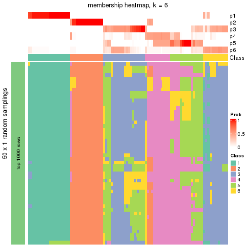</p>

</div>
<div id='tab-node-011-membership-heatmap-6'>
<pre><code class="r">membership_heatmap(res, k = 7)
</code></pre>

<p></p>

</div>
<div id='tab-node-011-membership-heatmap-7'>
<pre><code class="r">membership_heatmap(res, k = 8)
</code></pre>

<p></p>

</div>
</div>

As soon as the classes for columns are determined, the signatures
that are significantly different between subgroups can be looked for. 
Following are the heatmaps for signatures.


<script>
$( function() {
	$( '#tabs-node-011-get-signatures' ).tabs();
} );
</script>
<div id='tabs-node-011-get-signatures'>
<ul>
<li><a href='#tab-node-011-get-signatures-1'>k = 2</a></li>
<li><a href='#tab-node-011-get-signatures-2'>k = 3</a></li>
<li><a href='#tab-node-011-get-signatures-3'>k = 4</a></li>
<li><a href='#tab-node-011-get-signatures-4'>k = 5</a></li>
<li><a href='#tab-node-011-get-signatures-5'>k = 6</a></li>
<li><a href='#tab-node-011-get-signatures-6'>k = 7</a></li>
<li><a href='#tab-node-011-get-signatures-7'>k = 8</a></li>
</ul>
<div id='tab-node-011-get-signatures-1'>
<pre><code class="r">get_signatures(res, k = 2)
</code></pre>

<p></p>

</div>
<div id='tab-node-011-get-signatures-2'>
<pre><code class="r">get_signatures(res, k = 3)
</code></pre>

<p></p>

</div>
<div id='tab-node-011-get-signatures-3'>
<pre><code class="r">get_signatures(res, k = 4)
</code></pre>

<p></p>

</div>
<div id='tab-node-011-get-signatures-4'>
<pre><code class="r">get_signatures(res, k = 5)
</code></pre>

<p></p>

</div>
<div id='tab-node-011-get-signatures-5'>
<pre><code class="r">get_signatures(res, k = 6)
</code></pre>

<p></p>

</div>
<div id='tab-node-011-get-signatures-6'>
<pre><code class="r">get_signatures(res, k = 7)
</code></pre>

<p></p>

</div>
<div id='tab-node-011-get-signatures-7'>
<pre><code class="r">get_signatures(res, k = 8)
</code></pre>

<p>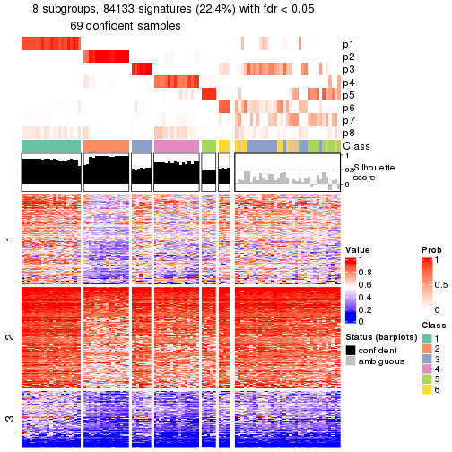</p>

</div>
</div>


Compare the overlap of signatures from different k:

```r
compare_signatures(res)
```


`get_signature()` returns a data frame invisibly. To get the list of signatures, the function
call should be assigned to a variable explicitly. In following code, if `plot` argument is set
to `FALSE`, no heatmap is plotted while only the differential analysis is performed.

```r
# code only for demonstration
tb = get_signature(res, k = ..., plot = FALSE)
```

An example of the output of `tb` is:

```
#>   which_row         fdr    mean_1    mean_2 scaled_mean_1 scaled_mean_2 km
#> 1        38 0.042760348  8.373488  9.131774    -0.5533452     0.5164555  1
#> 2        40 0.018707592  7.106213  8.469186    -0.6173731     0.5762149  1
#> 3        55 0.019134737 10.221463 11.207825    -0.6159697     0.5749050  1
#> 4        59 0.006059896  5.921854  7.869574    -0.6899429     0.6439467  1
#> 5        60 0.018055526  8.928898 10.211722    -0.6204761     0.5791110  1
#> 6        98 0.009384629 15.714769 14.887706     0.6635654    -0.6193277  2
...
```

The columns in `tb` are:

1. `which_row`: row indices corresponding to the input matrix.
2. `fdr`: FDR for the differential test. 
3. `mean_x`: The mean value in group x.
4. `scaled_mean_x`: The mean value in group x after rows are scaled.
5. `km`: Row groups if k-means clustering is applied to rows (which is done by automatically selecting number of clusters).

If there are too many signatures, `top_signatures = ...` can be set to only show the 
signatures with the highest FDRs:

```r
# code only for demonstration
# e.g. to show the top 500 most significant rows
tb = get_signature(res, k = ..., top_signatures = 500)
```

If the signatures are defined as these which are uniquely high in current group, `diff_method` argument
can be set to `"uniquely_high_in_one_group"`:

```r
# code only for demonstration
tb = get_signature(res, k = ..., diff_method = "uniquely_high_in_one_group")
```


UMAP plot which shows how samples are separated.


<script>
$( function() {
	$( '#tabs-node-011-dimension-reduction' ).tabs();
} );
</script>
<div id='tabs-node-011-dimension-reduction'>
<ul>
<li><a href='#tab-node-011-dimension-reduction-1'>k = 2</a></li>
<li><a href='#tab-node-011-dimension-reduction-2'>k = 3</a></li>
<li><a href='#tab-node-011-dimension-reduction-3'>k = 4</a></li>
<li><a href='#tab-node-011-dimension-reduction-4'>k = 5</a></li>
<li><a href='#tab-node-011-dimension-reduction-5'>k = 6</a></li>
<li><a href='#tab-node-011-dimension-reduction-6'>k = 7</a></li>
<li><a href='#tab-node-011-dimension-reduction-7'>k = 8</a></li>
</ul>
<div id='tab-node-011-dimension-reduction-1'>
<pre><code class="r">dimension_reduction(res, k = 2, method = &quot;UMAP&quot;)
</code></pre>

<p></p>

</div>
<div id='tab-node-011-dimension-reduction-2'>
<pre><code class="r">dimension_reduction(res, k = 3, method = &quot;UMAP&quot;)
</code></pre>

<p></p>

</div>
<div id='tab-node-011-dimension-reduction-3'>
<pre><code class="r">dimension_reduction(res, k = 4, method = &quot;UMAP&quot;)
</code></pre>

<p></p>

</div>
<div id='tab-node-011-dimension-reduction-4'>
<pre><code class="r">dimension_reduction(res, k = 5, method = &quot;UMAP&quot;)
</code></pre>

<p></p>

</div>
<div id='tab-node-011-dimension-reduction-5'>
<pre><code class="r">dimension_reduction(res, k = 6, method = &quot;UMAP&quot;)
</code></pre>

<p></p>

</div>
<div id='tab-node-011-dimension-reduction-6'>
<pre><code class="r">dimension_reduction(res, k = 7, method = &quot;UMAP&quot;)
</code></pre>

<p></p>

</div>
<div id='tab-node-011-dimension-reduction-7'>
<pre><code class="r">dimension_reduction(res, k = 8, method = &quot;UMAP&quot;)
</code></pre>

<p></p>

</div>
</div>


Following heatmap shows how subgroups are split when increasing `k`:

```r
collect_classes(res)
```


If matrix rows can be associated to genes, consider to use `functional_enrichment(res,
...)` to perform function enrichment for the signature genes. See [this vignette](https://jokergoo.github.io/cola_vignettes/functional_enrichment.html) for more detailed explanations.


 

---------------------------------------------------


### Node0111


Parent node: [Node011](#Node011).
Child nodes: 
                [Node01111](#Node01111)
        ,
                Node01112-leaf
        ,
                Node01113-leaf
        ,
                Node01114-leaf
        ,
                Node01121-leaf
        ,
                Node01122-leaf
        ,
                Node01123-leaf
        ,
                Node01124-leaf
        ,
                Node01211-leaf
        ,
                Node01212-leaf
        ,
                Node01213-leaf
        ,
                Node01221-leaf
        ,
                Node01222-leaf
        ,
                Node01223-leaf
        ,
                Node01224-leaf
        ,
                Node02121-leaf
        ,
                Node02122-leaf
        ,
                Node02123-leaf
        ,
                Node04221-leaf
        ,
                Node04222-leaf
        ,
                Node04223-leaf
        .


The object with results only for a single top-value method and a single partitioning method 
can be extracted as:

```r
res = res_rh["0111"]
```

A summary of `res` and all the functions that can be applied to it:

```r
res
```

```
#> A 'ConsensusPartition' object with k = 2, 3, 4, 5, 6, 7, 8.
#>   On a matrix with 30000 rows and 58 columns.
#>   Top rows (1000) are extracted by 'ATC' method.
#>   Subgroups are detected by 'kmeans' method.
#>   Performed in total 350 partitions by row resampling.
#>   Best k for subgroups seems to be 4.
#> 
#> Following methods can be applied to this 'ConsensusPartition' object:
#>  [1] "cola_report"             "collect_classes"         "collect_plots"          
#>  [4] "collect_stats"           "colnames"                "compare_partitions"     
#>  [7] "compare_signatures"      "consensus_heatmap"       "dimension_reduction"    
#> [10] "functional_enrichment"   "get_anno_col"            "get_anno"               
#> [13] "get_classes"             "get_consensus"           "get_matrix"             
#> [16] "get_membership"          "get_param"               "get_signatures"         
#> [19] "get_stats"               "is_best_k"               "is_stable_k"            
#> [22] "membership_heatmap"      "ncol"                    "nrow"                   
#> [25] "plot_ecdf"               "predict_classes"         "rownames"               
#> [28] "select_partition_number" "show"                    "suggest_best_k"         
#> [31] "test_to_known_factors"   "top_rows_heatmap"
```

`collect_plots()` function collects all the plots made from `res` for all `k` (number of subgroups)
into one single page to provide an easy and fast comparison between different `k`.

```r
collect_plots(res)
```


The plots are:

- The first row: a plot of the eCDF (empirical cumulative distribution
  function) curves of the consensus matrix for each `k` and the heatmap of
  predicted classes for each `k`.
- The second row: heatmaps of the consensus matrix for each `k`.
- The third row: heatmaps of the membership matrix for each `k`.
- The fouth row: heatmaps of the signatures for each `k`.

All the plots in panels can be made by individual functions and they are
plotted later in this section.

`select_partition_number()` produces several plots showing different
statistics for choosing "optimized" `k`. There are following statistics:

- eCDF curves of the consensus matrix for each `k`;
- 1-PAC. [The PAC score](https://en.wikipedia.org/wiki/Consensus_clustering#Over-interpretation_potential_of_consensus_clustering)
  measures the proportion of the ambiguous subgrouping.
- Mean silhouette score.
- Concordance. The mean probability of fiting the consensus subgroup labels in all
  partitions.
- Area increased. Denote $A_k$ as the area under the eCDF curve for current
  `k`, the area increased is defined as $A_k - A_{k-1}$.
- Rand index. The percent of pairs of samples that are both in a same cluster
  or both are not in a same cluster in the partition of k and k-1.
- Jaccard index. The ratio of pairs of samples are both in a same cluster in
  the partition of k and k-1 and the pairs of samples are both in a same
  cluster in the partition k or k-1.

The detailed explanations of these statistics can be found in [the _cola_
vignette](https://jokergoo.github.io/cola_vignettes/cola.html#toc_13).

Generally speaking, higher 1-PAC score, higher mean silhouette score or higher
concordance corresponds to better partition. Rand index and Jaccard index
measure how similar the current partition is compared to partition with `k-1`.
If they are too similar, we won't accept `k` is better than `k-1`.

```r
select_partition_number(res)
```


The numeric values for all these statistics can be obtained by `get_stats()`.

```r
get_stats(res)
```

```
#>   k 1-PAC mean_silhouette concordance area_increased  Rand Jaccard
#> 2 2 0.998           0.965       0.985         0.5074 0.492   0.492
#> 3 3 0.827           0.823       0.920         0.3084 0.749   0.539
#> 4 4 0.900           0.954       0.962         0.1243 0.831   0.557
#> 5 5 0.815           0.806       0.853         0.0598 0.984   0.939
#> 6 6 0.801           0.696       0.824         0.0379 0.920   0.690
#> 7 7 0.783           0.593       0.777         0.0265 0.940   0.712
#> 8 8 0.819           0.694       0.835         0.0303 0.935   0.640
```

`suggest_best_k()` suggests the best $k$ based on these statistics. The rules are as follows:

- All $k$ with Jaccard index larger than 0.95 are removed because increasing
  $k$ does not provide enough extra information. If all $k$ are removed, it is
  marked as no subgroup is detected.
- For all $k$ with 1-PAC score larger than 0.9, the maximal $k$ is taken as
  the best $k$, and other $k$ are marked as optional $k$.
- If it does not fit the second rule. The $k$ with the maximal vote of the
  highest 1-PAC score, highest mean silhouette, and highest concordance is
  taken as the best $k$.

```r
suggest_best_k(res)
```

```
#> [1] 4
#> attr(,"optional")
#> [1] 2
```

There is also optional best $k$ = 2 that is worth to check.

Following is the table of the partitions (You need to click the **show/hide
code output** link to see it). The membership matrix (columns with name `p*`)
is inferred by
[`clue::cl_consensus()`](https://www.rdocumentation.org/link/cl_consensus?package=clue)
function with the `SE` method. Basically the value in the membership matrix
represents the probability to belong to a certain group. The finall subgroup
label for an item is determined with the group with highest probability it
belongs to.

In `get_classes()` function, the entropy is calculated from the membership
matrix and the silhouette score is calculated from the consensus matrix.


<script>
$( function() {
	$( '#tabs-node-0111-get-classes' ).tabs();
} );
</script>
<div id='tabs-node-0111-get-classes'>
<ul>
<li><a href='#tab-node-0111-get-classes-1'>k = 2</a></li>
<li><a href='#tab-node-0111-get-classes-2'>k = 3</a></li>
<li><a href='#tab-node-0111-get-classes-3'>k = 4</a></li>
<li><a href='#tab-node-0111-get-classes-4'>k = 5</a></li>
<li><a href='#tab-node-0111-get-classes-5'>k = 6</a></li>
<li><a href='#tab-node-0111-get-classes-6'>k = 7</a></li>
<li><a href='#tab-node-0111-get-classes-7'>k = 8</a></li>
</ul>

<div id='tab-node-0111-get-classes-1'>
<p><a id='tab-node-0111-get-classes-1-a' style='color:#0366d6' href='#'>show/hide code output</a></p>
<pre><code class="r">cbind(get_classes(res, k = 2), get_membership(res, k = 2))
</code></pre>

<pre><code>#&gt;                 class entropy silhouette   p1   p2
#&gt; TCGA.G4.6303.01     1   0.000      0.974 1.00 0.00
#&gt; TCGA.T9.A92H.01     1   0.000      0.974 1.00 0.00
#&gt; TCGA.F5.6571.01     1   0.000      0.974 1.00 0.00
#&gt; TCGA.CI.6622.01     1   0.000      0.974 1.00 0.00
#&gt; TCGA.EI.6512.01     2   0.000      0.994 0.00 1.00
#&gt; TCGA.AA.3509.01     1   0.000      0.974 1.00 0.00
#&gt; TCGA.EI.6883.01     2   0.000      0.994 0.00 1.00
#&gt; TCGA.CM.5860.01     2   0.000      0.994 0.00 1.00
#&gt; TCGA.A6.6780.01     2   0.000      0.994 0.00 1.00
#&gt; TCGA.DM.A1D8.01     2   0.000      0.994 0.00 1.00
#&gt; TCGA.A6.6138.01     2   0.000      0.994 0.00 1.00
#&gt; TCGA.DM.A1D4.01     2   0.000      0.994 0.00 1.00
#&gt; TCGA.AY.A69D.01     2   0.000      0.994 0.00 1.00
#&gt; TCGA.CA.6716.01     2   0.000      0.994 0.00 1.00
#&gt; TCGA.AH.6644.01     1   0.000      0.974 1.00 0.00
#&gt; TCGA.AH.6643.01     1   0.000      0.974 1.00 0.00
#&gt; TCGA.A6.5656.01     1   0.000      0.974 1.00 0.00
#&gt; TCGA.F4.6806.01     2   0.000      0.994 0.00 1.00
#&gt; TCGA.5M.AAT4.01     1   0.990      0.246 0.56 0.44
#&gt; TCGA.EI.6514.01     1   0.000      0.974 1.00 0.00
#&gt; TCGA.DM.A282.01     1   0.000      0.974 1.00 0.00
#&gt; TCGA.DM.A1HA.01     2   0.000      0.994 0.00 1.00
#&gt; TCGA.A6.6652.01     1   0.000      0.974 1.00 0.00
#&gt; TCGA.A6.6650.01     1   0.000      0.974 1.00 0.00
#&gt; TCGA.AD.6899.01     2   0.000      0.994 0.00 1.00
#&gt; TCGA.A6.A56B.01     2   0.327      0.937 0.06 0.94
#&gt; TCGA.NH.A5IV.01     1   0.000      0.974 1.00 0.00
#&gt; TCGA.G4.6306.01     1   0.000      0.974 1.00 0.00
#&gt; TCGA.AD.A5EK.01     2   0.000      0.994 0.00 1.00
#&gt; TCGA.CK.5915.01     2   0.000      0.994 0.00 1.00
#&gt; TCGA.AY.6197.01     2   0.000      0.994 0.00 1.00
#&gt; TCGA.G4.6294.01     1   0.000      0.974 1.00 0.00
#&gt; TCGA.CM.6172.01     1   0.000      0.974 1.00 0.00
#&gt; TCGA.DM.A28A.01     2   0.000      0.994 0.00 1.00
#&gt; TCGA.EI.7002.01     1   0.000      0.974 1.00 0.00
#&gt; TCGA.QG.A5Z1.01     1   0.242      0.943 0.96 0.04
#&gt; TCGA.DM.A28H.01     2   0.000      0.994 0.00 1.00
#&gt; TCGA.DM.A28M.01     1   0.469      0.887 0.90 0.10
#&gt; TCGA.DM.A288.01     2   0.000      0.994 0.00 1.00
#&gt; TCGA.F4.6855.01     1   0.000      0.974 1.00 0.00
#&gt; TCGA.NH.A6GA.01     2   0.000      0.994 0.00 1.00
#&gt; TCGA.NH.A50V.01     2   0.000      0.994 0.00 1.00
#&gt; TCGA.CK.6747.01     2   0.000      0.994 0.00 1.00
#&gt; TCGA.DM.A28K.01     1   0.469      0.887 0.90 0.10
#&gt; TCGA.AA.3655.01     1   0.000      0.974 1.00 0.00
#&gt; TCGA.AZ.5407.01     2   0.000      0.994 0.00 1.00
#&gt; TCGA.QG.A5YV.01     1   0.000      0.974 1.00 0.00
#&gt; TCGA.CM.6166.01     1   0.000      0.974 1.00 0.00
#&gt; TCGA.D5.5540.01     2   0.000      0.994 0.00 1.00
#&gt; TCGA.G5.6233.01     2   0.000      0.994 0.00 1.00
#&gt; TCGA.CA.6719.01     2   0.000      0.994 0.00 1.00
#&gt; TCGA.D5.5537.01     2   0.000      0.994 0.00 1.00
#&gt; TCGA.AG.3592.01     1   0.000      0.974 1.00 0.00
#&gt; TCGA.CM.6678.01     1   0.000      0.974 1.00 0.00
#&gt; TCGA.CK.5914.01     2   0.402      0.915 0.08 0.92
#&gt; TCGA.AA.3660.01     1   0.141      0.959 0.98 0.02
#&gt; TCGA.CM.4747.01     2   0.000      0.994 0.00 1.00
#&gt; TCGA.EF.5831.01     2   0.242      0.957 0.04 0.96
</code></pre>

<script>
$('#tab-node-0111-get-classes-1-a').parent().next().next().hide();
$('#tab-node-0111-get-classes-1-a').click(function(){
  $('#tab-node-0111-get-classes-1-a').parent().next().next().toggle();
  return(false);
});
</script>
</div>

<div id='tab-node-0111-get-classes-2'>
<p><a id='tab-node-0111-get-classes-2-a' style='color:#0366d6' href='#'>show/hide code output</a></p>
<pre><code class="r">cbind(get_classes(res, k = 3), get_membership(res, k = 3))
</code></pre>

<pre><code>#&gt;                 class entropy silhouette   p1   p2   p3
#&gt; TCGA.G4.6303.01     1  0.0000      0.934 1.00 0.00 0.00
#&gt; TCGA.T9.A92H.01     1  0.0000      0.934 1.00 0.00 0.00
#&gt; TCGA.F5.6571.01     1  0.0000      0.934 1.00 0.00 0.00
#&gt; TCGA.CI.6622.01     1  0.0000      0.934 1.00 0.00 0.00
#&gt; TCGA.EI.6512.01     2  0.0000      0.860 0.00 1.00 0.00
#&gt; TCGA.AA.3509.01     1  0.0000      0.934 1.00 0.00 0.00
#&gt; TCGA.EI.6883.01     3  0.0892      0.942 0.00 0.02 0.98
#&gt; TCGA.CM.5860.01     2  0.0892      0.854 0.00 0.98 0.02
#&gt; TCGA.A6.6780.01     2  0.6126      0.532 0.00 0.60 0.40
#&gt; TCGA.DM.A1D8.01     2  0.5706      0.628 0.00 0.68 0.32
#&gt; TCGA.A6.6138.01     2  0.6045      0.559 0.00 0.62 0.38
#&gt; TCGA.DM.A1D4.01     2  0.0892      0.854 0.00 0.98 0.02
#&gt; TCGA.AY.A69D.01     3  0.0892      0.942 0.00 0.02 0.98
#&gt; TCGA.CA.6716.01     3  0.0000      0.930 0.00 0.00 1.00
#&gt; TCGA.AH.6644.01     1  0.0000      0.934 1.00 0.00 0.00
#&gt; TCGA.AH.6643.01     1  0.0000      0.934 1.00 0.00 0.00
#&gt; TCGA.A6.5656.01     1  0.0000      0.934 1.00 0.00 0.00
#&gt; TCGA.F4.6806.01     2  0.0000      0.860 0.00 1.00 0.00
#&gt; TCGA.5M.AAT4.01     2  0.0000      0.860 0.00 1.00 0.00
#&gt; TCGA.EI.6514.01     1  0.0000      0.934 1.00 0.00 0.00
#&gt; TCGA.DM.A282.01     1  0.0000      0.934 1.00 0.00 0.00
#&gt; TCGA.DM.A1HA.01     3  0.0000      0.930 0.00 0.00 1.00
#&gt; TCGA.A6.6652.01     1  0.0000      0.934 1.00 0.00 0.00
#&gt; TCGA.A6.6650.01     1  0.0000      0.934 1.00 0.00 0.00
#&gt; TCGA.AD.6899.01     2  0.0000      0.860 0.00 1.00 0.00
#&gt; TCGA.A6.A56B.01     3  0.0892      0.942 0.00 0.02 0.98
#&gt; TCGA.NH.A5IV.01     2  0.0000      0.860 0.00 1.00 0.00
#&gt; TCGA.G4.6306.01     1  0.6126      0.424 0.60 0.40 0.00
#&gt; TCGA.AD.A5EK.01     3  0.0000      0.930 0.00 0.00 1.00
#&gt; TCGA.CK.5915.01     3  0.0892      0.942 0.00 0.02 0.98
#&gt; TCGA.AY.6197.01     2  0.6126      0.532 0.00 0.60 0.40
#&gt; TCGA.G4.6294.01     1  0.0000      0.934 1.00 0.00 0.00
#&gt; TCGA.CM.6172.01     3  0.6244      0.153 0.44 0.00 0.56
#&gt; TCGA.DM.A28A.01     3  0.0892      0.942 0.00 0.02 0.98
#&gt; TCGA.EI.7002.01     1  0.0000      0.934 1.00 0.00 0.00
#&gt; TCGA.QG.A5Z1.01     1  0.6387      0.506 0.68 0.02 0.30
#&gt; TCGA.DM.A28H.01     2  0.6192      0.494 0.00 0.58 0.42
#&gt; TCGA.DM.A28M.01     2  0.0000      0.860 0.00 1.00 0.00
#&gt; TCGA.DM.A288.01     2  0.0892      0.854 0.00 0.98 0.02
#&gt; TCGA.F4.6855.01     1  0.0000      0.934 1.00 0.00 0.00
#&gt; TCGA.NH.A6GA.01     2  0.0000      0.860 0.00 1.00 0.00
#&gt; TCGA.NH.A50V.01     2  0.6126      0.532 0.00 0.60 0.40
#&gt; TCGA.CK.6747.01     2  0.0000      0.860 0.00 1.00 0.00
#&gt; TCGA.DM.A28K.01     2  0.0000      0.860 0.00 1.00 0.00
#&gt; TCGA.AA.3655.01     1  0.0000      0.934 1.00 0.00 0.00
#&gt; TCGA.AZ.5407.01     2  0.0892      0.854 0.00 0.98 0.02
#&gt; TCGA.QG.A5YV.01     1  0.0000      0.934 1.00 0.00 0.00
#&gt; TCGA.CM.6166.01     1  0.0000      0.934 1.00 0.00 0.00
#&gt; TCGA.D5.5540.01     3  0.0892      0.942 0.00 0.02 0.98
#&gt; TCGA.G5.6233.01     2  0.6126      0.532 0.00 0.60 0.40
#&gt; TCGA.CA.6719.01     2  0.0000      0.860 0.00 1.00 0.00
#&gt; TCGA.D5.5537.01     2  0.0000      0.860 0.00 1.00 0.00
#&gt; TCGA.AG.3592.01     1  0.3340      0.826 0.88 0.12 0.00
#&gt; TCGA.CM.6678.01     1  0.0000      0.934 1.00 0.00 0.00
#&gt; TCGA.CK.5914.01     3  0.0892      0.942 0.00 0.02 0.98
#&gt; TCGA.AA.3660.01     1  0.6302      0.218 0.52 0.48 0.00
#&gt; TCGA.CM.4747.01     2  0.0000      0.860 0.00 1.00 0.00
#&gt; TCGA.EF.5831.01     3  0.0892      0.942 0.00 0.02 0.98
</code></pre>

<script>
$('#tab-node-0111-get-classes-2-a').parent().next().next().hide();
$('#tab-node-0111-get-classes-2-a').click(function(){
  $('#tab-node-0111-get-classes-2-a').parent().next().next().toggle();
  return(false);
});
</script>
</div>

<div id='tab-node-0111-get-classes-3'>
<p><a id='tab-node-0111-get-classes-3-a' style='color:#0366d6' href='#'>show/hide code output</a></p>
<pre><code class="r">cbind(get_classes(res, k = 4), get_membership(res, k = 4))
</code></pre>

<pre><code>#&gt;                 class entropy silhouette   p1   p2   p3   p4
#&gt; TCGA.G4.6303.01     1   0.000      1.000 1.00 0.00 0.00 0.00
#&gt; TCGA.T9.A92H.01     1   0.000      1.000 1.00 0.00 0.00 0.00
#&gt; TCGA.F5.6571.01     1   0.000      1.000 1.00 0.00 0.00 0.00
#&gt; TCGA.CI.6622.01     1   0.000      1.000 1.00 0.00 0.00 0.00
#&gt; TCGA.EI.6512.01     2   0.000      0.945 0.00 1.00 0.00 0.00
#&gt; TCGA.AA.3509.01     1   0.000      1.000 1.00 0.00 0.00 0.00
#&gt; TCGA.EI.6883.01     3   0.201      0.965 0.00 0.00 0.92 0.08
#&gt; TCGA.CM.5860.01     4   0.234      0.988 0.00 0.10 0.00 0.90
#&gt; TCGA.A6.6780.01     4   0.234      0.988 0.00 0.10 0.00 0.90
#&gt; TCGA.DM.A1D8.01     4   0.234      0.988 0.00 0.10 0.00 0.90
#&gt; TCGA.A6.6138.01     4   0.234      0.988 0.00 0.10 0.00 0.90
#&gt; TCGA.DM.A1D4.01     4   0.234      0.988 0.00 0.10 0.00 0.90
#&gt; TCGA.AY.A69D.01     3   0.201      0.965 0.00 0.00 0.92 0.08
#&gt; TCGA.CA.6716.01     3   0.234      0.960 0.00 0.00 0.90 0.10
#&gt; TCGA.AH.6644.01     1   0.000      1.000 1.00 0.00 0.00 0.00
#&gt; TCGA.AH.6643.01     1   0.000      1.000 1.00 0.00 0.00 0.00
#&gt; TCGA.A6.5656.01     1   0.000      1.000 1.00 0.00 0.00 0.00
#&gt; TCGA.F4.6806.01     2   0.000      0.945 0.00 1.00 0.00 0.00
#&gt; TCGA.5M.AAT4.01     2   0.000      0.945 0.00 1.00 0.00 0.00
#&gt; TCGA.EI.6514.01     1   0.000      1.000 1.00 0.00 0.00 0.00
#&gt; TCGA.DM.A282.01     1   0.000      1.000 1.00 0.00 0.00 0.00
#&gt; TCGA.DM.A1HA.01     4   0.000      0.877 0.00 0.00 0.00 1.00
#&gt; TCGA.A6.6652.01     1   0.000      1.000 1.00 0.00 0.00 0.00
#&gt; TCGA.A6.6650.01     1   0.000      1.000 1.00 0.00 0.00 0.00
#&gt; TCGA.AD.6899.01     2   0.000      0.945 0.00 1.00 0.00 0.00
#&gt; TCGA.A6.A56B.01     3   0.000      0.961 0.00 0.00 1.00 0.00
#&gt; TCGA.NH.A5IV.01     2   0.000      0.945 0.00 1.00 0.00 0.00
#&gt; TCGA.G4.6306.01     2   0.234      0.843 0.10 0.90 0.00 0.00
#&gt; TCGA.AD.A5EK.01     3   0.234      0.960 0.00 0.00 0.90 0.10
#&gt; TCGA.CK.5915.01     3   0.234      0.960 0.00 0.00 0.90 0.10
#&gt; TCGA.AY.6197.01     4   0.234      0.988 0.00 0.10 0.00 0.90
#&gt; TCGA.G4.6294.01     1   0.000      1.000 1.00 0.00 0.00 0.00
#&gt; TCGA.CM.6172.01     3   0.000      0.961 0.00 0.00 1.00 0.00
#&gt; TCGA.DM.A28A.01     3   0.164      0.967 0.00 0.00 0.94 0.06
#&gt; TCGA.EI.7002.01     1   0.000      1.000 1.00 0.00 0.00 0.00
#&gt; TCGA.QG.A5Z1.01     3   0.000      0.961 0.00 0.00 1.00 0.00
#&gt; TCGA.DM.A28H.01     4   0.234      0.988 0.00 0.10 0.00 0.90
#&gt; TCGA.DM.A28M.01     2   0.000      0.945 0.00 1.00 0.00 0.00
#&gt; TCGA.DM.A288.01     2   0.491      0.123 0.00 0.58 0.00 0.42
#&gt; TCGA.F4.6855.01     1   0.000      1.000 1.00 0.00 0.00 0.00
#&gt; TCGA.NH.A6GA.01     2   0.000      0.945 0.00 1.00 0.00 0.00
#&gt; TCGA.NH.A50V.01     4   0.234      0.988 0.00 0.10 0.00 0.90
#&gt; TCGA.CK.6747.01     2   0.000      0.945 0.00 1.00 0.00 0.00
#&gt; TCGA.DM.A28K.01     2   0.000      0.945 0.00 1.00 0.00 0.00
#&gt; TCGA.AA.3655.01     1   0.000      1.000 1.00 0.00 0.00 0.00
#&gt; TCGA.AZ.5407.01     4   0.234      0.988 0.00 0.10 0.00 0.90
#&gt; TCGA.QG.A5YV.01     1   0.000      1.000 1.00 0.00 0.00 0.00
#&gt; TCGA.CM.6166.01     1   0.000      1.000 1.00 0.00 0.00 0.00
#&gt; TCGA.D5.5540.01     3   0.164      0.967 0.00 0.00 0.94 0.06
#&gt; TCGA.G5.6233.01     4   0.234      0.988 0.00 0.10 0.00 0.90
#&gt; TCGA.CA.6719.01     2   0.000      0.945 0.00 1.00 0.00 0.00
#&gt; TCGA.D5.5537.01     2   0.000      0.945 0.00 1.00 0.00 0.00
#&gt; TCGA.AG.3592.01     2   0.283      0.867 0.04 0.90 0.06 0.00
#&gt; TCGA.CM.6678.01     1   0.000      1.000 1.00 0.00 0.00 0.00
#&gt; TCGA.CK.5914.01     3   0.000      0.961 0.00 0.00 1.00 0.00
#&gt; TCGA.AA.3660.01     2   0.234      0.885 0.02 0.92 0.06 0.00
#&gt; TCGA.CM.4747.01     2   0.000      0.945 0.00 1.00 0.00 0.00
#&gt; TCGA.EF.5831.01     3   0.000      0.961 0.00 0.00 1.00 0.00
</code></pre>

<script>
$('#tab-node-0111-get-classes-3-a').parent().next().next().hide();
$('#tab-node-0111-get-classes-3-a').click(function(){
  $('#tab-node-0111-get-classes-3-a').parent().next().next().toggle();
  return(false);
});
</script>
</div>

<div id='tab-node-0111-get-classes-4'>
<p><a id='tab-node-0111-get-classes-4-a' style='color:#0366d6' href='#'>show/hide code output</a></p>
<pre><code class="r">cbind(get_classes(res, k = 5), get_membership(res, k = 5))
</code></pre>

<pre><code>#&gt;                 class entropy silhouette   p1   p2   p3   p4   p5
#&gt; TCGA.G4.6303.01     5  0.1732    0.88976 0.08 0.00 0.00 0.00 0.92
#&gt; TCGA.T9.A92H.01     5  0.1410    0.89573 0.06 0.00 0.00 0.00 0.94
#&gt; TCGA.F5.6571.01     5  0.0000    0.90228 0.00 0.00 0.00 0.00 1.00
#&gt; TCGA.CI.6622.01     5  0.0000    0.90228 0.00 0.00 0.00 0.00 1.00
#&gt; TCGA.EI.6512.01     2  0.1043    0.80952 0.04 0.96 0.00 0.00 0.00
#&gt; TCGA.AA.3509.01     5  0.0000    0.90228 0.00 0.00 0.00 0.00 1.00
#&gt; TCGA.EI.6883.01     3  0.0000    0.86365 0.00 0.00 1.00 0.00 0.00
#&gt; TCGA.CM.5860.01     4  0.2754    0.86549 0.08 0.04 0.00 0.88 0.00
#&gt; TCGA.A6.6780.01     4  0.0000    0.90265 0.00 0.00 0.00 1.00 0.00
#&gt; TCGA.DM.A1D8.01     4  0.0609    0.90046 0.02 0.00 0.00 0.98 0.00
#&gt; TCGA.A6.6138.01     4  0.3513    0.76305 0.02 0.18 0.00 0.80 0.00
#&gt; TCGA.DM.A1D4.01     4  0.0609    0.90000 0.02 0.00 0.00 0.98 0.00
#&gt; TCGA.AY.A69D.01     3  0.0000    0.86365 0.00 0.00 1.00 0.00 0.00
#&gt; TCGA.CA.6716.01     3  0.5013    0.70365 0.24 0.00 0.68 0.08 0.00
#&gt; TCGA.AH.6644.01     5  0.2732    0.85649 0.16 0.00 0.00 0.00 0.84
#&gt; TCGA.AH.6643.01     5  0.1732    0.88976 0.08 0.00 0.00 0.00 0.92
#&gt; TCGA.A6.5656.01     5  0.1732    0.88976 0.08 0.00 0.00 0.00 0.92
#&gt; TCGA.F4.6806.01     2  0.2516    0.77890 0.14 0.86 0.00 0.00 0.00
#&gt; TCGA.5M.AAT4.01     2  0.1732    0.80728 0.08 0.92 0.00 0.00 0.00
#&gt; TCGA.EI.6514.01     5  0.0000    0.90228 0.00 0.00 0.00 0.00 1.00
#&gt; TCGA.DM.A282.01     5  0.2280    0.87303 0.12 0.00 0.00 0.00 0.88
#&gt; TCGA.DM.A1HA.01     4  0.3274    0.74561 0.22 0.00 0.00 0.78 0.00
#&gt; TCGA.A6.6652.01     5  0.1732    0.88976 0.08 0.00 0.00 0.00 0.92
#&gt; TCGA.A6.6650.01     5  0.4726    0.58562 0.40 0.02 0.00 0.00 0.58
#&gt; TCGA.AD.6899.01     2  0.0609    0.81190 0.02 0.98 0.00 0.00 0.00
#&gt; TCGA.A6.A56B.01     3  0.0000    0.86365 0.00 0.00 1.00 0.00 0.00
#&gt; TCGA.NH.A5IV.01     2  0.4262    0.68177 0.44 0.56 0.00 0.00 0.00
#&gt; TCGA.G4.6306.01     2  0.4227    0.68895 0.42 0.58 0.00 0.00 0.00
#&gt; TCGA.AD.A5EK.01     3  0.3274    0.78110 0.22 0.00 0.78 0.00 0.00
#&gt; TCGA.CK.5915.01     3  0.3424    0.77126 0.24 0.00 0.76 0.00 0.00
#&gt; TCGA.AY.6197.01     4  0.0000    0.90265 0.00 0.00 0.00 1.00 0.00
#&gt; TCGA.G4.6294.01     5  0.1410    0.89573 0.06 0.00 0.00 0.00 0.94
#&gt; TCGA.CM.6172.01     3  0.3946    0.73427 0.08 0.00 0.80 0.00 0.12
#&gt; TCGA.DM.A28A.01     3  0.0000    0.86365 0.00 0.00 1.00 0.00 0.00
#&gt; TCGA.EI.7002.01     5  0.1410    0.89573 0.06 0.00 0.00 0.00 0.94
#&gt; TCGA.QG.A5Z1.01     3  0.6555   -0.00927 0.20 0.40 0.40 0.00 0.00
#&gt; TCGA.DM.A28H.01     4  0.0609    0.90046 0.02 0.00 0.00 0.98 0.00
#&gt; TCGA.DM.A28M.01     2  0.4262    0.68177 0.44 0.56 0.00 0.00 0.00
#&gt; TCGA.DM.A288.01     4  0.6111    0.45381 0.18 0.26 0.00 0.56 0.00
#&gt; TCGA.F4.6855.01     5  0.2732    0.85649 0.16 0.00 0.00 0.00 0.84
#&gt; TCGA.NH.A6GA.01     2  0.0000    0.81402 0.00 1.00 0.00 0.00 0.00
#&gt; TCGA.NH.A50V.01     4  0.0000    0.90265 0.00 0.00 0.00 1.00 0.00
#&gt; TCGA.CK.6747.01     2  0.4182    0.69306 0.40 0.60 0.00 0.00 0.00
#&gt; TCGA.DM.A28K.01     2  0.4262    0.68177 0.44 0.56 0.00 0.00 0.00
#&gt; TCGA.AA.3655.01     5  0.3684    0.76344 0.28 0.00 0.00 0.00 0.72
#&gt; TCGA.AZ.5407.01     4  0.2754    0.86549 0.08 0.04 0.00 0.88 0.00
#&gt; TCGA.QG.A5YV.01     5  0.2516    0.86443 0.14 0.00 0.00 0.00 0.86
#&gt; TCGA.CM.6166.01     5  0.3106    0.85647 0.14 0.02 0.00 0.00 0.84
#&gt; TCGA.D5.5540.01     3  0.0000    0.86365 0.00 0.00 1.00 0.00 0.00
#&gt; TCGA.G5.6233.01     4  0.0000    0.90265 0.00 0.00 0.00 1.00 0.00
#&gt; TCGA.CA.6719.01     2  0.1043    0.80952 0.04 0.96 0.00 0.00 0.00
#&gt; TCGA.D5.5537.01     2  0.0609    0.81190 0.02 0.98 0.00 0.00 0.00
#&gt; TCGA.AG.3592.01     2  0.3274    0.73395 0.22 0.78 0.00 0.00 0.00
#&gt; TCGA.CM.6678.01     5  0.0609    0.89987 0.02 0.00 0.00 0.00 0.98
#&gt; TCGA.CK.5914.01     3  0.0609    0.85880 0.02 0.00 0.98 0.00 0.00
#&gt; TCGA.AA.3660.01     2  0.3274    0.73395 0.22 0.78 0.00 0.00 0.00
#&gt; TCGA.CM.4747.01     2  0.0609    0.81190 0.02 0.98 0.00 0.00 0.00
#&gt; TCGA.EF.5831.01     3  0.1410    0.84496 0.06 0.00 0.94 0.00 0.00
</code></pre>

<script>
$('#tab-node-0111-get-classes-4-a').parent().next().next().hide();
$('#tab-node-0111-get-classes-4-a').click(function(){
  $('#tab-node-0111-get-classes-4-a').parent().next().next().toggle();
  return(false);
});
</script>
</div>

<div id='tab-node-0111-get-classes-5'>
<p><a id='tab-node-0111-get-classes-5-a' style='color:#0366d6' href='#'>show/hide code output</a></p>
<pre><code class="r">cbind(get_classes(res, k = 6), get_membership(res, k = 6))
</code></pre>

<pre><code>#&gt;                 class entropy silhouette   p1   p2   p3   p4   p5   p6
#&gt; TCGA.G4.6303.01     5  0.1267      0.787 0.06 0.00 0.00 0.00 0.94 0.00
#&gt; TCGA.T9.A92H.01     5  0.1267      0.787 0.06 0.00 0.00 0.00 0.94 0.00
#&gt; TCGA.F5.6571.01     5  0.0000      0.790 0.00 0.00 0.00 0.00 1.00 0.00
#&gt; TCGA.CI.6622.01     5  0.0000      0.790 0.00 0.00 0.00 0.00 1.00 0.00
#&gt; TCGA.EI.6512.01     2  0.0547      0.794 0.02 0.98 0.00 0.00 0.00 0.00
#&gt; TCGA.AA.3509.01     5  0.0000      0.790 0.00 0.00 0.00 0.00 1.00 0.00
#&gt; TCGA.EI.6883.01     3  0.1556      0.821 0.08 0.00 0.92 0.00 0.00 0.00
#&gt; TCGA.CM.5860.01     4  0.3156      0.737 0.00 0.18 0.00 0.80 0.00 0.02
#&gt; TCGA.A6.6780.01     4  0.0000      0.876 0.00 0.00 0.00 1.00 0.00 0.00
#&gt; TCGA.DM.A1D8.01     4  0.0000      0.876 0.00 0.00 0.00 1.00 0.00 0.00
#&gt; TCGA.A6.6138.01     4  0.4078      0.527 0.02 0.34 0.00 0.64 0.00 0.00
#&gt; TCGA.DM.A1D4.01     4  0.0000      0.876 0.00 0.00 0.00 1.00 0.00 0.00
#&gt; TCGA.AY.A69D.01     3  0.1267      0.828 0.06 0.00 0.94 0.00 0.00 0.00
#&gt; TCGA.CA.6716.01     1  0.4078      0.674 0.64 0.00 0.34 0.02 0.00 0.00
#&gt; TCGA.AH.6644.01     5  0.5520      0.564 0.24 0.00 0.00 0.00 0.56 0.20
#&gt; TCGA.AH.6643.01     5  0.1267      0.787 0.06 0.00 0.00 0.00 0.94 0.00
#&gt; TCGA.A6.5656.01     5  0.1267      0.787 0.06 0.00 0.00 0.00 0.94 0.00
#&gt; TCGA.F4.6806.01     2  0.2048      0.676 0.00 0.88 0.00 0.00 0.00 0.12
#&gt; TCGA.5M.AAT4.01     2  0.2190      0.756 0.04 0.90 0.00 0.00 0.00 0.06
#&gt; TCGA.EI.6514.01     5  0.0000      0.790 0.00 0.00 0.00 0.00 1.00 0.00
#&gt; TCGA.DM.A282.01     5  0.5173      0.609 0.20 0.00 0.00 0.00 0.62 0.18
#&gt; TCGA.DM.A1HA.01     1  0.3828      0.128 0.56 0.00 0.00 0.44 0.00 0.00
#&gt; TCGA.A6.6652.01     5  0.1267      0.787 0.06 0.00 0.00 0.00 0.94 0.00
#&gt; TCGA.A6.6650.01     6  0.5938     -0.146 0.26 0.00 0.00 0.00 0.28 0.46
#&gt; TCGA.AD.6899.01     2  0.0547      0.796 0.02 0.98 0.00 0.00 0.00 0.00
#&gt; TCGA.A6.A56B.01     3  0.0000      0.848 0.00 0.00 1.00 0.00 0.00 0.00
#&gt; TCGA.NH.A5IV.01     6  0.3409      0.671 0.00 0.30 0.00 0.00 0.00 0.70
#&gt; TCGA.G4.6306.01     6  0.5841      0.350 0.22 0.30 0.00 0.00 0.00 0.48
#&gt; TCGA.AD.A5EK.01     1  0.3706      0.646 0.62 0.00 0.38 0.00 0.00 0.00
#&gt; TCGA.CK.5915.01     1  0.3647      0.667 0.64 0.00 0.36 0.00 0.00 0.00
#&gt; TCGA.AY.6197.01     4  0.0000      0.876 0.00 0.00 0.00 1.00 0.00 0.00
#&gt; TCGA.G4.6294.01     5  0.1267      0.787 0.06 0.00 0.00 0.00 0.94 0.00
#&gt; TCGA.CM.6172.01     3  0.3829      0.527 0.06 0.00 0.76 0.00 0.18 0.00
#&gt; TCGA.DM.A28A.01     3  0.0937      0.841 0.04 0.00 0.96 0.00 0.00 0.00
#&gt; TCGA.EI.7002.01     5  0.1267      0.787 0.06 0.00 0.00 0.00 0.94 0.00
#&gt; TCGA.QG.A5Z1.01     2  0.6777      0.323 0.14 0.48 0.28 0.00 0.00 0.10
#&gt; TCGA.DM.A28H.01     4  0.0547      0.866 0.00 0.00 0.00 0.98 0.00 0.02
#&gt; TCGA.DM.A28M.01     6  0.3409      0.671 0.00 0.30 0.00 0.00 0.00 0.70
#&gt; TCGA.DM.A288.01     4  0.5202      0.510 0.00 0.26 0.00 0.60 0.00 0.14
#&gt; TCGA.F4.6855.01     5  0.5520      0.564 0.24 0.00 0.00 0.00 0.56 0.20
#&gt; TCGA.NH.A6GA.01     2  0.0547      0.789 0.00 0.98 0.00 0.00 0.00 0.02
#&gt; TCGA.NH.A50V.01     4  0.0000      0.876 0.00 0.00 0.00 1.00 0.00 0.00
#&gt; TCGA.CK.6747.01     6  0.3409      0.671 0.00 0.30 0.00 0.00 0.00 0.70
#&gt; TCGA.DM.A28K.01     6  0.3409      0.671 0.00 0.30 0.00 0.00 0.00 0.70
#&gt; TCGA.AA.3655.01     5  0.5867      0.444 0.24 0.00 0.00 0.00 0.48 0.28
#&gt; TCGA.AZ.5407.01     4  0.1092      0.858 0.00 0.02 0.00 0.96 0.00 0.02
#&gt; TCGA.QG.A5YV.01     5  0.5520      0.564 0.24 0.00 0.00 0.00 0.56 0.20
#&gt; TCGA.CM.6166.01     5  0.5608      0.542 0.26 0.00 0.00 0.00 0.54 0.20
#&gt; TCGA.D5.5540.01     3  0.0000      0.848 0.00 0.00 1.00 0.00 0.00 0.00
#&gt; TCGA.G5.6233.01     4  0.0000      0.876 0.00 0.00 0.00 1.00 0.00 0.00
#&gt; TCGA.CA.6719.01     2  0.1480      0.782 0.02 0.94 0.00 0.00 0.00 0.04
#&gt; TCGA.D5.5537.01     2  0.0547      0.796 0.02 0.98 0.00 0.00 0.00 0.00
#&gt; TCGA.AG.3592.01     2  0.4723      0.574 0.14 0.68 0.00 0.00 0.00 0.18
#&gt; TCGA.CM.6678.01     5  0.3045      0.733 0.06 0.00 0.00 0.00 0.84 0.10
#&gt; TCGA.CK.5914.01     3  0.1865      0.815 0.04 0.00 0.92 0.00 0.00 0.04
#&gt; TCGA.AA.3660.01     2  0.4566      0.588 0.14 0.70 0.00 0.00 0.00 0.16
#&gt; TCGA.CM.4747.01     2  0.0547      0.796 0.02 0.98 0.00 0.00 0.00 0.00
#&gt; TCGA.EF.5831.01     3  0.3697      0.711 0.06 0.04 0.82 0.00 0.00 0.08
</code></pre>

<script>
$('#tab-node-0111-get-classes-5-a').parent().next().next().hide();
$('#tab-node-0111-get-classes-5-a').click(function(){
  $('#tab-node-0111-get-classes-5-a').parent().next().next().toggle();
  return(false);
});
</script>
</div>

<div id='tab-node-0111-get-classes-6'>
<p><a id='tab-node-0111-get-classes-6-a' style='color:#0366d6' href='#'>show/hide code output</a></p>
<pre><code class="r">cbind(get_classes(res, k = 7), get_membership(res, k = 7))
</code></pre>

<pre><code>#&gt;                 class entropy silhouette   p1   p2   p3   p4   p5   p6   p7
#&gt; TCGA.G4.6303.01     5  0.1433     0.7763 0.08 0.00 0.00 0.00 0.92 0.00 0.00
#&gt; TCGA.T9.A92H.01     5  0.1433     0.7763 0.08 0.00 0.00 0.00 0.92 0.00 0.00
#&gt; TCGA.F5.6571.01     5  0.0000     0.7826 0.00 0.00 0.00 0.00 1.00 0.00 0.00
#&gt; TCGA.CI.6622.01     5  0.0000     0.7826 0.00 0.00 0.00 0.00 1.00 0.00 0.00
#&gt; TCGA.EI.6512.01     2  0.2832     0.5423 0.00 0.76 0.00 0.00 0.00 0.00 0.24
#&gt; TCGA.AA.3509.01     5  0.0000     0.7826 0.00 0.00 0.00 0.00 1.00 0.00 0.00
#&gt; TCGA.EI.6883.01     3  0.3011     0.4207 0.12 0.00 0.82 0.00 0.00 0.00 0.06
#&gt; TCGA.CM.5860.01     2  0.5773     0.0689 0.08 0.50 0.00 0.36 0.00 0.04 0.02
#&gt; TCGA.A6.6780.01     4  0.0000     0.8565 0.00 0.00 0.00 1.00 0.00 0.00 0.00
#&gt; TCGA.DM.A1D8.01     4  0.0000     0.8565 0.00 0.00 0.00 1.00 0.00 0.00 0.00
#&gt; TCGA.A6.6138.01     2  0.3139     0.4860 0.00 0.70 0.00 0.30 0.00 0.00 0.00
#&gt; TCGA.DM.A1D4.01     4  0.2421     0.8061 0.08 0.00 0.00 0.88 0.00 0.02 0.02
#&gt; TCGA.AY.A69D.01     3  0.1664     0.5451 0.06 0.00 0.92 0.00 0.00 0.02 0.00
#&gt; TCGA.CA.6716.01     1  0.3525     0.9087 0.56 0.00 0.44 0.00 0.00 0.00 0.00
#&gt; TCGA.AH.6644.01     5  0.5913     0.4157 0.12 0.02 0.00 0.00 0.54 0.04 0.28
#&gt; TCGA.AH.6643.01     5  0.2422     0.7443 0.18 0.00 0.00 0.00 0.82 0.00 0.00
#&gt; TCGA.A6.5656.01     5  0.1433     0.7763 0.08 0.00 0.00 0.00 0.92 0.00 0.00
#&gt; TCGA.F4.6806.01     2  0.1860     0.7013 0.02 0.92 0.00 0.02 0.00 0.04 0.00
#&gt; TCGA.5M.AAT4.01     2  0.3745     0.4682 0.00 0.70 0.00 0.00 0.00 0.04 0.26
#&gt; TCGA.EI.6514.01     5  0.0000     0.7826 0.00 0.00 0.00 0.00 1.00 0.00 0.00
#&gt; TCGA.DM.A282.01     5  0.5091     0.5376 0.12 0.00 0.00 0.00 0.64 0.04 0.20
#&gt; TCGA.DM.A1HA.01     4  0.3546     0.2253 0.46 0.00 0.00 0.54 0.00 0.00 0.00
#&gt; TCGA.A6.6652.01     5  0.2081     0.7571 0.14 0.00 0.00 0.00 0.86 0.00 0.00
#&gt; TCGA.A6.6650.01     7  0.7066    -0.0501 0.12 0.02 0.00 0.00 0.18 0.34 0.34
#&gt; TCGA.AD.6899.01     2  0.0504     0.7322 0.00 0.98 0.00 0.02 0.00 0.00 0.00
#&gt; TCGA.A6.A56B.01     3  0.1664     0.6021 0.00 0.00 0.92 0.00 0.00 0.02 0.06
#&gt; TCGA.NH.A5IV.01     6  0.1671     0.8344 0.00 0.10 0.00 0.00 0.00 0.90 0.00
#&gt; TCGA.G4.6306.01     6  0.6572     0.1302 0.12 0.16 0.00 0.00 0.00 0.40 0.32
#&gt; TCGA.AD.A5EK.01     1  0.3525     0.9087 0.56 0.00 0.44 0.00 0.00 0.00 0.00
#&gt; TCGA.CK.5915.01     1  0.4669     0.8120 0.52 0.00 0.40 0.00 0.00 0.00 0.08
#&gt; TCGA.AY.6197.01     4  0.0000     0.8565 0.00 0.00 0.00 1.00 0.00 0.00 0.00
#&gt; TCGA.G4.6294.01     5  0.1671     0.7722 0.10 0.00 0.00 0.00 0.90 0.00 0.00
#&gt; TCGA.CM.6172.01     3  0.5549     0.3469 0.20 0.00 0.62 0.00 0.12 0.02 0.04
#&gt; TCGA.DM.A28A.01     3  0.1166     0.5420 0.06 0.00 0.94 0.00 0.00 0.00 0.00
#&gt; TCGA.EI.7002.01     5  0.1166     0.7793 0.06 0.00 0.00 0.00 0.94 0.00 0.00
#&gt; TCGA.QG.A5Z1.01     7  0.4500     0.1745 0.02 0.22 0.08 0.00 0.00 0.00 0.68
#&gt; TCGA.DM.A28H.01     4  0.0504     0.8481 0.00 0.00 0.00 0.98 0.00 0.02 0.00
#&gt; TCGA.DM.A28M.01     6  0.1671     0.8344 0.00 0.10 0.00 0.00 0.00 0.90 0.00
#&gt; TCGA.DM.A288.01     4  0.6261     0.2670 0.08 0.30 0.00 0.50 0.00 0.10 0.02
#&gt; TCGA.F4.6855.01     5  0.6585     0.2740 0.12 0.02 0.00 0.00 0.46 0.10 0.30
#&gt; TCGA.NH.A6GA.01     2  0.0504     0.7322 0.00 0.98 0.00 0.02 0.00 0.00 0.00
#&gt; TCGA.NH.A50V.01     4  0.0000     0.8565 0.00 0.00 0.00 1.00 0.00 0.00 0.00
#&gt; TCGA.CK.6747.01     6  0.2081     0.8018 0.00 0.14 0.00 0.00 0.00 0.86 0.00
#&gt; TCGA.DM.A28K.01     6  0.1671     0.8344 0.00 0.10 0.00 0.00 0.00 0.90 0.00
#&gt; TCGA.AA.3655.01     7  0.7215    -0.0369 0.12 0.02 0.00 0.00 0.28 0.26 0.32
#&gt; TCGA.AZ.5407.01     4  0.3887     0.7508 0.08 0.06 0.00 0.80 0.00 0.04 0.02
#&gt; TCGA.QG.A5YV.01     5  0.5755     0.4683 0.12 0.02 0.00 0.00 0.58 0.04 0.24
#&gt; TCGA.CM.6166.01     5  0.5840     0.4418 0.12 0.02 0.00 0.00 0.56 0.04 0.26
#&gt; TCGA.D5.5540.01     3  0.0504     0.6010 0.00 0.00 0.98 0.00 0.00 0.00 0.02
#&gt; TCGA.G5.6233.01     4  0.0000     0.8565 0.00 0.00 0.00 1.00 0.00 0.00 0.00
#&gt; TCGA.CA.6719.01     2  0.3221     0.4395 0.00 0.68 0.00 0.00 0.00 0.00 0.32
#&gt; TCGA.D5.5537.01     2  0.0504     0.7322 0.00 0.98 0.00 0.02 0.00 0.00 0.00
#&gt; TCGA.AG.3592.01     7  0.3413     0.1237 0.00 0.38 0.00 0.00 0.00 0.00 0.62
#&gt; TCGA.CM.6678.01     5  0.3061     0.7195 0.06 0.00 0.00 0.00 0.84 0.02 0.08
#&gt; TCGA.CK.5914.01     3  0.3606     0.4655 0.02 0.00 0.68 0.00 0.00 0.00 0.30
#&gt; TCGA.AA.3660.01     7  0.3459     0.0843 0.00 0.40 0.00 0.00 0.00 0.00 0.60
#&gt; TCGA.CM.4747.01     2  0.0504     0.7322 0.00 0.98 0.00 0.02 0.00 0.00 0.00
#&gt; TCGA.EF.5831.01     3  0.3994     0.3036 0.02 0.00 0.50 0.00 0.00 0.00 0.48
</code></pre>

<script>
$('#tab-node-0111-get-classes-6-a').parent().next().next().hide();
$('#tab-node-0111-get-classes-6-a').click(function(){
  $('#tab-node-0111-get-classes-6-a').parent().next().next().toggle();
  return(false);
});
</script>
</div>

<div id='tab-node-0111-get-classes-7'>
<p><a id='tab-node-0111-get-classes-7-a' style='color:#0366d6' href='#'>show/hide code output</a></p>
<pre><code class="r">cbind(get_classes(res, k = 8), get_membership(res, k = 8))
</code></pre>

<pre><code>#&gt;                 class entropy silhouette   p1   p2   p3   p4   p5   p6   p7   p8
#&gt; TCGA.G4.6303.01     5  0.0471    0.93540 0.00 0.00 0.00 0.00 0.98 0.00 0.02 0.00
#&gt; TCGA.T9.A92H.01     5  0.0000    0.93813 0.00 0.00 0.00 0.00 1.00 0.00 0.00 0.00
#&gt; TCGA.F5.6571.01     5  0.1557    0.92258 0.00 0.00 0.00 0.00 0.92 0.02 0.00 0.06
#&gt; TCGA.CI.6622.01     5  0.2348    0.91134 0.00 0.00 0.00 0.00 0.88 0.04 0.02 0.06
#&gt; TCGA.EI.6512.01     2  0.3808    0.12789 0.02 0.66 0.00 0.00 0.00 0.00 0.30 0.02
#&gt; TCGA.AA.3509.01     5  0.2348    0.91134 0.00 0.00 0.00 0.00 0.88 0.04 0.02 0.06
#&gt; TCGA.EI.6883.01     3  0.3170    0.62306 0.20 0.00 0.76 0.00 0.00 0.00 0.04 0.00
#&gt; TCGA.CM.5860.01     2  0.5859    0.00218 0.06 0.48 0.00 0.32 0.00 0.00 0.12 0.02
#&gt; TCGA.A6.6780.01     4  0.0000    0.86738 0.00 0.00 0.00 1.00 0.00 0.00 0.00 0.00
#&gt; TCGA.DM.A1D8.01     4  0.0808    0.85880 0.00 0.00 0.00 0.96 0.00 0.00 0.04 0.00
#&gt; TCGA.A6.6138.01     2  0.2406    0.49246 0.00 0.80 0.00 0.20 0.00 0.00 0.00 0.00
#&gt; TCGA.DM.A1D4.01     4  0.3270    0.77910 0.06 0.00 0.00 0.80 0.00 0.00 0.12 0.02
#&gt; TCGA.AY.A69D.01     3  0.1765    0.70075 0.12 0.00 0.88 0.00 0.00 0.00 0.00 0.00
#&gt; TCGA.CA.6716.01     1  0.2406    0.73600 0.80 0.00 0.20 0.00 0.00 0.00 0.00 0.00
#&gt; TCGA.AH.6644.01     8  0.1563    0.84497 0.00 0.00 0.00 0.00 0.10 0.00 0.00 0.90
#&gt; TCGA.AH.6643.01     5  0.1557    0.90278 0.06 0.00 0.00 0.00 0.92 0.00 0.02 0.00
#&gt; TCGA.A6.5656.01     5  0.0941    0.93451 0.02 0.00 0.00 0.00 0.96 0.00 0.02 0.00
#&gt; TCGA.F4.6806.01     2  0.0471    0.63312 0.00 0.98 0.00 0.00 0.00 0.00 0.02 0.00
#&gt; TCGA.5M.AAT4.01     2  0.4968   -0.30145 0.02 0.52 0.00 0.00 0.00 0.06 0.38 0.02
#&gt; TCGA.EI.6514.01     5  0.1275    0.92788 0.02 0.00 0.00 0.00 0.94 0.00 0.00 0.04
#&gt; TCGA.DM.A282.01     8  0.2025    0.83693 0.00 0.00 0.00 0.00 0.10 0.02 0.00 0.88
#&gt; TCGA.DM.A1HA.01     1  0.4994    0.24011 0.50 0.00 0.00 0.40 0.00 0.02 0.06 0.02
#&gt; TCGA.A6.6652.01     5  0.0471    0.93540 0.00 0.00 0.00 0.00 0.98 0.00 0.02 0.00
#&gt; TCGA.A6.6650.01     8  0.3131    0.77347 0.06 0.00 0.00 0.00 0.04 0.04 0.02 0.84
#&gt; TCGA.AD.6899.01     2  0.0000    0.64094 0.00 1.00 0.00 0.00 0.00 0.00 0.00 0.00
#&gt; TCGA.A6.A56B.01     3  0.0941    0.74814 0.00 0.00 0.96 0.00 0.00 0.02 0.02 0.00
#&gt; TCGA.NH.A5IV.01     6  0.1341    1.00000 0.00 0.08 0.00 0.00 0.00 0.92 0.00 0.00
#&gt; TCGA.G4.6306.01     8  0.6053    0.31273 0.06 0.08 0.00 0.00 0.00 0.12 0.18 0.56
#&gt; TCGA.AD.A5EK.01     1  0.2406    0.73600 0.80 0.00 0.20 0.00 0.00 0.00 0.00 0.00
#&gt; TCGA.CK.5915.01     1  0.3431    0.69657 0.74 0.00 0.20 0.00 0.00 0.00 0.06 0.00
#&gt; TCGA.AY.6197.01     4  0.0000    0.86738 0.00 0.00 0.00 1.00 0.00 0.00 0.00 0.00
#&gt; TCGA.G4.6294.01     5  0.1275    0.93329 0.00 0.00 0.00 0.00 0.94 0.04 0.02 0.00
#&gt; TCGA.CM.6172.01     3  0.3078    0.65485 0.06 0.00 0.82 0.00 0.10 0.02 0.00 0.00
#&gt; TCGA.DM.A28A.01     3  0.1563    0.71613 0.10 0.00 0.90 0.00 0.00 0.00 0.00 0.00
#&gt; TCGA.EI.7002.01     5  0.1275    0.93329 0.00 0.00 0.00 0.00 0.94 0.04 0.02 0.00
#&gt; TCGA.QG.A5Z1.01     7  0.4224    0.58309 0.00 0.14 0.14 0.00 0.00 0.02 0.70 0.00
#&gt; TCGA.DM.A28H.01     4  0.1607    0.83887 0.00 0.00 0.00 0.92 0.00 0.00 0.04 0.04
#&gt; TCGA.DM.A28M.01     6  0.1341    1.00000 0.00 0.08 0.00 0.00 0.00 0.92 0.00 0.00
#&gt; TCGA.DM.A288.01     4  0.6219    0.54901 0.08 0.18 0.00 0.54 0.00 0.02 0.16 0.02
#&gt; TCGA.F4.6855.01     8  0.1563    0.84497 0.00 0.00 0.00 0.00 0.10 0.00 0.00 0.90
#&gt; TCGA.NH.A6GA.01     2  0.0471    0.63223 0.02 0.98 0.00 0.00 0.00 0.00 0.00 0.00
#&gt; TCGA.NH.A50V.01     4  0.0000    0.86738 0.00 0.00 0.00 1.00 0.00 0.00 0.00 0.00
#&gt; TCGA.CK.6747.01     6  0.1341    1.00000 0.00 0.08 0.00 0.00 0.00 0.92 0.00 0.00
#&gt; TCGA.DM.A28K.01     6  0.1341    1.00000 0.00 0.08 0.00 0.00 0.00 0.92 0.00 0.00
#&gt; TCGA.AA.3655.01     8  0.2807    0.82839 0.04 0.00 0.00 0.00 0.10 0.00 0.02 0.84
#&gt; TCGA.AZ.5407.01     4  0.4202    0.74778 0.06 0.04 0.00 0.74 0.00 0.00 0.14 0.02
#&gt; TCGA.QG.A5YV.01     8  0.1563    0.84497 0.00 0.00 0.00 0.00 0.10 0.00 0.00 0.90
#&gt; TCGA.CM.6166.01     8  0.2025    0.83986 0.02 0.00 0.00 0.00 0.10 0.00 0.00 0.88
#&gt; TCGA.D5.5540.01     3  0.0000    0.74897 0.00 0.00 1.00 0.00 0.00 0.00 0.00 0.00
#&gt; TCGA.G5.6233.01     4  0.0000    0.86738 0.00 0.00 0.00 1.00 0.00 0.00 0.00 0.00
#&gt; TCGA.CA.6719.01     2  0.4105   -0.27768 0.02 0.54 0.00 0.00 0.00 0.00 0.42 0.02
#&gt; TCGA.D5.5537.01     2  0.0000    0.64094 0.00 1.00 0.00 0.00 0.00 0.00 0.00 0.00
#&gt; TCGA.AG.3592.01     7  0.3922    0.70379 0.00 0.30 0.00 0.00 0.00 0.00 0.64 0.06
#&gt; TCGA.CM.6678.01     8  0.4886    0.05239 0.06 0.00 0.00 0.00 0.44 0.04 0.00 0.46
#&gt; TCGA.CK.5914.01     3  0.3095    0.64680 0.00 0.00 0.74 0.00 0.00 0.02 0.24 0.00
#&gt; TCGA.AA.3660.01     7  0.4518    0.61321 0.02 0.36 0.00 0.00 0.00 0.00 0.56 0.06
#&gt; TCGA.CM.4747.01     2  0.0000    0.64094 0.00 1.00 0.00 0.00 0.00 0.00 0.00 0.00
#&gt; TCGA.EF.5831.01     3  0.3737    0.26528 0.00 0.00 0.50 0.00 0.00 0.02 0.48 0.00
</code></pre>

<script>
$('#tab-node-0111-get-classes-7-a').parent().next().next().hide();
$('#tab-node-0111-get-classes-7-a').click(function(){
  $('#tab-node-0111-get-classes-7-a').parent().next().next().toggle();
  return(false);
});
</script>
</div>
</div>

Heatmaps for the consensus matrix. It visualizes the probability of two
samples to be in a same group.


<script>
$( function() {
	$( '#tabs-node-0111-consensus-heatmap' ).tabs();
} );
</script>
<div id='tabs-node-0111-consensus-heatmap'>
<ul>
<li><a href='#tab-node-0111-consensus-heatmap-1'>k = 2</a></li>
<li><a href='#tab-node-0111-consensus-heatmap-2'>k = 3</a></li>
<li><a href='#tab-node-0111-consensus-heatmap-3'>k = 4</a></li>
<li><a href='#tab-node-0111-consensus-heatmap-4'>k = 5</a></li>
<li><a href='#tab-node-0111-consensus-heatmap-5'>k = 6</a></li>
<li><a href='#tab-node-0111-consensus-heatmap-6'>k = 7</a></li>
<li><a href='#tab-node-0111-consensus-heatmap-7'>k = 8</a></li>
</ul>
<div id='tab-node-0111-consensus-heatmap-1'>
<pre><code class="r">consensus_heatmap(res, k = 2)
</code></pre>

<p></p>

</div>
<div id='tab-node-0111-consensus-heatmap-2'>
<pre><code class="r">consensus_heatmap(res, k = 3)
</code></pre>

<p></p>

</div>
<div id='tab-node-0111-consensus-heatmap-3'>
<pre><code class="r">consensus_heatmap(res, k = 4)
</code></pre>

<p></p>

</div>
<div id='tab-node-0111-consensus-heatmap-4'>
<pre><code class="r">consensus_heatmap(res, k = 5)
</code></pre>

<p></p>

</div>
<div id='tab-node-0111-consensus-heatmap-5'>
<pre><code class="r">consensus_heatmap(res, k = 6)
</code></pre>

<p></p>

</div>
<div id='tab-node-0111-consensus-heatmap-6'>
<pre><code class="r">consensus_heatmap(res, k = 7)
</code></pre>

<p></p>

</div>
<div id='tab-node-0111-consensus-heatmap-7'>
<pre><code class="r">consensus_heatmap(res, k = 8)
</code></pre>

<p></p>

</div>
</div>

Heatmaps for the membership of samples in all partitions to see how consistent they are:


<script>
$( function() {
	$( '#tabs-node-0111-membership-heatmap' ).tabs();
} );
</script>
<div id='tabs-node-0111-membership-heatmap'>
<ul>
<li><a href='#tab-node-0111-membership-heatmap-1'>k = 2</a></li>
<li><a href='#tab-node-0111-membership-heatmap-2'>k = 3</a></li>
<li><a href='#tab-node-0111-membership-heatmap-3'>k = 4</a></li>
<li><a href='#tab-node-0111-membership-heatmap-4'>k = 5</a></li>
<li><a href='#tab-node-0111-membership-heatmap-5'>k = 6</a></li>
<li><a href='#tab-node-0111-membership-heatmap-6'>k = 7</a></li>
<li><a href='#tab-node-0111-membership-heatmap-7'>k = 8</a></li>
</ul>
<div id='tab-node-0111-membership-heatmap-1'>
<pre><code class="r">membership_heatmap(res, k = 2)
</code></pre>

<p></p>

</div>
<div id='tab-node-0111-membership-heatmap-2'>
<pre><code class="r">membership_heatmap(res, k = 3)
</code></pre>

<p></p>

</div>
<div id='tab-node-0111-membership-heatmap-3'>
<pre><code class="r">membership_heatmap(res, k = 4)
</code></pre>

<p></p>

</div>
<div id='tab-node-0111-membership-heatmap-4'>
<pre><code class="r">membership_heatmap(res, k = 5)
</code></pre>

<p></p>

</div>
<div id='tab-node-0111-membership-heatmap-5'>
<pre><code class="r">membership_heatmap(res, k = 6)
</code></pre>

<p></p>

</div>
<div id='tab-node-0111-membership-heatmap-6'>
<pre><code class="r">membership_heatmap(res, k = 7)
</code></pre>

<p></p>

</div>
<div id='tab-node-0111-membership-heatmap-7'>
<pre><code class="r">membership_heatmap(res, k = 8)
</code></pre>

<p></p>

</div>
</div>

As soon as the classes for columns are determined, the signatures
that are significantly different between subgroups can be looked for. 
Following are the heatmaps for signatures.


<script>
$( function() {
	$( '#tabs-node-0111-get-signatures' ).tabs();
} );
</script>
<div id='tabs-node-0111-get-signatures'>
<ul>
<li><a href='#tab-node-0111-get-signatures-1'>k = 2</a></li>
<li><a href='#tab-node-0111-get-signatures-2'>k = 3</a></li>
<li><a href='#tab-node-0111-get-signatures-3'>k = 4</a></li>
<li><a href='#tab-node-0111-get-signatures-4'>k = 5</a></li>
<li><a href='#tab-node-0111-get-signatures-5'>k = 6</a></li>
<li><a href='#tab-node-0111-get-signatures-6'>k = 7</a></li>
<li><a href='#tab-node-0111-get-signatures-7'>k = 8</a></li>
</ul>
<div id='tab-node-0111-get-signatures-1'>
<pre><code class="r">get_signatures(res, k = 2)
</code></pre>

<p></p>

</div>
<div id='tab-node-0111-get-signatures-2'>
<pre><code class="r">get_signatures(res, k = 3)
</code></pre>

<p></p>

</div>
<div id='tab-node-0111-get-signatures-3'>
<pre><code class="r">get_signatures(res, k = 4)
</code></pre>

<p></p>

</div>
<div id='tab-node-0111-get-signatures-4'>
<pre><code class="r">get_signatures(res, k = 5)
</code></pre>

<p></p>

</div>
<div id='tab-node-0111-get-signatures-5'>
<pre><code class="r">get_signatures(res, k = 6)
</code></pre>

<p></p>

</div>
<div id='tab-node-0111-get-signatures-6'>
<pre><code class="r">get_signatures(res, k = 7)
</code></pre>

<p>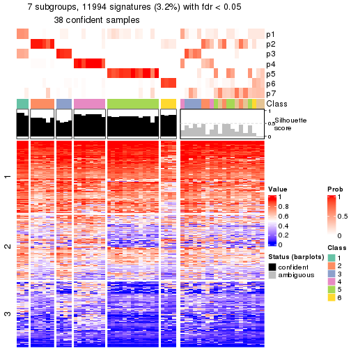</p>

</div>
<div id='tab-node-0111-get-signatures-7'>
<pre><code class="r">get_signatures(res, k = 8)
</code></pre>

<p></p>

</div>
</div>


Compare the overlap of signatures from different k:

```r
compare_signatures(res)
```


`get_signature()` returns a data frame invisibly. To get the list of signatures, the function
call should be assigned to a variable explicitly. In following code, if `plot` argument is set
to `FALSE`, no heatmap is plotted while only the differential analysis is performed.

```r
# code only for demonstration
tb = get_signature(res, k = ..., plot = FALSE)
```

An example of the output of `tb` is:

```
#>   which_row         fdr    mean_1    mean_2 scaled_mean_1 scaled_mean_2 km
#> 1        38 0.042760348  8.373488  9.131774    -0.5533452     0.5164555  1
#> 2        40 0.018707592  7.106213  8.469186    -0.6173731     0.5762149  1
#> 3        55 0.019134737 10.221463 11.207825    -0.6159697     0.5749050  1
#> 4        59 0.006059896  5.921854  7.869574    -0.6899429     0.6439467  1
#> 5        60 0.018055526  8.928898 10.211722    -0.6204761     0.5791110  1
#> 6        98 0.009384629 15.714769 14.887706     0.6635654    -0.6193277  2
...
```

The columns in `tb` are:

1. `which_row`: row indices corresponding to the input matrix.
2. `fdr`: FDR for the differential test. 
3. `mean_x`: The mean value in group x.
4. `scaled_mean_x`: The mean value in group x after rows are scaled.
5. `km`: Row groups if k-means clustering is applied to rows (which is done by automatically selecting number of clusters).

If there are too many signatures, `top_signatures = ...` can be set to only show the 
signatures with the highest FDRs:

```r
# code only for demonstration
# e.g. to show the top 500 most significant rows
tb = get_signature(res, k = ..., top_signatures = 500)
```

If the signatures are defined as these which are uniquely high in current group, `diff_method` argument
can be set to `"uniquely_high_in_one_group"`:

```r
# code only for demonstration
tb = get_signature(res, k = ..., diff_method = "uniquely_high_in_one_group")
```


UMAP plot which shows how samples are separated.


<script>
$( function() {
	$( '#tabs-node-0111-dimension-reduction' ).tabs();
} );
</script>
<div id='tabs-node-0111-dimension-reduction'>
<ul>
<li><a href='#tab-node-0111-dimension-reduction-1'>k = 2</a></li>
<li><a href='#tab-node-0111-dimension-reduction-2'>k = 3</a></li>
<li><a href='#tab-node-0111-dimension-reduction-3'>k = 4</a></li>
<li><a href='#tab-node-0111-dimension-reduction-4'>k = 5</a></li>
<li><a href='#tab-node-0111-dimension-reduction-5'>k = 6</a></li>
<li><a href='#tab-node-0111-dimension-reduction-6'>k = 7</a></li>
<li><a href='#tab-node-0111-dimension-reduction-7'>k = 8</a></li>
</ul>
<div id='tab-node-0111-dimension-reduction-1'>
<pre><code class="r">dimension_reduction(res, k = 2, method = &quot;UMAP&quot;)
</code></pre>

<p></p>

</div>
<div id='tab-node-0111-dimension-reduction-2'>
<pre><code class="r">dimension_reduction(res, k = 3, method = &quot;UMAP&quot;)
</code></pre>

<p></p>

</div>
<div id='tab-node-0111-dimension-reduction-3'>
<pre><code class="r">dimension_reduction(res, k = 4, method = &quot;UMAP&quot;)
</code></pre>

<p></p>

</div>
<div id='tab-node-0111-dimension-reduction-4'>
<pre><code class="r">dimension_reduction(res, k = 5, method = &quot;UMAP&quot;)
</code></pre>

<p></p>

</div>
<div id='tab-node-0111-dimension-reduction-5'>
<pre><code class="r">dimension_reduction(res, k = 6, method = &quot;UMAP&quot;)
</code></pre>

<p></p>

</div>
<div id='tab-node-0111-dimension-reduction-6'>
<pre><code class="r">dimension_reduction(res, k = 7, method = &quot;UMAP&quot;)
</code></pre>

<p></p>

</div>
<div id='tab-node-0111-dimension-reduction-7'>
<pre><code class="r">dimension_reduction(res, k = 8, method = &quot;UMAP&quot;)
</code></pre>

<p></p>

</div>
</div>


Following heatmap shows how subgroups are split when increasing `k`:

```r
collect_classes(res)
```


If matrix rows can be associated to genes, consider to use `functional_enrichment(res,
...)` to perform function enrichment for the signature genes. See [this vignette](https://jokergoo.github.io/cola_vignettes/functional_enrichment.html) for more detailed explanations.


 

---------------------------------------------------


### Node01111


Parent node: [Node0111](#Node0111).
Child nodes: 
                Node011111-leaf
        ,
                Node011112-leaf
        .


The object with results only for a single top-value method and a single partitioning method 
can be extracted as:

```r
res = res_rh["01111"]
```

A summary of `res` and all the functions that can be applied to it:

```r
res
```

```
#> A 'ConsensusPartition' object with k = 2, 3, 4, 5, 6, 7, 8.
#>   On a matrix with 30000 rows and 19 columns.
#>   Top rows (1000) are extracted by 'ATC' method.
#>   Subgroups are detected by 'kmeans' method.
#>   Performed in total 350 partitions by row resampling.
#>   Best k for subgroups seems to be 2.
#> 
#> Following methods can be applied to this 'ConsensusPartition' object:
#>  [1] "cola_report"             "collect_classes"         "collect_plots"          
#>  [4] "collect_stats"           "colnames"                "compare_partitions"     
#>  [7] "compare_signatures"      "consensus_heatmap"       "dimension_reduction"    
#> [10] "functional_enrichment"   "get_anno_col"            "get_anno"               
#> [13] "get_classes"             "get_consensus"           "get_matrix"             
#> [16] "get_membership"          "get_param"               "get_signatures"         
#> [19] "get_stats"               "is_best_k"               "is_stable_k"            
#> [22] "membership_heatmap"      "ncol"                    "nrow"                   
#> [25] "plot_ecdf"               "predict_classes"         "rownames"               
#> [28] "select_partition_number" "show"                    "suggest_best_k"         
#> [31] "test_to_known_factors"   "top_rows_heatmap"
```

`collect_plots()` function collects all the plots made from `res` for all `k` (number of subgroups)
into one single page to provide an easy and fast comparison between different `k`.

```r
collect_plots(res)
```


The plots are:

- The first row: a plot of the eCDF (empirical cumulative distribution
  function) curves of the consensus matrix for each `k` and the heatmap of
  predicted classes for each `k`.
- The second row: heatmaps of the consensus matrix for each `k`.
- The third row: heatmaps of the membership matrix for each `k`.
- The fouth row: heatmaps of the signatures for each `k`.

All the plots in panels can be made by individual functions and they are
plotted later in this section.

`select_partition_number()` produces several plots showing different
statistics for choosing "optimized" `k`. There are following statistics:

- eCDF curves of the consensus matrix for each `k`;
- 1-PAC. [The PAC score](https://en.wikipedia.org/wiki/Consensus_clustering#Over-interpretation_potential_of_consensus_clustering)
  measures the proportion of the ambiguous subgrouping.
- Mean silhouette score.
- Concordance. The mean probability of fiting the consensus subgroup labels in all
  partitions.
- Area increased. Denote $A_k$ as the area under the eCDF curve for current
  `k`, the area increased is defined as $A_k - A_{k-1}$.
- Rand index. The percent of pairs of samples that are both in a same cluster
  or both are not in a same cluster in the partition of k and k-1.
- Jaccard index. The ratio of pairs of samples are both in a same cluster in
  the partition of k and k-1 and the pairs of samples are both in a same
  cluster in the partition k or k-1.

The detailed explanations of these statistics can be found in [the _cola_
vignette](https://jokergoo.github.io/cola_vignettes/cola.html#toc_13).

Generally speaking, higher 1-PAC score, higher mean silhouette score or higher
concordance corresponds to better partition. Rand index and Jaccard index
measure how similar the current partition is compared to partition with `k-1`.
If they are too similar, we won't accept `k` is better than `k-1`.

```r
select_partition_number(res)
```


The numeric values for all these statistics can be obtained by `get_stats()`.

```r
get_stats(res)
```

```
#>   k 1-PAC mean_silhouette concordance area_increased  Rand Jaccard
#> 2 2 1.000           1.000       1.000         0.5268 0.474   0.474
#> 3 3 0.713           0.784       0.866         0.2128 0.906   0.802
#> 4 4 0.649           0.699       0.819         0.1330 0.801   0.507
#> 5 5 0.596           0.813       0.768         0.0647 0.889   0.578
#> 6 6 0.760           0.727       0.792         0.0662 0.965   0.824
#> 7 7 0.813           0.628       0.819         0.0404 0.971   0.833
#> 8 8 0.801           0.567       0.785         0.0253 0.965   0.760
```

`suggest_best_k()` suggests the best $k$ based on these statistics. The rules are as follows:

- All $k$ with Jaccard index larger than 0.95 are removed because increasing
  $k$ does not provide enough extra information. If all $k$ are removed, it is
  marked as no subgroup is detected.
- For all $k$ with 1-PAC score larger than 0.9, the maximal $k$ is taken as
  the best $k$, and other $k$ are marked as optional $k$.
- If it does not fit the second rule. The $k$ with the maximal vote of the
  highest 1-PAC score, highest mean silhouette, and highest concordance is
  taken as the best $k$.

```r
suggest_best_k(res)
```

```
#> [1] 2
```


Following is the table of the partitions (You need to click the **show/hide
code output** link to see it). The membership matrix (columns with name `p*`)
is inferred by
[`clue::cl_consensus()`](https://www.rdocumentation.org/link/cl_consensus?package=clue)
function with the `SE` method. Basically the value in the membership matrix
represents the probability to belong to a certain group. The finall subgroup
label for an item is determined with the group with highest probability it
belongs to.

In `get_classes()` function, the entropy is calculated from the membership
matrix and the silhouette score is calculated from the consensus matrix.


<script>
$( function() {
	$( '#tabs-node-01111-get-classes' ).tabs();
} );
</script>
<div id='tabs-node-01111-get-classes'>
<ul>
<li><a href='#tab-node-01111-get-classes-1'>k = 2</a></li>
<li><a href='#tab-node-01111-get-classes-2'>k = 3</a></li>
<li><a href='#tab-node-01111-get-classes-3'>k = 4</a></li>
<li><a href='#tab-node-01111-get-classes-4'>k = 5</a></li>
<li><a href='#tab-node-01111-get-classes-5'>k = 6</a></li>
<li><a href='#tab-node-01111-get-classes-6'>k = 7</a></li>
<li><a href='#tab-node-01111-get-classes-7'>k = 8</a></li>
</ul>

<div id='tab-node-01111-get-classes-1'>
<p><a id='tab-node-01111-get-classes-1-a' style='color:#0366d6' href='#'>show/hide code output</a></p>
<pre><code class="r">cbind(get_classes(res, k = 2), get_membership(res, k = 2))
</code></pre>

<pre><code>#&gt;                 class entropy silhouette p1 p2
#&gt; TCGA.G4.6303.01     2       0          1  0  1
#&gt; TCGA.T9.A92H.01     1       0          1  1  0
#&gt; TCGA.F5.6571.01     2       0          1  0  1
#&gt; TCGA.CI.6622.01     1       0          1  1  0
#&gt; TCGA.AA.3509.01     2       0          1  0  1
#&gt; TCGA.AH.6644.01     1       0          1  1  0
#&gt; TCGA.AH.6643.01     1       0          1  1  0
#&gt; TCGA.A6.5656.01     1       0          1  1  0
#&gt; TCGA.EI.6514.01     2       0          1  0  1
#&gt; TCGA.DM.A282.01     2       0          1  0  1
#&gt; TCGA.A6.6652.01     1       0          1  1  0
#&gt; TCGA.A6.6650.01     2       0          1  0  1
#&gt; TCGA.G4.6294.01     1       0          1  1  0
#&gt; TCGA.EI.7002.01     1       0          1  1  0
#&gt; TCGA.F4.6855.01     2       0          1  0  1
#&gt; TCGA.AA.3655.01     1       0          1  1  0
#&gt; TCGA.QG.A5YV.01     2       0          1  0  1
#&gt; TCGA.CM.6166.01     2       0          1  0  1
#&gt; TCGA.CM.6678.01     2       0          1  0  1
</code></pre>

<script>
$('#tab-node-01111-get-classes-1-a').parent().next().next().hide();
$('#tab-node-01111-get-classes-1-a').click(function(){
  $('#tab-node-01111-get-classes-1-a').parent().next().next().toggle();
  return(false);
});
</script>
</div>

<div id='tab-node-01111-get-classes-2'>
<p><a id='tab-node-01111-get-classes-2-a' style='color:#0366d6' href='#'>show/hide code output</a></p>
<pre><code class="r">cbind(get_classes(res, k = 3), get_membership(res, k = 3))
</code></pre>

<pre><code>#&gt;                 class entropy silhouette   p1   p2   p3
#&gt; TCGA.G4.6303.01     3   0.583      1.000 0.00 0.34 0.66
#&gt; TCGA.T9.A92H.01     1   0.000      0.885 1.00 0.00 0.00
#&gt; TCGA.F5.6571.01     2   0.540      0.474 0.00 0.72 0.28
#&gt; TCGA.CI.6622.01     1   0.583      0.750 0.66 0.00 0.34
#&gt; TCGA.AA.3509.01     2   0.540      0.474 0.00 0.72 0.28
#&gt; TCGA.AH.6644.01     1   0.583      0.750 0.66 0.00 0.34
#&gt; TCGA.AH.6643.01     1   0.000      0.885 1.00 0.00 0.00
#&gt; TCGA.A6.5656.01     1   0.000      0.885 1.00 0.00 0.00
#&gt; TCGA.EI.6514.01     3   0.583      1.000 0.00 0.34 0.66
#&gt; TCGA.DM.A282.01     2   0.000      0.784 0.00 1.00 0.00
#&gt; TCGA.A6.6652.01     1   0.000      0.885 1.00 0.00 0.00
#&gt; TCGA.A6.6650.01     2   0.000      0.784 0.00 1.00 0.00
#&gt; TCGA.G4.6294.01     1   0.000      0.885 1.00 0.00 0.00
#&gt; TCGA.EI.7002.01     1   0.000      0.885 1.00 0.00 0.00
#&gt; TCGA.F4.6855.01     2   0.540      0.474 0.00 0.72 0.28
#&gt; TCGA.AA.3655.01     1   0.583      0.750 0.66 0.00 0.34
#&gt; TCGA.QG.A5YV.01     2   0.000      0.784 0.00 1.00 0.00
#&gt; TCGA.CM.6166.01     2   0.000      0.784 0.00 1.00 0.00
#&gt; TCGA.CM.6678.01     2   0.000      0.784 0.00 1.00 0.00
</code></pre>

<script>
$('#tab-node-01111-get-classes-2-a').parent().next().next().hide();
$('#tab-node-01111-get-classes-2-a').click(function(){
  $('#tab-node-01111-get-classes-2-a').parent().next().next().toggle();
  return(false);
});
</script>
</div>

<div id='tab-node-01111-get-classes-3'>
<p><a id='tab-node-01111-get-classes-3-a' style='color:#0366d6' href='#'>show/hide code output</a></p>
<pre><code class="r">cbind(get_classes(res, k = 4), get_membership(res, k = 4))
</code></pre>

<pre><code>#&gt;                 class entropy silhouette   p1   p2   p3   p4
#&gt; TCGA.G4.6303.01     3   0.700      0.528 0.00 0.20 0.58 0.22
#&gt; TCGA.T9.A92H.01     1   0.000      0.963 1.00 0.00 0.00 0.00
#&gt; TCGA.F5.6571.01     2   0.499     -0.402 0.00 0.52 0.48 0.00
#&gt; TCGA.CI.6622.01     4   0.380      0.984 0.22 0.00 0.00 0.78
#&gt; TCGA.AA.3509.01     3   0.499      0.169 0.00 0.48 0.52 0.00
#&gt; TCGA.AH.6644.01     4   0.447      0.980 0.22 0.00 0.02 0.76
#&gt; TCGA.AH.6643.01     1   0.000      0.963 1.00 0.00 0.00 0.00
#&gt; TCGA.A6.5656.01     1   0.234      0.895 0.90 0.00 0.10 0.00
#&gt; TCGA.EI.6514.01     3   0.700      0.528 0.00 0.20 0.58 0.22
#&gt; TCGA.DM.A282.01     2   0.292      0.713 0.00 0.86 0.14 0.00
#&gt; TCGA.A6.6652.01     1   0.000      0.963 1.00 0.00 0.00 0.00
#&gt; TCGA.A6.6650.01     2   0.000      0.756 0.00 1.00 0.00 0.00
#&gt; TCGA.G4.6294.01     1   0.201      0.914 0.92 0.00 0.08 0.00
#&gt; TCGA.EI.7002.01     1   0.000      0.963 1.00 0.00 0.00 0.00
#&gt; TCGA.F4.6855.01     3   0.499      0.169 0.00 0.48 0.52 0.00
#&gt; TCGA.AA.3655.01     4   0.447      0.980 0.22 0.00 0.02 0.76
#&gt; TCGA.QG.A5YV.01     2   0.000      0.756 0.00 1.00 0.00 0.00
#&gt; TCGA.CM.6166.01     2   0.292      0.713 0.00 0.86 0.14 0.00
#&gt; TCGA.CM.6678.01     2   0.000      0.756 0.00 1.00 0.00 0.00
</code></pre>

<script>
$('#tab-node-01111-get-classes-3-a').parent().next().next().hide();
$('#tab-node-01111-get-classes-3-a').click(function(){
  $('#tab-node-01111-get-classes-3-a').parent().next().next().toggle();
  return(false);
});
</script>
</div>

<div id='tab-node-01111-get-classes-4'>
<p><a id='tab-node-01111-get-classes-4-a' style='color:#0366d6' href='#'>show/hide code output</a></p>
<pre><code class="r">cbind(get_classes(res, k = 5), get_membership(res, k = 5))
</code></pre>

<pre><code>#&gt;                 class entropy silhouette   p1   p2   p3   p4   p5
#&gt; TCGA.G4.6303.01     3  0.2732      0.899 0.00 0.16 0.84 0.00 0.00
#&gt; TCGA.T9.A92H.01     1  0.0000      0.911 1.00 0.00 0.00 0.00 0.00
#&gt; TCGA.F5.6571.01     2  0.6788      0.512 0.00 0.60 0.14 0.08 0.18
#&gt; TCGA.CI.6622.01     4  0.2280      0.946 0.12 0.00 0.00 0.88 0.00
#&gt; TCGA.AA.3509.01     2  0.3521      0.646 0.00 0.82 0.14 0.04 0.00
#&gt; TCGA.AH.6644.01     4  0.4794      0.902 0.12 0.00 0.02 0.76 0.10
#&gt; TCGA.AH.6643.01     1  0.0609      0.905 0.98 0.00 0.02 0.00 0.00
#&gt; TCGA.A6.5656.01     1  0.4637      0.741 0.74 0.00 0.10 0.00 0.16
#&gt; TCGA.EI.6514.01     3  0.5055      0.897 0.00 0.16 0.74 0.06 0.04
#&gt; TCGA.DM.A282.01     2  0.2516      0.437 0.00 0.86 0.00 0.00 0.14
#&gt; TCGA.A6.6652.01     1  0.0000      0.911 1.00 0.00 0.00 0.00 0.00
#&gt; TCGA.A6.6650.01     5  0.4287      1.000 0.00 0.46 0.00 0.00 0.54
#&gt; TCGA.G4.6294.01     1  0.3109      0.796 0.80 0.00 0.00 0.00 0.20
#&gt; TCGA.EI.7002.01     1  0.0000      0.911 1.00 0.00 0.00 0.00 0.00
#&gt; TCGA.F4.6855.01     2  0.3521      0.646 0.00 0.82 0.14 0.04 0.00
#&gt; TCGA.AA.3655.01     4  0.2873      0.943 0.12 0.00 0.02 0.86 0.00
#&gt; TCGA.QG.A5YV.01     5  0.4287      1.000 0.00 0.46 0.00 0.00 0.54
#&gt; TCGA.CM.6166.01     2  0.2516      0.437 0.00 0.86 0.00 0.00 0.14
#&gt; TCGA.CM.6678.01     5  0.4287      1.000 0.00 0.46 0.00 0.00 0.54
</code></pre>

<script>
$('#tab-node-01111-get-classes-4-a').parent().next().next().hide();
$('#tab-node-01111-get-classes-4-a').click(function(){
  $('#tab-node-01111-get-classes-4-a').parent().next().next().toggle();
  return(false);
});
</script>
</div>

<div id='tab-node-01111-get-classes-5'>
<p><a id='tab-node-01111-get-classes-5-a' style='color:#0366d6' href='#'>show/hide code output</a></p>
<pre><code class="r">cbind(get_classes(res, k = 6), get_membership(res, k = 6))
</code></pre>

<pre><code>#&gt;                 class entropy silhouette   p1   p2   p3   p4   p5   p6
#&gt; TCGA.G4.6303.01     3  0.4420     0.4830 0.00 0.00 0.62 0.00 0.34 0.04
#&gt; TCGA.T9.A92H.01     1  0.0000     0.8491 1.00 0.00 0.00 0.00 0.00 0.00
#&gt; TCGA.F5.6571.01     3  0.6764    -0.0519 0.00 0.22 0.44 0.02 0.02 0.30
#&gt; TCGA.CI.6622.01     4  0.0937     0.9347 0.04 0.00 0.00 0.96 0.00 0.00
#&gt; TCGA.AA.3509.01     2  0.5239     0.6401 0.00 0.68 0.12 0.00 0.04 0.16
#&gt; TCGA.AH.6644.01     4  0.3258     0.8918 0.04 0.10 0.02 0.84 0.00 0.00
#&gt; TCGA.AH.6643.01     1  0.0937     0.8388 0.96 0.04 0.00 0.00 0.00 0.00
#&gt; TCGA.A6.5656.01     1  0.4926     0.6315 0.64 0.12 0.00 0.00 0.24 0.00
#&gt; TCGA.EI.6514.01     3  0.0937     0.5464 0.00 0.00 0.96 0.00 0.00 0.04
#&gt; TCGA.DM.A282.01     2  0.4310     0.6043 0.00 0.54 0.00 0.02 0.00 0.44
#&gt; TCGA.A6.6652.01     1  0.0547     0.8502 0.98 0.00 0.00 0.00 0.02 0.00
#&gt; TCGA.A6.6650.01     6  0.0000     1.0000 0.00 0.00 0.00 0.00 0.00 1.00
#&gt; TCGA.G4.6294.01     1  0.3797     0.5760 0.58 0.00 0.00 0.00 0.42 0.00
#&gt; TCGA.EI.7002.01     1  0.0547     0.8502 0.98 0.00 0.00 0.00 0.02 0.00
#&gt; TCGA.F4.6855.01     2  0.5239     0.6401 0.00 0.68 0.12 0.00 0.04 0.16
#&gt; TCGA.AA.3655.01     4  0.2020     0.9265 0.04 0.02 0.02 0.92 0.00 0.00
#&gt; TCGA.QG.A5YV.01     6  0.0000     1.0000 0.00 0.00 0.00 0.00 0.00 1.00
#&gt; TCGA.CM.6166.01     2  0.4310     0.6043 0.00 0.54 0.00 0.02 0.00 0.44
#&gt; TCGA.CM.6678.01     6  0.0000     1.0000 0.00 0.00 0.00 0.00 0.00 1.00
</code></pre>

<script>
$('#tab-node-01111-get-classes-5-a').parent().next().next().hide();
$('#tab-node-01111-get-classes-5-a').click(function(){
  $('#tab-node-01111-get-classes-5-a').parent().next().next().toggle();
  return(false);
});
</script>
</div>

<div id='tab-node-01111-get-classes-6'>
<p><a id='tab-node-01111-get-classes-6-a' style='color:#0366d6' href='#'>show/hide code output</a></p>
<pre><code class="r">cbind(get_classes(res, k = 7), get_membership(res, k = 7))
</code></pre>

<pre><code>#&gt;                 class entropy silhouette   p1   p2   p3   p4   p5   p6   p7
#&gt; TCGA.G4.6303.01     3  0.5678     0.3482 0.00 0.26 0.54 0.04 0.00 0.00 0.16
#&gt; TCGA.T9.A92H.01     1  0.0000     0.7811 1.00 0.00 0.00 0.00 0.00 0.00 0.00
#&gt; TCGA.F5.6571.01     3  0.5223     0.0123 0.00 0.00 0.52 0.00 0.36 0.10 0.02
#&gt; TCGA.CI.6622.01     4  0.0863     0.9090 0.04 0.00 0.00 0.96 0.00 0.00 0.00
#&gt; TCGA.AA.3509.01     5  0.3911     0.6635 0.00 0.24 0.06 0.00 0.70 0.00 0.00
#&gt; TCGA.AH.6644.01     4  0.4421     0.8389 0.04 0.08 0.00 0.78 0.04 0.04 0.02
#&gt; TCGA.AH.6643.01     1  0.1363     0.7337 0.94 0.00 0.00 0.00 0.02 0.00 0.04
#&gt; TCGA.A6.5656.01     1  0.4244    -0.0113 0.54 0.42 0.00 0.00 0.00 0.00 0.04
#&gt; TCGA.EI.6514.01     3  0.0000     0.4893 0.00 0.00 1.00 0.00 0.00 0.00 0.00
#&gt; TCGA.DM.A282.01     5  0.2259     0.6694 0.00 0.00 0.00 0.00 0.84 0.16 0.00
#&gt; TCGA.A6.6652.01     1  0.0000     0.7811 1.00 0.00 0.00 0.00 0.00 0.00 0.00
#&gt; TCGA.A6.6650.01     6  0.3086     0.8514 0.00 0.00 0.00 0.00 0.04 0.80 0.16
#&gt; TCGA.G4.6294.01     7  0.3496     0.0000 0.42 0.00 0.00 0.00 0.00 0.00 0.58
#&gt; TCGA.EI.7002.01     1  0.0000     0.7811 1.00 0.00 0.00 0.00 0.00 0.00 0.00
#&gt; TCGA.F4.6855.01     5  0.3911     0.6635 0.00 0.24 0.06 0.00 0.70 0.00 0.00
#&gt; TCGA.AA.3655.01     4  0.1718     0.9048 0.04 0.00 0.00 0.92 0.00 0.00 0.04
#&gt; TCGA.QG.A5YV.01     6  0.0863     0.9286 0.00 0.00 0.00 0.00 0.04 0.96 0.00
#&gt; TCGA.CM.6166.01     5  0.2745     0.6590 0.00 0.00 0.00 0.00 0.82 0.16 0.02
#&gt; TCGA.CM.6678.01     6  0.0863     0.9286 0.00 0.00 0.00 0.00 0.04 0.96 0.00
</code></pre>

<script>
$('#tab-node-01111-get-classes-6-a').parent().next().next().hide();
$('#tab-node-01111-get-classes-6-a').click(function(){
  $('#tab-node-01111-get-classes-6-a').parent().next().next().toggle();
  return(false);
});
</script>
</div>

<div id='tab-node-01111-get-classes-7'>
<p><a id='tab-node-01111-get-classes-7-a' style='color:#0366d6' href='#'>show/hide code output</a></p>
<pre><code class="r">cbind(get_classes(res, k = 8), get_membership(res, k = 8))
</code></pre>

<pre><code>#&gt;                 class entropy silhouette   p1   p2   p3   p4   p5   p6   p7   p8
#&gt; TCGA.G4.6303.01     3  0.0471      0.402 0.00 0.00 0.98 0.00 0.00 0.02 0.00 0.00
#&gt; TCGA.T9.A92H.01     1  0.0000      0.934 1.00 0.00 0.00 0.00 0.00 0.00 0.00 0.00
#&gt; TCGA.F5.6571.01     8  0.3528      0.000 0.00 0.00 0.00 0.00 0.18 0.08 0.00 0.74
#&gt; TCGA.CI.6622.01     4  0.0471      0.826 0.02 0.00 0.00 0.98 0.00 0.00 0.00 0.00
#&gt; TCGA.AA.3509.01     5  0.0471      0.469 0.00 0.00 0.00 0.00 0.98 0.02 0.00 0.00
#&gt; TCGA.AH.6644.01     4  0.4713      0.705 0.02 0.04 0.00 0.68 0.00 0.00 0.08 0.18
#&gt; TCGA.AH.6643.01     1  0.2591      0.783 0.86 0.00 0.02 0.00 0.00 0.00 0.08 0.04
#&gt; TCGA.A6.5656.01     2  0.3449      0.000 0.32 0.66 0.00 0.00 0.00 0.00 0.02 0.00
#&gt; TCGA.EI.6514.01     3  0.5465      0.130 0.00 0.04 0.44 0.02 0.00 0.02 0.04 0.44
#&gt; TCGA.DM.A282.01     5  0.6745      0.419 0.00 0.20 0.00 0.00 0.42 0.22 0.04 0.12
#&gt; TCGA.A6.6652.01     1  0.0000      0.934 1.00 0.00 0.00 0.00 0.00 0.00 0.00 0.00
#&gt; TCGA.A6.6650.01     6  0.3503      0.761 0.00 0.02 0.00 0.00 0.00 0.78 0.12 0.08
#&gt; TCGA.G4.6294.01     7  0.3746      0.000 0.32 0.04 0.00 0.00 0.00 0.00 0.64 0.00
#&gt; TCGA.EI.7002.01     1  0.0000      0.934 1.00 0.00 0.00 0.00 0.00 0.00 0.00 0.00
#&gt; TCGA.F4.6855.01     5  0.0471      0.469 0.00 0.00 0.00 0.00 0.98 0.02 0.00 0.00
#&gt; TCGA.AA.3655.01     4  0.2532      0.811 0.02 0.04 0.00 0.88 0.02 0.00 0.00 0.04
#&gt; TCGA.QG.A5YV.01     6  0.0000      0.891 0.00 0.00 0.00 0.00 0.00 1.00 0.00 0.00
#&gt; TCGA.CM.6166.01     5  0.6745      0.419 0.00 0.20 0.00 0.00 0.42 0.22 0.04 0.12
#&gt; TCGA.CM.6678.01     6  0.0000      0.891 0.00 0.00 0.00 0.00 0.00 1.00 0.00 0.00
</code></pre>

<script>
$('#tab-node-01111-get-classes-7-a').parent().next().next().hide();
$('#tab-node-01111-get-classes-7-a').click(function(){
  $('#tab-node-01111-get-classes-7-a').parent().next().next().toggle();
  return(false);
});
</script>
</div>
</div>

Heatmaps for the consensus matrix. It visualizes the probability of two
samples to be in a same group.


<script>
$( function() {
	$( '#tabs-node-01111-consensus-heatmap' ).tabs();
} );
</script>
<div id='tabs-node-01111-consensus-heatmap'>
<ul>
<li><a href='#tab-node-01111-consensus-heatmap-1'>k = 2</a></li>
<li><a href='#tab-node-01111-consensus-heatmap-2'>k = 3</a></li>
<li><a href='#tab-node-01111-consensus-heatmap-3'>k = 4</a></li>
<li><a href='#tab-node-01111-consensus-heatmap-4'>k = 5</a></li>
<li><a href='#tab-node-01111-consensus-heatmap-5'>k = 6</a></li>
<li><a href='#tab-node-01111-consensus-heatmap-6'>k = 7</a></li>
<li><a href='#tab-node-01111-consensus-heatmap-7'>k = 8</a></li>
</ul>
<div id='tab-node-01111-consensus-heatmap-1'>
<pre><code class="r">consensus_heatmap(res, k = 2)
</code></pre>

<p></p>

</div>
<div id='tab-node-01111-consensus-heatmap-2'>
<pre><code class="r">consensus_heatmap(res, k = 3)
</code></pre>

<p></p>

</div>
<div id='tab-node-01111-consensus-heatmap-3'>
<pre><code class="r">consensus_heatmap(res, k = 4)
</code></pre>

<p></p>

</div>
<div id='tab-node-01111-consensus-heatmap-4'>
<pre><code class="r">consensus_heatmap(res, k = 5)
</code></pre>

<p></p>

</div>
<div id='tab-node-01111-consensus-heatmap-5'>
<pre><code class="r">consensus_heatmap(res, k = 6)
</code></pre>

<p></p>

</div>
<div id='tab-node-01111-consensus-heatmap-6'>
<pre><code class="r">consensus_heatmap(res, k = 7)
</code></pre>

<p></p>

</div>
<div id='tab-node-01111-consensus-heatmap-7'>
<pre><code class="r">consensus_heatmap(res, k = 8)
</code></pre>

<p></p>

</div>
</div>

Heatmaps for the membership of samples in all partitions to see how consistent they are:


<script>
$( function() {
	$( '#tabs-node-01111-membership-heatmap' ).tabs();
} );
</script>
<div id='tabs-node-01111-membership-heatmap'>
<ul>
<li><a href='#tab-node-01111-membership-heatmap-1'>k = 2</a></li>
<li><a href='#tab-node-01111-membership-heatmap-2'>k = 3</a></li>
<li><a href='#tab-node-01111-membership-heatmap-3'>k = 4</a></li>
<li><a href='#tab-node-01111-membership-heatmap-4'>k = 5</a></li>
<li><a href='#tab-node-01111-membership-heatmap-5'>k = 6</a></li>
<li><a href='#tab-node-01111-membership-heatmap-6'>k = 7</a></li>
<li><a href='#tab-node-01111-membership-heatmap-7'>k = 8</a></li>
</ul>
<div id='tab-node-01111-membership-heatmap-1'>
<pre><code class="r">membership_heatmap(res, k = 2)
</code></pre>

<p></p>

</div>
<div id='tab-node-01111-membership-heatmap-2'>
<pre><code class="r">membership_heatmap(res, k = 3)
</code></pre>

<p></p>

</div>
<div id='tab-node-01111-membership-heatmap-3'>
<pre><code class="r">membership_heatmap(res, k = 4)
</code></pre>

<p></p>

</div>
<div id='tab-node-01111-membership-heatmap-4'>
<pre><code class="r">membership_heatmap(res, k = 5)
</code></pre>

<p></p>

</div>
<div id='tab-node-01111-membership-heatmap-5'>
<pre><code class="r">membership_heatmap(res, k = 6)
</code></pre>

<p>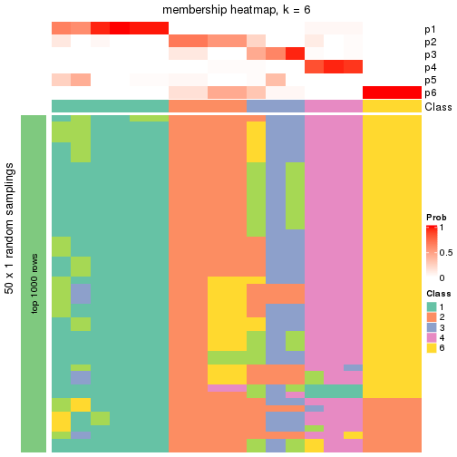</p>

</div>
<div id='tab-node-01111-membership-heatmap-6'>
<pre><code class="r">membership_heatmap(res, k = 7)
</code></pre>

<p></p>

</div>
<div id='tab-node-01111-membership-heatmap-7'>
<pre><code class="r">membership_heatmap(res, k = 8)
</code></pre>

<p></p>

</div>
</div>

As soon as the classes for columns are determined, the signatures
that are significantly different between subgroups can be looked for. 
Following are the heatmaps for signatures.


<script>
$( function() {
	$( '#tabs-node-01111-get-signatures' ).tabs();
} );
</script>
<div id='tabs-node-01111-get-signatures'>
<ul>
<li><a href='#tab-node-01111-get-signatures-1'>k = 2</a></li>
<li><a href='#tab-node-01111-get-signatures-2'>k = 3</a></li>
<li><a href='#tab-node-01111-get-signatures-3'>k = 4</a></li>
<li><a href='#tab-node-01111-get-signatures-4'>k = 5</a></li>
<li><a href='#tab-node-01111-get-signatures-5'>k = 6</a></li>
<li><a href='#tab-node-01111-get-signatures-6'>k = 7</a></li>
<li><a href='#tab-node-01111-get-signatures-7'>k = 8</a></li>
</ul>
<div id='tab-node-01111-get-signatures-1'>
<pre><code class="r">get_signatures(res, k = 2)
</code></pre>

<p></p>

</div>
<div id='tab-node-01111-get-signatures-2'>
<pre><code class="r">get_signatures(res, k = 3)
</code></pre>

<p></p>

</div>
<div id='tab-node-01111-get-signatures-3'>
<pre><code class="r">get_signatures(res, k = 4)
</code></pre>

<p></p>

</div>
<div id='tab-node-01111-get-signatures-4'>
<pre><code class="r">get_signatures(res, k = 5)
</code></pre>

<p></p>

</div>
<div id='tab-node-01111-get-signatures-5'>
<pre><code class="r">get_signatures(res, k = 6)
</code></pre>

<p></p>

</div>
<div id='tab-node-01111-get-signatures-6'>
<pre><code class="r">get_signatures(res, k = 7)
</code></pre>

<p></p>

</div>
<div id='tab-node-01111-get-signatures-7'>
<pre><code class="r">get_signatures(res, k = 8)
</code></pre>

<p></p>

</div>
</div>


Compare the overlap of signatures from different k:

```r
compare_signatures(res)
```


`get_signature()` returns a data frame invisibly. To get the list of signatures, the function
call should be assigned to a variable explicitly. In following code, if `plot` argument is set
to `FALSE`, no heatmap is plotted while only the differential analysis is performed.

```r
# code only for demonstration
tb = get_signature(res, k = ..., plot = FALSE)
```

An example of the output of `tb` is:

```
#>   which_row         fdr    mean_1    mean_2 scaled_mean_1 scaled_mean_2 km
#> 1        38 0.042760348  8.373488  9.131774    -0.5533452     0.5164555  1
#> 2        40 0.018707592  7.106213  8.469186    -0.6173731     0.5762149  1
#> 3        55 0.019134737 10.221463 11.207825    -0.6159697     0.5749050  1
#> 4        59 0.006059896  5.921854  7.869574    -0.6899429     0.6439467  1
#> 5        60 0.018055526  8.928898 10.211722    -0.6204761     0.5791110  1
#> 6        98 0.009384629 15.714769 14.887706     0.6635654    -0.6193277  2
...
```

The columns in `tb` are:

1. `which_row`: row indices corresponding to the input matrix.
2. `fdr`: FDR for the differential test. 
3. `mean_x`: The mean value in group x.
4. `scaled_mean_x`: The mean value in group x after rows are scaled.
5. `km`: Row groups if k-means clustering is applied to rows (which is done by automatically selecting number of clusters).

If there are too many signatures, `top_signatures = ...` can be set to only show the 
signatures with the highest FDRs:

```r
# code only for demonstration
# e.g. to show the top 500 most significant rows
tb = get_signature(res, k = ..., top_signatures = 500)
```

If the signatures are defined as these which are uniquely high in current group, `diff_method` argument
can be set to `"uniquely_high_in_one_group"`:

```r
# code only for demonstration
tb = get_signature(res, k = ..., diff_method = "uniquely_high_in_one_group")
```


UMAP plot which shows how samples are separated.


<script>
$( function() {
	$( '#tabs-node-01111-dimension-reduction' ).tabs();
} );
</script>
<div id='tabs-node-01111-dimension-reduction'>
<ul>
<li><a href='#tab-node-01111-dimension-reduction-1'>k = 2</a></li>
<li><a href='#tab-node-01111-dimension-reduction-2'>k = 3</a></li>
<li><a href='#tab-node-01111-dimension-reduction-3'>k = 4</a></li>
<li><a href='#tab-node-01111-dimension-reduction-4'>k = 5</a></li>
<li><a href='#tab-node-01111-dimension-reduction-5'>k = 6</a></li>
<li><a href='#tab-node-01111-dimension-reduction-6'>k = 7</a></li>
<li><a href='#tab-node-01111-dimension-reduction-7'>k = 8</a></li>
</ul>
<div id='tab-node-01111-dimension-reduction-1'>
<pre><code class="r">dimension_reduction(res, k = 2, method = &quot;UMAP&quot;)
</code></pre>

<p></p>

</div>
<div id='tab-node-01111-dimension-reduction-2'>
<pre><code class="r">dimension_reduction(res, k = 3, method = &quot;UMAP&quot;)
</code></pre>

<p></p>

</div>
<div id='tab-node-01111-dimension-reduction-3'>
<pre><code class="r">dimension_reduction(res, k = 4, method = &quot;UMAP&quot;)
</code></pre>

<p></p>

</div>
<div id='tab-node-01111-dimension-reduction-4'>
<pre><code class="r">dimension_reduction(res, k = 5, method = &quot;UMAP&quot;)
</code></pre>

<p></p>

</div>
<div id='tab-node-01111-dimension-reduction-5'>
<pre><code class="r">dimension_reduction(res, k = 6, method = &quot;UMAP&quot;)
</code></pre>

<p>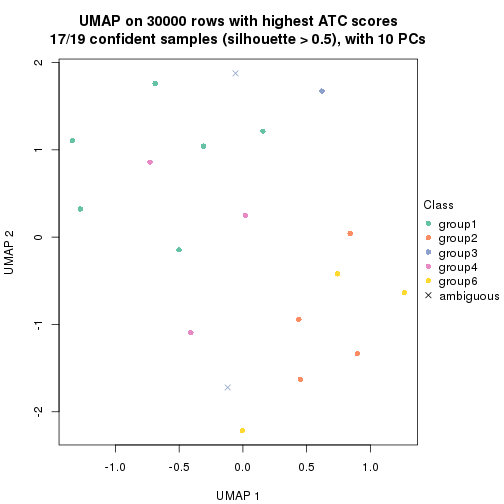</p>

</div>
<div id='tab-node-01111-dimension-reduction-6'>
<pre><code class="r">dimension_reduction(res, k = 7, method = &quot;UMAP&quot;)
</code></pre>

<p></p>

</div>
<div id='tab-node-01111-dimension-reduction-7'>
<pre><code class="r">dimension_reduction(res, k = 8, method = &quot;UMAP&quot;)
</code></pre>

<p></p>

</div>
</div>


Following heatmap shows how subgroups are split when increasing `k`:

```r
collect_classes(res)
```


If matrix rows can be associated to genes, consider to use `functional_enrichment(res,
...)` to perform function enrichment for the signature genes. See [this vignette](https://jokergoo.github.io/cola_vignettes/functional_enrichment.html) for more detailed explanations.


 

---------------------------------------------------


### Node0112


Parent node: [Node011](#Node011).
Child nodes: 
                [Node01111](#Node01111)
        ,
                Node01112-leaf
        ,
                Node01113-leaf
        ,
                Node01114-leaf
        ,
                Node01121-leaf
        ,
                Node01122-leaf
        ,
                Node01123-leaf
        ,
                Node01124-leaf
        ,
                Node01211-leaf
        ,
                Node01212-leaf
        ,
                Node01213-leaf
        ,
                Node01221-leaf
        ,
                Node01222-leaf
        ,
                Node01223-leaf
        ,
                Node01224-leaf
        ,
                Node02121-leaf
        ,
                Node02122-leaf
        ,
                Node02123-leaf
        ,
                Node04221-leaf
        ,
                Node04222-leaf
        ,
                Node04223-leaf
        .


The object with results only for a single top-value method and a single partitioning method 
can be extracted as:

```r
res = res_rh["0112"]
```

A summary of `res` and all the functions that can be applied to it:

```r
res
```

```
#> A 'ConsensusPartition' object with k = 2, 3, 4, 5, 6, 7, 8.
#>   On a matrix with 30000 rows and 46 columns.
#>   Top rows (1000) are extracted by 'ATC' method.
#>   Subgroups are detected by 'kmeans' method.
#>   Performed in total 350 partitions by row resampling.
#>   Best k for subgroups seems to be 4.
#> 
#> Following methods can be applied to this 'ConsensusPartition' object:
#>  [1] "cola_report"             "collect_classes"         "collect_plots"          
#>  [4] "collect_stats"           "colnames"                "compare_partitions"     
#>  [7] "compare_signatures"      "consensus_heatmap"       "dimension_reduction"    
#> [10] "functional_enrichment"   "get_anno_col"            "get_anno"               
#> [13] "get_classes"             "get_consensus"           "get_matrix"             
#> [16] "get_membership"          "get_param"               "get_signatures"         
#> [19] "get_stats"               "is_best_k"               "is_stable_k"            
#> [22] "membership_heatmap"      "ncol"                    "nrow"                   
#> [25] "plot_ecdf"               "predict_classes"         "rownames"               
#> [28] "select_partition_number" "show"                    "suggest_best_k"         
#> [31] "test_to_known_factors"   "top_rows_heatmap"
```

`collect_plots()` function collects all the plots made from `res` for all `k` (number of subgroups)
into one single page to provide an easy and fast comparison between different `k`.

```r
collect_plots(res)
```


The plots are:

- The first row: a plot of the eCDF (empirical cumulative distribution
  function) curves of the consensus matrix for each `k` and the heatmap of
  predicted classes for each `k`.
- The second row: heatmaps of the consensus matrix for each `k`.
- The third row: heatmaps of the membership matrix for each `k`.
- The fouth row: heatmaps of the signatures for each `k`.

All the plots in panels can be made by individual functions and they are
plotted later in this section.

`select_partition_number()` produces several plots showing different
statistics for choosing "optimized" `k`. There are following statistics:

- eCDF curves of the consensus matrix for each `k`;
- 1-PAC. [The PAC score](https://en.wikipedia.org/wiki/Consensus_clustering#Over-interpretation_potential_of_consensus_clustering)
  measures the proportion of the ambiguous subgrouping.
- Mean silhouette score.
- Concordance. The mean probability of fiting the consensus subgroup labels in all
  partitions.
- Area increased. Denote $A_k$ as the area under the eCDF curve for current
  `k`, the area increased is defined as $A_k - A_{k-1}$.
- Rand index. The percent of pairs of samples that are both in a same cluster
  or both are not in a same cluster in the partition of k and k-1.
- Jaccard index. The ratio of pairs of samples are both in a same cluster in
  the partition of k and k-1 and the pairs of samples are both in a same
  cluster in the partition k or k-1.

The detailed explanations of these statistics can be found in [the _cola_
vignette](https://jokergoo.github.io/cola_vignettes/cola.html#toc_13).

Generally speaking, higher 1-PAC score, higher mean silhouette score or higher
concordance corresponds to better partition. Rand index and Jaccard index
measure how similar the current partition is compared to partition with `k-1`.
If they are too similar, we won't accept `k` is better than `k-1`.

```r
select_partition_number(res)
```

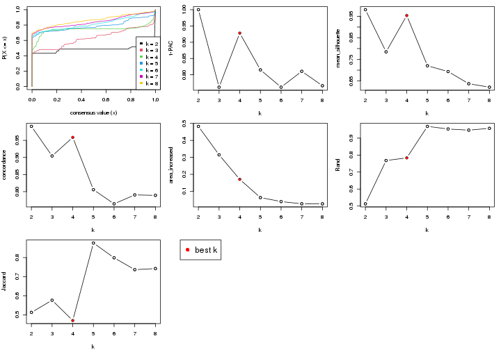

The numeric values for all these statistics can be obtained by `get_stats()`.

```r
get_stats(res)
```

```
#>   k 1-PAC mean_silhouette concordance area_increased  Rand Jaccard
#> 2 2 1.000           0.980       0.991         0.4826 0.513   0.513
#> 3 3 0.762           0.785       0.904         0.3148 0.768   0.577
#> 4 4 0.928           0.953       0.959         0.1704 0.784   0.470
#> 5 5 0.815           0.720       0.806         0.0630 0.969   0.876
#> 6 6 0.762           0.694       0.764         0.0396 0.954   0.799
#> 7 7 0.811           0.637       0.790         0.0266 0.947   0.737
#> 8 8 0.766           0.621       0.789         0.0262 0.957   0.743
```

`suggest_best_k()` suggests the best $k$ based on these statistics. The rules are as follows:

- All $k$ with Jaccard index larger than 0.95 are removed because increasing
  $k$ does not provide enough extra information. If all $k$ are removed, it is
  marked as no subgroup is detected.
- For all $k$ with 1-PAC score larger than 0.9, the maximal $k$ is taken as
  the best $k$, and other $k$ are marked as optional $k$.
- If it does not fit the second rule. The $k$ with the maximal vote of the
  highest 1-PAC score, highest mean silhouette, and highest concordance is
  taken as the best $k$.

```r
suggest_best_k(res)
```

```
#> [1] 4
#> attr(,"optional")
#> [1] 2
```

There is also optional best $k$ = 2 that is worth to check.

Following is the table of the partitions (You need to click the **show/hide
code output** link to see it). The membership matrix (columns with name `p*`)
is inferred by
[`clue::cl_consensus()`](https://www.rdocumentation.org/link/cl_consensus?package=clue)
function with the `SE` method. Basically the value in the membership matrix
represents the probability to belong to a certain group. The finall subgroup
label for an item is determined with the group with highest probability it
belongs to.

In `get_classes()` function, the entropy is calculated from the membership
matrix and the silhouette score is calculated from the consensus matrix.


<script>
$( function() {
	$( '#tabs-node-0112-get-classes' ).tabs();
} );
</script>
<div id='tabs-node-0112-get-classes'>
<ul>
<li><a href='#tab-node-0112-get-classes-1'>k = 2</a></li>
<li><a href='#tab-node-0112-get-classes-2'>k = 3</a></li>
<li><a href='#tab-node-0112-get-classes-3'>k = 4</a></li>
<li><a href='#tab-node-0112-get-classes-4'>k = 5</a></li>
<li><a href='#tab-node-0112-get-classes-5'>k = 6</a></li>
<li><a href='#tab-node-0112-get-classes-6'>k = 7</a></li>
<li><a href='#tab-node-0112-get-classes-7'>k = 8</a></li>
</ul>

<div id='tab-node-0112-get-classes-1'>
<p><a id='tab-node-0112-get-classes-1-a' style='color:#0366d6' href='#'>show/hide code output</a></p>
<pre><code class="r">cbind(get_classes(res, k = 2), get_membership(res, k = 2))
</code></pre>

<pre><code>#&gt;                 class entropy silhouette   p1   p2
#&gt; TCGA.AG.A026.01     1   0.000      1.000 1.00 0.00
#&gt; TCGA.AD.6965.01     2   0.722      0.763 0.20 0.80
#&gt; TCGA.A6.5660.01     1   0.000      1.000 1.00 0.00
#&gt; TCGA.CM.5862.01     1   0.000      1.000 1.00 0.00
#&gt; TCGA.QG.A5YX.01     1   0.000      1.000 1.00 0.00
#&gt; TCGA.AG.A036.01     1   0.000      1.000 1.00 0.00
#&gt; TCGA.RU.A8FL.01     1   0.000      1.000 1.00 0.00
#&gt; TCGA.AZ.6599.01     2   0.000      0.975 0.00 1.00
#&gt; TCGA.CM.4750.01     1   0.000      1.000 1.00 0.00
#&gt; TCGA.CM.6677.01     1   0.000      1.000 1.00 0.00
#&gt; TCGA.F5.6814.01     1   0.000      1.000 1.00 0.00
#&gt; TCGA.DM.A28F.01     1   0.000      1.000 1.00 0.00
#&gt; TCGA.DM.A0X9.01     2   0.000      0.975 0.00 1.00
#&gt; TCGA.NH.A6GB.01     2   0.760      0.734 0.22 0.78
#&gt; TCGA.NH.A50U.01     2   0.000      0.975 0.00 1.00
#&gt; TCGA.CM.5864.01     1   0.000      1.000 1.00 0.00
#&gt; TCGA.AG.3742.01     1   0.000      1.000 1.00 0.00
#&gt; TCGA.A6.5666.01     1   0.000      1.000 1.00 0.00
#&gt; TCGA.AG.3591.01     2   0.000      0.975 0.00 1.00
#&gt; TCGA.EI.6510.01     2   0.000      0.975 0.00 1.00
#&gt; TCGA.DY.A1DG.01     1   0.000      1.000 1.00 0.00
#&gt; TCGA.AG.4021.01     2   0.000      0.975 0.00 1.00
#&gt; TCGA.DM.A1D9.01     2   0.000      0.975 0.00 1.00
#&gt; TCGA.CM.4744.01     2   0.000      0.975 0.00 1.00
#&gt; TCGA.SS.A7HO.01     1   0.000      1.000 1.00 0.00
#&gt; TCGA.NH.A50T.01     1   0.000      1.000 1.00 0.00
#&gt; TCGA.D5.5539.01     2   0.000      0.975 0.00 1.00
#&gt; TCGA.AY.A54L.01     2   0.000      0.975 0.00 1.00
#&gt; TCGA.DC.5337.01     1   0.000      1.000 1.00 0.00
#&gt; TCGA.QG.A5YW.01     1   0.000      1.000 1.00 0.00
#&gt; TCGA.EI.6882.01     2   0.000      0.975 0.00 1.00
#&gt; TCGA.A6.2677.01     1   0.000      1.000 1.00 0.00
#&gt; TCGA.AA.3502.01     2   0.000      0.975 0.00 1.00
#&gt; TCGA.AA.3496.01     1   0.000      1.000 1.00 0.00
#&gt; TCGA.CL.5918.01     1   0.000      1.000 1.00 0.00
#&gt; TCGA.AY.A71X.01     2   0.000      0.975 0.00 1.00
#&gt; TCGA.AH.6549.01     1   0.000      1.000 1.00 0.00
#&gt; TCGA.AH.6897.01     1   0.000      1.000 1.00 0.00
#&gt; TCGA.4T.AA8H.01     2   0.000      0.975 0.00 1.00
#&gt; TCGA.EI.6508.01     1   0.000      1.000 1.00 0.00
#&gt; TCGA.D5.6532.01     1   0.000      1.000 1.00 0.00
#&gt; TCGA.A6.2680.01     1   0.000      1.000 1.00 0.00
#&gt; TCGA.CM.6680.01     2   0.000      0.975 0.00 1.00
#&gt; TCGA.DM.A28G.01     2   0.000      0.975 0.00 1.00
#&gt; TCGA.D5.6537.01     1   0.000      1.000 1.00 0.00
#&gt; TCGA.DY.A1DD.01     1   0.000      1.000 1.00 0.00
</code></pre>

<script>
$('#tab-node-0112-get-classes-1-a').parent().next().next().hide();
$('#tab-node-0112-get-classes-1-a').click(function(){
  $('#tab-node-0112-get-classes-1-a').parent().next().next().toggle();
  return(false);
});
</script>
</div>

<div id='tab-node-0112-get-classes-2'>
<p><a id='tab-node-0112-get-classes-2-a' style='color:#0366d6' href='#'>show/hide code output</a></p>
<pre><code class="r">cbind(get_classes(res, k = 3), get_membership(res, k = 3))
</code></pre>

<pre><code>#&gt;                 class entropy silhouette   p1   p2   p3
#&gt; TCGA.AG.A026.01     1  0.0000      0.916 1.00 0.00 0.00
#&gt; TCGA.AD.6965.01     3  0.0000      0.745 0.00 0.00 1.00
#&gt; TCGA.A6.5660.01     1  0.0000      0.916 1.00 0.00 0.00
#&gt; TCGA.CM.5862.01     1  0.0000      0.916 1.00 0.00 0.00
#&gt; TCGA.QG.A5YX.01     3  0.6651      0.606 0.34 0.02 0.64
#&gt; TCGA.AG.A036.01     1  0.0000      0.916 1.00 0.00 0.00
#&gt; TCGA.RU.A8FL.01     1  0.0000      0.916 1.00 0.00 0.00
#&gt; TCGA.AZ.6599.01     2  0.0892      0.914 0.00 0.98 0.02
#&gt; TCGA.CM.4750.01     1  0.0000      0.916 1.00 0.00 0.00
#&gt; TCGA.CM.6677.01     3  0.5016      0.727 0.24 0.00 0.76
#&gt; TCGA.F5.6814.01     3  0.5948      0.581 0.36 0.00 0.64
#&gt; TCGA.DM.A28F.01     1  0.6302     -0.188 0.52 0.00 0.48
#&gt; TCGA.DM.A0X9.01     2  0.5216      0.803 0.00 0.74 0.26
#&gt; TCGA.NH.A6GB.01     3  0.0000      0.745 0.00 0.00 1.00
#&gt; TCGA.NH.A50U.01     2  0.4796      0.822 0.00 0.78 0.22
#&gt; TCGA.CM.5864.01     1  0.5948      0.276 0.64 0.00 0.36
#&gt; TCGA.AG.3742.01     3  0.5016      0.727 0.24 0.00 0.76
#&gt; TCGA.A6.5666.01     1  0.0000      0.916 1.00 0.00 0.00
#&gt; TCGA.AG.3591.01     2  0.0000      0.911 0.00 1.00 0.00
#&gt; TCGA.EI.6510.01     2  0.4796      0.822 0.00 0.78 0.22
#&gt; TCGA.DY.A1DG.01     1  0.0000      0.916 1.00 0.00 0.00
#&gt; TCGA.AG.4021.01     3  0.1529      0.720 0.00 0.04 0.96
#&gt; TCGA.DM.A1D9.01     2  0.5016      0.806 0.00 0.76 0.24
#&gt; TCGA.CM.4744.01     3  0.0000      0.745 0.00 0.00 1.00
#&gt; TCGA.SS.A7HO.01     1  0.0000      0.916 1.00 0.00 0.00
#&gt; TCGA.NH.A50T.01     1  0.0000      0.916 1.00 0.00 0.00
#&gt; TCGA.D5.5539.01     2  0.0000      0.911 0.00 1.00 0.00
#&gt; TCGA.AY.A54L.01     3  0.1529      0.720 0.00 0.04 0.96
#&gt; TCGA.DC.5337.01     1  0.0892      0.899 0.98 0.00 0.02
#&gt; TCGA.QG.A5YW.01     3  0.5948      0.581 0.36 0.00 0.64
#&gt; TCGA.EI.6882.01     2  0.0892      0.914 0.00 0.98 0.02
#&gt; TCGA.A6.2677.01     1  0.0000      0.916 1.00 0.00 0.00
#&gt; TCGA.AA.3502.01     2  0.0892      0.914 0.00 0.98 0.02
#&gt; TCGA.AA.3496.01     1  0.0000      0.916 1.00 0.00 0.00
#&gt; TCGA.CL.5918.01     1  0.0000      0.916 1.00 0.00 0.00
#&gt; TCGA.AY.A71X.01     2  0.0892      0.914 0.00 0.98 0.02
#&gt; TCGA.AH.6549.01     1  0.0000      0.916 1.00 0.00 0.00
#&gt; TCGA.AH.6897.01     1  0.0000      0.916 1.00 0.00 0.00
#&gt; TCGA.4T.AA8H.01     2  0.0892      0.914 0.00 0.98 0.02
#&gt; TCGA.EI.6508.01     1  0.6302     -0.184 0.52 0.00 0.48
#&gt; TCGA.D5.6532.01     1  0.2066      0.859 0.94 0.00 0.06
#&gt; TCGA.A6.2680.01     3  0.5216      0.710 0.26 0.00 0.74
#&gt; TCGA.CM.6680.01     2  0.0000      0.911 0.00 1.00 0.00
#&gt; TCGA.DM.A28G.01     3  0.2066      0.717 0.00 0.06 0.94
#&gt; TCGA.D5.6537.01     1  0.0000      0.916 1.00 0.00 0.00
#&gt; TCGA.DY.A1DD.01     1  0.0000      0.916 1.00 0.00 0.00
</code></pre>

<script>
$('#tab-node-0112-get-classes-2-a').parent().next().next().hide();
$('#tab-node-0112-get-classes-2-a').click(function(){
  $('#tab-node-0112-get-classes-2-a').parent().next().next().toggle();
  return(false);
});
</script>
</div>

<div id='tab-node-0112-get-classes-3'>
<p><a id='tab-node-0112-get-classes-3-a' style='color:#0366d6' href='#'>show/hide code output</a></p>
<pre><code class="r">cbind(get_classes(res, k = 4), get_membership(res, k = 4))
</code></pre>

<pre><code>#&gt;                 class entropy silhouette   p1   p2   p3   p4
#&gt; TCGA.AG.A026.01     1  0.0707      0.982 0.98 0.00 0.02 0.00
#&gt; TCGA.AD.6965.01     4  0.2011      0.919 0.00 0.00 0.08 0.92
#&gt; TCGA.A6.5660.01     1  0.0707      0.982 0.98 0.00 0.02 0.00
#&gt; TCGA.CM.5862.01     1  0.0000      0.986 1.00 0.00 0.00 0.00
#&gt; TCGA.QG.A5YX.01     3  0.3198      0.892 0.04 0.00 0.88 0.08
#&gt; TCGA.AG.A036.01     1  0.0000      0.986 1.00 0.00 0.00 0.00
#&gt; TCGA.RU.A8FL.01     1  0.0000      0.986 1.00 0.00 0.00 0.00
#&gt; TCGA.AZ.6599.01     2  0.0000      0.994 0.00 1.00 0.00 0.00
#&gt; TCGA.CM.4750.01     1  0.0707      0.982 0.98 0.00 0.02 0.00
#&gt; TCGA.CM.6677.01     3  0.2830      0.904 0.04 0.00 0.90 0.06
#&gt; TCGA.F5.6814.01     3  0.1913      0.930 0.04 0.00 0.94 0.02
#&gt; TCGA.DM.A28F.01     3  0.2011      0.930 0.08 0.00 0.92 0.00
#&gt; TCGA.DM.A0X9.01     4  0.1637      0.935 0.00 0.06 0.00 0.94
#&gt; TCGA.NH.A6GB.01     4  0.2011      0.919 0.00 0.00 0.08 0.92
#&gt; TCGA.NH.A50U.01     4  0.1637      0.935 0.00 0.06 0.00 0.94
#&gt; TCGA.CM.5864.01     3  0.2011      0.928 0.08 0.00 0.92 0.00
#&gt; TCGA.AG.3742.01     3  0.2830      0.904 0.04 0.00 0.90 0.06
#&gt; TCGA.A6.5666.01     1  0.0707      0.976 0.98 0.00 0.02 0.00
#&gt; TCGA.AG.3591.01     2  0.0707      0.990 0.00 0.98 0.02 0.00
#&gt; TCGA.EI.6510.01     4  0.1637      0.935 0.00 0.06 0.00 0.94
#&gt; TCGA.DY.A1DG.01     1  0.0000      0.986 1.00 0.00 0.00 0.00
#&gt; TCGA.AG.4021.01     4  0.0000      0.944 0.00 0.00 0.00 1.00
#&gt; TCGA.DM.A1D9.01     4  0.1637      0.935 0.00 0.06 0.00 0.94
#&gt; TCGA.CM.4744.01     4  0.2011      0.919 0.00 0.00 0.08 0.92
#&gt; TCGA.SS.A7HO.01     1  0.0707      0.976 0.98 0.00 0.02 0.00
#&gt; TCGA.NH.A50T.01     1  0.0000      0.986 1.00 0.00 0.00 0.00
#&gt; TCGA.D5.5539.01     2  0.0707      0.990 0.00 0.98 0.02 0.00
#&gt; TCGA.AY.A54L.01     4  0.0000      0.944 0.00 0.00 0.00 1.00
#&gt; TCGA.DC.5337.01     3  0.2647      0.906 0.12 0.00 0.88 0.00
#&gt; TCGA.QG.A5YW.01     3  0.1913      0.930 0.04 0.00 0.94 0.02
#&gt; TCGA.EI.6882.01     2  0.0000      0.994 0.00 1.00 0.00 0.00
#&gt; TCGA.A6.2677.01     1  0.0707      0.982 0.98 0.00 0.02 0.00
#&gt; TCGA.AA.3502.01     2  0.0000      0.994 0.00 1.00 0.00 0.00
#&gt; TCGA.AA.3496.01     1  0.0707      0.982 0.98 0.00 0.02 0.00
#&gt; TCGA.CL.5918.01     3  0.3975      0.766 0.24 0.00 0.76 0.00
#&gt; TCGA.AY.A71X.01     2  0.0000      0.994 0.00 1.00 0.00 0.00
#&gt; TCGA.AH.6549.01     1  0.0707      0.976 0.98 0.00 0.02 0.00
#&gt; TCGA.AH.6897.01     1  0.0707      0.976 0.98 0.00 0.02 0.00
#&gt; TCGA.4T.AA8H.01     2  0.0000      0.994 0.00 1.00 0.00 0.00
#&gt; TCGA.EI.6508.01     3  0.2011      0.930 0.08 0.00 0.92 0.00
#&gt; TCGA.D5.6532.01     3  0.2011      0.928 0.08 0.00 0.92 0.00
#&gt; TCGA.A6.2680.01     3  0.1411      0.918 0.02 0.00 0.96 0.02
#&gt; TCGA.CM.6680.01     2  0.0707      0.990 0.00 0.98 0.02 0.00
#&gt; TCGA.DM.A28G.01     4  0.0000      0.944 0.00 0.00 0.00 1.00
#&gt; TCGA.D5.6537.01     1  0.0707      0.982 0.98 0.00 0.02 0.00
#&gt; TCGA.DY.A1DD.01     1  0.0000      0.986 1.00 0.00 0.00 0.00
</code></pre>

<script>
$('#tab-node-0112-get-classes-3-a').parent().next().next().hide();
$('#tab-node-0112-get-classes-3-a').click(function(){
  $('#tab-node-0112-get-classes-3-a').parent().next().next().toggle();
  return(false);
});
</script>
</div>

<div id='tab-node-0112-get-classes-4'>
<p><a id='tab-node-0112-get-classes-4-a' style='color:#0366d6' href='#'>show/hide code output</a></p>
<pre><code class="r">cbind(get_classes(res, k = 5), get_membership(res, k = 5))
</code></pre>

<pre><code>#&gt;                 class entropy silhouette   p1   p2   p3   p4   p5
#&gt; TCGA.AG.A026.01     1   0.000     0.9005 1.00 0.00 0.00 0.00 0.00
#&gt; TCGA.AD.6965.01     4   0.633     0.6934 0.00 0.00 0.28 0.52 0.20
#&gt; TCGA.A6.5660.01     1   0.327     0.6705 0.78 0.00 0.22 0.00 0.00
#&gt; TCGA.CM.5862.01     1   0.000     0.9005 1.00 0.00 0.00 0.00 0.00
#&gt; TCGA.QG.A5YX.01     5   0.387     0.6067 0.00 0.00 0.14 0.06 0.80
#&gt; TCGA.AG.A036.01     1   0.000     0.9005 1.00 0.00 0.00 0.00 0.00
#&gt; TCGA.RU.A8FL.01     1   0.000     0.9005 1.00 0.00 0.00 0.00 0.00
#&gt; TCGA.AZ.6599.01     2   0.000     0.9837 0.00 1.00 0.00 0.00 0.00
#&gt; TCGA.CM.4750.01     1   0.000     0.9005 1.00 0.00 0.00 0.00 0.00
#&gt; TCGA.CM.6677.01     3   0.000     0.4736 0.00 0.00 1.00 0.00 0.00
#&gt; TCGA.F5.6814.01     3   0.429    -0.0886 0.00 0.00 0.54 0.00 0.46
#&gt; TCGA.DM.A28F.01     5   0.413     0.4995 0.00 0.00 0.38 0.00 0.62
#&gt; TCGA.DM.A0X9.01     4   0.228     0.8253 0.00 0.00 0.00 0.88 0.12
#&gt; TCGA.NH.A6GB.01     4   0.633     0.6934 0.00 0.00 0.28 0.52 0.20
#&gt; TCGA.NH.A50U.01     4   0.000     0.8160 0.00 0.00 0.00 1.00 0.00
#&gt; TCGA.CM.5864.01     3   0.311     0.4782 0.00 0.00 0.80 0.00 0.20
#&gt; TCGA.AG.3742.01     3   0.000     0.4736 0.00 0.00 1.00 0.00 0.00
#&gt; TCGA.A6.5666.01     1   0.356     0.7702 0.74 0.00 0.00 0.00 0.26
#&gt; TCGA.AG.3591.01     2   0.141     0.9501 0.00 0.94 0.00 0.06 0.00
#&gt; TCGA.EI.6510.01     4   0.000     0.8160 0.00 0.00 0.00 1.00 0.00
#&gt; TCGA.DY.A1DG.01     1   0.000     0.9005 1.00 0.00 0.00 0.00 0.00
#&gt; TCGA.AG.4021.01     4   0.369     0.8170 0.00 0.00 0.02 0.78 0.20
#&gt; TCGA.DM.A1D9.01     4   0.000     0.8160 0.00 0.00 0.00 1.00 0.00
#&gt; TCGA.CM.4744.01     4   0.633     0.6934 0.00 0.00 0.28 0.52 0.20
#&gt; TCGA.SS.A7HO.01     1   0.356     0.7702 0.74 0.00 0.00 0.00 0.26
#&gt; TCGA.NH.A50T.01     1   0.000     0.9005 1.00 0.00 0.00 0.00 0.00
#&gt; TCGA.D5.5539.01     2   0.141     0.9501 0.00 0.94 0.00 0.06 0.00
#&gt; TCGA.AY.A54L.01     4   0.351     0.8207 0.00 0.00 0.02 0.80 0.18
#&gt; TCGA.DC.5337.01     5   0.373     0.6053 0.04 0.00 0.16 0.00 0.80
#&gt; TCGA.QG.A5YW.01     5   0.418     0.4425 0.00 0.00 0.40 0.00 0.60
#&gt; TCGA.EI.6882.01     2   0.000     0.9837 0.00 1.00 0.00 0.00 0.00
#&gt; TCGA.A6.2677.01     1   0.000     0.9005 1.00 0.00 0.00 0.00 0.00
#&gt; TCGA.AA.3502.01     2   0.000     0.9837 0.00 1.00 0.00 0.00 0.00
#&gt; TCGA.AA.3496.01     1   0.327     0.7992 0.78 0.00 0.00 0.00 0.22
#&gt; TCGA.CL.5918.01     3   0.380     0.2377 0.30 0.00 0.70 0.00 0.00
#&gt; TCGA.AY.A71X.01     2   0.000     0.9837 0.00 1.00 0.00 0.00 0.00
#&gt; TCGA.AH.6549.01     1   0.356     0.7702 0.74 0.00 0.00 0.00 0.26
#&gt; TCGA.AH.6897.01     1   0.342     0.7854 0.76 0.00 0.00 0.00 0.24
#&gt; TCGA.4T.AA8H.01     2   0.000     0.9837 0.00 1.00 0.00 0.00 0.00
#&gt; TCGA.EI.6508.01     3   0.431    -0.2282 0.00 0.00 0.50 0.00 0.50
#&gt; TCGA.D5.6532.01     3   0.311     0.4782 0.00 0.00 0.80 0.00 0.20
#&gt; TCGA.A6.2680.01     3   0.426    -0.0156 0.00 0.00 0.56 0.00 0.44
#&gt; TCGA.CM.6680.01     2   0.000     0.9837 0.00 1.00 0.00 0.00 0.00
#&gt; TCGA.DM.A28G.01     4   0.000     0.8160 0.00 0.00 0.00 1.00 0.00
#&gt; TCGA.D5.6537.01     1   0.000     0.9005 1.00 0.00 0.00 0.00 0.00
#&gt; TCGA.DY.A1DD.01     1   0.000     0.9005 1.00 0.00 0.00 0.00 0.00
</code></pre>

<script>
$('#tab-node-0112-get-classes-4-a').parent().next().next().hide();
$('#tab-node-0112-get-classes-4-a').click(function(){
  $('#tab-node-0112-get-classes-4-a').parent().next().next().toggle();
  return(false);
});
</script>
</div>

<div id='tab-node-0112-get-classes-5'>
<p><a id='tab-node-0112-get-classes-5-a' style='color:#0366d6' href='#'>show/hide code output</a></p>
<pre><code class="r">cbind(get_classes(res, k = 6), get_membership(res, k = 6))
</code></pre>

<pre><code>#&gt;                 class entropy silhouette   p1   p2   p3   p4   p5   p6
#&gt; TCGA.AG.A026.01     1  0.1480      0.775 0.94 0.00 0.00 0.00 0.02 0.04
#&gt; TCGA.AD.6965.01     6  0.5837      0.900 0.00 0.00 0.20 0.34 0.00 0.46
#&gt; TCGA.A6.5660.01     1  0.2790      0.610 0.84 0.00 0.14 0.00 0.00 0.02
#&gt; TCGA.CM.5862.01     1  0.2631      0.787 0.82 0.00 0.00 0.00 0.00 0.18
#&gt; TCGA.QG.A5YX.01     5  0.1807      0.562 0.00 0.00 0.02 0.06 0.92 0.00
#&gt; TCGA.AG.A036.01     1  0.2048      0.786 0.88 0.00 0.00 0.00 0.00 0.12
#&gt; TCGA.RU.A8FL.01     1  0.3315      0.783 0.78 0.00 0.00 0.00 0.02 0.20
#&gt; TCGA.AZ.6599.01     2  0.0000      0.950 0.00 1.00 0.00 0.00 0.00 0.00
#&gt; TCGA.CM.4750.01     1  0.0000      0.765 1.00 0.00 0.00 0.00 0.00 0.00
#&gt; TCGA.CM.6677.01     3  0.0000      0.638 0.00 0.00 1.00 0.00 0.00 0.00
#&gt; TCGA.F5.6814.01     5  0.4337      0.421 0.00 0.00 0.48 0.00 0.50 0.02
#&gt; TCGA.DM.A28F.01     5  0.2454      0.622 0.00 0.00 0.16 0.00 0.84 0.00
#&gt; TCGA.DM.A0X9.01     4  0.2260      0.628 0.00 0.00 0.00 0.86 0.00 0.14
#&gt; TCGA.NH.A6GB.01     6  0.6047      0.951 0.00 0.00 0.26 0.34 0.00 0.40
#&gt; TCGA.NH.A50U.01     4  0.0000      0.747 0.00 0.00 0.00 1.00 0.00 0.00
#&gt; TCGA.CM.5864.01     3  0.4879      0.629 0.12 0.00 0.72 0.00 0.12 0.04
#&gt; TCGA.AG.3742.01     3  0.0000      0.638 0.00 0.00 1.00 0.00 0.00 0.00
#&gt; TCGA.A6.5666.01     1  0.5285      0.658 0.48 0.00 0.00 0.00 0.10 0.42
#&gt; TCGA.AG.3591.01     2  0.3382      0.900 0.00 0.84 0.00 0.04 0.04 0.08
#&gt; TCGA.EI.6510.01     4  0.0000      0.747 0.00 0.00 0.00 1.00 0.00 0.00
#&gt; TCGA.DY.A1DG.01     1  0.3315      0.783 0.78 0.00 0.00 0.00 0.02 0.20
#&gt; TCGA.AG.4021.01     4  0.4310     -0.284 0.00 0.00 0.00 0.54 0.02 0.44
#&gt; TCGA.DM.A1D9.01     4  0.0000      0.747 0.00 0.00 0.00 1.00 0.00 0.00
#&gt; TCGA.CM.4744.01     6  0.6047      0.951 0.00 0.00 0.26 0.34 0.00 0.40
#&gt; TCGA.SS.A7HO.01     1  0.5037      0.658 0.54 0.00 0.00 0.00 0.08 0.38
#&gt; TCGA.NH.A50T.01     1  0.3315      0.783 0.78 0.00 0.00 0.00 0.02 0.20
#&gt; TCGA.D5.5539.01     2  0.3382      0.900 0.00 0.84 0.00 0.04 0.04 0.08
#&gt; TCGA.AY.A54L.01     4  0.3578      0.159 0.00 0.00 0.00 0.66 0.00 0.34
#&gt; TCGA.DC.5337.01     5  0.4495      0.410 0.06 0.00 0.02 0.00 0.72 0.20
#&gt; TCGA.QG.A5YW.01     5  0.2454      0.622 0.00 0.00 0.16 0.00 0.84 0.00
#&gt; TCGA.EI.6882.01     2  0.0000      0.950 0.00 1.00 0.00 0.00 0.00 0.00
#&gt; TCGA.A6.2677.01     1  0.0547      0.754 0.98 0.00 0.00 0.00 0.00 0.02
#&gt; TCGA.AA.3502.01     2  0.0000      0.950 0.00 1.00 0.00 0.00 0.00 0.00
#&gt; TCGA.AA.3496.01     1  0.4503      0.623 0.68 0.00 0.00 0.00 0.08 0.24
#&gt; TCGA.CL.5918.01     3  0.4002      0.503 0.32 0.00 0.66 0.00 0.00 0.02
#&gt; TCGA.AY.A71X.01     2  0.0000      0.950 0.00 1.00 0.00 0.00 0.00 0.00
#&gt; TCGA.AH.6549.01     1  0.4503      0.623 0.68 0.00 0.00 0.00 0.08 0.24
#&gt; TCGA.AH.6897.01     1  0.5095      0.671 0.50 0.00 0.00 0.00 0.08 0.42
#&gt; TCGA.4T.AA8H.01     2  0.0000      0.950 0.00 1.00 0.00 0.00 0.00 0.00
#&gt; TCGA.EI.6508.01     5  0.4337      0.421 0.00 0.00 0.48 0.00 0.50 0.02
#&gt; TCGA.D5.6532.01     3  0.4520      0.641 0.12 0.00 0.74 0.00 0.12 0.02
#&gt; TCGA.A6.2680.01     5  0.4337      0.421 0.00 0.00 0.48 0.00 0.50 0.02
#&gt; TCGA.CM.6680.01     2  0.2474      0.916 0.00 0.88 0.00 0.00 0.04 0.08
#&gt; TCGA.DM.A28G.01     4  0.0000      0.747 0.00 0.00 0.00 1.00 0.00 0.00
#&gt; TCGA.D5.6537.01     1  0.0937      0.774 0.96 0.00 0.00 0.00 0.00 0.04
#&gt; TCGA.DY.A1DD.01     1  0.3315      0.783 0.78 0.00 0.00 0.00 0.02 0.20
</code></pre>

<script>
$('#tab-node-0112-get-classes-5-a').parent().next().next().hide();
$('#tab-node-0112-get-classes-5-a').click(function(){
  $('#tab-node-0112-get-classes-5-a').parent().next().next().toggle();
  return(false);
});
</script>
</div>

<div id='tab-node-0112-get-classes-6'>
<p><a id='tab-node-0112-get-classes-6-a' style='color:#0366d6' href='#'>show/hide code output</a></p>
<pre><code class="r">cbind(get_classes(res, k = 7), get_membership(res, k = 7))
</code></pre>

<pre><code>#&gt;                 class entropy silhouette   p1   p2   p3   p4   p5   p6   p7
#&gt; TCGA.AG.A026.01     1  0.0863      0.541 0.96 0.00 0.00 0.00 0.00 0.00 0.04
#&gt; TCGA.AD.6965.01     6  0.1671      0.857 0.00 0.00 0.00 0.10 0.00 0.90 0.00
#&gt; TCGA.A6.5660.01     1  0.2906      0.323 0.80 0.00 0.18 0.00 0.00 0.00 0.02
#&gt; TCGA.CM.5862.01     1  0.2906      0.482 0.80 0.00 0.00 0.00 0.00 0.02 0.18
#&gt; TCGA.QG.A5YX.01     5  0.1718      0.621 0.00 0.00 0.00 0.04 0.92 0.00 0.04
#&gt; TCGA.AG.A036.01     1  0.2745      0.498 0.82 0.00 0.00 0.00 0.00 0.02 0.16
#&gt; TCGA.RU.A8FL.01     1  0.3307      0.434 0.74 0.00 0.00 0.00 0.00 0.02 0.24
#&gt; TCGA.AZ.6599.01     2  0.0000      0.879 0.00 1.00 0.00 0.00 0.00 0.00 0.00
#&gt; TCGA.CM.4750.01     1  0.0000      0.535 1.00 0.00 0.00 0.00 0.00 0.00 0.00
#&gt; TCGA.CM.6677.01     3  0.3630      0.748 0.00 0.00 0.80 0.00 0.04 0.10 0.06
#&gt; TCGA.F5.6814.01     5  0.4923      0.425 0.00 0.00 0.38 0.00 0.54 0.04 0.04
#&gt; TCGA.DM.A28F.01     5  0.1363      0.639 0.00 0.00 0.04 0.00 0.94 0.02 0.00
#&gt; TCGA.DM.A0X9.01     4  0.3047      0.466 0.00 0.00 0.00 0.72 0.00 0.28 0.00
#&gt; TCGA.NH.A6GB.01     6  0.3289      0.855 0.00 0.00 0.06 0.10 0.00 0.82 0.02
#&gt; TCGA.NH.A50U.01     4  0.0000      0.908 0.00 0.00 0.00 1.00 0.00 0.00 0.00
#&gt; TCGA.CM.5864.01     3  0.3546      0.754 0.06 0.00 0.82 0.00 0.08 0.02 0.02
#&gt; TCGA.AG.3742.01     3  0.3630      0.748 0.00 0.00 0.80 0.00 0.04 0.10 0.06
#&gt; TCGA.A6.5666.01     7  0.3525      0.916 0.44 0.00 0.00 0.00 0.00 0.00 0.56
#&gt; TCGA.AG.3591.01     2  0.4895      0.772 0.00 0.66 0.04 0.04 0.02 0.00 0.24
#&gt; TCGA.EI.6510.01     4  0.0000      0.908 0.00 0.00 0.00 1.00 0.00 0.00 0.00
#&gt; TCGA.DY.A1DG.01     1  0.3307      0.434 0.74 0.00 0.00 0.00 0.00 0.02 0.24
#&gt; TCGA.AG.4021.01     6  0.2906      0.817 0.00 0.00 0.00 0.18 0.00 0.80 0.02
#&gt; TCGA.DM.A1D9.01     4  0.0000      0.908 0.00 0.00 0.00 1.00 0.00 0.00 0.00
#&gt; TCGA.CM.4744.01     6  0.3289      0.855 0.00 0.00 0.06 0.10 0.00 0.82 0.02
#&gt; TCGA.SS.A7HO.01     7  0.3562      0.825 0.50 0.00 0.00 0.00 0.00 0.00 0.50
#&gt; TCGA.NH.A50T.01     1  0.2832      0.443 0.76 0.00 0.00 0.00 0.00 0.00 0.24
#&gt; TCGA.D5.5539.01     2  0.4895      0.772 0.00 0.66 0.04 0.04 0.02 0.00 0.24
#&gt; TCGA.AY.A54L.01     6  0.3221      0.656 0.00 0.00 0.00 0.32 0.00 0.68 0.00
#&gt; TCGA.DC.5337.01     5  0.4447      0.440 0.02 0.00 0.02 0.00 0.66 0.02 0.28
#&gt; TCGA.QG.A5YW.01     5  0.0504      0.640 0.00 0.00 0.02 0.00 0.98 0.00 0.00
#&gt; TCGA.EI.6882.01     2  0.0000      0.879 0.00 1.00 0.00 0.00 0.00 0.00 0.00
#&gt; TCGA.A6.2677.01     1  0.0000      0.535 1.00 0.00 0.00 0.00 0.00 0.00 0.00
#&gt; TCGA.AA.3502.01     2  0.0000      0.879 0.00 1.00 0.00 0.00 0.00 0.00 0.00
#&gt; TCGA.AA.3496.01     1  0.3221     -0.384 0.68 0.00 0.00 0.00 0.00 0.00 0.32
#&gt; TCGA.CL.5918.01     3  0.3244      0.702 0.18 0.00 0.78 0.00 0.00 0.00 0.04
#&gt; TCGA.AY.A71X.01     2  0.0000      0.879 0.00 1.00 0.00 0.00 0.00 0.00 0.00
#&gt; TCGA.AH.6549.01     1  0.4146     -0.336 0.64 0.00 0.02 0.00 0.00 0.02 0.32
#&gt; TCGA.AH.6897.01     7  0.3525      0.916 0.44 0.00 0.00 0.00 0.00 0.00 0.56
#&gt; TCGA.4T.AA8H.01     2  0.0000      0.879 0.00 1.00 0.00 0.00 0.00 0.00 0.00
#&gt; TCGA.EI.6508.01     5  0.5194      0.401 0.00 0.00 0.40 0.00 0.50 0.04 0.06
#&gt; TCGA.D5.6532.01     3  0.3061      0.765 0.06 0.00 0.84 0.00 0.08 0.00 0.02
#&gt; TCGA.A6.2680.01     5  0.4923      0.425 0.00 0.00 0.38 0.00 0.54 0.04 0.04
#&gt; TCGA.CM.6680.01     2  0.4107      0.789 0.00 0.70 0.04 0.00 0.02 0.00 0.24
#&gt; TCGA.DM.A28G.01     4  0.0000      0.908 0.00 0.00 0.00 1.00 0.00 0.00 0.00
#&gt; TCGA.D5.6537.01     1  0.0863      0.541 0.96 0.00 0.00 0.00 0.00 0.00 0.04
#&gt; TCGA.DY.A1DD.01     1  0.3307      0.434 0.74 0.00 0.00 0.00 0.00 0.02 0.24
</code></pre>

<script>
$('#tab-node-0112-get-classes-6-a').parent().next().next().hide();
$('#tab-node-0112-get-classes-6-a').click(function(){
  $('#tab-node-0112-get-classes-6-a').parent().next().next().toggle();
  return(false);
});
</script>
</div>

<div id='tab-node-0112-get-classes-7'>
<p><a id='tab-node-0112-get-classes-7-a' style='color:#0366d6' href='#'>show/hide code output</a></p>
<pre><code class="r">cbind(get_classes(res, k = 8), get_membership(res, k = 8))
</code></pre>

<pre><code>#&gt;                 class entropy silhouette   p1   p2   p3   p4   p5   p6   p7   p8
#&gt; TCGA.AG.A026.01     1  0.1341     0.7478 0.92 0.00 0.08 0.00 0.00 0.00 0.00 0.00
#&gt; TCGA.AD.6965.01     6  0.0000     0.8365 0.00 0.00 0.00 0.00 0.00 1.00 0.00 0.00
#&gt; TCGA.A6.5660.01     1  0.2719     0.6496 0.80 0.00 0.18 0.00 0.02 0.00 0.00 0.00
#&gt; TCGA.CM.5862.01     1  0.4236     0.7339 0.72 0.00 0.04 0.02 0.00 0.00 0.18 0.04
#&gt; TCGA.QG.A5YX.01     8  0.3299     0.0000 0.00 0.00 0.00 0.00 0.44 0.00 0.00 0.56
#&gt; TCGA.AG.A036.01     1  0.3986     0.7455 0.74 0.00 0.08 0.00 0.00 0.00 0.14 0.04
#&gt; TCGA.RU.A8FL.01     1  0.3178     0.7432 0.80 0.00 0.00 0.02 0.00 0.00 0.14 0.04
#&gt; TCGA.AZ.6599.01     2  0.0000     0.8593 0.00 1.00 0.00 0.00 0.00 0.00 0.00 0.00
#&gt; TCGA.CM.4750.01     1  0.1341     0.7478 0.92 0.00 0.08 0.00 0.00 0.00 0.00 0.00
#&gt; TCGA.CM.6677.01     3  0.5540     0.6429 0.00 0.00 0.56 0.00 0.20 0.10 0.00 0.14
#&gt; TCGA.F5.6814.01     5  0.1091     0.4940 0.00 0.00 0.06 0.00 0.94 0.00 0.00 0.00
#&gt; TCGA.DM.A28F.01     5  0.3299    -0.6402 0.00 0.00 0.00 0.00 0.56 0.00 0.00 0.44
#&gt; TCGA.DM.A0X9.01     4  0.4798     0.3198 0.00 0.00 0.02 0.56 0.00 0.32 0.00 0.10
#&gt; TCGA.NH.A6GB.01     6  0.1804     0.8320 0.00 0.00 0.08 0.00 0.00 0.90 0.00 0.02
#&gt; TCGA.NH.A50U.01     4  0.0808     0.8896 0.00 0.00 0.00 0.96 0.00 0.04 0.00 0.00
#&gt; TCGA.CM.5864.01     3  0.3618     0.6149 0.02 0.00 0.60 0.00 0.38 0.00 0.00 0.00
#&gt; TCGA.AG.3742.01     3  0.5540     0.6429 0.00 0.00 0.56 0.00 0.20 0.10 0.00 0.14
#&gt; TCGA.A6.5666.01     7  0.4622     0.5884 0.26 0.00 0.02 0.02 0.00 0.00 0.64 0.06
#&gt; TCGA.AG.3591.01     2  0.5530     0.6968 0.00 0.60 0.02 0.12 0.00 0.00 0.18 0.08
#&gt; TCGA.EI.6510.01     4  0.0808     0.8896 0.00 0.00 0.00 0.96 0.00 0.04 0.00 0.00
#&gt; TCGA.DY.A1DG.01     1  0.4313     0.6341 0.70 0.00 0.02 0.02 0.00 0.00 0.20 0.06
#&gt; TCGA.AG.4021.01     6  0.3319     0.7733 0.00 0.00 0.06 0.08 0.00 0.82 0.02 0.02
#&gt; TCGA.DM.A1D9.01     4  0.0808     0.8896 0.00 0.00 0.00 0.96 0.00 0.04 0.00 0.00
#&gt; TCGA.CM.4744.01     6  0.1804     0.8320 0.00 0.00 0.08 0.00 0.00 0.90 0.00 0.02
#&gt; TCGA.SS.A7HO.01     7  0.2406     0.6674 0.20 0.00 0.00 0.00 0.00 0.00 0.80 0.00
#&gt; TCGA.NH.A50T.01     1  0.2404     0.7558 0.84 0.00 0.00 0.02 0.00 0.00 0.14 0.00
#&gt; TCGA.D5.5539.01     2  0.5530     0.6968 0.00 0.60 0.02 0.12 0.00 0.00 0.18 0.08
#&gt; TCGA.AY.A54L.01     6  0.2981     0.6487 0.00 0.00 0.00 0.22 0.00 0.76 0.00 0.02
#&gt; TCGA.DC.5337.01     7  0.4588     0.0358 0.00 0.00 0.00 0.00 0.12 0.00 0.54 0.34
#&gt; TCGA.QG.A5YW.01     5  0.3272    -0.6518 0.00 0.00 0.00 0.00 0.58 0.00 0.00 0.42
#&gt; TCGA.EI.6882.01     2  0.0471     0.8551 0.00 0.98 0.02 0.00 0.00 0.00 0.00 0.00
#&gt; TCGA.A6.2677.01     1  0.1765     0.7196 0.88 0.00 0.12 0.00 0.00 0.00 0.00 0.00
#&gt; TCGA.AA.3502.01     2  0.0000     0.8593 0.00 1.00 0.00 0.00 0.00 0.00 0.00 0.00
#&gt; TCGA.AA.3496.01     7  0.4174     0.6265 0.32 0.00 0.04 0.00 0.00 0.00 0.62 0.02
#&gt; TCGA.CL.5918.01     3  0.4033     0.5455 0.20 0.00 0.68 0.00 0.12 0.00 0.00 0.00
#&gt; TCGA.AY.A71X.01     2  0.0000     0.8593 0.00 1.00 0.00 0.00 0.00 0.00 0.00 0.00
#&gt; TCGA.AH.6549.01     7  0.4570     0.6322 0.28 0.00 0.06 0.00 0.00 0.00 0.62 0.04
#&gt; TCGA.AH.6897.01     7  0.4375     0.6089 0.26 0.00 0.02 0.02 0.00 0.00 0.66 0.04
#&gt; TCGA.4T.AA8H.01     2  0.0000     0.8593 0.00 1.00 0.00 0.00 0.00 0.00 0.00 0.00
#&gt; TCGA.EI.6508.01     5  0.2348     0.4156 0.00 0.00 0.06 0.02 0.88 0.00 0.00 0.04
#&gt; TCGA.D5.6532.01     3  0.3514     0.6445 0.02 0.00 0.64 0.00 0.34 0.00 0.00 0.00
#&gt; TCGA.A6.2680.01     5  0.1091     0.4940 0.00 0.00 0.06 0.00 0.94 0.00 0.00 0.00
#&gt; TCGA.CM.6680.01     2  0.3970     0.7649 0.00 0.72 0.02 0.00 0.00 0.00 0.18 0.08
#&gt; TCGA.DM.A28G.01     4  0.0808     0.8896 0.00 0.00 0.00 0.96 0.00 0.04 0.00 0.00
#&gt; TCGA.D5.6537.01     1  0.1275     0.7415 0.94 0.00 0.04 0.00 0.00 0.00 0.02 0.00
#&gt; TCGA.DY.A1DD.01     1  0.3178     0.7432 0.80 0.00 0.00 0.02 0.00 0.00 0.14 0.04
</code></pre>

<script>
$('#tab-node-0112-get-classes-7-a').parent().next().next().hide();
$('#tab-node-0112-get-classes-7-a').click(function(){
  $('#tab-node-0112-get-classes-7-a').parent().next().next().toggle();
  return(false);
});
</script>
</div>
</div>

Heatmaps for the consensus matrix. It visualizes the probability of two
samples to be in a same group.


<script>
$( function() {
	$( '#tabs-node-0112-consensus-heatmap' ).tabs();
} );
</script>
<div id='tabs-node-0112-consensus-heatmap'>
<ul>
<li><a href='#tab-node-0112-consensus-heatmap-1'>k = 2</a></li>
<li><a href='#tab-node-0112-consensus-heatmap-2'>k = 3</a></li>
<li><a href='#tab-node-0112-consensus-heatmap-3'>k = 4</a></li>
<li><a href='#tab-node-0112-consensus-heatmap-4'>k = 5</a></li>
<li><a href='#tab-node-0112-consensus-heatmap-5'>k = 6</a></li>
<li><a href='#tab-node-0112-consensus-heatmap-6'>k = 7</a></li>
<li><a href='#tab-node-0112-consensus-heatmap-7'>k = 8</a></li>
</ul>
<div id='tab-node-0112-consensus-heatmap-1'>
<pre><code class="r">consensus_heatmap(res, k = 2)
</code></pre>

<p></p>

</div>
<div id='tab-node-0112-consensus-heatmap-2'>
<pre><code class="r">consensus_heatmap(res, k = 3)
</code></pre>

<p></p>

</div>
<div id='tab-node-0112-consensus-heatmap-3'>
<pre><code class="r">consensus_heatmap(res, k = 4)
</code></pre>

<p></p>

</div>
<div id='tab-node-0112-consensus-heatmap-4'>
<pre><code class="r">consensus_heatmap(res, k = 5)
</code></pre>

<p></p>

</div>
<div id='tab-node-0112-consensus-heatmap-5'>
<pre><code class="r">consensus_heatmap(res, k = 6)
</code></pre>

<p></p>

</div>
<div id='tab-node-0112-consensus-heatmap-6'>
<pre><code class="r">consensus_heatmap(res, k = 7)
</code></pre>

<p></p>

</div>
<div id='tab-node-0112-consensus-heatmap-7'>
<pre><code class="r">consensus_heatmap(res, k = 8)
</code></pre>

<p></p>

</div>
</div>

Heatmaps for the membership of samples in all partitions to see how consistent they are:


<script>
$( function() {
	$( '#tabs-node-0112-membership-heatmap' ).tabs();
} );
</script>
<div id='tabs-node-0112-membership-heatmap'>
<ul>
<li><a href='#tab-node-0112-membership-heatmap-1'>k = 2</a></li>
<li><a href='#tab-node-0112-membership-heatmap-2'>k = 3</a></li>
<li><a href='#tab-node-0112-membership-heatmap-3'>k = 4</a></li>
<li><a href='#tab-node-0112-membership-heatmap-4'>k = 5</a></li>
<li><a href='#tab-node-0112-membership-heatmap-5'>k = 6</a></li>
<li><a href='#tab-node-0112-membership-heatmap-6'>k = 7</a></li>
<li><a href='#tab-node-0112-membership-heatmap-7'>k = 8</a></li>
</ul>
<div id='tab-node-0112-membership-heatmap-1'>
<pre><code class="r">membership_heatmap(res, k = 2)
</code></pre>

<p></p>

</div>
<div id='tab-node-0112-membership-heatmap-2'>
<pre><code class="r">membership_heatmap(res, k = 3)
</code></pre>

<p></p>

</div>
<div id='tab-node-0112-membership-heatmap-3'>
<pre><code class="r">membership_heatmap(res, k = 4)
</code></pre>

<p></p>

</div>
<div id='tab-node-0112-membership-heatmap-4'>
<pre><code class="r">membership_heatmap(res, k = 5)
</code></pre>

<p></p>

</div>
<div id='tab-node-0112-membership-heatmap-5'>
<pre><code class="r">membership_heatmap(res, k = 6)
</code></pre>

<p></p>

</div>
<div id='tab-node-0112-membership-heatmap-6'>
<pre><code class="r">membership_heatmap(res, k = 7)
</code></pre>

<p></p>

</div>
<div id='tab-node-0112-membership-heatmap-7'>
<pre><code class="r">membership_heatmap(res, k = 8)
</code></pre>

<p></p>

</div>
</div>

As soon as the classes for columns are determined, the signatures
that are significantly different between subgroups can be looked for. 
Following are the heatmaps for signatures.


<script>
$( function() {
	$( '#tabs-node-0112-get-signatures' ).tabs();
} );
</script>
<div id='tabs-node-0112-get-signatures'>
<ul>
<li><a href='#tab-node-0112-get-signatures-1'>k = 2</a></li>
<li><a href='#tab-node-0112-get-signatures-2'>k = 3</a></li>
<li><a href='#tab-node-0112-get-signatures-3'>k = 4</a></li>
<li><a href='#tab-node-0112-get-signatures-4'>k = 5</a></li>
<li><a href='#tab-node-0112-get-signatures-5'>k = 6</a></li>
<li><a href='#tab-node-0112-get-signatures-6'>k = 7</a></li>
<li><a href='#tab-node-0112-get-signatures-7'>k = 8</a></li>
</ul>
<div id='tab-node-0112-get-signatures-1'>
<pre><code class="r">get_signatures(res, k = 2)
</code></pre>

<p></p>

</div>
<div id='tab-node-0112-get-signatures-2'>
<pre><code class="r">get_signatures(res, k = 3)
</code></pre>

<p></p>

</div>
<div id='tab-node-0112-get-signatures-3'>
<pre><code class="r">get_signatures(res, k = 4)
</code></pre>

<p></p>

</div>
<div id='tab-node-0112-get-signatures-4'>
<pre><code class="r">get_signatures(res, k = 5)
</code></pre>

<p></p>

</div>
<div id='tab-node-0112-get-signatures-5'>
<pre><code class="r">get_signatures(res, k = 6)
</code></pre>

<p></p>

</div>
<div id='tab-node-0112-get-signatures-6'>
<pre><code class="r">get_signatures(res, k = 7)
</code></pre>

<p></p>

</div>
<div id='tab-node-0112-get-signatures-7'>
<pre><code class="r">get_signatures(res, k = 8)
</code></pre>

<p></p>

</div>
</div>


Compare the overlap of signatures from different k:

```r
compare_signatures(res)
```


`get_signature()` returns a data frame invisibly. To get the list of signatures, the function
call should be assigned to a variable explicitly. In following code, if `plot` argument is set
to `FALSE`, no heatmap is plotted while only the differential analysis is performed.

```r
# code only for demonstration
tb = get_signature(res, k = ..., plot = FALSE)
```

An example of the output of `tb` is:

```
#>   which_row         fdr    mean_1    mean_2 scaled_mean_1 scaled_mean_2 km
#> 1        38 0.042760348  8.373488  9.131774    -0.5533452     0.5164555  1
#> 2        40 0.018707592  7.106213  8.469186    -0.6173731     0.5762149  1
#> 3        55 0.019134737 10.221463 11.207825    -0.6159697     0.5749050  1
#> 4        59 0.006059896  5.921854  7.869574    -0.6899429     0.6439467  1
#> 5        60 0.018055526  8.928898 10.211722    -0.6204761     0.5791110  1
#> 6        98 0.009384629 15.714769 14.887706     0.6635654    -0.6193277  2
...
```

The columns in `tb` are:

1. `which_row`: row indices corresponding to the input matrix.
2. `fdr`: FDR for the differential test. 
3. `mean_x`: The mean value in group x.
4. `scaled_mean_x`: The mean value in group x after rows are scaled.
5. `km`: Row groups if k-means clustering is applied to rows (which is done by automatically selecting number of clusters).

If there are too many signatures, `top_signatures = ...` can be set to only show the 
signatures with the highest FDRs:

```r
# code only for demonstration
# e.g. to show the top 500 most significant rows
tb = get_signature(res, k = ..., top_signatures = 500)
```

If the signatures are defined as these which are uniquely high in current group, `diff_method` argument
can be set to `"uniquely_high_in_one_group"`:

```r
# code only for demonstration
tb = get_signature(res, k = ..., diff_method = "uniquely_high_in_one_group")
```


UMAP plot which shows how samples are separated.


<script>
$( function() {
	$( '#tabs-node-0112-dimension-reduction' ).tabs();
} );
</script>
<div id='tabs-node-0112-dimension-reduction'>
<ul>
<li><a href='#tab-node-0112-dimension-reduction-1'>k = 2</a></li>
<li><a href='#tab-node-0112-dimension-reduction-2'>k = 3</a></li>
<li><a href='#tab-node-0112-dimension-reduction-3'>k = 4</a></li>
<li><a href='#tab-node-0112-dimension-reduction-4'>k = 5</a></li>
<li><a href='#tab-node-0112-dimension-reduction-5'>k = 6</a></li>
<li><a href='#tab-node-0112-dimension-reduction-6'>k = 7</a></li>
<li><a href='#tab-node-0112-dimension-reduction-7'>k = 8</a></li>
</ul>
<div id='tab-node-0112-dimension-reduction-1'>
<pre><code class="r">dimension_reduction(res, k = 2, method = &quot;UMAP&quot;)
</code></pre>

<p></p>

</div>
<div id='tab-node-0112-dimension-reduction-2'>
<pre><code class="r">dimension_reduction(res, k = 3, method = &quot;UMAP&quot;)
</code></pre>

<p></p>

</div>
<div id='tab-node-0112-dimension-reduction-3'>
<pre><code class="r">dimension_reduction(res, k = 4, method = &quot;UMAP&quot;)
</code></pre>

<p></p>

</div>
<div id='tab-node-0112-dimension-reduction-4'>
<pre><code class="r">dimension_reduction(res, k = 5, method = &quot;UMAP&quot;)
</code></pre>

<p></p>

</div>
<div id='tab-node-0112-dimension-reduction-5'>
<pre><code class="r">dimension_reduction(res, k = 6, method = &quot;UMAP&quot;)
</code></pre>

<p></p>

</div>
<div id='tab-node-0112-dimension-reduction-6'>
<pre><code class="r">dimension_reduction(res, k = 7, method = &quot;UMAP&quot;)
</code></pre>

<p></p>

</div>
<div id='tab-node-0112-dimension-reduction-7'>
<pre><code class="r">dimension_reduction(res, k = 8, method = &quot;UMAP&quot;)
</code></pre>

<p></p>

</div>
</div>


Following heatmap shows how subgroups are split when increasing `k`:

```r
collect_classes(res)
```


If matrix rows can be associated to genes, consider to use `functional_enrichment(res,
...)` to perform function enrichment for the signature genes. See [this vignette](https://jokergoo.github.io/cola_vignettes/functional_enrichment.html) for more detailed explanations.


 

---------------------------------------------------


### Node012


Parent node: [Node01](#Node01).
Child nodes: 
                [Node0111](#Node0111)
        ,
                [Node0112](#Node0112)
        ,
                [Node0121](#Node0121)
        ,
                [Node0122](#Node0122)
        ,
                Node0211-leaf
        ,
                [Node0212](#Node0212)
        ,
                Node0411-leaf
        ,
                Node0412-leaf
        ,
                Node0413-leaf
        ,
                Node0414-leaf
        ,
                Node0421-leaf
        ,
                [Node0422](#Node0422)
        ,
                Node0423-leaf
        ,
                Node0431-leaf
        ,
                Node0432-leaf
        ,
                Node0433-leaf
        .


The object with results only for a single top-value method and a single partitioning method 
can be extracted as:

```r
res = res_rh["012"]
```

A summary of `res` and all the functions that can be applied to it:

```r
res
```

```
#> A 'ConsensusPartition' object with k = 2, 3, 4, 5, 6, 7, 8.
#>   On a matrix with 30000 rows and 41 columns.
#>   Top rows (1000) are extracted by 'ATC' method.
#>   Subgroups are detected by 'kmeans' method.
#>   Performed in total 350 partitions by row resampling.
#>   Best k for subgroups seems to be 4.
#> 
#> Following methods can be applied to this 'ConsensusPartition' object:
#>  [1] "cola_report"             "collect_classes"         "collect_plots"          
#>  [4] "collect_stats"           "colnames"                "compare_partitions"     
#>  [7] "compare_signatures"      "consensus_heatmap"       "dimension_reduction"    
#> [10] "functional_enrichment"   "get_anno_col"            "get_anno"               
#> [13] "get_classes"             "get_consensus"           "get_matrix"             
#> [16] "get_membership"          "get_param"               "get_signatures"         
#> [19] "get_stats"               "is_best_k"               "is_stable_k"            
#> [22] "membership_heatmap"      "ncol"                    "nrow"                   
#> [25] "plot_ecdf"               "predict_classes"         "rownames"               
#> [28] "select_partition_number" "show"                    "suggest_best_k"         
#> [31] "test_to_known_factors"   "top_rows_heatmap"
```

`collect_plots()` function collects all the plots made from `res` for all `k` (number of subgroups)
into one single page to provide an easy and fast comparison between different `k`.

```r
collect_plots(res)
```


The plots are:

- The first row: a plot of the eCDF (empirical cumulative distribution
  function) curves of the consensus matrix for each `k` and the heatmap of
  predicted classes for each `k`.
- The second row: heatmaps of the consensus matrix for each `k`.
- The third row: heatmaps of the membership matrix for each `k`.
- The fouth row: heatmaps of the signatures for each `k`.

All the plots in panels can be made by individual functions and they are
plotted later in this section.

`select_partition_number()` produces several plots showing different
statistics for choosing "optimized" `k`. There are following statistics:

- eCDF curves of the consensus matrix for each `k`;
- 1-PAC. [The PAC score](https://en.wikipedia.org/wiki/Consensus_clustering#Over-interpretation_potential_of_consensus_clustering)
  measures the proportion of the ambiguous subgrouping.
- Mean silhouette score.
- Concordance. The mean probability of fiting the consensus subgroup labels in all
  partitions.
- Area increased. Denote $A_k$ as the area under the eCDF curve for current
  `k`, the area increased is defined as $A_k - A_{k-1}$.
- Rand index. The percent of pairs of samples that are both in a same cluster
  or both are not in a same cluster in the partition of k and k-1.
- Jaccard index. The ratio of pairs of samples are both in a same cluster in
  the partition of k and k-1 and the pairs of samples are both in a same
  cluster in the partition k or k-1.

The detailed explanations of these statistics can be found in [the _cola_
vignette](https://jokergoo.github.io/cola_vignettes/cola.html#toc_13).

Generally speaking, higher 1-PAC score, higher mean silhouette score or higher
concordance corresponds to better partition. Rand index and Jaccard index
measure how similar the current partition is compared to partition with `k-1`.
If they are too similar, we won't accept `k` is better than `k-1`.

```r
select_partition_number(res)
```


The numeric values for all these statistics can be obtained by `get_stats()`.

```r
get_stats(res)
```

```
#>   k 1-PAC mean_silhouette concordance area_increased  Rand Jaccard
#> 2 2 1.000           0.999       1.000         0.4885 0.512   0.512
#> 3 3 0.637           0.561       0.611         0.3653 1.000   1.000
#> 4 4 0.978           0.903       0.951         0.1157 0.718   0.460
#> 5 5 0.869           0.889       0.902         0.0733 0.879   0.566
#> 6 6 0.881           0.848       0.887         0.0268 1.000   1.000
#> 7 7 0.870           0.713       0.865         0.0259 0.991   0.954
#> 8 8 0.881           0.840       0.891         0.0182 0.944   0.697
```

`suggest_best_k()` suggests the best $k$ based on these statistics. The rules are as follows:

- All $k$ with Jaccard index larger than 0.95 are removed because increasing
  $k$ does not provide enough extra information. If all $k$ are removed, it is
  marked as no subgroup is detected.
- For all $k$ with 1-PAC score larger than 0.9, the maximal $k$ is taken as
  the best $k$, and other $k$ are marked as optional $k$.
- If it does not fit the second rule. The $k$ with the maximal vote of the
  highest 1-PAC score, highest mean silhouette, and highest concordance is
  taken as the best $k$.

```r
suggest_best_k(res)
```

```
#> [1] 4
#> attr(,"optional")
#> [1] 2
```

There is also optional best $k$ = 2 that is worth to check.

Following is the table of the partitions (You need to click the **show/hide
code output** link to see it). The membership matrix (columns with name `p*`)
is inferred by
[`clue::cl_consensus()`](https://www.rdocumentation.org/link/cl_consensus?package=clue)
function with the `SE` method. Basically the value in the membership matrix
represents the probability to belong to a certain group. The finall subgroup
label for an item is determined with the group with highest probability it
belongs to.

In `get_classes()` function, the entropy is calculated from the membership
matrix and the silhouette score is calculated from the consensus matrix.


<script>
$( function() {
	$( '#tabs-node-012-get-classes' ).tabs();
} );
</script>
<div id='tabs-node-012-get-classes'>
<ul>
<li><a href='#tab-node-012-get-classes-1'>k = 2</a></li>
<li><a href='#tab-node-012-get-classes-2'>k = 3</a></li>
<li><a href='#tab-node-012-get-classes-3'>k = 4</a></li>
<li><a href='#tab-node-012-get-classes-4'>k = 5</a></li>
<li><a href='#tab-node-012-get-classes-5'>k = 6</a></li>
<li><a href='#tab-node-012-get-classes-6'>k = 7</a></li>
<li><a href='#tab-node-012-get-classes-7'>k = 8</a></li>
</ul>

<div id='tab-node-012-get-classes-1'>
<p><a id='tab-node-012-get-classes-1-a' style='color:#0366d6' href='#'>show/hide code output</a></p>
<pre><code class="r">cbind(get_classes(res, k = 2), get_membership(res, k = 2))
</code></pre>

<pre><code>#&gt;                 class entropy silhouette   p1   p2
#&gt; TCGA.D5.6540.01     2   0.000      0.999 0.00 1.00
#&gt; TCGA.G4.6588.01     2   0.000      0.999 0.00 1.00
#&gt; TCGA.AZ.6606.01     2   0.000      0.999 0.00 1.00
#&gt; TCGA.F4.6570.01     2   0.000      0.999 0.00 1.00
#&gt; TCGA.A6.2686.01     1   0.000      1.000 1.00 0.00
#&gt; TCGA.G4.6299.01     2   0.000      0.999 0.00 1.00
#&gt; TCGA.A6.4105.01     2   0.000      0.999 0.00 1.00
#&gt; TCGA.DT.5265.01     2   0.000      0.999 0.00 1.00
#&gt; TCGA.DM.A0XD.01     1   0.000      1.000 1.00 0.00
#&gt; TCGA.D5.7000.01     1   0.000      1.000 1.00 0.00
#&gt; TCGA.CK.6751.01     1   0.000      1.000 1.00 0.00
#&gt; TCGA.CM.6171.01     2   0.000      0.999 0.00 1.00
#&gt; TCGA.DM.A1DA.01     1   0.000      1.000 1.00 0.00
#&gt; TCGA.AD.A5EJ.01     2   0.000      0.999 0.00 1.00
#&gt; TCGA.CK.5916.01     2   0.000      0.999 0.00 1.00
#&gt; TCGA.AZ.4614.01     1   0.000      1.000 1.00 0.00
#&gt; TCGA.A6.3809.01     1   0.000      1.000 1.00 0.00
#&gt; TCGA.CM.5861.01     2   0.000      0.999 0.00 1.00
#&gt; TCGA.G4.6322.01     1   0.000      1.000 1.00 0.00
#&gt; TCGA.G4.6586.01     2   0.000      0.999 0.00 1.00
#&gt; TCGA.D5.6531.01     1   0.000      1.000 1.00 0.00
#&gt; TCGA.AZ.6598.01     2   0.000      0.999 0.00 1.00
#&gt; TCGA.F4.6461.01     2   0.000      0.999 0.00 1.00
#&gt; TCGA.AD.6889.01     2   0.000      0.999 0.00 1.00
#&gt; TCGA.AA.3663.01     2   0.000      0.999 0.00 1.00
#&gt; TCGA.CA.5254.01     2   0.141      0.980 0.02 0.98
#&gt; TCGA.A6.4107.01     2   0.000      0.999 0.00 1.00
#&gt; TCGA.CM.6675.01     1   0.000      1.000 1.00 0.00
#&gt; TCGA.CK.6746.01     1   0.000      1.000 1.00 0.00
#&gt; TCGA.A6.5665.01     2   0.000      0.999 0.00 1.00
#&gt; TCGA.D5.6538.01     1   0.000      1.000 1.00 0.00
#&gt; TCGA.QG.A5Z2.01     2   0.000      0.999 0.00 1.00
#&gt; TCGA.CK.4952.01     1   0.000      1.000 1.00 0.00
#&gt; TCGA.CK.5913.01     1   0.000      1.000 1.00 0.00
#&gt; TCGA.G4.6320.01     1   0.000      1.000 1.00 0.00
#&gt; TCGA.A6.6653.01     2   0.000      0.999 0.00 1.00
#&gt; TCGA.A6.5661.01     2   0.000      0.999 0.00 1.00
#&gt; TCGA.A6.2672.01     2   0.000      0.999 0.00 1.00
#&gt; TCGA.AA.3492.01     2   0.000      0.999 0.00 1.00
#&gt; TCGA.DM.A1HB.01     2   0.000      0.999 0.00 1.00
#&gt; TCGA.A6.5659.01     1   0.000      1.000 1.00 0.00
</code></pre>

<script>
$('#tab-node-012-get-classes-1-a').parent().next().next().hide();
$('#tab-node-012-get-classes-1-a').click(function(){
  $('#tab-node-012-get-classes-1-a').parent().next().next().toggle();
  return(false);
});
</script>
</div>

<div id='tab-node-012-get-classes-2'>
<p><a id='tab-node-012-get-classes-2-a' style='color:#0366d6' href='#'>show/hide code output</a></p>
<pre><code class="r">cbind(get_classes(res, k = 3), get_membership(res, k = 3))
</code></pre>

<pre><code>#&gt;                 class entropy silhouette   p1   p2   p3
#&gt; TCGA.D5.6540.01     2  0.5560      0.495 0.00 0.70 0.30
#&gt; TCGA.G4.6588.01     2  0.0000      0.522 0.00 1.00 0.00
#&gt; TCGA.AZ.6606.01     2  0.6244      0.464 0.00 0.56 0.44
#&gt; TCGA.F4.6570.01     2  0.7091      0.479 0.04 0.64 0.32
#&gt; TCGA.A6.2686.01     1  0.5706      0.452 0.68 0.00 0.32
#&gt; TCGA.G4.6299.01     2  0.6244      0.464 0.00 0.56 0.44
#&gt; TCGA.A6.4105.01     2  0.9602      0.417 0.22 0.46 0.32
#&gt; TCGA.DT.5265.01     2  0.0000      0.522 0.00 1.00 0.00
#&gt; TCGA.DM.A0XD.01     1  0.0000      0.768 1.00 0.00 0.00
#&gt; TCGA.D5.7000.01     1  0.0000      0.768 1.00 0.00 0.00
#&gt; TCGA.CK.6751.01     1  0.0892      0.761 0.98 0.00 0.02
#&gt; TCGA.CM.6171.01     2  0.5560      0.495 0.00 0.70 0.30
#&gt; TCGA.DM.A1DA.01     1  0.5016      0.799 0.76 0.00 0.24
#&gt; TCGA.AD.A5EJ.01     2  0.6244      0.464 0.00 0.56 0.44
#&gt; TCGA.CK.5916.01     2  0.6244      0.464 0.00 0.56 0.44
#&gt; TCGA.AZ.4614.01     1  0.5016      0.799 0.76 0.00 0.24
#&gt; TCGA.A6.3809.01     1  0.5706      0.452 0.68 0.00 0.32
#&gt; TCGA.CM.5861.01     2  0.9725      0.409 0.24 0.44 0.32
#&gt; TCGA.G4.6322.01     1  0.5016      0.799 0.76 0.00 0.24
#&gt; TCGA.G4.6586.01     2  0.9725      0.409 0.24 0.44 0.32
#&gt; TCGA.D5.6531.01     1  0.0892      0.761 0.98 0.00 0.02
#&gt; TCGA.AZ.6598.01     2  0.6244      0.464 0.00 0.56 0.44
#&gt; TCGA.F4.6461.01     2  0.0000      0.522 0.00 1.00 0.00
#&gt; TCGA.AD.6889.01     2  0.6244      0.464 0.00 0.56 0.44
#&gt; TCGA.AA.3663.01     2  0.9725      0.409 0.24 0.44 0.32
#&gt; TCGA.CA.5254.01     2  0.9725      0.409 0.24 0.44 0.32
#&gt; TCGA.A6.4107.01     2  0.9725      0.409 0.24 0.44 0.32
#&gt; TCGA.CM.6675.01     1  0.5016      0.799 0.76 0.00 0.24
#&gt; TCGA.CK.6746.01     1  0.5016      0.799 0.76 0.00 0.24
#&gt; TCGA.A6.5665.01     2  0.6244      0.464 0.00 0.56 0.44
#&gt; TCGA.D5.6538.01     1  0.5016      0.799 0.76 0.00 0.24
#&gt; TCGA.QG.A5Z2.01     2  0.0000      0.522 0.00 1.00 0.00
#&gt; TCGA.CK.4952.01     1  0.5016      0.799 0.76 0.00 0.24
#&gt; TCGA.CK.5913.01     1  0.5706      0.452 0.68 0.00 0.32
#&gt; TCGA.G4.6320.01     1  0.0892      0.761 0.98 0.00 0.02
#&gt; TCGA.A6.6653.01     2  0.6244      0.464 0.00 0.56 0.44
#&gt; TCGA.A6.5661.01     2  0.6244      0.464 0.00 0.56 0.44
#&gt; TCGA.A6.2672.01     2  0.9725      0.409 0.24 0.44 0.32
#&gt; TCGA.AA.3492.01     2  0.9725      0.409 0.24 0.44 0.32
#&gt; TCGA.DM.A1HB.01     2  0.9725      0.409 0.24 0.44 0.32
#&gt; TCGA.A6.5659.01     1  0.5016      0.799 0.76 0.00 0.24
</code></pre>

<script>
$('#tab-node-012-get-classes-2-a').parent().next().next().hide();
$('#tab-node-012-get-classes-2-a').click(function(){
  $('#tab-node-012-get-classes-2-a').parent().next().next().toggle();
  return(false);
});
</script>
</div>

<div id='tab-node-012-get-classes-3'>
<p><a id='tab-node-012-get-classes-3-a' style='color:#0366d6' href='#'>show/hide code output</a></p>
<pre><code class="r">cbind(get_classes(res, k = 4), get_membership(res, k = 4))
</code></pre>

<pre><code>#&gt;                 class entropy silhouette   p1   p2 p3   p4
#&gt; TCGA.D5.6540.01     2  0.0000      0.978 0.00 1.00  0 0.00
#&gt; TCGA.G4.6588.01     2  0.0000      0.978 0.00 1.00  0 0.00
#&gt; TCGA.AZ.6606.01     3  0.0000      1.000 0.00 0.00  1 0.00
#&gt; TCGA.F4.6570.01     2  0.0000      0.978 0.00 1.00  0 0.00
#&gt; TCGA.A6.2686.01     4  0.0000      0.891 0.00 0.00  0 1.00
#&gt; TCGA.G4.6299.01     3  0.0000      1.000 0.00 0.00  1 0.00
#&gt; TCGA.A6.4105.01     2  0.0707      0.972 0.02 0.98  0 0.00
#&gt; TCGA.DT.5265.01     2  0.0000      0.978 0.00 1.00  0 0.00
#&gt; TCGA.DM.A0XD.01     4  0.1211      0.892 0.04 0.00  0 0.96
#&gt; TCGA.D5.7000.01     4  0.1211      0.892 0.04 0.00  0 0.96
#&gt; TCGA.CK.6751.01     4  0.0707      0.895 0.02 0.00  0 0.98
#&gt; TCGA.CM.6171.01     2  0.0707      0.970 0.02 0.98  0 0.00
#&gt; TCGA.DM.A1DA.01     1  0.1211      0.874 0.96 0.00  0 0.04
#&gt; TCGA.AD.A5EJ.01     3  0.0000      1.000 0.00 0.00  1 0.00
#&gt; TCGA.CK.5916.01     3  0.0000      1.000 0.00 0.00  1 0.00
#&gt; TCGA.AZ.4614.01     1  0.4855      0.465 0.60 0.00  0 0.40
#&gt; TCGA.A6.3809.01     4  0.0000      0.891 0.00 0.00  0 1.00
#&gt; TCGA.CM.5861.01     2  0.0000      0.978 0.00 1.00  0 0.00
#&gt; TCGA.G4.6322.01     1  0.1211      0.874 0.96 0.00  0 0.04
#&gt; TCGA.G4.6586.01     2  0.1211      0.971 0.00 0.96  0 0.04
#&gt; TCGA.D5.6531.01     4  0.1211      0.892 0.04 0.00  0 0.96
#&gt; TCGA.AZ.6598.01     3  0.0000      1.000 0.00 0.00  1 0.00
#&gt; TCGA.F4.6461.01     2  0.0707      0.970 0.02 0.98  0 0.00
#&gt; TCGA.AD.6889.01     3  0.0000      1.000 0.00 0.00  1 0.00
#&gt; TCGA.AA.3663.01     2  0.1211      0.971 0.00 0.96  0 0.04
#&gt; TCGA.CA.5254.01     4  0.5428      0.275 0.02 0.38  0 0.60
#&gt; TCGA.A6.4107.01     2  0.2335      0.945 0.02 0.92  0 0.06
#&gt; TCGA.CM.6675.01     1  0.1211      0.874 0.96 0.00  0 0.04
#&gt; TCGA.CK.6746.01     1  0.4977      0.328 0.54 0.00  0 0.46
#&gt; TCGA.A6.5665.01     3  0.0000      1.000 0.00 0.00  1 0.00
#&gt; TCGA.D5.6538.01     1  0.1211      0.874 0.96 0.00  0 0.04
#&gt; TCGA.QG.A5Z2.01     2  0.0000      0.978 0.00 1.00  0 0.00
#&gt; TCGA.CK.4952.01     1  0.1211      0.874 0.96 0.00  0 0.04
#&gt; TCGA.CK.5913.01     4  0.0000      0.891 0.00 0.00  0 1.00
#&gt; TCGA.G4.6320.01     4  0.1211      0.892 0.04 0.00  0 0.96
#&gt; TCGA.A6.6653.01     3  0.0000      1.000 0.00 0.00  1 0.00
#&gt; TCGA.A6.5661.01     3  0.0000      1.000 0.00 0.00  1 0.00
#&gt; TCGA.A6.2672.01     2  0.1211      0.971 0.00 0.96  0 0.04
#&gt; TCGA.AA.3492.01     2  0.1211      0.971 0.00 0.96  0 0.04
#&gt; TCGA.DM.A1HB.01     2  0.1211      0.971 0.00 0.96  0 0.04
#&gt; TCGA.A6.5659.01     1  0.1211      0.874 0.96 0.00  0 0.04
</code></pre>

<script>
$('#tab-node-012-get-classes-3-a').parent().next().next().hide();
$('#tab-node-012-get-classes-3-a').click(function(){
  $('#tab-node-012-get-classes-3-a').parent().next().next().toggle();
  return(false);
});
</script>
</div>

<div id='tab-node-012-get-classes-4'>
<p><a id='tab-node-012-get-classes-4-a' style='color:#0366d6' href='#'>show/hide code output</a></p>
<pre><code class="r">cbind(get_classes(res, k = 5), get_membership(res, k = 5))
</code></pre>

<pre><code>#&gt;                 class entropy silhouette   p1   p2 p3   p4   p5
#&gt; TCGA.D5.6540.01     2  0.3424      0.916 0.00 0.76  0 0.00 0.24
#&gt; TCGA.G4.6588.01     2  0.3424      0.916 0.00 0.76  0 0.00 0.24
#&gt; TCGA.AZ.6606.01     3  0.0000      1.000 0.00 0.00  1 0.00 0.00
#&gt; TCGA.F4.6570.01     2  0.3561      0.907 0.00 0.74  0 0.00 0.26
#&gt; TCGA.A6.2686.01     4  0.0609      0.917 0.00 0.00  0 0.98 0.02
#&gt; TCGA.G4.6299.01     3  0.0000      1.000 0.00 0.00  1 0.00 0.00
#&gt; TCGA.A6.4105.01     5  0.2929      0.571 0.00 0.18  0 0.00 0.82
#&gt; TCGA.DT.5265.01     2  0.3424      0.916 0.00 0.76  0 0.00 0.24
#&gt; TCGA.DM.A0XD.01     4  0.0609      0.931 0.02 0.00  0 0.98 0.00
#&gt; TCGA.D5.7000.01     4  0.0609      0.931 0.02 0.00  0 0.98 0.00
#&gt; TCGA.CK.6751.01     4  0.0609      0.931 0.02 0.00  0 0.98 0.00
#&gt; TCGA.CM.6171.01     2  0.3106      0.822 0.02 0.84  0 0.00 0.14
#&gt; TCGA.DM.A1DA.01     1  0.0609      1.000 0.98 0.00  0 0.02 0.00
#&gt; TCGA.AD.A5EJ.01     3  0.0000      1.000 0.00 0.00  1 0.00 0.00
#&gt; TCGA.CK.5916.01     3  0.0000      1.000 0.00 0.00  1 0.00 0.00
#&gt; TCGA.AZ.4614.01     4  0.5050      0.696 0.18 0.12  0 0.70 0.00
#&gt; TCGA.A6.3809.01     4  0.0609      0.917 0.00 0.00  0 0.98 0.02
#&gt; TCGA.CM.5861.01     2  0.3424      0.879 0.00 0.76  0 0.00 0.24
#&gt; TCGA.G4.6322.01     1  0.0609      1.000 0.98 0.00  0 0.02 0.00
#&gt; TCGA.G4.6586.01     5  0.3690      0.749 0.00 0.20  0 0.02 0.78
#&gt; TCGA.D5.6531.01     4  0.0609      0.931 0.02 0.00  0 0.98 0.00
#&gt; TCGA.AZ.6598.01     3  0.0000      1.000 0.00 0.00  1 0.00 0.00
#&gt; TCGA.F4.6461.01     2  0.3106      0.822 0.02 0.84  0 0.00 0.14
#&gt; TCGA.AD.6889.01     3  0.0000      1.000 0.00 0.00  1 0.00 0.00
#&gt; TCGA.AA.3663.01     5  0.3319      0.736 0.00 0.16  0 0.02 0.82
#&gt; TCGA.CA.5254.01     5  0.3852      0.503 0.00 0.02  0 0.22 0.76
#&gt; TCGA.A6.4107.01     5  0.1043      0.692 0.00 0.04  0 0.00 0.96
#&gt; TCGA.CM.6675.01     1  0.0609      1.000 0.98 0.00  0 0.02 0.00
#&gt; TCGA.CK.6746.01     4  0.4458      0.770 0.12 0.12  0 0.76 0.00
#&gt; TCGA.A6.5665.01     3  0.0000      1.000 0.00 0.00  1 0.00 0.00
#&gt; TCGA.D5.6538.01     1  0.0609      1.000 0.98 0.00  0 0.02 0.00
#&gt; TCGA.QG.A5Z2.01     2  0.3424      0.916 0.00 0.76  0 0.00 0.24
#&gt; TCGA.CK.4952.01     1  0.0609      1.000 0.98 0.00  0 0.02 0.00
#&gt; TCGA.CK.5913.01     4  0.0609      0.917 0.00 0.00  0 0.98 0.02
#&gt; TCGA.G4.6320.01     4  0.0609      0.931 0.02 0.00  0 0.98 0.00
#&gt; TCGA.A6.6653.01     3  0.0000      1.000 0.00 0.00  1 0.00 0.00
#&gt; TCGA.A6.5661.01     3  0.0000      1.000 0.00 0.00  1 0.00 0.00
#&gt; TCGA.A6.2672.01     5  0.3852      0.742 0.00 0.22  0 0.02 0.76
#&gt; TCGA.AA.3492.01     5  0.3690      0.749 0.00 0.20  0 0.02 0.78
#&gt; TCGA.DM.A1HB.01     5  0.3690      0.749 0.00 0.20  0 0.02 0.78
#&gt; TCGA.A6.5659.01     1  0.0609      1.000 0.98 0.00  0 0.02 0.00
</code></pre>

<script>
$('#tab-node-012-get-classes-4-a').parent().next().next().hide();
$('#tab-node-012-get-classes-4-a').click(function(){
  $('#tab-node-012-get-classes-4-a').parent().next().next().toggle();
  return(false);
});
</script>
</div>

<div id='tab-node-012-get-classes-5'>
<p><a id='tab-node-012-get-classes-5-a' style='color:#0366d6' href='#'>show/hide code output</a></p>
<pre><code class="r">cbind(get_classes(res, k = 6), get_membership(res, k = 6))
</code></pre>

<pre><code>#&gt;                 class entropy silhouette   p1   p2   p3   p4   p5   p6
#&gt; TCGA.D5.6540.01     6  0.0000      0.864 0.00 0.00 0.00 0.00 0.00 1.00
#&gt; TCGA.G4.6588.01     6  0.0000      0.864 0.00 0.00 0.00 0.00 0.00 1.00
#&gt; TCGA.AZ.6606.01     3  0.0937      0.977 0.00 0.04 0.96 0.00 0.00 0.00
#&gt; TCGA.F4.6570.01     6  0.0547      0.858 0.00 0.02 0.00 0.00 0.00 0.98
#&gt; TCGA.A6.2686.01     4  0.0000      0.888 0.00 0.00 0.00 1.00 0.00 0.00
#&gt; TCGA.G4.6299.01     3  0.0547      0.987 0.00 0.02 0.98 0.00 0.00 0.00
#&gt; TCGA.A6.4105.01     5  0.5555      0.351 0.00 0.14 0.00 0.00 0.48 0.38
#&gt; TCGA.DT.5265.01     6  0.0000      0.864 0.00 0.00 0.00 0.00 0.00 1.00
#&gt; TCGA.DM.A0XD.01     4  0.0937      0.902 0.04 0.00 0.00 0.96 0.00 0.00
#&gt; TCGA.D5.7000.01     4  0.0937      0.902 0.04 0.00 0.00 0.96 0.00 0.00
#&gt; TCGA.CK.6751.01     4  0.0937      0.902 0.04 0.00 0.00 0.96 0.00 0.00
#&gt; TCGA.CM.6171.01     6  0.4758      0.564 0.00 0.36 0.00 0.00 0.06 0.58
#&gt; TCGA.DM.A1DA.01     1  0.0000      0.991 1.00 0.00 0.00 0.00 0.00 0.00
#&gt; TCGA.AD.A5EJ.01     3  0.0000      0.989 0.00 0.00 1.00 0.00 0.00 0.00
#&gt; TCGA.CK.5916.01     3  0.0547      0.987 0.00 0.02 0.98 0.00 0.00 0.00
#&gt; TCGA.AZ.4614.01     4  0.5037      0.596 0.08 0.38 0.00 0.54 0.00 0.00
#&gt; TCGA.A6.3809.01     4  0.0000      0.888 0.00 0.00 0.00 1.00 0.00 0.00
#&gt; TCGA.CM.5861.01     6  0.2956      0.720 0.00 0.04 0.00 0.00 0.12 0.84
#&gt; TCGA.G4.6322.01     1  0.0000      0.991 1.00 0.00 0.00 0.00 0.00 0.00
#&gt; TCGA.G4.6586.01     5  0.4265      0.746 0.00 0.00 0.00 0.04 0.66 0.30
#&gt; TCGA.D5.6531.01     4  0.0937      0.902 0.04 0.00 0.00 0.96 0.00 0.00
#&gt; TCGA.AZ.6598.01     3  0.0547      0.980 0.00 0.02 0.98 0.00 0.00 0.00
#&gt; TCGA.F4.6461.01     6  0.3829      0.720 0.00 0.18 0.00 0.00 0.06 0.76
#&gt; TCGA.AD.6889.01     3  0.0000      0.989 0.00 0.00 1.00 0.00 0.00 0.00
#&gt; TCGA.AA.3663.01     5  0.4403      0.725 0.00 0.04 0.00 0.04 0.74 0.18
#&gt; TCGA.CA.5254.01     5  0.4393      0.560 0.00 0.14 0.00 0.14 0.72 0.00
#&gt; TCGA.A6.4107.01     5  0.4393      0.653 0.00 0.14 0.00 0.00 0.72 0.14
#&gt; TCGA.CM.6675.01     1  0.0000      0.991 1.00 0.00 0.00 0.00 0.00 0.00
#&gt; TCGA.CK.6746.01     4  0.5570      0.605 0.06 0.36 0.00 0.54 0.04 0.00
#&gt; TCGA.A6.5665.01     3  0.0547      0.987 0.00 0.02 0.98 0.00 0.00 0.00
#&gt; TCGA.D5.6538.01     1  0.1480      0.954 0.94 0.04 0.00 0.00 0.02 0.00
#&gt; TCGA.QG.A5Z2.01     6  0.0000      0.864 0.00 0.00 0.00 0.00 0.00 1.00
#&gt; TCGA.CK.4952.01     1  0.0000      0.991 1.00 0.00 0.00 0.00 0.00 0.00
#&gt; TCGA.CK.5913.01     4  0.0000      0.888 0.00 0.00 0.00 1.00 0.00 0.00
#&gt; TCGA.G4.6320.01     4  0.0937      0.902 0.04 0.00 0.00 0.96 0.00 0.00
#&gt; TCGA.A6.6653.01     3  0.0000      0.989 0.00 0.00 1.00 0.00 0.00 0.00
#&gt; TCGA.A6.5661.01     3  0.0000      0.989 0.00 0.00 1.00 0.00 0.00 0.00
#&gt; TCGA.A6.2672.01     5  0.4265      0.746 0.00 0.00 0.00 0.04 0.66 0.30
#&gt; TCGA.AA.3492.01     5  0.4265      0.746 0.00 0.00 0.00 0.04 0.66 0.30
#&gt; TCGA.DM.A1HB.01     5  0.4265      0.746 0.00 0.00 0.00 0.04 0.66 0.30
#&gt; TCGA.A6.5659.01     1  0.0000      0.991 1.00 0.00 0.00 0.00 0.00 0.00
</code></pre>

<script>
$('#tab-node-012-get-classes-5-a').parent().next().next().hide();
$('#tab-node-012-get-classes-5-a').click(function(){
  $('#tab-node-012-get-classes-5-a').parent().next().next().toggle();
  return(false);
});
</script>
</div>

<div id='tab-node-012-get-classes-6'>
<p><a id='tab-node-012-get-classes-6-a' style='color:#0366d6' href='#'>show/hide code output</a></p>
<pre><code class="r">cbind(get_classes(res, k = 7), get_membership(res, k = 7))
</code></pre>

<pre><code>#&gt;                 class entropy silhouette   p1   p2   p3   p4   p5   p6   p7
#&gt; TCGA.D5.6540.01     7  0.0000      0.830 0.00 0.00 0.00 0.00 0.00 0.00 1.00
#&gt; TCGA.G4.6588.01     7  0.0000      0.830 0.00 0.00 0.00 0.00 0.00 0.00 1.00
#&gt; TCGA.AZ.6606.01     3  0.1671      0.916 0.00 0.00 0.90 0.00 0.00 0.10 0.00
#&gt; TCGA.F4.6570.01     7  0.0504      0.823 0.00 0.00 0.00 0.00 0.02 0.00 0.98
#&gt; TCGA.A6.2686.01     4  0.1363      0.879 0.00 0.02 0.00 0.94 0.04 0.00 0.00
#&gt; TCGA.G4.6299.01     3  0.2422      0.905 0.00 0.00 0.82 0.00 0.00 0.18 0.00
#&gt; TCGA.A6.4105.01     2  0.4710      0.000 0.00 0.46 0.00 0.00 0.46 0.00 0.08
#&gt; TCGA.DT.5265.01     7  0.0000      0.830 0.00 0.00 0.00 0.00 0.00 0.00 1.00
#&gt; TCGA.DM.A0XD.01     4  0.0000      0.894 0.00 0.00 0.00 1.00 0.00 0.00 0.00
#&gt; TCGA.D5.7000.01     4  0.0000      0.894 0.00 0.00 0.00 1.00 0.00 0.00 0.00
#&gt; TCGA.CK.6751.01     4  0.0000      0.894 0.00 0.00 0.00 1.00 0.00 0.00 0.00
#&gt; TCGA.CM.6171.01     7  0.5467      0.453 0.00 0.28 0.00 0.00 0.00 0.26 0.46
#&gt; TCGA.DM.A1DA.01     1  0.0000      0.997 1.00 0.00 0.00 0.00 0.00 0.00 0.00
#&gt; TCGA.AD.A5EJ.01     3  0.0000      0.931 0.00 0.00 1.00 0.00 0.00 0.00 0.00
#&gt; TCGA.CK.5916.01     3  0.2422      0.905 0.00 0.00 0.82 0.00 0.00 0.18 0.00
#&gt; TCGA.AZ.4614.01     4  0.5300      0.585 0.04 0.10 0.00 0.58 0.00 0.28 0.00
#&gt; TCGA.A6.3809.01     4  0.1363      0.879 0.00 0.02 0.00 0.94 0.04 0.00 0.00
#&gt; TCGA.CM.5861.01     7  0.3047      0.517 0.00 0.00 0.00 0.00 0.28 0.00 0.72
#&gt; TCGA.G4.6322.01     1  0.0000      0.997 1.00 0.00 0.00 0.00 0.00 0.00 0.00
#&gt; TCGA.G4.6586.01     5  0.2422      0.571 0.00 0.00 0.00 0.00 0.82 0.00 0.18
#&gt; TCGA.D5.6531.01     4  0.1166      0.875 0.00 0.06 0.00 0.94 0.00 0.00 0.00
#&gt; TCGA.AZ.6598.01     3  0.1671      0.920 0.00 0.00 0.90 0.00 0.00 0.10 0.00
#&gt; TCGA.F4.6461.01     7  0.3867      0.695 0.00 0.12 0.00 0.00 0.00 0.14 0.74
#&gt; TCGA.AD.6889.01     3  0.0000      0.931 0.00 0.00 1.00 0.00 0.00 0.00 0.00
#&gt; TCGA.AA.3663.01     5  0.4969      0.227 0.00 0.08 0.00 0.00 0.66 0.20 0.06
#&gt; TCGA.CA.5254.01     5  0.3558     -0.799 0.00 0.48 0.00 0.00 0.52 0.00 0.00
#&gt; TCGA.A6.4107.01     5  0.3558     -0.799 0.00 0.48 0.00 0.00 0.52 0.00 0.00
#&gt; TCGA.CM.6675.01     1  0.0000      0.997 1.00 0.00 0.00 0.00 0.00 0.00 0.00
#&gt; TCGA.CK.6746.01     4  0.4070      0.628 0.00 0.04 0.00 0.62 0.00 0.34 0.00
#&gt; TCGA.A6.5665.01     3  0.2081      0.919 0.00 0.00 0.86 0.00 0.00 0.14 0.00
#&gt; TCGA.D5.6538.01     1  0.0504      0.983 0.98 0.02 0.00 0.00 0.00 0.00 0.00
#&gt; TCGA.QG.A5Z2.01     7  0.1166      0.802 0.00 0.00 0.00 0.00 0.00 0.06 0.94
#&gt; TCGA.CK.4952.01     1  0.0000      0.997 1.00 0.00 0.00 0.00 0.00 0.00 0.00
#&gt; TCGA.CK.5913.01     4  0.1363      0.879 0.00 0.02 0.00 0.94 0.04 0.00 0.00
#&gt; TCGA.G4.6320.01     4  0.0000      0.894 0.00 0.00 0.00 1.00 0.00 0.00 0.00
#&gt; TCGA.A6.6653.01     3  0.0000      0.931 0.00 0.00 1.00 0.00 0.00 0.00 0.00
#&gt; TCGA.A6.5661.01     3  0.0000      0.931 0.00 0.00 1.00 0.00 0.00 0.00 0.00
#&gt; TCGA.A6.2672.01     5  0.2422      0.571 0.00 0.00 0.00 0.00 0.82 0.00 0.18
#&gt; TCGA.AA.3492.01     5  0.2422      0.571 0.00 0.00 0.00 0.00 0.82 0.00 0.18
#&gt; TCGA.DM.A1HB.01     5  0.2422      0.571 0.00 0.00 0.00 0.00 0.82 0.00 0.18
#&gt; TCGA.A6.5659.01     1  0.0000      0.997 1.00 0.00 0.00 0.00 0.00 0.00 0.00
</code></pre>

<script>
$('#tab-node-012-get-classes-6-a').parent().next().next().hide();
$('#tab-node-012-get-classes-6-a').click(function(){
  $('#tab-node-012-get-classes-6-a').parent().next().next().toggle();
  return(false);
});
</script>
</div>

<div id='tab-node-012-get-classes-7'>
<p><a id='tab-node-012-get-classes-7-a' style='color:#0366d6' href='#'>show/hide code output</a></p>
<pre><code class="r">cbind(get_classes(res, k = 8), get_membership(res, k = 8))
</code></pre>

<pre><code>#&gt;                 class entropy silhouette   p1   p2   p3   p4   p5   p6   p7   p8
#&gt; TCGA.D5.6540.01     7  0.0000      0.907 0.00 0.00 0.00 0.00 0.00 0.00 1.00 0.00
#&gt; TCGA.G4.6588.01     7  0.0000      0.907 0.00 0.00 0.00 0.00 0.00 0.00 1.00 0.00
#&gt; TCGA.AZ.6606.01     3  0.2674      0.873 0.00 0.04 0.86 0.00 0.00 0.04 0.00 0.06
#&gt; TCGA.F4.6570.01     7  0.1341      0.819 0.00 0.00 0.00 0.00 0.08 0.00 0.92 0.00
#&gt; TCGA.A6.2686.01     4  0.0941      0.951 0.00 0.02 0.00 0.96 0.02 0.00 0.00 0.00
#&gt; TCGA.G4.6299.01     3  0.2947      0.899 0.00 0.06 0.84 0.00 0.00 0.04 0.00 0.06
#&gt; TCGA.A6.4105.01     2  0.3856      0.825 0.00 0.70 0.00 0.00 0.20 0.00 0.10 0.00
#&gt; TCGA.DT.5265.01     7  0.0000      0.907 0.00 0.00 0.00 0.00 0.00 0.00 1.00 0.00
#&gt; TCGA.DM.A0XD.01     4  0.0000      0.961 0.00 0.00 0.00 1.00 0.00 0.00 0.00 0.00
#&gt; TCGA.D5.7000.01     4  0.0000      0.961 0.00 0.00 0.00 1.00 0.00 0.00 0.00 0.00
#&gt; TCGA.CK.6751.01     4  0.0000      0.961 0.00 0.00 0.00 1.00 0.00 0.00 0.00 0.00
#&gt; TCGA.CM.6171.01     8  0.3015      0.000 0.00 0.00 0.00 0.00 0.00 0.00 0.32 0.68
#&gt; TCGA.DM.A1DA.01     1  0.0000      0.974 1.00 0.00 0.00 0.00 0.00 0.00 0.00 0.00
#&gt; TCGA.AD.A5EJ.01     3  0.0000      0.920 0.00 0.00 1.00 0.00 0.00 0.00 0.00 0.00
#&gt; TCGA.CK.5916.01     3  0.2947      0.899 0.00 0.06 0.84 0.00 0.00 0.04 0.00 0.06
#&gt; TCGA.AZ.4614.01     6  0.5486      0.843 0.04 0.04 0.00 0.28 0.00 0.56 0.00 0.08
#&gt; TCGA.A6.3809.01     4  0.0941      0.951 0.00 0.02 0.00 0.96 0.02 0.00 0.00 0.00
#&gt; TCGA.CM.5861.01     5  0.3329      0.141 0.00 0.00 0.00 0.00 0.52 0.00 0.48 0.00
#&gt; TCGA.G4.6322.01     1  0.0000      0.974 1.00 0.00 0.00 0.00 0.00 0.00 0.00 0.00
#&gt; TCGA.G4.6586.01     5  0.1091      0.748 0.00 0.00 0.00 0.00 0.94 0.00 0.06 0.00
#&gt; TCGA.D5.6531.01     4  0.1408      0.915 0.00 0.00 0.00 0.94 0.02 0.02 0.00 0.02
#&gt; TCGA.AZ.6598.01     3  0.3454      0.857 0.00 0.06 0.80 0.00 0.00 0.06 0.00 0.08
#&gt; TCGA.F4.6461.01     7  0.2267      0.663 0.00 0.00 0.00 0.00 0.00 0.00 0.82 0.18
#&gt; TCGA.AD.6889.01     3  0.0000      0.920 0.00 0.00 1.00 0.00 0.00 0.00 0.00 0.00
#&gt; TCGA.AA.3663.01     5  0.5470      0.419 0.00 0.14 0.00 0.00 0.60 0.18 0.02 0.06
#&gt; TCGA.CA.5254.01     2  0.2852      0.914 0.00 0.72 0.00 0.00 0.28 0.00 0.00 0.00
#&gt; TCGA.A6.4107.01     2  0.2852      0.914 0.00 0.72 0.00 0.00 0.28 0.00 0.00 0.00
#&gt; TCGA.CM.6675.01     1  0.0000      0.974 1.00 0.00 0.00 0.00 0.00 0.00 0.00 0.00
#&gt; TCGA.CK.6746.01     6  0.2938      0.844 0.00 0.00 0.00 0.30 0.00 0.70 0.00 0.00
#&gt; TCGA.A6.5665.01     3  0.2348      0.909 0.00 0.06 0.88 0.00 0.00 0.04 0.00 0.02
#&gt; TCGA.D5.6538.01     1  0.2350      0.857 0.86 0.04 0.00 0.00 0.00 0.00 0.00 0.10
#&gt; TCGA.QG.A5Z2.01     7  0.0471      0.889 0.00 0.00 0.00 0.00 0.00 0.00 0.98 0.02
#&gt; TCGA.CK.4952.01     1  0.0000      0.974 1.00 0.00 0.00 0.00 0.00 0.00 0.00 0.00
#&gt; TCGA.CK.5913.01     4  0.0941      0.951 0.00 0.02 0.00 0.96 0.02 0.00 0.00 0.00
#&gt; TCGA.G4.6320.01     4  0.0471      0.950 0.00 0.00 0.00 0.98 0.00 0.02 0.00 0.00
#&gt; TCGA.A6.6653.01     3  0.0000      0.920 0.00 0.00 1.00 0.00 0.00 0.00 0.00 0.00
#&gt; TCGA.A6.5661.01     3  0.0000      0.920 0.00 0.00 1.00 0.00 0.00 0.00 0.00 0.00
#&gt; TCGA.A6.2672.01     5  0.1091      0.748 0.00 0.00 0.00 0.00 0.94 0.00 0.06 0.00
#&gt; TCGA.AA.3492.01     5  0.1804      0.748 0.00 0.00 0.00 0.00 0.90 0.00 0.08 0.02
#&gt; TCGA.DM.A1HB.01     5  0.1341      0.748 0.00 0.00 0.00 0.00 0.92 0.00 0.08 0.00
#&gt; TCGA.A6.5659.01     1  0.0000      0.974 1.00 0.00 0.00 0.00 0.00 0.00 0.00 0.00
</code></pre>

<script>
$('#tab-node-012-get-classes-7-a').parent().next().next().hide();
$('#tab-node-012-get-classes-7-a').click(function(){
  $('#tab-node-012-get-classes-7-a').parent().next().next().toggle();
  return(false);
});
</script>
</div>
</div>

Heatmaps for the consensus matrix. It visualizes the probability of two
samples to be in a same group.


<script>
$( function() {
	$( '#tabs-node-012-consensus-heatmap' ).tabs();
} );
</script>
<div id='tabs-node-012-consensus-heatmap'>
<ul>
<li><a href='#tab-node-012-consensus-heatmap-1'>k = 2</a></li>
<li><a href='#tab-node-012-consensus-heatmap-2'>k = 3</a></li>
<li><a href='#tab-node-012-consensus-heatmap-3'>k = 4</a></li>
<li><a href='#tab-node-012-consensus-heatmap-4'>k = 5</a></li>
<li><a href='#tab-node-012-consensus-heatmap-5'>k = 6</a></li>
<li><a href='#tab-node-012-consensus-heatmap-6'>k = 7</a></li>
<li><a href='#tab-node-012-consensus-heatmap-7'>k = 8</a></li>
</ul>
<div id='tab-node-012-consensus-heatmap-1'>
<pre><code class="r">consensus_heatmap(res, k = 2)
</code></pre>

<p>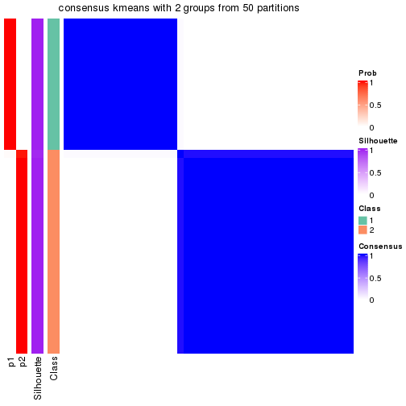</p>

</div>
<div id='tab-node-012-consensus-heatmap-2'>
<pre><code class="r">consensus_heatmap(res, k = 3)
</code></pre>

<p></p>

</div>
<div id='tab-node-012-consensus-heatmap-3'>
<pre><code class="r">consensus_heatmap(res, k = 4)
</code></pre>

<p></p>

</div>
<div id='tab-node-012-consensus-heatmap-4'>
<pre><code class="r">consensus_heatmap(res, k = 5)
</code></pre>

<p></p>

</div>
<div id='tab-node-012-consensus-heatmap-5'>
<pre><code class="r">consensus_heatmap(res, k = 6)
</code></pre>

<p></p>

</div>
<div id='tab-node-012-consensus-heatmap-6'>
<pre><code class="r">consensus_heatmap(res, k = 7)
</code></pre>

<p></p>

</div>
<div id='tab-node-012-consensus-heatmap-7'>
<pre><code class="r">consensus_heatmap(res, k = 8)
</code></pre>

<p></p>

</div>
</div>

Heatmaps for the membership of samples in all partitions to see how consistent they are:


<script>
$( function() {
	$( '#tabs-node-012-membership-heatmap' ).tabs();
} );
</script>
<div id='tabs-node-012-membership-heatmap'>
<ul>
<li><a href='#tab-node-012-membership-heatmap-1'>k = 2</a></li>
<li><a href='#tab-node-012-membership-heatmap-2'>k = 3</a></li>
<li><a href='#tab-node-012-membership-heatmap-3'>k = 4</a></li>
<li><a href='#tab-node-012-membership-heatmap-4'>k = 5</a></li>
<li><a href='#tab-node-012-membership-heatmap-5'>k = 6</a></li>
<li><a href='#tab-node-012-membership-heatmap-6'>k = 7</a></li>
<li><a href='#tab-node-012-membership-heatmap-7'>k = 8</a></li>
</ul>
<div id='tab-node-012-membership-heatmap-1'>
<pre><code class="r">membership_heatmap(res, k = 2)
</code></pre>

<p></p>

</div>
<div id='tab-node-012-membership-heatmap-2'>
<pre><code class="r">membership_heatmap(res, k = 3)
</code></pre>

<p></p>

</div>
<div id='tab-node-012-membership-heatmap-3'>
<pre><code class="r">membership_heatmap(res, k = 4)
</code></pre>

<p>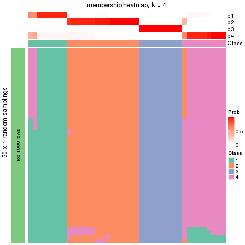</p>

</div>
<div id='tab-node-012-membership-heatmap-4'>
<pre><code class="r">membership_heatmap(res, k = 5)
</code></pre>

<p></p>

</div>
<div id='tab-node-012-membership-heatmap-5'>
<pre><code class="r">membership_heatmap(res, k = 6)
</code></pre>

<p></p>

</div>
<div id='tab-node-012-membership-heatmap-6'>
<pre><code class="r">membership_heatmap(res, k = 7)
</code></pre>

<p></p>

</div>
<div id='tab-node-012-membership-heatmap-7'>
<pre><code class="r">membership_heatmap(res, k = 8)
</code></pre>

<p></p>

</div>
</div>

As soon as the classes for columns are determined, the signatures
that are significantly different between subgroups can be looked for. 
Following are the heatmaps for signatures.


<script>
$( function() {
	$( '#tabs-node-012-get-signatures' ).tabs();
} );
</script>
<div id='tabs-node-012-get-signatures'>
<ul>
<li><a href='#tab-node-012-get-signatures-1'>k = 2</a></li>
<li><a href='#tab-node-012-get-signatures-2'>k = 3</a></li>
<li><a href='#tab-node-012-get-signatures-3'>k = 4</a></li>
<li><a href='#tab-node-012-get-signatures-4'>k = 5</a></li>
<li><a href='#tab-node-012-get-signatures-5'>k = 6</a></li>
<li><a href='#tab-node-012-get-signatures-6'>k = 7</a></li>
<li><a href='#tab-node-012-get-signatures-7'>k = 8</a></li>
</ul>
<div id='tab-node-012-get-signatures-1'>
<pre><code class="r">get_signatures(res, k = 2)
</code></pre>

<p>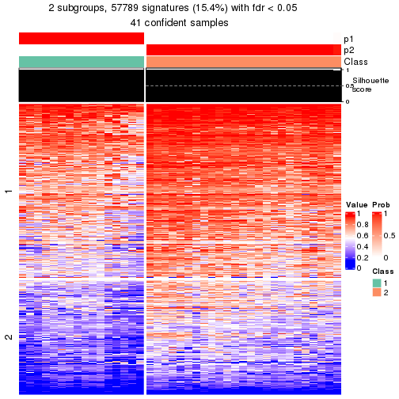</p>

</div>
<div id='tab-node-012-get-signatures-2'>
<pre><code class="r">get_signatures(res, k = 3)
</code></pre>

<p>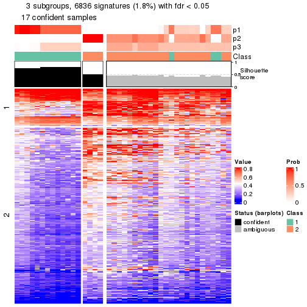</p>

</div>
<div id='tab-node-012-get-signatures-3'>
<pre><code class="r">get_signatures(res, k = 4)
</code></pre>

<p></p>

</div>
<div id='tab-node-012-get-signatures-4'>
<pre><code class="r">get_signatures(res, k = 5)
</code></pre>

<p></p>

</div>
<div id='tab-node-012-get-signatures-5'>
<pre><code class="r">get_signatures(res, k = 6)
</code></pre>

<p></p>

</div>
<div id='tab-node-012-get-signatures-6'>
<pre><code class="r">get_signatures(res, k = 7)
</code></pre>

<p></p>

</div>
<div id='tab-node-012-get-signatures-7'>
<pre><code class="r">get_signatures(res, k = 8)
</code></pre>

<p></p>

</div>
</div>


Compare the overlap of signatures from different k:

```r
compare_signatures(res)
```


`get_signature()` returns a data frame invisibly. To get the list of signatures, the function
call should be assigned to a variable explicitly. In following code, if `plot` argument is set
to `FALSE`, no heatmap is plotted while only the differential analysis is performed.

```r
# code only for demonstration
tb = get_signature(res, k = ..., plot = FALSE)
```

An example of the output of `tb` is:

```
#>   which_row         fdr    mean_1    mean_2 scaled_mean_1 scaled_mean_2 km
#> 1        38 0.042760348  8.373488  9.131774    -0.5533452     0.5164555  1
#> 2        40 0.018707592  7.106213  8.469186    -0.6173731     0.5762149  1
#> 3        55 0.019134737 10.221463 11.207825    -0.6159697     0.5749050  1
#> 4        59 0.006059896  5.921854  7.869574    -0.6899429     0.6439467  1
#> 5        60 0.018055526  8.928898 10.211722    -0.6204761     0.5791110  1
#> 6        98 0.009384629 15.714769 14.887706     0.6635654    -0.6193277  2
...
```

The columns in `tb` are:

1. `which_row`: row indices corresponding to the input matrix.
2. `fdr`: FDR for the differential test. 
3. `mean_x`: The mean value in group x.
4. `scaled_mean_x`: The mean value in group x after rows are scaled.
5. `km`: Row groups if k-means clustering is applied to rows (which is done by automatically selecting number of clusters).

If there are too many signatures, `top_signatures = ...` can be set to only show the 
signatures with the highest FDRs:

```r
# code only for demonstration
# e.g. to show the top 500 most significant rows
tb = get_signature(res, k = ..., top_signatures = 500)
```

If the signatures are defined as these which are uniquely high in current group, `diff_method` argument
can be set to `"uniquely_high_in_one_group"`:

```r
# code only for demonstration
tb = get_signature(res, k = ..., diff_method = "uniquely_high_in_one_group")
```


UMAP plot which shows how samples are separated.


<script>
$( function() {
	$( '#tabs-node-012-dimension-reduction' ).tabs();
} );
</script>
<div id='tabs-node-012-dimension-reduction'>
<ul>
<li><a href='#tab-node-012-dimension-reduction-1'>k = 2</a></li>
<li><a href='#tab-node-012-dimension-reduction-2'>k = 3</a></li>
<li><a href='#tab-node-012-dimension-reduction-3'>k = 4</a></li>
<li><a href='#tab-node-012-dimension-reduction-4'>k = 5</a></li>
<li><a href='#tab-node-012-dimension-reduction-5'>k = 6</a></li>
<li><a href='#tab-node-012-dimension-reduction-6'>k = 7</a></li>
<li><a href='#tab-node-012-dimension-reduction-7'>k = 8</a></li>
</ul>
<div id='tab-node-012-dimension-reduction-1'>
<pre><code class="r">dimension_reduction(res, k = 2, method = &quot;UMAP&quot;)
</code></pre>

<p></p>

</div>
<div id='tab-node-012-dimension-reduction-2'>
<pre><code class="r">dimension_reduction(res, k = 3, method = &quot;UMAP&quot;)
</code></pre>

<p></p>

</div>
<div id='tab-node-012-dimension-reduction-3'>
<pre><code class="r">dimension_reduction(res, k = 4, method = &quot;UMAP&quot;)
</code></pre>

<p></p>

</div>
<div id='tab-node-012-dimension-reduction-4'>
<pre><code class="r">dimension_reduction(res, k = 5, method = &quot;UMAP&quot;)
</code></pre>

<p></p>

</div>
<div id='tab-node-012-dimension-reduction-5'>
<pre><code class="r">dimension_reduction(res, k = 6, method = &quot;UMAP&quot;)
</code></pre>

<p></p>

</div>
<div id='tab-node-012-dimension-reduction-6'>
<pre><code class="r">dimension_reduction(res, k = 7, method = &quot;UMAP&quot;)
</code></pre>

<p></p>

</div>
<div id='tab-node-012-dimension-reduction-7'>
<pre><code class="r">dimension_reduction(res, k = 8, method = &quot;UMAP&quot;)
</code></pre>

<p></p>

</div>
</div>


Following heatmap shows how subgroups are split when increasing `k`:

```r
collect_classes(res)
```

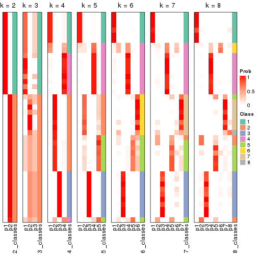


If matrix rows can be associated to genes, consider to use `functional_enrichment(res,
...)` to perform function enrichment for the signature genes. See [this vignette](https://jokergoo.github.io/cola_vignettes/functional_enrichment.html) for more detailed explanations.


 

---------------------------------------------------


### Node0121


Parent node: [Node012](#Node012).
Child nodes: 
                [Node01111](#Node01111)
        ,
                Node01112-leaf
        ,
                Node01113-leaf
        ,
                Node01114-leaf
        ,
                Node01121-leaf
        ,
                Node01122-leaf
        ,
                Node01123-leaf
        ,
                Node01124-leaf
        ,
                Node01211-leaf
        ,
                Node01212-leaf
        ,
                Node01213-leaf
        ,
                Node01221-leaf
        ,
                Node01222-leaf
        ,
                Node01223-leaf
        ,
                Node01224-leaf
        ,
                Node02121-leaf
        ,
                Node02122-leaf
        ,
                Node02123-leaf
        ,
                Node04221-leaf
        ,
                Node04222-leaf
        ,
                Node04223-leaf
        .


The object with results only for a single top-value method and a single partitioning method 
can be extracted as:

```r
res = res_rh["0121"]
```

A summary of `res` and all the functions that can be applied to it:

```r
res
```

```
#> A 'ConsensusPartition' object with k = 2, 3, 4, 5, 6, 7, 8.
#>   On a matrix with 30000 rows and 16 columns.
#>   Top rows (1000) are extracted by 'ATC' method.
#>   Subgroups are detected by 'skmeans' method.
#>   Performed in total 350 partitions by row resampling.
#>   Best k for subgroups seems to be 5.
#> 
#> Following methods can be applied to this 'ConsensusPartition' object:
#>  [1] "cola_report"             "collect_classes"         "collect_plots"          
#>  [4] "collect_stats"           "colnames"                "compare_partitions"     
#>  [7] "compare_signatures"      "consensus_heatmap"       "dimension_reduction"    
#> [10] "functional_enrichment"   "get_anno_col"            "get_anno"               
#> [13] "get_classes"             "get_consensus"           "get_matrix"             
#> [16] "get_membership"          "get_param"               "get_signatures"         
#> [19] "get_stats"               "is_best_k"               "is_stable_k"            
#> [22] "membership_heatmap"      "ncol"                    "nrow"                   
#> [25] "plot_ecdf"               "predict_classes"         "rownames"               
#> [28] "select_partition_number" "show"                    "suggest_best_k"         
#> [31] "test_to_known_factors"   "top_rows_heatmap"
```

`collect_plots()` function collects all the plots made from `res` for all `k` (number of subgroups)
into one single page to provide an easy and fast comparison between different `k`.

```r
collect_plots(res)
```


The plots are:

- The first row: a plot of the eCDF (empirical cumulative distribution
  function) curves of the consensus matrix for each `k` and the heatmap of
  predicted classes for each `k`.
- The second row: heatmaps of the consensus matrix for each `k`.
- The third row: heatmaps of the membership matrix for each `k`.
- The fouth row: heatmaps of the signatures for each `k`.

All the plots in panels can be made by individual functions and they are
plotted later in this section.

`select_partition_number()` produces several plots showing different
statistics for choosing "optimized" `k`. There are following statistics:

- eCDF curves of the consensus matrix for each `k`;
- 1-PAC. [The PAC score](https://en.wikipedia.org/wiki/Consensus_clustering#Over-interpretation_potential_of_consensus_clustering)
  measures the proportion of the ambiguous subgrouping.
- Mean silhouette score.
- Concordance. The mean probability of fiting the consensus subgroup labels in all
  partitions.
- Area increased. Denote $A_k$ as the area under the eCDF curve for current
  `k`, the area increased is defined as $A_k - A_{k-1}$.
- Rand index. The percent of pairs of samples that are both in a same cluster
  or both are not in a same cluster in the partition of k and k-1.
- Jaccard index. The ratio of pairs of samples are both in a same cluster in
  the partition of k and k-1 and the pairs of samples are both in a same
  cluster in the partition k or k-1.

The detailed explanations of these statistics can be found in [the _cola_
vignette](https://jokergoo.github.io/cola_vignettes/cola.html#toc_13).

Generally speaking, higher 1-PAC score, higher mean silhouette score or higher
concordance corresponds to better partition. Rand index and Jaccard index
measure how similar the current partition is compared to partition with `k-1`.
If they are too similar, we won't accept `k` is better than `k-1`.

```r
select_partition_number(res)
```


The numeric values for all these statistics can be obtained by `get_stats()`.

```r
get_stats(res)
```

```
#>   k 1-PAC mean_silhouette concordance area_increased  Rand Jaccard
#> 2 2 1.000           1.000       1.000         0.5005 0.500   0.500
#> 3 3 0.892           0.953       0.981         0.1580 0.933   0.867
#> 4 4 0.908           0.978       0.988         0.2130 0.867   0.692
#> 5 5 0.917           0.913       0.985         0.0870 0.942   0.806
#> 6 6 0.892           0.822       0.963         0.0656 0.950   0.793
#> 7 7 0.900           0.668       0.911         0.0325 0.992   0.957
#> 8 8 0.875           0.514       0.899         0.0357 0.958   0.773
```

`suggest_best_k()` suggests the best $k$ based on these statistics. The rules are as follows:

- All $k$ with Jaccard index larger than 0.95 are removed because increasing
  $k$ does not provide enough extra information. If all $k$ are removed, it is
  marked as no subgroup is detected.
- For all $k$ with 1-PAC score larger than 0.9, the maximal $k$ is taken as
  the best $k$, and other $k$ are marked as optional $k$.
- If it does not fit the second rule. The $k$ with the maximal vote of the
  highest 1-PAC score, highest mean silhouette, and highest concordance is
  taken as the best $k$.

```r
suggest_best_k(res)
```

```
#> [1] 5
#> attr(,"optional")
#> [1] 2 4
```

There is also optional best $k$ = 2 4 that is worth to check.

Following is the table of the partitions (You need to click the **show/hide
code output** link to see it). The membership matrix (columns with name `p*`)
is inferred by
[`clue::cl_consensus()`](https://www.rdocumentation.org/link/cl_consensus?package=clue)
function with the `SE` method. Basically the value in the membership matrix
represents the probability to belong to a certain group. The finall subgroup
label for an item is determined with the group with highest probability it
belongs to.

In `get_classes()` function, the entropy is calculated from the membership
matrix and the silhouette score is calculated from the consensus matrix.


<script>
$( function() {
	$( '#tabs-node-0121-get-classes' ).tabs();
} );
</script>
<div id='tabs-node-0121-get-classes'>
<ul>
<li><a href='#tab-node-0121-get-classes-1'>k = 2</a></li>
<li><a href='#tab-node-0121-get-classes-2'>k = 3</a></li>
<li><a href='#tab-node-0121-get-classes-3'>k = 4</a></li>
<li><a href='#tab-node-0121-get-classes-4'>k = 5</a></li>
<li><a href='#tab-node-0121-get-classes-5'>k = 6</a></li>
<li><a href='#tab-node-0121-get-classes-6'>k = 7</a></li>
<li><a href='#tab-node-0121-get-classes-7'>k = 8</a></li>
</ul>

<div id='tab-node-0121-get-classes-1'>
<p><a id='tab-node-0121-get-classes-1-a' style='color:#0366d6' href='#'>show/hide code output</a></p>
<pre><code class="r">cbind(get_classes(res, k = 2), get_membership(res, k = 2))
</code></pre>

<pre><code>#&gt;                 class entropy silhouette p1 p2
#&gt; TCGA.A6.2686.01     2       0          1  0  1
#&gt; TCGA.DM.A0XD.01     1       0          1  1  0
#&gt; TCGA.D5.7000.01     1       0          1  1  0
#&gt; TCGA.CK.6751.01     1       0          1  1  0
#&gt; TCGA.DM.A1DA.01     1       0          1  1  0
#&gt; TCGA.AZ.4614.01     1       0          1  1  0
#&gt; TCGA.A6.3809.01     2       0          1  0  1
#&gt; TCGA.G4.6322.01     2       0          1  0  1
#&gt; TCGA.D5.6531.01     1       0          1  1  0
#&gt; TCGA.CM.6675.01     1       0          1  1  0
#&gt; TCGA.CK.6746.01     2       0          1  0  1
#&gt; TCGA.D5.6538.01     1       0          1  1  0
#&gt; TCGA.CK.4952.01     2       0          1  0  1
#&gt; TCGA.CK.5913.01     2       0          1  0  1
#&gt; TCGA.G4.6320.01     1       0          1  1  0
#&gt; TCGA.A6.5659.01     1       0          1  1  0
</code></pre>

<script>
$('#tab-node-0121-get-classes-1-a').parent().next().next().hide();
$('#tab-node-0121-get-classes-1-a').click(function(){
  $('#tab-node-0121-get-classes-1-a').parent().next().next().toggle();
  return(false);
});
</script>
</div>

<div id='tab-node-0121-get-classes-2'>
<p><a id='tab-node-0121-get-classes-2-a' style='color:#0366d6' href='#'>show/hide code output</a></p>
<pre><code class="r">cbind(get_classes(res, k = 3), get_membership(res, k = 3))
</code></pre>

<pre><code>#&gt;                 class entropy silhouette  p1  p2 p3
#&gt; TCGA.A6.2686.01     2   0.000      1.000 0.0 1.0  0
#&gt; TCGA.DM.A0XD.01     1   0.000      0.963 1.0 0.0  0
#&gt; TCGA.D5.7000.01     1   0.000      0.963 1.0 0.0  0
#&gt; TCGA.CK.6751.01     1   0.000      0.963 1.0 0.0  0
#&gt; TCGA.DM.A1DA.01     1   0.000      0.963 1.0 0.0  0
#&gt; TCGA.AZ.4614.01     1   0.556      0.571 0.7 0.3  0
#&gt; TCGA.A6.3809.01     2   0.000      1.000 0.0 1.0  0
#&gt; TCGA.G4.6322.01     3   0.000      1.000 0.0 0.0  1
#&gt; TCGA.D5.6531.01     1   0.000      0.963 1.0 0.0  0
#&gt; TCGA.CM.6675.01     1   0.000      0.963 1.0 0.0  0
#&gt; TCGA.CK.6746.01     2   0.000      1.000 0.0 1.0  0
#&gt; TCGA.D5.6538.01     1   0.000      0.963 1.0 0.0  0
#&gt; TCGA.CK.4952.01     3   0.000      1.000 0.0 0.0  1
#&gt; TCGA.CK.5913.01     2   0.000      1.000 0.0 1.0  0
#&gt; TCGA.G4.6320.01     1   0.000      0.963 1.0 0.0  0
#&gt; TCGA.A6.5659.01     1   0.000      0.963 1.0 0.0  0
</code></pre>

<script>
$('#tab-node-0121-get-classes-2-a').parent().next().next().hide();
$('#tab-node-0121-get-classes-2-a').click(function(){
  $('#tab-node-0121-get-classes-2-a').parent().next().next().toggle();
  return(false);
});
</script>
</div>

<div id='tab-node-0121-get-classes-3'>
<p><a id='tab-node-0121-get-classes-3-a' style='color:#0366d6' href='#'>show/hide code output</a></p>
<pre><code class="r">cbind(get_classes(res, k = 4), get_membership(res, k = 4))
</code></pre>

<pre><code>#&gt;                 class entropy silhouette   p1   p2 p3   p4
#&gt; TCGA.A6.2686.01     2  0.0000      1.000 0.00 1.00  0 0.00
#&gt; TCGA.DM.A0XD.01     1  0.0000      0.975 1.00 0.00  0 0.00
#&gt; TCGA.D5.7000.01     1  0.0000      0.975 1.00 0.00  0 0.00
#&gt; TCGA.CK.6751.01     1  0.0000      0.975 1.00 0.00  0 0.00
#&gt; TCGA.DM.A1DA.01     1  0.0707      0.961 0.98 0.00  0 0.02
#&gt; TCGA.AZ.4614.01     1  0.3335      0.836 0.86 0.12  0 0.02
#&gt; TCGA.A6.3809.01     2  0.0000      1.000 0.00 1.00  0 0.00
#&gt; TCGA.G4.6322.01     3  0.0000      1.000 0.00 0.00  1 0.00
#&gt; TCGA.D5.6531.01     1  0.0000      0.975 1.00 0.00  0 0.00
#&gt; TCGA.CM.6675.01     1  0.0000      0.975 1.00 0.00  0 0.00
#&gt; TCGA.CK.6746.01     2  0.0000      1.000 0.00 1.00  0 0.00
#&gt; TCGA.D5.6538.01     4  0.0707      1.000 0.02 0.00  0 0.98
#&gt; TCGA.CK.4952.01     3  0.0000      1.000 0.00 0.00  1 0.00
#&gt; TCGA.CK.5913.01     2  0.0000      1.000 0.00 1.00  0 0.00
#&gt; TCGA.G4.6320.01     1  0.0000      0.975 1.00 0.00  0 0.00
#&gt; TCGA.A6.5659.01     4  0.0707      1.000 0.02 0.00  0 0.98
</code></pre>

<script>
$('#tab-node-0121-get-classes-3-a').parent().next().next().hide();
$('#tab-node-0121-get-classes-3-a').click(function(){
  $('#tab-node-0121-get-classes-3-a').parent().next().next().toggle();
  return(false);
});
</script>
</div>

<div id='tab-node-0121-get-classes-4'>
<p><a id='tab-node-0121-get-classes-4-a' style='color:#0366d6' href='#'>show/hide code output</a></p>
<pre><code class="r">cbind(get_classes(res, k = 5), get_membership(res, k = 5))
</code></pre>

<pre><code>#&gt;                 class entropy silhouette   p1 p2 p3  p4   p5
#&gt; TCGA.A6.2686.01     2   0.000      1.000 0.00  1  0 0.0 0.00
#&gt; TCGA.DM.A0XD.01     1   0.000      0.964 1.00  0  0 0.0 0.00
#&gt; TCGA.D5.7000.01     1   0.141      0.927 0.94  0  0 0.0 0.06
#&gt; TCGA.CK.6751.01     1   0.000      0.964 1.00  0  0 0.0 0.00
#&gt; TCGA.DM.A1DA.01     1   0.202      0.884 0.90  0  0 0.1 0.00
#&gt; TCGA.AZ.4614.01     5   0.104      0.000 0.04  0  0 0.0 0.96
#&gt; TCGA.A6.3809.01     2   0.000      1.000 0.00  1  0 0.0 0.00
#&gt; TCGA.G4.6322.01     3   0.000      1.000 0.00  0  1 0.0 0.00
#&gt; TCGA.D5.6531.01     1   0.000      0.964 1.00  0  0 0.0 0.00
#&gt; TCGA.CM.6675.01     1   0.104      0.942 0.96  0  0 0.0 0.04
#&gt; TCGA.CK.6746.01     2   0.000      1.000 0.00  1  0 0.0 0.00
#&gt; TCGA.D5.6538.01     4   0.000      1.000 0.00  0  0 1.0 0.00
#&gt; TCGA.CK.4952.01     3   0.000      1.000 0.00  0  1 0.0 0.00
#&gt; TCGA.CK.5913.01     2   0.000      1.000 0.00  1  0 0.0 0.00
#&gt; TCGA.G4.6320.01     1   0.000      0.964 1.00  0  0 0.0 0.00
#&gt; TCGA.A6.5659.01     4   0.000      1.000 0.00  0  0 1.0 0.00
</code></pre>

<script>
$('#tab-node-0121-get-classes-4-a').parent().next().next().hide();
$('#tab-node-0121-get-classes-4-a').click(function(){
  $('#tab-node-0121-get-classes-4-a').parent().next().next().toggle();
  return(false);
});
</script>
</div>

<div id='tab-node-0121-get-classes-5'>
<p><a id='tab-node-0121-get-classes-5-a' style='color:#0366d6' href='#'>show/hide code output</a></p>
<pre><code class="r">cbind(get_classes(res, k = 6), get_membership(res, k = 6))
</code></pre>

<pre><code>#&gt;                 class entropy silhouette   p1 p2   p3   p4   p5   p6
#&gt; TCGA.A6.2686.01     2  0.0000      1.000 0.00  1 0.00 0.00 0.00 0.00
#&gt; TCGA.DM.A0XD.01     1  0.0547      0.914 0.98  0 0.00 0.00 0.00 0.02
#&gt; TCGA.D5.7000.01     1  0.1807      0.884 0.92  0 0.00 0.00 0.02 0.06
#&gt; TCGA.CK.6751.01     1  0.1267      0.894 0.94  0 0.00 0.00 0.00 0.06
#&gt; TCGA.DM.A1DA.01     1  0.3073      0.768 0.84  0 0.00 0.08 0.00 0.08
#&gt; TCGA.AZ.4614.01     5  0.0000      0.000 0.00  0 0.00 0.00 1.00 0.00
#&gt; TCGA.A6.3809.01     2  0.0000      1.000 0.00  1 0.00 0.00 0.00 0.00
#&gt; TCGA.G4.6322.01     3  0.1556      0.933 0.00  0 0.92 0.00 0.00 0.08
#&gt; TCGA.D5.6531.01     1  0.0547      0.914 0.98  0 0.00 0.00 0.00 0.02
#&gt; TCGA.CM.6675.01     6  0.2260      0.000 0.14  0 0.00 0.00 0.00 0.86
#&gt; TCGA.CK.6746.01     2  0.0000      1.000 0.00  1 0.00 0.00 0.00 0.00
#&gt; TCGA.D5.6538.01     4  0.0000      1.000 0.00  0 0.00 1.00 0.00 0.00
#&gt; TCGA.CK.4952.01     3  0.0000      0.933 0.00  0 1.00 0.00 0.00 0.00
#&gt; TCGA.CK.5913.01     2  0.0000      1.000 0.00  1 0.00 0.00 0.00 0.00
#&gt; TCGA.G4.6320.01     1  0.0937      0.906 0.96  0 0.00 0.00 0.00 0.04
#&gt; TCGA.A6.5659.01     4  0.0000      1.000 0.00  0 0.00 1.00 0.00 0.00
</code></pre>

<script>
$('#tab-node-0121-get-classes-5-a').parent().next().next().hide();
$('#tab-node-0121-get-classes-5-a').click(function(){
  $('#tab-node-0121-get-classes-5-a').parent().next().next().toggle();
  return(false);
});
</script>
</div>

<div id='tab-node-0121-get-classes-6'>
<p><a id='tab-node-0121-get-classes-6-a' style='color:#0366d6' href='#'>show/hide code output</a></p>
<pre><code class="r">cbind(get_classes(res, k = 7), get_membership(res, k = 7))
</code></pre>

<pre><code>#&gt;                 class entropy silhouette   p1   p2   p3   p4 p5   p6   p7
#&gt; TCGA.A6.2686.01     2  0.0000      0.982 0.00 1.00 0.00 0.00  0 0.00 0.00
#&gt; TCGA.DM.A0XD.01     1  0.0863      0.836 0.96 0.00 0.00 0.00  0 0.00 0.04
#&gt; TCGA.D5.7000.01     1  0.2945      0.804 0.74 0.00 0.00 0.00  0 0.00 0.26
#&gt; TCGA.CK.6751.01     1  0.2708      0.820 0.78 0.00 0.00 0.00  0 0.00 0.22
#&gt; TCGA.DM.A1DA.01     1  0.4569      0.682 0.64 0.00 0.00 0.06  0 0.02 0.28
#&gt; TCGA.AZ.4614.01     5  0.0000      0.000 0.00 0.00 0.00 0.00  1 0.00 0.00
#&gt; TCGA.A6.3809.01     2  0.0000      0.982 0.00 1.00 0.00 0.00  0 0.00 0.00
#&gt; TCGA.G4.6322.01     3  0.0000      0.000 0.00 0.00 1.00 0.00  0 0.00 0.00
#&gt; TCGA.D5.6531.01     1  0.0504      0.832 0.98 0.00 0.00 0.00  0 0.02 0.00
#&gt; TCGA.CM.6675.01     6  0.0000      0.000 0.00 0.00 0.00 0.00  0 1.00 0.00
#&gt; TCGA.CK.6746.01     2  0.1166      0.944 0.00 0.94 0.00 0.00  0 0.00 0.06
#&gt; TCGA.D5.6538.01     4  0.0000      1.000 0.00 0.00 0.00 1.00  0 0.00 0.00
#&gt; TCGA.CK.4952.01     7  0.3525      0.000 0.00 0.00 0.44 0.00  0 0.00 0.56
#&gt; TCGA.CK.5913.01     2  0.0000      0.982 0.00 1.00 0.00 0.00  0 0.00 0.00
#&gt; TCGA.G4.6320.01     1  0.0504      0.832 0.98 0.00 0.00 0.00  0 0.02 0.00
#&gt; TCGA.A6.5659.01     4  0.0000      1.000 0.00 0.00 0.00 1.00  0 0.00 0.00
</code></pre>

<script>
$('#tab-node-0121-get-classes-6-a').parent().next().next().hide();
$('#tab-node-0121-get-classes-6-a').click(function(){
  $('#tab-node-0121-get-classes-6-a').parent().next().next().toggle();
  return(false);
});
</script>
</div>

<div id='tab-node-0121-get-classes-7'>
<p><a id='tab-node-0121-get-classes-7-a' style='color:#0366d6' href='#'>show/hide code output</a></p>
<pre><code class="r">cbind(get_classes(res, k = 8), get_membership(res, k = 8))
</code></pre>

<pre><code>#&gt;                 class entropy silhouette   p1  p2   p3   p4 p5   p6   p7   p8
#&gt; TCGA.A6.2686.01     2  0.0000      0.938 0.00 1.0 0.00 0.00  0 0.00 0.00 0.00
#&gt; TCGA.DM.A0XD.01     1  0.3193      0.588 0.62 0.0 0.00 0.00  0 0.00 0.00 0.38
#&gt; TCGA.D5.7000.01     1  0.0000      0.461 1.00 0.0 0.00 0.00  0 0.00 0.00 0.00
#&gt; TCGA.CK.6751.01     1  0.0000      0.461 1.00 0.0 0.00 0.00  0 0.00 0.00 0.00
#&gt; TCGA.DM.A1DA.01     8  0.4028      0.000 0.28 0.0 0.00 0.02  0 0.00 0.04 0.66
#&gt; TCGA.AZ.4614.01     5  0.0000      0.000 0.00 0.0 0.00 0.00  1 0.00 0.00 0.00
#&gt; TCGA.A6.3809.01     2  0.0000      0.938 0.00 1.0 0.00 0.00  0 0.00 0.00 0.00
#&gt; TCGA.G4.6322.01     3  0.0000      0.000 0.00 0.0 1.00 0.00  0 0.00 0.00 0.00
#&gt; TCGA.D5.6531.01     1  0.3329      0.531 0.52 0.0 0.00 0.00  0 0.00 0.00 0.48
#&gt; TCGA.CM.6675.01     6  0.0471      0.000 0.00 0.0 0.00 0.00  0 0.98 0.00 0.02
#&gt; TCGA.CK.6746.01     2  0.3178      0.798 0.00 0.8 0.00 0.00  0 0.02 0.04 0.14
#&gt; TCGA.D5.6538.01     4  0.0000      1.000 0.00 0.0 0.00 1.00  0 0.00 0.00 0.00
#&gt; TCGA.CK.4952.01     7  0.1341      0.000 0.00 0.0 0.08 0.00  0 0.00 0.92 0.00
#&gt; TCGA.CK.5913.01     2  0.0000      0.938 0.00 1.0 0.00 0.00  0 0.00 0.00 0.00
#&gt; TCGA.G4.6320.01     1  0.3299      0.569 0.56 0.0 0.00 0.00  0 0.00 0.00 0.44
#&gt; TCGA.A6.5659.01     4  0.0000      1.000 0.00 0.0 0.00 1.00  0 0.00 0.00 0.00
</code></pre>

<script>
$('#tab-node-0121-get-classes-7-a').parent().next().next().hide();
$('#tab-node-0121-get-classes-7-a').click(function(){
  $('#tab-node-0121-get-classes-7-a').parent().next().next().toggle();
  return(false);
});
</script>
</div>
</div>

Heatmaps for the consensus matrix. It visualizes the probability of two
samples to be in a same group.


<script>
$( function() {
	$( '#tabs-node-0121-consensus-heatmap' ).tabs();
} );
</script>
<div id='tabs-node-0121-consensus-heatmap'>
<ul>
<li><a href='#tab-node-0121-consensus-heatmap-1'>k = 2</a></li>
<li><a href='#tab-node-0121-consensus-heatmap-2'>k = 3</a></li>
<li><a href='#tab-node-0121-consensus-heatmap-3'>k = 4</a></li>
<li><a href='#tab-node-0121-consensus-heatmap-4'>k = 5</a></li>
<li><a href='#tab-node-0121-consensus-heatmap-5'>k = 6</a></li>
<li><a href='#tab-node-0121-consensus-heatmap-6'>k = 7</a></li>
<li><a href='#tab-node-0121-consensus-heatmap-7'>k = 8</a></li>
</ul>
<div id='tab-node-0121-consensus-heatmap-1'>
<pre><code class="r">consensus_heatmap(res, k = 2)
</code></pre>

<p></p>

</div>
<div id='tab-node-0121-consensus-heatmap-2'>
<pre><code class="r">consensus_heatmap(res, k = 3)
</code></pre>

<p></p>

</div>
<div id='tab-node-0121-consensus-heatmap-3'>
<pre><code class="r">consensus_heatmap(res, k = 4)
</code></pre>

<p></p>

</div>
<div id='tab-node-0121-consensus-heatmap-4'>
<pre><code class="r">consensus_heatmap(res, k = 5)
</code></pre>

<p></p>

</div>
<div id='tab-node-0121-consensus-heatmap-5'>
<pre><code class="r">consensus_heatmap(res, k = 6)
</code></pre>

<p>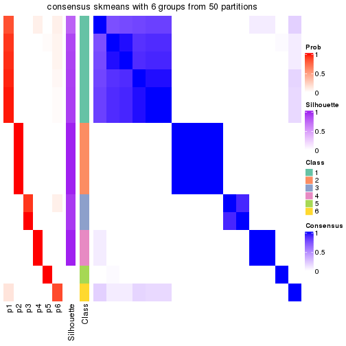</p>

</div>
<div id='tab-node-0121-consensus-heatmap-6'>
<pre><code class="r">consensus_heatmap(res, k = 7)
</code></pre>

<p></p>

</div>
<div id='tab-node-0121-consensus-heatmap-7'>
<pre><code class="r">consensus_heatmap(res, k = 8)
</code></pre>

<p></p>

</div>
</div>

Heatmaps for the membership of samples in all partitions to see how consistent they are:


<script>
$( function() {
	$( '#tabs-node-0121-membership-heatmap' ).tabs();
} );
</script>
<div id='tabs-node-0121-membership-heatmap'>
<ul>
<li><a href='#tab-node-0121-membership-heatmap-1'>k = 2</a></li>
<li><a href='#tab-node-0121-membership-heatmap-2'>k = 3</a></li>
<li><a href='#tab-node-0121-membership-heatmap-3'>k = 4</a></li>
<li><a href='#tab-node-0121-membership-heatmap-4'>k = 5</a></li>
<li><a href='#tab-node-0121-membership-heatmap-5'>k = 6</a></li>
<li><a href='#tab-node-0121-membership-heatmap-6'>k = 7</a></li>
<li><a href='#tab-node-0121-membership-heatmap-7'>k = 8</a></li>
</ul>
<div id='tab-node-0121-membership-heatmap-1'>
<pre><code class="r">membership_heatmap(res, k = 2)
</code></pre>

<p></p>

</div>
<div id='tab-node-0121-membership-heatmap-2'>
<pre><code class="r">membership_heatmap(res, k = 3)
</code></pre>

<p></p>

</div>
<div id='tab-node-0121-membership-heatmap-3'>
<pre><code class="r">membership_heatmap(res, k = 4)
</code></pre>

<p>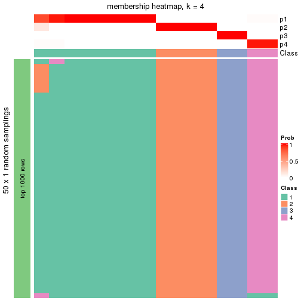</p>

</div>
<div id='tab-node-0121-membership-heatmap-4'>
<pre><code class="r">membership_heatmap(res, k = 5)
</code></pre>

<p></p>

</div>
<div id='tab-node-0121-membership-heatmap-5'>
<pre><code class="r">membership_heatmap(res, k = 6)
</code></pre>

<p></p>

</div>
<div id='tab-node-0121-membership-heatmap-6'>
<pre><code class="r">membership_heatmap(res, k = 7)
</code></pre>

<p></p>

</div>
<div id='tab-node-0121-membership-heatmap-7'>
<pre><code class="r">membership_heatmap(res, k = 8)
</code></pre>

<p></p>

</div>
</div>

As soon as the classes for columns are determined, the signatures
that are significantly different between subgroups can be looked for. 
Following are the heatmaps for signatures.


<script>
$( function() {
	$( '#tabs-node-0121-get-signatures' ).tabs();
} );
</script>
<div id='tabs-node-0121-get-signatures'>
<ul>
<li><a href='#tab-node-0121-get-signatures-1'>k = 2</a></li>
<li><a href='#tab-node-0121-get-signatures-2'>k = 3</a></li>
<li><a href='#tab-node-0121-get-signatures-3'>k = 4</a></li>
<li><a href='#tab-node-0121-get-signatures-4'>k = 5</a></li>
<li><a href='#tab-node-0121-get-signatures-5'>k = 6</a></li>
<li><a href='#tab-node-0121-get-signatures-6'>k = 7</a></li>
<li><a href='#tab-node-0121-get-signatures-7'>k = 8</a></li>
</ul>
<div id='tab-node-0121-get-signatures-1'>
<pre><code class="r">get_signatures(res, k = 2)
</code></pre>

<p></p>

</div>
<div id='tab-node-0121-get-signatures-2'>
<pre><code class="r">get_signatures(res, k = 3)
</code></pre>

<p></p>

</div>
<div id='tab-node-0121-get-signatures-3'>
<pre><code class="r">get_signatures(res, k = 4)
</code></pre>

<p></p>

</div>
<div id='tab-node-0121-get-signatures-4'>
<pre><code class="r">get_signatures(res, k = 5)
</code></pre>

<p></p>

</div>
<div id='tab-node-0121-get-signatures-5'>
<pre><code class="r">get_signatures(res, k = 6)
</code></pre>

<p></p>

</div>
<div id='tab-node-0121-get-signatures-6'>
<pre><code class="r">get_signatures(res, k = 7)
</code></pre>

<p></p>

</div>
<div id='tab-node-0121-get-signatures-7'>
<pre><code class="r">get_signatures(res, k = 8)
</code></pre>

<p></p>

</div>
</div>


Compare the overlap of signatures from different k:

```r
compare_signatures(res)
```


`get_signature()` returns a data frame invisibly. To get the list of signatures, the function
call should be assigned to a variable explicitly. In following code, if `plot` argument is set
to `FALSE`, no heatmap is plotted while only the differential analysis is performed.

```r
# code only for demonstration
tb = get_signature(res, k = ..., plot = FALSE)
```

An example of the output of `tb` is:

```
#>   which_row         fdr    mean_1    mean_2 scaled_mean_1 scaled_mean_2 km
#> 1        38 0.042760348  8.373488  9.131774    -0.5533452     0.5164555  1
#> 2        40 0.018707592  7.106213  8.469186    -0.6173731     0.5762149  1
#> 3        55 0.019134737 10.221463 11.207825    -0.6159697     0.5749050  1
#> 4        59 0.006059896  5.921854  7.869574    -0.6899429     0.6439467  1
#> 5        60 0.018055526  8.928898 10.211722    -0.6204761     0.5791110  1
#> 6        98 0.009384629 15.714769 14.887706     0.6635654    -0.6193277  2
...
```

The columns in `tb` are:

1. `which_row`: row indices corresponding to the input matrix.
2. `fdr`: FDR for the differential test. 
3. `mean_x`: The mean value in group x.
4. `scaled_mean_x`: The mean value in group x after rows are scaled.
5. `km`: Row groups if k-means clustering is applied to rows (which is done by automatically selecting number of clusters).

If there are too many signatures, `top_signatures = ...` can be set to only show the 
signatures with the highest FDRs:

```r
# code only for demonstration
# e.g. to show the top 500 most significant rows
tb = get_signature(res, k = ..., top_signatures = 500)
```

If the signatures are defined as these which are uniquely high in current group, `diff_method` argument
can be set to `"uniquely_high_in_one_group"`:

```r
# code only for demonstration
tb = get_signature(res, k = ..., diff_method = "uniquely_high_in_one_group")
```


UMAP plot which shows how samples are separated.


<script>
$( function() {
	$( '#tabs-node-0121-dimension-reduction' ).tabs();
} );
</script>
<div id='tabs-node-0121-dimension-reduction'>
<ul>
<li><a href='#tab-node-0121-dimension-reduction-1'>k = 2</a></li>
<li><a href='#tab-node-0121-dimension-reduction-2'>k = 3</a></li>
<li><a href='#tab-node-0121-dimension-reduction-3'>k = 4</a></li>
<li><a href='#tab-node-0121-dimension-reduction-4'>k = 5</a></li>
<li><a href='#tab-node-0121-dimension-reduction-5'>k = 6</a></li>
<li><a href='#tab-node-0121-dimension-reduction-6'>k = 7</a></li>
<li><a href='#tab-node-0121-dimension-reduction-7'>k = 8</a></li>
</ul>
<div id='tab-node-0121-dimension-reduction-1'>
<pre><code class="r">dimension_reduction(res, k = 2, method = &quot;UMAP&quot;)
</code></pre>

<p></p>

</div>
<div id='tab-node-0121-dimension-reduction-2'>
<pre><code class="r">dimension_reduction(res, k = 3, method = &quot;UMAP&quot;)
</code></pre>

<p>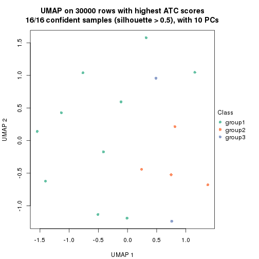</p>

</div>
<div id='tab-node-0121-dimension-reduction-3'>
<pre><code class="r">dimension_reduction(res, k = 4, method = &quot;UMAP&quot;)
</code></pre>

<p></p>

</div>
<div id='tab-node-0121-dimension-reduction-4'>
<pre><code class="r">dimension_reduction(res, k = 5, method = &quot;UMAP&quot;)
</code></pre>

<p></p>

</div>
<div id='tab-node-0121-dimension-reduction-5'>
<pre><code class="r">dimension_reduction(res, k = 6, method = &quot;UMAP&quot;)
</code></pre>

<p></p>

</div>
<div id='tab-node-0121-dimension-reduction-6'>
<pre><code class="r">dimension_reduction(res, k = 7, method = &quot;UMAP&quot;)
</code></pre>

<p></p>

</div>
<div id='tab-node-0121-dimension-reduction-7'>
<pre><code class="r">dimension_reduction(res, k = 8, method = &quot;UMAP&quot;)
</code></pre>

<p></p>

</div>
</div>


Following heatmap shows how subgroups are split when increasing `k`:

```r
collect_classes(res)
```


If matrix rows can be associated to genes, consider to use `functional_enrichment(res,
...)` to perform function enrichment for the signature genes. See [this vignette](https://jokergoo.github.io/cola_vignettes/functional_enrichment.html) for more detailed explanations.


 

---------------------------------------------------


### Node0122


Parent node: [Node012](#Node012).
Child nodes: 
                [Node01111](#Node01111)
        ,
                Node01112-leaf
        ,
                Node01113-leaf
        ,
                Node01114-leaf
        ,
                Node01121-leaf
        ,
                Node01122-leaf
        ,
                Node01123-leaf
        ,
                Node01124-leaf
        ,
                Node01211-leaf
        ,
                Node01212-leaf
        ,
                Node01213-leaf
        ,
                Node01221-leaf
        ,
                Node01222-leaf
        ,
                Node01223-leaf
        ,
                Node01224-leaf
        ,
                Node02121-leaf
        ,
                Node02122-leaf
        ,
                Node02123-leaf
        ,
                Node04221-leaf
        ,
                Node04222-leaf
        ,
                Node04223-leaf
        .


The object with results only for a single top-value method and a single partitioning method 
can be extracted as:

```r
res = res_rh["0122"]
```

A summary of `res` and all the functions that can be applied to it:

```r
res
```

```
#> A 'ConsensusPartition' object with k = 2, 3, 4, 5, 6, 7, 8.
#>   On a matrix with 30000 rows and 25 columns.
#>   Top rows (1000) are extracted by 'ATC' method.
#>   Subgroups are detected by 'skmeans' method.
#>   Performed in total 350 partitions by row resampling.
#>   Best k for subgroups seems to be 3.
#> 
#> Following methods can be applied to this 'ConsensusPartition' object:
#>  [1] "cola_report"             "collect_classes"         "collect_plots"          
#>  [4] "collect_stats"           "colnames"                "compare_partitions"     
#>  [7] "compare_signatures"      "consensus_heatmap"       "dimension_reduction"    
#> [10] "functional_enrichment"   "get_anno_col"            "get_anno"               
#> [13] "get_classes"             "get_consensus"           "get_matrix"             
#> [16] "get_membership"          "get_param"               "get_signatures"         
#> [19] "get_stats"               "is_best_k"               "is_stable_k"            
#> [22] "membership_heatmap"      "ncol"                    "nrow"                   
#> [25] "plot_ecdf"               "predict_classes"         "rownames"               
#> [28] "select_partition_number" "show"                    "suggest_best_k"         
#> [31] "test_to_known_factors"   "top_rows_heatmap"
```

`collect_plots()` function collects all the plots made from `res` for all `k` (number of subgroups)
into one single page to provide an easy and fast comparison between different `k`.

```r
collect_plots(res)
```


The plots are:

- The first row: a plot of the eCDF (empirical cumulative distribution
  function) curves of the consensus matrix for each `k` and the heatmap of
  predicted classes for each `k`.
- The second row: heatmaps of the consensus matrix for each `k`.
- The third row: heatmaps of the membership matrix for each `k`.
- The fouth row: heatmaps of the signatures for each `k`.

All the plots in panels can be made by individual functions and they are
plotted later in this section.

`select_partition_number()` produces several plots showing different
statistics for choosing "optimized" `k`. There are following statistics:

- eCDF curves of the consensus matrix for each `k`;
- 1-PAC. [The PAC score](https://en.wikipedia.org/wiki/Consensus_clustering#Over-interpretation_potential_of_consensus_clustering)
  measures the proportion of the ambiguous subgrouping.
- Mean silhouette score.
- Concordance. The mean probability of fiting the consensus subgroup labels in all
  partitions.
- Area increased. Denote $A_k$ as the area under the eCDF curve for current
  `k`, the area increased is defined as $A_k - A_{k-1}$.
- Rand index. The percent of pairs of samples that are both in a same cluster
  or both are not in a same cluster in the partition of k and k-1.
- Jaccard index. The ratio of pairs of samples are both in a same cluster in
  the partition of k and k-1 and the pairs of samples are both in a same
  cluster in the partition k or k-1.

The detailed explanations of these statistics can be found in [the _cola_
vignette](https://jokergoo.github.io/cola_vignettes/cola.html#toc_13).

Generally speaking, higher 1-PAC score, higher mean silhouette score or higher
concordance corresponds to better partition. Rand index and Jaccard index
measure how similar the current partition is compared to partition with `k-1`.
If they are too similar, we won't accept `k` is better than `k-1`.

```r
select_partition_number(res)
```


The numeric values for all these statistics can be obtained by `get_stats()`.

```r
get_stats(res)
```

```
#>   k 1-PAC mean_silhouette concordance area_increased  Rand Jaccard
#> 2 2 1.000           1.000       1.000        0.52048 0.480   0.480
#> 3 3 1.000           0.978       0.989        0.24604 0.840   0.676
#> 4 4 1.000           0.997       0.998        0.03893 0.980   0.942
#> 5 5 0.957           0.891       0.982        0.00993 0.997   0.990
#> 6 6 0.933           0.812       0.930        0.02990 1.000   1.000
#> 7 7 0.797           0.655       0.894        0.04438 0.970   0.907
#> 8 8 0.807           0.628       0.880        0.04002 0.973   0.910
```

`suggest_best_k()` suggests the best $k$ based on these statistics. The rules are as follows:

- All $k$ with Jaccard index larger than 0.95 are removed because increasing
  $k$ does not provide enough extra information. If all $k$ are removed, it is
  marked as no subgroup is detected.
- For all $k$ with 1-PAC score larger than 0.9, the maximal $k$ is taken as
  the best $k$, and other $k$ are marked as optional $k$.
- If it does not fit the second rule. The $k$ with the maximal vote of the
  highest 1-PAC score, highest mean silhouette, and highest concordance is
  taken as the best $k$.

```r
suggest_best_k(res)
```

```
#> [1] 3
#> attr(,"optional")
#> [1] 2
```

There is also optional best $k$ = 2 that is worth to check.

Following is the table of the partitions (You need to click the **show/hide
code output** link to see it). The membership matrix (columns with name `p*`)
is inferred by
[`clue::cl_consensus()`](https://www.rdocumentation.org/link/cl_consensus?package=clue)
function with the `SE` method. Basically the value in the membership matrix
represents the probability to belong to a certain group. The finall subgroup
label for an item is determined with the group with highest probability it
belongs to.

In `get_classes()` function, the entropy is calculated from the membership
matrix and the silhouette score is calculated from the consensus matrix.


<script>
$( function() {
	$( '#tabs-node-0122-get-classes' ).tabs();
} );
</script>
<div id='tabs-node-0122-get-classes'>
<ul>
<li><a href='#tab-node-0122-get-classes-1'>k = 2</a></li>
<li><a href='#tab-node-0122-get-classes-2'>k = 3</a></li>
<li><a href='#tab-node-0122-get-classes-3'>k = 4</a></li>
<li><a href='#tab-node-0122-get-classes-4'>k = 5</a></li>
<li><a href='#tab-node-0122-get-classes-5'>k = 6</a></li>
<li><a href='#tab-node-0122-get-classes-6'>k = 7</a></li>
<li><a href='#tab-node-0122-get-classes-7'>k = 8</a></li>
</ul>

<div id='tab-node-0122-get-classes-1'>
<p><a id='tab-node-0122-get-classes-1-a' style='color:#0366d6' href='#'>show/hide code output</a></p>
<pre><code class="r">cbind(get_classes(res, k = 2), get_membership(res, k = 2))
</code></pre>

<pre><code>#&gt;                 class entropy silhouette p1 p2
#&gt; TCGA.D5.6540.01     2       0          1  0  1
#&gt; TCGA.G4.6588.01     1       0          1  1  0
#&gt; TCGA.AZ.6606.01     2       0          1  0  1
#&gt; TCGA.F4.6570.01     1       0          1  1  0
#&gt; TCGA.G4.6299.01     2       0          1  0  1
#&gt; TCGA.A6.4105.01     2       0          1  0  1
#&gt; TCGA.DT.5265.01     2       0          1  0  1
#&gt; TCGA.CM.6171.01     1       0          1  1  0
#&gt; TCGA.AD.A5EJ.01     1       0          1  1  0
#&gt; TCGA.CK.5916.01     1       0          1  1  0
#&gt; TCGA.CM.5861.01     1       0          1  1  0
#&gt; TCGA.G4.6586.01     1       0          1  1  0
#&gt; TCGA.AZ.6598.01     2       0          1  0  1
#&gt; TCGA.F4.6461.01     1       0          1  1  0
#&gt; TCGA.AD.6889.01     2       0          1  0  1
#&gt; TCGA.AA.3663.01     2       0          1  0  1
#&gt; TCGA.CA.5254.01     2       0          1  0  1
#&gt; TCGA.A6.4107.01     1       0          1  1  0
#&gt; TCGA.A6.5665.01     1       0          1  1  0
#&gt; TCGA.QG.A5Z2.01     2       0          1  0  1
#&gt; TCGA.A6.6653.01     2       0          1  0  1
#&gt; TCGA.A6.5661.01     1       0          1  1  0
#&gt; TCGA.A6.2672.01     1       0          1  1  0
#&gt; TCGA.AA.3492.01     1       0          1  1  0
#&gt; TCGA.DM.A1HB.01     2       0          1  0  1
</code></pre>

<script>
$('#tab-node-0122-get-classes-1-a').parent().next().next().hide();
$('#tab-node-0122-get-classes-1-a').click(function(){
  $('#tab-node-0122-get-classes-1-a').parent().next().next().toggle();
  return(false);
});
</script>
</div>

<div id='tab-node-0122-get-classes-2'>
<p><a id='tab-node-0122-get-classes-2-a' style='color:#0366d6' href='#'>show/hide code output</a></p>
<pre><code class="r">cbind(get_classes(res, k = 3), get_membership(res, k = 3))
</code></pre>

<pre><code>#&gt;                 class entropy silhouette  p1   p2   p3
#&gt; TCGA.D5.6540.01     2  0.0000      1.000 0.0 1.00 0.00
#&gt; TCGA.G4.6588.01     1  0.0000      1.000 1.0 0.00 0.00
#&gt; TCGA.AZ.6606.01     3  0.0892      0.922 0.0 0.02 0.98
#&gt; TCGA.F4.6570.01     1  0.0000      1.000 1.0 0.00 0.00
#&gt; TCGA.G4.6299.01     2  0.0000      1.000 0.0 1.00 0.00
#&gt; TCGA.A6.4105.01     3  0.0000      0.925 0.0 0.00 1.00
#&gt; TCGA.DT.5265.01     3  0.4002      0.807 0.0 0.16 0.84
#&gt; TCGA.CM.6171.01     1  0.0000      1.000 1.0 0.00 0.00
#&gt; TCGA.AD.A5EJ.01     1  0.0000      1.000 1.0 0.00 0.00
#&gt; TCGA.CK.5916.01     1  0.0000      1.000 1.0 0.00 0.00
#&gt; TCGA.CM.5861.01     1  0.0000      1.000 1.0 0.00 0.00
#&gt; TCGA.G4.6586.01     1  0.0000      1.000 1.0 0.00 0.00
#&gt; TCGA.AZ.6598.01     2  0.0000      1.000 0.0 1.00 0.00
#&gt; TCGA.F4.6461.01     1  0.0000      1.000 1.0 0.00 0.00
#&gt; TCGA.AD.6889.01     2  0.0000      1.000 0.0 1.00 0.00
#&gt; TCGA.AA.3663.01     2  0.0000      1.000 0.0 1.00 0.00
#&gt; TCGA.CA.5254.01     3  0.0000      0.925 0.0 0.00 1.00
#&gt; TCGA.A6.4107.01     3  0.2959      0.860 0.1 0.00 0.90
#&gt; TCGA.A6.5665.01     1  0.0000      1.000 1.0 0.00 0.00
#&gt; TCGA.QG.A5Z2.01     2  0.0000      1.000 0.0 1.00 0.00
#&gt; TCGA.A6.6653.01     2  0.0000      1.000 0.0 1.00 0.00
#&gt; TCGA.A6.5661.01     1  0.0000      1.000 1.0 0.00 0.00
#&gt; TCGA.A6.2672.01     1  0.0000      1.000 1.0 0.00 0.00
#&gt; TCGA.AA.3492.01     1  0.0000      1.000 1.0 0.00 0.00
#&gt; TCGA.DM.A1HB.01     2  0.0000      1.000 0.0 1.00 0.00
</code></pre>

<script>
$('#tab-node-0122-get-classes-2-a').parent().next().next().hide();
$('#tab-node-0122-get-classes-2-a').click(function(){
  $('#tab-node-0122-get-classes-2-a').parent().next().next().toggle();
  return(false);
});
</script>
</div>

<div id='tab-node-0122-get-classes-3'>
<p><a id='tab-node-0122-get-classes-3-a' style='color:#0366d6' href='#'>show/hide code output</a></p>
<pre><code class="r">cbind(get_classes(res, k = 4), get_membership(res, k = 4))
</code></pre>

<pre><code>#&gt;                 class entropy silhouette p1   p2   p3   p4
#&gt; TCGA.D5.6540.01     2  0.0000      0.997  0 1.00 0.00 0.00
#&gt; TCGA.G4.6588.01     1  0.0000      1.000  1 0.00 0.00 0.00
#&gt; TCGA.AZ.6606.01     3  0.0000      1.000  0 0.00 1.00 0.00
#&gt; TCGA.F4.6570.01     1  0.0000      1.000  1 0.00 0.00 0.00
#&gt; TCGA.G4.6299.01     2  0.0707      0.979  0 0.98 0.02 0.00
#&gt; TCGA.A6.4105.01     3  0.0000      1.000  0 0.00 1.00 0.00
#&gt; TCGA.DT.5265.01     3  0.0000      1.000  0 0.00 1.00 0.00
#&gt; TCGA.CM.6171.01     1  0.0000      1.000  1 0.00 0.00 0.00
#&gt; TCGA.AD.A5EJ.01     1  0.0000      1.000  1 0.00 0.00 0.00
#&gt; TCGA.CK.5916.01     1  0.0000      1.000  1 0.00 0.00 0.00
#&gt; TCGA.CM.5861.01     1  0.0000      1.000  1 0.00 0.00 0.00
#&gt; TCGA.G4.6586.01     1  0.0000      1.000  1 0.00 0.00 0.00
#&gt; TCGA.AZ.6598.01     2  0.0000      0.997  0 1.00 0.00 0.00
#&gt; TCGA.F4.6461.01     1  0.0000      1.000  1 0.00 0.00 0.00
#&gt; TCGA.AD.6889.01     2  0.0000      0.997  0 1.00 0.00 0.00
#&gt; TCGA.AA.3663.01     2  0.0000      0.997  0 1.00 0.00 0.00
#&gt; TCGA.CA.5254.01     4  0.0000      0.980  0 0.00 0.00 1.00
#&gt; TCGA.A6.4107.01     4  0.0707      0.980  0 0.00 0.02 0.98
#&gt; TCGA.A6.5665.01     1  0.0000      1.000  1 0.00 0.00 0.00
#&gt; TCGA.QG.A5Z2.01     2  0.0000      0.997  0 1.00 0.00 0.00
#&gt; TCGA.A6.6653.01     2  0.0000      0.997  0 1.00 0.00 0.00
#&gt; TCGA.A6.5661.01     1  0.0000      1.000  1 0.00 0.00 0.00
#&gt; TCGA.A6.2672.01     1  0.0000      1.000  1 0.00 0.00 0.00
#&gt; TCGA.AA.3492.01     1  0.0000      1.000  1 0.00 0.00 0.00
#&gt; TCGA.DM.A1HB.01     2  0.0000      0.997  0 1.00 0.00 0.00
</code></pre>

<script>
$('#tab-node-0122-get-classes-3-a').parent().next().next().hide();
$('#tab-node-0122-get-classes-3-a').click(function(){
  $('#tab-node-0122-get-classes-3-a').parent().next().next().toggle();
  return(false);
});
</script>
</div>

<div id='tab-node-0122-get-classes-4'>
<p><a id='tab-node-0122-get-classes-4-a' style='color:#0366d6' href='#'>show/hide code output</a></p>
<pre><code class="r">cbind(get_classes(res, k = 5), get_membership(res, k = 5))
</code></pre>

<pre><code>#&gt;                 class entropy silhouette   p1   p2   p3   p4   p5
#&gt; TCGA.D5.6540.01     2  0.0000      0.971 0.00 1.00 0.00 0.00 0.00
#&gt; TCGA.G4.6588.01     1  0.0000      0.998 1.00 0.00 0.00 0.00 0.00
#&gt; TCGA.AZ.6606.01     3  0.0000      0.934 0.00 0.00 1.00 0.00 0.00
#&gt; TCGA.F4.6570.01     1  0.0000      0.998 1.00 0.00 0.00 0.00 0.00
#&gt; TCGA.G4.6299.01     2  0.3627      0.815 0.00 0.84 0.10 0.02 0.04
#&gt; TCGA.A6.4105.01     3  0.0609      0.928 0.00 0.00 0.98 0.00 0.02
#&gt; TCGA.DT.5265.01     3  0.2438      0.881 0.00 0.04 0.90 0.00 0.06
#&gt; TCGA.CM.6171.01     1  0.0000      0.998 1.00 0.00 0.00 0.00 0.00
#&gt; TCGA.AD.A5EJ.01     1  0.0000      0.998 1.00 0.00 0.00 0.00 0.00
#&gt; TCGA.CK.5916.01     1  0.0000      0.998 1.00 0.00 0.00 0.00 0.00
#&gt; TCGA.CM.5861.01     1  0.0000      0.998 1.00 0.00 0.00 0.00 0.00
#&gt; TCGA.G4.6586.01     1  0.0000      0.998 1.00 0.00 0.00 0.00 0.00
#&gt; TCGA.AZ.6598.01     2  0.0000      0.971 0.00 1.00 0.00 0.00 0.00
#&gt; TCGA.F4.6461.01     1  0.0609      0.980 0.98 0.00 0.00 0.00 0.02
#&gt; TCGA.AD.6889.01     2  0.0000      0.971 0.00 1.00 0.00 0.00 0.00
#&gt; TCGA.AA.3663.01     2  0.1043      0.944 0.00 0.96 0.00 0.00 0.04
#&gt; TCGA.CA.5254.01     4  0.0000      0.000 0.00 0.00 0.00 1.00 0.00
#&gt; TCGA.A6.4107.01     5  0.2280      0.000 0.00 0.00 0.00 0.12 0.88
#&gt; TCGA.A6.5665.01     1  0.0000      0.998 1.00 0.00 0.00 0.00 0.00
#&gt; TCGA.QG.A5Z2.01     2  0.0000      0.971 0.00 1.00 0.00 0.00 0.00
#&gt; TCGA.A6.6653.01     2  0.0000      0.971 0.00 1.00 0.00 0.00 0.00
#&gt; TCGA.A6.5661.01     1  0.0000      0.998 1.00 0.00 0.00 0.00 0.00
#&gt; TCGA.A6.2672.01     1  0.0000      0.998 1.00 0.00 0.00 0.00 0.00
#&gt; TCGA.AA.3492.01     1  0.0000      0.998 1.00 0.00 0.00 0.00 0.00
#&gt; TCGA.DM.A1HB.01     2  0.0000      0.971 0.00 1.00 0.00 0.00 0.00
</code></pre>

<script>
$('#tab-node-0122-get-classes-4-a').parent().next().next().hide();
$('#tab-node-0122-get-classes-4-a').click(function(){
  $('#tab-node-0122-get-classes-4-a').parent().next().next().toggle();
  return(false);
});
</script>
</div>

<div id='tab-node-0122-get-classes-5'>
<p><a id='tab-node-0122-get-classes-5-a' style='color:#0366d6' href='#'>show/hide code output</a></p>
<pre><code class="r">cbind(get_classes(res, k = 6), get_membership(res, k = 6))
</code></pre>

<pre><code>#&gt;                 class entropy silhouette   p1   p2   p3   p4   p5   p6
#&gt; TCGA.D5.6540.01     2  0.0000      0.903 0.00 1.00 0.00 0.00 0.00 0.00
#&gt; TCGA.G4.6588.01     1  0.0000      0.980 1.00 0.00 0.00 0.00 0.00 0.00
#&gt; TCGA.AZ.6606.01     3  0.0000      0.730 0.00 0.00 1.00 0.00 0.00 0.00
#&gt; TCGA.F4.6570.01     1  0.0000      0.980 1.00 0.00 0.00 0.00 0.00 0.00
#&gt; TCGA.G4.6299.01     2  0.3982      0.693 0.00 0.74 0.06 0.00 0.00 0.20
#&gt; TCGA.A6.4105.01     3  0.3460      0.658 0.00 0.00 0.76 0.02 0.00 0.22
#&gt; TCGA.DT.5265.01     3  0.3499      0.606 0.00 0.00 0.68 0.00 0.00 0.32
#&gt; TCGA.CM.6171.01     1  0.0000      0.980 1.00 0.00 0.00 0.00 0.00 0.00
#&gt; TCGA.AD.A5EJ.01     1  0.0937      0.971 0.96 0.00 0.00 0.00 0.00 0.04
#&gt; TCGA.CK.5916.01     1  0.0937      0.971 0.96 0.00 0.00 0.00 0.00 0.04
#&gt; TCGA.CM.5861.01     1  0.0000      0.980 1.00 0.00 0.00 0.00 0.00 0.00
#&gt; TCGA.G4.6586.01     1  0.0000      0.980 1.00 0.00 0.00 0.00 0.00 0.00
#&gt; TCGA.AZ.6598.01     2  0.0000      0.903 0.00 1.00 0.00 0.00 0.00 0.00
#&gt; TCGA.F4.6461.01     1  0.1556      0.942 0.92 0.00 0.00 0.00 0.00 0.08
#&gt; TCGA.AD.6889.01     2  0.0000      0.903 0.00 1.00 0.00 0.00 0.00 0.00
#&gt; TCGA.AA.3663.01     2  0.3706      0.524 0.00 0.62 0.00 0.00 0.00 0.38
#&gt; TCGA.CA.5254.01     4  0.0547      0.000 0.00 0.00 0.00 0.98 0.02 0.00
#&gt; TCGA.A6.4107.01     5  0.0000      0.000 0.00 0.00 0.00 0.00 1.00 0.00
#&gt; TCGA.A6.5665.01     1  0.0937      0.971 0.96 0.00 0.00 0.00 0.00 0.04
#&gt; TCGA.QG.A5Z2.01     2  0.0547      0.897 0.00 0.98 0.00 0.00 0.00 0.02
#&gt; TCGA.A6.6653.01     2  0.0000      0.903 0.00 1.00 0.00 0.00 0.00 0.00
#&gt; TCGA.A6.5661.01     1  0.0937      0.971 0.96 0.00 0.00 0.00 0.00 0.04
#&gt; TCGA.A6.2672.01     1  0.0000      0.980 1.00 0.00 0.00 0.00 0.00 0.00
#&gt; TCGA.AA.3492.01     1  0.0000      0.980 1.00 0.00 0.00 0.00 0.00 0.00
#&gt; TCGA.DM.A1HB.01     2  0.0937      0.892 0.00 0.96 0.00 0.00 0.00 0.04
</code></pre>

<script>
$('#tab-node-0122-get-classes-5-a').parent().next().next().hide();
$('#tab-node-0122-get-classes-5-a').click(function(){
  $('#tab-node-0122-get-classes-5-a').parent().next().next().toggle();
  return(false);
});
</script>
</div>

<div id='tab-node-0122-get-classes-6'>
<p><a id='tab-node-0122-get-classes-6-a' style='color:#0366d6' href='#'>show/hide code output</a></p>
<pre><code class="r">cbind(get_classes(res, k = 7), get_membership(res, k = 7))
</code></pre>

<pre><code>#&gt;                 class entropy silhouette   p1   p2   p3   p4   p5   p6   p7
#&gt; TCGA.D5.6540.01     2  0.0000      0.858 0.00 1.00 0.00 0.00 0.00 0.00 0.00
#&gt; TCGA.G4.6588.01     1  0.0000      0.927 1.00 0.00 0.00 0.00 0.00 0.00 0.00
#&gt; TCGA.AZ.6606.01     3  0.3943     -0.174 0.00 0.00 0.56 0.00 0.00 0.42 0.02
#&gt; TCGA.F4.6570.01     1  0.0000      0.927 1.00 0.00 0.00 0.00 0.00 0.00 0.00
#&gt; TCGA.G4.6299.01     2  0.5293      0.200 0.00 0.54 0.00 0.00 0.02 0.32 0.12
#&gt; TCGA.A6.4105.01     3  0.0000      0.328 0.00 0.00 1.00 0.00 0.00 0.00 0.00
#&gt; TCGA.DT.5265.01     6  0.2708      0.000 0.00 0.00 0.22 0.00 0.00 0.78 0.00
#&gt; TCGA.CM.6171.01     1  0.0504      0.927 0.98 0.00 0.00 0.00 0.00 0.00 0.02
#&gt; TCGA.AD.A5EJ.01     1  0.2278      0.909 0.88 0.00 0.00 0.00 0.00 0.04 0.08
#&gt; TCGA.CK.5916.01     1  0.2278      0.909 0.88 0.00 0.00 0.00 0.00 0.04 0.08
#&gt; TCGA.CM.5861.01     1  0.1166      0.898 0.94 0.00 0.00 0.00 0.00 0.06 0.00
#&gt; TCGA.G4.6586.01     1  0.1166      0.898 0.94 0.00 0.00 0.00 0.00 0.06 0.00
#&gt; TCGA.AZ.6598.01     2  0.0863      0.861 0.00 0.96 0.00 0.00 0.00 0.00 0.04
#&gt; TCGA.F4.6461.01     1  0.3734      0.830 0.78 0.00 0.00 0.00 0.04 0.04 0.14
#&gt; TCGA.AD.6889.01     2  0.0863      0.861 0.00 0.96 0.00 0.00 0.00 0.00 0.04
#&gt; TCGA.AA.3663.01     7  0.2832      0.000 0.00 0.24 0.00 0.00 0.00 0.00 0.76
#&gt; TCGA.CA.5254.01     4  0.0000      0.000 0.00 0.00 0.00 1.00 0.00 0.00 0.00
#&gt; TCGA.A6.4107.01     5  0.0504      0.000 0.00 0.00 0.00 0.02 0.98 0.00 0.00
#&gt; TCGA.A6.5665.01     1  0.2278      0.909 0.88 0.00 0.00 0.00 0.00 0.04 0.08
#&gt; TCGA.QG.A5Z2.01     2  0.0000      0.858 0.00 1.00 0.00 0.00 0.00 0.00 0.00
#&gt; TCGA.A6.6653.01     2  0.0863      0.861 0.00 0.96 0.00 0.00 0.00 0.00 0.04
#&gt; TCGA.A6.5661.01     1  0.2278      0.909 0.88 0.00 0.00 0.00 0.00 0.04 0.08
#&gt; TCGA.A6.2672.01     1  0.0000      0.927 1.00 0.00 0.00 0.00 0.00 0.00 0.00
#&gt; TCGA.AA.3492.01     1  0.0000      0.927 1.00 0.00 0.00 0.00 0.00 0.00 0.00
#&gt; TCGA.DM.A1HB.01     2  0.1166      0.816 0.00 0.94 0.00 0.00 0.00 0.00 0.06
</code></pre>

<script>
$('#tab-node-0122-get-classes-6-a').parent().next().next().hide();
$('#tab-node-0122-get-classes-6-a').click(function(){
  $('#tab-node-0122-get-classes-6-a').parent().next().next().toggle();
  return(false);
});
</script>
</div>

<div id='tab-node-0122-get-classes-7'>
<p><a id='tab-node-0122-get-classes-7-a' style='color:#0366d6' href='#'>show/hide code output</a></p>
<pre><code class="r">cbind(get_classes(res, k = 8), get_membership(res, k = 8))
</code></pre>

<pre><code>#&gt;                 class entropy silhouette   p1   p2   p3 p4 p5   p6   p7   p8
#&gt; TCGA.D5.6540.01     2  0.1887      0.846 0.00 0.90 0.00  0  0 0.00 0.04 0.06
#&gt; TCGA.G4.6588.01     1  0.0000      0.848 1.00 0.00 0.00  0  0 0.00 0.00 0.00
#&gt; TCGA.AZ.6606.01     6  0.4504      0.271 0.00 0.00 0.24  0  0 0.64 0.02 0.10
#&gt; TCGA.F4.6570.01     1  0.0000      0.848 1.00 0.00 0.00  0  0 0.00 0.00 0.00
#&gt; TCGA.G4.6299.01     8  0.3845      0.000 0.00 0.28 0.00  0  0 0.06 0.00 0.66
#&gt; TCGA.A6.4105.01     3  0.4169      0.000 0.00 0.00 0.70  0  0 0.10 0.02 0.18
#&gt; TCGA.DT.5265.01     6  0.1341      0.472 0.00 0.00 0.00  0  0 0.92 0.00 0.08
#&gt; TCGA.CM.6171.01     1  0.0000      0.848 1.00 0.00 0.00  0  0 0.00 0.00 0.00
#&gt; TCGA.AD.A5EJ.01     1  0.2938      0.781 0.70 0.00 0.30  0  0 0.00 0.00 0.00
#&gt; TCGA.CK.5916.01     1  0.2938      0.781 0.70 0.00 0.30  0  0 0.00 0.00 0.00
#&gt; TCGA.CM.5861.01     1  0.0471      0.839 0.98 0.00 0.00  0  0 0.00 0.00 0.02
#&gt; TCGA.G4.6586.01     1  0.0471      0.839 0.98 0.00 0.00  0  0 0.00 0.00 0.02
#&gt; TCGA.AZ.6598.01     2  0.0808      0.883 0.00 0.96 0.00  0  0 0.00 0.04 0.00
#&gt; TCGA.F4.6461.01     1  0.3374      0.765 0.68 0.00 0.30  0  0 0.00 0.02 0.00
#&gt; TCGA.AD.6889.01     2  0.0471      0.894 0.00 0.98 0.00  0  0 0.00 0.02 0.00
#&gt; TCGA.AA.3663.01     7  0.1947      0.000 0.00 0.14 0.00  0  0 0.00 0.86 0.00
#&gt; TCGA.CA.5254.01     4  0.0000      0.000 0.00 0.00 0.00  1  0 0.00 0.00 0.00
#&gt; TCGA.A6.4107.01     5  0.0000      0.000 0.00 0.00 0.00  0  1 0.00 0.00 0.00
#&gt; TCGA.A6.5665.01     1  0.2938      0.781 0.70 0.00 0.30  0  0 0.00 0.00 0.00
#&gt; TCGA.QG.A5Z2.01     2  0.0941      0.881 0.00 0.96 0.00  0  0 0.00 0.02 0.02
#&gt; TCGA.A6.6653.01     2  0.0471      0.894 0.00 0.98 0.00  0  0 0.00 0.02 0.00
#&gt; TCGA.A6.5661.01     1  0.2938      0.781 0.70 0.00 0.30  0  0 0.00 0.00 0.00
#&gt; TCGA.A6.2672.01     1  0.0000      0.848 1.00 0.00 0.00  0  0 0.00 0.00 0.00
#&gt; TCGA.AA.3492.01     1  0.0000      0.848 1.00 0.00 0.00  0  0 0.00 0.00 0.00
#&gt; TCGA.DM.A1HB.01     2  0.3073      0.757 0.00 0.80 0.00  0  0 0.00 0.10 0.10
</code></pre>

<script>
$('#tab-node-0122-get-classes-7-a').parent().next().next().hide();
$('#tab-node-0122-get-classes-7-a').click(function(){
  $('#tab-node-0122-get-classes-7-a').parent().next().next().toggle();
  return(false);
});
</script>
</div>
</div>

Heatmaps for the consensus matrix. It visualizes the probability of two
samples to be in a same group.


<script>
$( function() {
	$( '#tabs-node-0122-consensus-heatmap' ).tabs();
} );
</script>
<div id='tabs-node-0122-consensus-heatmap'>
<ul>
<li><a href='#tab-node-0122-consensus-heatmap-1'>k = 2</a></li>
<li><a href='#tab-node-0122-consensus-heatmap-2'>k = 3</a></li>
<li><a href='#tab-node-0122-consensus-heatmap-3'>k = 4</a></li>
<li><a href='#tab-node-0122-consensus-heatmap-4'>k = 5</a></li>
<li><a href='#tab-node-0122-consensus-heatmap-5'>k = 6</a></li>
<li><a href='#tab-node-0122-consensus-heatmap-6'>k = 7</a></li>
<li><a href='#tab-node-0122-consensus-heatmap-7'>k = 8</a></li>
</ul>
<div id='tab-node-0122-consensus-heatmap-1'>
<pre><code class="r">consensus_heatmap(res, k = 2)
</code></pre>

<p></p>

</div>
<div id='tab-node-0122-consensus-heatmap-2'>
<pre><code class="r">consensus_heatmap(res, k = 3)
</code></pre>

<p></p>

</div>
<div id='tab-node-0122-consensus-heatmap-3'>
<pre><code class="r">consensus_heatmap(res, k = 4)
</code></pre>

<p></p>

</div>
<div id='tab-node-0122-consensus-heatmap-4'>
<pre><code class="r">consensus_heatmap(res, k = 5)
</code></pre>

<p></p>

</div>
<div id='tab-node-0122-consensus-heatmap-5'>
<pre><code class="r">consensus_heatmap(res, k = 6)
</code></pre>

<p></p>

</div>
<div id='tab-node-0122-consensus-heatmap-6'>
<pre><code class="r">consensus_heatmap(res, k = 7)
</code></pre>

<p></p>

</div>
<div id='tab-node-0122-consensus-heatmap-7'>
<pre><code class="r">consensus_heatmap(res, k = 8)
</code></pre>

<p></p>

</div>
</div>

Heatmaps for the membership of samples in all partitions to see how consistent they are:


<script>
$( function() {
	$( '#tabs-node-0122-membership-heatmap' ).tabs();
} );
</script>
<div id='tabs-node-0122-membership-heatmap'>
<ul>
<li><a href='#tab-node-0122-membership-heatmap-1'>k = 2</a></li>
<li><a href='#tab-node-0122-membership-heatmap-2'>k = 3</a></li>
<li><a href='#tab-node-0122-membership-heatmap-3'>k = 4</a></li>
<li><a href='#tab-node-0122-membership-heatmap-4'>k = 5</a></li>
<li><a href='#tab-node-0122-membership-heatmap-5'>k = 6</a></li>
<li><a href='#tab-node-0122-membership-heatmap-6'>k = 7</a></li>
<li><a href='#tab-node-0122-membership-heatmap-7'>k = 8</a></li>
</ul>
<div id='tab-node-0122-membership-heatmap-1'>
<pre><code class="r">membership_heatmap(res, k = 2)
</code></pre>

<p></p>

</div>
<div id='tab-node-0122-membership-heatmap-2'>
<pre><code class="r">membership_heatmap(res, k = 3)
</code></pre>

<p></p>

</div>
<div id='tab-node-0122-membership-heatmap-3'>
<pre><code class="r">membership_heatmap(res, k = 4)
</code></pre>

<p></p>

</div>
<div id='tab-node-0122-membership-heatmap-4'>
<pre><code class="r">membership_heatmap(res, k = 5)
</code></pre>

<p></p>

</div>
<div id='tab-node-0122-membership-heatmap-5'>
<pre><code class="r">membership_heatmap(res, k = 6)
</code></pre>

<p></p>

</div>
<div id='tab-node-0122-membership-heatmap-6'>
<pre><code class="r">membership_heatmap(res, k = 7)
</code></pre>

<p></p>

</div>
<div id='tab-node-0122-membership-heatmap-7'>
<pre><code class="r">membership_heatmap(res, k = 8)
</code></pre>

<p></p>

</div>
</div>

As soon as the classes for columns are determined, the signatures
that are significantly different between subgroups can be looked for. 
Following are the heatmaps for signatures.


<script>
$( function() {
	$( '#tabs-node-0122-get-signatures' ).tabs();
} );
</script>
<div id='tabs-node-0122-get-signatures'>
<ul>
<li><a href='#tab-node-0122-get-signatures-1'>k = 2</a></li>
<li><a href='#tab-node-0122-get-signatures-2'>k = 3</a></li>
<li><a href='#tab-node-0122-get-signatures-3'>k = 4</a></li>
<li><a href='#tab-node-0122-get-signatures-4'>k = 5</a></li>
<li><a href='#tab-node-0122-get-signatures-5'>k = 6</a></li>
<li><a href='#tab-node-0122-get-signatures-6'>k = 7</a></li>
<li><a href='#tab-node-0122-get-signatures-7'>k = 8</a></li>
</ul>
<div id='tab-node-0122-get-signatures-1'>
<pre><code class="r">get_signatures(res, k = 2)
</code></pre>

<p></p>

</div>
<div id='tab-node-0122-get-signatures-2'>
<pre><code class="r">get_signatures(res, k = 3)
</code></pre>

<p></p>

</div>
<div id='tab-node-0122-get-signatures-3'>
<pre><code class="r">get_signatures(res, k = 4)
</code></pre>

<p></p>

</div>
<div id='tab-node-0122-get-signatures-4'>
<pre><code class="r">get_signatures(res, k = 5)
</code></pre>

<p></p>

</div>
<div id='tab-node-0122-get-signatures-5'>
<pre><code class="r">get_signatures(res, k = 6)
</code></pre>

<p></p>

</div>
<div id='tab-node-0122-get-signatures-6'>
<pre><code class="r">get_signatures(res, k = 7)
</code></pre>

<p></p>

</div>
<div id='tab-node-0122-get-signatures-7'>
<pre><code class="r">get_signatures(res, k = 8)
</code></pre>

<p></p>

</div>
</div>


Compare the overlap of signatures from different k:

```r
compare_signatures(res)
```


`get_signature()` returns a data frame invisibly. To get the list of signatures, the function
call should be assigned to a variable explicitly. In following code, if `plot` argument is set
to `FALSE`, no heatmap is plotted while only the differential analysis is performed.

```r
# code only for demonstration
tb = get_signature(res, k = ..., plot = FALSE)
```

An example of the output of `tb` is:

```
#>   which_row         fdr    mean_1    mean_2 scaled_mean_1 scaled_mean_2 km
#> 1        38 0.042760348  8.373488  9.131774    -0.5533452     0.5164555  1
#> 2        40 0.018707592  7.106213  8.469186    -0.6173731     0.5762149  1
#> 3        55 0.019134737 10.221463 11.207825    -0.6159697     0.5749050  1
#> 4        59 0.006059896  5.921854  7.869574    -0.6899429     0.6439467  1
#> 5        60 0.018055526  8.928898 10.211722    -0.6204761     0.5791110  1
#> 6        98 0.009384629 15.714769 14.887706     0.6635654    -0.6193277  2
...
```

The columns in `tb` are:

1. `which_row`: row indices corresponding to the input matrix.
2. `fdr`: FDR for the differential test. 
3. `mean_x`: The mean value in group x.
4. `scaled_mean_x`: The mean value in group x after rows are scaled.
5. `km`: Row groups if k-means clustering is applied to rows (which is done by automatically selecting number of clusters).

If there are too many signatures, `top_signatures = ...` can be set to only show the 
signatures with the highest FDRs:

```r
# code only for demonstration
# e.g. to show the top 500 most significant rows
tb = get_signature(res, k = ..., top_signatures = 500)
```

If the signatures are defined as these which are uniquely high in current group, `diff_method` argument
can be set to `"uniquely_high_in_one_group"`:

```r
# code only for demonstration
tb = get_signature(res, k = ..., diff_method = "uniquely_high_in_one_group")
```


UMAP plot which shows how samples are separated.


<script>
$( function() {
	$( '#tabs-node-0122-dimension-reduction' ).tabs();
} );
</script>
<div id='tabs-node-0122-dimension-reduction'>
<ul>
<li><a href='#tab-node-0122-dimension-reduction-1'>k = 2</a></li>
<li><a href='#tab-node-0122-dimension-reduction-2'>k = 3</a></li>
<li><a href='#tab-node-0122-dimension-reduction-3'>k = 4</a></li>
<li><a href='#tab-node-0122-dimension-reduction-4'>k = 5</a></li>
<li><a href='#tab-node-0122-dimension-reduction-5'>k = 6</a></li>
<li><a href='#tab-node-0122-dimension-reduction-6'>k = 7</a></li>
<li><a href='#tab-node-0122-dimension-reduction-7'>k = 8</a></li>
</ul>
<div id='tab-node-0122-dimension-reduction-1'>
<pre><code class="r">dimension_reduction(res, k = 2, method = &quot;UMAP&quot;)
</code></pre>

<p></p>

</div>
<div id='tab-node-0122-dimension-reduction-2'>
<pre><code class="r">dimension_reduction(res, k = 3, method = &quot;UMAP&quot;)
</code></pre>

<p></p>

</div>
<div id='tab-node-0122-dimension-reduction-3'>
<pre><code class="r">dimension_reduction(res, k = 4, method = &quot;UMAP&quot;)
</code></pre>

<p></p>

</div>
<div id='tab-node-0122-dimension-reduction-4'>
<pre><code class="r">dimension_reduction(res, k = 5, method = &quot;UMAP&quot;)
</code></pre>

<p></p>

</div>
<div id='tab-node-0122-dimension-reduction-5'>
<pre><code class="r">dimension_reduction(res, k = 6, method = &quot;UMAP&quot;)
</code></pre>

<p></p>

</div>
<div id='tab-node-0122-dimension-reduction-6'>
<pre><code class="r">dimension_reduction(res, k = 7, method = &quot;UMAP&quot;)
</code></pre>

<p></p>

</div>
<div id='tab-node-0122-dimension-reduction-7'>
<pre><code class="r">dimension_reduction(res, k = 8, method = &quot;UMAP&quot;)
</code></pre>

<p></p>

</div>
</div>


Following heatmap shows how subgroups are split when increasing `k`:

```r
collect_classes(res)
```


If matrix rows can be associated to genes, consider to use `functional_enrichment(res,
...)` to perform function enrichment for the signature genes. See [this vignette](https://jokergoo.github.io/cola_vignettes/functional_enrichment.html) for more detailed explanations.


 

---------------------------------------------------


### Node02


Parent node: [Node0](#Node0).
Child nodes: 
                [Node011](#Node011)
        ,
                [Node012](#Node012)
        ,
                [Node021](#Node021)
        ,
                Node022-leaf
        ,
                Node023-leaf
        ,
                [Node041](#Node041)
        ,
                [Node042](#Node042)
        ,
                [Node043](#Node043)
        .


The object with results only for a single top-value method and a single partitioning method 
can be extracted as:

```r
res = res_rh["02"]
```

A summary of `res` and all the functions that can be applied to it:

```r
res
```

```
#> A 'ConsensusPartition' object with k = 2, 3, 4, 5, 6, 7, 8.
#>   On a matrix with 30000 rows and 54 columns.
#>   Top rows (1000) are extracted by 'ATC' method.
#>   Subgroups are detected by 'kmeans' method.
#>   Performed in total 350 partitions by row resampling.
#>   Best k for subgroups seems to be 2.
#> 
#> Following methods can be applied to this 'ConsensusPartition' object:
#>  [1] "cola_report"             "collect_classes"         "collect_plots"          
#>  [4] "collect_stats"           "colnames"                "compare_partitions"     
#>  [7] "compare_signatures"      "consensus_heatmap"       "dimension_reduction"    
#> [10] "functional_enrichment"   "get_anno_col"            "get_anno"               
#> [13] "get_classes"             "get_consensus"           "get_matrix"             
#> [16] "get_membership"          "get_param"               "get_signatures"         
#> [19] "get_stats"               "is_best_k"               "is_stable_k"            
#> [22] "membership_heatmap"      "ncol"                    "nrow"                   
#> [25] "plot_ecdf"               "predict_classes"         "rownames"               
#> [28] "select_partition_number" "show"                    "suggest_best_k"         
#> [31] "test_to_known_factors"   "top_rows_heatmap"
```

`collect_plots()` function collects all the plots made from `res` for all `k` (number of subgroups)
into one single page to provide an easy and fast comparison between different `k`.

```r
collect_plots(res)
```


The plots are:

- The first row: a plot of the eCDF (empirical cumulative distribution
  function) curves of the consensus matrix for each `k` and the heatmap of
  predicted classes for each `k`.
- The second row: heatmaps of the consensus matrix for each `k`.
- The third row: heatmaps of the membership matrix for each `k`.
- The fouth row: heatmaps of the signatures for each `k`.

All the plots in panels can be made by individual functions and they are
plotted later in this section.

`select_partition_number()` produces several plots showing different
statistics for choosing "optimized" `k`. There are following statistics:

- eCDF curves of the consensus matrix for each `k`;
- 1-PAC. [The PAC score](https://en.wikipedia.org/wiki/Consensus_clustering#Over-interpretation_potential_of_consensus_clustering)
  measures the proportion of the ambiguous subgrouping.
- Mean silhouette score.
- Concordance. The mean probability of fiting the consensus subgroup labels in all
  partitions.
- Area increased. Denote $A_k$ as the area under the eCDF curve for current
  `k`, the area increased is defined as $A_k - A_{k-1}$.
- Rand index. The percent of pairs of samples that are both in a same cluster
  or both are not in a same cluster in the partition of k and k-1.
- Jaccard index. The ratio of pairs of samples are both in a same cluster in
  the partition of k and k-1 and the pairs of samples are both in a same
  cluster in the partition k or k-1.

The detailed explanations of these statistics can be found in [the _cola_
vignette](https://jokergoo.github.io/cola_vignettes/cola.html#toc_13).

Generally speaking, higher 1-PAC score, higher mean silhouette score or higher
concordance corresponds to better partition. Rand index and Jaccard index
measure how similar the current partition is compared to partition with `k-1`.
If they are too similar, we won't accept `k` is better than `k-1`.

```r
select_partition_number(res)
```


The numeric values for all these statistics can be obtained by `get_stats()`.

```r
get_stats(res)
```

```
#>   k 1-PAC mean_silhouette concordance area_increased  Rand Jaccard
#> 2 2 1.000           1.000       1.000         0.2579 0.743   0.743
#> 3 3 0.888           0.976       0.984         0.9266 0.748   0.661
#> 4 4 0.555           0.741       0.808         0.1866 0.990   0.979
#> 5 5 0.599           0.508       0.647         0.1808 0.653   0.354
#> 6 6 0.704           0.616       0.773         0.0984 0.822   0.435
#> 7 7 0.795           0.754       0.847         0.0628 0.915   0.633
#> 8 8 0.753           0.660       0.809         0.0379 0.995   0.972
```

`suggest_best_k()` suggests the best $k$ based on these statistics. The rules are as follows:

- All $k$ with Jaccard index larger than 0.95 are removed because increasing
  $k$ does not provide enough extra information. If all $k$ are removed, it is
  marked as no subgroup is detected.
- For all $k$ with 1-PAC score larger than 0.9, the maximal $k$ is taken as
  the best $k$, and other $k$ are marked as optional $k$.
- If it does not fit the second rule. The $k$ with the maximal vote of the
  highest 1-PAC score, highest mean silhouette, and highest concordance is
  taken as the best $k$.

```r
suggest_best_k(res)
```

```
#> [1] 2
```


Following is the table of the partitions (You need to click the **show/hide
code output** link to see it). The membership matrix (columns with name `p*`)
is inferred by
[`clue::cl_consensus()`](https://www.rdocumentation.org/link/cl_consensus?package=clue)
function with the `SE` method. Basically the value in the membership matrix
represents the probability to belong to a certain group. The finall subgroup
label for an item is determined with the group with highest probability it
belongs to.

In `get_classes()` function, the entropy is calculated from the membership
matrix and the silhouette score is calculated from the consensus matrix.


<script>
$( function() {
	$( '#tabs-node-02-get-classes' ).tabs();
} );
</script>
<div id='tabs-node-02-get-classes'>
<ul>
<li><a href='#tab-node-02-get-classes-1'>k = 2</a></li>
<li><a href='#tab-node-02-get-classes-2'>k = 3</a></li>
<li><a href='#tab-node-02-get-classes-3'>k = 4</a></li>
<li><a href='#tab-node-02-get-classes-4'>k = 5</a></li>
<li><a href='#tab-node-02-get-classes-5'>k = 6</a></li>
<li><a href='#tab-node-02-get-classes-6'>k = 7</a></li>
<li><a href='#tab-node-02-get-classes-7'>k = 8</a></li>
</ul>

<div id='tab-node-02-get-classes-1'>
<p><a id='tab-node-02-get-classes-1-a' style='color:#0366d6' href='#'>show/hide code output</a></p>
<pre><code class="r">cbind(get_classes(res, k = 2), get_membership(res, k = 2))
</code></pre>

<pre><code>#&gt;                 class entropy silhouette p1 p2
#&gt; TCGA.AA.3494.11     1       0          1  1  0
#&gt; TCGA.AA.3712.11     1       0          1  1  0
#&gt; TCGA.A6.2681.11     1       0          1  1  0
#&gt; TCGA.A6.2675.11     1       0          1  1  0
#&gt; TCGA.AA.3663.11     1       0          1  1  0
#&gt; TCGA.A6.2671.11     1       0          1  1  0
#&gt; TCGA.A6.2680.11     1       0          1  1  0
#&gt; TCGA.AZ.6598.11     1       0          1  1  0
#&gt; TCGA.G4.6295.11     1       0          1  1  0
#&gt; TCGA.A6.6142.01     2       0          1  0  1
#&gt; TCGA.AG.A020.11     1       0          1  1  0
#&gt; TCGA.G4.6311.11     1       0          1  1  0
#&gt; TCGA.G4.6625.11     1       0          1  1  0
#&gt; TCGA.AG.A01Y.11     1       0          1  1  0
#&gt; TCGA.A6.4107.11     1       0          1  1  0
#&gt; TCGA.AG.A02N.11     1       0          1  1  0
#&gt; TCGA.AY.A8YK.01     2       0          1  0  1
#&gt; TCGA.A6.2685.01     2       0          1  0  1
#&gt; TCGA.5M.AAT6.01     2       0          1  0  1
#&gt; TCGA.A6.2684.11     1       0          1  1  0
#&gt; TCGA.G4.6320.11     1       0          1  1  0
#&gt; TCGA.AZ.6599.11     1       0          1  1  0
#&gt; TCGA.A6.A565.01     1       0          1  1  0
#&gt; TCGA.A6.2679.11     1       0          1  1  0
#&gt; TCGA.AD.6964.01     2       0          1  0  1
#&gt; TCGA.G4.6314.11     1       0          1  1  0
#&gt; TCGA.AG.3725.11     1       0          1  1  0
#&gt; TCGA.A6.5667.11     1       0          1  1  0
#&gt; TCGA.AA.3655.11     1       0          1  1  0
#&gt; TCGA.AZ.5403.01     2       0          1  0  1
#&gt; TCGA.AA.3510.11     1       0          1  1  0
#&gt; TCGA.AG.A036.11     1       0          1  1  0
#&gt; TCGA.CM.6162.01     2       0          1  0  1
#&gt; TCGA.F4.6703.01     2       0          1  0  1
#&gt; TCGA.AA.3488.11     1       0          1  1  0
#&gt; TCGA.A6.2685.11     1       0          1  1  0
#&gt; TCGA.G4.6298.11     1       0          1  1  0
#&gt; TCGA.G4.6322.11     1       0          1  1  0
#&gt; TCGA.AA.3660.11     1       0          1  1  0
#&gt; TCGA.G4.6297.11     1       0          1  1  0
#&gt; TCGA.AZ.6600.11     1       0          1  1  0
#&gt; TCGA.AA.3713.11     1       0          1  1  0
#&gt; TCGA.AA.3697.11     1       0          1  1  0
#&gt; TCGA.AZ.6601.11     1       0          1  1  0
#&gt; TCGA.AA.3509.11     1       0          1  1  0
#&gt; TCGA.G4.6302.11     1       0          1  1  0
#&gt; TCGA.AG.3731.11     1       0          1  1  0
#&gt; TCGA.A6.2686.11     1       0          1  1  0
#&gt; TCGA.AA.3495.11     1       0          1  1  0
#&gt; TCGA.AG.A01W.11     1       0          1  1  0
#&gt; TCGA.AA.3506.11     1       0          1  1  0
#&gt; TCGA.AA.3502.11     1       0          1  1  0
#&gt; TCGA.AA.3492.11     1       0          1  1  0
#&gt; TCGA.A6.2682.11     1       0          1  1  0
</code></pre>

<script>
$('#tab-node-02-get-classes-1-a').parent().next().next().hide();
$('#tab-node-02-get-classes-1-a').click(function(){
  $('#tab-node-02-get-classes-1-a').parent().next().next().toggle();
  return(false);
});
</script>
</div>

<div id='tab-node-02-get-classes-2'>
<p><a id='tab-node-02-get-classes-2-a' style='color:#0366d6' href='#'>show/hide code output</a></p>
<pre><code class="r">cbind(get_classes(res, k = 3), get_membership(res, k = 3))
</code></pre>

<pre><code>#&gt;                 class entropy silhouette   p1   p2   p3
#&gt; TCGA.AA.3494.11     3  0.3340      0.904 0.12 0.00 0.88
#&gt; TCGA.AA.3712.11     1  0.0000      0.996 1.00 0.00 0.00
#&gt; TCGA.A6.2681.11     1  0.0000      0.996 1.00 0.00 0.00
#&gt; TCGA.A6.2675.11     1  0.0000      0.996 1.00 0.00 0.00
#&gt; TCGA.AA.3663.11     1  0.0000      0.996 1.00 0.00 0.00
#&gt; TCGA.A6.2671.11     1  0.0000      0.996 1.00 0.00 0.00
#&gt; TCGA.A6.2680.11     1  0.0000      0.996 1.00 0.00 0.00
#&gt; TCGA.AZ.6598.11     1  0.0000      0.996 1.00 0.00 0.00
#&gt; TCGA.G4.6295.11     3  0.0892      0.910 0.02 0.00 0.98
#&gt; TCGA.A6.6142.01     2  0.0000      0.992 0.00 1.00 0.00
#&gt; TCGA.AG.A020.11     1  0.0000      0.996 1.00 0.00 0.00
#&gt; TCGA.G4.6311.11     1  0.0000      0.996 1.00 0.00 0.00
#&gt; TCGA.G4.6625.11     1  0.0000      0.996 1.00 0.00 0.00
#&gt; TCGA.AG.A01Y.11     1  0.0000      0.996 1.00 0.00 0.00
#&gt; TCGA.A6.4107.11     3  0.3340      0.904 0.12 0.00 0.88
#&gt; TCGA.AG.A02N.11     1  0.0000      0.996 1.00 0.00 0.00
#&gt; TCGA.AY.A8YK.01     2  0.0000      0.992 0.00 1.00 0.00
#&gt; TCGA.A6.2685.01     2  0.0892      0.987 0.00 0.98 0.02
#&gt; TCGA.5M.AAT6.01     2  0.0000      0.992 0.00 1.00 0.00
#&gt; TCGA.A6.2684.11     1  0.0000      0.996 1.00 0.00 0.00
#&gt; TCGA.G4.6320.11     1  0.0000      0.996 1.00 0.00 0.00
#&gt; TCGA.AZ.6599.11     1  0.0000      0.996 1.00 0.00 0.00
#&gt; TCGA.A6.A565.01     3  0.0000      0.881 0.00 0.00 1.00
#&gt; TCGA.A6.2679.11     3  0.0892      0.910 0.02 0.00 0.98
#&gt; TCGA.AD.6964.01     2  0.0000      0.992 0.00 1.00 0.00
#&gt; TCGA.G4.6314.11     1  0.0000      0.996 1.00 0.00 0.00
#&gt; TCGA.AG.3725.11     1  0.0000      0.996 1.00 0.00 0.00
#&gt; TCGA.A6.5667.11     1  0.0000      0.996 1.00 0.00 0.00
#&gt; TCGA.AA.3655.11     1  0.0000      0.996 1.00 0.00 0.00
#&gt; TCGA.AZ.5403.01     2  0.0000      0.992 0.00 1.00 0.00
#&gt; TCGA.AA.3510.11     3  0.2066      0.924 0.06 0.00 0.94
#&gt; TCGA.AG.A036.11     1  0.0000      0.996 1.00 0.00 0.00
#&gt; TCGA.CM.6162.01     2  0.0892      0.987 0.00 0.98 0.02
#&gt; TCGA.F4.6703.01     2  0.1529      0.976 0.00 0.96 0.04
#&gt; TCGA.AA.3488.11     1  0.0000      0.996 1.00 0.00 0.00
#&gt; TCGA.A6.2685.11     1  0.0000      0.996 1.00 0.00 0.00
#&gt; TCGA.G4.6298.11     1  0.0000      0.996 1.00 0.00 0.00
#&gt; TCGA.G4.6322.11     1  0.0000      0.996 1.00 0.00 0.00
#&gt; TCGA.AA.3660.11     1  0.0000      0.996 1.00 0.00 0.00
#&gt; TCGA.G4.6297.11     1  0.0000      0.996 1.00 0.00 0.00
#&gt; TCGA.AZ.6600.11     1  0.0000      0.996 1.00 0.00 0.00
#&gt; TCGA.AA.3713.11     3  0.3340      0.904 0.12 0.00 0.88
#&gt; TCGA.AA.3697.11     3  0.3340      0.904 0.12 0.00 0.88
#&gt; TCGA.AZ.6601.11     1  0.0000      0.996 1.00 0.00 0.00
#&gt; TCGA.AA.3509.11     1  0.0000      0.996 1.00 0.00 0.00
#&gt; TCGA.G4.6302.11     3  0.1529      0.924 0.04 0.00 0.96
#&gt; TCGA.AG.3731.11     1  0.0000      0.996 1.00 0.00 0.00
#&gt; TCGA.A6.2686.11     1  0.0000      0.996 1.00 0.00 0.00
#&gt; TCGA.AA.3495.11     1  0.0000      0.996 1.00 0.00 0.00
#&gt; TCGA.AG.A01W.11     1  0.0000      0.996 1.00 0.00 0.00
#&gt; TCGA.AA.3506.11     1  0.3340      0.851 0.88 0.00 0.12
#&gt; TCGA.AA.3502.11     3  0.1529      0.924 0.04 0.00 0.96
#&gt; TCGA.AA.3492.11     1  0.0000      0.996 1.00 0.00 0.00
#&gt; TCGA.A6.2682.11     1  0.0000      0.996 1.00 0.00 0.00
</code></pre>

<script>
$('#tab-node-02-get-classes-2-a').parent().next().next().hide();
$('#tab-node-02-get-classes-2-a').click(function(){
  $('#tab-node-02-get-classes-2-a').parent().next().next().toggle();
  return(false);
});
</script>
</div>

<div id='tab-node-02-get-classes-3'>
<p><a id='tab-node-02-get-classes-3-a' style='color:#0366d6' href='#'>show/hide code output</a></p>
<pre><code class="r">cbind(get_classes(res, k = 4), get_membership(res, k = 4))
</code></pre>

<pre><code>#&gt;                 class entropy silhouette   p1   p2   p3   p4
#&gt; TCGA.AA.3494.11     3  0.5428      0.791 0.12 0.00 0.74 0.14
#&gt; TCGA.AA.3712.11     1  0.0000      0.824 1.00 0.00 0.00 0.00
#&gt; TCGA.A6.2681.11     1  0.4277      0.808 0.72 0.00 0.28 0.00
#&gt; TCGA.A6.2675.11     1  0.3400      0.708 0.82 0.00 0.18 0.00
#&gt; TCGA.AA.3663.11     1  0.3400      0.708 0.82 0.00 0.18 0.00
#&gt; TCGA.A6.2671.11     1  0.0000      0.824 1.00 0.00 0.00 0.00
#&gt; TCGA.A6.2680.11     1  0.4277      0.808 0.72 0.00 0.28 0.00
#&gt; TCGA.AZ.6598.11     1  0.4522      0.790 0.68 0.00 0.32 0.00
#&gt; TCGA.G4.6295.11     3  0.4948      0.745 0.00 0.00 0.56 0.44
#&gt; TCGA.A6.6142.01     4  0.4948      1.000 0.00 0.44 0.00 0.56
#&gt; TCGA.AG.A020.11     1  0.4134      0.810 0.74 0.00 0.26 0.00
#&gt; TCGA.G4.6311.11     1  0.1211      0.822 0.96 0.00 0.04 0.00
#&gt; TCGA.G4.6625.11     1  0.3801      0.816 0.78 0.00 0.22 0.00
#&gt; TCGA.AG.A01Y.11     1  0.4277      0.808 0.72 0.00 0.28 0.00
#&gt; TCGA.A6.4107.11     3  0.0707      0.582 0.02 0.00 0.98 0.00
#&gt; TCGA.AG.A02N.11     1  0.0000      0.824 1.00 0.00 0.00 0.00
#&gt; TCGA.AY.A8YK.01     4  0.4948      1.000 0.00 0.44 0.00 0.56
#&gt; TCGA.A6.2685.01     2  0.0000      0.600 0.00 1.00 0.00 0.00
#&gt; TCGA.5M.AAT6.01     2  0.4855     -0.467 0.00 0.60 0.00 0.40
#&gt; TCGA.A6.2684.11     1  0.4134      0.810 0.74 0.00 0.26 0.00
#&gt; TCGA.G4.6320.11     1  0.0000      0.824 1.00 0.00 0.00 0.00
#&gt; TCGA.AZ.6599.11     1  0.0000      0.824 1.00 0.00 0.00 0.00
#&gt; TCGA.A6.A565.01     3  0.4948      0.745 0.00 0.00 0.56 0.44
#&gt; TCGA.A6.2679.11     3  0.4948      0.745 0.00 0.00 0.56 0.44
#&gt; TCGA.AD.6964.01     4  0.4948      1.000 0.00 0.44 0.00 0.56
#&gt; TCGA.G4.6314.11     1  0.4134      0.810 0.74 0.00 0.26 0.00
#&gt; TCGA.AG.3725.11     1  0.4134      0.810 0.74 0.00 0.26 0.00
#&gt; TCGA.A6.5667.11     1  0.3801      0.816 0.78 0.00 0.22 0.00
#&gt; TCGA.AA.3655.11     1  0.0000      0.824 1.00 0.00 0.00 0.00
#&gt; TCGA.AZ.5403.01     2  0.4855     -0.467 0.00 0.60 0.00 0.40
#&gt; TCGA.AA.3510.11     3  0.5428      0.791 0.12 0.00 0.74 0.14
#&gt; TCGA.AG.A036.11     1  0.0000      0.824 1.00 0.00 0.00 0.00
#&gt; TCGA.CM.6162.01     2  0.0000      0.600 0.00 1.00 0.00 0.00
#&gt; TCGA.F4.6703.01     2  0.0000      0.600 0.00 1.00 0.00 0.00
#&gt; TCGA.AA.3488.11     1  0.2647      0.762 0.88 0.00 0.12 0.00
#&gt; TCGA.A6.2685.11     1  0.4134      0.810 0.74 0.00 0.26 0.00
#&gt; TCGA.G4.6298.11     1  0.0000      0.824 1.00 0.00 0.00 0.00
#&gt; TCGA.G4.6322.11     1  0.0000      0.824 1.00 0.00 0.00 0.00
#&gt; TCGA.AA.3660.11     1  0.4134      0.810 0.74 0.00 0.26 0.00
#&gt; TCGA.G4.6297.11     1  0.4522      0.790 0.68 0.00 0.32 0.00
#&gt; TCGA.AZ.6600.11     1  0.0000      0.824 1.00 0.00 0.00 0.00
#&gt; TCGA.AA.3713.11     3  0.5428      0.791 0.12 0.00 0.74 0.14
#&gt; TCGA.AA.3697.11     3  0.5428      0.791 0.12 0.00 0.74 0.14
#&gt; TCGA.AZ.6601.11     1  0.0000      0.824 1.00 0.00 0.00 0.00
#&gt; TCGA.AA.3509.11     1  0.4948      0.691 0.56 0.00 0.44 0.00
#&gt; TCGA.G4.6302.11     3  0.4406      0.793 0.00 0.00 0.70 0.30
#&gt; TCGA.AG.3731.11     1  0.3400      0.708 0.82 0.00 0.18 0.00
#&gt; TCGA.A6.2686.11     1  0.4277      0.808 0.72 0.00 0.28 0.00
#&gt; TCGA.AA.3495.11     1  0.0707      0.821 0.98 0.00 0.02 0.00
#&gt; TCGA.AG.A01W.11     1  0.4948      0.691 0.56 0.00 0.44 0.00
#&gt; TCGA.AA.3506.11     1  0.4134      0.656 0.74 0.00 0.26 0.00
#&gt; TCGA.AA.3502.11     3  0.4522      0.787 0.00 0.00 0.68 0.32
#&gt; TCGA.AA.3492.11     1  0.4277      0.808 0.72 0.00 0.28 0.00
#&gt; TCGA.A6.2682.11     1  0.0000      0.824 1.00 0.00 0.00 0.00
</code></pre>

<script>
$('#tab-node-02-get-classes-3-a').parent().next().next().hide();
$('#tab-node-02-get-classes-3-a').click(function(){
  $('#tab-node-02-get-classes-3-a').parent().next().next().toggle();
  return(false);
});
</script>
</div>

<div id='tab-node-02-get-classes-4'>
<p><a id='tab-node-02-get-classes-4-a' style='color:#0366d6' href='#'>show/hide code output</a></p>
<pre><code class="r">cbind(get_classes(res, k = 5), get_membership(res, k = 5))
</code></pre>

<pre><code>#&gt;                 class entropy silhouette   p1   p2   p3   p4   p5
#&gt; TCGA.AA.3494.11     3  0.2616     0.7107 0.02 0.00 0.88 0.00 0.10
#&gt; TCGA.AA.3712.11     5  0.4302     0.4609 0.48 0.00 0.00 0.00 0.52
#&gt; TCGA.A6.2681.11     1  0.0000     0.7522 1.00 0.00 0.00 0.00 0.00
#&gt; TCGA.A6.2675.11     3  0.5297     0.5146 0.06 0.00 0.58 0.00 0.36
#&gt; TCGA.AA.3663.11     3  0.4990     0.5483 0.04 0.00 0.60 0.00 0.36
#&gt; TCGA.A6.2671.11     5  0.4302     0.4609 0.48 0.00 0.00 0.00 0.52
#&gt; TCGA.A6.2680.11     1  0.0000     0.7522 1.00 0.00 0.00 0.00 0.00
#&gt; TCGA.AZ.6598.11     1  0.3274     0.4674 0.78 0.00 0.22 0.00 0.00
#&gt; TCGA.G4.6295.11     5  0.6541    -0.3060 0.00 0.26 0.26 0.00 0.48
#&gt; TCGA.A6.6142.01     4  0.0000     0.8492 0.00 0.00 0.00 1.00 0.00
#&gt; TCGA.AG.A020.11     1  0.0000     0.7522 1.00 0.00 0.00 0.00 0.00
#&gt; TCGA.G4.6311.11     1  0.4675    -0.2037 0.60 0.00 0.02 0.00 0.38
#&gt; TCGA.G4.6625.11     1  0.2732     0.5853 0.84 0.00 0.00 0.00 0.16
#&gt; TCGA.AG.A01Y.11     1  0.0000     0.7522 1.00 0.00 0.00 0.00 0.00
#&gt; TCGA.A6.4107.11     3  0.3424     0.6077 0.24 0.00 0.76 0.00 0.00
#&gt; TCGA.AG.A02N.11     5  0.4302     0.4609 0.48 0.00 0.00 0.00 0.52
#&gt; TCGA.AY.A8YK.01     4  0.0000     0.8492 0.00 0.00 0.00 1.00 0.00
#&gt; TCGA.A6.2685.01     2  0.3561     1.0000 0.00 0.74 0.00 0.26 0.00
#&gt; TCGA.5M.AAT6.01     4  0.3109     0.7222 0.00 0.20 0.00 0.80 0.00
#&gt; TCGA.A6.2684.11     1  0.0000     0.7522 1.00 0.00 0.00 0.00 0.00
#&gt; TCGA.G4.6320.11     1  0.4302    -0.4279 0.52 0.00 0.00 0.00 0.48
#&gt; TCGA.AZ.6599.11     5  0.4302     0.4609 0.48 0.00 0.00 0.00 0.52
#&gt; TCGA.A6.A565.01     5  0.6541    -0.3060 0.00 0.26 0.26 0.00 0.48
#&gt; TCGA.A6.2679.11     5  0.6541    -0.3060 0.00 0.26 0.26 0.00 0.48
#&gt; TCGA.AD.6964.01     4  0.0000     0.8492 0.00 0.00 0.00 1.00 0.00
#&gt; TCGA.G4.6314.11     1  0.0000     0.7522 1.00 0.00 0.00 0.00 0.00
#&gt; TCGA.AG.3725.11     1  0.0000     0.7522 1.00 0.00 0.00 0.00 0.00
#&gt; TCGA.A6.5667.11     1  0.2516     0.6119 0.86 0.00 0.00 0.00 0.14
#&gt; TCGA.AA.3655.11     5  0.4302     0.4609 0.48 0.00 0.00 0.00 0.52
#&gt; TCGA.AZ.5403.01     4  0.3109     0.7222 0.00 0.20 0.00 0.80 0.00
#&gt; TCGA.AA.3510.11     3  0.2331     0.7011 0.02 0.00 0.90 0.00 0.08
#&gt; TCGA.AG.A036.11     5  0.4302     0.4609 0.48 0.00 0.00 0.00 0.52
#&gt; TCGA.CM.6162.01     2  0.3561     1.0000 0.00 0.74 0.00 0.26 0.00
#&gt; TCGA.F4.6703.01     2  0.3561     1.0000 0.00 0.74 0.00 0.26 0.00
#&gt; TCGA.AA.3488.11     5  0.6697    -0.0523 0.24 0.00 0.38 0.00 0.38
#&gt; TCGA.A6.2685.11     1  0.0000     0.7522 1.00 0.00 0.00 0.00 0.00
#&gt; TCGA.G4.6298.11     5  0.4302     0.4609 0.48 0.00 0.00 0.00 0.52
#&gt; TCGA.G4.6322.11     5  0.4302     0.4609 0.48 0.00 0.00 0.00 0.52
#&gt; TCGA.AA.3660.11     1  0.0000     0.7522 1.00 0.00 0.00 0.00 0.00
#&gt; TCGA.G4.6297.11     1  0.2732     0.5674 0.84 0.00 0.16 0.00 0.00
#&gt; TCGA.AZ.6600.11     5  0.4302     0.4609 0.48 0.00 0.00 0.00 0.52
#&gt; TCGA.AA.3713.11     3  0.2616     0.7107 0.02 0.00 0.88 0.00 0.10
#&gt; TCGA.AA.3697.11     3  0.2616     0.7107 0.02 0.00 0.88 0.00 0.10
#&gt; TCGA.AZ.6601.11     5  0.4302     0.4609 0.48 0.00 0.00 0.00 0.52
#&gt; TCGA.AA.3509.11     3  0.4227     0.4672 0.42 0.00 0.58 0.00 0.00
#&gt; TCGA.G4.6302.11     3  0.3878     0.5363 0.04 0.12 0.82 0.00 0.02
#&gt; TCGA.AG.3731.11     3  0.4990     0.5483 0.04 0.00 0.60 0.00 0.36
#&gt; TCGA.A6.2686.11     1  0.0000     0.7522 1.00 0.00 0.00 0.00 0.00
#&gt; TCGA.AA.3495.11     1  0.5689    -0.3840 0.48 0.00 0.08 0.00 0.44
#&gt; TCGA.AG.A01W.11     3  0.4227     0.4672 0.42 0.00 0.58 0.00 0.00
#&gt; TCGA.AA.3506.11     3  0.3852     0.6824 0.02 0.00 0.76 0.00 0.22
#&gt; TCGA.AA.3502.11     3  0.2873     0.5290 0.00 0.12 0.86 0.00 0.02
#&gt; TCGA.AA.3492.11     1  0.0609     0.7340 0.98 0.00 0.02 0.00 0.00
#&gt; TCGA.A6.2682.11     1  0.4302    -0.4279 0.52 0.00 0.00 0.00 0.48
</code></pre>

<script>
$('#tab-node-02-get-classes-4-a').parent().next().next().hide();
$('#tab-node-02-get-classes-4-a').click(function(){
  $('#tab-node-02-get-classes-4-a').parent().next().next().toggle();
  return(false);
});
</script>
</div>

<div id='tab-node-02-get-classes-5'>
<p><a id='tab-node-02-get-classes-5-a' style='color:#0366d6' href='#'>show/hide code output</a></p>
<pre><code class="r">cbind(get_classes(res, k = 6), get_membership(res, k = 6))
</code></pre>

<pre><code>#&gt;                 class entropy silhouette   p1   p2   p3   p4   p5   p6
#&gt; TCGA.AA.3494.11     3  0.4246     0.8962 0.02 0.00 0.58 0.00 0.00 0.40
#&gt; TCGA.AA.3712.11     5  0.0000     0.8310 0.00 0.00 0.00 0.00 1.00 0.00
#&gt; TCGA.A6.2681.11     1  0.1814     0.8755 0.90 0.00 0.00 0.00 0.10 0.00
#&gt; TCGA.A6.2675.11     6  0.4646     0.5170 0.04 0.00 0.00 0.00 0.46 0.50
#&gt; TCGA.AA.3663.11     6  0.4646     0.5170 0.04 0.00 0.00 0.00 0.46 0.50
#&gt; TCGA.A6.2671.11     5  0.0000     0.8310 0.00 0.00 0.00 0.00 1.00 0.00
#&gt; TCGA.A6.2680.11     1  0.2048     0.8794 0.88 0.00 0.00 0.00 0.12 0.00
#&gt; TCGA.AZ.6598.11     1  0.2190     0.8452 0.90 0.00 0.00 0.00 0.06 0.04
#&gt; TCGA.G4.6295.11     4  0.4337     0.2377 0.00 0.00 0.02 0.50 0.00 0.48
#&gt; TCGA.A6.6142.01     4  0.6296     0.0732 0.02 0.20 0.34 0.44 0.00 0.00
#&gt; TCGA.AG.A020.11     1  0.2581     0.8753 0.86 0.00 0.00 0.00 0.12 0.02
#&gt; TCGA.G4.6311.11     5  0.4172     0.3789 0.28 0.00 0.00 0.00 0.68 0.04
#&gt; TCGA.G4.6625.11     5  0.3828    -0.1403 0.44 0.00 0.00 0.00 0.56 0.00
#&gt; TCGA.AG.A01Y.11     1  0.2581     0.8753 0.86 0.00 0.00 0.00 0.12 0.02
#&gt; TCGA.A6.4107.11     3  0.4246     0.8962 0.02 0.00 0.58 0.00 0.00 0.40
#&gt; TCGA.AG.A02N.11     5  0.0000     0.8310 0.00 0.00 0.00 0.00 1.00 0.00
#&gt; TCGA.AY.A8YK.01     4  0.6974     0.0623 0.08 0.20 0.30 0.42 0.00 0.00
#&gt; TCGA.A6.2685.01     2  0.0000     0.6510 0.00 1.00 0.00 0.00 0.00 0.00
#&gt; TCGA.5M.AAT6.01     2  0.5921     0.2553 0.00 0.46 0.24 0.30 0.00 0.00
#&gt; TCGA.A6.2684.11     1  0.2048     0.8794 0.88 0.00 0.00 0.00 0.12 0.00
#&gt; TCGA.G4.6320.11     5  0.0937     0.8083 0.00 0.00 0.00 0.00 0.96 0.04
#&gt; TCGA.AZ.6599.11     5  0.0000     0.8310 0.00 0.00 0.00 0.00 1.00 0.00
#&gt; TCGA.A6.A565.01     6  0.3869    -0.5347 0.00 0.00 0.00 0.50 0.00 0.50
#&gt; TCGA.A6.2679.11     4  0.4337     0.2377 0.00 0.00 0.02 0.50 0.00 0.48
#&gt; TCGA.AD.6964.01     4  0.5865     0.0606 0.00 0.20 0.36 0.44 0.00 0.00
#&gt; TCGA.G4.6314.11     1  0.2048     0.8794 0.88 0.00 0.00 0.00 0.12 0.00
#&gt; TCGA.AG.3725.11     1  0.2581     0.8753 0.86 0.00 0.00 0.00 0.12 0.02
#&gt; TCGA.A6.5667.11     1  0.3851     0.3489 0.54 0.00 0.00 0.00 0.46 0.00
#&gt; TCGA.AA.3655.11     5  0.0000     0.8310 0.00 0.00 0.00 0.00 1.00 0.00
#&gt; TCGA.AZ.5403.01     2  0.5921     0.2553 0.00 0.46 0.24 0.30 0.00 0.00
#&gt; TCGA.AA.3510.11     3  0.4246     0.8962 0.02 0.00 0.58 0.00 0.00 0.40
#&gt; TCGA.AG.A036.11     5  0.0000     0.8310 0.00 0.00 0.00 0.00 1.00 0.00
#&gt; TCGA.CM.6162.01     2  0.0000     0.6510 0.00 1.00 0.00 0.00 0.00 0.00
#&gt; TCGA.F4.6703.01     2  0.0547     0.6418 0.00 0.98 0.00 0.00 0.00 0.02
#&gt; TCGA.AA.3488.11     5  0.4632    -0.4914 0.04 0.00 0.00 0.00 0.52 0.44
#&gt; TCGA.A6.2685.11     1  0.2048     0.8794 0.88 0.00 0.00 0.00 0.12 0.00
#&gt; TCGA.G4.6298.11     5  0.0000     0.8310 0.00 0.00 0.00 0.00 1.00 0.00
#&gt; TCGA.G4.6322.11     5  0.0000     0.8310 0.00 0.00 0.00 0.00 1.00 0.00
#&gt; TCGA.AA.3660.11     1  0.2048     0.8794 0.88 0.00 0.00 0.00 0.12 0.00
#&gt; TCGA.G4.6297.11     1  0.2190     0.8452 0.90 0.00 0.00 0.00 0.06 0.04
#&gt; TCGA.AZ.6600.11     5  0.0000     0.8310 0.00 0.00 0.00 0.00 1.00 0.00
#&gt; TCGA.AA.3713.11     3  0.4246     0.8962 0.02 0.00 0.58 0.00 0.00 0.40
#&gt; TCGA.AA.3697.11     3  0.3797     0.8813 0.00 0.00 0.58 0.00 0.00 0.42
#&gt; TCGA.AZ.6601.11     5  0.0937     0.8083 0.00 0.00 0.00 0.00 0.96 0.04
#&gt; TCGA.AA.3509.11     1  0.4328     0.2418 0.52 0.00 0.00 0.00 0.02 0.46
#&gt; TCGA.G4.6302.11     3  0.6224     0.4801 0.20 0.00 0.58 0.14 0.00 0.08
#&gt; TCGA.AG.3731.11     6  0.4646     0.5170 0.04 0.00 0.00 0.00 0.46 0.50
#&gt; TCGA.A6.2686.11     1  0.1814     0.8755 0.90 0.00 0.00 0.00 0.10 0.00
#&gt; TCGA.AA.3495.11     5  0.2728     0.6777 0.04 0.00 0.00 0.00 0.86 0.10
#&gt; TCGA.AG.A01W.11     1  0.4328     0.2418 0.52 0.00 0.00 0.00 0.02 0.46
#&gt; TCGA.AA.3506.11     3  0.3851     0.8438 0.00 0.00 0.54 0.00 0.00 0.46
#&gt; TCGA.AA.3502.11     3  0.5363     0.8314 0.02 0.00 0.58 0.08 0.00 0.32
#&gt; TCGA.AA.3492.11     1  0.1814     0.8755 0.90 0.00 0.00 0.00 0.10 0.00
#&gt; TCGA.A6.2682.11     5  0.0937     0.8083 0.00 0.00 0.00 0.00 0.96 0.04
</code></pre>

<script>
$('#tab-node-02-get-classes-5-a').parent().next().next().hide();
$('#tab-node-02-get-classes-5-a').click(function(){
  $('#tab-node-02-get-classes-5-a').parent().next().next().toggle();
  return(false);
});
</script>
</div>

<div id='tab-node-02-get-classes-6'>
<p><a id='tab-node-02-get-classes-6-a' style='color:#0366d6' href='#'>show/hide code output</a></p>
<pre><code class="r">cbind(get_classes(res, k = 7), get_membership(res, k = 7))
</code></pre>

<pre><code>#&gt;                 class entropy silhouette   p1   p2   p3   p4   p5   p6 p7
#&gt; TCGA.AA.3494.11     3  0.0504     0.8496 0.00 0.00 0.98 0.00 0.00 0.02  0
#&gt; TCGA.AA.3712.11     5  0.0000     0.8226 0.00 0.00 0.00 0.00 1.00 0.00  0
#&gt; TCGA.A6.2681.11     1  0.1860     0.9006 0.92 0.00 0.00 0.02 0.02 0.04  0
#&gt; TCGA.A6.2675.11     6  0.4993     0.7017 0.02 0.00 0.12 0.00 0.24 0.62  0
#&gt; TCGA.AA.3663.11     6  0.5152     0.7003 0.02 0.00 0.14 0.00 0.24 0.60  0
#&gt; TCGA.A6.2671.11     5  0.0000     0.8226 0.00 0.00 0.00 0.00 1.00 0.00  0
#&gt; TCGA.A6.2680.11     1  0.2512     0.8840 0.86 0.00 0.00 0.04 0.00 0.10  0
#&gt; TCGA.AZ.6598.11     1  0.2159     0.8961 0.90 0.00 0.00 0.02 0.02 0.06  0
#&gt; TCGA.G4.6295.11     7  0.0000     1.0000 0.00 0.00 0.00 0.00 0.00 0.00  1
#&gt; TCGA.A6.6142.01     4  0.2572     0.8025 0.00 0.20 0.00 0.80 0.00 0.00  0
#&gt; TCGA.AG.A020.11     1  0.3208     0.8499 0.82 0.00 0.00 0.04 0.02 0.12  0
#&gt; TCGA.G4.6311.11     5  0.5556     0.0337 0.40 0.00 0.00 0.02 0.44 0.14  0
#&gt; TCGA.G4.6625.11     5  0.3745     0.4647 0.26 0.00 0.00 0.00 0.70 0.04  0
#&gt; TCGA.AG.A01Y.11     1  0.3396     0.8452 0.80 0.00 0.00 0.04 0.02 0.14  0
#&gt; TCGA.A6.4107.11     3  0.1363     0.8182 0.02 0.00 0.94 0.00 0.00 0.04  0
#&gt; TCGA.AG.A02N.11     5  0.0000     0.8226 0.00 0.00 0.00 0.00 1.00 0.00  0
#&gt; TCGA.AY.A8YK.01     4  0.2572     0.8025 0.00 0.20 0.00 0.80 0.00 0.00  0
#&gt; TCGA.A6.2685.01     2  0.0000     0.9748 0.00 1.00 0.00 0.00 0.00 0.00  0
#&gt; TCGA.5M.AAT6.01     4  0.3558     0.6044 0.00 0.48 0.00 0.52 0.00 0.00  0
#&gt; TCGA.A6.2684.11     1  0.1006     0.9032 0.96 0.00 0.00 0.02 0.02 0.00  0
#&gt; TCGA.G4.6320.11     5  0.2512     0.7196 0.04 0.00 0.00 0.00 0.86 0.10  0
#&gt; TCGA.AZ.6599.11     5  0.0000     0.8226 0.00 0.00 0.00 0.00 1.00 0.00  0
#&gt; TCGA.A6.A565.01     7  0.0000     1.0000 0.00 0.00 0.00 0.00 0.00 0.00  1
#&gt; TCGA.A6.2679.11     7  0.0000     1.0000 0.00 0.00 0.00 0.00 0.00 0.00  1
#&gt; TCGA.AD.6964.01     4  0.2572     0.8025 0.00 0.20 0.00 0.80 0.00 0.00  0
#&gt; TCGA.G4.6314.11     1  0.1006     0.9032 0.96 0.00 0.00 0.02 0.02 0.00  0
#&gt; TCGA.AG.3725.11     1  0.3208     0.8499 0.82 0.00 0.00 0.04 0.02 0.12  0
#&gt; TCGA.A6.5667.11     5  0.4923     0.0281 0.42 0.00 0.00 0.02 0.50 0.06  0
#&gt; TCGA.AA.3655.11     5  0.0000     0.8226 0.00 0.00 0.00 0.00 1.00 0.00  0
#&gt; TCGA.AZ.5403.01     4  0.3558     0.6044 0.00 0.48 0.00 0.52 0.00 0.00  0
#&gt; TCGA.AA.3510.11     3  0.0000     0.8518 0.00 0.00 1.00 0.00 0.00 0.00  0
#&gt; TCGA.AG.A036.11     5  0.0000     0.8226 0.00 0.00 0.00 0.00 1.00 0.00  0
#&gt; TCGA.CM.6162.01     2  0.0000     0.9748 0.00 1.00 0.00 0.00 0.00 0.00  0
#&gt; TCGA.F4.6703.01     2  0.0863     0.9496 0.00 0.96 0.00 0.00 0.00 0.04  0
#&gt; TCGA.AA.3488.11     6  0.4718     0.6455 0.02 0.00 0.06 0.00 0.32 0.60  0
#&gt; TCGA.A6.2685.11     1  0.2159     0.8933 0.90 0.00 0.00 0.02 0.02 0.06  0
#&gt; TCGA.G4.6298.11     5  0.0000     0.8226 0.00 0.00 0.00 0.00 1.00 0.00  0
#&gt; TCGA.G4.6322.11     5  0.0000     0.8226 0.00 0.00 0.00 0.00 1.00 0.00  0
#&gt; TCGA.AA.3660.11     1  0.2159     0.8933 0.90 0.00 0.00 0.02 0.02 0.06  0
#&gt; TCGA.G4.6297.11     1  0.2159     0.8961 0.90 0.00 0.00 0.02 0.02 0.06  0
#&gt; TCGA.AZ.6600.11     5  0.0000     0.8226 0.00 0.00 0.00 0.00 1.00 0.00  0
#&gt; TCGA.AA.3713.11     3  0.0000     0.8518 0.00 0.00 1.00 0.00 0.00 0.00  0
#&gt; TCGA.AA.3697.11     3  0.0504     0.8496 0.00 0.00 0.98 0.00 0.00 0.02  0
#&gt; TCGA.AZ.6601.11     5  0.1671     0.7440 0.00 0.00 0.00 0.00 0.90 0.10  0
#&gt; TCGA.AA.3509.11     6  0.5383     0.3507 0.30 0.00 0.14 0.02 0.00 0.54  0
#&gt; TCGA.G4.6302.11     3  0.5504     0.4706 0.04 0.00 0.58 0.16 0.00 0.22  0
#&gt; TCGA.AG.3731.11     6  0.5152     0.7003 0.02 0.00 0.14 0.00 0.24 0.60  0
#&gt; TCGA.A6.2686.11     1  0.1860     0.9006 0.92 0.00 0.00 0.02 0.02 0.04  0
#&gt; TCGA.AA.3495.11     6  0.3968     0.4150 0.02 0.00 0.00 0.00 0.44 0.54  0
#&gt; TCGA.AG.A01W.11     6  0.5383     0.3507 0.30 0.00 0.14 0.02 0.00 0.54  0
#&gt; TCGA.AA.3506.11     3  0.3525     0.1554 0.00 0.00 0.56 0.00 0.00 0.44  0
#&gt; TCGA.AA.3502.11     3  0.0000     0.8518 0.00 0.00 1.00 0.00 0.00 0.00  0
#&gt; TCGA.AA.3492.11     1  0.1664     0.9006 0.92 0.00 0.00 0.00 0.02 0.06  0
#&gt; TCGA.A6.2682.11     5  0.2512     0.7196 0.04 0.00 0.00 0.00 0.86 0.10  0
</code></pre>

<script>
$('#tab-node-02-get-classes-6-a').parent().next().next().hide();
$('#tab-node-02-get-classes-6-a').click(function(){
  $('#tab-node-02-get-classes-6-a').parent().next().next().toggle();
  return(false);
});
</script>
</div>

<div id='tab-node-02-get-classes-7'>
<p><a id='tab-node-02-get-classes-7-a' style='color:#0366d6' href='#'>show/hide code output</a></p>
<pre><code class="r">cbind(get_classes(res, k = 8), get_membership(res, k = 8))
</code></pre>

<pre><code>#&gt;                 class entropy silhouette   p1   p2   p3   p4   p5   p6   p7   p8
#&gt; TCGA.AA.3494.11     3  0.0471     0.7439 0.00 0.00 0.98 0.00 0.00 0.02 0.00 0.00
#&gt; TCGA.AA.3712.11     5  0.0000     0.7909 0.00 0.00 0.00 0.00 1.00 0.00 0.00 0.00
#&gt; TCGA.A6.2681.11     1  0.3095     0.7161 0.74 0.00 0.00 0.00 0.02 0.00 0.00 0.24
#&gt; TCGA.A6.2675.11     6  0.2407     0.7199 0.00 0.00 0.08 0.00 0.06 0.86 0.00 0.00
#&gt; TCGA.AA.3663.11     6  0.2862     0.7411 0.00 0.00 0.08 0.00 0.10 0.82 0.00 0.00
#&gt; TCGA.A6.2671.11     5  0.0000     0.7909 0.00 0.00 0.00 0.00 1.00 0.00 0.00 0.00
#&gt; TCGA.A6.2680.11     1  0.2404     0.7334 0.84 0.00 0.00 0.00 0.02 0.00 0.00 0.14
#&gt; TCGA.AZ.6598.11     1  0.4383     0.6042 0.52 0.00 0.00 0.00 0.02 0.04 0.00 0.42
#&gt; TCGA.G4.6295.11     7  0.0471     0.9617 0.00 0.00 0.02 0.00 0.00 0.00 0.98 0.00
#&gt; TCGA.A6.6142.01     4  0.0471     0.7648 0.00 0.00 0.00 0.98 0.00 0.02 0.00 0.00
#&gt; TCGA.AG.A020.11     1  0.4211     0.5754 0.70 0.00 0.00 0.00 0.02 0.16 0.00 0.12
#&gt; TCGA.G4.6311.11     5  0.7397    -0.0198 0.24 0.08 0.00 0.00 0.26 0.16 0.00 0.26
#&gt; TCGA.G4.6625.11     5  0.3083     0.4676 0.34 0.00 0.00 0.00 0.66 0.00 0.00 0.00
#&gt; TCGA.AG.A01Y.11     1  0.4770     0.5097 0.62 0.00 0.00 0.00 0.02 0.18 0.00 0.18
#&gt; TCGA.A6.4107.11     3  0.2852     0.3417 0.00 0.00 0.72 0.00 0.00 0.00 0.00 0.28
#&gt; TCGA.AG.A02N.11     5  0.0000     0.7909 0.00 0.00 0.00 0.00 1.00 0.00 0.00 0.00
#&gt; TCGA.AY.A8YK.01     4  0.0941     0.7568 0.00 0.00 0.00 0.96 0.00 0.02 0.00 0.02
#&gt; TCGA.A6.2685.01     2  0.2114     0.9752 0.00 0.84 0.00 0.16 0.00 0.00 0.00 0.00
#&gt; TCGA.5M.AAT6.01     4  0.3015     0.5313 0.00 0.32 0.00 0.68 0.00 0.00 0.00 0.00
#&gt; TCGA.A6.2684.11     1  0.2025     0.7466 0.88 0.00 0.00 0.00 0.02 0.00 0.00 0.10
#&gt; TCGA.G4.6320.11     5  0.5534     0.5309 0.04 0.08 0.00 0.00 0.62 0.16 0.00 0.10
#&gt; TCGA.AZ.6599.11     5  0.0000     0.7909 0.00 0.00 0.00 0.00 1.00 0.00 0.00 0.00
#&gt; TCGA.A6.A565.01     7  0.1275     0.9235 0.00 0.00 0.00 0.00 0.00 0.04 0.94 0.02
#&gt; TCGA.A6.2679.11     7  0.0471     0.9617 0.00 0.00 0.02 0.00 0.00 0.00 0.98 0.00
#&gt; TCGA.AD.6964.01     4  0.0000     0.7655 0.00 0.00 0.00 1.00 0.00 0.00 0.00 0.00
#&gt; TCGA.G4.6314.11     1  0.2025     0.7466 0.88 0.00 0.00 0.00 0.02 0.00 0.00 0.10
#&gt; TCGA.AG.3725.11     1  0.4211     0.5754 0.70 0.00 0.00 0.00 0.02 0.16 0.00 0.12
#&gt; TCGA.A6.5667.11     5  0.3329     0.1493 0.48 0.00 0.00 0.00 0.52 0.00 0.00 0.00
#&gt; TCGA.AA.3655.11     5  0.0000     0.7909 0.00 0.00 0.00 0.00 1.00 0.00 0.00 0.00
#&gt; TCGA.AZ.5403.01     4  0.3015     0.5313 0.00 0.32 0.00 0.68 0.00 0.00 0.00 0.00
#&gt; TCGA.AA.3510.11     3  0.0471     0.7439 0.00 0.00 0.98 0.00 0.00 0.02 0.00 0.00
#&gt; TCGA.AG.A036.11     5  0.0000     0.7909 0.00 0.00 0.00 0.00 1.00 0.00 0.00 0.00
#&gt; TCGA.CM.6162.01     2  0.2114     0.9752 0.00 0.84 0.00 0.16 0.00 0.00 0.00 0.00
#&gt; TCGA.F4.6703.01     2  0.3021     0.9504 0.02 0.80 0.00 0.16 0.00 0.02 0.00 0.00
#&gt; TCGA.AA.3488.11     6  0.3941     0.6955 0.00 0.04 0.04 0.00 0.14 0.76 0.00 0.02
#&gt; TCGA.A6.2685.11     1  0.0471     0.7343 0.98 0.00 0.00 0.00 0.02 0.00 0.00 0.00
#&gt; TCGA.G4.6298.11     5  0.1607     0.7593 0.00 0.04 0.00 0.00 0.92 0.00 0.00 0.04
#&gt; TCGA.G4.6322.11     5  0.0000     0.7909 0.00 0.00 0.00 0.00 1.00 0.00 0.00 0.00
#&gt; TCGA.AA.3660.11     1  0.0471     0.7343 0.98 0.00 0.00 0.00 0.02 0.00 0.00 0.00
#&gt; TCGA.G4.6297.11     1  0.4383     0.6042 0.52 0.00 0.00 0.00 0.02 0.04 0.00 0.42
#&gt; TCGA.AZ.6600.11     5  0.0000     0.7909 0.00 0.00 0.00 0.00 1.00 0.00 0.00 0.00
#&gt; TCGA.AA.3713.11     3  0.0471     0.7439 0.00 0.00 0.98 0.00 0.00 0.02 0.00 0.00
#&gt; TCGA.AA.3697.11     3  0.0471     0.7439 0.00 0.00 0.98 0.00 0.00 0.02 0.00 0.00
#&gt; TCGA.AZ.6601.11     5  0.3675     0.6340 0.00 0.08 0.00 0.00 0.76 0.14 0.00 0.02
#&gt; TCGA.AA.3509.11     6  0.5584     0.4924 0.16 0.00 0.08 0.00 0.00 0.54 0.00 0.22
#&gt; TCGA.G4.6302.11     8  0.5673     0.0000 0.00 0.08 0.36 0.00 0.00 0.04 0.04 0.48
#&gt; TCGA.AG.3731.11     6  0.2862     0.7411 0.00 0.00 0.08 0.00 0.10 0.82 0.00 0.00
#&gt; TCGA.A6.2686.11     1  0.3095     0.7161 0.74 0.00 0.00 0.00 0.02 0.00 0.00 0.24
#&gt; TCGA.AA.3495.11     6  0.4097     0.5831 0.00 0.08 0.00 0.00 0.20 0.70 0.00 0.02
#&gt; TCGA.AG.A01W.11     6  0.5584     0.4924 0.16 0.00 0.08 0.00 0.00 0.54 0.00 0.22
#&gt; TCGA.AA.3506.11     3  0.3737     0.0285 0.00 0.00 0.50 0.00 0.00 0.48 0.00 0.02
#&gt; TCGA.AA.3502.11     3  0.0471     0.6825 0.00 0.00 0.98 0.00 0.00 0.00 0.02 0.00
#&gt; TCGA.AA.3492.11     1  0.3514     0.6940 0.64 0.00 0.00 0.00 0.02 0.00 0.00 0.34
#&gt; TCGA.A6.2682.11     5  0.5534     0.5309 0.04 0.08 0.00 0.00 0.62 0.16 0.00 0.10
</code></pre>

<script>
$('#tab-node-02-get-classes-7-a').parent().next().next().hide();
$('#tab-node-02-get-classes-7-a').click(function(){
  $('#tab-node-02-get-classes-7-a').parent().next().next().toggle();
  return(false);
});
</script>
</div>
</div>

Heatmaps for the consensus matrix. It visualizes the probability of two
samples to be in a same group.


<script>
$( function() {
	$( '#tabs-node-02-consensus-heatmap' ).tabs();
} );
</script>
<div id='tabs-node-02-consensus-heatmap'>
<ul>
<li><a href='#tab-node-02-consensus-heatmap-1'>k = 2</a></li>
<li><a href='#tab-node-02-consensus-heatmap-2'>k = 3</a></li>
<li><a href='#tab-node-02-consensus-heatmap-3'>k = 4</a></li>
<li><a href='#tab-node-02-consensus-heatmap-4'>k = 5</a></li>
<li><a href='#tab-node-02-consensus-heatmap-5'>k = 6</a></li>
<li><a href='#tab-node-02-consensus-heatmap-6'>k = 7</a></li>
<li><a href='#tab-node-02-consensus-heatmap-7'>k = 8</a></li>
</ul>
<div id='tab-node-02-consensus-heatmap-1'>
<pre><code class="r">consensus_heatmap(res, k = 2)
</code></pre>

<p></p>

</div>
<div id='tab-node-02-consensus-heatmap-2'>
<pre><code class="r">consensus_heatmap(res, k = 3)
</code></pre>

<p></p>

</div>
<div id='tab-node-02-consensus-heatmap-3'>
<pre><code class="r">consensus_heatmap(res, k = 4)
</code></pre>

<p></p>

</div>
<div id='tab-node-02-consensus-heatmap-4'>
<pre><code class="r">consensus_heatmap(res, k = 5)
</code></pre>

<p></p>

</div>
<div id='tab-node-02-consensus-heatmap-5'>
<pre><code class="r">consensus_heatmap(res, k = 6)
</code></pre>

<p></p>

</div>
<div id='tab-node-02-consensus-heatmap-6'>
<pre><code class="r">consensus_heatmap(res, k = 7)
</code></pre>

<p></p>

</div>
<div id='tab-node-02-consensus-heatmap-7'>
<pre><code class="r">consensus_heatmap(res, k = 8)
</code></pre>

<p></p>

</div>
</div>

Heatmaps for the membership of samples in all partitions to see how consistent they are:


<script>
$( function() {
	$( '#tabs-node-02-membership-heatmap' ).tabs();
} );
</script>
<div id='tabs-node-02-membership-heatmap'>
<ul>
<li><a href='#tab-node-02-membership-heatmap-1'>k = 2</a></li>
<li><a href='#tab-node-02-membership-heatmap-2'>k = 3</a></li>
<li><a href='#tab-node-02-membership-heatmap-3'>k = 4</a></li>
<li><a href='#tab-node-02-membership-heatmap-4'>k = 5</a></li>
<li><a href='#tab-node-02-membership-heatmap-5'>k = 6</a></li>
<li><a href='#tab-node-02-membership-heatmap-6'>k = 7</a></li>
<li><a href='#tab-node-02-membership-heatmap-7'>k = 8</a></li>
</ul>
<div id='tab-node-02-membership-heatmap-1'>
<pre><code class="r">membership_heatmap(res, k = 2)
</code></pre>

<p></p>

</div>
<div id='tab-node-02-membership-heatmap-2'>
<pre><code class="r">membership_heatmap(res, k = 3)
</code></pre>

<p></p>

</div>
<div id='tab-node-02-membership-heatmap-3'>
<pre><code class="r">membership_heatmap(res, k = 4)
</code></pre>

<p></p>

</div>
<div id='tab-node-02-membership-heatmap-4'>
<pre><code class="r">membership_heatmap(res, k = 5)
</code></pre>

<p></p>

</div>
<div id='tab-node-02-membership-heatmap-5'>
<pre><code class="r">membership_heatmap(res, k = 6)
</code></pre>

<p></p>

</div>
<div id='tab-node-02-membership-heatmap-6'>
<pre><code class="r">membership_heatmap(res, k = 7)
</code></pre>

<p></p>

</div>
<div id='tab-node-02-membership-heatmap-7'>
<pre><code class="r">membership_heatmap(res, k = 8)
</code></pre>

<p></p>

</div>
</div>

As soon as the classes for columns are determined, the signatures
that are significantly different between subgroups can be looked for. 
Following are the heatmaps for signatures.


<script>
$( function() {
	$( '#tabs-node-02-get-signatures' ).tabs();
} );
</script>
<div id='tabs-node-02-get-signatures'>
<ul>
<li><a href='#tab-node-02-get-signatures-1'>k = 2</a></li>
<li><a href='#tab-node-02-get-signatures-2'>k = 3</a></li>
<li><a href='#tab-node-02-get-signatures-3'>k = 4</a></li>
<li><a href='#tab-node-02-get-signatures-4'>k = 5</a></li>
<li><a href='#tab-node-02-get-signatures-5'>k = 6</a></li>
<li><a href='#tab-node-02-get-signatures-6'>k = 7</a></li>
<li><a href='#tab-node-02-get-signatures-7'>k = 8</a></li>
</ul>
<div id='tab-node-02-get-signatures-1'>
<pre><code class="r">get_signatures(res, k = 2)
</code></pre>

<p></p>

</div>
<div id='tab-node-02-get-signatures-2'>
<pre><code class="r">get_signatures(res, k = 3)
</code></pre>

<p></p>

</div>
<div id='tab-node-02-get-signatures-3'>
<pre><code class="r">get_signatures(res, k = 4)
</code></pre>

<p>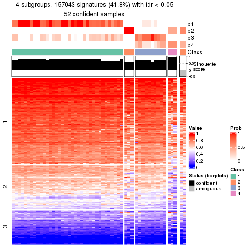</p>

</div>
<div id='tab-node-02-get-signatures-4'>
<pre><code class="r">get_signatures(res, k = 5)
</code></pre>

<p></p>

</div>
<div id='tab-node-02-get-signatures-5'>
<pre><code class="r">get_signatures(res, k = 6)
</code></pre>

<p></p>

</div>
<div id='tab-node-02-get-signatures-6'>
<pre><code class="r">get_signatures(res, k = 7)
</code></pre>

<p></p>

</div>
<div id='tab-node-02-get-signatures-7'>
<pre><code class="r">get_signatures(res, k = 8)
</code></pre>

<p></p>

</div>
</div>


Compare the overlap of signatures from different k:

```r
compare_signatures(res)
```


`get_signature()` returns a data frame invisibly. To get the list of signatures, the function
call should be assigned to a variable explicitly. In following code, if `plot` argument is set
to `FALSE`, no heatmap is plotted while only the differential analysis is performed.

```r
# code only for demonstration
tb = get_signature(res, k = ..., plot = FALSE)
```

An example of the output of `tb` is:

```
#>   which_row         fdr    mean_1    mean_2 scaled_mean_1 scaled_mean_2 km
#> 1        38 0.042760348  8.373488  9.131774    -0.5533452     0.5164555  1
#> 2        40 0.018707592  7.106213  8.469186    -0.6173731     0.5762149  1
#> 3        55 0.019134737 10.221463 11.207825    -0.6159697     0.5749050  1
#> 4        59 0.006059896  5.921854  7.869574    -0.6899429     0.6439467  1
#> 5        60 0.018055526  8.928898 10.211722    -0.6204761     0.5791110  1
#> 6        98 0.009384629 15.714769 14.887706     0.6635654    -0.6193277  2
...
```

The columns in `tb` are:

1. `which_row`: row indices corresponding to the input matrix.
2. `fdr`: FDR for the differential test. 
3. `mean_x`: The mean value in group x.
4. `scaled_mean_x`: The mean value in group x after rows are scaled.
5. `km`: Row groups if k-means clustering is applied to rows (which is done by automatically selecting number of clusters).

If there are too many signatures, `top_signatures = ...` can be set to only show the 
signatures with the highest FDRs:

```r
# code only for demonstration
# e.g. to show the top 500 most significant rows
tb = get_signature(res, k = ..., top_signatures = 500)
```

If the signatures are defined as these which are uniquely high in current group, `diff_method` argument
can be set to `"uniquely_high_in_one_group"`:

```r
# code only for demonstration
tb = get_signature(res, k = ..., diff_method = "uniquely_high_in_one_group")
```


UMAP plot which shows how samples are separated.


<script>
$( function() {
	$( '#tabs-node-02-dimension-reduction' ).tabs();
} );
</script>
<div id='tabs-node-02-dimension-reduction'>
<ul>
<li><a href='#tab-node-02-dimension-reduction-1'>k = 2</a></li>
<li><a href='#tab-node-02-dimension-reduction-2'>k = 3</a></li>
<li><a href='#tab-node-02-dimension-reduction-3'>k = 4</a></li>
<li><a href='#tab-node-02-dimension-reduction-4'>k = 5</a></li>
<li><a href='#tab-node-02-dimension-reduction-5'>k = 6</a></li>
<li><a href='#tab-node-02-dimension-reduction-6'>k = 7</a></li>
<li><a href='#tab-node-02-dimension-reduction-7'>k = 8</a></li>
</ul>
<div id='tab-node-02-dimension-reduction-1'>
<pre><code class="r">dimension_reduction(res, k = 2, method = &quot;UMAP&quot;)
</code></pre>

<p></p>

</div>
<div id='tab-node-02-dimension-reduction-2'>
<pre><code class="r">dimension_reduction(res, k = 3, method = &quot;UMAP&quot;)
</code></pre>

<p></p>

</div>
<div id='tab-node-02-dimension-reduction-3'>
<pre><code class="r">dimension_reduction(res, k = 4, method = &quot;UMAP&quot;)
</code></pre>

<p></p>

</div>
<div id='tab-node-02-dimension-reduction-4'>
<pre><code class="r">dimension_reduction(res, k = 5, method = &quot;UMAP&quot;)
</code></pre>

<p></p>

</div>
<div id='tab-node-02-dimension-reduction-5'>
<pre><code class="r">dimension_reduction(res, k = 6, method = &quot;UMAP&quot;)
</code></pre>

<p></p>

</div>
<div id='tab-node-02-dimension-reduction-6'>
<pre><code class="r">dimension_reduction(res, k = 7, method = &quot;UMAP&quot;)
</code></pre>

<p></p>

</div>
<div id='tab-node-02-dimension-reduction-7'>
<pre><code class="r">dimension_reduction(res, k = 8, method = &quot;UMAP&quot;)
</code></pre>

<p></p>

</div>
</div>


Following heatmap shows how subgroups are split when increasing `k`:

```r
collect_classes(res)
```


If matrix rows can be associated to genes, consider to use `functional_enrichment(res,
...)` to perform function enrichment for the signature genes. See [this vignette](https://jokergoo.github.io/cola_vignettes/functional_enrichment.html) for more detailed explanations.


 

---------------------------------------------------


### Node021


Parent node: [Node02](#Node02).
Child nodes: 
                [Node0111](#Node0111)
        ,
                [Node0112](#Node0112)
        ,
                [Node0121](#Node0121)
        ,
                [Node0122](#Node0122)
        ,
                Node0211-leaf
        ,
                [Node0212](#Node0212)
        ,
                Node0411-leaf
        ,
                Node0412-leaf
        ,
                Node0413-leaf
        ,
                Node0414-leaf
        ,
                Node0421-leaf
        ,
                [Node0422](#Node0422)
        ,
                Node0423-leaf
        ,
                Node0431-leaf
        ,
                Node0432-leaf
        ,
                Node0433-leaf
        .


The object with results only for a single top-value method and a single partitioning method 
can be extracted as:

```r
res = res_rh["021"]
```

A summary of `res` and all the functions that can be applied to it:

```r
res
```

```
#> A 'ConsensusPartition' object with k = 2, 3, 4, 5, 6, 7, 8.
#>   On a matrix with 30000 rows and 36 columns.
#>   Top rows (1000) are extracted by 'SD' method.
#>   Subgroups are detected by 'kmeans' method.
#>   Performed in total 350 partitions by row resampling.
#>   Best k for subgroups seems to be 2.
#> 
#> Following methods can be applied to this 'ConsensusPartition' object:
#>  [1] "cola_report"             "collect_classes"         "collect_plots"          
#>  [4] "collect_stats"           "colnames"                "compare_partitions"     
#>  [7] "compare_signatures"      "consensus_heatmap"       "dimension_reduction"    
#> [10] "functional_enrichment"   "get_anno_col"            "get_anno"               
#> [13] "get_classes"             "get_consensus"           "get_matrix"             
#> [16] "get_membership"          "get_param"               "get_signatures"         
#> [19] "get_stats"               "is_best_k"               "is_stable_k"            
#> [22] "membership_heatmap"      "ncol"                    "nrow"                   
#> [25] "plot_ecdf"               "predict_classes"         "rownames"               
#> [28] "select_partition_number" "show"                    "suggest_best_k"         
#> [31] "test_to_known_factors"   "top_rows_heatmap"
```

`collect_plots()` function collects all the plots made from `res` for all `k` (number of subgroups)
into one single page to provide an easy and fast comparison between different `k`.

```r
collect_plots(res)
```


The plots are:

- The first row: a plot of the eCDF (empirical cumulative distribution
  function) curves of the consensus matrix for each `k` and the heatmap of
  predicted classes for each `k`.
- The second row: heatmaps of the consensus matrix for each `k`.
- The third row: heatmaps of the membership matrix for each `k`.
- The fouth row: heatmaps of the signatures for each `k`.

All the plots in panels can be made by individual functions and they are
plotted later in this section.

`select_partition_number()` produces several plots showing different
statistics for choosing "optimized" `k`. There are following statistics:

- eCDF curves of the consensus matrix for each `k`;
- 1-PAC. [The PAC score](https://en.wikipedia.org/wiki/Consensus_clustering#Over-interpretation_potential_of_consensus_clustering)
  measures the proportion of the ambiguous subgrouping.
- Mean silhouette score.
- Concordance. The mean probability of fiting the consensus subgroup labels in all
  partitions.
- Area increased. Denote $A_k$ as the area under the eCDF curve for current
  `k`, the area increased is defined as $A_k - A_{k-1}$.
- Rand index. The percent of pairs of samples that are both in a same cluster
  or both are not in a same cluster in the partition of k and k-1.
- Jaccard index. The ratio of pairs of samples are both in a same cluster in
  the partition of k and k-1 and the pairs of samples are both in a same
  cluster in the partition k or k-1.

The detailed explanations of these statistics can be found in [the _cola_
vignette](https://jokergoo.github.io/cola_vignettes/cola.html#toc_13).

Generally speaking, higher 1-PAC score, higher mean silhouette score or higher
concordance corresponds to better partition. Rand index and Jaccard index
measure how similar the current partition is compared to partition with `k-1`.
If they are too similar, we won't accept `k` is better than `k-1`.

```r
select_partition_number(res)
```


The numeric values for all these statistics can be obtained by `get_stats()`.

```r
get_stats(res)
```

```
#>   k 1-PAC mean_silhouette concordance area_increased  Rand Jaccard
#> 2 2 1.000           1.000       1.000         0.5132 0.487   0.487
#> 3 3 0.733           0.787       0.833         0.2306 0.889   0.772
#> 4 4 0.629           0.758       0.789         0.1154 0.889   0.705
#> 5 5 0.594           0.600       0.761         0.0853 0.922   0.726
#> 6 6 0.654           0.504       0.737         0.0578 0.908   0.635
#> 7 7 0.747           0.609       0.747         0.0334 0.903   0.551
#> 8 8 0.770           0.619       0.718         0.0331 0.962   0.765
```

`suggest_best_k()` suggests the best $k$ based on these statistics. The rules are as follows:

- All $k$ with Jaccard index larger than 0.95 are removed because increasing
  $k$ does not provide enough extra information. If all $k$ are removed, it is
  marked as no subgroup is detected.
- For all $k$ with 1-PAC score larger than 0.9, the maximal $k$ is taken as
  the best $k$, and other $k$ are marked as optional $k$.
- If it does not fit the second rule. The $k$ with the maximal vote of the
  highest 1-PAC score, highest mean silhouette, and highest concordance is
  taken as the best $k$.

```r
suggest_best_k(res)
```

```
#> [1] 2
```


Following is the table of the partitions (You need to click the **show/hide
code output** link to see it). The membership matrix (columns with name `p*`)
is inferred by
[`clue::cl_consensus()`](https://www.rdocumentation.org/link/cl_consensus?package=clue)
function with the `SE` method. Basically the value in the membership matrix
represents the probability to belong to a certain group. The finall subgroup
label for an item is determined with the group with highest probability it
belongs to.

In `get_classes()` function, the entropy is calculated from the membership
matrix and the silhouette score is calculated from the consensus matrix.


<script>
$( function() {
	$( '#tabs-node-021-get-classes' ).tabs();
} );
</script>
<div id='tabs-node-021-get-classes'>
<ul>
<li><a href='#tab-node-021-get-classes-1'>k = 2</a></li>
<li><a href='#tab-node-021-get-classes-2'>k = 3</a></li>
<li><a href='#tab-node-021-get-classes-3'>k = 4</a></li>
<li><a href='#tab-node-021-get-classes-4'>k = 5</a></li>
<li><a href='#tab-node-021-get-classes-5'>k = 6</a></li>
<li><a href='#tab-node-021-get-classes-6'>k = 7</a></li>
<li><a href='#tab-node-021-get-classes-7'>k = 8</a></li>
</ul>

<div id='tab-node-021-get-classes-1'>
<p><a id='tab-node-021-get-classes-1-a' style='color:#0366d6' href='#'>show/hide code output</a></p>
<pre><code class="r">cbind(get_classes(res, k = 2), get_membership(res, k = 2))
</code></pre>

<pre><code>#&gt;                 class entropy silhouette p1 p2
#&gt; TCGA.AA.3712.11     1       0          1  1  0
#&gt; TCGA.A6.2681.11     2       0          1  0  1
#&gt; TCGA.A6.2675.11     1       0          1  1  0
#&gt; TCGA.AA.3663.11     1       0          1  1  0
#&gt; TCGA.A6.2671.11     1       0          1  1  0
#&gt; TCGA.A6.2680.11     2       0          1  0  1
#&gt; TCGA.AZ.6598.11     2       0          1  0  1
#&gt; TCGA.AG.A020.11     2       0          1  0  1
#&gt; TCGA.G4.6311.11     1       0          1  1  0
#&gt; TCGA.G4.6625.11     2       0          1  0  1
#&gt; TCGA.AG.A01Y.11     2       0          1  0  1
#&gt; TCGA.AG.A02N.11     1       0          1  1  0
#&gt; TCGA.A6.2684.11     2       0          1  0  1
#&gt; TCGA.G4.6320.11     1       0          1  1  0
#&gt; TCGA.AZ.6599.11     1       0          1  1  0
#&gt; TCGA.G4.6314.11     2       0          1  0  1
#&gt; TCGA.AG.3725.11     2       0          1  0  1
#&gt; TCGA.A6.5667.11     2       0          1  0  1
#&gt; TCGA.AA.3655.11     1       0          1  1  0
#&gt; TCGA.AG.A036.11     1       0          1  1  0
#&gt; TCGA.AA.3488.11     1       0          1  1  0
#&gt; TCGA.A6.2685.11     2       0          1  0  1
#&gt; TCGA.G4.6298.11     1       0          1  1  0
#&gt; TCGA.G4.6322.11     1       0          1  1  0
#&gt; TCGA.AA.3660.11     2       0          1  0  1
#&gt; TCGA.G4.6297.11     2       0          1  0  1
#&gt; TCGA.AZ.6600.11     1       0          1  1  0
#&gt; TCGA.AZ.6601.11     1       0          1  1  0
#&gt; TCGA.AA.3509.11     2       0          1  0  1
#&gt; TCGA.AG.3731.11     1       0          1  1  0
#&gt; TCGA.A6.2686.11     2       0          1  0  1
#&gt; TCGA.AA.3495.11     1       0          1  1  0
#&gt; TCGA.AG.A01W.11     2       0          1  0  1
#&gt; TCGA.AA.3506.11     1       0          1  1  0
#&gt; TCGA.AA.3492.11     2       0          1  0  1
#&gt; TCGA.A6.2682.11     1       0          1  1  0
</code></pre>

<script>
$('#tab-node-021-get-classes-1-a').parent().next().next().hide();
$('#tab-node-021-get-classes-1-a').click(function(){
  $('#tab-node-021-get-classes-1-a').parent().next().next().toggle();
  return(false);
});
</script>
</div>

<div id='tab-node-021-get-classes-2'>
<p><a id='tab-node-021-get-classes-2-a' style='color:#0366d6' href='#'>show/hide code output</a></p>
<pre><code class="r">cbind(get_classes(res, k = 3), get_membership(res, k = 3))
</code></pre>

<pre><code>#&gt;                 class entropy silhouette   p1   p2   p3
#&gt; TCGA.AA.3712.11     1   0.000      0.880 1.00 0.00 0.00
#&gt; TCGA.A6.2681.11     2   0.619      0.765 0.00 0.58 0.42
#&gt; TCGA.A6.2675.11     1   0.000      0.880 1.00 0.00 0.00
#&gt; TCGA.AA.3663.11     1   0.296      0.732 0.90 0.00 0.10
#&gt; TCGA.A6.2671.11     1   0.000      0.880 1.00 0.00 0.00
#&gt; TCGA.A6.2680.11     2   0.369      0.818 0.00 0.86 0.14
#&gt; TCGA.AZ.6598.11     2   0.613      0.773 0.00 0.60 0.40
#&gt; TCGA.AG.A020.11     2   0.000      0.834 0.00 1.00 0.00
#&gt; TCGA.G4.6311.11     3   0.619      0.969 0.42 0.00 0.58
#&gt; TCGA.G4.6625.11     2   0.000      0.834 0.00 1.00 0.00
#&gt; TCGA.AG.A01Y.11     2   0.000      0.834 0.00 1.00 0.00
#&gt; TCGA.AG.A02N.11     1   0.000      0.880 1.00 0.00 0.00
#&gt; TCGA.A6.2684.11     2   0.619      0.765 0.00 0.58 0.42
#&gt; TCGA.G4.6320.11     3   0.619      0.969 0.42 0.00 0.58
#&gt; TCGA.AZ.6599.11     1   0.207      0.805 0.94 0.00 0.06
#&gt; TCGA.G4.6314.11     2   0.619      0.765 0.00 0.58 0.42
#&gt; TCGA.AG.3725.11     2   0.000      0.834 0.00 1.00 0.00
#&gt; TCGA.A6.5667.11     2   0.000      0.834 0.00 1.00 0.00
#&gt; TCGA.AA.3655.11     1   0.000      0.880 1.00 0.00 0.00
#&gt; TCGA.AG.A036.11     1   0.000      0.880 1.00 0.00 0.00
#&gt; TCGA.AA.3488.11     1   0.000      0.880 1.00 0.00 0.00
#&gt; TCGA.A6.2685.11     2   0.000      0.834 0.00 1.00 0.00
#&gt; TCGA.G4.6298.11     3   0.619      0.969 0.42 0.00 0.58
#&gt; TCGA.G4.6322.11     1   0.000      0.880 1.00 0.00 0.00
#&gt; TCGA.AA.3660.11     2   0.000      0.834 0.00 1.00 0.00
#&gt; TCGA.G4.6297.11     2   0.613      0.773 0.00 0.60 0.40
#&gt; TCGA.AZ.6600.11     3   0.619      0.969 0.42 0.00 0.58
#&gt; TCGA.AZ.6601.11     1   0.000      0.880 1.00 0.00 0.00
#&gt; TCGA.AA.3509.11     2   0.000      0.834 0.00 1.00 0.00
#&gt; TCGA.AG.3731.11     1   0.000      0.880 1.00 0.00 0.00
#&gt; TCGA.A6.2686.11     2   0.619      0.765 0.00 0.58 0.42
#&gt; TCGA.AA.3495.11     3   0.630      0.859 0.48 0.00 0.52
#&gt; TCGA.AG.A01W.11     2   0.000      0.834 0.00 1.00 0.00
#&gt; TCGA.AA.3506.11     1   0.583     -0.229 0.66 0.00 0.34
#&gt; TCGA.AA.3492.11     2   0.613      0.773 0.00 0.60 0.40
#&gt; TCGA.A6.2682.11     1   0.583     -0.229 0.66 0.00 0.34
</code></pre>

<script>
$('#tab-node-021-get-classes-2-a').parent().next().next().hide();
$('#tab-node-021-get-classes-2-a').click(function(){
  $('#tab-node-021-get-classes-2-a').parent().next().next().toggle();
  return(false);
});
</script>
</div>

<div id='tab-node-021-get-classes-3'>
<p><a id='tab-node-021-get-classes-3-a' style='color:#0366d6' href='#'>show/hide code output</a></p>
<pre><code class="r">cbind(get_classes(res, k = 4), get_membership(res, k = 4))
</code></pre>

<pre><code>#&gt;                 class entropy silhouette   p1   p2   p3   p4
#&gt; TCGA.AA.3712.11     1  0.1211      0.736 0.96 0.00 0.04 0.00
#&gt; TCGA.A6.2681.11     4  0.4713      0.948 0.00 0.36 0.00 0.64
#&gt; TCGA.A6.2675.11     1  0.3606      0.743 0.84 0.00 0.02 0.14
#&gt; TCGA.AA.3663.11     1  0.5594      0.532 0.72 0.00 0.10 0.18
#&gt; TCGA.A6.2671.11     1  0.3975      0.703 0.76 0.00 0.00 0.24
#&gt; TCGA.A6.2680.11     2  0.6686      0.127 0.00 0.62 0.20 0.18
#&gt; TCGA.AZ.6598.11     4  0.6453      0.932 0.00 0.36 0.08 0.56
#&gt; TCGA.AG.A020.11     2  0.0707      0.907 0.00 0.98 0.02 0.00
#&gt; TCGA.G4.6311.11     3  0.4134      0.923 0.26 0.00 0.74 0.00
#&gt; TCGA.G4.6625.11     2  0.0000      0.913 0.00 1.00 0.00 0.00
#&gt; TCGA.AG.A01Y.11     2  0.0000      0.913 0.00 1.00 0.00 0.00
#&gt; TCGA.AG.A02N.11     1  0.1411      0.739 0.96 0.00 0.02 0.02
#&gt; TCGA.A6.2684.11     4  0.4713      0.948 0.00 0.36 0.00 0.64
#&gt; TCGA.G4.6320.11     3  0.4134      0.923 0.26 0.00 0.74 0.00
#&gt; TCGA.AZ.6599.11     1  0.5327      0.669 0.72 0.00 0.06 0.22
#&gt; TCGA.G4.6314.11     4  0.5355      0.939 0.00 0.36 0.02 0.62
#&gt; TCGA.AG.3725.11     2  0.0707      0.907 0.00 0.98 0.02 0.00
#&gt; TCGA.A6.5667.11     2  0.0000      0.913 0.00 1.00 0.00 0.00
#&gt; TCGA.AA.3655.11     1  0.2921      0.738 0.86 0.00 0.00 0.14
#&gt; TCGA.AG.A036.11     1  0.3172      0.737 0.84 0.00 0.00 0.16
#&gt; TCGA.AA.3488.11     1  0.3172      0.737 0.84 0.00 0.00 0.16
#&gt; TCGA.A6.2685.11     2  0.2921      0.774 0.00 0.86 0.14 0.00
#&gt; TCGA.G4.6298.11     3  0.4797      0.915 0.26 0.00 0.72 0.02
#&gt; TCGA.G4.6322.11     1  0.1913      0.733 0.94 0.00 0.02 0.04
#&gt; TCGA.AA.3660.11     2  0.0000      0.913 0.00 1.00 0.00 0.00
#&gt; TCGA.G4.6297.11     4  0.6453      0.932 0.00 0.36 0.08 0.56
#&gt; TCGA.AZ.6600.11     3  0.5256      0.916 0.26 0.00 0.70 0.04
#&gt; TCGA.AZ.6601.11     1  0.1211      0.736 0.96 0.00 0.04 0.00
#&gt; TCGA.AA.3509.11     2  0.0000      0.913 0.00 1.00 0.00 0.00
#&gt; TCGA.AG.3731.11     1  0.1211      0.736 0.96 0.00 0.04 0.00
#&gt; TCGA.A6.2686.11     4  0.4713      0.948 0.00 0.36 0.00 0.64
#&gt; TCGA.AA.3495.11     3  0.7121      0.710 0.30 0.00 0.54 0.16
#&gt; TCGA.AG.A01W.11     2  0.0707      0.907 0.00 0.98 0.02 0.00
#&gt; TCGA.AA.3506.11     1  0.7805     -0.172 0.42 0.00 0.30 0.28
#&gt; TCGA.AA.3492.11     4  0.6714      0.925 0.00 0.36 0.10 0.54
#&gt; TCGA.A6.2682.11     1  0.7785     -0.212 0.42 0.00 0.32 0.26
</code></pre>

<script>
$('#tab-node-021-get-classes-3-a').parent().next().next().hide();
$('#tab-node-021-get-classes-3-a').click(function(){
  $('#tab-node-021-get-classes-3-a').parent().next().next().toggle();
  return(false);
});
</script>
</div>

<div id='tab-node-021-get-classes-4'>
<p><a id='tab-node-021-get-classes-4-a' style='color:#0366d6' href='#'>show/hide code output</a></p>
<pre><code class="r">cbind(get_classes(res, k = 5), get_membership(res, k = 5))
</code></pre>

<pre><code>#&gt;                 class entropy silhouette   p1   p2   p3   p4   p5
#&gt; TCGA.AA.3712.11     1  0.2675      0.719 0.90 0.00 0.04 0.04 0.02
#&gt; TCGA.A6.2681.11     4  0.5546      0.927 0.00 0.20 0.02 0.68 0.10
#&gt; TCGA.A6.2675.11     1  0.4458      0.748 0.76 0.00 0.00 0.12 0.12
#&gt; TCGA.AA.3663.11     3  0.4798      0.172 0.44 0.00 0.54 0.02 0.00
#&gt; TCGA.A6.2671.11     1  0.7179      0.560 0.56 0.00 0.20 0.12 0.12
#&gt; TCGA.A6.2680.11     2  0.6359      0.259 0.00 0.52 0.00 0.26 0.22
#&gt; TCGA.AZ.6598.11     4  0.3690      0.912 0.00 0.20 0.02 0.78 0.00
#&gt; TCGA.AG.A020.11     2  0.1216      0.894 0.00 0.96 0.02 0.00 0.02
#&gt; TCGA.G4.6311.11     3  0.5579     -0.490 0.10 0.00 0.60 0.00 0.30
#&gt; TCGA.G4.6625.11     2  0.0609      0.897 0.00 0.98 0.02 0.00 0.00
#&gt; TCGA.AG.A01Y.11     2  0.0609      0.898 0.00 0.98 0.00 0.00 0.02
#&gt; TCGA.AG.A02N.11     1  0.2331      0.762 0.90 0.00 0.00 0.02 0.08
#&gt; TCGA.A6.2684.11     4  0.5210      0.928 0.00 0.20 0.00 0.68 0.12
#&gt; TCGA.G4.6320.11     3  0.5487     -0.437 0.10 0.00 0.62 0.00 0.28
#&gt; TCGA.AZ.6599.11     1  0.5589      0.425 0.64 0.00 0.28 0.04 0.04
#&gt; TCGA.G4.6314.11     4  0.5935      0.920 0.00 0.20 0.04 0.66 0.10
#&gt; TCGA.AG.3725.11     2  0.0609      0.895 0.00 0.98 0.02 0.00 0.00
#&gt; TCGA.A6.5667.11     2  0.1043      0.896 0.00 0.96 0.00 0.00 0.04
#&gt; TCGA.AA.3655.11     1  0.4216      0.752 0.78 0.00 0.00 0.10 0.12
#&gt; TCGA.AG.A036.11     1  0.4676      0.736 0.74 0.00 0.00 0.14 0.12
#&gt; TCGA.AA.3488.11     1  0.4890      0.744 0.72 0.00 0.00 0.14 0.14
#&gt; TCGA.A6.2685.11     2  0.3274      0.767 0.00 0.78 0.00 0.00 0.22
#&gt; TCGA.G4.6298.11     5  0.5895      0.000 0.10 0.00 0.44 0.00 0.46
#&gt; TCGA.G4.6322.11     1  0.3037      0.695 0.86 0.00 0.10 0.04 0.00
#&gt; TCGA.AA.3660.11     2  0.2012      0.891 0.00 0.92 0.02 0.00 0.06
#&gt; TCGA.G4.6297.11     4  0.3690      0.912 0.00 0.20 0.02 0.78 0.00
#&gt; TCGA.AZ.6600.11     3  0.5884     -0.901 0.10 0.00 0.48 0.00 0.42
#&gt; TCGA.AZ.6601.11     1  0.2249      0.729 0.92 0.00 0.04 0.02 0.02
#&gt; TCGA.AA.3509.11     2  0.1216      0.894 0.00 0.96 0.02 0.00 0.02
#&gt; TCGA.AG.3731.11     1  0.2077      0.723 0.92 0.00 0.04 0.04 0.00
#&gt; TCGA.A6.2686.11     4  0.5210      0.928 0.00 0.20 0.00 0.68 0.12
#&gt; TCGA.AA.3495.11     3  0.3106      0.294 0.14 0.00 0.84 0.00 0.02
#&gt; TCGA.AG.A01W.11     2  0.1216      0.894 0.00 0.96 0.02 0.00 0.02
#&gt; TCGA.AA.3506.11     3  0.4728      0.367 0.24 0.00 0.70 0.00 0.06
#&gt; TCGA.AA.3492.11     4  0.3690      0.912 0.00 0.20 0.02 0.78 0.00
#&gt; TCGA.A6.2682.11     3  0.4132      0.388 0.26 0.00 0.72 0.00 0.02
</code></pre>

<script>
$('#tab-node-021-get-classes-4-a').parent().next().next().hide();
$('#tab-node-021-get-classes-4-a').click(function(){
  $('#tab-node-021-get-classes-4-a').parent().next().next().toggle();
  return(false);
});
</script>
</div>

<div id='tab-node-021-get-classes-5'>
<p><a id='tab-node-021-get-classes-5-a' style='color:#0366d6' href='#'>show/hide code output</a></p>
<pre><code class="r">cbind(get_classes(res, k = 6), get_membership(res, k = 6))
</code></pre>

<pre><code>#&gt;                 class entropy silhouette   p1   p2   p3   p4   p5   p6
#&gt; TCGA.AA.3712.11     1  0.0547     0.5591 0.98 0.00 0.00 0.02 0.00 0.00
#&gt; TCGA.A6.2681.11     4  0.1814     0.8093 0.00 0.10 0.00 0.90 0.00 0.00
#&gt; TCGA.A6.2675.11     1  0.5708     0.1956 0.50 0.00 0.00 0.02 0.38 0.10
#&gt; TCGA.AA.3663.11     1  0.6489    -0.1208 0.52 0.00 0.04 0.02 0.30 0.12
#&gt; TCGA.A6.2671.11     5  0.3647    -0.1652 0.36 0.00 0.00 0.00 0.64 0.00
#&gt; TCGA.A6.2680.11     6  0.5195     0.0000 0.00 0.36 0.00 0.10 0.00 0.54
#&gt; TCGA.AZ.6598.11     4  0.6138     0.7155 0.00 0.10 0.00 0.60 0.12 0.18
#&gt; TCGA.AG.A020.11     2  0.1480     0.8524 0.00 0.94 0.00 0.00 0.04 0.02
#&gt; TCGA.G4.6311.11     3  0.5064     0.7211 0.04 0.00 0.70 0.02 0.04 0.20
#&gt; TCGA.G4.6625.11     2  0.0000     0.8630 0.00 1.00 0.00 0.00 0.00 0.00
#&gt; TCGA.AG.A01Y.11     2  0.1092     0.8565 0.00 0.96 0.00 0.00 0.02 0.02
#&gt; TCGA.AG.A02N.11     1  0.3076     0.4516 0.76 0.00 0.00 0.00 0.24 0.00
#&gt; TCGA.A6.2684.11     4  0.1814     0.8093 0.00 0.10 0.00 0.90 0.00 0.00
#&gt; TCGA.G4.6320.11     3  0.5487     0.7078 0.04 0.00 0.66 0.02 0.06 0.22
#&gt; TCGA.AZ.6599.11     1  0.6036     0.1521 0.58 0.00 0.04 0.02 0.28 0.08
#&gt; TCGA.G4.6314.11     4  0.1814     0.8093 0.00 0.10 0.00 0.90 0.00 0.00
#&gt; TCGA.AG.3725.11     2  0.0547     0.8575 0.00 0.98 0.00 0.00 0.00 0.02
#&gt; TCGA.A6.5667.11     2  0.2403     0.8096 0.00 0.90 0.02 0.00 0.04 0.04
#&gt; TCGA.AA.3655.11     1  0.3828     0.2395 0.56 0.00 0.00 0.00 0.44 0.00
#&gt; TCGA.AG.A036.11     5  0.4328    -0.3546 0.46 0.00 0.00 0.00 0.52 0.02
#&gt; TCGA.AA.3488.11     1  0.4310     0.1874 0.54 0.00 0.00 0.00 0.44 0.02
#&gt; TCGA.A6.2685.11     2  0.4144    -0.0144 0.00 0.62 0.00 0.00 0.02 0.36
#&gt; TCGA.G4.6298.11     3  0.0547     0.6931 0.02 0.00 0.98 0.00 0.00 0.00
#&gt; TCGA.G4.6322.11     1  0.1480     0.5420 0.94 0.00 0.00 0.02 0.04 0.00
#&gt; TCGA.AA.3660.11     2  0.2190     0.8398 0.00 0.90 0.00 0.00 0.06 0.04
#&gt; TCGA.G4.6297.11     4  0.6138     0.7155 0.00 0.10 0.00 0.60 0.12 0.18
#&gt; TCGA.AZ.6600.11     3  0.1092     0.6941 0.02 0.00 0.96 0.00 0.00 0.02
#&gt; TCGA.AZ.6601.11     1  0.0000     0.5619 1.00 0.00 0.00 0.00 0.00 0.00
#&gt; TCGA.AA.3509.11     2  0.0547     0.8615 0.00 0.98 0.00 0.00 0.00 0.02
#&gt; TCGA.AG.3731.11     1  0.0547     0.5604 0.98 0.00 0.00 0.02 0.00 0.00
#&gt; TCGA.A6.2686.11     4  0.1814     0.8093 0.00 0.10 0.00 0.90 0.00 0.00
#&gt; TCGA.AA.3495.11     3  0.7000     0.2701 0.06 0.00 0.36 0.00 0.28 0.30
#&gt; TCGA.AG.A01W.11     2  0.1480     0.8524 0.00 0.94 0.00 0.00 0.04 0.02
#&gt; TCGA.AA.3506.11     5  0.7371     0.0687 0.10 0.00 0.20 0.02 0.46 0.22
#&gt; TCGA.AA.3492.11     4  0.6138     0.7155 0.00 0.10 0.00 0.60 0.12 0.18
#&gt; TCGA.A6.2682.11     5  0.7941     0.0281 0.22 0.00 0.20 0.02 0.36 0.20
</code></pre>

<script>
$('#tab-node-021-get-classes-5-a').parent().next().next().hide();
$('#tab-node-021-get-classes-5-a').click(function(){
  $('#tab-node-021-get-classes-5-a').parent().next().next().toggle();
  return(false);
});
</script>
</div>

<div id='tab-node-021-get-classes-6'>
<p><a id='tab-node-021-get-classes-6-a' style='color:#0366d6' href='#'>show/hide code output</a></p>
<pre><code class="r">cbind(get_classes(res, k = 7), get_membership(res, k = 7))
</code></pre>

<pre><code>#&gt;                 class entropy silhouette   p1   p2   p3   p4   p5   p6   p7
#&gt; TCGA.AA.3712.11     7  0.3985      0.875 0.46 0.00 0.00 0.00 0.00 0.02 0.52
#&gt; TCGA.A6.2681.11     4  0.1166      0.838 0.00 0.06 0.00 0.94 0.00 0.00 0.00
#&gt; TCGA.A6.2675.11     1  0.4181      0.346 0.74 0.00 0.00 0.00 0.04 0.16 0.06
#&gt; TCGA.AA.3663.11     5  0.4931      0.623 0.08 0.00 0.08 0.00 0.68 0.00 0.16
#&gt; TCGA.A6.2671.11     1  0.3780      0.372 0.72 0.00 0.00 0.00 0.24 0.02 0.02
#&gt; TCGA.A6.2680.11     6  0.4146      0.763 0.00 0.24 0.00 0.08 0.00 0.68 0.00
#&gt; TCGA.AZ.6598.11     4  0.5519      0.778 0.00 0.06 0.00 0.64 0.06 0.04 0.20
#&gt; TCGA.AG.A020.11     2  0.2769      0.787 0.00 0.86 0.00 0.00 0.04 0.02 0.08
#&gt; TCGA.G4.6311.11     3  0.6428      0.649 0.02 0.00 0.60 0.06 0.16 0.08 0.08
#&gt; TCGA.G4.6625.11     2  0.2509      0.787 0.00 0.88 0.00 0.00 0.04 0.06 0.02
#&gt; TCGA.AG.A01Y.11     2  0.1860      0.802 0.00 0.92 0.00 0.00 0.04 0.02 0.02
#&gt; TCGA.AG.A02N.11     1  0.3943     -0.615 0.56 0.00 0.00 0.00 0.00 0.02 0.42
#&gt; TCGA.A6.2684.11     4  0.1166      0.838 0.00 0.06 0.00 0.94 0.00 0.00 0.00
#&gt; TCGA.G4.6320.11     3  0.6428      0.649 0.02 0.00 0.60 0.06 0.16 0.08 0.08
#&gt; TCGA.AZ.6599.11     1  0.6454      0.111 0.42 0.00 0.00 0.00 0.22 0.08 0.28
#&gt; TCGA.G4.6314.11     4  0.1664      0.835 0.00 0.06 0.00 0.92 0.02 0.00 0.00
#&gt; TCGA.AG.3725.11     2  0.1860      0.793 0.00 0.92 0.00 0.00 0.02 0.02 0.04
#&gt; TCGA.A6.5667.11     2  0.3635      0.783 0.00 0.82 0.02 0.00 0.06 0.04 0.06
#&gt; TCGA.AA.3655.11     1  0.1928      0.376 0.90 0.00 0.00 0.00 0.00 0.02 0.08
#&gt; TCGA.AG.A036.11     1  0.0504      0.433 0.98 0.00 0.00 0.00 0.02 0.00 0.00
#&gt; TCGA.AA.3488.11     1  0.2421      0.395 0.88 0.00 0.00 0.00 0.02 0.02 0.08
#&gt; TCGA.A6.2685.11     6  0.3358      0.716 0.00 0.36 0.00 0.00 0.00 0.64 0.00
#&gt; TCGA.G4.6298.11     3  0.0504      0.689 0.02 0.00 0.98 0.00 0.00 0.00 0.00
#&gt; TCGA.G4.6322.11     1  0.5293     -0.704 0.46 0.00 0.00 0.00 0.10 0.02 0.42
#&gt; TCGA.AA.3660.11     2  0.3744      0.771 0.00 0.78 0.00 0.00 0.12 0.08 0.02
#&gt; TCGA.G4.6297.11     4  0.5519      0.778 0.00 0.06 0.00 0.64 0.06 0.04 0.20
#&gt; TCGA.AZ.6600.11     3  0.1006      0.681 0.02 0.00 0.96 0.00 0.02 0.00 0.00
#&gt; TCGA.AZ.6601.11     7  0.3985      0.880 0.46 0.00 0.00 0.00 0.02 0.00 0.52
#&gt; TCGA.AA.3509.11     2  0.2804      0.783 0.00 0.86 0.00 0.00 0.06 0.06 0.02
#&gt; TCGA.AG.3731.11     7  0.3525      0.906 0.44 0.00 0.00 0.00 0.00 0.00 0.56
#&gt; TCGA.A6.2686.11     4  0.1166      0.838 0.00 0.06 0.00 0.94 0.00 0.00 0.00
#&gt; TCGA.AA.3495.11     5  0.6394      0.382 0.06 0.00 0.28 0.04 0.54 0.04 0.04
#&gt; TCGA.AG.A01W.11     2  0.2769      0.787 0.00 0.86 0.00 0.00 0.04 0.02 0.08
#&gt; TCGA.AA.3506.11     5  0.4939      0.702 0.20 0.00 0.14 0.00 0.64 0.02 0.00
#&gt; TCGA.AA.3492.11     4  0.5632      0.764 0.00 0.06 0.00 0.62 0.06 0.04 0.22
#&gt; TCGA.A6.2682.11     5  0.4514      0.729 0.14 0.00 0.14 0.00 0.70 0.00 0.02
</code></pre>

<script>
$('#tab-node-021-get-classes-6-a').parent().next().next().hide();
$('#tab-node-021-get-classes-6-a').click(function(){
  $('#tab-node-021-get-classes-6-a').parent().next().next().toggle();
  return(false);
});
</script>
</div>

<div id='tab-node-021-get-classes-7'>
<p><a id='tab-node-021-get-classes-7-a' style='color:#0366d6' href='#'>show/hide code output</a></p>
<pre><code class="r">cbind(get_classes(res, k = 8), get_membership(res, k = 8))
</code></pre>

<pre><code>#&gt;                 class entropy silhouette   p1   p2   p3   p4   p5   p6   p7   p8
#&gt; TCGA.AA.3712.11     7  0.0000     0.7275 0.00 0.00 0.00 0.00 0.00 0.00 1.00 0.00
#&gt; TCGA.A6.2681.11     4  0.0471     0.7391 0.02 0.00 0.00 0.98 0.00 0.00 0.00 0.00
#&gt; TCGA.A6.2675.11     1  0.5983     0.4925 0.46 0.14 0.00 0.00 0.06 0.02 0.32 0.00
#&gt; TCGA.AA.3663.11     5  0.5332     0.4049 0.00 0.08 0.08 0.00 0.52 0.00 0.32 0.00
#&gt; TCGA.A6.2671.11     1  0.4992     0.6305 0.58 0.02 0.00 0.00 0.20 0.00 0.20 0.00
#&gt; TCGA.A6.2680.11     6  0.2348     0.7392 0.00 0.02 0.00 0.04 0.00 0.88 0.00 0.06
#&gt; TCGA.AZ.6598.11     4  0.6204     0.6625 0.08 0.16 0.00 0.54 0.06 0.16 0.00 0.00
#&gt; TCGA.AG.A020.11     8  0.0000     0.6886 0.00 0.00 0.00 0.00 0.00 0.00 0.00 1.00
#&gt; TCGA.G4.6311.11     3  0.4890     0.4842 0.02 0.06 0.56 0.00 0.34 0.02 0.00 0.00
#&gt; TCGA.G4.6625.11     8  0.3907     0.7338 0.00 0.38 0.00 0.00 0.04 0.00 0.00 0.58
#&gt; TCGA.AG.A01Y.11     8  0.3570     0.7336 0.02 0.36 0.00 0.00 0.00 0.00 0.00 0.62
#&gt; TCGA.AG.A02N.11     7  0.3021     0.5021 0.16 0.02 0.00 0.00 0.02 0.00 0.80 0.00
#&gt; TCGA.A6.2684.11     4  0.0000     0.7401 0.00 0.00 0.00 1.00 0.00 0.00 0.00 0.00
#&gt; TCGA.G4.6320.11     3  0.4940     0.4885 0.02 0.04 0.56 0.00 0.34 0.04 0.00 0.00
#&gt; TCGA.AZ.6599.11     7  0.5584    -0.0273 0.16 0.08 0.00 0.00 0.22 0.00 0.54 0.00
#&gt; TCGA.G4.6314.11     4  0.2807     0.6968 0.10 0.02 0.00 0.84 0.04 0.00 0.00 0.00
#&gt; TCGA.AG.3725.11     8  0.2406     0.7113 0.00 0.20 0.00 0.00 0.00 0.00 0.00 0.80
#&gt; TCGA.A6.5667.11     8  0.5747     0.6131 0.10 0.24 0.00 0.00 0.04 0.06 0.00 0.56
#&gt; TCGA.AA.3655.11     1  0.3729     0.4735 0.52 0.00 0.00 0.00 0.02 0.00 0.46 0.00
#&gt; TCGA.AG.A036.11     1  0.3922     0.7215 0.64 0.00 0.00 0.00 0.06 0.00 0.30 0.00
#&gt; TCGA.AA.3488.11     1  0.4621     0.7114 0.58 0.02 0.00 0.00 0.08 0.00 0.32 0.00
#&gt; TCGA.A6.2685.11     6  0.3431     0.6856 0.00 0.06 0.00 0.00 0.00 0.74 0.00 0.20
#&gt; TCGA.G4.6298.11     3  0.0000     0.6049 0.00 0.00 1.00 0.00 0.00 0.00 0.00 0.00
#&gt; TCGA.G4.6322.11     7  0.3421     0.5882 0.04 0.08 0.00 0.00 0.08 0.00 0.80 0.00
#&gt; TCGA.AA.3660.11     8  0.3374     0.6976 0.00 0.30 0.00 0.00 0.02 0.00 0.00 0.68
#&gt; TCGA.G4.6297.11     4  0.6277     0.6633 0.08 0.14 0.00 0.54 0.08 0.16 0.00 0.00
#&gt; TCGA.AZ.6600.11     3  0.0941     0.5937 0.00 0.02 0.96 0.00 0.02 0.00 0.00 0.00
#&gt; TCGA.AZ.6601.11     7  0.0941     0.7149 0.02 0.00 0.00 0.00 0.02 0.00 0.96 0.00
#&gt; TCGA.AA.3509.11     8  0.3658     0.7305 0.00 0.40 0.00 0.00 0.02 0.00 0.00 0.58
#&gt; TCGA.AG.3731.11     7  0.0000     0.7275 0.00 0.00 0.00 0.00 0.00 0.00 1.00 0.00
#&gt; TCGA.A6.2686.11     4  0.0000     0.7401 0.00 0.00 0.00 1.00 0.00 0.00 0.00 0.00
#&gt; TCGA.AA.3495.11     5  0.4375     0.2962 0.02 0.04 0.26 0.00 0.66 0.02 0.00 0.00
#&gt; TCGA.AG.A01W.11     8  0.0471     0.6904 0.00 0.00 0.00 0.00 0.02 0.00 0.00 0.98
#&gt; TCGA.AA.3506.11     5  0.4643     0.5979 0.12 0.04 0.12 0.00 0.70 0.00 0.02 0.00
#&gt; TCGA.AA.3492.11     4  0.6204     0.6625 0.08 0.16 0.00 0.54 0.06 0.16 0.00 0.00
#&gt; TCGA.A6.2682.11     5  0.4767     0.6241 0.06 0.06 0.14 0.00 0.70 0.00 0.04 0.00
</code></pre>

<script>
$('#tab-node-021-get-classes-7-a').parent().next().next().hide();
$('#tab-node-021-get-classes-7-a').click(function(){
  $('#tab-node-021-get-classes-7-a').parent().next().next().toggle();
  return(false);
});
</script>
</div>
</div>

Heatmaps for the consensus matrix. It visualizes the probability of two
samples to be in a same group.


<script>
$( function() {
	$( '#tabs-node-021-consensus-heatmap' ).tabs();
} );
</script>
<div id='tabs-node-021-consensus-heatmap'>
<ul>
<li><a href='#tab-node-021-consensus-heatmap-1'>k = 2</a></li>
<li><a href='#tab-node-021-consensus-heatmap-2'>k = 3</a></li>
<li><a href='#tab-node-021-consensus-heatmap-3'>k = 4</a></li>
<li><a href='#tab-node-021-consensus-heatmap-4'>k = 5</a></li>
<li><a href='#tab-node-021-consensus-heatmap-5'>k = 6</a></li>
<li><a href='#tab-node-021-consensus-heatmap-6'>k = 7</a></li>
<li><a href='#tab-node-021-consensus-heatmap-7'>k = 8</a></li>
</ul>
<div id='tab-node-021-consensus-heatmap-1'>
<pre><code class="r">consensus_heatmap(res, k = 2)
</code></pre>

<p></p>

</div>
<div id='tab-node-021-consensus-heatmap-2'>
<pre><code class="r">consensus_heatmap(res, k = 3)
</code></pre>

<p></p>

</div>
<div id='tab-node-021-consensus-heatmap-3'>
<pre><code class="r">consensus_heatmap(res, k = 4)
</code></pre>

<p></p>

</div>
<div id='tab-node-021-consensus-heatmap-4'>
<pre><code class="r">consensus_heatmap(res, k = 5)
</code></pre>

<p>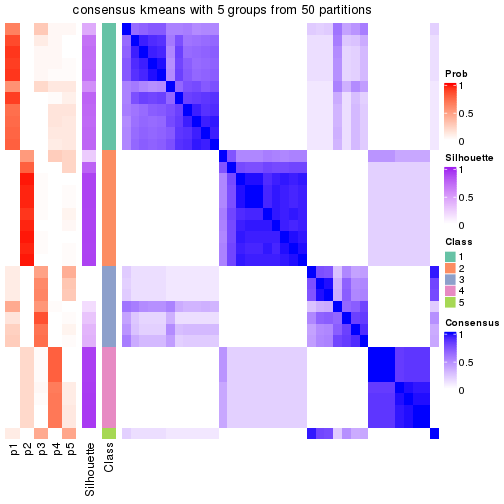</p>

</div>
<div id='tab-node-021-consensus-heatmap-5'>
<pre><code class="r">consensus_heatmap(res, k = 6)
</code></pre>

<p></p>

</div>
<div id='tab-node-021-consensus-heatmap-6'>
<pre><code class="r">consensus_heatmap(res, k = 7)
</code></pre>

<p></p>

</div>
<div id='tab-node-021-consensus-heatmap-7'>
<pre><code class="r">consensus_heatmap(res, k = 8)
</code></pre>

<p></p>

</div>
</div>

Heatmaps for the membership of samples in all partitions to see how consistent they are:


<script>
$( function() {
	$( '#tabs-node-021-membership-heatmap' ).tabs();
} );
</script>
<div id='tabs-node-021-membership-heatmap'>
<ul>
<li><a href='#tab-node-021-membership-heatmap-1'>k = 2</a></li>
<li><a href='#tab-node-021-membership-heatmap-2'>k = 3</a></li>
<li><a href='#tab-node-021-membership-heatmap-3'>k = 4</a></li>
<li><a href='#tab-node-021-membership-heatmap-4'>k = 5</a></li>
<li><a href='#tab-node-021-membership-heatmap-5'>k = 6</a></li>
<li><a href='#tab-node-021-membership-heatmap-6'>k = 7</a></li>
<li><a href='#tab-node-021-membership-heatmap-7'>k = 8</a></li>
</ul>
<div id='tab-node-021-membership-heatmap-1'>
<pre><code class="r">membership_heatmap(res, k = 2)
</code></pre>

<p></p>

</div>
<div id='tab-node-021-membership-heatmap-2'>
<pre><code class="r">membership_heatmap(res, k = 3)
</code></pre>

<p></p>

</div>
<div id='tab-node-021-membership-heatmap-3'>
<pre><code class="r">membership_heatmap(res, k = 4)
</code></pre>

<p></p>

</div>
<div id='tab-node-021-membership-heatmap-4'>
<pre><code class="r">membership_heatmap(res, k = 5)
</code></pre>

<p></p>

</div>
<div id='tab-node-021-membership-heatmap-5'>
<pre><code class="r">membership_heatmap(res, k = 6)
</code></pre>

<p>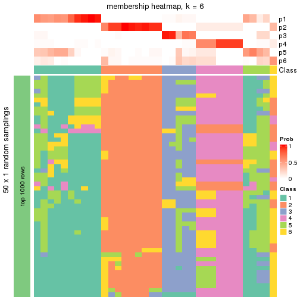</p>

</div>
<div id='tab-node-021-membership-heatmap-6'>
<pre><code class="r">membership_heatmap(res, k = 7)
</code></pre>

<p></p>

</div>
<div id='tab-node-021-membership-heatmap-7'>
<pre><code class="r">membership_heatmap(res, k = 8)
</code></pre>

<p>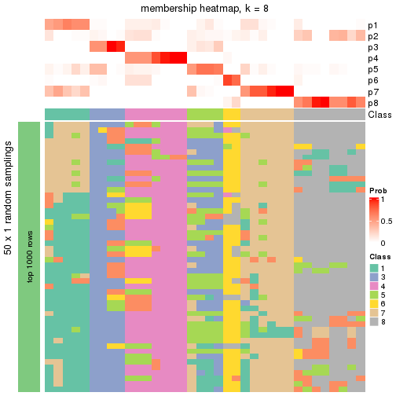</p>

</div>
</div>

As soon as the classes for columns are determined, the signatures
that are significantly different between subgroups can be looked for. 
Following are the heatmaps for signatures.


<script>
$( function() {
	$( '#tabs-node-021-get-signatures' ).tabs();
} );
</script>
<div id='tabs-node-021-get-signatures'>
<ul>
<li><a href='#tab-node-021-get-signatures-1'>k = 2</a></li>
<li><a href='#tab-node-021-get-signatures-2'>k = 3</a></li>
<li><a href='#tab-node-021-get-signatures-3'>k = 4</a></li>
<li><a href='#tab-node-021-get-signatures-4'>k = 5</a></li>
<li><a href='#tab-node-021-get-signatures-5'>k = 6</a></li>
<li><a href='#tab-node-021-get-signatures-6'>k = 7</a></li>
<li><a href='#tab-node-021-get-signatures-7'>k = 8</a></li>
</ul>
<div id='tab-node-021-get-signatures-1'>
<pre><code class="r">get_signatures(res, k = 2)
</code></pre>

<p></p>

</div>
<div id='tab-node-021-get-signatures-2'>
<pre><code class="r">get_signatures(res, k = 3)
</code></pre>

<p>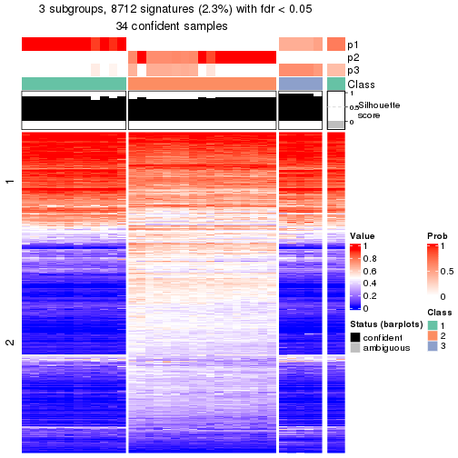</p>

</div>
<div id='tab-node-021-get-signatures-3'>
<pre><code class="r">get_signatures(res, k = 4)
</code></pre>

<p></p>

</div>
<div id='tab-node-021-get-signatures-4'>
<pre><code class="r">get_signatures(res, k = 5)
</code></pre>

<p></p>

</div>
<div id='tab-node-021-get-signatures-5'>
<pre><code class="r">get_signatures(res, k = 6)
</code></pre>

<p></p>

</div>
<div id='tab-node-021-get-signatures-6'>
<pre><code class="r">get_signatures(res, k = 7)
</code></pre>

<p></p>

</div>
<div id='tab-node-021-get-signatures-7'>
<pre><code class="r">get_signatures(res, k = 8)
</code></pre>

<p></p>

</div>
</div>


Compare the overlap of signatures from different k:

```r
compare_signatures(res)
```


`get_signature()` returns a data frame invisibly. To get the list of signatures, the function
call should be assigned to a variable explicitly. In following code, if `plot` argument is set
to `FALSE`, no heatmap is plotted while only the differential analysis is performed.

```r
# code only for demonstration
tb = get_signature(res, k = ..., plot = FALSE)
```

An example of the output of `tb` is:

```
#>   which_row         fdr    mean_1    mean_2 scaled_mean_1 scaled_mean_2 km
#> 1        38 0.042760348  8.373488  9.131774    -0.5533452     0.5164555  1
#> 2        40 0.018707592  7.106213  8.469186    -0.6173731     0.5762149  1
#> 3        55 0.019134737 10.221463 11.207825    -0.6159697     0.5749050  1
#> 4        59 0.006059896  5.921854  7.869574    -0.6899429     0.6439467  1
#> 5        60 0.018055526  8.928898 10.211722    -0.6204761     0.5791110  1
#> 6        98 0.009384629 15.714769 14.887706     0.6635654    -0.6193277  2
...
```

The columns in `tb` are:

1. `which_row`: row indices corresponding to the input matrix.
2. `fdr`: FDR for the differential test. 
3. `mean_x`: The mean value in group x.
4. `scaled_mean_x`: The mean value in group x after rows are scaled.
5. `km`: Row groups if k-means clustering is applied to rows (which is done by automatically selecting number of clusters).

If there are too many signatures, `top_signatures = ...` can be set to only show the 
signatures with the highest FDRs:

```r
# code only for demonstration
# e.g. to show the top 500 most significant rows
tb = get_signature(res, k = ..., top_signatures = 500)
```

If the signatures are defined as these which are uniquely high in current group, `diff_method` argument
can be set to `"uniquely_high_in_one_group"`:

```r
# code only for demonstration
tb = get_signature(res, k = ..., diff_method = "uniquely_high_in_one_group")
```


UMAP plot which shows how samples are separated.


<script>
$( function() {
	$( '#tabs-node-021-dimension-reduction' ).tabs();
} );
</script>
<div id='tabs-node-021-dimension-reduction'>
<ul>
<li><a href='#tab-node-021-dimension-reduction-1'>k = 2</a></li>
<li><a href='#tab-node-021-dimension-reduction-2'>k = 3</a></li>
<li><a href='#tab-node-021-dimension-reduction-3'>k = 4</a></li>
<li><a href='#tab-node-021-dimension-reduction-4'>k = 5</a></li>
<li><a href='#tab-node-021-dimension-reduction-5'>k = 6</a></li>
<li><a href='#tab-node-021-dimension-reduction-6'>k = 7</a></li>
<li><a href='#tab-node-021-dimension-reduction-7'>k = 8</a></li>
</ul>
<div id='tab-node-021-dimension-reduction-1'>
<pre><code class="r">dimension_reduction(res, k = 2, method = &quot;UMAP&quot;)
</code></pre>

<p></p>

</div>
<div id='tab-node-021-dimension-reduction-2'>
<pre><code class="r">dimension_reduction(res, k = 3, method = &quot;UMAP&quot;)
</code></pre>

<p></p>

</div>
<div id='tab-node-021-dimension-reduction-3'>
<pre><code class="r">dimension_reduction(res, k = 4, method = &quot;UMAP&quot;)
</code></pre>

<p></p>

</div>
<div id='tab-node-021-dimension-reduction-4'>
<pre><code class="r">dimension_reduction(res, k = 5, method = &quot;UMAP&quot;)
</code></pre>

<p></p>

</div>
<div id='tab-node-021-dimension-reduction-5'>
<pre><code class="r">dimension_reduction(res, k = 6, method = &quot;UMAP&quot;)
</code></pre>

<p></p>

</div>
<div id='tab-node-021-dimension-reduction-6'>
<pre><code class="r">dimension_reduction(res, k = 7, method = &quot;UMAP&quot;)
</code></pre>

<p></p>

</div>
<div id='tab-node-021-dimension-reduction-7'>
<pre><code class="r">dimension_reduction(res, k = 8, method = &quot;UMAP&quot;)
</code></pre>

<p></p>

</div>
</div>


Following heatmap shows how subgroups are split when increasing `k`:

```r
collect_classes(res)
```


If matrix rows can be associated to genes, consider to use `functional_enrichment(res,
...)` to perform function enrichment for the signature genes. See [this vignette](https://jokergoo.github.io/cola_vignettes/functional_enrichment.html) for more detailed explanations.


 

---------------------------------------------------


### Node0212


Parent node: [Node021](#Node021).
Child nodes: 
                [Node01111](#Node01111)
        ,
                Node01112-leaf
        ,
                Node01113-leaf
        ,
                Node01114-leaf
        ,
                Node01121-leaf
        ,
                Node01122-leaf
        ,
                Node01123-leaf
        ,
                Node01124-leaf
        ,
                Node01211-leaf
        ,
                Node01212-leaf
        ,
                Node01213-leaf
        ,
                Node01221-leaf
        ,
                Node01222-leaf
        ,
                Node01223-leaf
        ,
                Node01224-leaf
        ,
                Node02121-leaf
        ,
                Node02122-leaf
        ,
                Node02123-leaf
        ,
                Node04221-leaf
        ,
                Node04222-leaf
        ,
                Node04223-leaf
        .


The object with results only for a single top-value method and a single partitioning method 
can be extracted as:

```r
res = res_rh["0212"]
```

A summary of `res` and all the functions that can be applied to it:

```r
res
```

```
#> A 'ConsensusPartition' object with k = 2, 3, 4, 5, 6, 7, 8.
#>   On a matrix with 30000 rows and 17 columns.
#>   Top rows (1000) are extracted by 'ATC' method.
#>   Subgroups are detected by 'kmeans' method.
#>   Performed in total 350 partitions by row resampling.
#>   Best k for subgroups seems to be 2.
#> 
#> Following methods can be applied to this 'ConsensusPartition' object:
#>  [1] "cola_report"             "collect_classes"         "collect_plots"          
#>  [4] "collect_stats"           "colnames"                "compare_partitions"     
#>  [7] "compare_signatures"      "consensus_heatmap"       "dimension_reduction"    
#> [10] "functional_enrichment"   "get_anno_col"            "get_anno"               
#> [13] "get_classes"             "get_consensus"           "get_matrix"             
#> [16] "get_membership"          "get_param"               "get_signatures"         
#> [19] "get_stats"               "is_best_k"               "is_stable_k"            
#> [22] "membership_heatmap"      "ncol"                    "nrow"                   
#> [25] "plot_ecdf"               "predict_classes"         "rownames"               
#> [28] "select_partition_number" "show"                    "suggest_best_k"         
#> [31] "test_to_known_factors"   "top_rows_heatmap"
```

`collect_plots()` function collects all the plots made from `res` for all `k` (number of subgroups)
into one single page to provide an easy and fast comparison between different `k`.

```r
collect_plots(res)
```


The plots are:

- The first row: a plot of the eCDF (empirical cumulative distribution
  function) curves of the consensus matrix for each `k` and the heatmap of
  predicted classes for each `k`.
- The second row: heatmaps of the consensus matrix for each `k`.
- The third row: heatmaps of the membership matrix for each `k`.
- The fouth row: heatmaps of the signatures for each `k`.

All the plots in panels can be made by individual functions and they are
plotted later in this section.

`select_partition_number()` produces several plots showing different
statistics for choosing "optimized" `k`. There are following statistics:

- eCDF curves of the consensus matrix for each `k`;
- 1-PAC. [The PAC score](https://en.wikipedia.org/wiki/Consensus_clustering#Over-interpretation_potential_of_consensus_clustering)
  measures the proportion of the ambiguous subgrouping.
- Mean silhouette score.
- Concordance. The mean probability of fiting the consensus subgroup labels in all
  partitions.
- Area increased. Denote $A_k$ as the area under the eCDF curve for current
  `k`, the area increased is defined as $A_k - A_{k-1}$.
- Rand index. The percent of pairs of samples that are both in a same cluster
  or both are not in a same cluster in the partition of k and k-1.
- Jaccard index. The ratio of pairs of samples are both in a same cluster in
  the partition of k and k-1 and the pairs of samples are both in a same
  cluster in the partition k or k-1.

The detailed explanations of these statistics can be found in [the _cola_
vignette](https://jokergoo.github.io/cola_vignettes/cola.html#toc_13).

Generally speaking, higher 1-PAC score, higher mean silhouette score or higher
concordance corresponds to better partition. Rand index and Jaccard index
measure how similar the current partition is compared to partition with `k-1`.
If they are too similar, we won't accept `k` is better than `k-1`.

```r
select_partition_number(res)
```


The numeric values for all these statistics can be obtained by `get_stats()`.

```r
get_stats(res)
```

```
#>   k 1-PAC mean_silhouette concordance area_increased  Rand Jaccard
#> 2 2 1.000           1.000       1.000         0.4858 0.515   0.515
#> 3 3 0.735           0.976       0.944         0.3752 0.794   0.600
#> 4 4 0.860           0.891       0.894         0.1283 0.941   0.810
#> 5 5 0.787           0.879       0.867         0.0665 0.926   0.706
#> 6 6 0.846           0.586       0.800         0.0494 0.919   0.607
#> 7 7 0.809           0.747       0.814         0.0340 0.941   0.652
#> 8 8 0.868           0.679       0.834         0.0243 1.000   1.000
```

`suggest_best_k()` suggests the best $k$ based on these statistics. The rules are as follows:

- All $k$ with Jaccard index larger than 0.95 are removed because increasing
  $k$ does not provide enough extra information. If all $k$ are removed, it is
  marked as no subgroup is detected.
- For all $k$ with 1-PAC score larger than 0.9, the maximal $k$ is taken as
  the best $k$, and other $k$ are marked as optional $k$.
- If it does not fit the second rule. The $k$ with the maximal vote of the
  highest 1-PAC score, highest mean silhouette, and highest concordance is
  taken as the best $k$.

```r
suggest_best_k(res)
```

```
#> [1] 2
```


Following is the table of the partitions (You need to click the **show/hide
code output** link to see it). The membership matrix (columns with name `p*`)
is inferred by
[`clue::cl_consensus()`](https://www.rdocumentation.org/link/cl_consensus?package=clue)
function with the `SE` method. Basically the value in the membership matrix
represents the probability to belong to a certain group. The finall subgroup
label for an item is determined with the group with highest probability it
belongs to.

In `get_classes()` function, the entropy is calculated from the membership
matrix and the silhouette score is calculated from the consensus matrix.


<script>
$( function() {
	$( '#tabs-node-0212-get-classes' ).tabs();
} );
</script>
<div id='tabs-node-0212-get-classes'>
<ul>
<li><a href='#tab-node-0212-get-classes-1'>k = 2</a></li>
<li><a href='#tab-node-0212-get-classes-2'>k = 3</a></li>
<li><a href='#tab-node-0212-get-classes-3'>k = 4</a></li>
<li><a href='#tab-node-0212-get-classes-4'>k = 5</a></li>
<li><a href='#tab-node-0212-get-classes-5'>k = 6</a></li>
<li><a href='#tab-node-0212-get-classes-6'>k = 7</a></li>
<li><a href='#tab-node-0212-get-classes-7'>k = 8</a></li>
</ul>

<div id='tab-node-0212-get-classes-1'>
<p><a id='tab-node-0212-get-classes-1-a' style='color:#0366d6' href='#'>show/hide code output</a></p>
<pre><code class="r">cbind(get_classes(res, k = 2), get_membership(res, k = 2))
</code></pre>

<pre><code>#&gt;                 class entropy silhouette p1 p2
#&gt; TCGA.A6.2681.11     1       0          1  1  0
#&gt; TCGA.A6.2680.11     1       0          1  1  0
#&gt; TCGA.AZ.6598.11     2       0          1  0  1
#&gt; TCGA.AG.A020.11     2       0          1  0  1
#&gt; TCGA.G4.6625.11     2       0          1  0  1
#&gt; TCGA.AG.A01Y.11     2       0          1  0  1
#&gt; TCGA.A6.2684.11     1       0          1  1  0
#&gt; TCGA.G4.6314.11     1       0          1  1  0
#&gt; TCGA.AG.3725.11     2       0          1  0  1
#&gt; TCGA.A6.5667.11     2       0          1  0  1
#&gt; TCGA.A6.2685.11     2       0          1  0  1
#&gt; TCGA.AA.3660.11     2       0          1  0  1
#&gt; TCGA.G4.6297.11     2       0          1  0  1
#&gt; TCGA.AA.3509.11     2       0          1  0  1
#&gt; TCGA.A6.2686.11     1       0          1  1  0
#&gt; TCGA.AG.A01W.11     2       0          1  0  1
#&gt; TCGA.AA.3492.11     1       0          1  1  0
</code></pre>

<script>
$('#tab-node-0212-get-classes-1-a').parent().next().next().hide();
$('#tab-node-0212-get-classes-1-a').click(function(){
  $('#tab-node-0212-get-classes-1-a').parent().next().next().toggle();
  return(false);
});
</script>
</div>

<div id='tab-node-0212-get-classes-2'>
<p><a id='tab-node-0212-get-classes-2-a' style='color:#0366d6' href='#'>show/hide code output</a></p>
<pre><code class="r">cbind(get_classes(res, k = 3), get_membership(res, k = 3))
</code></pre>

<pre><code>#&gt;                 class entropy silhouette   p1   p2   p3
#&gt; TCGA.A6.2681.11     1     0.0      0.949 1.00 0.00 0.00
#&gt; TCGA.A6.2680.11     1     0.4      0.895 0.84 0.00 0.16
#&gt; TCGA.AZ.6598.11     2     0.0      1.000 0.00 1.00 0.00
#&gt; TCGA.AG.A020.11     3     0.4      1.000 0.00 0.16 0.84
#&gt; TCGA.G4.6625.11     2     0.0      1.000 0.00 1.00 0.00
#&gt; TCGA.AG.A01Y.11     3     0.4      1.000 0.00 0.16 0.84
#&gt; TCGA.A6.2684.11     1     0.0      0.949 1.00 0.00 0.00
#&gt; TCGA.G4.6314.11     1     0.0      0.949 1.00 0.00 0.00
#&gt; TCGA.AG.3725.11     2     0.0      1.000 0.00 1.00 0.00
#&gt; TCGA.A6.5667.11     2     0.0      1.000 0.00 1.00 0.00
#&gt; TCGA.A6.2685.11     2     0.0      1.000 0.00 1.00 0.00
#&gt; TCGA.AA.3660.11     2     0.0      1.000 0.00 1.00 0.00
#&gt; TCGA.G4.6297.11     2     0.0      1.000 0.00 1.00 0.00
#&gt; TCGA.AA.3509.11     3     0.4      1.000 0.00 0.16 0.84
#&gt; TCGA.A6.2686.11     1     0.0      0.949 1.00 0.00 0.00
#&gt; TCGA.AG.A01W.11     3     0.4      1.000 0.00 0.16 0.84
#&gt; TCGA.AA.3492.11     1     0.4      0.895 0.84 0.00 0.16
</code></pre>

<script>
$('#tab-node-0212-get-classes-2-a').parent().next().next().hide();
$('#tab-node-0212-get-classes-2-a').click(function(){
  $('#tab-node-0212-get-classes-2-a').parent().next().next().toggle();
  return(false);
});
</script>
</div>

<div id='tab-node-0212-get-classes-3'>
<p><a id='tab-node-0212-get-classes-3-a' style='color:#0366d6' href='#'>show/hide code output</a></p>
<pre><code class="r">cbind(get_classes(res, k = 4), get_membership(res, k = 4))
</code></pre>

<pre><code>#&gt;                 class entropy silhouette   p1   p2 p3   p4
#&gt; TCGA.A6.2681.11     1   0.491      1.000 0.58 0.00  0 0.42
#&gt; TCGA.A6.2680.11     4   0.000      0.781 0.00 0.00  0 1.00
#&gt; TCGA.AZ.6598.11     2   0.491      0.634 0.42 0.58  0 0.00
#&gt; TCGA.AG.A020.11     3   0.000      1.000 0.00 0.00  1 0.00
#&gt; TCGA.G4.6625.11     2   0.000      0.872 0.00 1.00  0 0.00
#&gt; TCGA.AG.A01Y.11     3   0.000      1.000 0.00 0.00  1 0.00
#&gt; TCGA.A6.2684.11     1   0.491      1.000 0.58 0.00  0 0.42
#&gt; TCGA.G4.6314.11     1   0.491      1.000 0.58 0.00  0 0.42
#&gt; TCGA.AG.3725.11     2   0.000      0.872 0.00 1.00  0 0.00
#&gt; TCGA.A6.5667.11     2   0.000      0.872 0.00 1.00  0 0.00
#&gt; TCGA.A6.2685.11     2   0.000      0.872 0.00 1.00  0 0.00
#&gt; TCGA.AA.3660.11     2   0.000      0.872 0.00 1.00  0 0.00
#&gt; TCGA.G4.6297.11     2   0.491      0.634 0.42 0.58  0 0.00
#&gt; TCGA.AA.3509.11     3   0.000      1.000 0.00 0.00  1 0.00
#&gt; TCGA.A6.2686.11     1   0.491      1.000 0.58 0.00  0 0.42
#&gt; TCGA.AG.A01W.11     3   0.000      1.000 0.00 0.00  1 0.00
#&gt; TCGA.AA.3492.11     4   0.265      0.739 0.12 0.00  0 0.88
</code></pre>

<script>
$('#tab-node-0212-get-classes-3-a').parent().next().next().hide();
$('#tab-node-0212-get-classes-3-a').click(function(){
  $('#tab-node-0212-get-classes-3-a').parent().next().next().toggle();
  return(false);
});
</script>
</div>

<div id='tab-node-0212-get-classes-4'>
<p><a id='tab-node-0212-get-classes-4-a' style='color:#0366d6' href='#'>show/hide code output</a></p>
<pre><code class="r">cbind(get_classes(res, k = 5), get_membership(res, k = 5))
</code></pre>

<pre><code>#&gt;                 class entropy silhouette   p1   p2   p3   p4   p5
#&gt; TCGA.A6.2681.11     1  0.4227      1.000 0.58 0.00 0.00 0.42 0.00
#&gt; TCGA.A6.2680.11     4  0.0000      0.647 0.00 0.00 0.00 1.00 0.00
#&gt; TCGA.AZ.6598.11     5  0.2280      1.000 0.00 0.12 0.00 0.00 0.88
#&gt; TCGA.AG.A020.11     3  0.3561      0.846 0.26 0.00 0.74 0.00 0.00
#&gt; TCGA.G4.6625.11     2  0.2516      0.858 0.14 0.86 0.00 0.00 0.00
#&gt; TCGA.AG.A01Y.11     3  0.0000      0.846 0.00 0.00 1.00 0.00 0.00
#&gt; TCGA.A6.2684.11     1  0.4227      1.000 0.58 0.00 0.00 0.42 0.00
#&gt; TCGA.G4.6314.11     1  0.4227      1.000 0.58 0.00 0.00 0.42 0.00
#&gt; TCGA.AG.3725.11     2  0.3274      0.801 0.22 0.78 0.00 0.00 0.00
#&gt; TCGA.A6.5667.11     2  0.0000      0.902 0.00 1.00 0.00 0.00 0.00
#&gt; TCGA.A6.2685.11     2  0.0609      0.901 0.02 0.98 0.00 0.00 0.00
#&gt; TCGA.AA.3660.11     2  0.0609      0.901 0.02 0.98 0.00 0.00 0.00
#&gt; TCGA.G4.6297.11     5  0.2280      1.000 0.00 0.12 0.00 0.00 0.88
#&gt; TCGA.AA.3509.11     3  0.0000      0.846 0.00 0.00 1.00 0.00 0.00
#&gt; TCGA.A6.2686.11     1  0.4227      1.000 0.58 0.00 0.00 0.42 0.00
#&gt; TCGA.AG.A01W.11     3  0.3561      0.846 0.26 0.00 0.74 0.00 0.00
#&gt; TCGA.AA.3492.11     4  0.4676      0.553 0.14 0.00 0.00 0.74 0.12
</code></pre>

<script>
$('#tab-node-0212-get-classes-4-a').parent().next().next().hide();
$('#tab-node-0212-get-classes-4-a').click(function(){
  $('#tab-node-0212-get-classes-4-a').parent().next().next().toggle();
  return(false);
});
</script>
</div>

<div id='tab-node-0212-get-classes-5'>
<p><a id='tab-node-0212-get-classes-5-a' style='color:#0366d6' href='#'>show/hide code output</a></p>
<pre><code class="r">cbind(get_classes(res, k = 6), get_membership(res, k = 6))
</code></pre>

<pre><code>#&gt;                 class entropy silhouette   p1   p2   p3   p4   p5   p6
#&gt; TCGA.A6.2681.11     1  0.0000      0.756 1.00 0.00 0.00 0.00 0.00 0.00
#&gt; TCGA.A6.2680.11     4  0.3578      0.000 0.34 0.00 0.00 0.66 0.00 0.00
#&gt; TCGA.AZ.6598.11     5  0.0547      1.000 0.00 0.02 0.00 0.00 0.98 0.00
#&gt; TCGA.AG.A020.11     3  0.5422      0.767 0.00 0.02 0.62 0.24 0.00 0.12
#&gt; TCGA.G4.6625.11     2  0.0547      0.572 0.00 0.98 0.00 0.00 0.00 0.02
#&gt; TCGA.AG.A01Y.11     3  0.0000      0.767 0.00 0.00 1.00 0.00 0.00 0.00
#&gt; TCGA.A6.2684.11     1  0.0547      0.756 0.98 0.00 0.00 0.00 0.02 0.00
#&gt; TCGA.G4.6314.11     1  0.0000      0.756 1.00 0.00 0.00 0.00 0.00 0.00
#&gt; TCGA.AG.3725.11     2  0.0000      0.570 0.00 1.00 0.00 0.00 0.00 0.00
#&gt; TCGA.A6.5667.11     2  0.5285     -0.602 0.00 0.48 0.00 0.10 0.00 0.42
#&gt; TCGA.A6.2685.11     6  0.3647      1.000 0.00 0.36 0.00 0.00 0.00 0.64
#&gt; TCGA.AA.3660.11     6  0.3647      1.000 0.00 0.36 0.00 0.00 0.00 0.64
#&gt; TCGA.G4.6297.11     5  0.0547      1.000 0.00 0.02 0.00 0.00 0.98 0.00
#&gt; TCGA.AA.3509.11     3  0.0000      0.767 0.00 0.00 1.00 0.00 0.00 0.00
#&gt; TCGA.A6.2686.11     1  0.0547      0.756 0.98 0.00 0.00 0.00 0.02 0.00
#&gt; TCGA.AG.A01W.11     3  0.5422      0.767 0.00 0.02 0.62 0.24 0.00 0.12
#&gt; TCGA.AA.3492.11     1  0.6010     -0.679 0.40 0.00 0.00 0.36 0.00 0.24
</code></pre>

<script>
$('#tab-node-0212-get-classes-5-a').parent().next().next().hide();
$('#tab-node-0212-get-classes-5-a').click(function(){
  $('#tab-node-0212-get-classes-5-a').parent().next().next().toggle();
  return(false);
});
</script>
</div>

<div id='tab-node-0212-get-classes-6'>
<p><a id='tab-node-0212-get-classes-6-a' style='color:#0366d6' href='#'>show/hide code output</a></p>
<pre><code class="r">cbind(get_classes(res, k = 7), get_membership(res, k = 7))
</code></pre>

<pre><code>#&gt;                 class entropy silhouette   p1   p2   p3   p4   p5   p6   p7
#&gt; TCGA.A6.2681.11     1  0.1671      0.913 0.90 0.10 0.00 0.00 0.00 0.00 0.00
#&gt; TCGA.A6.2680.11     4  0.1886      0.000 0.12 0.00 0.00 0.88 0.00 0.00 0.00
#&gt; TCGA.AZ.6598.11     5  0.0504      1.000 0.00 0.00 0.00 0.00 0.98 0.02 0.00
#&gt; TCGA.AG.A020.11     3  0.0000      0.737 0.00 0.00 1.00 0.00 0.00 0.00 0.00
#&gt; TCGA.G4.6625.11     2  0.2708      0.845 0.00 0.78 0.00 0.00 0.00 0.22 0.00
#&gt; TCGA.AG.A01Y.11     3  0.3413      0.737 0.00 0.00 0.62 0.00 0.00 0.00 0.38
#&gt; TCGA.A6.2684.11     1  0.0504      0.907 0.98 0.02 0.00 0.00 0.00 0.00 0.00
#&gt; TCGA.G4.6314.11     1  0.1671      0.913 0.90 0.10 0.00 0.00 0.00 0.00 0.00
#&gt; TCGA.AG.3725.11     2  0.4696      0.853 0.00 0.70 0.06 0.08 0.00 0.16 0.00
#&gt; TCGA.A6.5667.11     6  0.3863      0.694 0.00 0.04 0.00 0.02 0.00 0.74 0.20
#&gt; TCGA.A6.2685.11     6  0.0000      0.861 0.00 0.00 0.00 0.00 0.00 1.00 0.00
#&gt; TCGA.AA.3660.11     6  0.0000      0.861 0.00 0.00 0.00 0.00 0.00 1.00 0.00
#&gt; TCGA.G4.6297.11     5  0.0504      1.000 0.00 0.00 0.00 0.00 0.98 0.02 0.00
#&gt; TCGA.AA.3509.11     3  0.3459      0.733 0.00 0.00 0.60 0.00 0.00 0.00 0.40
#&gt; TCGA.A6.2686.11     1  0.0504      0.907 0.98 0.00 0.00 0.00 0.02 0.00 0.00
#&gt; TCGA.AG.A01W.11     3  0.0504      0.733 0.00 0.00 0.98 0.02 0.00 0.00 0.00
#&gt; TCGA.AA.3492.11     7  0.6527      0.000 0.18 0.10 0.00 0.32 0.00 0.00 0.40
</code></pre>

<script>
$('#tab-node-0212-get-classes-6-a').parent().next().next().hide();
$('#tab-node-0212-get-classes-6-a').click(function(){
  $('#tab-node-0212-get-classes-6-a').parent().next().next().toggle();
  return(false);
});
</script>
</div>

<div id='tab-node-0212-get-classes-7'>
<p><a id='tab-node-0212-get-classes-7-a' style='color:#0366d6' href='#'>show/hide code output</a></p>
<pre><code class="r">cbind(get_classes(res, k = 8), get_membership(res, k = 8))
</code></pre>

<pre><code>#&gt;                 class entropy silhouette   p1   p2   p3   p4   p5   p6   p7   p8
#&gt; TCGA.A6.2681.11     1  0.0000      0.742 1.00 0.00 0.00 0.00 0.00 0.00 0.00 0.00
#&gt; TCGA.A6.2680.11     8  0.3036      0.000 0.04 0.00 0.00 0.00 0.00 0.00 0.18 0.78
#&gt; TCGA.AZ.6598.11     5  0.1804      0.934 0.00 0.00 0.00 0.08 0.90 0.02 0.00 0.00
#&gt; TCGA.AG.A020.11     3  0.3570      0.699 0.00 0.02 0.62 0.36 0.00 0.00 0.00 0.00
#&gt; TCGA.G4.6625.11     2  0.2114      0.907 0.00 0.84 0.00 0.00 0.00 0.16 0.00 0.00
#&gt; TCGA.AG.A01Y.11     3  0.0000      0.699 0.00 0.00 1.00 0.00 0.00 0.00 0.00 0.00
#&gt; TCGA.A6.2684.11     1  0.3922      0.736 0.64 0.06 0.00 0.30 0.00 0.00 0.00 0.00
#&gt; TCGA.G4.6314.11     1  0.0941      0.742 0.96 0.02 0.00 0.00 0.02 0.00 0.00 0.00
#&gt; TCGA.AG.3725.11     2  0.3444      0.909 0.00 0.78 0.00 0.06 0.00 0.14 0.02 0.00
#&gt; TCGA.A6.5667.11     6  0.5407      0.537 0.00 0.08 0.00 0.12 0.00 0.62 0.02 0.16
#&gt; TCGA.A6.2685.11     6  0.0000      0.803 0.00 0.00 0.00 0.00 0.00 1.00 0.00 0.00
#&gt; TCGA.AA.3660.11     6  0.0000      0.803 0.00 0.00 0.00 0.00 0.00 1.00 0.00 0.00
#&gt; TCGA.G4.6297.11     5  0.0471      0.934 0.00 0.00 0.00 0.00 0.98 0.02 0.00 0.00
#&gt; TCGA.AA.3509.11     3  0.1557      0.680 0.00 0.00 0.92 0.00 0.00 0.00 0.02 0.06
#&gt; TCGA.A6.2686.11     1  0.4244      0.736 0.64 0.12 0.00 0.24 0.00 0.00 0.00 0.00
#&gt; TCGA.AG.A01W.11     3  0.3714      0.680 0.00 0.02 0.54 0.44 0.00 0.00 0.00 0.00
#&gt; TCGA.AA.3492.11     7  0.1091      0.000 0.06 0.00 0.00 0.00 0.00 0.00 0.94 0.00
</code></pre>

<script>
$('#tab-node-0212-get-classes-7-a').parent().next().next().hide();
$('#tab-node-0212-get-classes-7-a').click(function(){
  $('#tab-node-0212-get-classes-7-a').parent().next().next().toggle();
  return(false);
});
</script>
</div>
</div>

Heatmaps for the consensus matrix. It visualizes the probability of two
samples to be in a same group.


<script>
$( function() {
	$( '#tabs-node-0212-consensus-heatmap' ).tabs();
} );
</script>
<div id='tabs-node-0212-consensus-heatmap'>
<ul>
<li><a href='#tab-node-0212-consensus-heatmap-1'>k = 2</a></li>
<li><a href='#tab-node-0212-consensus-heatmap-2'>k = 3</a></li>
<li><a href='#tab-node-0212-consensus-heatmap-3'>k = 4</a></li>
<li><a href='#tab-node-0212-consensus-heatmap-4'>k = 5</a></li>
<li><a href='#tab-node-0212-consensus-heatmap-5'>k = 6</a></li>
<li><a href='#tab-node-0212-consensus-heatmap-6'>k = 7</a></li>
<li><a href='#tab-node-0212-consensus-heatmap-7'>k = 8</a></li>
</ul>
<div id='tab-node-0212-consensus-heatmap-1'>
<pre><code class="r">consensus_heatmap(res, k = 2)
</code></pre>

<p></p>

</div>
<div id='tab-node-0212-consensus-heatmap-2'>
<pre><code class="r">consensus_heatmap(res, k = 3)
</code></pre>

<p></p>

</div>
<div id='tab-node-0212-consensus-heatmap-3'>
<pre><code class="r">consensus_heatmap(res, k = 4)
</code></pre>

<p></p>

</div>
<div id='tab-node-0212-consensus-heatmap-4'>
<pre><code class="r">consensus_heatmap(res, k = 5)
</code></pre>

<p></p>

</div>
<div id='tab-node-0212-consensus-heatmap-5'>
<pre><code class="r">consensus_heatmap(res, k = 6)
</code></pre>

<p></p>

</div>
<div id='tab-node-0212-consensus-heatmap-6'>
<pre><code class="r">consensus_heatmap(res, k = 7)
</code></pre>

<p></p>

</div>
<div id='tab-node-0212-consensus-heatmap-7'>
<pre><code class="r">consensus_heatmap(res, k = 8)
</code></pre>

<p></p>

</div>
</div>

Heatmaps for the membership of samples in all partitions to see how consistent they are:


<script>
$( function() {
	$( '#tabs-node-0212-membership-heatmap' ).tabs();
} );
</script>
<div id='tabs-node-0212-membership-heatmap'>
<ul>
<li><a href='#tab-node-0212-membership-heatmap-1'>k = 2</a></li>
<li><a href='#tab-node-0212-membership-heatmap-2'>k = 3</a></li>
<li><a href='#tab-node-0212-membership-heatmap-3'>k = 4</a></li>
<li><a href='#tab-node-0212-membership-heatmap-4'>k = 5</a></li>
<li><a href='#tab-node-0212-membership-heatmap-5'>k = 6</a></li>
<li><a href='#tab-node-0212-membership-heatmap-6'>k = 7</a></li>
<li><a href='#tab-node-0212-membership-heatmap-7'>k = 8</a></li>
</ul>
<div id='tab-node-0212-membership-heatmap-1'>
<pre><code class="r">membership_heatmap(res, k = 2)
</code></pre>

<p></p>

</div>
<div id='tab-node-0212-membership-heatmap-2'>
<pre><code class="r">membership_heatmap(res, k = 3)
</code></pre>

<p></p>

</div>
<div id='tab-node-0212-membership-heatmap-3'>
<pre><code class="r">membership_heatmap(res, k = 4)
</code></pre>

<p></p>

</div>
<div id='tab-node-0212-membership-heatmap-4'>
<pre><code class="r">membership_heatmap(res, k = 5)
</code></pre>

<p></p>

</div>
<div id='tab-node-0212-membership-heatmap-5'>
<pre><code class="r">membership_heatmap(res, k = 6)
</code></pre>

<p></p>

</div>
<div id='tab-node-0212-membership-heatmap-6'>
<pre><code class="r">membership_heatmap(res, k = 7)
</code></pre>

<p></p>

</div>
<div id='tab-node-0212-membership-heatmap-7'>
<pre><code class="r">membership_heatmap(res, k = 8)
</code></pre>

<p></p>

</div>
</div>

As soon as the classes for columns are determined, the signatures
that are significantly different between subgroups can be looked for. 
Following are the heatmaps for signatures.


<script>
$( function() {
	$( '#tabs-node-0212-get-signatures' ).tabs();
} );
</script>
<div id='tabs-node-0212-get-signatures'>
<ul>
<li><a href='#tab-node-0212-get-signatures-1'>k = 2</a></li>
<li><a href='#tab-node-0212-get-signatures-2'>k = 3</a></li>
<li><a href='#tab-node-0212-get-signatures-3'>k = 4</a></li>
<li><a href='#tab-node-0212-get-signatures-4'>k = 5</a></li>
<li><a href='#tab-node-0212-get-signatures-5'>k = 6</a></li>
<li><a href='#tab-node-0212-get-signatures-6'>k = 7</a></li>
<li><a href='#tab-node-0212-get-signatures-7'>k = 8</a></li>
</ul>
<div id='tab-node-0212-get-signatures-1'>
<pre><code class="r">get_signatures(res, k = 2)
</code></pre>

<p>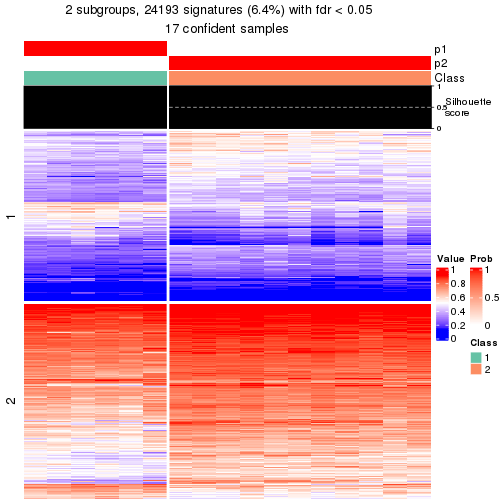</p>

</div>
<div id='tab-node-0212-get-signatures-2'>
<pre><code class="r">get_signatures(res, k = 3)
</code></pre>

<p></p>

</div>
<div id='tab-node-0212-get-signatures-3'>
<pre><code class="r">get_signatures(res, k = 4)
</code></pre>

<p>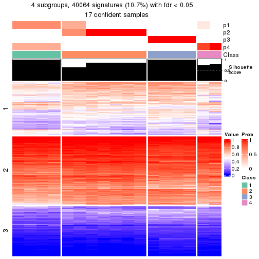</p>

</div>
<div id='tab-node-0212-get-signatures-4'>
<pre><code class="r">get_signatures(res, k = 5)
</code></pre>

<p></p>

</div>
<div id='tab-node-0212-get-signatures-5'>
<pre><code class="r">get_signatures(res, k = 6)
</code></pre>

<p></p>

</div>
<div id='tab-node-0212-get-signatures-6'>
<pre><code class="r">get_signatures(res, k = 7)
</code></pre>

<p>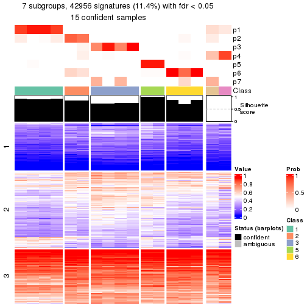</p>

</div>
<div id='tab-node-0212-get-signatures-7'>
<pre><code class="r">get_signatures(res, k = 8)
</code></pre>

<p></p>

</div>
</div>


Compare the overlap of signatures from different k:

```r
compare_signatures(res)
```


`get_signature()` returns a data frame invisibly. To get the list of signatures, the function
call should be assigned to a variable explicitly. In following code, if `plot` argument is set
to `FALSE`, no heatmap is plotted while only the differential analysis is performed.

```r
# code only for demonstration
tb = get_signature(res, k = ..., plot = FALSE)
```

An example of the output of `tb` is:

```
#>   which_row         fdr    mean_1    mean_2 scaled_mean_1 scaled_mean_2 km
#> 1        38 0.042760348  8.373488  9.131774    -0.5533452     0.5164555  1
#> 2        40 0.018707592  7.106213  8.469186    -0.6173731     0.5762149  1
#> 3        55 0.019134737 10.221463 11.207825    -0.6159697     0.5749050  1
#> 4        59 0.006059896  5.921854  7.869574    -0.6899429     0.6439467  1
#> 5        60 0.018055526  8.928898 10.211722    -0.6204761     0.5791110  1
#> 6        98 0.009384629 15.714769 14.887706     0.6635654    -0.6193277  2
...
```

The columns in `tb` are:

1. `which_row`: row indices corresponding to the input matrix.
2. `fdr`: FDR for the differential test. 
3. `mean_x`: The mean value in group x.
4. `scaled_mean_x`: The mean value in group x after rows are scaled.
5. `km`: Row groups if k-means clustering is applied to rows (which is done by automatically selecting number of clusters).

If there are too many signatures, `top_signatures = ...` can be set to only show the 
signatures with the highest FDRs:

```r
# code only for demonstration
# e.g. to show the top 500 most significant rows
tb = get_signature(res, k = ..., top_signatures = 500)
```

If the signatures are defined as these which are uniquely high in current group, `diff_method` argument
can be set to `"uniquely_high_in_one_group"`:

```r
# code only for demonstration
tb = get_signature(res, k = ..., diff_method = "uniquely_high_in_one_group")
```


UMAP plot which shows how samples are separated.


<script>
$( function() {
	$( '#tabs-node-0212-dimension-reduction' ).tabs();
} );
</script>
<div id='tabs-node-0212-dimension-reduction'>
<ul>
<li><a href='#tab-node-0212-dimension-reduction-1'>k = 2</a></li>
<li><a href='#tab-node-0212-dimension-reduction-2'>k = 3</a></li>
<li><a href='#tab-node-0212-dimension-reduction-3'>k = 4</a></li>
<li><a href='#tab-node-0212-dimension-reduction-4'>k = 5</a></li>
<li><a href='#tab-node-0212-dimension-reduction-5'>k = 6</a></li>
<li><a href='#tab-node-0212-dimension-reduction-6'>k = 7</a></li>
<li><a href='#tab-node-0212-dimension-reduction-7'>k = 8</a></li>
</ul>
<div id='tab-node-0212-dimension-reduction-1'>
<pre><code class="r">dimension_reduction(res, k = 2, method = &quot;UMAP&quot;)
</code></pre>

<p></p>

</div>
<div id='tab-node-0212-dimension-reduction-2'>
<pre><code class="r">dimension_reduction(res, k = 3, method = &quot;UMAP&quot;)
</code></pre>

<p></p>

</div>
<div id='tab-node-0212-dimension-reduction-3'>
<pre><code class="r">dimension_reduction(res, k = 4, method = &quot;UMAP&quot;)
</code></pre>

<p></p>

</div>
<div id='tab-node-0212-dimension-reduction-4'>
<pre><code class="r">dimension_reduction(res, k = 5, method = &quot;UMAP&quot;)
</code></pre>

<p></p>

</div>
<div id='tab-node-0212-dimension-reduction-5'>
<pre><code class="r">dimension_reduction(res, k = 6, method = &quot;UMAP&quot;)
</code></pre>

<p></p>

</div>
<div id='tab-node-0212-dimension-reduction-6'>
<pre><code class="r">dimension_reduction(res, k = 7, method = &quot;UMAP&quot;)
</code></pre>

<p></p>

</div>
<div id='tab-node-0212-dimension-reduction-7'>
<pre><code class="r">dimension_reduction(res, k = 8, method = &quot;UMAP&quot;)
</code></pre>

<p></p>

</div>
</div>


Following heatmap shows how subgroups are split when increasing `k`:

```r
collect_classes(res)
```


If matrix rows can be associated to genes, consider to use `functional_enrichment(res,
...)` to perform function enrichment for the signature genes. See [this vignette](https://jokergoo.github.io/cola_vignettes/functional_enrichment.html) for more detailed explanations.


 

---------------------------------------------------


### Node04


Parent node: [Node0](#Node0).
Child nodes: 
                [Node011](#Node011)
        ,
                [Node012](#Node012)
        ,
                [Node021](#Node021)
        ,
                Node022-leaf
        ,
                Node023-leaf
        ,
                [Node041](#Node041)
        ,
                [Node042](#Node042)
        ,
                [Node043](#Node043)
        .


The object with results only for a single top-value method and a single partitioning method 
can be extracted as:

```r
res = res_rh["04"]
```

A summary of `res` and all the functions that can be applied to it:

```r
res
```

```
#> A 'ConsensusPartition' object with k = 2, 3, 4, 5, 6, 7, 8.
#>   On a matrix with 30000 rows and 82 columns.
#>   Top rows (1000) are extracted by 'ATC' method.
#>   Subgroups are detected by 'kmeans' method.
#>   Performed in total 350 partitions by row resampling.
#>   Best k for subgroups seems to be 3.
#> 
#> Following methods can be applied to this 'ConsensusPartition' object:
#>  [1] "cola_report"             "collect_classes"         "collect_plots"          
#>  [4] "collect_stats"           "colnames"                "compare_partitions"     
#>  [7] "compare_signatures"      "consensus_heatmap"       "dimension_reduction"    
#> [10] "functional_enrichment"   "get_anno_col"            "get_anno"               
#> [13] "get_classes"             "get_consensus"           "get_matrix"             
#> [16] "get_membership"          "get_param"               "get_signatures"         
#> [19] "get_stats"               "is_best_k"               "is_stable_k"            
#> [22] "membership_heatmap"      "ncol"                    "nrow"                   
#> [25] "plot_ecdf"               "predict_classes"         "rownames"               
#> [28] "select_partition_number" "show"                    "suggest_best_k"         
#> [31] "test_to_known_factors"   "top_rows_heatmap"
```

`collect_plots()` function collects all the plots made from `res` for all `k` (number of subgroups)
into one single page to provide an easy and fast comparison between different `k`.

```r
collect_plots(res)
```


The plots are:

- The first row: a plot of the eCDF (empirical cumulative distribution
  function) curves of the consensus matrix for each `k` and the heatmap of
  predicted classes for each `k`.
- The second row: heatmaps of the consensus matrix for each `k`.
- The third row: heatmaps of the membership matrix for each `k`.
- The fouth row: heatmaps of the signatures for each `k`.

All the plots in panels can be made by individual functions and they are
plotted later in this section.

`select_partition_number()` produces several plots showing different
statistics for choosing "optimized" `k`. There are following statistics:

- eCDF curves of the consensus matrix for each `k`;
- 1-PAC. [The PAC score](https://en.wikipedia.org/wiki/Consensus_clustering#Over-interpretation_potential_of_consensus_clustering)
  measures the proportion of the ambiguous subgrouping.
- Mean silhouette score.
- Concordance. The mean probability of fiting the consensus subgroup labels in all
  partitions.
- Area increased. Denote $A_k$ as the area under the eCDF curve for current
  `k`, the area increased is defined as $A_k - A_{k-1}$.
- Rand index. The percent of pairs of samples that are both in a same cluster
  or both are not in a same cluster in the partition of k and k-1.
- Jaccard index. The ratio of pairs of samples are both in a same cluster in
  the partition of k and k-1 and the pairs of samples are both in a same
  cluster in the partition k or k-1.

The detailed explanations of these statistics can be found in [the _cola_
vignette](https://jokergoo.github.io/cola_vignettes/cola.html#toc_13).

Generally speaking, higher 1-PAC score, higher mean silhouette score or higher
concordance corresponds to better partition. Rand index and Jaccard index
measure how similar the current partition is compared to partition with `k-1`.
If they are too similar, we won't accept `k` is better than `k-1`.

```r
select_partition_number(res)
```


The numeric values for all these statistics can be obtained by `get_stats()`.

```r
get_stats(res)
```

```
#>   k 1-PAC mean_silhouette concordance area_increased  Rand Jaccard
#> 2 2 1.000           0.986       0.992         0.4961 0.505   0.505
#> 3 3 1.000           0.959       0.982         0.3216 0.773   0.580
#> 4 4 0.771           0.684       0.770         0.1227 0.877   0.664
#> 5 5 0.737           0.673       0.836         0.0705 0.860   0.542
#> 6 6 0.747           0.721       0.830         0.0419 0.900   0.583
#> 7 7 0.788           0.715       0.826         0.0271 0.947   0.717
#> 8 8 0.814           0.681       0.814         0.0195 0.978   0.861
```

`suggest_best_k()` suggests the best $k$ based on these statistics. The rules are as follows:

- All $k$ with Jaccard index larger than 0.95 are removed because increasing
  $k$ does not provide enough extra information. If all $k$ are removed, it is
  marked as no subgroup is detected.
- For all $k$ with 1-PAC score larger than 0.9, the maximal $k$ is taken as
  the best $k$, and other $k$ are marked as optional $k$.
- If it does not fit the second rule. The $k$ with the maximal vote of the
  highest 1-PAC score, highest mean silhouette, and highest concordance is
  taken as the best $k$.

```r
suggest_best_k(res)
```

```
#> [1] 3
#> attr(,"optional")
#> [1] 2
```

There is also optional best $k$ = 2 that is worth to check.

Following is the table of the partitions (You need to click the **show/hide
code output** link to see it). The membership matrix (columns with name `p*`)
is inferred by
[`clue::cl_consensus()`](https://www.rdocumentation.org/link/cl_consensus?package=clue)
function with the `SE` method. Basically the value in the membership matrix
represents the probability to belong to a certain group. The finall subgroup
label for an item is determined with the group with highest probability it
belongs to.

In `get_classes()` function, the entropy is calculated from the membership
matrix and the silhouette score is calculated from the consensus matrix.


<script>
$( function() {
	$( '#tabs-node-04-get-classes' ).tabs();
} );
</script>
<div id='tabs-node-04-get-classes'>
<ul>
<li><a href='#tab-node-04-get-classes-1'>k = 2</a></li>
<li><a href='#tab-node-04-get-classes-2'>k = 3</a></li>
<li><a href='#tab-node-04-get-classes-3'>k = 4</a></li>
<li><a href='#tab-node-04-get-classes-4'>k = 5</a></li>
<li><a href='#tab-node-04-get-classes-5'>k = 6</a></li>
<li><a href='#tab-node-04-get-classes-6'>k = 7</a></li>
<li><a href='#tab-node-04-get-classes-7'>k = 8</a></li>
</ul>

<div id='tab-node-04-get-classes-1'>
<p><a id='tab-node-04-get-classes-1-a' style='color:#0366d6' href='#'>show/hide code output</a></p>
<pre><code class="r">cbind(get_classes(res, k = 2), get_membership(res, k = 2))
</code></pre>

<pre><code>#&gt;                 class entropy silhouette   p1   p2
#&gt; TCGA.F5.6464.01     1   0.000      1.000 1.00 0.00
#&gt; TCGA.AZ.4308.01     2   0.000      0.985 0.00 1.00
#&gt; TCGA.D5.5541.01     2   0.000      0.985 0.00 1.00
#&gt; TCGA.F5.6812.01     1   0.000      1.000 1.00 0.00
#&gt; TCGA.A6.6648.01     2   0.000      0.985 0.00 1.00
#&gt; TCGA.F4.6805.01     1   0.000      1.000 1.00 0.00
#&gt; TCGA.AF.A56K.01     2   0.000      0.985 0.00 1.00
#&gt; TCGA.G4.6627.01     1   0.000      1.000 1.00 0.00
#&gt; TCGA.D5.6929.01     2   0.000      0.985 0.00 1.00
#&gt; TCGA.DC.6157.01     2   0.000      0.985 0.00 1.00
#&gt; TCGA.AF.6655.01     2   0.402      0.930 0.08 0.92
#&gt; TCGA.CM.6164.01     2   0.327      0.950 0.06 0.94
#&gt; TCGA.AF.2687.01     2   0.000      0.985 0.00 1.00
#&gt; TCGA.F4.6704.01     2   0.000      0.985 0.00 1.00
#&gt; TCGA.A6.A567.01     2   0.000      0.985 0.00 1.00
#&gt; TCGA.AG.3732.01     2   0.000      0.985 0.00 1.00
#&gt; TCGA.EI.6885.01     2   0.000      0.985 0.00 1.00
#&gt; TCGA.DC.4749.01     2   0.000      0.985 0.00 1.00
#&gt; TCGA.5M.AAT5.01     2   0.000      0.985 0.00 1.00
#&gt; TCGA.DC.6160.01     2   0.327      0.950 0.06 0.94
#&gt; TCGA.D5.6534.01     1   0.000      1.000 1.00 0.00
#&gt; TCGA.F5.6863.01     1   0.000      1.000 1.00 0.00
#&gt; TCGA.G4.6317.02     2   0.000      0.985 0.00 1.00
#&gt; TCGA.CK.4948.01     2   0.000      0.985 0.00 1.00
#&gt; TCGA.A6.6651.01     1   0.000      1.000 1.00 0.00
#&gt; TCGA.G4.6309.01     2   0.000      0.985 0.00 1.00
#&gt; TCGA.AF.2693.01     1   0.000      1.000 1.00 0.00
#&gt; TCGA.CM.5868.01     2   0.000      0.985 0.00 1.00
#&gt; TCGA.AF.4110.01     1   0.000      1.000 1.00 0.00
#&gt; TCGA.AZ.4313.01     2   0.327      0.950 0.06 0.94
#&gt; TCGA.A6.2675.01     2   0.327      0.950 0.06 0.94
#&gt; TCGA.AA.3494.01     2   0.000      0.985 0.00 1.00
#&gt; TCGA.G4.6307.01     2   0.000      0.985 0.00 1.00
#&gt; TCGA.CI.6624.01     2   0.327      0.950 0.06 0.94
#&gt; TCGA.F5.6810.01     2   0.000      0.985 0.00 1.00
#&gt; TCGA.CM.6167.01     1   0.000      1.000 1.00 0.00
#&gt; TCGA.CM.4752.01     2   0.000      0.985 0.00 1.00
#&gt; TCGA.A6.6781.01     1   0.000      1.000 1.00 0.00
#&gt; TCGA.DM.A0XF.01     2   0.327      0.950 0.06 0.94
#&gt; TCGA.G4.6295.01     2   0.000      0.985 0.00 1.00
#&gt; TCGA.AZ.6605.01     1   0.000      1.000 1.00 0.00
#&gt; TCGA.G5.6572.01     1   0.000      1.000 1.00 0.00
#&gt; TCGA.DM.A280.01     1   0.000      1.000 1.00 0.00
#&gt; TCGA.AA.3489.01     1   0.000      1.000 1.00 0.00
#&gt; TCGA.AG.A01Y.01     2   0.000      0.985 0.00 1.00
#&gt; TCGA.AZ.6603.01     2   0.000      0.985 0.00 1.00
#&gt; TCGA.G4.6302.01     1   0.000      1.000 1.00 0.00
#&gt; TCGA.G5.6235.01     1   0.000      1.000 1.00 0.00
#&gt; TCGA.CI.6621.01     1   0.000      1.000 1.00 0.00
#&gt; TCGA.F4.6857.01     1   0.000      1.000 1.00 0.00
#&gt; TCGA.AZ.4323.01     1   0.000      1.000 1.00 0.00
#&gt; TCGA.AF.6672.01     2   0.000      0.985 0.00 1.00
#&gt; TCGA.AD.6963.01     1   0.000      1.000 1.00 0.00
#&gt; TCGA.D5.6928.01     1   0.000      1.000 1.00 0.00
#&gt; TCGA.A6.3810.01     2   0.327      0.950 0.06 0.94
#&gt; TCGA.D5.6923.01     1   0.000      1.000 1.00 0.00
#&gt; TCGA.AF.2690.01     1   0.000      1.000 1.00 0.00
#&gt; TCGA.NH.A8F7.01     2   0.000      0.985 0.00 1.00
#&gt; TCGA.G5.6572.02     1   0.000      1.000 1.00 0.00
#&gt; TCGA.DY.A0XA.01     2   0.000      0.985 0.00 1.00
#&gt; TCGA.DM.A28E.01     2   0.000      0.985 0.00 1.00
#&gt; TCGA.CI.6623.01     2   0.327      0.950 0.06 0.94
#&gt; TCGA.AU.3779.01     1   0.000      1.000 1.00 0.00
#&gt; TCGA.AH.6547.01     1   0.000      1.000 1.00 0.00
#&gt; TCGA.CA.5797.01     2   0.000      0.985 0.00 1.00
#&gt; TCGA.F4.6460.01     1   0.000      1.000 1.00 0.00
#&gt; TCGA.F5.6702.01     2   0.327      0.950 0.06 0.94
#&gt; TCGA.D5.6927.01     1   0.000      1.000 1.00 0.00
#&gt; TCGA.G4.6304.01     1   0.000      1.000 1.00 0.00
#&gt; TCGA.EI.6513.01     2   0.000      0.985 0.00 1.00
#&gt; TCGA.D5.6539.01     1   0.000      1.000 1.00 0.00
#&gt; TCGA.BM.6198.01     1   0.000      1.000 1.00 0.00
#&gt; TCGA.CM.6674.01     1   0.000      1.000 1.00 0.00
#&gt; TCGA.CM.4743.01     1   0.000      1.000 1.00 0.00
#&gt; TCGA.F5.6465.01     2   0.000      0.985 0.00 1.00
#&gt; TCGA.CM.5344.01     2   0.000      0.985 0.00 1.00
#&gt; TCGA.AZ.4681.01     2   0.000      0.985 0.00 1.00
#&gt; TCGA.A6.6140.01     2   0.327      0.950 0.06 0.94
#&gt; TCGA.DM.A1D0.01     2   0.000      0.985 0.00 1.00
#&gt; TCGA.EI.6509.01     2   0.000      0.985 0.00 1.00
#&gt; TCGA.CI.6619.01     2   0.000      0.985 0.00 1.00
#&gt; TCGA.WS.AB45.01     1   0.000      1.000 1.00 0.00
</code></pre>

<script>
$('#tab-node-04-get-classes-1-a').parent().next().next().hide();
$('#tab-node-04-get-classes-1-a').click(function(){
  $('#tab-node-04-get-classes-1-a').parent().next().next().toggle();
  return(false);
});
</script>
</div>

<div id='tab-node-04-get-classes-2'>
<p><a id='tab-node-04-get-classes-2-a' style='color:#0366d6' href='#'>show/hide code output</a></p>
<pre><code class="r">cbind(get_classes(res, k = 3), get_membership(res, k = 3))
</code></pre>

<pre><code>#&gt;                 class entropy silhouette p1   p2   p3
#&gt; TCGA.F5.6464.01     1   0.000      1.000  1 0.00 0.00
#&gt; TCGA.AZ.4308.01     2   0.000      0.955  0 1.00 0.00
#&gt; TCGA.D5.5541.01     2   0.571      0.573  0 0.68 0.32
#&gt; TCGA.F5.6812.01     1   0.000      1.000  1 0.00 0.00
#&gt; TCGA.A6.6648.01     2   0.000      0.955  0 1.00 0.00
#&gt; TCGA.F4.6805.01     1   0.000      1.000  1 0.00 0.00
#&gt; TCGA.AF.A56K.01     2   0.000      0.955  0 1.00 0.00
#&gt; TCGA.G4.6627.01     1   0.000      1.000  1 0.00 0.00
#&gt; TCGA.D5.6929.01     2   0.583      0.536  0 0.66 0.34
#&gt; TCGA.DC.6157.01     3   0.000      0.996  0 0.00 1.00
#&gt; TCGA.AF.6655.01     2   0.000      0.955  0 1.00 0.00
#&gt; TCGA.CM.6164.01     2   0.000      0.955  0 1.00 0.00
#&gt; TCGA.AF.2687.01     2   0.583      0.536  0 0.66 0.34
#&gt; TCGA.F4.6704.01     2   0.000      0.955  0 1.00 0.00
#&gt; TCGA.A6.A567.01     3   0.000      0.996  0 0.00 1.00
#&gt; TCGA.AG.3732.01     2   0.000      0.955  0 1.00 0.00
#&gt; TCGA.EI.6885.01     3   0.000      0.996  0 0.00 1.00
#&gt; TCGA.DC.4749.01     2   0.000      0.955  0 1.00 0.00
#&gt; TCGA.5M.AAT5.01     3   0.000      0.996  0 0.00 1.00
#&gt; TCGA.DC.6160.01     2   0.000      0.955  0 1.00 0.00
#&gt; TCGA.D5.6534.01     1   0.000      1.000  1 0.00 0.00
#&gt; TCGA.F5.6863.01     2   0.000      0.955  0 1.00 0.00
#&gt; TCGA.G4.6317.02     3   0.000      0.996  0 0.00 1.00
#&gt; TCGA.CK.4948.01     3   0.207      0.931  0 0.06 0.94
#&gt; TCGA.A6.6651.01     1   0.000      1.000  1 0.00 0.00
#&gt; TCGA.G4.6309.01     2   0.000      0.955  0 1.00 0.00
#&gt; TCGA.AF.2693.01     1   0.000      1.000  1 0.00 0.00
#&gt; TCGA.CM.5868.01     2   0.296      0.866  0 0.90 0.10
#&gt; TCGA.AF.4110.01     1   0.000      1.000  1 0.00 0.00
#&gt; TCGA.AZ.4313.01     2   0.000      0.955  0 1.00 0.00
#&gt; TCGA.A6.2675.01     2   0.000      0.955  0 1.00 0.00
#&gt; TCGA.AA.3494.01     3   0.000      0.996  0 0.00 1.00
#&gt; TCGA.G4.6307.01     3   0.000      0.996  0 0.00 1.00
#&gt; TCGA.CI.6624.01     2   0.000      0.955  0 1.00 0.00
#&gt; TCGA.F5.6810.01     3   0.000      0.996  0 0.00 1.00
#&gt; TCGA.CM.6167.01     1   0.000      1.000  1 0.00 0.00
#&gt; TCGA.CM.4752.01     2   0.583      0.536  0 0.66 0.34
#&gt; TCGA.A6.6781.01     1   0.000      1.000  1 0.00 0.00
#&gt; TCGA.DM.A0XF.01     2   0.000      0.955  0 1.00 0.00
#&gt; TCGA.G4.6295.01     3   0.000      0.996  0 0.00 1.00
#&gt; TCGA.AZ.6605.01     1   0.000      1.000  1 0.00 0.00
#&gt; TCGA.G5.6572.01     1   0.000      1.000  1 0.00 0.00
#&gt; TCGA.DM.A280.01     1   0.000      1.000  1 0.00 0.00
#&gt; TCGA.AA.3489.01     1   0.000      1.000  1 0.00 0.00
#&gt; TCGA.AG.A01Y.01     3   0.000      0.996  0 0.00 1.00
#&gt; TCGA.AZ.6603.01     3   0.000      0.996  0 0.00 1.00
#&gt; TCGA.G4.6302.01     1   0.000      1.000  1 0.00 0.00
#&gt; TCGA.G5.6235.01     1   0.000      1.000  1 0.00 0.00
#&gt; TCGA.CI.6621.01     1   0.000      1.000  1 0.00 0.00
#&gt; TCGA.F4.6857.01     1   0.000      1.000  1 0.00 0.00
#&gt; TCGA.AZ.4323.01     1   0.000      1.000  1 0.00 0.00
#&gt; TCGA.AF.6672.01     3   0.000      0.996  0 0.00 1.00
#&gt; TCGA.AD.6963.01     2   0.000      0.955  0 1.00 0.00
#&gt; TCGA.D5.6928.01     1   0.000      1.000  1 0.00 0.00
#&gt; TCGA.A6.3810.01     2   0.000      0.955  0 1.00 0.00
#&gt; TCGA.D5.6923.01     1   0.000      1.000  1 0.00 0.00
#&gt; TCGA.AF.2690.01     1   0.000      1.000  1 0.00 0.00
#&gt; TCGA.NH.A8F7.01     3   0.000      0.996  0 0.00 1.00
#&gt; TCGA.G5.6572.02     1   0.000      1.000  1 0.00 0.00
#&gt; TCGA.DY.A0XA.01     2   0.000      0.955  0 1.00 0.00
#&gt; TCGA.DM.A28E.01     2   0.000      0.955  0 1.00 0.00
#&gt; TCGA.CI.6623.01     2   0.000      0.955  0 1.00 0.00
#&gt; TCGA.AU.3779.01     2   0.000      0.955  0 1.00 0.00
#&gt; TCGA.AH.6547.01     1   0.000      1.000  1 0.00 0.00
#&gt; TCGA.CA.5797.01     3   0.000      0.996  0 0.00 1.00
#&gt; TCGA.F4.6460.01     2   0.000      0.955  0 1.00 0.00
#&gt; TCGA.F5.6702.01     2   0.000      0.955  0 1.00 0.00
#&gt; TCGA.D5.6927.01     1   0.000      1.000  1 0.00 0.00
#&gt; TCGA.G4.6304.01     1   0.000      1.000  1 0.00 0.00
#&gt; TCGA.EI.6513.01     3   0.000      0.996  0 0.00 1.00
#&gt; TCGA.D5.6539.01     1   0.000      1.000  1 0.00 0.00
#&gt; TCGA.BM.6198.01     1   0.000      1.000  1 0.00 0.00
#&gt; TCGA.CM.6674.01     1   0.000      1.000  1 0.00 0.00
#&gt; TCGA.CM.4743.01     1   0.000      1.000  1 0.00 0.00
#&gt; TCGA.F5.6465.01     2   0.000      0.955  0 1.00 0.00
#&gt; TCGA.CM.5344.01     2   0.000      0.955  0 1.00 0.00
#&gt; TCGA.AZ.4681.01     3   0.000      0.996  0 0.00 1.00
#&gt; TCGA.A6.6140.01     2   0.000      0.955  0 1.00 0.00
#&gt; TCGA.DM.A1D0.01     2   0.000      0.955  0 1.00 0.00
#&gt; TCGA.EI.6509.01     2   0.000      0.955  0 1.00 0.00
#&gt; TCGA.CI.6619.01     2   0.000      0.955  0 1.00 0.00
#&gt; TCGA.WS.AB45.01     1   0.000      1.000  1 0.00 0.00
</code></pre>

<script>
$('#tab-node-04-get-classes-2-a').parent().next().next().hide();
$('#tab-node-04-get-classes-2-a').click(function(){
  $('#tab-node-04-get-classes-2-a').parent().next().next().toggle();
  return(false);
});
</script>
</div>

<div id='tab-node-04-get-classes-3'>
<p><a id='tab-node-04-get-classes-3-a' style='color:#0366d6' href='#'>show/hide code output</a></p>
<pre><code class="r">cbind(get_classes(res, k = 4), get_membership(res, k = 4))
</code></pre>

<pre><code>#&gt;                 class entropy silhouette   p1   p2   p3   p4
#&gt; TCGA.F5.6464.01     1  0.4994     0.4439 0.52 0.00 0.00 0.48
#&gt; TCGA.AZ.4308.01     2  0.0000     0.7614 0.00 1.00 0.00 0.00
#&gt; TCGA.D5.5541.01     2  0.0000     0.7614 0.00 1.00 0.00 0.00
#&gt; TCGA.F5.6812.01     1  0.4713     0.6479 0.64 0.00 0.00 0.36
#&gt; TCGA.A6.6648.01     2  0.2647     0.7161 0.00 0.88 0.00 0.12
#&gt; TCGA.F4.6805.01     1  0.0000     0.8929 1.00 0.00 0.00 0.00
#&gt; TCGA.AF.A56K.01     2  0.0000     0.7614 0.00 1.00 0.00 0.00
#&gt; TCGA.G4.6627.01     1  0.0000     0.8929 1.00 0.00 0.00 0.00
#&gt; TCGA.D5.6929.01     2  0.0000     0.7614 0.00 1.00 0.00 0.00
#&gt; TCGA.DC.6157.01     3  0.1637     0.9287 0.00 0.06 0.94 0.00
#&gt; TCGA.AF.6655.01     4  0.4624     0.4247 0.00 0.34 0.00 0.66
#&gt; TCGA.CM.6164.01     2  0.4977    -0.0775 0.00 0.54 0.00 0.46
#&gt; TCGA.AF.2687.01     2  0.0000     0.7614 0.00 1.00 0.00 0.00
#&gt; TCGA.F4.6704.01     2  0.1637     0.7417 0.00 0.94 0.00 0.06
#&gt; TCGA.A6.A567.01     3  0.0000     0.9484 0.00 0.00 1.00 0.00
#&gt; TCGA.AG.3732.01     2  0.3801     0.6496 0.00 0.78 0.00 0.22
#&gt; TCGA.EI.6885.01     3  0.2345     0.9001 0.00 0.10 0.90 0.00
#&gt; TCGA.DC.4749.01     2  0.3172     0.6987 0.00 0.84 0.00 0.16
#&gt; TCGA.5M.AAT5.01     3  0.0000     0.9484 0.00 0.00 1.00 0.00
#&gt; TCGA.DC.6160.01     4  0.4790     0.3523 0.00 0.38 0.00 0.62
#&gt; TCGA.D5.6534.01     1  0.0000     0.8929 1.00 0.00 0.00 0.00
#&gt; TCGA.F5.6863.01     4  0.0707     0.5510 0.00 0.02 0.00 0.98
#&gt; TCGA.G4.6317.02     3  0.0000     0.9484 0.00 0.00 1.00 0.00
#&gt; TCGA.CK.4948.01     2  0.1637     0.6996 0.00 0.94 0.06 0.00
#&gt; TCGA.A6.6651.01     1  0.4855     0.5940 0.60 0.00 0.00 0.40
#&gt; TCGA.G4.6309.01     2  0.3172     0.6987 0.00 0.84 0.00 0.16
#&gt; TCGA.AF.2693.01     4  0.4277     0.1905 0.28 0.00 0.00 0.72
#&gt; TCGA.CM.5868.01     2  0.0000     0.7614 0.00 1.00 0.00 0.00
#&gt; TCGA.AF.4110.01     1  0.4855     0.5940 0.60 0.00 0.00 0.40
#&gt; TCGA.AZ.4313.01     2  0.4977    -0.0775 0.00 0.54 0.00 0.46
#&gt; TCGA.A6.2675.01     4  0.4977     0.1970 0.00 0.46 0.00 0.54
#&gt; TCGA.AA.3494.01     3  0.0000     0.9484 0.00 0.00 1.00 0.00
#&gt; TCGA.G4.6307.01     3  0.1637     0.9287 0.00 0.06 0.94 0.00
#&gt; TCGA.CI.6624.01     2  0.4948    -0.0303 0.00 0.56 0.00 0.44
#&gt; TCGA.F5.6810.01     3  0.0000     0.9484 0.00 0.00 1.00 0.00
#&gt; TCGA.CM.6167.01     1  0.0000     0.8929 1.00 0.00 0.00 0.00
#&gt; TCGA.CM.4752.01     2  0.0000     0.7614 0.00 1.00 0.00 0.00
#&gt; TCGA.A6.6781.01     1  0.0000     0.8929 1.00 0.00 0.00 0.00
#&gt; TCGA.DM.A0XF.01     4  0.4977     0.1970 0.00 0.46 0.00 0.54
#&gt; TCGA.G4.6295.01     3  0.0000     0.9484 0.00 0.00 1.00 0.00
#&gt; TCGA.AZ.6605.01     1  0.4522     0.6872 0.68 0.00 0.00 0.32
#&gt; TCGA.G5.6572.01     1  0.0000     0.8929 1.00 0.00 0.00 0.00
#&gt; TCGA.DM.A280.01     1  0.2011     0.8595 0.92 0.00 0.00 0.08
#&gt; TCGA.AA.3489.01     1  0.0000     0.8929 1.00 0.00 0.00 0.00
#&gt; TCGA.AG.A01Y.01     3  0.5535     0.4099 0.00 0.42 0.56 0.02
#&gt; TCGA.AZ.6603.01     3  0.1637     0.9287 0.00 0.06 0.94 0.00
#&gt; TCGA.G4.6302.01     1  0.0000     0.8929 1.00 0.00 0.00 0.00
#&gt; TCGA.G5.6235.01     4  0.4406     0.1597 0.30 0.00 0.00 0.70
#&gt; TCGA.CI.6621.01     1  0.0000     0.8929 1.00 0.00 0.00 0.00
#&gt; TCGA.F4.6857.01     1  0.2011     0.8595 0.92 0.00 0.00 0.08
#&gt; TCGA.AZ.4323.01     1  0.0000     0.8929 1.00 0.00 0.00 0.00
#&gt; TCGA.AF.6672.01     3  0.0000     0.9484 0.00 0.00 1.00 0.00
#&gt; TCGA.AD.6963.01     4  0.4948     0.2781 0.00 0.44 0.00 0.56
#&gt; TCGA.D5.6928.01     1  0.2011     0.8595 0.92 0.00 0.00 0.08
#&gt; TCGA.A6.3810.01     4  0.4277     0.4766 0.00 0.28 0.00 0.72
#&gt; TCGA.D5.6923.01     4  0.2647     0.5088 0.12 0.00 0.00 0.88
#&gt; TCGA.AF.2690.01     1  0.4713     0.6479 0.64 0.00 0.00 0.36
#&gt; TCGA.NH.A8F7.01     3  0.1637     0.9287 0.00 0.06 0.94 0.00
#&gt; TCGA.G5.6572.02     1  0.0000     0.8929 1.00 0.00 0.00 0.00
#&gt; TCGA.DY.A0XA.01     2  0.2921     0.7074 0.00 0.86 0.00 0.14
#&gt; TCGA.DM.A28E.01     2  0.4907     0.2801 0.00 0.58 0.00 0.42
#&gt; TCGA.CI.6623.01     4  0.4907     0.2779 0.00 0.42 0.00 0.58
#&gt; TCGA.AU.3779.01     4  0.0707     0.5510 0.00 0.02 0.00 0.98
#&gt; TCGA.AH.6547.01     1  0.0000     0.8929 1.00 0.00 0.00 0.00
#&gt; TCGA.CA.5797.01     3  0.0000     0.9484 0.00 0.00 1.00 0.00
#&gt; TCGA.F4.6460.01     4  0.1211     0.5519 0.00 0.04 0.00 0.96
#&gt; TCGA.F5.6702.01     2  0.4948    -0.0303 0.00 0.56 0.00 0.44
#&gt; TCGA.D5.6927.01     1  0.0000     0.8929 1.00 0.00 0.00 0.00
#&gt; TCGA.G4.6304.01     1  0.0000     0.8929 1.00 0.00 0.00 0.00
#&gt; TCGA.EI.6513.01     3  0.0000     0.9484 0.00 0.00 1.00 0.00
#&gt; TCGA.D5.6539.01     1  0.0000     0.8929 1.00 0.00 0.00 0.00
#&gt; TCGA.BM.6198.01     1  0.4624     0.6685 0.66 0.00 0.00 0.34
#&gt; TCGA.CM.6674.01     1  0.0000     0.8929 1.00 0.00 0.00 0.00
#&gt; TCGA.CM.4743.01     1  0.0000     0.8929 1.00 0.00 0.00 0.00
#&gt; TCGA.F5.6465.01     2  0.0000     0.7614 0.00 1.00 0.00 0.00
#&gt; TCGA.CM.5344.01     2  0.0000     0.7614 0.00 1.00 0.00 0.00
#&gt; TCGA.AZ.4681.01     3  0.0000     0.9484 0.00 0.00 1.00 0.00
#&gt; TCGA.A6.6140.01     4  0.4624     0.4247 0.00 0.34 0.00 0.66
#&gt; TCGA.DM.A1D0.01     2  0.4948     0.2170 0.00 0.56 0.00 0.44
#&gt; TCGA.EI.6509.01     2  0.3172     0.6987 0.00 0.84 0.00 0.16
#&gt; TCGA.CI.6619.01     2  0.1637     0.7417 0.00 0.94 0.00 0.06
#&gt; TCGA.WS.AB45.01     1  0.0000     0.8929 1.00 0.00 0.00 0.00
</code></pre>

<script>
$('#tab-node-04-get-classes-3-a').parent().next().next().hide();
$('#tab-node-04-get-classes-3-a').click(function(){
  $('#tab-node-04-get-classes-3-a').parent().next().next().toggle();
  return(false);
});
</script>
</div>

<div id='tab-node-04-get-classes-4'>
<p><a id='tab-node-04-get-classes-4-a' style='color:#0366d6' href='#'>show/hide code output</a></p>
<pre><code class="r">cbind(get_classes(res, k = 5), get_membership(res, k = 5))
</code></pre>

<pre><code>#&gt;                 class entropy silhouette   p1   p2   p3   p4   p5
#&gt; TCGA.F5.6464.01     4  0.1732      0.692 0.08 0.00 0.00 0.92 0.00
#&gt; TCGA.AZ.4308.01     2  0.2020      0.614 0.00 0.90 0.00 0.00 0.10
#&gt; TCGA.D5.5541.01     2  0.1216      0.625 0.00 0.96 0.00 0.02 0.02
#&gt; TCGA.F5.6812.01     4  0.3424      0.605 0.24 0.00 0.00 0.76 0.00
#&gt; TCGA.A6.6648.01     2  0.4644      0.537 0.00 0.68 0.00 0.04 0.28
#&gt; TCGA.F4.6805.01     1  0.1043      0.894 0.96 0.00 0.00 0.00 0.04
#&gt; TCGA.AF.A56K.01     2  0.0609      0.641 0.00 0.98 0.00 0.00 0.02
#&gt; TCGA.G4.6627.01     1  0.0000      0.902 1.00 0.00 0.00 0.00 0.00
#&gt; TCGA.D5.6929.01     2  0.0000      0.657 0.00 1.00 0.00 0.00 0.00
#&gt; TCGA.DC.6157.01     3  0.3463      0.863 0.00 0.12 0.84 0.02 0.02
#&gt; TCGA.AF.6655.01     2  0.6632      0.225 0.00 0.40 0.00 0.22 0.38
#&gt; TCGA.CM.6164.01     2  0.6033      0.537 0.00 0.58 0.00 0.20 0.22
#&gt; TCGA.AF.2687.01     2  0.0000      0.657 0.00 1.00 0.00 0.00 0.00
#&gt; TCGA.F4.6704.01     2  0.2616      0.653 0.00 0.88 0.00 0.02 0.10
#&gt; TCGA.A6.A567.01     3  0.2616      0.879 0.00 0.10 0.88 0.02 0.00
#&gt; TCGA.AG.3732.01     2  0.4287      0.177 0.00 0.54 0.00 0.00 0.46
#&gt; TCGA.EI.6885.01     3  0.3999      0.767 0.00 0.24 0.74 0.02 0.00
#&gt; TCGA.DC.4749.01     5  0.3274      0.727 0.00 0.22 0.00 0.00 0.78
#&gt; TCGA.5M.AAT5.01     3  0.0000      0.907 0.00 0.00 1.00 0.00 0.00
#&gt; TCGA.DC.6160.01     5  0.6548     -0.298 0.00 0.38 0.00 0.20 0.42
#&gt; TCGA.D5.6534.01     1  0.1043      0.889 0.96 0.00 0.00 0.00 0.04
#&gt; TCGA.F5.6863.01     4  0.3983      0.312 0.00 0.00 0.00 0.66 0.34
#&gt; TCGA.G4.6317.02     3  0.0000      0.907 0.00 0.00 1.00 0.00 0.00
#&gt; TCGA.CK.4948.01     2  0.0000      0.657 0.00 1.00 0.00 0.00 0.00
#&gt; TCGA.A6.6651.01     4  0.3037      0.690 0.10 0.00 0.00 0.86 0.04
#&gt; TCGA.G4.6309.01     5  0.3796      0.669 0.00 0.30 0.00 0.00 0.70
#&gt; TCGA.AF.2693.01     4  0.1216      0.667 0.02 0.00 0.00 0.96 0.02
#&gt; TCGA.CM.5868.01     2  0.0000      0.657 0.00 1.00 0.00 0.00 0.00
#&gt; TCGA.AF.4110.01     4  0.3274      0.627 0.22 0.00 0.00 0.78 0.00
#&gt; TCGA.AZ.4313.01     2  0.5904      0.555 0.00 0.60 0.00 0.20 0.20
#&gt; TCGA.A6.2675.01     2  0.6398      0.430 0.00 0.50 0.00 0.20 0.30
#&gt; TCGA.AA.3494.01     3  0.0000      0.907 0.00 0.00 1.00 0.00 0.00
#&gt; TCGA.G4.6307.01     3  0.3463      0.863 0.00 0.12 0.84 0.02 0.02
#&gt; TCGA.CI.6624.01     2  0.5904      0.555 0.00 0.60 0.00 0.20 0.20
#&gt; TCGA.F5.6810.01     3  0.0000      0.907 0.00 0.00 1.00 0.00 0.00
#&gt; TCGA.CM.6167.01     1  0.0609      0.899 0.98 0.00 0.00 0.00 0.02
#&gt; TCGA.CM.4752.01     2  0.0000      0.657 0.00 1.00 0.00 0.00 0.00
#&gt; TCGA.A6.6781.01     1  0.0000      0.902 1.00 0.00 0.00 0.00 0.00
#&gt; TCGA.DM.A0XF.01     2  0.6398      0.430 0.00 0.50 0.00 0.20 0.30
#&gt; TCGA.G4.6295.01     3  0.0000      0.907 0.00 0.00 1.00 0.00 0.00
#&gt; TCGA.AZ.6605.01     4  0.5048      0.263 0.38 0.00 0.00 0.58 0.04
#&gt; TCGA.G5.6572.01     1  0.0609      0.895 0.98 0.00 0.00 0.00 0.02
#&gt; TCGA.DM.A280.01     1  0.4921      0.447 0.62 0.00 0.00 0.34 0.04
#&gt; TCGA.AA.3489.01     1  0.0609      0.899 0.98 0.00 0.00 0.00 0.02
#&gt; TCGA.AG.A01Y.01     3  0.4767      0.508 0.00 0.42 0.56 0.02 0.00
#&gt; TCGA.AZ.6603.01     3  0.3106      0.858 0.00 0.14 0.84 0.02 0.00
#&gt; TCGA.G4.6302.01     1  0.0000      0.902 1.00 0.00 0.00 0.00 0.00
#&gt; TCGA.G5.6235.01     4  0.2012      0.686 0.06 0.00 0.00 0.92 0.02
#&gt; TCGA.CI.6621.01     1  0.0609      0.895 0.98 0.00 0.00 0.00 0.02
#&gt; TCGA.F4.6857.01     1  0.4921      0.447 0.62 0.00 0.00 0.34 0.04
#&gt; TCGA.AZ.4323.01     1  0.0000      0.902 1.00 0.00 0.00 0.00 0.00
#&gt; TCGA.AF.6672.01     3  0.0609      0.904 0.00 0.00 0.98 0.02 0.00
#&gt; TCGA.AD.6963.01     2  0.6157      0.526 0.00 0.56 0.00 0.22 0.22
#&gt; TCGA.D5.6928.01     1  0.4921      0.447 0.62 0.00 0.00 0.34 0.04
#&gt; TCGA.A6.3810.01     4  0.6219     -0.138 0.00 0.14 0.00 0.44 0.42
#&gt; TCGA.D5.6923.01     4  0.0609      0.650 0.00 0.00 0.00 0.98 0.02
#&gt; TCGA.AF.2690.01     4  0.3424      0.605 0.24 0.00 0.00 0.76 0.00
#&gt; TCGA.NH.A8F7.01     3  0.2610      0.885 0.00 0.06 0.90 0.02 0.02
#&gt; TCGA.G5.6572.02     1  0.0609      0.895 0.98 0.00 0.00 0.00 0.02
#&gt; TCGA.DY.A0XA.01     5  0.4252      0.678 0.00 0.28 0.00 0.02 0.70
#&gt; TCGA.DM.A28E.01     5  0.2331      0.722 0.00 0.08 0.00 0.02 0.90
#&gt; TCGA.CI.6623.01     2  0.6455      0.394 0.00 0.48 0.00 0.20 0.32
#&gt; TCGA.AU.3779.01     4  0.3561      0.440 0.00 0.00 0.00 0.74 0.26
#&gt; TCGA.AH.6547.01     1  0.0000      0.902 1.00 0.00 0.00 0.00 0.00
#&gt; TCGA.CA.5797.01     3  0.0000      0.907 0.00 0.00 1.00 0.00 0.00
#&gt; TCGA.F4.6460.01     4  0.4182      0.207 0.00 0.00 0.00 0.60 0.40
#&gt; TCGA.F5.6702.01     2  0.5904      0.555 0.00 0.60 0.00 0.20 0.20
#&gt; TCGA.D5.6927.01     1  0.0609      0.899 0.98 0.00 0.00 0.00 0.02
#&gt; TCGA.G4.6304.01     1  0.0000      0.902 1.00 0.00 0.00 0.00 0.00
#&gt; TCGA.EI.6513.01     3  0.0000      0.907 0.00 0.00 1.00 0.00 0.00
#&gt; TCGA.D5.6539.01     1  0.4840      0.497 0.64 0.00 0.00 0.32 0.04
#&gt; TCGA.BM.6198.01     4  0.3424      0.605 0.24 0.00 0.00 0.76 0.00
#&gt; TCGA.CM.6674.01     1  0.0609      0.899 0.98 0.00 0.00 0.00 0.02
#&gt; TCGA.CM.4743.01     1  0.0000      0.902 1.00 0.00 0.00 0.00 0.00
#&gt; TCGA.F5.6465.01     2  0.0609      0.658 0.00 0.98 0.00 0.00 0.02
#&gt; TCGA.CM.5344.01     2  0.0000      0.657 0.00 1.00 0.00 0.00 0.00
#&gt; TCGA.AZ.4681.01     3  0.0000      0.907 0.00 0.00 1.00 0.00 0.00
#&gt; TCGA.A6.6140.01     5  0.2438      0.708 0.00 0.06 0.00 0.04 0.90
#&gt; TCGA.DM.A1D0.01     5  0.2438      0.708 0.00 0.06 0.00 0.04 0.90
#&gt; TCGA.EI.6509.01     5  0.3561      0.709 0.00 0.26 0.00 0.00 0.74
#&gt; TCGA.CI.6619.01     2  0.2020      0.656 0.00 0.90 0.00 0.00 0.10
#&gt; TCGA.WS.AB45.01     1  0.0000      0.902 1.00 0.00 0.00 0.00 0.00
</code></pre>

<script>
$('#tab-node-04-get-classes-4-a').parent().next().next().hide();
$('#tab-node-04-get-classes-4-a').click(function(){
  $('#tab-node-04-get-classes-4-a').parent().next().next().toggle();
  return(false);
});
</script>
</div>

<div id='tab-node-04-get-classes-5'>
<p><a id='tab-node-04-get-classes-5-a' style='color:#0366d6' href='#'>show/hide code output</a></p>
<pre><code class="r">cbind(get_classes(res, k = 6), get_membership(res, k = 6))
</code></pre>

<pre><code>#&gt;                 class entropy silhouette   p1   p2   p3   p4   p5   p6
#&gt; TCGA.F5.6464.01     4  0.2581      0.789 0.02 0.00 0.00 0.86 0.00 0.12
#&gt; TCGA.AZ.4308.01     2  0.3198      0.583 0.00 0.74 0.00 0.00 0.26 0.00
#&gt; TCGA.D5.5541.01     2  0.2350      0.754 0.00 0.88 0.00 0.02 0.10 0.00
#&gt; TCGA.F5.6812.01     4  0.2631      0.803 0.18 0.00 0.00 0.82 0.00 0.00
#&gt; TCGA.A6.6648.01     6  0.5432      0.474 0.00 0.40 0.00 0.00 0.12 0.48
#&gt; TCGA.F4.6805.01     1  0.0000      0.886 1.00 0.00 0.00 0.00 0.00 0.00
#&gt; TCGA.AF.A56K.01     2  0.1814      0.768 0.00 0.90 0.00 0.00 0.10 0.00
#&gt; TCGA.G4.6627.01     1  0.0000      0.886 1.00 0.00 0.00 0.00 0.00 0.00
#&gt; TCGA.D5.6929.01     2  0.0000      0.818 0.00 1.00 0.00 0.00 0.00 0.00
#&gt; TCGA.DC.6157.01     3  0.5190      0.755 0.00 0.18 0.68 0.10 0.04 0.00
#&gt; TCGA.AF.6655.01     6  0.4238      0.730 0.00 0.16 0.00 0.04 0.04 0.76
#&gt; TCGA.CM.6164.01     6  0.4172      0.749 0.00 0.28 0.00 0.00 0.04 0.68
#&gt; TCGA.AF.2687.01     2  0.0000      0.818 0.00 1.00 0.00 0.00 0.00 0.00
#&gt; TCGA.F4.6704.01     2  0.3499      0.216 0.00 0.68 0.00 0.00 0.00 0.32
#&gt; TCGA.A6.A567.01     3  0.4195      0.770 0.00 0.20 0.74 0.04 0.02 0.00
#&gt; TCGA.AG.3732.01     5  0.5150      0.538 0.00 0.16 0.00 0.00 0.62 0.22
#&gt; TCGA.EI.6885.01     2  0.4971      0.122 0.00 0.58 0.36 0.04 0.02 0.00
#&gt; TCGA.DC.4749.01     5  0.2728      0.838 0.00 0.10 0.00 0.00 0.86 0.04
#&gt; TCGA.5M.AAT5.01     3  0.0000      0.879 0.00 0.00 1.00 0.00 0.00 0.00
#&gt; TCGA.DC.6160.01     6  0.3697      0.647 0.00 0.06 0.00 0.04 0.08 0.82
#&gt; TCGA.D5.6534.01     1  0.3045      0.767 0.86 0.00 0.00 0.02 0.06 0.06
#&gt; TCGA.F5.6863.01     6  0.4938      0.317 0.00 0.00 0.00 0.34 0.08 0.58
#&gt; TCGA.G4.6317.02     3  0.0000      0.879 0.00 0.00 1.00 0.00 0.00 0.00
#&gt; TCGA.CK.4948.01     2  0.0000      0.818 0.00 1.00 0.00 0.00 0.00 0.00
#&gt; TCGA.A6.6651.01     4  0.5256      0.775 0.08 0.00 0.00 0.68 0.06 0.18
#&gt; TCGA.G4.6309.01     5  0.3045      0.839 0.00 0.10 0.00 0.00 0.84 0.06
#&gt; TCGA.AF.2693.01     4  0.2454      0.757 0.00 0.00 0.00 0.84 0.00 0.16
#&gt; TCGA.CM.5868.01     2  0.0000      0.818 0.00 1.00 0.00 0.00 0.00 0.00
#&gt; TCGA.AF.4110.01     4  0.2794      0.819 0.08 0.00 0.00 0.86 0.00 0.06
#&gt; TCGA.AZ.4313.01     6  0.3409      0.737 0.00 0.30 0.00 0.00 0.00 0.70
#&gt; TCGA.A6.2675.01     6  0.4067      0.757 0.00 0.26 0.00 0.00 0.04 0.70
#&gt; TCGA.AA.3494.01     3  0.1092      0.874 0.00 0.00 0.96 0.02 0.02 0.00
#&gt; TCGA.G4.6307.01     3  0.5190      0.755 0.00 0.18 0.68 0.10 0.04 0.00
#&gt; TCGA.CI.6624.01     6  0.3499      0.720 0.00 0.32 0.00 0.00 0.00 0.68
#&gt; TCGA.F5.6810.01     3  0.0000      0.879 0.00 0.00 1.00 0.00 0.00 0.00
#&gt; TCGA.CM.6167.01     1  0.0000      0.886 1.00 0.00 0.00 0.00 0.00 0.00
#&gt; TCGA.CM.4752.01     2  0.0000      0.818 0.00 1.00 0.00 0.00 0.00 0.00
#&gt; TCGA.A6.6781.01     1  0.0000      0.886 1.00 0.00 0.00 0.00 0.00 0.00
#&gt; TCGA.DM.A0XF.01     6  0.4067      0.757 0.00 0.26 0.00 0.00 0.04 0.70
#&gt; TCGA.G4.6295.01     3  0.0000      0.879 0.00 0.00 1.00 0.00 0.00 0.00
#&gt; TCGA.AZ.6605.01     4  0.3678      0.792 0.18 0.00 0.00 0.78 0.02 0.02
#&gt; TCGA.G5.6572.01     1  0.0937      0.863 0.96 0.00 0.00 0.00 0.04 0.00
#&gt; TCGA.DM.A280.01     1  0.6119     -0.197 0.44 0.00 0.00 0.42 0.06 0.08
#&gt; TCGA.AA.3489.01     1  0.0000      0.886 1.00 0.00 0.00 0.00 0.00 0.00
#&gt; TCGA.AG.A01Y.01     2  0.4844      0.470 0.00 0.70 0.22 0.04 0.02 0.02
#&gt; TCGA.AZ.6603.01     3  0.5190      0.755 0.00 0.18 0.68 0.10 0.04 0.00
#&gt; TCGA.G4.6302.01     1  0.0000      0.886 1.00 0.00 0.00 0.00 0.00 0.00
#&gt; TCGA.G5.6235.01     4  0.3982      0.742 0.00 0.00 0.00 0.74 0.06 0.20
#&gt; TCGA.CI.6621.01     1  0.0937      0.863 0.96 0.00 0.00 0.00 0.04 0.00
#&gt; TCGA.F4.6857.01     1  0.6119     -0.197 0.44 0.00 0.00 0.42 0.06 0.08
#&gt; TCGA.AZ.4323.01     1  0.0000      0.886 1.00 0.00 0.00 0.00 0.00 0.00
#&gt; TCGA.AF.6672.01     3  0.2020      0.866 0.00 0.02 0.92 0.04 0.02 0.00
#&gt; TCGA.AD.6963.01     6  0.4247      0.721 0.00 0.24 0.00 0.00 0.06 0.70
#&gt; TCGA.D5.6928.01     1  0.6119     -0.197 0.44 0.00 0.00 0.42 0.06 0.08
#&gt; TCGA.A6.3810.01     6  0.3697      0.631 0.00 0.04 0.00 0.06 0.08 0.82
#&gt; TCGA.D5.6923.01     4  0.2454      0.757 0.00 0.00 0.00 0.84 0.00 0.16
#&gt; TCGA.AF.2690.01     4  0.2454      0.815 0.16 0.00 0.00 0.84 0.00 0.00
#&gt; TCGA.NH.A8F7.01     3  0.4860      0.786 0.00 0.14 0.72 0.10 0.04 0.00
#&gt; TCGA.G5.6572.02     1  0.0000      0.886 1.00 0.00 0.00 0.00 0.00 0.00
#&gt; TCGA.DY.A0XA.01     5  0.3258      0.836 0.00 0.10 0.00 0.02 0.84 0.04
#&gt; TCGA.DM.A28E.01     5  0.3351      0.793 0.00 0.00 0.00 0.04 0.80 0.16
#&gt; TCGA.CI.6623.01     6  0.4247      0.750 0.00 0.24 0.00 0.00 0.06 0.70
#&gt; TCGA.AU.3779.01     6  0.4246      0.205 0.00 0.00 0.00 0.40 0.02 0.58
#&gt; TCGA.AH.6547.01     1  0.0000      0.886 1.00 0.00 0.00 0.00 0.00 0.00
#&gt; TCGA.CA.5797.01     3  0.0000      0.879 0.00 0.00 1.00 0.00 0.00 0.00
#&gt; TCGA.F4.6460.01     6  0.3321      0.590 0.00 0.00 0.00 0.10 0.08 0.82
#&gt; TCGA.F5.6702.01     6  0.3499      0.720 0.00 0.32 0.00 0.00 0.00 0.68
#&gt; TCGA.D5.6927.01     1  0.0000      0.886 1.00 0.00 0.00 0.00 0.00 0.00
#&gt; TCGA.G4.6304.01     1  0.0000      0.886 1.00 0.00 0.00 0.00 0.00 0.00
#&gt; TCGA.EI.6513.01     3  0.0000      0.879 0.00 0.00 1.00 0.00 0.00 0.00
#&gt; TCGA.D5.6539.01     4  0.4246      0.389 0.40 0.00 0.00 0.58 0.02 0.00
#&gt; TCGA.BM.6198.01     4  0.3156      0.799 0.18 0.00 0.00 0.80 0.02 0.00
#&gt; TCGA.CM.6674.01     1  0.0000      0.886 1.00 0.00 0.00 0.00 0.00 0.00
#&gt; TCGA.CM.4743.01     1  0.0000      0.886 1.00 0.00 0.00 0.00 0.00 0.00
#&gt; TCGA.F5.6465.01     2  0.0547      0.802 0.00 0.98 0.00 0.00 0.00 0.02
#&gt; TCGA.CM.5344.01     2  0.0000      0.818 0.00 1.00 0.00 0.00 0.00 0.00
#&gt; TCGA.AZ.4681.01     3  0.0000      0.879 0.00 0.00 1.00 0.00 0.00 0.00
#&gt; TCGA.A6.6140.01     5  0.4613      0.672 0.00 0.00 0.00 0.08 0.66 0.26
#&gt; TCGA.DM.A1D0.01     5  0.3821      0.763 0.00 0.00 0.00 0.04 0.74 0.22
#&gt; TCGA.EI.6509.01     5  0.3045      0.839 0.00 0.10 0.00 0.00 0.84 0.06
#&gt; TCGA.CI.6619.01     2  0.2454      0.609 0.00 0.84 0.00 0.00 0.00 0.16
#&gt; TCGA.WS.AB45.01     1  0.0000      0.886 1.00 0.00 0.00 0.00 0.00 0.00
</code></pre>

<script>
$('#tab-node-04-get-classes-5-a').parent().next().next().hide();
$('#tab-node-04-get-classes-5-a').click(function(){
  $('#tab-node-04-get-classes-5-a').parent().next().next().toggle();
  return(false);
});
</script>
</div>

<div id='tab-node-04-get-classes-6'>
<p><a id='tab-node-04-get-classes-6-a' style='color:#0366d6' href='#'>show/hide code output</a></p>
<pre><code class="r">cbind(get_classes(res, k = 7), get_membership(res, k = 7))
</code></pre>

<pre><code>#&gt;                 class entropy silhouette   p1   p2   p3   p4   p5   p6   p7
#&gt; TCGA.F5.6464.01     4  0.2803     0.6612 0.00 0.00 0.00 0.84 0.00 0.06 0.10
#&gt; TCGA.AZ.4308.01     2  0.4714     0.5706 0.00 0.60 0.00 0.00 0.28 0.12 0.00
#&gt; TCGA.D5.5541.01     2  0.2512     0.8251 0.00 0.86 0.00 0.00 0.04 0.10 0.00
#&gt; TCGA.F5.6812.01     4  0.2803     0.7047 0.06 0.00 0.00 0.84 0.00 0.00 0.10
#&gt; TCGA.A6.6648.01     6  0.3000     0.7394 0.00 0.10 0.00 0.00 0.04 0.84 0.02
#&gt; TCGA.F4.6805.01     1  0.0000     0.9467 1.00 0.00 0.00 0.00 0.00 0.00 0.00
#&gt; TCGA.AF.A56K.01     2  0.3670     0.7658 0.00 0.76 0.00 0.00 0.14 0.10 0.00
#&gt; TCGA.G4.6627.01     1  0.0000     0.9467 1.00 0.00 0.00 0.00 0.00 0.00 0.00
#&gt; TCGA.D5.6929.01     2  0.2422     0.8641 0.00 0.82 0.00 0.00 0.00 0.18 0.00
#&gt; TCGA.DC.6157.01     3  0.6065     0.6405 0.00 0.22 0.56 0.02 0.06 0.00 0.14
#&gt; TCGA.AF.6655.01     6  0.1928     0.7759 0.00 0.00 0.00 0.00 0.02 0.90 0.08
#&gt; TCGA.CM.6164.01     6  0.0504     0.8100 0.00 0.00 0.00 0.00 0.00 0.98 0.02
#&gt; TCGA.AF.2687.01     2  0.2422     0.8641 0.00 0.82 0.00 0.00 0.00 0.18 0.00
#&gt; TCGA.F4.6704.01     6  0.1671     0.7437 0.00 0.10 0.00 0.00 0.00 0.90 0.00
#&gt; TCGA.A6.A567.01     3  0.4623     0.6238 0.00 0.28 0.64 0.04 0.00 0.00 0.04
#&gt; TCGA.AG.3732.01     5  0.4003     0.4027 0.00 0.04 0.00 0.00 0.64 0.32 0.00
#&gt; TCGA.EI.6885.01     2  0.4318     0.4822 0.00 0.70 0.22 0.04 0.00 0.00 0.04
#&gt; TCGA.DC.4749.01     5  0.1928     0.7935 0.00 0.08 0.00 0.00 0.90 0.00 0.02
#&gt; TCGA.5M.AAT5.01     3  0.0000     0.8249 0.00 0.00 1.00 0.00 0.00 0.00 0.00
#&gt; TCGA.DC.6160.01     6  0.3909     0.3641 0.00 0.00 0.00 0.00 0.02 0.58 0.40
#&gt; TCGA.D5.6534.01     1  0.5254     0.5254 0.66 0.06 0.00 0.20 0.04 0.00 0.04
#&gt; TCGA.F5.6863.01     7  0.4146     0.4974 0.00 0.00 0.00 0.24 0.00 0.08 0.68
#&gt; TCGA.G4.6317.02     3  0.0000     0.8249 0.00 0.00 1.00 0.00 0.00 0.00 0.00
#&gt; TCGA.CK.4948.01     2  0.2422     0.8641 0.00 0.82 0.00 0.00 0.00 0.18 0.00
#&gt; TCGA.A6.6651.01     4  0.4225     0.6058 0.00 0.06 0.00 0.78 0.04 0.08 0.04
#&gt; TCGA.G4.6309.01     5  0.1928     0.7866 0.00 0.08 0.00 0.00 0.90 0.02 0.00
#&gt; TCGA.AF.2693.01     4  0.3667     0.5736 0.00 0.00 0.00 0.74 0.00 0.06 0.20
#&gt; TCGA.CM.5868.01     2  0.2422     0.8641 0.00 0.82 0.00 0.00 0.00 0.18 0.00
#&gt; TCGA.AF.4110.01     4  0.3396     0.6744 0.04 0.00 0.00 0.80 0.00 0.02 0.14
#&gt; TCGA.AZ.4313.01     6  0.0000     0.8100 0.00 0.00 0.00 0.00 0.00 1.00 0.00
#&gt; TCGA.A6.2675.01     6  0.1363     0.8054 0.00 0.00 0.00 0.00 0.02 0.94 0.04
#&gt; TCGA.AA.3494.01     3  0.1860     0.8128 0.00 0.02 0.92 0.02 0.00 0.00 0.04
#&gt; TCGA.G4.6307.01     3  0.6065     0.6405 0.00 0.22 0.56 0.02 0.06 0.00 0.14
#&gt; TCGA.CI.6624.01     6  0.0000     0.8100 0.00 0.00 0.00 0.00 0.00 1.00 0.00
#&gt; TCGA.F5.6810.01     3  0.0000     0.8249 0.00 0.00 1.00 0.00 0.00 0.00 0.00
#&gt; TCGA.CM.6167.01     1  0.2421     0.8518 0.88 0.02 0.00 0.08 0.02 0.00 0.00
#&gt; TCGA.CM.4752.01     2  0.2422     0.8641 0.00 0.82 0.00 0.00 0.00 0.18 0.00
#&gt; TCGA.A6.6781.01     1  0.0000     0.9467 1.00 0.00 0.00 0.00 0.00 0.00 0.00
#&gt; TCGA.DM.A0XF.01     6  0.1363     0.8054 0.00 0.00 0.00 0.00 0.02 0.94 0.04
#&gt; TCGA.G4.6295.01     3  0.0000     0.8249 0.00 0.00 1.00 0.00 0.00 0.00 0.00
#&gt; TCGA.AZ.6605.01     4  0.1664     0.6927 0.06 0.02 0.00 0.92 0.00 0.00 0.00
#&gt; TCGA.G5.6572.01     1  0.2509     0.8730 0.88 0.04 0.00 0.00 0.02 0.00 0.06
#&gt; TCGA.DM.A280.01     4  0.6159     0.4710 0.30 0.06 0.00 0.54 0.04 0.02 0.04
#&gt; TCGA.AA.3489.01     1  0.1363     0.9051 0.94 0.00 0.00 0.04 0.02 0.00 0.00
#&gt; TCGA.AG.A01Y.01     2  0.5162     0.5596 0.00 0.68 0.16 0.06 0.02 0.00 0.08
#&gt; TCGA.AZ.6603.01     3  0.6065     0.6405 0.00 0.22 0.56 0.02 0.06 0.00 0.14
#&gt; TCGA.G4.6302.01     1  0.0000     0.9467 1.00 0.00 0.00 0.00 0.00 0.00 0.00
#&gt; TCGA.G5.6235.01     4  0.2421     0.6564 0.00 0.02 0.00 0.88 0.02 0.08 0.00
#&gt; TCGA.CI.6621.01     1  0.2159     0.8870 0.90 0.02 0.00 0.00 0.02 0.00 0.06
#&gt; TCGA.F4.6857.01     4  0.6259     0.3930 0.34 0.06 0.00 0.50 0.04 0.02 0.04
#&gt; TCGA.AZ.4323.01     1  0.0000     0.9467 1.00 0.00 0.00 0.00 0.00 0.00 0.00
#&gt; TCGA.AF.6672.01     3  0.2857     0.7984 0.00 0.04 0.86 0.04 0.00 0.00 0.06
#&gt; TCGA.AD.6963.01     6  0.0000     0.8100 0.00 0.00 0.00 0.00 0.00 1.00 0.00
#&gt; TCGA.D5.6928.01     4  0.6259     0.3930 0.34 0.06 0.00 0.50 0.04 0.02 0.04
#&gt; TCGA.A6.3810.01     6  0.3909     0.3641 0.00 0.00 0.00 0.00 0.02 0.58 0.40
#&gt; TCGA.D5.6923.01     4  0.3667     0.5736 0.00 0.00 0.00 0.74 0.00 0.06 0.20
#&gt; TCGA.AF.2690.01     4  0.2803     0.7047 0.06 0.00 0.00 0.84 0.00 0.00 0.10
#&gt; TCGA.NH.A8F7.01     3  0.5962     0.6600 0.00 0.20 0.58 0.02 0.06 0.00 0.14
#&gt; TCGA.G5.6572.02     1  0.1860     0.8990 0.92 0.02 0.00 0.00 0.02 0.00 0.04
#&gt; TCGA.DY.A0XA.01     5  0.2163     0.7749 0.00 0.10 0.00 0.00 0.88 0.00 0.02
#&gt; TCGA.DM.A28E.01     5  0.3519     0.4780 0.00 0.04 0.00 0.00 0.74 0.00 0.22
#&gt; TCGA.CI.6623.01     6  0.1363     0.8054 0.00 0.00 0.00 0.00 0.02 0.94 0.04
#&gt; TCGA.AU.3779.01     7  0.4615     0.4022 0.00 0.00 0.00 0.30 0.00 0.10 0.60
#&gt; TCGA.AH.6547.01     1  0.0000     0.9467 1.00 0.00 0.00 0.00 0.00 0.00 0.00
#&gt; TCGA.CA.5797.01     3  0.0000     0.8249 0.00 0.00 1.00 0.00 0.00 0.00 0.00
#&gt; TCGA.F4.6460.01     6  0.4283     0.0907 0.00 0.00 0.00 0.04 0.00 0.48 0.48
#&gt; TCGA.F5.6702.01     6  0.0000     0.8100 0.00 0.00 0.00 0.00 0.00 1.00 0.00
#&gt; TCGA.D5.6927.01     1  0.0000     0.9467 1.00 0.00 0.00 0.00 0.00 0.00 0.00
#&gt; TCGA.G4.6304.01     1  0.0000     0.9467 1.00 0.00 0.00 0.00 0.00 0.00 0.00
#&gt; TCGA.EI.6513.01     3  0.0000     0.8249 0.00 0.00 1.00 0.00 0.00 0.00 0.00
#&gt; TCGA.D5.6539.01     4  0.2945     0.5968 0.26 0.00 0.00 0.74 0.00 0.00 0.00
#&gt; TCGA.BM.6198.01     4  0.2803     0.7047 0.06 0.00 0.00 0.84 0.00 0.00 0.10
#&gt; TCGA.CM.6674.01     1  0.0000     0.9467 1.00 0.00 0.00 0.00 0.00 0.00 0.00
#&gt; TCGA.CM.4743.01     1  0.0000     0.9467 1.00 0.00 0.00 0.00 0.00 0.00 0.00
#&gt; TCGA.F5.6465.01     2  0.2708     0.8291 0.00 0.78 0.00 0.00 0.00 0.22 0.00
#&gt; TCGA.CM.5344.01     2  0.2422     0.8641 0.00 0.82 0.00 0.00 0.00 0.18 0.00
#&gt; TCGA.AZ.4681.01     3  0.0000     0.8249 0.00 0.00 1.00 0.00 0.00 0.00 0.00
#&gt; TCGA.A6.6140.01     7  0.3459     0.2602 0.00 0.00 0.00 0.00 0.40 0.00 0.60
#&gt; TCGA.DM.A1D0.01     7  0.3994     0.0542 0.00 0.02 0.00 0.00 0.48 0.00 0.50
#&gt; TCGA.EI.6509.01     5  0.1928     0.7935 0.00 0.08 0.00 0.00 0.90 0.00 0.02
#&gt; TCGA.CI.6619.01     6  0.3294     0.2740 0.00 0.34 0.00 0.00 0.00 0.66 0.00
#&gt; TCGA.WS.AB45.01     1  0.0000     0.9467 1.00 0.00 0.00 0.00 0.00 0.00 0.00
</code></pre>

<script>
$('#tab-node-04-get-classes-6-a').parent().next().next().hide();
$('#tab-node-04-get-classes-6-a').click(function(){
  $('#tab-node-04-get-classes-6-a').parent().next().next().toggle();
  return(false);
});
</script>
</div>

<div id='tab-node-04-get-classes-7'>
<p><a id='tab-node-04-get-classes-7-a' style='color:#0366d6' href='#'>show/hide code output</a></p>
<pre><code class="r">cbind(get_classes(res, k = 8), get_membership(res, k = 8))
</code></pre>

<pre><code>#&gt;                 class entropy silhouette   p1   p2   p3   p4   p5   p6   p7   p8
#&gt; TCGA.F5.6464.01     4  0.1275      0.738 0.02 0.00 0.00 0.94 0.00 0.04 0.00 0.00
#&gt; TCGA.AZ.4308.01     2  0.3299      0.303 0.00 0.56 0.00 0.00 0.44 0.00 0.00 0.00
#&gt; TCGA.D5.5541.01     2  0.2025      0.755 0.00 0.88 0.00 0.00 0.10 0.00 0.00 0.02
#&gt; TCGA.F5.6812.01     4  0.1091      0.756 0.06 0.00 0.00 0.94 0.00 0.00 0.00 0.00
#&gt; TCGA.A6.6648.01     6  0.2623      0.711 0.00 0.10 0.00 0.00 0.06 0.84 0.00 0.00
#&gt; TCGA.F4.6805.01     1  0.0471      0.915 0.98 0.00 0.00 0.00 0.00 0.00 0.02 0.00
#&gt; TCGA.AF.A56K.01     2  0.2650      0.667 0.00 0.76 0.00 0.00 0.24 0.00 0.00 0.00
#&gt; TCGA.G4.6627.01     1  0.0000      0.918 1.00 0.00 0.00 0.00 0.00 0.00 0.00 0.00
#&gt; TCGA.D5.6929.01     2  0.0808      0.785 0.00 0.96 0.00 0.00 0.00 0.04 0.00 0.00
#&gt; TCGA.DC.6157.01     8  0.5898      0.943 0.00 0.16 0.34 0.00 0.08 0.00 0.00 0.42
#&gt; TCGA.AF.6655.01     6  0.0471      0.774 0.00 0.00 0.00 0.00 0.00 0.98 0.02 0.00
#&gt; TCGA.CM.6164.01     6  0.0808      0.801 0.00 0.04 0.00 0.00 0.00 0.96 0.00 0.00
#&gt; TCGA.AF.2687.01     2  0.1275      0.785 0.00 0.94 0.00 0.02 0.00 0.04 0.00 0.00
#&gt; TCGA.F4.6704.01     6  0.2650      0.629 0.00 0.24 0.00 0.00 0.00 0.76 0.00 0.00
#&gt; TCGA.A6.A567.01     2  0.5734     -0.368 0.00 0.42 0.40 0.02 0.00 0.00 0.04 0.12
#&gt; TCGA.AG.3732.01     5  0.2856      0.604 0.00 0.02 0.00 0.00 0.78 0.20 0.00 0.00
#&gt; TCGA.EI.6885.01     2  0.4464      0.560 0.00 0.72 0.10 0.02 0.00 0.00 0.04 0.12
#&gt; TCGA.DC.4749.01     5  0.1275      0.827 0.00 0.02 0.00 0.00 0.94 0.00 0.04 0.00
#&gt; TCGA.5M.AAT5.01     3  0.0471      0.805 0.00 0.00 0.98 0.02 0.00 0.00 0.00 0.00
#&gt; TCGA.DC.6160.01     6  0.3142      0.133 0.00 0.00 0.00 0.00 0.00 0.64 0.36 0.00
#&gt; TCGA.D5.6534.01     1  0.5870      0.190 0.50 0.00 0.00 0.20 0.00 0.00 0.10 0.20
#&gt; TCGA.F5.6863.01     7  0.4458      0.603 0.00 0.00 0.00 0.18 0.00 0.20 0.62 0.00
#&gt; TCGA.G4.6317.02     3  0.0471      0.805 0.00 0.00 0.98 0.02 0.00 0.00 0.00 0.00
#&gt; TCGA.CK.4948.01     2  0.1275      0.785 0.00 0.94 0.00 0.02 0.00 0.04 0.00 0.00
#&gt; TCGA.A6.6651.01     4  0.4946      0.637 0.00 0.00 0.00 0.62 0.00 0.06 0.10 0.22
#&gt; TCGA.G4.6309.01     5  0.0471      0.825 0.00 0.02 0.00 0.00 0.98 0.00 0.00 0.00
#&gt; TCGA.AF.2693.01     4  0.4096      0.595 0.02 0.00 0.00 0.74 0.00 0.04 0.16 0.04
#&gt; TCGA.CM.5868.01     2  0.1607      0.786 0.00 0.92 0.00 0.00 0.04 0.04 0.00 0.00
#&gt; TCGA.AF.4110.01     4  0.3369      0.696 0.04 0.00 0.00 0.82 0.00 0.02 0.08 0.04
#&gt; TCGA.AZ.4313.01     6  0.1275      0.802 0.00 0.04 0.00 0.00 0.00 0.94 0.00 0.02
#&gt; TCGA.A6.2675.01     6  0.0000      0.792 0.00 0.00 0.00 0.00 0.00 1.00 0.00 0.00
#&gt; TCGA.AA.3494.01     3  0.2569      0.598 0.00 0.00 0.82 0.02 0.00 0.00 0.00 0.16
#&gt; TCGA.G4.6307.01     8  0.5816      0.971 0.00 0.14 0.36 0.00 0.08 0.00 0.00 0.42
#&gt; TCGA.CI.6624.01     6  0.1275      0.802 0.00 0.04 0.00 0.00 0.00 0.94 0.00 0.02
#&gt; TCGA.F5.6810.01     3  0.0000      0.808 0.00 0.00 1.00 0.00 0.00 0.00 0.00 0.00
#&gt; TCGA.CM.6167.01     1  0.1557      0.883 0.92 0.00 0.00 0.00 0.00 0.00 0.06 0.02
#&gt; TCGA.CM.4752.01     2  0.1275      0.785 0.00 0.94 0.00 0.02 0.00 0.04 0.00 0.00
#&gt; TCGA.A6.6781.01     1  0.0941      0.919 0.96 0.02 0.00 0.00 0.00 0.00 0.00 0.02
#&gt; TCGA.DM.A0XF.01     6  0.0000      0.792 0.00 0.00 0.00 0.00 0.00 1.00 0.00 0.00
#&gt; TCGA.G4.6295.01     3  0.0000      0.808 0.00 0.00 1.00 0.00 0.00 0.00 0.00 0.00
#&gt; TCGA.AZ.6605.01     4  0.2864      0.751 0.08 0.00 0.00 0.84 0.00 0.00 0.06 0.02
#&gt; TCGA.G5.6572.01     1  0.2648      0.826 0.84 0.00 0.00 0.00 0.00 0.00 0.08 0.08
#&gt; TCGA.DM.A280.01     4  0.5633      0.619 0.14 0.00 0.00 0.54 0.00 0.00 0.10 0.22
#&gt; TCGA.AA.3489.01     1  0.2020      0.866 0.90 0.00 0.00 0.02 0.00 0.00 0.06 0.02
#&gt; TCGA.AG.A01Y.01     2  0.4160      0.631 0.00 0.76 0.04 0.04 0.00 0.00 0.06 0.10
#&gt; TCGA.AZ.6603.01     8  0.5816      0.971 0.00 0.14 0.36 0.00 0.08 0.00 0.00 0.42
#&gt; TCGA.G4.6302.01     1  0.0941      0.919 0.96 0.02 0.00 0.00 0.00 0.00 0.00 0.02
#&gt; TCGA.G5.6235.01     4  0.3444      0.705 0.00 0.00 0.00 0.78 0.00 0.06 0.02 0.14
#&gt; TCGA.CI.6621.01     1  0.2407      0.842 0.86 0.00 0.00 0.00 0.00 0.00 0.06 0.08
#&gt; TCGA.F4.6857.01     4  0.5633      0.619 0.14 0.00 0.00 0.54 0.00 0.00 0.10 0.22
#&gt; TCGA.AZ.4323.01     1  0.0941      0.919 0.96 0.02 0.00 0.00 0.00 0.00 0.00 0.02
#&gt; TCGA.AF.6672.01     3  0.4713      0.229 0.00 0.08 0.68 0.02 0.00 0.00 0.04 0.18
#&gt; TCGA.AD.6963.01     6  0.1275      0.802 0.00 0.04 0.00 0.00 0.00 0.94 0.00 0.02
#&gt; TCGA.D5.6928.01     4  0.5633      0.619 0.14 0.00 0.00 0.54 0.00 0.00 0.10 0.22
#&gt; TCGA.A6.3810.01     6  0.3142      0.133 0.00 0.00 0.00 0.00 0.00 0.64 0.36 0.00
#&gt; TCGA.D5.6923.01     4  0.3913      0.565 0.00 0.00 0.00 0.74 0.00 0.06 0.16 0.04
#&gt; TCGA.AF.2690.01     4  0.1091      0.756 0.06 0.00 0.00 0.94 0.00 0.00 0.00 0.00
#&gt; TCGA.NH.A8F7.01     3  0.5273     -0.768 0.00 0.06 0.44 0.00 0.08 0.00 0.00 0.42
#&gt; TCGA.G5.6572.02     1  0.1741      0.902 0.92 0.02 0.00 0.00 0.00 0.00 0.02 0.04
#&gt; TCGA.DY.A0XA.01     5  0.1275      0.807 0.00 0.02 0.00 0.00 0.94 0.00 0.00 0.04
#&gt; TCGA.DM.A28E.01     5  0.4651      0.439 0.00 0.00 0.00 0.00 0.58 0.00 0.24 0.18
#&gt; TCGA.CI.6623.01     6  0.0000      0.792 0.00 0.00 0.00 0.00 0.00 1.00 0.00 0.00
#&gt; TCGA.AU.3779.01     7  0.5535      0.526 0.00 0.00 0.00 0.24 0.00 0.22 0.50 0.04
#&gt; TCGA.AH.6547.01     1  0.0000      0.918 1.00 0.00 0.00 0.00 0.00 0.00 0.00 0.00
#&gt; TCGA.CA.5797.01     3  0.0000      0.808 0.00 0.00 1.00 0.00 0.00 0.00 0.00 0.00
#&gt; TCGA.F4.6460.01     7  0.3333      0.146 0.00 0.00 0.00 0.00 0.00 0.50 0.50 0.00
#&gt; TCGA.F5.6702.01     6  0.1275      0.802 0.00 0.04 0.00 0.00 0.00 0.94 0.00 0.02
#&gt; TCGA.D5.6927.01     1  0.0471      0.915 0.98 0.00 0.00 0.00 0.00 0.00 0.02 0.00
#&gt; TCGA.G4.6304.01     1  0.0941      0.919 0.96 0.02 0.00 0.00 0.00 0.00 0.00 0.02
#&gt; TCGA.EI.6513.01     3  0.0000      0.808 0.00 0.00 1.00 0.00 0.00 0.00 0.00 0.00
#&gt; TCGA.D5.6539.01     4  0.4309      0.651 0.18 0.00 0.00 0.70 0.00 0.00 0.06 0.06
#&gt; TCGA.BM.6198.01     4  0.2407      0.736 0.06 0.00 0.00 0.86 0.00 0.00 0.00 0.08
#&gt; TCGA.CM.6674.01     1  0.0471      0.915 0.98 0.00 0.00 0.00 0.00 0.00 0.02 0.00
#&gt; TCGA.CM.4743.01     1  0.0941      0.919 0.96 0.02 0.00 0.00 0.00 0.00 0.00 0.02
#&gt; TCGA.F5.6465.01     2  0.2862      0.735 0.00 0.82 0.00 0.00 0.10 0.08 0.00 0.00
#&gt; TCGA.CM.5344.01     2  0.1607      0.786 0.00 0.92 0.00 0.00 0.04 0.04 0.00 0.00
#&gt; TCGA.AZ.4681.01     3  0.0471      0.805 0.00 0.00 0.98 0.02 0.00 0.00 0.00 0.00
#&gt; TCGA.A6.6140.01     7  0.3757      0.390 0.00 0.00 0.00 0.00 0.26 0.06 0.68 0.00
#&gt; TCGA.DM.A1D0.01     7  0.4522      0.169 0.00 0.00 0.00 0.00 0.34 0.04 0.58 0.04
#&gt; TCGA.EI.6509.01     5  0.1275      0.827 0.00 0.02 0.00 0.00 0.94 0.00 0.04 0.00
#&gt; TCGA.CI.6619.01     6  0.3299      0.266 0.00 0.44 0.00 0.00 0.00 0.56 0.00 0.00
#&gt; TCGA.WS.AB45.01     1  0.0941      0.919 0.96 0.02 0.00 0.00 0.00 0.00 0.00 0.02
</code></pre>

<script>
$('#tab-node-04-get-classes-7-a').parent().next().next().hide();
$('#tab-node-04-get-classes-7-a').click(function(){
  $('#tab-node-04-get-classes-7-a').parent().next().next().toggle();
  return(false);
});
</script>
</div>
</div>

Heatmaps for the consensus matrix. It visualizes the probability of two
samples to be in a same group.


<script>
$( function() {
	$( '#tabs-node-04-consensus-heatmap' ).tabs();
} );
</script>
<div id='tabs-node-04-consensus-heatmap'>
<ul>
<li><a href='#tab-node-04-consensus-heatmap-1'>k = 2</a></li>
<li><a href='#tab-node-04-consensus-heatmap-2'>k = 3</a></li>
<li><a href='#tab-node-04-consensus-heatmap-3'>k = 4</a></li>
<li><a href='#tab-node-04-consensus-heatmap-4'>k = 5</a></li>
<li><a href='#tab-node-04-consensus-heatmap-5'>k = 6</a></li>
<li><a href='#tab-node-04-consensus-heatmap-6'>k = 7</a></li>
<li><a href='#tab-node-04-consensus-heatmap-7'>k = 8</a></li>
</ul>
<div id='tab-node-04-consensus-heatmap-1'>
<pre><code class="r">consensus_heatmap(res, k = 2)
</code></pre>

<p></p>

</div>
<div id='tab-node-04-consensus-heatmap-2'>
<pre><code class="r">consensus_heatmap(res, k = 3)
</code></pre>

<p></p>

</div>
<div id='tab-node-04-consensus-heatmap-3'>
<pre><code class="r">consensus_heatmap(res, k = 4)
</code></pre>

<p></p>

</div>
<div id='tab-node-04-consensus-heatmap-4'>
<pre><code class="r">consensus_heatmap(res, k = 5)
</code></pre>

<p></p>

</div>
<div id='tab-node-04-consensus-heatmap-5'>
<pre><code class="r">consensus_heatmap(res, k = 6)
</code></pre>

<p>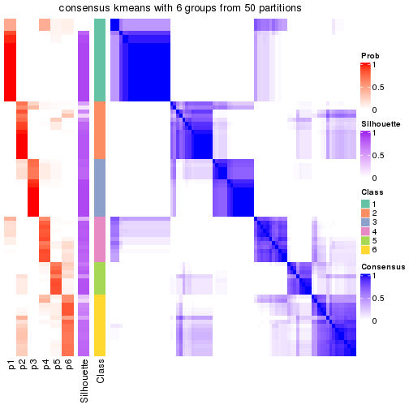</p>

</div>
<div id='tab-node-04-consensus-heatmap-6'>
<pre><code class="r">consensus_heatmap(res, k = 7)
</code></pre>

<p></p>

</div>
<div id='tab-node-04-consensus-heatmap-7'>
<pre><code class="r">consensus_heatmap(res, k = 8)
</code></pre>

<p></p>

</div>
</div>

Heatmaps for the membership of samples in all partitions to see how consistent they are:


<script>
$( function() {
	$( '#tabs-node-04-membership-heatmap' ).tabs();
} );
</script>
<div id='tabs-node-04-membership-heatmap'>
<ul>
<li><a href='#tab-node-04-membership-heatmap-1'>k = 2</a></li>
<li><a href='#tab-node-04-membership-heatmap-2'>k = 3</a></li>
<li><a href='#tab-node-04-membership-heatmap-3'>k = 4</a></li>
<li><a href='#tab-node-04-membership-heatmap-4'>k = 5</a></li>
<li><a href='#tab-node-04-membership-heatmap-5'>k = 6</a></li>
<li><a href='#tab-node-04-membership-heatmap-6'>k = 7</a></li>
<li><a href='#tab-node-04-membership-heatmap-7'>k = 8</a></li>
</ul>
<div id='tab-node-04-membership-heatmap-1'>
<pre><code class="r">membership_heatmap(res, k = 2)
</code></pre>

<p></p>

</div>
<div id='tab-node-04-membership-heatmap-2'>
<pre><code class="r">membership_heatmap(res, k = 3)
</code></pre>

<p></p>

</div>
<div id='tab-node-04-membership-heatmap-3'>
<pre><code class="r">membership_heatmap(res, k = 4)
</code></pre>

<p></p>

</div>
<div id='tab-node-04-membership-heatmap-4'>
<pre><code class="r">membership_heatmap(res, k = 5)
</code></pre>

<p></p>

</div>
<div id='tab-node-04-membership-heatmap-5'>
<pre><code class="r">membership_heatmap(res, k = 6)
</code></pre>

<p></p>

</div>
<div id='tab-node-04-membership-heatmap-6'>
<pre><code class="r">membership_heatmap(res, k = 7)
</code></pre>

<p></p>

</div>
<div id='tab-node-04-membership-heatmap-7'>
<pre><code class="r">membership_heatmap(res, k = 8)
</code></pre>

<p></p>

</div>
</div>

As soon as the classes for columns are determined, the signatures
that are significantly different between subgroups can be looked for. 
Following are the heatmaps for signatures.


<script>
$( function() {
	$( '#tabs-node-04-get-signatures' ).tabs();
} );
</script>
<div id='tabs-node-04-get-signatures'>
<ul>
<li><a href='#tab-node-04-get-signatures-1'>k = 2</a></li>
<li><a href='#tab-node-04-get-signatures-2'>k = 3</a></li>
<li><a href='#tab-node-04-get-signatures-3'>k = 4</a></li>
<li><a href='#tab-node-04-get-signatures-4'>k = 5</a></li>
<li><a href='#tab-node-04-get-signatures-5'>k = 6</a></li>
<li><a href='#tab-node-04-get-signatures-6'>k = 7</a></li>
<li><a href='#tab-node-04-get-signatures-7'>k = 8</a></li>
</ul>
<div id='tab-node-04-get-signatures-1'>
<pre><code class="r">get_signatures(res, k = 2)
</code></pre>

<p></p>

</div>
<div id='tab-node-04-get-signatures-2'>
<pre><code class="r">get_signatures(res, k = 3)
</code></pre>

<p></p>

</div>
<div id='tab-node-04-get-signatures-3'>
<pre><code class="r">get_signatures(res, k = 4)
</code></pre>

<p></p>

</div>
<div id='tab-node-04-get-signatures-4'>
<pre><code class="r">get_signatures(res, k = 5)
</code></pre>

<p></p>

</div>
<div id='tab-node-04-get-signatures-5'>
<pre><code class="r">get_signatures(res, k = 6)
</code></pre>

<p></p>

</div>
<div id='tab-node-04-get-signatures-6'>
<pre><code class="r">get_signatures(res, k = 7)
</code></pre>

<p></p>

</div>
<div id='tab-node-04-get-signatures-7'>
<pre><code class="r">get_signatures(res, k = 8)
</code></pre>

<p></p>

</div>
</div>


Compare the overlap of signatures from different k:

```r
compare_signatures(res)
```


`get_signature()` returns a data frame invisibly. To get the list of signatures, the function
call should be assigned to a variable explicitly. In following code, if `plot` argument is set
to `FALSE`, no heatmap is plotted while only the differential analysis is performed.

```r
# code only for demonstration
tb = get_signature(res, k = ..., plot = FALSE)
```

An example of the output of `tb` is:

```
#>   which_row         fdr    mean_1    mean_2 scaled_mean_1 scaled_mean_2 km
#> 1        38 0.042760348  8.373488  9.131774    -0.5533452     0.5164555  1
#> 2        40 0.018707592  7.106213  8.469186    -0.6173731     0.5762149  1
#> 3        55 0.019134737 10.221463 11.207825    -0.6159697     0.5749050  1
#> 4        59 0.006059896  5.921854  7.869574    -0.6899429     0.6439467  1
#> 5        60 0.018055526  8.928898 10.211722    -0.6204761     0.5791110  1
#> 6        98 0.009384629 15.714769 14.887706     0.6635654    -0.6193277  2
...
```

The columns in `tb` are:

1. `which_row`: row indices corresponding to the input matrix.
2. `fdr`: FDR for the differential test. 
3. `mean_x`: The mean value in group x.
4. `scaled_mean_x`: The mean value in group x after rows are scaled.
5. `km`: Row groups if k-means clustering is applied to rows (which is done by automatically selecting number of clusters).

If there are too many signatures, `top_signatures = ...` can be set to only show the 
signatures with the highest FDRs:

```r
# code only for demonstration
# e.g. to show the top 500 most significant rows
tb = get_signature(res, k = ..., top_signatures = 500)
```

If the signatures are defined as these which are uniquely high in current group, `diff_method` argument
can be set to `"uniquely_high_in_one_group"`:

```r
# code only for demonstration
tb = get_signature(res, k = ..., diff_method = "uniquely_high_in_one_group")
```


UMAP plot which shows how samples are separated.


<script>
$( function() {
	$( '#tabs-node-04-dimension-reduction' ).tabs();
} );
</script>
<div id='tabs-node-04-dimension-reduction'>
<ul>
<li><a href='#tab-node-04-dimension-reduction-1'>k = 2</a></li>
<li><a href='#tab-node-04-dimension-reduction-2'>k = 3</a></li>
<li><a href='#tab-node-04-dimension-reduction-3'>k = 4</a></li>
<li><a href='#tab-node-04-dimension-reduction-4'>k = 5</a></li>
<li><a href='#tab-node-04-dimension-reduction-5'>k = 6</a></li>
<li><a href='#tab-node-04-dimension-reduction-6'>k = 7</a></li>
<li><a href='#tab-node-04-dimension-reduction-7'>k = 8</a></li>
</ul>
<div id='tab-node-04-dimension-reduction-1'>
<pre><code class="r">dimension_reduction(res, k = 2, method = &quot;UMAP&quot;)
</code></pre>

<p></p>

</div>
<div id='tab-node-04-dimension-reduction-2'>
<pre><code class="r">dimension_reduction(res, k = 3, method = &quot;UMAP&quot;)
</code></pre>

<p>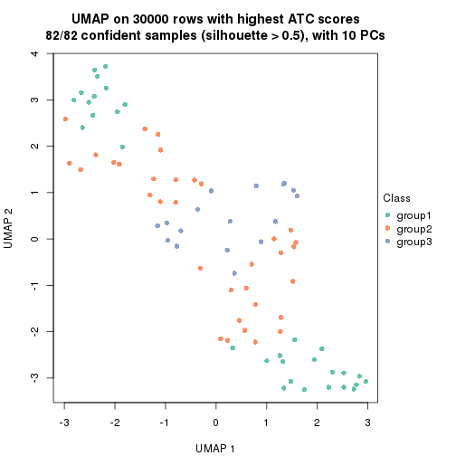</p>

</div>
<div id='tab-node-04-dimension-reduction-3'>
<pre><code class="r">dimension_reduction(res, k = 4, method = &quot;UMAP&quot;)
</code></pre>

<p></p>

</div>
<div id='tab-node-04-dimension-reduction-4'>
<pre><code class="r">dimension_reduction(res, k = 5, method = &quot;UMAP&quot;)
</code></pre>

<p></p>

</div>
<div id='tab-node-04-dimension-reduction-5'>
<pre><code class="r">dimension_reduction(res, k = 6, method = &quot;UMAP&quot;)
</code></pre>

<p></p>

</div>
<div id='tab-node-04-dimension-reduction-6'>
<pre><code class="r">dimension_reduction(res, k = 7, method = &quot;UMAP&quot;)
</code></pre>

<p></p>

</div>
<div id='tab-node-04-dimension-reduction-7'>
<pre><code class="r">dimension_reduction(res, k = 8, method = &quot;UMAP&quot;)
</code></pre>

<p></p>

</div>
</div>


Following heatmap shows how subgroups are split when increasing `k`:

```r
collect_classes(res)
```


If matrix rows can be associated to genes, consider to use `functional_enrichment(res,
...)` to perform function enrichment for the signature genes. See [this vignette](https://jokergoo.github.io/cola_vignettes/functional_enrichment.html) for more detailed explanations.


 

---------------------------------------------------


### Node041


Parent node: [Node04](#Node04).
Child nodes: 
                [Node0111](#Node0111)
        ,
                [Node0112](#Node0112)
        ,
                [Node0121](#Node0121)
        ,
                [Node0122](#Node0122)
        ,
                Node0211-leaf
        ,
                [Node0212](#Node0212)
        ,
                Node0411-leaf
        ,
                Node0412-leaf
        ,
                Node0413-leaf
        ,
                Node0414-leaf
        ,
                Node0421-leaf
        ,
                [Node0422](#Node0422)
        ,
                Node0423-leaf
        ,
                Node0431-leaf
        ,
                Node0432-leaf
        ,
                Node0433-leaf
        .


The object with results only for a single top-value method and a single partitioning method 
can be extracted as:

```r
res = res_rh["041"]
```

A summary of `res` and all the functions that can be applied to it:

```r
res
```

```
#> A 'ConsensusPartition' object with k = 2, 3, 4, 5, 6, 7, 8.
#>   On a matrix with 30000 rows and 31 columns.
#>   Top rows (1000) are extracted by 'ATC' method.
#>   Subgroups are detected by 'skmeans' method.
#>   Performed in total 350 partitions by row resampling.
#>   Best k for subgroups seems to be 4.
#> 
#> Following methods can be applied to this 'ConsensusPartition' object:
#>  [1] "cola_report"             "collect_classes"         "collect_plots"          
#>  [4] "collect_stats"           "colnames"                "compare_partitions"     
#>  [7] "compare_signatures"      "consensus_heatmap"       "dimension_reduction"    
#> [10] "functional_enrichment"   "get_anno_col"            "get_anno"               
#> [13] "get_classes"             "get_consensus"           "get_matrix"             
#> [16] "get_membership"          "get_param"               "get_signatures"         
#> [19] "get_stats"               "is_best_k"               "is_stable_k"            
#> [22] "membership_heatmap"      "ncol"                    "nrow"                   
#> [25] "plot_ecdf"               "predict_classes"         "rownames"               
#> [28] "select_partition_number" "show"                    "suggest_best_k"         
#> [31] "test_to_known_factors"   "top_rows_heatmap"
```

`collect_plots()` function collects all the plots made from `res` for all `k` (number of subgroups)
into one single page to provide an easy and fast comparison between different `k`.

```r
collect_plots(res)
```


The plots are:

- The first row: a plot of the eCDF (empirical cumulative distribution
  function) curves of the consensus matrix for each `k` and the heatmap of
  predicted classes for each `k`.
- The second row: heatmaps of the consensus matrix for each `k`.
- The third row: heatmaps of the membership matrix for each `k`.
- The fouth row: heatmaps of the signatures for each `k`.

All the plots in panels can be made by individual functions and they are
plotted later in this section.

`select_partition_number()` produces several plots showing different
statistics for choosing "optimized" `k`. There are following statistics:

- eCDF curves of the consensus matrix for each `k`;
- 1-PAC. [The PAC score](https://en.wikipedia.org/wiki/Consensus_clustering#Over-interpretation_potential_of_consensus_clustering)
  measures the proportion of the ambiguous subgrouping.
- Mean silhouette score.
- Concordance. The mean probability of fiting the consensus subgroup labels in all
  partitions.
- Area increased. Denote $A_k$ as the area under the eCDF curve for current
  `k`, the area increased is defined as $A_k - A_{k-1}$.
- Rand index. The percent of pairs of samples that are both in a same cluster
  or both are not in a same cluster in the partition of k and k-1.
- Jaccard index. The ratio of pairs of samples are both in a same cluster in
  the partition of k and k-1 and the pairs of samples are both in a same
  cluster in the partition k or k-1.

The detailed explanations of these statistics can be found in [the _cola_
vignette](https://jokergoo.github.io/cola_vignettes/cola.html#toc_13).

Generally speaking, higher 1-PAC score, higher mean silhouette score or higher
concordance corresponds to better partition. Rand index and Jaccard index
measure how similar the current partition is compared to partition with `k-1`.
If they are too similar, we won't accept `k` is better than `k-1`.

```r
select_partition_number(res)
```


The numeric values for all these statistics can be obtained by `get_stats()`.

```r
get_stats(res)
```

```
#>   k 1-PAC mean_silhouette concordance area_increased  Rand Jaccard
#> 2 2 1.000           1.000       1.000         0.4522 0.548   0.548
#> 3 3 1.000           0.993       0.997         0.4770 0.682   0.470
#> 4 4 1.000           0.997       0.999         0.1376 0.890   0.679
#> 5 5 0.929           0.910       0.953         0.0255 0.987   0.946
#> 6 6 0.884           0.778       0.919         0.0269 0.981   0.915
#> 7 7 0.869           0.721       0.875         0.0270 0.946   0.750
#> 8 8 0.867           0.636       0.826         0.0151 0.963   0.798
```

`suggest_best_k()` suggests the best $k$ based on these statistics. The rules are as follows:

- All $k$ with Jaccard index larger than 0.95 are removed because increasing
  $k$ does not provide enough extra information. If all $k$ are removed, it is
  marked as no subgroup is detected.
- For all $k$ with 1-PAC score larger than 0.9, the maximal $k$ is taken as
  the best $k$, and other $k$ are marked as optional $k$.
- If it does not fit the second rule. The $k$ with the maximal vote of the
  highest 1-PAC score, highest mean silhouette, and highest concordance is
  taken as the best $k$.

```r
suggest_best_k(res)
```

```
#> [1] 4
#> attr(,"optional")
#> [1] 2 3
```

There is also optional best $k$ = 2 3 that is worth to check.

Following is the table of the partitions (You need to click the **show/hide
code output** link to see it). The membership matrix (columns with name `p*`)
is inferred by
[`clue::cl_consensus()`](https://www.rdocumentation.org/link/cl_consensus?package=clue)
function with the `SE` method. Basically the value in the membership matrix
represents the probability to belong to a certain group. The finall subgroup
label for an item is determined with the group with highest probability it
belongs to.

In `get_classes()` function, the entropy is calculated from the membership
matrix and the silhouette score is calculated from the consensus matrix.


<script>
$( function() {
	$( '#tabs-node-041-get-classes' ).tabs();
} );
</script>
<div id='tabs-node-041-get-classes'>
<ul>
<li><a href='#tab-node-041-get-classes-1'>k = 2</a></li>
<li><a href='#tab-node-041-get-classes-2'>k = 3</a></li>
<li><a href='#tab-node-041-get-classes-3'>k = 4</a></li>
<li><a href='#tab-node-041-get-classes-4'>k = 5</a></li>
<li><a href='#tab-node-041-get-classes-5'>k = 6</a></li>
<li><a href='#tab-node-041-get-classes-6'>k = 7</a></li>
<li><a href='#tab-node-041-get-classes-7'>k = 8</a></li>
</ul>

<div id='tab-node-041-get-classes-1'>
<p><a id='tab-node-041-get-classes-1-a' style='color:#0366d6' href='#'>show/hide code output</a></p>
<pre><code class="r">cbind(get_classes(res, k = 2), get_membership(res, k = 2))
</code></pre>

<pre><code>#&gt;                 class entropy silhouette p1 p2
#&gt; TCGA.F5.6464.01     2       0          1  0  1
#&gt; TCGA.F5.6812.01     1       0          1  1  0
#&gt; TCGA.F4.6805.01     2       0          1  0  1
#&gt; TCGA.G4.6627.01     2       0          1  0  1
#&gt; TCGA.D5.6534.01     2       0          1  0  1
#&gt; TCGA.A6.6651.01     2       0          1  0  1
#&gt; TCGA.AF.2693.01     1       0          1  1  0
#&gt; TCGA.AF.4110.01     1       0          1  1  0
#&gt; TCGA.CM.6167.01     2       0          1  0  1
#&gt; TCGA.A6.6781.01     2       0          1  0  1
#&gt; TCGA.AZ.6605.01     2       0          1  0  1
#&gt; TCGA.G5.6572.01     1       0          1  1  0
#&gt; TCGA.DM.A280.01     2       0          1  0  1
#&gt; TCGA.AA.3489.01     2       0          1  0  1
#&gt; TCGA.G4.6302.01     2       0          1  0  1
#&gt; TCGA.G5.6235.01     1       0          1  1  0
#&gt; TCGA.CI.6621.01     1       0          1  1  0
#&gt; TCGA.F4.6857.01     2       0          1  0  1
#&gt; TCGA.AZ.4323.01     2       0          1  0  1
#&gt; TCGA.D5.6928.01     2       0          1  0  1
#&gt; TCGA.D5.6923.01     1       0          1  1  0
#&gt; TCGA.AF.2690.01     1       0          1  1  0
#&gt; TCGA.G5.6572.02     2       0          1  0  1
#&gt; TCGA.AH.6547.01     2       0          1  0  1
#&gt; TCGA.D5.6927.01     2       0          1  0  1
#&gt; TCGA.G4.6304.01     2       0          1  0  1
#&gt; TCGA.D5.6539.01     1       0          1  1  0
#&gt; TCGA.BM.6198.01     1       0          1  1  0
#&gt; TCGA.CM.6674.01     2       0          1  0  1
#&gt; TCGA.CM.4743.01     2       0          1  0  1
#&gt; TCGA.WS.AB45.01     2       0          1  0  1
</code></pre>

<script>
$('#tab-node-041-get-classes-1-a').parent().next().next().hide();
$('#tab-node-041-get-classes-1-a').click(function(){
  $('#tab-node-041-get-classes-1-a').parent().next().next().toggle();
  return(false);
});
</script>
</div>

<div id='tab-node-041-get-classes-2'>
<p><a id='tab-node-041-get-classes-2-a' style='color:#0366d6' href='#'>show/hide code output</a></p>
<pre><code class="r">cbind(get_classes(res, k = 3), get_membership(res, k = 3))
</code></pre>

<pre><code>#&gt;                 class entropy silhouette p1   p2   p3
#&gt; TCGA.F5.6464.01     2  0.2537      0.914  0 0.92 0.08
#&gt; TCGA.F5.6812.01     1  0.0000      1.000  1 0.00 0.00
#&gt; TCGA.F4.6805.01     2  0.0000      0.992  0 1.00 0.00
#&gt; TCGA.G4.6627.01     2  0.0000      0.992  0 1.00 0.00
#&gt; TCGA.D5.6534.01     3  0.0000      1.000  0 0.00 1.00
#&gt; TCGA.A6.6651.01     2  0.0000      0.992  0 1.00 0.00
#&gt; TCGA.AF.2693.01     1  0.0000      1.000  1 0.00 0.00
#&gt; TCGA.AF.4110.01     1  0.0000      1.000  1 0.00 0.00
#&gt; TCGA.CM.6167.01     2  0.0000      0.992  0 1.00 0.00
#&gt; TCGA.A6.6781.01     2  0.0892      0.976  0 0.98 0.02
#&gt; TCGA.AZ.6605.01     2  0.0000      0.992  0 1.00 0.00
#&gt; TCGA.G5.6572.01     1  0.0000      1.000  1 0.00 0.00
#&gt; TCGA.DM.A280.01     3  0.0000      1.000  0 0.00 1.00
#&gt; TCGA.AA.3489.01     2  0.0000      0.992  0 1.00 0.00
#&gt; TCGA.G4.6302.01     3  0.0000      1.000  0 0.00 1.00
#&gt; TCGA.G5.6235.01     1  0.0000      1.000  1 0.00 0.00
#&gt; TCGA.CI.6621.01     1  0.0000      1.000  1 0.00 0.00
#&gt; TCGA.F4.6857.01     3  0.0000      1.000  0 0.00 1.00
#&gt; TCGA.AZ.4323.01     3  0.0000      1.000  0 0.00 1.00
#&gt; TCGA.D5.6928.01     3  0.0000      1.000  0 0.00 1.00
#&gt; TCGA.D5.6923.01     1  0.0000      1.000  1 0.00 0.00
#&gt; TCGA.AF.2690.01     2  0.0000      0.992  0 1.00 0.00
#&gt; TCGA.G5.6572.02     2  0.0000      0.992  0 1.00 0.00
#&gt; TCGA.AH.6547.01     2  0.0000      0.992  0 1.00 0.00
#&gt; TCGA.D5.6927.01     2  0.0000      0.992  0 1.00 0.00
#&gt; TCGA.G4.6304.01     3  0.0000      1.000  0 0.00 1.00
#&gt; TCGA.D5.6539.01     1  0.0000      1.000  1 0.00 0.00
#&gt; TCGA.BM.6198.01     2  0.0000      0.992  0 1.00 0.00
#&gt; TCGA.CM.6674.01     2  0.0000      0.992  0 1.00 0.00
#&gt; TCGA.CM.4743.01     3  0.0000      1.000  0 0.00 1.00
#&gt; TCGA.WS.AB45.01     3  0.0000      1.000  0 0.00 1.00
</code></pre>

<script>
$('#tab-node-041-get-classes-2-a').parent().next().next().hide();
$('#tab-node-041-get-classes-2-a').click(function(){
  $('#tab-node-041-get-classes-2-a').parent().next().next().toggle();
  return(false);
});
</script>
</div>

<div id='tab-node-041-get-classes-3'>
<p><a id='tab-node-041-get-classes-3-a' style='color:#0366d6' href='#'>show/hide code output</a></p>
<pre><code class="r">cbind(get_classes(res, k = 4), get_membership(res, k = 4))
</code></pre>

<pre><code>#&gt;                 class entropy silhouette p1   p2 p3   p4
#&gt; TCGA.F5.6464.01     2   0.000      0.996  0 1.00  0 0.00
#&gt; TCGA.F5.6812.01     4   0.000      1.000  0 0.00  0 1.00
#&gt; TCGA.F4.6805.01     2   0.000      0.996  0 1.00  0 0.00
#&gt; TCGA.G4.6627.01     2   0.000      0.996  0 1.00  0 0.00
#&gt; TCGA.D5.6534.01     3   0.000      1.000  0 0.00  1 0.00
#&gt; TCGA.A6.6651.01     2   0.121      0.958  0 0.96  0 0.04
#&gt; TCGA.AF.2693.01     1   0.000      1.000  1 0.00  0 0.00
#&gt; TCGA.AF.4110.01     1   0.000      1.000  1 0.00  0 0.00
#&gt; TCGA.CM.6167.01     2   0.000      0.996  0 1.00  0 0.00
#&gt; TCGA.A6.6781.01     2   0.000      0.996  0 1.00  0 0.00
#&gt; TCGA.AZ.6605.01     4   0.000      1.000  0 0.00  0 1.00
#&gt; TCGA.G5.6572.01     1   0.000      1.000  1 0.00  0 0.00
#&gt; TCGA.DM.A280.01     3   0.000      1.000  0 0.00  1 0.00
#&gt; TCGA.AA.3489.01     2   0.000      0.996  0 1.00  0 0.00
#&gt; TCGA.G4.6302.01     3   0.000      1.000  0 0.00  1 0.00
#&gt; TCGA.G5.6235.01     1   0.000      1.000  1 0.00  0 0.00
#&gt; TCGA.CI.6621.01     1   0.000      1.000  1 0.00  0 0.00
#&gt; TCGA.F4.6857.01     3   0.000      1.000  0 0.00  1 0.00
#&gt; TCGA.AZ.4323.01     3   0.000      1.000  0 0.00  1 0.00
#&gt; TCGA.D5.6928.01     3   0.000      1.000  0 0.00  1 0.00
#&gt; TCGA.D5.6923.01     1   0.000      1.000  1 0.00  0 0.00
#&gt; TCGA.AF.2690.01     4   0.000      1.000  0 0.00  0 1.00
#&gt; TCGA.G5.6572.02     4   0.000      1.000  0 0.00  0 1.00
#&gt; TCGA.AH.6547.01     2   0.000      0.996  0 1.00  0 0.00
#&gt; TCGA.D5.6927.01     2   0.000      0.996  0 1.00  0 0.00
#&gt; TCGA.G4.6304.01     3   0.000      1.000  0 0.00  1 0.00
#&gt; TCGA.D5.6539.01     1   0.000      1.000  1 0.00  0 0.00
#&gt; TCGA.BM.6198.01     4   0.000      1.000  0 0.00  0 1.00
#&gt; TCGA.CM.6674.01     2   0.000      0.996  0 1.00  0 0.00
#&gt; TCGA.CM.4743.01     3   0.000      1.000  0 0.00  1 0.00
#&gt; TCGA.WS.AB45.01     3   0.000      1.000  0 0.00  1 0.00
</code></pre>

<script>
$('#tab-node-041-get-classes-3-a').parent().next().next().hide();
$('#tab-node-041-get-classes-3-a').click(function(){
  $('#tab-node-041-get-classes-3-a').parent().next().next().toggle();
  return(false);
});
</script>
</div>

<div id='tab-node-041-get-classes-4'>
<p><a id='tab-node-041-get-classes-4-a' style='color:#0366d6' href='#'>show/hide code output</a></p>
<pre><code class="r">cbind(get_classes(res, k = 5), get_membership(res, k = 5))
</code></pre>

<pre><code>#&gt;                 class entropy silhouette   p1   p2  p3   p4   p5
#&gt; TCGA.F5.6464.01     2  0.3390      0.769 0.00 0.84 0.1 0.00 0.06
#&gt; TCGA.F5.6812.01     4  0.1648      0.931 0.04 0.00 0.0 0.94 0.02
#&gt; TCGA.F4.6805.01     2  0.2012      0.876 0.00 0.92 0.0 0.06 0.02
#&gt; TCGA.G4.6627.01     2  0.1410      0.902 0.00 0.94 0.0 0.00 0.06
#&gt; TCGA.D5.6534.01     3  0.0000      1.000 0.00 0.00 1.0 0.00 0.00
#&gt; TCGA.A6.6651.01     2  0.2616      0.847 0.00 0.88 0.0 0.10 0.02
#&gt; TCGA.AF.2693.01     1  0.0000      0.965 1.00 0.00 0.0 0.00 0.00
#&gt; TCGA.AF.4110.01     1  0.0000      0.965 1.00 0.00 0.0 0.00 0.00
#&gt; TCGA.CM.6167.01     2  0.0609      0.892 0.00 0.98 0.0 0.00 0.02
#&gt; TCGA.A6.6781.01     2  0.2280      0.890 0.00 0.88 0.0 0.00 0.12
#&gt; TCGA.AZ.6605.01     4  0.0000      0.978 0.00 0.00 0.0 1.00 0.00
#&gt; TCGA.G5.6572.01     1  0.2280      0.812 0.88 0.00 0.0 0.00 0.12
#&gt; TCGA.DM.A280.01     3  0.0000      1.000 0.00 0.00 1.0 0.00 0.00
#&gt; TCGA.AA.3489.01     2  0.1732      0.901 0.00 0.92 0.0 0.00 0.08
#&gt; TCGA.G4.6302.01     3  0.0000      1.000 0.00 0.00 1.0 0.00 0.00
#&gt; TCGA.G5.6235.01     1  0.0000      0.965 1.00 0.00 0.0 0.00 0.00
#&gt; TCGA.CI.6621.01     1  0.0000      0.965 1.00 0.00 0.0 0.00 0.00
#&gt; TCGA.F4.6857.01     3  0.0000      1.000 0.00 0.00 1.0 0.00 0.00
#&gt; TCGA.AZ.4323.01     3  0.0000      1.000 0.00 0.00 1.0 0.00 0.00
#&gt; TCGA.D5.6928.01     3  0.0000      1.000 0.00 0.00 1.0 0.00 0.00
#&gt; TCGA.D5.6923.01     1  0.0000      0.965 1.00 0.00 0.0 0.00 0.00
#&gt; TCGA.AF.2690.01     4  0.0609      0.971 0.00 0.00 0.0 0.98 0.02
#&gt; TCGA.G5.6572.02     4  0.0000      0.978 0.00 0.00 0.0 1.00 0.00
#&gt; TCGA.AH.6547.01     2  0.2012      0.876 0.00 0.92 0.0 0.06 0.02
#&gt; TCGA.D5.6927.01     2  0.2020      0.897 0.00 0.90 0.0 0.00 0.10
#&gt; TCGA.G4.6304.01     3  0.0000      1.000 0.00 0.00 1.0 0.00 0.00
#&gt; TCGA.D5.6539.01     5  0.3895      0.000 0.32 0.00 0.0 0.00 0.68
#&gt; TCGA.BM.6198.01     4  0.0000      0.978 0.00 0.00 0.0 1.00 0.00
#&gt; TCGA.CM.6674.01     2  0.2280      0.890 0.00 0.88 0.0 0.00 0.12
#&gt; TCGA.CM.4743.01     3  0.0000      1.000 0.00 0.00 1.0 0.00 0.00
#&gt; TCGA.WS.AB45.01     3  0.0000      1.000 0.00 0.00 1.0 0.00 0.00
</code></pre>

<script>
$('#tab-node-041-get-classes-4-a').parent().next().next().hide();
$('#tab-node-041-get-classes-4-a').click(function(){
  $('#tab-node-041-get-classes-4-a').parent().next().next().toggle();
  return(false);
});
</script>
</div>

<div id='tab-node-041-get-classes-5'>
<p><a id='tab-node-041-get-classes-5-a' style='color:#0366d6' href='#'>show/hide code output</a></p>
<pre><code class="r">cbind(get_classes(res, k = 6), get_membership(res, k = 6))
</code></pre>

<pre><code>#&gt;                 class entropy silhouette   p1   p2 p3   p4   p5   p6
#&gt; TCGA.F5.6464.01     6  0.3706      0.000 0.00 0.38  0 0.00 0.00 0.62
#&gt; TCGA.F5.6812.01     4  0.3382      0.807 0.04 0.00  0 0.84 0.04 0.08
#&gt; TCGA.F4.6805.01     2  0.4727      0.482 0.00 0.66  0 0.10 0.00 0.24
#&gt; TCGA.G4.6627.01     2  0.0937      0.697 0.00 0.96  0 0.00 0.00 0.04
#&gt; TCGA.D5.6534.01     3  0.0000      1.000 0.00 0.00  1 0.00 0.00 0.00
#&gt; TCGA.A6.6651.01     2  0.5509      0.275 0.00 0.54  0 0.30 0.00 0.16
#&gt; TCGA.AF.2693.01     1  0.0547      0.954 0.98 0.00  0 0.00 0.00 0.02
#&gt; TCGA.AF.4110.01     1  0.0000      0.957 1.00 0.00  0 0.00 0.00 0.00
#&gt; TCGA.CM.6167.01     2  0.2048      0.654 0.00 0.88  0 0.00 0.00 0.12
#&gt; TCGA.A6.6781.01     2  0.0547      0.688 0.00 0.98  0 0.00 0.00 0.02
#&gt; TCGA.AZ.6605.01     4  0.1865      0.845 0.00 0.04  0 0.92 0.00 0.04
#&gt; TCGA.G5.6572.01     1  0.3270      0.816 0.82 0.00  0 0.00 0.06 0.12
#&gt; TCGA.DM.A280.01     3  0.0000      1.000 0.00 0.00  1 0.00 0.00 0.00
#&gt; TCGA.AA.3489.01     2  0.0000      0.703 0.00 1.00  0 0.00 0.00 0.00
#&gt; TCGA.G4.6302.01     3  0.0000      1.000 0.00 0.00  1 0.00 0.00 0.00
#&gt; TCGA.G5.6235.01     1  0.0547      0.954 0.98 0.00  0 0.00 0.00 0.02
#&gt; TCGA.CI.6621.01     1  0.0000      0.957 1.00 0.00  0 0.00 0.00 0.00
#&gt; TCGA.F4.6857.01     3  0.0000      1.000 0.00 0.00  1 0.00 0.00 0.00
#&gt; TCGA.AZ.4323.01     3  0.0000      1.000 0.00 0.00  1 0.00 0.00 0.00
#&gt; TCGA.D5.6928.01     3  0.0000      1.000 0.00 0.00  1 0.00 0.00 0.00
#&gt; TCGA.D5.6923.01     1  0.0000      0.957 1.00 0.00  0 0.00 0.00 0.00
#&gt; TCGA.AF.2690.01     4  0.0000      0.871 0.00 0.00  0 1.00 0.00 0.00
#&gt; TCGA.G5.6572.02     4  0.1480      0.861 0.00 0.02  0 0.94 0.00 0.04
#&gt; TCGA.AH.6547.01     2  0.4926      0.461 0.00 0.64  0 0.12 0.00 0.24
#&gt; TCGA.D5.6927.01     2  0.0000      0.703 0.00 1.00  0 0.00 0.00 0.00
#&gt; TCGA.G4.6304.01     3  0.0000      1.000 0.00 0.00  1 0.00 0.00 0.00
#&gt; TCGA.D5.6539.01     5  0.1267      0.000 0.06 0.00  0 0.00 0.94 0.00
#&gt; TCGA.BM.6198.01     4  0.2981      0.799 0.00 0.00  0 0.82 0.02 0.16
#&gt; TCGA.CM.6674.01     2  0.0547      0.688 0.00 0.98  0 0.00 0.00 0.02
#&gt; TCGA.CM.4743.01     3  0.0000      1.000 0.00 0.00  1 0.00 0.00 0.00
#&gt; TCGA.WS.AB45.01     3  0.0000      1.000 0.00 0.00  1 0.00 0.00 0.00
</code></pre>

<script>
$('#tab-node-041-get-classes-5-a').parent().next().next().hide();
$('#tab-node-041-get-classes-5-a').click(function(){
  $('#tab-node-041-get-classes-5-a').parent().next().next().toggle();
  return(false);
});
</script>
</div>

<div id='tab-node-041-get-classes-6'>
<p><a id='tab-node-041-get-classes-6-a' style='color:#0366d6' href='#'>show/hide code output</a></p>
<pre><code class="r">cbind(get_classes(res, k = 7), get_membership(res, k = 7))
</code></pre>

<pre><code>#&gt;                 class entropy silhouette   p1   p2   p3   p4   p5   p6   p7
#&gt; TCGA.F5.6464.01     6  0.3011      0.000 0.00 0.12 0.00 0.00 0.00 0.82 0.06
#&gt; TCGA.F5.6812.01     4  0.2654      0.585 0.10 0.00 0.00 0.86 0.02 0.00 0.02
#&gt; TCGA.F4.6805.01     7  0.1166      0.680 0.00 0.06 0.00 0.00 0.00 0.00 0.94
#&gt; TCGA.G4.6627.01     2  0.3815      0.812 0.00 0.62 0.00 0.00 0.00 0.02 0.36
#&gt; TCGA.D5.6534.01     3  0.0504      0.979 0.00 0.00 0.98 0.00 0.00 0.02 0.00
#&gt; TCGA.A6.6651.01     7  0.0000      0.683 0.00 0.00 0.00 0.00 0.00 0.00 1.00
#&gt; TCGA.AF.2693.01     1  0.0504      0.887 0.98 0.00 0.00 0.00 0.00 0.02 0.00
#&gt; TCGA.AF.4110.01     1  0.0504      0.896 0.98 0.00 0.00 0.00 0.02 0.00 0.00
#&gt; TCGA.CM.6167.01     2  0.4505      0.685 0.00 0.50 0.00 0.00 0.00 0.06 0.44
#&gt; TCGA.A6.6781.01     2  0.2422      0.797 0.00 0.82 0.00 0.00 0.00 0.00 0.18
#&gt; TCGA.AZ.6605.01     7  0.3546     -0.483 0.00 0.00 0.00 0.46 0.00 0.00 0.54
#&gt; TCGA.G5.6572.01     1  0.6045      0.499 0.60 0.10 0.00 0.08 0.04 0.18 0.00
#&gt; TCGA.DM.A280.01     3  0.0000      0.997 0.00 0.00 1.00 0.00 0.00 0.00 0.00
#&gt; TCGA.AA.3489.01     2  0.3815      0.812 0.00 0.62 0.00 0.00 0.00 0.02 0.36
#&gt; TCGA.G4.6302.01     3  0.0000      0.997 0.00 0.00 1.00 0.00 0.00 0.00 0.00
#&gt; TCGA.G5.6235.01     1  0.1505      0.873 0.94 0.02 0.00 0.00 0.02 0.02 0.00
#&gt; TCGA.CI.6621.01     1  0.0504      0.896 0.98 0.00 0.00 0.00 0.02 0.00 0.00
#&gt; TCGA.F4.6857.01     3  0.0000      0.997 0.00 0.00 1.00 0.00 0.00 0.00 0.00
#&gt; TCGA.AZ.4323.01     3  0.0000      0.997 0.00 0.00 1.00 0.00 0.00 0.00 0.00
#&gt; TCGA.D5.6928.01     3  0.0000      0.997 0.00 0.00 1.00 0.00 0.00 0.00 0.00
#&gt; TCGA.D5.6923.01     1  0.0504      0.896 0.98 0.00 0.00 0.00 0.02 0.00 0.00
#&gt; TCGA.AF.2690.01     4  0.3294      0.580 0.00 0.00 0.00 0.66 0.00 0.00 0.34
#&gt; TCGA.G5.6572.02     4  0.3546      0.393 0.00 0.00 0.00 0.54 0.00 0.00 0.46
#&gt; TCGA.AH.6547.01     7  0.1166      0.680 0.00 0.06 0.00 0.00 0.00 0.00 0.94
#&gt; TCGA.D5.6927.01     2  0.2708      0.816 0.00 0.78 0.00 0.00 0.00 0.00 0.22
#&gt; TCGA.G4.6304.01     3  0.0000      0.997 0.00 0.00 1.00 0.00 0.00 0.00 0.00
#&gt; TCGA.D5.6539.01     5  0.1006      0.000 0.02 0.00 0.00 0.02 0.96 0.00 0.00
#&gt; TCGA.BM.6198.01     4  0.2572      0.620 0.00 0.06 0.00 0.86 0.00 0.00 0.08
#&gt; TCGA.CM.6674.01     2  0.2422      0.797 0.00 0.82 0.00 0.00 0.00 0.00 0.18
#&gt; TCGA.CM.4743.01     3  0.0000      0.997 0.00 0.00 1.00 0.00 0.00 0.00 0.00
#&gt; TCGA.WS.AB45.01     3  0.0000      0.997 0.00 0.00 1.00 0.00 0.00 0.00 0.00
</code></pre>

<script>
$('#tab-node-041-get-classes-6-a').parent().next().next().hide();
$('#tab-node-041-get-classes-6-a').click(function(){
  $('#tab-node-041-get-classes-6-a').parent().next().next().toggle();
  return(false);
});
</script>
</div>

<div id='tab-node-041-get-classes-7'>
<p><a id='tab-node-041-get-classes-7-a' style='color:#0366d6' href='#'>show/hide code output</a></p>
<pre><code class="r">cbind(get_classes(res, k = 8), get_membership(res, k = 8))
</code></pre>

<pre><code>#&gt;                 class entropy silhouette   p1   p2   p3   p4   p5   p6   p7   p8
#&gt; TCGA.F5.6464.01     6  0.0808      0.000 0.00 0.00 0.00 0.00 0.00 0.96 0.04 0.00
#&gt; TCGA.F5.6812.01     4  0.4862     -0.330 0.16 0.00 0.00 0.60 0.02 0.00 0.00 0.22
#&gt; TCGA.F4.6805.01     7  0.5054      0.527 0.00 0.20 0.00 0.36 0.00 0.00 0.44 0.00
#&gt; TCGA.G4.6627.01     2  0.3095      0.670 0.00 0.74 0.00 0.02 0.00 0.00 0.24 0.00
#&gt; TCGA.D5.6534.01     3  0.0471      0.981 0.00 0.00 0.98 0.00 0.00 0.02 0.00 0.00
#&gt; TCGA.A6.6651.01     7  0.5123      0.511 0.00 0.22 0.00 0.36 0.00 0.00 0.42 0.00
#&gt; TCGA.AF.2693.01     1  0.0808      0.903 0.96 0.00 0.00 0.00 0.00 0.00 0.04 0.00
#&gt; TCGA.AF.4110.01     1  0.0000      0.918 1.00 0.00 0.00 0.00 0.00 0.00 0.00 0.00
#&gt; TCGA.CM.6167.01     2  0.4040      0.434 0.00 0.58 0.00 0.02 0.00 0.02 0.38 0.00
#&gt; TCGA.A6.6781.01     2  0.0941      0.722 0.00 0.96 0.00 0.00 0.02 0.02 0.00 0.00
#&gt; TCGA.AZ.6605.01     4  0.2020      0.536 0.00 0.02 0.00 0.90 0.00 0.00 0.06 0.02
#&gt; TCGA.G5.6572.01     7  0.5210     -0.366 0.18 0.00 0.00 0.00 0.00 0.02 0.52 0.28
#&gt; TCGA.DM.A280.01     3  0.0000      0.995 0.00 0.00 1.00 0.00 0.00 0.00 0.00 0.00
#&gt; TCGA.AA.3489.01     2  0.2856      0.694 0.00 0.78 0.00 0.02 0.00 0.00 0.20 0.00
#&gt; TCGA.G4.6302.01     3  0.0000      0.995 0.00 0.00 1.00 0.00 0.00 0.00 0.00 0.00
#&gt; TCGA.G5.6235.01     1  0.4077      0.726 0.76 0.00 0.00 0.00 0.08 0.02 0.04 0.10
#&gt; TCGA.CI.6621.01     1  0.0471      0.918 0.98 0.00 0.00 0.00 0.00 0.00 0.00 0.02
#&gt; TCGA.F4.6857.01     3  0.0471      0.981 0.00 0.00 0.98 0.00 0.00 0.02 0.00 0.00
#&gt; TCGA.AZ.4323.01     3  0.0000      0.995 0.00 0.00 1.00 0.00 0.00 0.00 0.00 0.00
#&gt; TCGA.D5.6928.01     3  0.0000      0.995 0.00 0.00 1.00 0.00 0.00 0.00 0.00 0.00
#&gt; TCGA.D5.6923.01     1  0.0471      0.918 0.98 0.00 0.00 0.00 0.00 0.00 0.00 0.02
#&gt; TCGA.AF.2690.01     4  0.1341      0.482 0.00 0.00 0.00 0.92 0.00 0.00 0.00 0.08
#&gt; TCGA.G5.6572.02     4  0.2165      0.551 0.00 0.00 0.00 0.88 0.00 0.00 0.06 0.06
#&gt; TCGA.AH.6547.01     7  0.5030      0.525 0.00 0.20 0.00 0.34 0.00 0.00 0.46 0.00
#&gt; TCGA.D5.6927.01     2  0.1091      0.723 0.00 0.94 0.00 0.00 0.00 0.00 0.06 0.00
#&gt; TCGA.G4.6304.01     3  0.0000      0.995 0.00 0.00 1.00 0.00 0.00 0.00 0.00 0.00
#&gt; TCGA.D5.6539.01     5  0.0471      0.000 0.02 0.00 0.00 0.00 0.98 0.00 0.00 0.00
#&gt; TCGA.BM.6198.01     8  0.3299      0.000 0.00 0.00 0.00 0.44 0.00 0.00 0.00 0.56
#&gt; TCGA.CM.6674.01     2  0.0941      0.722 0.00 0.96 0.00 0.00 0.02 0.02 0.00 0.00
#&gt; TCGA.CM.4743.01     3  0.0000      0.995 0.00 0.00 1.00 0.00 0.00 0.00 0.00 0.00
#&gt; TCGA.WS.AB45.01     3  0.0000      0.995 0.00 0.00 1.00 0.00 0.00 0.00 0.00 0.00
</code></pre>

<script>
$('#tab-node-041-get-classes-7-a').parent().next().next().hide();
$('#tab-node-041-get-classes-7-a').click(function(){
  $('#tab-node-041-get-classes-7-a').parent().next().next().toggle();
  return(false);
});
</script>
</div>
</div>

Heatmaps for the consensus matrix. It visualizes the probability of two
samples to be in a same group.


<script>
$( function() {
	$( '#tabs-node-041-consensus-heatmap' ).tabs();
} );
</script>
<div id='tabs-node-041-consensus-heatmap'>
<ul>
<li><a href='#tab-node-041-consensus-heatmap-1'>k = 2</a></li>
<li><a href='#tab-node-041-consensus-heatmap-2'>k = 3</a></li>
<li><a href='#tab-node-041-consensus-heatmap-3'>k = 4</a></li>
<li><a href='#tab-node-041-consensus-heatmap-4'>k = 5</a></li>
<li><a href='#tab-node-041-consensus-heatmap-5'>k = 6</a></li>
<li><a href='#tab-node-041-consensus-heatmap-6'>k = 7</a></li>
<li><a href='#tab-node-041-consensus-heatmap-7'>k = 8</a></li>
</ul>
<div id='tab-node-041-consensus-heatmap-1'>
<pre><code class="r">consensus_heatmap(res, k = 2)
</code></pre>

<p></p>

</div>
<div id='tab-node-041-consensus-heatmap-2'>
<pre><code class="r">consensus_heatmap(res, k = 3)
</code></pre>

<p></p>

</div>
<div id='tab-node-041-consensus-heatmap-3'>
<pre><code class="r">consensus_heatmap(res, k = 4)
</code></pre>

<p></p>

</div>
<div id='tab-node-041-consensus-heatmap-4'>
<pre><code class="r">consensus_heatmap(res, k = 5)
</code></pre>

<p></p>

</div>
<div id='tab-node-041-consensus-heatmap-5'>
<pre><code class="r">consensus_heatmap(res, k = 6)
</code></pre>

<p>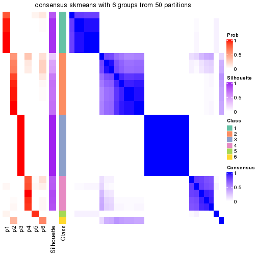</p>

</div>
<div id='tab-node-041-consensus-heatmap-6'>
<pre><code class="r">consensus_heatmap(res, k = 7)
</code></pre>

<p></p>

</div>
<div id='tab-node-041-consensus-heatmap-7'>
<pre><code class="r">consensus_heatmap(res, k = 8)
</code></pre>

<p></p>

</div>
</div>

Heatmaps for the membership of samples in all partitions to see how consistent they are:


<script>
$( function() {
	$( '#tabs-node-041-membership-heatmap' ).tabs();
} );
</script>
<div id='tabs-node-041-membership-heatmap'>
<ul>
<li><a href='#tab-node-041-membership-heatmap-1'>k = 2</a></li>
<li><a href='#tab-node-041-membership-heatmap-2'>k = 3</a></li>
<li><a href='#tab-node-041-membership-heatmap-3'>k = 4</a></li>
<li><a href='#tab-node-041-membership-heatmap-4'>k = 5</a></li>
<li><a href='#tab-node-041-membership-heatmap-5'>k = 6</a></li>
<li><a href='#tab-node-041-membership-heatmap-6'>k = 7</a></li>
<li><a href='#tab-node-041-membership-heatmap-7'>k = 8</a></li>
</ul>
<div id='tab-node-041-membership-heatmap-1'>
<pre><code class="r">membership_heatmap(res, k = 2)
</code></pre>

<p></p>

</div>
<div id='tab-node-041-membership-heatmap-2'>
<pre><code class="r">membership_heatmap(res, k = 3)
</code></pre>

<p></p>

</div>
<div id='tab-node-041-membership-heatmap-3'>
<pre><code class="r">membership_heatmap(res, k = 4)
</code></pre>

<p></p>

</div>
<div id='tab-node-041-membership-heatmap-4'>
<pre><code class="r">membership_heatmap(res, k = 5)
</code></pre>

<p></p>

</div>
<div id='tab-node-041-membership-heatmap-5'>
<pre><code class="r">membership_heatmap(res, k = 6)
</code></pre>

<p></p>

</div>
<div id='tab-node-041-membership-heatmap-6'>
<pre><code class="r">membership_heatmap(res, k = 7)
</code></pre>

<p></p>

</div>
<div id='tab-node-041-membership-heatmap-7'>
<pre><code class="r">membership_heatmap(res, k = 8)
</code></pre>

<p></p>

</div>
</div>

As soon as the classes for columns are determined, the signatures
that are significantly different between subgroups can be looked for. 
Following are the heatmaps for signatures.


<script>
$( function() {
	$( '#tabs-node-041-get-signatures' ).tabs();
} );
</script>
<div id='tabs-node-041-get-signatures'>
<ul>
<li><a href='#tab-node-041-get-signatures-1'>k = 2</a></li>
<li><a href='#tab-node-041-get-signatures-2'>k = 3</a></li>
<li><a href='#tab-node-041-get-signatures-3'>k = 4</a></li>
<li><a href='#tab-node-041-get-signatures-4'>k = 5</a></li>
<li><a href='#tab-node-041-get-signatures-5'>k = 6</a></li>
<li><a href='#tab-node-041-get-signatures-6'>k = 7</a></li>
<li><a href='#tab-node-041-get-signatures-7'>k = 8</a></li>
</ul>
<div id='tab-node-041-get-signatures-1'>
<pre><code class="r">get_signatures(res, k = 2)
</code></pre>

<p></p>

</div>
<div id='tab-node-041-get-signatures-2'>
<pre><code class="r">get_signatures(res, k = 3)
</code></pre>

<p></p>

</div>
<div id='tab-node-041-get-signatures-3'>
<pre><code class="r">get_signatures(res, k = 4)
</code></pre>

<p></p>

</div>
<div id='tab-node-041-get-signatures-4'>
<pre><code class="r">get_signatures(res, k = 5)
</code></pre>

<p></p>

</div>
<div id='tab-node-041-get-signatures-5'>
<pre><code class="r">get_signatures(res, k = 6)
</code></pre>

<p></p>

</div>
<div id='tab-node-041-get-signatures-6'>
<pre><code class="r">get_signatures(res, k = 7)
</code></pre>

<p></p>

</div>
<div id='tab-node-041-get-signatures-7'>
<pre><code class="r">get_signatures(res, k = 8)
</code></pre>

<p></p>

</div>
</div>


Compare the overlap of signatures from different k:

```r
compare_signatures(res)
```


`get_signature()` returns a data frame invisibly. To get the list of signatures, the function
call should be assigned to a variable explicitly. In following code, if `plot` argument is set
to `FALSE`, no heatmap is plotted while only the differential analysis is performed.

```r
# code only for demonstration
tb = get_signature(res, k = ..., plot = FALSE)
```

An example of the output of `tb` is:

```
#>   which_row         fdr    mean_1    mean_2 scaled_mean_1 scaled_mean_2 km
#> 1        38 0.042760348  8.373488  9.131774    -0.5533452     0.5164555  1
#> 2        40 0.018707592  7.106213  8.469186    -0.6173731     0.5762149  1
#> 3        55 0.019134737 10.221463 11.207825    -0.6159697     0.5749050  1
#> 4        59 0.006059896  5.921854  7.869574    -0.6899429     0.6439467  1
#> 5        60 0.018055526  8.928898 10.211722    -0.6204761     0.5791110  1
#> 6        98 0.009384629 15.714769 14.887706     0.6635654    -0.6193277  2
...
```

The columns in `tb` are:

1. `which_row`: row indices corresponding to the input matrix.
2. `fdr`: FDR for the differential test. 
3. `mean_x`: The mean value in group x.
4. `scaled_mean_x`: The mean value in group x after rows are scaled.
5. `km`: Row groups if k-means clustering is applied to rows (which is done by automatically selecting number of clusters).

If there are too many signatures, `top_signatures = ...` can be set to only show the 
signatures with the highest FDRs:

```r
# code only for demonstration
# e.g. to show the top 500 most significant rows
tb = get_signature(res, k = ..., top_signatures = 500)
```

If the signatures are defined as these which are uniquely high in current group, `diff_method` argument
can be set to `"uniquely_high_in_one_group"`:

```r
# code only for demonstration
tb = get_signature(res, k = ..., diff_method = "uniquely_high_in_one_group")
```


UMAP plot which shows how samples are separated.


<script>
$( function() {
	$( '#tabs-node-041-dimension-reduction' ).tabs();
} );
</script>
<div id='tabs-node-041-dimension-reduction'>
<ul>
<li><a href='#tab-node-041-dimension-reduction-1'>k = 2</a></li>
<li><a href='#tab-node-041-dimension-reduction-2'>k = 3</a></li>
<li><a href='#tab-node-041-dimension-reduction-3'>k = 4</a></li>
<li><a href='#tab-node-041-dimension-reduction-4'>k = 5</a></li>
<li><a href='#tab-node-041-dimension-reduction-5'>k = 6</a></li>
<li><a href='#tab-node-041-dimension-reduction-6'>k = 7</a></li>
<li><a href='#tab-node-041-dimension-reduction-7'>k = 8</a></li>
</ul>
<div id='tab-node-041-dimension-reduction-1'>
<pre><code class="r">dimension_reduction(res, k = 2, method = &quot;UMAP&quot;)
</code></pre>

<p></p>

</div>
<div id='tab-node-041-dimension-reduction-2'>
<pre><code class="r">dimension_reduction(res, k = 3, method = &quot;UMAP&quot;)
</code></pre>

<p></p>

</div>
<div id='tab-node-041-dimension-reduction-3'>
<pre><code class="r">dimension_reduction(res, k = 4, method = &quot;UMAP&quot;)
</code></pre>

<p>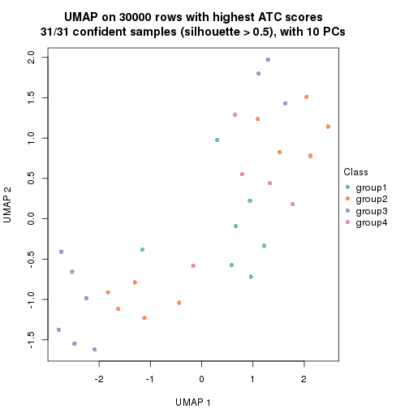</p>

</div>
<div id='tab-node-041-dimension-reduction-4'>
<pre><code class="r">dimension_reduction(res, k = 5, method = &quot;UMAP&quot;)
</code></pre>

<p></p>

</div>
<div id='tab-node-041-dimension-reduction-5'>
<pre><code class="r">dimension_reduction(res, k = 6, method = &quot;UMAP&quot;)
</code></pre>

<p></p>

</div>
<div id='tab-node-041-dimension-reduction-6'>
<pre><code class="r">dimension_reduction(res, k = 7, method = &quot;UMAP&quot;)
</code></pre>

<p></p>

</div>
<div id='tab-node-041-dimension-reduction-7'>
<pre><code class="r">dimension_reduction(res, k = 8, method = &quot;UMAP&quot;)
</code></pre>

<p></p>

</div>
</div>


Following heatmap shows how subgroups are split when increasing `k`:

```r
collect_classes(res)
```


If matrix rows can be associated to genes, consider to use `functional_enrichment(res,
...)` to perform function enrichment for the signature genes. See [this vignette](https://jokergoo.github.io/cola_vignettes/functional_enrichment.html) for more detailed explanations.


 

---------------------------------------------------


### Node042


Parent node: [Node04](#Node04).
Child nodes: 
                [Node0111](#Node0111)
        ,
                [Node0112](#Node0112)
        ,
                [Node0121](#Node0121)
        ,
                [Node0122](#Node0122)
        ,
                Node0211-leaf
        ,
                [Node0212](#Node0212)
        ,
                Node0411-leaf
        ,
                Node0412-leaf
        ,
                Node0413-leaf
        ,
                Node0414-leaf
        ,
                Node0421-leaf
        ,
                [Node0422](#Node0422)
        ,
                Node0423-leaf
        ,
                Node0431-leaf
        ,
                Node0432-leaf
        ,
                Node0433-leaf
        .


The object with results only for a single top-value method and a single partitioning method 
can be extracted as:

```r
res = res_rh["042"]
```

A summary of `res` and all the functions that can be applied to it:

```r
res
```

```
#> A 'ConsensusPartition' object with k = 2, 3, 4, 5, 6, 7, 8.
#>   On a matrix with 30000 rows and 34 columns.
#>   Top rows (1000) are extracted by 'ATC' method.
#>   Subgroups are detected by 'skmeans' method.
#>   Performed in total 350 partitions by row resampling.
#>   Best k for subgroups seems to be 4.
#> 
#> Following methods can be applied to this 'ConsensusPartition' object:
#>  [1] "cola_report"             "collect_classes"         "collect_plots"          
#>  [4] "collect_stats"           "colnames"                "compare_partitions"     
#>  [7] "compare_signatures"      "consensus_heatmap"       "dimension_reduction"    
#> [10] "functional_enrichment"   "get_anno_col"            "get_anno"               
#> [13] "get_classes"             "get_consensus"           "get_matrix"             
#> [16] "get_membership"          "get_param"               "get_signatures"         
#> [19] "get_stats"               "is_best_k"               "is_stable_k"            
#> [22] "membership_heatmap"      "ncol"                    "nrow"                   
#> [25] "plot_ecdf"               "predict_classes"         "rownames"               
#> [28] "select_partition_number" "show"                    "suggest_best_k"         
#> [31] "test_to_known_factors"   "top_rows_heatmap"
```

`collect_plots()` function collects all the plots made from `res` for all `k` (number of subgroups)
into one single page to provide an easy and fast comparison between different `k`.

```r
collect_plots(res)
```


The plots are:

- The first row: a plot of the eCDF (empirical cumulative distribution
  function) curves of the consensus matrix for each `k` and the heatmap of
  predicted classes for each `k`.
- The second row: heatmaps of the consensus matrix for each `k`.
- The third row: heatmaps of the membership matrix for each `k`.
- The fouth row: heatmaps of the signatures for each `k`.

All the plots in panels can be made by individual functions and they are
plotted later in this section.

`select_partition_number()` produces several plots showing different
statistics for choosing "optimized" `k`. There are following statistics:

- eCDF curves of the consensus matrix for each `k`;
- 1-PAC. [The PAC score](https://en.wikipedia.org/wiki/Consensus_clustering#Over-interpretation_potential_of_consensus_clustering)
  measures the proportion of the ambiguous subgrouping.
- Mean silhouette score.
- Concordance. The mean probability of fiting the consensus subgroup labels in all
  partitions.
- Area increased. Denote $A_k$ as the area under the eCDF curve for current
  `k`, the area increased is defined as $A_k - A_{k-1}$.
- Rand index. The percent of pairs of samples that are both in a same cluster
  or both are not in a same cluster in the partition of k and k-1.
- Jaccard index. The ratio of pairs of samples are both in a same cluster in
  the partition of k and k-1 and the pairs of samples are both in a same
  cluster in the partition k or k-1.

The detailed explanations of these statistics can be found in [the _cola_
vignette](https://jokergoo.github.io/cola_vignettes/cola.html#toc_13).

Generally speaking, higher 1-PAC score, higher mean silhouette score or higher
concordance corresponds to better partition. Rand index and Jaccard index
measure how similar the current partition is compared to partition with `k-1`.
If they are too similar, we won't accept `k` is better than `k-1`.

```r
select_partition_number(res)
```


The numeric values for all these statistics can be obtained by `get_stats()`.

```r
get_stats(res)
```

```
#>   k 1-PAC mean_silhouette concordance area_increased  Rand Jaccard
#> 2 2 1.000           1.000       1.000         0.5139 0.487   0.487
#> 3 3 1.000           1.000       1.000         0.2668 0.863   0.718
#> 4 4 1.000           1.000       1.000         0.0985 0.929   0.798
#> 5 5 0.829           0.928       0.905         0.0806 0.920   0.719
#> 6 6 0.778           0.681       0.861         0.0426 0.984   0.922
#> 7 7 0.738           0.775       0.863         0.0312 0.968   0.833
#> 8 8 0.790           0.752       0.867         0.0244 0.979   0.870
```

`suggest_best_k()` suggests the best $k$ based on these statistics. The rules are as follows:

- All $k$ with Jaccard index larger than 0.95 are removed because increasing
  $k$ does not provide enough extra information. If all $k$ are removed, it is
  marked as no subgroup is detected.
- For all $k$ with 1-PAC score larger than 0.9, the maximal $k$ is taken as
  the best $k$, and other $k$ are marked as optional $k$.
- If it does not fit the second rule. The $k$ with the maximal vote of the
  highest 1-PAC score, highest mean silhouette, and highest concordance is
  taken as the best $k$.

```r
suggest_best_k(res)
```

```
#> [1] 4
#> attr(,"optional")
#> [1] 2 3
```

There is also optional best $k$ = 2 3 that is worth to check.

Following is the table of the partitions (You need to click the **show/hide
code output** link to see it). The membership matrix (columns with name `p*`)
is inferred by
[`clue::cl_consensus()`](https://www.rdocumentation.org/link/cl_consensus?package=clue)
function with the `SE` method. Basically the value in the membership matrix
represents the probability to belong to a certain group. The finall subgroup
label for an item is determined with the group with highest probability it
belongs to.

In `get_classes()` function, the entropy is calculated from the membership
matrix and the silhouette score is calculated from the consensus matrix.


<script>
$( function() {
	$( '#tabs-node-042-get-classes' ).tabs();
} );
</script>
<div id='tabs-node-042-get-classes'>
<ul>
<li><a href='#tab-node-042-get-classes-1'>k = 2</a></li>
<li><a href='#tab-node-042-get-classes-2'>k = 3</a></li>
<li><a href='#tab-node-042-get-classes-3'>k = 4</a></li>
<li><a href='#tab-node-042-get-classes-4'>k = 5</a></li>
<li><a href='#tab-node-042-get-classes-5'>k = 6</a></li>
<li><a href='#tab-node-042-get-classes-6'>k = 7</a></li>
<li><a href='#tab-node-042-get-classes-7'>k = 8</a></li>
</ul>

<div id='tab-node-042-get-classes-1'>
<p><a id='tab-node-042-get-classes-1-a' style='color:#0366d6' href='#'>show/hide code output</a></p>
<pre><code class="r">cbind(get_classes(res, k = 2), get_membership(res, k = 2))
</code></pre>

<pre><code>#&gt;                 class entropy silhouette p1 p2
#&gt; TCGA.AZ.4308.01     1       0          1  1  0
#&gt; TCGA.D5.5541.01     1       0          1  1  0
#&gt; TCGA.A6.6648.01     1       0          1  1  0
#&gt; TCGA.AF.A56K.01     1       0          1  1  0
#&gt; TCGA.D5.6929.01     2       0          1  0  1
#&gt; TCGA.AF.6655.01     1       0          1  1  0
#&gt; TCGA.CM.6164.01     2       0          1  0  1
#&gt; TCGA.AF.2687.01     1       0          1  1  0
#&gt; TCGA.F4.6704.01     1       0          1  1  0
#&gt; TCGA.AG.3732.01     2       0          1  0  1
#&gt; TCGA.DC.4749.01     1       0          1  1  0
#&gt; TCGA.DC.6160.01     1       0          1  1  0
#&gt; TCGA.F5.6863.01     2       0          1  0  1
#&gt; TCGA.G4.6309.01     2       0          1  0  1
#&gt; TCGA.CM.5868.01     2       0          1  0  1
#&gt; TCGA.AZ.4313.01     2       0          1  0  1
#&gt; TCGA.A6.2675.01     1       0          1  1  0
#&gt; TCGA.CI.6624.01     2       0          1  0  1
#&gt; TCGA.CM.4752.01     1       0          1  1  0
#&gt; TCGA.DM.A0XF.01     2       0          1  0  1
#&gt; TCGA.AD.6963.01     1       0          1  1  0
#&gt; TCGA.A6.3810.01     1       0          1  1  0
#&gt; TCGA.DY.A0XA.01     2       0          1  0  1
#&gt; TCGA.DM.A28E.01     2       0          1  0  1
#&gt; TCGA.CI.6623.01     1       0          1  1  0
#&gt; TCGA.AU.3779.01     2       0          1  0  1
#&gt; TCGA.F4.6460.01     2       0          1  0  1
#&gt; TCGA.F5.6702.01     1       0          1  1  0
#&gt; TCGA.F5.6465.01     2       0          1  0  1
#&gt; TCGA.CM.5344.01     2       0          1  0  1
#&gt; TCGA.A6.6140.01     1       0          1  1  0
#&gt; TCGA.DM.A1D0.01     2       0          1  0  1
#&gt; TCGA.EI.6509.01     1       0          1  1  0
#&gt; TCGA.CI.6619.01     1       0          1  1  0
</code></pre>

<script>
$('#tab-node-042-get-classes-1-a').parent().next().next().hide();
$('#tab-node-042-get-classes-1-a').click(function(){
  $('#tab-node-042-get-classes-1-a').parent().next().next().toggle();
  return(false);
});
</script>
</div>

<div id='tab-node-042-get-classes-2'>
<p><a id='tab-node-042-get-classes-2-a' style='color:#0366d6' href='#'>show/hide code output</a></p>
<pre><code class="r">cbind(get_classes(res, k = 3), get_membership(res, k = 3))
</code></pre>

<pre><code>#&gt;                 class entropy silhouette p1 p2 p3
#&gt; TCGA.AZ.4308.01     1       0          1  1  0  0
#&gt; TCGA.D5.5541.01     1       0          1  1  0  0
#&gt; TCGA.A6.6648.01     1       0          1  1  0  0
#&gt; TCGA.AF.A56K.01     3       0          1  0  0  1
#&gt; TCGA.D5.6929.01     2       0          1  0  1  0
#&gt; TCGA.AF.6655.01     1       0          1  1  0  0
#&gt; TCGA.CM.6164.01     2       0          1  0  1  0
#&gt; TCGA.AF.2687.01     3       0          1  0  0  1
#&gt; TCGA.F4.6704.01     3       0          1  0  0  1
#&gt; TCGA.AG.3732.01     2       0          1  0  1  0
#&gt; TCGA.DC.4749.01     1       0          1  1  0  0
#&gt; TCGA.DC.6160.01     1       0          1  1  0  0
#&gt; TCGA.F5.6863.01     2       0          1  0  1  0
#&gt; TCGA.G4.6309.01     2       0          1  0  1  0
#&gt; TCGA.CM.5868.01     2       0          1  0  1  0
#&gt; TCGA.AZ.4313.01     2       0          1  0  1  0
#&gt; TCGA.A6.2675.01     1       0          1  1  0  0
#&gt; TCGA.CI.6624.01     2       0          1  0  1  0
#&gt; TCGA.CM.4752.01     3       0          1  0  0  1
#&gt; TCGA.DM.A0XF.01     2       0          1  0  1  0
#&gt; TCGA.AD.6963.01     3       0          1  0  0  1
#&gt; TCGA.A6.3810.01     1       0          1  1  0  0
#&gt; TCGA.DY.A0XA.01     2       0          1  0  1  0
#&gt; TCGA.DM.A28E.01     2       0          1  0  1  0
#&gt; TCGA.CI.6623.01     1       0          1  1  0  0
#&gt; TCGA.AU.3779.01     2       0          1  0  1  0
#&gt; TCGA.F4.6460.01     2       0          1  0  1  0
#&gt; TCGA.F5.6702.01     3       0          1  0  0  1
#&gt; TCGA.F5.6465.01     2       0          1  0  1  0
#&gt; TCGA.CM.5344.01     2       0          1  0  1  0
#&gt; TCGA.A6.6140.01     1       0          1  1  0  0
#&gt; TCGA.DM.A1D0.01     2       0          1  0  1  0
#&gt; TCGA.EI.6509.01     1       0          1  1  0  0
#&gt; TCGA.CI.6619.01     3       0          1  0  0  1
</code></pre>

<script>
$('#tab-node-042-get-classes-2-a').parent().next().next().hide();
$('#tab-node-042-get-classes-2-a').click(function(){
  $('#tab-node-042-get-classes-2-a').parent().next().next().toggle();
  return(false);
});
</script>
</div>

<div id='tab-node-042-get-classes-3'>
<p><a id='tab-node-042-get-classes-3-a' style='color:#0366d6' href='#'>show/hide code output</a></p>
<pre><code class="r">cbind(get_classes(res, k = 4), get_membership(res, k = 4))
</code></pre>

<pre><code>#&gt;                 class entropy silhouette p1 p2 p3 p4
#&gt; TCGA.AZ.4308.01     4       0          1  0  0  0  1
#&gt; TCGA.D5.5541.01     1       0          1  1  0  0  0
#&gt; TCGA.A6.6648.01     1       0          1  1  0  0  0
#&gt; TCGA.AF.A56K.01     3       0          1  0  0  1  0
#&gt; TCGA.D5.6929.01     4       0          1  0  0  0  1
#&gt; TCGA.AF.6655.01     1       0          1  1  0  0  0
#&gt; TCGA.CM.6164.01     2       0          1  0  1  0  0
#&gt; TCGA.AF.2687.01     3       0          1  0  0  1  0
#&gt; TCGA.F4.6704.01     3       0          1  0  0  1  0
#&gt; TCGA.AG.3732.01     2       0          1  0  1  0  0
#&gt; TCGA.DC.4749.01     1       0          1  1  0  0  0
#&gt; TCGA.DC.6160.01     1       0          1  1  0  0  0
#&gt; TCGA.F5.6863.01     2       0          1  0  1  0  0
#&gt; TCGA.G4.6309.01     2       0          1  0  1  0  0
#&gt; TCGA.CM.5868.01     2       0          1  0  1  0  0
#&gt; TCGA.AZ.4313.01     2       0          1  0  1  0  0
#&gt; TCGA.A6.2675.01     1       0          1  1  0  0  0
#&gt; TCGA.CI.6624.01     2       0          1  0  1  0  0
#&gt; TCGA.CM.4752.01     3       0          1  0  0  1  0
#&gt; TCGA.DM.A0XF.01     2       0          1  0  1  0  0
#&gt; TCGA.AD.6963.01     3       0          1  0  0  1  0
#&gt; TCGA.A6.3810.01     1       0          1  1  0  0  0
#&gt; TCGA.DY.A0XA.01     2       0          1  0  1  0  0
#&gt; TCGA.DM.A28E.01     2       0          1  0  1  0  0
#&gt; TCGA.CI.6623.01     1       0          1  1  0  0  0
#&gt; TCGA.AU.3779.01     2       0          1  0  1  0  0
#&gt; TCGA.F4.6460.01     2       0          1  0  1  0  0
#&gt; TCGA.F5.6702.01     3       0          1  0  0  1  0
#&gt; TCGA.F5.6465.01     2       0          1  0  1  0  0
#&gt; TCGA.CM.5344.01     4       0          1  0  0  0  1
#&gt; TCGA.A6.6140.01     1       0          1  1  0  0  0
#&gt; TCGA.DM.A1D0.01     2       0          1  0  1  0  0
#&gt; TCGA.EI.6509.01     1       0          1  1  0  0  0
#&gt; TCGA.CI.6619.01     3       0          1  0  0  1  0
</code></pre>

<script>
$('#tab-node-042-get-classes-3-a').parent().next().next().hide();
$('#tab-node-042-get-classes-3-a').click(function(){
  $('#tab-node-042-get-classes-3-a').parent().next().next().toggle();
  return(false);
});
</script>
</div>

<div id='tab-node-042-get-classes-4'>
<p><a id='tab-node-042-get-classes-4-a' style='color:#0366d6' href='#'>show/hide code output</a></p>
<pre><code class="r">cbind(get_classes(res, k = 5), get_membership(res, k = 5))
</code></pre>

<pre><code>#&gt;                 class entropy silhouette   p1   p2   p3   p4   p5
#&gt; TCGA.AZ.4308.01     4   0.293      0.795 0.00 0.00 0.00 0.82 0.18
#&gt; TCGA.D5.5541.01     1   0.000      0.950 1.00 0.00 0.00 0.00 0.00
#&gt; TCGA.A6.6648.01     1   0.000      0.950 1.00 0.00 0.00 0.00 0.00
#&gt; TCGA.AF.A56K.01     3   0.304      0.867 0.10 0.00 0.86 0.00 0.04
#&gt; TCGA.D5.6929.01     4   0.356      0.660 0.00 0.00 0.00 0.74 0.26
#&gt; TCGA.AF.6655.01     1   0.000      0.950 1.00 0.00 0.00 0.00 0.00
#&gt; TCGA.CM.6164.01     5   0.406      1.000 0.00 0.36 0.00 0.00 0.64
#&gt; TCGA.AF.2687.01     3   0.000      0.963 0.00 0.00 1.00 0.00 0.00
#&gt; TCGA.F4.6704.01     3   0.104      0.952 0.00 0.00 0.96 0.00 0.04
#&gt; TCGA.AG.3732.01     2   0.173      0.872 0.00 0.92 0.00 0.00 0.08
#&gt; TCGA.DC.4749.01     1   0.252      0.906 0.86 0.00 0.00 0.00 0.14
#&gt; TCGA.DC.6160.01     1   0.104      0.946 0.96 0.00 0.00 0.00 0.04
#&gt; TCGA.F5.6863.01     2   0.000      0.947 0.00 1.00 0.00 0.00 0.00
#&gt; TCGA.G4.6309.01     2   0.202      0.840 0.00 0.90 0.00 0.00 0.10
#&gt; TCGA.CM.5868.01     5   0.406      1.000 0.00 0.36 0.00 0.00 0.64
#&gt; TCGA.AZ.4313.01     5   0.406      1.000 0.00 0.36 0.00 0.00 0.64
#&gt; TCGA.A6.2675.01     1   0.000      0.950 1.00 0.00 0.00 0.00 0.00
#&gt; TCGA.CI.6624.01     5   0.406      1.000 0.00 0.36 0.00 0.00 0.64
#&gt; TCGA.CM.4752.01     3   0.000      0.963 0.00 0.00 1.00 0.00 0.00
#&gt; TCGA.DM.A0XF.01     2   0.104      0.922 0.00 0.96 0.00 0.00 0.04
#&gt; TCGA.AD.6963.01     3   0.165      0.944 0.02 0.00 0.94 0.00 0.04
#&gt; TCGA.A6.3810.01     1   0.104      0.946 0.96 0.00 0.00 0.00 0.04
#&gt; TCGA.DY.A0XA.01     2   0.000      0.947 0.00 1.00 0.00 0.00 0.00
#&gt; TCGA.DM.A28E.01     2   0.000      0.947 0.00 1.00 0.00 0.00 0.00
#&gt; TCGA.CI.6623.01     1   0.000      0.950 1.00 0.00 0.00 0.00 0.00
#&gt; TCGA.AU.3779.01     2   0.000      0.947 0.00 1.00 0.00 0.00 0.00
#&gt; TCGA.F4.6460.01     2   0.104      0.922 0.00 0.96 0.00 0.00 0.04
#&gt; TCGA.F5.6702.01     3   0.000      0.963 0.00 0.00 1.00 0.00 0.00
#&gt; TCGA.F5.6465.01     5   0.406      1.000 0.00 0.36 0.00 0.00 0.64
#&gt; TCGA.CM.5344.01     4   0.000      0.818 0.00 0.00 0.00 1.00 0.00
#&gt; TCGA.A6.6140.01     1   0.252      0.906 0.86 0.00 0.00 0.00 0.14
#&gt; TCGA.DM.A1D0.01     2   0.000      0.947 0.00 1.00 0.00 0.00 0.00
#&gt; TCGA.EI.6509.01     1   0.252      0.906 0.86 0.00 0.00 0.00 0.14
#&gt; TCGA.CI.6619.01     3   0.000      0.963 0.00 0.00 1.00 0.00 0.00
</code></pre>

<script>
$('#tab-node-042-get-classes-4-a').parent().next().next().hide();
$('#tab-node-042-get-classes-4-a').click(function(){
  $('#tab-node-042-get-classes-4-a').parent().next().next().toggle();
  return(false);
});
</script>
</div>

<div id='tab-node-042-get-classes-5'>
<p><a id='tab-node-042-get-classes-5-a' style='color:#0366d6' href='#'>show/hide code output</a></p>
<pre><code class="r">cbind(get_classes(res, k = 6), get_membership(res, k = 6))
</code></pre>

<pre><code>#&gt;                 class entropy silhouette   p1   p2   p3   p4   p5   p6
#&gt; TCGA.AZ.4308.01     4  0.5324      0.579 0.00 0.00 0.00 0.54 0.12 0.34
#&gt; TCGA.D5.5541.01     1  0.0547      0.669 0.98 0.00 0.00 0.00 0.00 0.02
#&gt; TCGA.A6.6648.01     1  0.0547      0.669 0.98 0.00 0.00 0.00 0.00 0.02
#&gt; TCGA.AF.A56K.01     3  0.5813      0.634 0.20 0.00 0.62 0.00 0.06 0.12
#&gt; TCGA.D5.6929.01     4  0.3309      0.522 0.00 0.00 0.00 0.72 0.28 0.00
#&gt; TCGA.AF.6655.01     1  0.0547      0.664 0.98 0.00 0.00 0.00 0.00 0.02
#&gt; TCGA.CM.6164.01     5  0.2631      0.977 0.00 0.18 0.00 0.00 0.82 0.00
#&gt; TCGA.AF.2687.01     3  0.0547      0.864 0.00 0.00 0.98 0.00 0.00 0.02
#&gt; TCGA.F4.6704.01     3  0.2794      0.825 0.00 0.00 0.86 0.00 0.06 0.08
#&gt; TCGA.AG.3732.01     2  0.1814      0.872 0.00 0.90 0.00 0.00 0.10 0.00
#&gt; TCGA.DC.4749.01     1  0.3864     -0.891 0.52 0.00 0.00 0.00 0.00 0.48
#&gt; TCGA.DC.6160.01     1  0.2260      0.514 0.86 0.00 0.00 0.00 0.00 0.14
#&gt; TCGA.F5.6863.01     2  0.0000      0.939 0.00 1.00 0.00 0.00 0.00 0.00
#&gt; TCGA.G4.6309.01     2  0.2631      0.768 0.00 0.82 0.00 0.00 0.18 0.00
#&gt; TCGA.CM.5868.01     5  0.2793      0.968 0.00 0.20 0.00 0.00 0.80 0.00
#&gt; TCGA.AZ.4313.01     5  0.2631      0.977 0.00 0.18 0.00 0.00 0.82 0.00
#&gt; TCGA.A6.2675.01     1  0.0547      0.669 0.98 0.00 0.00 0.00 0.00 0.02
#&gt; TCGA.CI.6624.01     5  0.2631      0.977 0.00 0.18 0.00 0.00 0.82 0.00
#&gt; TCGA.CM.4752.01     3  0.0547      0.864 0.00 0.00 0.98 0.00 0.00 0.02
#&gt; TCGA.DM.A0XF.01     2  0.1267      0.917 0.00 0.94 0.00 0.00 0.06 0.00
#&gt; TCGA.AD.6963.01     3  0.4733      0.763 0.08 0.00 0.74 0.00 0.06 0.12
#&gt; TCGA.A6.3810.01     1  0.1814      0.586 0.90 0.00 0.00 0.00 0.00 0.10
#&gt; TCGA.DY.A0XA.01     2  0.0000      0.939 0.00 1.00 0.00 0.00 0.00 0.00
#&gt; TCGA.DM.A28E.01     2  0.0000      0.939 0.00 1.00 0.00 0.00 0.00 0.00
#&gt; TCGA.CI.6623.01     1  0.0547      0.669 0.98 0.00 0.00 0.00 0.00 0.02
#&gt; TCGA.AU.3779.01     2  0.0000      0.939 0.00 1.00 0.00 0.00 0.00 0.00
#&gt; TCGA.F4.6460.01     2  0.1267      0.913 0.00 0.94 0.00 0.00 0.06 0.00
#&gt; TCGA.F5.6702.01     3  0.0000      0.864 0.00 0.00 1.00 0.00 0.00 0.00
#&gt; TCGA.F5.6465.01     5  0.2941      0.947 0.00 0.22 0.00 0.00 0.78 0.00
#&gt; TCGA.CM.5344.01     4  0.0547      0.695 0.00 0.00 0.00 0.98 0.02 0.00
#&gt; TCGA.A6.6140.01     1  0.3864     -0.891 0.52 0.00 0.00 0.00 0.00 0.48
#&gt; TCGA.DM.A1D0.01     2  0.0000      0.939 0.00 1.00 0.00 0.00 0.00 0.00
#&gt; TCGA.EI.6509.01     6  0.3864      0.000 0.48 0.00 0.00 0.00 0.00 0.52
#&gt; TCGA.CI.6619.01     3  0.0547      0.864 0.00 0.00 0.98 0.00 0.00 0.02
</code></pre>

<script>
$('#tab-node-042-get-classes-5-a').parent().next().next().hide();
$('#tab-node-042-get-classes-5-a').click(function(){
  $('#tab-node-042-get-classes-5-a').parent().next().next().toggle();
  return(false);
});
</script>
</div>

<div id='tab-node-042-get-classes-6'>
<p><a id='tab-node-042-get-classes-6-a' style='color:#0366d6' href='#'>show/hide code output</a></p>
<pre><code class="r">cbind(get_classes(res, k = 7), get_membership(res, k = 7))
</code></pre>

<pre><code>#&gt;                 class entropy silhouette   p1   p2   p3   p4   p5   p6   p7
#&gt; TCGA.AZ.4308.01     7  0.0000      0.000 0.00 0.00 0.00 0.00 0.00 0.00 1.00
#&gt; TCGA.D5.5541.01     1  0.1166      0.796 0.94 0.00 0.00 0.00 0.00 0.06 0.00
#&gt; TCGA.A6.6648.01     1  0.1166      0.805 0.94 0.00 0.00 0.00 0.00 0.06 0.00
#&gt; TCGA.AF.A56K.01     3  0.7669      0.307 0.28 0.00 0.34 0.18 0.10 0.10 0.00
#&gt; TCGA.D5.6929.01     4  0.3670      0.687 0.00 0.00 0.00 0.76 0.14 0.00 0.10
#&gt; TCGA.AF.6655.01     1  0.3315      0.768 0.82 0.00 0.00 0.08 0.02 0.08 0.00
#&gt; TCGA.CM.6164.01     5  0.2081      0.962 0.00 0.14 0.00 0.00 0.86 0.00 0.00
#&gt; TCGA.AF.2687.01     3  0.0000      0.751 0.00 0.00 1.00 0.00 0.00 0.00 0.00
#&gt; TCGA.F4.6704.01     3  0.4405      0.666 0.00 0.00 0.74 0.10 0.08 0.08 0.00
#&gt; TCGA.AG.3732.01     2  0.2081      0.837 0.00 0.86 0.00 0.00 0.14 0.00 0.00
#&gt; TCGA.DC.4749.01     6  0.3047      0.862 0.28 0.00 0.00 0.00 0.00 0.72 0.00
#&gt; TCGA.DC.6160.01     1  0.2081      0.723 0.86 0.00 0.00 0.00 0.00 0.14 0.00
#&gt; TCGA.F5.6863.01     2  0.0000      0.916 0.00 1.00 0.00 0.00 0.00 0.00 0.00
#&gt; TCGA.G4.6309.01     2  0.2572      0.764 0.00 0.80 0.00 0.00 0.20 0.00 0.00
#&gt; TCGA.CM.5868.01     5  0.1886      0.970 0.00 0.12 0.00 0.00 0.88 0.00 0.00
#&gt; TCGA.AZ.4313.01     5  0.1886      0.970 0.00 0.12 0.00 0.00 0.88 0.00 0.00
#&gt; TCGA.A6.2675.01     1  0.2769      0.799 0.86 0.00 0.00 0.08 0.04 0.02 0.00
#&gt; TCGA.CI.6624.01     5  0.1886      0.970 0.00 0.12 0.00 0.00 0.88 0.00 0.00
#&gt; TCGA.CM.4752.01     3  0.0000      0.751 0.00 0.00 1.00 0.00 0.00 0.00 0.00
#&gt; TCGA.DM.A0XF.01     2  0.1886      0.862 0.00 0.88 0.00 0.00 0.12 0.00 0.00
#&gt; TCGA.AD.6963.01     3  0.7041      0.505 0.12 0.00 0.50 0.18 0.10 0.10 0.00
#&gt; TCGA.A6.3810.01     1  0.2081      0.723 0.86 0.00 0.00 0.00 0.00 0.14 0.00
#&gt; TCGA.DY.A0XA.01     2  0.0000      0.916 0.00 1.00 0.00 0.00 0.00 0.00 0.00
#&gt; TCGA.DM.A28E.01     2  0.0000      0.916 0.00 1.00 0.00 0.00 0.00 0.00 0.00
#&gt; TCGA.CI.6623.01     1  0.2769      0.799 0.86 0.00 0.00 0.08 0.04 0.02 0.00
#&gt; TCGA.AU.3779.01     2  0.0000      0.916 0.00 1.00 0.00 0.00 0.00 0.00 0.00
#&gt; TCGA.F4.6460.01     2  0.1886      0.854 0.00 0.88 0.00 0.00 0.12 0.00 0.00
#&gt; TCGA.F5.6702.01     3  0.0504      0.750 0.00 0.00 0.98 0.02 0.00 0.00 0.00
#&gt; TCGA.F5.6465.01     5  0.2422      0.918 0.00 0.18 0.00 0.00 0.82 0.00 0.00
#&gt; TCGA.CM.5344.01     4  0.3047      0.644 0.00 0.00 0.00 0.72 0.00 0.00 0.28
#&gt; TCGA.A6.6140.01     6  0.3047      0.862 0.28 0.00 0.00 0.00 0.00 0.72 0.00
#&gt; TCGA.DM.A1D0.01     2  0.0000      0.916 0.00 1.00 0.00 0.00 0.00 0.00 0.00
#&gt; TCGA.EI.6509.01     6  0.2376      0.722 0.12 0.00 0.00 0.02 0.00 0.86 0.00
#&gt; TCGA.CI.6619.01     3  0.0000      0.751 0.00 0.00 1.00 0.00 0.00 0.00 0.00
</code></pre>

<script>
$('#tab-node-042-get-classes-6-a').parent().next().next().hide();
$('#tab-node-042-get-classes-6-a').click(function(){
  $('#tab-node-042-get-classes-6-a').parent().next().next().toggle();
  return(false);
});
</script>
</div>

<div id='tab-node-042-get-classes-7'>
<p><a id='tab-node-042-get-classes-7-a' style='color:#0366d6' href='#'>show/hide code output</a></p>
<pre><code class="r">cbind(get_classes(res, k = 8), get_membership(res, k = 8))
</code></pre>

<pre><code>#&gt;                 class entropy silhouette   p1   p2   p3   p4   p5   p6   p7   p8
#&gt; TCGA.AZ.4308.01     7  0.0000      0.000 0.00 0.00 0.00 0.00 0.00 0.00 1.00 0.00
#&gt; TCGA.D5.5541.01     1  0.2818      0.685 0.82 0.00 0.00 0.00 0.00 0.12 0.00 0.06
#&gt; TCGA.A6.6648.01     1  0.2888      0.666 0.80 0.00 0.00 0.00 0.00 0.16 0.00 0.04
#&gt; TCGA.AF.A56K.01     8  0.3263      0.630 0.12 0.00 0.10 0.00 0.00 0.00 0.00 0.78
#&gt; TCGA.D5.6929.01     4  0.0000      0.959 0.00 0.00 0.00 1.00 0.00 0.00 0.00 0.00
#&gt; TCGA.AF.6655.01     1  0.2864      0.674 0.84 0.00 0.00 0.00 0.02 0.06 0.00 0.08
#&gt; TCGA.CM.6164.01     5  0.1091      0.955 0.00 0.06 0.00 0.00 0.94 0.00 0.00 0.00
#&gt; TCGA.AF.2687.01     3  0.0000      0.952 0.00 0.00 1.00 0.00 0.00 0.00 0.00 0.00
#&gt; TCGA.F4.6704.01     8  0.3272      0.539 0.00 0.00 0.42 0.00 0.00 0.00 0.00 0.58
#&gt; TCGA.AG.3732.01     2  0.2756      0.678 0.00 0.74 0.00 0.00 0.26 0.00 0.00 0.00
#&gt; TCGA.DC.4749.01     6  0.2406      0.742 0.20 0.00 0.00 0.00 0.00 0.80 0.00 0.00
#&gt; TCGA.DC.6160.01     1  0.3142      0.477 0.64 0.00 0.00 0.00 0.00 0.36 0.00 0.00
#&gt; TCGA.F5.6863.01     2  0.0000      0.848 0.00 1.00 0.00 0.00 0.00 0.00 0.00 0.00
#&gt; TCGA.G4.6309.01     2  0.3015      0.590 0.00 0.68 0.00 0.00 0.32 0.00 0.00 0.00
#&gt; TCGA.CM.5868.01     5  0.0808      0.963 0.00 0.04 0.00 0.00 0.96 0.00 0.00 0.00
#&gt; TCGA.AZ.4313.01     5  0.0808      0.963 0.00 0.04 0.00 0.00 0.96 0.00 0.00 0.00
#&gt; TCGA.A6.2675.01     1  0.2859      0.657 0.82 0.00 0.00 0.00 0.02 0.02 0.00 0.14
#&gt; TCGA.CI.6624.01     5  0.0808      0.963 0.00 0.04 0.00 0.00 0.96 0.00 0.00 0.00
#&gt; TCGA.CM.4752.01     3  0.0471      0.950 0.00 0.00 0.98 0.00 0.00 0.00 0.00 0.02
#&gt; TCGA.DM.A0XF.01     2  0.2852      0.666 0.00 0.72 0.00 0.00 0.28 0.00 0.00 0.00
#&gt; TCGA.AD.6963.01     8  0.3198      0.731 0.02 0.00 0.26 0.00 0.00 0.00 0.00 0.72
#&gt; TCGA.A6.3810.01     1  0.3015      0.546 0.68 0.00 0.00 0.00 0.00 0.32 0.00 0.00
#&gt; TCGA.DY.A0XA.01     2  0.0000      0.848 0.00 1.00 0.00 0.00 0.00 0.00 0.00 0.00
#&gt; TCGA.DM.A28E.01     2  0.0000      0.848 0.00 1.00 0.00 0.00 0.00 0.00 0.00 0.00
#&gt; TCGA.CI.6623.01     1  0.2888      0.633 0.80 0.00 0.00 0.00 0.04 0.00 0.00 0.16
#&gt; TCGA.AU.3779.01     2  0.0000      0.848 0.00 1.00 0.00 0.00 0.00 0.00 0.00 0.00
#&gt; TCGA.F4.6460.01     2  0.2404      0.768 0.00 0.84 0.00 0.02 0.14 0.00 0.00 0.00
#&gt; TCGA.F5.6702.01     3  0.1341      0.886 0.00 0.00 0.92 0.00 0.00 0.00 0.00 0.08
#&gt; TCGA.F5.6465.01     5  0.1765      0.888 0.00 0.12 0.00 0.00 0.88 0.00 0.00 0.00
#&gt; TCGA.CM.5344.01     4  0.0808      0.958 0.00 0.00 0.00 0.96 0.00 0.00 0.04 0.00
#&gt; TCGA.A6.6140.01     6  0.2534      0.721 0.22 0.00 0.00 0.00 0.00 0.78 0.00 0.00
#&gt; TCGA.DM.A1D0.01     2  0.0000      0.848 0.00 1.00 0.00 0.00 0.00 0.00 0.00 0.00
#&gt; TCGA.EI.6509.01     6  0.1765      0.540 0.00 0.00 0.00 0.00 0.00 0.88 0.00 0.12
#&gt; TCGA.CI.6619.01     3  0.0000      0.952 0.00 0.00 1.00 0.00 0.00 0.00 0.00 0.00
</code></pre>

<script>
$('#tab-node-042-get-classes-7-a').parent().next().next().hide();
$('#tab-node-042-get-classes-7-a').click(function(){
  $('#tab-node-042-get-classes-7-a').parent().next().next().toggle();
  return(false);
});
</script>
</div>
</div>

Heatmaps for the consensus matrix. It visualizes the probability of two
samples to be in a same group.


<script>
$( function() {
	$( '#tabs-node-042-consensus-heatmap' ).tabs();
} );
</script>
<div id='tabs-node-042-consensus-heatmap'>
<ul>
<li><a href='#tab-node-042-consensus-heatmap-1'>k = 2</a></li>
<li><a href='#tab-node-042-consensus-heatmap-2'>k = 3</a></li>
<li><a href='#tab-node-042-consensus-heatmap-3'>k = 4</a></li>
<li><a href='#tab-node-042-consensus-heatmap-4'>k = 5</a></li>
<li><a href='#tab-node-042-consensus-heatmap-5'>k = 6</a></li>
<li><a href='#tab-node-042-consensus-heatmap-6'>k = 7</a></li>
<li><a href='#tab-node-042-consensus-heatmap-7'>k = 8</a></li>
</ul>
<div id='tab-node-042-consensus-heatmap-1'>
<pre><code class="r">consensus_heatmap(res, k = 2)
</code></pre>

<p></p>

</div>
<div id='tab-node-042-consensus-heatmap-2'>
<pre><code class="r">consensus_heatmap(res, k = 3)
</code></pre>

<p></p>

</div>
<div id='tab-node-042-consensus-heatmap-3'>
<pre><code class="r">consensus_heatmap(res, k = 4)
</code></pre>

<p></p>

</div>
<div id='tab-node-042-consensus-heatmap-4'>
<pre><code class="r">consensus_heatmap(res, k = 5)
</code></pre>

<p>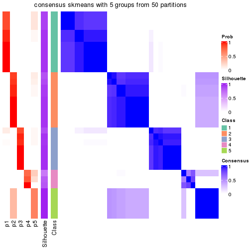</p>

</div>
<div id='tab-node-042-consensus-heatmap-5'>
<pre><code class="r">consensus_heatmap(res, k = 6)
</code></pre>

<p></p>

</div>
<div id='tab-node-042-consensus-heatmap-6'>
<pre><code class="r">consensus_heatmap(res, k = 7)
</code></pre>

<p></p>

</div>
<div id='tab-node-042-consensus-heatmap-7'>
<pre><code class="r">consensus_heatmap(res, k = 8)
</code></pre>

<p></p>

</div>
</div>

Heatmaps for the membership of samples in all partitions to see how consistent they are:


<script>
$( function() {
	$( '#tabs-node-042-membership-heatmap' ).tabs();
} );
</script>
<div id='tabs-node-042-membership-heatmap'>
<ul>
<li><a href='#tab-node-042-membership-heatmap-1'>k = 2</a></li>
<li><a href='#tab-node-042-membership-heatmap-2'>k = 3</a></li>
<li><a href='#tab-node-042-membership-heatmap-3'>k = 4</a></li>
<li><a href='#tab-node-042-membership-heatmap-4'>k = 5</a></li>
<li><a href='#tab-node-042-membership-heatmap-5'>k = 6</a></li>
<li><a href='#tab-node-042-membership-heatmap-6'>k = 7</a></li>
<li><a href='#tab-node-042-membership-heatmap-7'>k = 8</a></li>
</ul>
<div id='tab-node-042-membership-heatmap-1'>
<pre><code class="r">membership_heatmap(res, k = 2)
</code></pre>

<p></p>

</div>
<div id='tab-node-042-membership-heatmap-2'>
<pre><code class="r">membership_heatmap(res, k = 3)
</code></pre>

<p></p>

</div>
<div id='tab-node-042-membership-heatmap-3'>
<pre><code class="r">membership_heatmap(res, k = 4)
</code></pre>

<p></p>

</div>
<div id='tab-node-042-membership-heatmap-4'>
<pre><code class="r">membership_heatmap(res, k = 5)
</code></pre>

<p></p>

</div>
<div id='tab-node-042-membership-heatmap-5'>
<pre><code class="r">membership_heatmap(res, k = 6)
</code></pre>

<p></p>

</div>
<div id='tab-node-042-membership-heatmap-6'>
<pre><code class="r">membership_heatmap(res, k = 7)
</code></pre>

<p></p>

</div>
<div id='tab-node-042-membership-heatmap-7'>
<pre><code class="r">membership_heatmap(res, k = 8)
</code></pre>

<p>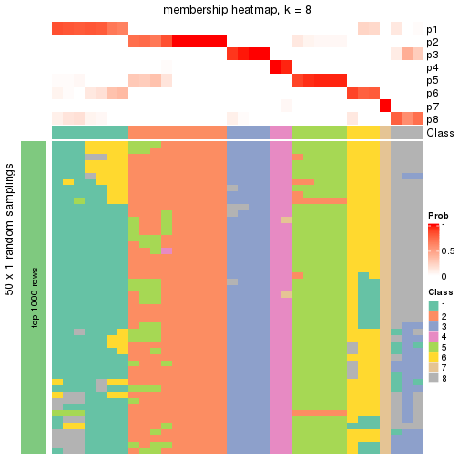</p>

</div>
</div>

As soon as the classes for columns are determined, the signatures
that are significantly different between subgroups can be looked for. 
Following are the heatmaps for signatures.


<script>
$( function() {
	$( '#tabs-node-042-get-signatures' ).tabs();
} );
</script>
<div id='tabs-node-042-get-signatures'>
<ul>
<li><a href='#tab-node-042-get-signatures-1'>k = 2</a></li>
<li><a href='#tab-node-042-get-signatures-2'>k = 3</a></li>
<li><a href='#tab-node-042-get-signatures-3'>k = 4</a></li>
<li><a href='#tab-node-042-get-signatures-4'>k = 5</a></li>
<li><a href='#tab-node-042-get-signatures-5'>k = 6</a></li>
<li><a href='#tab-node-042-get-signatures-6'>k = 7</a></li>
<li><a href='#tab-node-042-get-signatures-7'>k = 8</a></li>
</ul>
<div id='tab-node-042-get-signatures-1'>
<pre><code class="r">get_signatures(res, k = 2)
</code></pre>

<p></p>

</div>
<div id='tab-node-042-get-signatures-2'>
<pre><code class="r">get_signatures(res, k = 3)
</code></pre>

<p></p>

</div>
<div id='tab-node-042-get-signatures-3'>
<pre><code class="r">get_signatures(res, k = 4)
</code></pre>

<p></p>

</div>
<div id='tab-node-042-get-signatures-4'>
<pre><code class="r">get_signatures(res, k = 5)
</code></pre>

<p></p>

</div>
<div id='tab-node-042-get-signatures-5'>
<pre><code class="r">get_signatures(res, k = 6)
</code></pre>

<p>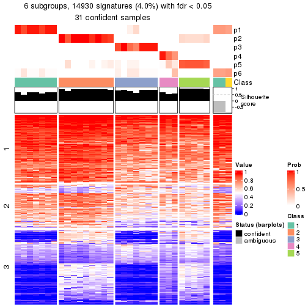</p>

</div>
<div id='tab-node-042-get-signatures-6'>
<pre><code class="r">get_signatures(res, k = 7)
</code></pre>

<p></p>

</div>
<div id='tab-node-042-get-signatures-7'>
<pre><code class="r">get_signatures(res, k = 8)
</code></pre>

<p></p>

</div>
</div>


Compare the overlap of signatures from different k:

```r
compare_signatures(res)
```


`get_signature()` returns a data frame invisibly. To get the list of signatures, the function
call should be assigned to a variable explicitly. In following code, if `plot` argument is set
to `FALSE`, no heatmap is plotted while only the differential analysis is performed.

```r
# code only for demonstration
tb = get_signature(res, k = ..., plot = FALSE)
```

An example of the output of `tb` is:

```
#>   which_row         fdr    mean_1    mean_2 scaled_mean_1 scaled_mean_2 km
#> 1        38 0.042760348  8.373488  9.131774    -0.5533452     0.5164555  1
#> 2        40 0.018707592  7.106213  8.469186    -0.6173731     0.5762149  1
#> 3        55 0.019134737 10.221463 11.207825    -0.6159697     0.5749050  1
#> 4        59 0.006059896  5.921854  7.869574    -0.6899429     0.6439467  1
#> 5        60 0.018055526  8.928898 10.211722    -0.6204761     0.5791110  1
#> 6        98 0.009384629 15.714769 14.887706     0.6635654    -0.6193277  2
...
```

The columns in `tb` are:

1. `which_row`: row indices corresponding to the input matrix.
2. `fdr`: FDR for the differential test. 
3. `mean_x`: The mean value in group x.
4. `scaled_mean_x`: The mean value in group x after rows are scaled.
5. `km`: Row groups if k-means clustering is applied to rows (which is done by automatically selecting number of clusters).

If there are too many signatures, `top_signatures = ...` can be set to only show the 
signatures with the highest FDRs:

```r
# code only for demonstration
# e.g. to show the top 500 most significant rows
tb = get_signature(res, k = ..., top_signatures = 500)
```

If the signatures are defined as these which are uniquely high in current group, `diff_method` argument
can be set to `"uniquely_high_in_one_group"`:

```r
# code only for demonstration
tb = get_signature(res, k = ..., diff_method = "uniquely_high_in_one_group")
```


UMAP plot which shows how samples are separated.


<script>
$( function() {
	$( '#tabs-node-042-dimension-reduction' ).tabs();
} );
</script>
<div id='tabs-node-042-dimension-reduction'>
<ul>
<li><a href='#tab-node-042-dimension-reduction-1'>k = 2</a></li>
<li><a href='#tab-node-042-dimension-reduction-2'>k = 3</a></li>
<li><a href='#tab-node-042-dimension-reduction-3'>k = 4</a></li>
<li><a href='#tab-node-042-dimension-reduction-4'>k = 5</a></li>
<li><a href='#tab-node-042-dimension-reduction-5'>k = 6</a></li>
<li><a href='#tab-node-042-dimension-reduction-6'>k = 7</a></li>
<li><a href='#tab-node-042-dimension-reduction-7'>k = 8</a></li>
</ul>
<div id='tab-node-042-dimension-reduction-1'>
<pre><code class="r">dimension_reduction(res, k = 2, method = &quot;UMAP&quot;)
</code></pre>

<p></p>

</div>
<div id='tab-node-042-dimension-reduction-2'>
<pre><code class="r">dimension_reduction(res, k = 3, method = &quot;UMAP&quot;)
</code></pre>

<p>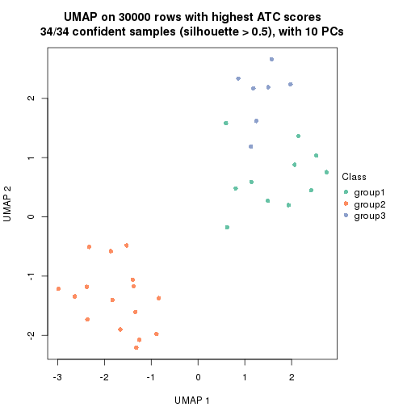</p>

</div>
<div id='tab-node-042-dimension-reduction-3'>
<pre><code class="r">dimension_reduction(res, k = 4, method = &quot;UMAP&quot;)
</code></pre>

<p></p>

</div>
<div id='tab-node-042-dimension-reduction-4'>
<pre><code class="r">dimension_reduction(res, k = 5, method = &quot;UMAP&quot;)
</code></pre>

<p></p>

</div>
<div id='tab-node-042-dimension-reduction-5'>
<pre><code class="r">dimension_reduction(res, k = 6, method = &quot;UMAP&quot;)
</code></pre>

<p></p>

</div>
<div id='tab-node-042-dimension-reduction-6'>
<pre><code class="r">dimension_reduction(res, k = 7, method = &quot;UMAP&quot;)
</code></pre>

<p></p>

</div>
<div id='tab-node-042-dimension-reduction-7'>
<pre><code class="r">dimension_reduction(res, k = 8, method = &quot;UMAP&quot;)
</code></pre>

<p></p>

</div>
</div>


Following heatmap shows how subgroups are split when increasing `k`:

```r
collect_classes(res)
```


If matrix rows can be associated to genes, consider to use `functional_enrichment(res,
...)` to perform function enrichment for the signature genes. See [this vignette](https://jokergoo.github.io/cola_vignettes/functional_enrichment.html) for more detailed explanations.


 

---------------------------------------------------


### Node0422


Parent node: [Node042](#Node042).
Child nodes: 
                [Node01111](#Node01111)
        ,
                Node01112-leaf
        ,
                Node01113-leaf
        ,
                Node01114-leaf
        ,
                Node01121-leaf
        ,
                Node01122-leaf
        ,
                Node01123-leaf
        ,
                Node01124-leaf
        ,
                Node01211-leaf
        ,
                Node01212-leaf
        ,
                Node01213-leaf
        ,
                Node01221-leaf
        ,
                Node01222-leaf
        ,
                Node01223-leaf
        ,
                Node01224-leaf
        ,
                Node02121-leaf
        ,
                Node02122-leaf
        ,
                Node02123-leaf
        ,
                Node04221-leaf
        ,
                Node04222-leaf
        ,
                Node04223-leaf
        .


The object with results only for a single top-value method and a single partitioning method 
can be extracted as:

```r
res = res_rh["0422"]
```

A summary of `res` and all the functions that can be applied to it:

```r
res
```

```
#> A 'ConsensusPartition' object with k = 2, 3, 4, 5, 6, 7, 8.
#>   On a matrix with 30000 rows and 16 columns.
#>   Top rows (1000) are extracted by 'ATC' method.
#>   Subgroups are detected by 'kmeans' method.
#>   Performed in total 350 partitions by row resampling.
#>   Best k for subgroups seems to be 3.
#> 
#> Following methods can be applied to this 'ConsensusPartition' object:
#>  [1] "cola_report"             "collect_classes"         "collect_plots"          
#>  [4] "collect_stats"           "colnames"                "compare_partitions"     
#>  [7] "compare_signatures"      "consensus_heatmap"       "dimension_reduction"    
#> [10] "functional_enrichment"   "get_anno_col"            "get_anno"               
#> [13] "get_classes"             "get_consensus"           "get_matrix"             
#> [16] "get_membership"          "get_param"               "get_signatures"         
#> [19] "get_stats"               "is_best_k"               "is_stable_k"            
#> [22] "membership_heatmap"      "ncol"                    "nrow"                   
#> [25] "plot_ecdf"               "predict_classes"         "rownames"               
#> [28] "select_partition_number" "show"                    "suggest_best_k"         
#> [31] "test_to_known_factors"   "top_rows_heatmap"
```

`collect_plots()` function collects all the plots made from `res` for all `k` (number of subgroups)
into one single page to provide an easy and fast comparison between different `k`.

```r
collect_plots(res)
```


The plots are:

- The first row: a plot of the eCDF (empirical cumulative distribution
  function) curves of the consensus matrix for each `k` and the heatmap of
  predicted classes for each `k`.
- The second row: heatmaps of the consensus matrix for each `k`.
- The third row: heatmaps of the membership matrix for each `k`.
- The fouth row: heatmaps of the signatures for each `k`.

All the plots in panels can be made by individual functions and they are
plotted later in this section.

`select_partition_number()` produces several plots showing different
statistics for choosing "optimized" `k`. There are following statistics:

- eCDF curves of the consensus matrix for each `k`;
- 1-PAC. [The PAC score](https://en.wikipedia.org/wiki/Consensus_clustering#Over-interpretation_potential_of_consensus_clustering)
  measures the proportion of the ambiguous subgrouping.
- Mean silhouette score.
- Concordance. The mean probability of fiting the consensus subgroup labels in all
  partitions.
- Area increased. Denote $A_k$ as the area under the eCDF curve for current
  `k`, the area increased is defined as $A_k - A_{k-1}$.
- Rand index. The percent of pairs of samples that are both in a same cluster
  or both are not in a same cluster in the partition of k and k-1.
- Jaccard index. The ratio of pairs of samples are both in a same cluster in
  the partition of k and k-1 and the pairs of samples are both in a same
  cluster in the partition k or k-1.

The detailed explanations of these statistics can be found in [the _cola_
vignette](https://jokergoo.github.io/cola_vignettes/cola.html#toc_13).

Generally speaking, higher 1-PAC score, higher mean silhouette score or higher
concordance corresponds to better partition. Rand index and Jaccard index
measure how similar the current partition is compared to partition with `k-1`.
If they are too similar, we won't accept `k` is better than `k-1`.

```r
select_partition_number(res)
```


The numeric values for all these statistics can be obtained by `get_stats()`.

```r
get_stats(res)
```

```
#>   k 1-PAC mean_silhouette concordance area_increased  Rand Jaccard
#> 2 2 1.000           1.000       1.000         0.5255 0.475   0.475
#> 3 3 1.000           1.000       1.000         0.2852 0.750   0.524
#> 4 4 0.850           0.829       0.910         0.1173 0.900   0.700
#> 5 5 0.883           0.931       0.906         0.0680 0.933   0.724
#> 6 6 0.817           0.820       0.861         0.0393 1.000   1.000
#> 7 7 0.817           0.733       0.856         0.0370 0.967   0.810
#> 8 8 0.842           0.510       0.749         0.0275 0.975   0.824
```

`suggest_best_k()` suggests the best $k$ based on these statistics. The rules are as follows:

- All $k$ with Jaccard index larger than 0.95 are removed because increasing
  $k$ does not provide enough extra information. If all $k$ are removed, it is
  marked as no subgroup is detected.
- For all $k$ with 1-PAC score larger than 0.9, the maximal $k$ is taken as
  the best $k$, and other $k$ are marked as optional $k$.
- If it does not fit the second rule. The $k$ with the maximal vote of the
  highest 1-PAC score, highest mean silhouette, and highest concordance is
  taken as the best $k$.

```r
suggest_best_k(res)
```

```
#> [1] 3
#> attr(,"optional")
#> [1] 2
```

There is also optional best $k$ = 2 that is worth to check.

Following is the table of the partitions (You need to click the **show/hide
code output** link to see it). The membership matrix (columns with name `p*`)
is inferred by
[`clue::cl_consensus()`](https://www.rdocumentation.org/link/cl_consensus?package=clue)
function with the `SE` method. Basically the value in the membership matrix
represents the probability to belong to a certain group. The finall subgroup
label for an item is determined with the group with highest probability it
belongs to.

In `get_classes()` function, the entropy is calculated from the membership
matrix and the silhouette score is calculated from the consensus matrix.


<script>
$( function() {
	$( '#tabs-node-0422-get-classes' ).tabs();
} );
</script>
<div id='tabs-node-0422-get-classes'>
<ul>
<li><a href='#tab-node-0422-get-classes-1'>k = 2</a></li>
<li><a href='#tab-node-0422-get-classes-2'>k = 3</a></li>
<li><a href='#tab-node-0422-get-classes-3'>k = 4</a></li>
<li><a href='#tab-node-0422-get-classes-4'>k = 5</a></li>
<li><a href='#tab-node-0422-get-classes-5'>k = 6</a></li>
<li><a href='#tab-node-0422-get-classes-6'>k = 7</a></li>
<li><a href='#tab-node-0422-get-classes-7'>k = 8</a></li>
</ul>

<div id='tab-node-0422-get-classes-1'>
<p><a id='tab-node-0422-get-classes-1-a' style='color:#0366d6' href='#'>show/hide code output</a></p>
<pre><code class="r">cbind(get_classes(res, k = 2), get_membership(res, k = 2))
</code></pre>

<pre><code>#&gt;                 class entropy silhouette p1 p2
#&gt; TCGA.D5.6929.01     2       0          1  0  1
#&gt; TCGA.CM.6164.01     2       0          1  0  1
#&gt; TCGA.AG.3732.01     2       0          1  0  1
#&gt; TCGA.F5.6863.01     1       0          1  1  0
#&gt; TCGA.G4.6309.01     2       0          1  0  1
#&gt; TCGA.CM.5868.01     2       0          1  0  1
#&gt; TCGA.AZ.4313.01     2       0          1  0  1
#&gt; TCGA.CI.6624.01     2       0          1  0  1
#&gt; TCGA.DM.A0XF.01     1       0          1  1  0
#&gt; TCGA.DY.A0XA.01     1       0          1  1  0
#&gt; TCGA.DM.A28E.01     1       0          1  1  0
#&gt; TCGA.AU.3779.01     1       0          1  1  0
#&gt; TCGA.F4.6460.01     1       0          1  1  0
#&gt; TCGA.F5.6465.01     2       0          1  0  1
#&gt; TCGA.CM.5344.01     2       0          1  0  1
#&gt; TCGA.DM.A1D0.01     1       0          1  1  0
</code></pre>

<script>
$('#tab-node-0422-get-classes-1-a').parent().next().next().hide();
$('#tab-node-0422-get-classes-1-a').click(function(){
  $('#tab-node-0422-get-classes-1-a').parent().next().next().toggle();
  return(false);
});
</script>
</div>

<div id='tab-node-0422-get-classes-2'>
<p><a id='tab-node-0422-get-classes-2-a' style='color:#0366d6' href='#'>show/hide code output</a></p>
<pre><code class="r">cbind(get_classes(res, k = 3), get_membership(res, k = 3))
</code></pre>

<pre><code>#&gt;                 class entropy silhouette p1 p2 p3
#&gt; TCGA.D5.6929.01     2       0          1  0  1  0
#&gt; TCGA.CM.6164.01     2       0          1  0  1  0
#&gt; TCGA.AG.3732.01     3       0          1  0  0  1
#&gt; TCGA.F5.6863.01     1       0          1  1  0  0
#&gt; TCGA.G4.6309.01     3       0          1  0  0  1
#&gt; TCGA.CM.5868.01     2       0          1  0  1  0
#&gt; TCGA.AZ.4313.01     3       0          1  0  0  1
#&gt; TCGA.CI.6624.01     2       0          1  0  1  0
#&gt; TCGA.DM.A0XF.01     2       0          1  0  1  0
#&gt; TCGA.DY.A0XA.01     1       0          1  1  0  0
#&gt; TCGA.DM.A28E.01     1       0          1  1  0  0
#&gt; TCGA.AU.3779.01     1       0          1  1  0  0
#&gt; TCGA.F4.6460.01     1       0          1  1  0  0
#&gt; TCGA.F5.6465.01     2       0          1  0  1  0
#&gt; TCGA.CM.5344.01     2       0          1  0  1  0
#&gt; TCGA.DM.A1D0.01     1       0          1  1  0  0
</code></pre>

<script>
$('#tab-node-0422-get-classes-2-a').parent().next().next().hide();
$('#tab-node-0422-get-classes-2-a').click(function(){
  $('#tab-node-0422-get-classes-2-a').parent().next().next().toggle();
  return(false);
});
</script>
</div>

<div id='tab-node-0422-get-classes-3'>
<p><a id='tab-node-0422-get-classes-3-a' style='color:#0366d6' href='#'>show/hide code output</a></p>
<pre><code class="r">cbind(get_classes(res, k = 4), get_membership(res, k = 4))
</code></pre>

<pre><code>#&gt;                 class entropy silhouette   p1   p2   p3   p4
#&gt; TCGA.D5.6929.01     2   0.000      0.739 0.00 1.00 0.00 0.00
#&gt; TCGA.CM.6164.01     2   0.441      0.842 0.00 0.70 0.00 0.30
#&gt; TCGA.AG.3732.01     3   0.000      0.969 0.00 0.00 1.00 0.00
#&gt; TCGA.F5.6863.01     1   0.000      1.000 1.00 0.00 0.00 0.00
#&gt; TCGA.G4.6309.01     3   0.201      0.936 0.00 0.00 0.92 0.08
#&gt; TCGA.CM.5868.01     2   0.441      0.842 0.00 0.70 0.00 0.30
#&gt; TCGA.AZ.4313.01     3   0.000      0.969 0.00 0.00 1.00 0.00
#&gt; TCGA.CI.6624.01     2   0.380      0.835 0.00 0.78 0.00 0.22
#&gt; TCGA.DM.A0XF.01     4   0.201      0.308 0.00 0.08 0.00 0.92
#&gt; TCGA.DY.A0XA.01     1   0.000      1.000 1.00 0.00 0.00 0.00
#&gt; TCGA.DM.A28E.01     1   0.000      1.000 1.00 0.00 0.00 0.00
#&gt; TCGA.AU.3779.01     4   0.479      0.242 0.38 0.00 0.00 0.62
#&gt; TCGA.F4.6460.01     1   0.000      1.000 1.00 0.00 0.00 0.00
#&gt; TCGA.F5.6465.01     2   0.000      0.739 0.00 1.00 0.00 0.00
#&gt; TCGA.CM.5344.01     2   0.441      0.842 0.00 0.70 0.00 0.30
#&gt; TCGA.DM.A1D0.01     1   0.000      1.000 1.00 0.00 0.00 0.00
</code></pre>

<script>
$('#tab-node-0422-get-classes-3-a').parent().next().next().hide();
$('#tab-node-0422-get-classes-3-a').click(function(){
  $('#tab-node-0422-get-classes-3-a').parent().next().next().toggle();
  return(false);
});
</script>
</div>

<div id='tab-node-0422-get-classes-4'>
<p><a id='tab-node-0422-get-classes-4-a' style='color:#0366d6' href='#'>show/hide code output</a></p>
<pre><code class="r">cbind(get_classes(res, k = 5), get_membership(res, k = 5))
</code></pre>

<pre><code>#&gt;                 class entropy silhouette   p1   p2   p3   p4   p5
#&gt; TCGA.D5.6929.01     5  0.4262      1.000 0.00 0.44 0.00 0.00 0.56
#&gt; TCGA.CM.6164.01     2  0.0609      0.969 0.00 0.98 0.00 0.00 0.02
#&gt; TCGA.AG.3732.01     3  0.0000      0.935 0.00 0.00 1.00 0.00 0.00
#&gt; TCGA.F5.6863.01     1  0.0000      0.937 1.00 0.00 0.00 0.00 0.00
#&gt; TCGA.G4.6309.01     3  0.3291      0.866 0.00 0.00 0.84 0.04 0.12
#&gt; TCGA.CM.5868.01     2  0.0609      0.969 0.00 0.98 0.00 0.00 0.02
#&gt; TCGA.AZ.4313.01     3  0.0000      0.935 0.00 0.00 1.00 0.00 0.00
#&gt; TCGA.CI.6624.01     2  0.0609      0.949 0.00 0.98 0.00 0.00 0.02
#&gt; TCGA.DM.A0XF.01     4  0.1043      0.924 0.00 0.04 0.00 0.96 0.00
#&gt; TCGA.DY.A0XA.01     1  0.3684      0.711 0.72 0.00 0.00 0.00 0.28
#&gt; TCGA.DM.A28E.01     1  0.0000      0.937 1.00 0.00 0.00 0.00 0.00
#&gt; TCGA.AU.3779.01     4  0.2077      0.924 0.04 0.00 0.00 0.92 0.04
#&gt; TCGA.F4.6460.01     1  0.0000      0.937 1.00 0.00 0.00 0.00 0.00
#&gt; TCGA.F5.6465.01     5  0.4262      1.000 0.00 0.44 0.00 0.00 0.56
#&gt; TCGA.CM.5344.01     2  0.0000      0.962 0.00 1.00 0.00 0.00 0.00
#&gt; TCGA.DM.A1D0.01     1  0.0000      0.937 1.00 0.00 0.00 0.00 0.00
</code></pre>

<script>
$('#tab-node-0422-get-classes-4-a').parent().next().next().hide();
$('#tab-node-0422-get-classes-4-a').click(function(){
  $('#tab-node-0422-get-classes-4-a').parent().next().next().toggle();
  return(false);
});
</script>
</div>

<div id='tab-node-0422-get-classes-5'>
<p><a id='tab-node-0422-get-classes-5-a' style='color:#0366d6' href='#'>show/hide code output</a></p>
<pre><code class="r">cbind(get_classes(res, k = 6), get_membership(res, k = 6))
</code></pre>

<pre><code>#&gt;                 class entropy silhouette   p1   p2   p3   p4   p5   p6
#&gt; TCGA.D5.6929.01     5  0.0000      1.000 0.00 0.00 0.00 0.00 1.00 0.00
#&gt; TCGA.CM.6164.01     2  0.3647      0.747 0.00 0.64 0.00 0.00 0.36 0.00
#&gt; TCGA.AG.3732.01     6  0.1480      0.823 0.00 0.04 0.00 0.02 0.00 0.94
#&gt; TCGA.F5.6863.01     1  0.0000      0.878 1.00 0.00 0.00 0.00 0.00 0.00
#&gt; TCGA.G4.6309.01     6  0.3706      0.666 0.00 0.00 0.38 0.00 0.00 0.62
#&gt; TCGA.CM.5868.01     2  0.3647      0.747 0.00 0.64 0.00 0.00 0.36 0.00
#&gt; TCGA.AZ.4313.01     6  0.0000      0.823 0.00 0.00 0.00 0.00 0.00 1.00
#&gt; TCGA.CI.6624.01     2  0.5438      0.747 0.00 0.56 0.16 0.00 0.28 0.00
#&gt; TCGA.DM.A0XF.01     4  0.2794      0.895 0.00 0.08 0.06 0.86 0.00 0.00
#&gt; TCGA.DY.A0XA.01     1  0.4246      0.571 0.58 0.02 0.40 0.00 0.00 0.00
#&gt; TCGA.DM.A28E.01     1  0.0000      0.878 1.00 0.00 0.00 0.00 0.00 0.00
#&gt; TCGA.AU.3779.01     4  0.0547      0.895 0.02 0.00 0.00 0.98 0.00 0.00
#&gt; TCGA.F4.6460.01     1  0.2260      0.823 0.86 0.14 0.00 0.00 0.00 0.00
#&gt; TCGA.F5.6465.01     5  0.0000      1.000 0.00 0.00 0.00 0.00 1.00 0.00
#&gt; TCGA.CM.5344.01     2  0.5354      0.758 0.00 0.58 0.16 0.00 0.26 0.00
#&gt; TCGA.DM.A1D0.01     1  0.0000      0.878 1.00 0.00 0.00 0.00 0.00 0.00
</code></pre>

<script>
$('#tab-node-0422-get-classes-5-a').parent().next().next().hide();
$('#tab-node-0422-get-classes-5-a').click(function(){
  $('#tab-node-0422-get-classes-5-a').parent().next().next().toggle();
  return(false);
});
</script>
</div>

<div id='tab-node-0422-get-classes-6'>
<p><a id='tab-node-0422-get-classes-6-a' style='color:#0366d6' href='#'>show/hide code output</a></p>
<pre><code class="r">cbind(get_classes(res, k = 7), get_membership(res, k = 7))
</code></pre>

<pre><code>#&gt;                 class entropy silhouette   p1   p2   p3   p4   p5   p6   p7
#&gt; TCGA.D5.6929.01     5  0.1886      0.969 0.00 0.12 0.00 0.00 0.88 0.00 0.00
#&gt; TCGA.CM.6164.01     2  0.3745      0.783 0.26 0.70 0.00 0.00 0.04 0.00 0.00
#&gt; TCGA.AG.3732.01     6  0.1363      0.774 0.00 0.00 0.00 0.00 0.02 0.94 0.04
#&gt; TCGA.F5.6863.01     3  0.0000      0.836 0.00 0.00 1.00 0.00 0.00 0.00 0.00
#&gt; TCGA.G4.6309.01     6  0.4902      0.555 0.34 0.00 0.00 0.00 0.00 0.54 0.12
#&gt; TCGA.CM.5868.01     2  0.3745      0.783 0.26 0.70 0.00 0.00 0.04 0.00 0.00
#&gt; TCGA.AZ.4313.01     6  0.0000      0.774 0.00 0.00 0.00 0.00 0.00 1.00 0.00
#&gt; TCGA.CI.6624.01     2  0.0000      0.789 0.00 1.00 0.00 0.00 0.00 0.00 0.00
#&gt; TCGA.DM.A0XF.01     4  0.4079      0.802 0.08 0.00 0.00 0.76 0.04 0.00 0.12
#&gt; TCGA.DY.A0XA.01     7  0.3139      0.000 0.00 0.00 0.30 0.00 0.00 0.00 0.70
#&gt; TCGA.DM.A28E.01     3  0.0504      0.829 0.00 0.00 0.98 0.00 0.02 0.00 0.00
#&gt; TCGA.AU.3779.01     4  0.0000      0.802 0.00 0.00 0.00 1.00 0.00 0.00 0.00
#&gt; TCGA.F4.6460.01     3  0.3927      0.430 0.30 0.00 0.66 0.00 0.04 0.00 0.00
#&gt; TCGA.F5.6465.01     5  0.2864      0.969 0.02 0.12 0.00 0.00 0.84 0.00 0.02
#&gt; TCGA.CM.5344.01     2  0.0000      0.789 0.00 1.00 0.00 0.00 0.00 0.00 0.00
#&gt; TCGA.DM.A1D0.01     3  0.0000      0.836 0.00 0.00 1.00 0.00 0.00 0.00 0.00
</code></pre>

<script>
$('#tab-node-0422-get-classes-6-a').parent().next().next().hide();
$('#tab-node-0422-get-classes-6-a').click(function(){
  $('#tab-node-0422-get-classes-6-a').parent().next().next().toggle();
  return(false);
});
</script>
</div>

<div id='tab-node-0422-get-classes-7'>
<p><a id='tab-node-0422-get-classes-7-a' style='color:#0366d6' href='#'>show/hide code output</a></p>
<pre><code class="r">cbind(get_classes(res, k = 8), get_membership(res, k = 8))
</code></pre>

<pre><code>#&gt;                 class entropy silhouette   p1   p2   p3   p4   p5  p6   p7   p8
#&gt; TCGA.D5.6929.01     5   0.366      0.866 0.06 0.06 0.00 0.00 0.78 0.0 0.10 0.00
#&gt; TCGA.CM.6164.01     2   0.000      0.500 0.00 1.00 0.00 0.00 0.00 0.0 0.00 0.00
#&gt; TCGA.AG.3732.01     6   0.202      0.733 0.00 0.00 0.00 0.00 0.02 0.9 0.02 0.06
#&gt; TCGA.F5.6863.01     3   0.324      0.812 0.40 0.00 0.60 0.00 0.00 0.0 0.00 0.00
#&gt; TCGA.G4.6309.01     6   0.476      0.499 0.36 0.00 0.00 0.00 0.00 0.5 0.00 0.14
#&gt; TCGA.CM.5868.01     2   0.000      0.500 0.00 1.00 0.00 0.00 0.00 0.0 0.00 0.00
#&gt; TCGA.AZ.4313.01     6   0.000      0.733 0.00 0.00 0.00 0.00 0.00 1.0 0.00 0.00
#&gt; TCGA.CI.6624.01     2   0.495     -0.834 0.10 0.46 0.00 0.00 0.00 0.0 0.02 0.42
#&gt; TCGA.DM.A0XF.01     4   0.000      0.719 0.00 0.00 0.00 1.00 0.00 0.0 0.00 0.00
#&gt; TCGA.DY.A0XA.01     7   0.227      0.000 0.00 0.00 0.18 0.00 0.00 0.0 0.82 0.00
#&gt; TCGA.DM.A28E.01     3   0.464      0.780 0.30 0.00 0.60 0.00 0.04 0.0 0.00 0.06
#&gt; TCGA.AU.3779.01     4   0.440      0.719 0.08 0.00 0.00 0.68 0.00 0.0 0.04 0.20
#&gt; TCGA.F4.6460.01     3   0.000      0.460 0.00 0.00 1.00 0.00 0.00 0.0 0.00 0.00
#&gt; TCGA.F5.6465.01     5   0.109      0.866 0.00 0.06 0.00 0.00 0.94 0.0 0.00 0.00
#&gt; TCGA.CM.5344.01     8   0.332      0.000 0.00 0.46 0.00 0.00 0.00 0.0 0.00 0.54
#&gt; TCGA.DM.A1D0.01     3   0.324      0.812 0.40 0.00 0.60 0.00 0.00 0.0 0.00 0.00
</code></pre>

<script>
$('#tab-node-0422-get-classes-7-a').parent().next().next().hide();
$('#tab-node-0422-get-classes-7-a').click(function(){
  $('#tab-node-0422-get-classes-7-a').parent().next().next().toggle();
  return(false);
});
</script>
</div>
</div>

Heatmaps for the consensus matrix. It visualizes the probability of two
samples to be in a same group.


<script>
$( function() {
	$( '#tabs-node-0422-consensus-heatmap' ).tabs();
} );
</script>
<div id='tabs-node-0422-consensus-heatmap'>
<ul>
<li><a href='#tab-node-0422-consensus-heatmap-1'>k = 2</a></li>
<li><a href='#tab-node-0422-consensus-heatmap-2'>k = 3</a></li>
<li><a href='#tab-node-0422-consensus-heatmap-3'>k = 4</a></li>
<li><a href='#tab-node-0422-consensus-heatmap-4'>k = 5</a></li>
<li><a href='#tab-node-0422-consensus-heatmap-5'>k = 6</a></li>
<li><a href='#tab-node-0422-consensus-heatmap-6'>k = 7</a></li>
<li><a href='#tab-node-0422-consensus-heatmap-7'>k = 8</a></li>
</ul>
<div id='tab-node-0422-consensus-heatmap-1'>
<pre><code class="r">consensus_heatmap(res, k = 2)
</code></pre>

<p>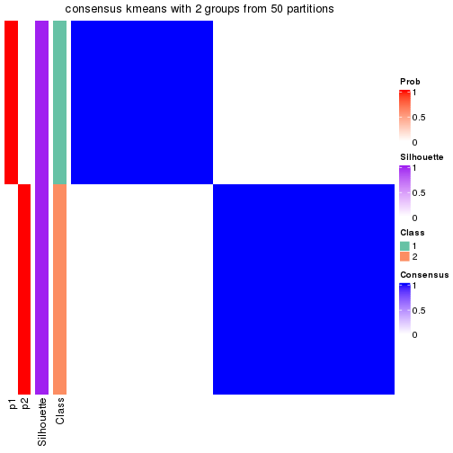</p>

</div>
<div id='tab-node-0422-consensus-heatmap-2'>
<pre><code class="r">consensus_heatmap(res, k = 3)
</code></pre>

<p></p>

</div>
<div id='tab-node-0422-consensus-heatmap-3'>
<pre><code class="r">consensus_heatmap(res, k = 4)
</code></pre>

<p></p>

</div>
<div id='tab-node-0422-consensus-heatmap-4'>
<pre><code class="r">consensus_heatmap(res, k = 5)
</code></pre>

<p></p>

</div>
<div id='tab-node-0422-consensus-heatmap-5'>
<pre><code class="r">consensus_heatmap(res, k = 6)
</code></pre>

<p></p>

</div>
<div id='tab-node-0422-consensus-heatmap-6'>
<pre><code class="r">consensus_heatmap(res, k = 7)
</code></pre>

<p></p>

</div>
<div id='tab-node-0422-consensus-heatmap-7'>
<pre><code class="r">consensus_heatmap(res, k = 8)
</code></pre>

<p></p>

</div>
</div>

Heatmaps for the membership of samples in all partitions to see how consistent they are:


<script>
$( function() {
	$( '#tabs-node-0422-membership-heatmap' ).tabs();
} );
</script>
<div id='tabs-node-0422-membership-heatmap'>
<ul>
<li><a href='#tab-node-0422-membership-heatmap-1'>k = 2</a></li>
<li><a href='#tab-node-0422-membership-heatmap-2'>k = 3</a></li>
<li><a href='#tab-node-0422-membership-heatmap-3'>k = 4</a></li>
<li><a href='#tab-node-0422-membership-heatmap-4'>k = 5</a></li>
<li><a href='#tab-node-0422-membership-heatmap-5'>k = 6</a></li>
<li><a href='#tab-node-0422-membership-heatmap-6'>k = 7</a></li>
<li><a href='#tab-node-0422-membership-heatmap-7'>k = 8</a></li>
</ul>
<div id='tab-node-0422-membership-heatmap-1'>
<pre><code class="r">membership_heatmap(res, k = 2)
</code></pre>

<p></p>

</div>
<div id='tab-node-0422-membership-heatmap-2'>
<pre><code class="r">membership_heatmap(res, k = 3)
</code></pre>

<p></p>

</div>
<div id='tab-node-0422-membership-heatmap-3'>
<pre><code class="r">membership_heatmap(res, k = 4)
</code></pre>

<p></p>

</div>
<div id='tab-node-0422-membership-heatmap-4'>
<pre><code class="r">membership_heatmap(res, k = 5)
</code></pre>

<p></p>

</div>
<div id='tab-node-0422-membership-heatmap-5'>
<pre><code class="r">membership_heatmap(res, k = 6)
</code></pre>

<p></p>

</div>
<div id='tab-node-0422-membership-heatmap-6'>
<pre><code class="r">membership_heatmap(res, k = 7)
</code></pre>

<p></p>

</div>
<div id='tab-node-0422-membership-heatmap-7'>
<pre><code class="r">membership_heatmap(res, k = 8)
</code></pre>

<p></p>

</div>
</div>

As soon as the classes for columns are determined, the signatures
that are significantly different between subgroups can be looked for. 
Following are the heatmaps for signatures.


<script>
$( function() {
	$( '#tabs-node-0422-get-signatures' ).tabs();
} );
</script>
<div id='tabs-node-0422-get-signatures'>
<ul>
<li><a href='#tab-node-0422-get-signatures-1'>k = 2</a></li>
<li><a href='#tab-node-0422-get-signatures-2'>k = 3</a></li>
<li><a href='#tab-node-0422-get-signatures-3'>k = 4</a></li>
<li><a href='#tab-node-0422-get-signatures-4'>k = 5</a></li>
<li><a href='#tab-node-0422-get-signatures-5'>k = 6</a></li>
<li><a href='#tab-node-0422-get-signatures-6'>k = 7</a></li>
<li><a href='#tab-node-0422-get-signatures-7'>k = 8</a></li>
</ul>
<div id='tab-node-0422-get-signatures-1'>
<pre><code class="r">get_signatures(res, k = 2)
</code></pre>

<p></p>

</div>
<div id='tab-node-0422-get-signatures-2'>
<pre><code class="r">get_signatures(res, k = 3)
</code></pre>

<p></p>

</div>
<div id='tab-node-0422-get-signatures-3'>
<pre><code class="r">get_signatures(res, k = 4)
</code></pre>

<p></p>

</div>
<div id='tab-node-0422-get-signatures-4'>
<pre><code class="r">get_signatures(res, k = 5)
</code></pre>

<p></p>

</div>
<div id='tab-node-0422-get-signatures-5'>
<pre><code class="r">get_signatures(res, k = 6)
</code></pre>

<p></p>

</div>
<div id='tab-node-0422-get-signatures-6'>
<pre><code class="r">get_signatures(res, k = 7)
</code></pre>

<p></p>

</div>
<div id='tab-node-0422-get-signatures-7'>
<pre><code class="r">get_signatures(res, k = 8)
</code></pre>

<p></p>

</div>
</div>


Compare the overlap of signatures from different k:

```r
compare_signatures(res)
```


`get_signature()` returns a data frame invisibly. To get the list of signatures, the function
call should be assigned to a variable explicitly. In following code, if `plot` argument is set
to `FALSE`, no heatmap is plotted while only the differential analysis is performed.

```r
# code only for demonstration
tb = get_signature(res, k = ..., plot = FALSE)
```

An example of the output of `tb` is:

```
#>   which_row         fdr    mean_1    mean_2 scaled_mean_1 scaled_mean_2 km
#> 1        38 0.042760348  8.373488  9.131774    -0.5533452     0.5164555  1
#> 2        40 0.018707592  7.106213  8.469186    -0.6173731     0.5762149  1
#> 3        55 0.019134737 10.221463 11.207825    -0.6159697     0.5749050  1
#> 4        59 0.006059896  5.921854  7.869574    -0.6899429     0.6439467  1
#> 5        60 0.018055526  8.928898 10.211722    -0.6204761     0.5791110  1
#> 6        98 0.009384629 15.714769 14.887706     0.6635654    -0.6193277  2
...
```

The columns in `tb` are:

1. `which_row`: row indices corresponding to the input matrix.
2. `fdr`: FDR for the differential test. 
3. `mean_x`: The mean value in group x.
4. `scaled_mean_x`: The mean value in group x after rows are scaled.
5. `km`: Row groups if k-means clustering is applied to rows (which is done by automatically selecting number of clusters).

If there are too many signatures, `top_signatures = ...` can be set to only show the 
signatures with the highest FDRs:

```r
# code only for demonstration
# e.g. to show the top 500 most significant rows
tb = get_signature(res, k = ..., top_signatures = 500)
```

If the signatures are defined as these which are uniquely high in current group, `diff_method` argument
can be set to `"uniquely_high_in_one_group"`:

```r
# code only for demonstration
tb = get_signature(res, k = ..., diff_method = "uniquely_high_in_one_group")
```


UMAP plot which shows how samples are separated.


<script>
$( function() {
	$( '#tabs-node-0422-dimension-reduction' ).tabs();
} );
</script>
<div id='tabs-node-0422-dimension-reduction'>
<ul>
<li><a href='#tab-node-0422-dimension-reduction-1'>k = 2</a></li>
<li><a href='#tab-node-0422-dimension-reduction-2'>k = 3</a></li>
<li><a href='#tab-node-0422-dimension-reduction-3'>k = 4</a></li>
<li><a href='#tab-node-0422-dimension-reduction-4'>k = 5</a></li>
<li><a href='#tab-node-0422-dimension-reduction-5'>k = 6</a></li>
<li><a href='#tab-node-0422-dimension-reduction-6'>k = 7</a></li>
<li><a href='#tab-node-0422-dimension-reduction-7'>k = 8</a></li>
</ul>
<div id='tab-node-0422-dimension-reduction-1'>
<pre><code class="r">dimension_reduction(res, k = 2, method = &quot;UMAP&quot;)
</code></pre>

<p></p>

</div>
<div id='tab-node-0422-dimension-reduction-2'>
<pre><code class="r">dimension_reduction(res, k = 3, method = &quot;UMAP&quot;)
</code></pre>

<p></p>

</div>
<div id='tab-node-0422-dimension-reduction-3'>
<pre><code class="r">dimension_reduction(res, k = 4, method = &quot;UMAP&quot;)
</code></pre>

<p></p>

</div>
<div id='tab-node-0422-dimension-reduction-4'>
<pre><code class="r">dimension_reduction(res, k = 5, method = &quot;UMAP&quot;)
</code></pre>

<p></p>

</div>
<div id='tab-node-0422-dimension-reduction-5'>
<pre><code class="r">dimension_reduction(res, k = 6, method = &quot;UMAP&quot;)
</code></pre>

<p></p>

</div>
<div id='tab-node-0422-dimension-reduction-6'>
<pre><code class="r">dimension_reduction(res, k = 7, method = &quot;UMAP&quot;)
</code></pre>

<p></p>

</div>
<div id='tab-node-0422-dimension-reduction-7'>
<pre><code class="r">dimension_reduction(res, k = 8, method = &quot;UMAP&quot;)
</code></pre>

<p></p>

</div>
</div>


Following heatmap shows how subgroups are split when increasing `k`:

```r
collect_classes(res)
```


If matrix rows can be associated to genes, consider to use `functional_enrichment(res,
...)` to perform function enrichment for the signature genes. See [this vignette](https://jokergoo.github.io/cola_vignettes/functional_enrichment.html) for more detailed explanations.


 

---------------------------------------------------


### Node043


Parent node: [Node04](#Node04).
Child nodes: 
                [Node0111](#Node0111)
        ,
                [Node0112](#Node0112)
        ,
                [Node0121](#Node0121)
        ,
                [Node0122](#Node0122)
        ,
                Node0211-leaf
        ,
                [Node0212](#Node0212)
        ,
                Node0411-leaf
        ,
                Node0412-leaf
        ,
                Node0413-leaf
        ,
                Node0414-leaf
        ,
                Node0421-leaf
        ,
                [Node0422](#Node0422)
        ,
                Node0423-leaf
        ,
                Node0431-leaf
        ,
                Node0432-leaf
        ,
                Node0433-leaf
        .


The object with results only for a single top-value method and a single partitioning method 
can be extracted as:

```r
res = res_rh["043"]
```

A summary of `res` and all the functions that can be applied to it:

```r
res
```

```
#> A 'ConsensusPartition' object with k = 2, 3, 4, 5, 6, 7, 8.
#>   On a matrix with 30000 rows and 17 columns.
#>   Top rows (1000) are extracted by 'ATC' method.
#>   Subgroups are detected by 'kmeans' method.
#>   Performed in total 350 partitions by row resampling.
#>   Best k for subgroups seems to be 3.
#> 
#> Following methods can be applied to this 'ConsensusPartition' object:
#>  [1] "cola_report"             "collect_classes"         "collect_plots"          
#>  [4] "collect_stats"           "colnames"                "compare_partitions"     
#>  [7] "compare_signatures"      "consensus_heatmap"       "dimension_reduction"    
#> [10] "functional_enrichment"   "get_anno_col"            "get_anno"               
#> [13] "get_classes"             "get_consensus"           "get_matrix"             
#> [16] "get_membership"          "get_param"               "get_signatures"         
#> [19] "get_stats"               "is_best_k"               "is_stable_k"            
#> [22] "membership_heatmap"      "ncol"                    "nrow"                   
#> [25] "plot_ecdf"               "predict_classes"         "rownames"               
#> [28] "select_partition_number" "show"                    "suggest_best_k"         
#> [31] "test_to_known_factors"   "top_rows_heatmap"
```

`collect_plots()` function collects all the plots made from `res` for all `k` (number of subgroups)
into one single page to provide an easy and fast comparison between different `k`.

```r
collect_plots(res)
```


The plots are:

- The first row: a plot of the eCDF (empirical cumulative distribution
  function) curves of the consensus matrix for each `k` and the heatmap of
  predicted classes for each `k`.
- The second row: heatmaps of the consensus matrix for each `k`.
- The third row: heatmaps of the membership matrix for each `k`.
- The fouth row: heatmaps of the signatures for each `k`.

All the plots in panels can be made by individual functions and they are
plotted later in this section.

`select_partition_number()` produces several plots showing different
statistics for choosing "optimized" `k`. There are following statistics:

- eCDF curves of the consensus matrix for each `k`;
- 1-PAC. [The PAC score](https://en.wikipedia.org/wiki/Consensus_clustering#Over-interpretation_potential_of_consensus_clustering)
  measures the proportion of the ambiguous subgrouping.
- Mean silhouette score.
- Concordance. The mean probability of fiting the consensus subgroup labels in all
  partitions.
- Area increased. Denote $A_k$ as the area under the eCDF curve for current
  `k`, the area increased is defined as $A_k - A_{k-1}$.
- Rand index. The percent of pairs of samples that are both in a same cluster
  or both are not in a same cluster in the partition of k and k-1.
- Jaccard index. The ratio of pairs of samples are both in a same cluster in
  the partition of k and k-1 and the pairs of samples are both in a same
  cluster in the partition k or k-1.

The detailed explanations of these statistics can be found in [the _cola_
vignette](https://jokergoo.github.io/cola_vignettes/cola.html#toc_13).

Generally speaking, higher 1-PAC score, higher mean silhouette score or higher
concordance corresponds to better partition. Rand index and Jaccard index
measure how similar the current partition is compared to partition with `k-1`.
If they are too similar, we won't accept `k` is better than `k-1`.

```r
select_partition_number(res)
```


The numeric values for all these statistics can be obtained by `get_stats()`.

```r
get_stats(res)
```

```
#>   k 1-PAC mean_silhouette concordance area_increased  Rand Jaccard
#> 2 2 1.000           1.000       1.000         0.4858 0.515   0.515
#> 3 3 1.000           0.998       0.999         0.3940 0.765   0.562
#> 4 4 0.978           0.890       0.975         0.0402 0.978   0.932
#> 5 5 0.904           0.802       0.934         0.0406 0.985   0.951
#> 6 6 0.868           0.750       0.932         0.0521 0.949   0.821
#> 7 7 0.868           0.643       0.908         0.0472 0.956   0.812
#> 8 8 0.816           0.550       0.895         0.0404 0.971   0.846
```

`suggest_best_k()` suggests the best $k$ based on these statistics. The rules are as follows:

- All $k$ with Jaccard index larger than 0.95 are removed because increasing
  $k$ does not provide enough extra information. If all $k$ are removed, it is
  marked as no subgroup is detected.
- For all $k$ with 1-PAC score larger than 0.9, the maximal $k$ is taken as
  the best $k$, and other $k$ are marked as optional $k$.
- If it does not fit the second rule. The $k$ with the maximal vote of the
  highest 1-PAC score, highest mean silhouette, and highest concordance is
  taken as the best $k$.

```r
suggest_best_k(res)
```

```
#> [1] 3
#> attr(,"optional")
#> [1] 2
```

There is also optional best $k$ = 2 that is worth to check.

Following is the table of the partitions (You need to click the **show/hide
code output** link to see it). The membership matrix (columns with name `p*`)
is inferred by
[`clue::cl_consensus()`](https://www.rdocumentation.org/link/cl_consensus?package=clue)
function with the `SE` method. Basically the value in the membership matrix
represents the probability to belong to a certain group. The finall subgroup
label for an item is determined with the group with highest probability it
belongs to.

In `get_classes()` function, the entropy is calculated from the membership
matrix and the silhouette score is calculated from the consensus matrix.


<script>
$( function() {
	$( '#tabs-node-043-get-classes' ).tabs();
} );
</script>
<div id='tabs-node-043-get-classes'>
<ul>
<li><a href='#tab-node-043-get-classes-1'>k = 2</a></li>
<li><a href='#tab-node-043-get-classes-2'>k = 3</a></li>
<li><a href='#tab-node-043-get-classes-3'>k = 4</a></li>
<li><a href='#tab-node-043-get-classes-4'>k = 5</a></li>
<li><a href='#tab-node-043-get-classes-5'>k = 6</a></li>
<li><a href='#tab-node-043-get-classes-6'>k = 7</a></li>
<li><a href='#tab-node-043-get-classes-7'>k = 8</a></li>
</ul>

<div id='tab-node-043-get-classes-1'>
<p><a id='tab-node-043-get-classes-1-a' style='color:#0366d6' href='#'>show/hide code output</a></p>
<pre><code class="r">cbind(get_classes(res, k = 2), get_membership(res, k = 2))
</code></pre>

<pre><code>#&gt;                 class entropy silhouette p1 p2
#&gt; TCGA.DC.6157.01     2       0          1  0  1
#&gt; TCGA.A6.A567.01     1       0          1  1  0
#&gt; TCGA.EI.6885.01     2       0          1  0  1
#&gt; TCGA.5M.AAT5.01     2       0          1  0  1
#&gt; TCGA.G4.6317.02     2       0          1  0  1
#&gt; TCGA.CK.4948.01     1       0          1  1  0
#&gt; TCGA.AA.3494.01     2       0          1  0  1
#&gt; TCGA.G4.6307.01     2       0          1  0  1
#&gt; TCGA.F5.6810.01     1       0          1  1  0
#&gt; TCGA.G4.6295.01     1       0          1  1  0
#&gt; TCGA.AG.A01Y.01     2       0          1  0  1
#&gt; TCGA.AZ.6603.01     2       0          1  0  1
#&gt; TCGA.AF.6672.01     2       0          1  0  1
#&gt; TCGA.NH.A8F7.01     2       0          1  0  1
#&gt; TCGA.CA.5797.01     1       0          1  1  0
#&gt; TCGA.EI.6513.01     1       0          1  1  0
#&gt; TCGA.AZ.4681.01     2       0          1  0  1
</code></pre>

<script>
$('#tab-node-043-get-classes-1-a').parent().next().next().hide();
$('#tab-node-043-get-classes-1-a').click(function(){
  $('#tab-node-043-get-classes-1-a').parent().next().next().toggle();
  return(false);
});
</script>
</div>

<div id='tab-node-043-get-classes-2'>
<p><a id='tab-node-043-get-classes-2-a' style='color:#0366d6' href='#'>show/hide code output</a></p>
<pre><code class="r">cbind(get_classes(res, k = 3), get_membership(res, k = 3))
</code></pre>

<pre><code>#&gt;                 class entropy silhouette p1   p2   p3
#&gt; TCGA.DC.6157.01     2  0.0000      0.997  0 1.00 0.00
#&gt; TCGA.A6.A567.01     3  0.0000      1.000  0 0.00 1.00
#&gt; TCGA.EI.6885.01     3  0.0000      1.000  0 0.00 1.00
#&gt; TCGA.5M.AAT5.01     2  0.0892      0.980  0 0.98 0.02
#&gt; TCGA.G4.6317.02     2  0.0000      0.997  0 1.00 0.00
#&gt; TCGA.CK.4948.01     1  0.0000      1.000  1 0.00 0.00
#&gt; TCGA.AA.3494.01     2  0.0000      0.997  0 1.00 0.00
#&gt; TCGA.G4.6307.01     2  0.0000      0.997  0 1.00 0.00
#&gt; TCGA.F5.6810.01     1  0.0000      1.000  1 0.00 0.00
#&gt; TCGA.G4.6295.01     1  0.0000      1.000  1 0.00 0.00
#&gt; TCGA.AG.A01Y.01     3  0.0000      1.000  0 0.00 1.00
#&gt; TCGA.AZ.6603.01     2  0.0000      0.997  0 1.00 0.00
#&gt; TCGA.AF.6672.01     3  0.0000      1.000  0 0.00 1.00
#&gt; TCGA.NH.A8F7.01     2  0.0000      0.997  0 1.00 0.00
#&gt; TCGA.CA.5797.01     1  0.0000      1.000  1 0.00 0.00
#&gt; TCGA.EI.6513.01     1  0.0000      1.000  1 0.00 0.00
#&gt; TCGA.AZ.4681.01     2  0.0000      0.997  0 1.00 0.00
</code></pre>

<script>
$('#tab-node-043-get-classes-2-a').parent().next().next().hide();
$('#tab-node-043-get-classes-2-a').click(function(){
  $('#tab-node-043-get-classes-2-a').parent().next().next().toggle();
  return(false);
});
</script>
</div>

<div id='tab-node-043-get-classes-3'>
<p><a id='tab-node-043-get-classes-3-a' style='color:#0366d6' href='#'>show/hide code output</a></p>
<pre><code class="r">cbind(get_classes(res, k = 4), get_membership(res, k = 4))
</code></pre>

<pre><code>#&gt;                 class entropy silhouette p1   p2   p3   p4
#&gt; TCGA.DC.6157.01     2  0.0707      0.982  0 0.98 0.00 0.02
#&gt; TCGA.A6.A567.01     4  0.0707      0.000  0 0.00 0.02 0.98
#&gt; TCGA.EI.6885.01     3  0.0000      0.852  0 0.00 1.00 0.00
#&gt; TCGA.5M.AAT5.01     2  0.1637      0.928  0 0.94 0.06 0.00
#&gt; TCGA.G4.6317.02     2  0.0707      0.982  0 0.98 0.00 0.02
#&gt; TCGA.CK.4948.01     1  0.0000      1.000  1 0.00 0.00 0.00
#&gt; TCGA.AA.3494.01     2  0.0000      0.980  0 1.00 0.00 0.00
#&gt; TCGA.G4.6307.01     2  0.0707      0.982  0 0.98 0.00 0.02
#&gt; TCGA.F5.6810.01     1  0.0000      1.000  1 0.00 0.00 0.00
#&gt; TCGA.G4.6295.01     1  0.0000      1.000  1 0.00 0.00 0.00
#&gt; TCGA.AG.A01Y.01     3  0.0000      0.852  0 0.00 1.00 0.00
#&gt; TCGA.AZ.6603.01     2  0.0000      0.980  0 1.00 0.00 0.00
#&gt; TCGA.AF.6672.01     3  0.4134      0.639  0 0.00 0.74 0.26
#&gt; TCGA.NH.A8F7.01     2  0.0707      0.982  0 0.98 0.00 0.02
#&gt; TCGA.CA.5797.01     1  0.0000      1.000  1 0.00 0.00 0.00
#&gt; TCGA.EI.6513.01     1  0.0000      1.000  1 0.00 0.00 0.00
#&gt; TCGA.AZ.4681.01     2  0.0000      0.980  0 1.00 0.00 0.00
</code></pre>

<script>
$('#tab-node-043-get-classes-3-a').parent().next().next().hide();
$('#tab-node-043-get-classes-3-a').click(function(){
  $('#tab-node-043-get-classes-3-a').parent().next().next().toggle();
  return(false);
});
</script>
</div>

<div id='tab-node-043-get-classes-4'>
<p><a id='tab-node-043-get-classes-4-a' style='color:#0366d6' href='#'>show/hide code output</a></p>
<pre><code class="r">cbind(get_classes(res, k = 5), get_membership(res, k = 5))
</code></pre>

<pre><code>#&gt;                 class entropy silhouette   p1   p2   p3   p4   p5
#&gt; TCGA.DC.6157.01     2  0.0000      0.938 0.00 1.00 0.00 0.00 0.00
#&gt; TCGA.A6.A567.01     4  0.0000      0.000 0.00 0.00 0.00 1.00 0.00
#&gt; TCGA.EI.6885.01     3  0.0000      1.000 0.00 0.00 1.00 0.00 0.00
#&gt; TCGA.5M.AAT5.01     2  0.5351      0.391 0.00 0.56 0.06 0.00 0.38
#&gt; TCGA.G4.6317.02     2  0.0000      0.938 0.00 1.00 0.00 0.00 0.00
#&gt; TCGA.CK.4948.01     1  0.2732      0.848 0.84 0.00 0.00 0.00 0.16
#&gt; TCGA.AA.3494.01     2  0.0000      0.938 0.00 1.00 0.00 0.00 0.00
#&gt; TCGA.G4.6307.01     2  0.0000      0.938 0.00 1.00 0.00 0.00 0.00
#&gt; TCGA.F5.6810.01     1  0.0000      0.959 1.00 0.00 0.00 0.00 0.00
#&gt; TCGA.G4.6295.01     1  0.0000      0.959 1.00 0.00 0.00 0.00 0.00
#&gt; TCGA.AG.A01Y.01     3  0.0000      1.000 0.00 0.00 1.00 0.00 0.00
#&gt; TCGA.AZ.6603.01     2  0.0000      0.938 0.00 1.00 0.00 0.00 0.00
#&gt; TCGA.AF.6672.01     5  0.5673      0.000 0.00 0.00 0.42 0.08 0.50
#&gt; TCGA.NH.A8F7.01     2  0.0000      0.938 0.00 1.00 0.00 0.00 0.00
#&gt; TCGA.CA.5797.01     1  0.0609      0.953 0.98 0.00 0.00 0.00 0.02
#&gt; TCGA.EI.6513.01     1  0.0000      0.959 1.00 0.00 0.00 0.00 0.00
#&gt; TCGA.AZ.4681.01     2  0.0000      0.938 0.00 1.00 0.00 0.00 0.00
</code></pre>

<script>
$('#tab-node-043-get-classes-4-a').parent().next().next().hide();
$('#tab-node-043-get-classes-4-a').click(function(){
  $('#tab-node-043-get-classes-4-a').parent().next().next().toggle();
  return(false);
});
</script>
</div>

<div id='tab-node-043-get-classes-5'>
<p><a id='tab-node-043-get-classes-5-a' style='color:#0366d6' href='#'>show/hide code output</a></p>
<pre><code class="r">cbind(get_classes(res, k = 6), get_membership(res, k = 6))
</code></pre>

<pre><code>#&gt;                 class entropy silhouette   p1   p2   p3   p4   p5   p6
#&gt; TCGA.DC.6157.01     2  0.0000      0.955 0.00 1.00 0.00 0.00 0.00 0.00
#&gt; TCGA.A6.A567.01     4  0.1267      0.000 0.00 0.00 0.00 0.94 0.06 0.00
#&gt; TCGA.EI.6885.01     3  0.3198      1.000 0.00 0.00 0.74 0.00 0.26 0.00
#&gt; TCGA.5M.AAT5.01     6  0.3678      0.000 0.00 0.18 0.02 0.00 0.02 0.78
#&gt; TCGA.G4.6317.02     2  0.0000      0.955 0.00 1.00 0.00 0.00 0.00 0.00
#&gt; TCGA.CK.4948.01     1  0.4890      0.621 0.66 0.00 0.16 0.00 0.00 0.18
#&gt; TCGA.AA.3494.01     2  0.1807      0.902 0.00 0.92 0.06 0.02 0.00 0.00
#&gt; TCGA.G4.6307.01     2  0.0000      0.955 0.00 1.00 0.00 0.00 0.00 0.00
#&gt; TCGA.F5.6810.01     1  0.0000      0.911 1.00 0.00 0.00 0.00 0.00 0.00
#&gt; TCGA.G4.6295.01     1  0.0547      0.906 0.98 0.00 0.00 0.00 0.00 0.02
#&gt; TCGA.AG.A01Y.01     3  0.3198      1.000 0.00 0.00 0.74 0.00 0.26 0.00
#&gt; TCGA.AZ.6603.01     2  0.0000      0.955 0.00 1.00 0.00 0.00 0.00 0.00
#&gt; TCGA.AF.6672.01     5  0.0000      0.000 0.00 0.00 0.00 0.00 1.00 0.00
#&gt; TCGA.NH.A8F7.01     2  0.0000      0.955 0.00 1.00 0.00 0.00 0.00 0.00
#&gt; TCGA.CA.5797.01     1  0.0547      0.906 0.98 0.00 0.00 0.00 0.00 0.02
#&gt; TCGA.EI.6513.01     1  0.0000      0.911 1.00 0.00 0.00 0.00 0.00 0.00
#&gt; TCGA.AZ.4681.01     2  0.3045      0.821 0.00 0.84 0.10 0.06 0.00 0.00
</code></pre>

<script>
$('#tab-node-043-get-classes-5-a').parent().next().next().hide();
$('#tab-node-043-get-classes-5-a').click(function(){
  $('#tab-node-043-get-classes-5-a').parent().next().next().toggle();
  return(false);
});
</script>
</div>

<div id='tab-node-043-get-classes-6'>
<p><a id='tab-node-043-get-classes-6-a' style='color:#0366d6' href='#'>show/hide code output</a></p>
<pre><code class="r">cbind(get_classes(res, k = 7), get_membership(res, k = 7))
</code></pre>

<pre><code>#&gt;                 class entropy silhouette   p1   p2   p3   p4   p5   p6   p7
#&gt; TCGA.DC.6157.01     2  0.0000      0.919 0.00 1.00 0.00 0.00 0.00 0.00 0.00
#&gt; TCGA.A6.A567.01     4  0.4866      0.000 0.00 0.00 0.00 0.48 0.10 0.42 0.00
#&gt; TCGA.EI.6885.01     3  0.0863      0.964 0.00 0.00 0.96 0.00 0.00 0.00 0.04
#&gt; TCGA.5M.AAT5.01     6  0.4778      0.000 0.00 0.06 0.00 0.00 0.02 0.58 0.34
#&gt; TCGA.G4.6317.02     2  0.0504      0.907 0.00 0.98 0.00 0.02 0.00 0.00 0.00
#&gt; TCGA.CK.4948.01     1  0.3562      0.421 0.50 0.00 0.00 0.50 0.00 0.00 0.00
#&gt; TCGA.AA.3494.01     2  0.2081      0.682 0.00 0.86 0.00 0.00 0.00 0.00 0.14
#&gt; TCGA.G4.6307.01     2  0.0000      0.919 0.00 1.00 0.00 0.00 0.00 0.00 0.00
#&gt; TCGA.F5.6810.01     1  0.0000      0.851 1.00 0.00 0.00 0.00 0.00 0.00 0.00
#&gt; TCGA.G4.6295.01     1  0.0504      0.847 0.98 0.00 0.00 0.00 0.02 0.00 0.00
#&gt; TCGA.AG.A01Y.01     3  0.0000      0.964 0.00 0.00 1.00 0.00 0.00 0.00 0.00
#&gt; TCGA.AZ.6603.01     2  0.1363      0.876 0.00 0.94 0.00 0.02 0.00 0.00 0.04
#&gt; TCGA.AF.6672.01     5  0.1433      0.000 0.00 0.00 0.08 0.00 0.92 0.00 0.00
#&gt; TCGA.NH.A8F7.01     2  0.0000      0.919 0.00 1.00 0.00 0.00 0.00 0.00 0.00
#&gt; TCGA.CA.5797.01     1  0.2278      0.807 0.88 0.00 0.00 0.04 0.00 0.00 0.08
#&gt; TCGA.EI.6513.01     1  0.0000      0.851 1.00 0.00 0.00 0.00 0.00 0.00 0.00
#&gt; TCGA.AZ.4681.01     7  0.3546      0.000 0.00 0.46 0.00 0.00 0.00 0.00 0.54
</code></pre>

<script>
$('#tab-node-043-get-classes-6-a').parent().next().next().hide();
$('#tab-node-043-get-classes-6-a').click(function(){
  $('#tab-node-043-get-classes-6-a').parent().next().next().toggle();
  return(false);
});
</script>
</div>

<div id='tab-node-043-get-classes-7'>
<p><a id='tab-node-043-get-classes-7-a' style='color:#0366d6' href='#'>show/hide code output</a></p>
<pre><code class="r">cbind(get_classes(res, k = 8), get_membership(res, k = 8))
</code></pre>

<pre><code>#&gt;                 class entropy silhouette   p1   p2   p3 p4   p5 p6   p7   p8
#&gt; TCGA.DC.6157.01     2  0.0000      0.861 0.00 1.00 0.00  0 0.00  0 0.00 0.00
#&gt; TCGA.A6.A567.01     4  0.0000      0.000 0.00 0.00 0.00  1 0.00  0 0.00 0.00
#&gt; TCGA.EI.6885.01     3  0.3757      0.684 0.00 0.00 0.68  0 0.00  0 0.06 0.26
#&gt; TCGA.5M.AAT5.01     6  0.0000      0.000 0.00 0.00 0.00  0 0.00  1 0.00 0.00
#&gt; TCGA.G4.6317.02     2  0.1563      0.819 0.00 0.90 0.00  0 0.00  0 0.00 0.10
#&gt; TCGA.CK.4948.01     8  0.3272      0.000 0.42 0.00 0.00  0 0.00  0 0.00 0.58
#&gt; TCGA.AA.3494.01     2  0.3991      0.492 0.00 0.70 0.00  0 0.02  0 0.22 0.06
#&gt; TCGA.G4.6307.01     2  0.0000      0.861 0.00 1.00 0.00  0 0.00  0 0.00 0.00
#&gt; TCGA.F5.6810.01     1  0.0000      0.890 1.00 0.00 0.00  0 0.00  0 0.00 0.00
#&gt; TCGA.G4.6295.01     1  0.0471      0.877 0.98 0.00 0.00  0 0.00  0 0.02 0.00
#&gt; TCGA.AG.A01Y.01     3  0.0000      0.684 0.00 0.00 1.00  0 0.00  0 0.00 0.00
#&gt; TCGA.AZ.6603.01     2  0.3002      0.782 0.00 0.82 0.00  0 0.02  0 0.04 0.12
#&gt; TCGA.AF.6672.01     5  0.1341      0.000 0.00 0.00 0.08  0 0.92  0 0.00 0.00
#&gt; TCGA.NH.A8F7.01     2  0.0000      0.861 0.00 1.00 0.00  0 0.00  0 0.00 0.00
#&gt; TCGA.CA.5797.01     1  0.3078      0.654 0.82 0.00 0.00  0 0.06  0 0.10 0.02
#&gt; TCGA.EI.6513.01     1  0.0000      0.890 1.00 0.00 0.00  0 0.00  0 0.00 0.00
#&gt; TCGA.AZ.4681.01     7  0.2267      0.000 0.00 0.18 0.00  0 0.00  0 0.82 0.00
</code></pre>

<script>
$('#tab-node-043-get-classes-7-a').parent().next().next().hide();
$('#tab-node-043-get-classes-7-a').click(function(){
  $('#tab-node-043-get-classes-7-a').parent().next().next().toggle();
  return(false);
});
</script>
</div>
</div>

Heatmaps for the consensus matrix. It visualizes the probability of two
samples to be in a same group.


<script>
$( function() {
	$( '#tabs-node-043-consensus-heatmap' ).tabs();
} );
</script>
<div id='tabs-node-043-consensus-heatmap'>
<ul>
<li><a href='#tab-node-043-consensus-heatmap-1'>k = 2</a></li>
<li><a href='#tab-node-043-consensus-heatmap-2'>k = 3</a></li>
<li><a href='#tab-node-043-consensus-heatmap-3'>k = 4</a></li>
<li><a href='#tab-node-043-consensus-heatmap-4'>k = 5</a></li>
<li><a href='#tab-node-043-consensus-heatmap-5'>k = 6</a></li>
<li><a href='#tab-node-043-consensus-heatmap-6'>k = 7</a></li>
<li><a href='#tab-node-043-consensus-heatmap-7'>k = 8</a></li>
</ul>
<div id='tab-node-043-consensus-heatmap-1'>
<pre><code class="r">consensus_heatmap(res, k = 2)
</code></pre>

<p></p>

</div>
<div id='tab-node-043-consensus-heatmap-2'>
<pre><code class="r">consensus_heatmap(res, k = 3)
</code></pre>

<p></p>

</div>
<div id='tab-node-043-consensus-heatmap-3'>
<pre><code class="r">consensus_heatmap(res, k = 4)
</code></pre>

<p></p>

</div>
<div id='tab-node-043-consensus-heatmap-4'>
<pre><code class="r">consensus_heatmap(res, k = 5)
</code></pre>

<p></p>

</div>
<div id='tab-node-043-consensus-heatmap-5'>
<pre><code class="r">consensus_heatmap(res, k = 6)
</code></pre>

<p></p>

</div>
<div id='tab-node-043-consensus-heatmap-6'>
<pre><code class="r">consensus_heatmap(res, k = 7)
</code></pre>

<p></p>

</div>
<div id='tab-node-043-consensus-heatmap-7'>
<pre><code class="r">consensus_heatmap(res, k = 8)
</code></pre>

<p></p>

</div>
</div>

Heatmaps for the membership of samples in all partitions to see how consistent they are:


<script>
$( function() {
	$( '#tabs-node-043-membership-heatmap' ).tabs();
} );
</script>
<div id='tabs-node-043-membership-heatmap'>
<ul>
<li><a href='#tab-node-043-membership-heatmap-1'>k = 2</a></li>
<li><a href='#tab-node-043-membership-heatmap-2'>k = 3</a></li>
<li><a href='#tab-node-043-membership-heatmap-3'>k = 4</a></li>
<li><a href='#tab-node-043-membership-heatmap-4'>k = 5</a></li>
<li><a href='#tab-node-043-membership-heatmap-5'>k = 6</a></li>
<li><a href='#tab-node-043-membership-heatmap-6'>k = 7</a></li>
<li><a href='#tab-node-043-membership-heatmap-7'>k = 8</a></li>
</ul>
<div id='tab-node-043-membership-heatmap-1'>
<pre><code class="r">membership_heatmap(res, k = 2)
</code></pre>

<p></p>

</div>
<div id='tab-node-043-membership-heatmap-2'>
<pre><code class="r">membership_heatmap(res, k = 3)
</code></pre>

<p></p>

</div>
<div id='tab-node-043-membership-heatmap-3'>
<pre><code class="r">membership_heatmap(res, k = 4)
</code></pre>

<p></p>

</div>
<div id='tab-node-043-membership-heatmap-4'>
<pre><code class="r">membership_heatmap(res, k = 5)
</code></pre>

<p></p>

</div>
<div id='tab-node-043-membership-heatmap-5'>
<pre><code class="r">membership_heatmap(res, k = 6)
</code></pre>

<p></p>

</div>
<div id='tab-node-043-membership-heatmap-6'>
<pre><code class="r">membership_heatmap(res, k = 7)
</code></pre>

<p></p>

</div>
<div id='tab-node-043-membership-heatmap-7'>
<pre><code class="r">membership_heatmap(res, k = 8)
</code></pre>

<p></p>

</div>
</div>

As soon as the classes for columns are determined, the signatures
that are significantly different between subgroups can be looked for. 
Following are the heatmaps for signatures.


<script>
$( function() {
	$( '#tabs-node-043-get-signatures' ).tabs();
} );
</script>
<div id='tabs-node-043-get-signatures'>
<ul>
<li><a href='#tab-node-043-get-signatures-1'>k = 2</a></li>
<li><a href='#tab-node-043-get-signatures-2'>k = 3</a></li>
<li><a href='#tab-node-043-get-signatures-3'>k = 4</a></li>
<li><a href='#tab-node-043-get-signatures-4'>k = 5</a></li>
<li><a href='#tab-node-043-get-signatures-5'>k = 6</a></li>
<li><a href='#tab-node-043-get-signatures-6'>k = 7</a></li>
<li><a href='#tab-node-043-get-signatures-7'>k = 8</a></li>
</ul>
<div id='tab-node-043-get-signatures-1'>
<pre><code class="r">get_signatures(res, k = 2)
</code></pre>

<p></p>

</div>
<div id='tab-node-043-get-signatures-2'>
<pre><code class="r">get_signatures(res, k = 3)
</code></pre>

<p></p>

</div>
<div id='tab-node-043-get-signatures-3'>
<pre><code class="r">get_signatures(res, k = 4)
</code></pre>

<p></p>

</div>
<div id='tab-node-043-get-signatures-4'>
<pre><code class="r">get_signatures(res, k = 5)
</code></pre>

<p></p>

</div>
<div id='tab-node-043-get-signatures-5'>
<pre><code class="r">get_signatures(res, k = 6)
</code></pre>

<p></p>

</div>
<div id='tab-node-043-get-signatures-6'>
<pre><code class="r">get_signatures(res, k = 7)
</code></pre>

<p></p>

</div>
<div id='tab-node-043-get-signatures-7'>
<pre><code class="r">get_signatures(res, k = 8)
</code></pre>

<p></p>

</div>
</div>


Compare the overlap of signatures from different k:

```r
compare_signatures(res)
```


`get_signature()` returns a data frame invisibly. To get the list of signatures, the function
call should be assigned to a variable explicitly. In following code, if `plot` argument is set
to `FALSE`, no heatmap is plotted while only the differential analysis is performed.

```r
# code only for demonstration
tb = get_signature(res, k = ..., plot = FALSE)
```

An example of the output of `tb` is:

```
#>   which_row         fdr    mean_1    mean_2 scaled_mean_1 scaled_mean_2 km
#> 1        38 0.042760348  8.373488  9.131774    -0.5533452     0.5164555  1
#> 2        40 0.018707592  7.106213  8.469186    -0.6173731     0.5762149  1
#> 3        55 0.019134737 10.221463 11.207825    -0.6159697     0.5749050  1
#> 4        59 0.006059896  5.921854  7.869574    -0.6899429     0.6439467  1
#> 5        60 0.018055526  8.928898 10.211722    -0.6204761     0.5791110  1
#> 6        98 0.009384629 15.714769 14.887706     0.6635654    -0.6193277  2
...
```

The columns in `tb` are:

1. `which_row`: row indices corresponding to the input matrix.
2. `fdr`: FDR for the differential test. 
3. `mean_x`: The mean value in group x.
4. `scaled_mean_x`: The mean value in group x after rows are scaled.
5. `km`: Row groups if k-means clustering is applied to rows (which is done by automatically selecting number of clusters).

If there are too many signatures, `top_signatures = ...` can be set to only show the 
signatures with the highest FDRs:

```r
# code only for demonstration
# e.g. to show the top 500 most significant rows
tb = get_signature(res, k = ..., top_signatures = 500)
```

If the signatures are defined as these which are uniquely high in current group, `diff_method` argument
can be set to `"uniquely_high_in_one_group"`:

```r
# code only for demonstration
tb = get_signature(res, k = ..., diff_method = "uniquely_high_in_one_group")
```


UMAP plot which shows how samples are separated.


<script>
$( function() {
	$( '#tabs-node-043-dimension-reduction' ).tabs();
} );
</script>
<div id='tabs-node-043-dimension-reduction'>
<ul>
<li><a href='#tab-node-043-dimension-reduction-1'>k = 2</a></li>
<li><a href='#tab-node-043-dimension-reduction-2'>k = 3</a></li>
<li><a href='#tab-node-043-dimension-reduction-3'>k = 4</a></li>
<li><a href='#tab-node-043-dimension-reduction-4'>k = 5</a></li>
<li><a href='#tab-node-043-dimension-reduction-5'>k = 6</a></li>
<li><a href='#tab-node-043-dimension-reduction-6'>k = 7</a></li>
<li><a href='#tab-node-043-dimension-reduction-7'>k = 8</a></li>
</ul>
<div id='tab-node-043-dimension-reduction-1'>
<pre><code class="r">dimension_reduction(res, k = 2, method = &quot;UMAP&quot;)
</code></pre>

<p></p>

</div>
<div id='tab-node-043-dimension-reduction-2'>
<pre><code class="r">dimension_reduction(res, k = 3, method = &quot;UMAP&quot;)
</code></pre>

<p></p>

</div>
<div id='tab-node-043-dimension-reduction-3'>
<pre><code class="r">dimension_reduction(res, k = 4, method = &quot;UMAP&quot;)
</code></pre>

<p></p>

</div>
<div id='tab-node-043-dimension-reduction-4'>
<pre><code class="r">dimension_reduction(res, k = 5, method = &quot;UMAP&quot;)
</code></pre>

<p></p>

</div>
<div id='tab-node-043-dimension-reduction-5'>
<pre><code class="r">dimension_reduction(res, k = 6, method = &quot;UMAP&quot;)
</code></pre>

<p></p>

</div>
<div id='tab-node-043-dimension-reduction-6'>
<pre><code class="r">dimension_reduction(res, k = 7, method = &quot;UMAP&quot;)
</code></pre>

<p></p>

</div>
<div id='tab-node-043-dimension-reduction-7'>
<pre><code class="r">dimension_reduction(res, k = 8, method = &quot;UMAP&quot;)
</code></pre>

<p></p>

</div>
</div>


Following heatmap shows how subgroups are split when increasing `k`:

```r
collect_classes(res)
```


If matrix rows can be associated to genes, consider to use `functional_enrichment(res,
...)` to perform function enrichment for the signature genes. See [this vignette](https://jokergoo.github.io/cola_vignettes/functional_enrichment.html) for more detailed explanations.


 

## Session info


```r
sessionInfo()
```

```
#> R version 4.1.0 (2021-05-18)
#> Platform: x86_64-pc-linux-gnu (64-bit)
#> Running under: CentOS Linux 7 (Core)
#> 
#> Matrix products: default
#> BLAS/LAPACK: /usr/lib64/libopenblas-r0.3.3.so
#> 
#> locale:
#>  [1] LC_CTYPE=en_US.UTF-8       LC_NUMERIC=C               LC_TIME=en_US.UTF-8       
#>  [4] LC_COLLATE=en_US.UTF-8     LC_MONETARY=en_US.UTF-8    LC_MESSAGES=en_US.UTF-8   
#>  [7] LC_PAPER=en_US.UTF-8       LC_NAME=C                  LC_ADDRESS=C              
#> [10] LC_TELEPHONE=C             LC_MEASUREMENT=en_US.UTF-8 LC_IDENTIFICATION=C       
#> 
#> attached base packages:
#> [1] grid      stats     graphics  grDevices utils     datasets  methods   base     
#> 
#> other attached packages:
#> [1] genefilter_1.74.0    ComplexHeatmap_2.8.0 markdown_1.1         knitr_1.33          
#> [5] matrixStats_0.59.0   cola_1.9.4          
#> 
#> loaded via a namespace (and not attached):
#>   [1] bitops_1.0-7           bit64_4.0.5            doParallel_1.0.16      RColorBrewer_1.1-2    
#>   [5] httr_1.4.2             GenomeInfoDb_1.28.1    data.tree_1.0.0        tools_4.1.0           
#>   [9] utf8_1.2.1             R6_2.5.0               irlba_2.3.3            DBI_1.1.1             
#>  [13] BiocGenerics_0.38.0    colorspace_2.0-2       GetoptLong_1.0.5       gridExtra_2.3         
#>  [17] tidyselect_1.1.1       bit_4.0.4              compiler_4.1.0         Biobase_2.52.0        
#>  [21] Cairo_1.5-12.2         xml2_1.3.2             microbenchmark_1.4-7   slam_0.1-48           
#>  [25] scales_1.1.1           askpass_1.1            stringr_1.4.0          digest_0.6.27         
#>  [29] XVector_0.32.0         pkgconfig_2.0.3        umap_0.2.7.0           fastmap_1.1.0         
#>  [33] highr_0.9              rlang_0.4.11           GlobalOptions_0.1.2    rstudioapi_0.13       
#>  [37] RSQLite_2.2.7          impute_1.66.0          generics_0.1.0         shape_1.4.6           
#>  [41] jsonlite_1.7.2         mclust_5.4.7           dplyr_1.0.7            dendextend_1.15.1     
#>  [45] RCurl_1.98-1.3         magrittr_2.0.1         GenomeInfoDbData_1.2.6 Matrix_1.3-4          
#>  [49] fansi_0.5.0            Rcpp_1.0.7             munsell_0.5.0          S4Vectors_0.30.0      
#>  [53] viridis_0.6.1          reticulate_1.20        lifecycle_1.0.0        scatterplot3d_0.3-41  
#>  [57] stringi_1.7.3          zlibbioc_1.38.0        blob_1.2.1             parallel_4.1.0        
#>  [61] crayon_1.4.1           lattice_0.20-44        Biostrings_2.60.1      splines_4.1.0         
#>  [65] annotate_1.70.0        circlize_0.4.13        KEGGREST_1.32.0        polylabelr_0.2.0      
#>  [69] pillar_1.6.1           rjson_0.2.20           codetools_0.2-18       stats4_4.1.0          
#>  [73] XML_3.99-0.6           glue_1.4.2             evaluate_0.14          png_0.1-7             
#>  [77] vctrs_0.3.8            foreach_1.5.1          polyclip_1.10-0        purrr_0.3.4           
#>  [81] gtable_0.3.0           openssl_1.4.4          assertthat_0.2.1       clue_0.3-59           
#>  [85] cachem_1.0.5           ggplot2_3.3.5          xfun_0.24              eulerr_6.1.0          
#>  [89] xtable_1.8-4           skmeans_0.2-13         RSpectra_0.16-0        viridisLite_0.4.0     
#>  [93] survival_3.2-11        tibble_3.1.2           Polychrome_1.3.1       iterators_1.0.13      
#>  [97] AnnotationDbi_1.54.1   memoise_2.0.0          IRanges_2.26.0         cluster_2.1.2         
#> [101] ellipsis_0.3.2         brew_1.0-6
```


